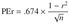
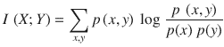
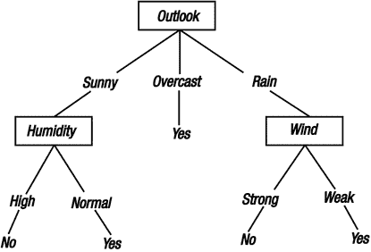
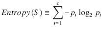
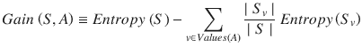
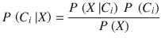
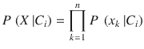
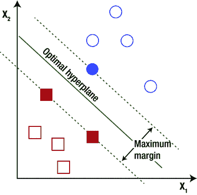

# 3.使用 Python 的监督学习

在这一章中，我将介绍机器学习的三个最重要的组成部分。

*   降维告诉我们如何从一组特征中选择最重要的特征。
*   分类说明如何在给定训练/示例数据集的帮助下，将数据归类到一组目标类别。
*   回归告诉我们如何将一个变量实现为一组独立变量的线性或非线性多项式。

## 使用 Python 进行降维

降维是数据分析的一个重要方面。数字和分类数据都需要它。调查或因子分析是降维最流行的应用之一。举个例子，假设一个组织想要找出哪些因素在影响或改变其运作中是最重要的。它听取组织中不同员工的意见，并根据调查数据进行因素分析，以得出一组较小的因素。

在投资银行业务中，不同的指数被计算为工具的加权平均值。因此，当指数走高时，预计指数中权重为正的工具也将走高，权重为负的工具将走低。交易者据此交易。通常，指数由大量的工具(超过十个)组成。在高频算法交易中，很难在几分之一秒内发送这么多订单。使用主成分分析，交易者认识到指数作为一个较小的工具集开始交易。奇异值分解是在主成分分析和因子分析中使用的流行算法。在这一章中，我将详细讨论它。在此之前，我将涵盖皮尔逊相关性，这是简单的使用。这就是为什么它是一种流行的降维方法。分类数据也需要降维。假设一个零售商想知道一个城市是否是销量的重要贡献者；这可以通过使用互信息来衡量，这也将在本章中讨论。

### 相关分析

相关性有不同的衡量标准。我将仅限于讨论皮尔逊相关性。对于两个变量 x 和 y，皮尔逊相关性如下:


r 的值将从-1 变化到+1。该公式清楚地表明，当 x 大于其平均值时，y 也较大，因此 r 值也较大。换句话说，如果 x 增加，那么 y 增加，然后 r 更大。所以，如果 r 更接近 1，就意味着 x 和 y 正相关。同样，如果 r 更接近-1，就意味着 x 和 y 负相关。同样，如果 r 更接近 0，这意味着 x 和 y 不相关。这里有一个计算 r 的简化公式:

![$$ \mathrm{r}=\frac{\mathrm{n}\left(\sum \mathrm{x}\mathrm{y}\right)-\left(\sum \mathrm{x}\right)\left(\sum \mathrm{y}\right)}{\sqrt{\left[\mathrm{n}\sum {\mathrm{x}}^2-{\left(\sum \mathrm{x}\right)}^2\right]}\left[\mathrm{n}\sum {\mathrm{y}}^2-{\left(\sum \mathrm{y}\right)}^2\right]} $$](A458833_1_En_3_Chapter_Equb.gif)

你可以很容易地使用相关性进行降维。假设 Y 是一个变量，是 n 个变量的加权和:`X1, X2, ... Xn`。你想把这组 X 减少到一个更小的集合。为此，您需要计算每个 X 对的相关系数。现在，如果 Xi 和 Xj 高度相关，那么你将研究 Y 与 Xi 和 Xj 的相关性。如果 Xi 的相关性大于 Xj，那么你从集合中移除 Xj，反之亦然。以下函数是使用相关性的删除功能的示例:

```py
from scipy.stats.stats import pearsonr

def drop_features(y_train,X_train,X,index):
        i1 = 0
        processed = 0
       while(1):
       flag = True
                for i in range(X_train.shape[1]):
       if i > processed :
              i1 = i1 + 1
                       corr = pearsonr(X_train[:,i], y_train)
               PEr= .674 * (1- corr[0]*corr[0])/ (len(X_train[:,i])**(1/2.0))
      if corr[0] < PEr:
      X_train = np.delete(X_train,i,1)
                                        index.append(X.columns[i1-1])
                                      processed = i - 1
                              flag = False
                      break
             if flag:
             break
       return X_train, index

```

该代码的实际用例在本章的最后给出。

现在的问题是，前一个相关的阈值应该是多少，比如说，X 和 Y 是相关的。一个常见的做法是假设如果 r > 0.5，说明变量是相关的，如果 r < 0.5, then it means no correlation. One big limitation of this approach is that it does not consider the length of the data. For example, a 0.5 correlation in a set of 20 data points should not have the same weight as a 0.5 correlation in a set of 10,000 data points. To overcome this problem, a probable error concept has been introduced, as shown here:



r 是相关系数，n 是样本量。

这里 r > 6PEr 意味着 X 和 Y 高度相关，如果 r < Per，这意味着 X 和 Y 是独立的。使用这种方法，您可以看到，当数据量很大时，即使 r = 0.1 也意味着高相关性。

相关性的一个有趣应用是电子商务网站上的产品推荐。如果您计算了相似用户对相同产品的共同评价的相关性，则推荐可以识别相似的用户。同样，您可以通过计算来自同一用户的共同评价的相关性来找到相似的产品。这种方法被称为协同过滤。

### 主成分分析

理论上，相关性适用于高斯分布的变量，换句话说，独立变量。对于其他场景，就要用主成分分析了。假设你要降维 N 个变量:`X1, X2, ... Xn`。让我们形成一个 N×N 维的矩阵，其中第 I 列代表观测值 Xi，假设所有变量都有 N 个观测值。现在，如果 k 个变量是冗余的，为了简单起见，你假设 k 列是相同的或者是彼此的线性组合。那么矩阵的秩将是 N-k，所以，这个矩阵的秩是自变量个数的度量，特征值表示那个变量的强弱。这个概念用于主成分分析和因子分析。为了使矩阵为正方形，选择协方差矩阵。奇异值分解用于寻找特征值。

设 Y 为大小为 p×q 的输入矩阵，其中 p 为数据行数，q 为参数数。

那么 q×q 协方差矩阵 Co 由下式给出:

Co=Y 和/(q-1)

它是一个对称矩阵，所以可以对角化如下:

co = udu〔t0〕t〔t1〕

`U`的每一列是一个特征向量，`D`是一个对角线矩阵，特征值λi 在对角线上按降序排列。特征向量被称为数据的主轴或主方向。数据在主轴上的投影称为主成分，也称为 PC 得分；这些可以被看作是新的、变化了的变量。第 j 个主成分由`YU`的第 j 列给出。新 PC 空间中第 I 个数据点的坐标由第 I 行`YU`给出。

奇异值分解算法用于找到`D`和`U`。以下代码是 Python 中因子分析的一个示例。

以下是输入数据:

<colgroup><col align="left"> <col align="left"> <col align="left"> <col align="left"> <col align="left"> <col align="left"></colgroup> 
| 政府政策的变化 | 竞争对手的战略决策 | 竞争 | 供应商关系 | 客户反馈 | 技术创新 |
| 非常同意 | 同意 | 同意 | 同意 | 有点同意 | 有点不同意 |
| 有点不同意 | 有点不同意 | 有点同意 | 不同意 | 不同意 | 同意 |
| 有点同意 | 有点同意 | 非常同意 | 同意 | 有点同意 | 非常同意 |
| 有点不同意 | 有点同意 | 同意 | 有点不同意 | 有点不同意 | 有点同意 |
| 有点不同意 | 同意 | 同意 | 有点同意 | 有点同意 | 同意 |
| 同意 | 有点不同意 | 有点同意 | 非常同意 | 有点同意 | 有点同意 |
| 同意 | 同意 | 非常同意 | 有点同意 | 同意 | 有点同意 |
| 有点不同意 | 同意 | 有点同意 | 同意 | 同意 | 有点同意 |
| 有点同意 | 有点同意 | 同意 | 同意 | 同意 | 有点同意 |
| 有点不同意 | 同意 | 非常同意 | 有点不同意 | 同意 | 有点不同意 |
| 有点同意 | 同意 | 有点不同意 | 非常同意 | 有点同意 | 不同意 |
| 有点不同意 | 有点不同意 | 有点同意 | 有点不同意 | 有点不同意 | 有点同意 |
| 有点同意 | 同意 | 有点同意 | 同意 | 有点同意 | 有点同意 |
| 有点不同意 | 同意 | 非常同意 | 有点不同意 | 有点同意 | 不同意 |
| 有点同意 | 有点不同意 | 非常同意 | 非常同意 | 非常同意 | 同意 |
| 有点同意 | 有点同意 | 同意 | 有点不同意 | 非常同意 | 不同意 |
| 有点不同意 | 同意 | 同意 | 有点不同意 | 同意 | 有点同意 |
| 有点同意 | 非常同意 | 有点同意 | 有点同意 | 同意 | 有点同意 |
| 非常同意 | 有点不同意 | 有点不同意 | 同意 | 有点同意 | 有点不同意 |
| 有点同意 | 有点不同意 | 同意 | 有点同意 | 非常同意 | 有点不同意 |
| 同意 | 有点同意 | 非常同意 | 有点不同意 | 同意 | 同意 |
| 有点同意 | 非常同意 | 有点同意 | 有点不同意 | 有点不同意 | 不同意 |
| 在运行代码之前，您必须为分类数据输入一个数值，例如:非常同意= 5，同意= 4，有点同意= 3。 |

```py
import pandas as pd
data = pd.read_csv('<input csvfile>)

from sklearn.decomposition import FactorAnalysis
factors = FactorAnalysis(n_components=6).fit(data)
print (factors.components)

from sklearn.decomposition import PCA
pcomponents = PCA(n_components=6).fit(data)
print(pcomponents.components)

```

### 交互信息

两个随机变量的互信息是两个变量之间相互依赖的一种度量。它也用作两个变量分布的相似性度量。较高的互信息值表明两个变量的分布相似。

T2】

假设一家零售商想要调查某个特定的城市是否是其销售量的决定因素。然后，零售商可以看到不同城市的销售量分布情况。如果所有城市的分布都相同，那么就销售量而言，某个特定的城市就不是一个重要的因素。为了计算两个概率分布之间的差异，这里应用了互信息。

以下是计算交互信息的示例 Python 代码:

```py
fromscipy.stats import chi2_contingency

defcalc_MI(x, y, bins):
c_xy = np.histogram2d(x, y, bins)[0]
g, p, dof, expected = chi2_contingency(c_xy, lambda_="log-likelihood")
mi = 0.5 * g / c_xy.sum()

return mi

```

## 使用 Python 进行分类

分类是机器学习的一个广为接受的例子。它有一组目标类和训练数据。每个训练数据由特定的目标类标记。分类模型由训练数据训练，并预测测试数据的目标类别。分类的一个常见应用是在信用卡或贷款审批流程中识别欺诈。它根据数据将申请者分类为欺诈或非欺诈。分类也广泛应用于图像识别。从一组图像中，如果你识别出一台计算机的图像，这是在对一台计算机的图像进行分类，而不是对一个计算机类的图像进行分类。

情感分析是文本分类的一个流行应用。假设一家航空公司想要分析其客户的文本反馈。然后根据情绪(正面/负面/中性)以及上下文(关于员工/时间/食物/价格)对每个反馈进行分类。一旦做到这一点，航空公司就可以很容易地发现该航空公司员工的实力，准时程度或成本效益，甚至是它的弱点。概括地说，有三种分类方法。

*   基于规则的方法:我将讨论决策树和随机森林算法。
*   概率方法:我将讨论朴素贝叶斯算法。
*   基于距离的方法:我将讨论支持向量机。

## 半监督学习

分类和回归是监督学习的类型。在这种类型的学习中，您有一组训练数据来训练您的模型。然后使用该模型预测测试数据。例如，假设您要根据情感对文本进行分类。有三种目标类别:阳性、阴性和中性。为了训练您的模型，您必须选择一些样本文本，并将其标记为正面、负面和中性。您可以使用这些训练数据来训练模型。一旦模型定型，就可以将模型应用于测试数据。例如，您可以使用朴素贝叶斯分类器进行文本分类，并尝试预测句子“食物很好”的情感在训练阶段，当单词 Food、is 和 good 分别呈现并存储在模型中时，程序将计算句子为肯定或否定或中性的概率，而在测试阶段，它将计算 Food、is 和 good 一起出现时的联合概率。相反，聚类是无监督学习的一个例子，其中没有可用的训练数据或目标类。程序一次性从数据中学习。也有半监督学习的例子。假设您将文本分类为积极和消极情绪，但您的训练数据只有积极情绪。非正的训练数据是未标记的。在这种情况下，作为第一步，假设所有未标记的数据都是否定的，对模型进行训练，并将训练好的模型应用于训练数据。在输出中，作为负值出现的数据应该标记为负值。最后，用新标记的数据训练您的模型。最近邻分类器也被认为是半监督学习。它有训练数据，但没有模型的训练阶段。

## 决策图表

决策树是一个规则树。树的每个级别代表一个参数，该级别的每个节点验证该级别参数的约束，并且每个分支指示父节点参数的可能值。图 [3-1](#Fig1) 显示了一个决策树的例子。



图 3-1

Example of decision tree for good weather

### 哪个属性最先出现？

决策树的一个重要方面是决定特征的顺序。基于熵的信息增益度量决定了它。

熵是系统随机性的一种度量。

T2】

比如对于任何一个像太阳从东方升起这样明显的事件，熵为零，P=1，log(p)=0。更多的熵意味着系统中更多的不确定性或随机性。

信息增益是根据该属性对示例进行划分所导致的熵的预期减少，是本例中使用的度量。

具体地，属性 A 相对于实例 S 的集合的信息增益 Gain(S，A)定义如下:



因此，具有较高信息增益的属性将出现在决策树的最前面。

```py
from sklearn.tree import DecisionTreeClassifier

df = pd.read_csv('csv file path', index_col=0)
y = df[target class column ]
X = df[ col1, col2 ..]

clf= DecisionTreeClassifier()
clf.fit(X,y)
clf.predict(X_test)

```

### 随机森林分类器

随机森林分类器是决策树的扩展，其中算法创建 N 个决策树，其中每个树具有随机选择的 M 个特征。现在，测试数据将被所有决策树分类，并被归类到目标类中，该目标类是大多数决策树的输出。

```py
from sklearn.ensemble import RandomForestClassifier

df = pd.read_csv('csv file path', index_col=0)

y = df[target class column ]
X = df[ col1, col2 ..]

clf=RandomForestClassifier(n_jobs=2,random_state=0)
clf.fit(X,y)
clf.predict(X_test)

```

## 朴素贝叶斯分类器

`X = (x1, x2, x3, ..., xn)`是一个`n`维的向量。贝叶斯分类器将每个`X`分配给集合{C1，C2，…，Cm，}的目标类之一。这种分配是基于`X`属于目标类 Ci 的概率来完成的。也就是说，`X`被赋给 Ci 类当且仅当 P(Ci |X) > P(Cj |X)对于所有 j 使得 1 ≤ j ≤ m.



一般来说，计算 P(X|Ci)的计算成本很高。如果 X 的每个分量 x <sub>k</sub> 可以具有 r 个值中的一个，则对于 m 个类中的每一个，有 r 个 <sup>n 个</sup>组合要考虑。为了简化计算，假设有条件的类独立性，这意味着对于每个类，假设属性是独立的。从这种假设发展而来的分类器被称为朴素贝叶斯分类器。假设允许你写下面的:



以下代码是数字数据的朴素贝叶斯分类的一个示例:

```py
#Import Library of Gaussian Naive Bayes model
from sklearn.naive_bayes import GaussianNB
import numpy as np

#assigning predictor and target variables
df = pd.read_csv('csv file path', index_col=0)
y = df[target class column ]
X = df[ col1, col2 ..]

#Create a Gaussian Classifier
model = GaussianNB()

# Train the model using the training sets
model.fit(X, y)

#Predict Output
print model.predict([input array])

```

Note

在“情感分析”一节中，您将看到朴素贝叶斯分类器的另一个例子。

## 支持向量机

如果看图 [3-2](#Fig2) 就很容易理解，圆和正方形的点在二维(x1，x2)上是线性可分的。但是它们在维度 x1 或 x2 上都不是线性可分的。支持向量机算法基于这一理论。它增加了数据的维度，直到点是线性可分的。一旦完成，你必须找到两个平行的超平面来分离数据。这个平面被称为边缘。该算法选择边距的方式是使它们之间的距离最大。这就是为什么它是最大的保证金。位于这两个边缘中间或它们之间距离相等的平面被称为最优超平面，用于对测试数据进行分类(见图 [3-2](#Fig2) )。分离器也可以是非线性的。



图 3-2

Support vector machine

以下代码是使用 Python 进行支持向量机分类的示例:

```py
from sklearn import svm
df = pd.read_csv('csv file path', index_col=0)
y = df[target class column ]
X = df[ col1, col2 ..]

model.fit(X, y)
model.score(X, y)

print model.predict(x_test)

```

## 最近邻分类器

最近邻分类器是简单的基于距离的分类器。它根据训练数据计算测试数据的距离，并根据目标类对距离进行分组。与测试实例具有最小平均距离的目标类被选为测试数据的类。这里显示了一个 Python 示例:

```py
def Distance(point1, point2, length):
      distance = 0
      for x in range(length):
            distance += pow((point1[x] -point2[x]), 2)
      return math.sqrt(distance)
def getClosePoints(trainingData, testData, k):
      distances = []
      length = len(testInstance)-1
      for x in range(len(trainingData)):
            dist = Distance(testData, trainingDatat[x], length)
            distances.append((trainingData[x], dist))
      distances.sort(key=operator.itemgetter(1))
      close= []
      for x in range(k):
            close.append(distances[x][0])
      return close

trainData = [[3,3,3,, 'A'], [5,5,5,, 'B']]
testData = [7,7,7]
k = 1
neighbors = getClosePoints(trainData, testData, 1)
print(neighbors)

```

## 情感分析

情感分析是文本分类的一个有趣的应用。例如，假设一家航空公司的客户想要分析其客户反馈。它根据情绪(积极/消极)和方面(食物/员工/准时)对反馈进行分类。在这之后，它可以很容易地了解自己在业务上的优势(具有最大正反馈的方面)和劣势(具有最大负反馈的方面)。航空公司也可以将这一结果与其竞争对手进行比较。与竞争对手进行比较的一个有趣的优点是，它抵消了模型准确性的影响，因为相同的准确性适用于所有竞争对手。使用 textblob 库在 Python 中实现这一点很简单，如下所示:

```py
from textblob.classifiers import NaiveBayesClassifier

train = [('I love this sandwich.', 'pos'),  ('this is an amazing place!', 'pos'),('I feel very good about these beers.', 'pos'),('this is my best work.', 'pos'),("what an awesome view", 'pos'),('I do not like this restaurant', 'neg'),('I am tired of this stuff.', 'neg'),("I can't deal with this", 'neg'),('he is my sworn enemy!', 'neg'),('my boss is horrible.', 'neg')]

cl = NaiveBayesClassifier(train)
print (cl.classify("This is an amazing library!"))

output :  pos

from textblob.classifiers import NaiveBayesClassifier

train = [('Air India did a poor job of queue management both times.', 'staff service'),  (“The 'cleaning' by flight attendants involved regularly spraying air freshener in the lavatories.", 'staff'),('The food tasted decent.', 'food'),('Flew Air India direct from New York to Delhi round trip.', 'route'),('Colombo to Moscow via Delhi.', 'route'),('Flew Birmingham to Delhi with Air India.', 'route'),('Without toilet, food or anything!', 'food'),('Cabin crew announcements included a sincere apology for the delay.', 'cabin flown')]

cl = NaiveBayesClassifier(train)

tests = ['Food is good.']
for c in tests:
      printcl.classify(c)

Output : food

```

textblob 库还支持一个随机森林分类器，它最适用于用正规英语书写的文本，比如正式的字母。对于通常不使用正确语法编写的文本，如客户反馈，朴素贝叶斯更好。朴素贝叶斯在实时分析方面还有另一个优势。您可以更新模型，而不会丢失之前的训练。

## 图像识别

图像识别是图像分类的一个常见例子。通过应用 opencv 库，在 Python 中很容易使用。下面是示例代码:

```py
faceCascade=cv2.CascadeClassifier(cascPath)
image = cv2.imread(imagePath)
gray = cv2.cvtColor(image, cv2.COLOR_BGR2GRAY)

faces = faceCascade.detectMultiScale(
    gray,
    scaleFactor=1.1,
    minNeighbors=5,
    minSize=(30, 30),
    flags = cv2.cv.CV_HAAR_SCALE_IMAGE
)

print"Found {0} faces!".format(len(faces))

```

## 用 Python 回归

回归将变量实现为一组独立变量的线性或非线性多项式。

这里有一个有趣的用例:一个产品实现利润最大化的销售价格是多少？这对于任何商家来说都是一个价值百万的问题。这个问题并不简单。销售价格的最大化可能不会导致利润的最大化，因为提高销售价格有时会降低销售量，从而降低总利润。因此，存在一个最优销售价格值，使利润最大化。

有 N 个交易记录，具有 M 个特征，称为 F1，F2，...Fm(销售价格、购买价格、现金返还、SKU、订单日期等)。你必须找到对商家利润有影响的 K(K

您可以使用以下公式计算商户的利润:

利润=(SP-TCB–BP)* SV(1)

对于此公式，变量如下:

*   SP =销售价格
*   TCB =总返现
*   BP =购买价格
*   销售数量

现在使用回归，您可以如下实现 SV:

SV = a + b*SP + c*TCB + d*BP

现在，您可以将利润表示为 SP、TCB 和 BP 的函数，并使用数学优化。通过约束所有参数值，您可以获得使利润最大化的最佳参数值。

这是一个有趣的回归用例。在许多情况下，一个变量必须实现为其他变量的线性或多项式函数。

### 最小平方估计

最小二乘估计是最简单也是最古老的回归方法。它也被称为曲线拟合方法。普通最小二乘(OLS)回归是最常用的技术，由 Carl Friedrich Gauss 和 Adrien-Marie Legendre 在 18 世纪发明。下面是普通最小二乘估计中系数计算的一个推导:


以下代码是 OLS 回归的一个简单示例:

```py
fromscipyimport stats
df = pd.read_csv('csv file path', index_col=0)

y = df[target column ]
X = df[ col1, col2 ..]

X=sm.add_constant(X)

slope, intercept, r_value, p_value, std_err = stats.linregress(X,y)

```

### 逻辑回归

逻辑回归是计算事件概率的回归的一个有趣的应用。它引入了一个中间变量，即线性变量的线性回归。然后，它通过逻辑函数传递中间变量，逻辑函数将中间变量从零映射到一。该变量被视为事件的概率。

以下代码是对数字数据进行逻辑回归的示例:

```py
import pandas as pd
import statsmodels.api as sm
df = pd.read_csv('csv file path', index_col=0)
y = df[target column ]
X = df[ col1, col2 ..]
X=sm.add_constant(X)
logit=sm.Logit(y,X)
result=logit.fit()
result.summary()

```

## 分类和回归

分类和回归可以应用于同一问题。例如，当银行批准信用卡或贷款时，它会使用回归方法基于多个参数计算候选人的信用评分，然后设置阈值。信用分数高于阈值的候选人被分类为潜在的非欺诈，其余的被认为是潜在的欺诈。同样，通过对回归结果应用阈值，可以使用回归来解决任何二元分类问题。在第 [4](4.html) 章中，我详细讨论了如何从任意参数的分布中选择一个阈值。类似地，一些二元分类可以用来代替逻辑回归。例如，假设一个电子商务网站想要预测一个采购订单被转换成成功发票的机会。该网站可以很容易地做到这一点使用逻辑回归。朴素贝叶斯分类器可以直接应用于该问题，因为它在将采购订单分类为成功或不成功类别时计算概率。随机森林算法也可以用在这个问题上。在这种情况下，在 N 棵决策树中，如果 M 棵决策树说采购订单将会成功，那么 M/N 将是采购订单成功的概率。

## 有意使模型过度拟合或欠拟合

有时你需要故意高估或低估。在拍卖中，当你从买方预测时，如果你的出价比原来的低一点，那总是好的。同样，在卖方，你最好把价格定得比原价高一点。有两种方法可以做到这一点。在回归中，当您使用相关性选择要素时，过度预测会有意丢弃一些负相关的变量。类似地，预测不足会丢弃一些正相关的变量。还有另一种处理方式。当你在预测值的时候，你可以预测预测中的误差。要过预测，当看到预测误差为正时，将预测值减少误差量。同样，要进行过度预测，当误差为正时，将预测值增加误差量。

分类中的另一个问题是有偏差的训练数据。假设您有两个目标类，A 和 b。大多数(比如 90%)训练数据是 A 类。因此，当您使用此数据训练模型时，您的所有预测都将成为 A 类。一种解决方案是对训练数据进行有偏采样。有意从培训中删除 A 类示例。另一种方法可以用于二元分类。由于 B 类在样本的预测概率中是少数，所以在 B 类中它将总是小于 0.5。然后计算所有点进入 B 类的平均概率，对于任意一点，如果 B 类概率大于平均概率，则标记为 B 类，否则标记为 a 类。

以下代码是优化分类条件的一个示例:

```py
y_test_increasing, predicted_increasing = predict(d1, True, False)
y_test_decreasing, predicted_decreasing = predict(d2, False, False)

prob_increasing = predicted_increasing[:,1]
increasing_mean = prob_increasing.mean()
increasing_std = prob_increasing.std()
prob_decreasing = predicted_decreasing[:,0]
decreasing_mean = prob_decreasing.mean()
decreasing_std = prob_decreasing.std()
ifi> 0:
    mean_std_inc = (mean_std_inc + increasing_std)/2
    mean_std_dec = (mean_std_dec + decreasing_std)/2
else:

    mean_std_inc = increasing_std
    mean_std_dec = decreasing_std

for j in range(len(y_test_decreasing)-1):
                   ac_status = y_test_increasing[j] + y_test_decreasing[j]
                   pr_status = 0
                   if True:
                          inc = (prob_increasing[j] - increasing_mean + mean_std_inc)
                          dec = (prob_decreasing[j] - decreasing_mean + mean_std_dec)
                          ifinc> 0 or dec> 0:
                                ifinc>dec:
                                       pr_status = 1
                                else:
                                       pr_status = -1
                          else:
                                pr_status = 0

```

## 处理分类数据

对于类似算法的支持，向量或回归输入数据必须是数字。因此，如果您正在处理分类数据，您需要转换成数字数据。一种转换策略是使用序数作为数字分数。更复杂的方法是使用目标变量的期望值。这对回归有好处。

```py
for col in X.columns:
       avgs = df.groupby(col, as_index=False)['floor'].aggregate(np.mean)
       fori,row in avgs.iterrows():
       k = row[col]
                               v = row['floor']
       X.loc[X[col] == k, col] = v

```

对于逻辑回归，您可以使用该分类值的目标变量的预期概率。

```py
for col in X.columns:
       if str(col) != 'success':
             if str(col) not in index:
                   feature_prob = X.groupby(col).size().div(len(df))
                   cond_prob = X.groupby(['success', str(col)]).size().div(len(df)).div(feature_prob, axis=0, level=str(col)).reset_index(name="Probability")
                   cond_prob = cond_prob[cond_prob.success != '0']
                   cond_prob.drop("success",inplace=True, axis=1)
                   cond_prob['feature_value'] = cond_prob[str(col)].apply(str).as_matrix()
                   cond_prob.drop(str(col),inplace=True, axis=1)
                   for i, row in cond_prob.iterrows():
                              k = row["feature_value"]
                              v = row["Probability"]
                              X.loc[X[col] == k, col] = v
       else:
             X.drop(str(col),inplace=True, axis=1)

```

以下示例显示了如何处理分类数据以及如何使用相关性来选择特征。下面是数据预处理的完整代码。此代码示例的数据也可以在 Apress 网站上在线获得。

```py
def process_real_time_data(time_limit):

       df = pd.read_json(json.loads(<input>))
       df.replace('^\s+', '', regex=True, inplace=True) #front
       df.replace('\s+$', '', regex=True, inplace=True) #end

       time_limit = df['server_time'].max()

       df['floor'] = pd.to_numeric(df['floor'], errors="ignore")
       df['client_time'] = pd.to_numeric(df['client_time'], errors="ignore")
       df['client_time'] = df.apply(lambda row: get_hour(row.client_time), axis=1)

       y = df['floor']
       X = df[['ip','size','domain','client_time','device','ad_position','client_size','root']]
       X_back = df[['ip','size','domain','client_time','device','ad_position','client_size','root']]

       for col in X.columns:
             avgs = df.groupby(col, as_index=False)['floor'].aggregate(np.mean)
             for index,row in avgs.iterrows():
                    k = row[col]
                    v = row['floor']
                    X.loc[X[col] == k, col] = v

       X.drop('ip', inplace=True, axis=1)
       X_back.drop('ip', inplace=True, axis=1)

       X_train, X_test, y_train, y_test = cross_validation.train_test_split(X, y, test_size= 0, random_state=42)

       X_train = X_train.astype(float)
       y_train = y_train.astype(float)

       X_train = np.log(X_train + 1)
       y_train = np.log(y_train + 1)

       X_train = X_train.as_matrix()
       y_train = y_train.as_matrix()

       index = []
       i1 = 0
       processed = 0
       while(1):
             flag = True
             for i in range(X_train.shape[1]):
                    if i > processed :
       #print(i1,X_train.shape[1],X.columns[i1])
                          i1 = i1 + 1
                          corr = pearsonr(X_train[:,i], y_train)
                          PEr= .674 * (1- corr[0]*corr[0])/ (len(X_train[:,i])**(1/2.0))
                          if corr[0] < PEr:
                                 X_train = np.delete(X_train,i,1)

                                 index.append(X.columns[i1-1])
                                 processed = i - 1
                                 flag = False
                                 break
              if flag:
                    break

           return y_train, X_train, y, X_back, X, time_limit, index

```