# 四、无监督学习：聚类

在第 [3](3.html) 章中，我们讨论了如何使用训练数据根据情绪(积极、消极、中立)以及上下文对客户评论进行分类。例如，在航空领域，上下文可以是准时、食物、舒适、娱乐等等。利用这种分析，企业主可以确定他的企业需要集中精力的领域。例如，如果他观察到最高比例的负面评论是关于食物的，那么他优先考虑的将是提供给顾客的食物的质量。然而，在有些情况下，企业所有者不确定上下文。也有训练数据不可用的情况。此外，参照系会随着时间而变化。分类算法不能应用于目标类别未知的情况。在这种情况下会使用聚类算法。聚类的一个常规应用是在制酒工业中发现的，其中每个聚类代表一个品牌的酒，并且酒根据它们在酒中的成分比例被聚类。在第 [3](3.html) 章中，你学到了分类可以用来识别一种类型的图像，但是在某些情况下，一幅图像有多种形状，需要一种算法来分离这些形状。聚类算法用在这种用例中。

聚类根据相似性或距离度量将对象分类成组。这是无监督学习的一个例子。聚类和分类的主要区别在于后者有明确定义的目标类。目标类的特征由训练数据和从中学习的模型来定义。这就是分类在本质上被监督的原因。相反，聚类试图根据数据及其相似性或距离来定义有意义的类。图 [4-1](#Fig1) 说明了一个文档聚类过程。

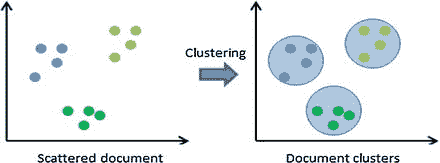

图 4-1

Document clustering

## k 均值聚类

让我们假设一个零售分销商有一个在线系统，在那里当地代理手动输入交易信息。他们必须填写的字段之一是城市。但是因为这个数据输入过程是手工的，人们通常会犯很多拼写错误。例如，人们输入 Dehi、Dehli、Delly 等等，而不是 Delhi。您可以尝试使用群集来解决这个问题，因为群集的数量是已知的；换句话说，零售商知道代理商在多少个城市开展业务。这是 K 均值聚类的一个例子。

K-means 算法有两个输入。第一个是数据 X，它是一组 N 个向量，第二个是 K，它表示需要创建的簇的数量。输出是每个聚类中的一组 K 个质心以及 X 中每个向量的标签，该标签指示分配给相应聚类的点。一个聚类中的所有点在距离上比任何其他质心都更接近它们的质心。K 个簇 C <sub>k</sub> 和 K 个质心μ <sub>k</sub> 的条件可以表示为:相对于 C <sub>k</sub> ，μ <sub>k</sub> 最小化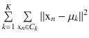。

然而，这个优化问题无法在多项式时间内解决。但是劳埃德提出了一种迭代方法作为解决方案。它由两步组成，迭代直到程序收敛到解。

1.  它有一组 K 个质心，每个点被分配到一个唯一的簇或质心，其中所关心的质心到该特定点的距离是最小的。
2.  It recalculates the centroid of each cluster by using the following formula:

    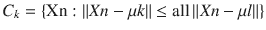

    (1)

    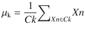

    (2)  

两步过程继续进行，直到不再重新排列聚类点。该算法的收敛性是有保证的，但它可能会收敛到局部极小值。

以下是在 Python 中执行 K-means 聚类的劳埃德算法的简单实现:

```py
import random
def ED(source, target):
if source == "":
return len(target)
if target == "":
return len(source)
if source[-1] == target[-1]:
cost = 0
else:
cost = 1

res = min([ED(source[:-1], target)+1,
ED(source, target[:-1])+1,
ED(source[:-1], target[:-1]) + cost])
return res

def find_centre(x, X, mu):
min = 100
cent = 0
for c in mu:
dist = ED(x, X[c])
if dist< min:
min = dist
cent = c
return cent

def cluster_arrange(X, cent):
clusters  = {}
for x in X:
bestcent = find_centre(x, X, cent)
try:
clusters[bestcent].append(x)
exceptKeyError:
clusters[bestcent] = [x]
return clusters

def rearrange_centers(cent, clusters):
newcent = []
keys = sorted(clusters.keys())
for k in keys:
newcent.append(k)
return newcent

def has_converged(cent, oldcent):
return sorted(cent) == sorted(oldcent)

def locate_centers(X, K):
oldcent = random.sample(range(0,5), K)
cent = random.sample(range(0,5), K)
while not has_converged(cent, oldcent):
oldcent = cent
        # Assign all points in X to clusters
clusters = cluster_arrange(X, cent)
        # Reevaluate centers
cent = rearrange_centers(oldcent, clusters)
return(cent, clusters)

X = ['Delhi','Dehli', 'Delli','Kolkata','Kalkata','Kalkota']

print(locate_centers(X,2))

```

然而，K-均值聚类有一个局限性。例如，假设您的所有数据点都位于印度东部。对于 K=4 的聚类，第一步是在德里、孟买、钦奈和加尔各答随机选择一个中心。所有的点都位于印度东部，所以所有的点都离加尔各答最近，并且总是被分配给加尔各答。所以程序会一步到位的收敛。为了避免这个问题，算法运行多次并取平均值。程序员可以在第一步使用各种技巧来初始化质心。

## 选择 K:肘法

在某些情况下，您必须确定 K 均值聚类中的 K。为此，您必须使用 elbow 方法，该方法使用方差的百分比作为依赖于分类数的变量。最初，选择几个集群。然后添加另一个集群，这并没有使数据的建模变得更好。在这一点上选择簇的数量，这是肘标准。这个“肘”不能总是被明确地识别。方差百分比是指单个聚类的组间方差与总方差之比。假设在前面的例子中，零售商有四个城市:德里、加尔各答、孟买和钦奈。程序员不知道这一点，所以他用 K=2 到 K=9 进行聚类，并绘制方差百分比。他将得到一条肘曲线，清楚地表明 K=4 是 K 的正确数值。

## 距离或相似性度量

距离或相似性的度量是聚类的关键因素之一。在这一节中，我将描述不同种类的距离和相似性度量。在此之前，我将解释距离在这里的实际含义。

### 性能

距离是满足以下属性的度量:

*   dist(x，y) = 0 当且仅当 x=y。
*   当 x ≠ y 时 dist(x，y) > 0。
*   距离(x，y) =距离(x，y)。
*   对于所有 x、y 和 z，dist(x，y) + dist(y，z) >= d(z，x)

### 一般距离和欧几里德距离

点 p 和 q 之间的距离是它们之间的几何线的长度:(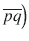)。这就是所谓的欧几里德距离。

根据[笛卡尔坐标](https://en.wikipedia.org/wiki/Cartesian_coordinates%23Cartesian%20coordinates)，如果 p = (p <sub>1</sub> ，p <sub>2</sub> ，…，p <sub>n</sub> 和 q = (q <sub>1</sub> ，q <sub>2</sub> ，…，q <sub>n</sub> 是[欧氏 n-空间](https://en.wikipedia.org/wiki/Euclidean_space%23Euclidean%20space)中的两点，那么从 q 到 p 或者从 p 到 q 的距离(d)就是从[勾股定理推导出来的](https://en.wikipedia.org/wiki/Pythagorean_theorem%23Pythagorean%20theorem)

[欧几里德](https://en.wikipedia.org/wiki/Euclidean_vector%23Euclidean%20vector)向量是欧几里德 n 空间中一个点的位置。矢量的大小是一种度量。其长度由以下公式计算:

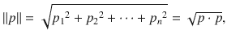

矢量有方向和距离。两点 p 和 q 之间的距离可能有一个方向，因此可以用另一个向量来表示，如下所示:

q–p =(q<sub>1</sub>–p<sub>1</sub>，q<sub>2</sub>–p<sub>2</sub>，…。，q<sub>n</sub>–p<sub>n</sub>

p 和 q 之间的欧几里得距离就是这个距离(或位移)向量的欧几里得长度。

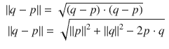T2】

一维:

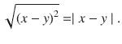

在二维空间中:

在[欧几里得平面](https://en.wikipedia.org/wiki/Euclidean_plane%23Euclidean%20plane)中，如果 p = (p <sub>1</sub> ，p <sub>2</sub> ，q = (q <sub>1</sub> ，q <sub>2</sub> ，则距离由下式给出:

d(p，q)=√1–p<sub>1</sub>)^ 2+(q<sub>2</sub>–p<sub>2</sub>^ 2

或者，根据等式，如果 p 点的[极坐标](https://en.wikipedia.org/wiki/Polar_coordinates%23Polar%20coordinates)为(r <sub>1</sub> ，θ <sub>1</sub> ，q 点的[极坐标为(r <sub>2</sub> ，θ <sub>2</sub> ，则两点之间的距离如下:](https://en.wikipedia.org/wiki/Polar_coordinates%23Polar%20coordinates)

r<sub>1</sub>^ 2+r<sub>2</sub>^ 2–2r<sub>1<sub>2</sub>cos(θ<sub>1</sub>—θ</sub>

在 n 维中:

在一般情况下，距离如下:

D <sup>2</sup> (p，q)=(p<sub>1</sub>–q<sub>1</sub>)<sup>2</sup>+(p<sub>2</sub>–q<sub>2</sub>)<sup>2</sup>+……+(p<sub>I</sub>–q<sub>I</sub>)<sup>2</sup>+……+(p<sub>n</sub>–q

在第 [3](3.html) 章，你会在最近邻分类器例子中找到欧几里德距离的例子。

### 平方欧几里德距离

标准的欧几里得距离可以被平方，以将逐渐增大的权重放在相距较远的物体上。在这种情况下，方程式如下:

d <sup>2</sup> (p，q)=(p<sub>1</sub>–q<sub>1</sub>)<sup>2</sup>+(p<sub>2</sub>–q<sub>2</sub>)<sup>2</sup>+……+(p<sub>I</sub>–q<sub>I</sub>)<sup>2</sup>+……+(p<sub>n</sub>–q

平方欧几里得距离不是度量，因为它不满足[三角形不等式](https://en.wikipedia.org/wiki/Triangle_inequality%23Triangle%20inequality)。然而，它经常用于仅比较距离的优化问题。

### 字符串之间的距离-编辑距离

编辑距离是两个字符串之间不相似性的度量。它计算使两个字符串相同所需的最少运算次数。编辑距离在自然语言处理中得到应用，其中自动拼写纠正可以指示对拼写错误的单词的候选纠正。编辑距离有两种类型。

*   Levenshtein 编辑距离
*   Needleman 编辑距离

#### 莱文斯坦距离

两个单词之间的 Levenshtein 距离是将一个单词变为另一个单词所需的最少插入、删除或替换次数。1965 年，弗拉基米尔·莱文斯坦考虑了这个距离。

Levenshtein 距离也称为编辑距离，尽管这也可能表示一个更大的距离度量家族。它附属于成对的字符串比对。

例如，加尔各答和加尔各答之间的 Levenshtein 距离是 5，因为以下五个编辑会将一个更改为另一个:

*   加尔各答→卡尔库塔(用 C 代替 K)
*   卡尔卡塔→科尔卡塔(用 a 代替 o)
*   科尔库塔→科尔库塔(用 c 代替 k)
*   Kolkutta → Kolkatta(用 u 代替 a)
*   加尔各答→加尔各答(删除 t)

当字符串相同时，Levenshtein 距离有几个简单的上限，即较大字符串的长度，下限为零。K-均值聚类代码中给出了莱文斯坦距离的代码示例。

#### needle man-Wunsch 算法

needle man–Wunsch 算法在生物信息学中用于比对蛋白质或核苷酸序列。这是比较生物序列的动态编程的第一个应用。它使用动态编程来工作。首先，它创建了一个矩阵，其中的行和列是字母。矩阵的每个单元是该行和列中相应字母表的相似性得分。分数有三种类型:匹配、不匹配或插入或删除匹配。一旦矩阵被填充，该算法从右下角的单元到左上角的单元进行回溯操作，并找到邻居得分距离最小的路径。回溯路径得分的总和就是两个字符串的 needle man-Wunsch 距离。

Pyopa 是一个 Python 模块，它提供了两个字符串之间现成的 needle man-Wunsch 距离。

```py
import pyopa
data = {'gap_open': -20.56,
        'gap_ext': -3.37,
        'pam_distance': 150.87,
        'scores': [[10.0]],
        'column_order': 'A',
        'threshold': 50.0}

env = pyopa.create_environment(**data)

s1 = pyopa.Sequence('AAA')
s2 = pyopa.Sequence('TTT')
print(pyopa.align_double(s1, s1, env))
print(env.estimate_pam(aligned_strings[0], aligned_strings[1]))

```

虽然 Levenshtein 实现简单，计算开销较小，但如果要在字符串匹配中引入一个缺口(例如新德里和 New Delhi)，那么 Needleman-Wunsch 算法是更好的选择。

## 文档语境中的相似性

文档之间的相似性度量指示两个文档的相同程度。通常，相似性度量被限制在[-1，1]或[0，1]的范围内，其中相似性分数为 1 表示最大相似性。

### 相似性的类型

为了度量相似性，文档被实现为不包括停用词的术语向量。假设 A 和 B 是代表两个文档的向量。在这种情况下，不同的相似性度量如下所示:

*   骰子骰子系数由下式表示:sim(q，d <sub>j</sub> ) = D(A，B) = 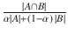还有，![$$ \alpha \in \left[0,1\right] $$](A458833_1_En_4_Chapter_IEq4.gif)并设
*   重叠重叠系数的计算如下:Sim(q，d <sub>j</sub> ) = O(A，B) = 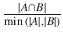重叠系数是使用最大值运算符而不是最小值来计算的。
*   JAC card JAC card 系数由下式给出:Sim(q，d <sub>j</sub> ) = J(A，B)=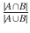JAC card 度量表示相关程度。
*   余弦两个向量之间的夹角的余弦由下式给出:Sim(q，d <sub>j</sub> ) = C(A，B) = 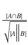

距离和相似度是两个相反的度量。例如，数值数据相关性是一种相似性度量，欧几里德距离是一种距离度量。通常，相似性度量的值被限制在 0 和 1 之间，但是距离没有这样的上限。相似度可以是负数，但是根据定义，距离不能是负数。聚类算法与该领域开始时几乎相同，但研究人员不断为各种应用找到新的距离度量。

## 什么是层次聚类？

分层聚类是聚类数据对象的一种迭代方法。有两种类型。

*   凝聚层次算法，或自下而上的方法
*   分裂的分层算法，或自上而下的方法

### 自下而上的方法

自底向上的聚类方法称为凝聚层次聚类。在这种方法中，每个输入对象都被视为一个单独的集群。在每次迭代中，算法将两个最相似的聚类合并成一个聚类。继续该操作，直到所有的集群合并成单个集群。算法的复杂度是 O(n^3).

在算法中，一组输入对象，I = {I <sub>1</sub> ，I <sub>2</sub> ，…。，I <sub>n</sub> }，给出。一组有序三元组为< D，K，S >，其中 D 为阈值距离，K 为聚类数，S 为聚类集。

该算法的一些变体可能允许具有相同距离的多个聚类被合并到单次迭代中。

#### 算法

输入:I={I <sub>1</sub> ，I <sub>2</sub> ，…。，我 <sub>n</sub> }

输出:O

```py
fori = 1 to n do
        Ci ← {Ii};

end for

D ← 0;
K ← n;
S ← {C1,....., Cn};
O ← <d, k, S>;

repeat

        Dist ← CalcultedMinimumDistance(S);
        D ← ∞;
        Fori = 1 to K–1 do
                Forj = i+1 to Kdo
                        ifDist(i, j)< Dthen
                                D← Dist(i, j);
                                u ← i;
                                v ← j;
                        end if
                end for
        end for
        K ← K-1;
        Cnew ← Cu ∪Cv;
        S ← S∪ Cnew –Cu – Cv;
        O ← O∪<D, K, S>
Until K = 1;

```

本章后面给出了一个层次聚类的 Python 例子。

### 聚类之间的距离

在层次聚类中，计算两个聚类之间的距离是关键的一步。有三种方法来计算这个。

*   单一连锁法
*   完全连锁法
*   平均连锁法

#### 单一连锁法

在单链接方法中，两个聚类之间的距离是两个聚类中对象对之间的所有距离的最小距离。因为距离是最小的，所以将有一对物体在两个集群之间的距离小于相等的距离。因此，单一链接方法可以给出如下:

Dist(C <sub>i</sub> ，C <sub>j</sub> ) =最小距离(X，Y)

X€C <sub>i</sub> ，Y€C <sub>j</sub>

#### 完全连锁法

在完全链接方法中，两个聚类之间的距离是两个聚类中对象对之间的所有距离的最大距离。距离是最大值，因此所有距离对都小于等于两个聚类之间的距离。因此，完整的链接方法可以由下面给出:

Dist(C <sub>i</sub> ，C <sub>j</sub> ) =最大距离(X，Y)

X€C <sub>i</sub> ，Y€C <sub>j</sub>

#### 平均连锁法

平均联动法是前两种联动法的折中。它避免了大型或紧凑集群的极端情况。簇 C <sub>i</sub> 和 C <sub>j</sub> 之间的距离定义如下:


| C <sub>k</sub> |是簇 C 中数据对象的数量 <sub>k</sub> 。

质心链接方法类似于平均链接方法，但是这里两个簇之间的距离实际上是质心之间的距离。群集 C <sub>i</sub> 的质心定义如下:

X <sub>c</sub> = (c <sub>1</sub> ，…。，c <sub>m</sub> ，同

c<sub>j</sub>= 1/m′x<sub>kj</sub>，

X <sub>kj</sub> 是簇 C <sub>i</sub> 中第 k 个数据对象的第 j 个维度。

### 自上而下的方法

自上而下的聚类方法也称为分裂层次聚类。这与自底向上的集群相反。它从包含所有输入对象的单个集群开始。每次迭代后，它将聚类分成两个具有最大距离的部分。

#### 算法

输入:I = {I1，I2，…，In}

输出:O

```py
D ← ∞;
K ← 1;
S ← {I1,I2 , ... , In};
O ← <D, K, S >;

repeat

        X ← containing two data objects with the longest distance dist;
        Y ← ∅;
        S ← S – X;
        Xi ← data object in A with maximum − D(Xi, X);
        X ← X − {Xi};
        Y ← Y ∪ {Xi};
        repeat
                forall data object Xj in Xdo
                        e(j) ← − D(Xj, X) − − D(Xj, Y);

                end for
                if∃e(j) > 0 then
                        Xk ← data object in X with maximum e(j);
                        X ← X − {Xk};
                        Y ← Y ∪ {Xk};
                        split ← TRUTH;
                else
                        split← FALSE;
                end if
        untilsplit == FALSE;
        D ← dist;
        K ← K+1;
        S ← S∪ X ∪ Y
        O ← 0 ∪ <D, K, S>;
Until  K = n;

```

系统树图是任何层次聚类的输出。图 [4-2](#Fig2) 展示了一个树状图。

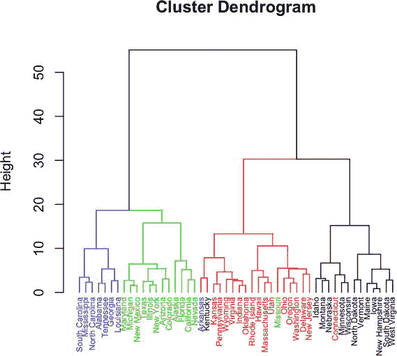

图 4-2

A dendrogram

要从树状图中创建一个聚类，您需要一个距离或相似性阈值。一个简单的方法是绘制距离或相似性的分布，并找到曲线的拐点。对于高斯分布数据，拐点位于 x = mean + n*std，x = mean–n * STD，如图 [4-3](#Fig3) 所示。

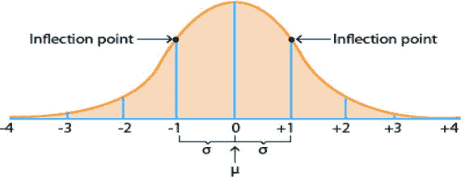

图 4-3

The inflection point

以下代码使用 Python 创建了一个分层聚类:

```py
From numpy import *
class cluster_node:
def \ __init__(self,vec1,left1=None,right1=None,distance1=0.0,id1=None,count1=1):
self.left1=left1
self.right1=right1
self.vec1=vec1
        self.id1=id1
self.distance1=distance1
self.count1=count1 #only used for weighted average
       def L2dist(v1,v2):
             return sqrt(sum((v1-v2)**2))
       def hcluster(features1,distanc1e=L2dist):
             #cluster the rows of the "features" matrix
             distances1={}
             currentclustid1=-1
             # clusters are initially just the individual rows
             clust1=[cluster_node(array(features1[i1]),id1=i1) for i1 in range(len(features1))]
             while len(clust1)>1:
                   lowestpair1=(0,1)
       closest1=distance(clust1[0].vec1,clust1[1].vec1)
                   # loop through every pair looking for the smallest distance
                   for i1 in range(len(clust1)):
                          for j1 in range(i+1,len(clust)):
                                # distances is the cache of distance calculations
                                if (clust1[i1].id1,clust1[j1].id1) not in distances1:
                     distances[(clust1[i1].id1,clust1[j1].id1)]=\
       distance1(clust1[i1].vec1,clust1[j1].vec1)
       d1=distances1[(clust1[i1].id1,clust1[j1].id1)]
                                 if d1< closest1:
                    closest1=d1
                    lowestpair1=(i1,j1)
                    # calculate the average of the two clusters
       mergevec1=[(clust1[lowestpair1[10]].vec1[i1]\
       +clust1[lowestpair1[1]].vec1[i1])/2.0 \
                    For i in range(len(clust1[0].vec1))]
                    # create the new cluster
                    newcluster1=cluster_node1(array(mergevec1),\
                                 left1=clust1[lowestpair1[0]],\
right1=clust1[lowestpair1[1]],\
distance1=closes1t,id1=currentclustid1)
                    # cluster ids that weren't in the original set are negative
                    currentclustid1-=1
                    delclust1[lowestpair1[1]]
                    delclust1[lowestpair1[0]]
                    clust1.append(newcluster1)
             return clust1[0]

```

前面的代码将创建树形图。使用某个阈值距离从该树突图创建聚类由下式给出:

```py
def extract_clusters(clust1, dist1):
       # extract list of sub-tree clusters from h-cluster tree with distance <dist
       clusters1 = {}
       if clust.distance1<dis1:
       # we have found a cluster subtree
              return [clust1]
       else:
             # check the right and left branches
             cl1 = []
             cr1 = []
             if clust1.left1!=None:
                    cl = extract_clusters(clust1.left1,dist1=dist1)
             if clust1.right1!=None:
                    cr1 = extract_clusters(clust1.right1,dist1=dist1)
             return cl1+cr1

```

### 图论方法

聚类问题可以映射到一个图，图中的每个节点都是一个输入数据点。如果两个图之间的距离小于阈值，则连接相应的节点。现在使用图划分算法，您可以对图进行聚类。聚类的一个行业例子是在投资银行业，其中聚类工具依赖于每个聚类的价格和业绩交易的时间序列的相关性。这就是算法交易中的篮子交易。因此，通过使用相似性度量，您可以构建一个图，其中节点是仪器，节点之间的边表示仪器是相关的。要创建这个篮子，你需要一套彼此相关的工具。在图中，这是一组节点或子图，其中子图中的所有节点都相互连接。这种子图称为团。寻找最大团是一个 NP 完全问题。人们使用启发式的解决方案来解决这个问题的集群。

### 怎么知道聚类结果好不好？

应用聚类算法后，检验结果的好坏是聚类分析中至关重要的一步。使用三个参数来衡量簇的质量，即质心、半径和直径。

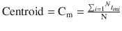

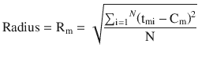

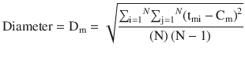T6】

如果您将群集视为围绕该群集内所有成员点的空间中的一个圆，则可以将质心作为圆心。同样，星团的半径和直径就是圆的半径和直径。任何聚类都可以用这三个参数来表示。好的聚类的一个衡量标准是中心之间的距离应该大于半径之和。

机器学习算法好坏的一般衡量标准是精确度和召回率。如果 A 表示检索结果的集合，B 表示相关结果的集合，P 表示精度，R 表示召回，那么:

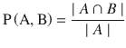

和

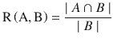T5】