# 五、深度学习和神经网络

神经网络，具体称为人工神经网络(ann ),是由第一台神经计算机的发明者 Robert Hecht-Nielsen 博士开发的。他将神经网络定义如下:

“……由许多简单、高度互联的处理元件组成的计算系统，这些元件通过对外部输入的动态响应来处理信息。”

习惯上，神经网络被安排在多层中。这些层由几个包含激活功能的互连节点组成。与隐藏层通信的输入层描绘了模式。隐藏图层链接到输出图层。

神经网络有许多用途。例如，在航空领域的乘客量预测中，t 月的乘客量严重依赖于 t-12 个月的数据，而不是 t-1 或 t-2 的数据。因此，神经网络通常比时间序列模型甚至图像分类产生更好的结果。在聊天机器人对话系统中，记忆网络是一种流行的方法，它实际上是前一次对话的一袋单词的神经网络。有许多方法来实现神经网络。在本书中，我将只关注反向传播算法，因为它是最流行的。

## 反向传播

反向传播是一种训练人工神经网络的常用方法，通常替代梯度下降等优化方法。该方法计算最外层中的误差，并反向传播到输入层，然后更新作为该误差、输入和学习速率的函数的权重。最终的结果是尽可能的将误差降到最低。

### 反向传播方法

像噪音图像到 ASCII 示例这样的问题通过计算机解决是具有挑战性的，因为机器和问题之间存在基本的不兼容性。如今，计算机系统被定制为以超出人类能力的速度执行数学和逻辑功能。即使是目前广泛流行的相对简单的台式微型计算机，每秒钟也能进行大量的数字比较或组合。

问题在于计算机固有的顺序性。冯诺依曼架构的“取-执行”循环允许机器一次只执行一个功能。在这种情况下，计算机执行每一条指令所需的时间是如此之短，以至于对于用户来说，即使是一个大程序所需的平均时间也可以忽略不计。

一种可以并行评估图像中所有像素的新处理系统被称为反向传播网络(BPN)。

### 广义德尔塔法则

我现在将介绍了解内部表征的反向传播学习过程。如果神经网络具有计算其输入和输出之间的某些函数关系的能力，则该神经网络被称为映射网络。

假设一组 P 个向量对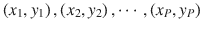，它们是函数映射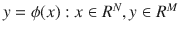的例子。

三层网络中的信息处理等式如下所示。一个输入向量如下:

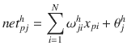

一个输出节点如下:


输出节点的方程式如下:

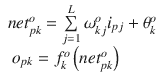

### 输出层权重的更新

下列等式是误差项:


输出层权重方程中的最后一个因子如下:

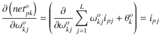

负渐变如下:

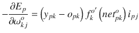

输出层上的权重根据以下内容更新:


输出函数有两种形式。

*   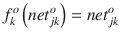

*   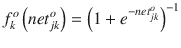

### 隐藏层权重的更新

仔细观察前面所示的由一层隐藏神经元和一个输出神经元组成的网络。当输入向量在网络中循环时，对于当前的一组权重，有一个输出预测。自动地，总误差在某种程度上与隐藏层中的输出值相关。方程式如下:


你可以利用这个事实来计算 E <sub>p</sub> 相对于隐藏层权重的梯度。【T2![$$ {\displaystyle \begin{array}{l}\frac{\partial {E}_p}{\partial {\omega}_{ji}^h}=\frac{1}{2}\sum \limits_k\frac{\partial }{\partial {\omega}_{ji}^h}{\left({y}_{pk}-{o}_{pk}\right)}^2\\ {}\kern1em =-\sum \limits_k\left({y}_{pk}-{o}_{pk}\right)\frac{\partial {o}_{pk}}{\partial \left( ne{t}_{pk}^o\right)}\frac{\partial \left( ne{t}_{pk}^o\right)}{\partial {i}_{pj}}\frac{\partial {i}_{pj}}{\partial \left( ne{t}_{pj}^h\right)}\frac{\partial \left( ne{t}_{pj}^h\right)}{\partial {\omega}_{ji}^h}\end{array}} $$](img/A458833_1_En_5_Chapter_Equk.gif)

等式中的每个因子都可以从前面的等式中显式计算出来。结果如下:

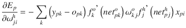

### BPN 摘要

将输入向量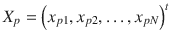应用到输入单元。

计算隐藏层单元的净输入值。

T2】

计算隐藏层的输出。

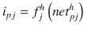T2】

计算每个单位的净输入值。

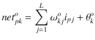T2】

计算输出。

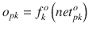T2】

计算输出单位的误差项。

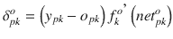T2】

计算隐藏单元的误差项。

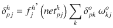T2】

更新输出图层的权重。

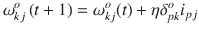T2】

更新隐藏层的权重。

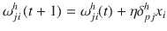T2】

## 反向传播算法

让我们来看一些代码:

```py
class NeuralNetwork(object):
       def  backpropagate(self,x,y):
              """Return a tuple "(nabla_b, nabla_w)" representing the
              gradient for the cost function C_x.  "nabla_b" and
              "nabla_w" are layer-by-layer lists of numpy arrays, similar
              to "self.biases" and "self.weights"."""
              nabla_b1=[np.zeros(b1.shape)for b 1in self.biases]
              nabla_w1=[np.zeros(w1.shape)for w1in self.weights]

              # feedforward
              activation1=x1
              activations1=[x1]
              zs1=[]
              for b,winzip(self.biases,self.weights):
              z1=np.dot(w1,activation1)+b1
              zs1.append(z1)
              activation1=sigmoid(z1)
              activations1.append(activation1)
              # backward pass
              delta1=self.cost_derivative(activations1[-1],y1)* \
              sigmoid_prime(zs1[-1])
              nabla_b1[-1]=delta1
              nabla_w1[-1]=np.dot(delta,activations1[-2].transpose())

              for l in xrange(2,self.num_layers):
                     z1=zs1[-l]
                     sp1=sigmoid_prime(z1)
                     delta1=np.dot(self.weights1[-l+1].transpose(),delta)*sp1
                     nabla_b1[-l]=delta1
                     nabla_w1[-l]=np.dot(delta,activations1[-l-1].transpose())
              return(nabla_b1,nabla_w1)

       def  cost_derivative(self,output_activations,y):
              """Return the vector of partial derivatives \partial C_x /
              \partial a for the output activations."""
              return(output_activations1-y1)

       def sigmoid(z1):
              """The sigmoid function."""
              Return1.0/(1.0+np.exp(-z1))

       def sigmoid_prime(z1):
              """Derivative of the sigmoid function."""
              Return sigmoid(z)*(1-sigmoid(z1))

```

## 其他算法

除了反向传播之外，还有许多技术可以用来训练神经网络。其中一种方法是使用常见的优化算法，如梯度下降、Adam 优化器等。简单感知法也经常被应用。赫布公设是另一种流行的方法。在 Hebb 的学习中，输入和输出的乘积代替误差作为反馈来校正权重。

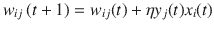T2】

## TensorFlow

TensorFlow 是 Python 中流行的深度学习库。它是原始库的 Python 包装器。它支持基于 CUDA 的 GPU 平台上的并行性。以下代码是使用 TensorFlow 进行简单线性回归的示例:

```py
learning_rate = 0.0001

        y_t = tf.placeholder("float", [None,1])
        x_t = tf.placeholder("float", [None,X_train.shape[1]])
        W = tf.Variable(tf.random_normal([X_train.shape[1],1],stddev=.01))
        b = tf.constant(1.0)

        model = tf.matmul(x_t, W) + b
        cost_function = tf.reduce_sum(tf.pow((y_t - model),2))
        optimizer = tf.train.AdamOptimizer(learning_rate).minimize(cost_function)

        init = tf.initialize_all_variables()

       with tf.Session() as sess:
                sess.run(init)
                w = W.eval(session = sess)
                of = b.eval(session = sess)
                print("Before Training #################################################")
                print(w,of)
                print("#################################################################")
                step = 0
                previous = 0
                while(1):
                        step = step + 1
                        sess.run(optimizer, feed_dict={x_t: X_train.reshape(X_train.shape[0],X_train.shape[1]), y_t: y_train.reshape(y_train.shape[0],1)})
                        cost = sess.run(cost_function, feed_dict={x_t: X_train.reshape(X_train.shape[0],X_train.shape[1]), y_t: y_train.reshape(y_train.shape[0],1)})
                        if step%1000 == 0:
                                print(cost)
                                if((previous- cost) < .0001):

                                        break
                                previous = cost
                w = W.eval(session = sess)
                of = b.eval(session = sess)
                print("Before Training #################################################")
                print(w,of)
                print("#################################################################")

```

稍加改变，你可以使它多层线性回归，如下所示:

```py
learning_rate = 0.0001

        y_t = tf.placeholder("float", [None,1])

       if not multilayer:
              x_t = tf.placeholder("float", [None,X_train.shape[1]])
              W = tf.Variable(tf.random_normal([X_train.shape[1],1],stddev=.01))
              b = tf.constant(0.0)
              model = tf.matmul(x_t, W) + b
       else:
              x_t_user = tf.placeholder("float", [None,X_train_user.shape[1]])
              x_t_context = tf.placeholder("float", [None,X_train_context.shape[1]])
              W_user = tf.Variable(tf.random_normal([X_train_user.shape[1],1],stddev=.01))

              W_context = tf.Variable(tf.random_normal([X_train_context.shape[1],1],stddev=.01))
              W_out_user = tf.Variable(tf.random_normal([1,1],stddev=.01))
              W_out_context = tf.Variable(tf.random_normal([1,1],stddev=.01))
              model  = tf.add(tf.matmul(tf.matmul(x_t_user, W_user),W_out_user),tf.matmul(tf.matmul(x_t_context, W_context),W_out_context))

        cost_function = tf.reduce_sum(tf.pow((y_t - model),2))
        optimizer = tf.train.AdamOptimizer(learning_rate).minimize(cost_function)

        init = tf.initialize_all_variables()

        with tf.Session() as sess:
                sess.run(init)
                print("Before Training #################################################")
                step = 0
                previous = 0
             cost = 0
             while(1):
                        step = step + 1
                    if not multilayer:
                               sess.run(optimizer, feed_dict={x_t: 

X_train.reshape(X_train.shape[0],X_train.shape[1]), y_t: y_train.reshape(y_train.shape[0],1)})
                             cost = sess.run(cost_function, feed_dict={x_t: X_train.reshape(X_train.shape[0],X_train.shape[1]), y_t: y_train.reshape(y_train.shape[0],1)})
                    else:
                               sess.run(optimizer, feed_dict={x_t_user: X_train_user.reshape(X_train_user.shape[0],X_train_user.shape[1]), x_t_context: X_train_context.reshape(X_train_context.shape[0],X_train_context.shape[1]), y_t: y_train.reshape(y_train.shape[0],1)})
                             cost = sess.run(cost_function, feed_dict={x_t_user: X_train_user.reshape(X_train_user.shape[0],X_train_user.shape[1]), x_t_context: X_train_context.reshape(X_train_context.shape[0],X_train_context.shape[1]), y_t: y_train.reshape(y_train.shape[0],1)})
                        if step%1000 == 0:
                                print(cost)
                        if previous == cost or step > 50000:
                           break
                    if cost != cost :
                           raise Exception("NaN value")
                        previous = cost
                print("#################################################################")
              if multilayer:
                    w_user = W_user.eval(session = sess)

                    w_context = W_context.eval(session = sess)
                    w_out_context = W_out_context.eval(session = sess)
                    w_out_user = W_out_user.eval(session = sess)
                    w_user = np.dot(w_user, w_out_user)
                    w_context = np.dot(w_context, w_out_context)
              else:
                    w = W.eval(session = sess)

```

您可以使用相同的代码进行逻辑回归，只需稍作修改，如下所示:

```py
learning_rate = 0.001
       no_of_level = 2

       y_t = tf.placeholder("float", [None,no_of_level])
       if True:
              x_t = tf.placeholder("float", [None,X_train.shape[1]])
               W = tf.Variable(tf.random_normal([X_train.shape[1],no_of_level],stddev=.01))
              model = tf.nn.softmax(tf.matmul(x_t, W))

        cost_function = tf.reduce_mean(-tf.reduce_sum(y_t*tf.log(model), reduction_indices=1))
        optimizer = tf.train.GradientDescentOptimizer(learning_rate).minimize(cost_function)

        init = tf.initialize_all_variables()

       with tf.Session() as sess:
                sess.run(init)
                print("Before Training #################################################")
                step = 0
                previous = 0
              cost = 0
              while(1):
                        step = step + 1
                    if True:
                               sess.run(optimizer, feed_dict={x_t: X_train.reshape(X_train.shape[0],X_train.shape[1]), y_t: y_train.reshape(y_train.shape[0],no_of_level)})
                             cost = sess.run(cost_function, feed_dict={x_t: X_train.reshape(X_train.shape[0],X_train.shape[1]), y_t: y_train.reshape(y_train.shape[0],no_of_level)})
                        if step%1000 == 0:
                                print(cost)
                        if previous == cost or step > 50000:
                           break
                    if cost != cost :
                           raise Exception("NaN value")

                        previous = cost
                print("#################################################################")
              if True:
                    w = W.eval(session = sess)

```

## 递归神经网络

递归神经网络是一种非常流行的网络，其中前一步的输出进入反馈或输入到隐藏层。对于像序列均衡算法或时间序列预测这样的问题，这是一个非常有用的解决方案。序列均衡算法的一个更流行的应用是在搜索引擎的自动完成特性中。

举个例子，假设一个算法交易员想要预测一只股票的交易价格。但他的策略需要以下预测标准:

1.  预测分笔成交点高于当前分笔成交点和下一个分笔成交点。赢了。
2.  预测分笔成交点低于当前分笔成交点和下一个分笔成交点。赢了。
3.  预测分笔成交点高于当前分笔成交点，但低于下一个分笔成交点。损失。
4.  预测分笔成交点低于当前分笔成交点，但高于下一个分笔成交点。损失。

为了满足他的标准，开发人员采取了以下策略。

为了生成 100 条记录的预测，他考虑将前面的 1，000 条记录作为输入 1，将最后 1，000 条记录中的预测误差作为输入 2，将两个连续记录之间的差异作为输入 3。使用这些输入，基于 RNN 的引擎预测接下来 100 条记录的结果、错误和记录间差异。

然后他采取以下策略:

*   如果预测的 diff > 1，预测的 err < 1，那么预测+= pred_err + 1。
*   如果预测差< 1 and predicted err > 1，那么预测-= pred_err -1。

这样，预测就满足了开发者的需求。详细的代码如下所示。它使用 Keras，这是 TensorFlow 之上的一个包装器。

```py
import matplotlib.pyplot as plt
import numpy as np
import time
import csv
from keras.layers.core import Dense, Activation, Dropout
from keras.layers.recurrent import LSTM
from keras.models import Sequential
import sys
np.random.seed(1234)

def read_data(path_to_dataset,
                           sequence_length=50,
                           ratio=1.0):

    max_values = ratio * 2049280

    with open(path_to_dataset) as f:
        data = csv.reader(f, delimiter=",")
        power = []
        nb_of_values = 0
        for line in data:
            #print(line)
            #if nb_of_values == 3500:
             #   break
            try:
                power.append(float(line[1]))
                nb_of_values += 1
            except ValueError:
                pass
            # 2049280.0 is the total number of valid values, i.e. ratio = 1.0
            if nb_of_values >= max_values:
                break
    return power

def process_data(power, sequence_length, ratio, error):
    #print("Data loaded from csv. Formatting...")
    #fig = plt.figure()
    #plt.plot(power)
    #plt.show()
    result = []
    for index in range(len(power) - sequence_length):
        result.append(power[index: index + sequence_length])
    result = np.array(result)  # shape (2049230, 50)

    if not error:
       global result_mean, result_std
       result_mean = result.mean()
       result_std = result.std()
       result -= result_mean
       result /= result_std
    #result = np.log(result+1)
    #print result
    #exit(0)
#     print ("Shift : ", result_mean)
    print ("Data  : ", result.shape)

    row = int(round(0.9 * result.shape[0]))
    print row

    train = result[:row, :]
    np.random.shuffle(train)
    X_train = train[:, :-1]
    y_train = train[:, -1]
    X_test = result[row:, :-1]
    y_test = result[row:, -1]

    X_train = np.reshape(X_train, (X_train.shape[0], X_train.shape[1], 1))
    X_test = np.reshape(X_test, (X_test.shape[0], X_test.shape[1], 1))

    return [X_train, y_train, X_test, y_test]

def build_model():
    model = Sequential()
    layers = [1, 50, 100, 1]

    model.add(LSTM(
        layers[1],
        input_shape=(None, layers[0]),
        return_sequences=True))
    model.add(Dropout(0.2))

    model.add(LSTM(
        layers[2],
        return_sequences=False))
    model.add(Dropout(0.2))

    model.add(Dense(
        layers[3]))
    model.add(Activation("linear"))

    start = time.time()
    model.compile(loss="mse", optimizer="rmsprop")
    print ("Compilation Time : ", time.time() - start)
    return model

def run_network(model=None, data=None, error=False):
    global_start_time = time.time()
    epochs = 2
    ratio = 0.5
    sequence_length = 100

    X_train, y_train, X_test, y_test = process_data(
            data, sequence_length, ratio,error)

    print ('\nData Loaded. Compiling...\n')

    if model is None:
        model = build_model()

    try:
        model.fit(
            X_train, y_train,
            batch_size=512, nb_epoch=epochs, validation_split=0.05)
        predicted = model.predict(X_test)
        predicted = np.reshape(predicted, (predicted.size,))
    except KeyboardInterrupt:
        print ('Training duration (s) : ', time.time() - global_start_time)
        return model, y_test, 0

    try:
        fig = plt.figure()
        ax = fig.add_subplot(111)
        ax.plot(y_test[:100]*result_max)
        plt.plot(predicted[:100]*result_max)
        plt.show()
    except Exception as e:
        print (str(e))
    print ('Training duration (s) : ', time.time() - global_start_time)

    return model, y_test, predicted

if __name__ == '__main__':
    path_to_dataset = '20170301_ltp.csv'
    data = read_data(path_to_dataset)
    error = []
    diff_predicted = []
    err_predicted = []
    print len(data)
    for i in range(0,len(data)-1000,89):
        d = data[i:i+1000]
        model, y_test, predicted = run_network(None,d, False)
        if i > 11 and len(error) >= 1000:
             model,err_test, err_predicted = run_network(None,error, True)
              error = error[90:]
              d1 = data[i:i+1001]
              diff = [0]*1000
              for k in range(1000):
                    diff[k] = d1[k+1] - d1[k]
                model,diff_test, diff_predicted = run_network(None,diff, True)
        print i,len(d), len(y_test)
        y_test *= result_std
        predicted *= result_std
        y_test += result_mean
        predicted += result_mean
       e = (y_test - predicted)/predicted
       error = np.concatenate([error, e])
        #print error
        #error.append(y_test - predicted)
       if i > 11 and len(error) >= 1000 and len(err_predicted)>=90:
               for j in range(len(y_test)-1):
                     if diff_predicted[j] > 1 and err_predicted[j]*predicted[j] <= 1:
                           predicted[j] += abs(err_predicted[j]*predicted[j]) + 1
                    if diff_predicted[j] <= 1 and err_predicted[j]*predicted[j] > 1:
                                predicted[j] -= abs(err_predicted[j]*predicted[j]) - 1
                     print y_test[j], ',',predicted[j]

       print "length of error",len(error)

```