# 1.Web 开发

这一章向你介绍了机器学习(ML)的基础，并为完全的初学者提供了一个实用的网页设计和开发入门。本章涵盖的主题包括以下内容:

*   超文本标记语言(HTML)

*   级联样式表(CSS)

*   JavaScript (JS)

*   文档对象模型(DOM)

*   框架

web 开发的这些构件使您能够在 web 设计中实现丰富的用户功能。

## 机器学习概述

机器学习是人工智能(AI)的一个子集，旨在使计算机能够在不与特定程序交互的情况下进行学习。ML 使计算机能够开发能够访问数据并利用数据进行自我学习的程序(从而表现得像人一样)。

亚瑟·塞缪尔相信计算机可以不需要特定的程序就能学习，他在 1959 年推广了机器学习这个术语。1997 年，Tom Mitchell 进一步澄清了 ML 的概念，指出计算机可以在处理一些任务时从一些涉及过去性能的相对度量中学习，从而给计算机一些*经验*。

今天，各种电子产品都配备了尖端的高灵敏度传感器。此外，互联网连接允许小工具(事物)之间的通信，以便更好地监控环境条件。因此，这些小工具产生的大量数据推动了物联网(IoT)概念的发展。使用人工智能和人工智能策略，收集的广泛信息可以被处理、缩放、排序并用于预测事件。

在传统的 ML 方法中，数据被发送到中央服务器并通过中央服务器进行处理，这经历了通信开销、等待时间、保护丢失和安全问题。为了克服这些困难，可以通过在数据源附近部署更好的 ML 技术，例如使用浏览器环境功能，从物联网领域收集的数据中进行推断。通过浏览器在资源受限的计算设备上开发 ML 策略有助于各个实体实时地为增强的功能做出更好的决策。

当前人工智能策略的巨大计算需求和不断增加的人工智能增强应用程序的发展预示着更多的数据处理问题。毕竟，基于计算机的智能系统功能要求更高，因为它们寻求降低资源利用率，加快资源可访问性，并利用资源利用率提高精度。

软件开发人员和工程师现在可以更有效地利用人工智能来概念化异常敏感的应用程序，这些应用程序实时响应用户提供的信息，如语音或面部识别。他们还可以开发更智能的应用程序，从用户行为中学习。基于计算机的智能使我们能够自动化应用程序，以纳入实质性的建议，响应语音请求或物理动作，使用手机摄像头识别项目或地点，并找出如何帮助用户进行日常活动。

在过去，许多最好的 ML 和深度学习(DL)系统需要熟悉 Python 及其相关的库系统。生产 ML 模型需要独特的推理设备和编程工具，如 NVIDIA 图形处理器(GPU)和 CUDA。然而，现在将 ML 合并到 JavaScript (JS)应用程序中通常涉及在远程云系统(如 Amazon Web Services (AWS ))上部署 ML 部分，并通过应用程序编程接口(API)调用让模型在本地系统上运行。这种非本地的、以后端为中心的方法可能会阻止许多 web 工程师利用人工智能为前端改进提供的丰富前景。

在用户的本地设备上运行人工智能策略的主要优势在于，信息永远不会离开用户的设备。这一点非常重要，因为用户有理由担心他们的数据隐私，尤其是在众所周知的令人尴尬的信息泄露和安全漏洞之后。

在 TensorFlow.js 软件工具的帮助下，开发人员/用户可以利用人工智能，而无需通过系统发送他们的信息，这些信息可能会让外人看到。这些工具使开发符合信息安全准则的安全应用变得更加简单，例如读取可穿戴临床传感器的医疗保健应用。这些工具还使人工智能程序增强成为可能，从而允许在屏蔽用户行为/信息的同时进行升级。

在一个简单的界面中集成 JS 编程功能和 AI 策略，可以更直接地从物联网设备访问丰富的传感器信息。用户行为可以基于与设备信息源(如语音或网络摄像头)的交互来建模。因为类似的编程代码可以在例如利用加速度计、陀螺仪和全球定位系统(GPS)的移动电话上运行，所以将人工智能计算能力集成到用户设备本身可以证明是非常有益的。

## 网络交流

图 [1-1](#Fig1) 显示了在用户设备上运行的人工智能应用程序的大图网络基础。

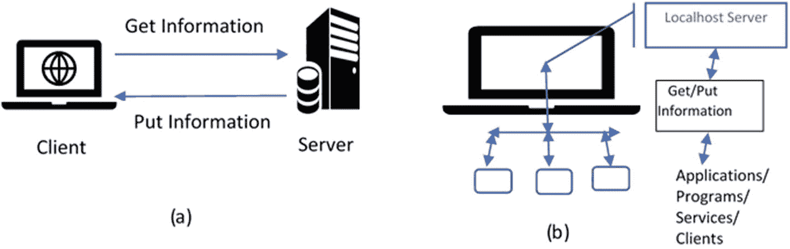

图 1-1

通过互联网和本地主机进行 Web 通信

三个 web 开发要点如下:

*   客户端(网络浏览器，用于网上冲浪)

*   服务器系统(用于向浏览器提供信息)

*   计算机网络(用于支持浏览器-服务器通信)

图 [1-1(a)](#Fig1) 所示的 web 活动说明了网络互联的原理，其中客户端和服务器之间的通信是通过互联网协议(IP)、传输控制协议(TCP)、超文本传输协议(HTTP)和文件传输协议(FTP)等协议完成的。图 [1-1(b)](#Fig1) 显示客户端(浏览器/服务/应用程序)和服务器(本地主机)之间的通信发生在本地，并向各自的应用程序(客户端/浏览器/服务)提供所需的信息。

以下术语与通信相关:

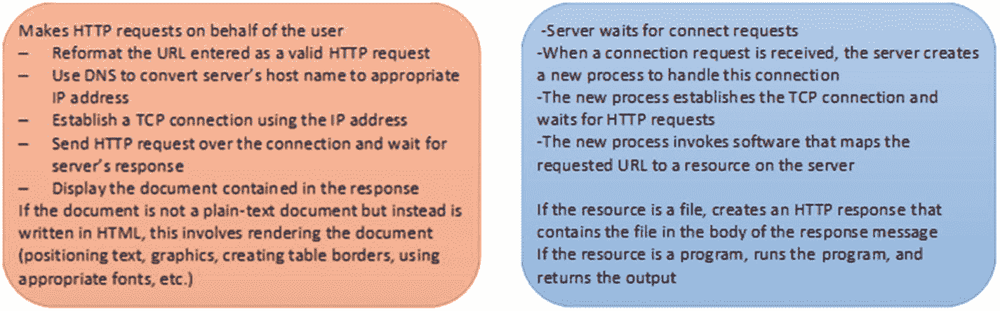

图 1-2

web 客户端(浏览器)和 web 服务器之间的通信

*   万维网 *(WWW 或 web)* :一个运行在互联网上的相互链接的超文本文档系统。有两种类型的软件:客户端和服务器。想要访问由服务器提供的信息的系统必须运行客户端软件(例如，网络浏览器)，并且想要向其他人提供信息的互联网连接的计算机必须运行服务器软件。客户端和服务器应用程序通过遵循基于 TCP/IP 的协议(即 HTTP)在互联网上进行通信(图 [1-2](#Fig2) )。

*   *超文本*:一种信息格式，使人能够通过超链接从文档的一部分移动到另一部分，或者从一个文档移动到另一个文档。

*   *统一资源定位符(URL)* :用于定位网络上特定资源的唯一标识符。

*   *标记语言*:定义超文本文档的结构和内容。

### 用 HTML 组织网络

要设计和开发网页，您需要完全熟悉超文本标记语言(HTML)。HTML 使您能够定义网页的结构，包括节、列表、标题、连接点、图片、混合媒体播放器等等。

HTML 不是一种编程语言。它是一种标记语言，告诉互联网浏览器如何组织用户访问的网页。HTML 由各种组件组成，您可以使用这些组件来操作以特定方式显示的实质性页面元素。例如，封装标签可以将内容转换为与另一个页面相关联的超链接，或者可以用于强调单词/术语。

## 使用 IDEs 编辑器进行 Web 开发

集成开发环境(IDE)和用于 web 开发的编辑器(文本)之间的区别在于，IDE 可以完成从基本内容管理到高级开发的所有工作，而这些工作是文本编辑器无法完成的。

比如[***Sublime***](https://www.sublimetext.com/)**，**[***notepad++***](https://notepad-plus-plus.org/downloads/)**，**和[***Atom***](https://atom.io/)等编辑器在编写网页设计的代码时，可以配合 HTML 和层叠样式表(CSS)使用。这些编辑器包括许多好的特性(例如，为希望增强应用程序功能的 web 开发人员提供的语言结构，包括适应性强的界面和全面的导航工具)。例如，web 开发人员可能需要调试器和编译器来有效地开发 web 应用程序。图 [1-3](#Fig3) 显示了这三个编辑器的编程环境。

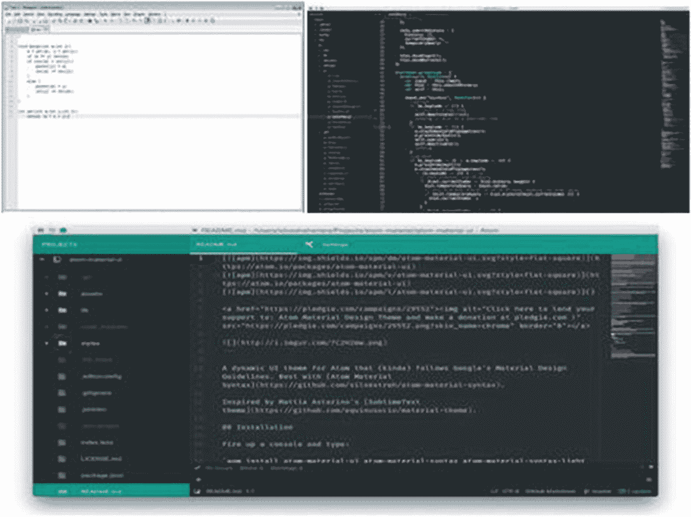

图 1-3

Notepad++、Sublime 和 Atom 编辑器环境

然而，有了最好的 ide，您就不用那么担心了。它们通常在一个应用程序中包含全面的开发工具，包括自动化、测试和预测。主要是，它们为 web 开发人员提供必要的支持，将代码转换成可工作的应用程序。以下是一些比较流行的 ide:

*   [*Visual Studio 代码*](https://code.visualstudio.com/) : Visual Studio 代码可能是 Windows、Mac 和 Linux 平台上最好的 JavaScript IDE。除了支持 JS 功能之外，它还支持 Node.js 和 TypeScript 特性，并且它包括一个针对不同编程方言的扩展系统，包括 C++、C#、Python 和 PHP。Visual Studio 代码通过出色的语法功能和智能感知的自动完成功能实现了对程序员友好的操作，智能感知可以响应各种因素、单词定义和导入的模块。

*   [*NetBeans*](https://netbeans.org/):NetBeans 是最好的 web 开发 ide 之一，因为它使您能够创建一个整洁和通用的工作区，并快速开发 web 应用程序。它还可以很好地与 JS、HTML5、PHP 和 C/C++兼容。这是一个免费的 JS IDE，也是一个非常棒的日常使用的 HTML5 IDE。该 IDE 允许您检查代码中的错误，并允许您在必要时自动修复语法(包括 Java 8 特性，如 lambda 表达式)。

*   PyCharm 不是最好的免费 JS IDE。但是，如果您正在寻找一个可靠的 Python web 开发 IDE，付费专业版是值得考虑的。

*   *IntelliJ IDEA*:IntelliJ IDEA 是一款优秀的 web 开发 IDE。有一个免费版本，但是如果你想要它提供的所有 JS 特性，考虑付费终极版。IntelliJ IDEA 可以节省你在 web 开发上的时间和精力，是一款优秀的 CSS IDE。还要注意，它支持广泛的编程方言。

### Web 开发的构建模块

web 开发的三个构件如下:

*   HTML:通过 HTML5，计算机现在可以理解你的网站上有什么，而不仅仅是动态显示网站内容。早期的 HTML 版本向用户提供静态或动态信息。网站内容通过 HTML 代码显示。

*   CSS:CSS 决定了网站/页面的外观。HTML 是用来制作内容的，而 CSS 是用来以你想要的方式显示内容的(即设计；不同的风格、颜色、背景和布局)。CSS 使网站/页面看起来有趣。

*   *JavaScript* : JS 是一种用来操作 HTML 和 CSS 的编程语言。它的主要功能是为用户提供交互功能。它很坚固，可以用来创建完整的 web 应用程序(apps)。

Note

要开发和测试本书中的应用程序/代码，可以考虑使用谷歌的 Chrome 浏览器，它有 Mac、Windows 和 Linux 版本。

### HTML 和 CSS 编程

一个连贯的 web 开发过程要求你首先定义*你想说什么*(HTML)，然后定义*你想怎么说*(CSS)。一个 HTML 组件(元素)是一个开始标签、它的特征(属性)、结束标签以及它们之间的所有东西的组合。HTML 标签——开始(`< >`)或结束(`</ >`)——用于标识组件(元素)的开始或结束。以下代码显示了 HTML 文档的结构及其一些基本元素:

```py
<!DOCTYPE html>
<html>
  <head>
    <!-- Metadata goes here -->
  </head>
  <body>
    <!-- Content goes here -->
  </body>
</html>

```

第一行`<!DOCTYPE html>`，通知浏览器这是一个 HTML5 版本的网页。整个网页内容将被包装在`<html>`标签中。实际的`<html>`文本被称为*开始标签*，而`</html>`被称为*结束标签*。这些标签里面的所有东西都被认为是`<html>` *元素*的一部分，这是当网页浏览器解析你的 HTML 标签时实际创建的东西。在`<html>`元素中还有两个元素:`<head>`和`<body>`。一个 web 页面`<head>`包含了它的所有元数据，比如页面标题、任何 CSS 样式表，以及呈现页面所需要的、但是你不一定想让用户看到的其他东西。我们的大部分 HTML 标记将存在于`<body>`元素中，它表示页面的可见内容。

标签`<!--`和`-->`之间给出了注释。清单 [1-1](#PC2) 显示了一个更完整的 HTML 示例，图 [1-4](#Fig4) 显示了相应的输出。

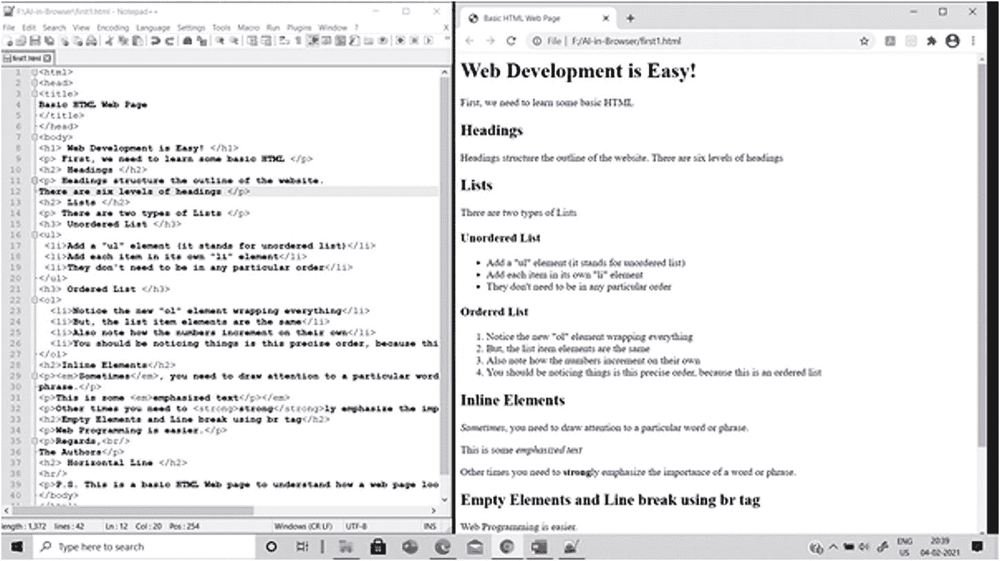

图 1-4

基本 HTML 代码及其输出的屏幕截图

```py
<html>
<head>
<title>
Basic HTML Web Page
</title>
</head>
<body>
<h1> Web Development is Easy! </h1>
<p> First, we need to learn some basic HTML </p>
<h2> Headings </h2>
<p> Headings structure the outline of the website.
There are six levels of headings </p>
<h2> Lists </h2>
<p> There are two types of Lists </p>
<h3> Unordered List </h3>
<ul>
 <li>Add a "ul" element (it stands for unordered list)</li>
 <li>Add each item in its own "li" element</li>
 <li>They don't need to be in any particular order</li>
</ul>
<h3> Ordered List </h3>
<ol>
  <li>Notice the new "ol" element wrapping everything</li>
  <li>But, the list item elements are the same</li>
  <li>Also note how the numbers increment on their own</li>
  <li>You should be noticing things is this precise order, because this is an ordered list</li>
</ol>
<h2>Inline Elements</h2>
<p><em>Sometimes</em>, you need to draw attention to a particular word or
phrase.</p>
<p>This is some <em>emphasized text</p></em>
<p>Other times you need to <strong>strong</strong>ly emphasize the importance of a word or phrase.</p>
<h2>Empty Elements and Line break using br tag</h2>
<p>Web Programming is easier.</p>
<p>Regards,<br/>
The Authors</p>
<h2> Horizontal Line </h2>
<hr/>
<p>P.S. This is a basic HTML Web page to understand how a web page looks like. </p>
</body>
</html>

Listing 1-1Basic HTML Content of a Web Page

```

#### 动态 HTML

动态 HTML (DHTML)使开发人员能够控制浏览器窗口中 HTML 元素的显示和位置。HTML 用于创建静态网页，DHTML 用于创建动态网页。HTML 由简单的 HTML 标签组成，而 DHTML 由 HTML 标签加 CSS 加 JS 组成。

#### 级联样式表

CSS 帮助我们指定网页上的元素应该如何呈现。有了 CSS，我们可以决定网页的风格和布局。使用样式表有三种方式:

*   内嵌样式表(列表 [1-2](#PC3)

*   嵌入式样式表(列表 [1-3](#PC4)

*   外部样式表(列表 [1-4](#PC5)

#### 内嵌样式表

内联样式表用于将各种独特的样式应用于单个元素。还可以使用内联样式表为特殊类型的元素定义样式，或者向元素添加 class 属性。清单 [1-2](#PC3) 展示了内联样式如何与 HTML 元素一起使用。图 [1-5](#Fig5) 显示了相应的输出。

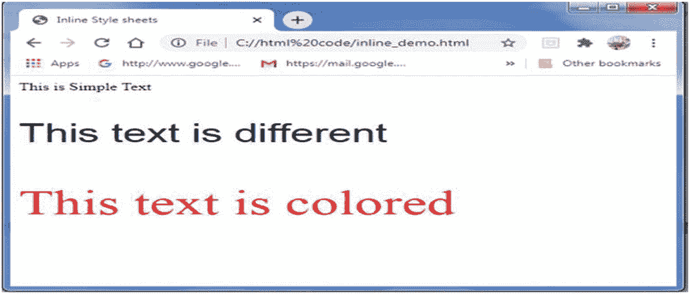

图 1-5

内联 CSS 样式设置的输出

```py
<HTML>
<head>
<TITLE> Inline Style sheets </TITLE>
</head>
<Body>
<p> This is Simple Text </p>
<p Style="font-size:30pt; font-family:arial"> This text is different </p>
<p style="font-size:40pt;color:#ff0000"> This text is colored </p>
</Body>
</HTML>

Listing 1-2Inline Style Sheets Example

```

#### 嵌入式样式表

对于嵌入式样式表，我们在 head 部分编写所有需要的选择器以及属性和值。然后，在 body 部分，新定义的选择器标签与实际内容一起使用。清单 [1-3](#PC4) 中的 DHTML 脚本用不同的属性和值定义了`h1`、`h2`、`h3`和`p`选择器。图 [1-6](#Fig6) 显示了嵌入样式设置的相应输出以及 HTML 代码。

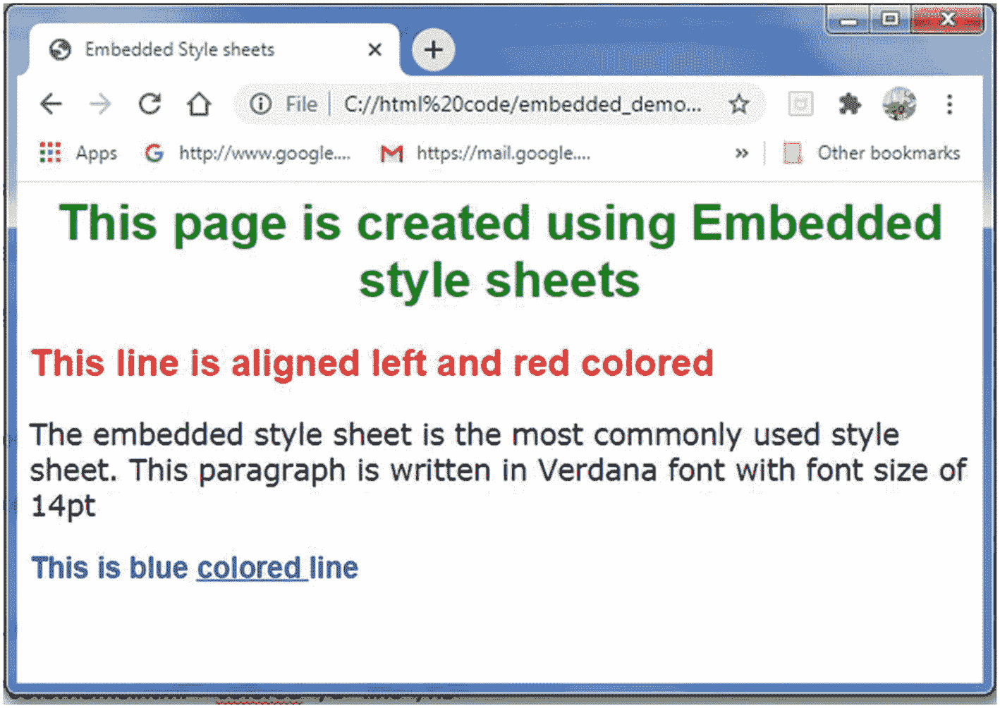

图 1-6

嵌入式样式设置的输出

注意，要定义嵌入式样式表，我们必须在`head`部分提到`style type= "test/css"`。

```py
<HTML>
<head>
<TITLE> Embedded Style sheets </TITLE>
<style type="text/css">
h1,h2,h3{font-family:arial;}
h2 {color:red;left:20px }
h3 {color:blue;}
p {font-size:14pt;font-family:verdana;}
.special {color:green}
</style>
</head>
<Body>
<h1 class="special"> <center>
This page is created using Embedded style sheets </center> </h1>
<h2> This line is aligned left and red colored </h2>
<p> The embedded style sheet is the most commonly used style sheet. This paragraph is written in Verdana font with font size of 14pt</p>
<h3> This is blue
<a href="C1_3.html"> colored </a> line</h3>
</Body>
</HTML>

Listing 1-3Embedded Style Sheets Example

```

#### 外部样式表

当我们想要将特定的样式应用到多个网页时，我们可以使用外部样式表。这种类型的样式表存储在一个。css 文件，我们必须在我们的相关网页中提到该文件的名称。当我们这样做时，在。css 文件应用于这些网页。清单 [1-4](#PC5) 是一个简单的程序，其中使用了外部样式表。

```py
<HTML>
<head>
<TITLE> External Style sheets </TITLE>
<link rel="stylesheet" type="txt/css" href=ex1.css"/>
</head>
<Body>
<h1 class="special"> <center>
This page is created using External style sheets </center> </h1>
<h2> This line is aligned left and red colored </h2>
<p> The embedded style sheet is the most commonly used style sheet. This paragraph is written in Verdana font with font size of 14pt</p>
<h3>This is blue
<a href="C1_4.html"> colored </a> line</h3>
</Body>
</HTML>

Listing 1-4External Style Sheet Example

```

外部样式表在`href`属性中作为链接到 ex1.css 的值被引用。在同一文件夹中创建一个名为 ex1.css 的文件:

```py
h1 {font-family:arial;}
h2 {
font-family:times new roman;
color:red;
left:20px;
}
h3 {
font-family:arial;
color:blue
}
p {
font-size:14pt;
font-family:cambria;
}
special {color:green }

```

## JavaScript 基础知识

JavaScript 是一种脚本语言(一种轻量级编程语言)和一种解释语言(无需初步编译即可执行)。它通常直接嵌入到 HTML 页面中，旨在增加页面的交互性。Java 和 JS 不一样。

JS 属性包括以下内容:

*   JS 给了 HTML 设计者一个编程工具。

*   JS 可以将动态文本放入 HTML 页面。

*   JS 可以对事件做出反应。

*   JS 可以读写 HTML 元素。

*   JS 可以用来验证数据。

*   JavaScript 可用于在浏览器中应用 AI、ML 和 DL 技术。

*   JavaScript 可用于创建 cookies(在访问者的计算机上存储和检索信息)。

### 包括 JavaScript

HTML `<script>`标签用于将脚本(JS)插入 HTML 页面:

```py
<script type="text/javascript">
    document.write("Hello World!");
</script>

```

标签用来嵌入一个客户端脚本。元素或者包含脚本语句，或者通过属性`src`指向外部脚本文件。

### 在哪里插入 JS 脚本

您可以在头文件、正文文件或外部 JavaScript 文件(.js)。当调用`head`部分时，将执行`head`部分中的脚本(列表 [1-5](#PC8) )。图 [1-7](#Fig7) 显示了相应的输出。页面加载时，`body`部分中的脚本执行(清单 [1-6](#PC9) ，图 [1-8](#Fig8) 显示了相应的输出。

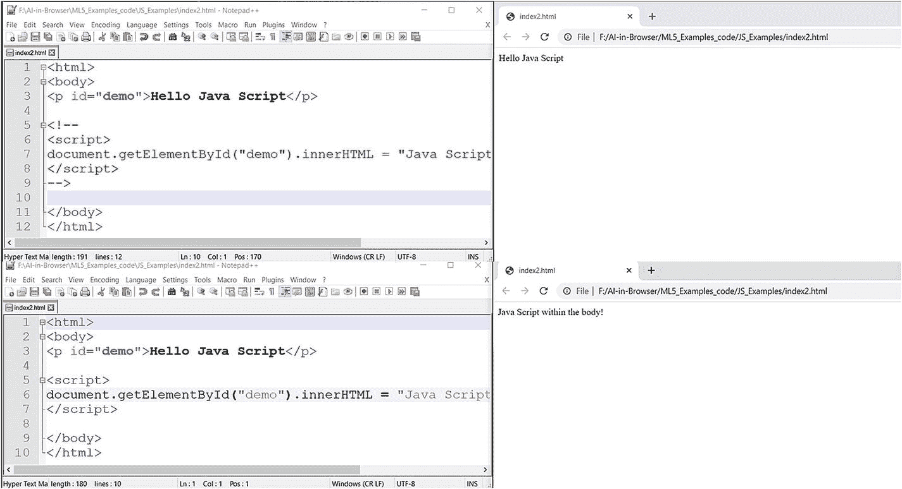

图 1-8

正文部分中的 JavaScript

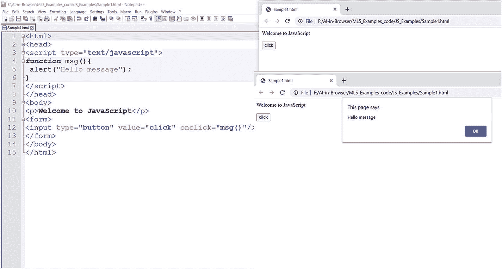

图 1-7

标题部分中的 JavaScript

```py
<html>
<head>
<script type="text/javascript">
function msg(){
 alert("Hello message");
}
</script>
</head>
<body>
<p>Welcome to JavaScript</p>
<form>
<input type="button" value="click" onclick="msg()"/>
</form></body></html>

Listing 1-5JavaScript Inside the Head Section

```

```py
<html>
<body>
<p id="demo">Hello Java Script</p>
<script>
document.getElementById("demo").innerHTML = "Java Script within the body!";
</script>
</body>
</html>

Listing 1-6JavaScript Inside the Body Section

```

清单 [1-7](#PC10) 提供了程序外部的 JS 函数，清单 [1-8](#PC11) 显示了图 [1-9](#Fig9) 中相应输出的 HTML。

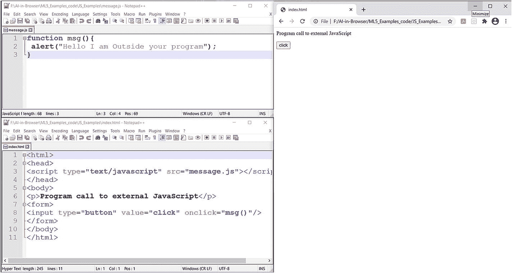

图 1-9

程序外部的 JS

```py
<html>
<head>
<script type="text/javascript" src="message.js"></script>
</head>
<body>
<p>Program call to external JavaScript</p>
<form>
<input type="button" value="click" onclick="msg()"/>
</form>
</body>
</html>

Listing 1-8HTML for Click Button

```

```py
function msg(){
 alert("Hello I am Outside your program");
}

Listing 1-7Message.js

```

### 事件驱动流程的 JavaScript

通过利用 JS 的事件驱动编程，动态网站开发是可能的。通常，在网站页面堆叠后，JS 程序会继续运行(并等待事件发生)。如果您与 web 页面进行交互，JS 脚本会执行与该交互(事件)相对应的代码，并且页面的行为会根据事件发生变化。图 [1-10](#Fig10) 显示了借助 JS 特性的典型事件驱动流程。

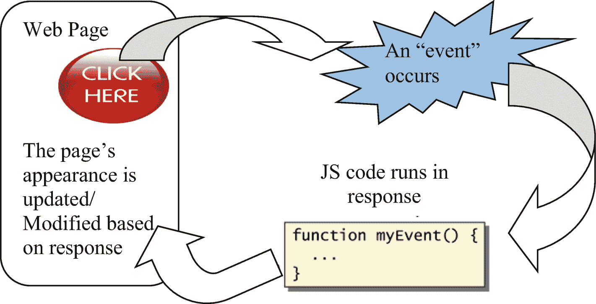

图 1-10

借助 JS 代码实现网页上的事件驱动过程

## 文档对象模型操作

在堆叠网页时，浏览器(程序)创建页面的文档对象模型(DOM)。HTML DOM 被开发成一个对象树。通过 DOM，HTML 的元素(组件)可以被操纵，在 web 页面上移动，并有效地处理。

HTML DOM 是 HTML 的对象模型:

*   作为项目(元素)的 HTML 组件

*   所有 HTML 组件的属性

*   所有 HTML 组件的技术

*   所有 HTML 组件的事件

HTML DOM 是 JavaScript 的应用程序编程接口(API ):

*   JS 可以包含/更改/删除 HTML 组件。

*   JS 可以包含/更改/删除 HTML 特征。

*   JS 可以包含/改变/删除 CSS 样式。

*   JS 可以响应 HTML 事件。

*   JS 可以包含/更改/删除 HTML 事件。

创建站点页面和应用程序时，您必须做的一件主要事情是控制归档结构。开发人员通常通过使用 DOM、合并大量 API 来控制 HTML，以及使用 document 对象对数据进行样式化来做到这一点。

`Discovering HTML Elements`:当你需要用 JS 获取 HTML 组件时，你需要先发现组件。您可以通过几种不同的方式来实现:

*   通过 ID 发现 HTML 元素

*   通过标签名称发现 HTML 元素

*   通过类名发现 HTML 元素

*   通过 CSS 选择器发现 HTML 元素

*   通过 HTML 对象分类发现 HTML 元素

在 JS 中使用的网页是一个文档，JS 提供了一个名为`document`的对象，它被认为是一个完整的网页。`document`对象提供了各种属性和方法来识别、访问和修改加载到浏览器上的 web 组件/元素。为了识别和访问 DOM 元素，JS 使用了前面描述的发现功能。

下面的 HTML 源代码展示了这样的发现:

```py
<!DOCTYPE html>
<html>
<body>
<h2>Finding HTML Elements by Id</h2>
<p id="intro">Hello World!</p>
<p>This example demonstrates the <b>getElementsById</b> method.</p>
<p id="demo1"></p>
<p id="demo2"></p>
<p class="intro">The DOM is very useful.</p>
<p class="intro">This example demonstrates the <b>getElementsByClassName</b> method.</p>
<script>
var myElement = document.getElementById("intro");
document.getElementById("demo1").innerHTML =
"The text from the intro paragraph is " + myElement.innerHTML;
var x = document.getElementsByTagName("p");
document.getElementById("demo2").innerHTML =
'The text in first paragraph (index 0) is: ' + x[0].innerHTML;
var x1 = document.getElementsByClassName("intro");
document.getElementById("demo").innerHTML =
'The first paragraph (index 0) with class="intro": ' + x1[0].innerHTML;
</script>
</body>
</html>

```

## jQuery 简介

jQuery 是一个轻量级的 JS 库，它使开发人员能够编写更少的代码，完成更多的工作。jQuery 库使 web 程序员能够轻松完成以下任务:

*   HTML 和 DOM 元素操作

*   CSS 管理和控制

*   提供事件驱动的技术来触发和响应网页上的事件，如鼠标点击、按钮点击、按键等等

*   改进异步 JavaScript 和 XML (AJAX)调用的功能，以便在两个实体(如客户端和服务器)之间交换信息

有两种方法可以在程序中使用 jQuery 库:

1.  下载 jQuery 库

( [`https://code.jquery.com/jquery-3.5.1.min.js`](https://code.jquery.com/jquery-3.5.1.min.js) )从 jQuery.com 下载，存储在与源代码(HTML 和 CSS 代码)位置相同的文件夹中，使用方法如下:

```py
<head>
<script src="jquery-3.5.1.min.js"></script>
</head>

```

*或*

1.  如果您连接到互联网，请使用以下来自 Google CDN 的链接来包含 jQuery 特性:

```py
<head>
<script src="https://ajax.googleapis.com/ajax/libs/jquery/3.5.1/jquery.min.js">
</script>
</head>

```

清单 [1-9](#PC15) 展示了如何使用 jQuery 库及其功能，图 [1-11](#Fig11) 和 [1-12](#Fig12) 展示了其相应的输出。

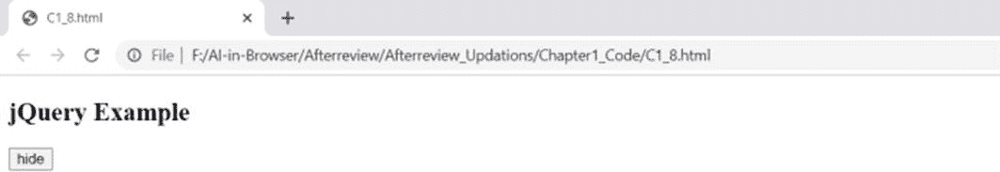

图 1-12

点击隐藏按钮后的列表 [1-9](#PC15) 输出

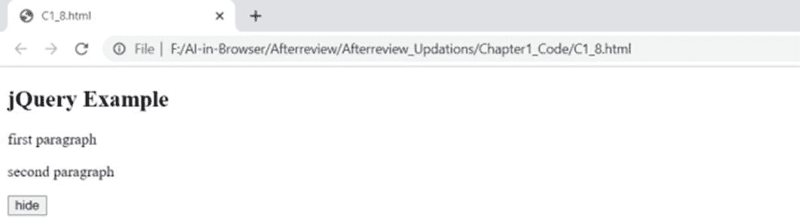

图 1-11

点击隐藏按钮前的列表 [1-9](#PC15) 输出

```py
<!DOCTYPE html>
<html>
<head>
<script src="jquery-3.5.1.min.js"></script>
<script>
$(document).ready(function(){
  $("button").click(function(){
    $("p").hide();
  });
});
</script>
</head>
<body>
<h2>jQuery Example</h2>
<p>first paragraph</p>
<p>second paragraph</p>
<button>hide</button>
</body>
</html>

Listing 1-9Using the jQuery Library

```

## 摘要

这一章介绍了 ML，并提供了 web 设计和开发的实用概述。以下是一些关键要点:

*   HTML 是一种语言，我们用它来组织我们内容的各个部分并定义它们的重要性。

*   CSS 是一种语言，我们用它来设计我们的网页内容，使其更加生动。

*   JS 是一种脚本语言，我们用它来增加网站页面的动态实用性。

*   DOM 描述了文档(网页)的逻辑结构，以及使用组件(网页的元素)访问和操作文档的方式。

*   jQuery 是一个小型的 JavaScript 库，它简化了 HTML 文档(网页)的遍历和操作、事件处理和动画。

现在，您应该能够开始设计和开发将 AI/ML 集成到 web 组件中的应用程序了。

## 参考

*   米切尔，汤姆 M. *机器学习*。麦格劳-希尔，1997 年。

*   辛格，希曼舒。*实用机器学习和图像处理*。Apress，2019。

*   斯蒂芬·马斯兰德。*机器学习* : *一种算法视角*。查普曼&霍尔/CRC 机器学习&模式识别；第一版，2009 年。

*   宾·乌扎尔、苏夫扬、尼古拉斯·克劳德和蒂姆·安布勒。现代 Web 开发的 JavaScript 框架:现在需要学习的基本框架、库和工具。Apress，2019。

*   库克、克雷格和大卫·舒尔茨。*用 CSS 和 XHTML 开始 HTML，现代指南和参考*。2007 年出版。

*   [T2`https://code.visualstudio.com/`](https://code.visualstudio.com/)

*   [T2`https://netbeans.org/`](https://netbeans.org/)

*   [T2`https://www.jetbrains.com/pycharm/`](https://www.jetbrains.com/pycharm/)

*   弗格森，罗斯。*JavaScript 入门，现代 JavaScript 开发的终极指南*。Apress，2019。