# 二、基于浏览器的数据处理

既然您已经了解了 web 开发的基础知识，本章将介绍两个 JavaScript (JS)库:p5.js 和 ml5.js。本章还将深入探讨与各种问题解决和应用程序开发实现相关的 JS 特性和语法。然后讨论了使用图形和机器学习(ML)应用处理接口方法在浏览器中实现人工智能(AI)的各种方式。

浏览器计算机视觉技术，如图像分类，也相对于 JS 编程进行了讨论。在本章中，您还将学习使用 Node.js 和 Python 超文本传输协议(HTTP)服务器程序运行 web 应用程序的实际示例。

## Web 上 ML 的 JavaScript 库和 API

AI 和 ML 是现代计算的前沿，是当前的热门话题。您的计算框架有多“智能”会影响到应用程序数据处理的成败(或优化)。

ML 通过软计算接口比通过硬连接接口更好。尽管 AI/ML 正变得无处不在，但大多数 web 开发人员还没有掌握它。但是，ML 是人机交互发展的必然进步。关于这一点，我唯一的问题与某些软件供应商有关。任何人都可以开始在 web 上开发应用程序(这是一个无与伦比的、真正开放和分散的阶段)，目前开源技术在很大程度上支持了 web 应用程序的设计和开发。然而，现在重要的是将智能概念应用到 ML 接口的能力。

目前，网络上的 ML 看起来比我所希望的更加开放，更少关注标准。要训练模型或尝试从模型中获取数据，您必须使用 API 库。

### W3C WebML CG(社区组)

W3C 呼吁将为 ML 优化的 API 集成到 web 开发领域，这将最终允许开发人员在各种平台上创建可互操作的 ML 内容。英特尔和微软开始了这项工作，我很高兴一些 API 已经开发出来，但现在我们需要有效地利用这些特性，使 ML 在网络上成为现实，从而实现以下目标:

*   *改进的执行*:准备好的模型的结果快速返回，没有系统减速。

*   *断开连接(离线)有用性*:在设备/小工具上运行的查询不依赖于与云计算管理的关联(因此避免了云计算固有的延迟、吞吐量和连通性问题)。

*   *升级保护(隐私)*:令人难以置信的是，许多云管理机构提供已经准备好的模型来运行我们的请求。我们不需要向他人发送我们的隐私信息。

尽管集成浏览器智能有望带来激动人心的功能，但重要的是要记住某些限制也适用，包括以下内容:

*   *记录大小*:之前准备的模型通常会非常大(例如，通常有几兆字节)。客户端如此大的记录大小将导致 I/O 延迟，并受到 RAM 的限制。

*   *受限的性能*:早期的浏览器程序仅限于单线程 JavaScript 执行实例，无法利用设备/小工具的核心计算功能。

目前，您可以使用 JS 库与现有的 AI/ML 模型进行对话，或者您可以开发您的智能程序在浏览器或电子设备/小工具上运行。有了利用 JS 库软件的科学学习模型，有了一些深谋远虑，再加上几行代码，您现在就可以开发在浏览器中引入智能的应用程序。

## 使用 JS 库操作 HTML 元素

以下小节展示了如何使用两个最流行的 JS 库(p5.js 和 ml5.js)在浏览器上实现各种功能，如图形和 ml。

ml5.js 库使 ml 对广大受众变得容易接近，包括艺术家、有创造力的程序员和学生。该库在浏览器中提供对 ML 算法和模型的访问。p5.js 库用于处理图形处理单元(GPU)加速的数学运算和 ML 算法的内存管理。

## [p5。js](https://p5js.org/)

p5.js 库是一个用于创造性编码的 JavaScript 库，旨在为设计人员、开发人员、教师、学生等提供全面的编码。它是免费的开源编程；每个人都可以获得学习 p5.js 的工具。p5.js 库结合了现代网络的[处理](https://processing.org/)原则。p5.js 库可以是扩展或添加到现有 js 代码的任何 JS 代码。

p5.js 库被分类为核心库或贡献库。与程序员 JS 代码一样，p5.js 有一个完整的绘图工具工具箱，支持文本、输入、视频、网络摄像头和声音的 HTML5 对象。要在程序中包含 p5.js 库，请将其链接到您的 HTML 文件。以下代码片段显示了与 p5.js 库链接的 HTML 文件的外观:

```js
<!doctype html>
<html>
<head>
<script src="p5.js"></script>
<script src="user_code.js"></script>
</head>
<body>
</body>
</html>

```

Note

可以从这个[链接](https://p5js.org/download/)下载 p5.js(单文件，完全未压缩版本)或者 p5.min.js(单文件，压缩版本)库。您希望确保 p5.js/p5.min.js 库和 HTML 文件在同一个文件夹中(计算机系统路径)。

要开发和执行具有 p5.js 库功能的程序，您需要一个编辑器(Notepad++)和一个 web 浏览器(Chrome 或 Firefox)。

### 绘制图形对象

清单 [2-1a](#PC2) 和 [2-1b](#PC3) 显示了包含用户代码为 p5ex1_index.html 的 p5.js 库。图 [2-1](#Fig1) 显示了相应的输出。

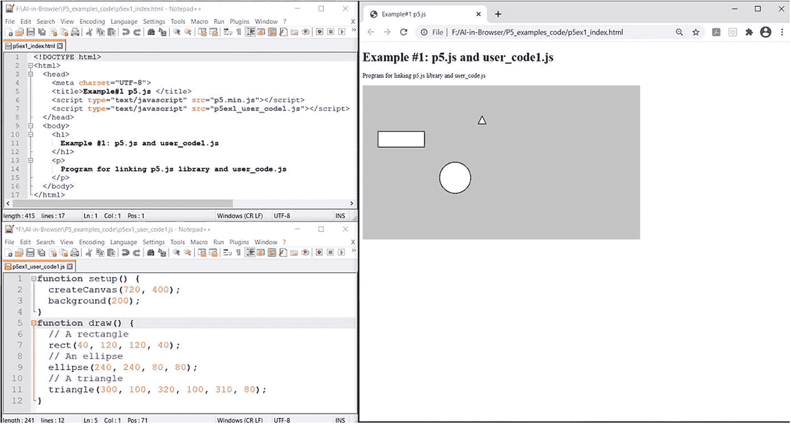

图 2-1

在用户 js 代码中包含 p5.min.js 库

```js
function setup() {
  createCanvas(720, 400);
  background(200);
}
function draw() {
  rect(40, 120, 120, 40); // A rectangle
  ellipse(240, 240, 80, 80);  // An ellipse
  triangle(300, 100, 320, 100, 310, 80); //A triangle
}

Listing 2-1bp5ex1_user_code1.js

```

```js
<!DOCTYPE html>
<html>
  <head>
    <meta charset="UTF-8">
    <title>Example#1 p5.js </title>

    <script type="text/javascript" src="p5.min.js"></script>
    <script type="text/javascript" src="p5ex1_user_code1.js"></script>
  </head>
  <body>
    <h1> Example #1: p5.js and user_code1.js </h1>
    <p>Program for linking p5.js library and user_code.js </p>
  </body>
</html>

Listing 2-1ap5ex1_index.html

```

### 操作 DOM 对象

清单 [2-2a](#PC4) 和 [2-2b](#PC5) 展示了如何使用 JS 库(在本例中为 p5.js): p5ex2_index.html 创建 DOM 对象，图 [2-2](#Fig2) 展示了相应的输出。

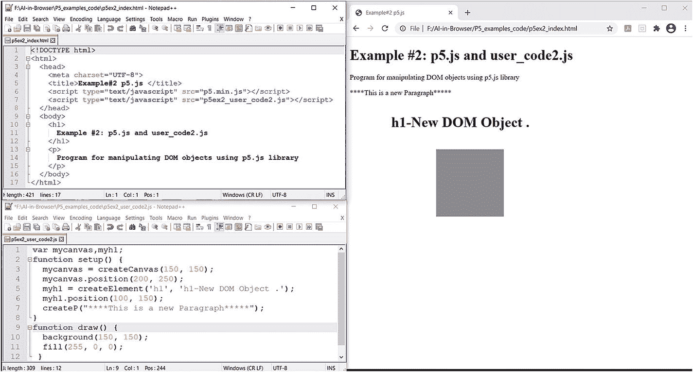

图 2-2

使用 JS 库(在这里是 p5.js)创建 DOM 对象

```js
var mycanvas,myh1;
function setup() {
  mycanvas = createCanvas(150, 150);
  mycanvas.position(200, 250);
  myh1 = createElement('h1', 'h1-New DOM Object .');
  myh1.position(100, 150);
  createP("****This is a new Paragraph*****");
}
function draw() {
  background(150, 150);
  fill(255, 0, 0);
 }

Listing 2-2bp5ex2_user_code2.js

```

```js
<!DOCTYPE html>
<html>
  <head>
    <meta charset="UTF-8">
    <title>Example#2 p5.js </title>
    <script type="text/javascript" src="p5.min.js"></script>
    <script type="text/javascript" src="p5ex2_user_code2.js"></script>
  </head>

  <body>
    <h1> Example #2: p5.js and user_code2.js </h1>
    <p>Program for manipulating DOM objects using p5.js library </p>
  </body>
</html>

Listing 2-2ap5ex2_index.html

```

### DOM onEvent(鼠标按下)处理

清单 [2-3a](#PC6) 和 [2-3b](#PC7) 提供了使用 p5.js 库基于事件调用 DOM 对象的程序。图 [2-3](#Fig3) 显示了相应的输出。

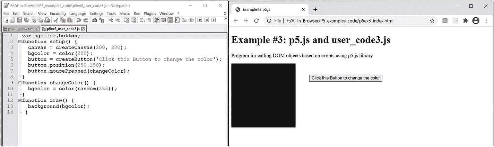

图 2-3

使用 p5.js 库基于事件调用 DOM 对象

```js
var bgcolor,button;
function setup() {
  canvas = createCanvas(200, 200);
  bgcolor = color(200);
  button = createButton('Click this Button to change the color');
  button.position(250,150);
  button.mousePressed(changeColor);
}
function changeColor() {
  bgcolor = color(random(255));
}
function draw() {
  background(bgcolor);
 }

Listing 2-3bp5ex3_user_code3.js

```

```js
<!DOCTYPE html>
<html>
  <head>
    <meta charset="UTF-8">
    <title>Example#3 p5.js </title>
    <script type="text/javascript" src="p5.min.js"></script>
    <script type="text/javascript" src="p5ex3_user_code3.js"></script>
  </head>
  <body>
    <h1>Example #3: p5.js and user_code3.js </h1>
    <p>Program for calling DOM objects based on events using p5.js   library </p>
  </body>
</html>

Listing 2-3ap5ex3_index.html

```

### 事件处理上的多个 DOM 对象

清单 [2-4a](#PC8) 和 [2-4b](#PC9) 显示了使用 p5.js 库的各种 HTML 元素的交互。图 [2-4](#Fig4) 显示了相应的输出。

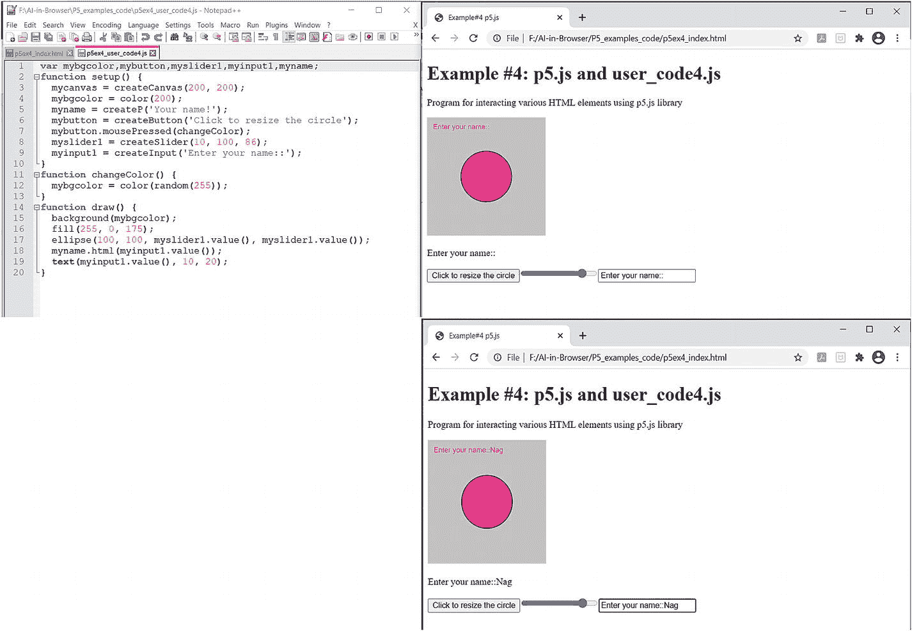

图 2-4

使用 p5.js 库在各种 HTML 元素之间创建交互性

```js
var mybgcolor,mybutton,myslider1,myinput1,myname;
function setup() {
  mycanvas = createCanvas(200, 200);
  mybgcolor = color(200);
  myname = createP('Your name!');
  mybutton = createButton('Click to resize the circle');
  mybutton.mousePressed(changeColor);
  myslider1 = createSlider(10, 100, 86);
  myinput1 = createInput('Enter your name::');
}
function changeColor() {
  mybgcolor = color(random(255));
}

function draw() {
  background(mybgcolor);
  fill(255, 0, 175);
  ellipse(100, 100, myslider1.value(), myslider1.value());
  myname.html(myinput1.value());
  text(myinput1.value(), 10, 20);
}

Listing 2-4bp5ex4_user_code4.js

```

```js
<!DOCTYPE html>
<html>
  <head>
    <meta charset="UTF-8">
    <title>Example#4 p5.js </title>
    <script type="text/javascript" src="p5.min.js"></script>
    <script type="text/javascript" src="p5ex4_user_code4.js"></script>
  </head>
  <body>
    <h1> Example #4: p5.js and user_code4.js </h1>
    <p> Program for interacting various HTML elements using p5.js library
    </p>
  </body>
</html>

Listing 2-4ap5ex4_index.html

```

### HTML 交互式元素

清单 [2-5a](#PC10) 和 [2-5b](#PC11) 展示了使用 p5.js 库与各种 HTML 元素交互的另一个例子。图 [2-5](#Fig5) 显示了相应的输出。

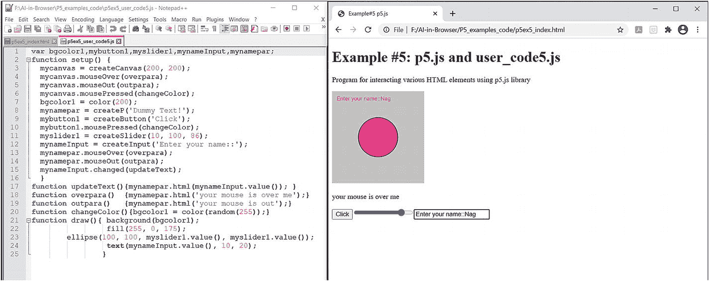

图 2-5

使用 p5.js 库创建 HTML 交互元素

```js
var bgcolor1,mybutton1,myslider1,mynameInput,mynamepar;
function setup() {
  mycanvas = createCanvas(200, 200);
  mycanvas.mouseOver(overpara);
  mycanvas.mouseOut(outpara);
  mycanvas.mousePressed(changeColor);
  bgcolor1 = color(200);
  mynamepar = createP('Dummy Text!');
  mybutton1 = createButton('Click');
  mybutton1.mousePressed(changeColor);
  myslider1 = createSlider(10, 100, 86);
  mynameInput = createInput('Enter your name::');
  mynamepar.mouseOver(overpara);
  mynamepar.mouseOut(outpara);
  mynameInput.changed(updateText);
  }
function updateText(){mynamepar.html(mynameInput.value()); }
function overpara()  {mynamepar.html('your mouse is over me');}
function outpara()   {mynamepar.html('your mouse is out');}
function changeColor(){bgcolor1 = color(random(255));}
function draw(){ background(bgcolor1);
                 fill(255, 0, 175);
             ellipse(100, 100, myslider1.value(), myslider1.value());
                      text(mynameInput.value(), 10, 20);
             }

Listing 2-5bp5ex5_user_code5.js

```

```js
<!DOCTYPE html>
<html>
  <head>
    <meta charset="UTF-8">
    <title>Example#5 p5.js </title>
    <script type="text/javascript" src="p5.min.js"></script>
    <script type="text/javascript" src="p5ex5_user_code5.js"></script>
  </head>
  <body>
    <h1>Example #5: p5.js and user_code5.js</h1>
    <p> Program for interacting various HTML elements using p5.js library
    </p>
  </body>
</html>

Listing 2-5ap5ex5_index.html

```

#### 与 HTML 和 CSS 元素的交互

清单 [2-6a](#PC12) 和 [2-6b](#PC13) 显示了使用 p5.js 库的各种 HTML 元素与 CSS 元素的交互。图 [2-6](#Fig6) 显示了相应的输出。

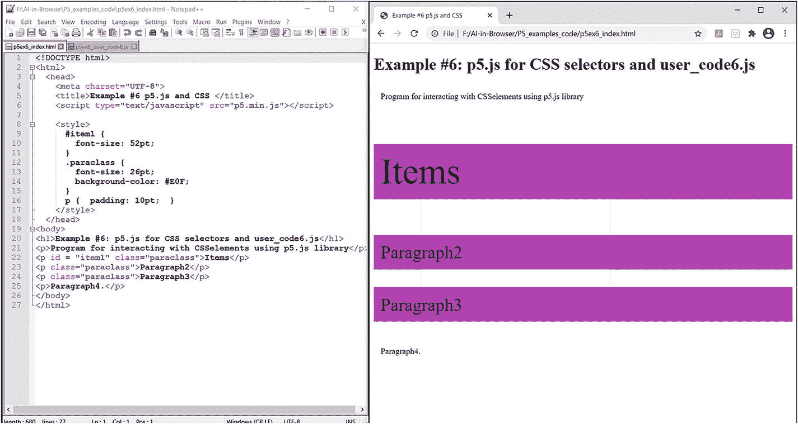

图 2-6

带有 CSS 元素的 p5.js 示例

```js
function setup() {}
function draw() {}

Listing 2-6bp5ex6_user_code6.js

```

```js
<!DOCTYPE html>
<html>
  <head>
    <meta charset="UTF-8">
    <title>Example #6 p5.js and CSS </title>
    <script type="text/javascript" src="p5.min.js"></script>
    <style>
      #item1 {
        font-size: 52pt;
      }
      .paraclass {
        font-size: 26pt;
        background-color: #E0F;
      }
      p {  padding: 10pt;  }
    </style>
  </head>

<body>
<h1>Example #6: p5.js for CSS selectors and user_code6.js</h1>
<p>Program for interacting with CSSelements using p5.js library</p>
<p id = "item1" class="paraclass">Items</p>
<p class="paraclass">Paragraph2</p>
<p class="paraclass">Paragraph3</p>
<p>Paragraph4.</p>
</body>
</html>

Listing 2-6ap5ex6_index.html

```

### DOM 元素的层次化(父子)交互

清单 [2-7a](#PC14) 和 [2-7b](#PC15) 显示了带有父子 DOM 元素的 p5.js。图 [2-7](#Fig7) 显示了相应的输出。

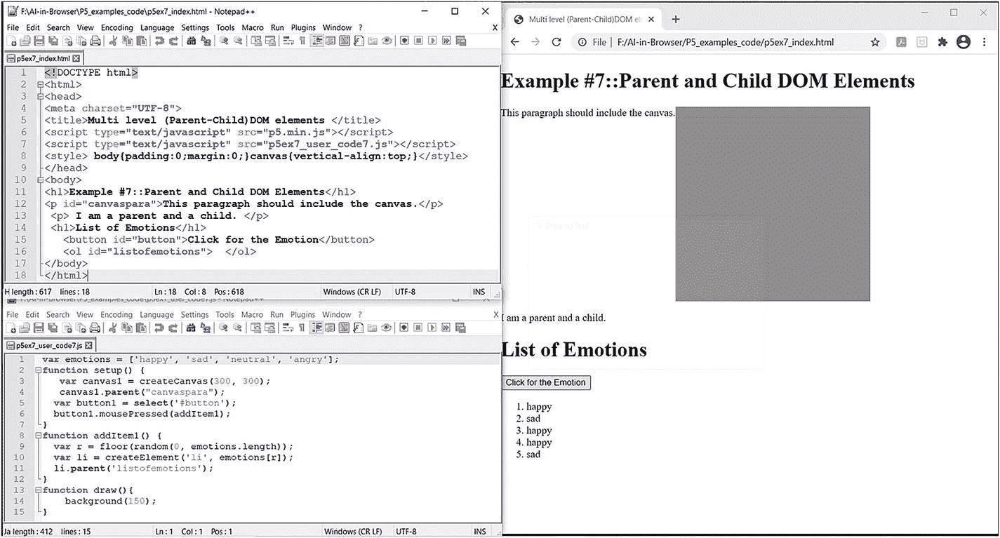

图 2-7

对父子 DOM 元素使用 p5.js

```js
var emotions = ['happy', 'sad', 'neutral', 'angry'];
function setup() {
   var canvas1 = createCanvas(300, 300);
   canvas1.parent("canvaspara");
  var button1 = select('#button');
  button1.mousePressed(addItem1);
}
function addItem1() {
  var r = floor(random(0, emotions.length));
  var li = createElement('li', emotions[r]);
  li.parent('listofemotions');
}
function draw(){
      background(150);
}

Listing 2-7bp5ex7_user_code7.js

```

```js
<!DOCTYPE html>
<html>
<head>
<meta charset="UTF-8">
<title>Multi level (Parent-Child)DOM elements </title>
<script type="text/javascript" src="p5.min.js"></script>
<script type="text/javascript" src="p5ex7_user_code7.js"></script>
<style> body{padding:0;margin:0;}canvas{vertical-align:top;}</style>
</head>
<body>
<h1>Example #7::Parent and Child DOM Elements</h1>
<p id="canvaspara">This paragraph should include the canvas.</p>
 <p> I am a parent and a child. </p>
 <h1>List of Emotions</h1>
   <button id="button">Click for the Emotion</button>
   <ol id="listofemotions">  </ol>
</body>
</html>

Listing 2-7ap5ex7_index.html

```

### 使用变量访问 DOM 父子元素

清单 [2-8a](#PC16) 和 [2-8b](#PC17) 显示了带有使用 p5.js 的变量的父子元素。图 [2-8](#Fig8) 显示了相应的输出。

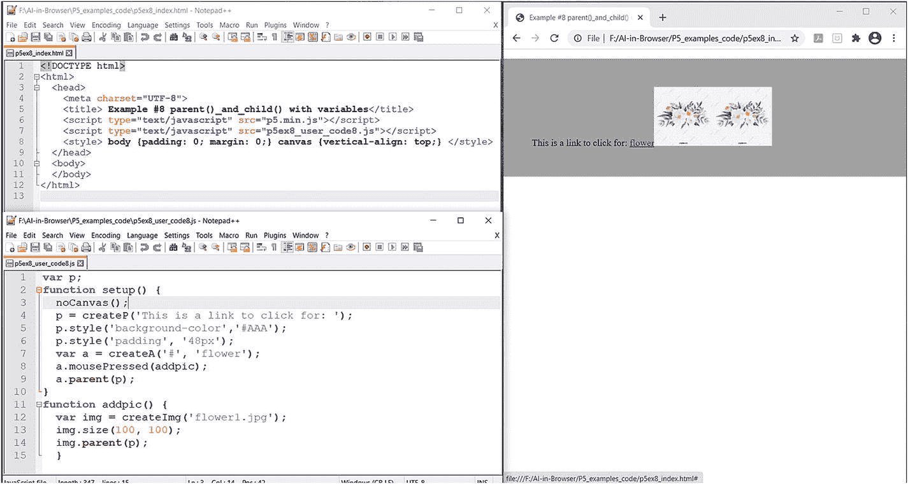

图 2-8

带有父子变量的 p5.js 示例

```js
var p;
function setup() {
  noCanvas();
  p = createP('This is a link to click for: ');
  p.style('background-color','#AAA');
  p.style('padding', '48px');
  var a = createA('#', 'flower');
  a.mousePressed(addpic);
  a.parent(p);
}
function addpic() {
  var img = createImg('flower1.jpg');
  img.size(100, 100);
  img.parent(p);
  }

Listing 2-8bp5ex8_user_code8.js

```

```js
<!DOCTYPE html>
<html>
  <head>
    <meta charset="UTF-8">
    <title> Example #8 parent()_and_child() with variables</title>
    <script type="text/javascript" src="p5.min.js"></script>
    <script type="text/javascript" src="p5ex8_user_code8.js"></script>
    <style> body {padding: 0; margin: 0;} canvas {vertical-align: top;}
    </style>
  </head>
  <body>
  </body>
</html>

Listing 2-8ap5ex8_index.html

```

## 使用 p5.js 在浏览器中进行图形和交互处理

本节提供的示例展示了如何使用 p5.js 库来实现浏览器的交互和图形功能。清单 [2-9a](#PC18) 和 [2-9b](#PC19) 展示了如何使用 p5.js 库实现图形函数来说明鼠标按压事件。图 [2-9](#Fig9) 显示了相应的输出。

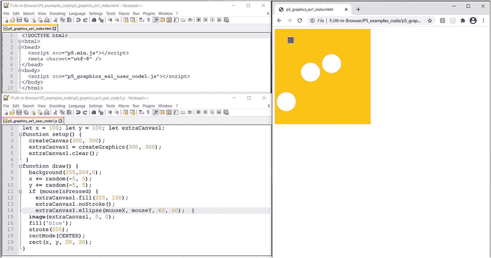

图 2-9

使用 p5.js 库的鼠标按下事件的图形函数

```js
let x = 100;
let y = 100;
let extraCanvas1;
function setup()
{
  createCanvas(300, 300);
  extraCanvas1 = createGraphics(300, 300);
  extraCanvas1.clear();
 }

function draw()
{
  background(255,204,0);
  x += random(-5, 5);
  y += random(-5, 5);
  if (mouseIsPressed) {
    extraCanvas1.fill(255, 150);
    extraCanvas1.noStroke();
    extraCanvas1.ellipse(mouseX, mouseY, 60, 60);
  }
  image(extraCanvas1, 0, 0);
  fill('blue');  stroke(255);
  rectMode(CENTER);  rect(x, y, 20, 20);
}

Listing 2-9bp5_graphics_ex1_user_code1.js

```

```js
<!DOCTYPE html>
<html>
<head>
  <script src="p5.min.js"></script>
  <meta charset="utf-8" />
</head>
<body>
<script src="p5_graphics_ex1_user_code1.js"></script>
</body>
</html>

Listing 2-9ap5_graphics_ex_index.html

```

### 交互式图形应用

清单 [2-10a](#PC20) 和 [2-10b](#PC21) 显示了一个使用 p5.js 库的弹跳球插图的图形脚本。图 [2-10](#Fig10) 显示了相应的输出。

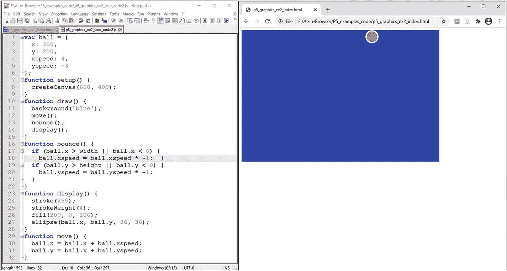

图 2-10

弹跳球的 p5.js 图形脚本

```js
var ball = {
  x: 300,
  y: 200,
  xspeed: 4,
  yspeed: -3
};
function setup() {
  createCanvas(600, 400);
}
function draw() {
  background('blue');
  move();
  bounce();
  display();
}
function bounce() {
  if (ball.x > width || ball.x < 0) {
    ball.xspeed = ball.xspeed * -1;
  }
  if (ball.y > height || ball.y < 0) {
    ball.yspeed = ball.yspeed * -1;
  }
}
function display() {
  stroke(255);
  strokeWeight(4);
  fill(200, 0, 200);
  ellipse(ball.x, ball.y, 36, 36);
}
function move() {
  ball.x = ball.x + ball.xspeed;
  ball.y = ball.y + ball.yspeed;
}

Listing 2-10bp5_graphics_ex2_user_code2.js

```

```js
<!DOCTYPE html>
<html>
<head>
  <script src="p5.min.js"></script>
  <meta charset="utf-8" />
</head>
<body>
<script src="p5_graphics_ex2_user_code2.js"></script>
</body>
</html>

Listing 2-10ap5_graphics_ex2_index.html

```

### 对象实例、多个值的存储以及对象的循环

清单 [2-11a](#PC22) 和 [2-11b](#PC23) 展示了一个使用类、对象、数组和循环特性的 p5.js 图形函数。图 [2-11](#Fig11) 显示了相应的输出。

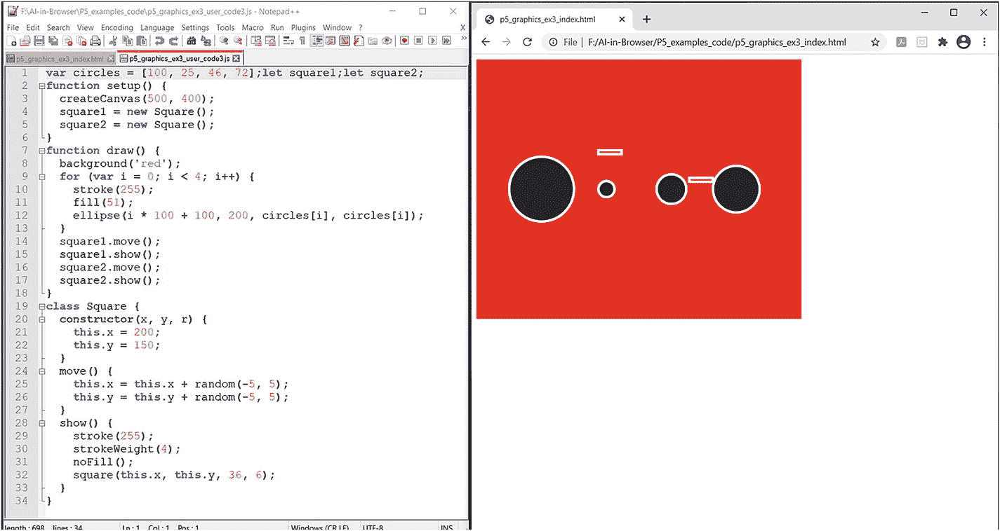

图 2-11

p5.js 图形函数，使用类、对象、数组和循环功能

```js
var circles = [100, 25, 46, 72];
let square1;
let square2;
function setup() {
  createCanvas(500, 400);
  square1 = new Square();
  square2 = new Square();
}

function draw() {
  background('red');
  for (var i = 0; i < 4; i++) {
    stroke(255);
    fill(51);
    ellipse(i * 100 + 100, 200, circles[i], circles[i]);
  }
  square1.move();
  square1.show();
  square2.move();
  square2.show();
}
class Square {
  constructor(x, y, r) {
    this.x = 200;
    this.y = 150;
  }
 move() {
    this.x = this.x + random(-5, 5);
    this.y = this.y + random(-5, 5);
  }
  show() {
    stroke(255);
    strokeWeight(4);
    noFill();
    square(this.x, this.y, 36, 6);
  }
}

Listing 2-11bp5_graphics_ex3_user_code3.js

```

```js
<!DOCTYPE html>
<html>
<head>
  <script src="p5.min.js"></script>
  <meta charset="utf-8" />
</head>
<body>
<script src="p5_graphics_ex3_user_code3.js"></script>
</body>
</html>

Listing 2-11ap5_graphics_ex3_index.html

```

## 使用 ml5.js 和 p5.js 在浏览器中开始机器学习

ml5.js 库使得 AI 对于有创造力的编码者来说是可访问的。该库创建于纽约大学，于 2018 年 7 月公开发布。该库允许访问程序中的人工智能方法和模型，在 TensorFlow.js 上扩展，没有其他外部依赖。 [ml5。js](https://ml5js.org/) library 让 ML 领域的新手生活变得更简单。你可以在这个[链接](https://ml5js.org/)找到更多信息。

要开发和执行包含 p5.js 和 ml5.js 库的程序，您需要以下内容:

*   编辑器:Visual Studio 代码或记事本++

*   网络浏览器:Chrome 或 Firefox

*   用于开发 ML 应用程序的示例图像和数据集

## 在本地设计、开发和执行程序

有两种方法可以在您的计算机上运行本地 web 服务器，以便在本地计算机上开发和执行您的程序。

### 方法 1:使用 Python–HTTP 服务器

1.  在电脑上安装 Python 3+。

2.  `cd /path_to/ml5_p5-examples`(在命令提示符下，转到保存 ml5/p5 程序的文件夹。)

3.  `python -m http.server 8081`

4.  在浏览器 URL 中，键入以下内容:`localhost:8081/indexfilename`

清单 [2-12a](#PC24) 和 [2-12b](#PC25) 显示了使用 Python web 服务器进行图像分类的 ml5.js 库。图 [2-12](#Fig12) 显示了相应的输出。

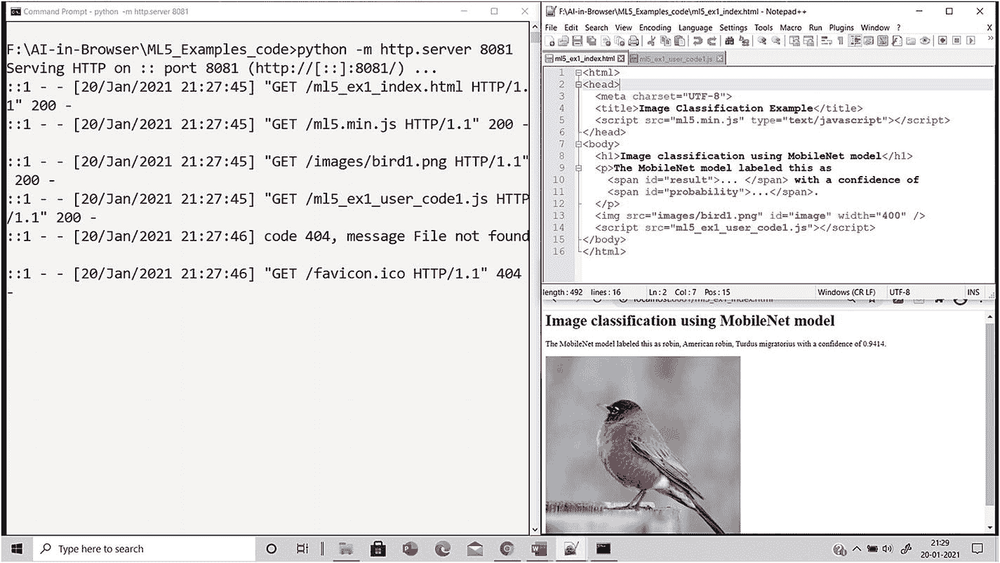

图 2-12

将 ml5.js 库与 Python 服务器和 Notepad++一起使用(与图像分类相关的示例)

```js
const image = document.getElementById('image');
const result = document.getElementById('result');
const probability = document.getElementById('probability');
ml5.imageClassifier('MobileNet')
  .then(classifier => classifier.classify(image))
  .then(results => {
    result.innerText = results[0].label;
    probability.innerText = results[0].confidence.toFixed(4);
  });

Listing 2-12bml5_ex1_user_code1.js

```

```js
<html>
<head>
  <meta charset="UTF-8">
  <title>Image Classification Example</title>
  <script src="ml5.min.js" type="text/javascript"></script>
</head>
<body>
  <h1>Image classification using MobileNet model</h1>
  <p>The MobileNet model labeled this as
    <span id="result">... </span> with a confidence of
    <span id="probability">...</span>.
  </p>
  
  <script src="ml5_ex1_user_code1.js"></script>
</body>
</html>

Listing 2-12aml5_ex1_index.html

```

### 方法 2:将 Visual Studio 代码编辑器用于 Node.js Live Server

1.  从这个[链接](https://nodejs.org/en/download/)下载安装 Node.js。

2.  从这个[链接](https://www.guru99.com/download-install-node-js.html%25232)安装节点包管理器(NPM)。

3.  从这个[链接](https://code.visualstudio.com/docs/setup/windows)下载并安装 Visual Studio 代码。

4.  打开 Visual Studio 代码编辑器并单击 GoLive 按钮，以便可以在浏览器中看到程序的输出。

下面的例子显示了在这种方法下程序的执行。

清单 [2-13](#PC26) 是一个使用 Node.js 服务器进行图像分类的例子。不同图像相关的输出如图 [2-13(a)](#Fig13) 、图 [2-13(b)](#Fig13) 、图 [2-13(c)](#Fig13) 和图 [2-13(d)](#Fig13) 所示。

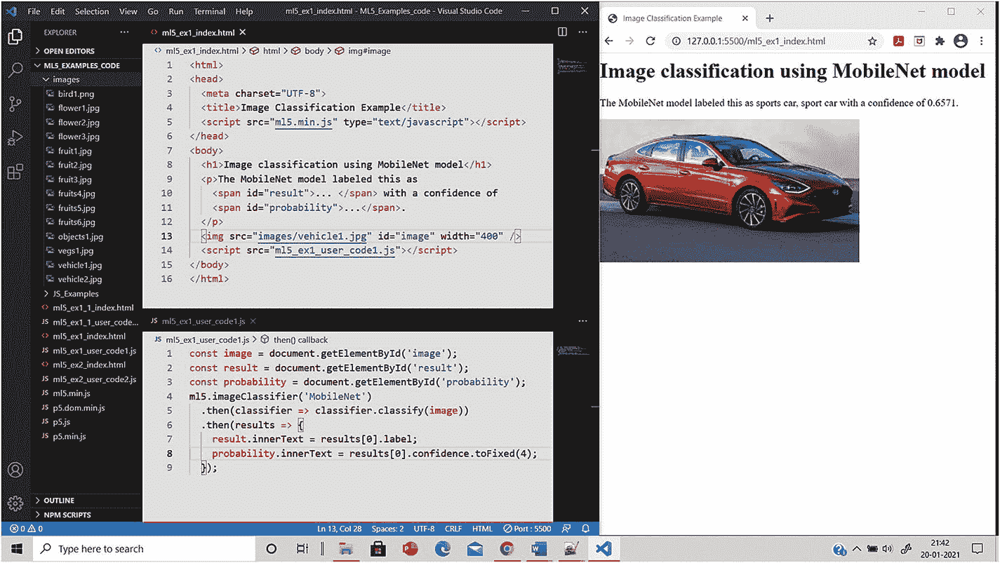

图 2-13(d)。

使用 Node.js 服务器和 Visual Studio 代码进行图像分类(例如:车辆)

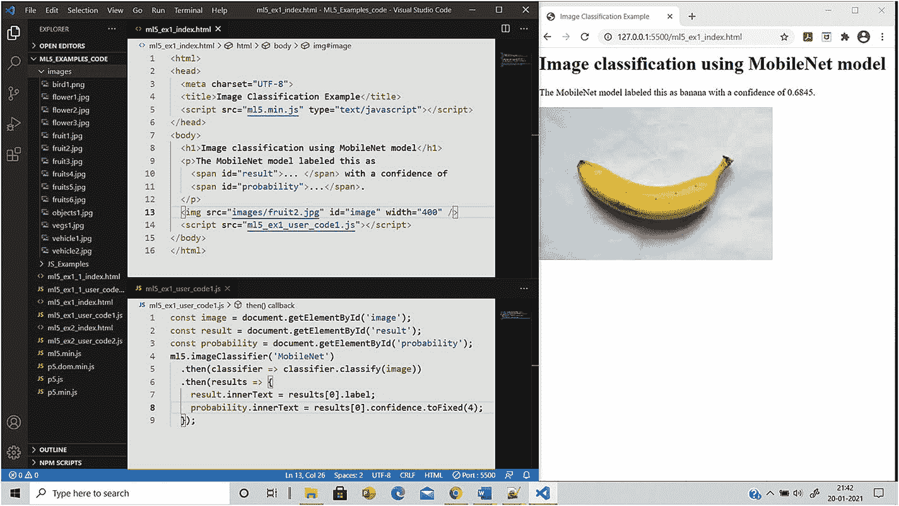

图 2-13(c)。

使用 Node.js 服务器和 Visual Studion 代码进行图像分类(例如:水果)

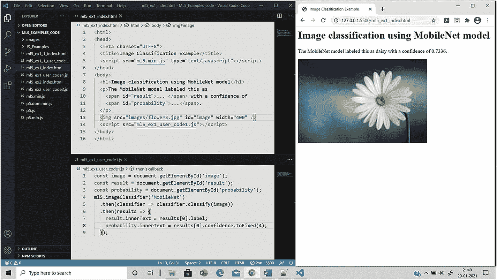

图 2-13(b)。

使用 Node.js 服务器和 Visual Studio 代码进行图像分类(示例:Flower)


图 2-13(a)。

使用 Node.js 服务器和 Visual Studio 代码进行图像分类(例如:鸟)

```js
<html>
<head>
  <meta charset="UTF-8">
  <title>Image Classification Example</title>
  <script src="ml5.min.js" type="text/javascript"></script>
</head>
<body>
  <h1>Image classification using MobileNet model</h1>
  <p>The MobileNet model labeled this as
    <span id="result">... </span> with a confidence of
    <span id="probability">...</span>.
  </p>
  
  <script src="ml5_ex1_user_code1.js"></script>
</body>
</html>
ml5_ex1_1_user_code1.js
const image = document.getElementById('image');
const result = document.getElementById('result');
const probability = document.getElementById('probability');
ml5.imageClassifier('MobileNet')
  .then(classifier => classifier.classify(image))
  .then(results => {
    result.innerText = results[0].label;
    probability.innerText = results[0].confidence.toFixed(4);
  });

Listing 2-13Image Classification Using the Node.js Server

```

ml5.js 库的方法和函数是异步的(因为 ml 模型需要大量的时间来处理输入和生成输出)。

利用承诺 [ml5。js](https://ml5js.org/) 库也支持[承诺](https://developer.mozilla.org/en-US/docs/Web/JavaScript/Reference/Global_Objects/Promise)。如果没有向任何异步函数提供回调，则返回一个承诺。有了承诺，图像分类示例可以用于以下方式。

Note

在前面的示例中，MobileNet 库用于说明。MobileNet 是用于图像分类和移动视觉的卷积神经网络(CNN)架构模型。它最适合 web 浏览器，因为浏览器在计算、图形处理和存储方面有局限性。

## 摘要

AI/ML 研究人员以库的形式为我们提供了大量的功能，使得 AI/ML 的实现就像在我们的解决方案空间中包含各种库一样简单。

在本章中，您学习了如何使用两个 JS 库(p5.js 和 ml5.js ),它们使您能够在浏览器上构建和部署交互式图形和 ml 应用程序。这些新的和改进的库已经在许多应用案例中证明了它们的有效性。

通过使用这些库，您可以以更简单、更自然直观的方式为浏览器上的各种实时应用程序编写代码。

## 参考

*   [T2`https://p5js.org/`](https://p5js.org/)

*   [T2`https://p5js.org/reference/`](https://p5js.org/reference/)

*   麦卡锡劳伦。【p5.js 入门:用 JavaScript 制作交互图形并处理。打造社区，2015。

*   [T2`https://ml5js.org/`](https://ml5js.org/)

*   [T2`https://blog.etereo.io/machine-learning-in-the-browser-for-the-entire-family-125ca5a449a1`](https://blog.etereo.io/machine-learning-in-the-browser-for-the-entire-family-125ca5a449a1)

*   [T2`https://towardsdatascience.com/introduction-to-ml5-js-3fe51d6a4661`](https://towardsdatascience.com/introduction-to-ml5-js-3fe51d6a4661)

*   [T2`https://www.opensourceforu.com/2020/02/ml5-js-machine-learning-made-more-user-friendly/`](https://www.opensourceforu.com/2020/02/ml5-js-machine-learning-made-more-user-friendly/)

*   [T2`https://github.com/processing/p5.js?files=1`](https://github.com/processing/p5.js%253Ffiles%253D1)

*   [T2`https://github.com/ml5js`](https://github.com/ml5js)