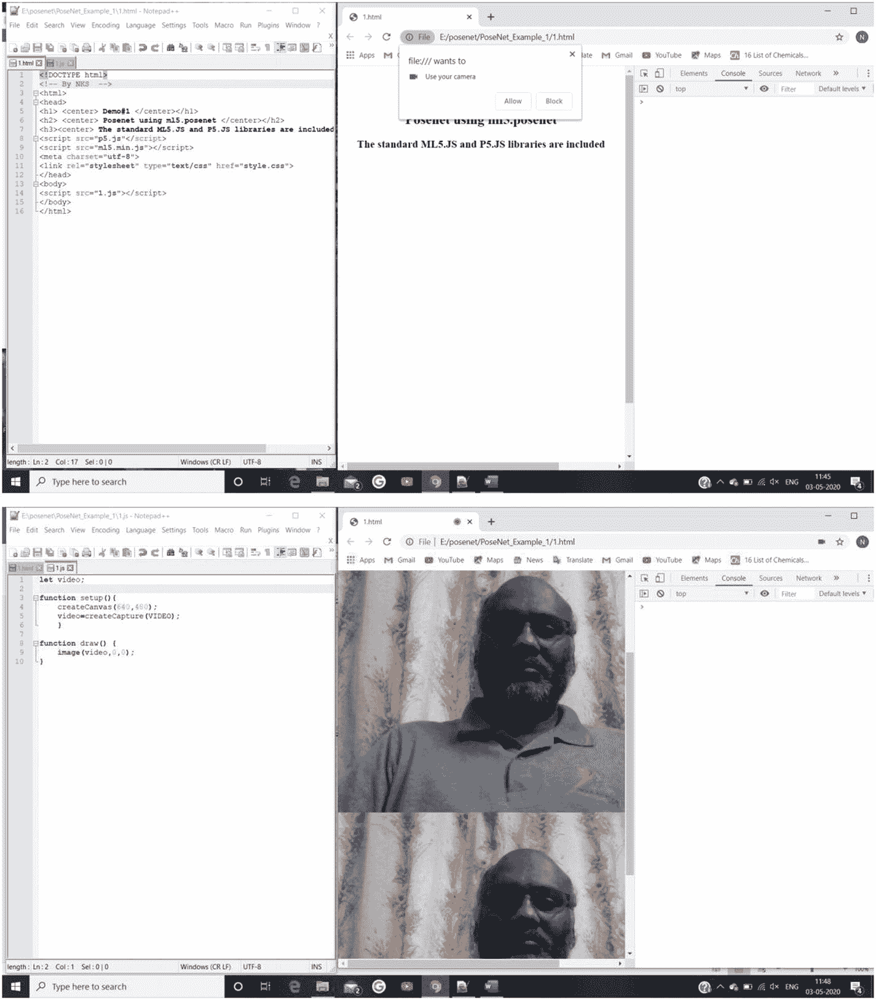
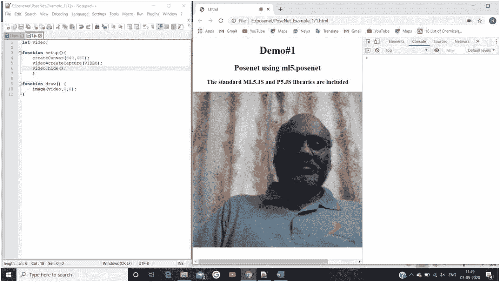
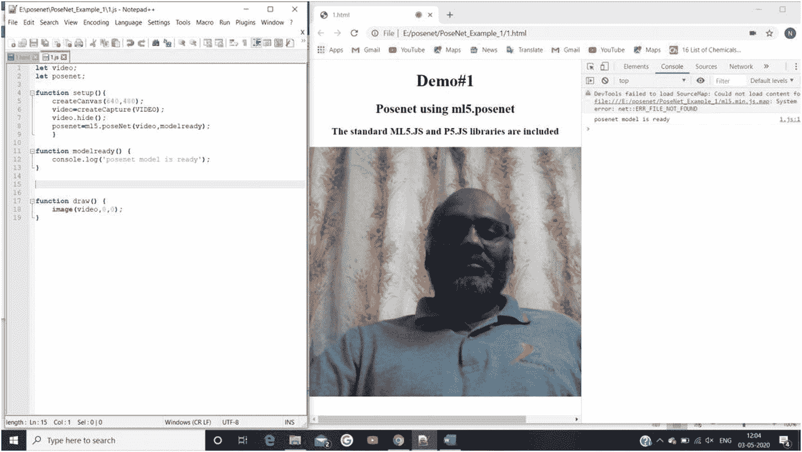
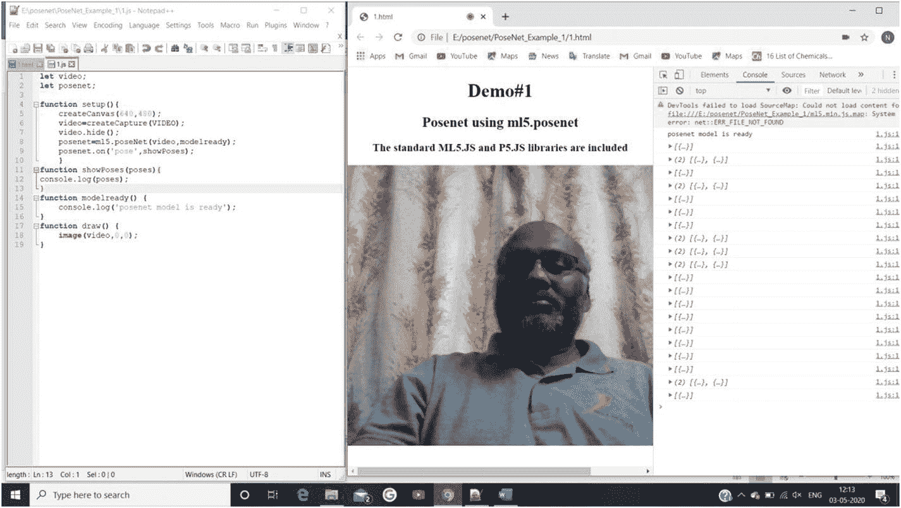
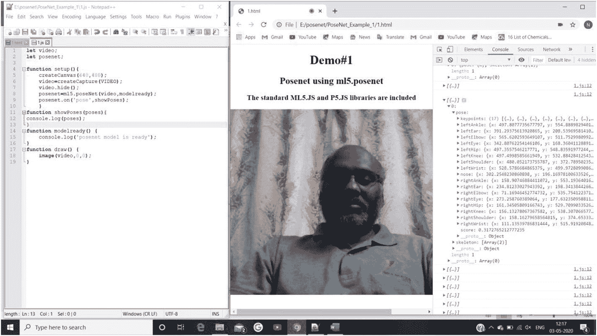
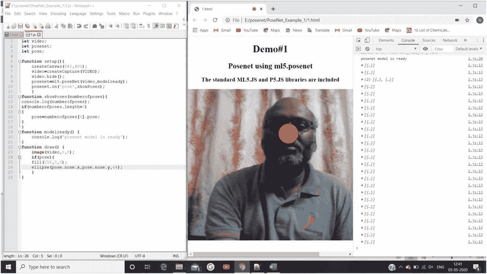
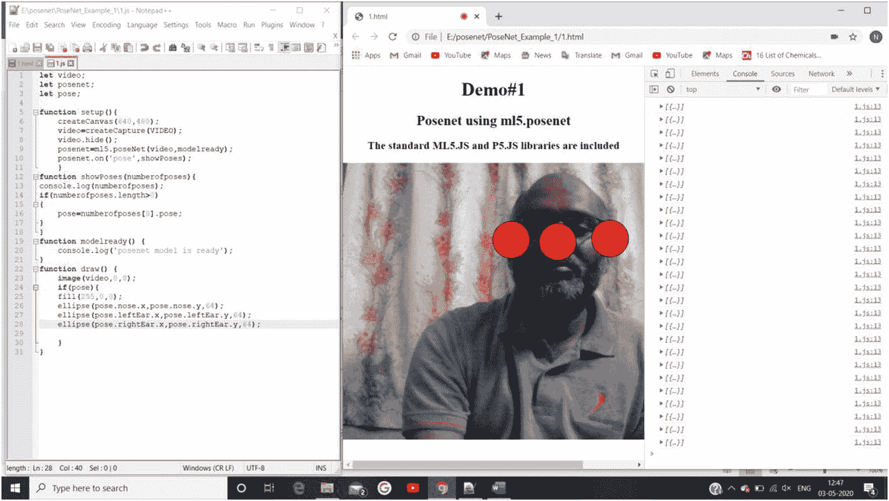
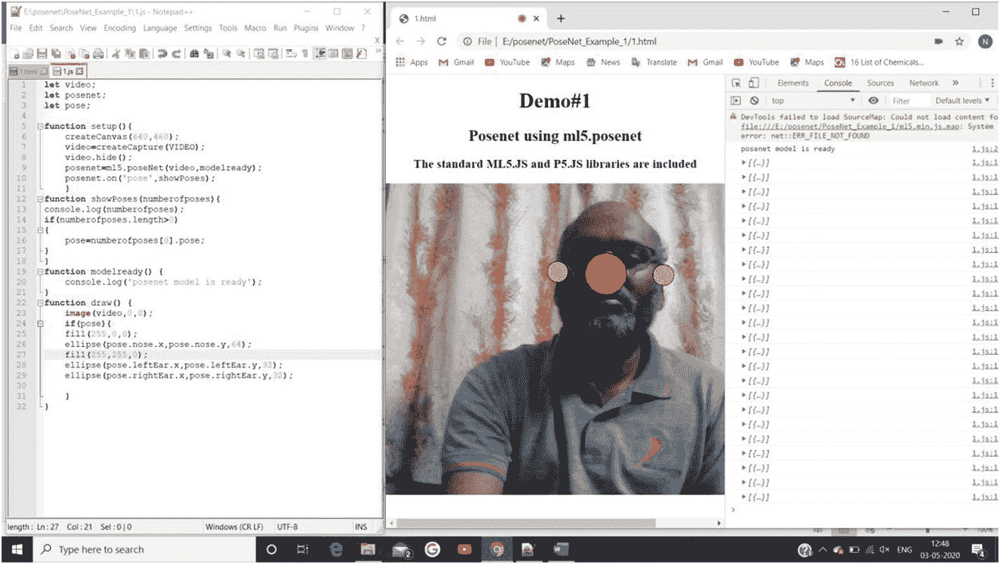
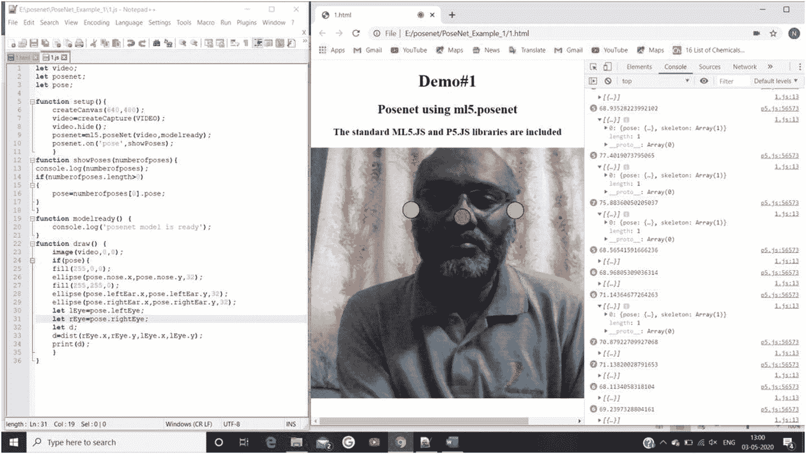
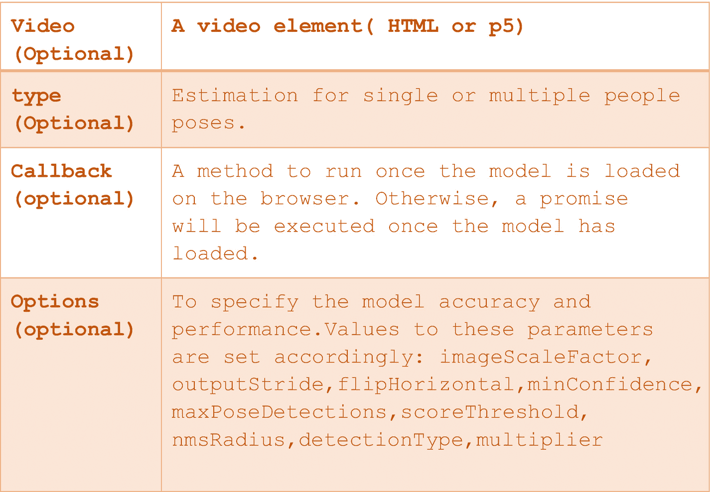

# 3.浏览器中的人体姿态估计

本章描述了人类姿势估计，这是一项计算机视觉进步，旨在通过图片和视频理解人类运动。本章讨论了通过机器学习(ML)方法估计人类姿态的各种方法，重点是 Dan Oved 的 PoseNet 方法。

PoseNet 是一个 ML 模型，它通过找到人体和面部的不同点来进行实时人体姿势估计。本章一步一步地向你展示如何编写代码来识别人脸的各种姿势(关键点)。编程指令教你如何收集和管理与这些关键点相关的数据。该过程将帮助您估计其他重要的人体姿势关键点，并理解它们的分类模式，如以下章节所述。

## 人体姿势一览

人体姿态评估是计算机视觉界在过去几十年中一直在努力解决的一个重要课题。这是理解图片和视频中的个人的关键进步。

人体姿态估计是通过在静止图像或视频中定义人体的关节(也称为*关键点*:肘部、手腕等)来完成的。它也被描述为在所有姿势的空间中寻找一个特定的姿势。

人体 2D 姿势的基础是从 RGB(红、绿、蓝)图像中估计人体姿势的每个关节的 2D 坐标(x，y)。人类 2D 姿态估计可用于评估(并分析和有希望改进)足球运动员(或其他运动员)在比赛中的特定运动。可以监测步态分析，以便早期诊断与此相关的潜在问题。

### 姿势与开放姿势

您可以利用各种库，例如由 Ross Wightman 和 Carnegie Mellon 大学开发的 PoseNet，在计算设备上实现人体姿势估计。PoseNet 是为在浏览器和手机等轻量级计算设备上运行而构建的，而 OpenPose 要精确得多，旨在在图形处理单元(GPU)驱动的系统上运行。

Note

与非 GPU 电子设备相比，在 GPU 驱动的系统上运行 AI/ML 程序更加昂贵和复杂(包括灵活性更低)。

2D 系统的 PoseNet 输出处理速度很快，但它可能会错过整个视频中的许多姿势，这可以通过闪烁和消失的骨架来判断。然而，如果您确实需要在资源受限的设备上使用 PoseNet，例如在移动电话或计算资源较少的嵌入式系统上(例如，有限的处理能力、更少的存储、更少的通信工作量和更快的响应)，PoseNet 是正确的选择。当在浏览器或轻量级计算资源上执行人工智能方法时，使用 PoseNet 的人体姿势估计将使用户能够近实时地做出明智的决定。

您可以在 web 应用程序中使用更好的数据处理过程来提高 PoseNet 估计的准确性，从而生成更好的推断。

## 基于神经网络的人体姿态估计

在文献中，许多人体姿态估计方法使用由各个研究组提出的神经网络原理。以下部分简要描述了人体姿态估计方法的发展。

### DeepPose:通过深度神经网络进行人体姿态估计

DeepPose 是将深度学习(DL)应用于人体姿态评估的主要重要论文。它实现了最先进的(SOTA)执行，并击败了现有的模式。在这种方法中，姿势评估是详细的，就像基于卷积神经网络(CNN)的身体关节复发问题。此外，该方法利用回归过程来改进姿势评估和改进标准。这种方法做的一件有意义的事情是解释综合设计中的姿势(例如，某些关节是否被掩盖；如果姿势考虑全面，可以对它们进行评估)。该论文认为，CNN 通常会给出可能的姿势，并显示可靠的结果。由作者指定的方法产生的 xy 坐标值是不准确的，因为它显示了不适合人体特定关节的多面性(多组值)。

### 使用卷积网络的有效目标定位

这种方法通过在不同分辨率下运行一张图片来创建热图，以捕捉各种尺度下的关节。收益率是一个离散的热图，而不是无休止的复发。热图预测了每一个像素发生这种情况的可能性。这个产量模型是有用的，随后的一些论文预测了热图，而不是直接回归。作者考虑了 CNN 和图形模型的联合应用。

### 卷积姿态机器

卷积姿态机器是可微分的，它们的多级工程可以从头到尾准备好。它们为学习丰富的特定空间模型提供了一个连续的预测系统，并且非常适合人类姿势。这篇论文的一个真正的启发是学习长程空间联系，他们表明这可以通过利用深层多级网络来实现。本文在每个阶段之后利用适度管理来避免倾向蒸发的问题，这是深刻的多级组织的典型问题。

### 具有迭代误差反馈的人体姿态估计

这种方法直接预见了结果。该方法利用自调整模型，该自调整模型通过关注反馈数据来逻辑地改变底层布置，且该循环被称为*迭代误差反馈*。

### 用于人体姿态估计的堆叠沙漏网络

堆叠沙漏网络是一种新颖而直观的设计，胜过以往的所有技术。之所以称之为堆叠沙漏网络，是因为该组织包括汇集和向上采样图层的步骤(类似沙漏)，并且这些步骤堆叠在一起。沙漏计划是由在每个尺度上获取数据的需求驱动的。

### 人体姿态估计和跟踪的简单基线

早期的方法总体上运行良好，但是不可预测。在竞赛(COCO)数据集上，以 73.7%的平均精度(mAP)取得了同类最佳成绩。组织结构很简单，包括一个残差神经网络(ResNet)和几个去卷积层。

### 用于人体姿态估计的深度高分辨率表示学习

在使用特定数据集的单人关键点检测和多人姿势估计方面，高分辨率网络模型优于先前的方法。与前面提到的方法相比，这种方法效果很好。

本节简要描述了人体姿态估计中最杰出和最有影响力的模型。这些方法基于 DL 方法，具有不同的准确率。

## 使用 ml5.js:posenet()方法

虽然各种方法使我们能够估计人体姿态关键点，但丹·奥维德的 PoseNet 模型在浏览器和资源受限的计算设备上进行[实时人体姿态估计](https://medium.com/tensorflow/real-time-human-pose-estimation-in-the-browser-with-tensorflow-js-7dd0bc881cd5)。本节概述了他使用`ml5.posenet`方法收集人体姿态估计的步骤。

Note

我们将在 1.js 脚本文件中逐步添加指令(代码)来捕获视频并识别人体姿势关键点，以便您可以更好地理解浏览器应用程序的开发。

**步 1A。**包括 PoseNet 模型的 ml5.js 和 p5.js 库(清单 [3-1a](#PC1) )。

```py
<html>
<head>
<h1> <center> Demo#1</center></h1>
<h2> <center> Posenet using m15.posenet</center> </h2>
<h3> <center> The standard ML5.JS and P5.JS libraries are included </center> </h3>
<script src="p5.js"</script>
<script src="m15.min.js"></script>
<meta charset="utf-8">
<link rel="stylesheet" type="text/css" href="style.css">
</head>
<body>
<script src="1.js"> </script>
</body>
</html>

Listing 3-1a1.html

```

**步 1B。**见 1.js 脚本(清单 [3-1b](#PC2) )捕捉视频。主文件(1.html)编程指令保持不变。

```py
Let video;
Function setup() {
      createCanvas(640,480);
      video=createCapture(VIDEO);
}
Function draw() {
      Image(video,0,0);
}

Listing 3-1b1.js

```

图 [3-1](#Fig1) 显示了代码的相应输出。您必须点按“允许”按钮来查看面孔。



图 3-1

与 1.html 和 1.js 脚本相关的屏幕截图(输出),用于在单击 Allow 按钮后捕获浏览器网络摄像头视频。这两个视频描述了 I)原始视频捕获和 ii)绘制到画布上的捕获视频

**第二步。**在 1.js 脚本中添加`video.hide()`函数隐藏抓取的视频，只显示画布视频(清单 [3-2](#PC3) )。图 [3-2](#Fig2) 显示了相应的输出。



图 3-2

截图(输出)。仅在画布上显示捕获的视频；原始视频是隐藏的

```py
Let video;
Function setup() {
      createCanvas(640,480);
      video=createCapture(VIDEO);
      video.hide();
}
Function draw() {
      Image(video,0,0);
}

Listing 3-2Adding video.hide()

```

**第三步。**调用 1.js 脚本中的`ml5.poseNet( )`方法(清单 [3-3](#PC4) )。图 [3-3](#Fig3) 显示输出**。**



图 3-3

调用方法`ml5.poseNet()`的截图(输出)。模型被加载到浏览器应用程序中，如浏览器控制台所示

```py
Let video;
Let posenet;
Function setup() {
      createCanvas(640,480);
      video=createCapture(VIDEO);
video.hide();
posenet=m15.poseNet(video.modelready);
}
Function modelready() {
      Console.log('posenet model is ready');
}

Function draw() {
      Image(video,0,0);
}

Listing 3-3Invoking ml5.poseNet( )

```

**第四步。**在 1.js 中为这个`poseNet.on( )`方法估计实时姿态，(即监听新姿态)(列表 [3-4](#PC5) )。图 [3-4](#Fig4) 显示了相应的输出。


图 3-4

屏幕截图(输出)一旦加载了 PoseNet 模型并且 poseNet.on()监听了用户的新姿势

```py
Let video;
Let posenet;
Function setup() {
      createCanvas(640,480);
      video=createCapture(VIDEO);
      video.hide();
      posenet=m15.poseNet(video.modelready);
      posenet.on('pose',showPoses);
}
Function showPoses(poses) {
      console.log(poses)
}
Function modelready() {
      console.log('posenet model is ready');
}
Function draw() {
      Image(video,0,0);
}

Listing 3-4poseNet.on( )

```

**第五步。**在 1.js 脚本文件中添加函数`showPoses()`，使得与姿态相关的数据存储在相应的张量中，并在浏览器控制台中显示(列表 [3-5](#PC6) )。图 [3-5](#Fig5) 显示了相应的输出。



图 3-5

截图(输出)。张量中收集的数据显示在浏览器控制台中

```py
Let video;
Let posenet;
Function setup() {
      createCanvas(640,480);
      video=createCapture(VIDEO);
      video.hide();
      posenet=m15.poseNet(video.modelready);
      posenet.on('pose',showPoses);
}
Function showPoses(poses) {
      console.log(poses)
}
Function modelready() {
      console.log('posenet model is ready');
}
Function draw() {
      Image(video,0,0);
}

Listing 3-5Adding showPoses()

```

**第六步。**在 1.js 脚本文件中添加一个在对象姿态中收集的姿态数组(列表 [3-6](#PC7) )。图 [3-6](#Fig6) 显示了相应的输出。



图 3-6

截图(输出)。在对象姿态中收集的姿态阵列显示在浏览器控制台中

```py
Let video;
Let posenet;
Function setup() {
      createCanvas(640,480);
      video=createCapture(VIDEO);
      video.hide();
      posenet=m15.poseNet(video.modelready);
      posenet.on('pose',showPoses);
}
Function showPoses(poses) {
      console.log(poses)
}
Function modelready() {
      console.log('posenet model is ready');
}
Function draw() {
      Image(video,0,0);
}

Listing 3-6Array of Poses Collected in the Object Poses

```

**第七步。** `poseNet.on ()`返回一个数组，里面有一个物体的几个姿态(关键点)，通过改变 1.js 脚本文件中的函数`draw()`来识别鼻子 x 和 y 坐标等姿态(清单 [3-7](#PC8) )。图 [3-7](#Fig7) 显示了相应的输出。



图 3-7

屏幕截图(输出)显示了具有多个姿势的单个对象，并识别了特定的姿势(关键点):鼻子的 x 和 y 坐标带有一个红色椭圆

```py
Let video;
Let posenet;
Let pose;
Function setup() {
      createCanvas(640,480);
      video=createCapture(VIDEO);
video.hide();
posenet=m15.poseNet(video.modelready);
posenet.on('pose',showPoses);
}

Function showPoses(numberofposes) {
console.log(numberofposes);
if(numberofposes.length>0)
{
      Pose=numberofposes[0].pose;
}
}

Function modelready() {
      console.log('posenet model is ready');
}

Function draw() {
      Image(video,0,0);
      If(pose) {
fill(255,0,0);
ellipse(pose.nose.x,pose.y,64);}
}

Listing 3-7Altering the draw() Function by Adding the ellipse Method to Display the Specific Keypoints

```

**第八步。**在 1.js 脚本文件中添加指令(代码)`draw()`函数，识别两种不同的人体姿态(关键点):鼻子和耳朵(列表 [3-8](#PC9) )。图 [3-8](#Fig8) 显示了相应的输出**。**



图 3-8

识别两种不同姿势(关键点)的屏幕截图(输出):鼻子和耳朵

```py
Let video;
Let posenet;
Let pose;

Function setup() {
      createCanvas(640,480);
      video=createCapture(VIDEO);
video.hide();
posenet=m15.poseNet(video.modelready);
posenet.on('pose',showPoses);
}

Function showPoses(numberofposes) {
console.log(numberofposes);
if(numberofposes.length>0)
{
      Pose=numberofposes[0].pose;
}
}

Function modelready() {
      console.log('posenet model is ready');
}

Function draw() {
      Image(video,0,0);
      If(pose) {
fill(255,0,0);
ellipse(pose.nose.x,pose.nose.y,64);
ellipse(pose.leftEar.x.pose.leftEar.y,64);
ellipse(pose.rightEar.x.pose.rightEar.y,64);
}
}

Listing 3-8Highlighting the Nose and Ear

```

**第九步。**修改 1.js 脚本文件中的`draw()`函数，用多种颜色区分姿势(关键点)(列表 [3-9](#PC10) )。图 [3-9](#Fig9) 显示了相应的输出。



图 3-9

使用多种颜色区分姿势的截图(输出)

```py
Let video;
Let posenet;
Let pose;

Function setup() {
      createCanvas(640,480);
      video=createCapture(VIDEO);
video.hide();
posenet=m15.poseNet(video.modelready);
posenet.on('pose',showPoses);
}

Function showPoses(numberofposes) {
console.log(numberofposes);
if(numberofposes.length>0)
{
      Pose=numberofposes[0].pose;
}
}
Function modelready() {
      console.log('posenet model is ready');
}

Function draw() {
      Image(video,0,0);
      If(pose) {
fill(255,0,0);
ellipse(pose.nose.x,pose.nose.y,64);
ellipse(pose.leftEar.x.pose.leftEar.y,32);
ellipse(pose.rightEar.x.pose.rightEar.y,32);
}
}

Listing 3-9Adding Multiple Colors

```

**第十步。**通过修改 1.js 脚本文件中的指令`draw()`函数(清单 [3-10](#PC11) )来改变识别出的姿态的大小和形状。图 [3-10](#Fig10) 显示了相应的输出。



图 3-10

截图(输出)。改变已识别姿态的大小和形状

```py
Let video;
Let posenet;
Let pose;

Function setup() {
      createCanvas(640,480);
      video=createCapture(VIDEO);
video.hide();
posenet=m15.poseNet(video.modelready);
posenet.on('pose',showPoses);
}

Function showPoses(numberofposes) {
console.log(numberofposes);
if(numberofposes.length>0)
{
      Pose=numberofposes[0].pose;
}
}
Function modelready() {
      console.log('posenet model is ready');
}

Function draw() {
      Image(video,0,0);
      If(pose) {
fill(255,0,0);
ellipse(pose.nose.x,pose.nose.y,32);
fill(255,255,0);
ellipse(pose.leftEar.x.pose.leftEar.y,32);
ellipse(pose.rightEar.x.pose.rightEar.y,32);
let lEye=pose.leftEye;
let rEye=pose.rightEye;
let d;
d=dist(rEye.x,rEye.y,lEye.x,lEye.y);
print(d);
}
}

Listing 3-10Changing Size and Shape

```

**第十一步。**通过修改 1.js 脚本文件`draw()`函数(清单 [3-11](#PC12) )找到识别出的姿态之间的距离。图 [3-11](#Fig11) 显示了相应的输出。


图 3-11

截图(输出)。找出已识别姿态之间的距离，并在浏览器控制台上显示它们

```py
Let video;
Let posenet;
Let pose;
Function setup() {
      createCanvas(640,480);
      video=createCapture(VIDEO);
video.hide();
posenet=m15.poseNet(video.modelready);
posenet.on('pose',showPoses);
}

Function showPoses(numberofposes) {
console.log(numberofposes);
if(numberofposes.length>0)
{
      Pose=numberofposes[0].pose;
}
}
Function modelready() {
      console.log('posenet model is ready');
}

Function draw() {
      Image(video,0,0);
      If(pose) {
fill(255,0,0);
ellipse(pose.nose.x,pose.nose.y,32);
fill(255,255,0);
ellipse(pose.leftEar.x.pose.leftEar.y,32);
ellipse(pose.rightEar.x.pose.rightEar.y,32);
let lEye=pose.leftEye;
let rEye=pose.rightEye;
let d;
d=dist(rEye.x,rEye.y,lEye.x,lEye.y);
print(d);
for (let i=0;i<pose.keypoints.length;i++) {
            let x=pose.keypoints[i].position.x;
            let y=pose.keypoints[i].position.y;
            fill(0,250,0);
            ellipse(x,y,20,20);
      }
for(let i=0;i<line_connecting_points.length;i++){
            let m=line_connecting_points[i][0];
            let n=line_connecting_points[i][1];
            strokeWeight(2);
            stroke(250);
      line(m.position.x,m.position.y,n.position.x,n.position.y);
      }
}
}

Listing 3-11Finding the Distance Between the Recognized Poses

```

既然您已经理解了如何使用 PoseNet 模型来识别关键点，那么重点就转向如何收集和存储数据，以便通过各种编程结构来识别数据模式，从而实现多种应用程序。

## PoseNet 模型的输入、输出和数据结构

本节介绍当输入为视频数据时程序中可用的各种功能。这将帮助您理解可用于在浏览器上渲染(加载)视频的各种功能(方法),并在发生任何移动(变化)时识别各种姿势。

PoseNet 使您能够在图片或视频中测量一个人的单独姿势(即一个人的单一姿势)或多人的各种姿势，这意味着一个计算的再现可以在图片/视频中只区分一个人，而一个表单可以在图片/视频中识别许多人。

### 投入

在这种情况下，输入是 HTML 视频或页面的图像元素(图片)或 p5 图像/视频元素。如果没有提供特定的输入，PoseNet 默认使用浏览器的网络摄像头作为输入。以下代码片段显示了如何读取个人的输入(姿势):

```py
const video = document.getElementById("video");
// Create a new myposeNet method
const myposeNet = ml5.poseNet(video, modelLoaded);

// When the model is loaded in the browser
function modelLoaded() {
  console.log("Model Loaded!");
}

```

PoseNet 方法的各种参数如下:

*   `ml5.poseNet(video[Optional], type[Optional], callback[Optional])`

*   `ml5.poseNet(video[Optional], options[Optional], callback[Optional])`

*   `ml5.poseNet(callback[Optional], options[Optional])`

表 [3-1](#Tab1) 描述了`ml5.poseNet`方法的自变量(参数)。

表 3-1

ml5 .提出论点



### 输出

当个人的姿态被加载到浏览器上时(即，浏览器网络摄像头读取视频流数据)，相应的姿态(关键点)由函数`poseNet()`作为结果(输出)给出。然后将结果(输出)传递给临时程序变量`myposes`，如下所示:

```py
// Listen to new 'pose' events when there are changes // in the orientation of the poses.
myposeNet.on("pose", function(results) {
  myposes = results;
});

```

### 。on()函数

每当检测到一个新姿势时，`.on ('pose', function(results))`方法就会触发一个事件。该方法连续监听视频帧上的姿态变化。函数(results)返回由姿势识别组成的对象数组中的结果。

### 摘要

本章一步一步向你展示了如何使用 Dan Oved 的 PoseNet 模型在浏览器中描绘实时人体姿态估计。

您了解了 PoseNet 模型的复杂性，例如姿势包含的内容:姿势置信度得分、17 个关键点的数组，以及每个关键点依次由关键点位置和关键点置信度得分以及输入图像空间组成。

本章还介绍了处理收集到的关键点数据所需的编程结构。在接下来的章节中，你将学习开发多种应用程序所需的编程技巧，比如人体姿态分类和步态分析。

## 参考

*   [T2`https://ml5js.org/reference/api-PoseNet/`](https://ml5js.org/reference/api-PoseNet/)

*   [T2`https://github.com/ml5js/ml5-library/tree/release/src/PoseNet`](https://github.com/ml5js/ml5-library/tree/release/src/PoseNet)

*   [https:// parleylabs。com/2020/01/05/exploration-pose-estimation-with-open pose-and-pose net/#:~:text = pose net % 20 is % 20 build % 20 to % 20 run](https://parleylabs.com/2020/01/05/exploration-pose-estimation-with-openpose-and-posenet/%2523:%257E:text%253DPoseNet%2520is%2520built%2520to%2520run)T0】

*   Toshev，a .和 C. Szegedy，“深度姿势:通过深度神经网络的人类姿势估计”2014 年 IEEE 计算机视觉与模式识别大会，第 1653-1660 页，doi: 10.1109/CVPR.2014.214 .俄亥俄州哥伦布市，2014。

*   使用卷积网络的有效目标定位。2015 年 IEEE 计算机视觉与模式识别大会(CVPR)，第 648-656 页，doi: 10.1109/CVPR.2015.7298664 .波士顿，马萨诸塞州，2015 年。

*   卡瑞拉，j . p .阿格拉瓦尔，k .弗拉基阿达基和 j .马利克，“迭代误差反馈的人体姿态估计”2016 年 IEEE 计算机视觉与模式识别大会(CVPR)，第 4733-4742 页，doi: 10.1109/CVPR.2016.512 .拉斯维加斯，NV，2016。

*   人体姿态估计的堆叠沙漏网络。载于:Leibe B .，J. Matas，N. Sebe 和 M. Welling(编辑)。计算机视觉–2016 ECCV。计算机科学讲义，第 9912 卷。施普林格出版社，2016 年。

*   肖，宾，吴，魏。*人体姿态估计和跟踪的简单基线*。斯普林格国际出版公司，2018 年。

*   https://doi . org/10 . 1007/978-3-030-01231-1 _ 29，计算机视觉-ECCV 2018

*   孙，k，b .肖，d .刘，和 j .王。(2019 年 a)。用于人体姿态估计的深度高分辨率表示学习。在 CVPR: [https:// openaccess。thecvf。com/content _ CVPR _ 2019/papers/Sun _ Deep _ High-Resolution _ re presentation _ Learning _ for _ Human _ Pose _ Estimation _ CVPR _ 2019 _ paper。pdf](https://openaccess.thecvf.com/content_CVPR_2019/papers/Sun_Deep_High-Resolution_Representation_Learning_for_Human_Pose_Estimation_CVPR_2019_paper.pdf)

*   [T2`https://zhangtemplar.github.io/pose/`](https://zhangtemplar.github.io/pose/)

*   [T2`https://nanonets.com/blog/human-pose-estimation-2d-guide/`](https://nanonets.com/blog/human-pose-estimation-2d-guide/)