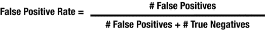
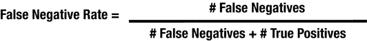
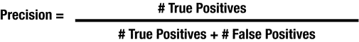
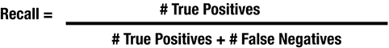

# 十九、评估智能

评估就是创造，至少在为智能系统构建智能时是这样。这是因为智能创造通常涉及对有效智能的迭代搜索:产生一个新的候选智能，将其与前一个候选智能进行比较，并选择两者中较好的一个。要做到这一点，你需要能够观察一对智能并回答如下问题:

*   我应该在我的智能系统中使用哪一种？
*   哪一个能更好地实现系统的目标？
*   哪个会给我和我的用户带来更少的麻烦？
*   它们中的任何一个都足以交付给客户吗，或者还有更多工作要做？

评估智力主要有两种方式:

*   在线评估:将它展示给顾客，看他们如何反应。在前面的章节中，当我们谈到评估体验和管理智能(通过无声智能、受控展开和飞行)时，我们已经讨论过这个问题。
*   离线评估:通过观察它在历史数据上的表现。这是本章的主题，因为它对智力创造过程至关重要。

本章讨论了情报准确的含义。然后，它将解释如何使用数据来评估智力，以及一些陷阱。它将介绍比较智能的概念性工具。最后，它将探索智力的主观评价方法。

## 评估准确性

当然，情报应该是准确的。但是准确并不是一个简单的概念，智能失败的方式有很多。一个有效的情报将具有以下特性:

*   它会归纳出以前没见过的情况。
*   它会犯正确类型的错误。
*   它会很好地分布它所犯的错误。

本节将更详细地探讨这些属性。

### 一般化

智能创造中的一个关键挑战是产生在你创造智能时对你不知道的事物有效的智能。

考虑一个学生，他阅读课程课本并记住每一个事实。那很好。这个学生会非常准确地鹦鹉学舌般地背诵课本上的东西。但是现在想象一下，老师设计了一个测试，不要求学生重复课本上的事实。相反，老师希望学生证明他们理解了课本上的概念，并将它们应用到新的环境中。如果学生对主题形成了良好的心智模型，他们可能会通过测试。如果学生对主题有错误的心理模型，或者根本没有心理模型(只是记住了事实)，他们在新的环境中应用知识时不会做得很好。这与智能系统中的智能是一样的——它必须推广到新的情况。

让我们看一个例子。考虑建立智能，检查书籍并按类型分类——科幻、浪漫、科技、惊悚、历史小说，诸如此类。

你收集了 1000 本书，手工标注了它们的类型，然后开始创造智慧。我们的目标是能够找到一本新书(不属于 1000 本书的那一本)并准确预测它的类型。

如果你是通过记忆作者的信息来建立这种智力的呢？你可能会查看你的 1，000 本书，发现它们是由 815 位不同的作者写的，然后列出如下清单:

*   罗伊·罗杰森写恐怖小说。
*   蒂姆·蒂尼写科幻小说。
*   尼尔·诺森写技术书籍。
*   诸如此类。

当你得到一本新书时，你在这个列表中查找它的作者。如果作者在那里，返回流派。如果作者不在那里，那么你就被困住了。这种模式不理解“体裁”的概念，它只是记住了一些事实，不会归纳到它不知道的作者身上(如果作者写的是两种不同的体裁，它会很困惑)。

在评估情报的准确性时，重要的是测试它的概括能力。确保你把智能放在它从未见过的环境中，并测量它适应的程度。

### 错误的类型

智能会犯许多类型的错误，有些错误会比其他错误带来更多的麻烦。当我们讨论智能体验时，我们已经在第 [6](06.html) 章中讨论了假阳性和假阴性的概念，但是让我们回顾一下(见图 [19-1](#Fig1) )。当预测分类时，智能可能会出错

图 19-1

Different Types of mistakes.

*   说某物是一类的，而它不是。
*   说某事不属于某一类，当它属于某一类时。

例如，假设智能做这些事情之一:

*   说有人在门口，但没有；或者它说门口没人，但有人在。
*   说是时候给火上浇油了，其实不是(火已经够热了)；或者它说还没到加燃料的时候，但它已经加了(因为火就要熄灭了)。
*   说这本书是一个浪漫，但它不是；或者说这本书不是爱情小说，但它是。

为了有用，一个智能必须犯正确类型的错误来补充它的智能系统。例如，考虑检查网页以确定它们是否有趣的智能。想象一下，我告诉你我有 99%准确的智力。给这个智能显示一些新的网页(一个它从未见过的网页)，智能做出一个预测(有趣或不有趣)，并且 99%的时间预测是正确的。太好了。非常准确的概括。这种智能在我们的有趣网页探测器智能系统中应该是有用的。

但是如果事实证明大多数网页都不好笑——准确地说，99%的网页都不好笑。在这种情况下，智能可以 100%预测“不好笑”,但仍有 99%的准确率。在不好笑的网页上，它是 100%准确的。在有趣的网页上，准确率为 0%。总的来说，准确率高达 99%。而且加起来也是——完全没用。

权衡这些类型误差的一个方法是谈论假阳性率与假阴性率。对于搞笑网页搜索者来说,“正面”是指确实很搞笑的网页。“负面”是一个不好笑的网页。(实际上，你可以用任何一种方式来定义积极——小心定义清楚，否则项目中的其他人可能会有不同的定义，每个人都会感到困惑。)所以:

*   The false positive rate is defined as the fraction of all negatives that are falsely classified as positives (what portion of the not-funny page visits are flagged as funny).

    

*   The false negative rate is defined as the fraction of all positives that are falsely classified as negatives (what portion of the funny page visits are flagged as not-funny).

    

使用这个术语，脑死亡的永远不好笑的智能将有 0%的假阳性率(这很好)和 100%的假阴性率(这是无用的)。

讨论这些错误权衡的另一种非常常见的方式是讨论模型的精度和召回率。

*   The precision is defined as the fraction of all of the model’s positive responses that are actually positive (what portion of “this page is funny" responses are correct).

    

*   The recall is defined as the proportion of the positives that the model says are positive (what portion of the funny web pages get a positive response).

    

使用这个术语，脑死亡的永远不好笑的智能会有一个未定义的精度(因为它从来不会说肯定，你不能被零除，即使有机器学习)和 0%的回忆(因为它在 0%的肯定页面上说肯定)。

有效的智能必须适当地平衡它所犯的错误类型，以支持智能系统的需求。

### 错误的分布

为了有效，智能必须为所有用户提供合理的服务。也就是说，它不能将其错误集中到特定的亚人群中。考虑:

*   一个检测有人在门口的系统对身高低于 5 英尺的人不起作用。
*   一个在图像中寻找人脸的系统永远找不到戴眼镜的人。
*   过滤垃圾邮件的系统，总是从银行删除邮件。

这些类型的错误可能会令人尴尬。它们会导致用户不满，差评。有可能有一种智能，它可以很好地概括，很好地平衡各种类型的错误，并且完全不可用，因为它将错误集中在特定的用户(或特定的上下文中)。

发现这类问题并不容易。有如此多的潜在子群体，很难或不可能列举出所有分布不良的错误会给智能系统带来的问题。

## 评估其他类型的预测

上一节介绍了评估分类。但是有很多很多方法可以评估智能所能给出的答案。你可以阅读关于这个主题的整本书，但是这一节将给出一个简单的直觉，告诉你如何评估回归、概率和排名。

### 评估回收

回归返回数字。你可能想知道他们得到“正确”数字的时间比例。但是，知道预测的答案与正确的答案有多接近，几乎总是比知道答案准确无误的频率更有用。

最常见的方法是计算均方误差(MSE)。即取智能给出的答案，从正确答案中减去，将结果平方。然后在与您的测量相关的上下文中取平均值。

当 MSE 很小时，智能通常给出接近正确答案的答案。当 MSE 很大时，智能给出的答案通常与正确答案相差甚远。

### 评估概率

概率是一个从 0 到 1.0 的数字。评估概率的一种方法是使用阈值将概率转换为分类，然后将其评估为分类。

想知道一本书算不算言情？问一个智力它是一个浪漫的概率。如果概率高于某个阈值，比如说 0.3 (30%)，那么就称这本书为爱情小说；否则就叫别的吧。

使用高阈值将概率转换为分类，如 0.99 (99%)，通常会导致更高的精确度，但召回率较低——只有当情报超级确定时，你才会称一本书为浪漫。

使用更低的阈值将概率转化为分类，比如 0.01%(1%)，通常会导致更低的精确度，但更高的回忆——你可以把任何一本书都称为浪漫，除非情报部门超级确定它不是浪漫。

当我们谈论操作点和比较智能时，我们将在稍后进一步讨论阈值的概念。

另一种评估概率的方法叫做对数损失。从概念上讲，对数损失非常类似于均方误差(用于回归)，但是有更多的数学知识(我们将跳过)。可以说——损失越少越好。

### 评估排名

排名根据内容与上下文的相关程度对内容进行排序。例如，根据用户的历史记录，他们最有可能下一次点什么口味的汽水？排名智能会将所有可能的口味按顺序排列，例如:

1.  可乐
2.  橘子汽水
3.  根汁啤酒
4.  健怡可乐

那么我们怎么知道这是对的呢？

评估这一点的一个简单方法是想象智能体验。比如智能汽水机可以在显示屏上显示 3 种汽水。如果用户的实际选择在前 3 名，排名就好，如果用户的实际选择不在前 3 名，排名就不好。

您可以考虑前 3 名、前 1 名、前 10 名，只要对您的智能系统最有意义。

因此，评估排名的一个简单方法是用户的选择出现在前 K 个答案中的时间百分比。

## 使用数据进行评估

数据是评估智力的关键工具。从概念上来说，智能是通过获取历史背景，对其运行智能，并将实际发生的输出与智能预测的输出进行比较来评估的。

当然，使用历史数据有风险，包括:

*   您可能会意外地根据用于创建情报的数据评估情报，从而导致对情报质量的过于乐观的估计。基本上，在测试之前让智能看到测试的答案。
*   在收集测试数据和部署新情报之间，潜在的问题可能会发生变化，从而导致对情报质量的过于乐观的估计。当问题发生变化时，智能可能会非常强大——在打之前的战争时。

本节将讨论处理测试数据的方法，以尽量减少这些问题。

### 独立评估数据

用于评估情报的数据必须与用于创建情报的数据完全分开。

想象一下。你对一些启发式智能提出一个想法，实现它，在一些评估数据上评估它，发现精度是 54%。在这一点上你很好。这种智能可能有 54%左右的精确度(由于样本大小等原因，基于统计属性有所增减)，如果您将它部署到用户那里，他们可能会看到这种情况。

但是现在你看看你的智力在评估数据上犯的一些错误。你注意到一个模式，所以你改变你的智力，提高它。然后，您对相同的测试数据进行智能评估，发现精度现在是 66%。

在这一点上，你不再是好的。你已经看了评估数据，并且因为你的发现而改变了你的智力。在这一点上，真的很难说当你把它部署给用户时，你的智能会有多精确；几乎肯定低于你在第二次评估中看到的 66%。可能比你最初的 54%还要糟糕。

这是因为你作弊了。你在构建智力时看了测试的答案。你把你的智力调到了你能看到的问题部分。这很糟糕。

避免这种情况的一种常见方法是创建一个单独的评估测试集。通过将可用数据随机分成两组来创建测试集。一个用于创造和调整智能，另一个用于评估。

现在，当你调整你的智力时，你不看测试集——一点也不看。你可以随意调整训练集。当你认为你已经完成了，你就在测试集上进行评估，以获得对你工作的公正评价。

### 实践中的独立性

用于评估情报的数据应该与用于产生情报的数据完全分开。我知道——这正是我用来开始上一节的句子。就是那么重要。

机器学习的一个关键假设是，每一个数据都是相互独立的。也就是说，取任意两个数据(两个上下文，每个都有自己的结果)。只要你在一个平台上创造情报，在另一个平台上评估情报，你就不可能作弊——这两个数据是独立的。实际上情况并非如此。考虑以下哪一项更(或更少)独立:

*   来自不同用户的一对交互，与来自相同用户的一对交互相比。
*   来自不同网站的两个网页，与来自同一网站的两个网页相比。
*   不同作者的两本书，相比之下，同一作者的两本书。
*   两张不同奶牛的照片，对比两张同一只奶牛的照片。

显然，这些数据中的一些并不像其他数据那样独立，使用具有这些类型的强关系的数据来创建和评估情报将导致不准确的评估。将数据随机分成训练集和测试集在实践中并不总是有效的。

实践中实现独立性的两种方法是按时间或按身份请求您的数据。

*   按时间划分数据。也就是说，保留最近几天的遥测数据进行评估，并使用之前几天、几周或几个月的数据建立情报。例如，如果是 2017 年 9 月 5 日，情报创建者可能会保留 9 月 2 日、3 日和 4 日的数据进行测试，并使用 2017 年 9 月 1 日及更早时间的所有数据来生成情报。
*   如果问题非常稳定(即没有随时间变化的部分)，这可能非常有效。如果问题具有时间变化的成分，最近的遥测将比旧的遥测更有用，因为它将更准确地表示问题的当前状态。在这些情况下，当选择训练数据时，你必须平衡多少宝贵的最近的、最相关的数据用于评估(相对于训练)，以及回到多远的时间。
*   按身份对数据进行分区。也就是说，确保与单个身份的所有交互都在同一个数据分区中结束。例如:
    *   与特定用户的所有交互要么用于创造情报，要么用于评估情报。
    *   所有与同一个网站的互动都是用来创造情报或者用来评估情报的。
    *   来自同一个房子的所有传感器读数被用于创建情报或者它们被用于评估情报。
    *   来自同一个烤面包机的所有烘烤事件被用于创建智能或者它们被用于评估智能。

大多数智能系统在选择用于评估的数据时，会按时间和至少一个身份进行分区。

### 评估子群体

有时，情报不能系统地对关键亚人群(性别、年龄、种族、内容类型、位置等)失效是至关重要的。).

例如，想象一个语音识别系统需要为所有说英语的人良好地工作。随着时间的推移，用户抱怨它对他们来说并不好用。经过调查，你会发现许多问题都集中在夏威夷——洋泾浜语太难解决了，是吧，老兄？

咳咳…

问题可能严重到产品无法在主要市场夏威夷销售。需要做点什么！

要解决一个问题，必须要有度量(记住，先验证)。因此，我们需要更新评估程序，以测量准确性，特别是对有问题的亚群体。每当系统评估一个潜在的智能时，它以两种方式进行评估:

*   所有用户一次。
*   一次只针对说英语带有洋泾浜-夏威夷口音的用户。

这种评估过程可能会发现精度一般为 95%,但是对于说洋泾浜语的子群体的成员为 75%。这是一个相当大的差异。

评估亚群体的准确性存在一些复杂性。首先是识别一个交互是否是子群体的一部分。一份新的遥测数据到来了，包括背景和结果。但是现在你需要一些额外的信息——你需要知道上下文(例如遥测中的音频剪辑)是否是针对说洋泾浜语的夏威夷人。这方面的一些方法包括:

1.  手动识别交互。通过手动检查上下文(听音频剪辑)并从目标子群体的成员中找到几千个。这可能会很昂贵，并且很难定期重复，但通常会奏效。结果集可以长期保存，以评估子群体的准确性(除非问题变化非常快)。
2.  从子群体中识别实体。例如，是否将用户标记为“洋泾浜语使用者”。您标记的用户的每一次互动都可以用来评估子群体。当上下文包含身份(比如用户 ID)时，这种方法非常有价值。但这并不总是可用的。
3.  使用子群体的代理，如位置。在夏威夷的每个人都被标记为亚人群的一部分，不管他们是否说洋泾浜语。不完美，但是有时候可以做到足够好，有时候可以自动做到，省了一堆钱和时间。

评估亚群体准确性的第二个复杂因素是为每个亚群体获取足够的评估数据。如果子群体很小，评估数据的随机样本可能只包含其中的几个例子。处理这种情况的两种方法是:

1.  使用更大的评估集。留出足够的评估数据，以便最小的重要亚群体有足够的代表性进行评估(有关正确数据量的更多详细信息，请参见下一节)。
2.  向上抽样子群体成员进行评估。扭曲你的系统，使亚群体的成员更有可能出现在遥测中，更有可能用于评估而不是情报创造。这样做时，您必须确保在报告评估结果时纠正偏差。例如，如果夏威夷的用户在遥测中被采样的频率是其他用户的两倍，那么与其他用户相比，在估计整体准确性时，来自夏威夷的用户的每次交互得到的权重是其他用户的一半。

### 适量的数据

那么评估一个智能需要多少数据呢？这取决于——当然。

回想一下统计学可以表达一个答案有多确定，比如:我的智力的精度是 92%正负 4%(也就是说大概在 88%-96%之间)。

所以你需要多少数据取决于你需要多确定。

假设您的数据非常独立，问题不会变化太快，并且您不会试图优化一个非常困难的问题(如语音识别)的最后 0.1%:

*   数十个数据点对于评估智力来说太小了。
*   数百个数据点对于健全性检查来说是一个很好的规模，但是真的不够。
*   对于大多数事情来说，数千个数据点可能是一个很好的尺寸。
*   几万个数据点可能有些矫枉过正，但并不疯狂。

选择使用多少数据来评估智力的起点可能是这样的:

1.  确保您保留了数千个最近的数据点用于评估。
2.  确保每个重要亚人群都有数百个最近的数据点。
3.  使用你剩下的(相当近期的)数据来创造情报。
4.  除非你有大量的数据，在这种情况下，只需保留大约 10%的数据来评估情报，其余的用于情报创造。

但是你必须在你的环境中发展你自己的直觉(或者使用一些统计数据，如果那是你喜欢的思考方式)。

## 比较智能

现在我们知道了一些评估智能性能的指标，以及如何从数据中测量这些指标。但是我们如何判断一个人是否比另一个人更聪明呢？考虑尝试确定一本书的类型是否是浪漫:

*   一个智能可能有 80%的准确率和 20%的召回率。
*   另一个智能可能具有 50%的精确度和 40%的召回率。

哪个更好？这取决于体验和智能系统更广泛的目标。例如，一个系统试图为一个狂热的言情读者寻找下一本书，可能会倾向于更高的回忆(这样用户就不会错过任何一个吻)。

### 操作点

帮助评估智能的一个工具是选择一个操作点。也就是说，一个精确点或一个回忆点，与你的智能体验配合得很好。每个智能都必须达到操作点，然后使用在那里表现最好的智能。例如:

*   在滑稽网页检测器中，工作点可以设置为 95%的精度。所有的智能都应该调整到 95%的准确率，以获得最好的回忆。
*   在垃圾邮件过滤系统中，操作点可能被设置为 99%的精确度(因为它正在删除用户的电子邮件，所以必须非常确定)。所有智能都应该努力标记尽可能多的垃圾邮件，同时保持 99%或以上的准确率。
*   在智能门铃系统中，工作点可以设置为 80%召回。所有的智能都应该设置为标记一个人走到门口的 80%的次数，并在该限制下竞争减少误报。

这通过选择一种智能可能犯的错误类型并设定一个目标来减少变量的数量。我们需要一个 90%精确的智能来支持我们的经验——现在，智能创造者先生或夫人，去以那个精确度产生你能产生的最好的回忆。

当比较两种智能时，在一个操作点上比较它们通常是方便的。在目标召回率上更精确(或者在目标召回率上具有更高召回率)的那个更好。

简单。

### 曲线

但有时操作点会改变。例如，也许体验需要变得更有力，操作点需要移动到更高的精度以支持变化。智能可以通过一系列操作点进行评估。例如，通过改变用于将概率转化为分类的阈值，智能可能具有以下值:

*   召回率为 40%时准确率为 91%。
*   召回率为 45%时准确率为 87%。
*   50%召回率下 85%的准确率。
*   80%的准确率和 55%的召回率。

等等等等。请注意，任何可以产生概率或分数的智能都可以这样使用(包括许多许多机器学习方法)。

许多启发式智能和许多“仅分类”机器学习技术没有分数或概率的概念，因此它们只能在单个操作点(而不是沿着曲线)进行评估。

在比较两种可以在错误类型之间做出取舍的智能时，可以在任何操作点进行比较。例如:

*   在 91%的准确率下，一个模型有 40%的召回率，另一个有 47%的召回率。
*   在 87%的准确率下，一个模型有 45%的召回率，另一个有 48%的召回率。
*   在 85%的准确率下，一个模型有 50%的召回率，另一个有 49%的召回率。

一个模型可能在某些类型的权衡上更好，而在其他类型的权衡上更差。例如，当您需要高精度时，一个模型可能更好，但当您需要高召回率时，第二个模型(使用完全不同的方法构建)可能更好。

有时候，想象一个智能可以做出的各种权衡是有帮助的。精确召回曲线(PR 曲线)是一个模型可以做出的所有可能的权衡的图表。x 轴代表所有可能的召回率(从 0%到 100%)，y 轴代表模型在指定召回率下可以达到的精度。

通过在单个 PR 曲线上绘制两个模型，很容易看出在各种操作点范围内哪个更好。

类似的概念叫做受试者工作特性曲线(ROC 曲线)。ROC 曲线在 x 轴上有假阳性率，在 y 轴上有真阳性率。

## 主观评价

有时候，从数字上看，一个智能看起来不错，但它只是…不是…如果你:

*   指标与实际目标不同步。
*   在经验和智慧之间有一个误解。
*   有一个你还没有发现的重要的亚群体。
*   还有更多…

正因为如此，看看一些数据，退一步，只是思考，从来没有坏处。做一个数据侦探，站在用户的角度，想象你的智慧会为他们创造什么。一些有助于主观评估的东西包括:

*   探索错误。
*   想象用户体验。
*   发现可能发生的最坏的事情。

我们将依次讨论这些。

### 探索错误

统计数据(例如，那些用来表示模型质量的精度和召回率)很好，它们很简洁；他们把很多事情总结成简单的上升或下降的小数字。它们对创造智慧至关重要。但是他们可以隐藏各种各样的问题。偶尔你需要去看看数据。

一个有用的技巧是随机抽取 100 个智力错误的情境样本，并观察它们。查看错误时，请考虑:

*   有多少错误是用户难以恢复的？
*   有多少错误对用户来说是有意义的(相对于看起来很愚蠢)？
*   这些错误有什么结构吗？有什么共同特征吗？也许将来会变成重要的亚种群类型的问题？
*   您能找到任何可能在实现或评估过程的某个部分存在 bug 的提示吗？
*   有没有什么可以帮助提高智能，让它不再犯错？一些新的信息添加到上下文中？一些新的功能？

除了检查随机错误，它还有助于查看智力对答案最有把握但却是错误的地方(假阳性，模型说它 100%肯定是阳性，或者假阴性，模型说阳性的概率是 0%)。这些地方通常会导致实现中的错误或智能创建过程中的缺陷。

### 想象用户体验

一边看错误，一边想象用户的体验。想象他们来到这个环境中。当他们遇到错误时，设身处地为他们着想。他们在想什么？他们注意到这个问题的可能性有多大？如果他们没有注意到，会有什么代价？如果他们注意到了，他们将不得不做些什么来恢复呢？

这也是一个很好的时间去思考用户将会得到的总体体验。例如:

*   他们会看到多少错误？
*   他们在错误之间会有多少积极的互动？
*   如果他们必须向朋友总结错误，他们会如何描述系统犯的错误类型？

设身处地为用户着想，将有助于你了解智能是否足够好，还是需要更多的工作。它还可以帮助您提出改善智能体验的想法。

### 发现最糟糕的事情

想象一下可能发生的最坏的事情。系统可能会犯什么类型的错误，从而真正伤害用户或您的业务？例如:

*   一个促进言情小说的系统，将某个言情作家的书 100%归类为非言情。这位作家不再得到晋升，不再获得销售，没有技能去弄清楚为什么或做什么，倒闭。他们的孩子圣诞节没有礼物…
*   某个律师事务所的所有网页都被归类为搞笑。它们并不好笑，但人们还是开始笑了(因为他们被告知这些页面很好笑)。没人想雇一个全是小丑的律所。公司很生气，起诉你的公司——他们有点生气，除了时间什么都没有…
*   粒子烤架控制器的温度传感器熄灭。因此，情报人员总是认为火不够热。它将一颗又一颗燃料颗粒倾倒在火上，引发了一场巨大的熊熊大火，但情报部门仍然认为它需要更多的燃料颗粒…

这些有点傻，但关键是——要有创意。在你的用户不得不为你受苦之前，为他们找到真正糟糕的事情，并使用你的发现来做出更好的智能，或者影响系统的其余部分(体验和实现)来做得更好。

## 摘要

有了智能，评价就是创造。

准确性有三个主要组成部分:概括新的情况，犯正确类型的错误，以及在不同的用户/环境中很好地分配错误。

*   智能可能擅长于它知道的上下文，但在它以前没有遇到过的上下文中会失败。
*   智能可以犯许多类型的错误(包括假阳性和假阴性)。
*   智能可能会犯随机错误，也可能会犯针对特定用户和环境的错误，这些错误会导致问题。

评估分类、回归、概率估计和排序有特定的技术。本章介绍了一些简单的和一些概念，但是如果你需要的话，你可以找到更多的信息。

智力可以用数据来评估。有些数据应该放在一边，专门用于评估智力(而不是创造智力)。这些数据应该完全独立于用于创建智能的数据(它应该来自不同的用户、不同的时间段等等)。

操作点有助于将智能集中于在更广泛的系统中成功所需犯的错误类型。精确回忆曲线是理解(和可视化)智能如何在所有可能的操作点上操作的一种方式。

重要的是要看到你的智力所犯的错误。试着理解正在发生的事情，但也要站在用户的角度，想象他们可能经历的最糟糕的结果。

## 供思考…

阅读本章后，您应该能够:

*   描述准确的情报意味着什么。
*   在广泛的实践标准中评估情报的质量。
*   为智力创造有用的质量目标，并朝着目标前进。
*   站在用户的角度，通过他们的眼睛来看智能所犯的错误。

你应该能够回答这样的问题:

*   描述智能系统需要高召回率智能的三种情况。
*   对于这三者中的每一个，描述系统目标的一个小变化，在这个变化中它需要高精度。
*   选择本章中提到的一个智能系统，并描述一个潜在的亚群体(本章中没有提到),其中可能会发生严重的错误。
*   考虑将书籍分类成流派的系统。假设你要检查系统正在犯的 100 个错误。描述两种不同的方法对你检查的错误进行分类，以帮助你对正在发生的事情获得直觉。(比如错在一本短书 vs 一本长书——哎呀！现在你的回答里不能用书长。抱歉。)