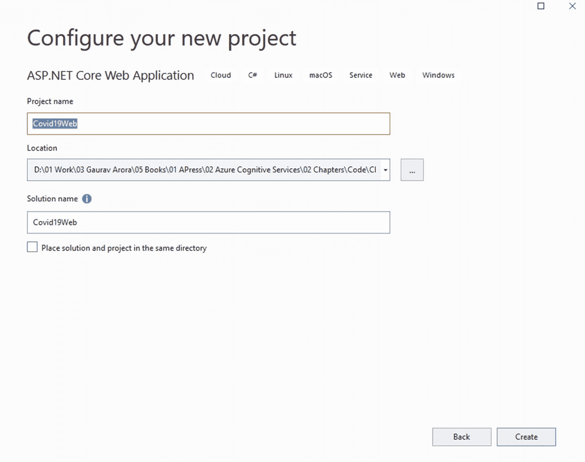
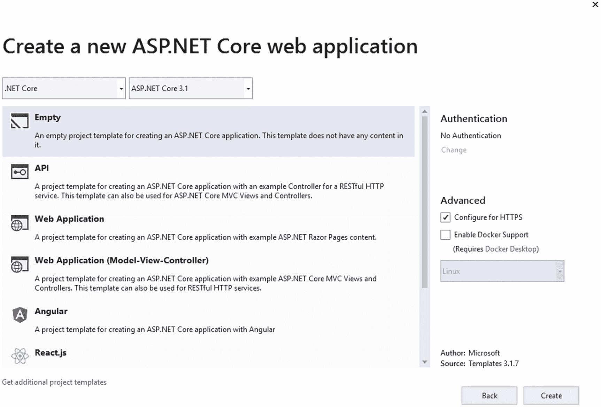
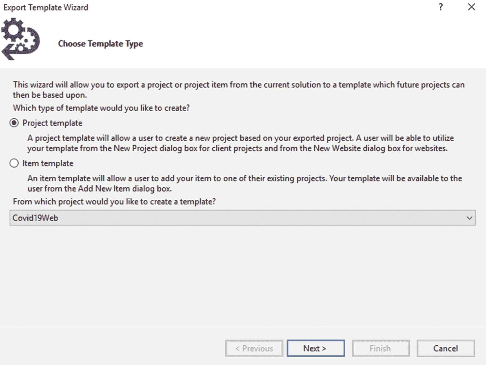
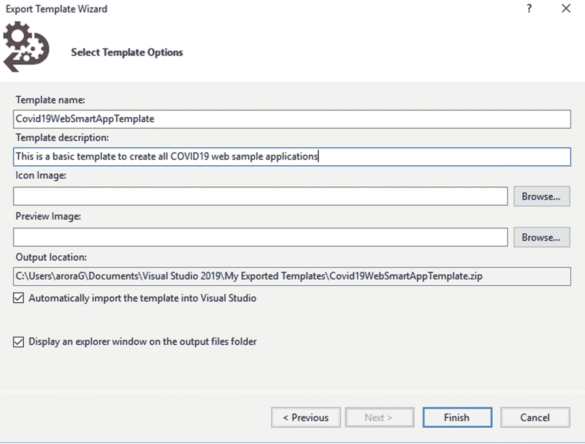
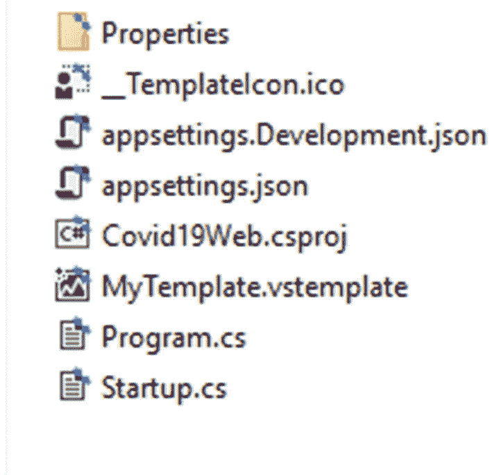

# 二、认知服务的 Azure 门户

这一章将探讨如何在 Azure 门户上开始认知服务，它包括对公共特性的探索。接下来，本章将带你进入 Azure 市场，了解机器人服务、认知服务和机器学习。

在本章中，我们将讨论以下主题:

*   Azure 门户和 Azure 认知服务入门

*   azure market place——人工智能+机器学习概述

*   了解软件开发工具包(SDK)——从您最喜欢的编程语言开始

*   设置您的 Visual Studio 模板

## Azure 门户和 Azure 认知服务入门

微软 Azure 认知服务提供了开发智能应用的工具。您可以借助 API、SDK、服务等等来构建这些智能应用。

Microsoft Azure Cognitive Services

是一组 API、SDK 和服务，帮助开发人员创建智能应用，而无需事先了解 AI 或 ML。

Azure Cognitive Services 提供了开发人员(没有数据科学知识)需要的一切，以便在智能应用上工作。例如，在认知服务的帮助下，开发人员可以创建一个能够对话、理解或自我训练的智能应用。

在这一部分中，我们将浏览 Azure 门户，并探索 Azure 认知服务的各种选项。

This section is a walkthrough of the Azure portal. You can skip this section if you’re already familiar with the Azure portal

**。**

要开始使用 Azure 门户，您需要一个有效的 Azure 帐户。如果您没有有效的 Azure 帐户，请遵循以下几点注册一个免费的 Azure 帐户:

*   前往 [`https://signup.azure.com`](https://signup.azure.com) 。

*   若要注册免费帐户，您必须拥有有效的电话号码、有效的信用卡以及 GitHub 帐户或 Microsoft 帐户 id(以前称为 Windows Live ID)。

*   按照屏幕上的说明进行操作。

完成注册后，您的免费帐户包含以下权益:

*   12 个月免费服务

*   使用免费帐户，您可以借助以下免费服务构建智能应用:
    *   计算机视觉

    *   个性化的

    *   翻译者

    *   异常探测器

    *   表单识别器

    *   面部服务

    *   语言理解

    *   QnA 制造商

**要查看免费产品和服务的完整列表，请参考此链接:** [`https://azure.microsoft.com/en-us/free/`](https://azure.microsoft.com/en-us/free/) 。

完成注册后，登录 Azure 门户( [`https://portal.azure.com`](https://portal.azure.com) )。登录后，你将登陆 Azure 门户主页，看起来应该如图 [2-1](#Fig1) 所示。


图 2-1

蔚蓝门户

根据您的订阅，您可以看到各种可用的服务。这是探索 Azure 产品和服务的起点。

Azure 门户的完整介绍超出了本书的范围。如果你想详细了解在 Azure 门户中工作，请参考 Apress 出版的《微软 Azure 中的 ***云调试和概要分析》一书。***

### Azure 认知服务入门

让我们探索微软 Azure 认知服务。请注意，在接下来的章节中，我们将用代码示例来介绍每一个服务。认知服务入门，从 Azure 门户，从搜索文本框搜索“认知服务”，或者点击**所有服务** ➤ **AI +机器学习** ➤ **认知服务**(见图 [2-2](#Fig2) )。


图 2-2

认知服务

接下来，您将看到认知服务屏幕。在此屏幕上，您可以管理现有服务或添加/创建新服务。这是你开始探索 Azure Marketplace 的起点。

在接下来的部分，我们将讨论 Azure Marketplace 中的认知服务。

## Azure Marketplace:人工智能+机器学习概述

Azure 认知服务由世界一流的模型部署技术提供支持，该技术由该领域的顶级专家构建。使用现收现付模式，您可以从许多不同的计划和优惠中进行选择。您可以找到一个更快、更容易、通常更便宜的解决方案，而不是投资于您可能需要的开发和基础设施(如果您选择为这种常见用例开发和托管您的模型)。

Azure Marketplace 是获得所有服务的一站式商店。只要你点击**添加**或**创建认知服务**，你就会被发送到 Azure Marketplace(见图 [2-3](#Fig3) )。


图 2-3

添加或创建认知服务

Azure Marketplace 提供了许多类别的产品，包括以下示例:

*   **机器人服务**–包括创建、测试、部署和管理智能机器人的工具。

*   **认知服务**–在第 [1](01.html) 章中，我们提供了这些服务的概述。

*   **ML 服务**–Azure Machine Learning 构建智能模型和可重复的工作流，供您部署和管理。

*   **自动化 ML**–使用 AutoML，您可以通过指定您的目标指标来训练和调整模型。

*   **业务或机器人流程自动化**-允许您创建虚拟劳动力，帮助推动您的业务向前发展。

*   **数据标记**–在整个团队中创建、管理和监控您的标记项目。

*   **数据准备**–例如，确保数据使用正确的编码和一致的模式。

*   **知识挖掘**–快速探索和学习大量数据，发现重要的见解、关系和模式。

*   **ML operations**–ML ops 将 DevOps 应用于机器学习，包括构建持续集成、交付、部署和质量保证。

*   更多

## 了解软件开发工具包(SDK):从您最喜欢的编程语言开始

你会发现从头开始编写每一段代码都太复杂和耗时。借助软件开发工具包(SDK ),我们可以最大限度地减少工作和时间。您可以使用各种 SDK 来开发带有认知服务的应用。SDK 目前支持以下主要语言(截至我们撰写本书时):

*   C#

*   Go(通常被称为 Golang，或 Go 语言)

*   爪哇

*   Java Script 语言

*   计算机编程语言

*   稀有

    我们将在本书的所有例子中使用 C#。

## 设置您的 Visual Studio 模板

至此，您对 Azure 门户和 Azure Marketplace 中提供的各种服务有了基本的了解。现在是时候开始搭建一个小 app 了。在这一节中，您将从使用 Visual Studio 设置您的环境开始，并且您将在整本书中遵循这种方法。

我们创建这个模板是为了当我们在接下来的章节中创建更多的小应用来描述这个主题时，我们不需要多次重新创建这个应用。

> *我们用 Visual Studio 2019 社区版来构建这个例子。*

在你开始模板设置之前，确保你有**ASP.NET 和网络开发**和**。NET 桌面开发**工作负载安装在您的 Visual Studio 2019 环境中(见图 [2-4](#Fig4) )。


图 2-4

工作负载选择-。NET 桌面开发

让我们创建一个 Visual Studio 模板:


图 2-5

创建新项目

1.  打开 Visual Studio。

2.  点击**文件**、**项目**、**新建项目**，然后搜索选择**ASP.NET 核心 Web 应用**(见图 [2-5](#Fig5) )。点击**下一个**。



图 2-6

配置您的新项目

1.  输入你的项目名称位置等等。这些值不会与我们的模板相同，所以不用担心这些值(见图 [2-6](#Fig6) )。



图 2-7

选择空模板

1.  选择**空的**项目(在左窗格中)。确保您选择了**。NET Core** 和 ASP.NET Core 3.1 下拉列表，在页面顶部(见图 [2-7](#Fig7) )。点击**创建**(在右下角)。



图 2-8

选择模板类型

1.  让我们保持简单。我们不会为这个模板添加任何额外的东西。点击**项目**，然后点击**导出模板**。从选择模板类型屏幕(在导出模板向导中)，选择**项目模板**选项，然后点击**下一步**(参见图 [2-8](#Fig8) )。



图 2-9

选择模板选项

1.  在导出模板向导的下一个屏幕中，提供**模板名称**和**模板描述**。您也可以提供**图标图像**。确保两个复选框都被选中，然后点击**完成**(见图 [2-9](#Fig9) )。

您导出的模板应生成到“Visual Studio 2019”文件夹中的“我的导出模板”文件夹中。

> *我们还使用 WPF 为桌面应用创建了一个模板。这个模板(Covid19WpfApp.zip)位于 GitHub 资源库* [`https://github.com/Apress/hands-on-azure-cognitive-services/blob/main/Chapter%2002/Templates/Covid19WpfApp.zip`](https://www.github.com/Apress/hands-on-azure-cognitive-services/blob/main/Chapter%252002/Templates/Covid19WpfApp.zip) *。*

我们现在已经完成了模板的准备工作。这是一个空白的 Asp.Net 核心 3.1 模板，我们将使用我们即将到来的代码示例。还可以提取模板 zip 文件，并在任何文本编辑器中打开 MyTemplate.vstemplate 文件。(我们是用 Notepad++打开的。)zip 文件包含以下文件，如图 [2-10](#Fig10) 所示。



图 2-10

模板文件

MyTemplate.vstemplate 文件由以下代码组成(参见清单 [2-1](#PC1) )。

```py
<VSTemplate Version="3.0.0" xmlns:="http://schemas.microsoft.com/developer/vstemplate/2005" Type="Project">
  <TemplateData>
    <Name>Covid19 Web Smart App Template</Name>
    <Description>This is a basic template to create all COVID19 web sample applications</Description>
    <ProjectType>CSharp</ProjectType>
    <ProjectSubType>
    </ProjectSubType>
      <LanguageTag>C#</LanguageTag>
      <ProjectTypeTag>Web</ProjectTypeTag>
      <ProjectTypeTag>Covid19</ProjectTypeTag>
    <SortOrder>1000</SortOrder>
    <CreateNewFolder>true</CreateNewFolder>
    <DefaultName>Covid19WebSmartAppTemplate</DefaultName>
    <ProvideDefaultName>true</ProvideDefaultName>
    <LocationField>Enabled</LocationField>
    <EnableLocationBrowseButton>true</EnableLocationBrowseButton>
    <CreateInPlace>true</CreateInPlace>
    <Icon>__TemplateIcon.ico</Icon>
  </TemplateData>
 ...
</VSTemplate>

Listing 2-1MyTemplate configuration

```

确保在导出的模板文件中更新以下可选标签(来自清单 [2-1](#PC1) ):

*   语言标签

*   专案类型层级

您可以看到这是一个简单的 XML 文件，它定义了模板的各种属性。主要属性如下所示。这些属性有助于 Visual Studio 在“添加新项目”对话框中对项目模板进行分组:

*   **模板数据**–定义模板名称及其描述。该名称和描述出现在“添加新项目”对话框窗口中。

*   **project type**–包含项目类型的值，如 CSharp。

*   这是一个重要的属性，它告诉 Visual Studio 模板是针对特定语言的。例如，我们的模板是针对 C#的。

*   **project type tag**–包含项目类型的值，如 Web、Desktop 等。我们的模板有这些项目类型标签:Web 和 Covid19。

在本节中，我们创建了一个 Visual Studio 模板。当我们在接下来的章节中创建代码示例时，这个模板会对我们有所帮助。

## 摘要

本章的目的是探索 Azure 门户并开始认知服务。在本章中，我们讨论了 Azure Marketplace。我们浏览了各种可用的 SDK。最后，我们创建了一个 Visual Studio 模板，开始构建一个具有认知服务的应用。

在下一章，我们将继续 Azure 认知服务的讨论。我们将讨论如何开始使用 Azure 认知服务，我们将进一步探索微软 Azure 门户网站。