# 五、语音——与您的应用对话

在前一章中，我们看到了如何使用文本模型构建丰富的文本，以及如何从非结构化数据构建智能搜索应用。在这一章中，我们将为我们的认知计算工具包增加一项功能——如何理解用户的请求并通过语音处理这些请求。为了扩展这一技能，您将看到如何通过语音获取用户输入，创建自定义输入事件，以及与您的用户进行交互。

在交流中，互动是人类的重要行为之一。借助交流，你可以描述你看到的和使用的东西。交流可以是语言的或非语言的，但两种方式的目的都是一样的。你的语音对于描述和转换你的话语起着重要的作用。如果你的语音能够让你的听众理解，那么你的口头交流就是完美的。同样，你的非语言交流也主要取决于文本。你的文字应该准确易懂。

在现实世界中，为了用非语言交流(文本)完美地传达他们需要传达的一切，人们需要克服许多障碍。在口头交流(语音)中，其他人也可以更容易地做到这一点。

本章的目的是通过评估和翻译文本到语音和反过来提供关于语音服务的见解。我们还将构建一个全面的示例，提供认知功能，如麦克风输入的语音识别、文件输入的连续识别、定制模型、拉和推音频流、关键字识别、麦克风输入的翻译、文件输入和音频流、意图识别、语音合成、关键字识别、语言检测等等。所有这些功能都可以在各种企业用例中使用。

本章将涵盖以下主题:

*   理解语音和语音服务

*   语音到文本–将语音音频转换为文本以进行交互

*   LUIS 和 Speech Studio 的认知语音搜索

*   使用 Speech Studio 自定义关键字

*   语音 API 的摘要

## 理解语音和语音服务

作为人类，我们有特殊的能力，其中一种能力是表达我们的思想和感情，通过产生声音来解释特定的工作和任务。这些声音可以是任何东西，声乐，词，或一首歌。任何被归类为语言声音的东西都可以被翻译成任何语言。这就是我们所说的*语音*。语音的目的是与听众联系或交流，以传递特定的信息。信息可能因地而异。(例如，在教室里，老师的信息与学生的主题相关。)同样，当我们谈论软件开发中的应用时，它必须与用户直接交流。这种交流可以通过语音(讲话)或文本。

微软 Azure 认知服务在 API 和 Azure 语音服务的帮助下，提供了开发智能应用的工具。

### 全面的隐私和安全 [1](#Fn1)

*   作为 Azure 认知服务的一部分，语音服务通过了 SOC、FedRAMP、PCI DSS、HIPAA、HITECH 和 ISO 的认证。

*   您的数据仍然是您的。音频处理期间不会记录您的音频输入和转录数据。

*   随时查看和删除您的自定义语音数据和模型。您的数据在存储时是加密的。

*   在 Azure 基础设施的支持下，语音服务提供了企业级的安全性、可用性、合规性和可管理性。

    微软 Azure 推出了语音服务，它也取代了 Bing 语音 API 和 Translator 语音。

Azure 认知服务提供以下工具来开发支持语音的智能应用:

*   蔚蓝语音 CLI-[`https://docs.microsoft.com/en-us/azure/cognitive-services/speech-service/spx-overview`](https://docs.microsoft.com/en-us/azure/cognitive-services/speech-service/spx-overview)

*   认知服务语音工作室-[`https://speech.microsoft.com/`](https://speech.microsoft.com/)

*   语音设备 SDK-[`https://docs.microsoft.com/en-us/azure/cognitive-services/speech-service/speech-devices-sdk-quickstart`](https://docs.microsoft.com/en-us/azure/cognitive-services/speech-service/speech-devices-sdk-quickstart%253Fpivots%253Dplatform-android)

*   语音服务 API-[`https://docs.microsoft.com/en-us/azure/cognitive-services/speech-service/overview#reference-docs`](https://docs.microsoft.com/en-us/azure/cognitive-services/speech-service/overview%2523reference-docs)

### 入门指南

如果您想要启动或尝试语音服务，您可以按照以下步骤使用免费帐户进行尝试:

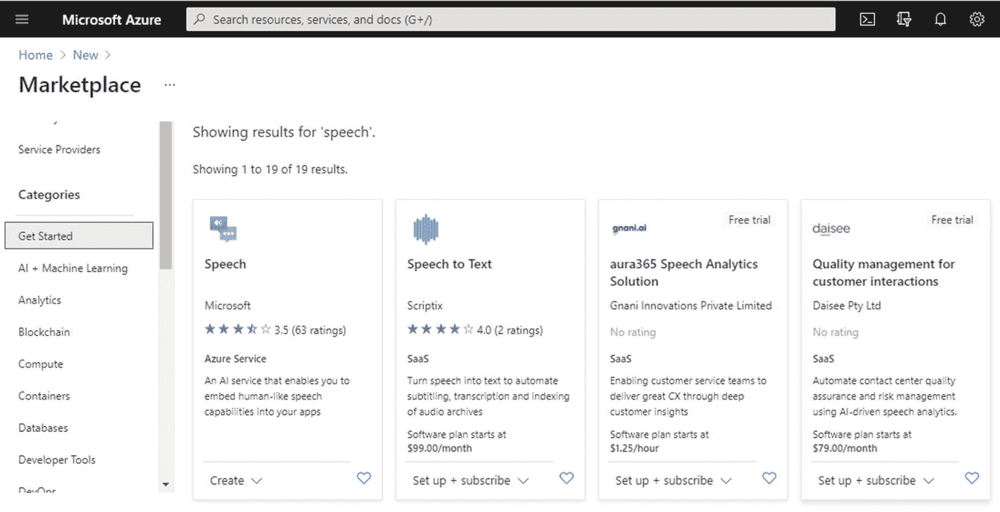

图 5-1

为语音服务创建新资源

1.  如果没有 Azure 账号，可以创建一个免费账号: [`https://azure.microsoft.com/en-in/free/`](https://azure.microsoft.com/en-in/free/) 。

2.  登录蔚蓝门户: [`https://portal.azure.com/`](https://portal.azure.com/) 。

3.  从搜索文本框中，搜索“语音”

4.  选择“语音”服务，然后点击**创建**创建一个新的资源(如图 [5-1](#Fig1) )。

### 将语音实时翻译到您的应用中

Azure 认知服务由顶级专家构建的世界级模型部署技术提供支持。如果您选择开发和托管您的模型，有许多计划和提议让您使用现收现付模型，而不是投资于您可能需要的开发和基础设施。

Azure Marketplace 是获得所有服务的一站式平台。只要你点击**添加**或者**创建认知服务**，你就会被发送到 Azure Marketplace(如图 [5-2](#Fig2) )。

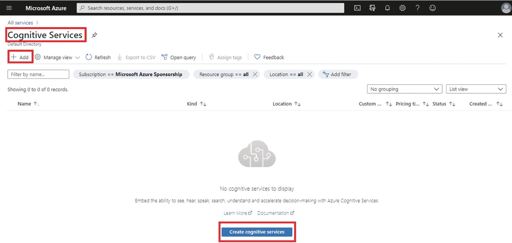

图 5-2

添加/创建认知服务

在开始使用 Azure 语音服务之前，我们先来看看一些重要的注意事项。由于频繁的更新，新的地区和语言的加入，一旦这本书出版，你的环境将会失去同步。因此，我们包含了以下链接，这些链接将提供最新信息:

*   语言、语音支持-[`https://docs.microsoft.com/en-us/azure/cognitive-services/speech-service/language-support`](https://docs.microsoft.com/en-us/azure/cognitive-services/speech-service/language-support)

*   服务可用性，地区–[`https://docs.microsoft.com/en-us/azure/cognitive-services/speech-service/regions`](https://docs.microsoft.com/en-us/azure/cognitive-services/speech-service/regions)

*   定价—[`https://azure.microsoft.com/en-us/pricing/details/cognitive-services/speech-services/`](https://azure.microsoft.com/en-us/pricing/details/cognitive-services/speech-services/)

### 语音到文本–将语音音频转换为文本以进行交互

在第一个例子中，我们将看到如何使用。NET Framework for Windows。请遵循以下步骤:

从认知服务语音 SDK 存储库中克隆对话转录存储库( [`https://github.com/Azure-Samples/cognitive-services-speech-sdk/tree/master/quickstart/csharp/dotnet/conversation-transcription`](https://github.com/Azure-Samples/cognitive-services-speech-sdk/tree/master/quickstart/csharp/dotnet/conversation-transcription) )。见图 [5-3](#Fig3) 。然后导航到您系统中的等效文件夹([`cognitive-services-speech-sdk`](https://github.com/Azure-Samples/cognitive-services-speech-sdk)/[quick start](https://github.com/Azure-Samples/cognitive-services-speech-sdk/tree/master/quickstart)/[cs harp](https://github.com/Azure-Samples/cognitive-services-speech-sdk/tree/master/quickstart/csharp)/[dot net](https://github.com/Azure-Samples/cognitive-services-speech-sdk/tree/master/quickstart/csharp/dotnet)/**conversation-transcription**/)。

图 5-3

克隆语音 SDK GitHub 库

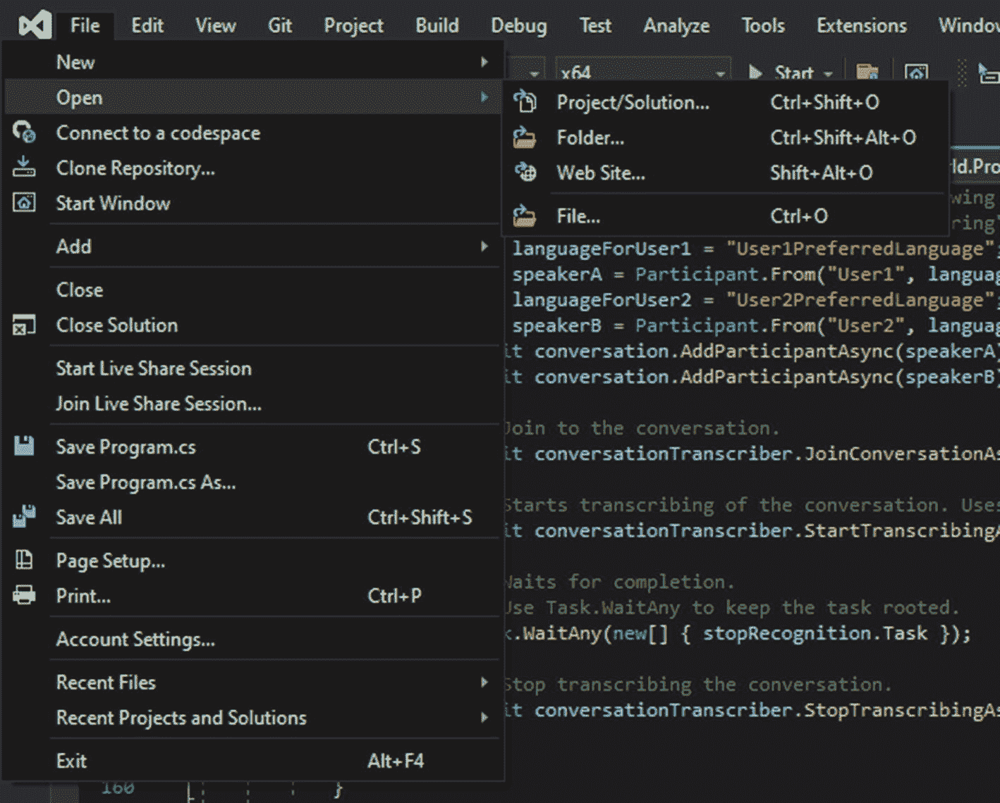

图 5-4

visual Studio–从以下路径打开解决方案

1.  打开 Visual Studio，然后从克隆路径(quick start/cs harp/dot net/conversation-transcription)打开解决方案文件。见图 [5-4](#Fig4) 。

图 5-5

Azure 服务–创建资源

1.  打开 Azure 服务控制台，然后点击**创建资源**(如图 [5-5](#Fig5) )。

从市场中选择**语音**，然后点击微软的**语音**资源。见图 [5-6](#Fig6) 。

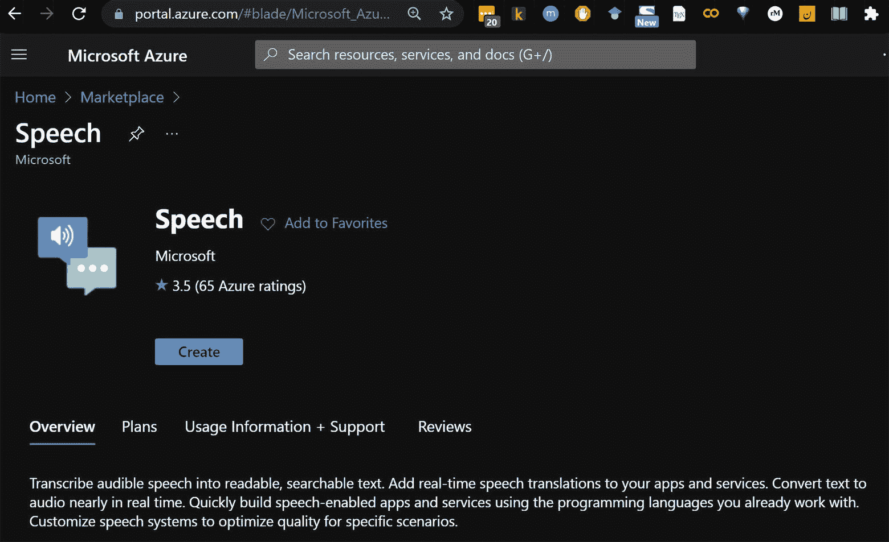

图 5-6

Azure 服务——从市场中创建语音资源

接下来，单击**创建**按钮继续。接下来，添加所需的服务参数，如名称、订阅、位置、定价层、资源组(如图 [5-7](#Fig7) )。

图 5-7

Azure 服务–提供所需的信息

点击**创建**继续。这将部署服务。启动时会看到部署通知，如图 [5-8](#Fig8) 所示。

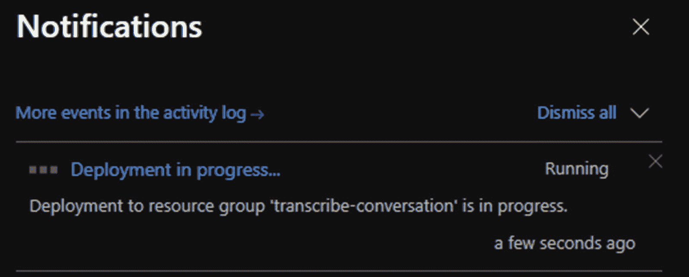

图 5-8

Azure 服务-语音部署正在进行中

一旦部署完成，您将看到密钥和各自的端点，如图 [5-9](#Fig9) 所示。

图 5-9

Azure 语音服务–密钥和端点

图 5-10

Azure 语音服务–填充按键和服务区域

1.  您可以从此页面复制密钥和服务区域(位置)。然后，用它替换打开目录的解决方案文件中的标签(如图 [5-10](#Fig10) )。

编辑 Program.cs 源文件，然后替换 YourSubscriptionKey 和 YourServiceRegion 值、首选语言，并添加语音签名的 WAV 文件示例。见图 [5-11](#Fig11)

图 5-11

Azure 语音服务–填充按键和服务区域

> 不建议在代码中直接使用密钥。安全的方法是使用密钥库或使用系统变量。

这个声音签名样本是针对被检测的声音的。每个样本的推荐长度在 30 秒到 2 分钟之间。认知服务需要一个. wav 文件，该文件应使用支持的设备(8 通道、16kHz、16 位 PCM)捕获。要创建此 WAV 文件，请打开 Windows 录音机或您选择的录音机。这里，我们使用的是 Windows 录音机，如图 [5-12](#Fig12) 所示。

图 5-12

正在打开 Windows 录音机

开始录制用户 1 的语音。然后，分别录制用户 2 的语音。这为语音服务提供了用户声音的签名。参见图 [5-13](#Fig13) 。

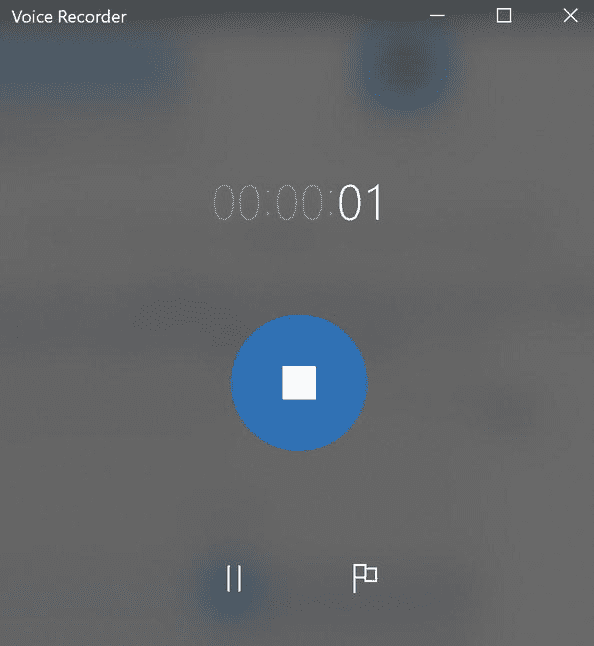

图 5-13

录制对话的音频文件

您还可以记录用户 1 和用户 2 之间的单个对话文件。我们录制的三个音频文件见图 [5-14](#Fig14) 。

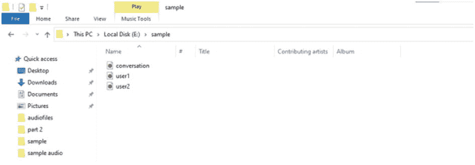

图 5-14

录制的音频文件

此时，我们有三个。wav 文件。如果您使用给定的规格 [2](#Fn2) 创建了声音，那么在程序中放置文件路径并继续构建。否则，请按照以下步骤获取正确格式的文件。

1.  打开 Audacity [3](#Fn3) 并导航到。您录制的 wav 文件。见图 [5-15](#Fig15) 。Audacity 是一款免费、开源、跨平台的音频软件，可以用来将音频文件转换成多种格式。

图 5-15

在 Audacity 中打开文件

如图 [5-16](#Fig16) (通过红色箭头)所示，我们记录的文件不符合要求的规格。因此，我们需要修改格式。

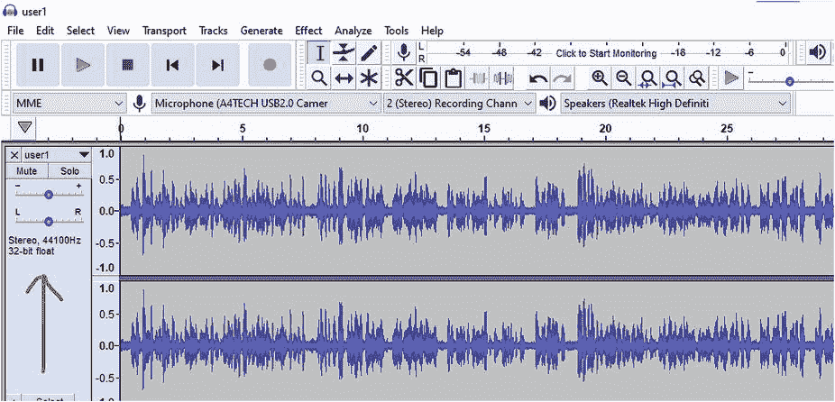

图 5-16

在 Audacity 中格式化细节

要编辑文件格式，右击曲目，选择**格式**，然后改成 **16 位 PCM** (如图 [5-17](#Fig17) )。

图 5-17

在 Audacity 中更改格式

另外，改变利率。右击音轨，选择**速率**，然后点击 **16000 Hz** (如图 [5-18](#Fig18) )。

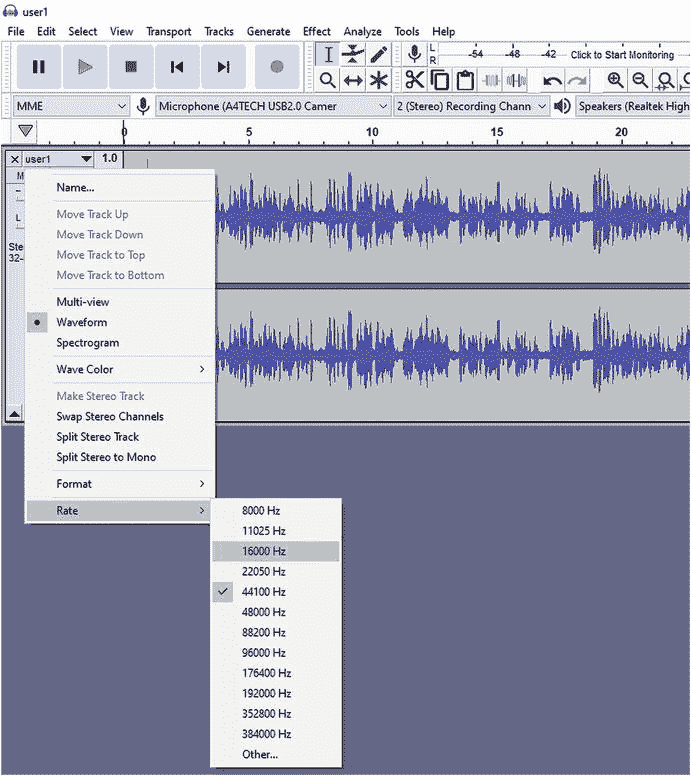

图 5-18

在 Audacity 中更改速率

接下来，要将文件从立体声转换为单声道，在顶部的文件菜单中，单击**音轨**，选择**混音**，然后单击**将立体声混音为单声道**。见图 [5-19](#Fig19) 。

图 5-19

在 Audacity 中改变组合

此时，文件将如图 [5-20](#Fig20) 所示。

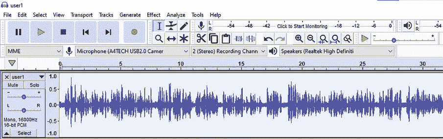

图 5-20

Audacity 中的文件格式发生了变化

接下来，将文件导出为 WAV 格式，然后保存到您选择的目录中。点击**文件**、**导出**，然后**导出为 WAV** (如图 [5-21](#Fig21) )。之后，会出现一个新的对话框。

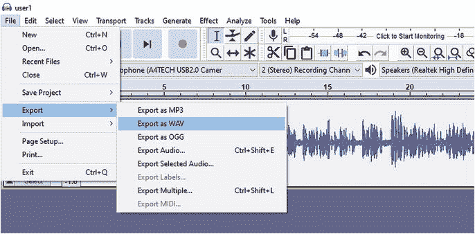

图 5-21

导出为 WAV 文件

打开高级混音选项 [4](#Fn4) ，然后拖动输出通道滑块到 8，如图 [5-22](#Fig22) 所示。

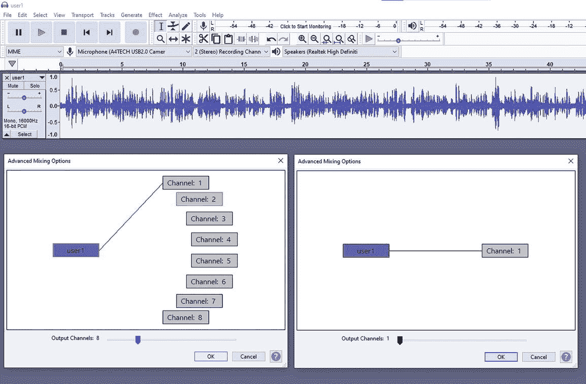

图 5-22

高级混合选项

将除频道 8 之外的所有频道链接到用户 1(如图 [5-23](#Fig23) )。然后点击**确定**。对记录文件的对话文件执行相同的步骤，以符合规范。

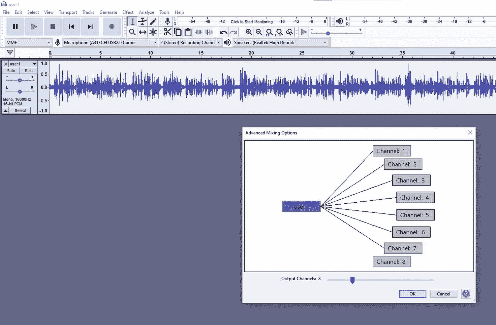

图 5-23

链接渠道

接下来，在配置文件中，相应地添加文件路径，如图 [5-24](#Fig24) 所示。

图 5-24

修改配置文件

点击**开始**按钮，构建并运行项目(如图 [5-25](#Fig25) )。

图 5-25

运行和转录文本的程序

成功构建和执行程序后，将会打开一个控制台窗口，显示您录制的音频文件中的转录文本。

这种转录有多种实际应用，从将呼叫中心的录音转换成文本数据进行分析，到创建视频字幕。你可能已经看到并使用过微软团队、Skype 和 Zoom 来根据音频对话创建笔记的字幕。这些转录并不完美，但他们肯定会越来越好。想象一下，通过将文本 API 的情感分析与语音转录相结合，执行实时升级分析。这难道不是一个分析如何处理愤怒的客户的电话，以提供最佳客户体验的好方法吗？

现在，您已经知道如何在自己的应用中创建语音解决方案，通过使用 Speech SDK 和 Azure 认知服务，您想要解决什么业务问题？可能性是无限的。

### LUIS 和 Speech Studio 的认知语音搜索

在前面的示例中，您学习了如何录制音频文件。在本例中，我们将使用 Microsoft LUIS(语言理解)服务的自定义语音来构建支持语音的应用。请遵循以下步骤:

图 5-26

创建新的 Azure 认知服务帐户

1.  从市场创建一个语音资源，如前面示例的步骤 2 所示。我们已经这样做了几次，所以希望你很精通它。这里，我们将重用在前面示例的步骤 1 中克隆的 GitHub 存储库。

2.  启动 Visual Studio，然后选择**文件** ➤ **打开** ➤ **项目/解决方案**。导航到包含此示例的文件夹，然后选择其中包含的解决方案文件。这应该是标准路径([认知-服务-语音-sdk](https://github.com/Azure-Samples/cognitive-services-speech-sdk) / [样本](https://github.com/Azure-Samples/cognitive-services-speech-sdk/tree/master/samples)/[cs harp](https://github.com/Azure-Samples/cognitive-services-speech-sdk/tree/master/samples/csharp)/[dot net-windows](https://github.com/Azure-Samples/cognitive-services-speech-sdk/tree/master/samples/csharp/dotnet-windows)/console/)。

3.  导航到 intent_recognition_samples.cs，然后创建一个 Azure 认知服务帐户(参见图 [5-26](#Fig26) )。LUIS 是认知服务的一部分，被称为“*基于机器学习的服务，将自然语言构建到应用、机器人和物联网设备中。”*LUIS 是一项企业级的可扩展服务，为您的应用添加语言功能提供了一种快速高效的方式。登录路易斯后。AI，你需要创建一个新的 Azure 认知服务账户。

填写详细信息以完成该过程。此时，你会看到关于你的 Azure 帐户创建和相应资源创建的通知，如图 [5-27](#Fig27) 所示。

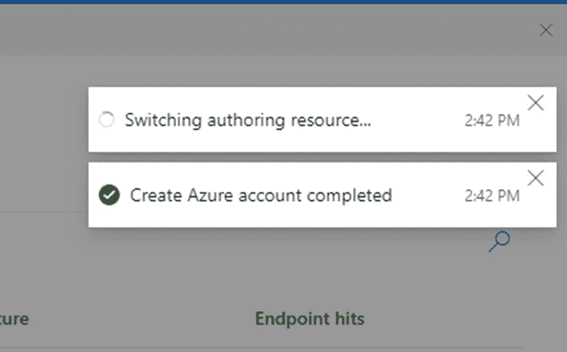

图 5-27

Azure 认知服务帐户通知

完成后，继续进行对话应用创作服务控制台，如图 [5-28](#Fig28) 所示。接下来，您将创建一个新的应用。

图 5-28

LUIS 对话服务应用控制台

单击“新建应用”按钮创建一个名为“搜索服务”的新应用，其中包含实例名称、订阅密钥和应用 ID。参见图 [5-29](#Fig29) 。

图 5-29

LUIS 对话服务–创建新应用

接下来，您将创建一个名为 SearchService 的对话应用，如前面所示，如图 [5-30](#Fig30) 。双击 SearchService 打开它，然后点击**创建新意向**创建新意向。图 [5-30](#Fig30) 对话框打开。*意图*是用户在*话语*中提到的要执行的任务或动作，例如，点咖啡、检查运输状态等。LUIS 使用 None intent 作为后备，并带有预建的域，这些域提供了已知的话语意图。

图 5-30

LUIS 对话服务-创造新的意向

接下来，转到创建的意图并添加一个示例用户输入，如图 [5-31](#Fig31) 所示。

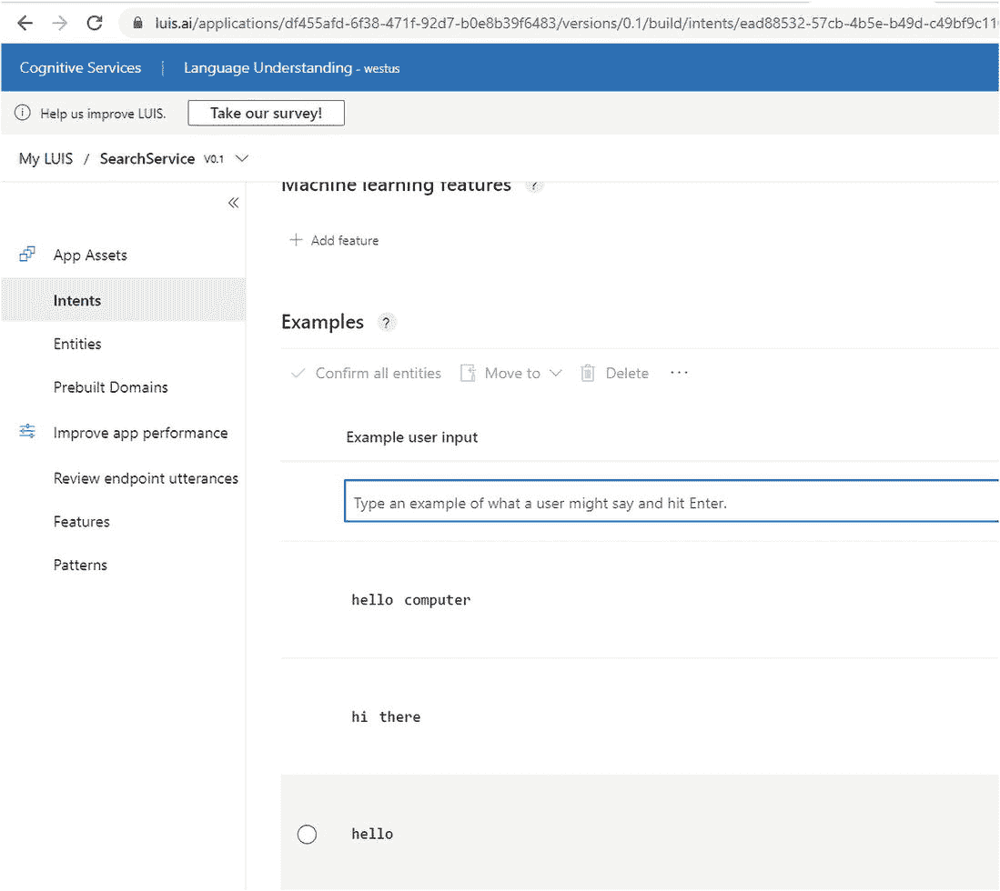

图 5-31

LUIS 对话服务-创建自定义用户输入

此时，我们有了[语言理解服务(LUIS)](https://aka.ms/csspeech/luisdocs) 的键来填充解决方案文件。您可以点击管理选项卡，查看这些密钥(如图 [5-32](#Fig32) )。

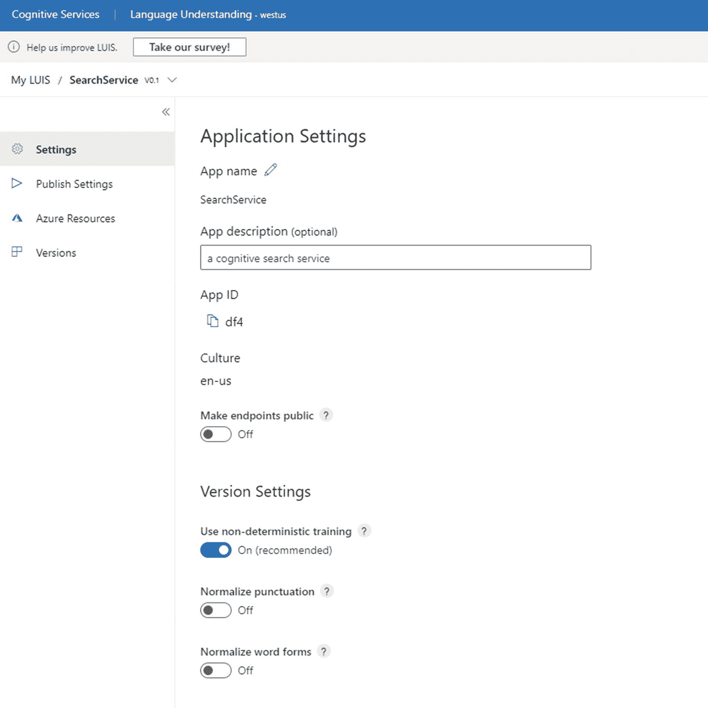

图 5-32

LUIS 对话服务–应用设置和应用 ID

接下来，打开 intent_recognition_samples.cs 文件，将关键字`YourSubscriptionKey`替换为`YourServiceRegion`、`YourLanguageUnderstandingSubscriptionKey`和`YourLanguageUnderstandingServiceRegion`。您还需要用 LUIS 识别的意图的名称来替换意图的名称，例如`YourLanguageUnderstandingIntentName1`、`YourLanguageUnderstandingIntentName2`和`YourLanguageUnderstandingIntentName3`。要查找和替换这些键，在顶部菜单中，单击**编辑**，然后单击**查找和替换**。见图 [5-33](#Fig33) 。

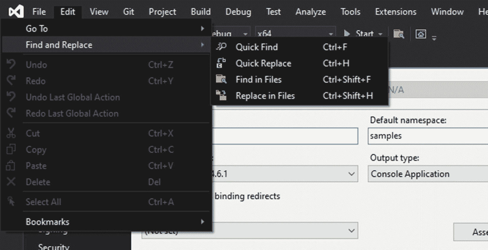

图 5-33

在 Visual Studio 中替换项目中的键

最后要考虑的是关联模型(比如`YourKeywordRecognitionModelFile.table`)。您需要用关键字识别模型文件的位置来替换它。在下一步中，我们将看到如何从 Speech Studio 获取表格文件。此外，用关键字识别模型中的短语替换`YourKeyword`触发器。

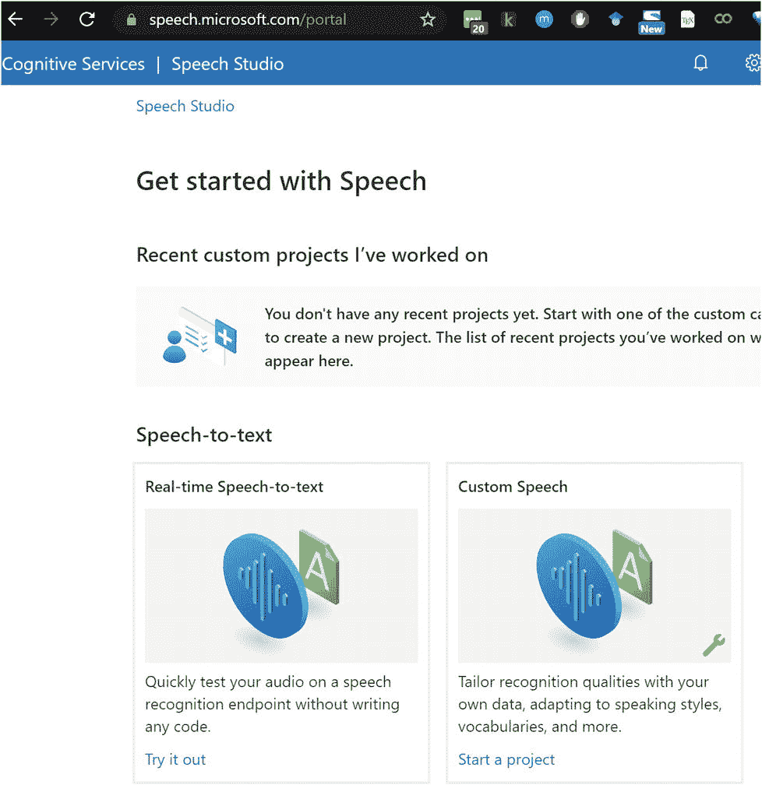

图 5-34

语音工作室门户

1.  为了获得`YourKeywordRecognitionModelFile.table`文件，去 speech.microsoft.com。见图 [5-34](#Fig34) 。

图 5-35

语音工作室功能

1.  登录 Speech Studio，点击**自定义关键字**，如图 [5-35](#Fig35) 。

自定义关键字是一个语音助手功能，选择关键字定位。点击**新建项目**新建一个项目(如图 [5-36](#Fig36) )。

图 5-36

speech Studio–自定义关键词项目

将新项目命名为 **MyKeyboard** ，然后用关键字“Hello Computer”填充新模型(如图 [5-37](#Fig37) )。

图 5-37

speech Studio–一个定制的关键词训练模型

添加细节，创建一个项目。添加您的关键字，以及相关的发音。听听关键字的不同发音，然后检查最合适的文件。接下来，点击**训练**。见图 [5-38](#Fig38) 。

图 5-38

语音工作室培训

一旦训练完成，就可以下载模型表文件(如图 [5-39](#Fig39) )。

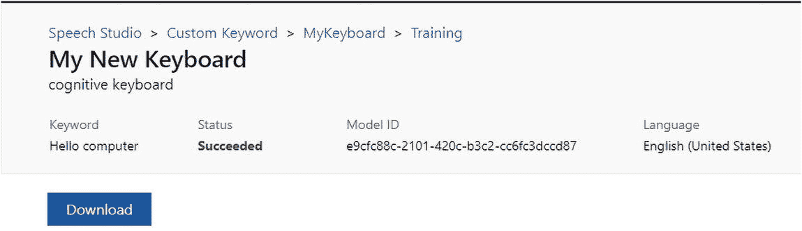

图 5-39

speech Studio–下载培训文件

此时，下载`YourKeywordRecognitionModelFile.table`文件，然后用下载文件的位置替换那个标签。见图 [5-40](#Fig40) 。

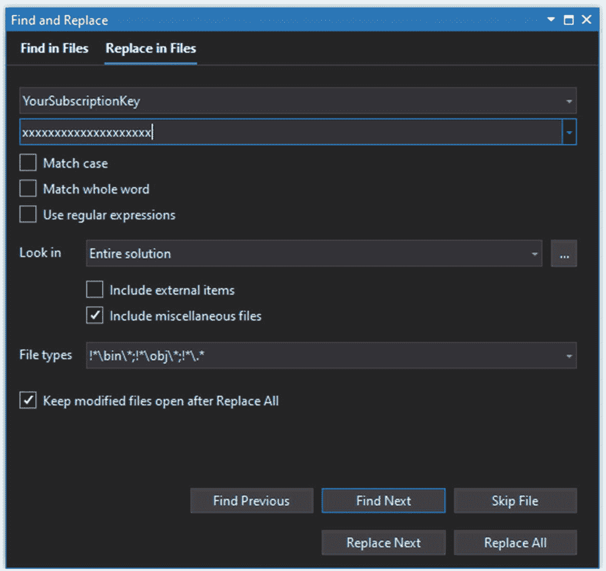

图 5-40

用订阅值替换标签

对于前面提到的标记，只需使用 Visual Studio 中的查找和替换选项。一个接一个，用它们各自的值替换所有的标签。

当所有的标签都被替换为正确的值后，点击 **Start** 按钮来构建项目。运行项目后，您将看到如图 [5-41](#Fig41) 所示的选项列表。

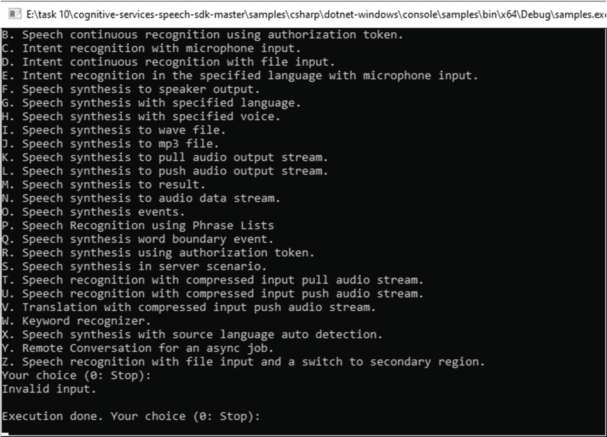

图 5-41

与 LUIS 一起运行语音应用

最后的构建将打开一个窗口，通过使用语音服务和 LUIS，使用不同的选项来选择和执行相应的操作。此示例提供了全面的功能枚举，例如麦克风输入的语音识别、文件输入的连续识别、使用自定义模型、推拉音频流、关键字识别、麦克风输入的翻译、文件输入和音频流、意图识别、语音合成、关键字识别、语言检测等等。

## 语音 API 的摘要

在本章中，我们已经使用了 Azure 认知服务语音 API。我们已经回顾了几种使用语音服务的方法，通过使用语音来帮助理解用户并与用户交互，从而允许您的应用与您的用户对话。

在下一章，我们将学习如何让应用足够智能，以便它们能够自己做出决定。这是一个可怕的新世界。敬请关注。

<aside aria-label="Footnotes" class="FootnoteSection" epub:type="footnotes">Footnotes [1](#Fn1_source)

Azure 认知服务-语音到文本。[T2`https://azure.microsoft.com/en-us/services/cognitive-services/speech-to-text/`](https://azure.microsoft.com/en-us/services/cognitive-services/speech-to-text/)

  [2](#Fn2_source)

[T2`https://docs.microsoft.com/en-us/azure/cognitive-services/speech-service/speech-devices-sdk-microphone`](https://docs.microsoft.com/en-us/azure/cognitive-services/speech-service/speech-devices-sdk-microphone)

  [3](#Fn3_source)

[T2`www.audacityteam.org/`](https://www.audacityteam.org/)

  [4](#Fn4_source)

高级混音选项 [`https://manual.audacityteam.org/man/advanced_mixing_options.html#:~:text=The%20Advanced%20Mixing%20Options%20dialog,channels%20in%20the%20exported%20file`](https://manual.audacityteam.org/man/advanced_mixing_options.html%2523:%257E:text%253DThe%2520Advanced%2520Mixing%2520Options%2520dialog,channels%2520in%2520the%2520exported%2520file) 。

 </aside>