# 1.超参数简介

人工智能(AI)突然无处不在，改变了一切，从商业分析、医疗保健部门和汽车行业到你在日常生活中可能喜欢的各种平台，如社交媒体、游戏和广泛的娱乐业。计划在视频流应用程序上观看电影，但无法决定观看哪部电影？在人工智能的帮助下，你可能最终会观看基于你过去电影选择的推荐之一。

机器学习是人工智能的一个子集，涉及从以前的经验中学习算法。在某些情况下，机器学习已经达到了人类水平的准确性。例如，最先进的深度神经网络(DNNs)在某些任务中的表现与人类一样好，如图像分类、对象检测等，尽管这与模拟人类智能不同(但这是一个步骤)。

在机器学习算法中，调整超参数是建立有效模型的一个重要方面。在本章中，您将发现术语*超参数*的含义，并了解超参数如何影响构建机器学习模型的整个过程。

## 机器学习导论

*机器学习*是对算法的研究，这些算法在没有明确定义执行任务的代码的情况下执行任务，而是使用数据进行学习。机器学习使算法能够在没有人类干预的情况下自主学习。

计算机科学家 Tom M. Mitchell 在撰写本文时是卡耐基梅隆大学的教授，他将机器学习定义为:“如果一个计算机程序在某类任务 *T* 和性能测量 *P* 中的任务性能(由 *P* 测量)随着经验 *E* 的增加而提高，那么就可以说该计算机程序从经验 *E* 中学习。”

基于需要解决的问题类型，机器学习算法有几个细分。在这里我将向你介绍三种主要类型:

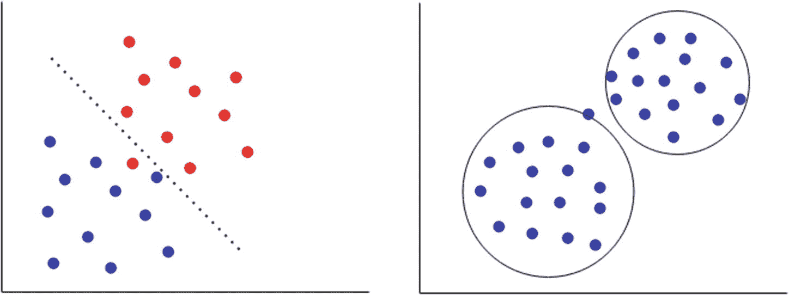

图 1-1-1

有监督机器学习(左)和无监督机器学习(右)的示例

*   *有监督的机器学习算法*:给定标签数据，我们在其上建立模型，预测给定变量的标签。举个例子，假设你想购买一艘宇宙飞船。几个因素会帮助你决定购买哪艘飞船:成本、飞船的大小、建造质量、是否有超空间推进器、武器系统等等。现在我们有几百艘飞船的数据，有这样的特征信息和它们的价格，所以我们建立一个模型，预测价格。这属于回归问题。*回归问题*有连续的目标值，如果目标值是离散的，我们称之为*分类问题*。第三种类型的问题以时间戳为特征，*时间序列预测*，其中下一个数据点在某种程度上依赖于先前的信息，因此您的算法需要在内存中保留先前数据点的信息。图 [1-1-1](#Fig1) 中左边的图像是一个分类问题的例子。我们需要有标签的数据，以便学会在它们之间画出一条分界线。

*   *无监督机器学习算法*:这类问题没有目标值。假设你要把假设的宇宙飞船按照它们的特征分组；你可以使用一个*聚类算法*来实现。无监督机器学习用于检测数据集中的模式。你不知道哪个星团是哪个，但你知道一个星团里的所有飞船都彼此相似；图 [1-1-1](#Fig1) 中的右图显示了一个例子。

*   *强化机器学习算法*:一种强化机器学习算法，从环境中学习；如果它表现好，它就获得奖励，目标是奖励最大化。例如，考虑 Chrome“奔跑的恐龙”游戏(转到`chrome://dino/`并按空格键)。恐龙不断向障碍物跑去。为了增加你的分数，你必须在准确的时间按空格键，使恐龙跳过障碍。在这里，这些点是奖励，跳跃是需要在正确的时间决定的变量。在类似这样的问题中，我们使用强化机器学习算法。 *Q 学习算法*是强化机器学习算法的一个例子。强化机器学习最出色的应用之一是机器人通过试错来学习行走。

机器学习还有很多东西。在进入超参数及其优化方法之前，您需要熟悉机器学习的基础知识。如果你是机器学习的新手，或者如果你想复习基本概念，请参考附录一和附录二。附录 I 涵盖了机器学习的实际应用及其一些基本方面。附录 II 简要介绍了全连接神经网络以及 PyTorch 和 Keras 实现框架。

## 理解超参数

在处理机器学习算法时有两种变量，如图 [1-2-1](#Fig2) 所示:

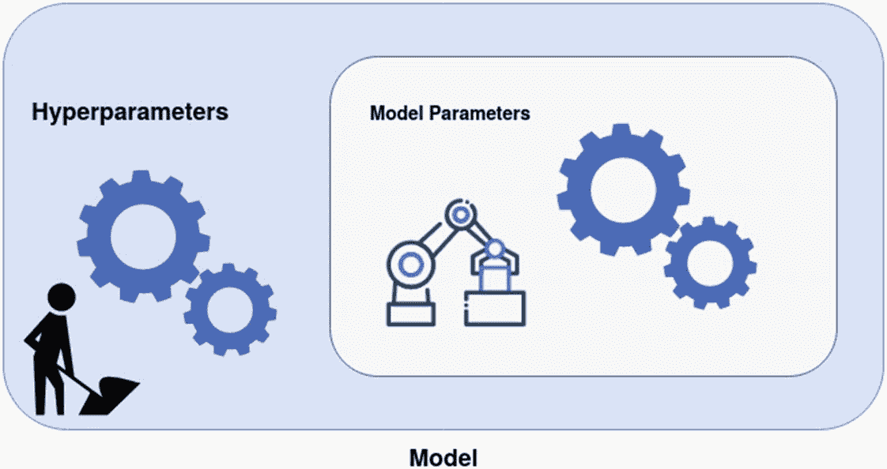

图 1-2-1

里面的方框代表模型参数，机器学习算法在这里工作。外部方框表示超参数，我们必须在算法开始训练之前设置这些参数

*   *参数*:这些是算法根据所提供的数据集调整的参数(您在调整中没有发言权)

*   *超参数*:这些是您在开始训练之前手动设置的高级参数，基于数据特征和算法学习能力等属性

我将以机器学习算法为例，向您展示参数和超参数之间的区别。就拿一个很基础的算法来说，线性回归。

线性回归中的假设函数如下:

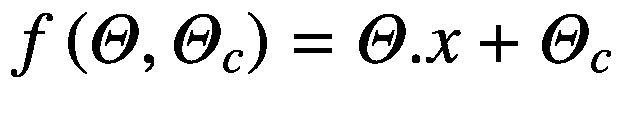

(方程 1.2.1)

这里， *x* 和θ是向量， *x* 是特征向量，θ是分配给每个特征的权重，θ<sub>c</sub>是恒定偏差。

让我们以房价预测这个经典问题为例。房子的价格取决于某些因素，包括房子的面积、卧室的数量、卫生间的数量、当地的犯罪率、离公共交通(汽车站、机场、火车站)的距离、学区、离最近的医院的距离等等。所有这些都可以被认为是特征；也就是方程 1.2.1 中我们假设函数中的 *x* 向量。例如，房子的价格随着卧室数量和面积的增加而增加；这些特征将具有正权重(θ)。房子的价格下降，例如，到学校和医院的距离越大，附近的犯罪率越高；他们会有负θ。在等式 1.2.1 中，f(θ，θ<sub>c</sub>给出了房子的价格。

我们可以根据之前的观察结果，使用优化算法找到每个特征的最佳θ值。因此，θ矢量由优化算法控制和调整(例如，梯度下降)。这些权重是参数。

下面讨论优化函数梯度下降，有助于理解超参数。

我们首先将一些随机数(即*权重*)分配给我们的参数。对于一次观察，如果我们有向量 *x* (每个特征的数值)和向量θ(每个权重的随机数值)，通过使用等式 1.2.1，我们得到 f 的值(θ，θ<sub>c</sub>)。这将是我们的预测，它将是某个随机值(p<sub>1</sub>’)，因为权重是随机的。并且我们有了房价的真实值(p <sub>1</sub> )。

我们可以计算出差值，C <sub>1</sub> (第一次观察)，| p<sub>1</sub>-p<sub>1</sub>' |。这是我们必须减少的损失。类似地，如果我们计算所有观测值的损失总和(C)的平均值:

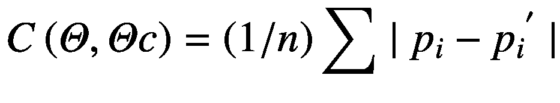

(等式 1.2.2)

方程 1.2.2 被称为损失函数，优化函数的目标是减少 C 的值，因此我们可以给出更精确的预测。损失函数取决于权重和偏差，如图 [1-2-2](#Fig3) 所示。


图 1-2-2

三维损耗曲线，x 和 y 轴是权重，z 轴是损耗

图 [1-2-2](#Fig3) 中的三维曲线可能是损失函数的代表。记得我们从随机值开始我们的权重和偏差；现在我们需要改变这些值，使损失降到最低。根据微积分，C 变化如下:

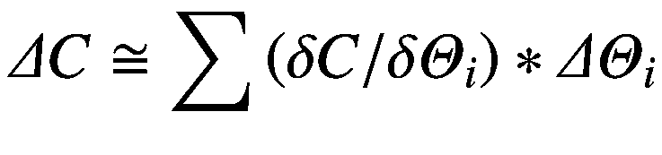

(方程式 1.2.3)

*i* = {0， *n* }，θ<sub>0</sub>为θ<sub>c</sub>

我们将表示为[(δC/δθ<sub>0</sub>)，(δC/δθ<sub>1</sub>...]作为向量和[δθ<sub>0</sub>，δθ<sub>1</sub>...]作为向量δθ；因此:

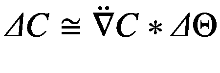

(方程式 1.2.4)

但假设如下:

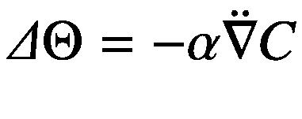

(方程式 1.2.5)

代入等式 1.2.4，我们得到这个结果:

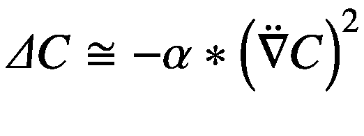

这里，α是一个正数，损失的变化将总是负的，我们希望我们的损失总是负的。所以等式 1.2.5 成立。

因此由方程式 1.2.5，我们得到

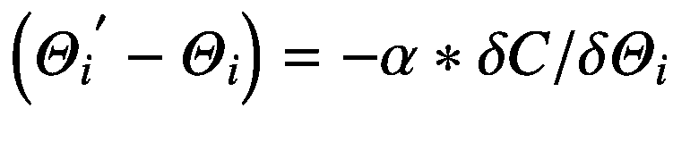

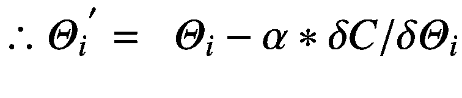

(方程式 1.2.6)

其中，θ<sub>I</sub>是权重θ<sub>I</sub>的新的更新值。在等式 1.2.6 中，权重θ<sub>I</sub>的更新值取决于权重的先前值(θ<sub>I</sub>)、梯度(δc/δθ<sub>I</sub>)和正数𝛼；这里的𝛼是梯度下降的超参数之一。它控制算法的性能。对于每个观察值，我们运行这个更新方程，并在改变权重值的同时减少损失，最终达到损失函数的最小值。

## 超参数优化的需求

在上一节中，我们在等式 1.2.6 中使用了一个正数𝛼来控制算法。这个𝛼在梯度下降算法中被称为*学习率*。它控制着损失达到最小值的速度。如图 [1-3-1](#Fig4) 、 [1-3-2](#Fig5) 和 [1-3-3](#Fig6) 所示，如下图所示。

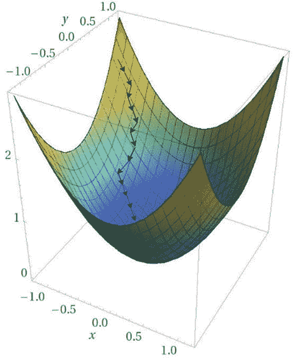

图 1-3-3

𝛼的最优值

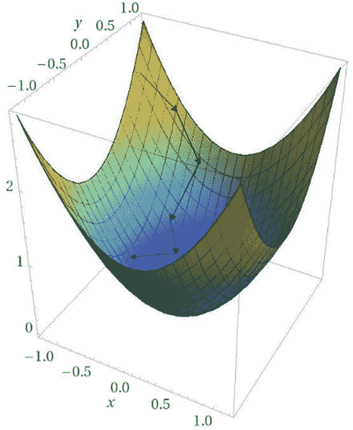

图 1-3-2

𝛼的巨大价值

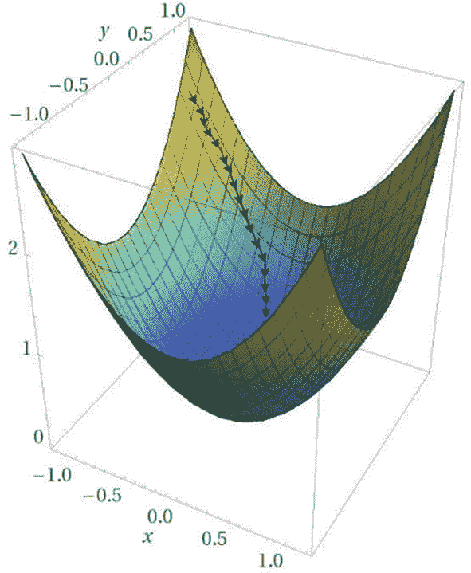

图 1-3-1

𝛼的小价值

在图 [1-3-1](#Fig4) 中，𝛼的值很小；它将达到收敛点，但δθ(即权重的变化)将非常小，以至于需要大量的步骤，因此增加了时间。学习率(𝛼)的较大值将急剧改变损失，从而超调并导致发散，如图 [1-3-2](#Fig5) 所示。然而，如果我们找到一个𝛼的最优值，我们将能够在更短的时间内达到收敛，并且没有超调，如图 [1-3-3](#Fig6) 所示。这就是我们需要将𝛼调至其最高效值的原因，这个优化过程称为*超参数调优*。

在梯度下降算法的更高级的变体中，我们从更大的步长(即，更大的学习速率值)开始以节省时间，并且当我们到达收敛点时，我们减小该值以避免超调。但是我们降低𝛼的因子现在是另一个超参数。现在，您理解了调整这些超参数的重要性。

要调优这样的超参数，您必须对算法以及这些超参数如何影响性能有很好的理解。即使您计划使用超参数调整算法(在后面的章节中介绍)，设置一个好的起点和终点也是非常重要的。这将为您节省大量时间，并提高算法的性能。

## 算法及其超参数

在这一节中，我将讨论一些基本的机器学习算法，以帮助您理解它们的超参数是如何工作的。我将用 scikit-learn 约定来讨论这些超参数，但是因为它们是通用的，所以您可以将它们用于其他实现，甚至是自实现的算法。我不会深入数学，但会给你足够的直觉，他们如何影响算法。在第 [2](2.html) 章中，我们将看看一个坏的超参数集如何导致一个差的模型，而一个好的超参数集则创建一个优秀的机器学习模型。

### k-最近邻

K-最近邻(KNN)算法可用作监督或非监督机器学习算法，并可应用于分类、回归、聚类和异常值检测问题。KNN 假设相似的点更加接近，如图 [1-4-1](#Fig7) 所示。

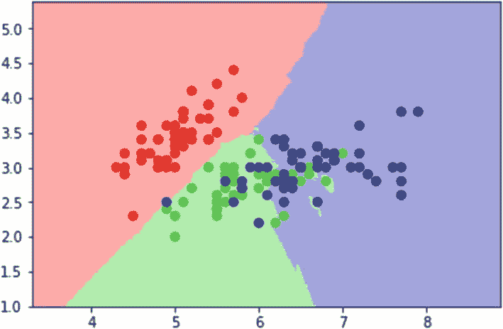

图 1-4-1

与 KNN 一起使用时，二维分类数据集显示决策边界

K-最近邻查找与要预测的点最接近的 K 个(最近点数)标记样本。这个 K 可以由用户定义。最近的接近度，也就是距离，可以通过不同的度量来计算，例如欧几里德距离、曼哈顿距离等等。为了找到这些最近的点，使用了类似 kd 树和球树的索引算法。我们来讨论一下这些超参数。

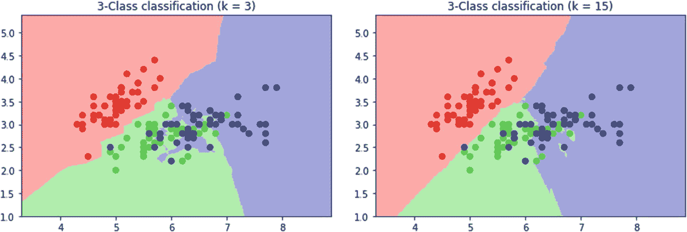

图 1-4-2

k=3 的顶部图像和 k=15 的底部图像

*   *K 个最近邻的数量*:我们设置 K 的值，K 是一个正整数，它决定了训练数据集中被考虑用来预测新数据点的标记样本的数量。图 [1-4-2](#Fig8) 显示了如何增加 K 可以产生更平滑的边界。而当 k=3 时，边界更受约束。

*   *权重*:我们可以给我们最近的邻居相同的优先级，或者根据与查询点的距离来决定它们的权重；观点越远，权重越小。

*   *索引算法*:索引算法用于绘制最近的点。由于暴力会导致数据集中所有数据点对的距离计算，我们使用基于树的索引算法，如 kd-tree 和 ball tree。kd-tree 在笛卡尔轴中划分数据，球树在嵌套超球中划分数据。当维数较高时，球树比 kd 树更有效。

*   *距离度量*:度量用于计算点之间的距离。它可以是欧几里得或曼哈顿或更高阶的闵可夫斯基度规。

### 支持向量机

*支持向量机(SVM)* 是一种强大的算法，可以找到分离不同类别的超维度平面。一个例子如图 [1-4-3](#Fig9) 所示，其中我们有两个用红色和蓝色表示的类。将它们分开的黑线是我们的超平面(在这种情况下是一条线，因为我们是在二维空间中可视化)。SVM 发现超平面使得边缘(两条虚线之间的距离)最大。

位于虚线附近的数据点称为*支持向量*。它们对超平面的形成高度负责。我们使用拉格朗日乘子的最优化方法来寻找这个超平面。

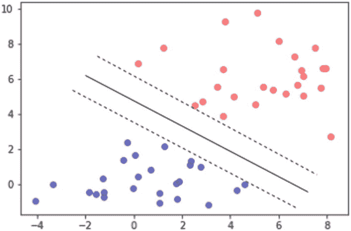

图 1-4-3

由超平面分隔的类

但这是一个线性可分的问题。在现实生活中，数据集不是线性可分的。让我们再举一个例子，看看 SVM 是如何处理图 [1-4-4](#Fig10) 中所示的例子的。

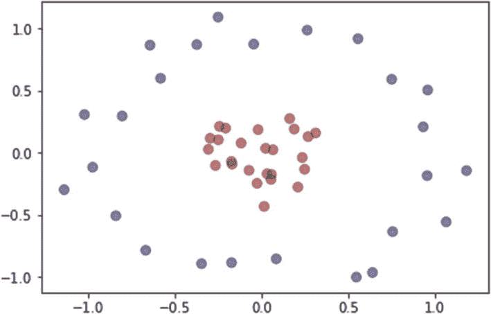

图 1-4-4

包含两个类的数据集，蓝色和红色

图 [1-4-4](#Fig10) 不是线性可分的。所以我们把它投射到一个更高的维度(在这种情况下是三个维度)，如图 [1-4-5](#Fig11) 所示，现在我们可以应用 SVM 并找到分离它的平面。

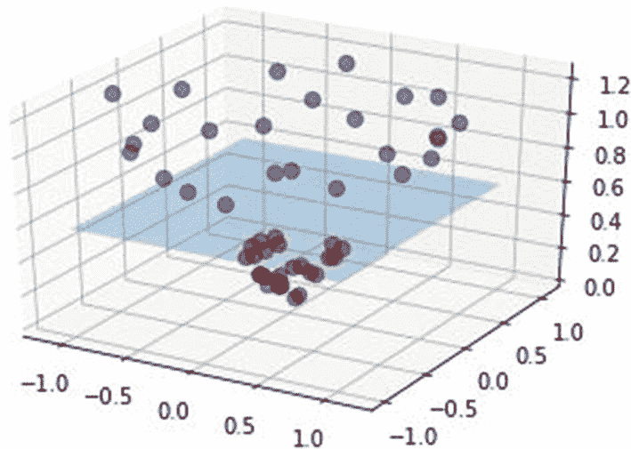

图 1-4-5

投射到更高维度并被平面分隔的数据

我们需要找到正确的映射函数来将数据投影到更高维度。这就是不同内核发挥作用的地方。正确的映射函数可以通过使用正确的核函数来实现，核函数是支持向量机中最重要的超参数之一。

现在让我们讨论不同的超参数:

*   内核:如前所述，内核有助于实现正确的映射功能，这对 SVM 的高效运行至关重要。仅寻找核降低了寻找映射函数的复杂性；映射函数和核函数之间有直接的数学关系。图 [1-4-4](#Fig10) 是一个可以使用径向基函数(RBF)核来解决的示例问题。一些广泛使用的内核是多项式内核、高斯内核、sigmoid 内核，当然还有 RBF 内核，它们中的大多数都是在 SVM 的 scikit-learn 实现中定义的(sklearn 还允许您定义自己的内核)。

*   C: C 是正则化参数。它在训练精度和边缘宽度之间进行权衡。C 的减小导致更大的余量和更低的训练精度，反之亦然。

*   伽玛:伽玛(𝛾)定义训练点的影响。𝛾值越高，意味着训练点的影响越小；非常高的值会对训练点本身产生影响。值越低，影响越大；训练点(是支持向量)将影响更多的训练集，因此极低的值在捕捉数据集的复杂性方面将是无效的，并且所得的超平面将等同于分离两个类(通过它们的密度区域)的线性超平面。

    这在超参数 C 和γ之间建立了一个有趣的关系。一般来说，我们在 10 <sup>-3</sup> 到 10 <sup>3</sup> 的对数网格上搜索伽马和 C 的值。

*   度:这个超参数只在多项式核中使用；更高的度数意味着更灵活的决策边界。度 1 将导致线性核。

### 决策图表

*决策树*类似于一堆 if-else 语句，一个简单而优雅的算法，具有非常直观的可视化。这真的很容易理解里面发生了什么，不像神经网络。此外，很少或不需要数据预处理。

顾名思义是树，所以从根节点开始，这是特征之一。基于我们的数据点的那个特性的值，我们选择树的下一个节点。这种情况一直持续到我们到达叶子，从而到达预测值。

创建这棵树有点复杂。使用各种不同的算法来选择哪个特征在顶部，哪个在第二，等等。计算特征重要性的一些算法是基尼指数、信息增益和卡方。选择该算法可以被认为是决策树算法中重要的超参数之一。

让我们以一个经典的虹膜数据集为例。这里的目标是根据四个特征，即萼片长度、萼片宽度、花瓣长度和花瓣宽度，对鸢尾属的三种花进行分类。

正如我前面说过的，可视化决策树非常容易；sklearn 提供了一个函数`tree.plot_tree()`，你只需要输入你训练过的分类器，它就会绘制出树(图 [1-4-6](#Fig12) )。

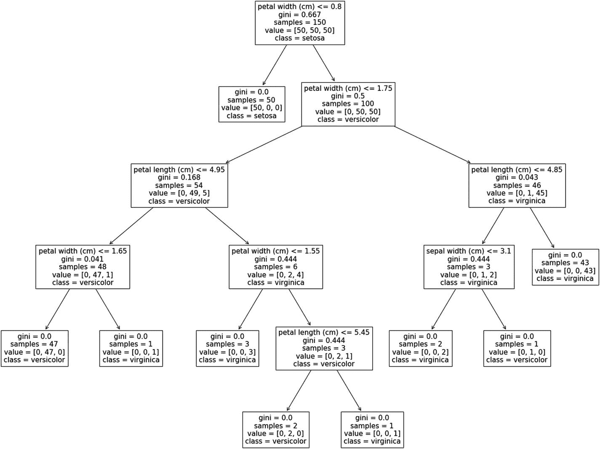

图 1-4-6

在 Iris 数据集上训练的决策树分类器

正如您在图 [1-4-6](#Fig12) 中所看到的，所有节点都有基尼系数，基于这些系数将特征放入树中。随着我们沿着树往下走，基尼系数的值会降低。在节点的顶部，指定一个条件；如果为真，数据点将转到右边的子节点，如果为假，数据点将转到左边的子节点。样本值告诉我们位于父节点的真和假条件下的样本数量。

决策树面临的一个问题是，当树变得复杂时，模型很可能会过度适应训练数据。一些超参数有助于降低这种复杂性。为了解决这个问题，我们可以修剪树，使用超参数，如树的最大深度和叶节点的最小样本数来帮助修剪。

以下是超参数:

*   算法:如前所述，该算法决定特性的优先级，从而决定它们在树结构中的顺序。

*   树的深度:这定义了深度的层次。这肯定会影响树的结构和时间复杂度。我们可以去掉不重要的节点，降低深度。

*   最小样本分割:这是一个整数值，定义分割内部节点所需的最小样本数。在图 [1-4-6](#Fig12) 中，如果我们选择 101，树将在第二层后停止。

*   最小样本叶:这定义了叶的最小样本数。这个超参数可以通过减少树的深度来帮助减少过度拟合。

### 神经网络

一个基本的*神经网络*由节点和多层节点组成，而这些节点不过是前一层乘以权重的输出(详见附录二)。在这种情况下，我们将权重和偏差称为*参数*(因为它们是由基于数据集的建模算法决定的)，将节点数、层数等称为*超参数*(因为我们通过干预来决定它们)。

定义神经网络的架构是当今深度学习实践者面临的最具挑战性的任务之一。该架构不能通过强力发现，因为神经网络的时间复杂度非常高，并且不可能尝试超参数的所有组合。因此，创建神经网络架构更像是一门艺术，依赖于逻辑和更高级的超参数调整算法。

神经网络中可能存在大量不同的超参数，因此我们将在此讨论其中的几个:

*   层数:增加层数增加了神经网络的深度，也增加了学习更复杂特征的能力。

*   节点数:节点数因层而异，但第一个隐藏层和最后一个隐藏层中的节点数必须分别等于要预测的输入要素和类的数量。对于隐藏层，按照惯例，我们使用指数为 2 的节点数，即 2、4、8、16、32、64、128、256、512、1024 等等。这是因为当数字以 2 的幂存储时，硬件执行效率更高，尽管没有证据表明这是选择这种超参数的最佳方式。

*   批量大小:如果我们取出数据集的子样本，它应该代表整个数据集的属性。该批次可用于计算梯度和更新权重。我们迭代所有子样本，直到覆盖整个数据集。这个想法是为了节省内存空间。但是您需要选择子集大小的最优值，因为较小的批量在达到最小值时会导致更多的波动，而较大的值会导致内存错误。

*   激活函数:激活函数用于在每个节点上引入非线性。在决定激活函数时，我们需要确定的几件事情是，它们将在成千上万的节点上使用，反向传播使用它们的导数，因此函数及其导数都应该在计算上不太复杂。一些广泛使用的激活是 ReLU、Sigmoid 和 Leaky ReLU。

*   损失函数:损失函数是根据输出来选择的，无论是二元分类、多类分类还是回归等等。还有其他因素。例如，在最后一层使用 sigmoid 激活和二次损失函数会导致学习变慢。所以像这样的事情是需要注意的。损失函数也有内部超参数可以调整。

*   优化器:在“理解超参数”一节中，我们讨论了一种优化方法，梯度下降。还有其他更高级的优化方法，如 Adagrad、Adam Optimizer 等，这些优化器也包含影响整体优化的各种超参数。

神经网络中的超参数还有更多的，比如批量归一化、丢失等等。每隔几天，这些变量就会随着技术的进步而增加。

本节旨在让您了解什么是超参数以及它们是如何工作的。随着我们的继续，我们将讨论更多的这些算法和它们的超参数，同时找到它们的最优值。

## 可能的超参数值的分布

超参数的值可以根据其功能而变化。对于网格搜索之类的算法(在第 [2](2.html) 章讨论)，我们迭代某些超参数的排列。但是大多数超参数优化算法随机选取变量。这些随机值可以属于某种类型的分布。例如，我们在“神经网络”一节中看到，我们选择一个层中节点数量的值为 2 的指数。因此，我们考虑集合{2，4，8，16，32，64，128，256，512...}做一个发行。

Tip

Seeing Theory ( [`https://seeing-theory.brown.edu/`](https://seeing-theory.brown.edu/) )是一个很棒的网站，提供概率和统计的交互式可视化。查看本网站第 3 章中概率分布的可视化。

随机变量取值的可能性是由概率分布定义的。假设我们必须为超参数选择一个随机值；基础发行版可以是下列发行版之一:

*   离散概率分布

*   连续概率分布

离散变量和连续变量都有不同类型的概率分布。但是在我们深入研究这些类型之前，让我们先看看什么是离散变量和连续变量。

### 离散变量

其中每个值与下一个值有一定正有限距离的一组值是*离散分布*。离散变量可以是有限值，也可以是无限值，这取决于范围。图 [1-5-1](#Fig13) 显示了有限离散和无限离散分布。

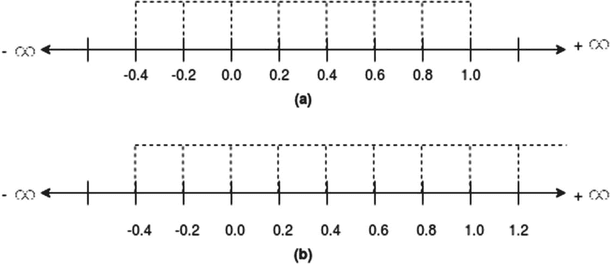

图 1-5-1

两种分布，(a)有限离散和(b)无限离散

一个有限离散值位于两个有限实数之间，如图 [1-5-1(a)](#Fig13) 所示，该值位于范围[0.4，1.0]内，相差 0.2。然而，一个无限离散值可以达到无穷大，每个值仍然与下一个值和上一个值保持有限的正距离。在图 [1-5-1(b)](#Fig13) 中，该值位于[-0.4，+∞]之间，而差值仍为 0.2。

注意，差异不一定是相同的。它可以是指数的、增量的等等。图 [1-5-2](#Fig14) 中的例子显示了均匀分布。

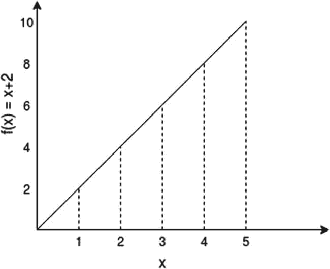

图 1-5-2

有限分布的一个例子，*f*(*x*)=*x*+2 使得*x*∈【0，5】在 *x* 的每个值之间相差 1

回想一下“支持向量机”一节，超参数*核*的可能值可以是 *rbf* 、 *sigmoid* 、*线性*、*多项式*等等。对于*‘内核’*，将有一组有限的值。这可以被认为是*有限离散值*的一个例子。我们可以将这些超参数写成:

*   *RBF*1

*   *乙状结肠* ↔ 2

*   *线性* ↔ 3

*   等等

在同一算法中，我们有另一个超参数，*‘degree’*，其值可以是任何可能的整数。这是一个*无限离散值*的例子。然而，这并不意味着我们要从∞到+∞搜索该值。结果会在极值上饱和，并且在无限空间中搜索实际上也是不可能的。所以我们会用一个巨大的范围(巨大是相对的；10 在某些情况下可能很大，而 10 个 <sup>100 个</sup>在其他情况下可能很大)来包含分布。

### 连续变量

*连续分布*是位于两个实数之间的无限可能值的集合，如图 [1-5-3](#Fig15) 所示。

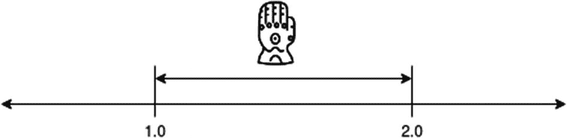

图 1-5-3

无限的数字介于 1.0 和 2.0 之间

再举一个“支持向量机”部分的例子，我们在 SVM 有像“C”和“gamma”这样的超参数，它们的值位于连续分布上；也就是说，我们可以在一个范围内有无限个可能的值。

### 概率分布

对随机值进行采样的连续和离散概率分布函数可能有无限多种，所以我们将通过讨论实践中常用的几种来缩小范围。概率总是在一个范围内计算，如图 [1-5-4](#Fig16) 所示的高斯分布示例。

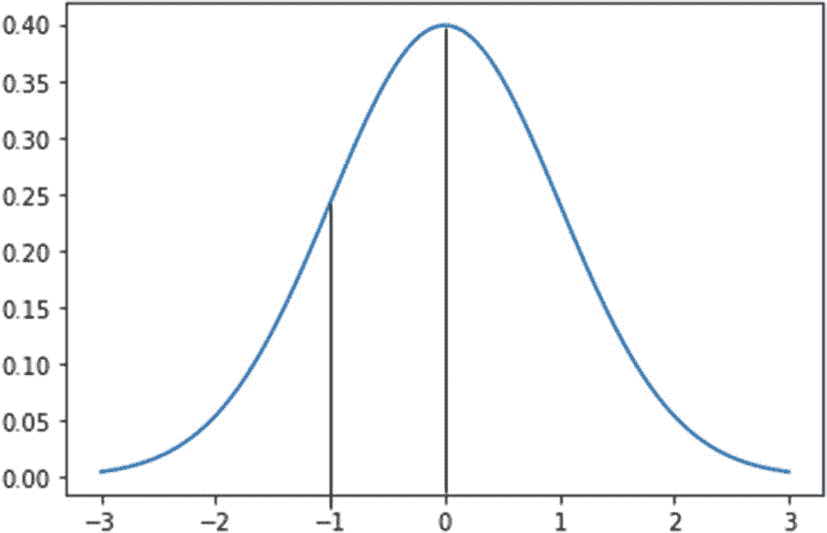

图 1-5-4

平均值为 0、标准差为 1 的高斯分布

在图 [1-5-4](#Fig16) 中，如果我们想对变量 *x* 的一个值进行采样，那么 *x* 可以取无限个值。 *p* ( *x* )为特定值的概率为 0。所以我们用*概率密度函数*来表示，它是一个范围内的概率。例如*p*(*x*T16】0)= 0.5。因为它是整个分布面积的一半。类似地，可以通过使用面积来计算-1 到 0 范围内的概率密度，该面积可以使用沿着连续曲线的积分来计算。

这解释了为什么我们需要得到一个范围的概率密度而不是一个值。接下来我们将使用一个名为 *scipy* 的模块。 *stats* 对变量 *x* 的值进行采样，以讨论一些常用的分布。

#### 均匀分布

在*均匀分布*中，如果宽度相同，概率密度在范围内保持不变。图 [1-5-5](#Fig17) 给出了一个例子。

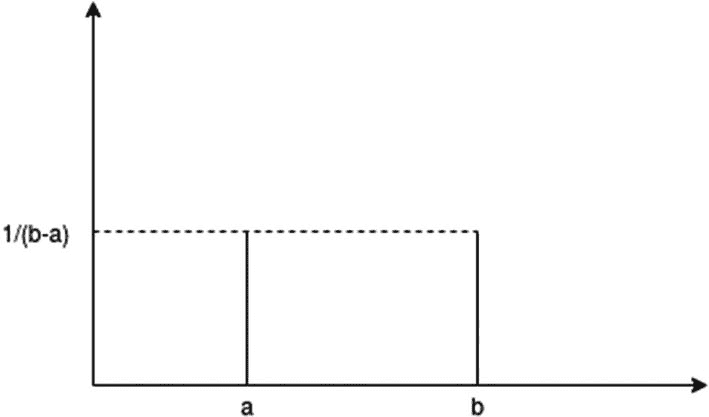

图 1-5-5

a 和 b 之间的均匀分布

曲线下的面积是 1。所以我们可以将身高计算为 1/(*b*—*a*，其中 *b* 为上限， *a* 为下限。让我们使用 *scipy* 。 *stats* 对均匀分布的值进行采样:

```py
from scipy.stats import uniform
import seaborn as sns

n = 10000
start = 10
width = 10
data = uniform.rvs(size=n, loc = start, scale=width)
ax = sns.distplot(data,
                 bins=100,
                 hist_kws={'alpha':0.8})
ax.set(xlabel='Uniform Distribution ', ylabel="Frequency")

```

图 [1-5-6](#Fig18) 显示了均匀分布的直方图，其中 a=10，b=20。我在两个数字之间采样了 10，000 个随机值。

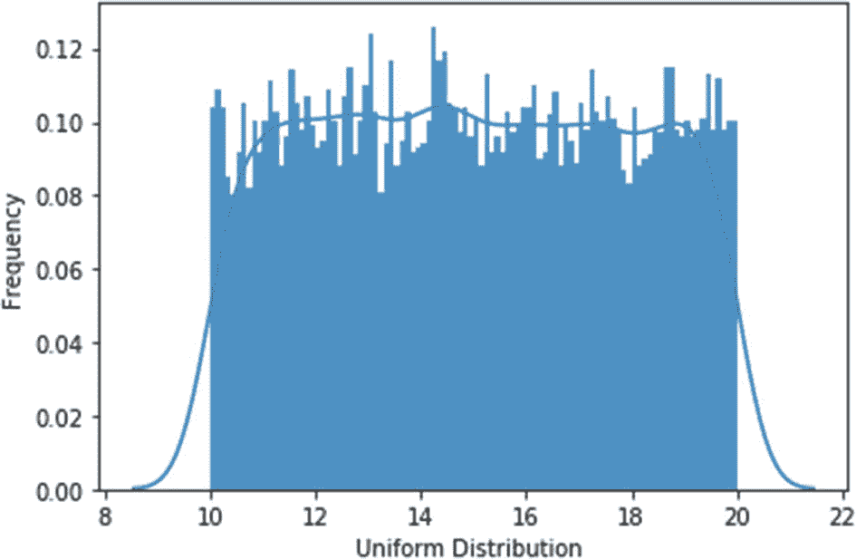

图 1-5-6

均匀分布直方图

#### 高斯分布

高斯分布(或*正态分布*)是自然界中最常见的分布之一。大多数机器学习算法假设数据集是高斯的；也就是说，离群值较少，大多数数据集中在聚类中。四肢频率较低，平均频率较高。

对于平均值( *μ* )为 0，标准差( *σ* )为 1，您可以在图 [1-5-4](#Fig16) 中看到高斯分布。请注意，在 *x* 轴上，如果您标记*μ*-*σ*和 *μ* + *σ* ，如图 [1-5-7](#Fig19) 所示，您会发现它覆盖了大约 68%的区域。同样，*μ*2*σ*和 *μ* + 2 *σ* 覆盖了大约 95%的面积，*μ*3*σ*和 *μ* + 3 *σ* 覆盖了 99.7 %的面积。

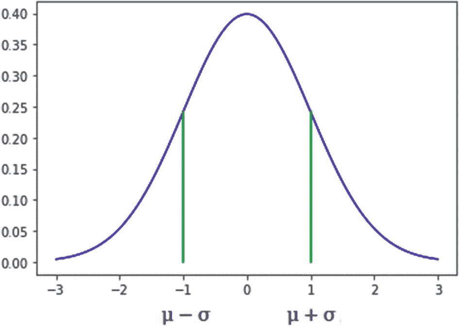

图 1-5-7

平均值为 0、标准差为 1 的高斯分布

下面是从高斯数据中抽取随机值的代码:

```py
from scipy.stats import norm
import seaborn as sns

mean = 0
std_dev = 1
data = norm.rvs(size=10000,loc=0,scale=1)
ax = sns.distplot(data,
                 bins=100,
                 hist_kws={'alpha':0.8})
ax.set(xlabel='Gaussian Distribution ', ylabel="Frequency")

```

图 [1-5-8](#Fig20) 显示了从高斯分布中采样的随机值绘制的直方图。

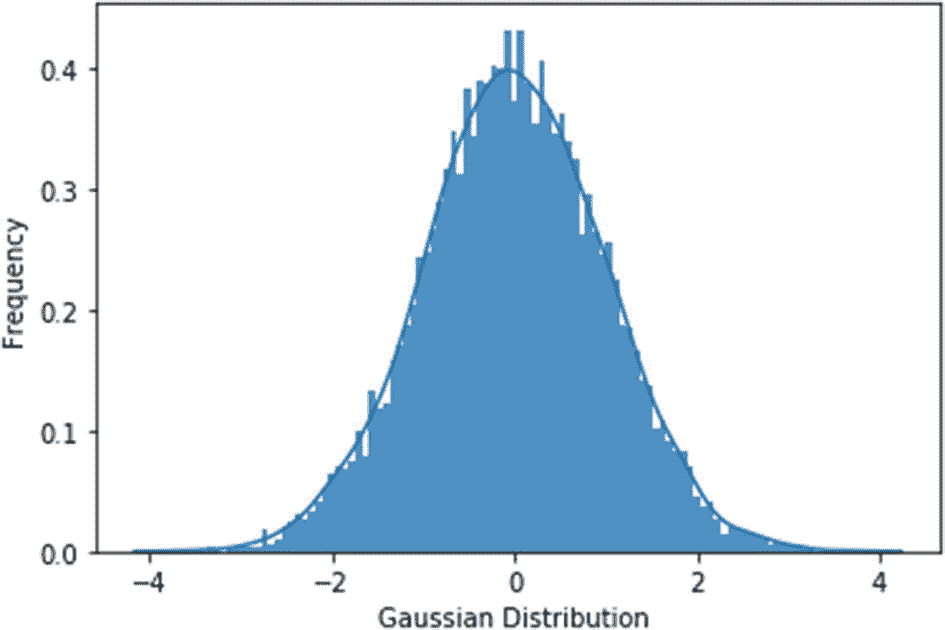

图 1-5-8

高斯分布直方图

#### 指数分布

另一个重要的分布是*指数分布*。顾名思义，价值呈指数增长。有一个参数 rate ( *λ* )控制着分布的斜率。

```py
from scipy.stats import expon
import seaborn as sns

loc = 10
lambda_inverse = 1
data = expon.rvs(size=10000,loc=loc,scale=lambda_inverse)
ax = sns.distplot(data,
                 bins=100,
                 hist_kws={'alpha':0.8})
ax.set(xlabel='Exponential Distribution', ylabel="Frequency")

```

图 [1-5-9](#Fig21) 显示了从对数正态分布中选择随机值时的直方图，可使用上述代码绘制。

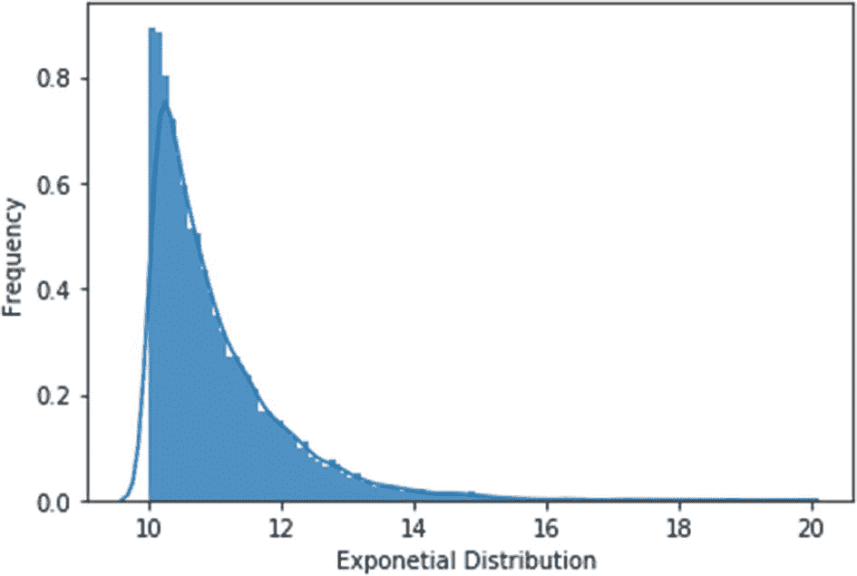

图 1-5-9

指数分布的直方图

当我们使用它们的时候，我们会在后面的章节中遇到更多的发行版。我们将看到哪些超参数适合于哪些分布，以及为什么。现在你已经了解了超参数，在第 [2](2.html) 章中，我们将探索一些基本的超参数调整方法。