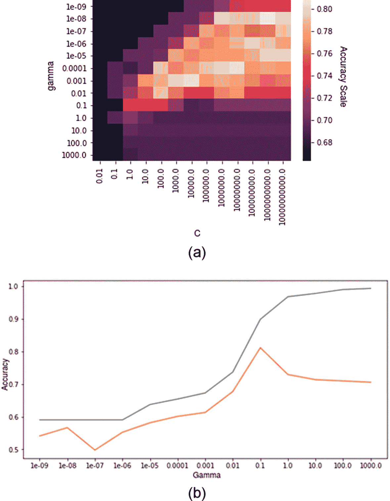
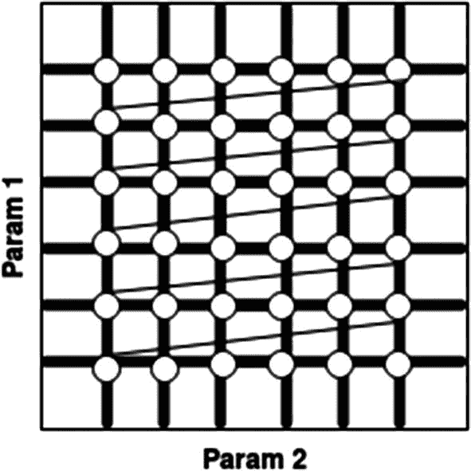
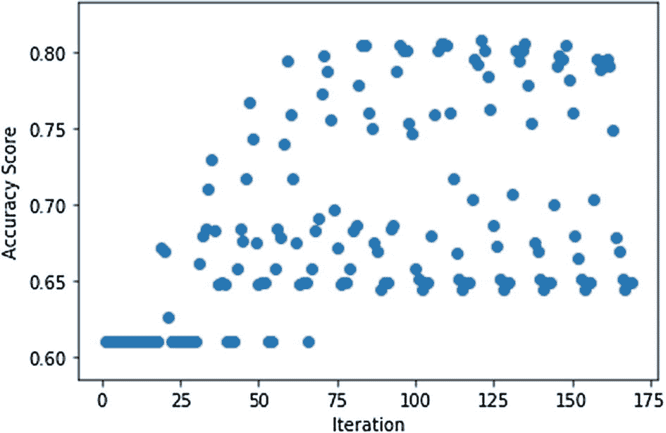
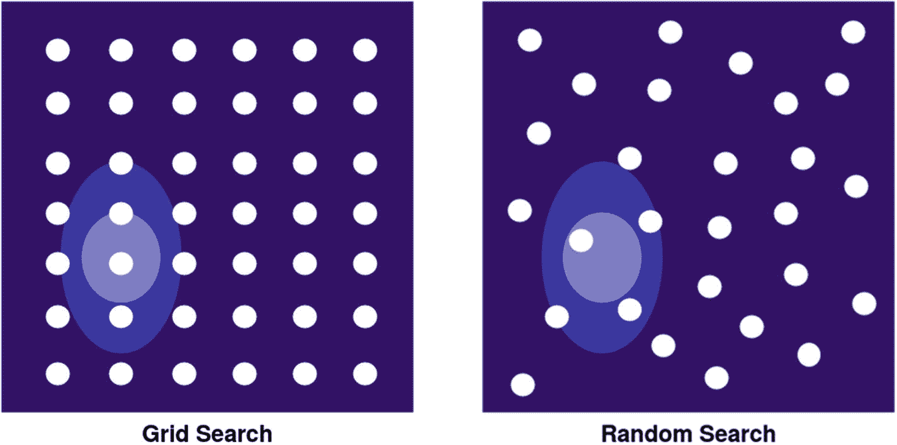
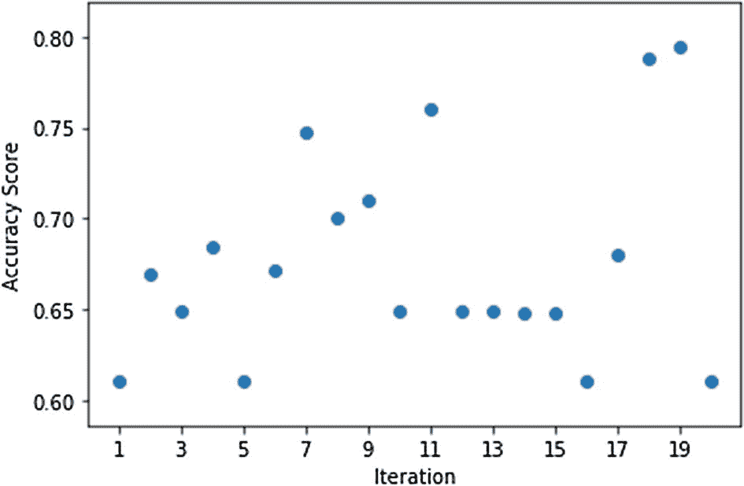
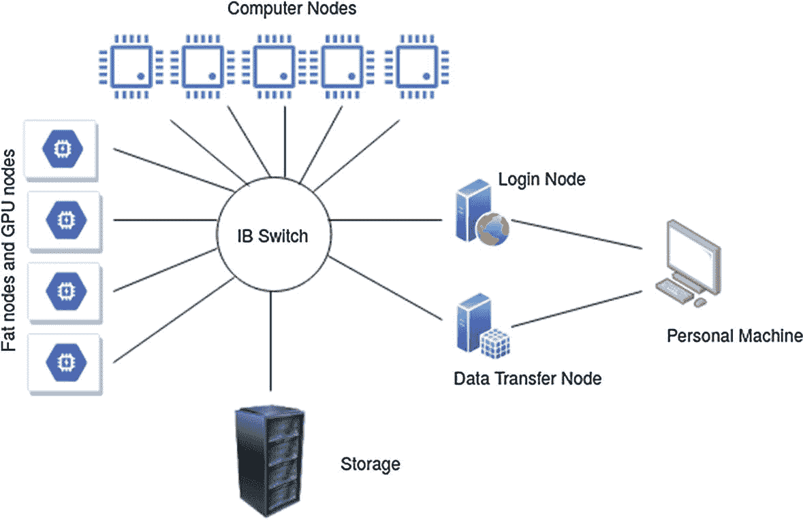

# 二、使用 Scikit-Learn 优化超参数

在前一章中，你学习了什么是超参数，以及它们如何影响算法的性能。既然您已经知道了优化超参数的重要性，本章将向您介绍 scikit-learn 库中实现的算法在超参数优化中的一些简单而强大的用途。Scikit-learn 是机器学习实践中使用最广泛的开源库之一。它使用简单，在预测分析中非常有效。

## 改变超参数

从第 [1](1.html) 章你知道支持向量机(SVM)是如何工作的。现在，您将看到在 Titanic 数据集(数据集在附录 [I](https://doi.org/10.1007/978-1-4842-6579-6) 中解释)上固定核(RBF)时，改变两个超参数(正则化因子 C 和核系数γ)如何影响结果。

图 [2-1(a)](#Fig1) 给出了伽马和 C 的对比；热图中较浅的颜色代表较高的准确性。我们看到，较高的 c 值(10^11)和较低的γ值(10^-8)可以获得更高的测试精度，而较低的 c 值(10^4)和相对较高的γ值(10^-3)可以获得相对较高的精度。图 [2-1(b)](#Fig1) 中的图形显示，随着 gamma 值的增加，保持 C 不变为 1，某一点后的训练精度(蓝线)和测试精度(橙线)之差不断增加，导致模型过拟合，这证明我们需要通过降低 C 来正则化模型



图 2-1

(a)γ和 c 的不同值的热图，(b)随着γ的增加而改变精度

## 网格搜索

也许寻找最佳超参数集的最强力方法是在每个可能的集上训练数据集。这种被称为*网格搜索*的方法是找到最佳超参数集的最确定的方法，但它也有缺点。图 [2-1-1](#Fig2) 描绘了一个穿过参数 1 和 2 所有可能组合的网格。



图 2-1-1

遍历两个超参数的每个可能组合的网格搜索

假设您有十个算法，每个算法有五个超参数，每个超参数有四个可能的值，以及一个巨大的数据集，该数据集需要 1 分钟来训练一组超参数上的一个算法。这种情况需要大约一周的时间来发现您的最佳超参数。但是对于较少数量的超参数和较少的训练时间，我们可以使用网格搜索。现在我们将在 Python 中构建这个简单的算法，并在图 [2-1-1](#Fig2) 所示的例子中进行测试。

超参数的值可以在连续分布或离散分布上变化。如果该值是离散的，则在一个范围内有有限数量的可能值。然而，在连续分布中，有无限可能的值，正如我们在第 [1](1.html) 章中看到的。接下来，我们将调整 C 和 gamma，两者都在一个范围内连续分布。但是要做一个网格，我们要在对数尺度上做一个均匀的分布。网格搜索不取随机变量；要制作网格，需要具体的数值。

让我们做一个超参数 C 和γ的网格:

```py
c = 0.001
gamma = 1e-10
param_grid = {
              "C": [c*(10**i) for i in range(1,14)],
              "gamma": [gamma*(10**i) for i in range(1,14)]
             }

```

Note

我用了一个预处理过的数据集(X_train，y_train，X_test，y_test)，Titanic 数据集。请参考附录 I 查看所有预处理方法。

我们将首先创建一个函数，将这个网格分成所有可能的超参数集合的列表，`make_sets()`:

```py
from itertools import product

def make_sets(grid):
   sets = list()
   all_hps_vals = [lst for lst in param_grid.values()]
   hp_keys = [hp for hp in param_grid.keys()]
   val_sets = product(*all_hps_vals)
   for val in val_sets:
       hp_set = dict()
       for idx, hp_key in enumerate(hp_keys):
           hp_set[hp_key] = val[idx]
       sets.append(hp_set)
   return sets

>>> make_sets(param_grid)
[{'C':0.01, 'gamma':1e-09},
 {'C':0.01, 'gamma':1e-08},
 {'C':0.01, 'gamma':1e-07},
 ...
 ...
 {'C':10000000000.0, 'gamma':1000.0}
]

```

现在我们将创建另一个函数`grid_search()`，来拟合机器学习算法的所有集合:

```py
def grid_search(clf, grid, X_train, y_train, X_test, y_test):
   all_sets = make_sets(grid)
   logs = list()
   best_hp_set = {
      "best_test_score": 0.0
   }
   for hp_set in all_sets:
       log = dict()
       model = clf(**hp_set)
       model.fit(X_train, y_train)
       train_score = model.score(X_train, y_train)
       test_score = model.score(X_test, y_test)

       log["hp"] = hp_set
       log["train_score"] = train_score
       log["test_score"] = test_score

       if best_hp_set["best_test_score"]<test_score:
           best_hp_set["best_test_score"] = test_score
           best_hp_set["hp_set"] = hp_set

       logs.append(log)

   return logs, best_hp_set

>>> from sklearn.model_selection import train_test_split
>>> from sklearn.svm import SVC

# train test split dataset.
# X and y are the pre-processed features and labels respectively.
>>> X_train, y_train, X_test, y_test = train_test_split(X, y)

>>> logs, best = grid_search(SVC, param_grid, X_train, y_train, X_test, y_test)

```

我们刚刚定义的`grid_search()`函数接受以下输入:分类器、parameter_grid 和数据集。从`make_sets()`函数中，`grid_search()`创建超参数的所有组合，并在所有组合上训练模型。然后，我们将训练和测试分数保存在字典中，并搜索最佳结果。

注意，为了简化代码，我在训练时没有对进行交叉验证。为了实际评估每组超参数，我们必须使用验证集并保存测试集以备后用，这样我们就可以在独立集上评估模型。然而，我们没有将训练集分成训练集和验证集(因为在像 Titanic 这样的数据集中，我们只有大约 700 个数据点)，而是进行交叉验证，保留宝贵的训练数据不变。交叉验证还可以防止验证集的过度拟合。

我们现在将看到如何使用 scikit-learn 提供的`GridSearchCV()`函数在 K-fold 交叉验证中分割训练集:

```py
>>> from sklearn.model_selection import GridSearchCV

>>> clf = GridSearchCV(SVC(), param_grid, cv=3)

>>> # X_train and y_train being datapoints from titanic dataset.
>>> # titanic dataset is used for sake of presenting this example.
>>> clf.fit(X_train, y_train)

>>> clf.best_estimator_
SVC(C=100000.0, break_ties=False, cache_size=200, class_weight=None, coef0=0.0,
    decision_function_shape='ovr', degree=3, gamma=0.0001, kernel="rbf",
    max_iter=-1, probability=False, random_state=None, shrinking=True,
    tol=0.001, verbose=False)

```

在图 [2-1-2](#Fig3) 中，我们可以看到准确率分数随着迭代而变化(对于 169 个组合)。



图 2-1-2

迭代与准确度得分的关系图

图 [2-1-2](#Fig3) 没有展示出清晰的模式，因为这是一种穷举搜索方法；我们正在尝试所有可能的组合。可以定义`GridSearchCV()`函数，传递算法、参数网格、折叠数进行交叉验证。所有其他方法，如“fit()”、“score()”等都是一样的。您可以使用方法`best_estimator_`来获得超参数的最佳值。我调整了“gamma”和“C ”,与我们的 scratch 实现相同，保持其余的超参数不变。

## 随机搜索

网格搜索最终找到接近最优的超参数集，但其时间和资源消耗较高。另一种方法，*随机搜索*，消耗的时间和资源更少。它随机选取超参数，建立一个集合，并在其上训练模型。这种方法可能找不到最佳集合，但是找到接近最佳集合的机会更高，从而节省大量时间。

与网格搜索不同，随机搜索不会在没有希望的候选项上花费大量时间，而是跳转到随机超参数，即使它没有从过去的结果中学习，它通常也会提供令人满意的结果。在随机搜索中，我们定义了*个尝试次数*，也就是要尝试的超参数的集合数。

通过研究图 [2-2-1](#Fig4) 中所示的例子，让我们看看随机搜索如何优于网格搜索。



图 2-2-1

比较网格搜索(左)和随机搜索(右)

在图 [2-2-1](#Fig4) 的两幅图像中，“x”和“y”轴代表两个超参数，背景代表随着颜色变浅精度增加。在网格搜索的情况下，如左图所示，如果我们沿着网格从左上角开始搜索，我们的搜索将需要相当长的时间才能到达更高精度的区域。在随机搜索的情况下，如右边所示，因为我们随机搜索超参数，所以我们比网格搜索更有机会更早达到更高的精度。一旦规定数量的试验结束，我们将选择可用的最佳超参数集，希望它至少接近最佳集。

以下是使用随机搜索优于网格搜索的两个主要优点:

*   试验次数是确定的，与组合总数无关。

*   由于试验次数是确定的，即使非贡献参数的数量增加，算法的时间效率也不会受到影响。

在随机搜索中，因为我们在搜索范围之外随机选择超参数，所以我们可以使用 Python 中的`random`库，对于离散超参数使用`random.randint(a, b)`(给出整数 a 和 b 之间的随机整数)，对于 numpy 或 scipy.stats 中的连续 or 函数使用`random.random()`(给出 0 和 1 之间的随机浮点数，其中 1 不包含在内)，它给出不同类型的分布，如均匀分布、对数正态分布、指数分布等等。

或者，如下图所示，我们可以为连续分布的超参数创建一个更大的网格，就像真正的大网格，因为它不会增加试验次数(我们将定义)，使算法能够从更大的样本中选择超参数。

```py
import random
import numpy as np

def loguniform(low=0, high=1, size=100, base=10):
      # function creates a log uniform distribution with
      # random values.
      return np.power(base, np.random.uniform(low, high, size))

param_grid = {
              "gamma": loguniform(low=-10, high=4, base=10),
              "C": loguniform(low=-3, high=11, base=10)
             }

def get_random_hp_set(grid):
      # function chooses a random value for each from grid
      hp_set = dict()
      for key, param in grid.items():
            hp_set[key] = np.random.choice(param)
      return hp_set

def random_search(clf, grid, n_iterations, X_train, y_train, X_test, y_test):
      # defining function for random search
      logs = list()
      best_hp_set = {
       "best_test_score": 0.0
      }

      for iteration in range(n_iterations):
            log = dict()

            # selecting the set of hyperparameters from function defined
            # for random search.
            hp_set = get_random_hp_set(grid)
            # print(hp_set)
            model = clf(**hp_set)
            model.fit(X_train, y_train)
            train_score = model.score(X_train, y_train)
            test_score = model.score(X_test, y_test)

            log["hp"] = hp_set
            log["train_score"] = train_score
            log["test_score"] = test_score

            if best_hp_set["best_test_score"]<test_score:
                  best_hp_set["best_test_score"] = test_score
                  best_hp_set["hp_set"] = hp_set

            logs.append(log)

      return logs, best_hp_set

>>> X_train, y_train, X_test, y_test = train_test_split(X, y)

>>> logs, best = random_search(SVC, param_grid, 20, X_train, y_train, X_test, y_test)

```

因此，我们将在更少的迭代中从随机搜索中获得至少接近最佳的超参数集。

scikit-learn 再次为我们提供了一个交叉验证功能`RandomizedSearchCV()`。让我们看看它是如何工作的:

```py
>>> from sklearn.model_selection import RandomizedSearchCV

>>> # just like our function RandomizedSearchCV also has argument 'n_itern'
>>> clf = RandomizedSearchCV(SVC(), param_grid, n_iter=20, cv=3)

>>> clf.fit(X_train, y_train)

>>> clf.best_estimator_
SVC(C=1000000000.0, break_ties=False, cache_size=200, class_weight=None,
    coef0=0.0, decision_function_shape="ovr", degree=3, gamma=1e-05,
    kernel='rbf', max_iter=-1, probability=False, random_state=None,
    shrinking=True, tol=0.001, verbose=False)

```

如图 [2-2-2](#Fig5) 所示，随机搜索仅用 20 次迭代就达到了相当的精度。



图 2-2-2

随机搜索的迭代与精度图

`GridSearchCV`和`RandomizedSearchCV`都有另一个有用的论点，`scoring`；如果设置为默认值，则使用机器学习算法的评分方法，通常为`'accuracy'`。但是，我们可以为它提供任何我们认为适合我们工作的评分方法，比如`'roc_auc'`、`'f1'`、`'precision'`、`'recall'`等等。

## 并行超参数优化

网格搜索和随机搜索都是蛮力方法；它们不依赖于先前的结果来选择下一组超参数。我们可以利用这一点，并行处理试验。这些算法的 scikit-learn 实现提供了一个参数“`n_job`”，该参数可以设置为“`-1`”，以指定应该使用本地机器的所有内核。

在本节中，我们将了解如何在高性能计算(HPC)集群上分布网格搜索等算法。HPC 集群只是一组高端计算机(称为*节点*)，它们经过配置，可以在快速互连的帮助下持续通信，提供类似于超级计算机的计算能力。HPC 集群由以下组件组成，如图 [2-3-1](#Fig6) 所示:



图 2-3-1

高性能计算集群

*   *登录节点*:从这里，我们可以使用我们的机器，通过安全协议，比如安全 Shell (SSH)，远程访问集群。它用于上传和执行代码。

*   *数据传输节点*:同样，SSH 之类的安全协议与`scp`和`rsync`之类的命令一起使用，将大量数据从我们的机器传输到 HCP 集群。传输由加密隧道保护。

*   *计算机节点*:有不同类型的计算机节点，包括硬件规格与我们个人机器相似的常规节点，拥有海量数据存储(以 TB 为单位)的“胖”计算机节点，以及由 GPU 和 CPU 组成的高端节点。这些节点一起帮助计算。

*   *无限带宽(IB)交换机*:这种交换机支持节点之间的快速通信，具有高吞吐量和极低的延迟。

*   *存储*:这里可以存储大文件，并可以通过数据传输节点进行传输。

然而，使用高性能计算集群并不像设置'`n_job = -1`'那么简单，将集群发挥到最大潜力甚至是困难的。我们将使用 Slurm workload manager，这是一个用于计算机集群排队的开源作业调度器，以及用于多线程并行计算的 ipyparallel。

您可以将下面的代码用于 HPC 和 Amazon EC2 集群，只需根据各自的需求稍作修改。

现在，我们将再次优化 MNIST 数据集上的 SVM 超参数 C 和伽马(参见附录 [II](https://doi.org/10.1007/978-1-4842-6579-6) 以了解更多关于 MNIST 的信息)。

以下代码的灵感来自莱克兰谢生产工程数据科学家 Hugues-Yanis Amanieu 博士的作品 <sup>[1](#Fn1)</sup> 。

首先，我们将使用 SSH 登录到登录节点:

```py
$ ssh username@ip

```

现在我们已经登录到 HPC 群集，我们将创建一个虚拟环境:

```py
$ virtualenv hpc_tuning
$ source hpc_tuning/bin/activate

```

并安装所有的依赖项，slurm，slurm-client，ipyparallel，joblib，ipython，当然还有 scikit-learn 在你的虚拟环境中‘调优’。我们也可以通过 Anaconda 下载并安装它们(在 conda 虚拟环境中)。

接下来，我们将编写一个 shell 脚本(' launch.sh ')，其中我们将使用 Slurm 来调度作业:

```py
#this will activate the virtualenv
source hpc_tuning/bin/activate

#creating a new job profile name for ipython which slurm will use
profile=job_${JOB_NAME}

#creates an config file for ipython
ipython profile create ${profile}

#starts ip controller
ipcontroller --ip="*" --profile=${profile} &
sleep 10

#srun runs ipengine on all the cores
srun ipengine --profile=${profile} --location=$(hostname) &
sleep 25

#execute the python file, where we'll define the grid search to #distribute on cluster
python $1 -p ${profile}

```

让我们详细研究一下这段代码。

*   首先，我们激活一个虚拟环境，在那里一切都是从头开始安装的，这样我们就不会面临任何依赖问题。

*   之后，我们分配一个变量`profile`，在这里我们定义一个字符串，它将是我们作业的名称/身份。

*   一旦创建了 ID，我们使用`ipython`命令创建一个概要文件，它初始化一个包含配置信息的文件夹。

*   现在我们有了控制器和引擎。控制器对作业进行调度和排队，引擎计算数据并存储结果。我们使用 ipython 在控制器和引擎之间进行通信。

*   `ipcontroller`命令启动控制器，`ipengine`命令启动引擎。在启动‘ipcontroller’时，我们需要控制器监听所有引擎，参数`--ip="*"`允许控制器监听所有接口。

*   对于引擎与控制器的连接，我们使用带有参数`--location=="ip"`的`ipengine`，其中我们提供了控制器的 IP 地址。`ipcontroller`创建一个名为‘ipcontroller-engine . JSON’的文件，需要复制到所有引擎；然而，在我们的例子中，我们假设引擎和控制器共享同一个文件系统，在这种情况下，引擎将自动找到“json”文件的位置。

注意，在前面的代码中，我们使用`srun`来运行`ipengine`；`srun`是一个 Slurm 命令，在所有可用的内核上运行`ipengine`。最后，我们运行包含 scikit-learn 代码的 Python 脚本，并传递一个参数配置文件名称。

让我们编写 Python 脚本(' python_script.py '):

```py
import argparse
import os
import sys
import time
import pandas as pd
from sklearn.externals.joblib import parallel_backend
from sklearn.externals.joblib import register_parallel_backend
from sklearn.externals.joblib import cpu_count
from sklearn.datasets import load_digits
from sklearn.model_selection import GridSearchCV
from sklearn.model_selection import train_test_split
from sklearn.svm import SVC
from ipyparallel import Client
from ipyparallel.joblib import IPythonParallelBackend

# append file dir path to sys path, so imports from custom function would # work
FILE_DIR = os.path.dirname(os.path.abspath(__file__))
sys.path.append(FILE_DIR)

# argparser to take profile name as argument from our shell script
parser = argparse.ArgumentParser()
parser.add_argument("-p", "--profile", default="job_hp_test",
                   help="Name of IPython profile to use")
args = parser.parse_args()
profile = args.profile

# counts total number of available cores
print(cpu_count())

# Create a Client instance providing the name of profile created on shell script
c = Client(profile=profile)

# Ensure all engines(c) are running in the working directory
c[:].map(os.chdir, [FILE_DIR]*len(c))

# print list of engine ids
print(c.ids)

# restrict all the engines
bview = c.load_balanced_view()
register_parallel_backend('threading',
                        lambda : IPythonParallelBackend(view=bview))

# loading the data
digits = load_digits()
# splitting the data to train and test
X_train, X_test, y_train, y_test = train_test_split(digits.data,
                                                  digits.target,
                                                  test_size=0.3)
# prepare the hyperparameter grid
param_grid = {
            "C": [c*(10**i) for i in range(1,14)],
            "gamma": [gamma*(10**i) for i in range(1,14)]
           }

# defining classifier with default hyperparameters
svc = SVC()

# defining GridSearchCV
search = GridSearchCV(svc,
                     param_grid,
                    return_train_score=True,
                    n_jobs=len(c))

# start timer
since = time.time()

# using parallel backend to start the parallel processing
with parallel_backend('threading'):
      search.fit(X_train, y_train)

# end the timer
time_taken = time.time() - since

# converting and saving the results to .csv file
print(f"Saving results to {FILE_DIR}")
results = search.cv_results_
results = pd.DataFrame(results)
results.to_csv(os.path.join(FILE_DIR,'scores.csv'))
print(f"Results Saved!")

# Display the time taken
print(f"Tuning Time: {time_taken}")

```

让我们一步一步地检查前面的 Python 脚本中发生了什么:

*   导入之前在我们的虚拟环境中安装的所有库。

*   因为我们需要使用创建 ipython 概要文件所用的概要文件名称，所以我们使用 argparser 并从 shell 脚本中获取名称作为参数。

*   初始化客户端，为其提供集群的概要名称，以准备所有引擎。`c.ids`用于获取所有引擎 id 的列表。

*   限制所有引擎之间的负载平衡。

*   在并行运行算法之前，我们将后端名称定义为一个字符串(`'threading'`)，为此我们使用函数`register_parallel_backend`；稍后我们将在运行模型的训练时使用`'threading'`。

*   加载数据集，将其拆分为训练和测试，并为 C 和 gamma 定义网格。

*   初始化`SVC()`并定义`GridSearchCV()`，将`n_jobs`设置为`-1`(使用所有可用内核)或`len(total_engines)`(使用定义数量的内核)。

*   我们之前使用`register_parallel_backend`和`'threading'`定义了任务并行计算的后端名称。我们现在使用这个名字来运行`parallel_backend`，并对 SVM 的‘C’和‘gamma’进行网格搜索。

*   保存结果。

*   执行命令`sbatch launch.sh python_script.py`；`sbatch`是一个 Slurm 命令，将编写的脚本提交给 Slurm。

*   使用`scp`命令传输结果文件。

这就是我们如何优化计算机集群上的大量超参数，同时最大限度地发挥其潜力。你也可以用随机搜索代替网格搜索。使用 HPC 将大大减少您的时间消耗。

我们回顾了一些用于超参数优化的穷举和强力方法，如果应用于神经网络架构搜索等问题，这些方法将需要很长时间，并且不可行。在后面的章节中，我们将会看到更多能够处理这些复杂任务的算法和库。然而，在具有较少超参数和较窄搜索范围的问题中，或者作为数据科学家，您可以通过查看数据集来决定近似值或缩小搜索空间的情况下，这些算法可能会很有成效，将它们与机器(如 HPC 集群中的机器)一起使用甚至可以提高它们的效率。

<aside aria-label="Footnotes" class="FootnoteSection" epub:type="footnotes">Footnotes [1](#Fn1_source)

[T2`http://www.hyamani.eu/2018/05/20/parallel-super-computing-with-scikit-learn/`](http://www.hyamani.eu/2018/05/20/parallel-super-computing-with-scikit-learn/)

 </aside>