# 4.贝叶斯优化

在第 [2](2.html) 和 [3](3.html) 章中，我们探讨了几种超参数调谐方法。网格搜索和随机搜索非常简单，我们讨论了如何分配它们以节省内存和时间。我们还研究了一些更复杂的算法，比如 HyperBand。但是我们回顾的算法都没有从它们以前的历史中学习。假设一种算法可以记录所有以前的观察结果，并从中学习。例如，假设它可以观察到我们的模型在超参数的某些值附近被优化，并可以利用这一有价值的信息，继续处理最接近那些性能良好的超参数的超参数，从而从其历史中学习。通过这样做，该算法将不会在达到最佳性能的超参数的同时在性能差的超参数上浪费时间。在这一章中，我们将探索具有这种能力的算法。

先说个例子。图 [4-1-1](#Fig1) 显示了两个超参数之间的图。将其与第 [2](2.html) 章中的图 [2-2-1](2.html#Fig2) 进行比较，图 2-2-1 表示网格搜索，其中我们遍历选定参数的网格，并在随机搜索中随机命中一组超参数。

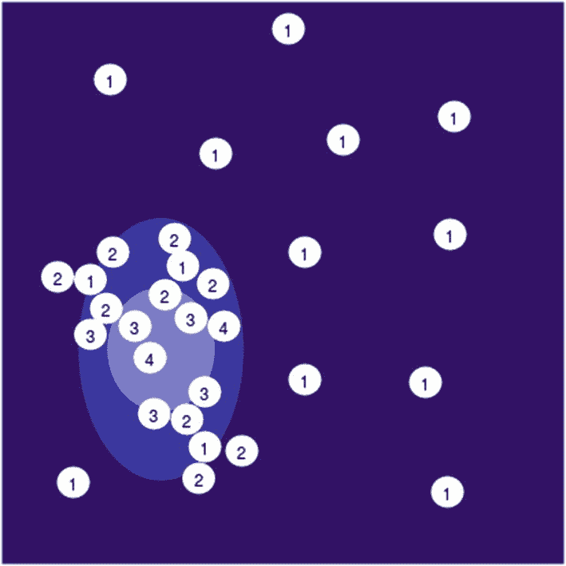

图 4-1-1

两个超参数之间的图，其中较暗的区域表示精度较低，较亮的区域表示精度较高

在图 [4-1-1](#Fig1) 中，数字为 1 的圆是随机选取的超参数。观察到位于最暗和最亮区域之间的中间区域的一些 1 产生更好的模型。因此，我们没有在其余的 1 试验上浪费时间，而是着眼于表现更好的 1 试验的周围区域，并用 2 来训练模型，等等。最后，我们得到 4，其中一个 4 位于中间区域，一个几乎位于最亮区域的中心。因此，我们选择位于最轻区域的 4 个试验作为我们的最佳超参数集。直觉上，这个过程似乎比你之前学过的穷举方法要好。

## 基于序列模型的全局优化

值得注意的是，在机器学习中，函数的训练和评估是昂贵且缓慢的。在本节中，我们将研究基于序列模型的全局优化(SMBO)来解决超参数优化问题。SMBO 使用贝叶斯优化方法，该方法用于跟踪以前的评估，并基于概率模型选择随后的超参数集。

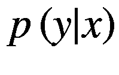

我们的目标函数(机器学习算法)为 *f* ， *y* 是通过在超参数 *x* 集合上评估 *f* 计算出的分数。在贝叶斯优化中，本质上有四个重要的方面(在以下步骤列表后定义):搜索空间、目标函数、概率回归模型和获取函数。

整体贝叶斯优化可以总结为以下步骤:

1.  建立回归模型。

2.  初始化一些随机的超参数集(在第一次试验的情况下，因为我们需要从某个地方输入初始超参数)。

3.  在采集函数建议的超参数集上评估模型(如果是第一次试验，从步骤 2 中选择超参数),并计算目标函数的得分。

4.  根据新建议的超参数和分数更新代理模型。

5.  重复步骤 3 和 4，重复定义的迭代次数。

一个*搜索空间* ( *X* )，正如你在第 [1](1.html) 章中了解到的，是一个定义的范围，在这里我们为超参数优化算法提供一个选择的范围。根据超参数的不同，范围可以是连续的或离散的。例如，在 SVM 中选择核函数是一个离散的超参数，但伽马是从连续分布中选择的。搜索空间可能真的很复杂。例如，选择神经网络中每个隐藏层的节点数取决于隐藏层的数量。

*目标函数* ( *f* )是在给定的一组超参数上训练机器学习模型的函数，并且输出是准确度分数或损失分数，这取决于获取函数。在下面的例子中，我们正在计算准确性分数，如果返回值最小化，我们将通过最小化其负值来最大化准确性分数。

```py
X, y = load_data()  # X and y are some preprocessed data
X_train, X_test, y_train, y_test = train_test_split(X, y, test_size = 0.3)

def objective_function(hyperparameters):
      C = hyperparameters["C"]
      gamma = hyperparameters["gamma"]

      model = SVC(C=C, gamma=gamma)
      model.fit(X_train, y_train)

      score = model.score(X_test, y_test)
      # since we want to maximize score, taking it's negative
      return -score

```

*概率回归模型*(*p*(*y*|*x*)*或 M* )也称为代理函数，是使用先前的评估建立的，并且是目标函数的概率建模，因此每次迭代通过评估目标函数的超参数来更新代理。与目标函数相比，代理函数评估的成本*更低，并且代理函数决定目标函数要评估的下一组超参数，从而降低优化成本。可以通过不同的方法来制定代理，例如高斯过程(GP)、随机森林或树结构 Parzen 估计器(TPE)。以下是这些替代物是如何形成的简要概述:*

*   在高斯过程中，函数 *f* 被假设为高斯分布的实现，其中预测遵循正态分布。GP 车型 *p* ( *y* | *x* )直接。

*   在 TPE 中， *p* ( *y* | *x* )都是仿照 *p* ( *x* | *y* )和 *p* ( *y* )。我们将在本章后面更详细地讨论 TPE。

*获取函数* ( *S* )使用替代模型和前一组超参数的预测损失分数来选择下一组超参数。有几个获取函数，如改进概率、预期改进、最小化条件熵和基于 bandit 的标准。最常用的是预期改善:

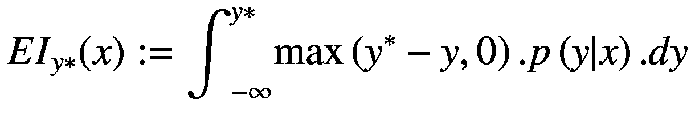

这里， *EI* 由代理和损失分数建模。 *y* *是某个阈值，而 *y* = *f* ( *x* )是在建议的超参数集 *x* 上从目标函数获得的分数。*p*(*y*|*x*)是代理模型。前面积分的正值意味着所提出的超参数很可能会产生更好的结果。在建议的集合 *x* 上，如果 *y* 负增加，EI 将为正，因此指示超参数的更好选择。

以下是 SMBO 方法工作原理的通用伪代码模板:

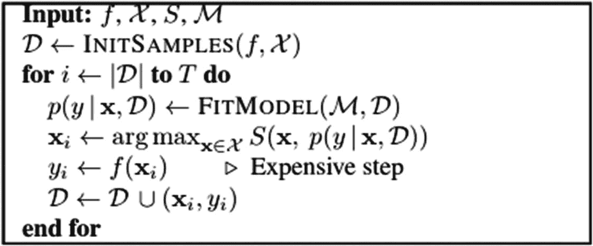

在这段伪代码中， *f* 是目标函数， *X* 是超参数的搜索空间， *S* 是获取函数， *M* 是回归模型(代理)。

首先，我们用来自搜索空间的一些随机样本初始化*D*； *D* 以( *x* <sub>i，</sub> *y* <sub>i</sub> 的形式存储评价历史，其中 *x* <sub>i</sub> 代表后续的超参数集， *y* <sub>i</sub> 代表损失分数。

我们现在运行循环来定义试验次数 *T* 。首先，使用历史 *D* 更新代理。现在 *S* 建议一组超参数 *x* i. *x* i 被发送到 *f* 并计算损失分数。历史现在保存在 *D* 中，它将再次用于更新代理。

经过 *T* 次试验后，我们将拥有最佳的超参数集。

您不必实现这些方法，因为所有的概率回归模型都可以在不同的库中找到实现。例如，hyperpt<sup>[1](#Fn1)</sup>实现了一个 TPE，留兰香 <sup>[2](#Fn2)</sup> 和 MOE <sup>[3](#Fn3)</sup> 实现了一个高斯过程，SMAC <sup>[4](#Fn4)</sup> 实现了一个随机的基于森林的代理。

接下来，我们将详细讨论树形结构 Parzen 估计器的工作原理以及预期改善获取函数。

## 树形 Parzen 估计量

树形结构的 Parzen 估计器是一种流行的贝叶斯优化方法，它使用期望改善获取函数 <sup>[5](#Fn5)</sup> 。在 TPE 中， *p* ( *y* | *x* )是按照贝叶斯定理对*p*(*x*|*y*)和 *p* ( *y* )进行建模，而不像 GP 那样直接对*p*(*y*|*x*)进行建模

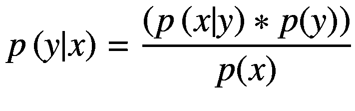

(Equation 4.2.1)

*p* ( *x* | *y* )表示为

*p*(*x*|*y*=*l*(*x*)*if y*<

和

*p*(*x*|*y*)=*g*(*x*)*if y*>=*y**(方程式 4.2.3)

这里， *y* *是一个分位数，称为*阈值损失分数*。 *l* ( *x* )和 *g* ( *x* )是超参数分布。因此，在某些超参数集合(*x*I)上，如果预测损失分数( *y* )小于 *y* *，则表示这些集合位于分布 *l* ( *x* )，如果 *y* 大于 *y* *则位于分布 *g* ( 【T30 我们可以通过图 [4-2-1](#Fig2) 清楚地理解这一点。

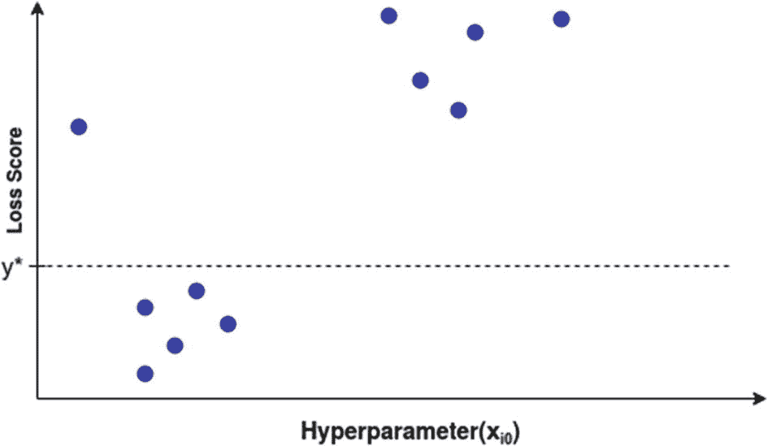

图 4-2-1

在超参数*x*<sub>T3】I0</sub>下面的点*y*T8】*来自分布 *l* ( *x* )上面的点 *y* <sup>*</sup> 来自分布 *g* ( *x*

选择 *y* *的值，使其大于 *f* ( *x* )， *y* < *y* *，因此我们必须找到位于 *l* ( *x* )分布中的超参数集，以使预测损失分数小于 *y* *。

让

*p*(*y*<*y*<sup>∫</sup>)=*γ*(方程式 4.2.4)

和连续边际概率是

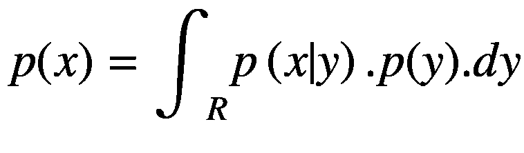

(Equation 4.2.5)

现在我们优化 EI:

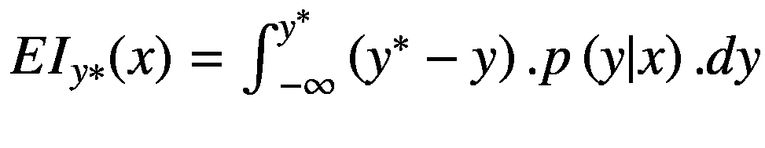 = 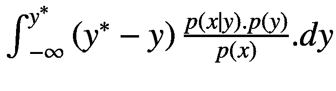(方程式 4.2.6)

通过使用等式 4.2.2、4.2.3 和 4.2.4，等式 4.2.5 可以写成如下形式:

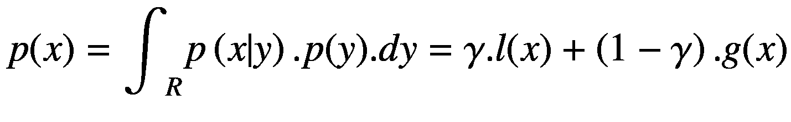

(Equation 4.2.7)

现在等式中分母项。4.2.6 简化为方程 4.2.7，不依赖于 *y* 。让我们简化分子:

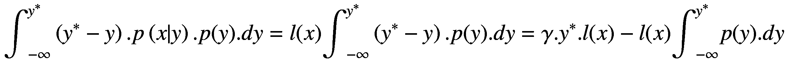

(Equation 4.2.8)

将等式 4.2.7 和 4.2.8 放在一起，我们得到预期改善的值:

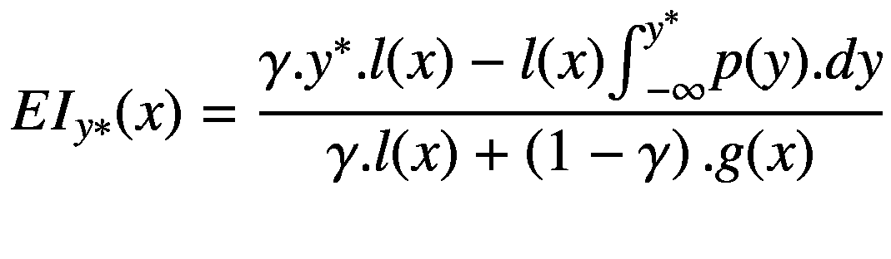

进一步简化，我们得到:

![$$ {EI}_{y\ast }(x)=\frac{\ l(x)\left[\gamma .{y}^{\ast }-{\int}_{-\infty}^{y^{\ast }}p(y). dy\right]}{\gamma .l(x)+\left(1-\gamma \right).g(x)} $$](img/494613_1_En_4_Chapter_TeX_Equd.png)

因此:

![$$ {EI}_{y\ast }(x)\propto {\left[\gamma +\frac{g(x)}{l(x)}.\left(1-\gamma \right)\right]}^{-1} $$](img/494613_1_En_4_Chapter_TeX_Equ5.png)

(Equation 4.2.9)

等式 4.2.9 明显地告诉我们，期望改善与比率*g*(*x*)/*l*(*x*)成反比。这意味着我们希望我们的超参数( *x* )位于分布 *l* ( *x* )中，而不是 *g* ( *x* )中，以增加 EI。

因此，在每次迭代中，从 *l* ( *x* )中抽取候选，并返回损失分数最小的一个，从而选择最佳超参数。

现在您已经对我们如何在贝叶斯方法中建模代理函数和获取函数有了一个基本的概念，接下来我们将看一下实现 TPE 的开源库 Hyperopt。

## 超选项

Hyperopt 是一个出色的分布式异步超参数优化开源库，它实现了随机搜索、TPE 和自适应 TPE 等算法。在本节中，我们将重点介绍如何使用 Hyperopt 库来优化超参数。

Hyperopt 处理笨拙的搜索空间，包括搜索离散值和连续值。我们可以使用该库在算法之间进行搜索，并找到这些算法的最佳超参数集。当处理深度学习中的问题时，我们处理数百个维度，为了挖掘深度网络的全部潜力，我们需要超参数设置达到最佳。使用网格搜索或随机搜索不是一种选择，因为网络的每次训练都是非常昂贵的。在这种情况下，使用贝叶斯优化可能是最好的选择。

为了使用远视，我们需要一个搜索空间和一个目标函数。让我们举一个简单的例子:


这里我们最小化 *f* ( *a* ， *b* )使得*a*∈[2，3]和*b*∈[1，2]。

让我们用 Hyperopt 来优化这个问题:

```py
from hyperopt import tpe, fmin, hp

def objective_func(args):
      a = args['a']
      b = args['b']
      f = a**2 - b**2
      return f

range_a = hp.uniform('a', -2, 3)
range_b = hp.uniform('b', -1, 2)

space = {'a': range_a,
         'b': range_b}

best = fmin(objective_func, space, algo=tpe.suggest, max_evals=100)

```

前面这段代码使用 TPE 来寻找 *a* 和 *b* 的最佳值，使得 *f* ( *a* ， *b* )最小。我们可以看到，函数在 *a* = 0 和 *b* = 2 时最小，最小值为*f*<sub>*min*</sub>= 4。让我们看看 1000 次试验中的远视是如何处理这个问题的。

图 [4-3-1](#Fig3) 显示 *a* 和 *b* 的值分别在 0 和 2 以上饱和， *f* 的值在早期试验中在 4 以上饱和。这是一个简单的函数，其中最优值是整数。对于必须从连续分布中选取值的更复杂的函数，TPE 被证明是有效的。

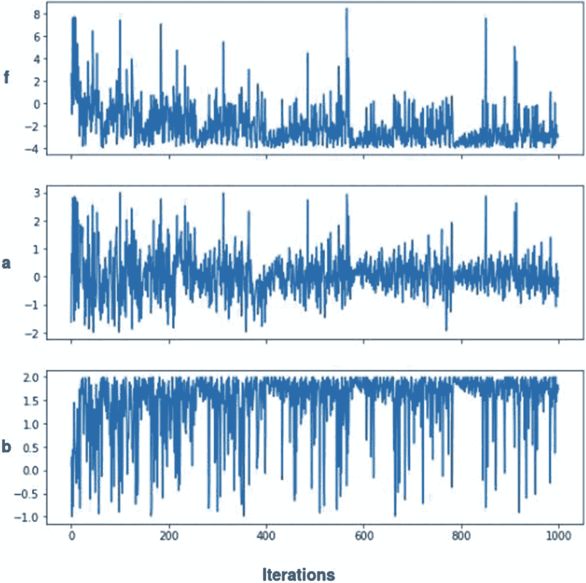

图 4-3-1

使用 TPE 在 1000 次迭代后绘制的 *f* 、 *a* 和 *b* 的值

如前所述，要使用 Hyperopt，我们必须定义一个目标函数和搜索空间。在前面的代码中，我们的目标函数将超参数作为输入，并输出一个我们想要最小化的分数。为了创建搜索空间，对于每个超参数，我们必须使用远视对象形式的分布。我们有各种各样的选项，统一、正常、对数统一、对数正常等等，我们将在下一节详细讨论。最后，我们将目标函数和搜索空间传递给`fmin()`函数，同时使用算法 TPE 进行优化。我们还决定试验的次数，就像我们使用随机搜索时一样。返回一个字典，给出所有迭代中的最佳尝试。

### 搜索空间

*fmin* ()只传递一个参数给目标函数，所以我们需要在字典、列表或元组中填充所有的超参数范围。与 scikit-learn 的网格搜索和随机搜索不同，`fmin()`不支持任何可迭代的分布；所有的超参数都应该是 Hyperopt 的 *hp* 模块的对象。按照图 [4-3-2](#Fig4) 显示不同的分布。

对于我们的超参数搜索，以下是从不同类型的分布中给出特定值的一些函数:

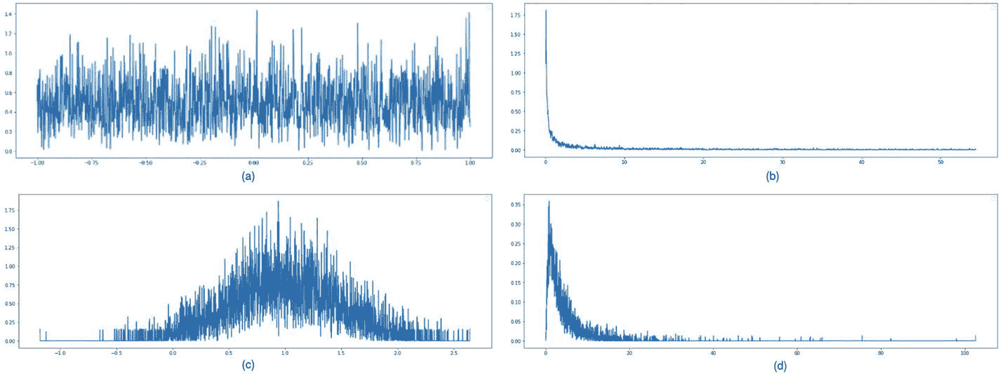

图 4-3-2

这些图表是使用超点分布绘制的。图表(a)显示了-1，1 之间的均匀分布。图表(b)显示了-3，4 之间的对数均匀分布。图表(c)显示了平均值为 1、标准偏差为 0.5 的正态分布。图表(d)显示了平均值和标准偏差都为 1 的对数正态分布

*   `hp.choice()`:从给定列表中选择一个选项

*   `hp.randint()`:从整数范围中选择一个随机整数

*   `hp.uniform()`:返回一个范围内的值，两个给定数之间的分布是均匀的

*   `hp.loguniform()`:返回一个值，其对数均匀分布在两个给定的数字之间

*   `hp.normal()`:根据平均值和标准偏差返回高斯分布的值

*   `hp.lognormal()`:返回值的对数按均值和标准差正态分布

Tip

*loguniform* ( *标签*， *a* ， *b* )可以写成 *exp* ( *制服* ( *标签*， *a* ， *b* ))，其中 *a* 和 *b* 分别为下限和上限。分布是在 *e* <sup>*a*</sup> 和 *e* <sup>*b*</sup> 之间，但是如果你想要它在 10 <sup>*a*</sup> 和 10 <sup>*b*</sup> 之间，你可以很容易地通过这样做来操纵它: *loguniform* ( *标签*，】

我们可以使用这些函数来创建真正复杂的搜索空间。让我们看一个创建搜索空间的例子:

```py
from hyperopt import tpe, fmin, hp

space = hp.choice('classifier',[
      {'model': 'KNeighborsClassifier',
      'param': {'n_neighbors':
                hp.choice('n_neighbors',range(3,11)),
      'algorithm':hp.choice('algorithm', ['ball_tree', 'kd_tree']),
      'leaf_size':hp.choice('leaf_size', range(1,50)),
      'metric':hp.choice('metric', ["euclidean", "manhattan",
                                      "chebyshev", "minkowski"
                       ])}
      },
      {'model': 'SVC',
       'param':{'C':hp.loguniform('C', -2*m.log(10), 11*m.log(10)),
       'kernel':hp.choice('kernel',['rbf', 'poly', 'sigmoid']),
       'degree':hp.choice('degree', range(1,15)),
       'gamma':hp.loguniform('gamma', -9*m.log(10), 3*m.log(10))}
      }
      ])

```

我们首先使用`hp.choice()`为我们的模型选择一个分类器，选择 KNN 或 SVM 中的一个。一旦我们选择了分类器，我们就可以创建分布。在前面的例子中，我选择使用 *hp* 。*选择*()进行离散分布和 *hp* 。*SVM*C*和*伽马*的对数正态*()。如前所述，我们可以操纵函数`hp.loguniform()`来使用 10 <sup>*x*</sup> 而不是 *e* <sup>*x*</sup> 。

Note

我们需要为这些惠普功能提供标签。在前面的代码中，我使用超参数本身的名称来标记分布。

现在我们有了一个搜索空间，我们将研究目标函数:

```py
from sklearn.datasets import load_digits
from sklearn.model_selection import train_test_split
from sklearn.neighbors import KNeighborsClassifier
from sklearn.svm import SVC
from hyperopt import tpe, fmin, hp

import math as m

digits = load_digits()
X_train, X_test, y_train, y_test = train_test_split(digits.data,
                                                  digits.target,
                                                  test_size=0.3)

logs = {'args':list(),
      'train_score': list(),
      'val_score': list()}

def objective_func(args):
      clf_func = args["model"]
      params = args["param"]

      clf = eval(clf_func)(**params)
      clf.fit(X_train, y_train)

      val_score = clf.score(X_test, y_test)
      train_score = clf.score(X_train, y_train)

      logs['args'].append(args)
      logs['train_score'].append(train_score)
      logs['val_score'].append(val_score)

      return -val_score

best = fmin(objective_func, space, algo=tpe.suggest, max_evals=100)

```

创建目标函数很容易。我们提取超参数，并将它们传递给分类器。然而，在这种情况下，由于我们的分类器也是一个变量，我们也提取它。我还创建了一个日志字典来保存历史。运行 fmin()，算法将开始调整。参见图 [4-3-3](#Fig5) ，精度 v/s 试验散点图。

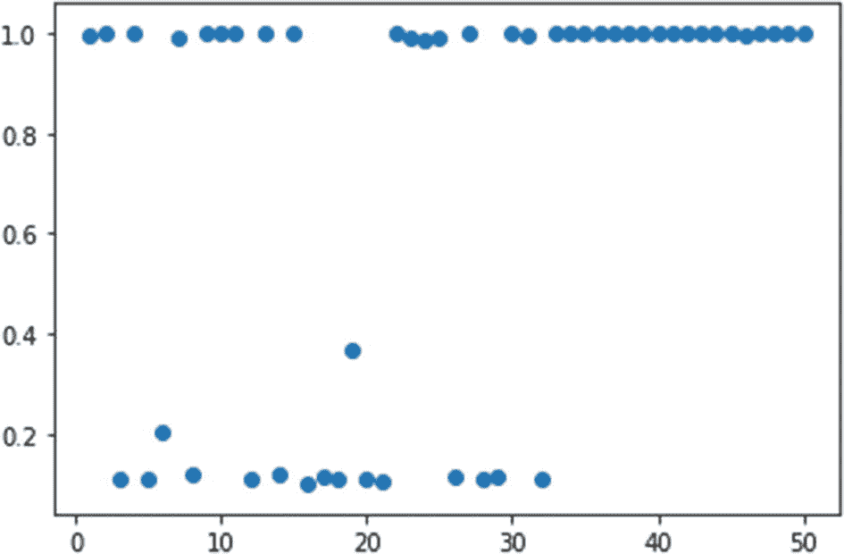

图 4-3-3

图 [4-3-3](#Fig5) 显示了在 digits 数据集上为超参数 *C* 、*核*、*度*和*伽马*优化支持向量分类器的结果。我们可以看到，在大约 30 次尝试后，分数饱和为 0.99。因此，该模型更加确定在哪里寻找最佳超参数

使用超点搜索空间定义神经网络架构可能有点棘手，因为某些超参数(如“层数”)的变化会改变超参数的总数，因为这样我们就必须决定每层中的节点数，或者各层是否使用批量归一化/剔除等方法。让我们来看另一个有趣的例子，它展示了我们如何定义这种尴尬的搜索空间:

```py
from hyperopt import hp, tpe, fmin
from keras.datasets import mnist
from keras.layers.core import Dense, Dropout, Activation
from keras.models import Sequential
from keras.utils import np_utils
import numpy as np

# load and preprocess the data
(x_train, y_train), (x_test, y_test) = mnist.load_data()
x_train = x_train.reshape(60000, 784)
x_test = x_test.reshape(10000, 784)
x_train = x_train.astype('float32')
x_test = x_test.astype('float32')
x_train /= 255
x_test /= 255
classes = 10
input_shape = 784
y_train = np_utils.to_categorical(y_train, classes)
y_test = np_utils.to_categorical(y_test, classes)

#logs

logs = {'model_summary':list(),
      'val_acc': list()}

def obj_func(args):

      #initializing the keras model
      model = Sequential()

      #defining first hidden layer
      model.add(Dense(units=args['units']['layer_units_1'],
                     input_shape=(input_shape, ),
                     name='layer_units_1'))

      #defining number of remaining hidden layer
      number_of_layers = len(args['units'])
      for layer in range(2, number_of_layers):
            model.add(Dense(units=args['units'][f'layer_units_{layer}'],
                         name=f'layer_units_{layer}'))
            model.add(Dropout(args['dropout'][f'dropout_p_{layer}'],
                      name=f'dropout_p_{layer}'))
             model.add(Activation(
                    activation=args['activation'][f'activation_{layer}'],
                    name=f'activation_{layer}'))

       # adding last layer

       model.add(Dense(classes, name=f'layer_unit_{layer+1}'))
       model.add(Activation(activation='softmax',
                           name=f'activation_{layer+1}'))

       model.compile(loss='categorical_crossentropy', metrics=['accuracy'], optimizer="adam")

      result = model.fit(x_train, y_train,
                        batch_size=2,
                        epochs=1,
                        verbose=3,
                        validation_split=0.2)

      validation_acc = np.amax(result.history['val_accuracy'])
      print(validation_acc)
      logs['model_summary'].append(model.summary())
      logs['val_acc'].append(validation_acc)

      return -validation_acc

def each_layer(number_of_layers):
      params = {'units': dict(),
                'dropout': dict(),
                'activation': dict()}
      number_of_nodes = [16,36,64,128,256,512]
      for layer in range(number_of_layers):
            params['units'][f'layer_units_{layer}'] = hp.choice(
                                           f'layer_{number_of_layers}_{layer}',
                                           number_of_nodes)
            params['dropout'][f'dropout_p_{layer}'] = hp.uniform(
                                          f'dropout_{number_of_layers}_{layer}',
                                          0, 0.8)
            params['activation'][f'activation_{layer}'] = hp.choice(
                                       f'activation_{number_of_layers}_{layer}',
                                       ['relu', 'elu'])
      return params

# choice for number of layers
number_of_layers = [3, 5, 7, 9]
space = hp.choice('layers', [each_layer(n) for n in number_of_layers])
best = fmin(obj_func, space, algo=tpe.suggest, max_evals=10)

```

在这个特殊的例子中，首先我决定了层的数量，然后我使用了一个函数，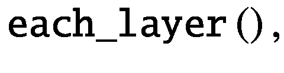,这样我现在可以在层上迭代，决定每层的节点数量，丢失的数量，以及激活函数的选择。注意，我使用了带有`number_of_layers`和`layer`的标签，因为我希望标签是唯一的，类似于 Dropout 和 Activation 函数。既然搜索空间已经创建，我们必须在目标函数中创建神经网络，这非常简单。现在我们可以优化超参数来进行笨拙的搜索。

### TPE 中的并行试验

通过并行化试验，我们可以更好地利用 TPE。可以从分布 *l* ( *x* )中一次抽取多个候选人，并且可以并行评估这些候选人。默认情况下， *fmin* 被串行执行，并使用参数 *trials* = *Trials* ()，该参数使用一个列表。但是，我们可以使用 *MongoTrials* ()来代替并行评估这些试验。

显然，第一个要求是安装 MongoDB。之后，有四个简单的步骤来开始异步优化:

*   使用 *fmin* 时，通过试验为`MongoTrials()`。

*   启动一个可见的 MongoDB 服务器。

*   执行 Python 文件。

*   运行*hyperpt*—*mongo*—*worker*，这是在安装 hyperpt 时放置在您的 Python 环境的 bin 中的一个 worker 脚本。

我们用 MongoTrials()来举前面的玩具例子 *f* ( *a* 、*b*)=*a*<sup>2</sup>—*b*<sup>2</sup>:

```py
from hyperopt import tpe, fmin, hp
from hyperopt.mongoexp import MongoTrials

def objective_func(args):
      a = args['a']
      b = args['b']
      f = a**2 - b**2
      return f

range_a = hp.uniform('a', -2, 3)
range_b = hp.uniform('b', -1, 2)

space = {'a': range_a,
           'b': range_b}

m_trials = MongoTrials("mongo://localhost:27017/foo_db/jobs", exp_key="exp2")

best = fmin(objective_func, space, algo=tpe.suggest, trials=m_trials, max_evals=1000)

```

在前面的代码中，我们使用了 MongoTrials()。第一步是启动一个 MongoDB 服务器:

```py
$ mongod --dbpath . --port 27017

```

默认情况下，端口是 27017，但是您可以根据需要进行更改。

现在执行前面的 Python 脚本。在 MongoTrials()中，我们需要定义端口和一个`exp_key`，如果您使用同一个数据库，您需要在不同的运行中对其进行更改。

当您执行该脚本时，它将等待 mongo workers 启动，您可以使用以下命令启动它:

```py
$ hyperopt-mongo-worker --mongo=localhost:1234/foo_db --poll-interval=0.1

```

如前所述，*hyperpt*—*mongo*—*worker*是存储在您的 PATH(即您正在使用的 Python 环境的 bin)中的文件。这里需要给< *主机* > < *端口*>/<*db*-*名称* >和轮询间隔检查工作之间的每一个定义的间隔；如果找到工作，它将开始计算。

一旦您启动 mongo workers，之前的 EI 建议的超参数集将被传递给目标函数，流程将开始。

注意 worker 是在$PATH 中执行的，worker 需要一个目标函数，所以定义目标函数的 Python 脚本必须导出到$PATH 中。

现在您将获得异步更新，而不是串行更新。或者，您可以使用 Apache Spark 进行并行化。

Hyperopt 旨在适应其他代理函数，如高斯过程和随机森林回归，但它们尚未实现。但是由于 Hyperopt 是一个开源库，我相信作者肯定会欢迎这些实现。所以，为了社区的更大利益，请继续为这个神奇的图书馆做贡献吧。

## 超选择性硬化

Hyperopt-sk learn<sup>[6](#Fn6)</sup>是一个基于 Hyperopt 的库 <sup>[7](#Fn7)</sup> ，它使用 Hyperopt 在 scikit-learn 算法上进行算法选择和超参数调整。

该库可以真正节省时间，因为它为 scikit-learn 中提供的算法创建了自己的搜索空间。您可以进行端到端建模，因为它还为数据预处理提供了算法选择和调优选项(尽管尚未实现所有 scikit-learn 算法)。

hpsklearn 的用法是 sklearn 风格的，就像 scikit-learn 的 Grid/Random Search 一样实现`fit()`、`.score()`、`.predict()`等方法。尽管提供搜索空间是可选的。让我们看几个例子来更好地理解它。

```py
from sklearn.datasets import load_boston
from sklearn.model_selection import train_test_split
from hpsklearn import HyperoptEstimator, any_regressor,
                                              any_preprocessing, svr
from hyperopt import tpe, hp
import math as m

X, y = load_boston().data, load_boston().target
X_train, X_test, y_train, y_test = train_test_split(X,y, test_size=0.2)

model = HyperoptEstimator(regressor=any_regressor('test1_reg'),
                  preprocessing=any_preprocessing('test1_preprocessing'),
                  algo=tpe.suggest,
                  verbose=True,
                  max_evals=100)

model.fit(X_train, y_train, n_folds=3, cv_shuffle=True)

print(model.score(X_test, y_test))
print(mdoel.best_model())

```

就像 scikit-learn 中的任何其他分类器/回归器一样，我们可以使用*hyperptestimator*，这意味着即使在您现有的代码中，您也需要更改一行代码来包含这个超参数调整库。在前面的代码中，我们让 hpsklearn 自由选择任何算法和超参数集以及任何预处理(规范化/标准化等)。).但是，我们可以限制某些算法的调整和预处理选择。例如:

```py
model = HyperoptEstimator(regressor=svr('test_svr'),
                        preprocessing=[],
                        algo=tpe.suggest,
                        verbose=True,
                        max_evals=100)

```

您可以用下面这行代码替换前面代码中的模型初始化，以便只对支持向量回归机进行优化，并且不使用预处理。或者，您可以更改一个或多个超参数的空间，如下所示:

```py
space = {'C':hp.loguniform('C',-2*m.log(10),11*m.log(10)),
        'gamma':hp.loguniform('gamma',-9*m.log(10),3*m.log(10))
        }

model = HyperoptEstimator(regressor=svr('test_svr', **space['param']),
                      preprocessing=[],
                      algo=tpe.suggest,
                      verbose=True,
                      max_evals=100)

```

这里，定义的超参数(C 和 gamma)的默认搜索空间将被自定义搜索空间覆盖。预处理也可以这样做。

由于该库支持 SVM、决策树、KNN 等算法，因此您可以使用 hpsklearn 获得基线准确性，并使用自定义搜索空间和尝试不同的模型来进一步调整模型。

## 超级 as

另一个非常有用的开源超参数优化库 Hyperas <sup>[8](#Fn8)</sup> 是一个围绕 Hyperopt 的包装器，用于使用 Keras 优化神经网络的架构。这个库是以这样一种方式编写的，它使你不必为神经网络创建复杂的搜索空间；相反，您可以使用简单的 Keras 代码，并增加一些范围。这里有一个例子可以帮助你理解 Hyperas 的概念:

```py
from hyperopt import Trials, STATUS_OK, tpe
from keras.datasets import mnist
from keras.layers.core import Dense, Dropout, Activation
from keras.models import Sequential
from keras.utils import np_utils
import numpy as np

from hyperas import optim
from hyperas.distributions import choice, uniform

def data():
      # MNIST
      (x_train, y_train), (x_test, y_test) = mnist.load_data()
      x_train = x_train.reshape(60000, 784)
      x_test = x_test.reshape(10000, 784)
      x_train = x_train.astype('float32')
      x_test = x_test.astype('float32')
      x_train /= 255
      x_test /= 255
      classes = 10
      input_shape = 784
      y_train = np_utils.to_categorical(y_train, classes)
      y_test = np_utils.to_categorical(y_test, classes)
      return x_train, y_train, x_test, y_test, input_shape, classes

def create_model(x_train, y_train, x_test, y_test, input_shape, classes):

      model = Sequential()
      model.add(Dense(units={{choice([8, 16])}},
                              input_shape=(input_shape,),name='dense1'))

      layers = {{choice([2, 3, 4, 5, 6, 7, 8, 9, 10])}}

      for i in range(layers):
            model.add(Dense(units={{choice([32, 64, 256, 512, 1024])}}))
            model.add(Dropout({{choice([0, 0.33])}}))
            model.add(Activation(activation={{choice(['relu', 'elu'])}}))

      model.add(Dense(classes))
      model.add(Activation(activation='softmax'))

      model.compile(loss='categorical_crossentropy',
                   metrics=['accuracy'],
                   optimizer={{choice(['rmsprop', 'adam', 'sgd'])}})

      result = model.fit(x_train, y_train

,
                   batch_size={{choice([4, 8, 16])}},
                   epochs=10,
                   verbose=3,
                   validation_split=0.2)

      validation_acc = np.amax(result.history['val_accuracy'])
      print('Test accuracy:', validation_acc)

      return {'loss': -validation_acc, 'status': STATUS_OK, 'model':
                                                         model}

best_run, best_model = optim.minimize(model=create_model,
                                      data=data,
                                      algo=tpe.suggest,
                                      max_evals=10,
                                      trials=Trials())

X_train, Y_train, X_test, Y_test, _, _ = data()
print("Test Score on Best Model:")
print(best_model.evaluate(X_test, Y_test))
print("Hyperparameter Set for best Model:")
print(best_run)

```

在使用 Hyperas 时，我们需要创建两个函数。一个功能是数据加载。另一个函数类似于目标函数，由神经网络组成并返回损失分数，唯一的区别是搜索空间不是参数，而是数据作为参数传递。当我们在网络中写入每个超参数时，搜索空间被定义。以及 *optim* 。从 Hyperas 的*最小化*()功能开始优化。

在第一个函数中， *data* ()，我们加载数据集(这里是 MNIST)；由于目标函数将会迭代，我们不想一遍又一遍地加载数据。你从*返回的一切数据*()都会传递给*创造*<sub>──</sub>*模型*()。

接下来我们定义目标函数，其中我们使用 Keras 定义神经网络。初始化`Sequential()`后，我们一层一层的添加图层。代替超参数，我们可以使用以下格式给出一个范围:{ {<sup>′</sup>*范围*<sup>′</sup>} }。<sup>′</sup>′*range*<sup>′</sup>是 Hyperas 中的分布函数，遵循与 Hyperopt 相同的命名法。在 Hyperas 中，我们不需要给标签，因为它会把分配给它们的变量作为标签。然而，如果我们像在后续代码中一样迭代某个超参数范围，

```py
for i in range(layers):
      model.add(Dense(units={{choice([32, 64, 256, 512, 1024])}}))

```

例如，如果有三个层，将为所有三个层选择相同的超参数，因为 Hyperas 制作了 Python 代码的模板，并将分布发送到 Hyperopt，Hyperopt 将认为它是一个超参数，因为它只编写了一次。您有两个替代方案来解决这个问题:或者您可以像我们在“搜索空间”部分的上一个示例中所做的那样返回并使用 Hyperopt，或者您可以使用 *if* … *else* 语句来添加层:

```py
model.add(Dense({{choice([32, 64, 256, 512, 1024])}}))
model.add(Dropout({{uniform(0, 0.8)}}))
model.add(Activation({{choice(['relu', 'elu'])}}))

if {{choice(['one', 'two'])}} == 'two':
      model.add(Dense({{choice([32, 64, 256, 512, 1024])}}))
      model.add(Dropout({{uniform(0, 0.8)}}))
      model.add(Activation({{choice(['relu', 'elu'])}}))

```

如果选择的层的数量是两个，那么它将创建另一个层。

Hyperas 是围绕 Hyperopt 的一个非常简单易用的包装器，您可以使用它来快速调优您的模型，但是如果您想要更多的灵活性，请使用 Hyperopt，它甚至可以在最复杂的搜索空间中创造奇迹。

在本章中，你学习了贝叶斯超参数优化是如何工作的，以及如何在你的问题中使用 Hyperopt。这些技巧可以很容易地提高你的时间效率，优化你的资源利用。

<aside aria-label="Footnotes" class="FootnoteSection" epub:type="footnotes">Footnotes [1](#Fn1_source)

[T2`https://github.com/hyperopt/hyperopt`](https://github.com/hyperopt/hyperopt)

  [2](#Fn2_source)

[T2`https://github.com/JasperSnoek/spearmint`](https://github.com/JasperSnoek/spearmint)

  [3](#Fn3_source)

[T2`https://github.com/Yelp/MOE`](https://github.com/Yelp/MOE)

  [4](#Fn4_source)

[T2`https://github.com/automl/SMAC3`](https://github.com/automl/SMAC3)

  [5](#Fn5_source)

[T2`https://papers.nips.cc/paper/4443-algorithms-for-hyper-parameter-optimization.pdf`](https://papers.nips.cc/paper/4443-algorithms-for-hyper-parameter-optimization.pdf)

  [6](#Fn6_source)

[T2`http://conference.scipy.org/proceedings/scipy2014/pdfs/komer.pdf`](http://conference.scipy.org/proceedings/scipy2014/pdfs/komer.pdf)

  [7](#Fn7_source)

[T2`https://github.com/hyperopt/hyperopt-sklearn`](https://github.com/hyperopt/hyperopt-sklearn)

  [8](#Fn8_source)

[T2`https://github.com/maxpumperla/hyperas`](https://github.com/maxpumperla/hyperas)

 </aside>