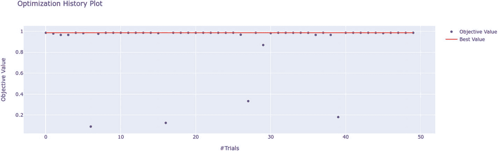
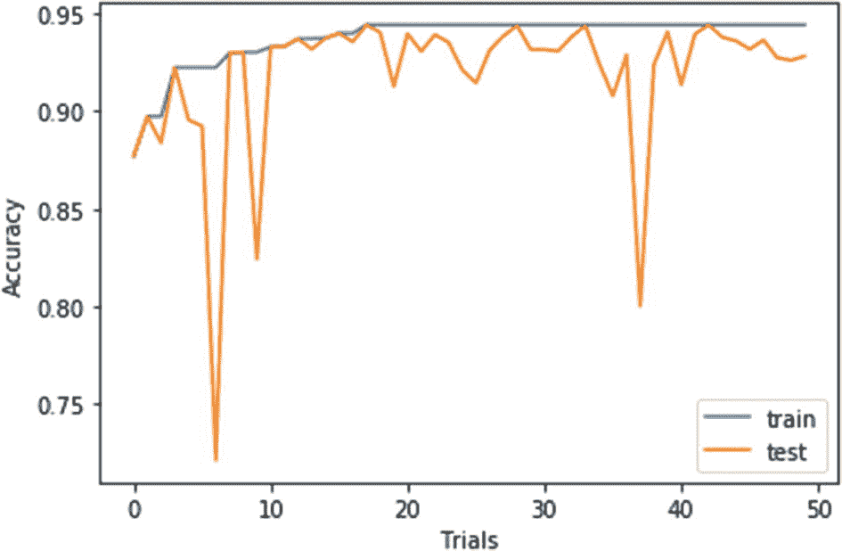
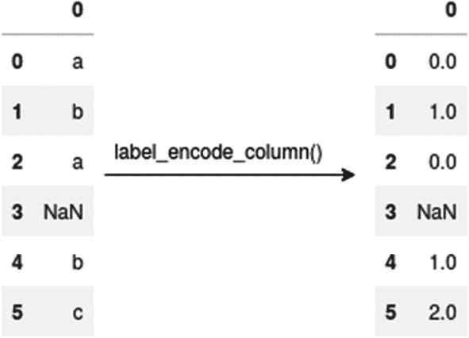
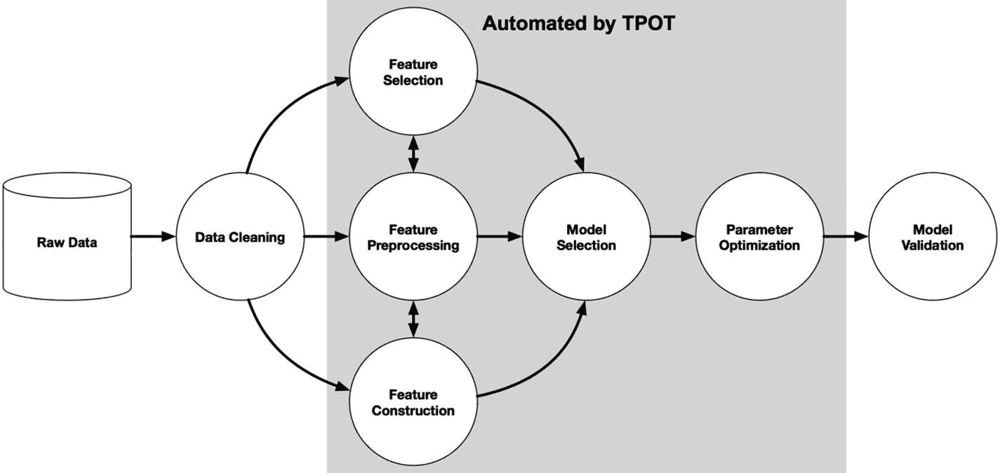

# 5.Optuna 和 AutoML

我们现在可以使用前几章讨论的技术创建一个有效的模型。贝叶斯优化在寻找最佳超参数方面大有作为。本章概述了 Optuna 框架，并进一步讨论了超参数优化在自动机器学习中的作用。我们将使用 Optuna 创建我们自己的小 AutoML 脚本。然后我们将探索基于树的管道优化工具(TPOT)，这是一个使用遗传编程来优化机器学习管道的 AutoML 工具。

## optina

和第 [4](4.html) 章讨论的 Hyperopt 一样，Optuna<sup>T3】1T5 是使用贝叶斯优化的开源库。Optuna 使用的底层算法与 Hyperopt 中的相同，但是 Optuna 框架更加灵活。Optuna 可以很容易地与 PyTorch、Keras、scikit-learn、Apache MXNet 和其他库一起使用。该 API 与 Hyperopt 的 API 非常相似，但有一些变化。让我们来看一个例子:</sup>

```py
from sklearn.datasets import load_digits
from sklearn.model_selection import train_test_split, cross_val_score
from sklearn.neighbors import KNeighborsClassifier
from sklearn.svm import SVC

import optuna
from optuna.samplers import TPESampler

digits = load_digits()
X_train, X_test, y_train, y_test = train_test_split(digits.data,
                                                  digits.target,
                                                  test_size=0.3)

def objective_func(trial):

      classifier_name = trial.suggest_categorical("classifier",
                                      ["SVC", "RandomForest"])
      if classifier_name == "SVC":
            c = trial.suggest_loguniform("svc_c", 1e-2, 1e+11)
            gamma = trial.suggest_loguniform("svc_gamma", 1e-9, 1e+3)
            kernel = trial.suggest_categorical("svc_kernel",
                                          ['rbf','poly','rbf','sigmoid'])
            degree = trial.suggest_categorical("svc_degree", range(1,15))
            clf = SVC(C=c, gamma=gamma, kernel=kernel, degree=degree)

      else:
            algorithm = trial.suggest_categorical("algorithm",
                                       ['ball_tree', "kd_tree"])
            leaf_size = trial.suggest_categorical("leaf_size",
                                                   range(1,50))
            metric = trial.suggest_categorical("metric",
                                     ["euclidean","manhattan",
                                      "chebyshev","minkowski"])
            clf = KNeighborsClassifier(algorithm=algorithm,
                                       leaf_size=leaf_size,
                                       metric=metric)

      clf.fit(X_train, y_train)
      val_acc = clf.score(X_test, y_test)

      return val_acc

study = optuna.create_study(direction='maximize', sampler=TPESampler())
study.optimize(objective_func, n_trials=100)
best_trial = study.best_trial.value

print(f"Best trial  accuracy: {best_trial}")
print("parameters for best trail are :")
for key, value in study.best_trial.params.items():
      print(f"{key}: {value}")

```

在图 [5-1-1](#Fig1) 中，我们可以看到图在 1 附近饱和。请注意，这里的目标值是验证准确性。



图 5-1-1

显示前面代码示例的前 50 次试验的精确度与试验的关系的图

如果这个例子看起来很熟悉，原因是我们在第 [4](4.html) 章中处理了相同的问题。Optuna 的用户界面与 Hyperopt 非常相似。我们必须定义一个目标函数，该函数应该返回一个最小化/最大化的分数(损失/准确度)。

代替`fmin()`函数，我们实例化`create_study()`函数并优化它。但是 Optuna 提供的最好特性之一是动态定义超参数搜索范围的能力。与我们必须预定义搜索空间的 Hyperopt 不同，在 Optuna 中，我们在目标函数本身中定义搜索空间(类似于我们在 Hyperas 中所做的)。我们来讨论一下 Optuna 的一些关键方面。

### 搜索空间

在 Hyperopt 和许多其他算法中，我们使用字典来定义搜索空间。如前所述，在 Optuna 中，我们动态定义搜索空间。正如你在第 [4](4.html) 章中看到的，用 Hyperopt 和 Hyperas 在神经网络中创建搜索空间是很困难的。在超参数中，比如依赖于层数的节点数，Hyperas 将使用 *if* … *else* 。如果使用循环，Hyperas 会为所有层选择相同数量的节点。在 Optuna 中，我们可以在一个循环中为每个超参数提供唯一的标签。例如:

```py
n_layers = trial.suggest_int('n_layers', 1, 3)
layers = []

in_features = 28 * 28
for i in range(n_layers):
      out_features = trial.suggest_int('n_units_{}'.format(i), 4, 128)
      layers.append(Linear(in_features, out_features))
      layers.append(ReLU())

      in_features = out_features

```

Optuna 使得处理这个问题变得容易多了。并且 Optuna 提供与远视相同的分布。以下是一些常用的发行版:

*   *分类分布* : `trial.suggest_categorical()`用于从列表中选择离散值，与 Hyperopt 中的`hp.choice()`相同。

*   *均匀分布* : `trial.suggest_uniform()`用于均匀尺度上的随机分布，类似于`hp.uniform()`。

*   *LogUniform 分布* : trial.suggest_loguniform(标签，低，高)用于 LogUniform 标度。但是，在 Hyperopt 中`hp.loguniform(label, low, high)`会返回一个在 *exp* ( *低*)和 *exp* ( *高*)之间的分布。在 Optuna 中，返回低*和高*之间的对数均匀分布。

根据我们的需要，我们可以使用更多的发行版。

### 底层算法

除了树结构 Parzen 估计器和随机搜索之外，Optuna 还提供了连续减半和超带，这是相对于 Hyperopt 的一个优势。我们已经在第 [3](3.html) 章讨论过 HyperBand。我们可以这样使用它:

```py
import optuna

# define the objective function

study = optuna.create_study(pruner=optuna.pruners.HyperbandPruner())
study.optimize(objective, n_trials=20)

```

### 形象化

Optuna 提供了优雅的可视化。图 [5-1-1](#Fig1) 由 Optuna 使用 *optuna* 生成。*可视化*。*剧情* _ *优化* _ *历史* ( *研究*)。您可以传递`study`对象，它将创建一个图形。您可以指向每个分散点，并观察所使用的不同超参数。甚至有更多的可视化选项。

回调，*研究*中的一个论点。 *optimize()* 在每次试验后调用回调。使用它，你可以在 *tensorboardX* 等仪表盘上实时显示进度。

回调是这样工作的:

```py
import optuna
from optuna.samplers import TPESampler

def log(study, trial):
      print(f"Trial No.={trial.number}, HP_Set={trial.params}, \
      Score={trial.value}")
      print(f"Best Value ={study.best_value}")

# def objective_func()

study = optuna.create_study(sampler=TPESampler())
study.optimize(objective_func, n_trials=100, callbacks=[log])

```

这真的很容易操作。您可以将这些结果写在仪表板上，每次试验后它们都会得到更新。

### 分布式优化

就像 Hyperopt 一样，Optuna 支持分布式优化，但是使用 Optuna 的实现比使用 Hyperopt 的实现更容易。让我们看看如何配置它:

```py
study = optuna.create_study(study_name='distributed_test',
                           storage='database_url',
                           load_if_exists=True)

```

在实例化'*创建* _ *研究*()'时定义数据库 url。并设置“load_if_exits=True”。这将查找名为“distributed_test”的先前研究，而不是创建新研究。这样，每次工人开始时，它不会创建一个新的学习，而是寻找现有的学习，因此不会从头开始培训。

关于 Hyperopt 和 Optuna 的综合比较，可以参考以下 Neptune.ai 高级数据科学家 Jakub Czakon 的文章:《Optuna vs Hyperopt:应该选择哪个超参数优化库？” <sup>[2](#Fn2)</sup> 。

现在，让我们探索一个如何使用 Optuna 优化神经网络的超参数的例子。我们将使用 MNIST 数据集和 Keras。我们从导入库开始，将数据分成训练集和测试集。

```py
from keras.datasets import mnist
from keras.layers.core import Dense, Dropout, Activation
from keras.models import Sequential
from keras.utils import np_utils
import numpy as np

import optuna
from optuna.samplers import TPESampler

(x_train, y_train), (x_test, y_test) = mnist.load_data()
x_train = x_train.reshape(60000, 784)
x_test = x_test.reshape(10000, 784)
x_train = x_train.astype('float32')
x_test = x_test.astype('float32')
x_train /= 255
x_test /= 255
classes = 10
input_shape = 784
y_train = np_utils.to_categorical(y_train, classes)
y_test = np_utils.to_categorical(y_test, classes)
x_train, y_train, x_test, y_test, input_shape, classes

```

```py
def log(study, trial):
      print(f"Trial No.={trial.number}, HP_Set={trial.params}, \
            Score={trial.value}")
      print(f"Best Value ={study.best_value}")

def objective_func(trial):

      model = Sequential()

      hidden_layer_unit_choice = [32, 64, 256, 512, 1024]

      hidden_layers = trial.suggest_int('hidden_layers', 1, 6)

      model.add(Dense(units=trial.suggest_categorical('layer1', [8, 16]),
                 input_shape=(input_shape, ),
                 name='dense1'))

      model.add(Activation(activation=trial.suggest_categorical(
                                                f'activation1',
                                                       ['relu',
                                                      'elu'])))

      for i in range(1, hidden_layers):

            model.add(Dense(units=trial.suggest_categorical(
                                              f'layer{i+1}',
                                              hidden_layer_unit_choice)))
            model.add(Dropout(trial.suggest_uniform(

                                               f'dropout{i+1}', 0, 0.8)))
            model.add(Activation(
                               activation=trial.suggest_categorical(
                                            f'activation{i+1}',
                                                       ['relu',
                                                      'elu'])))

      model.add(Dense(classes))
      model.add(Activation(activation='softmax'))

      model.compile(loss='categorical_crossentropy',
                  metrics=['accuracy'],
                  optimizer=trial.suggest_categorical('optimizer',
                  ['rmsprop', 'adam', 'sgd']))

      result = model.fit(x_train, y_train,
                    batch_size=4,
                    epochs=1,
                    verbose=3,
                    validation_split=0.2)

      validation_acc = np.amax(result.history['val_accuracy'])
      print('Validation accuracy:', validation_acc)

      return validation_acc

```

定义目标函数。在前面的代码中，我们看到超参数是为每个图层动态选择的，只需为标签指定唯一的名称。

最后，我们开始优化:

```py
study = optuna.create_study(direction='maximize', sampler=TPESampler())
study.optimize(objective_func, n_trials=50, callbacks=[log])
best_trial = study.best_trial.value

print(f"Best trial  accuracy: {best_trial}")
print("parameters for best trail are :")
for key, value in study.best_trial.params.items():
   print(f"{key}: {value}")

```

本例仅针对 50 次试验进行优化，图 [5-1-2](#Fig2) 显示了精度图。



图 5-1-2

前面代码示例的准确性与尝试性

在如此巨大的搜索空间中，50 次尝试是很少的(增加尝试次数以获得更好的结果)，但是我们可以看到训练分数在增加。请注意，测试分数是独立的，目标函数使用验证准确性来优化超参数。

Optuna 是一个年轻的图书馆，许多工作仍在进行中，但它很有前途。

## 自动化机器学习

机器学习的高度复杂性要求只有机器学习专家才能建立模型。机器学习模型是特定于任务的，其中每个模型都需要大量的工作。为了向大众提供机器学习，机器学习专家需要一种方法来创建现成的模型。这就是自动机器学习(AutoML)介入的地方。

当机器学习创建完整的管道并给我们一个可部署的模型时，它就是自动化的。为了创建一个完整的管道，我们需要使用几种算法，从预处理到创建机器学习模型。所有这些算法都有自己需要优化的超参数。这里超参数优化发挥了巨大的作用。预处理的步骤和算法在附录 I 中描述。

现在，我们将在后续章节中使用 Optuna 和 TPOT 快速构建我们自己的 AutoML 模块，这将能够处理几乎任何类型的分类数据集。

### 构建您自己的 AutoML 模块

此示例提供了构建基本模块的说明，您可以随后试验并添加更多算法。为了在现实世界的问题中使用，有许多优化的 AutoML 库，我们将在后面讨论。我们将在 Titanic 数据集上工作，这个数据集很乱，但是我们的代码将处理所有的清理和预处理。

让我们从导入所有内容并加载数据集 <sup>[3](#Fn3)</sup> 开始:

```py
import pandas as pd
import numpy as np
import impyute as impy

import optuna
from optuna.samplers import TPESampler

from sklearn.model_selection import train_test_split
from sklearn.preprocessing import LabelEncoder, MinMaxScaler, \
         StandardScaler
from sklearn.impute import SimpleImputer
from sklearn.feature_selection import SelectKBest, \
           chi2, f_classif, mutual_info_classif
from sklearn.svm import SVC
from sklearn.neighbors import KNeighborsClassifier

data = pd.read_csv("./titanic/train.csv")

y = data['Survived']
X = data.drop('Survived', axis=1)

```

现在，我们将解决没有优化超参数的部分。我们将定义外部目标函数，因为重复不被优化的相同过程是没有意义的。

```py
def label_encode_column(col):
      nans = col.isnull()
      nan_lst = []
      nan_idx_lst = []
      label_lst = []
      label_idx_lst = []

      for idx, nan in enumerate(nans):
            if nan:
                  nan_lst.append(col[idx])
                  nan_idx_lst.append(idx)
            else:
                  label_lst.append(col[idx])
                  label_idx_lst.append(idx)

      nan_df = pd.DataFrame(nan_lst, index=nan_idx_lst)
      label_df = pd.DataFrame(label_lst, index=label_idx_lst)

      label_encoder = LabelEncoder()
      label_df = label_encoder.fit_transform(label_df.astype(str))
      label_df = pd.DataFrame(label_df, index=label_idx_lst)
      final_col = pd.concat([label_df, nan_df])

      return final_col.sort_index()

for column_name in X.columns:
      if str(X[column_name].dtype) == 'object':
            X[column_name] = label_encode_column(X[column_name])
            if len(X[column_name].unique()) > len(X)/3:
                  X = X.drop(column_name, axis=1)

```

我们用的是函数`label_encode_column()`，但是只用 LabelEncoding()有什么问题？LabelEncoding()也标记了 NaN 值，但是我们希望以后估算这些值。所以函数获取每一列，将 NaN 和其他值分开，并在保存它们的索引位置时对它们进行标记。它返回一个排序后的数据帧，如图 [5-2-1](#Fig3) 所示。



图 5-2-1

标签编码器编码除 NaNs 以外的所有值

因此，在我们对所有列进行标签编码后，我们会删除那些具有大量唯一值的列。如果您希望将一次性编码作为一个选项，也可以在目标函数中包含标签编码。接下来，我们将定义一些在目标函数中使用的函数:

```py
def mice_imputer(data):
      data = data.to_numpy()
      imputed_data = impy.mice(data)
      imputed_data = pd.DataFrame(imputed_data)
      return imputed_data
def mean_imputer(data):
      imputer = SimpleImputer(strategy='mean')
      imputed_data = imputer.fit_transform(data)
      imputed_data = pd.DataFrame(imputed_data)
      return imputed_data

```

前面的代码参数化了两个插补器，均值插补和 MICE 插补。有关包含更多选项的说明，请参考附录 I。

```py
def feature_selector(X, y, k, algo="f_classif"):
      kbest = SelectKBest(eval(algo), k)
      X = kbest.fit_transform(X, y)
      X = pd.DataFrame(X)
      return X

```

我们将选择“k”个最佳特征，这也将是一个超参数。另一个超参数是选择特征选择算法。我们有`'f_classif'`、`'chi2'`和`'mutual_info_classif'`。最后一个预处理步骤是缩放。我们在规范化和标准化之间进行选择。

```py
def scaling(data, scaler="min_max"):
      if scaler=='min_max':
            scaled_data = MinMaxScaler().fit_transform(data)
      else:
            scaled_data = StandardScaler().fit_transform(data)
      scaled_data = pd.DataFrame(scaled_data)
      return scaled_data

```

现在我们定义目标函数:

```py
def objective_func(trial):

      try:
            # imputation
            imputer = trial.suggest_categorical('impyter', ['mice', 'mean'])
            if imputer=='mice':
                  imputed_X = mice_imputer(X)
            else:
                  imputed_X = mean_imputer(X)

            # feature selection
            fea_slct = trial.suggest_categorical('fea_slct',
                                                 ['chi2', 'f_classif',
                                                 'mutual_info_classif'])
            no_feature_cols = trial.suggest_int('k', 3, len(X.columns))
            selected_features = feature_selector(imputed_X, y,
                                               no_feature_cols, fea_slct)

            # scaling
            scaler = trial.suggest_categorical('scaler',
                                       ['min_max', 'standard'])
            scaled_X = scaling(selected_features)

      except:
            return 0.0

      # instantiating machine learning algorithm
      classifier_name = trial.suggest_categorical("classifier",
                                               ["SVC", "RandomForest"])

      if classifier_name == "SVC":
            c = trial.suggest_loguniform("svc_c", 1e-2, 1e+11)
            gamma = trial.suggest_loguniform("svc_gamma", 1e-9, 1e+3)
            kernel = trial.suggest_categorical("svc_kernel",
                                          ['rbf','poly','rbf','sigmoid'])
            degree = trial.suggest_categorical("svc_degree", range(1,15))
            clf = SVC(C=c, gamma=gamma, kernel=kernel, degree=degree)
      else

:
            algorithm = trial.suggest_categorical("algorithm",
                                                  ['ball_tree', "kd_tree"])
            leaf_size = trial.suggest_categorical("leaf_size", range(1,50))
            metric = trial.suggest_categorical("metic",
                                              ["euclidean","manhattan",
                                               "chebyshev","minkowski"])
            clf = KNeighborsClassifier(algorithm=algorithm,
                                      leaf_size=leaf_size, metric=metric)

      # fit the model
      clf.fit(scaled_X, y)
      val_acc = clf.score(scaled_X, y)

      return val_acc

study = optuna.create_study(direction='maximize', sampler=TPESampler())
study.optimize(objective_func, n_trials=100)
best_trial = study.best_trial.value

print(f"Best trial  accuracy: {best_trial}")
print("parameters for best trial are :")
for key, value in study.best_trial.params.items():
      print(f"{key}: {value}")

```

目标函数的第一部分由所有预处理步骤组成，这里我们使用了`try`...`except`。我们正在使用之前定义的函数。在某些情况下，当算法和超参数不匹配时，或者如果上一步处理的数据不被下一步接受，您可能会遇到错误。例如，一些特征选择算法不适用于负值，但是即使您对数据集非常小心，估算器也可能会估算出具有负值的 NaN。在这种情况下，只需返回零，即最不可能的精度值。

然后我们像以前一样定义分类器的选择(您可以添加更多的分类器)。AutoML 的思想是创建一个通用代码，为数据集提供最好的管道。您可以训练任何用于分类的表格数据集，以便为之前的一组步骤和算法选择获得最佳可能的管道，而无需编写另一行代码。

随着搜索空间的复杂性增加，我们需要对数据集进行更多的尝试。试验越多，我们取得的结果就越好。为了减少时间，您可以分布优化过程，如下所述。

### TPOT 的

基于树的流水线优化工具(TPOT)是一个 AutoML 框架，它使用遗传编程来优化机器学习流水线。

正如我们所讨论的，数据预处理通常包括数据清理(标签编码、删除不重要的列和缩放)，这是我们必须事先注意的事情。更复杂的任务，如特征选择、特征约简和特征构造，由 TPOT 处理。它进一步选择具有最佳超参数集的最佳模型。图 [5-2-2](#Fig4) 显示了 TPOT 自动化的特征。

遗传算法很慢，但擅长为给定的数据集找到最佳路径。在达到最佳超参数集之前，我们需要长时间的训练。

理解 TPOT 首先需要理解什么是遗传算法。顾名思义，遗传算法的概念来源于达尔文的自然选择理论。遗传算法通过选择最佳算法不断进化。对于最佳算法，它去它的孩子做一些随机修改超参数和评估模型，以找到最佳拟合。



图 5-2-2

TPOT 承担了大约 80%的工作

现在我们来看一个 TPOP 如何工作的例子，使用 TPOT 作为虹膜数据集，因为它已经是一个干净的数据集:

```py
from tpot import TPOTClassifier
from sklearn.datasets import load_iris
from sklearn.model_selection import train_test_split
import numpy as np

iris = load_iris()
X_train, X_test, y_train, y_test = train_test_split(
                                        iris.data.astype(np.float64),
                                        iris.target.astype(np.float64),
                                           test_size=0.25
                                           )

```

#加载数据集并将其拆分为训练和测试。

```py
tpot = TPOTClassifier(generations=5, population_size=50, verbosity=2)
tpot.fit(X_train, y_train)

```

我们培养 TPOT 五代人；默认为 100 代。这个框架的界面与 scikit-learn 非常相似。

瞧啊。我在经过训练的模型上实现了 100%的准确率。

为了使事情变得更简单，我们有一个选项，可以将所选管道导出到 Python 脚本中，这样就可以很容易地进行部署。

```py
tpot.export('tpot_iris_pipeline.py')

```

前面一行代码自动生成下面的`tpot_iris_pipeline.py`文件:

```py
import numpy as np
import pandas as pd
from sklearn.model_selection import train_test_split
from sklearn.neural_network import MLPClassifier

# NOTE: Make sure that the outcome column is labeled 'target' in the data # file

tpot_data = pd.read_csv('PATH/TO/DATA/FILE', sep="COLUMN_SEPARATOR",
                         dtype=np.float64)
features = tpot_data.drop('target', axis=1)
training_features, testing_features, training_target, testing_target = \
           train_test_split(features, tpot_data['target'],
                             random_state=None)

# Average CV score on the training set was: 0.9913043478260869
exported_pipeline = MLPClassifier(alpha=0.1, learning_rate_init=0.1)

exported_pipeline.fit(training_features, training_target)
results = exported_pipeline.predict(testing_features)

```

我们优化的时间越长，得到的结果就越好。

AutoML 还有很多库，比如 auto-sklearn、H2O AutoML 和 AutoKeras。AutoML 不仅有利于数据科学家加速这一过程，也使没有编码知识的人能够使用机器学习。AutoML 无疑在人工智能的未来占据着重要的位置。

正如您在本章中所看到的，超参数优化在 AutoML 中发挥着巨大的作用，使我们能够在最短的时间内生成最佳的机器学习模型。

作为本书的总结，我祝您成功，因为您使用更高级的方法优化了您的超参数，如贝叶斯优化和修剪算法，而不是手动调整或网格搜索。优化快乐！

<aside aria-label="Footnotes" class="FootnoteSection" epub:type="footnotes">Footnotes [1](#Fn1_source)

“Optuna:下一代超参数优化框架”，T. Akiba，S. Sano，T. Yanase，T. Ohta 和 M. Koyama，*KDD 19:第 25 届 ACM SIGKDD 知识发现国际会议论文集&数据挖掘*(2019 年 7 月)2623–2631。

  [2](#Fn2_source)

[T2`https://neptune.ai/blog/optuna-vs-hyperopt`](https://neptune.ai/blog/optuna-vs-hyperopt)

  [3](#Fn3_source)

[T2`https://www.kaggle.com/c/titanic`](https://www.kaggle.com/c/titanic)

 </aside>