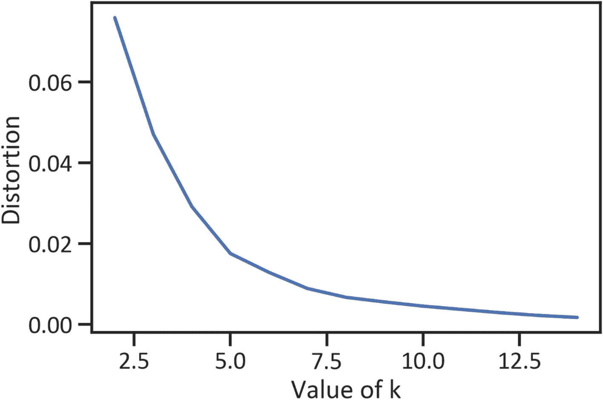

# 五、股票聚类

投资者选择的股票组合会影响投资组合的表现。有些资产投资风险很高，但有些则不然。高风险资产是那些价格在短期内剧烈变动的资产。为了获得资本，投资者可以选择几组股票，而不是投资于一只股票或一类股票。鉴于有许多股票可供选择，投资者通常很难选出一组表现最佳的股票。为了找到一组具有相似性的股票，我们使用了一种称为*聚类分析*的无监督学习技术。它包括根据相似的特征对数据点进行分组。最流行的聚类分析模型是 k-means 模型。

## 投资组合多样化

投资者应该小心，不要把所有的鸡蛋放在一个篮子里，把所有的投资资金都投向一个感兴趣的领域。他们可能利用投资组合多样化来获得资本。它涉及将资金分配到不同行业、部门、地理位置等的资产中。一个保守的投资者通过投资风险更低、利润更高的股票来分散投资组合。他们确保自己的策略符合自己的风险偏好，并投资于波动性最小、表现最好的股票。

## 股票市场波动

我们在前面的章节中提到，外汇市场和股票市场的价格不是恒定的。有一点随机性，因为它们会随着时间而波动。就流动性而言，外汇市场是流动性最强的市场，其次是股票市场，以此类推。做市商通过大宗交易和销售活动的数量来推动价格变动。

投资差价合约(CFD)和交易所交易基金(eft)涉及风险。一项资产的价格可能走向相反的方向，导致资本损失。投资者应该有稳健的风险管理策略。理想情况下，他们必须根据一定的标准选择最好的股票。最常见的标准是波动性，这是对短期内价格剧烈变化程度的估计。我们基本上假设，如果市场中的流动性增加，那么波动性就会增加，反之亦然。我们通过估计对数收益和贝塔系数的标准差来衡量波动性。除了跨国金融机构的大型交易和销售活动之外，还有其他影响波动性的因素，如社会事件、经济事件、节假日、流行病、劳工骚乱、自然灾害、战争等。

## k 均值聚类

k 均值模型将数据划分为具有最近均值(质心)的 *k* (聚类)；然后，它找出子组之间的距离来产生一个聚类。它同时缩小了簇内距离并改善了簇间距离。我们用等式 [5-1](#Equ1) 表示公式。


(方程式 5-1)

*Dis* ( *x* <sub>1</sub> ， *x* <sub>2</sub> )反映了数据点之间的距离。基于等式 5-1 中的公式，我们感兴趣的是发现独立数据点(表示为坐标( *x* <sub>1</sub> ， *y* <sub>1</sub> )和( *x* <sub>2</sub> ， *y* <sub>2</sub> )偏离平均值(中心)的平方和的平方根。它找到初始的 *k* (聚类的数量)并估计聚类之间的距离，然后它将数据点分布到相邻的质心。它将数据点分成相似的 k 组。估计空间相似性最常用的方法是欧几里德距离(它连接角度和距离)。此群集模型需要在集合上指定数字。数据分区依赖于许多集群。这个算法随机初始化质心。

### 实践中的 k-均值

清单 [5-1](#PC1) 从雅虎财经中提取数据，并应用 web 抓取`get_data_yahoo()`方法。此后，它执行获得高质量数据所需的数据处理任务。

```py
rom pandas_datareader import data
tickers = ['AMZN','AAPL','WBA',
           'NOC','BA','LMT',
           'MCD','INTC','NAV',
           'IBM','TXN','MA',
           'MSFT','GE','AXP',
           'PEP','KO','JNJ',
           'TM','HMC','MSBHY',
           'SNE','XOM','CVX',
           'VLO','F','BAC']
start_date = '2010-01-01'
end_date = '2020-11-01'
df = data.get_data_yahoo(tickers, start_date, end_date)[['Adj Close']]

Listing 5-1Scraped Data

```

Listing [5-1](#PC1) 从亚马逊、苹果、Walgreens Boots Alliance 等公司抽取股票。有 27 只股票。请记住，您可以包含任意多的股票。清单 [5-2](#PC2) 估算收益和波动性。

```py
returns = df.pct_change().mean() * (10*12)
std = df.pct_change().std() * np.sqrt((10*12))
ret_var = pd.concat([returns, std], axis = 1).dropna()
ret_var.columns = ["Returns","Standard Deviation"]

Listing 5-2Estimate Returns and Volatility

```

列表 [5-3](#PC3) 为弯头曲线(见图 [5-1](#Fig1) )。在开发 k-means 模型时，我们使用它来确定要指定的聚类数。



图 5-1

肘形曲线

```py
X =  ret_var.values
sse = []
for k in range(1,15):
    kmeans = KMeans(n_clusters = k)
    kmeans.fit(X)
    sse.append(kmeans.inertia_)
plt.plot(range(1,15), sse)
plt.xlabel("Value of k")
plt.ylabel("Distortion")
plt.show()

Listing 5-3Elbow Curve

```

y 轴显示相关矩阵(特征值)的压缩方差，x 轴显示因子的数量。我们使用该图，通过在曲线中找到一个开始急剧下降的点，来确定一个聚类模型所需的聚类数。为了清楚地理解这是如何工作的，将 y 轴视为相关性的严重程度。我们感兴趣的是严重相关和非严重相关之间的界限。图 [5-1](#Fig1) 显示了从 1 到 5 的平滑弯曲。然而，从 5 开始，曲线突然弯曲。我们用 5 作为分界点。清单 [5-4](#PC4) 按降序排列标准偏差，删除所有缺失值，并创建熊猫数据帧的 NumPy 数组。

```py
stdOrder = ret_var.sort_values('Standard Deviation',ascending=False)
first_symbol = stdOrder.index[0]
ret_var.drop(first_symbol,inplace=True)
X = ret_var.values

Listing 5-4Data Preprocessing

```

清单 [5-5](#PC5) 用五个聚类完成了 k-means 模型。此后，它描述了各自聚类中的数据点(见图 [5-2](#Fig2) )。


图 5-2

k 均值模型

```py
kmeans =KMeans(n_clusters = 5).fit(X)
centroids = kmeans.cluster_centers_
plt.scatter(X[:,0],X[:,1], c = kmeans.labels_, cmap ="viridis")
plt.xlabel("y")
plt.scatter(centroids[:,0], centroids[:,1],color="red",marker="*")
plt.show()

Listing 5-5Finalize the K-Means Model

```

k-means 模型进行智能猜测，直到它将数据点分配到最邻近的质心并发现质心的平均值。图 [5-2](#Fig2) 显示数据中有五个明显的聚类。列表 [5-6](#PC6) 列出了每只股票及其所属的集群，以及其收益和波动性(见表 [5-1](#Tab1) )。

表 5-1

每个集群的回报率和波动性

<colgroup><col class="tcol1 align-left"> <col class="tcol2 align-left"> <col class="tcol3 align-left"> <col class="tcol4 align-left"></colgroup> 
| 

**符号**

 | 

串

 | 

返回

 | 

波动性

 |
| --- | --- | --- | --- |
| **(调整关闭，AMZN)** | four | 0.161408 | 0.219298 |
| **(形容词 Close，AAPL)** | four | 0.142889 | 0.195379 |
| **(调整关闭，WBA)** | Two | 0.025647 | 0.190772 |
| **(调整关闭，NOC)** | one | 0.099201 | 0.156376 |
| **(调整关闭，BA)** | three | 0.082153 | 0.241547 |
| **(调整关闭，LMT)** | one | 0.093110 | 0.144674 |
| **(Adj Close，MCD)** | Zero | 0.076895 | 0.132607 |
| **(形容词 Close，INTC)** | three | 0.066716 | 0.195823 |
| **(形容词 Close，IBM)** | Two | 0.019773 | 0.154294 |
| **(形容词 Close，TXN)** | one | 0.105104 | 0.185222 |
| **(调整关闭，毫安)** | four | 0.128066 | 0.194152 |
| **(形容词 Close，MSFT)** | one | 0.108985 | 0.175395 |
| **(调整关闭，GE)** | Two | 0.006920 | 0.217385 |
| **(形容词 Close，AXP)** | three | 0.061691 | 0.195526 |
| **(调整关闭，启动)** | Zero | 0.055847 | 0.120965 |
| **(调整关闭，KO)** | Zero | 0.048256 | 0.120660 |
| **(形容词 Close，JNJ)** | Zero | 0.054099 | 0.117171 |
| **(调整关闭，TM)** | Zero | 0.042555 | 0.147653 |
| **(形容词 Close，HMC)** | Two | 0.010742 | 0.167794 |
| **(Adj Close，MSBHY)** | Two | 0.019532 | 0.171736 |
| **(形容词 Close，SNE)** | three | 0.074899 | 0.225855 |
| **(形容词 Close，XOM)** | Two | -0.003797 | 0.159237 |
| **(形容词 Close，CVX)** | Two | 0.029708 | 0.184557 |
| **(形容词 Close，VLO)** | three | 0.086470 | 0.263032 |
| **(可调关闭，F)** | Two | 0.028089 | 0.216344 |
| **(调整关闭，BAC)** | three | 0.053830 | 0.244936 |

```py
stocks = pd.DataFrame(ret_var.index)
cluster_labels = pd.DataFrame(kmeans.labels_)
stockClusters = pd.concat([stocks, cluster_labels],axis = 1)
stockClusters.columns = ['Symbol','Cluster']
x_df = pd.DataFrame(X, columns = ["Returns", "Volatitity"])
closerv = pd.concat([stockClusters,x_df],axis=1)
closerv = closerv.set_index("Symbol")
closerv

Listing 5-6Returns and Volatility per Cluster

```

为了理解 k-means 性能，我们求助于剪影方法，该方法检查每个样本的平均簇内距离和平均近簇距离。获得的值被认为是轮廓分数；它测量分离度。轮廓得分范围从-1 到 1。具体来说，-1 表示模型性能差，1 表示模型性能最优。清单 [5-7](#PC7) 找到分数。

```py
from sklearn import metrics
y_predkmeans = pd.DataFrame(kmeans.predict(X))
y_predkmeans = y_predkmeans.dropna()
metrics.silhouette_score(X,y_predkmeans)
0.4260002825147118

Listing 5-7Find the Silhouette Score

```

剪影评分 0.42。分数表明模型不能充分解释数据。

## 结论

本章介绍了一个无监督学习模型，帮助投资者更好地管理风险，选择一组表现最佳的资产。我们使用 k-means 模型将数据点分配给不同的聚类。我们使用轮廓分数来评估模型的性能。经过仔细考虑，我们发现该模型显示了一个行为良好的集群模型的特征。剪影评分更接近 1 而不是-1。然而，仍有改进的余地。在一些组中有重叠，但它们没有大到足以影响结论。