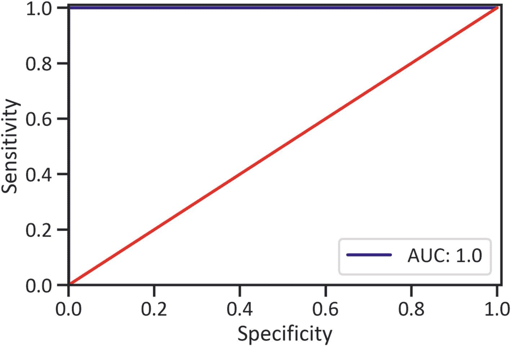
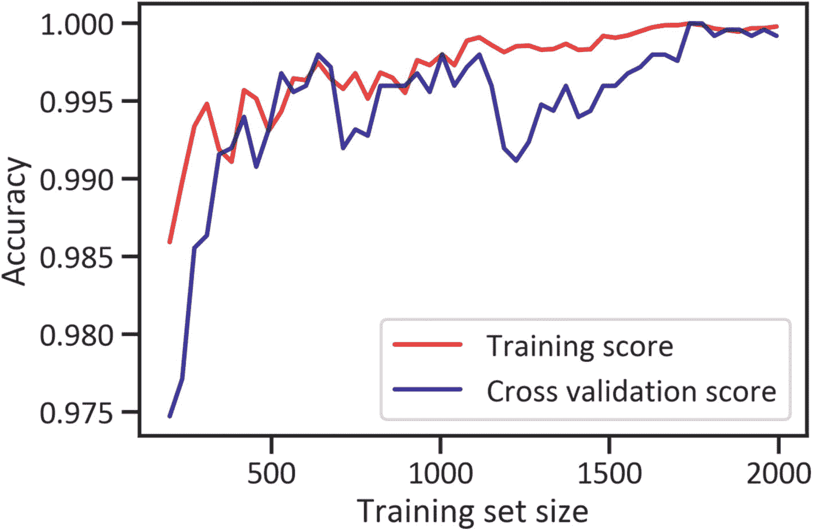
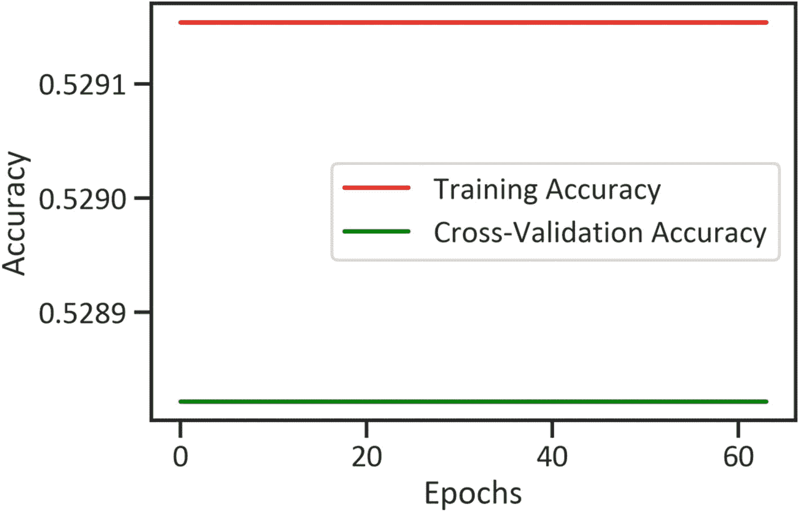

# 八、使用 ML 和 DL 的市场趋势分类

到目前为止，我们已经逐步介绍了参数方法。我们解决的所有问题都涉及一个连续变量。我们还可以利用*非参数方法*来预测市场可能的走向。本章介绍非参数(或非线性)方法，也称为*分类方法*。这种流行的方法对独立变量进行操作，并触发一个有界值。它适用于处理分类因变量(受特定范围限制的因变量)。有两种主要的分类方法:二元分类方法，当因变量有两个结果时使用；多类分类方法，当因变量是有两个以上结果的分类变量时使用。在本章中，我们同时使用 SciKit-Learn 和 Keras。SciKit-Learn 库预安装在 Python 环境中。在 Python 环境中安装 Keras，我们使用`pip install Keras`，在 conda 环境中，我们使用`conda install -c conda-forge keras`。

## 实践中的分类

认识供求活动有助于投资者做出明智的投资决策。在这一章中，我们用两个结果 0 和 1 创建一个分类变量，其中 0 代表下跌市场，1 代表上涨市场。我们使用逻辑分类器来预测未来的类别。清单 [8-1](#PC1) 应用`get_data_yahoo()`方法得到 2010 年 11 月 1 日至 2010 年 11 月 1 日原油 <sup>[1](#Fn1)</sup> 价格数据(见表 [8-1](#Tab1) )。

```py
from pandas_datareader import data
start_date = '2010-11-01'
end_date = '2020-11-01'
ticker = 'CL=F'
df = data.get_data_yahoo(ticker, start_date, end_date,)
df.head()

Listing 8-1Scraped Data

```

表 8-1

资料组

<colgroup><col class="tcol1 align-left"> <col class="tcol2 align-left"> <col class="tcol3 align-left"> <col class="tcol4 align-left"> <col class="tcol5 align-left"> <col class="tcol6 align-left"> <col class="tcol7 align-left"></colgroup> 
| 

**日期**

 | 

高的

 | 

低的

 | 

打开

 | 

关闭

 | 

卷

 | 

接近的

 |
| --- | --- | --- | --- | --- | --- | --- |
| **2010-11-01** | 83.860001 | 81.320000 | 81.449997 | 82.949997 | Three hundred and fifty-eight thousand five hundred and thirty-five | 82.949997 |
| **2010-11-02** | 84.470001 | 82.830002 | 82.879997 | 83.900002 | Two hundred and eighty-one thousand eight hundred and thirty-four | 83.900002 |
| **2010-11-03** | 85.360001 | 83.570000 | 84.370003 | 84.690002 | Three hundred and ninety-three thousand seven hundred and thirty-five | 84.690002 |
| **2010-11-04** | 86.830002 | 84.919998 | 85.089996 | 86.489998 | Three hundred and seventeen thousand nine hundred and ninety-seven | 86.489998 |
| **2010-11-05** | 87.430000 | 85.959999 | 86.599998 | 86.849998 | Three hundred and seventeen thousand nine hundred and ninety-seven | 86.849998 |

清单 [8-2](#PC2) 估算回报和日志回报(见表 [8-2](#Tab2) )。

表 8-2

具有估计回报和日志回报的数据集

<colgroup><col class="tcol1 align-left"> <col class="tcol2 align-left"> <col class="tcol3 align-left"> <col class="tcol4 align-left"> <col class="tcol5 align-left"> <col class="tcol6 align-left"> <col class="tcol7 align-left"> <col class="tcol8 align-left"> <col class="tcol9 align-left"></colgroup> 
| 

**日期**

 | 

高的

 | 

低的

 | 

打开

 | 

关闭

 | 

卷

 | 

接近的

 | 

百分比变化

 | 

日志 _ right

 |
| --- | --- | --- | --- | --- | --- | --- | --- | --- |
| **2010-11-01** | 83.860001 | 81.320000 | 81.449997 | 82.949997 | Three hundred and fifty-eight thousand five hundred and thirty-five | 82.949997 | 圆盘烤饼 | 圆盘烤饼 |
| **2010-11-02** | 84.470001 | 82.830002 | 82.879997 | 83.900002 | Two hundred and eighty-one thousand eight hundred and thirty-four | 83.900002 | 0.011453 | 0.011388 |
| **2010-11-03** | 85.360001 | 83.570000 | 84.370003 | 84.690002 | Three hundred and ninety-three thousand seven hundred and thirty-five | 84.690002 | 0.009416 | 0.009372 |
| **2010-11-04** | 86.830002 | 84.919998 | 85.089996 | 86.489998 | Three hundred and seventeen thousand nine hundred and ninety-seven | 86.489998 | 0.021254 | 0.021031 |
| **2010-11-05** | 87.430000 | 85.959999 | 86.599998 | 86.849998 | Three hundred and seventeen thousand nine hundred and ninety-seven | 86.849998 | 0.004162 | 0.004154 |

```py
df = df.dropna()
df['pct_change'] = df["Adj Close"].pct_change()
df['log_ret'] = np.log(df["Adj Close"]) - np.log(df["Adj Close"].shift(1))
df.head()

Listing 8-2Estimate Returns and Log Returns

```

列表 [8-3](#PC3) 去掉缺失值，估计市场方向(见表 [8-3](#Tab3) )。

表 8-3

包含估计回报、日志回报和市场方向的数据集

<colgroup><col class="tcol1 align-left"> <col class="tcol2 align-left"> <col class="tcol3 align-left"> <col class="tcol4 align-left"> <col class="tcol5 align-left"> <col class="tcol6 align-left"> <col class="tcol7 align-left"> <col class="tcol8 align-left"> <col class="tcol9 align-left"> <col class="tcol10 align-left"></colgroup> 
| 

**日期**

 | 

高的

 | 

低的

 | 

打开

 | 

关闭

 | 

卷

 | 

接近的

 | 

百分比变化

 | 

日志 _ right

 | 

方向

 |
| --- | --- | --- | --- | --- | --- | --- | --- | --- | --- |
| **2010-11-02** | 84.470001 | 82.830002 | 82.879997 | 83.900002 | Two hundred and eighty-one thousand eight hundred and thirty-four | 83.900002 | 0.011453 | 0.011388 | one |
| **2010-11-03** | 85.360001 | 83.570000 | 84.370003 | 84.690002 | Three hundred and ninety-three thousand seven hundred and thirty-five | 84.690002 | 0.009416 | 0.009372 | one |
| **2010-11-04** | 86.830002 | 84.919998 | 85.089996 | 86.489998 | Three hundred and seventeen thousand nine hundred and ninety-seven | 86.489998 | 0.021254 | 0.021031 | one |

```py
df = df.dropna()
df['direction'] = np.sign(df['pct_change']).astype(int)
df.head(3)

Listing 8-3Drop Missing Values and Estimate Market Direction

```

## 数据预处理

清单 [8-4](#PC4) 用两个结果 0 和 1 创建了一个分类变量，其中 0 代表下跌市场，1 代表上涨市场。这使得我们能够使用能够预测两个类别的概率的分类器。我们首先定义滞后的数量，然后我们估计每日收益，并将滞后收益转换为二进制类。我们还使用`GridSearchCV()`方法标准化数据，使平均值为 0，标准偏差为 1。

```py
from sklearn.preprocessing import StandardScaler
df["direction"] = pd.get_dummies(df["direction"])
from sklearn import preprocessing
x=df.iloc[::,5:8]
y=df.iloc[::,-1]
scaler = StandardScaler()
x=scaler.fit_transform(x)

Listing 8-4Data Preprocessing

```

清单 [8-5](#PC5) 使用 80/20 分割比率将数据分割成训练数据和测试数据。

```py
from sklearn.model_selection import train_test_split
x_train, x_test, y_train, y_test =train_test_split(x , y, test_size=0.2,shuffle= False)

Listing 8-5Split Data into Training and Test Data

```

## 逻辑回归

虽然术语 *logistic 回归*中包含了*回归*一词，但它不是回归模型，而是分类模型。线性回归模型估计连续变量。同时，逻辑回归模型估计分类因变量。回归模型假设数据是线性的并且来自正态分布，但是逻辑分类器不受这些假设的约束。在逻辑回归中，我们用 S 形曲线(或逻辑曲线或 sigmoid 曲线)来拟合数据。我们使用逻辑分类器来预测市场走势。股票价格在特定时期变化很大。如果市场应该在一定时期内上涨，那么就有一个向上的市场或牛市。相反，如果市场价格在特定时期内持续下跌，那么就出现了下跌市场或熊市。

### 开发逻辑分类器

清单 [8-6](#PC6) 完成了逻辑分类器。

```py
from sklearn.linear_model import LogisticRegression
logreg = LogisticRegression()
logreg.fit(x_train, y_train)

Listing 8-6Finalize the Logistic Classifier

```

#### 评估逻辑分类器

清单 [8-7](#PC7) 构建了一个突出显示预测市场类别的表格(见表 [8-4](#Tab4) )。

表 8-4

预测类别

<colgroup><col class="tcol1 align-left"> <col class="tcol2 align-left"></colgroup> 
|   | 

预报

 |
| --- | --- |
| **0** | one |
| **1** | one |
| **2** | Zero |
| **3** | one |
| **4** | one |
| **...** | ... |
| **第 494 章** | one |
| **495** | Zero |
| **496** | one |
| **第 497 章** | Zero |
| **第 498 章** | one |

```py
y_predlogreg = logreg.predict(x_test)
pd.DataFrame(y_predlogreg,columns=["Forecast"])

Listing 8-7Predicted Values

```

表 [8-4](#Tab4) 没有为我们提供关于逻辑分类器预测效果的足够信息。为了找到逻辑分类器性能的抽象背景，我们使用混淆矩阵。

##### 混淆矩阵

我们通常使用混淆矩阵来识别两种类型的错误:假阳性，错误地预测一个事件发生了，以及假阴性，错误地预测一个从未发生的事件。它还强调了正确预测已发生事件的真正积极因素，以及正确预测从未发生事件的真正消极因素。清单 [8-8](#PC8) 构建一个混淆矩阵(见表 [8-5](#Tab5) )。

```py
from sklearn import metrics
cmatlogreg = pd.DataFrame(metrics.confusion_matrix(y_test,y_predlogreg),
                          index=["Actual: Sell","Actual: Buy"],
                          columns=("Predicted: Sell","Predicted: Buy"))
cmatlogreg

Listing 8-8Confusion Matrix

```

表 [8-5](#Tab5) 除了给出实际“卖出”和实际“买入”，以及预测“卖出”和预测“买入”的数量之外，并没有告诉我们太多为了更好地理解逻辑分类器的工作原理，我们使用分类报告。

表 8-5

混淆矩阵估计

<colgroup><col class="tcol1 align-left"> <col class="tcol2 align-left"> <col class="tcol3 align-left"></colgroup> 
|   | 

预测:出售

 | 

预测:购买

 |
| --- | --- | --- |
| **实际:卖出** | Two hundred and thirty-four | Zero |
| **实际:买入** | Zero | Two hundred and sixty-five |

##### 分类报告

表 [8-8](#Tab8) 提供了关于分类器性能的足够详细的信息。它将准确度(分类器获得正确预测的频率)、精确度(分类器获得正确预测的频率)、F-1 分数(精确度和召回率的调和平均值)和支持度(该类别中实际响应的样本数量)制成表格。它还显示数据中是否存在不平衡。为了理解这是如何工作的，在本节中，我们将向您展示如何估计准确度和精确度(也可参考表 [8-6](#Tab6) )。


(Equation 8-1)


(Equation 8-2)

表 8-6

理解混淆矩阵估计

<colgroup><col class="tcol1 align-left"> <col class="tcol2 align-left"></colgroup> 
| 

公制的

 | 

描述

 |
| --- | --- |
| TP | 代表真阳性(当是“卖出”信号时，分类器预测了多少次“卖出”信号) |
| **TN** | 代表真正的否定(当它是“买入”信号时，分类器预测了多少次“买入”信号) |
| **FP** | 代表假阳性(分类器预测“卖出”信号是“买入”信号的次数) |
| **FP** | 代表假阴性(当“卖出”信号时，分类器预测了多少次“买入”信号) |

为了理解这是如何工作的，请看表 [8-6](#Tab6) 。也可参考表 [8-7](#Tab7) 。

表 8-7

如何获得混淆矩阵估计

<colgroup><col class="tcol1 align-left"> <col class="tcol2 align-left"> <col class="tcol3 align-left"></colgroup> 
|   | 

预测:出售

 | 

预测:购买

 |
| --- | --- | --- |
| **实际:卖出** | 东帝汶的网络域名代号 | 冰点 |
| **实际:买入** | 【数学】函数 | 长吨 |

清单 [8-9](#PC9) 显示了分类报告(见表 [8-8](#Tab8) )。

表 8-8

分类报告

<colgroup><col class="tcol1 align-left"> <col class="tcol2 align-left"> <col class="tcol3 align-left"> <col class="tcol4 align-left"> <col class="tcol5 align-left"></colgroup> 
|   | 

精确

 | 

召回

 | 

f1-分数

 | 

支持

 |
| --- | --- | --- | --- | --- |
| **0** | One | One | One | Two hundred and fifty-six |
| **1** | One | One | One | Two hundred and forty-three |
| **精度** | One | One | One | One |
| **宏平均值** | One | One | One | Four hundred and ninety-nine |
| **加权平均值** | One | One | One | Four hundred and ninety-nine |

```py
creportlogreg =pd.DataFrame(metrics.classification_report(y_test,y_predlogreg,output_dict=True)).transpose()
creportlogreg

Listing 8-9Classification Report

```

表 [8-8](#Tab8) 强调了逻辑分类器在 100%的时间内是准确的(精度为 1.0)。这也表明数据中存在不平衡。我们不会依靠准确度分数来评估它的性能。

##### 受试者工作特征曲线

我们使用 ROC 曲线来找出曲线下的面积(AUC)。ROC 代表“接收器操作特性”，它显示了分类器区分类别的程度。`roc_curve()`方法采用实际类别和每个类别的概率来绘制曲线。清单 [8-10](#PC10) 构建了一条 ROC 曲线，以总结不同阈值的假阳性率和真阳性率之间的权衡(见图 [8-1](#Fig1) )。



图 8-1

受试者工作特征曲线

```py
y_predlogreg_proba = logreg.predict_proba(x_test)[::,1]
fprlogreg, tprlogreg, _ =metrics.roc_curve(y_test,y_predlogreg_proba)
auclogreg = metrics.roc_auc_score(y_test, y_predlogreg_proba)
plt.plot(fprlogreg, tprlogreg, label="AUC: "+str(auclogreg),color="navy")
plt.plot([0,1],[0,1],color="red")
plt.xlim([0.00,1.01])
plt.ylim([0.00,1.01])
plt.xlabel("Specificity")
plt.ylabel("Sensitivity")
plt.legend(loc=4)
plt.show()

Listing 8-10ROC Curve

```

AUC 分数大于 0.80。这意味着逻辑分类器善于区分类别。理想情况下，我们需要一个 AUC 值接近 1 的分类器。

### 学习曲线

图 [8-2](#Fig2) 有两个轴:x 轴上的训练集大小，y 轴上的准确率得分。它说明了当我们逐渐增加数据时，分类器如何学习做出准确的预测。参见清单 [8-11](#PC11) 。



图 8-2

学习曲线

```py
from sklearn.model_selection import learning_curve
trainsizelogreg, trainscorelogreg, testscorelogreg =learning_curve(logreg, x, y, cv=5, n_jobs=5,train_sizes=np.linspace(0.1,1.0,50))
trainscorelogreg_mean = np.mean(trainscorelogreg,axis=1)
testscorelogreg_mean = np.mean(testscorelogreg,axis=1)
plt.plot(trainsizelogreg,trainscorelogreg_mean,color="red",label="Training score", alpha=0.8)
plt.plot(trainsizelogreg,testscorelogreg_mean,color="navy",label="Cross validation score", alpha=0.8)
plt.xlabel("Training set size")
plt.ylabel("Accuracy")
plt.legend(loc=4)
plt.show()

Listing 8-11Learning Curve

```

图 [8-2](#Fig2) 表明分类器在训练的基础阶段犯了很多错误。随着训练集大小的增加，平均准确度分数激增，并且训练分数主要低于交叉验证分数。

## 多层感知器

第 [5](5.html) 章讲述了深度学习及其在金融领域的应用。此后，我们解释了人工神经网络的基本结构，并揭示了使用循环神经网络(RNN)解决连续问题的方法。我们开发并评估了长短期记忆(LSTM)模型来预测未来的股票价格。在这一章中，我们使用多层感知器(MLP)分类器来估计上涨或下跌市场的概率。它包括三层:输入层，接收输入值；隐藏层，用于转换值；以及触发输出值的输出层。MLP 模型接收一组输入值，对其进行转换，并在输出层触发输出值。它基本上是多个受限玻尔兹曼机器(一个保持可见层和隐藏层的神经网络)的组合。该模型通过反向传播解决了梯度消失问题，反向传播涉及估计从右到左的梯度(与正向传播相反，正向传播涉及估计从左到右的梯度)。


图 8-3

多层感知器

图 [8-3](#Fig3) 显示了一个 MLP，其可见层有三个节点，隐藏层有四个节点，输出层只有一个可能的结果。清单 [8-12](#PC12) 导入 Keras 库。

```py
from keras import Sequential, regularizers
from keras.layers import Dense, Dropout
from keras.wrappers.scikit_learn import KerasClassifier

Listing 8-12Import Libraries

```

导入 Keras 框架后，我们开始建立神经网络的结构。

## 体系结构

清单 [8-13](#PC13) 构建了神经网络的逻辑结构。有八个输入变量(高、低、开、闭、量、调整闭、pct_change、log_ret、方向)，我们有意将`input_dim`设为 8，并应用 sigmoid 函数。sigmoid 函数对一组输入值进行运算，并生成范围在 0 和 1 之间的输出值。我们在隐藏层和输出层实现 ReLu 函数。与 sigmoid 函数不同，ReLu 函数将数据限制在 0 和 1 之间，并处理数据，直到始终产生最佳值。与其他优化器相比，我们通常使用自适应矩估计(Adam)优化器，因为它最多比它的前辈更好地概括数据，尤其是在处理大型数据集时。它扩展了 Adadelta(一种基于修改的梯度的移动窗口适当调整学习率的优化器)和 RMSProp(估计梯度的当前权重和先前权重之间的显著差异；此后，它估计所获得的标准偏差的平方根)。亚当是直爽的；它巧妙地改变了自适应学习速率，并实现了随机梯度下降法(一种通过随机选择要估计的项而不是估计所有项来更快地训练神经网络的流行方法)。它充分考虑了损失函数的实质性变化。此外，它对计算要求不高。总之，它解决了训练速度慢的问题(当数据中有许多变量或许多观察值时，我们大多会与其他优化器一起经历这一问题)。

```py
def create_dnn_model1(optimizer="adam"):
    model1 = Sequential()
    model1.add(Dense(8, input_dim=8, activation="sigmoid"))
    model1.add(Dense(8, activation="relu"))
    model1.add(Dense(1, activation="relu"))
    model1.compile(loss="binary_crossentropy", optimizer=optimizer, metrics=["accuracy"])
    return model1

Listing 8-13Architecture

```

清单 [8-14](#PC14) 使用`KerasClassifier()`方法包装了网络的架构。

```py
model1 = KerasClassifier(build_fn=create_dnn_model1)

Listing 8-14Wrap the Model

```

### 最终确定模型

清单 [8-15](#PC15) 分 15 批跨 64 个时期训练神经网络。一个时期代表一次完整的向前和向后传递，一批代表在整个网络中逐渐增加的样本数。

```py
history1 = model1.fit(x_train, y_train, validation_data=(x_val,y_val), batch_size=15, epochs=64)
history1

Listing 8-15Finalize the Model

```

清单 [8-16](#PC16) 返回关键绩效评估指标(见表 [8-9](#Tab9) )。

表 8-9

分类报告

<colgroup><col class="tcol1 align-left"> <col class="tcol2 align-left"> <col class="tcol3 align-left"> <col class="tcol4 align-left"> <col class="tcol5 align-left"></colgroup> 
|   | 

精确

 | 

召回

 | 

f1-分数

 | 

支持

 |
| --- | --- | --- | --- | --- |
| **0** | 0.468938 | 1.000000 | 0.638472 | 234.000000 |
| **1** | 0.000000 | 0.000000 | 0.000000 | 265.000000 |
| **精度** | 0.468938 | 0.468938 | 0.468938 | 0.468938 |
| **宏平均值** | 0.234469 | 0.500000 | 0.319236 | 499.000000 |
| **加权平均值** | 0.219903 | 0.468938 | 0.299404 | 499.000000 |

```py
y_predmodel1 = model1.predict(x_test)
creportmodel1 = pd.DataFrame(metrics.classification_report(y_test,y_predmodel1, output_dict=True)).transpose()
creportmodel1

Listing 8-16Classification Report

```

表 [8-9](#Tab9) 强调了神经网络不如逻辑分类器准确和精确。也说明数据是不平衡的。你可以通过看损失进一步了解分类器有多熟练。

#### 跨时代的培训和验证损失

损失代表一种度量标准，它确定了实际值与模型预测值之间的差异。清单 [8-17](#PC17) 绘制了跨时期的训练和验证损失，以显示神经网络如何在训练和交叉验证中学习区分下跌和上涨市场(见图 [8-4](#Fig4) )。


图 8-4

跨时代的培训和验证损失

```py
plt.plot(history1.history["loss"],color="red",label="Training Loss")
plt.plot(history1.history["val_loss"],color="green",label="Cross-Validation Loss")
plt.xlabel("Epochs")
plt.ylabel("Loss")
plt.legend(loc=4)
plt.show()

Listing 8-17Training and Validation Loss Across Epochs

```

图 [8-4](#Fig4) 显示在第一个历元，训练损失下降并保持到第 64 个历元(7.59)。同时，交叉验证损失在不同时期保持不变(大约 7.58)。

#### 跨时代的培训和验证准确性

准确度是指分类器正确预测类别的频率。清单 [8-18](#PC18) 绘制了训练和验证精度，以展示神经网络如何学习如何获得正确的答案。(见图 [8-5](#Fig5) 。)



图 8-5

跨时代的培训和验证准确性

```py
plt.plot(history1.history["accuracy"],color="red",label="Training Accuracy")
plt.plot(history1.history["val_accuracy"],color="green",label="Cross-Validation Accuracy")
plt.xlabel("Epochs")
plt.ylabel("Accuracy")
plt.legend(loc=4)
plt.show()

Listing 8-18Training and Validation Accuracy Across Epochs

```

图 [8-5](#Fig5) 显示训练精度和验证精度在不同时期保持不变(训练精度约为 0.5291，交叉验证约为 0.528)。

## 结论

本章介绍了二元分类法。它涵盖了一种设计、开发和测试称为*逻辑回归*的机器学习模型的方法，还涵盖了一种称为 *MLP 模型*的神经网络模型，以解决二元分类问题。它还显示了分类模型性能评估的指标。在仔细检查了模型的表现后，我们发现独立变量是上涨市场和下跌市场概率的良好预测指标。

<aside aria-label="Footnotes" class="FootnoteSection" epub:type="footnotes">Footnotes [1](#Fn1_source)

[T2`https://finance.yahoo.com/quote/CL=F/`](https://finance.yahoo.com/quote/CL%253DF/)

 </aside>