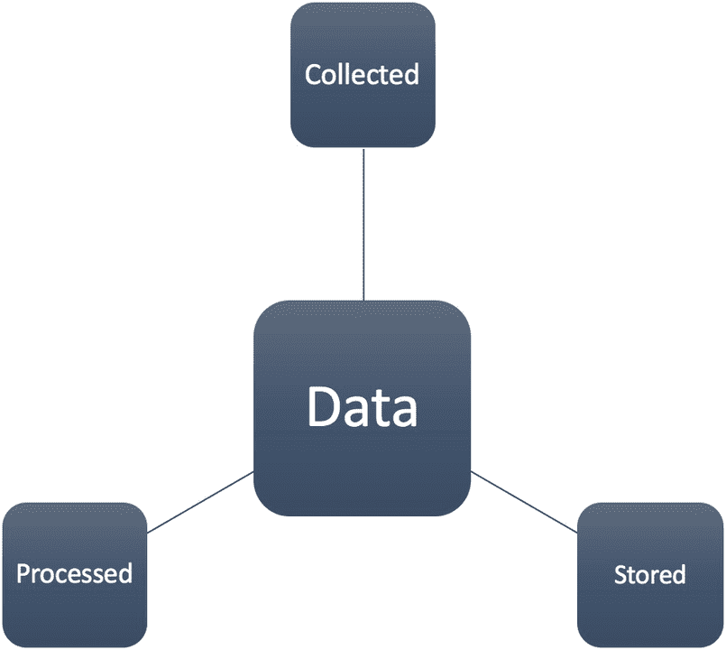
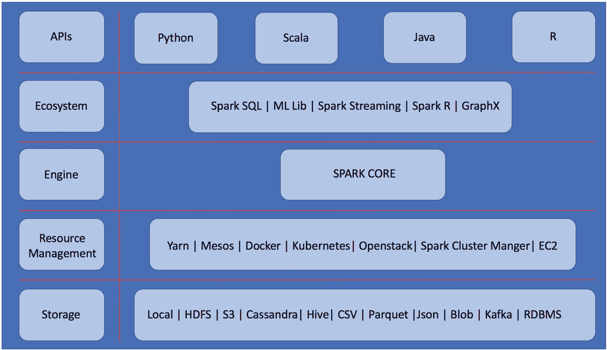
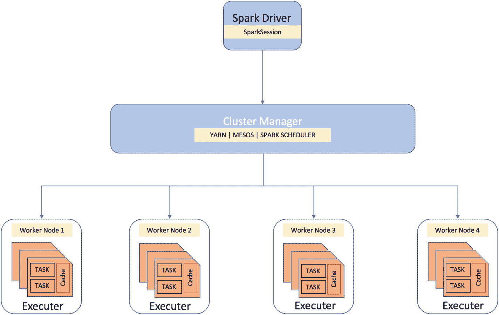
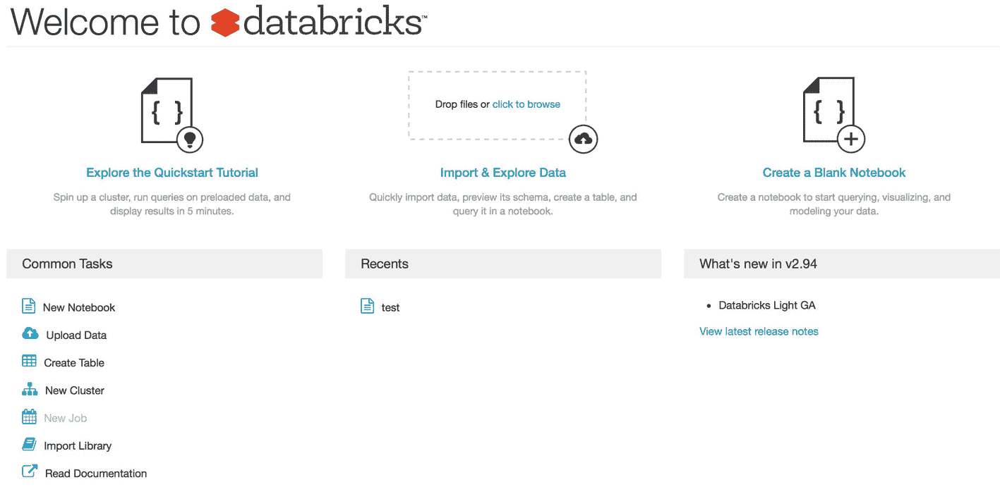
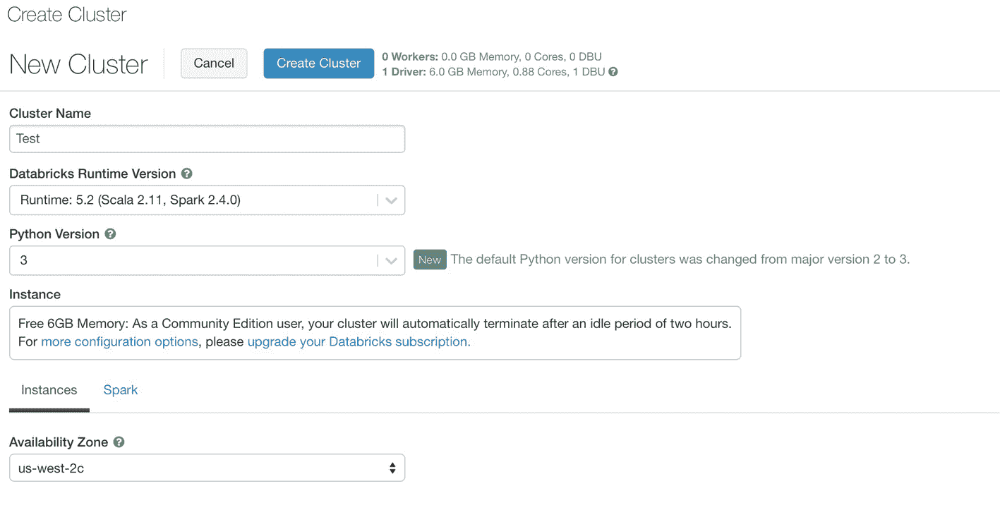
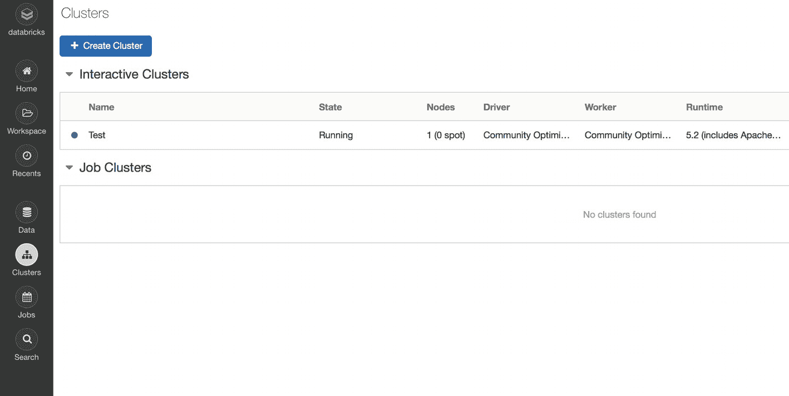
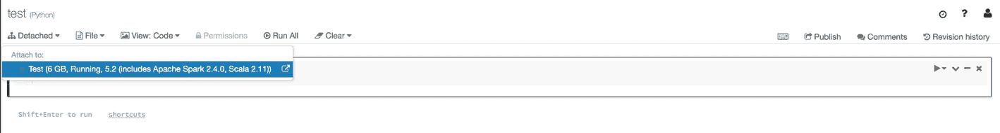
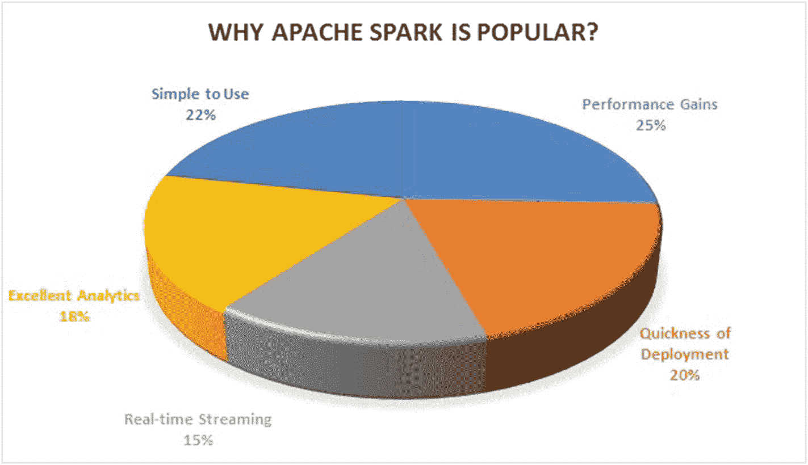

# 一、Spark 简介

因为这本书是关于 Spark 的，所以从第一章开始看 Spark 的一些历史和它的不同组成部分是很有意义的。这一介绍性章节分为三节。在第一部分中，我回顾了数据的演变以及它是如何发展到现在的规模的。我将谈到数据的三个关键方面。在第二部分中，我深入探讨了 Spark 的内部结构，并详细介绍了它的不同组件，包括它的架构和工作方式。本章的第三部分，也是最后一部分，重点介绍如何在云环境中使用 Spark。

## 历史

Spark 项目的诞生发生在加州大学伯克利分校的算法、机器和人(AMP)实验室。该项目旨在解决 Hadoop MapReduce 框架中的潜在问题。尽管 Hadoop MapReduce 是一个处理大数据的突破性框架，但在现实中，它在速度方面仍然有很多限制。Spark 是新的，能够进行内存计算，这使得它比任何其他大数据处理框架快 100 倍。此后，Spark 在全球大数据应用中的采用率持续上升。但是在进入 Spark 的细节之前，让我们考虑一下数据本身的几个方面。

数据可以从三个不同的角度来看:数据收集、存储和处理的方式，如图 [1-1](#Fig1) 所示。

图 1-1

数据的三个方面

### 数据收集

在过去的几年里，数据收集方式发生了巨大的变化。从在杂货店购买苹果到删除手机上的应用程序，现在每个数据点都在后端捕获，并通过各种内置应用程序收集。不同的物联网(IoT)设备每毫秒捕捉一次大范围的视觉和感官信号。对于企业来说，从各种来源收集数据并在以后用于改进决策已经变得相对方便。

### 数据存储

在前几年，没有人会想到数据会存放在某个遥远的地方，或者存储数据的成本会如此低廉。企业已经接受了云存储，并开始看到其优于内部部署方法的优势。但是，出于各种原因，一些企业仍然选择本地存储。众所周知，数据存储始于磁带的使用。然后，软盘的突破性引入使得将数据从一个地方转移到另一个地方成为可能。然而，数据的大小仍然是一个巨大的限制。闪存驱动器和硬盘使得以更低的成本存储和传输大量数据变得更加容易。(参见图 [1-2](#Fig2) 。存储设备发展的最新趋势已经导致闪存驱动器能够以一次性价格存储高达 2tb 的数据。

图 1-2

数据存储的发展

这一趋势清楚地表明，存储数据的成本近年来已经显著降低，并且还在继续下降。因此，企业不会回避存储大量的数据，不管是哪种数据。从日志到财务和运营交易，再到简单的员工反馈，一切都被存储起来。

### 数据处理

数据的最后一个方面是使用存储的数据并对其进行处理，以便进行一些分析或运行应用程序。我们已经见证了计算机在过去 20 年中变得多么高效。过去需要五分钟才能完成的事情，使用今天拥有先进处理单元的机器，可能不到一秒钟就能完成。因此，不用说，机器可以更快更容易地处理数据。尽管如此，不管其处理能力如何，单台机器能够处理的数据量仍然是有限的。因此，Spark 背后的基本思想是使用一组机器(集群)和一个统一的处理引擎(Spark)来处理和处理大量数据，而不牺牲速度和安全性。这是 Spark 诞生的最终目标。

## Spark建筑

有五个核心组件使 Spark 如此强大且易于使用。Spark 的核心架构由以下几层组成，如图 [1-3](#Fig3) 所示:

图 1-3

Spark 的核心组件

*   仓库

*   资源管理

*   发动机

*   生态系统

*   蜜蜂

### 仓库

在使用 Spark 之前，必须准备好数据以便进行处理。这些数据可以驻留在任何类型的数据库中。Spark 提供了多种选择来使用不同类别的数据源，以便能够大规模地处理它。Spark 允许您使用传统的关系数据库以及 NoSQL，如 Cassandra 和 MongoDB。

### 资源管理

下一层由资源管理器组成。由于 Spark 在一组机器上工作(它也可以在具有多个内核的单台机器上工作)，因此它被称为 Spark *集群*。通常，任何集群中都有一个资源管理器来有效地处理这些资源之间的工作负载。最广泛使用的两种资源管理器是 YARN 和 Mesos。资源管理器内部有两个主要组件:

1.  *集群管理器*

2.  *工人*

这有点像主从架构，其中集群管理器充当主节点，工作器充当集群中的从节点。集群管理器跟踪与工作节点及其当前状态相关的所有信息。集群管理器始终维护以下信息:

*   工作节点的状态(忙/可用)

*   工作节点的位置

*   工作节点的内存

*   工作节点的 CPU 核心总数

集群管理器的主要作用是管理工作节点，并根据工作节点的可用性和容量为它们分配任务。另一方面，工作节点只负责执行集群管理器交给它的任务，如图 [1-4](#Fig4) 所示。

图 1-4

资源管理

分配给工作节点的任务通常是整个 Spark 应用程序的各个部分。Spark 应用程序包含两个部分:

1.  工作

2.  Spark驱动器

任务是用 PySpark 或 Spark R 代码编写的数据处理逻辑。它可以简单到对非结构化数据集上的一组非常复杂的指令进行单词的总频率计数。第二个组件是 Spark driver，Spark 应用程序的主控制器，它始终与集群管理器进行交互，以找出哪些工作节点可以用来执行请求。Spark 驱动程序的作用是请求集群管理器为每个工作节点启动 Spark 执行器。

### 引擎和生态系统

Spark 架构的基础是其核心，它建立在 RDDs(弹性分布式数据集)之上，并为 Spark 贡献者构建其他库和生态系统提供了多个 API。它包含两个部分:分布式计算基础设施和 RDD 编程抽象。Spark 工具包中的默认库有四种不同的版本。

#### Spark SQL

全球大多数 ETL 操作者都在使用 SQL，因此成为 Spark 产品的一部分是一个合乎逻辑的选择。它允许 Spark 用户通过运行 SQL 查询来执行结构化数据处理。实际上，Spark SQL 利用 catalyst 优化器在 SQL 查询的执行过程中执行优化。

使用 Spark SQL 的另一个优点是，它可以轻松处理多个数据库文件和存储系统，如 SQL、NoSQL、Parquet 等。

#### MLlib(密西西比州)

在大数据集上训练机器学习模型开始成为一个巨大的挑战，直到 Spark 的 MLlib(机器学习库)出现。MLlib 使您能够使用 Spark 集群在巨大的数据集上训练机器学习模型。它允许你建立监督、非监督和推荐系统；基于自然语言处理的模型；和深度学习，以及在 Spark ML 库中。

#### 结构化流

Spark 流库提供了读取和处理实时流数据的功能。输入数据可以是来自不同来源的批量数据或接近实时的数据。结构化流能够从 Flume、Kafka、Twitter 等来源获取实时数据。本书后面有一章专门介绍这个组件(见第 [3](3.html) 章)。

#### 图表 X

这是一个位于 Spark 核心之上的库，允许用户处理特定类型的数据(图形数据帧)，包括节点和边。一个典型的图形被用来模拟所涉及的不同对象之间的关系。节点代表对象，节点之间的边代表它们之间的关系。图形数据帧主要用于网络分析，而 Graph X 使这种图形数据帧的分布式处理成为可能。

### 编程语言 API

Spark 有四种语言版本。因为 Spark 是使用 Scala 构建的，所以它成为了本地语言。除了 Scala，我们还可以使用 Python、Java 和 R，如图 [1-5](#Fig5) 所示。

图 1-5

语言 API

## 设置您的环境

在本章的最后一节，我将介绍如何在云中设置 Spark 环境。我们可以通过多种方式使用 Spark:

*   本地设置

*   码头工人

*   云环境(GCP、AWS、Azure)

*   大数据

### 本地设置

在本地系统上安装和使用 Spark 相对容易，但是如果不在集群上使用 Spark，就违背了 Spark 本身的核心目的。Spark 的核心产品是分布式数据处理，在本地系统上运行时，它总是受限于本地系统的容量，而在一组机器上使用 Spark 可以获得更多好处。然而，在本地使用 Spark 以及在样本数据上测试代码始终是一个好的做法。因此，请遵循以下步骤:

1.  确保安装了 Java 否则安装 Java。

2.  从 [`https://spark.apache.org/downloads.html`](https://spark.apache.org/downloads.html) 下载最新版本的 Apache Spark。

3.  从压缩文件夹中提取文件。

4.  将所有 Spark 相关的文件复制到各自的目录中。

5.  配置环境变量以便能够运行 Spark。

6.  验证安装并运行 Spark。

### 码头工人

本地使用 Spark 的另一种方式是通过码头工人的集装箱化技术。这允许用户将所有的依赖项和 Spark 文件打包到一个单一的映像中，该映像可以在任何系统上运行。如果需要，我们可以在任务完成后终止容器并重新运行它。要使用 Docker 来运行 Spark，我们必须首先在系统上安装 Docker，然后简单地运行下面的命令:`[In]: docker run -it -p 8888:8888 jupyter/pyspark-notebook"`。

### 云环境

正如本章前面所讨论的，由于各种原因，本地数据集在大数据方面没有太大帮助，而这正是基于云的环境使得在短时间内接收和处理巨大数据集成为可能的地方。在处理大型数据集(超过 100TB)时，Spark 的真正威力显而易见。大多数基于云的基础设施提供商允许您安装 Spark，有时它也是预先配置好的。根据需要，人们可以很容易地按照所需的规格旋转集群。基于云的环境之一是 Databricks。

#### 大数据

Databricks 是由 Spark 的创建者创建的一家公司，目的是向企业提供 Spark 的企业版，以及全面的支持。为了增加 Spark 在社区和其他用户中的采用，Databricks 还提供了一个免费的 Spark 社区版，带有 6GB 集群(单节点)。您可以通过使用以下步骤注册 Databricks 的企业帐户来增加群集的大小:

1.  Search for the Databricks web site and select Databricks Community Edition, as shown in Figure [1-6](#Fig6).

    

    图 1-6

    数据砖块网页

2.  If you have a user account with Databricks, you can simply log in. If you don’t have an account, you must create one, in order to use Databricks, as shown in Figure [1-7](#Fig7).

    

    图 1-7

    数据块登录

3.  Once you are on the home page, you can choose to either load a new data source or create a notebook from scratch, as shown in Figure [1-8](#Fig8). In the latter case, you must have the cluster up and running, to be able to use the notebook. Therefore, you must click New Cluster, to spin up the cluster. (Databricks provides a 6GB AWS EMR cluster.)

    

    图 1-8

    创建数据块笔记本

4.  To set up the cluster, you must give a name to the cluster and select the version of Spark that must configure with the Python version, as shown in Figure [1-9](#Fig9). Once all the details are filled in, you must click Create Cluster and wait a couple of minutes, until it spins up.

    

    图 1-9

    创建数据块集群

5.  You can also view the status of the cluster by going into the Clusters option on the left side widget, as shown in Figure [1-10](#Fig10). It gives all the information associated with the particular cluster and its current status.

    

    图 1-10

    数据块簇列表

6.  The final step is to open a notebook and attach it to the cluster you just created (Figure [1-11](#Fig11)). Once attached, you can start the PySpark code.

    

    图 1-11

    数据砖笔记本

总体而言，自 2010 年 Spark 成为开源平台以来，其用户数量一直在上升，社区每天都在持续增长。毫无疑问，Spark 的贡献者数量已经超过了 Hadoop。一项调查指出了 Spark 受欢迎的一些原因，调查结果如图 [1-12](#Fig12) 所示。

图 1-12

Spark 采用调查的结果

## 结论

本章简要介绍了 Spark、其核心组件以及在云环境中访问它的过程。在接下来的章节中，我将深入探究 Spark 的各个方面，以及如何用它构建不同的应用程序。