# 3.火花结构化流

本章讨论如何使用 Spark 的流 API 来处理实时数据。第一部分着重于流数据和批处理数据之间的主要区别，以及它们的具体应用。第二部分详细介绍了结构化流 API 及其对之前基于 RDD 的 Spark 流 API 的各种改进。最后一节包括用于传入数据的结构化流的代码，并讨论如何将输出结果保存在内存中。我们还将看看结构化流的替代方案。

## 批处理与流

也许本书的大多数读者已经熟悉了批处理和流数据处理之间的主要区别。尽管如此，我们可以从这篇笔记开始，因为它强调了当今流处理的重要性。如果我们认为数据是一个巨大的海洋，那么批处理数据可以被称为一桶水，我们可以有多个不同大小的桶，而流数据可以被认为是一个不断从海洋中抽水的水管。

### 批量数据

顾名思义， *batch* 是指一段时间内放在一起的一组记录，以后用于处理和分析。因为这些记录是在一段时间内收集的，所以就大小而言，批数据通常比流数据大(然而，在某些情况下，流数据可能比批数据大)，并且通常用于进行事后分析以用于各种分析目的。遗留系统、SQL 数据库和大型机都属于批量数据的范畴。与流数据相比，关键区别在于批处理数据不会在成为早期批处理数据集的一部分后立即得到处理。

### 流处理

流处理是指实时或接近实时地处理记录。人们不会等到一天结束才处理或分析数据。相反，一旦数据集的记录变得可用，或者基于一个窗口周期，就逐一处理这些记录，如图 [3-1](#Fig1) 所示。因此，这会创建一种无限表，随着数据流的增加，记录会不断地被添加。


图 3-1

流式数据

如今，企业非常积极地使用来自各种来源的实时数据，如平台、设备、应用程序和系统日志，以保持其竞争优势。因此，流处理已经成为整个过程关键部分。企业希望使用最新或最新鲜的数据来生成有助于决策的有用见解。批处理不能即时提供分析，因为它不是实时工作的，而流数据处理可以在欺诈检测等情况下提供更有效的帮助。

### 火花流

在前一章，你已经看到了 Spark 的核心架构。Spark 框架的组件之一是 Spark Streaming(结构化流)，如图 [3-2](#Fig2) 所示。

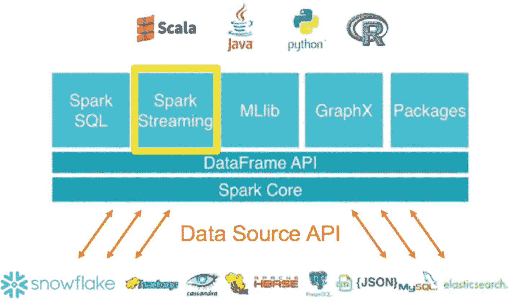

图 3-2

火花流

Spark 的早期版本提供了一个称为 Spark Streaming (Dstream)的流 API。Spark 流是基于 RDDs(数据帧/数据集之前的早期 Spark 抽象)的，没有什么限制。如图 [3-3](#Fig3) 所示，它能够从各种来源接收输入数据，如 Kafka、Flume 等。，并将传入的数据转换为微批处理，并使用 Spark Engine 进行处理。

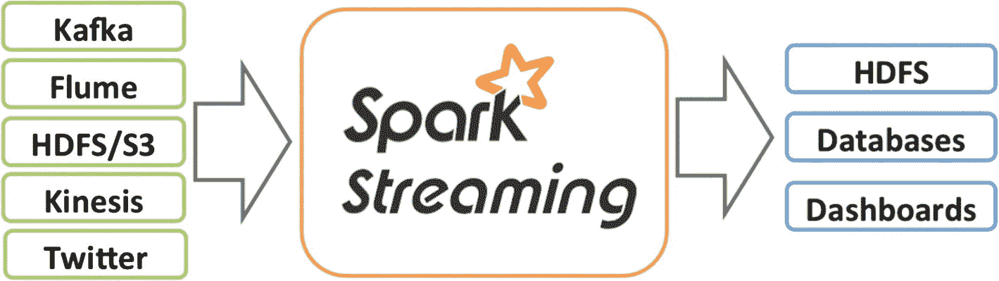

图 3-3

火花流数据流

每个批次的结果将仅作为流生成，并保存到输出位置。基于一定的时间间隔，每个微批次是一个 RDD，如图 [3-4](#Fig4) 所示。

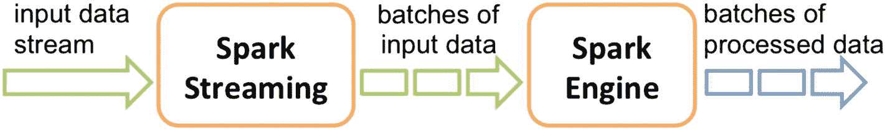

图 3-4

火花流式批处理

尽管早期的 Spark 流组件在处理流数据方面非常强大，但它在某些方面有所欠缺。

1.  一个核心缺点是批处理和流数据处理作业有不同的 API。要将批处理作业转换成数据流作业，必须进行大量的修改(翻译)。

2.  它无法基于事件时间处理批处理数据，只能基于批处理时间。很难管理要处理的迟到数据。

3.  它的容错能力有限，没有任何端到端的数据处理一致性保证。

## 结构化流

Spark 中最新版本的流组件被称为结构化流，这是对上一个基于 RDD 的 Spark 流 API 的巨大改进。与前一版本相比，第一个重大变化是结构化流为批处理和流数据处理作业提供了相同的 API。因此，它对静态和有界批处理数据的工作方式与对流式和无界数据的工作方式相似，如图 [3-5](#Fig5) 所示。

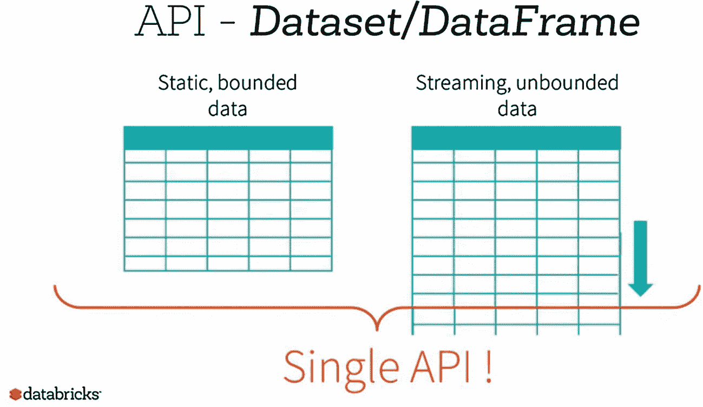

图 3-5

静态与流数据帧

与早期版本相比的另一个重大变化是，Spark 结构化流现在构建在 Spark SQL 引擎之上，并使用数据帧进行多种操作，如聚合、过滤等。它还提供了端到端的数据一致性保证，同时将结果写入输出位置。为了理解结构化流是如何工作的，让我们来看看数据是如何通过其编程模型流动的，如图 [3-6](#Fig6) 所示。

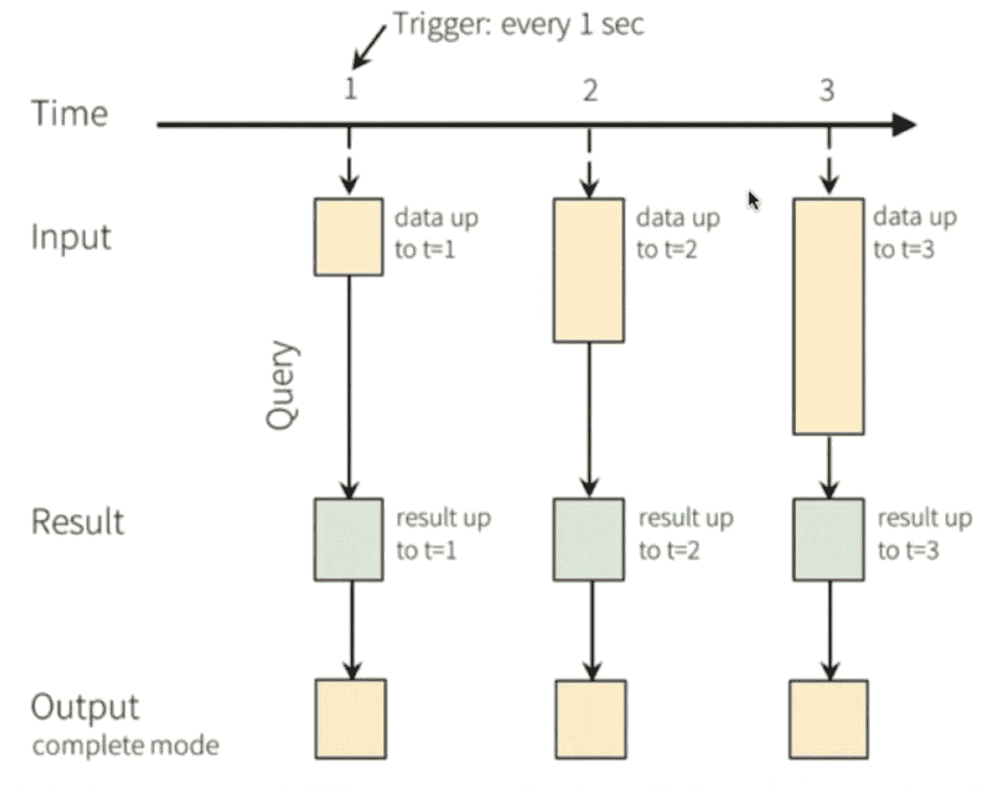

图 3-6

结构化流过程

当数据到达时间间隔 1(基于选择的窗口周期)时，输入数据帧由直到该时间间隔(t=1)的所有记录组成。下一步是在特定数据帧(t=1)上执行查询(处理、转换、连接、聚合)。一旦查询完成，结果就可用，并保存在相关的输出(控制台、内存、位置)中。现在，新数据在时间间隔 2 到达，并被添加到先前的数据帧(t=1)，从而产生更大的数据帧(t=2)。再次执行查询，但这一次是在新的数据帧(t=2)上，结果保存在所选的输出模式中。对于输入的记录流，这一过程继续进行，每个记录都附加到输入数据帧中进行数据处理。

既然我们已经了解了结构化流数据处理的基本过程，我们就可以考虑基于流的应用程序的核心部分了。我们可以将这个流框架分为三个主要区域:

1.  数据输入

2.  数据处理(实时或接近实时)

3.  最终输出

### 数据输入

任何流应用程序都需要数据，以便能够连续接收和处理数据。因此，有多种方式将数据作为输入提供给结构化流平台。

*   *消息系统* : Apache Kafka、Flume 和 Logstash 可以用来接收实时数据，因此可以很容易地成为构建流媒体管道的一部分。使用这些工具的想法是在源应用程序(web 应用程序、移动应用程序、物联网设备)生成数据时捕获所有数据点，并将其传递到结构化流平台，以容错和可扩展的方式进行进一步处理和分析。

*   *文件夹/目录*:文件作为数据流从目录中连续读取。可以使用调度程序将新文件放入目录中。文件可以是文本、拼花或 JSON 格式。唯一的条件是所有文件都以相同的格式可用。

### 数据处理

这是使用流数据创造商业价值的核心，因为它可以应用于传入数据的某些操作以获得结果。聚合、过滤、连接、排序等操作。，可以应用。

### 最终输出

结构化流为用户提供了多种选项来根据需要保存他们的输出结果，它可以是*追加*或*完成*模式。追加模式指的是仅向最终输出表添加新结果，而完成模式在最终输出位置更新整个结果表。

1.  文件目录接收器

2.  安慰

3.  内存接收器

## 构建结构化应用程序

在本章的最后一节，我们现在构建一个结构化流应用程序，它可以在新文件作为流数据添加到本地系统文件夹时从该文件夹中读取文件，并对新数据应用所有操作，最后将结果写入输出目录。第一步是创建`SparkSession`对象，以便使用 Spark。

```py
[In]: from pyspark.sql import SparkSession
[In]: spark=SparkSession.builder.appName('structured_streaming').getOrCreate()

[In]: import pyspark.sql.functions as F
[In]: from pyspark.sql.types import *

```

然后，我们创建一些自己生成的数据，这些数据可以被推到各自的本地目录(`"csv folder"`)中，供结构化流读取。我们将生成的数据包含四列，并且是 CSV 格式。如果需要，我们还可以生成拼花格式。

1.  用户标识

2.  应用

3.  花费的时间(秒)

4.  年龄

```py
[In]:df_1=spark.createDataFrame([("XN203",'FB',300,30),("XN201",'Twitter',10,19),("XN202",'Insta',500,45)],["user_id","app","time_in_secs","age"]).write.csv("csv_folder",mode='append')

```

一旦我们创建了这些数据帧，我们就可以定义这些文件的模式，以便使用流处理来读取它们。

```py
[In]:schema=StructType().add("user_id","string").add("app","string").add("time_in_secs", "integer").add("age", "integer")

```

现在我们在本地文件夹(`"csv folder"`)中有了一个文件，我们可以继续将它作为流数据帧读取。读取静态数据帧的 API 类似于读取流数据帧的 API，唯一的区别是我们使用了`readStream`。

```py
[In]: data=spark.readStream.option("sep", ",").schema(schema).csv("csv_folder")

```

为了验证数据帧的模式，我们可以使用`printSchema`命令。

```py
[In]: data.printSchema()
[Out]:

```

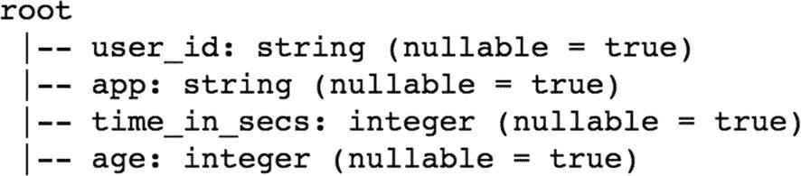

### 操作

一旦我们有了可用的流数据帧，我们就可以应用多种转换，以便根据特定的需求获得不同的结果。在本例中，我们将看到聚合、排序、过滤器等。首先，简单地统计数据帧中每个应用程序的记录。我们可以像在静态数据帧上应用转换一样编写命令。

```py
[In]: app_count=data.groupBy('app').count()

```

为了查看结果，除了所需的位置之外，我们还必须提到输出模式。在本例中，我们将结果写入内存，但也可以写入控制台、特定云存储或任何其他位置。我们还给出完整的输出模式，以便每次都在整个数据帧上写入结果。最后，我们使用一个简单的 Spark SQL 命令来查看我们在流数据帧上执行的查询的输出，方法是将其转换为 Pandas 数据帧。

```py
[In]:query=(app_count.writeStream.queryName('count_query').outputMode('complete').format('memory').start())
[In]: spark.sql("select * from count_query ").toPandas().head(5)

[Out]:

```

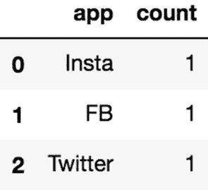

在本例中，编写了一个查询来仅过滤脸书(FB)应用程序的记录。然后计算每个用户在 FB 应用上花费的平均时间。

```py
[In]: fb_data=data.filter(data['app']=='FB')
[In]: fb_avg_time=fb_data.groupBy('user_id').agg(F.avg("time_in_secs"))
[In]:fb_query=(fb_avg_time.writeStream.queryName('fb_query').outputMode('complete').format('memory').start())
[In]: spark.sql("select * from fb_query ").toPandas().head(5)
[Out]:

```


因为本地文件夹中当前只有一个 dataframe，所以我们得到了一个用户访问 FB 的输出和花费的时间。为了查看更多的相对结果，让我们将更多的自生成数据推送到文件夹中。

```py
[In]:df_2=spark.createDataFrame([("XN203",'FB',100,30),("XN201",'FB',10,19),("XN202",'FB',2000,45)],["user_id","app","time_in_secs","age"]).write.csv("csv_folder",mode='append')

```

我们现在可以有把握地假设 Spark 结构化流已经读取了新记录，并将它们附加到流数据帧中，因此，同一查询的新结果将与上一个不同。

```py
[In]: spark.sql("select * from fb_query ").toPandas().head(5)
[Out]:

```

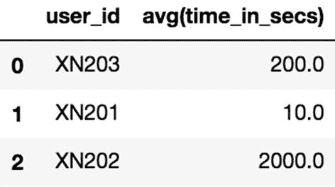

现在，我们有了所有用户使用 FB 应用的平均时间。让我们再往文件夹里添加一些记录。

```py
[In]:df_3=spark.createDataFrame([("XN203",'FB',500,30),("XN201",'Insta',30,19),("XN202",'Twitter',100,45)],["user_id","app","time_in_secs","age"]).write.csv("csv_folder",mode='append')

[In]: spark.sql("select * from fb_query ").toPandas().head(5)
[Out]:

```

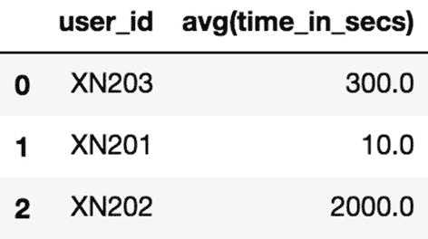

在本例中，我们看到了本地文件夹中现有数据帧上的查询聚合和排序。我们按应用程序对所有记录进行分组，并按降序计算每个应用程序花费的总时间。

```py
[In]:app_df=data.groupBy('app').agg(F.sum('time_in_secs').alias('total_time')).orderBy('total_time',ascending=False)
[In]:app_query=(app_df.writeStream.queryName('app_wise_query').outputMode('complete').format('memory').start())

[In]: spark.sql("select * from app_wise_query ").toPandas().head(5)
[Out]:

```

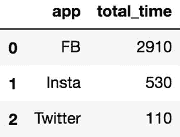

我们现在有了每个应用程序的结果，以及所有用户在相应应用程序上花费的总时间，使用的是流数据帧。让我们再添加一次新记录，并查看相同查询的修改结果。

```py
[In]:df_4=spark.createDataFrame([("XN203",'FB',500,30),("XN201",'Insta',30,19),("XN202",'Twitter',100,45)],["user_id","app","time_in_secs","age"]).write.csv("csv_folder",mode='append')

[In]: spark.sql("select * from app_wise_query ").toPandas().head(5)
[Out]:

```

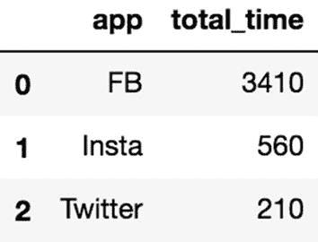

在本例中，我们试图找出数据中每个应用的平均用户年龄。我们简单地将数据按应用程序分组，取所有用户的平均年龄，并按降序排列结果。

```py
[In]:age_df=data.groupBy('app').agg(F.avg('age').alias('mean_age')).orderBy('mean_age',ascending=False)

[In]:age_query=(age_df.writeStream.queryName('age_query').outputMode('complete').format('memory').start())

[In]:df_5=spark.createDataFrame([("XN210",'FB',500,50),("XN255",'Insta',30,23),("XN222",'Twitter',100,30)],["user_id","app","time_in_secs","age"]).write.csv("csv_folder",mode='append')

[In]: spark.sql("select * from age_query ").toPandas().head(5)

[Out]:

```


因此，在前面的示例中，我们看到了如何使用 Spark 结构化流来读取传入数据，并创建流数据帧来应用各种转换并将结果写入特定位置。流数据的一个更常见的需求是连接。

### 连接

有时我们必须将输入数据与批量数据合并，以使其更加全面。在以下示例中，我们将了解如何将传入数据(流数据帧)与包含应用程序全名的静态数据帧合并。让我们创建一个新的静态数据框架，它有两列(应用程序和全名)。

```py
 [In]:app_df=spark.createDataFrame([('FB','FACEBOOK'),('Insta','INSTAGRAM'),('Twitter','TWITTER')],["app", "full_name"])
[In]: app_df.show()
[Out]:

```

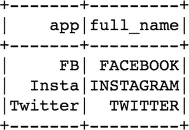

现在我们已经有了一个静态数据帧，我们可以简单地编写一个新的查询来连接到目前为止我们一直在处理的流数据帧(data ),并将它们合并到一个应用程序列中。

```py
[In]: app_stream_df=data.join(app_df,'app')
[In]:join_query=(app_stream_df.writeStream.queryName('join_query').outputMode('append').format('memory').start())
[In]: spark.sql("select * from join_query ").toPandas().head(50)
[Out]:

```

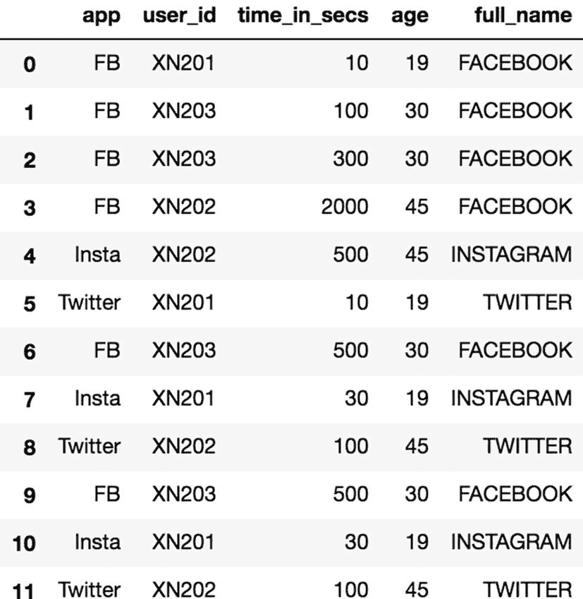

如您所见，我们现在在流数据帧中也有了额外的列(`full_name`)。

## 结构化流替代方案

自从 Spark 结构化流在 2016 年推出以来，它迅速获得了开发人员社区的关注。然而，话虽如此，Spark 的结构化流媒体还有其他一些强大的替代方案。其中之一是 Flink，它提供类似的功能，在流数据处理方面具有出色的延迟率。另一种选择是谷歌的 Beam，它适用于有限的情况。

Spark 的结构化流相对于替代方案的核心优势是 Spark 作为一个整体提供的成熟框架，包括批处理(批处理或流的代码没有重大差异)和机器学习库。结构化流的另一个伟大特性是它的 Spark SQL API，这对于许多用户来说是非常舒适的。希望 Spark 的新版本能包含更多的结构化流特性，比如流连接。选择取决于应用程序的特定需求，以及找到最佳的替代方案使其具有可伸缩性、容错性和健壮性。

## 结论

在本章中，确定了批处理数据和流式数据之间的基本区别。然后讨论了 Spark 的流 API 是如何在过去几年中发展成为构建流数据应用程序的默认框架的。然后提供了如何使用 Spark 的结构化流 API 读取流数据(本地文件夹)以及如何保存聚合结果的示例。