# 五、MLlib：机器学习库

根据您的需求，有多种方法可以构建机器学习模型，使用预先存在的库，如 Python 的 scikit-learn、R 和 TensorFlow。然而，让 Spark 的机器学习库(MLlib)真正有用的是它能够大规模训练模型，并提供分布式训练。这使得用户除了使用 Spark 框架本身预处理和准备工作流之外，还可以在庞大的数据集上快速构建模型。

本章重点介绍如何利用 MLlib 构建和应用各种机器学习模型。第一部分侧重于基本统计数据，使用 MLlib，然后构建管道来创建要素和其他转换。本章的最后一部分讨论了使用 MLlib 构建机器学习分类模型。

让我们首先回顾一下如何使用 Spark 的 MLlib 来计算数据分析的一些基本统计指标。您将看到如何计算两个数值变量之间的相关性，以及如何使用卡方检验来确定两个分类变量之间是否存在显著的关系。

## 计算相关性

相关性是确定两个连续变量之间是否存在任何关系的重要指标。相关性可以是正的，也可以是负的，如图 [5-1](#Fig1) 所示。两个变量之间也可能没有相关性。

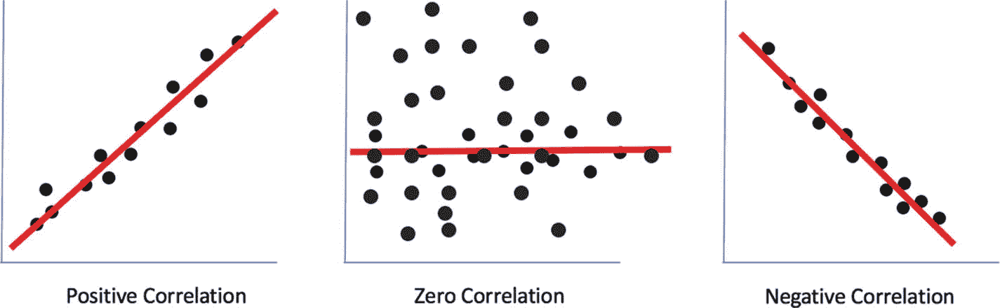

图 5-1

相关性的类型

使用 Spark MLlib 很容易计算相关性。它提供了计算两种相关系数的选项:

1.  皮尔逊

2.  斯皮尔曼

使用 Spark，让我们取一个样本数据帧，来计算相关系数。这个数据集只包含两个数字列(年经验和薪水)。第一步是创建 Spark 上下文，以便使用 Spark。

```py
[In]: from pyspark.sql import SparkSession
[In]: spark=SparkSession.builder.appName('basic_stats').getOrCreate()
[In]: df=spark.read.csv('corr_data.csv',header=True,inferSchema=True)
[In]: df.count()
[Out]: 30
[In]: df.show()
[Out]:

```

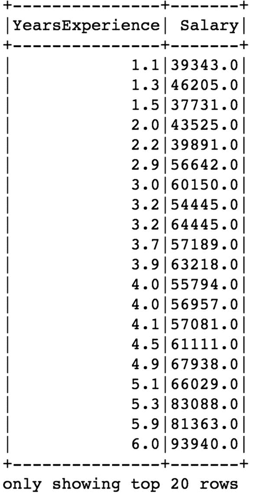

如您所见，这个数据帧中只有 30 条记录。接下来，我们使用 VectorAssembler 将这两列组合成一个密集的向量表示，以便计算相关系数。我们将新的密集矢量命名为“特征”

```py
[In]: from pyspark.ml.feature import VectorAssembler
[In]: assembler = VectorAssembler(inputCols=df.columns, outputCol="features")
[In]: df_new=assembler.transform(df)
[In]: df_new.show()
[Out]:

```

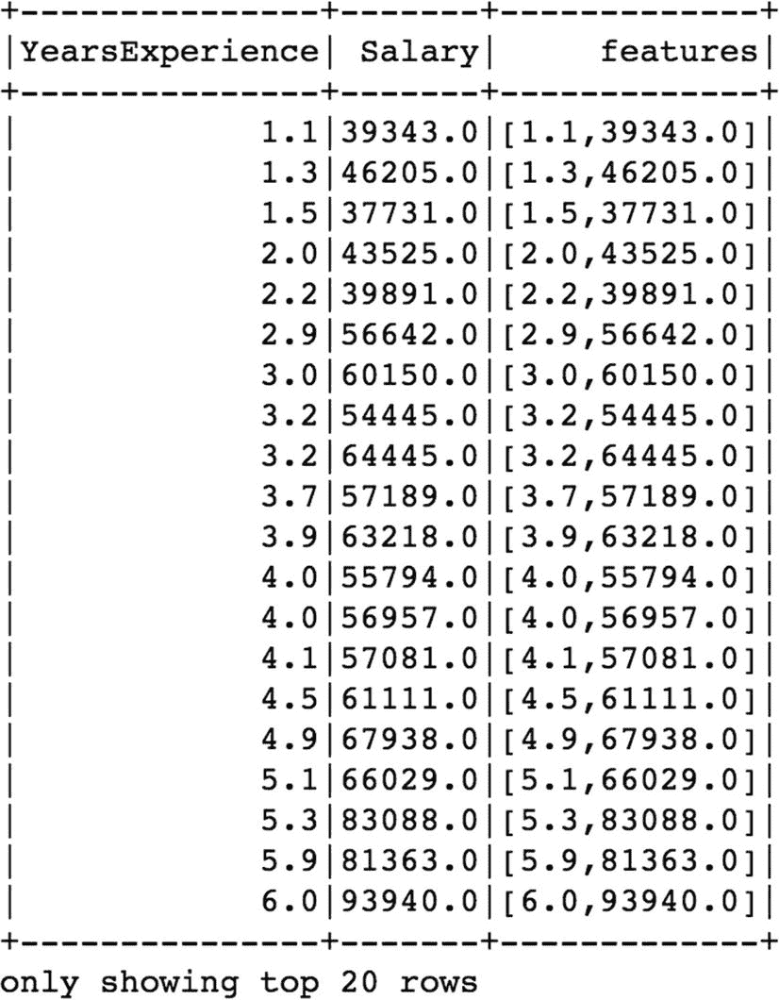

```py
Pearson Coefficient of Correlation

[In]: from pyspark.ml.stat import Correlation
[In]: pearson_corr = Correlation.corr(df_new,'features')
[in]: pearson_corr.show(2,False)
[Out]:

```

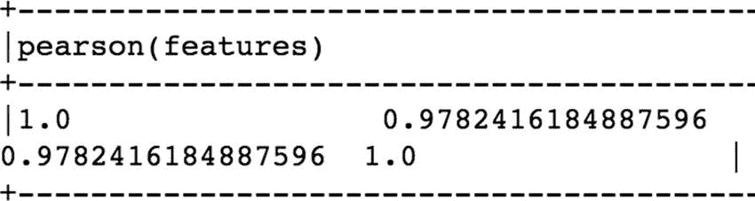

```py
Spearman Coefficient of Correlation

[In]: spearman_corr=Correlation.corr(df_new,'features',"spearman")
[In]: spearman_corr.show(2,False)
[Out]:

```

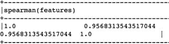

### 卡方检验

相关性是关于数字特征之间的关系，而其他类型的变量也可以是分类的。验证两个分类变量之间关系的方法之一是通过卡方检验。让我们考虑一个例子，来理解它是如何工作的。表 [5-1](#Tab1) 中总结了一些编造的数据。

表 5-1

抽样资料

<colgroup><col class="tcol1 align-left"> <col class="tcol2 align-left"> <col class="tcol3 align-left"></colgroup> 
|   | 

吸烟者

 | 

不抽烟的人

 |
| --- | --- | --- |
| 青少年 | Thirty-two | Twelve |
| 年纪轻的 | Fourteen | Twenty-two |
| 老的 | six | nine |

它包含三类人(青少年、年轻人和老年人)，并分为两类(吸烟者和不吸烟者)。下一步，我们计算每个类别和桶的总人数，如表 [5-2](#Tab2) 所示。这也称为列联表。

表 5-2

相依表

<colgroup><col class="tcol1 align-left"> <col class="tcol2 align-left"> <col class="tcol3 align-left"> <col class="tcol4 align-left"></colgroup> 
|   | 

吸烟者

 | 

不抽烟的人

 | 

总数

 |
| --- | --- | --- | --- |
| 青少年 | Thirty-two | Twelve | forty-four |
| 年纪轻的 | Fourteen | Twenty-two | Thirty-six |
| 老的 | six | nine | Fifteen |
|   | fifty-two | Forty-three | Ninety-five |

下一步是根据表中的实际值计算期望值。预期值通过以下公式计算:

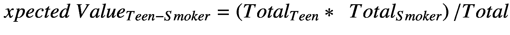

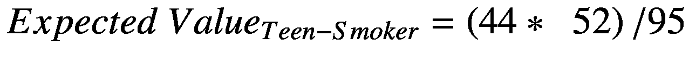

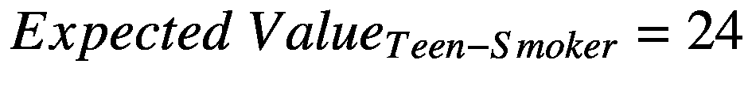

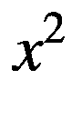

类似地，我们针对两个桶计算每个类别的所有期望值，如表 [5-3](#Tab3) 所示。

表 5-3

期望值

<colgroup><col class="tcol1 align-left"> <col class="tcol2 align-left"> <col class="tcol3 align-left"></colgroup> 
|   | 

吸烟者

 | 

不抽烟的人

 |
| --- | --- | --- |
| 青少年 | Twenty-four | Twenty |
| 年纪轻的 | Twenty | Sixteen |
| 老的 | eight | seven |

下一步是通过比较实际值和期望值，得出卡方表。卡方表值通过以下公式计算:

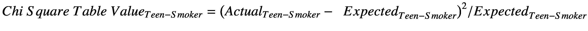

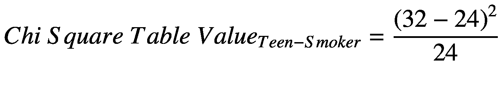

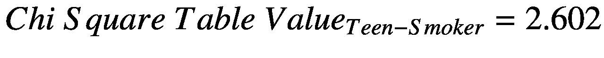

现在我们有了卡方值，我们得到每个桶(吸烟者和不吸烟者)的总数，如表 [5-4](#Tab4) 所示。

表 5-4

卡方总数

<colgroup><col class="tcol1 align-left"> <col class="tcol2 align-left"> <col class="tcol3 align-left"></colgroup> 
|   | 

吸烟者

 | 

不抽烟的人

 |
| --- | --- | --- |
| 青少年 | Two point six zero two | Three point one four six |
| 年纪轻的 | One point six five two | One point nine nine eight |
| 老的 | Zero point five nine five | Zero point seven two |
| 卡方值 | Four point eight four nine | Five point eight six four |

总体卡方值为 10.7 (4.84 + 5.86)。然后，我们在卡方表中查找自由度(3-1)∑(2-1)= 2 的值 10.7，并找到相应的 p 值。如果 p 值小于 0.05，这表明两个变量之间有统计学上的显著关系。让我们尝试使用 Spark 运行卡方测试。这里我们有一个包含三列的样本数据集，但是我们将尝试确定婚姻和住房列之间是否有任何关系(两者本质上都是分类的)。

```py
[In]: df=spark.read.csv('chi_sq.csv',inferSchema=True,header=True)
[In]: df.count()
[Out]: 9501

[In]: df.show()
[Out]:

```

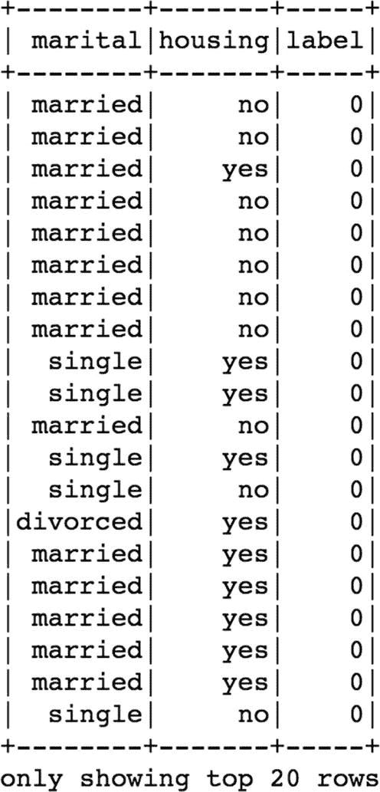

```py
[In]: from pyspark.ml.feature import StringIndexer
[In]: marital_indexer = StringIndexer(inputCol="marital", outputCol="marital_num").fit(df)
[In]: df = marital_indexer.transform(df)

[In]: from pyspark.ml.feature import OneHotEncoder
[In]: marital_encoder = OneHotEncoder(inputCol="marital_num", outputCol="marital_vector")
[In]: df = marital_encoder.transform(df)

[In]: housing_indexer = StringIndexer(inputCol="housing", outputCol="housing_num").fit(df)
[In]: df = housing_indexer.transform(df)

[In]: housing_encoder = OneHotEncoder(inputCol="housing_num", outputCol="housing_vector")
[In]: df = housing_encoder.transform(df)

[In]: df.show()

[Out]:

```

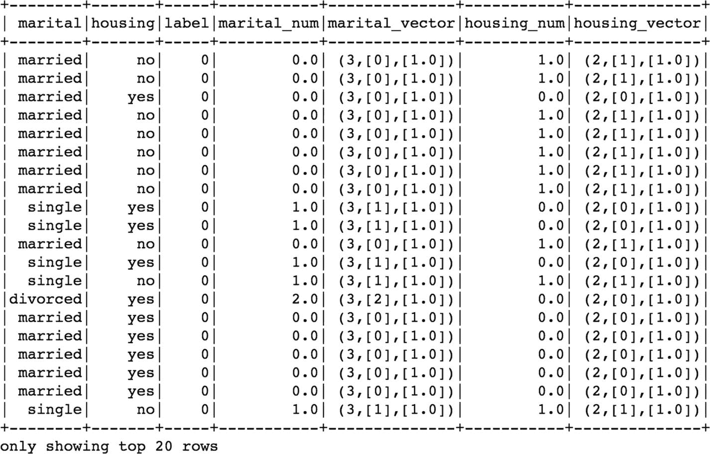

```py
[In]: df_assembler = VectorAssembler(inputCols=['marital_vector','housing_vector'], outputCol="features")
[In]: df = df_assembler.transform(df)

[In]: df.show()
[Out]:

```

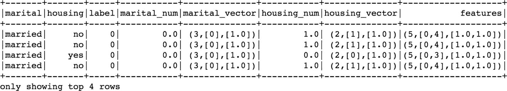

```py
[In]: chi_sq = ChiSquareTest.test(df, "features", "label").head()

[In]: print("pValues: " + str(chi_sq.pValues))

[Out]:
pValues: [0.0,0.0,0.06036632491,0.0,3.56381590905e-14]

```

## 转换

在这一节中，我将介绍数据预处理和特征工程所需的一些常见转换。这些有助于以正确的方式为应用机器学习准备数据。

### 二值化器

我们可以通过使用 MLlib 中的二进制化器将数值/连续变量转换为分类特征(0/1)。我们必须声明阈值，以便将数字特征转换为二进制特征。任何高于阈值的值都将被转换为 1，低于或等于阈值的值将变为 0。让我们对转换样本数据集的标签列应用二进制化器。

```py
[In]: df=spark.read.csv('transformations.csv',header=True,inferSchema=True)
[In]: df.count()
[Out]: 6366

[In]: df.show()
[Out]:

```

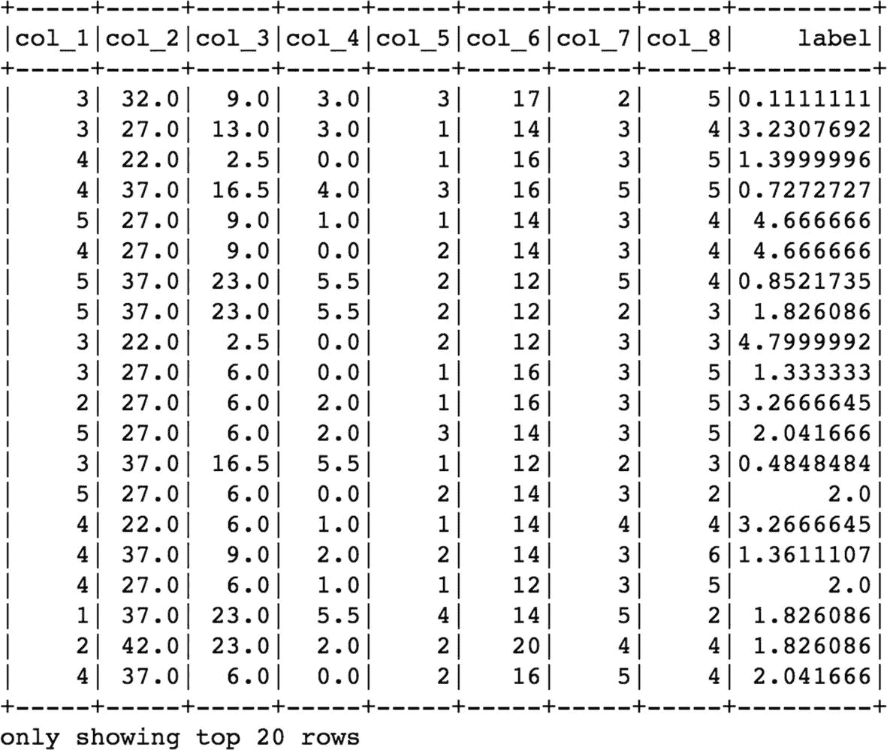

现在我们从 Spark 库中导入二进制函数。

```py
[In]: from pyspark.ml.feature import Binarizer
[In]: binarizer = Binarizer(threshold=0.99, inputCol="label", outputCol="binarized_label")

[In]: new_df=binarizer.transform(df)

[In]: new_df.show()
[Out]:

```

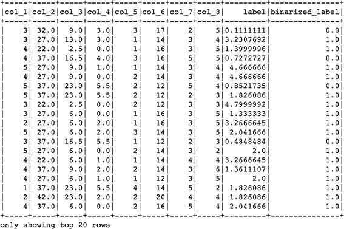

### 主成分分析

大多数时候，我们处理多维数据，如果不可视化这些数据，有时很难理解底层模式。主成分分析(PCA)是一种转换技术，允许您减少数据的维度，同时尽可能保持数据的变化不变。让我们回顾一下在之前使用的相同数据上应用 PCA 的步骤。

```py
[In]: from pyspark.ml.feature import PCA
[In]: assembler = VectorAssembler(inputCols=[col for col in df.columns if col !='label'], outputCol="features")
[In]: df_new=assembler.transform(df)
[In]: df_new.show()

[Out]:

```

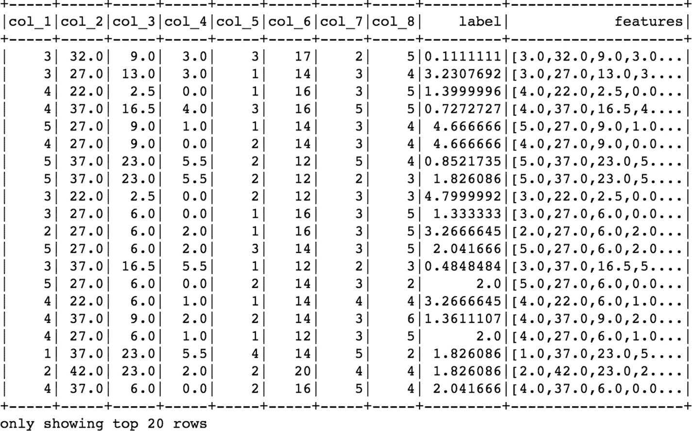

`k`代表 PCA 后数据的降维数。

```py
[In]: pca = PCA(k=2, inputCol="features", outputCol="pca_features")
[In]: pca_model=pca.fit(df_new)

[In]: pca_comp = pca_model.transform(df_new).select("pca_features")
[In]: pca_comp.show(truncate=False)
[out]:

```

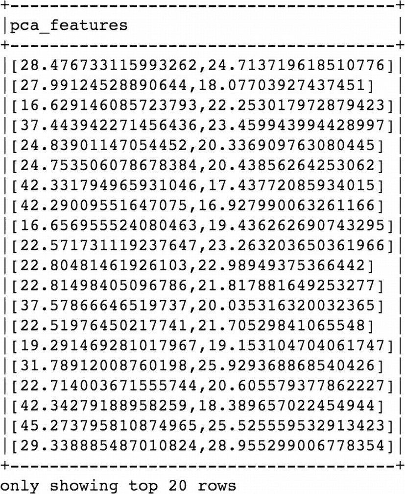

如您所见，我们已经对数据应用了主成分分析(除了“标签”列),并将维度数量减少到了两个。

### 标准化者

标准化是指以这样一种方式转换数据，即新的标准化数据的平均值为 0，标准偏差为 1。使用以下公式进行归一化:

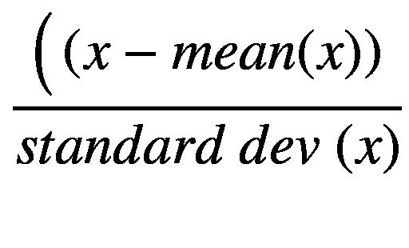

要在 Spark 中使用 Normalizer，我们只需将它应用于所需的列。这里，我们将它应用于“特性”列。

```py
[In]: from pyspark.ml.feature import Normalizer
[In]: normalizer = Normalizer(inputCol="features", outputCol="norm_features", p=1.0)
[In]: normalised_l1_data = normalizer.transform(df_new)
[In]: normalised_l1_data.select('norm_features').show(truncate=False)
[Out]:

```

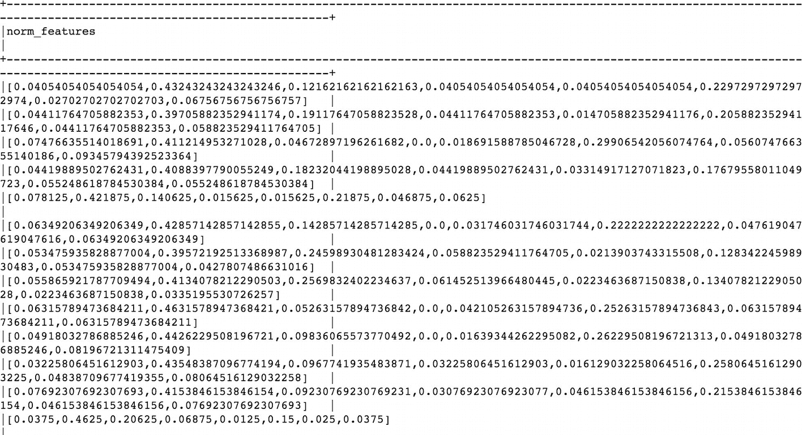

标准化有助于标准化输入数据，有时还能提高机器学习模型的性能。

### 标准缩放

缩放是归一化数据的另一种技术，使得值在特定范围内，例如[0，1]。许多机器学习算法对输入数据的比例很敏感，因此，应用比例变得至关重要。缩放可以以不同的方式应用，但最基本的方法是使用以下公式:

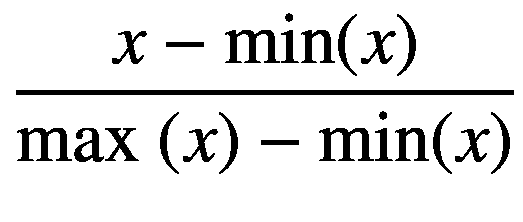

```py
[In]: from pyspark.ml.feature import StandardScaler
[In]: scaler = StandardScaler(inputCol="features", outputCol="scaled_features",
                             withStd=False, withMean=True)

[In]: scaler_model = scaler.fit(df_new)

[In]: scaled_data = scaler_model.transform(df_new)
[In]: scaled_data.select('scaled_features').show(truncate=False)

[Out]:

```

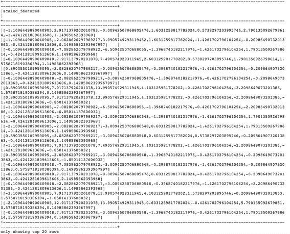

### 最小-最大缩放

最小-最大缩放是标准缩放的另一个版本，因为它允许您在特定限制(通常在 0 和 1 之间)之间重新缩放特征值。您也可以使用最小-最大缩放在 0 和 1 之间重新缩放值。

```py
[In]: from pyspark.ml.feature import MinMaxScaler
[In]: mm_scaler = MinMaxScaler(inputCol="features", outputCol="mm_scaled_features")

[In]: mm_scaler_model = mm_scaler.fit(df_new)

[In]: rescaled_df = mm_scaler_model.transform(df_new)

[In]: rescaled_df.select("features", "mm_scaled_features").show()
[Out]:

```

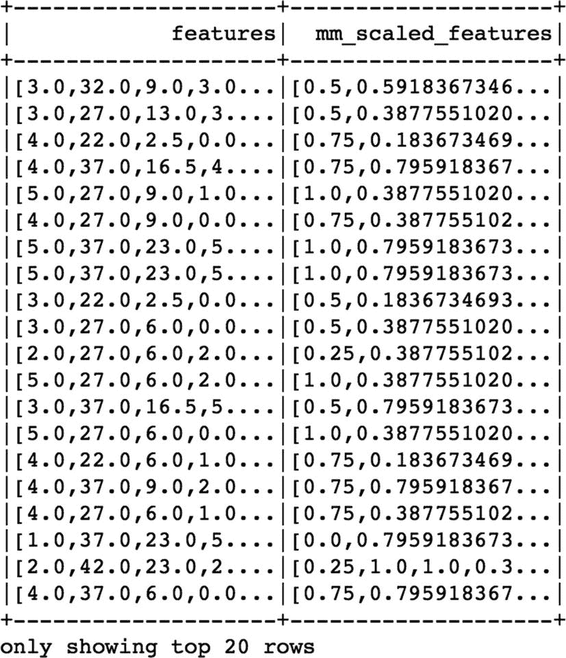

要访问最小值和最大值，我们可以使用`getMin`和`getMax`函数。为了改变范围，我们可以通过创建一个 scaler 对象来定义新的最小值和最大值。这里我们在-1 和 1 之间重新调整值。

```py
[In]: mm_scaler.getMin()
[Out]: 0.0

[In]: mm_scaler.getMax()
[Out]: 1.0

Alter the min max values

[In]: mm_scaler = MinMaxScaler(inputCol="features", outputCol="mm_scaled_features”, min=-1,max=1)

[In]: mm_scaler_model = mm_scaler.fit(df_new)

[In]: rescaled_df = mm_scaler_model.transform(df_new)

[In]: rescaled_df.select("features", "mm_scaled_features").show()
[Out]: 

```

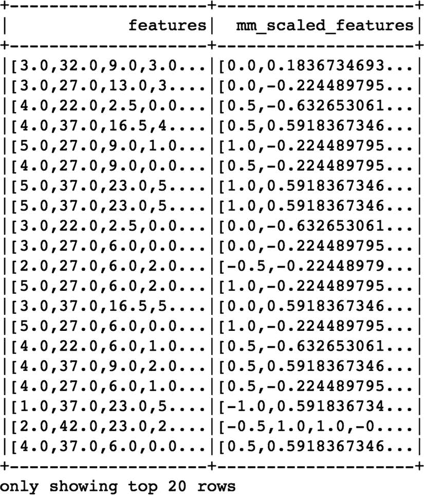

### MaxAbsScaler

MaxAbsScaler 与标准缩放工具略有不同，因为它在-1 和 1 之间重新缩放每个要素值。但是，它不会移动数据的中心，因此不会影响任何稀疏性。

```py
[In]: from pyspark.ml.feature import MaxAbsScaler
[In]: mxabs_scaler = MaxAbsScaler(inputCol="features", outputCol="mxabs_features")

[In]: mxabs_scaler_model = mxabs_scaler.fit(df_new)

[In]: rescaled_df = mxabs_scaler_model.transform(df_new)

[In]: rescaled_df.select("features", "mxabs_features").show()

[Out]: 

```

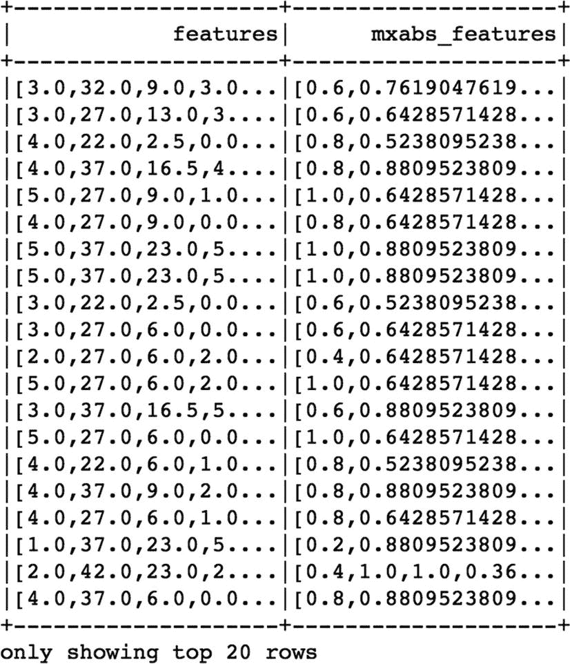

### 扔掉

当您想要将连续要素分组到不同类别中时，宁滨(或称分桶)非常有用。你可以在 Spark 的 Bucketizer 的帮助下做宁滨。让我们尝试将 target (label)列分成多个箱。可以相应地进行分割，但始终建议从负无穷大到正无穷大开始和结束分割，以避免越界错误(尤其是在要素的最大值和最小值未知的情况下)。

```py
[In]: from pyspark.ml.feature import Bucketizer

[In]: df.show(10,False)
[Out]:

```

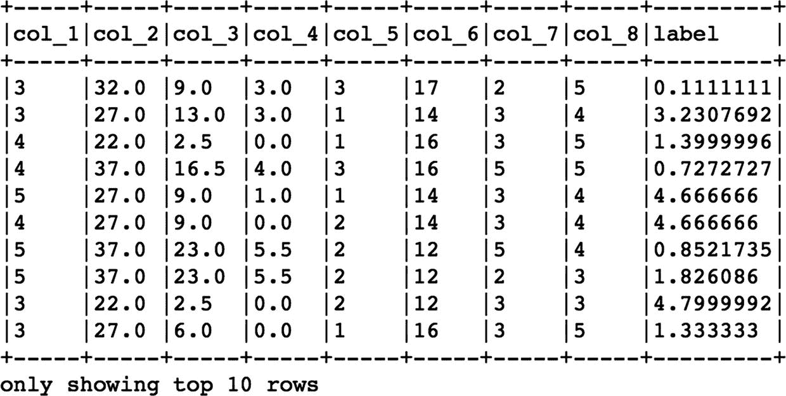

我们现在定义拆分发生的端点，并创建一个包含仓位的新列。

```py
[In]: splits = [0.0,1.0,2.0,3.0,4.0,5.0,float("inf")]

[In]: bucketizer = Bucketizer(splits=splits, inputCol="label", outputCol="label_bins")

[In]: binned_df = bucketizer.transform(df)

[In]: binned_df.select(['label','label_bins']).show(10,False)
[Out]:

```

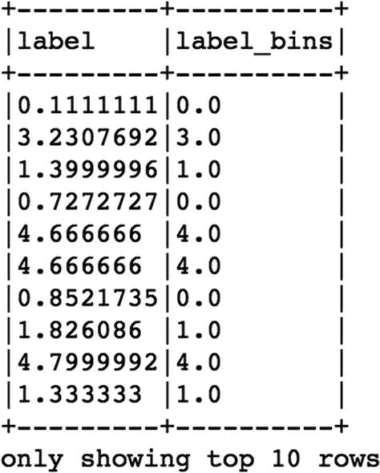

正如您所看到的，所有的值都被放在一个容器中，我们可以使用`groupby`来验证总容器(6)。我们还可以使用`getSplit`函数获得 bin 值。

```py
[In]: binned_df.groupBy('label_bins').count().show()
[Out]:

```

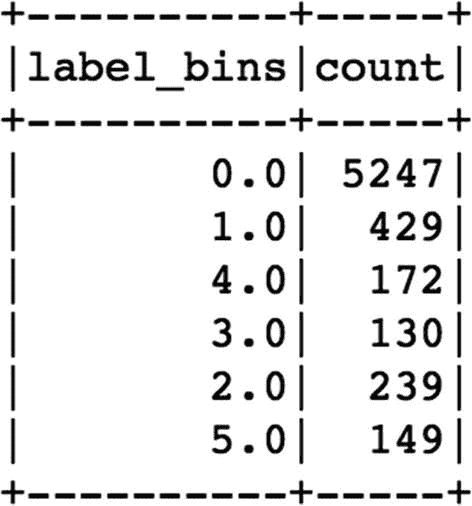

```py
[In]: print(bucketizer.getSplits())-1
[Out]: 6 

```

## 构建分类模型

在本节中，您将看到我们如何使用 Spark 的机器学习库(MLlib)来构建分类模型。因为在本书的后面有专门的章节介绍监督和非监督 ML 模型，所以在这一节中，我不会深入介绍细节，而是重点介绍使用 MLlib 构建模型的整个过程。对于我们的例子，我们将使用 Giulio Palombo 在他的书*数据科学带回家的挑战*中提供的数据集启发的数据。该数据集包含一些申请新银行贷款的客户的信息，以及他们是否会违约。我们将构建一个二元分类模型，根据从模型中收集的知识来预测特定客户是否应该获得贷款。以下核心步骤用于构建分类模型:

1.  加载数据集。

2.  执行探索性数据分析。

3.  执行所需的数据转换。

4.  将数据分成训练和测试子集。

5.  根据训练数据训练和评估基线模型。

6.  执行超参数调整。

7.  用最佳参数建立最终模型。

### 步骤 1:加载数据集

第一步，我们初始化 Spark 对象，使用 Spark 并加载数据集来创建 Spark 数据帧。

```py
[In]: from pyspark.sql import SparkSession
[In]: spark=SparkSession.builder.appName('binary_class').getOrCreate()

[In]: df=spark.read.csv('classification_data.csv',inferSchema=True,header=True)

```

### 步骤 2:探索数据框架

在这一步中，我们探索数据的不同方面和数据框架中的各个列。

```py
[In]: print((df.count(),len(df.columns)))

[Out]: (46751, 12)

```

数据帧包含 12 列和超过 46，000 条记录。我们可以使用`printSchema`函数查看所有的列和数据类型。

```py
[In]: df.printSchema()

[Out]:

```

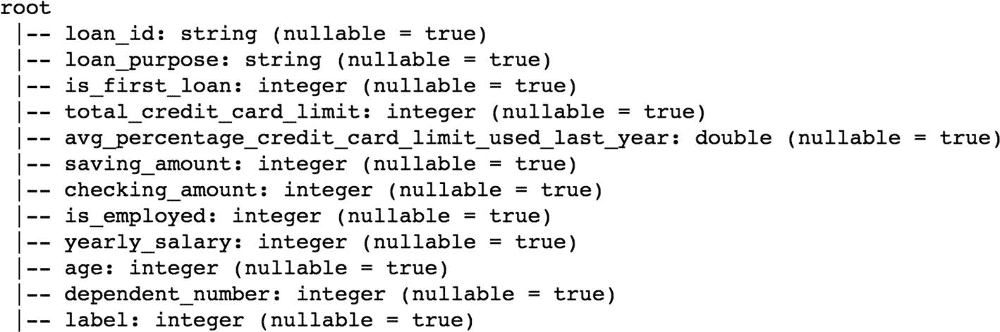

我们可以使用`show`或`display`函数来查看数据帧的前几行。

```py
[In]: df.show(5)
[Out]:

```

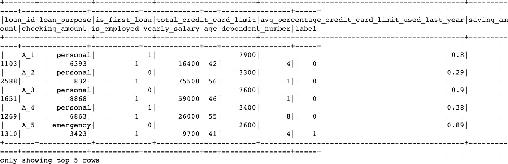

我们可以用`groupby`来统计目标列(标签)中正负事件的个数。

```py
[In]: df.groupBy('loan_label).count().show()
[Out]:

```

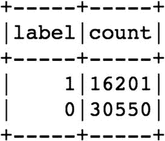

如你所见，超过三分之一的客户拖欠贷款。为了更好地理解数据，我们继续探索性的数据分析。在下面的结果中，我们可以看到，人们更倾向于申请贷款，主要是因为财产、运营和个人原因。

```py
[In]: df.groupBy('loan_purpose').count().show()

[Out]:

```

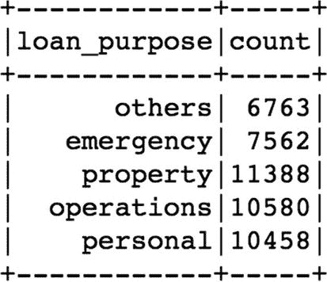

客户申请房产贷款的次数似乎比任何其他类型的贷款都多。

### 步骤 3:数据转换

因为 dataframe 中的所有变量都是数字，除了贷款目的，我们必须使用`OneHotEncoder`将它们转换成数字形式。

```py
[In]: from pyspark.ml.feature import OneHotEncoder, StringIndexer, VectorAssembler

[In]: loan_purpose_indexer = StringIndexer(inputCol="loan_purpose", outputCol="loan_index").fit(df)
[In]: df = loan_purpose_indexer.transform(df)
[In]: loan_encoder = OneHotEncoder(inputCol="loan_index", outputCol="loan_purpose_vec")
[In]: df = loan_encoder.transform(df)

[In]: df.select(['loan_purpose','loan_index','loan_purpose_vec']).show(3,False)

```

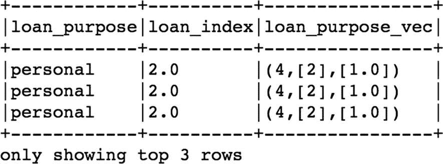

既然我们已经将原始贷款目的特征转换成了矢量化形式，我们可以使用`VectorAssembler`来创建一个用于模型训练的单特征向量。

```py
[In]: from pyspark.ml.feature import VectorAssembler

[In]: df_assembler = VectorAssembler(inputCols=['is_first_loan',
 'total_credit_card_limit',
 'avg_percentage_credit_card_limit_used_last_year',
 'saving_amount',
 'checking_amount',
 'is_employed',
 'yearly_salary',
 'age',
 'dependent_number',
 'loan_purpose_vec'], outputCol="features")
[In]: df = df_assembler.transform(df)

[In]: df.select(['features','label]).show(10,False)

[Out]:

```

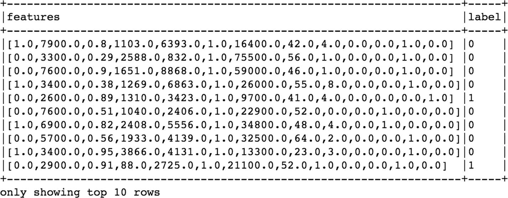

我们现在创建一个只有两列的新数据框架:要素和标注。

```py
[In]: model_df=df.select(['features','label'])

```

### 步骤 4:拆分成训练和测试数据

我们现在将全部数据随机分成训练集和测试集，以避免训练中的任何偏差。

```py
[In]: training_df,test_df=model_df.randomSplit([0.75,0.25])

```

### 第五步:模特训练

既然我们的训练和测试数据已经准备好了，我们可以继续使用默认参数训练基线模型，如逻辑回归，并检查它在训练和测试数据上的性能。

```py
[In]: from pyspark.ml.classification import LogisticRegression

[In]: log_reg=LogisticRegression().fit(training_df)

[In]: lr_summary=log_reg.summary

[In]: lr_summary.accuracy
[Out]: 0.8939298586875679
[In]: lr_summary.areaUnderROC
0.9587456481363935

[In]: print(lr_summary.precisionByLabel)

[Out]: [0.9233245149911816, 0.8396318618667535]

[In]: print(lr_summary.recallByLabel)

[Out]: [0.914054997817547, 0.8556606905710491]

[In]: predictions = log_reg.transform(test_df)

[In]: predictions.show(10) 

```

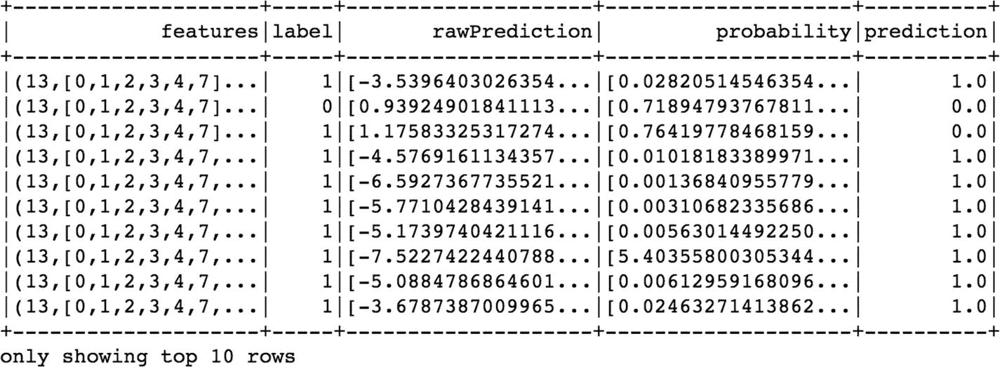

```py
[In]: model_predictions = log_reg.transform(test_df)

[In]: model_predictions = log_reg.evaluate(test_df) 

[In]: model_predictions.accuracy
[Out]: 0.8945984906300347

[In]: model_predictions.areaUnderROC
[Out]: 0.9594316478468224

[In]: print(model_predictions.recallByLabel)
[Out]: [0.9129581151832461, 0.8608235010835541]

[In]: print(model_predictions.precisionByLabel)
[Out]: [0.9234741162452006, 0.8431603773584906] 

```

### 步骤 6:超参数调整

因此，使用基线模型，我们在测试数据上获得了几乎 89%的准确率，以及 0.86 的召回率。现在我们已经建立了基线模型，我们可以建立一个更复杂的模型，例如随机森林模型，这是一种可以提高预测准确性的集合方法。您将看到我们如何调整该模型，以找到最佳的超参数。

```py
[In]: from pyspark.ml.classification import RandomForestClassifier

```

首先，我们使用默认的超参数构建一个随机森林模型，然后根据训练数据对其进行训练，以便可以根据测试数据进行预测。

```py
[In]: rf = RandomForestClassifier()
[In]: rf_model = rf.fit(training_df)

[In]: model_predictions = rf_model.transform(test_df)

```

使用交叉验证技术，我们现在试图得出这个模型的最佳超参数。

```py
[In]: from pyspark.ml.tuning import ParamGridBuilder, CrossValidator
[In]: from pyspark.ml.evaluation import BinaryClassificationEvaluator

[In]: evaluator = BinaryClassificationEvaluator()

[In]: rf = RandomForestClassifier()

[In]: paramGrid = (ParamGridBuilder()
             .addGrid(rf.maxDepth, [5,10,20,25,30])
             .addGrid(rf.maxBins, [20,30,40 ])
             .addGrid(rf.numTrees, [5, 20,50])
             .build())

```

我们用不同超参数(`maxDepth`、`maxBins`、`numTrees`)的所有可能值来定义参数网格，并应用交叉验证来确定最佳模型。在这种情况下，我们使用五重交叉验证(四部分用于训练，一部分用于测试)。

```py
[In]: cv = CrossValidator(estimator=rf, estimatorParamMaps=paramGrid, evaluator=evaluator, numFolds=5)
[In]: cv_model = cv.fit(training_df)

```

然后，我们访问最佳模型参数，并在测试数据集上使用它们来进行预测。

### 第七步:最佳模式

```py
[In]: best_rf_model = cv_model.bestModel
[In]: model_predictions = best_rf_model.transform(test_df)

[In]:true_pos=model_predictions.filter(model_predictions['label']==1).filter(model_predictions['prediction']==1).count()

[In]:actual_pos=model_predictions.filter(model_predictions['label']==1).count()

[In]:pred_pos=model_predictions.filter(model_predictions['prediction']==1).count()
[In]: recall_rate=float(true_pos)/(actual_pos)
[In]: print(recall_rate)

[Out]: 0.912426614481409

```

从前面可以看出，与基线方法(逻辑回归)相比，使用具有最佳超参数的随机森林模型，召回率有所提高。

## 结论

本章回顾了使用 PySpark 的一些转换技术和计算汇总统计数据的方法。您看到了如何从头开始构建机器学习模型，以及如何调整超参数，为模型选择最佳参数。