# 四、机器学习算法

> *自然不觉得必须坚持一种数学上精确的算法；事实上，大自然很可能无法拘泥于一种算法。*
> 
> —玛格丽特·韦特海姆

你不需要有代数和统计的背景就可以开始机器学习。前一章介绍了关键的基础原则。不抱幻想；数学是机器学习的重要组成部分。数学是理解算法如何工作的关键，也是理解为什么从头编写机器学习项目是提高数学和统计技能的好方法的关键。

不理解算法背后的基本原理会导致对方法的有限理解或对算法的有限解释。如果没有别的，理解算法所基于的数学原理是有用的，从而最好地理解哪种机器学习技术是最合适的。

在公共领域有大量的机器学习算法。许多是几个突出主题的变体(通常速度更快或计算成本更低)。学习者是任何机器学习算法的核心，该算法试图在训练和测试数据上最小化成本函数，也称为误差函数或损失函数。

您的许多机器学习项目将使用流行库中的已定义方法，如 numpy、pandas、Matplotlib、SciPy、scikit-learn、scrapy、NLTK(自然语言工具包)等等。

最常见的机器学习任务是分类、回归和聚类。

几种算法可以用于离散预测的功能，例如 k-最近邻、支持向量机、决策树、贝叶斯网络和线性判别分析。

本章提供了对机器学习算法的全面分析，包括感兴趣的编程库和这种技术的实际应用的例子。

## 定义您的机器学习项目

Tom Mitchell 为机器学习提供了一个简明的定义:“如果一个计算机程序在 T 类任务和性能测量 P 方面的性能(由 P 测量)随着经验 E 而提高，则称该程序从经验 E 中学习”[75]。

这个定义可以用来帮助机器学习项目，帮助我们清楚地思考收集和利用什么数据(E)，手头的任务是什么(T)，以及我们将如何评估结果(P)。

### 任务(T)

任务指的是我们希望机器学习模型做什么。模型学习的功能是任务。这不是指实际学习的任务，而是手头的任务。例如，机器人吸尘器将承担清扫表面的任务。通常一项任务被分解成更小的任务。

### 性能(P)

性能是对机器学习模型能力的定量衡量。使用成本函数来测量性能，成本函数通常计算任务模型的准确性。

性能可以通过误差率来衡量，误差率是模型给出错误输出的例子的比例。该学习方法旨在最小化错误率，理想情况下不会陷入局部最小值或最大值。

### 体验(E)

经验指的是可用的标记数据量以及机器学习模型所需的监督量。

Mitchell 的参考在定义机器学习项目方面证明是有用的。这个定义有助于理解收集(E)所需的数据，它发展成为知识库；需要决定的问题(T)；以及如何评价输出(P)。

例如，预测算法可以被分配任务 T，以基于过去入院的经验数据 E 和它们各自的日期和时间来预测高峰急诊入院。性能度量 P 可以是预测的准确性；随着模型接收到更多的经验数据，它的预测会变得更好。值得注意的是，一个标准不一定决定业绩。

除了预测的准确性之外，高峰入院方法还可以通过预测成本最高或资源最密集的高峰来提供额外的信息。表 [4-1](#Tab1) 给出了任务和经验的例子，以及绩效指标。

表 4-1

通过学习问题的组成部分理解学习问题

<colgroup><col class="tcol1 align-left"> <col class="tcol2 align-left"> <col class="tcol3 align-left"> <col class="tcol4 align-left"></colgroup> 
| 

问题

 | 

工作

 | 

表演

 | 

经验

 |
| --- | --- | --- | --- |
| **学习如何进行外科缝合** | 缝合病人的头部 | 准确性(感知疼痛和/或时间可能是一个特征) | 患者头部的缝合和对性能测量的反馈 |
| **图像识别** | 从图像中识别人的体重 | 重量预测的准确性 | 人的图像及其各自权重的训练数据集 |
| **用于患者药物输送的机械臂** | 将正确的药物放入正确的患者包中 | 正确放置药物的百分比 | 培训示例、真实体验 |
| **预测疾病风险** | 诊断二型糖尿病的可能性 | 正确诊断患者的百分比 | 患者健康记录的训练数据集，预测和反馈的实际经验 |

机器学习被用来回答诸如“我有可能患有二型糖尿病吗？”，“这个图像中的这个是什么物体？”，“我能避开车流吗？”，以及“这份推荐信适合我吗？”

机器学习在每个问题领域都得到了很好的应用，但现实世界问题的复杂性意味着，无论是在医疗保健还是任何其他行业，一种专门的算法在任何时候、任何情况下都不可能完美地工作。

数学中一句常见的格言来自英国统计学家乔治·博克斯:“所有的模型都是错的，但有些是有用的。”机器学习的目的不是做出完美的猜测，因为没有所谓的理想模型。相反，机器学习建立在统计学的基础上，以提供有用、准确的预测，这些预测可以推广到现实世界。

当训练机器学习算法时，训练数据集必须是统计上显著的随机样本。如果不是这样，就有发现不存在的模式或噪音的风险。训练数据的记忆被称为过度拟合。模型会记住训练数据，在训练中表现良好，但在以前未知的数据中表现不佳。同样，如果训练数据太小，模型也可能做出不准确的预测。

机器学习的目标，无论是有监督的还是无监督的，都是泛化——基于过去的经验表现良好的能力。

## 机器学习的公共库

Python 在数据科学和机器学习行业中越来越受欢迎。GitHub 上的所有库都是开源的，GitHub 还提供了流行性和健壮性的指标:

*   GitHub 是基于 Git 版本控制系统的服务。Git 存储数据的方法类似于流。Git 为您的文件拍摄快照，并存储对这些快照的引用。Git 有三种状态:committed、modified 和 staged，分别指本地文件系统中的数据存储、本地文件更改和要提交的标记文件。在使用 GitHub 时，使用元数据的好处是显而易见的。

*   数字 Python，或 numpy，是一个基本的 Python 扩展库。它为向量算术、数学函数、线性代数和随机数生成提供了快速的 N 维数组对象。如果没有这个库，基本数组算术性能会明显变慢。

*   SciPy 是建立在 numpy 基础上的科学处理库。它使线性代数例程以及信号和图像处理，常微分方程方法和特殊功能。

*   Matplotlib 是一个类似数据绘图和可视化技术的 Python 库。Matlab 是用于数据处理的标准工具。然而，Matplotlib 的简单性和实用性有助于 Python 成为 Matlab 的可行替代方案。

*   Pandas 是一个用于数据聚合、数据操作和数据可视化的工具。在 pandas 中，一维数组被称为序列，多维数组被称为数据帧。

*   Scikit-learn 包含图像处理和机器学习技术。这个库建立在 SciPy 之上，支持聚类、分类和回归算法。这包括本章讨论的许多算法，如朴素贝叶斯、决策树、随机森林、k 均值和支持向量机。

*   NLTK，或自然语言工具包，是自然语言处理中使用的库的集合。NLTK 为专家系统奠定了基础，例如标记化、词干化、标记、解析和分类——这些对于情感分析和摘要至关重要。

*   Genism 是一个用于非结构化文本的库。

*   Scrapy 是一个开源的数据挖掘和统计工具，最初是为抓取网站而设计的。

*   TensorFlow 是 Google Alphabet 支持的开源数据计算库，为机器学习进行了优化。它支持多层神经网络和快速训练。TensorFlow 用于谷歌的许多智能平台。

*   Keras 是一个基于 TensorFlow 构建神经网络的库。

## 监督学习算法

在许多监督学习设置中，目标是微调预测函数 f(x)或假设。该学习包括使用数学算法来表示特定域内的输入数据 x。例如，x 可以取一天中时间的值，而 f(x)可以是对特定医院等待时间的预测。

实际上，x 通常代表多个数据点。因此，输入被表示为一个向量。

例如，在前面的示例中，f(x)接受输入 x 作为一周中的时间。在改进预测器时，在数据可用的前提下，我们不仅可以使用天(x <sub>1</sub> ，还可以使用一天中的时间(x <sub>2</sub> )、天气(x <sub>3</sub> )、队列中的位置(x <sub>4</sub> 等等。决定使用哪些输入是机器学习设计过程不可或缺的一部分。

数据集中的每个记录 I 是特征 x(i)的向量。在监督学习的情况下，每个实例也将有一个目标标签 y(i)。该模型用(x(i)，y(i))形式的输入来训练。训练数据集可以表示为{(x(i)，y(I))；i = 1，…，N}，其中 x 代表输入，y 代表输出。

该模型具有简单的形式:

*   f(x) = ax + b，其中 a 和 b 为常数，b 指数据中的噪声。

机器学习旨在找到 a 和 b 的最优值，使得预测 f(x)尽可能准确。学习的方法是归纳法。该模型搜索训练数据集以学习数据中的模式。该模型从一组例子中归纳出一种模式或假设。由于偏差、噪声和方差，机器学习预测模型的输出与函数的实际值不同，如第 [3](03.html) 章所述。

f(x)的优化是通过训练样本进行的。每个训练示例{x <sub>1</sub> … x <sub>n</sub> }都有一个输入值 x_training 和一个对应的输出 y

处理每个示例，并计算已知和正确值 Y(其中 y ∈ Y)与预测值 f(h_training)之间的差异。在处理来自训练数据集的适当数量的样本之后，计算 f(x)的错误率，并且值 a 和 b 被用作提高预测正确性的因子。

这也解决了数据中固有的随机性或噪声，也称为不可约误差。

### 选择正确的功能

谈到特性选择，有两种不同的主要方法。首先是基于数据一般特征的独立评估。属于这种方法的方法被称为过滤方法，因为特征集在模型构建之前被过滤掉。

第二种方法是使用机器学习算法来评估不同的特征子集，并最终选择在分类准确性上具有最佳性能的子集。最后将使用后一种算法来建立预测模型。这类方法被称为包装器方法，因为生成算法包装了整个特征选择过程。

大数定律定理适用于机器学习预测。该定理描述了大量相同实验的结果如何最终收敛或趋于一致。

重复这个过程，直到系统收敛于 a 和 b 的最佳值。这样，机器通过经验学习，并准备好部署。通常，我们关心的是最小化模型的误差或尽可能做出最准确的预测。

在监督机器学习中，有两种主要方法:基于回归的系统和基于分类的系统。

### 分类

分类是通过近似映射函数 f 从一组离散的预定义类别(或标签，y)中确定一个项目(或多个项目，x)的类别的过程。分类算法使用特征(或属性)来确定如何将一个项目分类为至少一个二进制类别或两个或更多个类别。

训练数据作为输入向量提供。输入向量由项目特征的标签组成。例如，一个项目可能会显示以下内容:

```py
{"HbA1c, 7.8%", "Diabetic"} in the form {x_training, output}

```

分类算法就是从数据中学习分类的。分类问题需要标注例子来确定模式；因此，通过所有预测的正确分类示例，可以最好地验证模型的分类准确性。

执行分类的算法包括决策树、朴素贝叶斯、逻辑回归、kNNs(k-最近邻)、支持向量机等等。

分类算法的常见用例如下:

*   基于健康状况建议患者诊断

    简档——也就是说，患者是否患有视网膜病变？

*   为患者推荐最合适的治疗途径

*   定义诊所中一天中接诊高峰的时间段

*   确定患者再次住院的风险

*   对图像进行分类以识别疾病，例如，从照片中确定患者是否超重

### 回归

回归包括预测连续变量的输出。当基于回归的系统预测一个值时，通过评估预测错误的数量来衡量性能。

决定系数、平均绝对误差、相对绝对误差和均方根误差是用于评估回归模型的统计方法。

回归算法包括线性回归、回归树、支持向量机、k 近邻和感知器。

通常可以在分类和回归之间转换问题。例如，如果将患者 HbA1c 存储为连续值，也是有用的。根据 HbA1c 定义为糖尿病(第 1 组)、HbA1c ≥ 6.5%和非糖尿病(第 2 组)、HbA1c < 6.5%的规则，HbA1c 的连续值= 6.9%可被划分为一个离散类别:糖尿病。

时间序列是指按时间顺序提供的输入数据。数据的连续排序增加了信息的维度。时间序列回归问题司空见惯。

回归算法的常见用例如下:

*   从先前的血糖读数估计患者 HbA1c(时间序列预测)

*   预测再次入院前的天数(可能作为时间序列回归问题接收)

*   基于以下因素估算患者死亡风险

    临床资料

*   预测健康并发症的风险

*   预测办公室打印机何时会因其他员工的请求而排队

## 决策树

决策树是将决策过程表示为执行分类的规则的流程图。决策树从根开始，包含代表特征的内部节点和代表结果的分支。因此，决策树是分类问题的一种表示。

可以利用决策树来使它们更容易理解。每个决策树都是蕴涵(即 if–then 语句)的析取，蕴涵是对逻辑编程有用的 Horn 子句。Horn 子句是文字的析取。

在数据中不存在不一致形式的错误的基础上，我们总能以 100%的准确率为训练数据集构建一个决策树。然而，正如我们将讨论的，这可能不会在现实世界中展开，并且可能表明过度拟合。

例如，以表 [4-2](#Tab2) 中的简化数据集为例，可以表示为如图 [4-1](#Fig1) 所示的决策树。

表 4-2

二型糖尿病的风险

<colgroup><col class="tcol1 align-left"> <col class="tcol2 align-left"> <col class="tcol3 align-left"> <col class="tcol4 align-left"> <col class="tcol5 align-left"></colgroup> 
| 

记录

 | 

不健康的

 | 

身体质量指数

 | 

种族划分

 | 

结果

 |
| --- | --- | --- | --- | --- |
| **人物 1** | 是 | >25 | 印度的 | *高风险* |
| **人物 2** | 是 | <25 | 印度的 | *低风险* |
| **人物 3** | 是 | >25 | 白种人 | *高风险* |
| **人物 4** | 不 | <25 | 白种人 | *低风险* |
| **人物 5** | 不 | >25 | 中国人 | *中等风险* |

对样本进行分类包括对数据进行一系列有组织的测试以确定标签。采油树是从上到下构建和测试的，如下所示:

1.  从模型的根开始。

2.  等到所有的例子都在同一个类里。

3.  基于成本函数测试特征以确定最佳分割。

4.  跟随分支值到结果。

5.  重复第二遍。

6.  叶节点输出。

决策树学习的中心问题是哪些节点应该放在哪些位置，包括根节点和决策节点。

有三种主要的决策树算法。每种算法的不同之处在于为其选择节点或特征的测量或成本函数。根是顶层节点。该树被分成多个分支，通过成本函数进行评估；不分裂的分支是终端节点、决策或叶子。

决策树很有用，因为获得的知识可以用易读易懂的格式表达(见图 [4-1](#Fig1) )。它模拟了人类的决策，其中优先级(由功能重要性、关系和决策决定)是明确的。它们很简单，因为结果可以表示为一组规则。

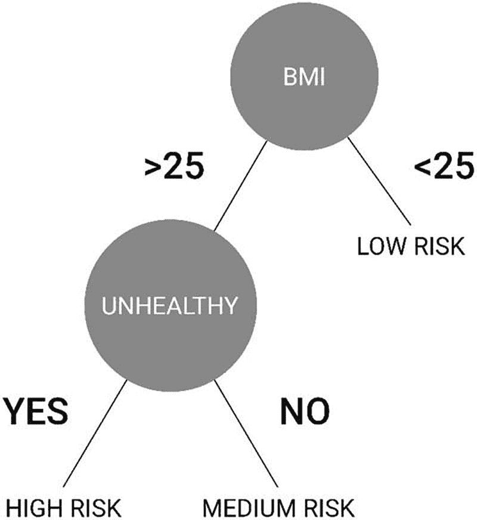

图 4-1

n = 2 个节点的决策树

决策树在如何表示大数据集和优先考虑最具歧视性的特征方面具有优势。如果没有设置决策树深度，它最终会学习呈现的数据并过度拟合。建议为决策树建模设置一个小的深度。或者，可以修剪决策树，通常从最不重要的特征开始，或者结合降维技术。

过度拟合是一种常见的机器学习障碍，并且不限于决策树。所有算法都有过拟合的风险，有多种技术可以克服这个问题。随机森林或丛林决策树在这方面非常有用。

修剪通过删除提供最少信息的特征来减小决策树的大小。因此，最终的分类规则不太复杂，并且提高了预测准确性。

模型的准确性计算为测试数据集中被正确分类的示例的百分比:

*   True positive/TP:其中实际类为 yes，预测类的值也为 yes。

*   误报/FP:实际类别为否，预测类别为是。

*   真负/TN:实际类的值为 no，预测类的值为 no。

*   假阴性/FN:当实际类别值为 yes，但预测类别为 no 时

*   精度:(正确预测的观测)/(总观测)= (TP + TN)/(TP + TN + FP + FN)。

*   精度:(正确预测阳性)/(总预测阳性)= TP/TP + FP。

*   回忆:(正确预测阳性)/(正确阳性观察总数)= TP/TP + FN。

分类是机器学习中常用的方法；ID3(迭代二分法 3)、C4.5(分类 4.5)和 CART(分类和回归树)是常见的决策树方法，其中产生的树可用于对未来样本进行分类。

### 迭代二分法 3 (ID3)

Python，scikit-learn；方法，决策树-id3

Ross Quinlan 在决策树学习领域做出了重大贡献，开发了 ID3 和 C4.5 [76]。ID3 算法基于“信息论之父”Claude Shannon 的工作，使用信息增益的成本函数。信息增益是通过熵来计算的。

熵决定了一个数据集有多不纯，或者有多无序。给定任意的分类 C，分成类别{c1，… cn}，和一组例子 S，其中 ci 的比例是 pi，样本 S 的熵如下:

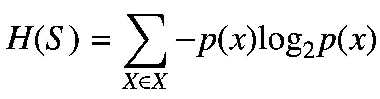

使用熵来计算信息增益。对于示例 s，该值是为属性 A 给出的。属性 A 的值可以取{t1，… tn}，表示集合 t 的总体。

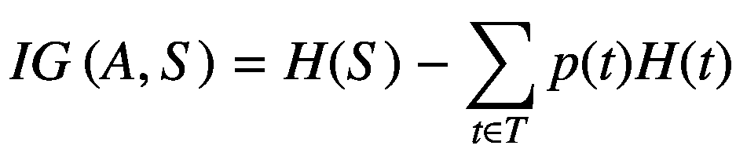

ID3 选择具有最高信息增益的节点来产生数据子集，然后递归地应用 ID3 算法。属性的信息增益可以理解为作为学习属性 a 的值的结果的熵的预期损失。一旦算法耗尽属性或者决策树完全分类了实例，算法就终止。ID3 是一种分类算法，无法处理缺失值。

例如，如果要接收下一行，模型会将结果归类为高风险。种族可能是结果的决定性因素。然而，模型没有足够的数据来学习潜在的结果。

<colgroup><col class="tcol1 align-left"> <col class="tcol2 align-left"> <col class="tcol3 align-left"> <col class="tcol4 align-left"> <col class="tcol5 align-left"></colgroup> 
| 

**记录**

 | 

**不健康**

 | 

**身体质量指数**

 | 

**种族**

 | 

**结果**

 |
| --- | --- | --- | --- | --- |
| **人物 5** | 不 | <25 | 中国人 | ？ |

### C4.5

Python，scikit-learn；方法，c45 算法

C4.5 是对 ID3 的增强，在选择属性时考虑了分支的数量和大小。C4.5 可以处理连续和离散标签，并使用增益比作为其分割标准。随着数据集大小的增加，它改善了执行时间和准确性。

C4.5 引入了修剪(一种自下而上的技术，也称为子树提升)和子树替换，以确保模型不会过度拟合数据。

### 手推车

Python，scikit-learn；方法，推车

CART 代表分类和回归树，是一种决策树算法，它使用基尼指数作为成本函数。用二叉树表示，和 C4.5 一样，CART 可以用于回归和分类问题。熵用于探索性分析，基尼系数用于最小化错误分类。根节点表示输入变量(x)，叶节点包含用于进行预测的输出变量(y)。

## 全体

集成是机器学习算法的一种形式，并且是在机器学习领域中采用的流行技术。集成方法使用机器学习模型或学习器的集合。结果，一组弱学习模型被组合以创建更准确的学习模型。

有两种类型的集成技术——打包和提升。

### 制袋材料

Bagging 是一种集成技术，涉及使用 bootstrap 采样技术创建多个独立的数据集模型(见图 [4-2](#Fig2) )。该技术有助于通过减少方差来减少误差。一般来说，bagging 改进了预测，因为异常行为被平均了。相比之下，一组迭代预测模型被称为 boosting。

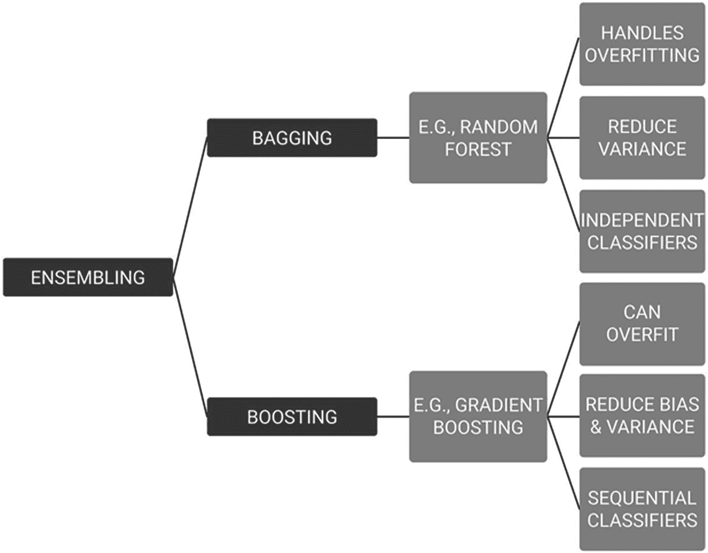

图 4-2

装袋与增压

在装袋中，n′< n 个样本从数据集 D 中取出并替换。每次随机选择用于构建最佳分割的特征。

平均值、多数投票或统计方法用于确定模型的平均预测值。随机森林决策树(见图 [4-3](#Fig3) )扩展了 bagging 的概念，因为它们也使用了随机的特征子集，从而减少了学习者预测之间的相关性。

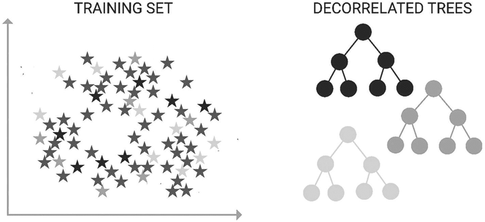

图 4-3

随机森林决策树

#### 随机森林决策树

Python，scikit-learn；RandomForestClassifier 方法

随机森林决策树是装袋的一个例子。随机森林是通过同时训练多个决策树来创建的，并且引用一组决策树学习器(因此称为“森林”)。随机森林的目的是防止过度适应。随机森林中的决策树越多，结果越准确。

每个随机森林都从数据集和随机要素子集中抽取一个样本进行决策。

随机森林决策树可用于分类和回归问题。对于回归问题，取结果的平均值；然而对于分类问题，它是大多数类别。随机森林决策树是不同模型的集合。这是一种集成方法，因为该过程通过组合来自多个模型的预测来减少算法中的方差。

当通过引导现有数据将数据局限于分类或决策问题时，随机森林模型似乎特别有效。随机森林分类器的一个好处是它们还可以处理缺失值。

### 助推

Boosting 是一种集成方法，它迭代地产生一组预测模型。这个概念包括每个新模型从以前模型的错误中学习。

当有大量数据需要预测时，通常会采用增强方法。

通过反复创建新的模型来补偿错误，该过程“促进”或将弱学习者转化为强学习者——减少他们的偏差和差异。该技术的每次迭代学习数据中的关系，然后随后分析错误，不正确的分类被赋予权重。目的是最小化来自先前模型的误差。用于提升算法的底层机器学习方法可以是任何东西。

升压通过以下过程工作:

1.  数据被表示。

2.  决策树桩是在最重要的特征切割上形成的。

3.  对错误分类的观察值进行加权。

4.  重复该过程，并且组合所有的树桩以获得最终的分类器。

#### 梯度推进

Python，scikit-learn；方法，梯度增强分类器，梯度增强回归器

梯度推进有许多名称，包括多重加法回归树、随机梯度推进和梯度推进机器。梯度推进是 2001 年 Jerome Friedman 将梯度推进概念应用于决策树时从决策树中衍生出来的一种技术[77]。AdaBoost (Freund 和 Shapire，2001 年)是一种梯度增强变体。在梯度推进中，模型被顺序训练。每个迭代模型都试图最小化损失函数[78]。

类似于随机森林决策树，梯度提升是由弱预测器构成的。每个新树随后用先前被先前的树错误分类的数据来训练。这种迭代过程通过关注更具挑战性的数据来加速模型，因为在学习的早期做出更容易的预测。

XGBoost 或极端梯度增强是梯度增强的一种变体。XGBoost 增加了正则化，并利用分布式多线程处理的计算能力来提高速度和效率。

#### 自适应增压

Python，scikit-learn，numpy 方法，AdaBoostClassifier，AdaBoostRegressor

自适应 boost 是一种流行的从错误中迭代学习的方法。决策树树桩是弱学习者，只根据一个规则分割数据。通过关注被错误分类的样本来改进决策树残肢。这些通过与数据相关联的权重来识别。该模型可以从错误中学习，并提供比单一决策树更低偏差的最终解决方案。

## 线性回归

Python，scikit-learn；方法，线性模型。线性回归

线性回归是一种连续的统计技术，用于了解输入(x:预测因素、解释变量或自变量)和输出(y:响应变量或因变量)之间的关系。顾名思义，线性回归(见图 [4-4](#Fig4) )要求从输入变量的线性组合中计算出 y。

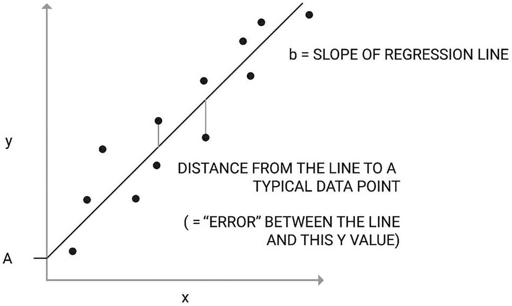

图 4-4

线性回归

线性回归的目的是通过所有数据点建立一条最佳拟合线，通过最小化余量或残差变化，使预测易于理解。

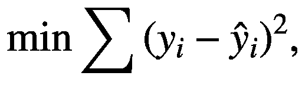T2】

其中 y <sub>i</sub> 是实际观测响应值，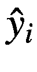是响应变量的预测值，它们的相减是 y 的观测值和预测值之间的残差变化或差值

*   标准变量:我们预测的结果变量

*   预测者:预测基于什么变量

*   截距:最佳拟合线与 y 轴的截距

当有一个输入变量 x 时，这种技术被称为简单线性回归。多元线性回归评估两个或多个预测变量。

T2】

其中，y 是输出变量，x 是预测值，B0 和 B1 是估计用来移动最佳拟合线的系数，是指 x 的平均值，B0 是偏差或截距(与 y 轴相交)，B1 是每单位 x 上 y 增加/减少的斜率或速率。

一旦模型学习了参数，它们就被用来预测给定的新的、看不见的输入 x 的 y 值。

用于估计系数的常用技术是普通最小二乘法和梯度下降法。给定一条穿过具有线性关系的样本数据集的最佳拟合线，普通最小二乘法试图最小化从每个数据点到回归线的平方距离之和。目的是最小化残差平方和。系数值被迭代优化以减少模型的误差。

普通最小二乘法从 B0 和 B1 的随机值开始。计算每个(输入、输出)对的误差平方和。选择一个学习率，它作为一个比例因子；并且朝着最小化误差的方向优化系数，直到不能获得进一步的增益。

学习率是一个超参数，其值由实验确定。尝试不同的值，并使用给出最佳结果的值。

对线性回归的批评集中在它的简单性上，导致它不能捕捉数据中的复杂关系。模型也可以学习数据中的噪声，从而导致过度拟合。

变量之间的关系并不总是线性的，因此，线性回归模型对具有非线性关系的数据表现不佳。然而，变量有时可以被转换以适合线性回归模型。线性回归也假设变量是同方差的，这意味着向量中的所有变量都具有相同的方差。

前面提到的是一个完美的演示，说明了为什么在训练模型时，应该使用各种机器学习算法。

## 逻辑回归

Python，scikit-learn；方法，线性模型。逻辑回归

线性回归适用于连续变量，而逻辑回归预测适用于离散值或应用变换函数后的分类问题。

由统计学家 David Cox 于 1958 年开发的逻辑回归(或 logit 回归)通常用于二进制分类问题。例如，逻辑回归可用于预测给定特定药物后患者是否会经历不良事件，患者是否可能再次入院，或者患者是否具有特定疾病诊断。

与线性回归不同，模型的输出以 0 到 1 之间的概率形式出现。预测输出通过对 x 输入进行对数变换并使用逻辑函数 h(x)= 1/(1+e^–x)生成。使用指定的阈值将该概率转换成二进制分类。

逻辑回归使用 sigmoid 函数，这是一条 S 形曲线(见图 [4-5](#Fig5) ，它可以取任何连续值，并将其映射为默认类别的 0 到 1 之间的概率值。

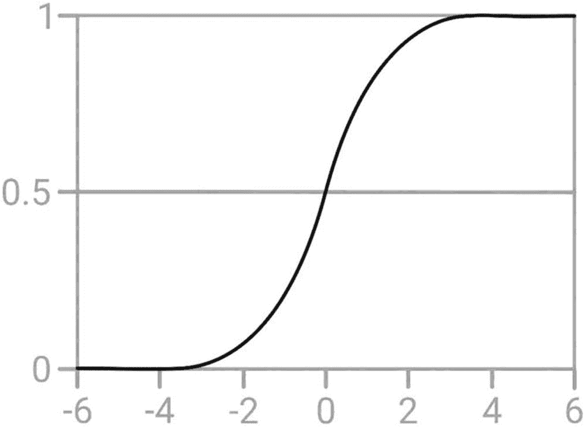

图 4-5

物流功能

Sigmoid 函数:1/(1+e^–value)，其中 e 是欧拉数，value 是需要变换的值。

逻辑回归使用一个方程 P(x) = e ^ (b0 + b1*x)/(1 + e^(b0 + b1*x))，可以转化为 ln(p(x)/1–p(x))= B0+B1 * x)。与线性回归一样，b0 和 b1 是从训练数据中学习的值。

举个例子，用一个模型来确定皮肤表面的生长是否是良性的。输入变量 x 可以是生长的大小、深度或纹理；默认变量 y = 1 表示良性增长。如图所示，逻辑函数将各种实例的 x 值转换为 0 到 1 之间的概率值。如果概率超过 0.5 的阈值，则肿瘤被分类为良性。

逻辑回归试图通过使预测结果和实际结果之间的误差最小化的训练来学习 b0 和 b1 的值。最大似然估计是用于此目的的迭代过程。

最大似然估计以随机值作为每个预测变量的最佳权重开始，然后迭代地调整这些系数，直到预测结果值的能力没有改善。最终系数具有最小化预测概率误差的值。

与线性回归一样，逻辑回归假设输入变量和输出之间存在线性关系。将数据转换为线性模型可能需要进行特征约简。逻辑回归模型也容易过度拟合，这可以通过去除高度相关的输入来克服。

最后，系数可能无法收敛，如果数据稀疏或高度相关，就会发生这种情况。

## 支撑向量机

Python，scikit-learn；方法，svm。SVC，svm。线性 SVC

支持向量机(SVM)是一种非概率二元线性分类器，用于分类和回归问题。SVM 通常与自然语言处理方法一起用于分析文本，以进行主题建模和情感分析。它也用于图像识别问题和手写数字识别。

该算法在由支持向量确定的两个类别之间找到超平面或最佳拟合线。支持向量是最接近超平面的数据点，如果移除，将改变超平面的位置。边缘值或从数据点到超平面的距离越大，数据被适当分类的置信度就越高。最佳拟合线是从寻求最大限度的优化过程中学习的。

SVM 使用一种叫做内核化的方法将数据映射到更高维的特征空间。使用核技巧在更多维度中迭代地映射数据，直到可以形成超平面来对其进行分类。

以图 [4-6](#Fig6) 中的问题为例。在左边，我们看到在二维空间中不可能找到最佳拟合线。SVM 使用内核技巧将数据映射到三维空间，并可以定义一个超平面来对数据进行分类。

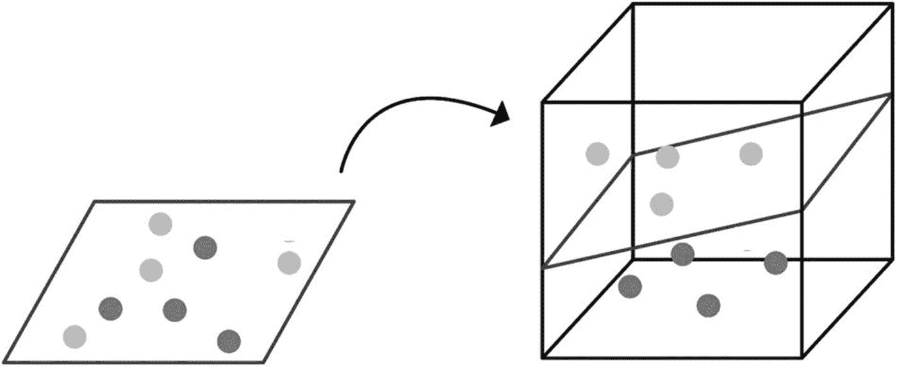

图 4-6

SVM 可视化

支持向量机接受数字输入，在小数据集上工作良好。然而，随着维度的增加，理解和解释模型的能力降低。随着数据集大小的增加，训练时间也会增加。支持向量机处理噪声数据的能力也较差。

SVM 可以表示为支持向量的总和(见图 [4-7](#Fig7) )。

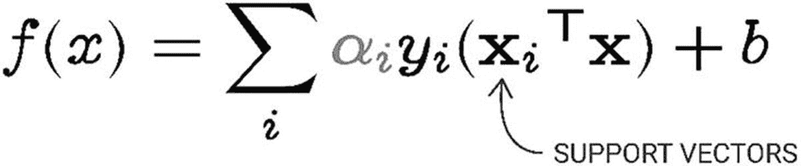

图 4-7

SVM 表示为支持向量的和

## 朴素贝叶斯

Python，scikit-learn；方法，高斯 b，多项式 b，伯努利 b

假设一个事件已经发生，朴素贝叶斯使用贝叶斯定理计算另一个事件发生的概率。该算法被认为是天真的，因为它假设所有变量都是相互独立的，这在现实世界的例子中是不典型的。当输入维数较高时，通常使用贝叶斯分类器。

例如，给定一个指定的阈值，此方法可用于概率分类向量是否属于一个类别或另一个类别:

P(B|A) = (P(A|B) * P(B))/P(A)

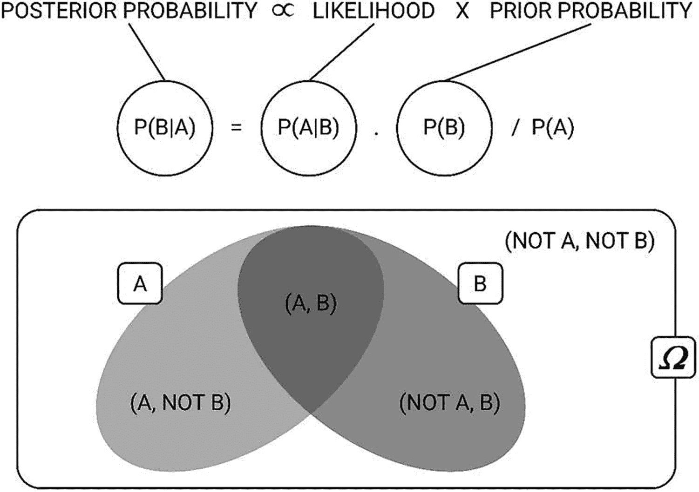

图 4-8

后验概率

*   **P(B|A) =** 后验概率(图 [4-8](#Fig8) ):假设 B 为真的概率，给定数据 A，其中 P(B | A)= P(a1 | B)* P(a2 | B)*…* P(an | B)* P(A)

*   P(A|B) = 似然:假设假设 B 为真，数据 A 的概率

*   **P(A) =** 类先验概率

*   **P(B) =** 预测器先验概率

先验分布 P(B)和似然概率 P(B|A)可以从训练数据中估计出来。要计算一个示例属于哪个类，就要计算它在每个类中的概率。分配给示例的类是为该示例产生最高概率的类。

用表 [4-3](#Tab3) 做个简单的例子，我们可以从一个病人是否不健康来了解他患病风险的概率。为了确定不健康=是的结果，我们计算 P(高风险|不健康)和 P(低风险|不健康),并选择概率最高的结果。

表 4-3

结果可能性

<colgroup><col class="tcol1 align-left"> <col class="tcol2 align-left"> <col class="tcol3 align-left"></colgroup> 
| 

记录

 | 

不健康的

 | 

结果

 |
| --- | --- | --- |
| **人物 1** | 是 | *高风险* |
| **人物 2** | 是 | *低风险* |
| **人物 3** | 是 | *高风险* |
| **人物 4** | 不 | *低风险* |

*   p(高危|不健康)

*   = (P(高风险|不健康)* P(高风险))/P(不健康)= (2/2 * 2/4)/(3/4) = 0.66

朴素贝叶斯模型很容易构建，对于大量数据集尤其有用。除了它的简单性(因此也是它的天真性)，朴素贝叶斯被认为甚至优于高度复杂的分类方法。

## k-最近邻

Python，scikit-learn；方法，邻居。近邻分类器

不要与 k-means 聚类混淆，kNN 方法用大多数 k-最近邻的标签对未知对象 O 进行分类。kNNs 用于分类和回归问题，是一种非参数技术。他们不学习模型。相反，kNNs 将训练数据集存储为它们的表示，并基于类推学习来执行新样本的分类。

由于没有模型的学习，KNN 被认为是懒惰的学习者。

每个对象代表 N 维空间中的一个点。如果邻域在特征空间中具有最小距离，则该邻域被定义为最近。计算一个看不见的物体和它的邻居之间的距离的方法之一是使用 A = (a1 … an)和 B = (b1 … bn)之间的欧几里德距离如下:

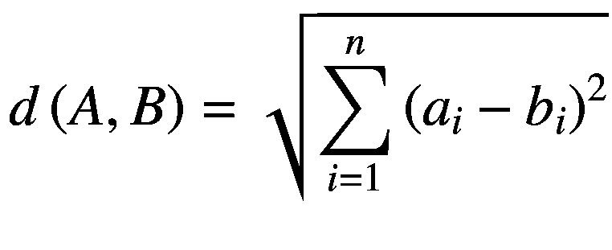

该算法是这样工作的:

1.  计算任意两点之间的距离。

2.  根据这些成对距离查找最近的邻居。

3.  基于最近邻列表对类别标签进行多数投票。

预测是在请求时做出的。在回归问题中，使用 k 个最相似实例的平均值或中值。在分类问题中，从 k 个最相似的实例中选择具有最高频率的类。

与大多数算法一样，行列式的方法可以有所不同。还使用二进制向量之间的距离(汉明距离)和实向量之间的绝对差之和(曼哈顿距离)。

kNNs 的缺点是对对象进行分类需要大量的计算，因为必须计算训练数据集中所有邻居的距离。它不是特别适合高维数据。每个预测变量可以被认为是 N 维输入空间的一个维度。例如，x1 是一维的，而 x1、x2 是二维的，依此类推。维度的增加指数地增加了输入空间的体积。

KNN 不太适合有缺失值的数据，因为向量之间的距离不能根据缺失数据来计算。

## 神经网络

大脑工作的生物机制激发了人工神经网络，这是一种基于动物大脑并行架构的不同计算范式。

神经网络非常适合数据挖掘任务，因为它们能够对多维数据进行建模，并且能够高效地发现数据中的隐藏模式。神经网络可以应用于预测和分类问题。估计结果并将其与实际输出进行比较的过程称为前向传播。

神经网络是机器学习算法的一个子集，包括感知器、全连接神经网络、卷积神经网络、递归神经网络(RNNs)、长短期记忆神经网络、自动编码器、深度信念网络、生成对抗网络等等。他们中的大多数都是用一种叫做反向传播的算法来训练的。

人工神经网络(ann)被用于许多任务中:

*   对疾病进行分类——计算机可以学习患病器官(如肾脏、眼睛和肝脏)的图像，以预测疾病的可能性

*   识别语音

*   翻译和数字化文本

*   面部识别

神经网络可以像人脑一样学习如何完成任务——有监督的、无监督的，以及通过强化学习。

### 感知器

感知器是人工神经网络的基本单元。在人工智能中，感知器是一个节点或单元，接受多个输入，只有一个输出，通常为 1 或-1。感知器获取输入 S 的加权和，一个单位函数计算节点的输出(见图 [4-9](#Fig9) )。单元功能可以是以下几种:

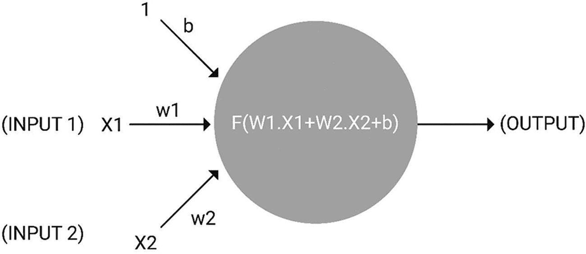

图 4-9

人工神经元的配置

*   线性-如加权和

*   仅在加权和超过阈值时触发的阈值函数

*   如果 S 小于阈值，输出相反值(通常为–1)的阶跃函数

*   适马函数(1/(1+e–s)，允许反向传播

感知器模仿生物神经元(见图 [4-10](#Fig10) )，其中树突接收输入。如果信号在设定的持续时间内足够高，神经元向终端发送电脉冲，然后被其他神经元的树突接收。每个感知器都有一个偏差，类似于线性函数 y = ax + b 的 b。它上下移动直线，以便更好地用数据拟合预测。【T2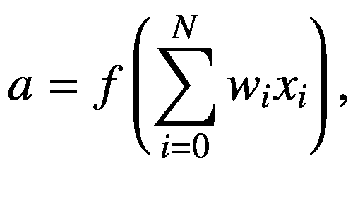

其中 1 是 x <sub>0</sub> ，b = w <sub>0</sub> 。

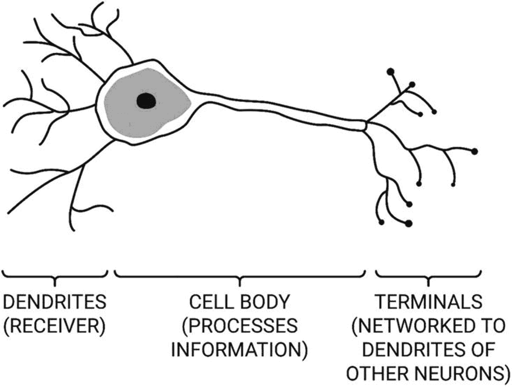

图 4-10

生物神经元的结构

### 人工神经网络

Python，scikit-learn；方法，线性模型。感知器

人工神经网络由感知器组成，包含一个或多个隐藏层(见图 [4-11](#Fig11) )。有几种拓扑结构，最简单的是前馈网络。

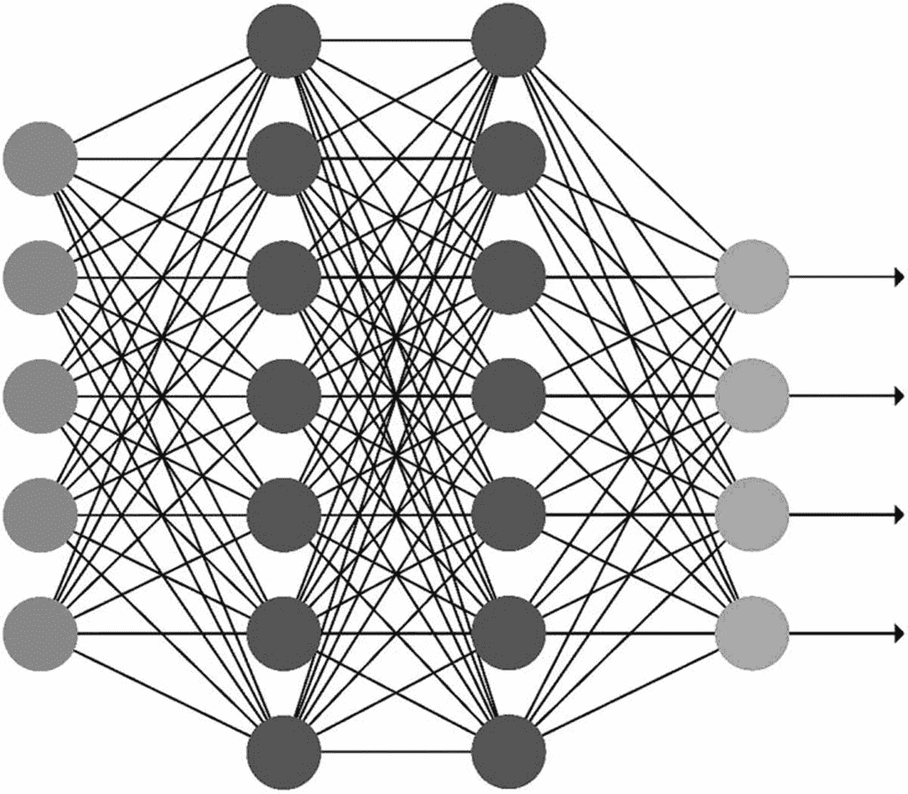

图 4-11

人工神经网络的组织

反向传播是确定输出端的误差或损耗并将其传播回网络的方法。每个节点的权重被更新以最小化来自每个神经元的相应误差输出。反向传播试图通过更新相应的神经元权重来最小化神经元的误差，从而最小化整个模型的误差。

在神经网络模型中必须完成的主要学习是训练神经元何时触发。一个时期指的是正向和反向传播的一次训练迭代。在学习阶段，神经网络中的节点根据上一次测试结果的误差来调整它们的权重。学习速率控制着网络学习的速度。

模型中感知器或神经元的数量等于数据中变量的数量。一些表示也可能有一个偏差节点。

通常，人工神经网络具有分层组织的神经元。每一层都可以对其接收的输入数据执行不同的转换。

## 深度学习

深度学习是一个采用深层神经网络架构的过程。与其他类型的模型相比，训练深度人工神经网络模型需要更多的时间和 CPU 能力。值得注意的是，人工神经网络模型的性能不一定优于典型的监督学习技术。

深度学习不是一项新技术；然而，随着硬件的进步，主要是功率和成本的提高，这种计算变得更加频繁，这使得这种计算变得可行。

Alphabet 利用深度神经网络(DNNs)创造了历史上最强的围棋选手，在 2017 年击败了几位人类围棋冠军[74]。历史上，围棋这种古老的游戏一直被认为是对人工智能的挑战，并展示了深度学习的能力(见图 [4-12](#Fig12) )。

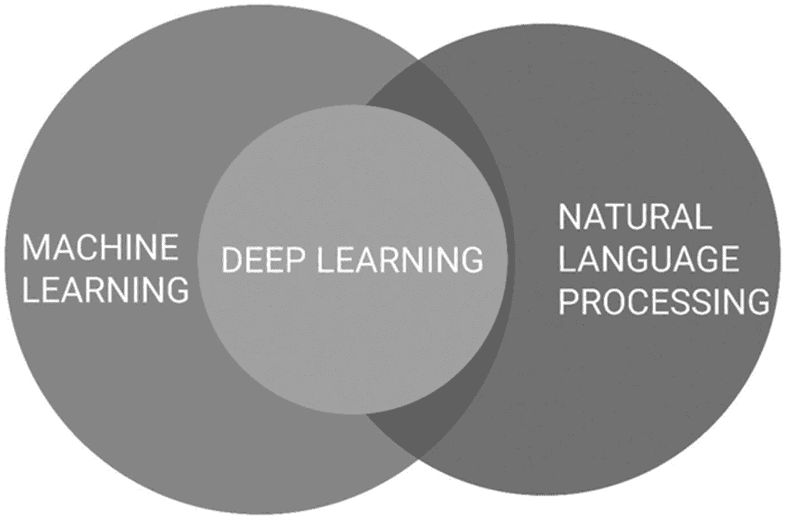

图 4-12

深度学习:它在哪里？

有许多类型的人工神经网络，包括以下几种。

### 前馈神经网络

在前馈神经网络中，加权输入的总和被输入到输出(见图 [4-13](#Fig13) )。当总和超过单位功能阈值时，输出被激活(通常为 1)。如果它不触发，它通常输出-1。

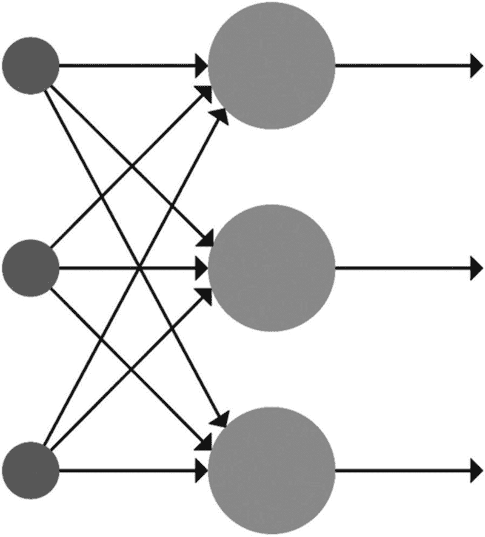

图 4-13

前馈神经网络

### 递归神经网络(RNN):长短期记忆

递归神经网络或 RNNs 保存一层的输出，并将其反馈给输入，以改善输出层的预测(见图 [4-14](#Fig14) )。因此，每个节点在执行计算时都有一个内存，并利用顺序信息。因此，节点被认为具有记忆。

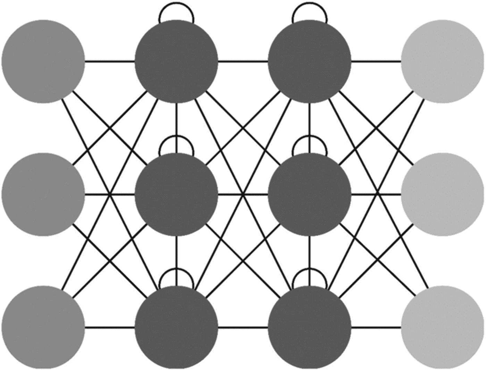

图 4-14

递归神经网络

### 卷积神经网络

卷积神经网络是深度前馈神经网络。层被称为卷积层，通常用于语音识别、空间数据、NLP 和计算机视觉问题。分离的卷积层通常应用于特定问题的不同方面。

例如，在理解照片中是否存在人脸时，DNN 中的独立卷积层可用于识别人脸的不同方面——眼睛、鼻子、耳朵、嘴等等。

### 模块化神经网络

类似于人脑，模块化神经网络的概念是神经网络一起工作的概念。

### 径向基神经网络

这是一个使用径向基激活函数的神经网络，其值取决于离原点的距离(见图 [4-15](#Fig15) )。

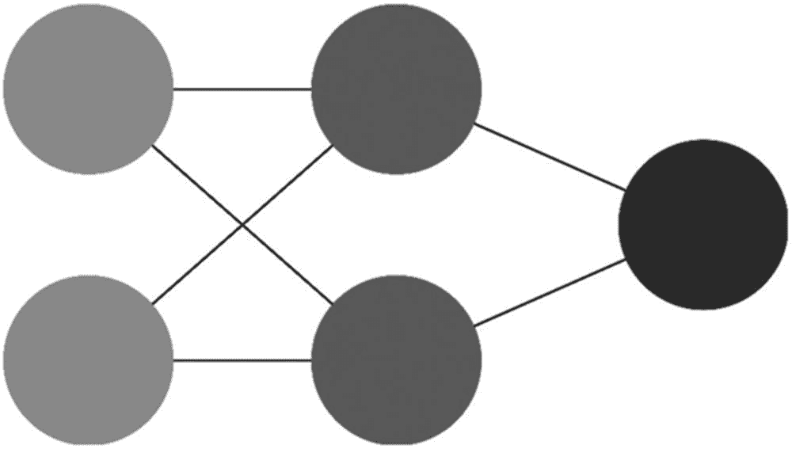

图 4-15

径向基神经网络

人工神经网络和深度学习的关键优势在于从训练数据集生成复杂的线性和非线性模型的能力。

DNNs(深度和多层 ann)可以仅从训练数据中学习数据之间的复杂关系，这通常会提高泛化能力。DNNs 仍然会屈服于过度拟合数据的问题，因此可能需要适当的修剪。顾名思义，深度网络也可能需要很长的训练时间，并且需要大量的训练实例。

神经网络的一个常见问题是，特别是在医疗保健领域，它们就像一个黑盒，不能为用户提供一个清晰的界面来理解研究结果。实际上，人工神经网络模型很难解释，权重和偏差也不容易解释模型中什么是重要的。

通常认为，对于监督学习问题，防止过拟合的神经元的上限是

n<sub>h</sub>= n<sub>s</sub>(【n】T4【I】+n<sub>或</sub>)，

在哪里

*   N <sub>i</sub> =输入神经元的数量

*   N <sub>o</sub> =输出神经元的数量

*   N <sub>s</sub> =训练数据集中的样本数

*   〈 =任意比例因子

## 无监督学习

无监督学习是指从无标签数据中学习模型的过程。这意味着输入数据(x)是在没有输出(y)的情况下提供的。算法被留下来确定数据中的注释，这意味着没有正确或错误的答案。

当提供一些输出标签(y)时，半监督学习发生。例如，在模型学习中，学习将是半监督的，以根据具有部分标记数据的患者眼睛扫描来预测青光眼。如果只有眼睛扫描的子集具有适当标记的输出(例如，青光眼，而不是青光眼)，则模型可能没有足够的适当数据来学习模型。随着为模型训练提供更多的标记数据，系统可能会变得更加准确。

无监督学习在时间、金钱和专业知识方面可能是消耗资源的。通常，通过改进数据的标注，可以极大地提高模型的准确性。

无监督学习由两个主要的问题概念组成:聚类和关联。

### 使聚集

聚类是指在数据中发现关系的过程。集群有多种医疗保健用途，包括:

*   将相似概况的患者分组在一起进行监测

*   检测索赔或交易中的异常或异常值

*   根据药物或病情定义治疗组

*   通过运动传感器检测活动

### k 均值

Python，scikit-learn；方法，集群。聚类

k 均值聚类(见图 [4-16](#Fig16) )的目的是在数据中找到 k 个相似的组。k-Means 是一种迭代算法，它计算定义的 k 个聚类的质心，所有训练数据都分配给一个聚类。

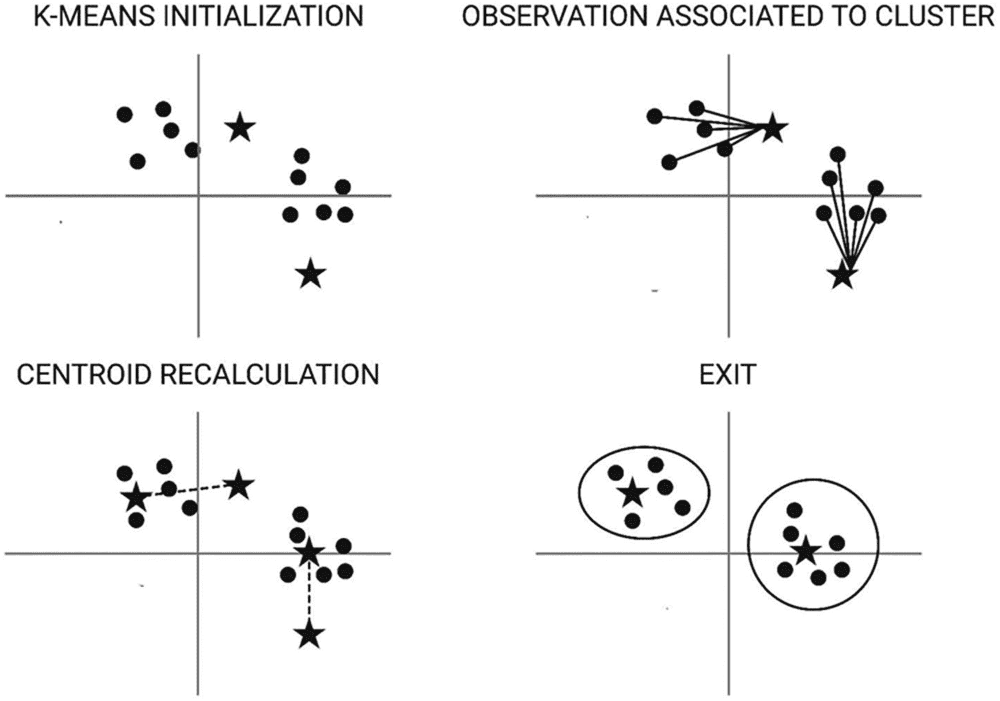

图 4-16

k 均值聚类

数据点由数据点与其质心之间的距离指定。聚类质心是定义结果聚类的属性值的集合。

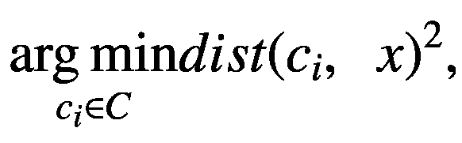T2】

其中 c <sub>i</sub> 是集合 C 中质心的集合，距离(dist)是标准欧几里德距离。

聚类分析使模型能够确定有机形成的组，而不是在数据探索之前定义组。

k-means 算法的步骤包括:

*   第一步:设置 k 的值。这里，让我们取 k = 2。
    *   将每个数据点随机分配给 k = 2 个聚类中的任何一个。

    *   确定每个聚类的质心。

*   步骤 2:对于每个数据点，将其关联到最近的聚类质心。

*   步骤 3:重新计算新群的形心。

*   步骤 4:继续这个过程，直到质心群集保持不变。

### 联合

关联规则学习方法提取的规则能够最好地解释数据中变量之间的感知关系。这些规则可以在大型多维数据集中发现有用的关联，用于驱动和优化。

关联规则学习在历史上最适用于收集用户购买习惯的在线购物结账篮数据集。例如，当一个人买比萨饼时，他可能也会买酒，就像一个买生菜的人可能也会买西红柿、黄瓜和洋葱一样。通过分析事务数据集，可以预测关联的概率。我们知道某些项目(无论是食物、衣服，甚至是疾病)经常一起出现，关联规则学习试图理解这些关系。

特别是在医疗保健中，可以理解关联症状，以更好地预测和诊断疾病和不良事件。根据药物治疗和相关的患者共病途径确定潜在的不良反应，可以改善护理和治疗途径。

有三个重要的指标需要熟悉。

#### 支持

支持度是绝对频率的值。如果 sup %的事务包含 X U Y，则关联规则与数据集 T 中的 sup sup 保持一致。这表示项目集的受欢迎程度，通过项目集出现在其中的事务的比例来衡量:

*   sup = Pr(X U Y)= count(X U Y)/总事务计数

#### 信心

置信度表示相关频率。如果包含 X 的事务的 conf %也包含 Y，则关联规则在具有 conf 的数据集 T 中成立。这估计了当项目 X 出现时项目 Y 出现或出现在事务数据集中的可能性。这表示为{X → Y},并衡量包含项目 X 的交易中项目 Y 也出现的比例:

*   conf = Pr(Y|X) =计数(x u y)/计数(x)

#### 电梯

Lift 确定给定项目 Y 出现的可能性，同时考虑 Y 的流行度:

*   提升=支撑(X U Y)/支撑(X) *支撑(Y)

假设 X 发生，关联规则确定 Y 的概率。这些协会的好处在整个行业都有应用。有许多关联规则挖掘算法使用不同的策略来理解关联，并使用不同的数据结构。

### 推测的

Apriori 是最流行的关联规则挖掘算法。Apriori 算法经常用于模式挖掘以及识别同时出现的特征和项目。它广泛用于购物篮分析，是发现隐藏特征模式的有力工具。它通常应用于事务数据库，挖掘频繁关系并生成关联规则。

先验从一组 n 个项目开始。该算法计算满足指定的阈值支持度和置信度值的所有可能的候选项集或频繁项集。Apriori 属性声明一个项集要成为频繁项集，它的所有子集也必须是频繁项集。Apriori 算法使用自底向上的方法；频繁子集被识别并一次增加一个项目。

先验方法相对简单(见图 [4-17](#Fig17) ):

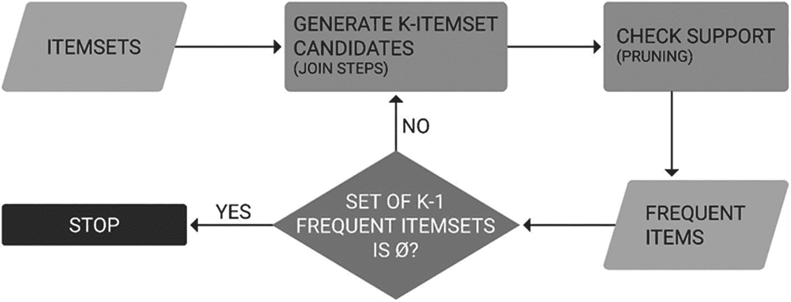

图 4-17

推测的

*   应用最小支持度来寻找数据集 T 内 k 个项目的所有频繁集，其中频繁项目集具有支持度≥ min(sup)。

*   扩展选择以使用频繁 k 项集查找 k + 1 项的频繁集。

项目集的最大大小是 k，即项目的数量。

## 降维算法

尽管信息大体上是数据越多越好，但数据集通常包含许多变量，因此捕捉数据信号是一项更加费力的任务。无论是稀疏值、缺失值、识别相关特征、资源效率，还是更直白的解释，降维算法对数据科学家都非常有用。

顾名思义，降维算法(DRA)减少了数据集中的维数。当您考虑到可用于做出狭隘决策的大量数据时，降维的必要性就变得显而易见了:

*   手机收集数百个数据点，包括通话、短信、步数、消耗的卡路里、爬的楼层、互联网使用情况等等。什么数据最有助于了解电话使用情况？

*   社交媒体上的品牌正在收集关于参与度和互动的数据，如评论、喜欢、关注者、情绪和心情。什么数据最有助于理解对健康的态度？

*   医疗健康记录包含丰富的信息，但只有一些信息与预测疾病风险或疾病进展相关。哪些数据与了解疾病或不良事件的未来风险相关？

降维是指将多个维度的数据集转换成更少的维度，同时简洁地表示相似的数据。

图 [4-18](#Fig18) 中的图表显示了数据集的厘米和英寸之间的关系。这种二维表示可以简洁地转换成一维表示，从而提高理解的直观性。n 维数据可以缩减到 k 维，其中 k < N

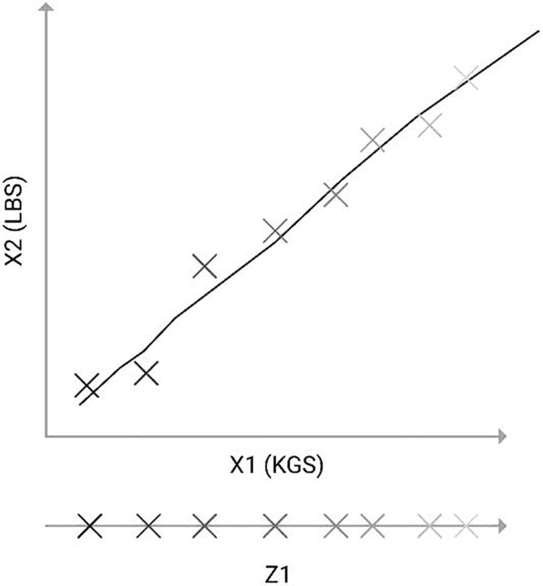

图 4-18

降维

价值的维度可以被识别或组合，或者创建新的维度来表示内在的关系。

降维在机器学习任务中非常有用，有很多好处:

*   与原始数据集相比，维数越少，计算速度越快。

*   默认情况下，降维算法会减少存储所需的空间。

*   将数据减少到不到三个维度，可以实现可视化并更容易理解。

*   冗余数据被移除，这提高了机器学习模型的性能。

*   噪声被移除，这提高了模型性能。

## 降维技术

可以通过多种方式实现维度缩减。

### 缺少/空值

缺失数据和空值单独来看并不是一个大问题，但是越来越多的空值可能有助于确定是删除变量、忽略缺失值还是计算预测值。

如果一个属性有超过 50%的空值或 null 值，大多数数据科学家都支持删除变量。这个门槛确实有所不同。

### 低方差

彼此非常相似的数据属性不携带太多信息。因此，数据之间的差异很小。因此，可以设置较低的方差阈值，并基于此移除维度。

由于方差取决于范围，因此应首先进行数据标准化。

### 高度相关

具有相似数据趋势的属性可能携带相似的信息。多重共线性是携带可能降低模型性能的相似信息。连续数据之间的相关性由皮尔逊积差系数确定，它是两个变量 X 和 y 之间线性相关性的度量。

对于离散数据，皮尔逊卡方值决定了集合间观察到的任何差异偶然出现的可能性。

### 随机森林决策树

随机森林决策树集成有助于识别关键特征。随机森林决策树使用能够识别最佳分割属性的特征子集。

如果一个属性经常被选为最佳分割节点，那么它很可能是一个要保留的特征。决策树对于可视化缩减也特别有用。

### 反向特征消除

在反向特征消除中，模型训练 n 个属性。从 n 个属性开始，在每次迭代中，模型在 n-1 个属性上训练 n 次。显示误差率增加最小的属性被移除，并且算法对 n-1 个属性执行另一次迭代。

在每次迭代 k 时，训练一个具有 n-k 个属性的模型。这在计算上是昂贵的。

### 正向特征构造

正向特征构造与反向特征消除相反。该模型从一个属性开始，评估哪个属性的性能提高最多。很像它的反向特征消除，这种方法计算量很大，除非在较低的维度范围内操作。

### 主成分分析

主成分分析通过将一组原始变量转换成一组新的变量或主成分来减少变量(轴)的数量(见图 [4-19](#Fig19) )。此过程是迭代计算数据中要素的最大方差。

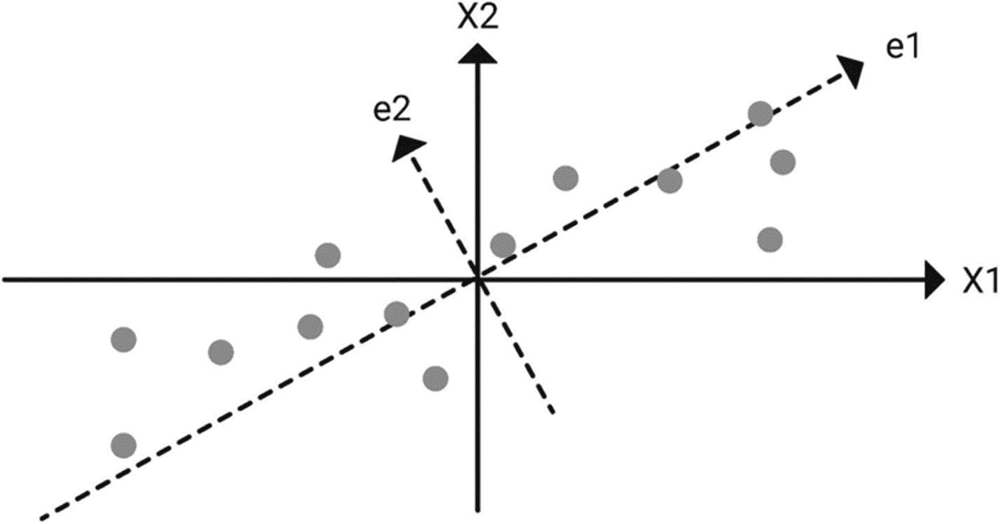

图 4-19

污染控制局(Pollution Control Agency)

每个分量都是正交的，是原始变量的线性组合。正交性表示分量之间的相关性为零。

第一主成分是具有最大方差的原始维度的线性组合；第 n 个主成分是方差最大的线性组合，与 n–1 个主成分正交。

## 自然语言处理

自然语言处理是专注于语言的人工智能领域。自然语言处理(NLP)被定义为系统分析、理解和生成人类语言(包括语音和文本)的能力。

NLP 是计算语言学(使用计算机科学研究语言学)的一个方面，在以下方面很有用:

*   检索数据集中的结构化和非结构化数据，例如，通过关键字或短语搜索临床记录

*   社交媒体监控

*   问答:对人类自然语言的解释，以进行适当的交互，例如，与虚拟助手或语音识别软件进行交互

*   分析文档以确定关键发现

*   分析和解释文本以理解情绪和心情的能力

*   认识诊断和关系之间的区别

*   图像到文本识别，例如，阅读标志或菜单

*   机器翻译—NLP 用于机器翻译程序，在该程序中，一种人类语言被自动翻译成另一种人类语言

*   主题建模——这个文档在谈论什么？

*   从社交媒体或讨论帖子中了解情绪

解释自然语言充满了挑战，因为人类语言天生是模糊的——语言、发音、表达和感知。

虽然人类的语言是有规则的，但它们经常被误解和误用。自然语言处理考虑语言的结构来获得意义。单词组成短语；短语造句；句子构成文件；所有这些都传达了思想。

NLP 有一个文本处理程序工具包，包括一系列可用于模型开发的数据挖掘方法。由于非结构化数据的性质，NLP 任务在计算资源和时间方面可能是昂贵的。神经网络和深度学习也可以用于 NLP 任务。

由于产生的大部分数据以非结构化数据的形式存在，自然语言处理是解释和理解自然语言的有力工具。

与计算的任何方面一样，在继续之前，有几个术语需要理解:

*   标记化:将文本语料库转换成更小的单位或标记的过程。有许多算法可用于将文本分解成记号。

*   标记:文本中出现的单词或实体。

*   文本对象:一个句子、一个短语、一个单词或一篇文章。

*   词干提取:一个基本的基于规则的去除后缀的过程(“ing”、“ly”、“es”、“s”等)。)从文字上。

*   词干:词干化后创建的文本。

*   从词典和词法分析中确定单词的词根。

*   语素:语言中的意义单位。

*   语法:安排符号(单词)来造句。它包括确定单词在句子和短语中的结构角色。

*   语义:单词的含义以及如何将单词连接成有意义的短语和句子。

*   语用学:在不同情况下使用和理解句子，以及解释是如何受到影响的。

在这一节中，我的目标是介绍 NLP 的关键概念和方法，并演示可以应用于数据集以生成定义值的技术。

### NLP 入门

给一个 NLP 模型一个输入句子并接收一个有用的输出需要几个关键组件(见图 [4-20](#Fig20) )。

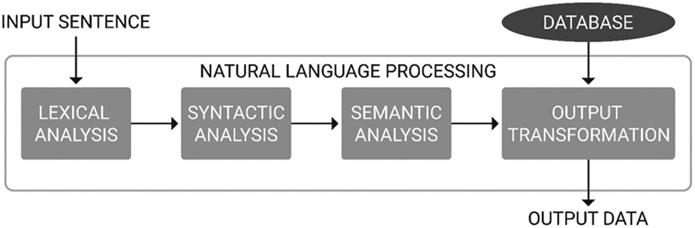

图 4-20

NLP 如何工作

## 预处理:词法分析

与任何数据集一样，与数据上下文无关的文本集可以被理解为噪声。自然语言处理的第一步是对输入文本进行清理和标准化，确保它没有噪音，并为分析做好准备。

除了拼写校正和语法校正之外，还使用了以下技术来降低噪声。

### 噪声消除

噪声去除包括准备噪声记号(即，单词)的字典和解析文本，去除在噪声字典中找到的记号。例如，像 the、a、of、this、that 等词将被删除。

### 词汇规范化

Follow、following、follow 和 follower 都是 follow 的变体。语境上，话也差不多。词汇规范化通过词干化和词目化来降低维度，词干化去除后缀和前缀，词目化是使用单词结构和语法关系的定义过程。

### 端口语音

Python，NLTK 方法，PorterStemmer

Porter stemmer 算法是一种流行且有用的方法，用于提高信息检索的有效性[81]。该算法的工作原理是英语中的许多单词共享一个共同的词根。词干处理后缀，并从单词中删除常见的词形和词尾变化。因此，词干分析允许人们将相似的单词简化成一个共同的词根形式。

例如，以文本“我因我最好的朋友遇到麻烦而感到困扰。不仅如此，我昨天处理的问题仍然困扰着我。”

困扰，麻烦，和困扰都有一个共同的根源麻烦。因此，根据波特词干算法，不是将所有三个单词计数一次，而是将词干故障计数三次。词干提取的好处是，常见的单词可以聚集在一个常见的词干下，以提供某个单词出现次数的更准确的统计表示。然而，词干化的一个缺点是单词的语义可能会丢失。

词干化和词尾化用于将一个单词的屈折形式，有时是派生相关形式，简化为一个共同的基本形式。

### 对象标准化

文本语料库可能包含在词典中找不到的单词。例如，在 Twitter 上，有人可能会提到给某人发微博，或者另一个人可能会喜欢别人的微博。首字母缩写词、标签、俚语和俗语可以通过准备好的词典或使用正则表达式来删除。

## 语法分析

要进行分析，需要将文本转换为特征。文本的句法分析包括分析句子以理解单词之间的关系，并为其分配句法结构。句法分析有几种算法；然而，上下文无关语法是最流行的，因为它是最简单的语法形式，因此被广泛使用。

以“大卫看到了一个未受控制的二型糖尿病患者”为例

在句子中，我们需要识别主语、宾语、噪声和属性，以理解单词的顺序及其依存关系。

### 依存句法分析

工具包，NLTKStanfordDependencyParser 方法

句子是由结构中的单词组成的。基本语法可以确定结构之间的关系或依赖关系。依存解析用树形结构来表示这一点，并表示语法和单词的排列(见图 [4-21](#Fig21) )。

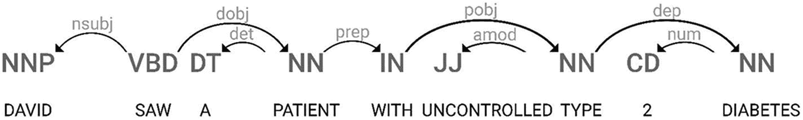

图 4-21

依存句法分析

依存语法分析记号之间不对称的二元关系。NLTK 的斯坦福解析器通常用于此目的。

使用图 [4-21](#Fig21) 中的例子，解析树确定单词的根为“saw ”,然后通过子树链接。子树按主体和客体分开，每个子树还显示依赖关系。

### 词性标注

工具包，NLTK 方法，word_tokenize

词性标注涉及将句子中的每个单词或标记与词性标签相关联。这些标签是你在小学学过的基本英语标签，决定名词、动词、形容词、副词、数字等等。

这对于构建解析树等任务特别有用，解析树反过来可用于确定什么是什么、情感分析、确定问题的适当答案或理解类似实体(见图 [4-22](#Fig22) )。

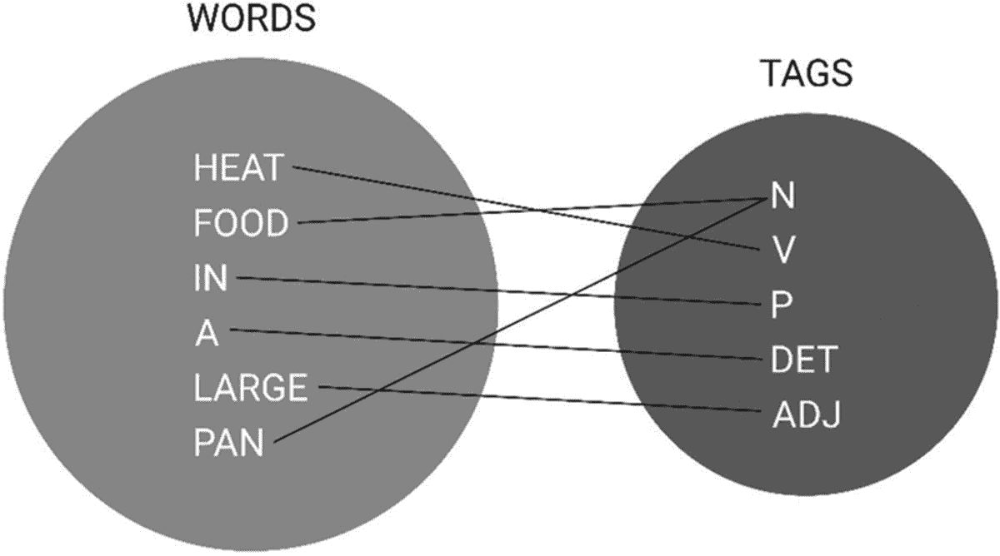

图 4-22

词性标注

词性标注是几个领域辅助的基础。

#### 减少歧义

一些句子在给定的结构下有多重含义；举下面两句话为例:

"我设法在火车上读完了我的书。""你能帮我订火车票吗？"

词性标注将“book”在第一句中标识为名词，在第二句中标识为动词。

#### 识别特征

通过识别单词不同上下文的语音类型，词性可以区分不同的用法，并创建更强的使用功能。

#### 正常化

词性标注是规范化和词条化的基础，是理解句子结构和依存关系的基础。

#### 停用词删除

词性对于从文本中删除常用词或停用词很有用。

## 语义分析

语义分析是自然语言处理中最复杂的阶段。它从文本中提取确切的意思或字典中的意思。使用关于上下文中单词和句子结构的知识，可以规定单词、短语、句子和文本的含义，随后还可以规定它们的目的和结果。

## NLP 中使用的技术

一旦对语料库进行了数据预处理、词汇、句法和语义分析，我们就需要将文本转换成数学表示，以便进行评估、比较和检索。例如，在一组患者资料中搜索患有“高血压”的用户，应该只显示那些患有高血压的用户。这是通过将文档转换成向量空间模型来实现的，该向量空间模型具有对于查询排名和搜索检索来说必不可少的评分和术语加权。

文档可以是病历、网页、数字化书籍等形式。以下算法是比较和评估过程中的典型算法。

### N-Grams

python:NLTK；方法:ngrams

n-gram 用于许多 NLP 问题。如果 X =给定句子 K 中的单词数，则句子 K 的 n-grams 数将是

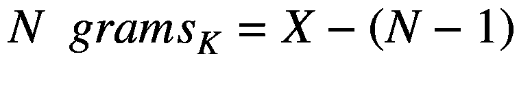

例如，如果 N = 2(二元模型)，句子“David 逆转了他的代谢综合征”将产生以下 N 元模型:

*   大卫倒车了

*   逆转他的

*   他的新陈代谢

*   代谢综合征

N 元文法保留了文本输入中 N 个条目的序列。N 元文法可以有不同的 N 值:当 N = 1 时是一元文法，当 N = 2 时是二元文法，当 N = 3 时是三元文法。

n 元语法广泛用于拼写纠正、单词分解和文本总结。

### TF–IDF 向量

文档可以表示为单词空间中的高维向量。向量中的每个条目对应于文档中的不同术语及其出现次数。TF–IDF(术语频率–逆文档频率)向量方案使用以下公式为文档中的每个术语分配一个权重:

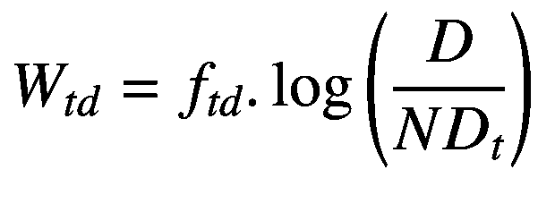

每个术语的权重(W <sub>td</sub> )通过将术语的频率(f <sub>td</sub> )乘以文档总数的对数(D)除以该术语至少出现一次的文档数(ND <sub>t</sub> )来计算。术语的顺序不一定保持不变。

然后，可以使用所收集的术语的权重来确定特定术语在其中具有高频率的文档。TF–IDF 向量的集合可以用来表示用户的兴趣。

### 潜在语义分析

在存在大量文档的语料库的情况下，对于每个文档 d，表示每个文档的向量的维数通常可以超过几千。潜在语义分析依赖于这样一个事实，即直觉上，文档中的术语可能经常是相关的。例如，如果文档 d 包含术语“海”,它通常会包含单词“海滩”。

等效地，如果表示 d 的向量在 sea 条目中具有非零分量，则它在 beach 条目中也将具有非零分量。如果可以检测到这种结构，就可以从数据中自动学习单词之间的关系。

单词 document 由矩阵 A 表示，使用奇异值分解对其进行分解，以给出最重要的相关性的强度及其方向。

的分解允许人们通过术语和它们在文档中的意义之间的相关性来发现文档的语义。潜在语义分析方法可以被应用来确定各种材料的上下文，以向 web 用户呈现上下文相关的结果。

### 余弦相似性

Python，SciPy 方法，余弦

余弦相似性是度量两个向量之间相似性的度量。因此，这既可以用来定义两个文档之间的相似性，也可以用来定义一个文档和一个查询之间的相似性。

两个向量之间的余弦相似度可以定义如下:

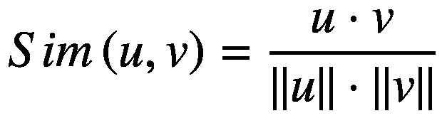

两个向量之间的相似性被计算为向量的内积除以所讨论的向量的长度的乘积。直觉上，两个文档之间的角度越大，它们就越不相似。这适用于任何 N 维空间中的向量。

此外，TF–IDF 向量方案可以与余弦相似性度量相结合，以确定搜索查询和大量文档之间的相似性:

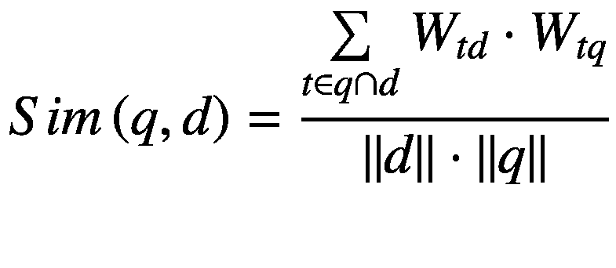

查询 q 和文档 d 之间的相似性被计算为文档和查询中的术语的 TF-IDF 权重与查询和文档中的所有术语之和的乘积；这除以文档长度和查询长度的乘积。然而，实际上，随着所使用的文档数量的增长，计算 Sim(q，d)将被证明在计算上是昂贵的。

### 朴素贝叶斯分类器

贝叶斯分类器基于贝叶斯定理，尤其适用于输入维数较高的情况。尽管简单，朴素贝叶斯经常胜过更复杂的分类方法。

给定一个指定的阈值，该方法可以用于对表示文档的向量是否是用户感兴趣的概率进行分类。给定一个属性 d，我们可以用下面的公式计算这个例子是否属于 C 类:

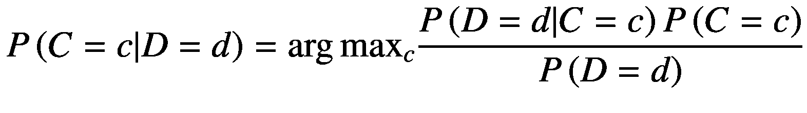

kNN 和 ANN 等其他技术也可用于分类和检索信息。

## 遗传算法

遗传算法(GA)是机器学习中一个令人着迷的话题。遗传算法从进化中获得灵感以最小化错误率，试图模仿染色体的功能，就像神经网络试图模仿人脑一样。

进化被认为是最佳的学习算法。在机器学习中，其应用是在模型中，由此产生几个候选答案(称为染色体或基因型),并且成本函数应用于所有答案。

在遗传算法中，定义了一个适应度函数来确定染色体是否足够适合交配。远离最佳结果的染色体被移除。染色体也会发生突变。遗传算法是一种搜索和优化学习器，适用于离散和连续问题。

接近最优解的染色体可以被组合。染色体的结合或交配被称为交换。适者生存的方法识别旨在表达符合自然选择的特征的染色体——后代比父母更优。

变异有助于克服过度拟合。这是一个克服局部最优并找到全局最优的随机过程。突变有助于确保孩子的染色体与父母的不同，并继续进化。

染色体变异和交配的程度是一个可以控制或留给模型学习的参数。

遗传算法有多种应用:

*   眼科成像中的血管检测

*   检测 RNA 的结构

*   金融建模

*   安排车辆路线

一组染色体称为一个群体。虽然它保持在一个定义的、恒定的大小，但它通常会在几代人或一段时间内进化到更好的平均预测。

染色体 c 的评估被计算为其评估函数值除以代的平均值，表示如下:

*   **适合度(c)**= g(c)/(g 在整个群体中的平均值)

霍兰德在 20 世纪 70 年代早期发明了 GA 方法(见图[4-23](#Fig23))[ 81]。染色体选择的自动化被称为遗传编程。

## 最佳实践和注意事项

掌握机器学习的艺术需要时间和经验。然而，有几个方面值得考虑，特别是对于机器学习的初学者，以确保最佳的时间利用和最佳的模型效率。

### 良好的数据管理

由于机器学习任务中使用的数据量和复杂性，正确的数据管理至关重要。这不仅涉及数据管理所需的流程、策略、程序、权限和认证，还包括培训数据的管理和转换，以学习最佳模型。

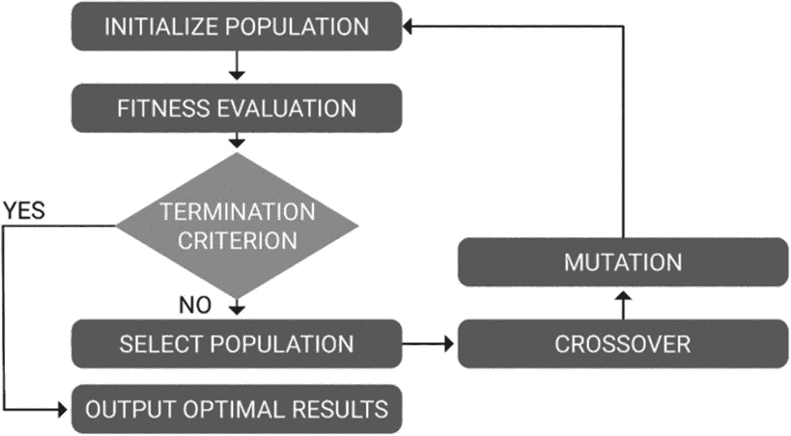

图 4-23

遗传算法的基本结构

### 建立绩效基线

有一个基线来衡量你的算法相对于其他迭代和模型类型的性能是至关重要的。因为没有一种完美的算法可以解决所有问题，所以尝试多种算法来识别模型的相对性能。

### 花时间清理你的数据

训练机器学习模型所需的时间在算法之间有很大的不同。数据的准确性和花在训练模型上的时间会积极地影响模型的准确性。花时间清理数据，以确保预测尽可能可靠。

通常情况下，并非所有的输入变量都会影响因变量或结果。确保模型使用的变量不包括那些不相关的变量。

### 训练时间

如果数据的维数很大而计算能力有限，训练时间将会很长。当时间紧迫时，考虑不需要大量训练的机器学习算法是有用的。例如，神经网络可能不适合有时间限制的任务。

### 选择合适的模型

一些机器学习算法对数据结构或期望的输出做出特定的假设。因此，考虑模型选择以及它是否是合适的方法是有帮助的。利用正确的模型有很多好处，包括更准确的预测、更快的训练时间和更有用的结果。

一些机器学习模型可以抵抗异常值或非参数测试。例如，基于决策树的方法通常根据阈值将节点分为两类。因此，数据异常值在基于树的方法中影响较小。

评估一系列模型是机器学习的一种有用方法。奥卡姆剃刀一般用于选择模型。奥卡姆剃刀试图找出在其他条件相同的情况下，实现预期产出的最直接的模型。

### 选择合适的变量

虽然在机器学习问题中通常需要更多的数据，但出于多种原因，通常最好使用较少的预测变量。

### 裁员

增加训练数据集中变量的数量会增加模型学习它们之间隐藏关系的机会。识别不必要的变量并在模型中仅使用非冗余的预测变量是至关重要的。正在学习冗余连接的模型将影响模型准确性。

### 过度拟合

即使模型中的预测变量之间没有关系，使用较少的变量仍然是有益的。复杂的模型，或者那些使用大量预测变量的模型，通常会过度拟合。

模型在训练数据集上表现良好，但在验证和真实世界设置上不太准确，因为它们学习数据内的误差(即噪声)，而不是变量之间的信号或关系。

### 生产力

即使复杂的机器学习模型中的所有变量都是相关的，使用大量可以影响生产率的预测变量也会产生实际影响。

实际考虑因素包括可用数据量、对存储的后续影响、计算资源、相关成本、分配给项目的时间以及学习和验证所需的时间。预测变量可以通过特征选择来识别，或者通过特征提取来转换。支持向量机在数据维数增加的情况下非常有用。

帕累托原则(或 80/20 法则或重要的少数法则)是机器学习项目中使用的一个有用的衡量标准。使用帕累托原则，关注 20%最重要的预测变量应该有助于在合理的时间内建立相对成功的模型。微软了解到，Windows 和 Office 中 80%的错误和崩溃是由检测到的 20%的错误引起的[82]。

Pareto Principle

“帕累托原则”是观察到大约 80%的结果来自 20%的原因。经验表明，许多自然现象都表现出这种分布。

### 易懂

预测变量较少的模型更容易可视化、理解和解释。一个成功的机器学习项目的一个关键方面是所有的利益相关者都能理解这个模型。这通常需要数据科学家进行权衡。

通过减少预测变量的数量，机器学习模型的成功率有可能会降低。然而，这同时使模型更容易解释和理解。

这种方法的有用性只有在项目接近尾声时才能实现，这时不仅要共享模型的性能，还要共享它是如何工作的。这在医疗保健行业尤为重要，因为人们担心使用黑盒模型。

### 准确

任何机器学习模型都旨在很好地进行概括。根据使用情况，近似值可能比精确、准确的输出更有益。通过近似值，模型往往可以避免过度拟合，并减少处理所花费的时间。

### 假阴性的影响

在部署到真实环境之前评估模型的影响时，要考虑假阴性的影响。例如，以一个对乳腺癌风险进行分类的预测模型为例。假阳性意味着患者被告知他们患有乳腺癌，而他们并没有，这应该在治疗过程的后期被识别。然而，假阴性意味着乳腺癌患者不会被通知——这可能更糟糕，成本更高。

### 线性

许多机器学习算法假设关系是线性的——换句话说，可以通过最佳拟合的直线或其高维表示来分隔类别。有些情况下关系不是线性的。在存在非线性类别边界的情况下，依赖线性分类算法将导致低准确度。

例如，线性回归假设输入和输出变量都不包含噪声。暴露数据中的信号以确保模型学习信号或数据中的正确关系是至关重要的。识别和移除输出变量的异常值是有利的，特别是为了减少学习噪声的机会。

具有非线性趋势的数据可能需要进行转换以使关系成为线性，例如，对存在指数关系的数据进行对数转换。

线性算法通常是机器学习场景中首先尝试的方法。作为线性的结果，算法简单且训练快速。

### 因素

每个机器学习模型都受制于参数和超参数。训练模型所需的时间和资源随着参数数量的增加而增加。算法的参数是模型使用的变量，其值可以从数据集进行估计。

算法的超参数是模型外部的变量，用于估计参数。超参数的值不能从数据中估计。相反，它是由数据科学家随机或以其他方式设置的，或者通过使用试探法设置的。

### 全体

在特定的机器学习问题中，使用投票、加权和组合技术将分类器分组在一起以识别最准确的分类器可能被证明是更有用的。集合学习者在这方面非常有用。

## 用例:糖尿病智能护理

二型糖尿病是全球人口面临的最重大的健康和经济负担之一，每 6 秒钟就有 1/6 的人死于糖尿病或其相关并发症[83，84]。

疾病的发展涉及许多因素，如果解决了这些因素，可以通过有针对性的治疗方案来帮助防止疾病的发展，从而降低患者的发病率和死亡率。健康生物标志物形式的数据(通常为血糖、HbA1c、空腹血糖、胰岛素敏感性和酮类)用于了解和监控疾病负担和治疗反应。

由于二型糖尿病的巨大负担，在该领域开发智能模型方面已经有了大量的投资，主要集中在通过机器学习和数据挖掘来诊断、预测和管理病情。

许多机器学习技术已经应用于二型糖尿病数据集。传统技术、集成技术和无监督学习(尤其是关联规则挖掘)已被用于识别具有最佳准确性的预测模型。

### 预测血糖

Georga，E. I .等人在从 15 名 1 型糖尿病患者收集的许多特征上使用随机森林决策树来预测短期皮下葡萄糖浓度[85]。通过使用支持向量机预测葡萄糖浓度。

该研究得出结论，包括两个生物标志物特征——氧化应激标志物 8-羟基-2-脱氧鸟苷和白细胞介素-6——提高了分类准确性。

### 预测风险

Farideh Bagherzadeh-Khiabani 等人使用 10 年来收集的 803 名女性前驱糖尿病患者的临床数据集(包括 55 个特征)来开发预测二型糖尿病风险的多个模型[86]。该研究开发了一个逻辑模型，展示了包装模型，即考虑特征子集并提高临床预测模型性能的模型。这被开发成一个 R 程序来可视化输出。

Summers，Panesar 等人开发了一个模型，该模型由为糖尿病前期和肥胖症患者收集的 34 个特征组成，用于根据超过 200，000 名使用低碳水化合物计划数字健康干预的人的健康和参与结果来预测患二型糖尿病病的风险。这是用 Python 开发的，并部署在云上，以评估患者风险和获奖数字疗法的适用性[16，58]。

Razavian 等人进行了另一项广泛的研究，确定二型糖尿病预测模型可以准确地从人口规模的数据集[87]中推导出来。2005 年至 2009 年间，从超过 400 万名患者中收集了超过 42，000 个变量。机器学习被用来确定相关特征，最终减少到大约 900 个。确定了二型糖尿病的新危险因素，如慢性肝病、高丙氨酸氨基转移酶、食管反流和急性支气管炎史。

duygu aliir 等人开发了一个二型糖尿病自动诊断系统，通过使用线性判别分析和 SVM 分类器，分类准确率接近 90%[86]。潜在狄利克雷分配(LDA)用于区分健康患者和二型糖尿病患者之间的特征，然后将其用作 SVM 分类器的输入。第三阶段在确定输出之前评估灵敏度、分类和混淆。

### 预测其他疾病的风险

机器学习同样被应用于诊断与糖尿病相关的其他疾病的风险。

Lagani 等人确定了对心血管疾病(心脏病或中风)、低血糖、酮症酸中毒、蛋白尿、神经病变和视网膜病变等并发症具有最佳预测准确性的最少临床变量集[88]。

黄等人使用基于决策树的预测模型来识别患者的糖尿病肾病[89]。Leung 等人比较了几种方法:偏最小二乘回归、回归树、随机森林决策树、朴素贝叶斯、神经网络和支持向量机的遗传和临床特征[90]。患者年龄、诊断年限、血压、子宫珠蛋白基因多态性和脂质代谢是二型糖尿病最有效的预测因素。

Summers 等人开发了一个预测模型，利用由 120 多个特征组成的数据集来识别共病抑郁症和糖尿病相关的痛苦。Summers 等人探索了几种技术，包括随机森林决策树、支持向量机、朴素贝叶斯和神经网络。患者年龄和就业状况被定义为最有可能影响预测准确性的变量[16，86]。

无监督学习主要集中在关联规则挖掘上，识别糖尿病患者中风险因素之间的关联。Simon 等人提出了关联规则挖掘的扩展，称为生存关联规则挖掘，包括生存结果，并对混杂变量和剂量效应进行了调整[86]。

### 逆转疾病

对二型糖尿病的理解已经被过去 15 年中真实世界证据的产生彻底颠覆了。以前，二型糖尿病被认为是一种慢性进行性疾病。

低碳水化合物计划数字健康干预有助于证明，通过可扩展的数字治疗，支持糖尿病前期和二型糖尿病缓解，可持续的体重减轻是可以实现的。该平台的同行评审证据显示，54%减少或取消了糖尿病药物治疗，71%在 1 年内保留。

低碳水化合物计划成功的一个关键驱动因素是实施了一个预测模型，以确定最有可能吸引患者的教育模块、资源、食谱和讨论思路。这导致应用程序本身根据关键特征(包括种族、年龄、性别、位置、语言、每周食物预算、饮食偏好、健康状况和合并症)向每个患者显示不同的体验。

这使用患者的数据来提供个性化的定制护理，以最好地授权决策并提供全天候支持。这种方法的好处是不言而喻的，四分之一的患者在 1 年内达到二型糖尿病缓解。低碳水化合物项目的成果已经被用来影响公共营养政策和指导方针。该应用程序在英国国民医疗保健系统中被评为糖尿病应用程序第一名[91，92]。

机器学习经常专注于预测和诊断疾病。机器学习在逆转疾病方面的应用为我们提供了支持改善行为和重新定义过时范式的希望。