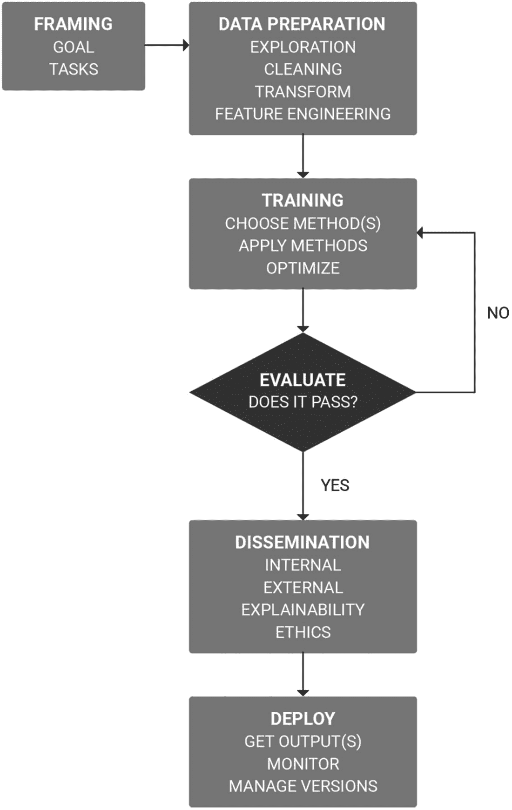
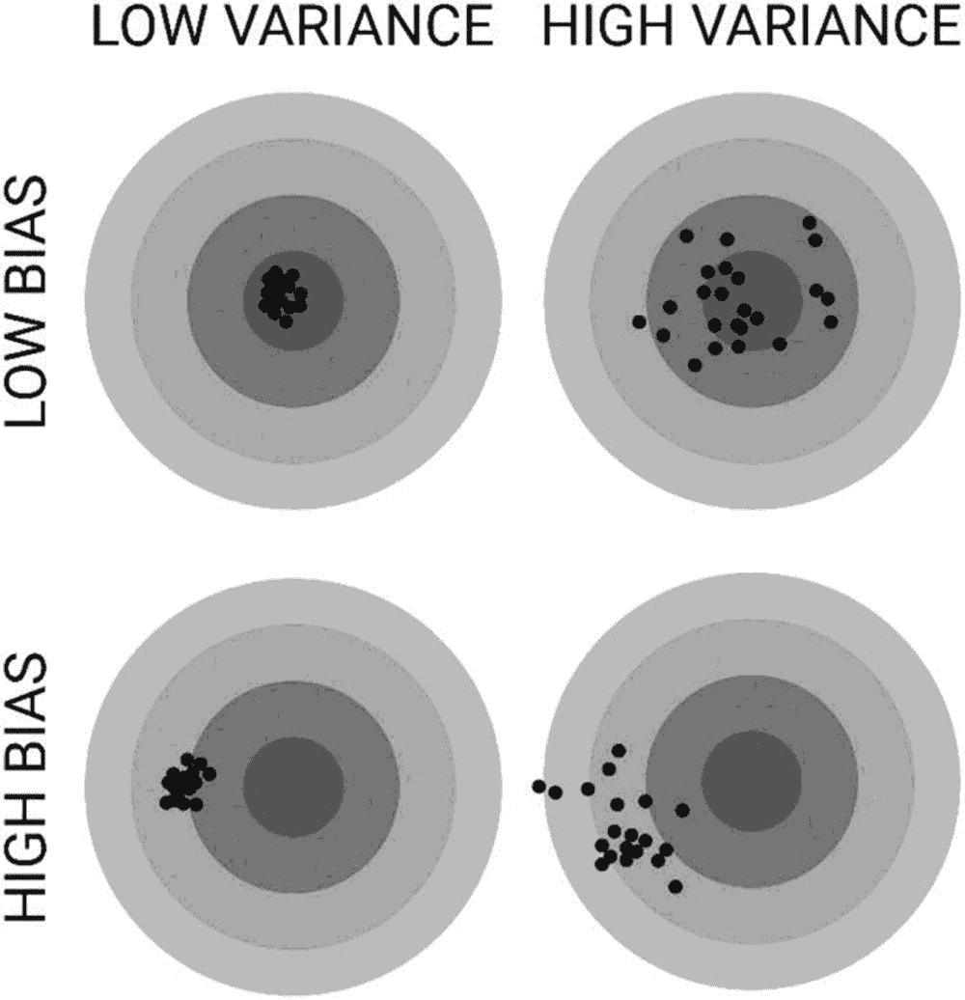
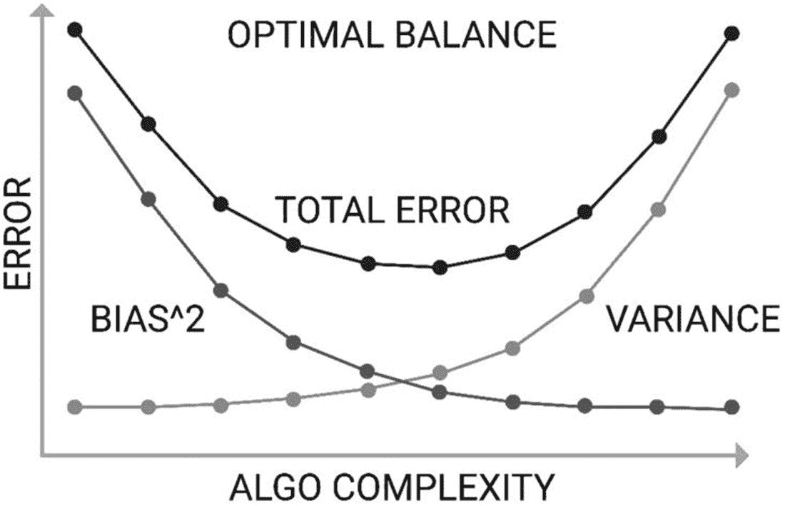
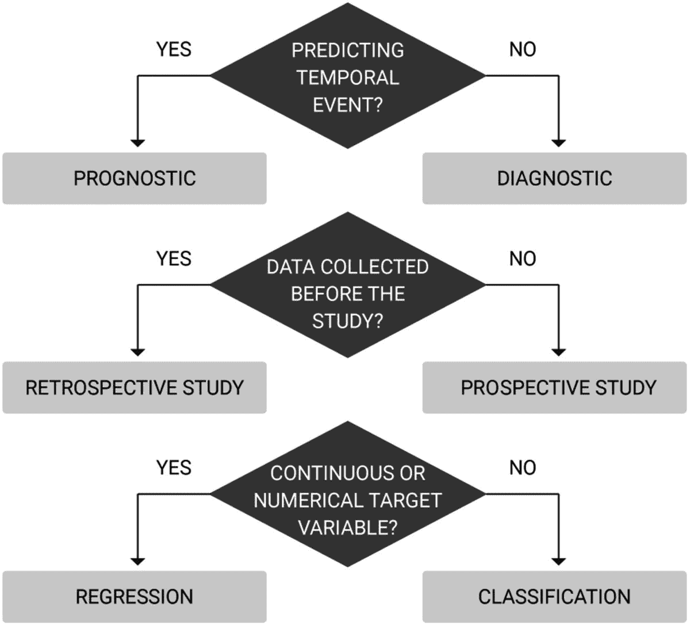

# 5.如何执行机器学习

> *机器学习可以扩展我们的生活、能力和容量。*
> 
> —哈克里山·帕内萨尔

机器学习是计算机科学中一个快速发展和令人兴奋的学科，融合了一系列技能，包括探索和发现、工程和分析。机器学习使用大量的事实和历史数据来帮助我们更好地理解行为。

虽然乍一看似乎令人生畏，但机器学习的一步一步的方法及其先决条件可以用来指导一个成功的项目，而不需要成为专家统计学家或程序员。虽然数学和编程知识肯定是有利的，但许多机器学习算法是现成的，并且使用预先存在的库，因此很少需要从头开发新的算法。

机器学习项目的方法和它试图解决的问题一样独特。然而，机器学习或数据科学项目的生命周期中涉及的工作流是作为一种方法来详细使用的。

## 进行机器学习项目

对进行机器学习项目所涉及的工作流的评估突出了项目团队中所需的技能，并有助于与其他人交流这些技能。

机器学习项目的目标是开发算法，从它们被训练的数据中的信号中学习。

在用于开发机器学习模型的方法中有七个定义的工作流(图 [5-1](#Fig1) )。这些阶段中的每一个都可以迭代执行，这意味着工作流可以在流程的任何步骤中重复。

图 5-1

执行机器学习项目所涉及的工作流

1.  框架:将手头的问题指定为学习任务(并在继续之前识别它是否是机器学习问题)

2.  数据准备:包括数据探索、分析、洞察和清理

3.  训练模型:选择学习方法，应用它们来创建模型，并尝试优化所创建的模型

4.  评价:对方法和结果的客观评估

5.  传播:向利益相关者报告评估结果，并确保可解释性

6.  部署:发布经过训练的机器学习模型，监控正在进行的使用和准确性

### 框架:说明问题

当涉及到机器学习时，第一件事就是指定问题。这包括理解问题是什么，机器学习项目的目标，以及如何评估实现目标的尝试。理解你为什么想要解决这个问题是有用的，尤其是如果你正在为一个机器学习项目创建一个预算案例。这包括评估以下内容:

*   为什么重要？

*   你希望达到什么目标？你最大的希望是什么？

*   手头任务的输入和输出是什么？

*   这个数据有吗？

*   结果将如何有益？

*   这是探索性的吗？

*   什么是 KPI(关键绩效指标)；如何衡量绩效？

*   成功是什么样子的？

*   我们手头有尝试这项任务的人才吗？

*   手头任务的局限性是什么？这可能包括时间、资金、技能、经验、领域知识、数据可用性等等。

为了解决这个问题，你可以得到的数据将包括例子和背景信息。

#### 收集示例

分类是一种技巧，可以通过例子学习。它可用于预测任务，如疾病风险或资源需求预测。

某些问题出现在传统的保健环境中，例如来自医疗预约的数据和具有补充手写笔记的某些诊断。坏的例子会导致错误。对于分类，典型地以正面和负面的形式提供例子。

#### 背景资料

这是指与机器学习问题相关的知识和公理。这可能包括元数据、属性或概念之间的关系。

例如，在高血压预测工具中，基于医学证据和数据，二型糖尿病的诊断将与高血压的可能性相关。这是在所学概念中用来实现分类的信息。

#### 数据中的错误

请注意，现实世界中的错误可能会悄悄出现，例如，人为错误、不正确的分类、丢失的数据、不正确的背景信息和重复的数据。

例如，纸质文件的数字化和书面文本的机器阅读可能会产生错误。重要的是要记住，模型的好坏取决于它所提供的数据。值得花时间验证数据，以确保将人为错误降至最低。

### 数据准备

机器学习算法从它们被训练的数据中学习。为模型提供有效和可靠的数据以供学习是至关重要的。

数据必须以可用的格式准备。在现实世界的场景中，这将涉及理解将用于建模问题的数据并导出数据。然后，必须对数据进行处理，以确保格式正确，删除错误数据，并修复任何丢失的数据。数据集大小可能超过要求，因此可能还需要数据集采样。

每个机器学习候选人都会获得数据准备方面的技能。数据预处理对于获得整洁、有效的数据至关重要。整洁、有效的数据是获得可靠、准确结果的关键。为了开发一个高度适用于领域的机器学习模型，高效实现算法的技术专家必须与能够理解数据、对数据进行分类并找出趋势和模式的领域专家合作。

数据准备是机器学习最重要的方面。

#### 我需要多少数据？

遗憾的是，这个问题没有明确的答案——要看情况而定。这是您通过训练您的模型并在现实世界中部署它来探索的事情。

几个因素会影响“学习曲线”这些包括问题的复杂程度和算法的复杂程度。这反过来会影响所需的数据量。该模型能否得出真实世界中的准确性取决于算法的复杂程度和所提供数据的质量。

评估更多数据的可用性和有用性。在医疗保健环境中，药物随机对照试验很少在任何给定的环境中评估超过 1，000 名患者。在外科手术环境中，访问更大的数据是可能的，但可能不是训练模型所必需的。

非线性的非参数算法需要更多的数据来提高精确度。这些通常是更强大的机器学习方法。然而，由于数据的有效性会影响偏差和方差，因此尽可能高效地对尽可能多的数据进行稳健的训练和验证是非常关键的。

### 训练机器学习模型

机器学习新手的标准问题是“我应该使用哪种算法？”算法的选择取决于几个因素，包括数据的大小、质量和性质；任务截止日期；以及使用数据的可用资源和动机。学习技术也被称为“解决方案的表示”，因为每种机器学习方法都以不同的方式表示数据。算法本身是现成的，不需要从头开始编码。

也就是说，一些算法比其他算法更适合特定的问题，这有助于决定尝试哪些算法:

*   分类:逻辑回归，支持向量机，随机森林，朴素贝叶斯

*   回归:线性回归

*   特征约简:主成分分析，线性判别分析

*   聚类:k 均值，LDA

*   协同过滤:交替最小二乘法

几乎不可能预测哪种方法对数据的处理效果最好。即使模型在训练和验证过程中表现良好，也不能保证它在现实世界中表现良好。

No Free Lunch

机器学习中的“没有免费的午餐”定理指出，没有一种算法对每个问题都是最好的。这与监督学习特别相关，因为有许多因素影响算法的性能。

#### 应该用什么编程语言？

机器学习任务通常用各种编程语言来执行:主要是 R、Python、Matlab 和 SQL。Java 和 C 也是常用的。

*   r 通常用于统计分析。它允许您使用统计方法和图表来理解和探索数据，并包含广泛的机器学习算法。

*   Python 是一种非常适合机器学习的语言。numpy 和 SciPy 等扩展对于机器学习和数据分析特别有用。

*   Matlab 是许多大学生开始学习的语言。它对于快速原型制作很有用，因为它包含了一个大型的机器学习知识库。

*   SQL 是一种用于管理传统数据库管理系统(DBMS)中的数据的语言。

#### 我应该从头开始编写我的机器学习算法吗？

需要从影响方法的资源和价值角度做出几个决定。一个概念验证项目可能需要很短的时间，而一个高度具体和复杂的任务将包含多种方法。

完全可以通过实现 scikit-learn、SciPy、pandas、Matplotlib、TensorFlow、Keras 等学习库提供的现成算法来运行机器学习算法。

这是机器学习的传统方法:建立一个数据科学团队，其中包括熟悉 Python 和 r 等语言的成员。具有机器学习经验的成员通常比那些机器学习概念的初学者更有影响力。

工程师通过经验发展对适当的机器学习技术的理解，以用于给定的特定问题。这种经历对于避免浪费时间、资源和探索是至关重要的。

具有计算机科学基础的工程师通常熟悉机器学习中的许多概念。选择一种编程语言会影响您在实现中可以使用的 API 和标准库。爱好者可能希望避免使用现成的算法，自己编写实现代码，以获得更多的数学、统计和逻辑知识。

在许多时间有限的情况下，激发工程热情的时间是有限的。基于云的服务，如谷歌人工智能、微软 Azure、IBM Watson 和许多其他提供商允许提供商负责算法；并且许多提供可视界面，使得用户能够对上传的数据尝试特定的机器学习技术。

提供数据挖掘和机器学习应用程序的基于云的供应商正在增长，并且可以以低成本获得。使用这些供应商的好处之一是能够尝试多种类型的模型进行实验并比较结果，从而为您的问题任务找到最佳解决方案。

对于那些有传统编程经验的人来说，几乎所有的都提供 API 或 web 服务创建工具，允许你创建一个接口来使用托管模型。与 API 集成所需要的只是一个高效的传统程序员或 web 开发人员。

随着世界采用开源，考虑通过 GitHub、Reddit 和其他机器学习论坛浏览已经存在的实现。

API 代表应用程序编程接口。API 支持软件组件之间的通信，特别是可以用于基于云的机器学习提供商和内部开发团队之间的接口。有许多公共 API 可以用来帮助您完成机器学习任务。

嵌入机器学习 API 应该谨慎小心。在日益开放的源代码环境中，以及良好的文档和功能，确保有受欢迎程度和健壮性的可见显示，如 GitHub 状态、搜索引擎受欢迎程度和对话。

#### 培训和测试数据

从准备好的数据中选择测试集和训练集。该算法在训练数据集上进行训练，并针对测试数据集进行评估。

在很多情况下，这是一个尝试几种机器学习方法的案例。当涉及机器学习建模时，理解两个术语是有用的:

*   信号:数据集中真正的潜在模式

*   噪声:数据集中随机或不相关的模式

一些机器学习技术可能会返回一个解决方案，而其他技术可能会产生几个解决方案。通常是收集他们的输出(也称为假设或学习模型)并评估他们的输出。

对假设的评估是通过评估预测的准确性、可理解性或实用性来进行的。在大多数情况下，使用奥卡姆剃刀，如果其他条件相同，则选择最简单的解决方案。评估完成后，选择一个候选假设。

有各种方法可以将数据划分为训练和测试数据集，以训练机器学习模型。

##### 预测准确性

预测准确度是指代理执行分类任务的准确度。

##### 能理解

可理解性是指我们人类对输出的理解程度。在现实世界中，这可以转化为许多不同的设置。

两个脸书机器人最近开始用人类无法理解的语言相互交流。

##### 效用

效用是指特定问题的价值衡量。例如，在药物合成中，对人类消费不安全的化合物的组合可能是最佳组合。这不会有最大的效用。同样，这可能会忽略准确性和可理解性。

#### 抑制方法

保留方法是一种简单的训练方法，可用于保留一部分数据进行测试，将剩余的数据用于训练，并验证模型。

测试通常会给出模型有效性或准确性的指标。

#### n 重交叉验证

n 重交叉验证包括将数据集分成大小相等的实例组(或折叠组)。然后，在除一个折叠之外的所有折叠上训练该模型，并在最后的省略折叠上测试该模型。这个过程被重复，并且每一个折叠被省略一次迭代。

折叠的数量可以根据数据集的大小而变化。常见的褶皱有三层、五层、七层和十层。目标是在训练和测试数据集中平衡数据的大小和表示。它使模型能够在不同的数据集上测试 n 次。这使我们能够充分利用数据，对其进行 n 次训练。

一些机器学习文本可能将交叉验证称为机器学习过程的交叉验证阶段。这是因为机器学习工程师经常使用这种方法来降低过度拟合的可能性。

#### 蒙特卡罗交叉验证

蒙特卡洛交叉验证类似于 n 重交叉验证。它包括将数据集随机分为训练数据和测试数据。根据训练数据调整模型，并使用测试数据评估预测准确性。然后对分割结果进行平均。

#### 我应该使用哪些算法？

要使用的算法通常从一开始就不容易识别。尝试一些与你的问题相关的技巧。这允许你根据准确性、可理解性和实用性来比较和选择解决方案。在尝试各种算法之前，即使是最有经验的数据工程师也无法判断哪种算法执行得最好。

所有的机器学习软件都支持多种算法。通过尝试尽可能多的可行算法来找到该作业的最佳算法。

### 方法和结果的评估和优化

机器学习任务的性能根据给定数据的表示而变化。例如，人工智能系统分析的患者记录不会直接检查患者。取而代之的是，数据被输入到一个系统中，每一条与患者表现相关的信息被称为一个特征。没有必要要求完整的要素集作为表示的一部分来获得高度可信的输出。

机器学习算法的目标是很好地概括，既不欠拟合也不过拟合。泛化指的是模型在训练期间没有看到的实例上以最大的准确度执行。

机器学习项目的评估方法将在第 [7](07.html) 章中详细讨论。

#### 算法精度评估

许多监督学习问题有二进制分类，其中的问题是学习一种将看不见的数据分类到两个类别之一的方法。这些被称为积极和消极类别:

*   如果从二进制分类代理获得的新数据的输出本应被分类为阴性，但被分类为阳性，则接收到**假阳性**。

*   **假阴性**是指代理将新数据归类为阴性，但这是不正确的。

在许多医疗环境中，假阳性不像假阴性那么糟糕。例如，这种情况下的假阳性可能包括基于一组特定症状对患者进行的疾病诊断。显然，被告知你有某种疾病而实际上没有，比被告知你没有某种疾病，而只是被告知事实上有更好。假阴性意味着某人没有被诊断出来，这可能更令人担忧。

测量特定假设在测试数据集上的预测准确性的一个简单方法是计算正确识别的结果(包括正面和负面)的数量。

例如，如果心脏病工具学习了一个假设，并给了 250 个新的候选人来分类为患有心脏病，并且正确地分类了 150 个阳性中的 133 个和 100 个阴性中的 98 个，那么它的准确度将为

*   (133 + 98)/250 = 92.4%

这将是一个 92/100 的机会正确分类一个看不见的例子。

概括是用准确性来衡量的。欠拟合和过拟合都会导致模型性能不佳，并且不利于精度。如果一个模型在测试中的分类准确率为 92%,但在看不见的数据上只有 30%,我们会说这个模型不能很好地从训练中推广到看不见的数据。

这太合身了。过度拟合是指模型与训练数据拟合得太好。它记忆答案，而不是从中学习概念。在这种情况下，模型无法区分信号和噪声，并学习数据中存在的噪声。因此，模型不理解数据中的实际模式或信号。该模型不适用于对模型的概括能力有害的新数据，并且该模型是无用的。决策树是可以过度拟合训练数据的算法的例子。这可以通过修剪来改善。在许多情况下，这是一个让事情出奇简单的例子。

如果模型在训练数据集上的表现优于未见过的测试集，则该模型可能会过度拟合。交叉验证是一种用来衡量过度拟合的技术。此外，用更多数据进行训练可能有助于算法更好地推断假设。

“数据越多，结果越好”的概念是误导性的。在许多情况下，更多的数据可能会有所帮助。然而，更多的数据并不意味着好的数据。如果添加有噪声的数据，也无助于减少过度拟合。因此，这就是为什么确保数据的干净和适当是至关重要的。

当您用来训练机器学习模型的数据中包含您试图预测的信息时，就会发生数据泄漏。这导致泛化能力差，并导致过度拟合。数据泄漏可能发生在测试数据泄漏到训练数据或附加特征中。数据泄露的一个简单例子是一个模型，该模型使用响应变量本身作为预测因子，从而得出“结膜炎患者患有结膜炎”的结论。

如果你的机器学习算法的性能好得不真实，数据泄露可能就是它存在的原因。n 重交叉验证有助于减少数据泄漏。

欠拟合很容易检测，因为它的性能很差。它指的是无法对训练数据建模或归纳为新数据的模型。通常，这将由特征太少的简单模型来表示。结果往往显示偏差超过方差(即错误的结果)。

#### 偏差和方差

监督机器学习旨在理解数据集的信号，同时忽略噪声。

存在最小化预测误差的两个来源的机器学习困境，这两个来源阻止监督学习算法泛化到它们的训练集之外。在模型最小化偏差和方差的能力之间有一个权衡(也称为偏差-方差权衡)。

#### 偏见

偏差是指模型从错误数据中学习产生的误差。虽然这听起来很奇怪，但数据集可能会随机出现。偏差通常衡量这些模型的预测与实际正确值或真实信号的差距:

*   低偏差:更好地理解数据集的真实信号

*   高偏差:对数据集真实信号的理解较差

高偏差通常表明有更好的机器学习技术可用。

#### 变化

这是指由于对训练集中的波动的敏感性而产生的误差:

*   **低方差**算法基于数据集输出相似的模型。

*   **高方差**算法基于数据集输出充分不同的模型。

偏差和方差可以用一个飞镖靶类比来说明(见图 [5-2](#Fig2) )。拿一个镖靶来说，镖靶的靶心代表一个完美预测正确值的模型。

图 5-2

图示偏差和差异

当你离靶心越远，预测就越糟糕。如果每个新的模型都由一个新的飞镖来代表，那么在训练数据存在可变性的情况下，每个投掷都将代表该模型的一个实现。有了用于训练的良好的数据分布，模型可以很好地预测。

带有异常和冗余的数据将导致不良预测。这可以在飞镖靶上看到。

工程师必须对机器学习算法做出的权衡是，低偏差的算法必须灵活，以使其能够很好地适应数据。但是，如果有太多的灵活性，每个数据集将被不同地解释，并具有很高的方差。有几种降低算法复杂度的方法，在第 [4](04.html) 章中讨论。

许多监督学习工具包提供了自动控制偏差-方差权衡的方法，或者通过提供一个可以调整的参数来控制。

与低偏差算法相比，低方差算法往往具有降低的复杂度。低方差算法具有简单或严格的结构，导致模型一致，但平均起来不准确。这包括回归、朴素贝叶斯等算法。

低偏置算法往往更复杂，结构更灵活。结果，它们平均起来是准确的；但是，它们可能不一致。这包括非参数算法，如决策树和 k-最近邻。

项目的关键是找到偏差和方差之间的平衡，使总误差最小化(见图 [5-3](#Fig3) )。

图 5-3

寻找最佳算法平衡

*   总误差= Bias^2 +方差+不可约误差

不可约误差是指与所使用的模型或数据集无关的误差。这是来自训练数据的噪音。它是一个常数，因为真实世界的数据总是有一定程度的噪声。

#### 绩效指标

评估算法的方法示例包括准确性、预测和召回、平方误差、可能性、后验概率、成本和熵 K–L 散度。

#### 最佳化

一个模型表现好，不代表它就是最好的，也是唯一的模型。关键是从你的结果中获得最大的准确性。交叉验证等技术有助于确定模型结果的可信度。然而，我们可以进一步优化机器学习算法。

此外，我们可能希望提高输出时间方面的性能。

可以通过以下方式优化算法。

##### 算法调整

调整可以理解为优化影响模型的参数的过程，以使算法能够根据“最佳”的定义执行“最佳”的操作。

##### 培训和验证数据

使用 n 重交叉验证技术处理机器学习问题可以让您验证您的结果，而抑制方法有一种瀑布式的学习方法。

##### 评估一系列方法

尝试各种机器学习方法有助于确定哪种方法可以获得最准确的结果。

#### 用更好的数据改善结果

有一些方法可以提高数据的性能，包括以下几种。

##### 获取更多数据

如果你能得到更多的数据，这可能有助于模型改善其性能。

##### 获得更高质量的数据

在可能的情况下，获得更高质量的数据通常比获得更多数据更好。通常，这将改善数据中的信号并降低噪声。您还可以通过清理数据来提高数据的质量。

##### 重新采样数据

将样本数据划分为不同的大小或分布可能更好地代表概念，或者通过减少属性(特征)来帮助提高性能。

##### 数据表示法

数据可以通过不同的机器学习方法以不同的方式表示。改变应用的机器学习方法的类型并重新评估问题可能会优化您的模型。

##### 特征选择

处理重要和不重要的要素可以为您的模型提供新的推论以供学习。增加功能的数量并不总是有益的。然而，在无监督的学习实例中，包含所有特征以确保没有任何东西未被探索可能是有益的。

##### 特征工程

成功的关键是数据的表示。特征工程包括通过分解和聚合以其他方式公开数据。

数据的力量背后最著名的一句话是谷歌的研究总监和机器学习先驱彼得·诺维格的话，他声称“我们没有更好的算法。我们只是有更多的数据。”

#### 应该选择有监督的还是无监督的算法？

在开发模型时，很少会出现有监督或无监督学习的情况。事实上，它们经常可以一起使用。无监督学习是一种有用的降维和特征工程技术，可用于监督学习问题。

#### 全体

当几个分类器专门研究问题的各个方面时，就产生了集成。集合将模型转化为特征。第 [4](04.html) 章中介绍了三种集成算法，即打包、提升和堆叠。

合集是为机器学习的高级实践者准备的。

#### 问题分布

另一种优化方法是分配用于机器学习任务的处理。来自微软的工具，如 Azure，以及来自谷歌的工具，如 AI.io，都是可以大规模分布问题的仓库的例子。实际上，大多数问题都可以包含在多核实现中。

#### 实施问题

用户界面或 UI 是具有人机交互的机器学习应用程序中的关键组件。这不仅是显示结果的地方，也是收集最多情报的地方。当与人交往时，重新思考用户界面和用户体验是值得考虑的。

### 传播结果

在许多情况下，这是确保内部利益相关者支持机器学习项目的最重要的方面。机器学习项目是否成功并不重要；如果人们不理解事件背后的原因，采用创新技术的支持可能会丧失。通常，PowerPoint 演示文稿和白皮书足以在组织内进行演示。

有许多方法来报告结果，并进行不同程度的评价。例如，内部白皮书可能已经由组织的利益相关者进行了内部评审，而在同行评审的期刊中发表一篇评价创新的文章可能更受欢迎。随着医疗保健迅速采用大数据和机器学习，证明人工智能的好处和影响的有力证据至关重要，以确保只使用和建立基于证据、经临床证明的框架和技术。

就像你不想服用假药一样，你也不想接触影响你健康的技术，这些技术没有经过评估，也没有公开的、可审查的数据。

将问题框定为科学实验，评估以下内容:

*   为什么:定义问题的背景和解决问题背后的动机。

*   问题:将问题描述为一个问题。

*   解答:解释所提问题的答案。

*   发现:描述数据中的发现和模型做出的推断。

*   结论:评估从项目中学到了什么，解决限制、伦理问题、隐私和数据敏感性(特别是数据法规，如 CCPA 和 GDPR)。

*   监控:如果计划是部署模型，如何通过使用来监控和评估预测？

一旦你报告了你的发现，在部署之前，由你的涉众来决定项目的价值，如果部署的话。

讨论的主题包括如何处理假阴性和假阳性的报告以及预测索赔的准确性。预测的含义是一个重要的考虑因素。有些担心可能是第一次遇到的问题。例如，使用相关数据的合法性是什么？什么时候机器学习模型是真正具有预测性的，还是仅仅是巧合？能够精确诊断某人的癌症风险意味着什么？

可穿戴设备、追踪器和电子健康记录等新的信息源将机器学习置于创新和伦理奇迹的空间。这对更广泛的医疗保健和保险的影响是巨大的，应该在机器学习研究项目中加以考虑。

在机器学习预测模型领域已经取得了进展，特别是在生物医学研究领域，已经发布了报告模型的指南，包括识别预测问题、确保 n 重交叉验证和校准结果的步骤(见图 [5-4](#Fig4) )。

图 5-4

理解手头的任务

校准在临床实践中具有相关性，指的是由模型做出的预测和观察到的结果之间的关系。

例如，如果预测模型“预测肺癌患者在接下来的一年中有 70%的死亡风险，那么如果在我们的数据集中，大约 70%的肺癌患者在接下来的一年中死亡，则该模型是校准良好的。”

#### 我需要在部署之前发布项目结果吗？

最终，在向更广泛的利益相关者传播项目结果之前部署机器学习模型是一项组织决策。这种方法有许多固有的风险，包括缺乏治理和团队或组织中其他人的理解。管理和监控部署将需要资源，这些资源最好是预先考虑，而不是被动应对。

在部署公共项目之前，应该进行几种形式的独立评估。除了预测评估，还必须解决网络安全问题，包括渗透测试和网络事件响应评估。机器学习模型可能会导致意想不到的后果——这些后果可能会动摇一个既没有意识到也没有参与其中的团队。

### 部署

部署机器学习模型是将模型从测试或试运行环境移动到生产环境的过程。然后，该模型可以被其他人访问，并向其他代理(无论是人还是计算机)提供输出。

机器学习模型只有在可用的情况下才能提供价值，这使得部署成为机器学习项目生命周期的最后一个关键阶段。

部署还将包含一个记录所有观察和预测的机制，以及一个监控和定期评估这一不断增长的日志的过程，以确保相关性和无害性。大多数部署的项目将被托管在基于云的服务器上，这使得审计成为一项相对简单的工作。另一个好处是基于云的服务器支持可伸缩性。

应该实现一个流程来监控和管理已部署模型的使用和与数据相关的分类。

### 结论

机器学习从问正确的问题开始。通常情况下，问题框架是这个过程中最困难的部分。到目前为止，最耗费资源的部分是数据准备。

提出正确的问题提供了明确定义的目标函数，使利益相关者能够确定所需的数据、解决问题的方法、潜在影响和所需的资源。提出的第一个问题可能不是正确的问题，但是迭代地修改这个问题能够朝着更清晰、更明确的目标前进。如果没有发布正确的问题，数据科学团队可能会浪费大量时间来收集数据和训练模型，这对他们的预期目的没有好处。

做好准备，你提出的假设或问题可能无法用你的数据中的信号来回答——并探索这种可能性的后果。

随着组织利用机器学习，不完全理解感知失败的真正原因可能会降低人工智能的感知价值，并导致未来的支持减少。

寻找简单。只要有可能，最好保持简单，而不是过度设计和构建复杂而昂贵的机器学习模型，这些模型很难解释和传播。