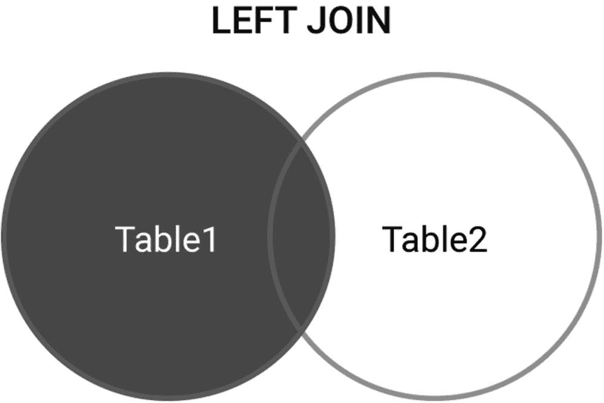
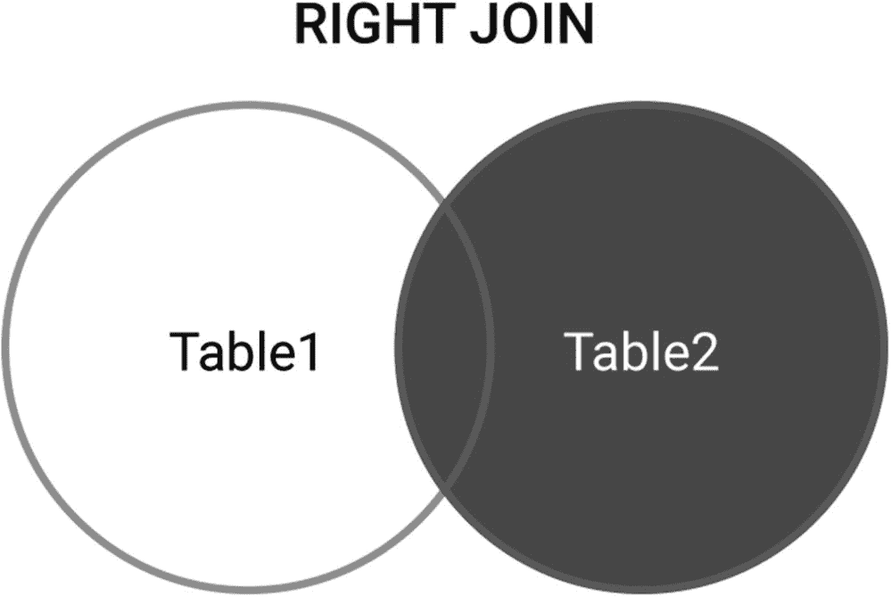
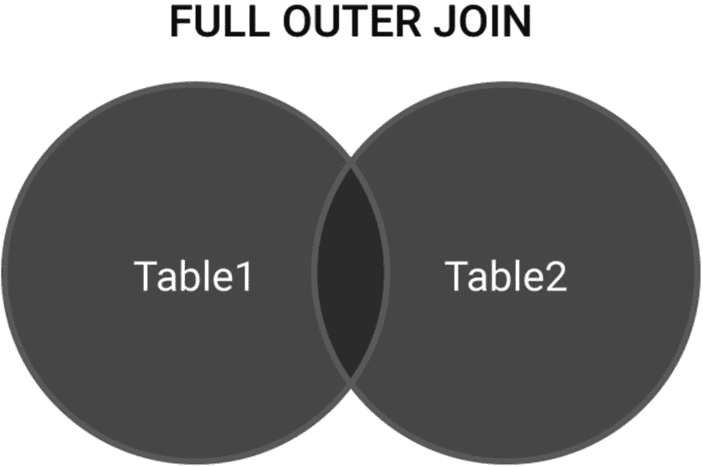

# 六、准备数据

> *成功取决于事先的准备，没有这样的准备就一定会失败。*
> 
> —孔子

机器学习围绕着算法的训练来执行各种计算密集型任务。算法的训练是通过输入模型数据进行的，因此是任何数据或机器学习项目清理和准备中最关键的一步。这一点怎么强调都不为过:即使输入世界上最复杂的机器学习模型，糟糕的数据也会产生糟糕的结果。

所有这些都是有充分理由的。无论是去餐馆的方向，订购出租车，导航飞机，还是接受你的网上购物篮中的替代品，信任数据和算法超过我们自己的判断的想法都有其优点和缺点。犯错的确是人之常情，但当算法出错时，我们就不太可能再相信它了。

现实世界中的数据本质上是碎片化的。在医疗保健领域，电子健康记录(EHR)存在于多个分布式数据库系统中。医院入院数据、处方数据、可穿戴设备和行为数据都在孤岛中共存。将数据放在一起的行为或数据链接通常会创建新的数据表，这些数据表可能包含值缺失、不完整或已转换的变量。

对一个机器学习工程师的认知有很多。现实是，大多数优秀的工程师将大部分时间花在清理和准备数据上。

创建适当的数据准备计划、输入缺失值、移除行和不必要的变量以及转换要素是一些最常见的数据准备做法。

## 数据准备阶段

在项目的数据准备阶段，目的是确保数据集处于机器学习的最佳状态。

数据准备有五个不同的阶段，如图 [6-1](#Fig1) 所示:


图 6-1

数据准备的五个阶段

1.  聚集

2.  探索

3.  净化

4.  改变

5.  扩展(主要通过特征工程)

对数据的审查和分析需要了解数据库和结构化查询语言(SQL)，这是任何机器学习工程师或数据科学家的必要技能。

## 什么是数据库？

数据库是数据的结构化集合，通常以电子方式存储在以行和列建模的表格中。

作为一种持久存储机制，数据库使人们能够存储数据和实现 CRUD 等功能—创建、读取、更新、删除。数据库管理系统(DBMS)是用来控制数据的软件。一些流行的 DBMSs 的例子包括 Microsoft Access、Microsoft SQL Server、MySQL、Oracle Database 和 Ingres。

有许多数据库类型，其中最常见的如下:

*   **关系数据库**是最流行和最广泛使用的数据库类型。关系数据库将数据存储在结构化表的行(记录)和列(变量或特征)中。结构化查询语言(SQL)是用于查询关系数据库的语言。

*   **分层数据库**是树状结构，以父子关系存储数据。每个子记录只有一个父记录。父母可以有多个孩子。分层数据库的例子包括 IBM 信息管理系统(IMS)和 Windows Registry，其中检索数据需要遍历每棵树，直到找到一个记录。网络数据库是分层数据库的扩展，其中子节点可以有多个父节点，因此具有多对多的关系。

*   **面向对象的数据库**将数据存储为对象，为面向对象的编程语言提供数据库功能。

*   **NoSQL 数据库**是非关系数据库，这意味着它们没有预定义的模式，因此允许存储和操作半结构化和非结构化数据。NoSQL 数据库分为五类:列、文档、图形、键和对象。

虽然大多数人都熟悉关系数据库，但由于 web 和移动应用程序的使用、存储和处理非结构化数据的需求以及提高速度的永恒要求，NoSQL 数据库的使用出现了激增。

### 数据库的挑战

特定场景的最佳数据库类型取决于个人或组织希望如何使用存储的数据。在大多数情况下，数据库被期望近乎实时地将结果返回给复杂的查询。这使得性能改进成为数据库维护的重点。

#### 适应不断增长的数据量

随着数据来自可穿戴设备、传感器、互联设备、行为和各种其他来源，处理高速数据源和不断增加的文件大小是大多数数据库管理员(从初学者到最有经验的人)最头疼的问题。

#### 可量测性

很难预测到底需要多少存储空间。由于存储成本很高，可以根据所有者的需求进行扩展和调整的数据库是更好的选择。

#### 易接近

对数据库的要求越来越高。在当今世界，各种利益相关者需要实时访问数据以支持决策、抓住新机遇和了解趋势。

#### 数据库管理和维护

必须维护数据库以防止出现问题并确保行业最佳实践。随着数据复杂性和数据量的增加，监控和优化数据库需要额外的时间资源。这可能包括定期备份、检查数据库是否损坏、确保安全性、监控性能以及规划预期需求。

#### 维护数据安全

随着数据量和可访问性需求的增长，保护数据免受入侵变得越来越困难。随着创新的发展，网络罪犯也在发展。

### 数据库和电子表格有什么区别？

数据库和电子表格都存储数据。但是，主要的区别在于数据的存储方式、可以存储多少数据以及如何访问数据。

电子表格最初是为不想执行过于复杂的操作的单个用户设计的。因此，电子表格在功能上是有限的，它们的特性反映了这一点。例如，它需要考虑如何最好地测量对电子表格的并发访问。

然而，数据库被设计用来保存更大的数据集合，并被使用编程语言查询数据的多个用户安全地访问。

## 什么是结构化查询语言(SQL)？

无论是在项目的数据准备还是数据分析阶段，对 SQL 的良好理解都将有助于处理大量数据和机器学习任务。

结构化查询语言(SQL)是用于与关系数据库通信的编程语言，是数据准备的首选语言。

使用 SQL 的常见数据库管理系统包括 MySQL、Microsoft SQL Server、Access 和 PostgreSQL。MySQL 可以免费使用，是卧室科学家和企业的热门选择。

虽然存在几个版本的 SQL，但它们在结构上非常相似，这意味着如果您理解了如何使用一个版本的 SQL，那么您几乎已经学会了所有版本。

本章将揭示最重要的命令和概念。

### 常见的 SQL 命令和概念

常见的 SQL 命令包括 select、insert、update、delete、create 和 drop。

SQL 包含一组被称为保留字的字，它们被用作命令并被解释为命令。因此，这些词不能用来命名表或变量。完整的清单可以在补充材料中找到。

#### 创建表格

关系数据库将数据保存在称为表的对象中。表由行和列组成，用于存储数据，并由名称唯一标识。行指的是记录，列指的是特征或属性。

***创建表格*** 命令用于在 SQL 中创建表格。创建表需要指定表的名称、字段及其各自的数据类型。语法如下:

```py
create table Example_Table {
column1_name datatype
column2_name datatype
column3_name datatype
...
};

```

其中 columnX_name 是指列的名称，datatype 是指该列保存的数据类型。常见的数据类型包括以下几种:

<colgroup><col class="tcol1 align-left"> <col class="tcol2 align-left"></colgroup> 
| 

字符

 | 

圆括号中指定的 *n* 的定长字符串。最大 255 字节。

 |
| --- | --- |
| varchar(n) | 括号中指定的最大长度为 n 的可变长度字符串。 |
| 数量 | 括号中指定了最大位数的数值。 |
| 日期 | 日期值。 |
| 数量(n，I) | 一个数字值，最多有“n”位，小数点后最多有“I”位。 |

数据类型的完整参考列表可以在附带的资料中找到。

假设我们要创建一个小型数据库系统来管理医院网络中的事故和急诊入院，重点关注三个主要实体:入院、位置和患者。每个实体都需要一个表。每个表格将描述这些实体的特征。每个要素都将是表中的一个单独的列。

为了说明的目的，可以用于记录医院的事故和紧急病房的入院的表格可以定义如下:

```py
create table Emergency_Admissions {
[ADMISSION_ID] INT IDENTITY(1,1) PRIMARY KEY
[LOCATION_ID] INT,
[PATIENT_ID] INT,
[ADMISSION_DATE] DATE,
[PRESENTING_WITH] TEXT,
[CONTACT_TELEPHONE] INT
[EMAIL] CHAR(50),
[PRIORITY] BIT
}

```

在该示例中，入院实体具有七个属性:入院 ID、位置 ID、患者 ID、入院日期和时间、呈现症状、联系电话号码以及入院是否是优先事项。每个入院都有一个唯一的 ID，并引用位置 ID 和患者 ID 来标识入院中涉及的医院和患者。

#### 将数据插入表格

***insert into*** 语句用于将记录插入表中:

```py
insert into Example_Table {column1_name, column2_name, column3_name, ...)
values (value1, value2, value3, ...)
};

```

其中列名指的是实体的特征或属性。例如，以下命令可用于将数据插入表 [6-1](#Tab1) :

表 6-1

急诊入院

<colgroup><col class="tcol1 align-left"> <col class="tcol2 align-left"> <col class="tcol3 align-left"> <col class="tcol4 align-left"> <col class="tcol5 align-left"> <col class="tcol6 align-left"> <col class="tcol7 align-left"></colgroup> 
| 

入场 _ID

 | 

位置标识

 | 

患者 ID

 | 

入院日期

 | 

用...呈现

 | 

联系人 _ 电话

 | 

优先

 |
| --- | --- | --- | --- | --- | --- | --- |
| Five hundred and ninety-four | Eleven | One thousand four hundred and fifty-three | 08/08/2020 | 脑震荡 | Four hundred and forty-seven billion seven hundred and fifty-five million three hundred and sixty-six thousand five hundred and fifty-five | Zero |
| Five hundred and ninety-five | Eleven | One thousand two hundred and twenty-five | 08/07/2020 | 颅脑外伤 | Four hundred and forty-seven billion seven hundred and thirty-three million three hundred and sixty-six thousand five hundred and fifty-two | one |
| Five hundred and ninety-six | six | Nine hundred and ninety-seven | 08/13/2020 | 心脏病发作 | Four hundred and forty-seven billion seven hundred and nine million three hundred and sixty-six thousand five hundred and fifty | one |

```py
insert into Emergency_Admissions (LOCATION_ID, PATIENT_ID, ADMISSION_DATE, PRESENTING_WITH, CONTACT_TELEPHONE, PRIORITY)
values ('6','997',Date(), 'Heart attack', '447709366550', '1')

```

#### 主键和外键

表中至少有一个字段是主键。主键充当表中每条记录或每一行数据的唯一标识符。表中的每一列都描述了与主键有关的内容。在我们的录取示例中，主键是录取 ID。

外键是指用于在两个或多个表之间链接数据的主键。例如，在我们的急诊入院表中，位置 ID 和患者 ID 都是不同表或实体的主键。外键支持数据库最小化重复和最大化效率。数据库管理的重点是保留空间，因此存储最少量的数据支持这种方法。

#### Select、From 和 Where 命令

***选择*** 命令用于查询数据库并检索符合该命令指定标准的数据。从 关键字开始的 ***前的表名是指要从中检索数据的表。或者，可以使用 where 子句来指定返回数据的标准:***

```py
select column1_name, column2_name, column3_name, …
from Table_Name
where condition;

```

在我们的工作示例中，要提取位置 11 的所有许可，我们可以使用以下命令，该命令将只返回许可表的前两行:

```py
select *
from Emergency_Admissions
where LOCATION_ID = 11;

```

***其中*** 命令与 SQL 语句一起使用，仅识别那些满足指定条件的记录。

***distinct*** 语句通常与 select 语句结合使用，只从表中提取非重复值。以下语句将导致表 [6-2](#Tab2) 中的输出:

表 6-2

不同的急诊入院地点 _ IDs

<colgroup><col class="tcol1 align-left"></colgroup> 
| 位置标识 |
| Eleven |
| six |

```py
select distinct location_id
from Emergency_Admissions;

```

select top 命令可用于指定要返回的行数。此命令对于大型数据集特别有用，因为在这种情况下可能只对一小部分结果感兴趣:

```py
select top number | percent column_name(s)
from Table_Name
where condition;

```

#### AND、OR、NOT 运算符

逻辑运算符 AND、OR 和 NOT 可以与 where 子句一起使用，以根据条件筛选检索到的数据:

*   AND:如果由 AND 分隔的所有条件都为真，则显示一条记录。

*   OR:如果由 OR 分隔的条件之一为真，则显示一条记录。

*   NOT:如果条件不为真，则显示记录。

#### 分组依据

***group by*** 命令将具有相同值的记录分组到聚合行中。因此，它通常与 COUNT、MAX、MIN、AVG 和 SUM 等聚合函数一起使用，按列对结果集进行分组。使用我们的工作示例，以下语句将输出表 [6-3](#Tab3) 中所示的结果:

表 6-3

按优先级分组的急诊入院

<colgroup><col class="tcol1 align-left"> <col class="tcol2 align-left"></colgroup> 
| 

计数(入院 ID)

 | 

优先

 |
| --- | --- |
| one | Zero |
| Two | one |
| Five hundred and ninety-six | six |

```py
select count(Admission_ID), Priority
from Emergency_Admissions
group by Priority;

```

#### 更新命令

***更新*** 语句用于更新表格中已有的数据:

```py
update Table_Name
set column1_name = 'value'
where condition;

```

在此示例中，column1_name 是指其值将被更新的数据库表列。例如，在我们的工作示例中，要将 admission_id = 594 的优先级更新为 1，可以使用以下语法:

```py
update Emergency_Admissions
set priority = 1
where admission_id = 594;

```

#### 删除和截断命令

***delete*** 语句从表中删除一条或多条记录:

```py
delete from table_name
where condition;

```

***truncate*** 命令删除表格中的所有行，保留完整的列和约束。truncate 命令删除表中的所有行，而 delete 命令允许过滤行。

#### 删除表格

***删除表格*** 命令用于删除一个表格以及其中包含的数据。语法很简单:

```py
drop table Table_Name;

```

其中，表名是要删除的表的名称。

#### 铸造

在准备数据时，转换很有用，例如，当需要将字符串转换为日期或将整数转换为字符串时。 ***cast()*** 函数将一个值转换为指定的数据类型:

```py
cast (valuetoconvert AS datatype(size))

```

#### 空值

空值是指没有值的字段。或者另一种考虑空值的方式是空白。例如，如果表中有某些可选字段，而在创建新行时这些字段不是必需的，则可能会出现空值。空值不同于包含空格或零值的字段。

#### 连接

驻留在多个表中的数据需要先进行组合，然后才能进行查询和分析。有五种主要方式可以连接两个表，它们都会影响结果表的大小。

##### 内部连接

INNER JOIN 命令是最常用的连接命令，用于选择在两个表中都有匹配记录的行。该命令仅在列之间匹配时选择行。参见图 [6-2](#Fig2) 了解内部连接的图示。


图 6-2

内部连接的集合表示

一个 ***on*** 语句用于标识要连接表的列。

例如，可以使用以下 SQL 语句连接表 [6-1](#Tab1) 和 [6-4](#Tab4) ，以输出表 [6-5](#Tab5) 中显示的患者姓名列表:

表 6-5

结果内部连接

<colgroup><col class="tcol1 align-left"> <col class="tcol2 align-left"> <col class="tcol3 align-left"> <col class="tcol4 align-left"> <col class="tcol5 align-left"></colgroup> 
| 

入场 _ID

 | 

入院日期

 | 

患者 ID

 | 

西方人名的第一个字

 | 

姓

 |
| --- | --- | --- | --- | --- |
| Five hundred and ninety-four | 08/08/2020 | Eight hundred and forty-five | 苏珊(女子名) | 奢侈的生活 |
| Five hundred and ninety-five | 08/07/2020 | Thirty-six | 艾哈迈德（人名） | 见 MUHAMMAD　ALI |
| Five hundred and ninety-six | 08/13/2020 | Six hundred and sixty-three | 阿努潘 | 三亚儿 |

表 6-4

患者联系表

<colgroup><col class="tcol1 align-left"> <col class="tcol2 align-left"> <col class="tcol3 align-left"> <col class="tcol4 align-left"> <col class="tcol5 align-left"> <col class="tcol6 align-left"></colgroup> 
| 

患者 ID

 | 

GP_ID

 | 

西方人名的第一个字

 | 

姓

 | 

告发

 | 

城市

 |
| --- | --- | --- | --- | --- | --- |
| One thousand four hundred and fifty-three | Eight hundred and forty-five | 苏珊(女子名) | 奢侈的生活 | 06/04/1984 | 沃里克 |
| One thousand two hundred and twenty-five | Thirty-six | 艾哈迈德（人名） | 见 MUHAMMAD　ALI | 14/03/1955 | 雷克瑟姆 |
| Nine hundred and ninety-seven | Six hundred and sixty-three | 阿努潘 | 三亚儿 | 04/04/1938 | 克鲁 |

```py
select ADMISSION_ID, ADMISSION_DATE, FIRSTNAME, SURNAME,
from Emergency_Admissions
inner join Patient_Details
on Emergency_Admissions.PATIENT_ID = Patient_Details.PATIENT_ID;

```

##### 左右连接

LEFT JOIN 命令将返回左表中的所有记录以及右表中的匹配记录。如果右表中没有匹配项，则输出 NULL。集合表示见图 [6-3](#Fig3) 。



图 6-3

左连接的集合表示

类似地，右连接以相反的方式操作，如果匹配，则返回右表中的所有记录以及左表中的匹配记录，否则输出 NULL。图 [6-4](#Fig4) 显示了一个集合表示。



图 6-4

右连接的集合表示

##### 完全连接

完全联接命令，也称为完全外部联接命令，当左表行或右表行中有匹配项时，将返回所有记录。

因此，这可能会输出大型数据集，并且计算开销很大，因为无论另一个表是否匹配，都会检索两个表中的所有匹配记录。图 [6-5](#Fig5) 显示了一个集合表示。



图 6-5

完全外连接的集合表示

#### SQL 日期函数

每一份健康记录，无论是 EHR 还是可穿戴驱动，都有一个日期和时间戳。

日期对于评估一段时间内的健康状况至关重要。例如，在特定治疗后出现的症状可能被认为是并发症后的副作用和状况。SQL 有几个有用的内置日期函数，可用于操作日期:

*   GetDate():该函数输出当前日期，不接受任何输入。

*   DateAdd(period，number，date):这个函数向提供的日期添加给定的时间数，用 period(小时、天、月、年)表示。提供的数字可以创建未来的日期，负数可以提供过去的日期。

*   DatePart(part_of_date，date):该函数返回日期时间的一个部分(分钟、小时、天、季度、年等)。).

*   DateDiff(part_of_date，date1，date2):此函数返回所提供的两个日期之间的差值。日期部分表示输出的时间单位。

## 数据采集

机器学习项目的第一阶段包括收集将用于项目的数据集。由于我们处理的是 EHR 数据，并且出于本章的目的，我们假设机器学习项目中使用的数据集已经存在。

## 数据探索

一旦收集了数据集，就需要对其进行探索。数据准备的发现阶段使工程师能够理解可用的数据及其限制和细微差别。

活动包括

*   有多少数据可用？

*   数据以什么格式提供？

*   数据是以什么数据类型提供的？

*   日期以什么格式提供？

*   是否存在缺失值？

*   是否有明显重复？

*   空值是空的还是 NULL？

*   异常:异常值有效吗？

*   数据平衡吗？

*   数据是否存在偏差？

*   是否存在排印错误？

*   多个字符串代表相同的类别吗？

一旦审查了可用的数据，项目就进入数据清理阶段。

### 不平衡数据

需要注意的一点是，数据可能是不平衡的。不平衡的特征会阻止机器学习模型学习类别如何影响输出。例如，主要针对白色皮肤训练的皮肤癌预测算法对于黑色、棕色或任何其他肤色的人来说几乎没有用。为了防止这种形式的偏差，您应该计算不同类别的准确性指标。

## 数据清理

数据清理解决不完整、重复、缺失或不正确的值。数据清理的目的是提高可用于训练模型、提供分析或做出决策的数据的质量。机器学习项目的这个阶段是最艰巨的，会消耗大量的时间。数据清理阶段包括以下任务。

### 解析缺失值

缺少值是一个常见问题。大多数机器学习模型都需要一套完整的特征，所以这个活动被很好地研究了。缺失值可以假定为数据集中常见的值，从其他可用数据或包含从表中完全删除的缺失值的行中推断出来。

假设包含一组患者健康状况数据的表中有一列用于诊断高血压、心脏病发作和中风。如果高血压诊断为空，则该字段可被认为是该细胞最常见的诊断。或者，这可以从附近的其他值来测量。

例如，心脏病发作的诊断和中风的诊断可以帮助估计高血压的诊断。此外，如果有更多的数据，高血压的诊断可以从药物数据中推断出来。删除数据通常是确保重要数据不会丢失或引入任何形式的偏见的最后手段。

### 矛盾和重复的数据

如果数据与真实世界相似，那么应该探究矛盾的数据，看看事件是合理的还是随机的。例如，显示患者在出生日期之前入院的数据突出显示日期格式或表示可能有问题。重复的数据总是最好被删除。

### 探索数据中的异常

研究数据中的异常，以了解它们是错误的还是重要的。从数据集中移除异常值或离群值被称为数据修整。如果数据与真实世界相似，那么异常可能是合理的。

机器学习只能和你用来训练它的数据一样好。如果数据有偏差(即不具有代表性)，学习就会有偏差。同时，在探索数据集时，要小心避免引入人为错误。这通常通过确保良好的版本控制来满足。

### 纠正打字错误、清除值和格式化

确保数据集中没有印刷错误。数字化文本，如手写，可能会有错误。检查数据集的错误、偏差和不一致。这是一个很常见的问题。

将文本的大小写规范化为小写或大写。检查数据以评估唯一项目是否有多种表示形式，并纠正任何键入错误的字符串或分类。例如，高血压可以在数据表中表示为高血压、高血压和动脉高血压，其中所有类别都是正确的，但是需要统一以确保数据的准确性。

检查所有的列格式，特别注意日期和整数，以确保它们是首选的格式和编码。这可能涉及将列转换为不同的数据类型。

可能需要更改格式；例如，您可能需要将数据导出到平面文件中，而不是传统的关系数据库中。您可能只想处理样本数据的子集。

### 对结果组进行分类

数据集内的列通常具有大量分布的值，其中一些值出现的频率很低。当输入自由文本时尤其如此。在某些情况下，将这些记录分类可能会有所帮助。

## 转换数据

数据准备的下一个阶段是数据转换。完全按照您的要求收集数据的情况很少见。为了使数据更有用，可以应用数据转换技术。

这通常由您使用的算法和可用的数据决定。例如，如果机器学习算法将二型糖尿病的诊断输入作为一个整数——“0 代表错误”“[1 代表被诊断患有二型糖尿病””——但医疗记录指定为“二型糖尿病”或“没有二型糖尿病”，则数据需要从文本转换为整数，以便机器可读。

也可以使用缩放，例如，将公制单位转换为英制单位。

转换可以包括以下内容。

### 聚合

聚合是指可以聚合成单个属性的属性。例如，参加健康教育的特定患者的日志可以被聚集到参加总数的计数中，而不是单独表示每次参加。

### 分解

分解是指划分属性，使得它们对机器学习技术变得更有用。例如，患者的记录可能将他们的种族列为亚洲人。然而，了解患者的出生国家和主要语言可能更好，以更准确地预测标准，如肥胖风险。

### 编码

编码将分类变量转换成数字的、机器可读的表示形式。有序分类将需要一个等级，该等级将被用作输入。非顺序分类可以使用一个列来标记该记录的类别是真还是假。

### 缩放比例

数据可以包含不同数量的属性。例如，以千克为单位的体重、以厘米为单位的身高和临床标记可能使用完全不同的刻度。缩放将数据转换到特定的公共范围。可以通过标准化或规范化来执行缩放。

### 扭曲的数据

偏斜的数据可以用统计技术标准化，以近似更对称的分布。方法包括对数、根和倒数。

### 偏差缓解

如果数据中出现偏差，可以通过一些预处理技术来减轻。偏差缓解预处理算法包括重新加权、学习公平表示、不同影响消除器和优化预处理。

偏差缓解不同于不平衡数据。对于包含在数据集中的每个类，不平衡数据没有类似数量的示例。

### 权重

权重是指某个特定特性的优先级或影响力。通常，正权重会增加预测值，而负权重会降低预测值。

## 发展

可以通过要素工程来扩展和丰富现有数据集，从而基于有关当前要素和任务目标的数据生成新要素。

在执行特征工程时，理解手头的数据是至关重要的——无论是由团队还是主题专家提供的。特征工程包括提取特征和识别关系。

### 特征抽出

特征提取从原始数据字符串创建新列。例如，这可以是基于短语、值或频率的新列。

例如，汇总可能涉及将患者年龄分为 10 岁，而不是指定一个连续的数字。分解包括减少数据中的依赖性。这甚至可能包括在数据准备过程中先前被排除在模型之外的属性。

### 识别特征关系

可以明确突出特征之间的关系，以帮助机器学习模型知道什么是重要的。例如，一个模型可能不能够容易地连接多个地址的纬度和经度，但是通过指定城市，它可以更好地实现模式识别。

### 特征约简

如果有太多的数据，太多的特征会使机器学习模型难以从噪声中识别信号。减少特征的数量将有助于避免维数灾难，维数灾难是指在高维空间中分析和组织数据时出现的现象，而在低维设置中不会出现。

## 结论

机器学习模型要求数据以特定的方式格式化，以便学习。良好的数据准备可以开发清晰准确的数据，从而产生更有用、更准确的机器学习模型和预测。本章探讨了数据准备的各个阶段、所需的技能以及注意事项。

正如所强调的，数据准备是成功的机器学习项目的基础，也是不可跳过的重要步骤。

即使是好的数据也必须经过审查，以确保其格式、规模正确，并保留有意义的特征。高质量的数据将提供高质量的信息，使每一个决策更加明智。