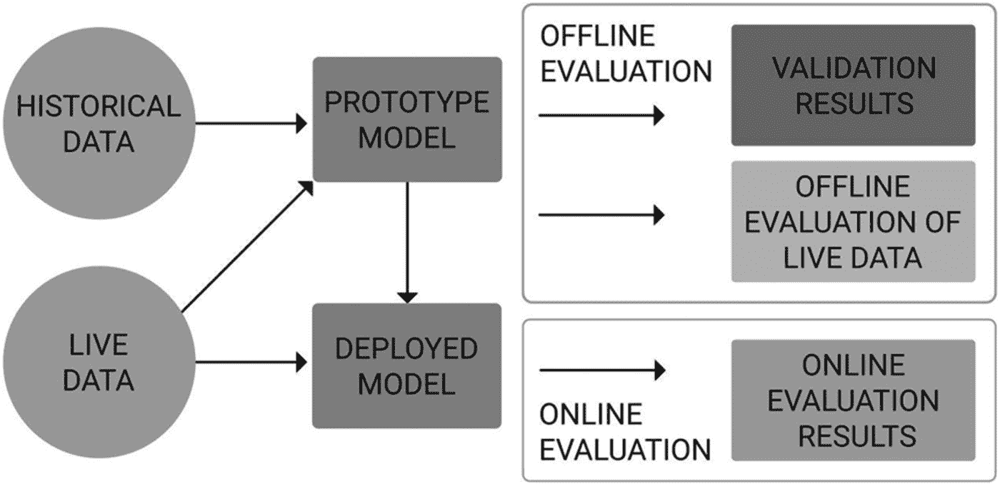
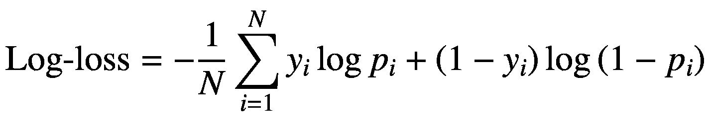
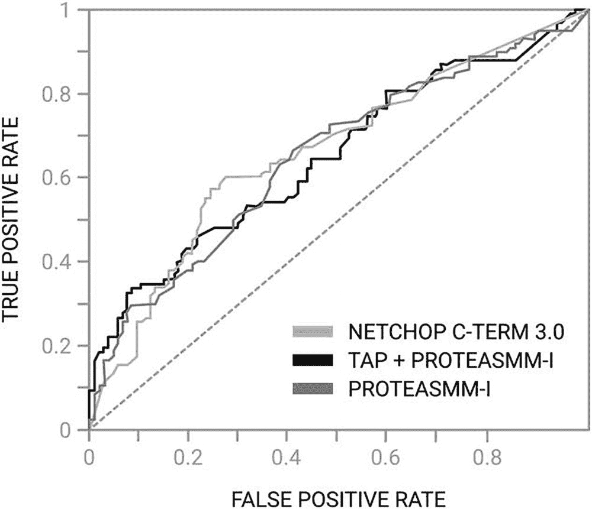
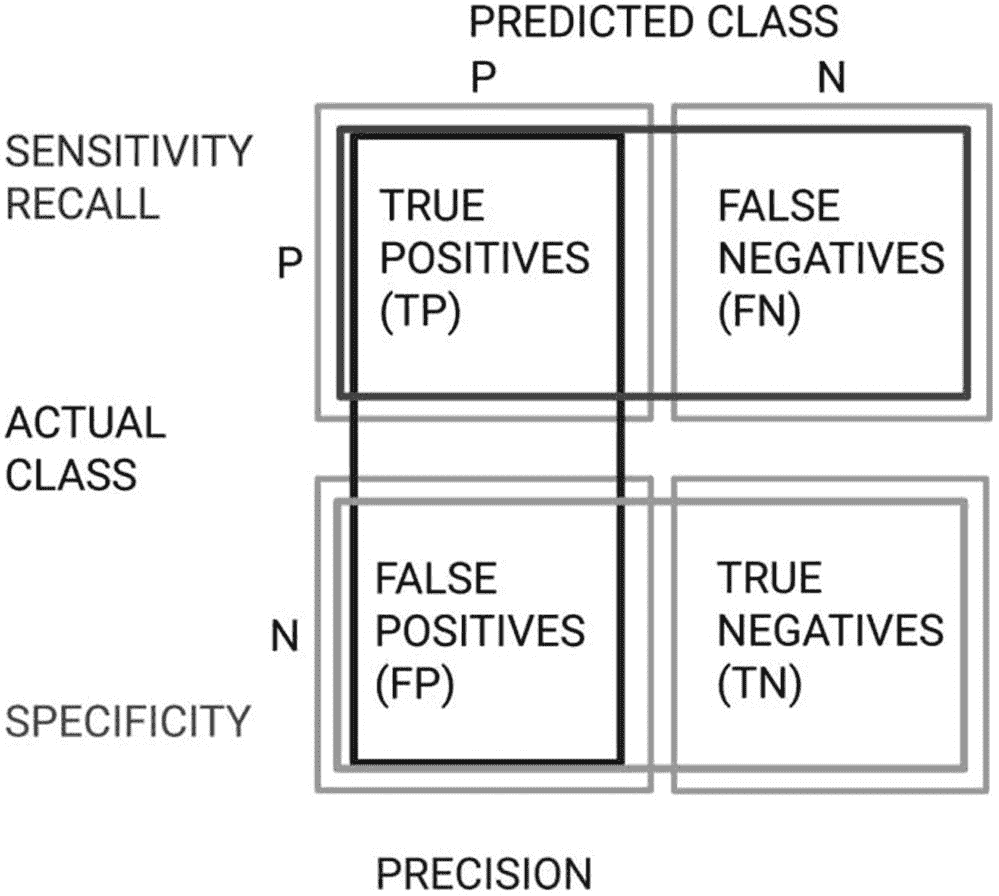
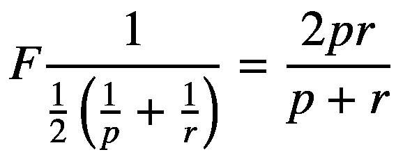
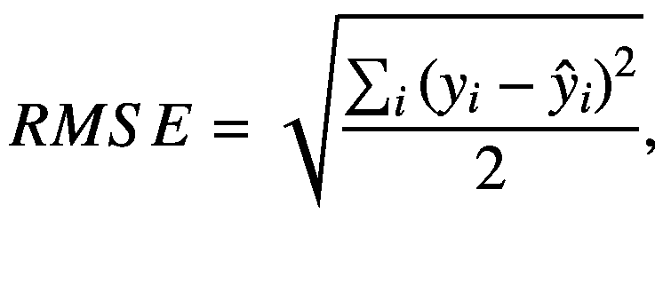
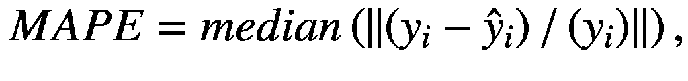

# 7.评估机器学习模型

> *智力是适应变化的能力。*
> 
> —斯蒂芬·霍金

作为一个领域，机器学习还处于起步阶段。先进的机器学习只是在过去 25 年里才被探索出来，这推动了数据科学成为一种职业。因此，数据科学行业仍处于对人工智能和机器学习的无穷潜力感到惊叹的阶段。随之而来的是兴奋和困惑——以及一个正在收集知识、经验和首次出现的问题的行业。

通常，机器学习项目中最费力的任务是识别适当的模型和工程特征，这对模型的输出有很大的影响。事实上，与模型选择本身相比，所选择的特性通常对模型的质量有更大的影响。

因此，评估决定模型智能的学习算法以预测未知样本的输出非常重要。这通常是使用各种度量来完成的，这将进一步讨论。

## 模型开发和工作流程

为了成功部署和维护机器学习模型，需要进行几个阶段的开发和评估，如图 [7-1](#Fig1) 所示。

图 7-1

模型开发和工作流程

第一阶段是原型阶段。在此阶段，通过对历史数据测试各种方法来确定最佳模型，从而创建原型机器学习模型。超参数调整是模型训练的一个要求，这将在本章后面讨论。一旦选择了最佳的原型模型，就要对模型进行测试和验证。验证模型需要将数据集分成训练集、测试集和验证集，如第 [3](03.html) 章所述。

考虑这样一个事实，即不存在所谓的随机数据集，相反，随机性适用于数据集的分割。注意数据中可能出现的偏差。一旦模型被成功验证，它就被部署到生产中。然后，模型通常由一个或几个性能指标进行评估，并在其整个生命周期中进行监控。

有两种评估机器学习模型的方法:离线评估和在线(或实时)评估。

### 为什么有两种评估模型的方法？

部署的机器学习模型消耗来自两个来源的数据:历史数据(或用作要学习的经验的数据)和实时数据。许多机器学习模型都假设数据是静态分布的，即数据分布是不变的。然而，这在现实生活中并不常见，因为数据的分布通常会随着时间的推移而变化，这就是所谓的分布转移。

考虑一个系统，它根据病人的健康状况预测药物对病人的副作用。药物副作用可能会因人群因素而异，如种族、疾病概况、地域、药物流行程度和新药。基于患者数据的相关副作用的分布可以随时间快速变化，因此对于模型来说，检测分布的变化并相应地发展模型是至关重要的。

模型通过基于实时数据的性能进行评估，并根据历史数据测试和验证阶段使用的验证指标进行评估。

当根据实时数据进行评估时，性能类似于或在允许性阈值内的模型被视为继续符合数据的模型。模型性能下降表明模型不符合数据，需要重新训练。如果实时机器学习模型降级并变得不适合使用或临床上不安全，组织还应考虑所需的缓解措施。

#### 离线评估

离线评估基于从历史的、固定的、分布式的数据集中学习和评估的度量来测量模型。准确性和精确召回率等指标通常用于离线培训阶段。离线评估技术包括保留方法和 n 重交叉验证。

#### 在线(实时)评估

在线评估是指在部署模型后对预测指标的评估。关键的一点是，这些指标可能不同于模型实际部署时用于评估性能的指标。例如，一个正在学习新的药物治疗的模型可能会在训练和验证中寻求尽可能精确；但是当放在网上时，它可能需要考虑业务目标，如部署时的预算或治疗价值。同样的模式可能会找到一个完美的药物治疗，可以解决问题，但仍然在临床上不安全。评估标准必须以用例为框架，以确保预期项目中所有参与者的代表性。

在线评估的好处，尤其是在数字时代，支持多元测试，通过专用的反馈回路实时了解最佳表现模型。

反馈循环是确保系统按预期运行的关键，有助于更好地理解使用环境中的模型。这可以由人工代理来执行，或者通过上下文智能代理或模型用户来自动执行。

实时评估可以定期进行，使用生成的、先前看到的数据的未标记子集，以将准确度保持在商定的容差阈值内。

#### 寻找统计上独立的数据集

重要的是，机器学习模型的评估是基于统计上独立的数据集，而不是基于它被训练的数据集。这是因为训练数据集的评估对模型适应数据集时的真实性能持乐观态度。通过使用以前未见过的数据评估模型，可以更好地估计泛化误差。

新数据可能很难找到；因此，能够从当前数据集中获得新的、看不见的数据是很重要的。为此，n 重交叉验证等方法是有用的技术。通常使用的数据比算法选择更重要；使用的功能越好，模型的性能就越好。所讨论的评估指标可以在 R 和 scikit-learn for Python 的指标包中找到。

如果安全的话，机器学习模型可以向测试参与者或感兴趣的利益相关者公开，以生成数据。

### 评估指标

对于机器学习问题，有一个庞大的评估指标库。度量标准适用于各种机器学习任务，如分类、回归、聚类、关联规则挖掘、NLP、数据挖掘等。

您选择的评估指标将根据您的机器学习模型试图解决的问题和您正在使用的技术来定制。

#### 分类

分类问题寻求给输入一个标签或分类。有几种方法可以用来衡量性能，包括准确度、精确召回率、混淆矩阵、对数损失(对数损失)和 AUC(曲线下面积)。

##### 准确

准确性是用于识别模型是否做出正确预测的最简单的技术。它以正确预测占总预测的百分比来计算。

*   **准确度** =正确预测数/总预测数

##### 混淆矩阵

准确性是一个不考虑类间划分的通用度量。因此，它不考虑错误分类或与错误分类相关的惩罚。

例如，与假阴性相比，假阳性的医疗误诊(例如，当患者没有患乳腺癌时，将患者诊断为乳腺癌)具有实质上不同的后果，由此患者被告知他们没有患乳腺癌，而事实上他们患有乳腺癌。

混淆矩阵分解模型做出的正确和不正确的分类，并将它们归属于适当的标签:

*   True positive:其中实际类为 yes，预测类的值也为 yes。

*   误报:实际类别为否，预测类别为是。

*   真负:实际类的值为否，预测类的值为否。

*   假阴性:当实际类别值为是，但预测类别为否时

举一个例子，其中模型基于来自测试数据集的 50 个样本输入来预测患者是否患有乳腺癌，其中阳性和阴性标记样本之间的分布相等。混淆矩阵如表 [7-1](#Tab1) 所示。

表 7-1

混淆矩阵

<colgroup><col class="tcol1 align-left"> <col class="tcol2 align-left"> <col class="tcol3 align-left"></colgroup> 
|   | 

预测:正面

 | 

预测:负面

 |
| --- | --- | --- |
| 标记为阳性 | Twenty | five |
| 标记为阴性 | Fifteen | Ten |

根据混淆矩阵，确定正类比负类具有更大的准确性。阳性分类的准确率为 20/25 = 80%。负类的准确率为 10/25 = 40%。这两个指标都不同于模型的总体准确性，后者将被确定为(20 + 10)/50 = 60%。很明显，混淆矩阵如何为机器学习模型的整体准确性增加更多细节。

因此，精确度可以改写如下:

*   **精度** =(正确预测的观测值)/(总观测值)

*   = （TP + TN）/（TP + TN + FP + FN）

##### 每类准确度

每类精度是精度的扩展，它考虑了每个类的精度。因此，上述示例的每类精度为(80% + 40%)/2 = 60%。

在一个特定的类中有比另一个更大数量的例子的扭曲问题中，每类精度是有用的。有更多例子的类支配着计算，因此仅仅精确可能不足以满足你的模型的本质；因此，评估每个类的准确性也是有用的。

##### 对数损失

对数损失(或简称 log-loss)用于预测连续概率而不是类别标签的问题。Log-loss 提供了准确性置信度的概率度量，并考虑了真实标签和预测分布之间的熵。

对于二元分类问题，对数损失的计算如下:

其中 P i 是第 *i* 个数据点属于一个类的概率，y i 是真实标签(0 或 1)。

##### 曲线下面积

AUC 以真阳性率对假阳性率作图。AUC 使分类器的灵敏度和特异性可视化。它强调了在允许假阳性的情况下可以获得多少正确的阳性分类。

该曲线称为受试者工作特性曲线，简称 ROC，如图 [7-2](#Fig2) 所示。高 AUC 或曲线下更大的空间是好的，曲线下更小的面积(或曲线下更小的空间)是不可取的。

图 7-2

受试者工作特征曲线

在图 [7-2](#Fig2) 中，与试验 B 相比，试验 A 的 AUC 更好，因为试验 A 的 AUC 大于试验 ROC 将模型的特异性和敏感性之间的权衡可视化。

##### 精确度、召回率、特异性和 F 值

精确度和召回率是两个一起使用来评估模型性能的度量。Precision 评估与正确分类的项目总数相比，有多少项目是真正相关的。Recall 评估相关项目中有多少项目被模型预测为相关:

*   精度:(正确预测阳性)/(总预测阳性)= TP/TP + FP

*   回忆:(正确预测阳性)/(正确阳性观察总数)= TP/TP + FN

特异性是指模型在返回错误分类时的表现，如图 [7-3](#Fig3) 所示计算。

图 7-3

特异性分类图

*   特异性:(正确预测阴性)/(总阴性观察)= TN/TN + FP

F-Measure 超出算术平均值，计算精度和召回率的调和平均值:

其中 *p* 表示精度， *r* 表示召回。

#### 回归

回归机器学习模型输出连续变量，均方根误差(RMSE)是这些问题最常用的评估指标。

##### 均方根误差

RMSE 计算预测值和实际值之间的平均距离之和的平方根。这也可以理解为真实值和预测值向量之间的平均欧几里德距离。对 RMSE 的批评是，它对异常值很敏感。

T2】

其中*y*T3】IT5】表示实际值，表示预测值。

##### 误差百分位数

由于对异常值不太敏感，误差的百分位数(或分位数)更加稳健。真实世界的数据可能包含异常值，因此查看中位数绝对百分比误差(MAPE)而不是平均值通常是有用的。

T2】

其中*y*T3】IT5】表示实际值，表示预测值。

通过使用数据集的中位数，MAPE 受异常值的影响较小。可以为给定的问题设置预测的阈值或百分比差异，以了解回归估计的精度。

门槛取决于问题的性质。

## 倾斜数据集、异常和稀有数据

一个有经验的数据科学家用怀疑的眼光对待所有的数据。数据可能不一致；因此，倾斜的数据集、不平衡的类示例和异常值都会显著影响模型的性能。一个类中的例子比另一个类中的例子多会导致一个表现不佳的模型。如果模型存在问题，请回到数据，以确保机器学习项目的数据准备阶段的所有阶段都已正确进行。

离群值或数据异常会进一步扭曲性能评估指标。大的异常值的影响可以使用误差的百分位数来减轻。然而，如果这些异常值代表真实世界的患者数据，应该考虑保留它们。在实践中，良好的数据清理、异常值的去除和变量的规范化可以降低对异常值的敏感性。

## 参数和超参数

超参数和参数经常互换使用，但两者是有区别的。机器学习模型可以理解为表示数据各方面之间关系的数学模型。

### 模型参数

模型参数是由机器学习模型在训练期间学习和调整的训练数据集的属性。每个模型、数据集属性和手头的任务的模型参数都不同。例如，在输出文本语料库的复杂度的 NLP 预测器的情况下，诸如词频、句子长度以及每个句子的名词或动词分布的参数将被认为是模型参数。

### 模型超参数

模型超参数是模型建立过程的参数，不是在训练期间学习的。超参数可以对机器学习模型的性能产生实质性的影响。超参数定义模型架构并影响模型的容量，从而影响模型的灵活性。在训练过程中，超参数也可以被提供给损失优化算法。

超参数的最佳设置会对预测产生显著影响，并有助于防止模型过度拟合。数据集和模型之间的最佳超参数通常不同。

例如，在神经网络的情况下，超参数将包括隐藏层的数量和大小、权重、学习速率等等。决策树超参数将包括树中期望的深度和叶子数量。具有支持向量机的超参数将包括错误分类惩罚项。

### 调谐超参数

超参数调整或优化是为机器学习模型选择一组最佳超参数的任务。优化的超参数值最大化了模型的预测准确性。

超参数通过训练模型、评估总精度和适当调整超参数来优化。通过试验各种超参数值，确定问题的最佳超参数，从而提高整体模型精度。

#### 超参数调整算法

超参数调优就像训练机器学习模型。眼下的任务是优化。模型参数可以表示为损失函数，而超参数不能这样表示，因为它完全取决于模型训练过程。超参数调整有几种方法，最常见的是网格搜索和随机搜索。

##### 网格搜索

网格搜索是一种简单、有效但资源昂贵的超参数优化技术，用于评估超参数网格。

该方法评估每个超参数并确定获胜者。例如，如果超参数是决策树中叶子的数量，其可以是从 n = 2 到 100 的任何值，网格搜索将评估 n 的每个值(即，网格上的点)以确定最有效的超参数。

通常是猜测从哪里开始超参数，包括最小值和最大值。这种方法是典型的试错法，如果最佳值位于最大值或最小值，网格将在适当的方向上扩展，以进一步优化模型的超参数。

##### 随机搜索

随机搜索是网格搜索的变体，它评估网格点的随机样本。从计算上来说，这比标准的网格搜索要便宜得多。虽然乍一看，这似乎在寻找最佳超参数时没有用，但 Bergstra 等人证明，在数量惊人的情况下，随机搜索的表现与网格搜索大致相同[94]。

随机搜索的简单性和比预期更好的性能意味着它经常被选择而不是网格搜索。网格搜索和随机搜索都是并行的。

更智能的超参数调整算法是可用的，由于评估接下来要尝试哪些样本，这些算法在计算上是昂贵的。这些算法通常有自己的超参数。贝叶斯优化、随机森林智能调整和无导数优化是这种算法的三个例子。

## 统计假设检验(多元检验)

统计假设或多变量测试是一种非常有用的方法，可以用来确定哪种模型最适合手头的特定问题。统计假设检验确定零假设和替代假设之间的差异。

零假设被定义为新模型不影响性能指标的平均值，而另一个假设是新模型确实改变了性能指标的平均值。

多元测试比较相似的模型，以了解哪个模型表现最好，或者将新模型与旧的遗留模型进行比较。比较各自的性能指标，并决定采用哪个模型。

测试的过程如下:

1.  将人群分为随机控制组和实验组。

2.  根据提出的假设记录人口的行为。

3.  计算性能指标和相关的 *p* 值。

4.  决定采用哪种模式。

统计假设检验方法使团队能够通过学术交流传播项目，并提供了一个报告框架。

虽然这个过程看起来相对简单，但是有几个关键方面需要考虑。

### 我应该使用哪个指标进行评估？

选择合适的度量来评估您的模型取决于用例。考虑假阳性、假阴性的影响，以及这种预测的后果。错误结果的影响可能是巨大的。

构建模型以迎合适当的指标。如果一个模型试图预测一个只有 0.001%发生率的事件，那么可以报告 99.999%的准确率，但无法确认。

一种方法是重复实验，从而进行重复评估。虽然不是自动防故障装置，但这减少了错觉结果的变化。如果零假设和替代假设之间确实有变化，这种差异将被明显地证实。同样，如果一个模型似乎正确地预测了输出，确保结果在统计上是显著的。

### 相关性不等于因果关系

相关性不等于因果关系这个短语用来强调两个变量之间的相关性并不意味着一个变量引起另一个变量。相关性是指两个或多个变量之间关系的大小和方向。

因果关系，也称为原因和结果，强调一个事件的发生与另一个事件的存在有关。假设一个变量导致另一个变量可能很有诱惑力；然而，在具有几个特征的模型中，可能存在导致两个变量协同移动的隐藏因素。

例如，吸烟是增加患各种癌症风险的一个原因。然而，它可能与酒精中毒相关，但它不会导致酒精中毒。

### 多少变化才算真正的变化？

在零假设再次被拒绝之前，定义所需的变化量取决于用例。在项目开始时指定一个令人满意的值，并坚持下去。确保结果具有统计学意义。

### 测试类型、统计功效和效应大小

有两种主要的检验类型——单尾检验和双尾检验。单尾测试评估新模型是否优于原始模型。然而，这个测试并没有指定模型是否比基线差。

因此，单尾检验天生就有偏差。使用双尾检验，可以检验模型在两个方向(正向和负向)发生变化的可能性。

统计功效是指在测试过程中检测到的差异反映真实世界差异的概率。

效应大小通过评估两组之间的标准化平均差异来确定两组之间的差异。影响大小的计算如下:

*   **效应大小** =((实验组平均值)–(对照组平均值))/标准差

### 检查度量的分布

许多多元检验使用*t*-检验来分析均值之间的统计差异。 *t* 值评估样本数据中差异相对于变化的大小。然而，*t*-测试做出的假设并不一定满足所有的指标。例如，*t*-测试假设两组都具有正态或高斯分布。

如果分布看起来不是高斯分布，选择一个不对高斯分布做假设的非参数检验，如 Wilcoxon–Mann–Whitney 检验。

### 确定适当的 *p* 值

从统计学上来说， *p* 值是在假设检验中使用的一种计算方法，代表证据的强度。 *p* 值测量统计显著性，或概率，假设两个群体之间没有真正的差异，差异会偶然出现。或者换句话说，假设是真的零假设，数据的可能性有多大？它提供了反对零假设的证据，并且是利益相关者从中得出结论的有用指标。

一个 *p* 值位于 0 和 1 之间，解释如下[95]:

*   ≤ 0.05 的 *p* 值表示反对零假设的有力证据，因此拒绝零假设。

*   > 0.05 的 *p* 值表示反对原假设的证据很弱，因此维持原假设。

*   接近 0.05 的 *p* 值被认为是边际值，可以向任何方向摆动。

*p* 值越小，结果是偶然的概率就越小。

一些医疗保健研究人员建议，小于 0.01 的 *p* 值应该应用于涉及计算机算法的研究，以证明有大量证据反对零假设。

### 需要多少次观察？

所需的观测数量由项目所需的统计能力决定。理想情况下，这应该在项目开始时确定。

### 多变量测试需要多长时间？

理想情况下，多变量测试所需的持续时间是获取足够的观察值以满足定义的统计功效所需的时间。随着时间的推移运行测试以获取有代表性的可变样本通常是有用的。

在确定测试阶段的持续时间时，考虑新奇效应，它描述了用户在短期内的反应如何不能代表长期的反应。例如，每当脸书更新他们的新闻供稿布局或设计，就会引起轩然大波。一旦新鲜感消失，这种情况很快就会消失。因此，让你的实验运行足够长的时间来克服这种偏见是很有用的。长时间运行多元测试在模型优化中通常不是问题。

### 发现数据差异和漂移

一旦部署，监控机器学习模型的持续性能是至关重要的。数据差异、漂移和系统开发需要定期根据基线对模型进行确认。这是确保医疗保健人工智能安全部署的关键要求。

方差指的是对训练数据集中微小变化的敏感性所产生的误差。例如，由于没有被随机分割，控制组和实验组可能会有偏差。这可能会导致样本数据出现偏差。如果是这种情况，可以使用其他检验，如韦尔奇的 t 检验，它不假设方差相等。

通常，发现差异和偏差包括根据来自实时部署模型的数据监控离线性能或验证指标。如果验证指标有相当大的变化，这突出了通过对新数据的训练来修改模型的需要。这可以手动或自动完成，以确保模型中报告的一致性和可信度。

## 记下模型的变化

记录你的机器学习模型的所有变化，并在变化上做笔记。这不仅作为涉众的变更日志；它提供了系统如何随时间变化的物理记录。它还充当审计日志。

在开发环境中使用版本控制软件(从测试/试运行到实际部署)将能够自动记录软件变更。版本控制软件提供了一种技术治理的形式，可以用来部署具有大量回滚和备份功能的软件。

## 实时监控

进行预测的部署机器学习模型需要支持临床安全性和稳健性的过程。一旦部署了模型，监控系统来检测模型级别的故障并识别环境变化对于实时的临床模型来说是一个明智的考虑。

## 结论

建立机器学习模型涉及到迭代的、建设性的反馈原则。工程师建立一个模型，用一定的标准评估模型，进行改进，继续下去，直到达到期望的精度。仅仅根据训练数据来评估模型的性能是没有用的。一旦部署，保持这种准确性是至关重要的。

有一个要求就是保证直播预测安全准确。这可以通过本章中介绍的一系列实时评估指标来实现。如您所料，不同的问题类型需要不同的评估标准。

统计假设测试允许确认假设，并进一步增强对机器学习模型准确性的信心。