# 3.机器学习和深度学习概念概述

在这一章中，我们重点探索机器学习和深度学习算法的领域。本章也使用了前一章的数据集。此外，我们引入一些新的公共数据集来构建机器学习和深度学习模型。在前一章中，你学习了 Python 编程的基本概念。在这一章中，我们开始使用 Python 编程和相关的库来探索数据，并进行数据清理，以便将其用作不同机器学习模型的输入。本章分为七大部分，从机器学习的概述开始。

本节后面是一些与机器学习应用程序相关的一般概念和最佳实践。随后的部分提供了对探索性数据分析，监督学习，回归和分类算法，以及非监督学习算法的深入了解。单独的部分致力于深度学习和超参数优化概念及其对选定的石油和天然气行业问题的应用。

## 机器学习

机器学习是一个领域，在这个领域中，计算机通过算法编程来学习并根据经验调整自己，以便在使用指标评估时改进任务，而不是明确地被告知结果[ [1](#Par227) ]。这个定义用一个任务的简单例子来解释，这个任务的目标是识别手写数字，度量是使用手写数字的人类标记图像的数据库作为经验来正确分类的数字的百分比。“学习”部分利用大量数据使计算机能够理解潜在的模式。

随着计算能力和高效机器的进步，在过去几年中，机器学习算法的效率有了显著提高。机器学习已经成功应用的一些领域包括图像识别、文本分析(例如，垃圾邮件过滤)、情感分析或信息提取、视频游戏和机器人技术。随着每一天的过去，机器学习的更多应用正在出现。

### 最新进展

自动驾驶汽车和自动驾驶汽车是机器学习领域的最新进展，它们有多个传感器以高频率收集实时数据。传感器数据由预训练的机器学习算法处理，这些算法为自动驾驶汽车或自动驾驶汽车提供“智能”。类似的技术也用于激光地形测绘、路径规划和自适应视觉。

机器学习的另一个成功应用是自动语音识别和语言翻译器，它们通常用于智能设备。基于生成对抗网络(GAN)原理建立的生成模型是机器学习最新进展的另一个例子，其中使用专门的深度学习模型可以重建或生成逼真的人脸。

### 机器学习类别

机器学习算法可以分为三大类。

*   **监督学习:**在监督学习中，期望的输出或响应变量是已知的，机器学习算法提供了输入特征和输出变量之间的映射。监督学习的两个主要子类是回归和分类问题，它们由输出变量的类型决定。当输出变量是连续的时，它属于回归类。

    另一方面，对于分类问题，输出变量包含多个类或标签。在监督学习中，模型训练过程继续进行误差评估和改进，直到达到期望的精度水平。

*   **无监督学习:**在无监督学习中，没有明确的输出变量，关系是基于提供给算法的数据生成的。属于这一类别的一些算法可以揭示输入特征之间的隐藏结构和关系。无监督学习的一些例子包括聚类、降维算法和关联规则学习。

*   **强化学习:**这类算法是以这样一种方式设计的，即有一种奖励或惩罚与算法做出的决策序列相关联。奖励或惩罚有助于算法学习它应该做出的决策集，以实现定义的目标。这些算法使用马尔可夫决策过程(MDP)来建模。

    强化学习通常被认为是“半监督”学习，但在不确定和潜在的复杂环境中，该算法采用试错法来找到解决方案，对其执行的操作进行惩罚或奖励。工业自动化机器人是强化学习应用的一个例子。

正如在第 [1](1.html) 章中所讨论的，我们在本章中将讨论限制在监督和非监督学习算法。

### 模型培训注意事项

随着数据科学工具包中大量算法的可用性，有时理解必须使用哪种算法来解决问题变得具有挑战性。许多算法可以解决相同的问题，并学习输入特征和输出变量之间的关系。然而，不同算法所采用的技术和学习过程可能会有很大的不同。

当某些模型参数改变时，一种算法可以优于其他算法。模型训练过程涉及称为*超参数*的附加参数，可能包括以下内容。

*   模型定型的迭代次数。

*   每次迭代中使用的定型数据部分(批量大小)。

*   传播到变化模型参数(学习率)的估计误差的分数。

调整这些超参数以学习最佳模型参数的迭代过程被称为*超参数优化*。我们将在本章的后半部分讨论超参数优化的简单技术。

除了最佳模型参数之外，输入特征的最佳数量和类型的选择也可以提高模型的精度。这使得特征工程和特征选择成为机器学习过程中非常重要的方面。

应该注意的是，我们在本节中提供了所选机器学习算法的基本概述和示例代码实现。彻底理解每种算法需要对每种技术进行全面的回顾，这在单本书的一章中是不可能的。我们鼓励您在将每种算法及其相关的模型参数和超参数应用于实际问题之前，深入探索和理解它们。与每个算法相关联的参数列表可以在相应机器学习库的官方文档中找到。

每种机器学习算法都有三个相关的主要组件:*表示、优化、*和*评估* [ [2](#Par228) 。这些功能以数字、符号、基于实例或概率图模型的形式表示。为了提高算法的性能，采用了优化方法，如梯度下降、动态规划或进化计算。这些模型的评估是通过统计指标进行的，可能包括精度、召回率和均方根误差(RMSE)的计算。

### 机器学习库

Scikit-learn 是 Python 中最受欢迎的开源机器学习库之一，它建立在其他开源 Python 库之上，包括 NumPy、SciPy 和 Matplotlib。Scikit-learn 最初是在 2007 年作为 Google 代码之夏项目的一部分开发的。它通过 Python 编程接口提供了多种监督和非监督学习算法的实现。

TensorFlow 是 Google 为数值计算开发的另一个开源软件库，它非常受机器学习应用程序的欢迎，如浅层人工神经网络和深度学习。TensorFlow 允许使用*张量、*创建数据流图，张量是通过其进行计算的多维数组。该库旨在支持在多个 CPU 和 GPU 上并行运行，并为许多编程语言(如 Python、C++和 Java)提供包装器。在本书中，我们使用 TensorFlow 2.x 版本。

Keras 在希腊语中是 *horn* 的意思，是一个开源的高级神经网络库，它非常用户友好，模块化，易于与 Python 一起工作。它不像 TensorFlow 那样处理低级计算，而是使用后端引擎来执行模型开发的计算。Keras 默认使用 TensorFlow 后端。

还有许多其他开源库，如 Theano、PyTorch、OpenCV 和 Apache Spark ML，可用于开发机器学习模型。然而，我们选择 TensorFlow 作为库的选择是因为广泛的社区采用和完整性。

我们不提供算法的数学细节。我们继续关注使用标准 Python 库的机器学习算法的实际实现。请参见本书章节末尾的“进一步阅读”部分，以找到一些有用的资源，这些资源有助于提高对本章中讨论的机器学习算法的数学基础的理解。

Note

本章使用的主要 Python 库包括 NumPy、SciPy、Matplotlib、scikit-learn、Keras、TensorFlow 2.x、XGBoost、LightGBM 和 Hyperopt。其中一些库应该已经存在于标准的 Anaconda 安装中。对于缺少的库，请遵循各个库的帮助页面中的安装说明。根据操作系统(例如 Windows 或 Linux)、所用计算机上的硬件(有无 NVIDIA GPUs)等，安装过程可能会有很大差异。我们建议您根据您的操作系统和硬件找到合适的安装程序，并在继续本章的其余部分之前安装所需的库。

### 机器学习管道

机器学习流水线是一系列处理元素，包括进程、线程、例程和函数，以流程图的形式排列，将数据从一种表示转换为另一种表示。创建机器学习管道的目标是提高模块化，同时关注可重复性和灵活性。

一个生产就绪的机器学习项目需要一个精心设计的机器学习管道。模型本身只是端到端管道中的许多组件之一。机器学习工作流的一些其他组件包括数据收集、数据验证和预处理、特征提取、模型选择、训练和验证、预测、评估和部署。本章我们的重点是建立机器学习模型。

## 一般概念

在本节中，我们讨论适用于大多数机器学习模型构建练习的一般概念。

### 数据预处理:规范化和标准化

为了建立一个机器学习模型，我们需要对数据进行预处理，以保证机器学习算法的计算稳定性。数据预处理中的一个重要步骤是在将输入特征和输出变量作为机器学习算法的输入之前，重新调整输入特征和输出变量(对于回归问题)的比例，以使它们的范围保持一致。为了理解这一概念，让我们考虑一个输入要素或输出变量具有不同数据范围的示例。在训练过程中，我们可能有一个范围很大的输入特征，例如累积产量(范围从 1000 桶到 100，000 桶)。而另一个特征可能具有非常小的范围，例如孔隙率(范围从 0.05 到 0.60)。

在迭代训练过程中，与具有大值的输入特征相关联的模型参数(例如，系数或权重)明显不同于与小值相关联的模型参数。此外，如果输出变量的范围非常大，误差度量(如 RMSE)可能会产生非常大的值。当这个大的误差值用于调整已经非常大的模型参数时，在模型参数的迭代更新期间，一些值可能超出计算机能够处理的数值极限。这可能导致计算不稳定，最终导致学习过程中的性能不佳。对输入值的高度敏感性也会导致严重的泛化错误[ [4](#Par230) ]。

在处理具有不同单位和范围的多个要素的数据时，对数据进行预处理以实现更快的训练、减少过度拟合和更准确的预测非常重要。例如，这是在梯度下降优化过程[ [5](#Par231) ]的收敛期间观察到的。

scikit-learn 库中有多种方法，如标准化、规范化和缩放，可以帮助有效地处理数据。预处理方法的选择取决于算法和参数优化过程。一句告诫的话；根据不同领域的习惯，这些术语经常互换使用。

#### 正常化

规范化是从原始范围重新调整数据的过程，以便值位于 0 到 1 或–1 到 1 的范围内。当数据的近似上限和下限已知、数据具有很少或没有异常值并且数据具有接近均匀的分布时，可以应用该方法。scikit-learn 库提供了一个用于缩放数据的实用程序`MinMaxScaler()`,它使用以下等式。

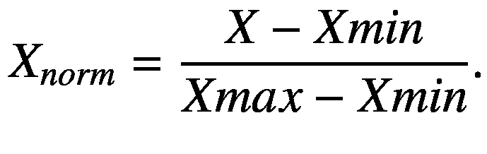

(3.1)

#### 标准化(Z 分数标准化)

当要素被重新调整到具有零均值和单位标准差的标准正态分布(具有钟形曲线的高斯分布)的属性时，该过程被称为*标准化*。这在使用机器学习算法时很重要，因为它假设输入数据是正态分布的。在这种方法中，通过使用以下等式来计算重新调整的值。

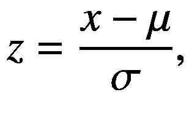

(3.2)

*其中 z* 是标准 z 得分， *x* 是输入数据， *μ* 是输入数据的样本均值， *σ* 是均值的标准差。这种方法可用于特征分布不包含极端异常值的情况。

### 欠拟合或过拟合

当我们训练机器学习模型时，一个主要目标是使用它来生成对未知数据的预测。一个经过充分训练的模型应该表现出与训练数据相同的对未知数据的预测精度。但是，在某些情况下，模型可能无法很好地处理看不见的数据。这可能是由于模型欠拟合或过拟合造成的。

*   **欠拟合:**当训练过程过早停止，或者模型没有充分暴露于训练数据时。在这种情况下，模型不能学习训练数据中存在的一般模式。训练数据和看不见的数据的预测准确性差是拟合不足的指示。

*   **过拟合:**人们可以选择使用训练数据集中可用的所有数据来训练模型，以进行大量迭代，从而学习训练数据中存在的所有模式。因此，该模型可以在训练数据上表现出非常高的准确性。但是，该模型对训练数据进行了如此精细的调整，以至于它失去了在它所看到的训练数据之外进行概括的能力。在这种情况下，即使模型能够以高精度为定型数据生成预测，它对未知数据的预测精度也会很差。这种情况表明模型过度拟合。

确保模型不会欠拟合或过拟合是很重要的。应该对机器学习模型进行充分的训练，以便它能够以合理的精度为未知数据生成预测。换句话说，机器学习模型应该能够*概括*。

### 数据拆分:训练、验证和测试数据集

正如我们刚刚讨论的，过度拟合是机器学习模型训练过程中遇到的最大挑战之一。这是根据训练数据中存在的微小细节/噪声来训练模型的结果。在这种情况下，模型开始记忆训练数据。这导致对训练数据的良好性能，但是对于看不见的数据，模型的准确性显著下降。为了解决过度拟合并帮助模型变得更加*一般化*，分割数据集被认为是一个必要的步骤。根据经验，数据集通常分为三组观察值:训练、验证和测试数据[ [6](#Par232) ]，定义如下。

*   **训练数据:**用于模型训练过程的观察值子集。该算法使用该数据集来学习机器学习模型的参数。

*   **验证数据:**观测值的子集，用于评估模型在训练过程中的预测性能。使用验证数据在预测误差中观察到的趋势可以帮助识别用于充分训练的迭代次数。在典型的模型训练中，通过迭代训练过程，训练数据集和验证数据集的预测误差应该不断减小。然而，如果我们观察到一个点，在该点上，对于训练数据，预测误差继续减小，但是对于验证数据，预测误差开始增大，则应该停止训练。验证误差开始增加的点表示过度拟合的开始。

*   **测试数据:**这是仅用于评估完全训练模型性能的数据子集。测试数据的预测准确性是模型在现实世界场景中遇到的未知数据上的性能指标。

下面的代码片段显示了用于拆分数据集的 scikit-learn 实用程序的应用程序。

```py
from sklearn.model_selection import train_test_split
X_train, X_test, y_train, y_test = train_test_split(X, y, test_size=0.25, random_state=42)

```

### 模型评估指标

要了解模型在未知数据集上的概化程度，并评估其性能，使用可用于评估模型性能的量化指标非常重要。

在本节中，我们将讨论一些用于量化模型预测准确性的评估指标，并根据这些指标来选择性能最佳的算法。衡量标准还取决于问题的类型。对于回归模型中的定量结果，一些常用的度量标准包括决定系数( *R* <sup>2</sup> )和均方根误差(RMSE)。*R*T6】2 使用以下等式计算。

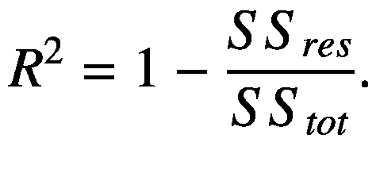

(3.3)

*SS* <sub>*res*</sub> 为残差平方和， *SS* <sub>*tot*</sub> 为使用以下表达式数学计算的平方和总和。


(3.4)

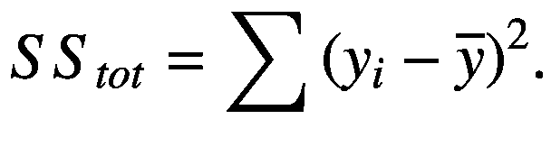

(3.5)

这里， *y* <sub>*i*</sub> 是每个数据点的值，是平均值， *y* <sub>* reg *</sub> 是回归模型预测的值。

另一方面，RMSE 度量通过使用下面的等式来计算。

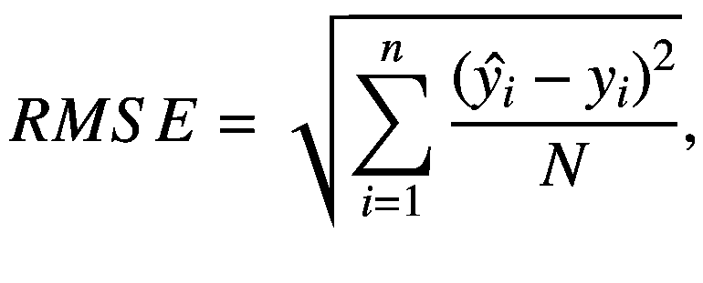

(3.6)

其中是回归模型预测的值， *N* 是观测值的个数。

对于分类问题，模型精度定义为正确预测数与预测总数之比。对于具有 *N* 个不同类别的分类问题，还使用了一个*混淆矩阵*或一个*误差矩阵*，它是一个 *N* * *N* 矩阵，包含 *N* 个主对角线上的正确分类和非对角线条目上的其余可能误差。这个矩阵提供了一种可视化的方法来评估机器学习模型对于分类问题的性能。图 [3-1](#Fig1) 显示了二元分类(两类)的混淆矩阵。


图 3-1

混淆矩阵的一个图解，其中 P =正，N =负，TP =真正；FP =假阳性；TN =真阴性；FN =假阴性

基于该矩阵，可以确定一些准确性度量，包括精确度、召回率和 F1 分数。

#### 精确

精度定义为给定类别的真阳性(正确预测的)样本数与预测属于该类别的样本总数之比。高精度输出表明，在模型预测属于给定类别的样本中，大多数样本属于该类别。

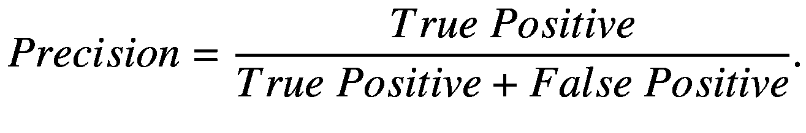

(3.7)

#### 回忆

召回被定义为真阳性样本的数量与属于该类别的样本总数的比率。高召回率表示属于给定类别的极少数样本被错误分类为属于另一类别。

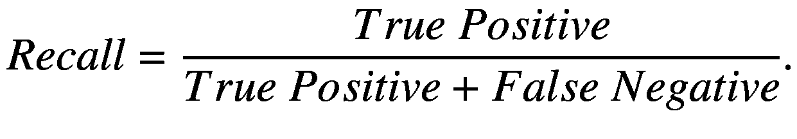

(3.8)

#### f1-分数

F1 分数提供了精确度和召回率的调和平均值。在模型选择期间，在多个分类算法中选择具有最高 F1 分数的模型。

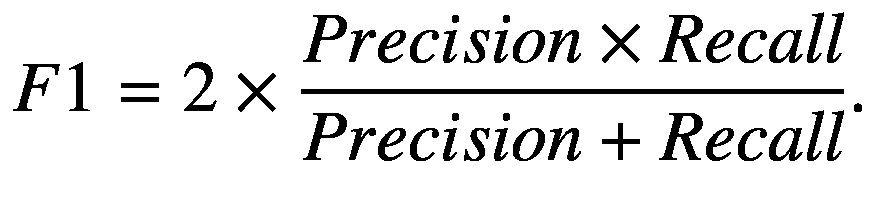

(3.9)

### 可再生机器学习

与传统算法相比，机器学习算法为一组工业相关问题提供了更好的预测能力。然而，对于工业应用，重要的是确保模型训练和由模型产生的预测是完全可再现的。有时，即使使用相同的数据集和相同的算法，也很难重现结果并获得相同的性能。

这些差异可以归因于几个原因，例如权重的随机初始化、数据集的随机洗牌以及几个机器学习算法的随机性质。为了解决这个问题，作为机器学习算法实现的一部分，仔细设置*随机种子*可以让我们离实现可重复性更近一步。下面的代码片段显示了为操作系统环境变量、Python 随机模块、NumPy 和 TensorFlow 设置随机种子的一些示例。

```py
seed_value = 42
# Set Python random seed using environment variable
os.environ['PYTHONHASHSEED']=str(seed_value)
import random
# Set Python random seed using Python random module
random.seed(seed_value)
import numpy as np
np.random.seed(seed_value) # Set Numpy random seed
import tensorflow as tf
tf.random.set_seed(seed_value) # Set TensorFlow random seed

```

### 装袋与增压

到目前为止，我们已经讨论了选择单个机器学习模型来提供最佳和可再现的性能。然而，在现实世界中，基于算法的单一模型可能无法提供最佳解决方案。*集成学习*被引入来解决这一挑战；当多个机器学习模型使用相同的算法进行训练以提供更强大和更鲁棒的预测模型时，就会发生这种情况。

这种想法是将多个弱学习器结合起来，创建一个强学习集成，它可以提供比单个机器学习模型更高的准确性。装袋和增压是这一类中最常见的两种技术。它们有助于降低噪声、方差(即避免过拟合)或偏差(即避免欠拟合)。在定义这些概念之前，理解 *bootstrapping* 很重要，bootstrapping 是统计学中使用的一种重采样技术。在引导过程中，从提供的数据集中随机抽取几个样本进行替换。bootstrap 可以量化与统计学习方法相关的不确定性[ [7](#Par233) ]。

*Bagging* 是 *bootstrap 聚合*的简称。虽然在一些机器学习算法(如决策树)中遇到高方差(过拟合)，但 bagging 在通过并行训练同质弱学习器(即，性能差的模型)来组合它们，并通过平均(回归)或投票(分类)过程来提供预测的情况下极其有用。这个过程产生了一个更健壮的模型，并且减少了过度拟合的机会。

*增强*另一方面，从同质弱学习者的集合中学习，但是顺序地和自适应地。这种方法试图通过基于先前训练的性能差的模型训练模型来最小化偏差(欠拟合),而不是在装袋中减少方差(过拟合)。换句话说，bagging 使用一个等权平均值来生成预测，而 boosting 使用多个学习者的组合来提供一个性能更好的模型。

### 模型可解释性

在统计学和机器学习领域，众所周知，过于复杂的模型可能并不总是问题的最佳解决方案。这主要是因为随着模型变得越来越复杂，失去了模型的可解释性。可解释性对于许多行业来说是至关重要的，在这些行业中，需要对模型输出进行解释，而模型推理是重中之重。例如，在具有多层和多个神经元的深度神经网络中，可能很难解释特定输入特征对输出的影响。

这与基于决策树的方法或甚至更简单的线性回归模型形成对比，其中参数的变化直接映射到输出变量的变化。大量的努力被用于更好地理解复杂的机器学习算法；然而，它仍然是一个正在进行研究的领域。

## 探索性数据分析

在现实世界的场景中，数据通常不会以完美的格式提供，无法随时提供给机器学习模型。机器学习项目的第一步涉及执行探索性数据分析(EDA)，包括检测不一致性、检查假设、确定解释变量之间的关系以及理解特征之间的关系的步骤[ [8](#Par234) ]。

探索性数据分析是为机器学习模型理解和准备数据的关键过程。EDA 中的一些步骤包括变量识别、单变量和双变量分析、缺失值的处理、异常值的去除以及附加变量的转换或创建。EDA 的目的在于更好地理解数据及其假设，提高其质量，并通过发现数据趋势的线索来生成分析假设[ [9](#Par235) ]。这包括使用汇总统计和可视化技术来回答有关所提供数据的问题。

本节将对第 [2](2.html) 章中使用的油气数据进行简要的探索性分析。我们继续上一章的分析，其中两口井的数据被合并。合并的数据集用作输入，并且生成数据帧以执行 EDA。以下代码输出显示了合并数据帧的大小。

```py
Shape of the dataset (rows, columns): (5127, 15)

```

数据帧由多个 NA 值组成，如图 [3-2](#Fig2) 所示，清理数据集时需要移除这些 NA 值。从图中可以看出，在多个特性中有多个列缺少 236 个值，需要进行处理。在这种情况下，不是插补(即替换缺失值)，而是丢弃值，因为 NA 出现在同一组数据点中。从数据集中移除 NA 值后，数据框的新形状如下。

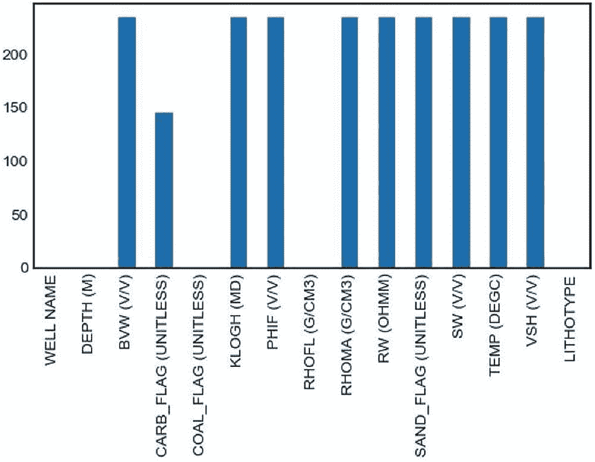

图 3-2

数据集中缺失值或 NA 值的直方图

```py
Shape of the dataset (rows, columns): (4818, 15)

```

下一步是调查数据集中要素的描述性统计数据。图 [3-3](#Fig3) 显示了数据帧的描述性统计。

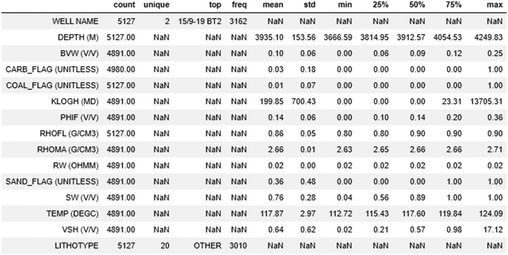

图 3-3

数据帧的描述性统计

下一步是寻找特征的分布。在图 [3-4](#Fig4) 中，显示了一些特征作为示例。VSH (V/V)是显示偏斜的特征之一，这可能是由于出现了更大范围的较不频繁的值或者出现了异常值。观察异常值存在的一个简单方法是通过一个箱线图。图 [3-5](#Fig5) 显示了同一组特征的箱线图示例。同样，观察特征 VSH (V/V ),您可以看到有几个点位于上四分位数范围之外。在本节中，异常值分析不包括在内。但是，您可以采取额外的过滤步骤从数据中移除任何现有的异常值。

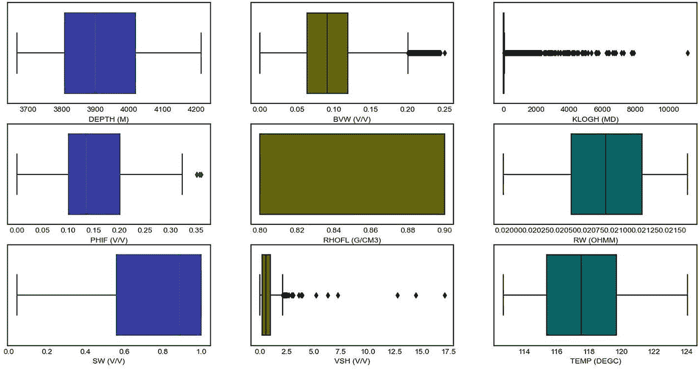

图 3-5

用于识别异常值的数据集中要素的方框图

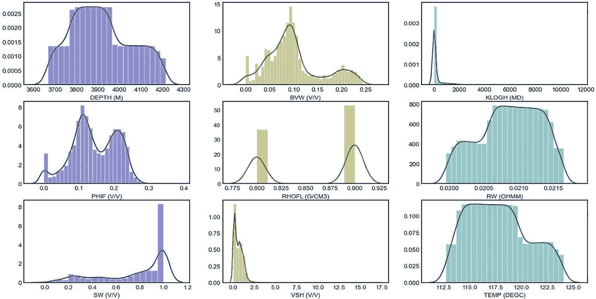

图 3-4

具有多模态和偏斜行为的数据集中某些要素的分布

务必确保数据集中没有高度共线的变量。图 [3-6](#Fig6) 所示的视觉热图观察了不同特征之间的相关性。

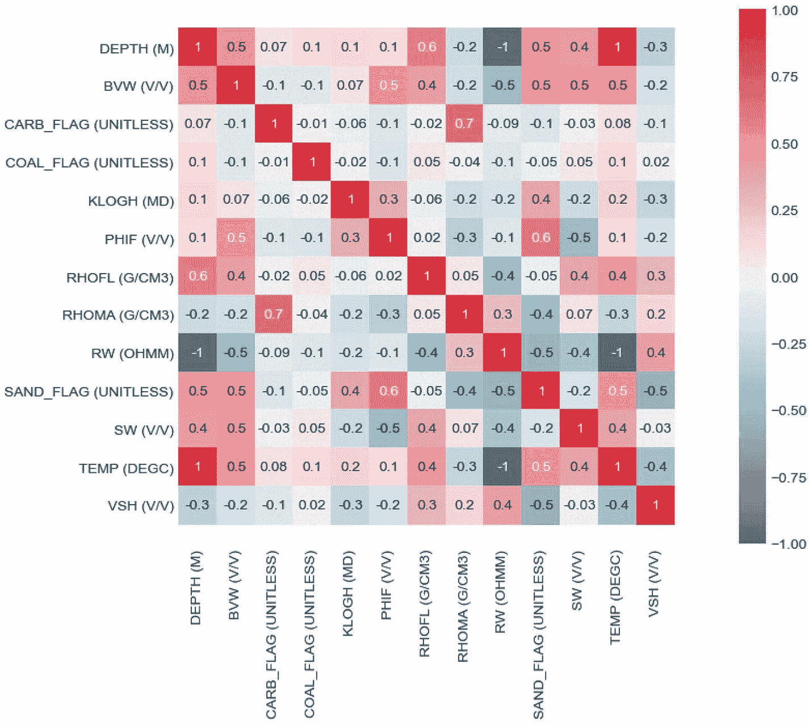

图 3-6

用于了解变量之间任何现有共线性的相关图热图

重点关注 KLOGH (MD ),这是回归中的输出变量，如下所述，除了 RHOMA (G/CM3)和 CARB_FLAG(无单位)显示 70%的共线性外，没有观察到任何要素高度共线。根据经验，建议采取额外的步骤来理解特性的重要性，并且只保留更重要的特性。然而，特征工程和特征选择是超出本章范围的大主题。我们将讨论重点放在构建机器学习模型上。

查看图 [3-7](#Fig7) 中的最终变量列表，以及观察值的数量，数据集中只有一个主要分类变量——岩石类型。对于分类问题，这是输出变量。

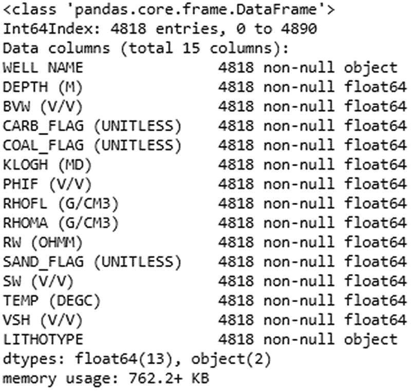

图 3-7

数据集中要素的数据类型信息

## 监督学习

正如我们在本章开始时讨论的，已知输入预测可变输出的问题属于监督学习范畴。如果输出是定量的或连续的，它导致解决一个回归问题。然而，如果输出是定性的或离散的/分类的，这是一个分类问题[ [10](#Par236) ]。换句话说，目标是学习函数 *f* ，它表示由输入变量提供的系统信息，以预测或推断响应或因变量(输出变量) [7](#Par233) 。

在本节中，我们将展示各种回归和分类算法的普通实现的代码片段。目标是通过提供一个起点，让您熟悉不同的算法。本章后面的部分给出了一个超参数调整的例子，它可以被本章讨论的任何机器学习算法所采用。

在提供了不同算法的简要描述和代码片段之后，还提供了一个简要的分析来理解每个算法的性能。但是，需要注意的是，这些算法实现并没有针对性能进行优化；因此，使用这些算法的微调模型可能比这里显示的使用普通实现的模型表现出更好的性能。

### 回归

回归是监督学习问题的一个子类型，其中输出是定量或连续变量。在我们处理的岩石物理数据的例子中，KLOGH 被选为输出变量。所有其他特征都被视为独立的输入变量。因此，回归问题的目标是找到最佳函数 *f* ，该函数可以使用所有其他变量作为输入特征来准确预测 KLOGH。【T2

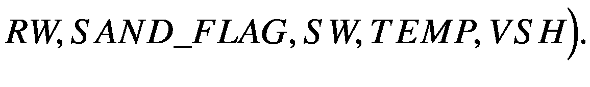

(3.10)

本节简要讨论了各种机器学习算法，但不涉及它们的数学细节或超参数优化。本节给出了算法的一个最小实现，我们建议您按照本章末尾“进一步阅读”一节中提供的建议，更深入地研究每一个算法。

scikit-learn 和 TensorFlow 机器学习库用于用 Python 实现算法。本书代码库中的 Jupyter 笔记本中提供了本章中所示示例的端到端代码。Jupyter 笔记本还包含一些基本函数，这些函数被定义为生成准确性度量、绘制回归曲线以及生成预测的散点图。

#### 多元线性回归

多元线性回归，或简称多元回归，是最简单的回归算法。在该算法中，数字系数被分配给每个输入特征，并且输出变量被预测为通过将特征值与相应的数字系数相乘而获得的值的总和。该算法的训练过程试图最小化观察到的输出值和模型预测的输出值之间的残差平方和。下面的代码片段显示了该算法的一个示例实现。

```py
# Multiple Linear Regression
from sklearn.linear_model import LinearRegression
lin_reg = LinearRegression()
lin_reg.fit(X_train, y_train)  # training the algorithm
print(lin_reg.intercept_)  # intercept
print(lin_reg.coef_)  # coefficients
# Prediction on test data
y_pred_lin = lin_reg.predict(X_test)

```

**结果**

```py
Mean Absolute Error: 283.89717843775026
Mean Squared Error: 245181.5892137209
Root Mean Squared Error: 495.15814566027376
R Squared: 0.1488228559603506

```

图 [3-8](#Fig8) 显示了多元线性回归的回归图，以及测试数据集 KLOGH 预测值的比较。从测试数据的观测值和预测值的回归图中可以看出，线性模型无法捕捉输入特征和输出变量之间的非线性映射。可以得出结论，该算法对于解决该问题来说过于简单，并且存在很大的偏差(欠拟合)。

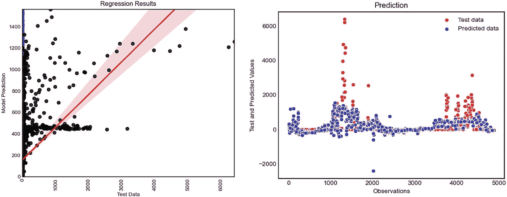

图 3-8

多元线性回归结果显示为回归图和散点图

#### 支持向量回归

支持向量回归基于支持向量机。在这种方法中，通过允许误差余量，对每个点进行回归。对于每个数据点 *y* ，得到一个介于( *y* + *ϵ* )和( *y -* *ϵ* )之间的预测值是可以接受的。在图 [3-9](#Fig9) 中，误差幅度 *ϵ* 由两个支持向量描述，并允许模型调整的灵活性。

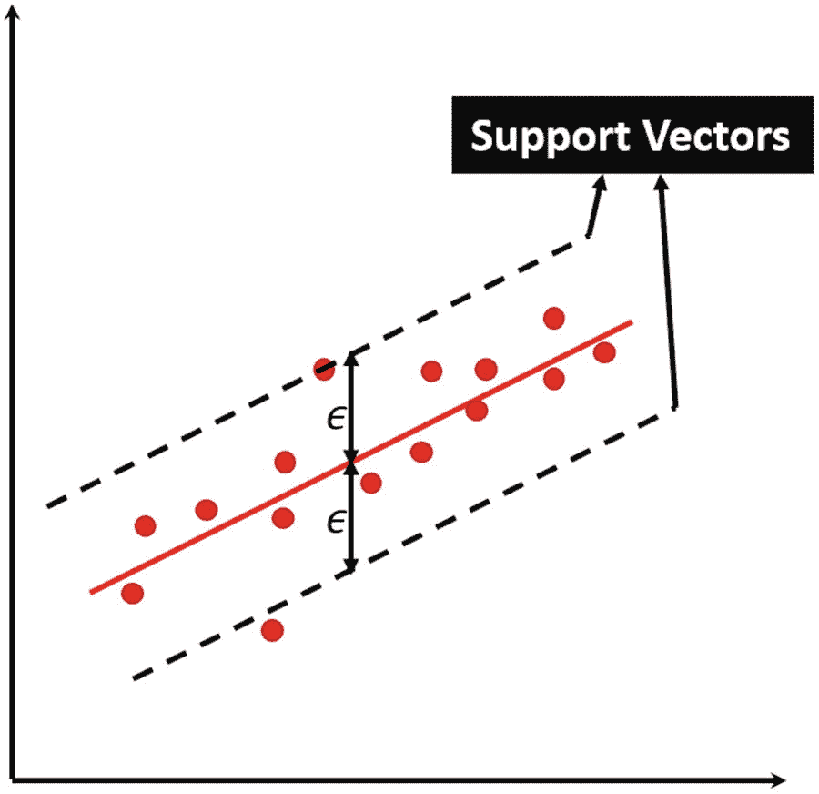

图 3-9

描述具有误差容限的支持向量的示意图 *ϵ*

除了误差幅度，这个算法还利用了一个*内核技巧*。核技巧将非线性低维空间投影到高维空间。在高维空间中，可以把原来的非线性问题表示成线性问题。scikit-learn 中有几个内核可用于支持向量回归实现，包括`'linear'`、`'sigmoid'`、`'rbf'`和`'polynomial'`。

由于数据集中非线性的存在，在该示例中选择径向基函数(`'rbf'`)核，也称为*高斯核*。下面的代码片段显示了一个示例实现。

```py
# Support Vector Regression (SVR)
from sklearn.svm import SVR
svr_reg = SVR(kernel='rbf', C=100, gamma=0.1, epsilon=.1)
svr_reg.fit(X_train, y_train)
# Prediction on test data
y_pred_svr = svr_reg.predict(X_test)

```

**结果**

```py
Mean Absolute Error: 82.06389051208197
Mean Squared Error: 112564.26261124818
Root Mean Squared Error: 335.5059799932755
R Squared: 0.6092197302512246

```

基于支持向量回归结果的回归图和散点图如图 [3-10](#Fig10) 所示。该算法的性能明显优于多元线性回归。这种改进归功于误差容限和在支持向量回归中应用的核技巧。

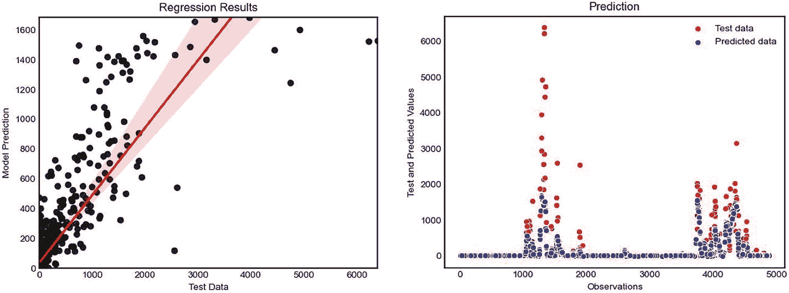

图 3-10

支持向量回归结果显示为回归图和散点图

#### 决策树回归

决策树是非参数的基于树的流程图。该算法通过构建由多个叶节点构成的基于规则的分层树结构来工作。在每个叶节点的一个特征或一组特征上施加一个条件。在决策树的每个节点，训练数据中的样本根据施加的条件被分成多个子节点。预测值是根据末端叶节点样本的平均值计算的(见图 [3-11](#Fig11) )。

在训练过程中，该算法学习在每个叶节点分割训练数据的规则，以便最小化观察值和预测值之间的均方误差(MSE)。由于决策树的高度可解释性，它非常常用于回归问题。图 [3-12](#Fig12) 显示了与前两种算法相比，该算法的应用提供了更好的预测。然而，这种算法存在过拟合的问题。这里显示了一个决策树回归代码片段。

```py
# Decision Tree – Regression
from sklearn.tree import DecisionTreeRegressor
dt_reg = DecisionTreeRegressor(random_state=42)
dt_reg.fit(X_train, y_train)
# Prediction on test data
y_pred_dt = dt_reg.predict(X_test)

```

**结果**

```py
Mean Absolute Error: 29.73391044401977
Mean Squared Error: 35097.83335297129
Root Mean Squared Error: 187.34415750957191
R Squared: 0.8781536833529513

```

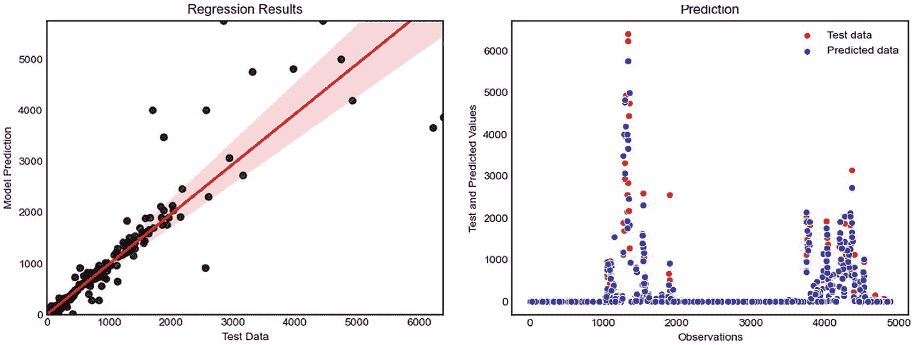

图 3-12

决策树回归结果显示为回归图和散点图

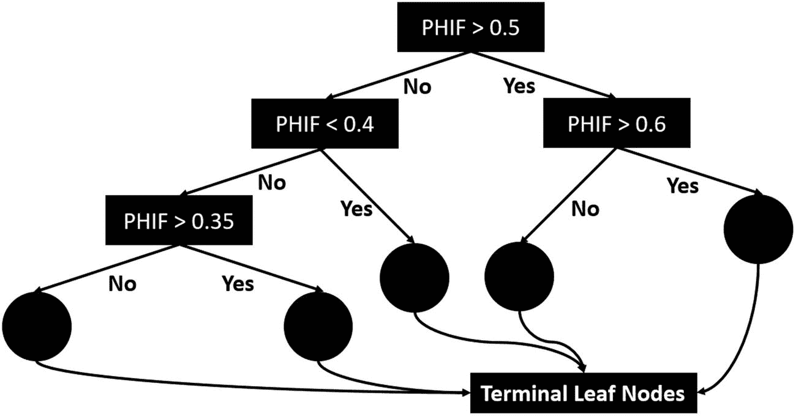

图 3-11

决策树的概念性描述，它根据 PHIF 值拆分数据

#### 随机森林回归

*随机森林*是一种基于决策树集合的算法。该算法应用了本章前面讨论过的 bagging。随机森林算法将 bagging 应用于输入要素和训练数据。这意味着，对于在随机森林模型中生长的每个决策树，随机选择输入特征的子集和训练数据来训练该决策树。该算法并行训练多个决策树。

决策树算法遭受过拟合的问题。这是由于使用了单个树，这几乎记住了整个训练数据，并且不能进行归纳。然而，随着特征和训练数据的打包，这种过拟合问题在随机森林算法中得到解决，该算法可以提供稳健的预测模型。从随机森林回归获得的结果显示出比先前讨论的算法更好的预测准确性。可以通过查看图 [3-13](#Fig13) 中的曲线来验证这一观察结果。这里显示了一个示例代码实现。

```py
# Random Forest – Regression
from sklearn.ensemble import RandomForestRegressor
rf_reg = RandomForestRegressor(random_state=42)
rf_reg.fit(X_train, y_train)
# Prediction on test data
y_pred_rf = rf_reg.predict(X_test)

```

**结果**

```py
Mean Absolute Error: 20.0011266166531
Mean Squared Error: 14744.082604216954
Root Mean Squared Error: 121.4252140381764
R Squared: 0.948814157854232

```

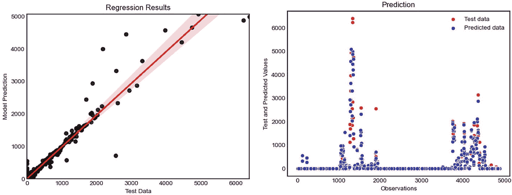

图 3-13

随机森林回归结果显示为回归图和散点图

#### XGBoost:极限梯度提升

XGBoost 是非常强大和流行的机器学习算法之一，由于其优化的实现，它可以为大数据集提供高精度。该算法遵循 boosting 概念，其中弱学习器(决策树)按顺序增长。每个后续树基于前一个树的预测误差进行学习。对于在前一个学习者中表现出较高 MSE 的数据点，提高预测的权重较高。算法从弱学习者创建复合模型，这提供了稳健的性能。

该算法旨在以更高的执行速度优化性能。使用梯度下降算法优化模型本身；因此，它提供了更高的精度。图 [3-14](#Fig14) 显示了使用 XGBoost 回归预测绘制的回归图和散点图。下面的代码片段显示了 XGBoost 回归算法的一个示例实现。

```py
# XGBoost – Regression
import xgboost as xgb
xgb_reg = xgb.XGBRegressor()
xgb_reg.fit(X_train, y_train)
# Prediction on test data
y_pred_xgb = xgb_reg.predict(X_test)

```

**结果**

```py
Mean Absolute Error: 34.95929924279304
Mean Squared Error: 14853.490861224791
Root Mean Squared Error: 121.87489840498243
R Squared: 0.948434334034536

```

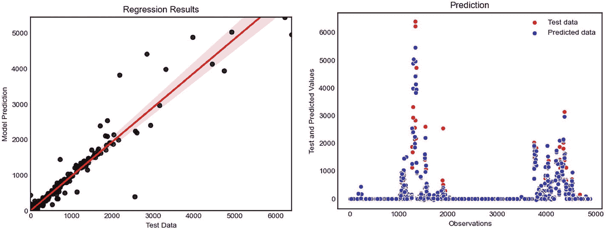

图 3-14

XGBoost 回归结果显示为回归图和散点图

#### 人工神经网络

人工神经网络建立在人脑中神经元决策能力的原理上。这些是更复杂的深度学习网络的构建模块。神经网络结构由一个输入层、一个或多个隐藏层和一个输出层组成。每一层都由神经元组成，在那里进行计算。

在本章的后面部分，我们将更详细地讨论人工神经网络及其在深度学习中的应用。在下面的代码示例中，构建了一个多层感知器模型，它使用误差反向传播原理作为主要学习机制。

在误差反向传播期间，模型预测中的估计误差被反向传播以调整神经网络模型参数，并计算更新的模型参数。这种迭代训练过程一直持续到满足模型精度或训练持续时间的特定条件。图 [3-15](#Fig15) 显示了基于使用以下代码构建的神经网络模型获得的预测结果的曲线图。

```py
# Multi-Layer Perceptron – Regression
import tensorflow as tf
from tensorflow import keras
from tensorflow.keras import layers

def build_model():
    ann_reg = keras.Sequential([
        layers.Dense(32, activation="relu", input_shape=[len(X_train.keys())]),
        layers.Dense(32, activation="relu"),
        layers.Dense(1) ])

    optimizer = tf.keras.optimizers.RMSprop(0.001)
    ann_reg.compile(loss='mse', optimizer=optimizer, metrics=['mse'])
    return ann_reg

```

**结果**

```py
Mean Absolute Error: 80.5055592187044
Mean Squared Error: 51228.191722683405
Root Mean Squared Error: 226.33645690140906
R Squared: 0.8221552194654382

```

这里建立的基本神经网络模型的准确性可能不如本章前面讨论的一些更简单的模型。随着机器学习模型的复杂性增加，充分训练它们的任务变得更具挑战性。为了充分训练一个*深度*神经网络模型，我们需要遵循超参数优化的过程，这将在本章后面讨论。

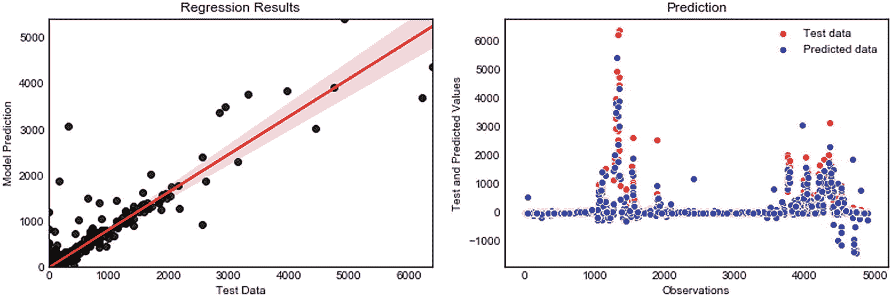

图 3-15

人工神经网络回归结果显示为回归图和散点图

#### 回归模型的比较

为了比较前面讨论的不同机器学习模型的结果，我们比较 RMSE 分数来评估它们的性能。根据测试数据集的结果，随机森林和 XGBoost 回归算法似乎是表现最好的算法之一(见表 [3-1](#Tab1) )。然而，我们想要重申的是，这些结果是基于这些算法的最简单的可能实现，并且没有任何参数被调整。这些算法中的每一个的微调模型显示出与本摘要中所示不同的准确性。然而，该分析确定了随机森林和 XGBoost 算法在为回归问题构建快速原型方面的功效。

表 3-1

回归模型和 RMSE 分数

<colgroup><col class="tcol1 align-left"> <col class="tcol2 align-left"></colgroup> 
| 

回归模型

 | 

均方根误差

 |
| --- | --- |
| 多元线性回归 | Four hundred and ninety-five point one six |
| 支持向量回归 | Three hundred and thirty-five point five one |
| 决策树 | One hundred and eighty-seven point three four |
| 随机森林 | One hundred and twenty-one point four two |
| XGBoost | One hundred and twenty-one point eight seven |
| 人工神经网络 | Two hundred and twenty-six point three four |

### 分类

分类是监督学习的一个子类，其中输出变量是离散的或分类的。对于本章中讨论的示例，岩性是唯一的分类变量，因此被用作输出变量。分类算法的目标是找到函数 *f* ，该函数可以映射特征以准确预测不同的岩石类型类别。【T2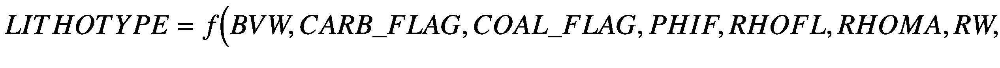

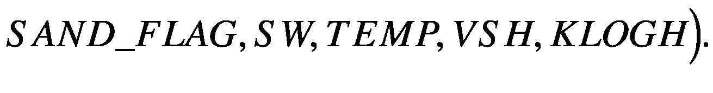

(3.11)

对于本章使用的岩石物理数据集，数据中存在多个岩石类型类别，如图 [3-16](#Fig16) 所示。

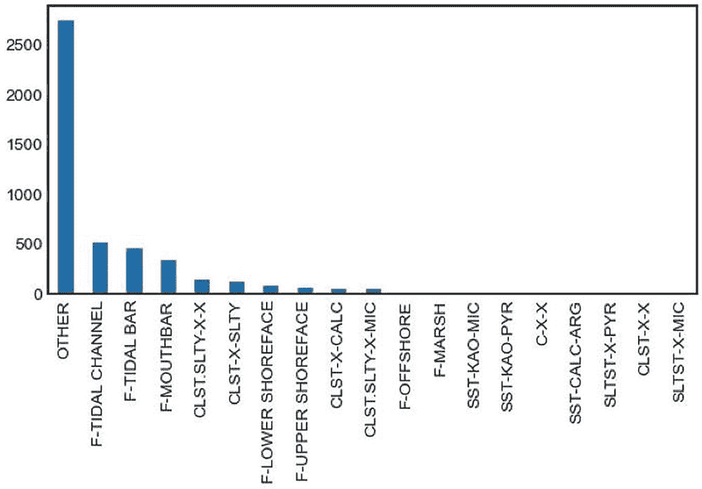

图 3-16

输出变量中可用的不同岩石类型类别

为了简单起见，只保留至少有 250 个数据点的类别，其余的都被过滤掉了。从图 [3-16](#Fig16) 中可以看出，出现频率最高的类别是“其他”,它没有传递任何有用的信息，因此也被丢弃。

图 [3-17](#Fig17) 显示了分类模型中使用的前三个类别。只有两个类别的分类输出变量是二元分类问题。但是，在我们使用的数据集中，输出变量中有两个以上的类。因此，我们在这个例子中解决了一个*多类*分类问题。

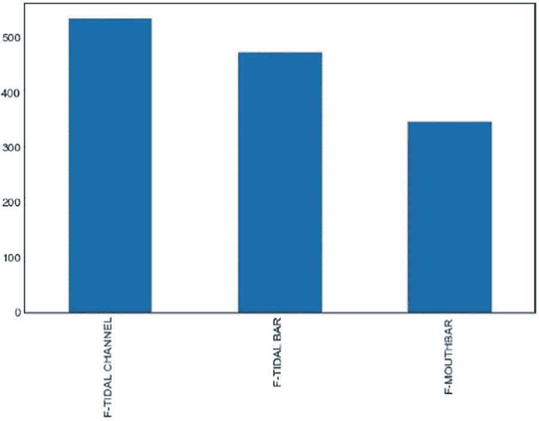

图 3-17

岩石类型分类输出变量中的三个主要类别

#### 多项式逻辑回归

逻辑回归是一种分类技术，用于二元分类问题。二进制分类相当简单。如果一个样本不属于一个类别，它一定属于另一个类别。逻辑回归使用 sigmoid 函数(见图 [3-21](#Fig21) )。对于输入值的非常小的变化，sigmoid 函数从 0 变化到 1。sigmoid 函数的这一特性有助于对样本属于两个不同类别的数据进行分类。对于涉及两个以上类别的分类问题，*多项式逻辑回归*是基本的多类分类算法之一。该算法使用一个 *softmax* 函数，该函数由下式表示。


(3.12)

其中 *k* =多类分类问题中的类的数量，并且 *i* 是对应于输入 *z* <sup>*i*</sup> 正在计算 softmax 函数的类。Softmax 函数从 0 到 1 的变化也非常快，但它具有处理多个类的能力。简单来说，softmax 函数提供了一个样本属于 *k* 类的概率。多项式逻辑回归也称为 *softmax 回归*。以下代码片段显示了使用该算法实现多类分类的示例。

```py
from sklearn.linear_model import LogisticRegression
clf_logreg = LogisticRegression()
clf_logreg.fit(X_train, y_train)
# Prediction on test data
y_pred_logreg = clf_logreg.predict(X_test)
# Accuracy Metrics
clf_metrics(y_test, y_pred_logreg)

```

**结果**

```py
Classification Accuracy Score: 0.6480938416422287
Classification Report:
                  precision    recall  f1-score   support

     F-MOUTHBAR       0.40      0.05      0.08        87
    F-TIDAL BAR       0.53      0.86      0.66       119
F-TIDAL CHANNEL       0.82      0.85      0.84       135

       accuracy                           0.65       341
      macro avg       0.59      0.58      0.53       341
   weighted avg       0.61      0.65      0.58       341

```

分类准确性的结果以分类报告的形式显示，其中精度、召回率和 F1 分数显示为分类器预测能力的量化指标。该算法以较高的精度预测 F-潮汐通道类别，但是对于具有较低群体的类别不提供良好的精度。

应该注意的是，一些分类器不能很好地处理数据，其中一个类比其他类有更多的样本。在*群体不平衡*的情况下，对训练数据进行重采样以使类别群体相等可能有助于提高分类算法的精确度和准确度。

#### 支持向量分类器

前面，我们讨论了支持向量和内核技巧。*支持向量分类器*使用类似的概念。为了执行分类，该算法构造了分离属于不同类别的样本的最优超平面。一个等价的 2D 表示可以被认为是一条划分属于两个独立类别的点簇的线。该算法使用正则化参数，该参数规定了分隔超平面的余量(回想一下 *ϵ* )。结果表明，该算法不能识别具有较低群体的类。

```py
from sklearn.svm import SVC
clf_svc = SVC()
clf_svc.fit(X_train, y_train)
# Prediction on test data
y_pred_svc = clf_svc.predict(X_test)
# Accuracy Metrics
clf_metrics(y_test, y_pred_svc)

```

**结果**

```py
Classification Accuracy Score: 0.6217008797653959
Classification Report:
                  precision    recall  f1-score   support

     F-MOUTHBAR       0.00      0.00      0.00        87
    F-TIDAL BAR       0.50      0.87      0.64       119
F-TIDAL CHANNEL       0.80      0.81      0.80       135

       accuracy                           0.62       341
      macro avg       0.43      0.56      0.48       341
   weighted avg       0.49      0.62      0.54       341

```

#### 决策树分类器

决策树分类器算法遵循与前面讨论的决策树回归相似的方法。在回归算法中，通过对样本所属的末端叶节点中的值进行平均来生成预测。在分类问题中，属于终端树节点的所有样本被分类为类别之一。

在模型训练期间，该算法试图最小化熵(随机性)并最大化信息增益。没有随机性的充分训练的树在任何给定的末端叶节点中具有仅属于样本类之一的所有样本。结果表明，尽管人口不平衡，这种算法提供了跨岩石类型类别的高精度和准确性。

```py
from sklearn.tree import DecisionTreeClassifier
clf_dt = DecisionTreeClassifier()
clf_dt.fit(X_train, y_train)
# Prediction on test data
y_pred_dt = clf_dt.predict(X_test)
# Accuracy Metrics
clf_metrics(y_test, y_pred_dt)

```

**结果**

```py
Classification Accuracy Score: 0.9853372434017595
Classification Report

:
                  precision    recall  f1-score   support

     F-MOUTHBAR       0.98      0.98      0.98        87
    F-TIDAL BAR       0.99      0.97      0.98       119
F-TIDAL CHANNEL       0.99      1.00      0.99       135

       accuracy                           0.99       341
      macro avg       0.98      0.98      0.98       341
   weighted avg       0.99      0.99      0.99       341

```

#### 随机森林分类器

随机森林分类器的工作原理与我们讨论随机森林回归的概念完全相似。唯一的区别是，在分类算法中，决策树分类器的森林在增长，最终的预测是基于*投票*而不是平均来生成的。

在投票方法中，在集合预测中出现频率最高的类别被选为最终输出。该算法还提供了预测样本属于任何样本类别的概率的灵活性。这两种输出方法的选择取决于手头的问题。一个样本代码实现和分类结果表明，该算法提供了高精度和准确性的预测。

```py
from sklearn.ensemble import RandomForestClassifier
clf_rf = RandomForestClassifier()
clf_rf.fit(X_train, y_train)
# Prediction on test data
y_pred_rf = clf_rf.predict(X_test)
# Accuracy Metrics
clf_metrics(y_test, y_pred_rf)

```

**结果**

```py
Classification Accuracy Score: 0.9882697947214076
Classification Report:
                  precision    recall  f1-score   support

     F-MOUTHBAR       0.99      0.98      0.98        87
    F-TIDAL BAR       0.99      0.98      0.99       119
F-TIDAL CHANNEL       0.99      1.00      0.99       135

       accuracy                           0.99       341
      macro avg       0.99      0.99      0.99       341
   weighted avg       0.99      0.99      0.99       341

```

#### *k*-最近邻居( *k* -NN)

*k*-最近邻( *k* -NN)是一种基于相似性度量(如距离函数，如两个样本之间的欧几里德距离，或二进制向量之间的汉明距离)的非参数算法。该算法利用相似性度量在样本数据中寻找 *k* 最近的邻域点，并基于这些 *k* 邻域中出现频率最高的类，预测输出类别。

该算法的输入参数之一是在具有未知类别的样本点附近搜索的邻居的数量。该算法的示例实现和结果显示了合理的性能。但是，它的性能不如前面讨论的基于树的算法。

```py
from sklearn.neighbors import KNeighborsClassifier
clf_knn = KNeighborsClassifier()
clf_knn.fit(X_train, y_train)
# Prediction on test data
y_pred_knn = clf_knn.predict(X_test)
# Accuracy Metrics
clf_metrics(y_test, y_pred_knn)

```

**结果**

```py
Classification Accuracy Score: 0.8592375366568915
Classification Report:
                  precision    recall  f1-score   support

     F-MOUTHBAR       0.83      0.75      0.79        87
    F-TIDAL BAR       0.86      0.85      0.86       119
F-TIDAL CHANNEL       0.87      0.94      0.90       135

       accuracy                           0.86       341
      macro avg       0.86      0.85      0.85       341
   weighted avg       0.86      0.86      0.86       341

```

#### 高斯朴素贝叶斯分类

高斯朴素贝叶斯算法基于*贝叶斯定理*，假设多个输入要素独立地影响样本属于特定类的概率。该算法假设与每个类相关联的连续特征的高斯或正态分布。

通过使用最大似然原理，该算法可以预测样本点属于特定类别的概率。该算法也属于基本分类算法的范畴，但是比其他基本分类算法(例如多项式逻辑回归)执行得更好。下面的代码片段显示了该算法的示例实现和分类结果。

```py
from sklearn.naive_bayes import GaussianNB
clf_gnb = GaussianNB()
clf_gnb.fit(X_train, y_train)
# Prediction on test data
y_pred_gnb = clf_gnb.predict(X_test)
# Accuracy Metrics
clf_metrics(y_test, y_pred_gnb)

```

**结果**

```py
Classification Accuracy Score: 0.6099706744868035
Classification Report:
                  precision    recall  f1-score   support

     F-MOUTHBAR       0.40      0.54      0.46        87
    F-TIDAL BAR       0.61      0.34      0.44       119
F-TIDAL CHANNEL       0.77      0.89      0.82       135

       accuracy                           0.61       341
      macro avg       0.59      0.59      0.57       341
   weighted avg       0.62      0.61      0.60       341

```

#### 线性判别分析

线性判别分析(LDA)也在输入特征的高斯分布的假设下工作。此外，该算法假设每个特征具有相同的方差。在该算法中，对输入要素进行变换，使得两个不同类的输入要素值之间的重叠最小。这是通过执行变换来实现的，该变换最大化样本中任意两个不同类的特征的统计平均值之间的距离。该算法提供了样本点属于特定类别的概率。

LDA 是一种简单的算法，对于小数据集可以合理地执行。然而，如果训练数据包含具有重叠统计平均值的输入特征，则该算法不能区分属于不同类别的样本。以下代码片段和结果展示了与其他基本算法(即，高斯朴素贝叶斯和多项式逻辑分类器)相比，LDA 在多类分类问题上的更好性能。

```py
from sklearn.discriminant_analysis import LinearDiscriminantAnalysis
clf_lda = LinearDiscriminantAnalysis()
clf_lda.fit(X_train, y_train)
# Prediction on test data
y_pred_lda = clf_lda.predict(X_test)
# Accuracy Metrics
clf_metrics(y_test, y_pred_lda)

```

**结果**

```py
Classification Accuracy Score: 0.7800586510263929
Classification Report

:
                  precision    recall  f1-score   support

     F-MOUTHBAR       0.73      0.56      0.64        87
    F-TIDAL BAR       0.71      0.82      0.76       119
F-TIDAL CHANNEL       0.87      0.89      0.88       135

       accuracy                           0.78       341
      macro avg       0.77      0.76      0.76       341
   weighted avg       0.78      0.78      0.78       341

```

#### 分类模型的比较

对于我们在本节中构建的分类模型，F1 分数被用作比较其性能的指标。根据测试数据集的结果，决策树和随机森林分类器属于性能最好的分类模型，如表 [3-2](#Tab2) 所示。这些模型的进一步调整预计会改变这些精度结果。

表 3-2

分类模型和 F1 分数

<colgroup><col class="tcol1 align-left"> <col class="tcol2 align-left"></colgroup> 
| 

分类模型

 | 

f1-分数

 |
| --- | --- |
| 多项式逻辑回归 | Zero point six four eight |
| 支持向量分类器 | Zero point six two one |
| 决策树分类器 | Zero point nine eight five |
| 随机森林分类器 | Zero point nine eight eight |
| k -NN | Zero point eight five nine |
| 高斯朴素贝叶斯 | Zero point six zero nine |
| 线性判别分析 | Zero point seven eight |

## 无监督学习

到目前为止，我们讨论了与监督学习相关的问题，其中机器学习算法试图将训练数据中的输入特征映射到相应的输出变量。在无监督学习问题中，没有相关的输出变量被映射到输入特征。相反，无监督的机器学习算法通过在训练数据中找到隐藏的关系和/或模式来工作。两大类无监督学习问题包括聚类和维数约减。我们讨论了这两类算法，并展示了示例实现。

### 使聚集

在这种无监督学习中，算法试图在样本数据中找到具有相似特征的聚类。聚类算法对样本数据非常有效，因为样本数据中存在相对不同的样本群体。一旦聚类算法被训练，任何新的观察被预测为属于该算法基于原始样本数据识别的聚类之一。

#### k 均值聚类

k 均值聚类算法用于将具有 *n* 个观察值的数据集划分为以质心为中心的 *k* 个不同的聚类。训练数据中的每个观察值属于一个特定的聚类。点的群集或聚合组具有嵌入其中的某些相似特征。对于本章中使用的岩石物理数据集，找到生成弯管图的聚类数很重要，如图 [3-18](#Fig18) 所示。肘形图显示了*惯性*(点距离其聚类质心的平方距离的总和)的变化，作为聚类数量的函数。

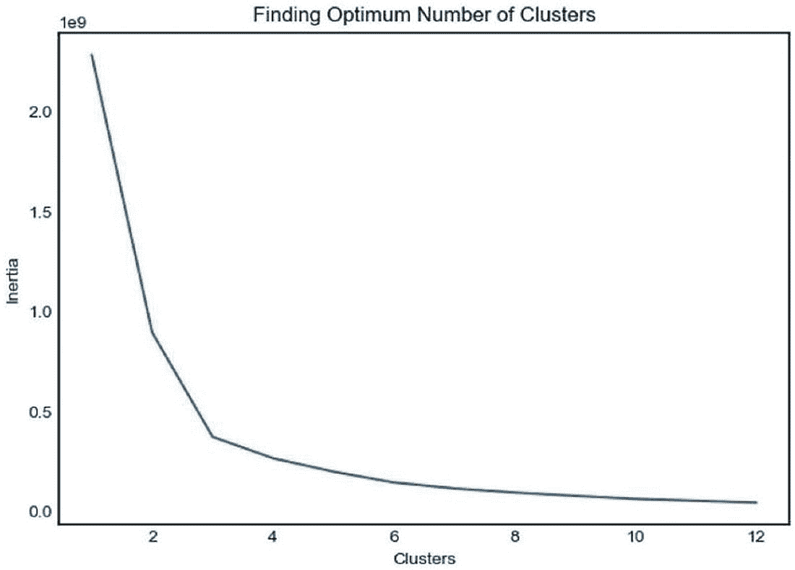

图 3-18

根据惯性值指示最佳聚类数的肘形图

查看肘形图，对于 *k* = 3 个簇，存在明显的纽结或肘形。使用数据集的最佳数量的 *k* = 3 个聚类，在 KLOGH 和 PHIF (V/V)之间生成的散点图显示了三个不同聚类之间的不同边界(见图 [3-19](#Fig19) )。物理上，这些集群可以描述地下岩石的逻辑分组，类似于相或岩石类型。

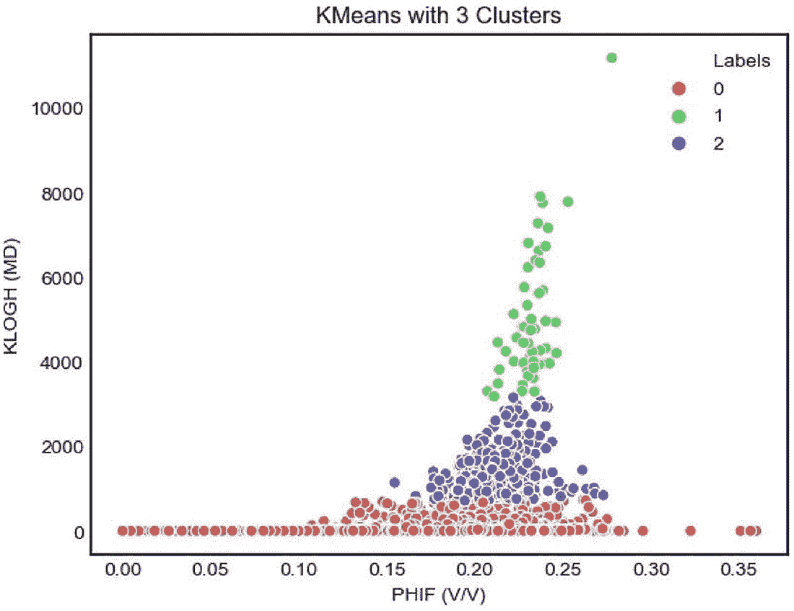

图 3-19

KLOGH 和 PHIF 之间的散点图显示了使用 k-means 聚类算法生成的不同聚类之间的界限

```py
import sklearn.cluster as cluster
import seaborn as sns
km3 = cluster.KMeans(n_clusters=3, init='k-means++', max_iter=300, n_init=10, random_state=42).fit(X)
X['Labels'] = km3.labels_
X['Labels'].value_counts()
sns.scatterplot(X['PHIF (V/V)'], X['KLOGH (MD)'], hue=X['Labels'], palette=sns.color_palette('hls', X['Labels'].nunique()))
plt.title('KMeans with 3 Clusters')

```

### 降维

降维是一个抽象的概念，对于分析具有大量特征的数据集非常有用。通常执行降维来为机器学习算法获得更好的输入特征。它在不牺牲模型预测能力的情况下提高了计算效率。降维还可以消除原始数据中不同要素之间可能存在的共线性。主成分分析就是这一类的算法。

#### 主成分分析

使用特征的正交变换，*主成分分析* (PCA)提供了一种统计方法，通过将多个线性相关特征转换成线性独立变量来减少输入数据的维数。这些线性独立变量称为*主成分*，它们相互正交。

第一个主成分解释了数据集中的最大方差，它随着每个后续成分而进一步减小。这种方法有一个警告，即主要成分往往比原始特征更难解释。请注意，PCA 对缩放非常敏感，因此使用本章前面讨论的方法缩放特征非常重要。

使用我们在本章前面使用的相同数据集，下面的实现表明前四个主成分可以解释大约 86%的样本方差。

```py
from sklearn.decomposition import PCA
pca = PCA()
X_train = pca.fit_transform(X_train)
X_test = pca.transform(X_test)
explained_variance = pca.explained_variance_ratio_
print(explained_variance)

```

**结果**

```py
Explained Variance
[4.32302153e-01 2.49297862e-01 1.06117586e-01 7.90285832e-02
4.83399458e-02 3.41638092e-02 2.32342217e-02 1.67907297e-02
6.98516043e-03 2.81954933e-03 9.13677877e-04 6.64565466e-06
7.64286168e-08]

```

在计算主成分之后，我们使用随机森林分类来理解在 PCA 之后减少输入特征的数量如何影响机器学习模型的准确性。在这里，我们比较了所有 12 个特征的预测准确性，使用前四个主成分生成预测。从以下代码实现结果来看，将输入要素的数量减少到前四个主成分不会显著降低预测精度。

```py
# Random Forest with entire data
classifier = RandomForestClassifier(random_state=42)
classifier.fit(X_train, y_train)
# Predicting the Test set results
y_pred = classifier.predict(X_test)
print(confusion_matrix(y_test, y_pred))
print(accuracy_score(y_test, y_pred))

Accuracy with all features: 0.9377289377289377

# Random Forest with only 4 components
classifier_4comp = RandomForestClassifier(random_state=42)
classifier_4comp.fit(X_train_4comp, y_train)
# Predicting the Test set results
y_pred_4comp= classifier_4comp.predict(X_test_4comp)
print(confusion_matrix(y_test, y_pred_4comp))
print(accuracy_score(y_test, y_pred_4comp))

Accuracy with only first 4 principal components: 0.8974358974358975

```

## 深度学习

我们已经讨论了用于解决与分类、回归、维数减少和聚类相关的问题的监督和非监督机器学习算法。在讨论回归算法时，我们简要地提到了人工神经网络。神经计算是深度学习算法的核心。深度学习算法试图创建深度分层模型，这些模型可以执行复杂的任务，例如从另一个对象中识别一个对象，理解人类语音，或者基于多个输入图像创建新的绘画。

在本节中，我们将讨论以下深度学习算法。

*   多层感知器(MLP)

*   卷积神经网络(CNN)

*   递归神经网络(RNN)

*   长短期记忆(LSTM)

### 多层感知器(MLP)

多层感知器(MLP)是最基本的深度学习算法。神经元是深度神经网络的基本构建模块，包括 MLP。图 [3-20](#Fig20) 显示了神经元的示意图。神经元通过使用与输入相关联的权重来计算输入值的加权和，然后将非线性*激活函数* ( *f* )应用于加权和。由神经元执行的非线性变换为 MLP 和其他深度神经网络提供了对高度非线性过程建模的能力，这种高度非线性过程出现在许多自然事件和工业问题中。神经元也被称为*神经网络节点*。

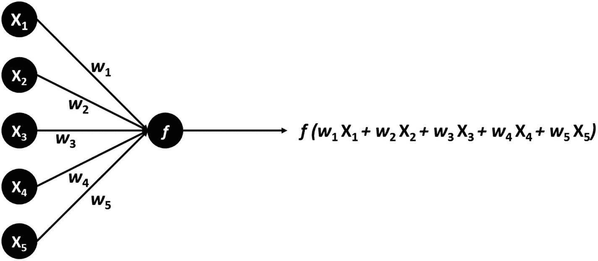

图 3-20

人工神经网络神经元中计算的示意图

神经元可以使用几个激活函数来执行非线性变换。sigmoid 函数和双曲正切函数是经典使用的激活函数。一些更高级的激活功能包括*整流线性单元* (ReLU)、泄漏 ReLU 和指数 LU。这些传统和现代非线性激活函数[ [11](#Par237) 的函数形式和形状的比较如图 [3-21](#Fig21) 所示。这些函数很容易微分(连续且可微)。这种性质使得这些函数在梯度计算期间计算效率高，梯度计算是训练深度神经网络的重要部分。

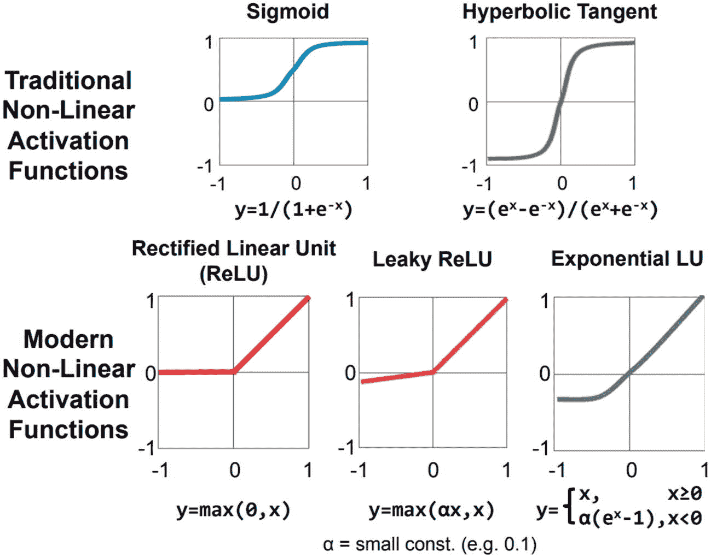

图 3-21

传统和现代激活功能的比较[ [11](#Par237)

图 [3-22](#Fig22) 显示了 MLP 的示意图。以下组件构成了这种深度神经网络。

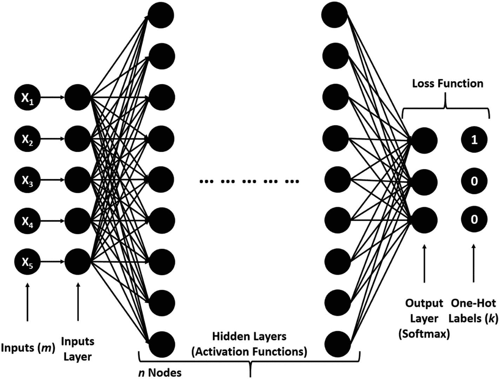

图 3-22

多层感知器的示意图

*   **输入层:**这一层包含节点，便于神经网络输入特征的摄取，应用非线性变换。

*   **隐藏层:**这些层包含具有非线性激活函数的神经元或节点。隐藏层由一个权重矩阵( *W* )和一个偏置向量( *b* )来表示。矩阵 *W* 和向量 *b* 的维数取决于层中节点的数量。例如，与 *m* 输入(特征矩阵 *X* )连接并向第一个隐藏层中的 *n* 个节点广播值的输入层具有维度为 *m* × *n* 的权重矩阵。此外，偏置向量 *b* 具有 *n* 个元素。这一层的输出是*f*(*WX*+*b*)，其中 *f* 是激活函数。

*   **输出层:**输出层连接最后一个隐层，保证神经网络提供与问题公式化一致的输出。例如，如果训练神经网络对具有 *k* 个不同类的数据集进行分类，则输出层计算 *k* 个不同值，然后对这些 *k* 值中的每一个应用 softmax 函数。在所描述的场景中，输出中的每个元素对应于样本属于 *k* 类之一的概率。

*   **优化器:**优化器通过使用误差反向传播来促进神经网络层的权重矩阵 *W* 和偏置向量 *b* 的更新。

优化器使用损失函数来评估预测值的准确性。在回归问题中，这个损失函数可以是 RMSE。然而，在分类问题中，可能需要相对复杂的损失函数。在分类问题中，输出层提供 *k* 概率值( *y* )。如果一个对象只属于一个对象类，这是大多数真实世界分类任务的情况，为了分类器的最佳性能，这些 *k* 值之一应该接近 1。标签是一次性编码的，用于将类别标签转换为概率。例如，在一个有 *k* =3 个类的问题中，类 1、类 2 和类 3 分别表示为 one-hot vector(*p*)[1，0，0]、[0，1，0]和[0，0，1]。诸如分类交叉熵的损失函数使用这些值来提供误差的定量估计，这在迭代更新神经网络模型参数(即，权重和偏差)时是有用的。通过使用输出向量( *y* )和独热编码标签向量( *p* )，可以使用以下等式来计算分类交叉熵。

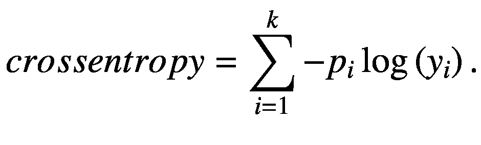

(3.13)

接下来，我们应用这些概念对图 [3-23](#Fig23) 所示的数据集中的图像进行分类。

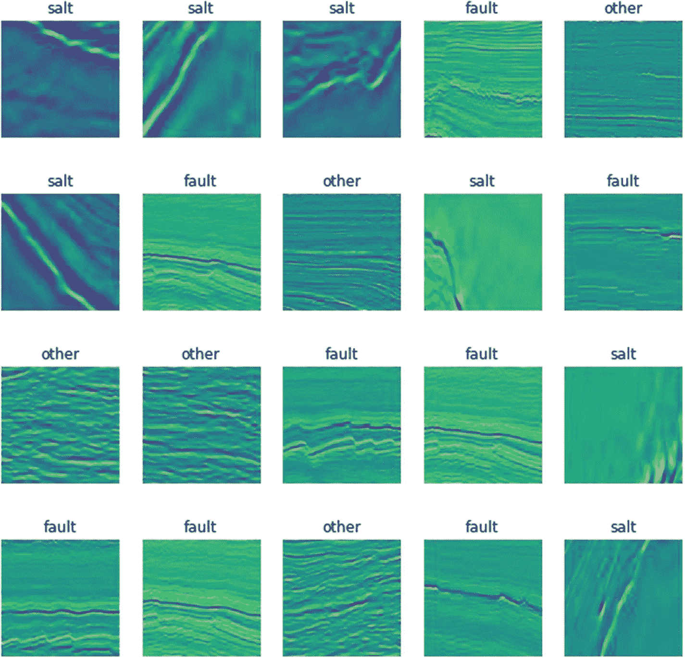

图 3-23

SFO(盐层/断层/其他)数据集中的一些样本图像

在机器学习社区中有一些可用的标准图像数据集，它们通常用于评估分类模型。这些数据集包括手写数字(MNIST)、日常生活中遇到的物体(CIFAR10)等等。在这一章中，我们使用公共领域和 Kaggle 上的地震勘测创建了一个数据集。这个数据集(昵称为 *SFO 数据集*)包含 1500 幅地震图像，属于三个类别:盐层、断层和其他。我们使用 MLP 对数据集中的图像进行分类。以下代码片段显示了使用 TensorFlow 库实现 MLP 模型。

```py
# Define a Deep Neural Network model
reg_param = 0.02 # Regularization parameter for L2 regularization
model = Sequential()
model.add(Dense(1024, activation="relu", kernel_initializer="he_normal", kernel_regularizer=l2(l=reg_param),
                 input_shape=(n_features,)))
model.add(Dense(512, activation="relu", kernel_initializer="he_normal",
                kernel_regularizer=l2(l=reg_param)))
model.add(Dense(256, activation="relu", kernel_initializer="he_normal",
                kernel_regularizer=l2(l=reg_param)))
model.add(Dense(128, activation="relu", kernel_initializer="he_normal",
                kernel_regularizer=l2(l=reg_param)))
model.add(Dense(64, activation="relu", kernel_initializer="he_normal",
                kernel_regularizer=l2(l=reg_param)))
model.add(Dense(32, activation="relu", kernel_initializer="he_normal",
                kernel_regularizer=l2(l=reg_param)))
model.add(Dense(16, activation="relu", kernel_initializer="he_normal",
                kernel_regularizer=l2(l=reg_param)))
model.add(Dense(8, activation="relu", kernel_initializer="he_normal",
                kernel_regularizer=l2(l=reg_param)))
model.add(Dense(3, activation="softmax"))
# compile the model
model.compile(optimizer='Adadelta', loss="sparse_categorical_crossentropy", metrics=['accuracy'])

```

神经网络模型的上述实现具有以下组件。

*   一个具有 1024 个节点的*密集*输入层。七个隐藏层，分别具有 512、256、128、64、32、16 和 8 个节点。这些节点被称为*密集*，因为这些层中的每个节点都连接到上一层和下一层中的每个节点，从而提供密集连接(参见图 [3-22](#Fig22) )。最后，还有一个包含三个节点的输出层。所有节点(除了输出层)都有 ReLU 激活功能。使用`he_normal`初始化器初始化输入层和隐藏层的权重。

*   当在模型训练期间对模型参数(权重和偏差)的大变化施加惩罚时，发生正则化。它提供了防止过度拟合的保护措施。施加的惩罚程度可以使用正则化参数来调整，该正则化参数通常是小数值。在所示的 MLP 模型中，我们使用了正则化参数为 0.02 的 L2 正则化。

*   模型中的输出层使用 softmax 激活函数来输出估计的分类概率。

*   该模型使用`Adadelta`优化器，该优化器使用具有自适应学习速率的随机梯度下降方法。虽然其他一些优化器需要预定义的学习率，但`Adadelta`优化器会自适应地计算学习率。优化器使用`sparse_categorical_crossentropy`作为损失函数，这是前面讨论的场景的分类交叉熵的变体，其中每个对象只能属于一个样本类。

下面的代码片段用于训练前面的 MLP 模型。

```py
# Early-stopping callback using validation
earlystop_callback = EarlyStopping(monitor='val_accuracy',
    min_delta=0.0001, patience=50)
# Save the best model
ckpt_path = './models/dnn.h5'
ckpt_callback = ModelCheckpoint(filepath=ckpt_path, mode="max",
                                monitor='val_accuracy', verbose=1,
                                save_best_only=True)
# Train the model
history = model.fit(X_train, y_train, epochs=500, batch_size=BATCH_SIZE, validation_data=(X_valid, y_valid),
                    callbacks=[earlystop_callback, ckpt_callback],
                    verbose=1)

```

模型训练过程的重要组成部分如下。

*   **历元:**历元对应于算法处理一次训练数据中提供的所有样本所需的训练迭代次数。这里的 MLP 模型预计将训练 500 个纪元。

*   **提前停止:**这个概念使用一个验证数据集来持续监控培训过程。`min_delta`参数定义了最小验证精度改进。如果在由`patience`参数定义的训练时期数内，模型精度没有提高超过`min_delta`，则停止训练。每当先前的最佳验证准确性提高时，该代码实现总是保存模型。在训练结束时提供最佳验证准确性的模型可以在以后用于生成预测。

图 [3-24](#Fig24) 显示了训练和验证数据集的损失函数在训练时期的演变。用该过程训练的 MLP 模型用于在测试数据集上生成预测。该模型生成的盐类、断层类和其他类的预测精度如下。

```py
Test Accuracy: 0.713

```

通过优化超参数可以在一定程度上提高模型精度。

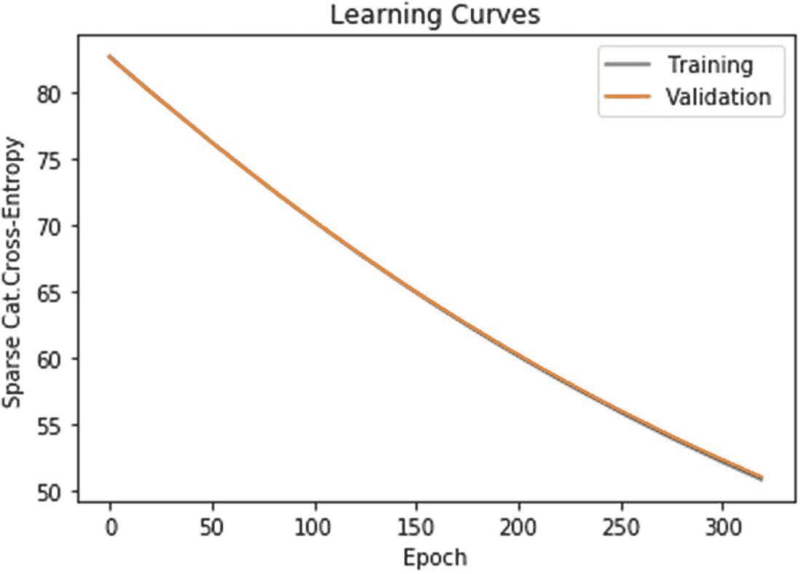

图 3-24

显示多层感知器的训练损失的学习曲线

这个例子告诉我们，MLP 可以生成一个识别图像的模型，这个模型在 70%的情况下是正确的。然而，MLP 不是专门用于图像识别任务的算法。接下来，我们讨论一种深度神经网络架构，它专门用于图像识别和其他通用计算机视觉应用。

### 卷积神经网络(CNN)

只有在 2D 或 3D 环境中同时看到图像像素时，才有可能对物体进行视觉识别。我们使用 MLP 进行图像分类任务。尽管 MLP 的表现比抛硬币要好，但它并没有产生可用于任何现实应用的预测。这种较低的准确性源于 MLP 在没有空间背景的情况下观察图像。

卷积神经网络或 CNN 是一种专门的神经网络，通过执行计算来学习识别对象，这允许在学习过程中包含空间上下文。CNN 是使用卷积层构建的。虽然训练 CNN 的大部分方面仍然类似于 MLP 训练，但是神经网络结构有显著不同。

图 [3-25](#Fig25) 总结了一些与 CNN 架构相关的重要概念。在 CNN 的卷积层中，卷积滤波器遍历图像以提取图像特征，这有助于识别给定图像所属的类别。

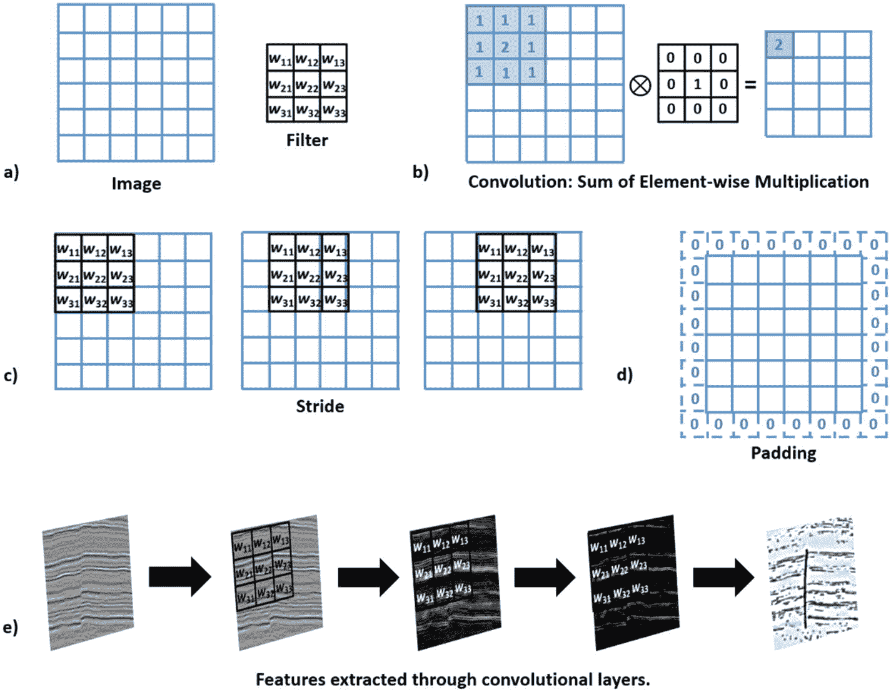

图 3-25

(a)图像和卷积滤波器，(b)卷积运算，(c)跨距，(d)图像周围的零填充，以及(e)在卷积层上发生的特征提取的概念表示

以下是与 CNN 相关的一些重要概念，如图 [3-25](#Fig25) 所示。

*   **滤波器:**一个平方权重矩阵往往代表一个卷积层中的一个滤波器。CNN 训练过程的主要目标之一是学习卷积滤波器的最佳权重。

*   **卷积:**在卷积运算期间，计算图像和滤波器的重叠像素之间的逐元素乘法的和。该值被分配给重叠图像块的中心像素(参见图 [3-25](#Fig25) -b)。

*   **Stride:** 滤镜可以通过一次移动一个像素来遍历图像，也可以跳过中间的几个像素。过滤器遍历图像时一次移动的像素数称为*步幅*(见图 [3-25](#Fig25) -c)。

*   **填充:**当一个滤镜遍历图像时，它会缩小图像的大小，因为边缘没有重叠的单元格。在某些希望保留图像尺寸的情况下，可以在图像边缘填充零(见图 [3-25](#Fig25) -d)。对于大小为 *W* × *W* 的图像，被大小为 *F* × *F* 的滤波器遍历，遍历步长为 *S* ，并且 *P* 个单元格填充图像边缘，输出图像的大小可以通过![$$ \left[\frac{W-K+2P}{S}\right]+1\. $$](img/480430_1_En_3_Chapter_TeX_IEq3.png)计算

当图像通过多个卷积层处理时，过滤器会在图像中显示出明显的特征，从而更容易从样本数据中的其他类中识别出一个类(见图 [3-25](https://doi.org/10.1007/978-1-4842-6094-4_2Fig#25) -e)。以下代码片段显示了用于对 SFO 数据集中的图像进行分类的 CNN 模型。

```py
model = Sequential()
model.add(Conv2D(96, (5, 5), activation="relu",
                 input_shape=(IMG_DIM, IMG_DIM, 1)))
model.add(MaxPooling2D((2, 2)))
model.add(Conv2D(128, (5, 5), activation="relu"))
model.add(MaxPooling2D((2, 2)))
model.add(Conv2D(128, (5, 5), activation="relu"))
model.add(MaxPooling2D((2, 2)))
model.add(Conv2D(64, (5, 5), activation="relu"))
model.add(Flatten())

model.add(Dense(64, activation="relu"))
model.add(Dense(32, activation="relu"))
model.add(Dense(3, activation="softmax"))

```

代码中的 CNN 模型具有交替的 2D 卷积层和最大池层。在最大池操作期间，该算法从一组像素中选择最大值来替换现有的像素值。所提出的 CNN 结构具有 4 个 2D 卷积层，具有 5×5 的滤波器大小和 ReLU 激活函数。卷积层之后是具有 ReLU 激活功能的两个密集层，以及具有采用 softmax 激活的三个节点的输出层。CNN 使用相同的机制被训练，该机制在前面被描述用于训练 MLP。图 [3-26](#Fig26) 显示了损失函数在训练时期的演变。CNN 模型在识别盐、断层和其他类别时显示出高预测准确度。

```py
Test Accuracy: 0.953

```

至此，我们结束了对用于图像分类任务的深度学习算法的概述。接下来，我们讨论时间序列预测的深度学习算法。

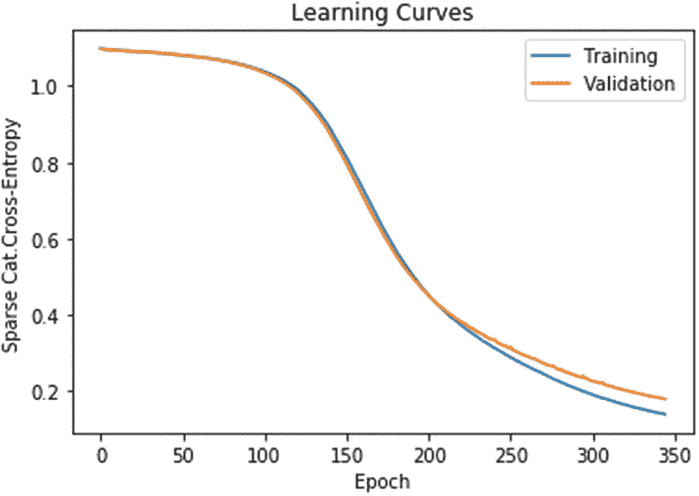

图 3-26

显示卷积神经网络的训练损失的学习曲线

### 递归神经网络(RNN)

递归神经网络(RNNs)提供了专门的架构，可以对序列(包括时序数据)进行建模。图 [3-27](#Fig27) 显示了 RNN 建筑的示意图。

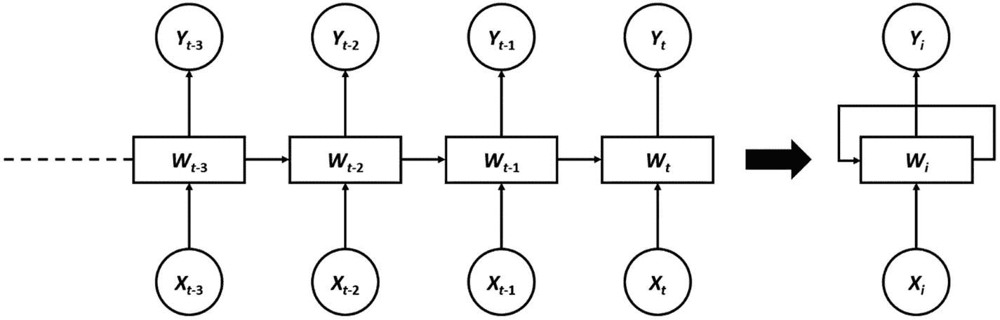

图 3-27

RNN 建筑的示意图

RNN 是基本神经网络模型的序列，其中每个模型从序列中的单个步骤的输入和输出中学习。如果我们将这个序列中的模型合并成一个模型，这个模型将其输出作为输入，并不断更新模型参数，我们得到如图 [3-27](#Fig27) (最右边)所示的 RNN 架构。

然而，这种学习模型参数(权重和偏差)的方法存在稳定性问题。有时，由于大的误差梯度，从序列中的一个步骤到序列中的下一个步骤，模型权重的变化可能太大。序列中多个步骤上的梯度累积可能导致权重的非常大的更新，从而导致超过计算机可以处理的数值限制的值。这被称为*爆炸梯度*问题。

另一方面，如果误差梯度在序列中的多个步骤上太小，累积这些梯度可能导致接近零的值。在这种情况下，模型停止更新权重，并且无法学习。这被称为*消失梯度*问题。

有专门的架构解决爆炸和消失的梯度问题。在讨论这些专门的算法之前，我们先来看一下用于构建时间序列预测模型的时间序列数据。

图 [3-28](#Fig28) 显示了 Equinor ( [`https://data.equinor.com`](https://data.equinor.com) )提供的 Volve 数据集两口井的日产量(左)和累积产量(右)。我们将使用这些数据，通过最近几周的生产数据来生成未来一天的生产估计。

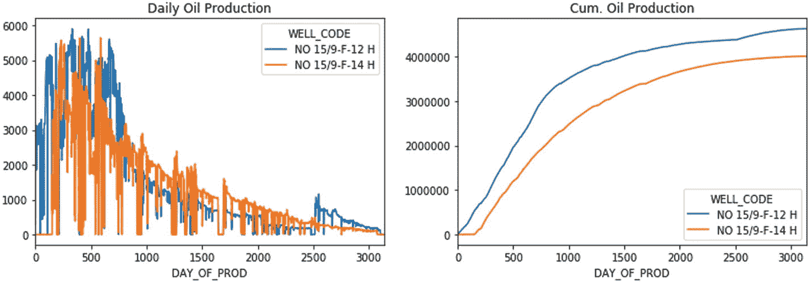

图 3-28

曲线图显示了从 Volve 数据集选择的两口井的日产油量(左)和累积产油量(右)

#### 长短期记忆(LSTM)

我们讨论了在训练 RNN 模型时遇到的爆炸和消失梯度问题。长短期记忆(LSTM)是一种架构，它通过控制信息从序列中的一个步骤到下一个步骤的流动来解决这些问题。LSTM 模型被表示为一个带有信息流调节*门*的单元(见图 [3-29](#Fig29) )。LSTM 模型中的细胞状态变量保留了序列的长期记忆，或被建模的时间序列。这些门包括以下内容。

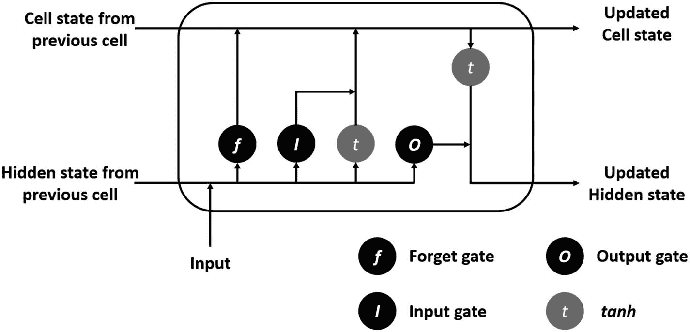

图 3-29

长短期记忆(LSTM)细胞结构示意图

*   **遗忘门:**该门收集基于输入到单元的信息，并从序列中的前一步骤输出(隐藏状态)。然后，使用 sigmoid 函数，它确定应该丢弃的信息量。sigmoid 函数提供 0 到 1 之间的值，1 表示保留所有信息，0 表示丢弃所有信息。

*   **输入门:**该门也使用对单元格的输入，以及上一步的输出。输入门使用 sigmoid 函数来学习更新单元状态时应该保留的信息量。相同的输入通过 *tanh* 激活。输入门提供 0 和 1 之间的值，而 *tanh* 提供–1 和 1 之间的值。这两者的组合用于更新单元状态。

*   **输出门:**输出门使用与前两个门类似的输入。使用 sigmoid 函数，它学习计算模型输出所需的信息量。应用于单元状态(序列的长期记忆)的 *tanh* 激活和从输出门接收的值的组合提供单元输出。

以下代码片段显示了使用 TensorFlow 实现 LSTM 架构的示例。过去 14 天的累积产量数据用于预测第二天的累积产量。该实施方案包含两个堆叠的 LSTM 图层、一个密集图层和一个具有单个结点(一个输出变量)的输出图层。我们使用`Adadelta`优化器并最小化均方差(MSE)指标来训练 LSTM 模型。该实现还使用了使用验证数据的提前停止(此处未显示)。

```py
model = Sequential()
model.add(LSTM(NUM_HIDDEN, activation="relu", return_sequences=True, input_shape=(LOOKBACK, 1)))
model.add(LSTM(NUM_HIDDEN, activation="relu", return_sequences=False))

model.add(Dense(NUM_HIDDEN))
model.add(Dense(1))
model.compile(optimizer='Adadelta', loss="mse")

```

图 [3-30](#Fig30) (左图)显示了观测测试数据的归一化累积产量，以及 LSTM 模型预测的累积产量。图 [3-30](#Fig30) (右图)显示了试验数据的观测值和 LSTM 预测值的交会图。结果表明，在油井生产初期出现一些不匹配后，LSTM 模型具有良好的预测能力。一个工业相关的实现输出几天的产品——我们鼓励您使用提供的代码来实现。

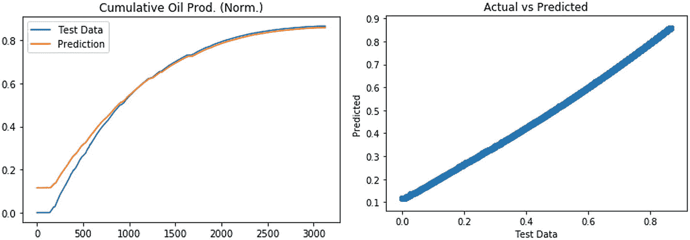

图 3-30

累积产油量的测试数据和相应的 LSTM 模型预测图(左)，以及测试数据的观测累积产油量和 LSTM 预测累积产油量的交会图(右)

## 超参数优化

我们提到过超参数优化有助于提高模型精度。在本节中，我们将演示优化过程的一个简单代码示例。但是，在进入实现细节之前，让我们学习超参数的定义。

### 什么是超参数？

超参数是在机器学习算法训练过程中用来学习最佳模型参数的变量。换句话说，超参数是帮助学习最佳模型参数的参数。超参数的一些例子如下。

*   神经网络的层数

*   神经网络层中的节点数

*   神经网络节点的激活函数类型

*   模型训练的迭代次数或时期数

*   基于核的方法中“核”类型的选择

*   正则化参数

*   神经网络权重初始化的类型

*   提前停止的容差(`min_delta`)

*   提前停止前等待的时期数(`patience`)

虽然这种方法的名称表明它只适用于优化超参数，但在某些情况下，它也可以调整模型参数。我们使用一个代码示例来演示这一点。

#### 使用 Hyperopt 进行超参数优化

我们使用 Python 库 Hyperopt 来演示超参数优化过程。我们使用支持向量分类器算法来演示这个过程。我们使用岩石类型分类数据，并建立了一个香草分类器。这种普通分类器的准确性作为基线，用于评估超参数优化过程对模型性能的改善。下面的代码片段显示了普通分类器的实现和相应的分类精度。

```py
svc = SVC()
svc.fit(X_train, y_train)
# Prediction on test data
y_pred = svc.predict(X_test)
# Accuracy Metrics
clf_metrics(y_test, y_pred)

Classification Accuracy Score: 0.8621700879765396

```

超点使用目标函数，该目标函数被最小化以计算模型参数和超参数的最优值。在以下示例中，k 倍交叉验证的准确度分数乘以–1，用作目标函数。通过在 50 次迭代中反复调整超参数和模型参数来最小化目标函数。实现的一些重要方面包括。

*   **K-fold 交叉验证:**在这种方法中，训练数据被分割成 *k* 个子集或折叠。通过使用这些 k 倍， *k* 个单独的模型被训练。通过一次保持 k 个折叠中的一个用于验证(验证折叠),并使用剩余的 k-1 个折叠来训练模型，来训练每个模型。k 倍交叉验证的准确度分数是通过对各个验证倍中数据的单个模型的准确度分数进行平均来计算的。

*   **参数空间:**定义模型参数和与模型相关的超参数可以采用的值的范围。

*   **超参数:**在这个例子中，核的类型是超参数。常数 *C* 、多项式的次数和伽马是模型参数。这是一个超参数和模型参数同时被优化的例子。

下面的代码片段显示了寻找最优核的方法，以及支持向量分类器模型的相应参数。

```py
def objective(params):
    svc = SVC(**params)
    return -1\. * cross_val_score(svc, X_train, y_train).mean()

kernels = ['rbf','poly','rbf','sigmoid']
space = {'C':hp.lognormal('C', 0, 1),
         'kernel':hp.choice('kernel', kernels),
         'degree':hp.choice('degree', range(1, 15)),
         'gamma':hp.uniform('gamma', 1e-2, 1e2)
        }

trials = Trials()
best_svc = fmin(objective, space, algo=tpe.suggest, max_evals=50, trials=trials)
print(best_svc)

{'C': 1751.5444736790396, 'degree': 11, 'gamma': 5.899864955354083, 'kernel': 0}

```

在确定了最佳核类型和模型参数之后，最佳模型用于生成对测试数据的预测。

```py
svc = SVC(C=best_svc['C'],
         kernel=kernels[best_svc['kernel']],
         degree=best_svc['degree'],
         gamma=best_svc['gamma'])
svc.fit(X_train, y_train)
# Prediction on test data
y_pred = svc.predict(X_test)
# Accuracy Metrics
clf_metrics(y_test, y_pred)

Classification Accuracy Score: 0.9618768328445748

```

该示例表明，使用 Hyperopt 库的超参数优化将模型分类精度从 0.86 提高到 0.96。通过实现适当的目标函数，可以应用类似的过程来提高任何其他机器学习或深度学习算法的准确性。

## 摘要

> *我不是来告诉你这将如何结束的。我是来告诉你这将如何开始的。*
> 
> —*中的 Neo*[12](#Par238)

机器学习和深度学习是巨大的话题。在本章中，我们试图提供与机器学习和深度学习算法相关的几个概念的概述。我们的重点是使用开源数据集提供每个算法的简单代码实现。然而，我们承认，掌握这些概念需要进一步的学习和不断的实践。请参考“进一步阅读”部分推荐的后续步骤。在接下来的章节中，我们将通过应用本章中讨论的概念，为石油和天然气行业相关问题构建一些有趣的机器学习应用程序。

## 承认

我们感谢 Equinor AS、前 Volve 许可合作伙伴 Exxon Mobil Exploration and Production Norway AS 和 Bayerngas(现为 Spirit Energy)允许我们使用 Volve 数据集，并感谢许多为这项工作做出贡献的人。请访问 data.equinor.com 了解更多关于 Volve 数据集和许可使用条款的信息。

我们也感谢 TGS 允许我们在 Kaggle ( [`www.kaggle.com/c/tgs-salt-identification-challenge/`](http://www.kaggle.com/c/tgs-salt-identification-challenge/) )上使用 TGS 盐鉴定挑战赛的数据集。此外，我们感谢新西兰石油和矿产公司( [`www.nzpam.govt.nz/cms`](http://www.nzpam.govt.nz/cms) )提供数据。

最后，我们要感谢 Bhaskar Mandapaka 的一些非常有趣和有见地的讨论，这有助于塑造这一章。

Further Reading

现在我们已经完成了机器学习和深度学习的概述，我们建议进一步阅读。

*   *深度学习* ( [`www.deeplearningbook.org`](http://www.deeplearningbook.org) ) [ [13](#Par239) ]是一本免费的在线书籍，提供了对机器学习和深度学习算法的理论和数学基础的深入讨论。

*   请通读本章使用的机器学习库的在线文档。它将帮助您更好地掌握相应库中与每个算法相关的不同参数。

## 参考

[1] T .米切尔，*机器学习*，麦格劳·希尔，1997 年。

[2] P. Domingos，“关于机器学习需要知道的一些有用的事情”，*《美国计算机学会通讯》，*第 55 卷，第 10 期，第 78–87 页，2012 年 10 月。

[3] R. Mooney，“机器学习导论”，德克萨斯大学奥斯汀分校，[在线]。可用: [`https://www.cs.utexas.edu/~mooney/cs391L/slides/intro.pdf`](https://www.cs.utexas.edu/%257Emooney/cs391L/slides/intro.pdf) 。

[4] J. Brownlee，“如何用 Keras 中的活动正则化减少泛化错误”，2018 年 11 月。【在线】。可用: [`https://machinelearningmastery.com/how-to-reduce-generalization-error-in-deep-neural-networks-with-activity-regularization-in-keras/`](https://machinelearningmastery.com/how-to-reduce-generalization-error-in-deep-neural-networks-with-activity-regularization-in-keras/) 。

[5] S. Raschka，“关于特征缩放和标准化以及标准化对机器学习算法的影响”，*《极地政治法律人类学评论》，*第 30 卷第 1 期，第 67–89 页，2014 年。

[6] J. Brownlee，“测试和验证数据集之间的区别是什么？，“2017 年 7 月。【在线】。可用: [`https://machinelearningmastery.com/difference-test-validation-datasets/`](https://machinelearningmastery.com/difference-test-validation-datasets/) 。

[7] G. James，D. Witten，T. Hastie 和 R. Tibshirani，*统计学习及其应用介绍，R* ，Springer，2013 年。

[8] H. J .塞尔特曼，“实验设计与分析”，[在线]。可用: [`http://www.stat.cmu.edu/~hseltman/309/Book/Book.pdf`](http://www.stat.cmu.edu/%257Ehseltman/309/Book/Book.pdf) 。

[9] A .安德拉德，“探索性数据分析”，[在线]。可用: [`https://datascienceguide.github.io/exploratory-data-analysis`](https://datascienceguide.github.io/exploratory-data-analysis) 。

[10] T. Hastie，R. Tibshirani 和 J. Friedman，*统计学习的要素*，纽约:Springer，2001 年。

[11] V. Sze，Y. H. Chen，T. J. Yang，J. Emer，“深度神经网络的有效处理:一个教程和调查”，*IEEE 学报，*2017 年第 105 卷第 12 期。

[12] *《黑客帝国》，* 1999。

[13] I. Goodfellow，Y. Bengio，a .库维尔，*深度学习*，麻省理工出版社，2016。