# 4.地球物理学和地震数据处理

在前面的章节中，我们了解了 Python 编程，学习了机器学习和深度学习的概念，并使用 Python 实现了其中的一些概念。本章的重点是概述机器学习在地球物理学领域的应用。勘探工作流程的主要目标是使用地震数据处理来构建地球模型，以估计储层特性。这是一个成熟的、经过充分研究的问题，在地震成像和储层性质估计科学的背后有几十年的学术和工业研究。

勘探地球物理学中的机器学习有着悠久的历史，几乎与过去几十年中机器学习的兴衰相吻合。勘探地球物理工作流程中的应用非常多。详细解释它们超出了本章的范围。本章的方法是提供地震成像过程的概述，并详细讨论盐层解释的挑战性问题。本章最后将简要总结其他几个问题，并指出勘探和解释工作流程中的相关文献。

## 地震反射实验

地震波在地球内部的反射和折射最早是在地震仪上观察到的，地震仪记录了地震产生的地震波。地震反射实验的一般原理是将波发送到地下并用几千个传感器记录它们。图 [4-1](#Fig1) 显示了用于在海洋环境中获取反射数据的实验示意图。爆炸能量源用于发射从地下反差反射的波。这些来自关键层的反射被传感器记录下来。如漫画所示，拖缆拖着几千个传感器。

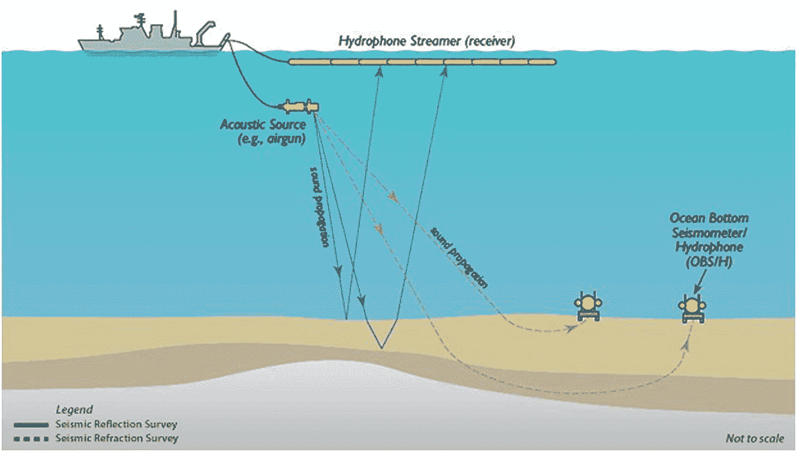

图 4-1

海洋地震反射实验示意图(美国国家科学基金会提供)

图 [4-2](#Fig2) 显示了一个地震实验记录的样本记录的例子。这种类型的数据记录被称为“炮记录”，因为它对应于记录反射波的单次爆炸。对于一个典型的海洋实验来说，在一个区域内有几千次这样的拍摄。

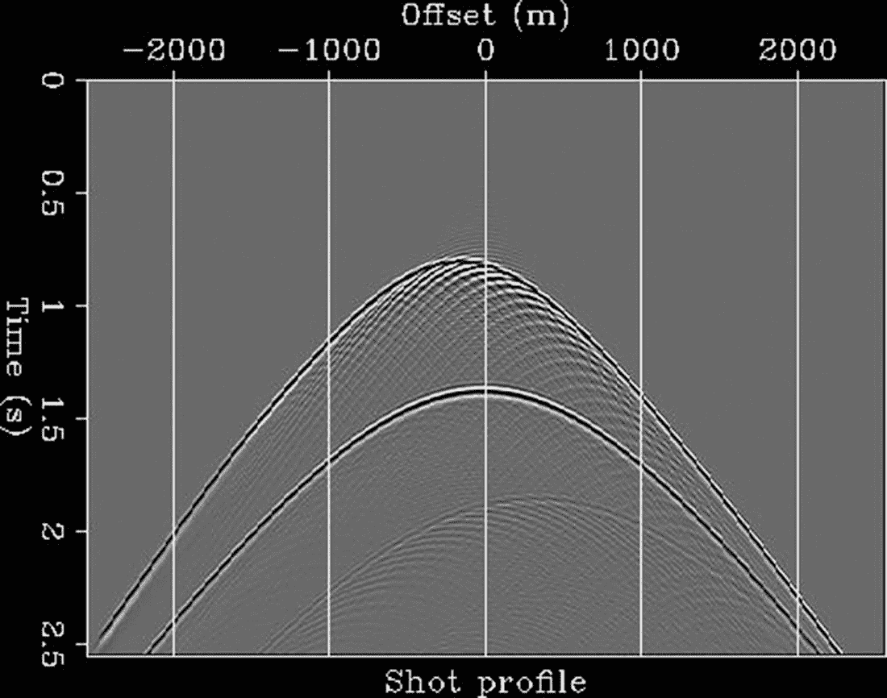

图 4-2

炮集:由单次地震实验获得的数据(承蒙:地震成像介绍)

地震处理的目的是使用传感器数据，如图 [4-2](#Fig2) 所示，生成地下图像，并估计地球的属性。典型地，目标是估计穿过地球的压缩波的速度，因为这些是波长尺度的储层特性的代表。转换这些拍摄记录以生成地球图像的过程称为成像。在生成地下图像的过程中，通过称为地球模型构建的过程来估计地下的属性也是必不可少的。参考文献 [1](#Par45) 对地震采集问题及其各种挑战进行了概述。

## 逆问题:成像和速度模型建立

记录数十亿字节地震数据的目的是获得地球表面下的图像，以及估计表面下的物理特性。声波方程给出了模拟地下波传播的最小模型。存在更复杂的模型来精确模拟波的传播。这种模型超出了本章介绍的范围。在参考文献[ [2](#Par46) ]中可以找到对基于波动方程的成像以及与之相关的逆问题的极好的数学概述。

声波方程的模型可以由图 [4-3](#Fig3) 所示的偏微分方程组来定义。

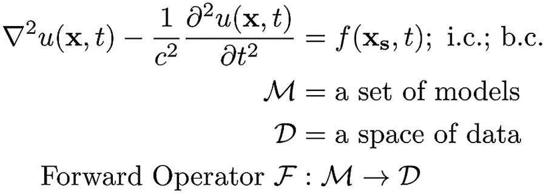

图 4-3

声波方程

在上述方程组中， *u* (x， *t* )是水听器记录的压力场， *c* (x)是地下声波(压缩波)的波速， *f* (x <sub>s</sub> ， *t* )是上一节描述的实验的源特征。该系统用一组适当的初始条件和边界条件来求解。

在数学和地球物理文献中，这个线性系统被称为正问题，因为它给出了用于模拟波场的物理系统的定义，给出了地球表面下的波速的定义。这是一个经过深入研究和明确定义的问题，背后有几个世纪的学术史。建议有兴趣的读者查阅参考文献[ [3](#Par47) ]，以及其中的参考文献。

然而，地震成像的目的是解决由上述系统定义的问题的逆问题。目标是找到一个解释已记录数据的模型(图 [4-4](#Fig4) )。与线性问题的正问题不同，反问题是一个很难解决的强非线性问题。此外，逆问题的解不是唯一的。非唯一性意味着几个模型可以合理地解释已记录的数据。

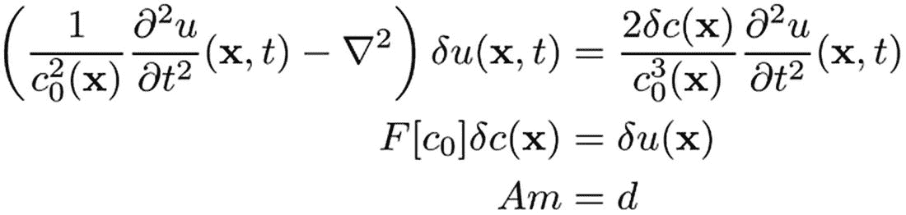

图 4-4

反问题

图 [4-5](#Fig5) 显示了构成地震成像学科的两大类问题的对比。成像的问题是反射体的精确定位，而反演的问题是估计解释地下记录的数据的地下模型(速度和各向异性)。

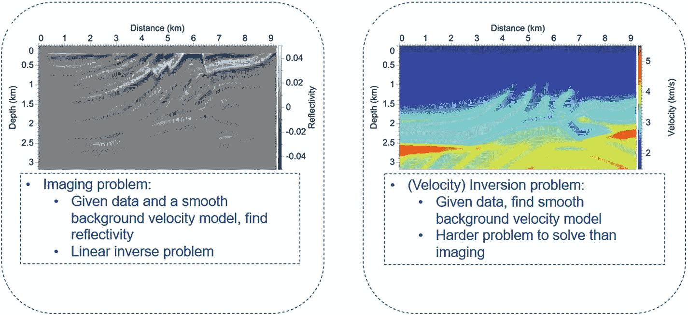

图 4-5

成像和反演

### 沉积岩的物理性质

在沉积岩中，压缩速度变化很大，并且在所有尺度上都观察到不均匀性。图 [4-6](#Fig6) 显示了美国陆上一口井的速度剖面。速度的变化可以在不同的尺度上观察到，从几个数量级变化，从几微米到几毫米到几千米。


图 4-6

岩石性质的多尺度异质性(数据提供:TGS)

为了研究图 [4-4](#Fig4) 所示方程组中定义的非线性逆问题，使用了一种扰动方法来研究地下引起的散射。玻恩近似是一种最初在量子力学中使用的技术，用于研究扩展体的散射。当散射体的尺寸与波长相比很小时，它被证明是准确的。有兴趣的读者可以参考参考[ [2](#Par46) ]。

速度模型可以根据尺度进行分离。包含速度长尺度分量的平滑宏模型。通常，这是平滑背景的形式。散射体在平滑背景上以振荡扰动的形式表示，平滑背景代表速度的高频分量。这种地下模型仅模拟单次散射。换句话说，这些模拟了一次反射波。对玻恩近似的仔细处理超出了地震成像的介绍性讨论的范围。有兴趣的读者可参考参考文献[ [2](#Par46) ]。

### 成像和反演

本节的目的是深入了解速度估计的过程，并对地下散射体进行成像。给定地下记录的数据和平滑的背景速度模型，成像的目标是找到地下的反射率。这是一个线性逆问题，有几种方法可以对地下的散射体进行成像。

为了准确识别地下的反射体，有一个准确的速度模型也是必不可少的。给定表面上记录的数据，速度反演的目标是找到解释表面上记录的数据的平滑背景速度模型。这是一个比成像困难得多的问题，并且是强非线性的。在实践中，估计反射体和更新速度模型的过程是在迭代循环中解决的，直到满足某些标准。

用于在地下定位反射体的线性反演问题在实践中是近似的。数学细节超出了成像介绍材料的范围。计算近似逆，这个过程称为偏移。目前使用的偏移算法有几种，包括克希霍夫偏移、逆时偏移、波动方程偏移等。目标是向后传播接收器波场和向前传播源波场，并且图像是各种时间滞后值下的波场的互相关。得到的零滞后值就是图像(图 [4-7](#Fig7) )。

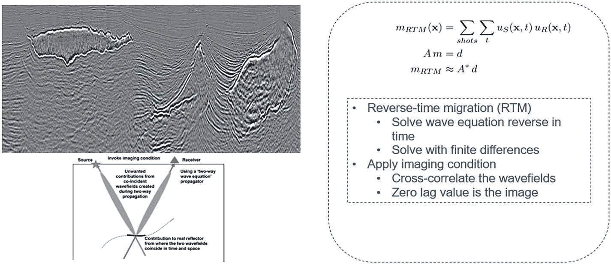

图 4-7

迁移概述

估计地下速度特性的常用技术是使用一种称为全波形反演的方法。在一定频率范围内匹配地表记录的数据是一种迭代的方法。该技术计算速度模型的平滑部分，并且像大多数强非线性优化问题一样，对初始模型的选择非常敏感。由于数据的带宽有限性，这种方法只能得到平滑的解决方案，但无法解析所有尺度的结构。参考文献[4](#Par48)描述了在墨西哥湾建立速度模型的挑战。参考文献 [4](#Par48) 在墨西哥湾 Atlantis 油田全波形反演得到的速度模型如图 [4-8](#Fig8) 所示。

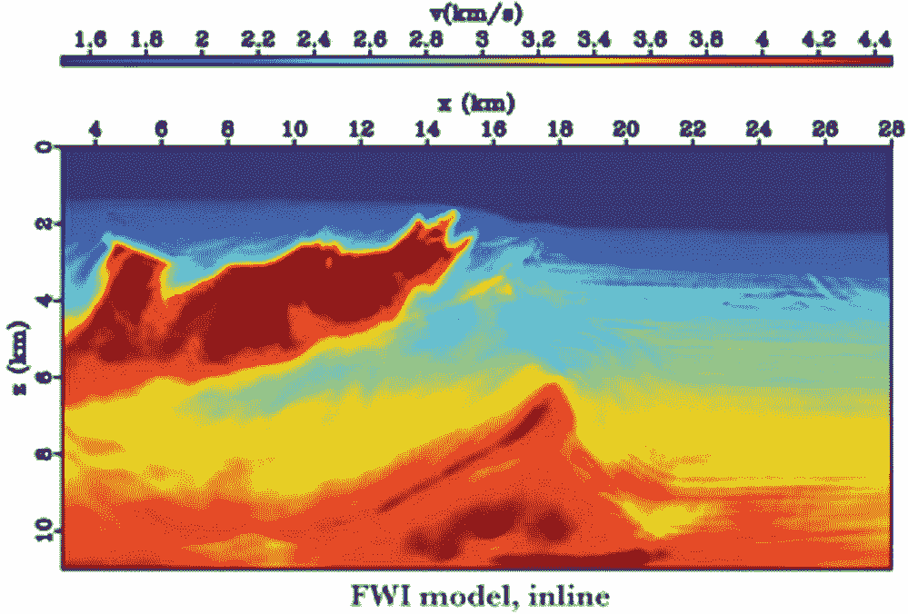

图 4-8

全波形反演得到的速度模型[4]

由于数据的带宽有限性质，精确的起始模型对于解决该优化问题以避免陷入局部最小值是重要的。优化问题是在假设观察到的和预测到的波形在最低频率下在半个波长内的情况下公式化的。然而，地震数据中低频信息的缺乏导致周跳，这导致问题停留在局部最小值而不是达到全局最小值。这个问题在盆地中更难解决，例如墨西哥湾，由于存在复杂的盐层结构，使得优化问题很难解决(图 [4-9](#Fig9) )。

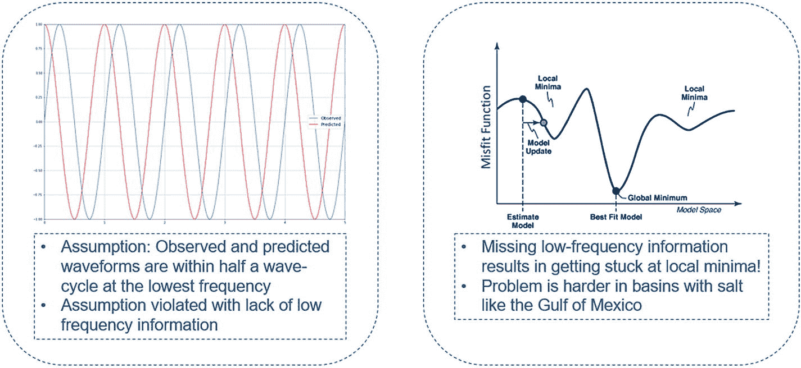

图 4-9

缺乏低频的挑战

### 克服低频挑战

在过去的几年里，地震采集技术有了快速的技术发展。在过去的二十年中，覆盖范围和方位角(角度)有了显著的改进，近方位角采集、宽方位角采集、全方位角采集是过去二十年中操作创新的一些例子。此外，在过去几年中，已经进行了几次尝试来拓宽采集的频率范围。低频数据至关重要，因为它有助于避免优化问题陷入局部最小值。因此，在过去的几年中，已经进行了几次尝试来获取低频数据。但是，采集技术极其昂贵，而且要在足够大的规模上实施可能是一个挑战。然而，在低频数据不可用的情况下，从更好的初始速度开始并具有速度模型的先验结构有助于加速收敛。

盐层解释是一项具有挑战性的任务，需要建立速度模型来构建构造。盐层解释的最新方法包括由训练有素的地质学家和领域专家团队使用人工解释，他们将自己的地质先验知识应用于逆问题。然而，考虑到逆问题的迭代性质，需要解释人员在每次应用成像后挑选盐的结构。采集盐层结构的过程是一个时间密集型问题，对于建立精确的地震速度模型至关重要。

## 基于机器学习的盐解释

在本节中，重点将是给出地震成像中监督学习问题的概述。作为一个例子，我们将详细关注在前面章节中描述的速度模型建立的情况下的二进制分割问题。

语义分割的问题在计算机视觉领域得到了很好的研究。目标是给图像的每个像素分配一个对象类。图 [4-10](#Fig10) 显示了来自计算机视觉数据集和地震图像屏蔽对的示例，以得出问题之间的相似性。左窗格显示了来自语义分割数据集的两个样本。右窗格显示地震图像和通过对给定输入图像的语义分割过程获得的掩模。除了识别图像中的各种对象之外，任务还包括描绘对象的边界。

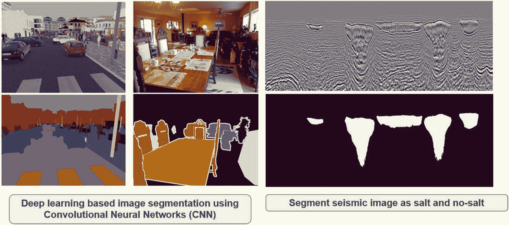

图 4-10

语义分割:计算机视觉 v/s 地震成像

从概念上讲，这类似于速度模型构建工作流中使用的解释过程。给定地震图像，目标是将地震图像中的每个像素分类为盐或沉积物。这可以归结为一个监督学习问题，类似于计算机视觉的语义分割问题，其中图像是迁移算法的输出，标签是二进制掩码。

图 [4-10](#Fig10) 举例说明地震成像语义分割问题的相似性。这是代表偏移后振幅的较大三维数据立方体的切片。标签是从同一区域的速度模型中提取的。需要注意的一点是，这些振幅是连续的，不像计算机视觉数据集中的图像是经过量化的。此外，从不同偏移体采样的图像具有不同的振幅分布。因此，在对这些图像应用深度学习算法之前，通常先应用某种形式的归一化。

将深度学习算法应用于地震图像有一些重要的方面。请注意，这些是专门针对从地震图像解释盐的问题。

1.  **图像尺寸的选择:**合适的窗口提取算法可用于使用小块进行训练或推断。

2.  **图像预处理** **:** 为了将连续振幅转换成量化水平，我们应用归一化。大多数规范化方法原则上都有效。然而，基于平均值和标准偏差的缩放已经证明是可行的。

### 数据集描述

我们使用了由 TGS 和卡格尔主持的 TGS·卡格尔盐解释挑战赛的数据集。该数据是在地下随机选择的不同位置选择的一组图像。图像为 101 × 101 像素，每个像素被分类为盐或沉积物。图 [4-11](#Fig11) 显示了所选数据集中的一些图像样本。

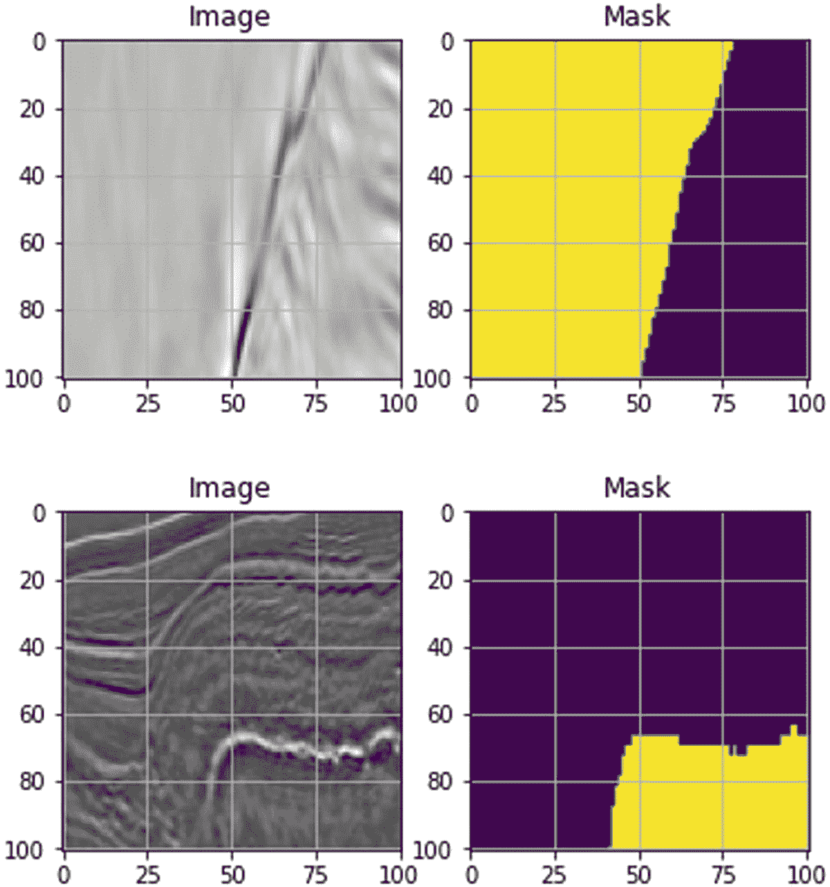

图 4-11

来自 Kaggle 数据集的一些样本图像(左)和相应的标签(右)

### 用于语义分割的 U-Net

为了训练深度学习模型来执行语义分割，在过去几年中已经发布了几种架构。一些用于语义分割的架构已经建立了最先进的分割记录[ [6](#Par50) ]。虽然我们将列出详细解释模型的出版物，但在本章中，我们将把 U-Net 作为一个典型的例子[ [7](#Par51) ]来关注。

如图 [4-12](#Fig12) 所示，U-Net 由一条收缩路径(如左图所示)和一条扩张路径(如右图所示)组成。收缩路径遵循卷积神经网络的架构。重复应用两个 3 × 3 卷积，每个卷积后接一个整流线性单元(ReLU)，以及一个步长为 2 的最大池操作，用于下采样。在每个下采样步骤中，特征通道都加倍。扩展路径中的每一步都包括特征图的上采样，随后是 2 × 2 卷积(“上卷积”)。这个上采样步骤将特征通道的数量减半，将它与来自收缩路径的相应裁剪特征图连接，两个 3 × 3 卷积，每个卷积后跟一个 ReLU。由于每次卷积都会丢失边界像素，因此裁剪是必要的。在最后一层，使用 1 × 1 卷积将每个 64 分量特征向量映射到所需的类别数。网络总共有 14 个卷积层。

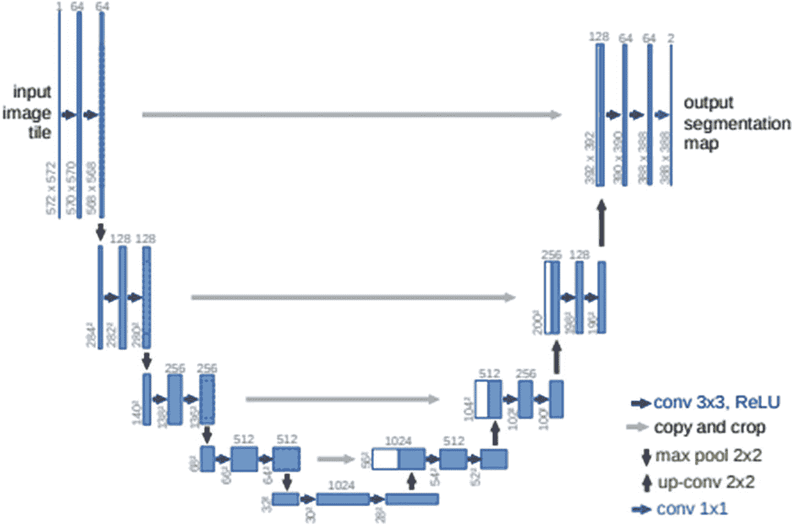

图 4-12

U-Net 架构(参考[ [7](#Par51) ])

### U-Net 的损失函数

并集交集(IOU)的目标函数通常用于评估语义分割问题的准确性(图 [4-13](#Fig13) )。在计算机视觉领域已经提出了几个其他的目标函数。我们要注意的是，虽然 IOU 是评估分段网络的常用度量，但 Jupyter 笔记本中共享的示例使用二进制交叉熵作为损失函数，原因很简单，它更容易理解，并且在大多数深度学习库中普遍可用。

为了应用该度量，针对分子计算预测对象和预期对象的交集，针对分母计算预测对象和预期对象的并集。商是衡量准确性的度量标准。可以看出，如果模型准确地预测了对象的形状，并集上的交集将是 1。

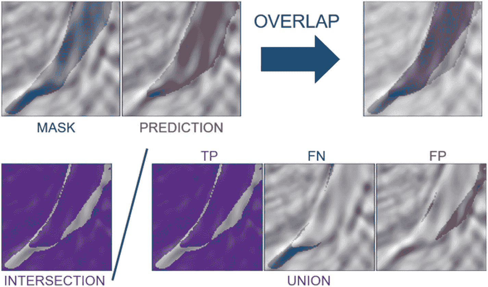

图 4-13

并集上交集的目标函数

### U-Net 实施

这里显示了一个代表 U-Net 模型的代码片段。它由收缩路径和扩展路径组成，类似于图 [4-12](#Fig12) 所示的架构。U-Net 背后的主要思想是补充收缩层，其中通过汇集发生的收缩被上采样或转置卷积层取代。这是在下列代码中列出的模型体系结构中定义的:

```py
def UNet(input_image, n_filters=16, dropout=0.5, batchnorm=True):
    # Encoder
    c1 = conv2d_block(input_image, n_filters=n_filters*1, kernel_size=3, batchnorm=batchnorm)
    p1 = MaxPooling2D((2, 2)) (c1)
    p1 = Dropout(dropout*0.5)(p1)

    c2 = conv2d_block(p1, n_filters=n_filters*2, kernel_size=3, batchnorm=batchnorm)
    p2 = MaxPooling2D((2, 2)) (c2)
    p2 = Dropout(dropout)(p2)

    c3 = conv2d_block(p2, n_filters=n_filters*4, kernel_size=3, batchnorm=batchnorm)
    p3 = MaxPooling2D((2, 2)) (c3)
    p3 = Dropout(dropout)(p3)

    c4 = conv2d_block(p3, n_filters=n_filters*8, kernel_size=3, batchnorm=batchnorm)
    p4 = MaxPooling2D(pool_size=(2, 2)) (c4)
    p4 = Dropout(dropout)(p4)

    c5 = conv2d_block(p4, n_filters=n_filters*16, kernel_size=3, batchnorm=batchnorm)

    # Decoder

    u6 = Conv2DTranspose(n_filters*8, (3, 3), strides=(2, 2), padding="same") (c5)
    u6 = concatenate([u6, c4])
    u6 = Dropout(dropout)(u6)
    c6 = conv2d_block(u6, n_filters=n_filters*8, kernel_size=3, batchnorm=batchnorm)

    u7 = Conv2DTranspose(n_filters*4, (3, 3), strides=(2, 2), padding="same") (c6)
    u7 = concatenate([u7, c3])
    u7 = Dropout(dropout)(u7)
    c7 = conv2d_block(u7, n_filters=n_filters*4, kernel_size=3, batchnorm=batchnorm)

    u8 = Conv2DTranspose(n_filters*2, (3, 3), strides=(2, 2), padding="same") (c7)
    u8 = concatenate([u8, c2])
    u8 = Dropout(dropout)(u8)
    c8 = conv2d_block(u8, n_filters=n_filters*2, kernel_size=3, batchnorm=batchnorm)

    u9 = Conv2DTranspose(n_filters*1, (3, 3), strides=(2, 2), padding="same") (c8)
    u9 = concatenate([u9, c1], axis=3)
    u9 = Dropout(dropout)(u9)
    c9 = conv2d_block(u9, n_filters=n_filters*1, kernel_size=3, batchnorm=batchnorm)

    outputs = Conv2D(1, (1, 1), activation="sigmoid") (c9)
    model = Model(inputs=[input_img], outputs=[outputs])
    return model

model.compile(optimizer=Adam(), loss="binary_crossentropy", metrics=["accuracy"])

callbacks = [
    EarlyStopping(patience=10, verbose=1),
    ModelCheckpoint('./model/model-tgs-salt.h5', verbose=1, save_best_only=True, save_weights_only=True)
]

results = model.fit(X_train, y_train, batch_size=16, epochs=25, callbacks=callbacks, validation_data=(X_valid, y_valid))

```

本章附带的 Jupyter 笔记本提供了使用 Kaggle 的数据集训练简单 U-Net 模型的分步代码。

### 解释结果

我们以对结果的简短讨论来结束这个实际例子。使用 Adam optimizer 在具有 4，000 个图像补片的数据集上训练该网络，其中 10%作为验证数据集。该模型在提前停止的情况下被训练 25 个时期，并且最好的模型被保存用于为验证数据集生成预测。图 [4-14](#Fig14) 显示了为验证集中的样本生成的预测的一些可视化结果。从两个示例样本中的概率可以看出，该模型已经学会预测盐和沉积物之间的边界。这些概率可以被阈值化以获得对给定图像块的预测。

需要注意的一点是，神经网络模型已经在面片上进行了训练。但是，这种经过训练的模型通常应用于迁移的映像。如前一节所述，迁移的映像是三维卷。为了获得盐掩模，逐块进行推断，并且通过确保以适当的方式划分权重来对概率求和。这可以通过简单的移动窗口算法来实现，该算法单独地推断一行中的每个面片。图 [4-15](#Fig15) 显示了应用这种工作流程后得到的盐掩模。

出于地震解释目的的深度神经网络的一般化是一个挑战。对这些挑战的讨论超出了本章介绍的范围。

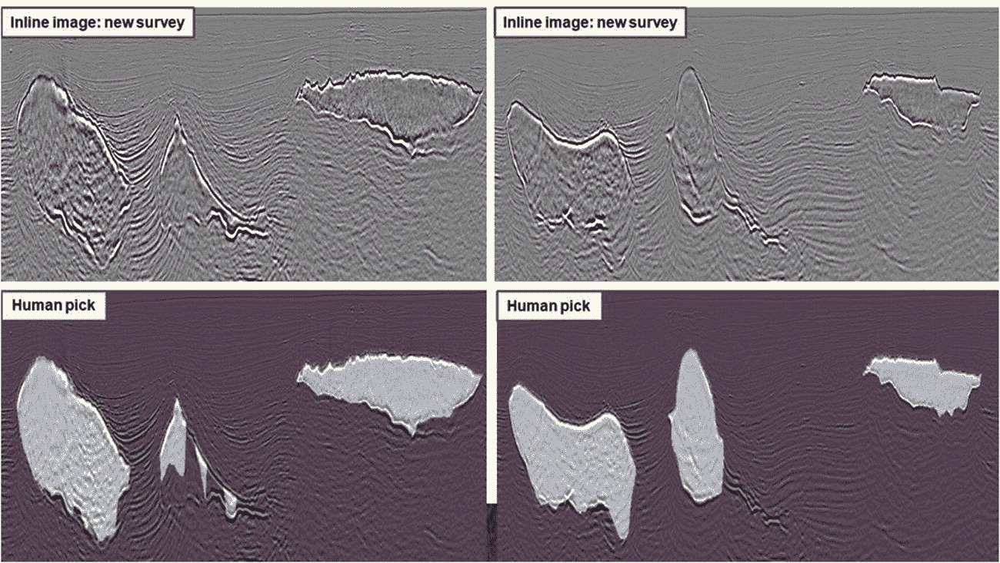

图 4-15

来自 U-Net 的解释与解释者标记的地面真实的比较

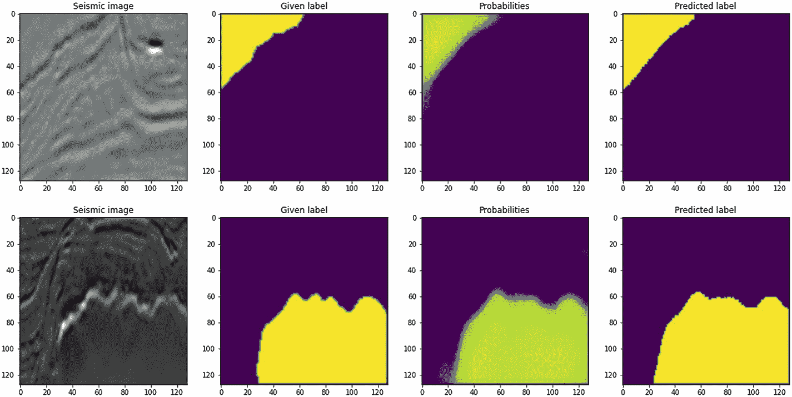

图 4-14

图像块上的 U-网预测。(从左到右)地震图像、记录标签、预测概率和预测标签。通过应用 sigmoid 层来获得概率，并且通过对概率进行阈值处理来获得标签

## 一些问题

在这一章中，我们集中讨论了从地震图像中解释盐的问题。然而，机器学习的其他几个应用已经在地球物理界发表。我们列举了地球物理学和地震数据处理中的一些问题，并选择了一些参考资料。

相分类是储层物性估算核心的一个重要课题。对岩性和岩相进行分类至关重要，以便对井筒中遇到的沉积环境有一个详细的了解。这是探索中一个极其重要的问题。几位作者详细探讨了这个问题。在参考文献[ [8](#Par52) ]和[ [9](#Par53) ]中可以找到机器学习在相分类中的应用的很好的介绍。

储层特性的反演是另一个重要的应用领域。参考文献[ [10](#Par54) ]提供了一个使用物理学指导的卷积神经网络来估计储层性质的例子。另一个经常研究的问题是从地震图像中解释断层的过程。参考文献 [11](#Par55) 给出了一个利用 3D 卷积神经网络执行的分割来解释 3D 断层的例子。

## 摘要

在这一章中，我们概述了地球物理学和地震数据处理。我们集中讨论了盐解释的问题，并概述了地球物理学中的其他重要问题。给定地震成像社区中可用的图像数据的性质，这些问题适用于来自计算机视觉社区的思想的应用。这一领域的几个问题是多学科的，这一章对其中的许多问题进行了概述。

## 承认

作者要感谢 TGS 允许写这一章，并使用 Kaggle 数据集进行盐解释。感谢 Cen Ong、Arvind Sharma、Satyakee Sen、Cable Warren 和 Sathiya Namasivayam 提供的所有有用的讨论和见解。

## 参考

[1] B. J. Evans，勘探中地震数据采集手册，勘探地球物理学家协会，1997 年。

[2] W. W. Symes，反射地震学的数学，1995 年，第 1-85 页。

[3] Ö.伊尔马斯，地震数据分析:地震数据的处理、反演和解释，勘探地球物理学家协会，2001 年。

[4]沈，，I. Ahmed，A. Brenders，j .，，J. Etgen 和 s .，“全波形反演在 Atlantis 建立盐模型”，SEG 技术计划扩展摘要 2017，2017。

[5] S. Kainkaryam，C. Ong，S. Sen 和 A. Sharma，“众包盐模型构建:卡格尔-TGS 盐识别挑战”，2019 年第 81 届 EAGE 会议和展览，2019 年。

[6] J. Long，E. Shelhamer 和 T. Darrell，“语义分割的完全卷积网络”，2015 年 IEEE 计算机视觉和模式识别会议论文集。

[7] O. Ronneberger，P. Fischer 和 T. Brox，“U-net:生物医学图像分割的卷积网络”，载于 2015 年医学图像计算和计算机辅助干预国际会议。

[8] Y. Alaudah，P. Michalowicz，M. Alfarraj 和 G. AlRegib，“岩相分类的机器学习基准”，《解释》，第 7 卷，第 3 期，第 se 175-se 187 页，2019 年。

[9] T. Wrona，I. Pan，R. L. Gawthorpe 和 H. Fossen，“利用机器学习进行地震相分析”，地球物理学，第 83 卷第 5 期，第 O83-O95 页，2018 年。

[10] R. Biswas，M. K. Sen，V. Das 和 T. Mukerji，“使用物理学引导的卷积神经网络进行叠前和叠后反演”，《解释》，第 7 卷，第 3 期，第 se 161-se 174 页，2019 年。

[11] X. Wu，L. Liang，Y. Shi，Fomel 和 Sergey，“FaultSeg3D:使用合成数据集训练一个用于 3D 地震断层分段的端到端卷积神经网络”，地球物理，第 84 卷第 3 期，第 IM35-IM45 页，2019 年。

[12] S. Bader，X. Wu 和 S. Wu，“使用数据匹配技术的缺失测井数据插值和半自动地震连井”，《解释》，第 7 卷，第 2 期，第 T347-T361 页，2019 年。

[13] P. Jaccard，“高山地区植物区系的分布。1，“*《新植物学家》，*第 11 卷，第 2 期，第 37—50 页，1912 年。

[14] J. Vamaraju 和 M. K. Sen，“用于地震偏移的无监督的基于物理学的神经网络”，*解释，*第 7 卷，第 3 期，第 se 189-se 200 页，2019 年。

[15] X. Wu，L. Liang，Y. Shi，Z. Geng 和 S. Fomel，“用于局部地震图像处理的深度学习:断层检测、具有边缘保持的面向结构的平滑以及通过使用单个卷积神经网络的斜率估计”，载于 *SEG 技术计划扩展摘要 2019* ，2019。