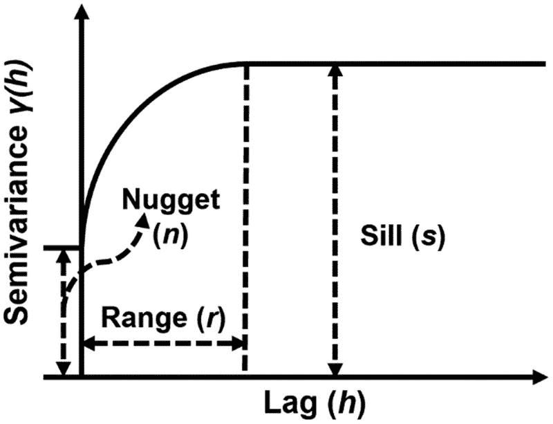
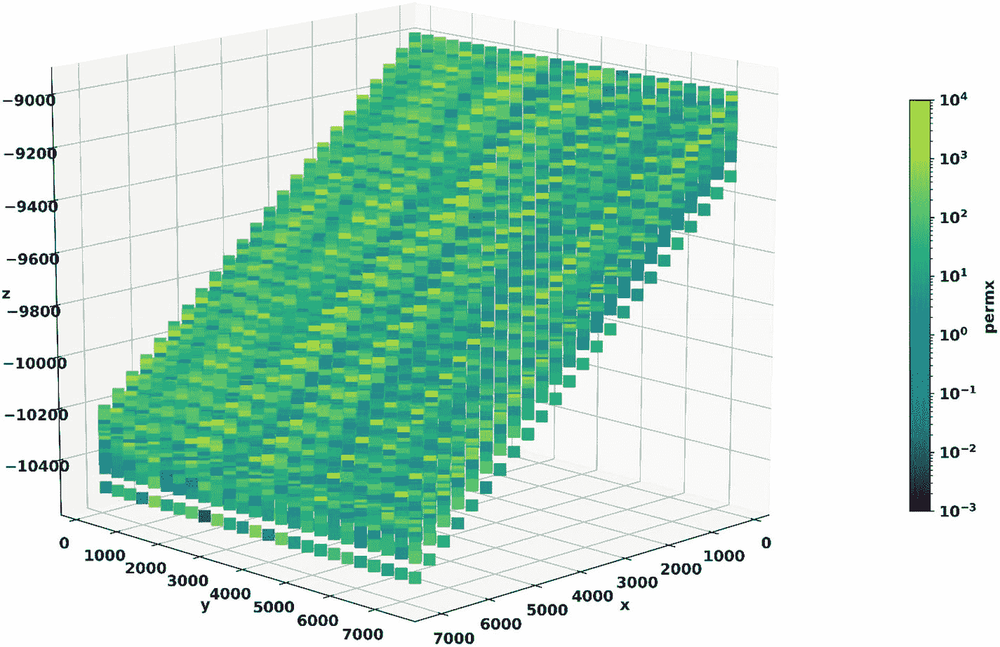
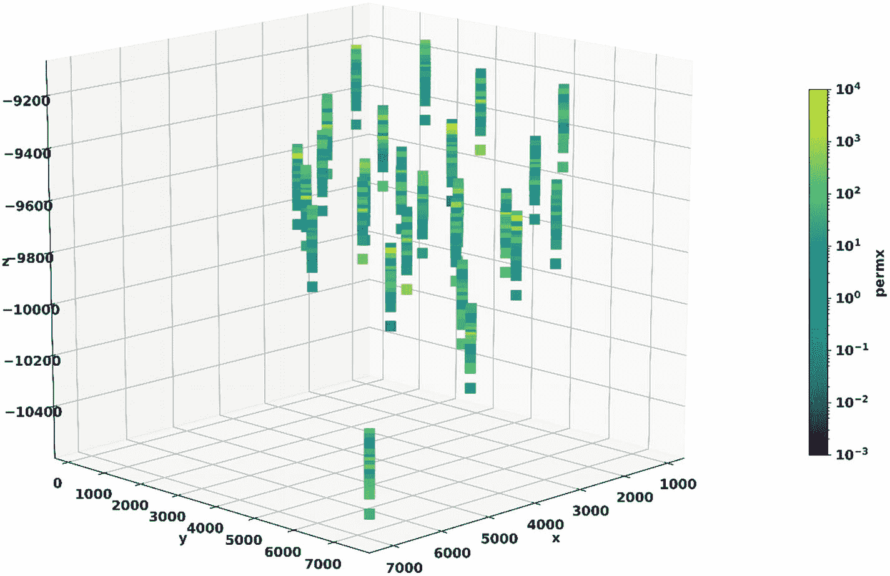
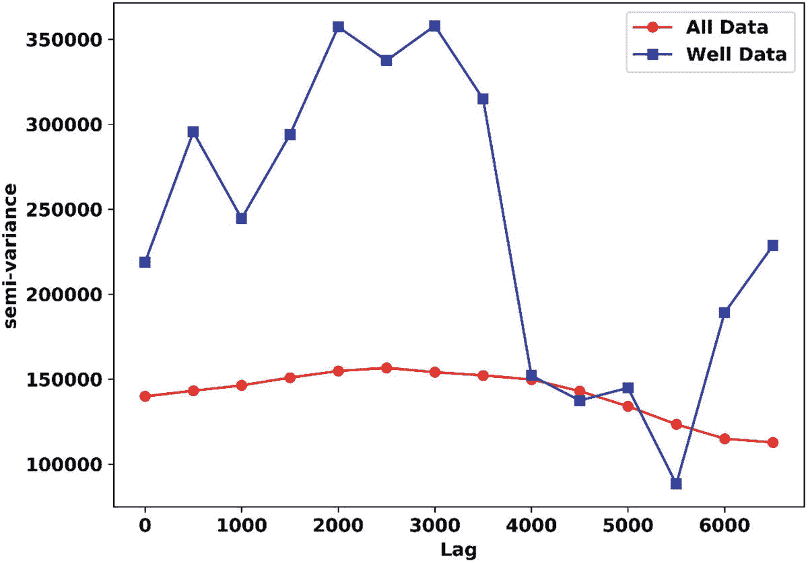
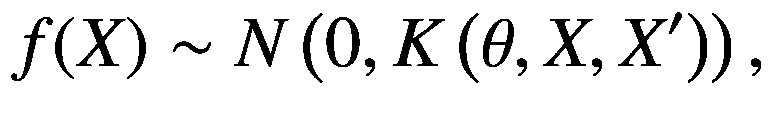
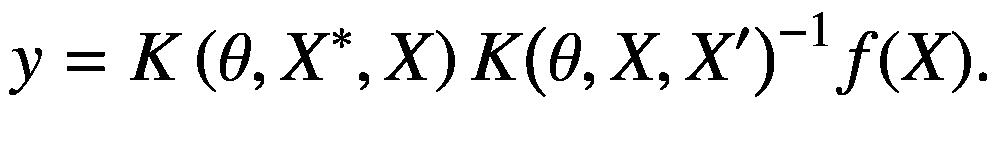
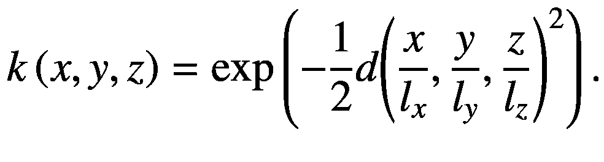
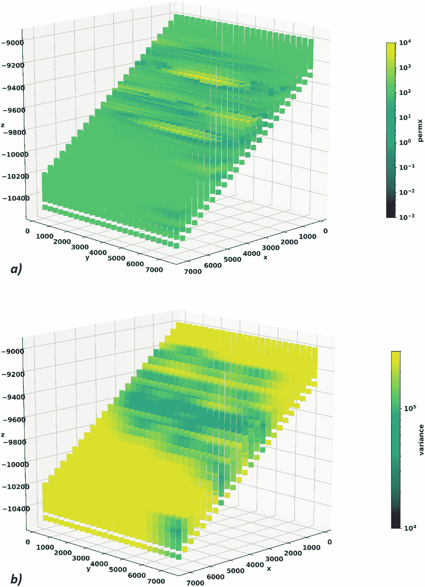

# 五、地质建模

地质建模是勘探和生产规划过程中的一个重要步骤。利用地震解释期间提取的信息，在了解储层的结构框架后，进行地质建模。通过使用由结构框架定义的层位和断层来创建三维(3D)网格。该 3D 网格与测井记录一起用于生成储层属性的详细 3D 模型，例如孔隙度、渗透率等。这一步是储油层模拟的前奏。基于三维油藏模型的计算也有助于估计重要的数量，包括原始石油地质储量(OOIP)。

一旦使用结构框架创建了 3D 网格，在执行任何进一步的工作流程步骤之前，它需要估计离散的岩石物理属性(如相)和连续属性(如孔隙度和渗透率)。来自测井记录的数据形成了属性估计的基础。广泛的建模技术被应用于在 3D 网格的每个单元上生成这些属性。一些最常见的技术包括以下算法[ [1](#Par46) ] [ [2](#Par47) ]。

*   简单克里金法

*   普通克里金法

*   泛克里金法

*   序贯高斯模拟

*   多高斯模拟

在本章中，我们将讨论机器学习如何帮助我们在 3D 网格上估计岩石物理属性值。首先，我们讨论所有技术共有的一些基本基础，以及本章中使用的机器学习技术。接下来，我们描述了我们在本章中使用的数据集，展示了机器学习算法在数据集上的应用，并概述了一些算法的局限性。

## 变异函数

变异函数是几乎所有工业相关 3D 空间建模技术的基础。变异函数提供了距感兴趣点不同距离的属性 *Z* 的半方差(为简单起见，通常称为*方差*)。在经典地质统计学方法[ [1](#Par46) ]中，属性 *Z* 的半变异函数 *γ (h)* (通常称为*变异函数*)被定义为

![$$ \gamma (h)=\frac{1}{2n(h)}\sum \limits_{n(h)}E\left[{\left(Z\left(u+h\right)-Z(u)\right)}^2\right], $$](img/480430_1_En_5_Chapter_TeX_Equ1.png)

(5.1)

其中 *n(h)* 是相隔距离 *h* (也叫*滞后*)的对数。应当注意，使用该方程计算的实验变差函数是使用解析表达式拟合的，例如球形变差函数模型。

图 [5-1](#Fig1) 展示了变差函数 *γ (h)* 的球形变差函数模型拟合的示意图。在图 [5-1](#Fig1) 中， *r* 代表变差函数范围。该值指示与给定点的间隔，在该间隔上属性值之间的相关性消失(即，属性值去相关)。Sill 由 *s* 表示，它是变异函数渐近获得的半方差的值。基台值可以理解为位于距离变异函数范围( *r* )以上的两点处的属性值的方差。熔核方差 *n* ，是对实验或测量数据中不确定性的估计。



图 5-1

球形变差函数模型的示意图

变异函数可以是全向的或各向同性的，其中假设在任何方向上对滞后值观察到相同的半方差。也可能有各向异性变异函数，其中半方差取决于滞后值和方向。各向异性变差函数的一个示例可以是沿横向使用相同的变差函数模型(例如， *x* 和 *y* )，以及沿深度使用单独的变差函数模型。克里金法依靠变异函数来估算远离油井的某一点的岩石物理属性值。克里金法是广义线性回归的一种形式，它提供了一种最佳的估计方法来最小化估计属性值的均方误差。在本章中，我们不打算讨论克里金法的细节。相反，我们专注于一种机器学习算法，它大致相当于一种简单的克里金算法。

最大的挑战是访问开源数据集来进行 3D 地质建模练习。在本章中，我们的目标是给你一个在三维地质模型上进行岩石物理性质插值的工作示例。考虑到这一点，我们选择了一个由石油工程师学会比较解决方案项目 SPE 9 [ [3](#Par48) ]提供的简单地质模型，该模型可在 [`https://github.com/OPM/opm-data`](https://github.com/OPM/opm-data) 获得。SPE 9 模型如图 [5-2](#Fig2) 所示，叠加图中显示了 *permx* (沿 *x* 方向的渗透率)。

## 数据描述

这个网格在 x、y 和 z 方向上分别有 24、25 和 15 个单元。通过直观地观察这个模型中的数据，我们可以很快注意到这个模型的两个明显特征。首先，模型具有显著的异质性，其次，相邻单元中的值之间的相关性很低。在这一章的后一节中，将通过对数据的定量分析来检验基于视觉观察而形成的假设。



图 5-2

SPE 9 模型是用 permx 属性作为覆盖图呈现的

This grid has 24, 25,

根据 SPE 9 模型中提供的井位，我们提取了油田 *permx* 的测井记录，如表 [5-1](#Tab1) 所列。图 [5-3](#Fig3) 显示了提取的 *permx* 属性的测井记录。



图 5-3

permx 属性的测井记录，基于 SPE 9 模型的井位

在图 [5-3](#Fig3) 中，在油藏模型的东北角可以看到一口孤立的注水井。相反，生产井以群集方式远离注入井集中。

接下来，我们对网格数据和提取的测井记录进行一些基本分析。

表 5-1

SPE 9 模型网格中的井位索引

<colgroup><col class="tcol1 align-left"> <col class="tcol2 align-left"> <col class="tcol3 align-left"> <col class="tcol4 align-left"> <col class="tcol5 align-left"> <col class="tcol6 align-left"></colgroup> 
| 

井名

 | 

嗯，我

 | 

嗯 J

 | 

井名

 | 

嗯，我

 | 

嗯 J

 |
| --- | --- | --- | --- | --- | --- |
| 注射 1 | Twenty-three | Twenty-four | PRODU14 | seven | Twelve |
| PRODU2 | four | Zero | PRODU15 | Ten | Thirteen |
| 产品 3 | seven | one | PRODU16 | Twelve | Fourteen |
| PRODU4 | Ten | Two | PRODU17 | Fourteen | Fifteen |
| PRODU5 | nine | three | PRODU18 | Ten | Sixteen |
| PRODU6 | Eleven | four | PRODU19 | Eleven | Seventeen |
| PRODU7 | three | five | PRODU20 | four | Eighteen |
| PRODU8 | seven | six | PRODU21 | seven | Nineteen |
| PRODU9 | Thirteen | seven | PRODU22 | Ten | Twenty |
| PRODU10 | Ten | eight | PRODU23 | Fourteen | Twenty-one |
| PRODU11 | Eleven | nine | PRODU24 | Eleven | Twenty-two |
| PRODU12 | nine | Ten | PRODU25 | nine | Twenty-three |
| PRODU13 | four | Eleven | PRODU26 | Sixteen | Twenty-four |

### 测井基本数据分析

我们想探究 SPE 9 3D 模型上填充的 *permx* 数据和从该模型提取的测井记录是否遵循相同的统计模式。采用一种实用的方法，我们首先通过使用来自提取的测井记录的 *permx* 值和 SPE 9 模型的所有网格单元来计算样本平均值、标准偏差和方差。这些值汇总在表 [5-2](#Tab2) 中。

表 5-2

从 SPE 9 模型中提取的井和所有网格单元的 permx 属性的均值和标准差

<colgroup><col class="tcol1 align-left"> <col class="tcol2 align-left"> <col class="tcol3 align-left"> <col class="tcol4 align-left"> <col class="tcol5 align-left"> <col class="tcol6 align-left"></colgroup> 
| 

提取的测井记录

 | 

所有 SPE 9 网格单元

 |
| --- | --- |
| 

平均

 | 

标准偏差

 | 

变化

 | 

平均

 | 

标准偏差

 | 

变化

 |
| --- | --- | --- | --- | --- | --- |
| One hundred and sixteen point four seven | Five hundred and seven point two four | Two hundred and fifty-seven thousand two hundred and eighty-seven point five three | One hundred and eight point zero eight | Three hundred and seventy-five point three one | One hundred and forty thousand eight hundred and fifty-six point four four |

从提取的测井记录中得到的 mean *permx* 属性的值，与 SPE 9 模型中的所有网格单元相对接近。然而，标准偏差和方差的值表明，对于提取的测井记录，平均值周围的值的分布明显更宽。一个可能的结论是，SPE 9 模型上的 *permx* 属性值可能不是使用模型提供的井位属性分布生成的。我们还通过使用清单 [5-1](#PC1) 中的代码从提取的测井记录和所有网格单元中计算实验变差函数模型，该代码在 Python 中实现了等式 5.1。

```py
from scipy.spatial.distance import pdist, squareform
import numpy as np

def variogram_one_lag(X, perm, lag, bin_width):
    """Experimental semi-variogram for one lag"""
    dist_mat = squareform(pdist(X))
    n_points = dist_mat.shape[0]
    list_var = []
    for i in range(n_points):
        for j in range(i + 1, n_points):
            if(dist_mat[i, j] >= (lag - bin_width)) and \
            (dist_mat[i, j] <= (lag + bin_width)):
                list_var.append((perm[i] - perm[j])**2.0)
    return np.sum(list_var) / (2.0 * len(list_var))

def variogram(X, perm, lags, bin_width):
    """Experimental variogram calculation"""
    variogram = []
    for lag in lags:
        variogram.append(variogram_one_lag(X, perm, lag, bin_width))
    return variogram

Listing 5-1Code Snippet for Experimental Variogram Computation

```

图 [5-4](#Fig4) 显示了提取的测井记录和整个网格的计算实验变差图。突出的第一个事实是这两个变差函数模型中的块金方差都非常大。大的块金表明数据非常嘈杂，并且没有足够的空间相关性。

这是一个假设，我们从视觉观察中得到的，现在我们可以通过使用变异函数计算来定量地确定这一点。在这一点上，基于井位属性分布的三维插值显然无法再现 SPE 9 模型中显示的 *permx* 属性模型(图 [5-2](#Fig2) )。主张我们可以使用零块金的分析变差函数可能很有吸引力，但这是不现实的，因为它没有捕捉到为插值提供的输入数据中固有的不确定性。

在下一节中，我们将开始讨论高斯过程回归，这是一种与克里金法概念类似的机器学习算法，我们将演示如何使用它在 SPE 9 网格单元上对提取的测井曲线进行 3D 插值。



图 5-4

根据 SPE 9 模型计算出的实验变异函数，基于所有网格单元(红色圆圈)的数据，以及根据井位提取的测井数据(蓝色方块)

## 高斯过程回归

高斯过程回归是一种监督学习方法，它实现高斯过程来解决回归问题。高斯过程回归具有某些优点，这使得它对三维空间插值问题很有吸引力。

*   该算法具有很好的插值观测数据的能力。因此，在已钻井之间的区域估计的属性值是非常可靠的。

*   使用高斯过程回归生成的预测是概率性的。因此，可以计算置信区间并提供估计值的不确定性估计。该功能在 scikit-learn 库中实现。这对于地质建模非常重要，因为不确定性量化是 3D 属性建模中非常重要的方面

*   高斯过程回归使用核技巧。核将问题输入投影到高维空间，使得高度非线性的回归问题变成线性的或近似线性的。这允许更有效地解决具有挑战性的非线性回归问题。

然而，就像任何其他算法一样，高斯过程回归也有一些缺点。一些缺点包括如下。

*   模型训练需要完整的样本信息。这使得它不适合在非常大的数据集上训练。然而，地质建模是一个地球科学家必须处理数据缺乏的领域。因此，在大多数情况下，这不会带来严重的挑战。

*   如果输入要素中的变量数量有限(大约几十个),高斯过程回归效果很好。随着我们转向更高维度的输入特征，该方法失去了它的效率。这也不是一个大问题，因为对于空间 3D 插值，输入特征主要由 *x* 、 *y* 和 *z* (或变换后的 *u* 、 *v* 和 *w* )坐标组成。

*   这种方法不适合外推法。随着我们远离样本数据，估计值趋向于样本数据的平均值，估计方差趋向于样本数据的方差。

### 规划

高斯过程(GP)是随机变量的集合，其中这些变量的任何有限集合都具有多元正态分布。如果我们有一个高斯(也是正态)分布的随机变量，我们画出它，我们得到一个钟形曲线。如果我们有两个分布相似的随机变量，通过在 *x* 和 *y* 轴上绘制它们，我们得到一个钟形。那是有两个随机变量的多元正态分布。我们可以想象三个满足条件的随机变量，以此类推。

现在，假设有一些点 *X* ，其中观察到的属性值由 *f* ( *X* )或简单的 *f* 给出。同样，基于这些信息，对于一组点*X*<sup>∫</sup>，我们试图估算*f*(*X*<sup>∫</sup>)或*f*<sup>∫</sup>。这意味着我们在试图计算概率分布*p*(*f*<sup>∫</sup>|*f*)。在假设均值为零的情况下，我们可以将 *f* ( *X* )近似为如下[ [4](#Par49) ]。



(5.2)

*其中 N* 表示均值为零的正态分布， *K* ( *θ* ， *X* ，*X*<sup>′</sup>)表示所有观测数据点对之间的协方差矩阵( *X* ，*X*【T16′)。协方差矩阵确保与输入值非常接近的值会生成彼此也很接近的输出值。由



(5.3)给出*X*<sup>∑</sup>点的估计平均值

在方程 [5.3](#Equ3) 中，出现了一个新项 *K* ( *θ* ，*X*<sup>∑</sup>， *X* )。该术语说明了观测数据点(在我们的情况下是导出的测井记录)和我们试图获得属性估计值的点之间的协方差。如果我们在克里金法和高斯过程回归之间画一条平行线，协方差矩阵类似于图 [5-1](#Fig1) 所示的分析变异函数。在高斯过程回归中，协方差函数使用之前讨论的*内核技巧*实现。最常用的核是径向基函数(RBF)核。

### 径向基函数核

RBF 核也被称为*平方指数*核。该内核由长度尺度参数参数化，类似于图 [5-1](#Fig1) 所示的变差函数范围。RBF 核可以具有单一长度比例，并提供全向(各向同性)变异函数的等价物，或者它可以具有与提供各向异性变异函数的等价物的输入相同的维数。RBF 核的函数形式由



(5.4)给出

在方程[5.4](#Equ4)*l*<sub>*x*</sub>， *l* <sub>*y*</sub> ， *l* <sub>*z*</sub> 表示在 *x* ， *y* 和 *z* 方向上的长度刻度或变差函数范围。另外，`GaussianProcessRegressor` scikit-learn 实现提供了一个超参数`alpha`，它表示图 [5-1](#Fig1) 中变差函数模型的块金方差( *n* )。值得注意的是，这里讨论的方法假设样本均值为零。这可以通过在 scikit-learn 中使用`StandardScaler`来实现。清单 [5-2](#PC2) 显示了使用`GaussianProcessRegressor`对 *permx* 进行插值的实现。

```py
from sklearn.preprocessing import StandardScaler
from sklearn.gaussian_process import GaussianProcessRegressor
from sklearn.gaussian_process.kernels import RBF

x_scaler = StandardScaler()
X_scaled = x_scaler.fit_transform(X)
y_scaler = StandardScaler()
y_scaled = y_scaler.fit_transform(np.array(y).reshape(-1, 1))
kernel = RBF([5.e-1, 5.e-3, 5.e-3], (1.e-3, 1.e0))
gpr = GaussianProcessRegressor(kernel=kernel,
                               alpha=0.75,
                               n_restarts_optimizer=10,
                               normalize_y=False,
                               random_state=12345)
y_scaled = y_scaled.flatten()
gpr.fit(X_scaled, y_scaled)
pred, sigma = gpr.predict(X_scaled, return_std=True)
pred = y_scaler.inverse_transform(pred.reshape(1, -1))
print('GPR Fit Score: %f' % gpr.score(X_scaled, y_scaled))

GPR Fit Score: 0.708586653049732

Listing 5-2Code Snippet for Gaussian Process Regression for Property Value Estimation Away from Wells

```

在代码示例中，我们将数据转换为零均值和单位方差。拥有单位方差还有助于我们选择`alpha`参数作为样本方差的一部分。较小的值`alpha`非常适合井位的数据，我们将获得较高的拟合分数。您可以尝试使用不同的`alpha`值进行实验，看看拟合分数和整体预测如何变化。

代码中的 RBF 核有三个长度范围，这表明正在使用各向异性核(变异函数)。在长度尺度列表之后的 RBF 核中的参数是定义长度尺度的上限和下限的元组。在训练过程中，优化算法在定义的上限和下限内选择最佳拟合长度尺度。使用清单 [5-2](#PC2) 中生成的模型，预测井位处的 *permx* 值。估计值方差较小，如图 [5-5](#Fig5) 所示。

此外，SPE 5 模型的所有网格单元处的 *permx* 值也使用训练模型来预测。图 [5-6](#Fig6) 显示了估计的平均预测值和相应的方差。可以观察到井周围的估计具有低方差。当我们远离油井时，我们得到预测和方差，它们等于从导出的测井数据计算的平均值和方差值，如表 [5-2](#Tab2) 所示。根据图 [5-4](#Fig4) 中观察到的变差函数模型，我们预计会发生这种情况，其中与窗台相比，块金方差显著，表明导出的测井数据相关性较低。



图 5-6

使用训练的高斯过程回归模型(a)预测所有 SPE 9 网格单元的 permx 值和(b)相应的估计方差


图 5-5

使用高斯过程回归(SPE 9 井位的预测 permx 值和(b)相应的估计方差

## 摘要

在本章中，我们使用了一种机器学习方法，它提供了一种与克里金法等效的工具。我们使用开源数据集来训练高斯过程回归模型。近年来，在空间插值领域有了一些新的发展。最值得注意的是*生成对抗网络* (GANs)。在石油和天然气工业中，GANs 已经被用于地震图像的内插[ [5](#Par50) ]。然而，后退一步，从地质建模的角度评估这些方法的适用性可能是值得的。

通常，地球科学家面临的最大挑战是从测井记录中获得良好的数据。在最初的油田开发阶段，来自测井记录的数据很少。在这种情况下，GAN 等算法的适用性值得怀疑，因为训练它们需要大量的数据。然而，在数百口井的测井记录可用的情况下，评估基于深度学习的技术的适用性可能是值得的[ [6](#Par51) ]。然而，在正常情况下，高斯过程回归为岩石物理性质插值算法提供了一个很好的选择。

Effect of Parameter Alpha

本章中显示的结果是在训练`GaussianProcessRegressor`模型时使用 0.75 的`alpha`参数值生成的。

*   尝试使用不同的`alpha`参数值，看看它如何改变输出。你会看到，随着你降低`alpha`的值，`GaussianProcessRegressor`的得分不断提高，但它预测远离油井的房地产价值的能力将会减弱。

*   如果您可以在中访问真实的 3D 网格模型。GRDECL 格式，尝试使用随书提供的代码来创建 3D 网格，看看是否可以使用`GaussianProcessRegressor`生成好的结果。

## 参考

[1] E. H. Isaaks 和 R. M. Srivastava，*应用地质统计学简介*，牛津大学出版社，1990 年。

[2] M. Armstrong，A. Galli，h . beucher，G. Loc'h，D. Renard，B. Doligez，r . eschard 和 F. Geffroy，*地理科学的多元模拟；*，柏林/海德堡:Springer 出版社，2011 年。

[3] J. Killough，“第九届美国石油工程师协会比较解决方案项目:黑油模拟的复审”，美国石油工程师协会储层模拟研讨会，德克萨斯州圣安东尼奥，1995 年。

[4] C. E. Rasmussen 和 C. K. I. Williams，*机器学习的高斯过程*，剑桥:麻省理工学院出版社，2006 年。

[5] D. A. B. Oliveira，R. S. Ferreira，R. Silva，E. V. Brazil，“用条件生成对抗网络内插地震数据”， *IEEE 地球科学与遥感通讯，*第 15 卷，第 12 期，第 1952–1956 页，2018 年。

[6] Y. N. Pandey，K. P. Rangarajan，J. M. Yarus，N. Chaudhary，N. Srinivasan 和 J. Etienne，“基于深度学习的油藏建模”，专利 PCT/US2017/043228，2017 年 7 月 21 日。