# 6.油藏工程

石油和天然气行业从一开始就一直在解决与自动化和优化相关的问题。现代技术和数据驱动的算法为行业提供了解决问题和获得洞察力的额外机制。在钻井工程中观察到了机器学习在油田中的应用，用于 ROP 优化[ [1](#Par57) ]、差分卡钻[ [2](#Par58) ]、甜点识别[ [3](#Par59) ]、岩石物理建模[ [4](#Par60) ]、储层流体性质估计[ [5](#Par61) ]、地下表征[ [6](#Par62) ]、储层模拟[ [7](#Par63) 、生产工程[ [8](#Par64) ]和完井工程[]

一些研究试图将传统的统计方法与机器学习[10](#Par66)结合起来，以提高完井作业和整体生产的性能。近年来的一个热门话题是优化完井设计以减轻裂缝冲击[ [11](#Par67) ]，这被发现对非常规油气藏非常重要[ [12](#Par68) ]。由于储层中存在的非均质性和不确定性，许多人提出了基于纯物理模型的问题[ [13](#Par69) ]，这促使我们关注数据驱动的解决方案，以补充这些研究。现代计算能力还支持应用神经网络和基于深度学习的解决方案来解决石油和天然气行业的问题。多项研究试图使用这种学习技术来解决钻头弹跳检测[ [14](#Par70) ]、生产数据分析[ [15](#Par71) ]、地震层位解释[ [16](#Par72) ]等问题。

机器学习的应用可以分为两类[ [12](#Par68) ]。第一类依赖于生产数据，第二类包括完井、作业和其他储层参数。这一章是基于第一类，其中公开可用的生产数据用于分析。

在石油工程领域，油藏工程师的主要职责之一是量化油藏动态的能力。这是通过使用*递减曲线分析* (DCA)来完成的，在这种情况下，根据时间监控生产率，并对储层可能生产的石油或天然气量进行预测。DCA 扮演着重要的角色，是油藏工程师工具箱中最有价值的技术之一，因为它提供了一种方法来估计原始油气储量和废弃时的油气储量，并预测未来的产量，直到达到经济极限。使用这种方法做出的预测通常用于向美国证券交易委员会(SEC)报告储量，因此它们在石油经济学领域具有很高的重要性。

随着石油和天然气行业越来越多地采用基于机器学习的解决方案，人们一直在努力改进递减曲线分析，以做出更准确的预测。机器学习越来越多的应用背后的一个原因是大量的数据，这些数据有助于建立储层模型和进行历史拟合。油藏工程和油藏建模的传统方法既昂贵又耗时，因此我们将注意力转向数据驱动的方法，这种方法可以提供相似或更高精度的估计值。

本章介绍了储层工程领域的问题，这些问题可以使用机器学习来解决。随后的章节致力于搜集公开可用的数据集，并为衰退曲线分析开发预测模型。

本章将介绍使用 Arps 递减法和基于时间序列的分析来预测产量的传统统计分析形式。讨论了不同方法的预测结果。这只是一个简要的描述，鼓励读者尝试其他方法，如递归神经网络(RNNs)和长短期记忆(LSTM)，以预测石油和天然气产量，这些方法已被证明可以提供更高精度的预测[ [17](#Par73) ]。

## 机器学习在油藏工程中的作用

基于机器学习的解决方案可以直接应用的一些油藏工程领域包括优化油藏管理[ [18](#Par74) ]，在这些领域，新井的识别和规划始终是一个巨大的挑战。用于高效油田开发计划的储层特性的地下表征也可以通过机器学习来实现[ [5](#Par61) ]。机器学习可以应用的另一个领域包括使用来自模拟井[ [19](#Par75) ][ [20](#Par76) ]的数据生成伪测井曲线或预测 PVT 属性。其他一些例子包括地质学[ [21](#Par77) ]、地球物理学[ [22](#Par78) ]的解释，以及知识图的创建，这些可以提供更深入的见解。

文献表明，与 Arps、Duong 和*拉伸指数产量下降* (SEPD)模型[[13](#Par69)[[23](#Par79)[[24](#Par80)]相比，某些基于机器学习的方法(如神经网络和深度学习)如何提高了预测。通过使用机器学习算法，使用标准井进行产量预测的传统方法[ [25](#Par81) ]得到了改进。随机森林、支持向量机和多元自适应回归样条等算法也提高了预测精度。其他研究表明，用神经网络预测巴肯页岩油井的采油速度会有更好的结果[ [27](#Par83) ]。关于时间的典型递减曲线如图 [6-1](#Fig1) 所示。

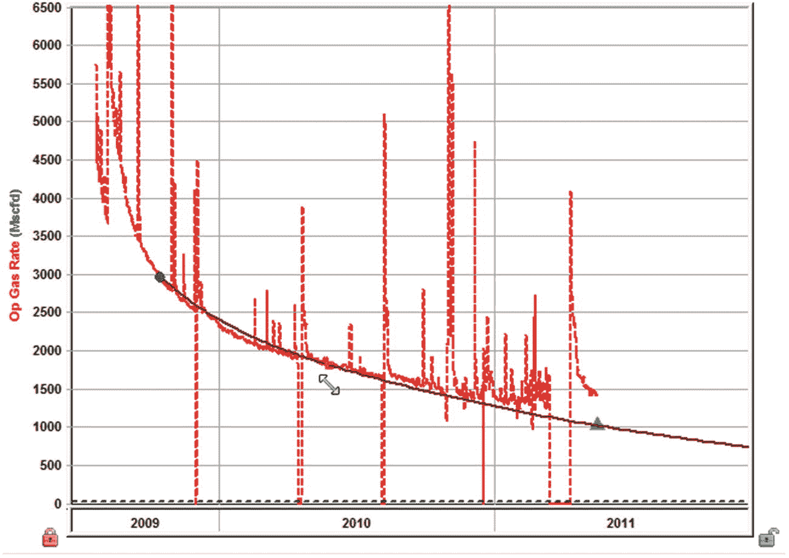

图 6-1

典型递减曲线示例，x 轴为时间，y 轴为工作气体速率[ [28](#Par84)

## 数据集描述

分析中使用了北达科他州工业委员会(NDIC) [ [29](#Par85) ]石油和天然气部门的公开生产数据。一个 Python 脚本从网站上抓取了数据。Excel(。从 2015 年年中开始的 csv)文件可在网站上获得，本章中使用了这些文件。NDIC 网站的快照如图 [6-2](#Fig2) 所示。

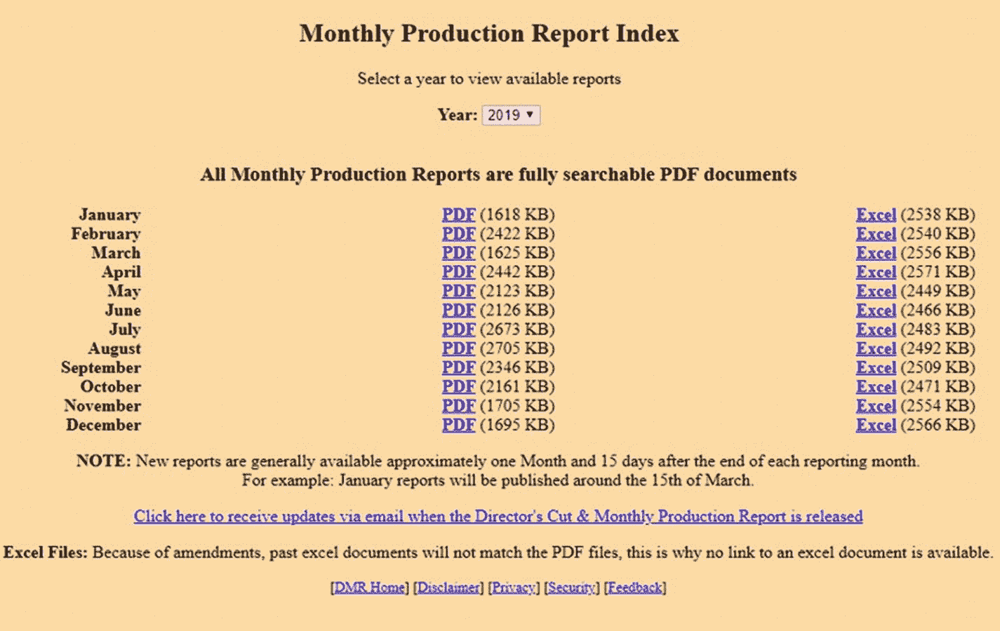

图 6-2

用于收集生产数据的北达科他州工业委员会网站的快照[ [29](#Par85)

一旦收集了数据，正如你在不同的 API 数字中看到的，分析中有 17，756 口井。并非所有油井都准确报告了石油和天然气产量，因此一个挑战是尽可能清理数据。使用一些基本的数据可视化，我们可以理解我们当前正在处理的数据集。

分析的重点是石油产量，因为这是北达科他州油井的主要流量。在这项研究中，我们使用 2015 年年中至 2018 年的数据进行历史匹配，并预测 2019 年的数据。这些数据是时间序列的形式，每月的产量可用于分析。除了用于递减曲线分析的传统 Arps 方程外，本章还进行了基于时间序列的预测。

基于这两种方法，我们可以使用均方根误差(RMSE)作为度量来确定更准确的方法，因为这是一个回归问题。需要注意的是，该分析只显示了几口井，但是代码储存库包括从网站上检索到的全部井。图 [6-3](#Fig3) 显示了电子表格中生产数据的快照，包括 21 列。

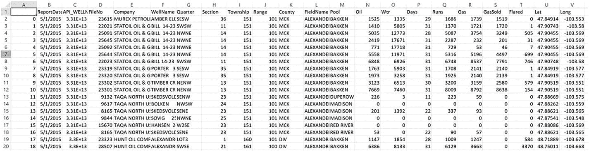

图 6-3

显示生产数据的电子表格快照

数据集中有以下几列，包括一些静态信息以及每月报告的石油、天然气和水产量。数据库中还以经度和纬度的形式提供了油井的位置。关于生产天数的信息决定了产油率。

以下是 21 个数据列。

```py
Index(['ReportDate', 'API_WELLNO', 'FileNo', 'Company', 'WellName', 'Quarter', 'Section', 'Township', 'Range', 'County', 'FieldName', 'Pool', 'Oil', 'Wtr', 'Days', 'Runs', 'Gas', 'GasSold', 'Flared', 'Lat', 'Long'], dtype="object")

```

添加到现有数据框架中的一些附加特征包括井上线的日期，以及找到特定井上线的天数。下面的代码片段查找数据库中石油产量最高的前十口井。

```py
# find the top 10 wells with highest production (sum)
grouped_data = train_prod.groupby(['API_WELLNO']).sum()
grouped_data = grouped_data.sort_values(by=['Oil'])
grouped_data = grouped_data.nlargest(10, 'Oil').reset_index()

```

两口示例井的递减趋势如图 [6-4](#Fig4) 所示，采油速度在 *y* 轴上，时间在 *x* 轴上。

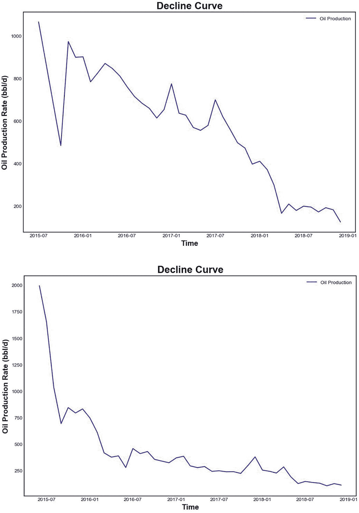

图 6-4

两口示例井的递减曲线(相对于时标绘制的采油速度)

## 使用 Arps 经验模型的递减曲线分析

在本节中，我们将重点介绍递减曲线分析，这是油藏工程师用来预测油井或气井未来产量的一种技术。这些结果决定了*预计最终采收率* (EUR)。最常用的方程是以前的研究[ [29](#Par85) ]中提供的递减参数、速率和时间之间的经验关系，并且仍然被普遍使用。作为现代生产数据分析不可或缺的组成部分，该过程还包括流态表征、采收率估算和流体地质储量估算。

使用这种方法进行递减曲线分析的方程如下所示。这种传统的图解方法没有理论基础，并且隐含地假设了油井寿命期间的恒定操作条件。Arps 模型已成功用于达到*边界主导流* (BDF)的油井。

需要注意的是，大多数非常规井都没有达到边界主导流量，并在瞬变期间出现急剧下降:这种方法也没有使用压力数据。示出了一个井的例子，其中使用参数 *qi* 、 *b、*和 *Di、*来拟合曲线，并且使用了双曲线方程。使用拟合的曲线对 2019 年期间进行预测。

为了匹配历史数据并进行预测，使用了基于 Python 的开源库 SciPy。SciPy 在`scipy.optimize.leastsq` [ [30](#Par86) 附近提供了一个包装函数——`curve_fit()`。该函数使用非线性最小二乘法来拟合函数并确定必要的系数。`curve_fit`方法至少接受三个参数。

𝑝𝑜𝑝𝑡，𝑝𝑐𝑜𝑣 = 𝑐𝑢𝑟𝑣𝑒_fit (𝑓𝑢𝑛𝑐，𝑇，𝑄).6.1)

函数调用中的第一个参数是函数。任何函数都可以像传递其他变量一样传递给它。在我们的情况下，函数是指数函数、双曲线函数或调和函数，并且可以采用独立变量(例如，下降曲线示例的时间)以及任何其他拟合参数。例如，在双曲线函数中， *qi* 、 *b* 和 *Di* 被传递，而在指数函数中，由于 *b* =0，所以只需要 *qi* 和 *Di* 。除了函数定义之外，自变量和观测数据也被传递，这需要进行拟合。L2 范数可以确定拟合的质量，其中实际值与曲线拟合预测进行比较。

𝐸𝑟𝑟𝑜𝑟𝐿2 =∑|(𝑡)𝑞𝑜𝑏𝑠(𝑡)|<sup>2</sup>(6.2)

### 等式和描述

递减曲线分析中使用的每种函数形式都有特定的特征。这里我们讨论不同类型的下降曲线的一些显著特征。

#### 指数下降

在这种类型的递减中，可以观察到流量和累积产量之间的直线，以及 *x* 轴上流量对时间的对数。下降率是恒定的。根据该方程的预测得出最小*估计最终采收率* (EUR)，并且可以通过使用以下方程计算速率。

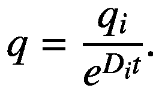

(6.3)

#### 双曲线下降

这是最常见的 Arps 公式，因为在现实生活中很少会出现直线图。对于常规油藏，当递减指数因子 *b* 介于 0 和 1 之间时(边界主导流为主导流态的情况)，递减率不是常数，通常由非线性曲线拟合方法确定。在非常规油藏中观察到了较高的 *b* 因子值。这种情况的一个例子是瞬态线性流动，其中 *b* =2。呈现双曲线递减的储层的产量可通过使用以下公式获得。

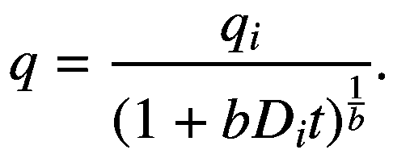

(6.4)

#### 调和衰退

这被认为是 a *b* =1 的双曲线递减的特例。在这种情况下，递减率与流量成正比。流量对数与累积产量的半对数图显示了一条直线。可以使用下面的等式计算流速。

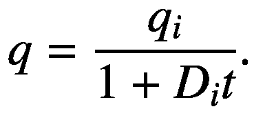

(6.5)

### 结果

对这些井进行了历史拟合，结果如图 [6-5](#Fig5) 所示。

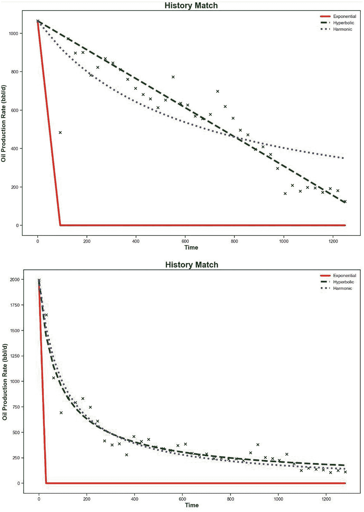

图 6-5

使用 Arps 递减曲线模型的历史匹配结果

对于两个示例井，双曲线方程提供了更好的匹配。尽管对于第二口井，双曲线方程和调和方程都显示出相似的历史匹配。

使用模型参数，可以通过改变方程中的时间 *t* 来预测石油生产率。图 [6-6](#Fig6) 显示了两口井未来 5000 天的预测结果。

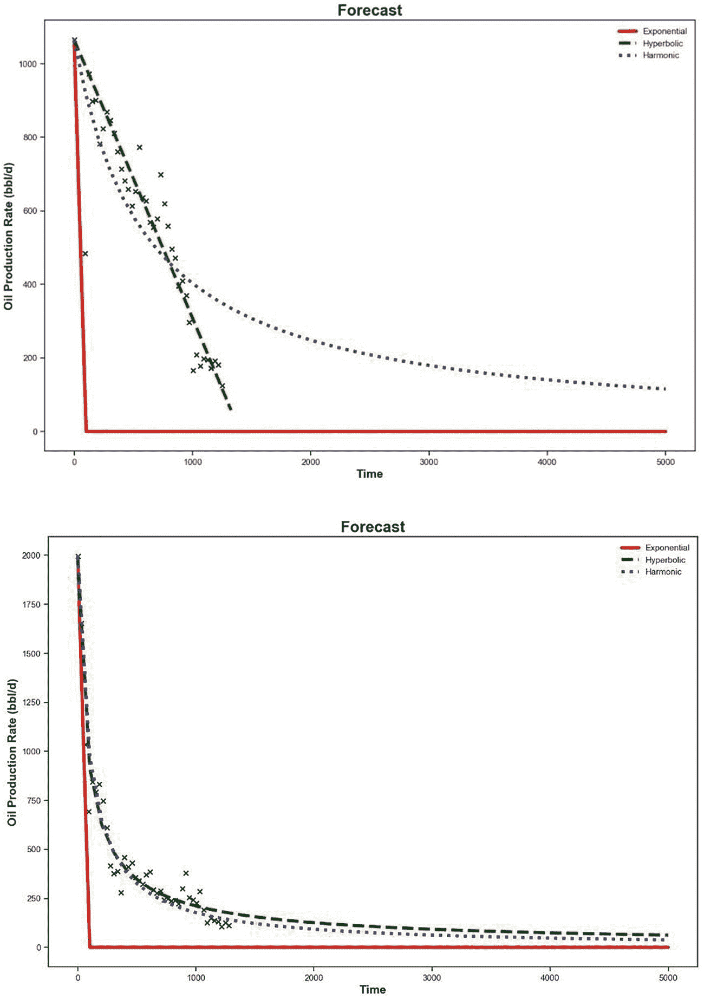

图 6-6

使用 Arps 递减曲线模型的预测结果

### 确认

测试数据集包括 2019 年以后的产量，用于验证递减曲线模型的预测性能。此数据尚未用于训练经验模型，而是用于验证模型的性能。图 [6-7](#Fig7) 包括双曲线性能与实际数据的对比。

在本例中，确定了一个常见的精度指标——均方根误差(RMSE ),以量化双曲线模型的预测精度。

```py
RMSE - Hyperbolic Model: 81.419 bbl/d

```

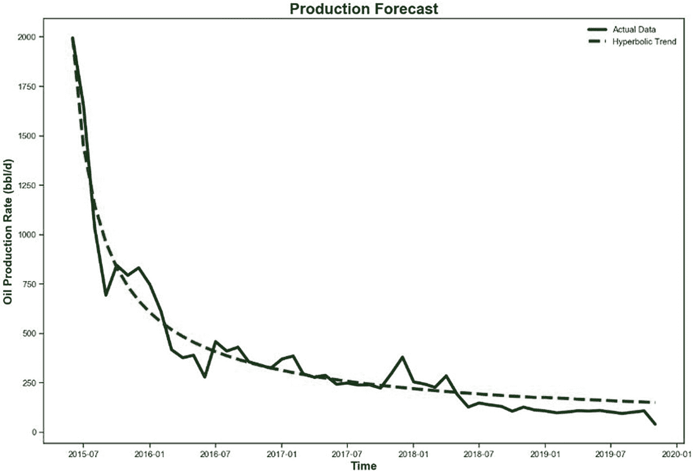

图 6-7

实际数据和双曲线预测(包括测试数据，即 2019 年以后的产量)之间的比较

## 使用 ARIMA 模型进行基于时间序列的预测

理解时间序列数据的趋势和预测的另一种方法包括从历史数据中分析统计趋势。本章使用了一个常见的模型，ARIMA ( *自回归综合移动平均线*)。在这个特定的分析中，date 列需要转换为 datetime 数据类型，以便更容易地操作时间数据。

### 时间序列的平稳性要求

在使用时间序列建模算法时，我们需要确保数据是稳定的。平稳时间序列是指其统计属性(如均值、方差和自相关)在一段时间内保持不变的序列[ [31](#Par87) ]。通过使用数学变换，如对数，有可能将数据转换成平稳时间序列的形式。迪基-富勒检验可以用来确定一个时间序列是否平稳[ [32](#Par88) ]。

API 为 33025021780000 的井的示例中的递减曲线显示了时间趋势(对于递减曲线分析通常是递减的)和季节性的存在，这使得局部平均值成为时间的函数。这证明了下降曲线的非平稳性，如图 [6-8](#Fig8) 所示。指数加权移动平均法用于从数据中去除时间趋势。进行转换时，数据会失去趋势，并显示出接近恒定滚动平均值的趋势。

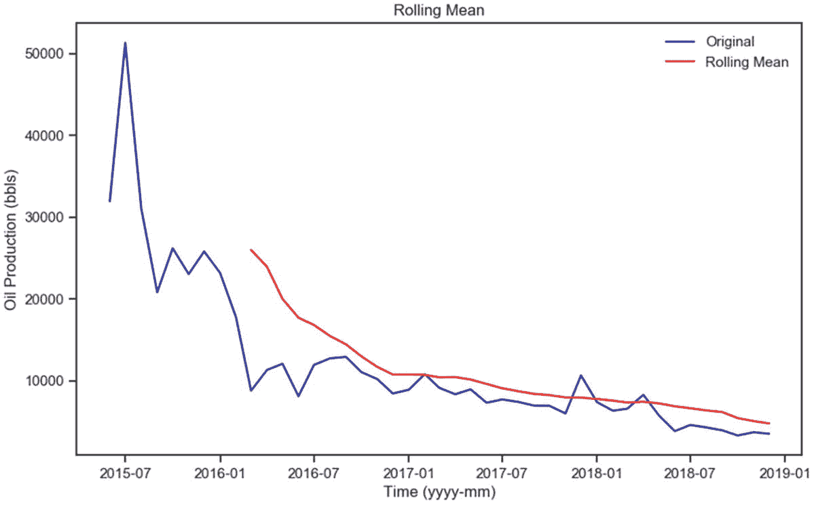

图 6-8

石油生产数据显示下降趋势，可变滚动平均值表明非稳定行为

通过使用差异法，季节性和趋势性都可以从数据中剔除。在这种方法中，特定时间的观测值与前一次观测值存在差异。一阶差分可以使用 pandas 库在 Python 中实现，是消除季节性的有效方法。实施如图 [6-9](#Fig9) 所示，显示了应用转换后趋势和季节性的损失。

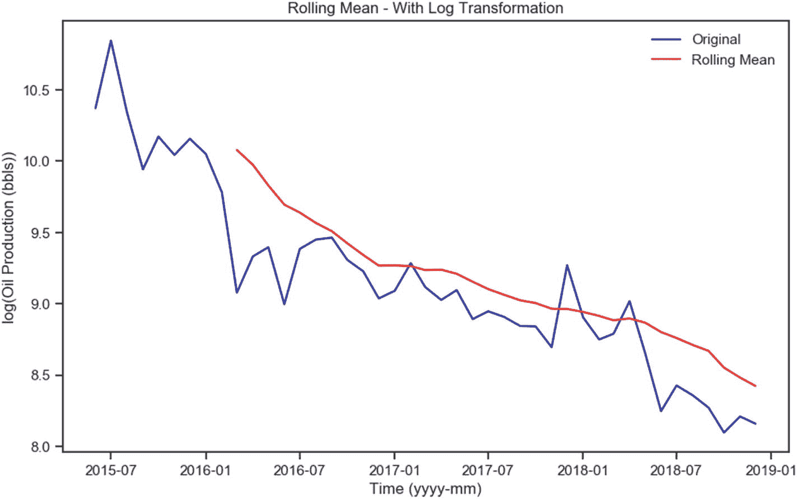

图 6-9

使用对数变换去除趋势和季节性，得到局部稳定的平均值

进行统计相关分析是为了了解两个变量之间的关系强度。这就引出了*自相关函数* (ACF)和*偏自相关函数* (PACF)。ACF 定义为一个时间序列中两个值之间的相关系数，它可以度量当前时刻的一个观测值 *t* 与之前时刻的观测值[ [33](#Par89) 之间的线性关系。如果时间序列被转换，相关系数被获得，它给我们 PACF，这通常是有用的识别自回归模型的顺序。对于所讨论的例子，ACF 和 PACF 图如图 [6-10](#Fig10) 所示。

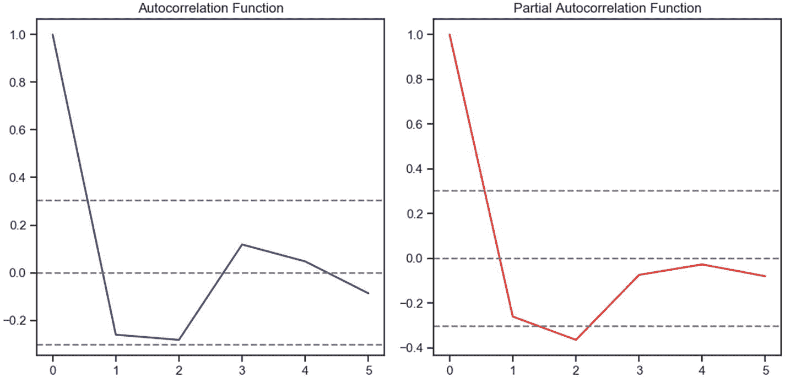

图 6-10

ACF 和 PACF 图了解变量之间的相关性

### ARIMA 组件

如果分解*自回归综合移动平均、*或 ARIMA 建模算法，首字母缩略词的每个组成部分都有自己的定义。ARIMA 对时间序列数据进行建模以进行预测(即预测序列中的未来点)，其方式如下[ [34](#Par90) ] [ [36](#Par92) ]。

*   说明了数据的增长/下降模式(因此有了*自回归*成分)

*   数据增长/下降的变化率被考虑在内(因此*综合*成分)

*   连续时间点之间的噪声被考虑在内(因此产生了*移动平均*分量)

这些组件中的每一个都在模型中被明确指定为参数。在 ARIMA 使用标准符号( *p* 、 *d* 、 *q* )，其中参数被替换为整数值，以快速指示所使用的具体 ARIMA 型号[ [35](#Par91) ] [ [37](#Par93) ]。ARIMA 模型的参数定义如下。

*   ***p**T3】。模型中包含的滞后观测值的数量，也称为*滞后阶数**

*   ***d*** 。原始观测值被差分的次数，也称为*差分程度*

*   ***q*** 。移动平均线窗口的大小，也称为移动平均线的*阶*

自相关和部分自相关函数(ACF 和 PACF)有助于确定这些参数的初始值。通过观察图 [6-10](#Fig10) ，我们可以观察到在一定数量的滞后之后，ACF 和 PACF 急剧下降(显示在 *x* 轴上)。通过分析这种下降的滞后，我们可以估计 ARIMA 模型的参数。自回归部分的参数 *p* 使用 PACF 确定，而 ACF 为模型的移动平均部分提供参数 *q* 。根据图 [6-10](#Fig10) 中的观察结果，我们将使用参数为 *p* =2、 *d* =1、 *q* =2 的 ARIMA 模型。接下来，我们展示了从自回归模型(见图 [6-11](#Fig11) )、移动平均模型(见图 [6-12](#Fig12) )和组合 ARIMA 模型(见图 [6-13](#Fig13) )获得的残差平方和(RSS)图。

#### 自回归模型

模型 _AR = ARIMA(ts_log，order=(2，1，0))

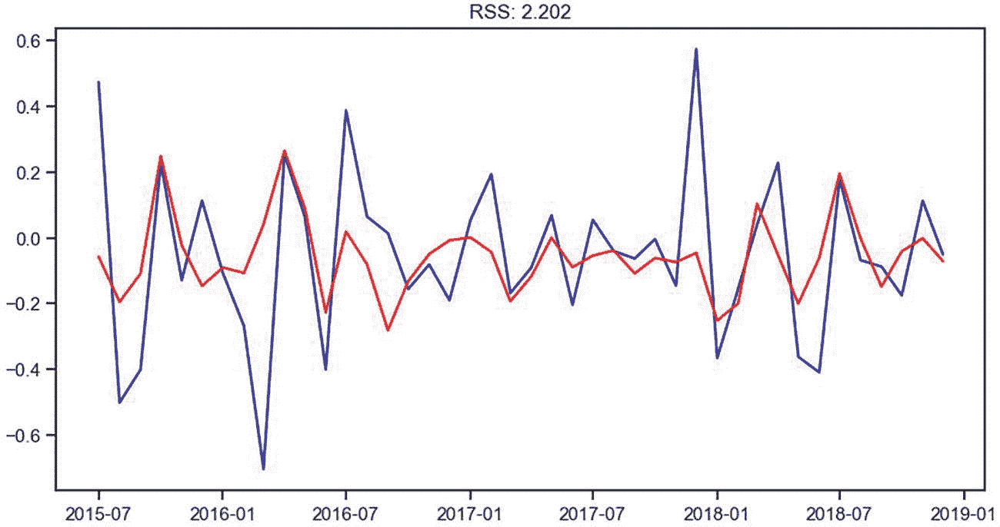

图 6-11

残差平方和得分为 2.202 的自回归模型

#### 移动平均模型

```py
model_MA = ARIMA(ts_log, order=(0, 1, 2))

```

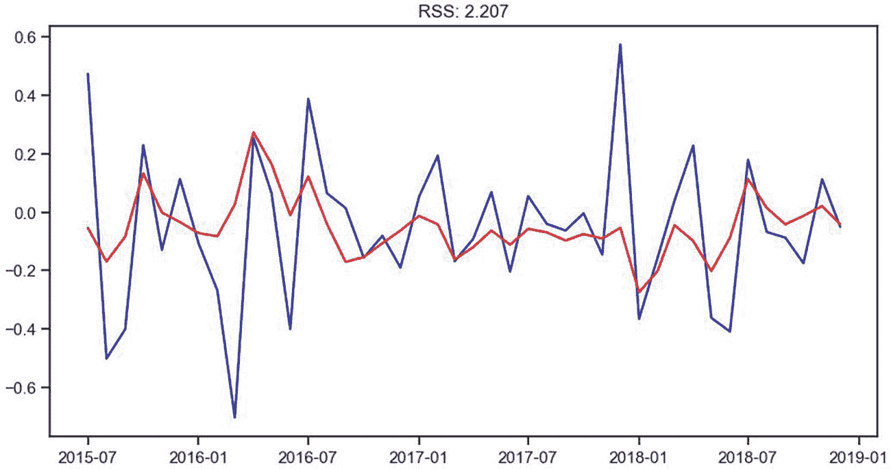

图 6-12

残差平方和得分为 2.207 的移动平均模型

#### ARIMA 模式

```py
model = ARIMA(ts_log, order=(2, 1, 2))

```

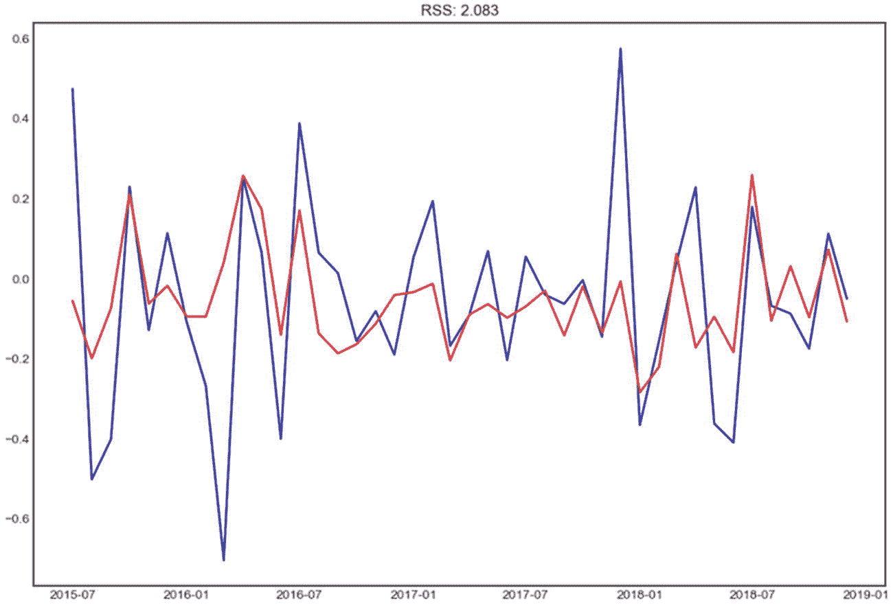

图 6-13

具有对数变换和 2.083 残差平方和的 ARIMA 模型

使用 Python 中的 statsmodels 库，可以生成结果摘要，如图 [6-14](#Fig14) 所示。

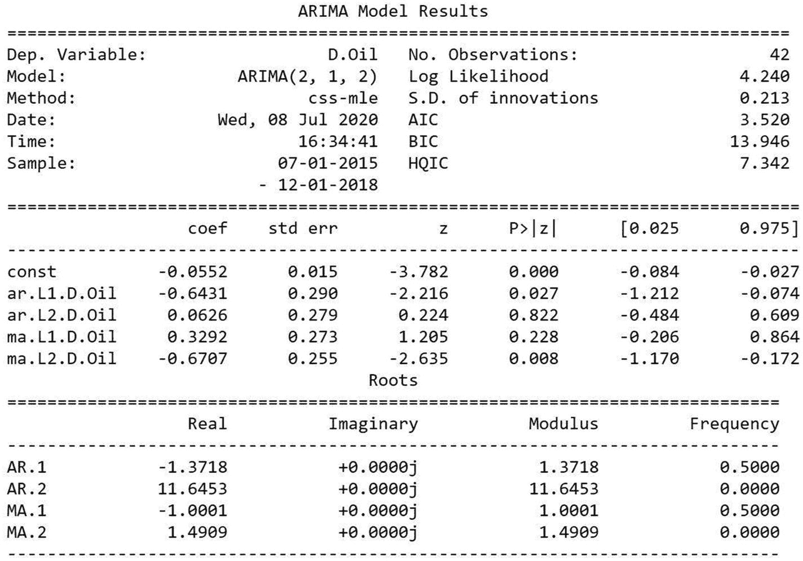

图 6-14

ARIMA 模式的结果摘要

很难将表格中的结果可视化，因此需要对残差和*核密度估计* (KDE)进行更深入的分析。残差和 KDE 的分析结果分别如图 [6-15](#Fig15) 和图 [6-16](#Fig16) 所示。在残差图中，大多数残差点位于值 0 附近。KDE 图显示了残差的高斯分布。这些图显示了预测的良好性能。

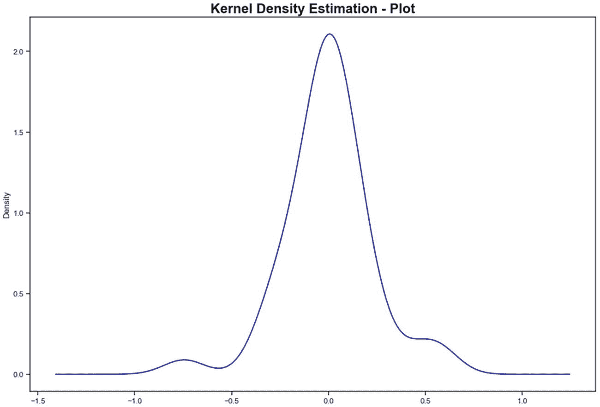

图 6-16

KDE 绘图

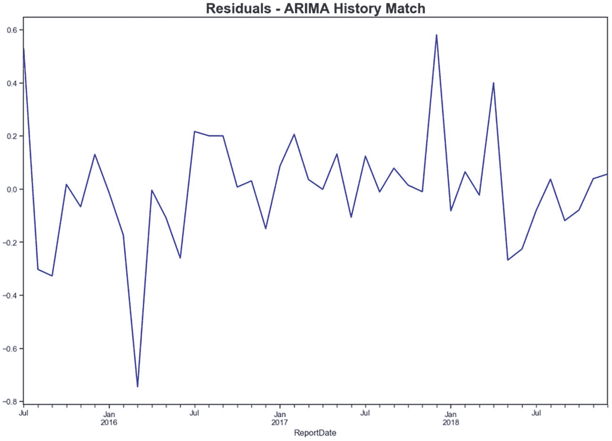

图 6-15

残差图

基于时间序列的 ARIMA 模型的历史拟合结果对石油产量进行了预测，另一年的预测如图 [6-17](#Fig17) 所示。该图还显示了 95%置信区间的窗口。

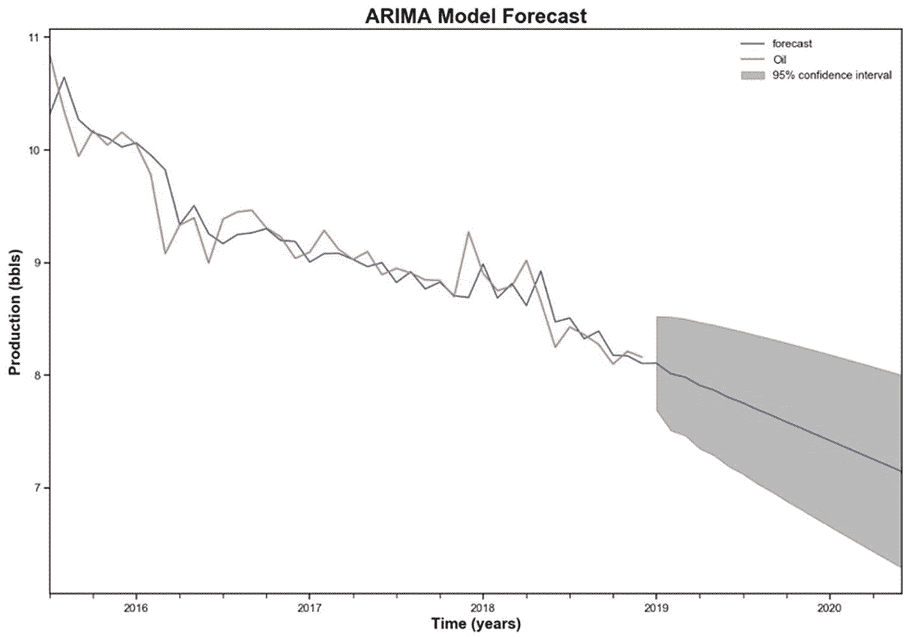

图 6-17

使用 ARIMA 模型对生产数据进行历史拟合和预测

与使用 Arps 下降曲线的过程类似，使用 2019 年的数据作为测试数据。将 ARIMA 模型的预测结果与实际值进行比较，使用以下代码片段将 RMSE 作为准确性指标。验证曲线如图 [6-18](#Fig18) 所示。

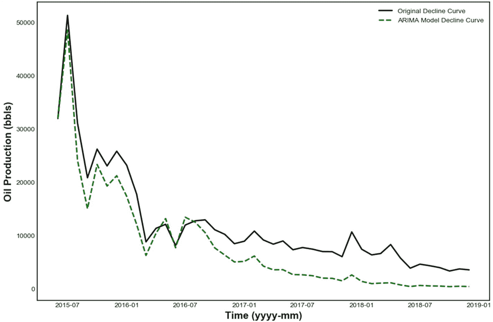

图 6-18

使用 ARIMA 模型对生产数据进行历史拟合和预测

```py
from sklearn.metrics import mean_squared_error
from math import sqrt
rmse = sqrt(mean_squared_error(actual, forecast))
print("RMSE - ARIMA Method:", rmse)

RMSE - ARIMA Method: 4141.44 bbls

```

## 摘要

本章讨论了两种不同的产量预测方法，即 Arps 和 ARIMA。北达科他州一口井的生产数据被用作一个例子；这条信息是从一个公共网站上搜集来的。使用 Arps 方法的递减曲线分析是油藏工程领域中使用的常规预测形式。使用 ARIMA 的基于时间序列的方法是面向统计的，并且为生产预测问题提供了机器学习的味道。这两种方法的应用表明了其解决问题的有效性。我们鼓励您在日常生产预测中应用这些方法。

## 参考

[1] C. I. Noshi，“数据科学和机器学习算法在西德克萨斯州机械钻速优化中的应用:将数据转化为知识”，海洋技术会议，德克萨斯州休斯顿，2019 年。

[2] A .马拉纳、j .帕帕、M. V .费雷拉、k .米乌拉和 F. A .托雷斯，“通过钻屑返回分析检测钻井问题的智能系统”，IADC/美国石油工程师协会钻井会议和展览，路易斯安那州新奥尔良，2010 年。

[3] S. Tandon，“整合机器学习以识别非常规地层中的最佳位置”，美国石油工程师协会西部地区会议，加利福尼亚州圣何塞，2019 年。

[4] S. Vallabhaneni、R. Saraf 和 S. Priyadarshy，“基于机器学习的岩石物理性质建模”，欧洲石油工程师协会在 2019 年英国伦敦第 81 届 EAGE 会议和展览上发表。

[5] C. Onwuchekwa，“机器学习思想在油藏流体性质估计中的应用”，SPE 尼日利亚年度国际会议和展览，尼日利亚拉各斯，2018 年。

[6] F. A. Anifowose，“整体机器学习:石油储层表征计算智能的最新发展”，美国石油工程师协会沙特阿拉伯分会技术研讨会和展览，沙特阿拉伯 Al-Khobar，2013 年。

[7] V. Gaganis 和 N. Varotsis，“加速成分油藏模拟的机器学习方法”，欧洲石油工程师协会/EAGE 年会，丹麦哥本哈根，2012 年。

[8] M. Pennel、J. Hsiung 和 V. Putcha，“使用机器学习模型检测人工举升中的故障并优化性能”，美国石油工程师协会西部地区会议，加利福尼亚州花园林，2018 年。

[9] D. Castiniera、R. Toronyi 和 N. Saleri，“用于钻井和完井数据自动分析的机器学习和自然语言处理”，沙特阿拉伯王国 SPE 年度技术研讨会和展览，沙特阿拉伯达曼，2018 年。

[10] A. Rastogi 和 A. Sharma，“使用机器学习量化压裂化学品对生产性能的影响”，美国石油工程师协会富液盆地会议——北美，德克萨斯州敖德萨，2019 年。

[11] D. Fu，“用数据分析、机器学习和人工智能解锁非常规油藏”，*《石油技术杂志》，*第 14–15 页，2019 年 1 月。

[12] S. Mohaghegh，“人工智能和机器学习在传统和非传统戏剧中的使用有何不同？、“*石油天然气上游的数据科学与数字工程，*2019 年 10 月 7 日。

[13] Q. Cao、R. Banerjee、S. Gupta、J. Li、W. Zhou 和 B. Jeyachandra，“使用机器学习的数据驱动生产预测”，SPE 阿根廷非常规资源勘探和生产研讨会，阿根廷布宜诺斯艾利斯，2016 年。

[14] M .瓦萨洛、g .贝纳斯科尼和 v .兰帕，“使用神经网络进行钻头弹跳检测”，SEG 年会，科罗拉多州丹佛市，2004 年。

[15] A. Rastogi，K. Agarwal，E. Lolon，M. Mayerhofer 和 O. Oduba，“揭开多元生产分析的数据驱动神经网络的神秘面纱”，非常规资源技术会议，科罗拉多州丹佛，2019 年。

[16] J. Lowell 和 G. Paton，“深度学习在地震层位解释中的应用”，SEG 国际博览会和年会，加利福尼亚州阿纳海姆，2018 年。

[17] J. Sun，X. Ma 和 M. Kazi，“递减曲线分析 DCA 与递归神经网络 RNN 对多口井产量预测的比较”，美国石油工程师协会西部地区会议，加利福尼亚州花园林，2018 年。

[18] V. Elichev、A. Bilogan、K. Litvinenko、R. Khabibullin、a .阿尔费罗夫和 A. Vodopyan，“用机器学习理解油井事件”，俄罗斯石油工程师协会俄罗斯石油技术会议，俄罗斯莫斯科，2019 年。

[19] M. Aliahmadi 和 Z. Chen，“通过岩石物理测井估算油藏渗透率和孔隙度的机器学习方法对比”，*《石油》，*第 5 卷第 3 期，第 271–284 页，2019 年。

[20] R. Gharbi 和 A. M. Elsharkawi，“用于估算中东原油 PVT 性质的神经网络模型”， *SPE 油藏评价&工程，*第 2 卷，第 03 期，1999 年。

[21] T. Jobe 和 E. Vital-Brazil，“使用基于图像的机器学习进行地质特征预测”，*《岩石物理学》，*第 59 卷，第 06 期，2018 年。

[22] H. Maniar、S. Ryali、M. Kulkarni 和 A. Abubakar，“地球科学中的机器学习方法”，SEG 国际博览会和年会，加利福尼亚州阿纳海姆，2018 年。

[23] D. Han、S. Kwon、H. Son 和 J. Lee，“使用机器学习和递减曲线分析对瞬变流中的页岩气井进行产量预测”，SPE/AAPG/SEG 亚太非常规资源技术会议，澳大利亚布里斯班，2019 年。

[24] Y. Li 和 Y. Han，“基于机器学习的产量预测递减曲线分析”，SPE 研讨会:产量提高和成本优化，马来西亚吉隆坡，2017 年。

[25] A. Rastogi 和 W. J. Lee，“非常规油藏产量预测典型井的建造方法”，非常规资源技术会议，德克萨斯州圣安东尼奥，2015 年。

[26] A. Vyas、a .达塔-古普塔和 s .米什拉，“使用机器学习技术模拟非常规油藏的早期递减率”，阿布扎比国际石油展览会和会议，阿联酋阿布扎比，2017 年。

[27] A. Suhag、R. Ranjith 和 F. Aminzadeh，“使用经验方法和人工神经网络进行页岩油产量预测的比较”，美国石油工程师协会年度技术会议和展览，德克萨斯州圣安东尼奥，2017 年。

[28]《传统递减分析理论》，[在线]。可用: [`http://www.fekete.com/SAN/WebHelp/FeketeHarmony/Harmony_WebHelp/Content/HTML_Files/Reference_Material/Analysis_Method_Theory/Traditional_Decline_Theory.htm`](http://www.fekete.com/SAN/WebHelp/FeketeHarmony/Harmony_WebHelp/Content/HTML_Files/Reference_Material/Analysis_Method_Theory/Traditional_Decline_Theory.htm) 。

[29]“北达科他州石油和天然气部门”，[在线]。可用: [`https://www.dmr.nd.gov/oilgas/`](https://www.dmr.nd.gov/oilgas/) 。

[30] J. Arps，“递减曲线分析”，*《AIME 汇刊》，*第 160 卷第 01 期，1945 年。

[31]“NumPY 和 Scipy 文档”，[在线]。可用: [`https://docs.scipy.org/doc/`](https://docs.scipy.org/doc/) 。

[32] B. Nau，“平稳性和差分”，[在线]。可用: [`https://people.duke.edu/~rnau/411diff.htm`](https://people.duke.edu/%257Ernau/411diff.htm) 。

[33] J. Brownlee，“如何用 Python 检查时间序列数据是否平稳”，2016 年 12 月。【在线】。可用: [`https://machinelearningmastery.com/time-series-data-stationary-python/`](https://machinelearningmastery.com/time-series-data-stationary-python/) 。

[34] I. Pardoe，“自相关和时间序列方法”，[在线]。可用: [`https://online.stat.psu.edu/stat462/node/188/`](https://online.stat.psu.edu/stat462/node/188/) 。

[35] D. Abugaber，“利用 ARIMA 进行时间序列分析”，[在线]。可用: [`https://ademos.people.uic.edu/Chapter23.html`](https://ademos.people.uic.edu/Chapter23.html) 。

[36] J. Brownlee，“如何用 Python 创建时间序列预测的 ARIMA 模型”，[在线]。可用: [`https://machinelearningmastery.com/arima-for-time-series-forecasting-with-python/`](https://machinelearningmastery.com/arima-for-time-series-forecasting-with-python/) 。

[37] K. Perry，“使用季节性 ARIMA 模型的时间序列预测:Python 教程”，[在线]。可用: [`https://techrando.com/2020/01/04/time-series-forecasting-using-a-seasonal-arima-model/`](https://techrando.com/2020/01/04/time-series-forecasting-using-a-seasonal-arima-model/) 。