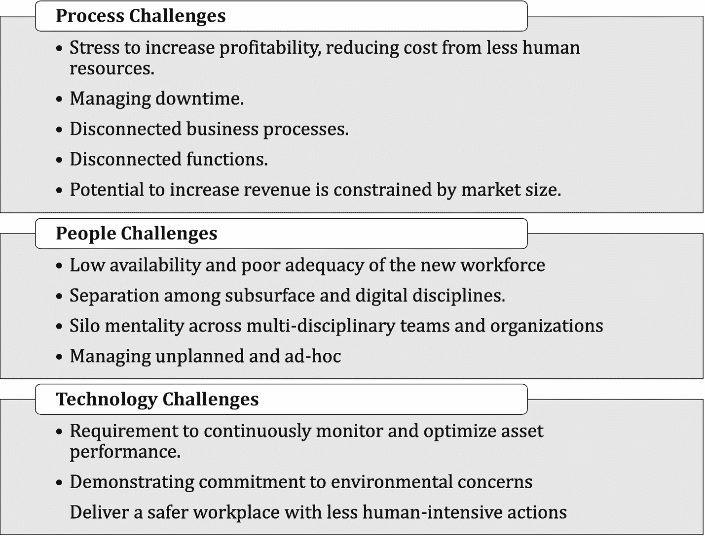
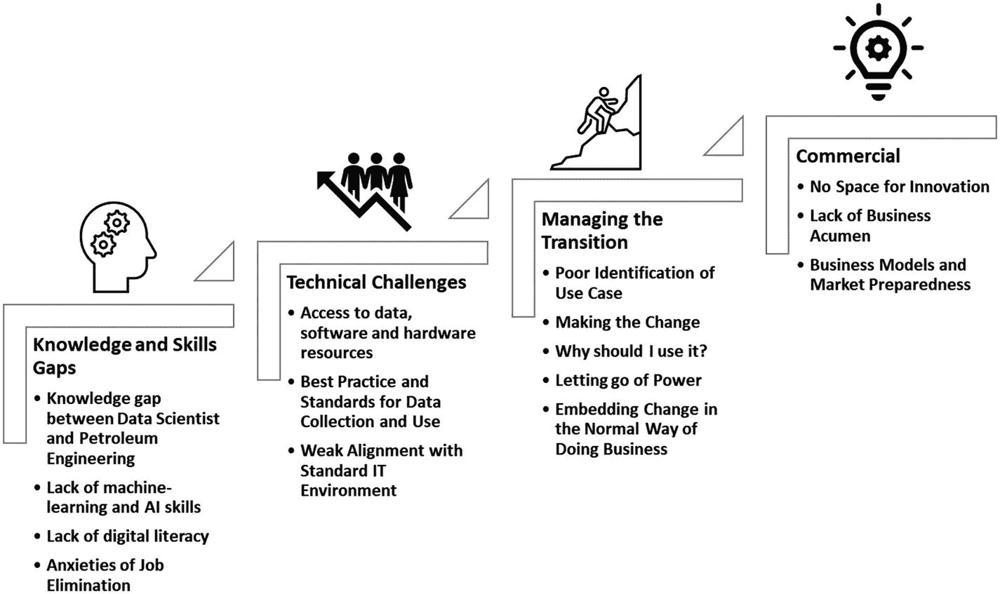
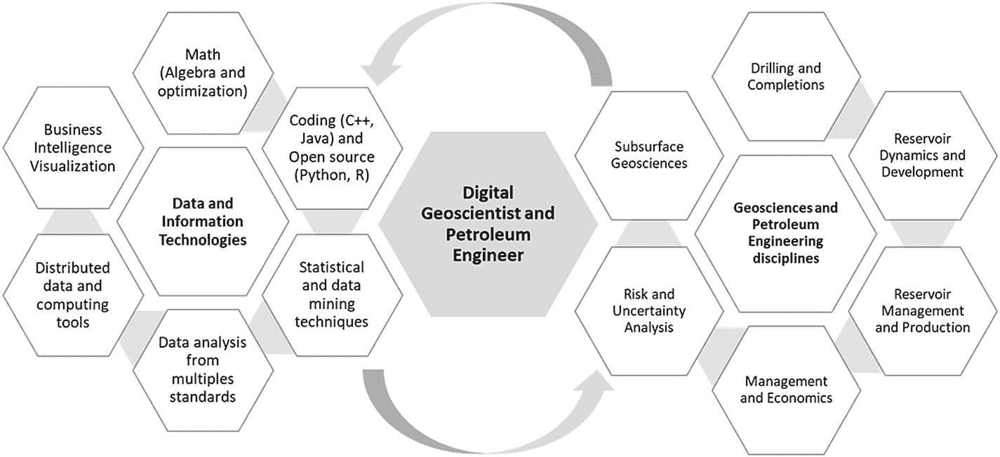

# 八、机遇、挑战和未来趋势

在未来三十年(2020 年至 2050 年)，人均国内生产总值(GDP)预计将平均每年增长 2%至 4%。由于许多制造基地向非洲、南亚和印度转移，非经合组织国家的增长将是经合组织国家的两到四倍。石油和天然气行业将继续呈现增长时代。2018 年全球能源需求的一半以上由石油和天然气行业供应[ [1](#Par144) ]，并将在 2050 年前继续提供高达 50%的能源组合。这些增长估计是在 2020 年新冠肺炎疫情效应之前产生的。

然而，三个相互关联的挑战正困扰着石油和天然气行业:盈利能力、环境影响和替代能源；这些挑战限制了储量获取、产量增长和可持续性。

*   由于产能建设的能力大于需求的增长，商品价格和盈利能力往往会受到限制。在石油和天然气价格较高的时期(即高于 50 美元/桶)，更多的国家加速其带来高成本资源的潜力。无论全球价格趋势如何，低成本生产省份都能生存下来。为了以更低的单位成本发现、开发和生产，运营公司期望用更少的人力和技术资源获得更大的吞吐量。

*   石油和天然气行业被视为所有能源行业中的“害群之马”。碳氢化合物能源的可持续性会受到危害，除非该行业不断投资于减少其环境足迹，包括从更清洁的地面作业场所和更低污染的加工燃料。重复使用二氧化碳提高石油采收率提供了一种可持续发展的选择。

*   碳氢化合物主要用于工业部门、运输和发电。随着终端消费转向电力使用，几种替代能源(即太阳能、核能和风能)越来越受欢迎，以满足新消费者的激励性接入需求，不断降低单位成本和更清洁的选择。此外，经合组织和非经合组织国家的环境保护政策有利于太阳能、核能和水能。这种情况降低了全球需求的碳氢化合物组合的增长率。

在未来几十年，石油和天然气行业将重新定义自己，只有通过创新才能巩固其长期地位。石油和天然气 4.0 对传统油气行业的改造可能会改变未来 30 至 50 年的游戏规则；数字化可以为创新提供独特的基础，同时提高公众意识和人类生活质量。自动化和自动化的现场操作和办公流程可以降低成本，同时改善人们的生活和社会质量。

本章的目标是概述该行业在机器学习和人工智能应用方面的机遇和挑战。它还概述了各种使用案例和技术的预期未来趋势，这些案例和技术可能会决定未来三十年石油和天然气行业的发展方向。

## 应用机器学习的挑战和机遇

未来几十年，石油和天然气行业将面临许多挑战。这些可以从不同的角度列出:股东的角度(盈利能力和业务可持续性)、人们的幸福和效率、业务流程和技术(见图 [8-1](#Fig1) )。

从股东的角度来看，盈利性和可持续性是最普遍的目标。它们最终会受到价格、产品需求、净单位成本、安全性能、员工满意度和环境足迹的影响。从人的角度来看，共同的挑战指的是如何实现人的目标(例如，薪酬、发展和增长)以及人们如何为公司的目标做出贡献(例如，信息共享、创新、持续改进的心态、效率)。从业务流程的角度来看，公司部署了有效的方法来不断简化从发现、开发、生产和转化碳氢化合物的产品转化。

图 8-1

石油和天然气行业应用机器学习和人工智能的挑战和机遇

### 流程挑战和缓解措施

下面重点介绍了最相关的流程相关挑战和建议的缓解方案。

*   **挑战**:公司面临着不断增加的利润压力，主要是通过雇佣更少的人力资源来降低成本，同时导致比通常更长的工作时间和更不安全的工作场所。子孙后代将不得不用更少的资源做更多的事情，从而在单位时间内产生更多的成果，降低单位成本。

    **Mitigation Options**
    *   使用自动化操作实现钻井现场操作自动化，并利用高级数据分析进行事件检测，重点关注异常关键事件(如卡钻和井漏)。

    *   自动化生产监控，增加井场参数的连续数据分析，同时通过基于异常的监控(EBS)实现常规油井分析，重点关注关键油井状态。

    *   在关注高附加值活动[ [2](#Par145) ]的同时，实施油井和油藏动态分析，以主动识别机会。

    *   人工智能辅助复杂决策，提供自动化的日常行动建议。

*   **挑战**:管理停机时间。石油和天然气生产能力的一个关键组成部分是设施关闭的时间以及设施无法发挥其预期潜力的情况。一个关键的挑战是保持这些时期尽可能低和可预测的。意外的停机时间可能会大大降低机组的运行成本。

    **Mitigation Options**
    *   实施数据分析和业务流程，以预测计划外事件、跟踪停机时间、生产损失(又称*生产延期*)以及计划内和计划外停机时间的原因。

    *   实施事件分类，以便对所有计划外停机事件进行根本原因分析(RCA)。

*   **挑战**:不连贯的业务流程，以及职能组织设计中的困难，这是由筒仓思维带来的挑战造成的。对于一些综合性的石油和天然气公司来说，关键业务流程通常在跨职能部门之间以及在职能部门内部是不连贯的。

    **Mitigation Options**
    *   跨职能实施 KPI，并使用业务分析仪表板在组织的多个级别上共享它们。

    *   定义跨职能部门共享的关键角色和职责，并共享它们。

*   **挑战**:在上游层面，生产作业、油藏管理、油田开发和钻井通常是不相关的职能。这阻碍了全球优化提高企业绩效的机会。修复高产水井好还是钻新的排水管好？

    **Mitigation Options**
    *   实施综合油井性能提升机会识别和排序流程，该流程涉及着眼于短期和长期目标的多目标约束全局优化目标函数。

    *   基于利用深度学习的集成右物理学方法的更快、更可靠的预测。

*   **挑战**:在企业层面，上游和下游有着非常不同的 KPI。尽管原油销售利润更高，但增加收入的潜力通常受到市场规模的限制；因此，增加利润的选择是在不损害上游义务的情况下，使下游产品的收入最大化。

    **Mitigation Options**
    *   实施企业级规划和调度流程，包括着眼于短期和长期目标的多目标约束全局优化。这包括使用无梯度方法和先进的进化优化技术。

### 人员挑战和缓解措施

以下强调了最相关的人员相关挑战和建议的缓解方案。

*   **挑战**:新劳动力的低可用性和不充足性强化了可持续发展目标。年轻的专业人员可能不具备应对即将到来的挑战所需的能力水平，需要很长时间接受培训。

    **Mitigation Options**
    *   在本科和研究生课程中加入混合教学大纲。

    *   提供公共数据集，让学生和研究社区熟悉典型数据集，为标准分析和机器学习问题设定行业预期。

    *   实施*企业文档管理* (EDM)和利用*自然语言处理* (NLP)的知识搜索，通过更好的技术信息共享和知识利用来优化资源利用。

    *   实现一个机器人工程师助理:聊天机器人访问大型知识库，支持自然语言处理和语音识别。

    *   让新一代更快地了解什么是最重要的(例如，创建侧重于机器学习和数据分析的石油和天然气本科项目)。

*   **挑战**:地下和数字学科的分离。通常情况下，大多数工程和地质学科，特别是那些最有油田头脑的人，缺乏解决涉及数据和过程自动化问题的数字方向。

    **Mitigation Options**
    *   为新员工实施涵盖石油和天然气行业机器学习和人工智能关键方面的短期在职培训计划。

    *   促进技术和数字专业之间的交叉发布项目。

*   挑战:管理跨多学科团队和组织的筒仓心态是一个跨行业的老挑战[ [3](#Par146) ]。在这种情况下，个人和团队缺乏共同目标，阻碍了他们共享关键数据和信息。这种心态最终影响效率和员工士气。

    **Mitigation Options**
    *   实施协作项目管理，提供对正在进行的工作的可见性。

    *   奖励团队合作，支持那些引领新思想的人，分享经验教训的人，以及保护和分享知识的人。

    *   为知识共享和创意培育提供环境。

*   挑战:管理计划外的和临时的工作需要人们偏离他们原来的职责，因此偏离了公司的目标。如果这成为正常的工作方式，那么就存在错误的功能设计和/或可用的(人力)资源在数量和质量上都不够。

    **Mitigation Options**
    *   实施数据分析和业务流程，以跟踪临时工作以及计划内和计划外停机的原因。

### 技术挑战和缓解措施

下面重点介绍了最相关的技术挑战和建议的缓解方案。

*   **挑战**:持续管理(监控、优化和控制)资产绩效的要求。油气生产需要对储层、油井和设施的持续了解；然而，这些需要用有限的资源来实现，这些资源只能看到操作的一小部分。这是因为缺少能够深入了解过程状态的传感器和技术。

    **Mitigation Options**
    *   实施数据分析和业务流程，以自动化资产*基于异常的监控* (EBS)，重点关注关键油井状态。

    *   考虑到不确定性，实施机器学习模型以持续搜索最佳资产运营范围。

    *   实现一个自动化的人工智能辅助的复杂决策引擎，并提供自动化的日常行动建议。

*   挑战:展示对环境问题的承诺，同时为股东提供最大回报。

    **Mitigation Options**
    *   通过永久性仪器处理实现常规 HSE 检查，通过数字图像处理实现视频监控，包括无人机和卫星图像，以及通过人机交互实现机器人技术，关注关键事件。

    *   实施涉及多目标约束优化目标函数的分析流程，寻找更好的燃料和有利可图的产品。

*   **挑战**:用更少的人力操作和决策流程提供更安全的工作场所。让运营和流程以极高的可用性全天候运行，减少人力需求。

    **Mitigation Options**
    *   自动化生产监控和油田作业

    *   支持常规 HSE 检查，包括在关键区域使用连接的可穿戴安全设备

    *   实现常规动作的自主和远程控制:节流、气举、频率等

## 采用机器学习的障碍

这些障碍可能在任何机器学习和人工智能项目执行之前、期间和之后发挥作用(见图 [8-2](#Fig2) )。这些障碍，当被正确识别时，将被减轻，因为它们危及可持续性，并可能在项目执行的任何一点扼杀这个想法。它们是从经验和各种参考文献中获得的。

### 知识和技能差距

理解人际技能的差距对于机器学习和人工智能解决方案的可持续实施至关重要。多学科知识差距、缺乏机器学习和人工智能技能、数字素养以及对失业的焦虑是这些技术在行业中更广泛采用的一些障碍。

#### 数据科学家和石油工程师之间的知识鸿沟

石油工程是一门科学，常常被迫在几乎没有可用数据的情况下做出决策；这为统计、不确定性管理和分析创造了大量的知识。然而，上游的现代机器学习和高级数据分析技术仍处于起步阶段。

此外，拥有高级数据科学技能的个人可能不太熟悉石油和天然气行业的工程实践。

减轻这一挑战的方法是让人们了解这两个领域，并进行跨领域培训。

图 8-2

在石油和天然气行业采用机器学习和人工智能的障碍

#### 缺乏机器学习和人工智能技能

石油和天然气专业人员没有接受过处理高级机器学习和人工智能技术的常规培训。正如历史上在许多运营商和服务公司看到的那样，一小部分专业人员选择自学来解决新技术的应用问题。这在机器学习和人工智能中没有什么不同，只有少数人能够理解这种技术的完整应用。

缺乏机器学习技能是一个关键障碍，它阻碍了组织充分利用其数据的价值。

新劳动力的低可用性和不充分性强化了行业可持续性目标。年轻的专业人员可能不具备应对即将到来的挑战所需的能力水平，需要很长时间接受培训

在降低成本和人力的压力下，需要招聘不同类型的员工或更多利用人工智能应用的新型或新一代劳动力。

#### 缺乏数字素养

石油工程师和管理专业人员可以应付数量有限的数字知识。然而，在谈论机器学习和人工智能时，个人需要有更广泛的词汇，对计算机和数字系统知识的更深入了解。这涉及到如何建立一个数字解决方案的一般知识，包括它的所有组成部分:定义问题目标、用例、算法、工作流程、数据以及硬件和软件需求。

将机器学习和人工智能解决方案扩展到更广泛的基于用户的生产环境是一项更复杂的任务。我们相信，新一代将具备更多的数字素养和能力，在数字世界中吸收更多的数据。

新一代将适应并要求更多数据驱动的应用程序。

#### 对失业的焦虑

从历史上看，所有的工业革命都意味着某种形式的劳动力适应其他技能要求。

正如技能差距所确定的那样，人们真的担心有一天机器会变得超级智能，由机器学习和人工智能引领的数字化转型将大规模消除就业岗位。这进一步造成了对机器学习和人工智能应用的负面反应。

### 技术挑战

在技术方面，随着时间的推移，一些障碍可以很容易地消除，这包括对机器学习资源(数据、软件和硬件)的访问，缺乏数据使用的最佳实践，以及 IT 环境的一致性。

#### 访问数据、软件和硬件资源

石油和天然气行业可能没有在其大多数运营中运行高级数据分析所需的基础架构。数据通常存放在不被利用的地方(例如，在几乎不知道如何使用数据的现场作业中)。

网络安全制约也是一个障碍；它会导致项目延迟，直到公司 it 人员完全理解数据操作工作流。限制性太强的 IT 政策阻碍了用户协作和分享关于机器学习应用的知识。这些政策还阻止用户下载和执行开源软件和编程语言，如 R 和 Python。

#### 数据收集和使用的最佳实践和标准

虽然有许多用于机器学习和人工智能应用的开源资源，但没有既定的最佳实践，也没有收集和使用数据的标准操作程序。

#### 与标准 IT 环境的一致性差

尽管许多软件资源都是开源的，但缺乏支持机器学习和人工智能应用的企业 IT 环境通常是新计划推出时的一个问题。

尽管越来越多的商业解决方案允许从创新到软件开发和生产环境(DevOps)的轻松过渡，但仍然存在与现有遗留应用程序接口的问题，并且需要从企业架构的角度维持解决方案[ [4](#Par147) ]。

### 管理过渡

恰当地管理变化可以让我们成为赢家。这些过渡元素包括对用例的正确识别、改变现状、提供为什么我们应该接受它的背景、放弃权力，以及将解决方案嵌入现有的业务流程。

#### 用例识别不佳

识别新解决方案试图解决的问题是任何新应用程序开发项目的关键步骤。对所需用例的不良识别可能会破坏机器学习应用程序开发的成果，并给团队带来挫折。

#### 做出改变

处于舒适区使得新应用程序很难进入市场并取代传统应用程序。动摇现状使得创新应用更难进入主流。

#### 心理因素:我为什么要用？

一系列心理因素会影响任何新技术的采用。这些因素包括僵化的思维模式、风险规避、早期采用者的犹豫、缺乏信任、非发明的态度、嫉妒、社会规范、以前的经验和组织层面的因素，如领导和文化。

研究表明，对自动化的显性信任倾向和隐性态度并不显著相关[ [6](#Par149) ]。因此，考虑到与机器学习和人工智能的类比，心理因素的组合阻止了新应用的采用。

#### 放下权力

人工智能应用以更加民主化的方式使用数据，包括在整个组织中分发数据见解，这可能会危及许多个人的权力地位。保持对特定数据集的控制是各行各业普遍存在的弊端。

#### 在正常的经营方式中嵌入变革

一个挑战是管理这些新应用程序可能对组织带来的变化。

改变的管理有两种类型:(1)改变已经存在的过程的新的机器学习应用，并且它只是使它更有效；以及(2)创建全新流程的新应用程序。在这两种情况下，确定的用例应该清楚地定义新应用程序交付价值的业务流程和治理。

### 商业壁垒

组织在商业方面面临障碍，因为没有为创新留下空间，缺乏商业头脑，缺乏适当的商业模式和市场准备来创造供应商和客户之间的双赢局面。

#### 没有创新的空间

运营商通常负责运营和维护预算，他们被迫将预算保持在较低水平并在目标范围内。另一方面，运营商可能没有任何动力去开发一个能极大改变他们工作方式的新应用。这阻碍了机器学习/人工智能技术应用的任何创新机会，而这些机会最终可能会增加底线的价值。

#### 缺乏商业头脑

没有足够强大的增值案例来支持新应用程序的资本支出。通常，工程师和经营者缺乏制定商业案例的金融头脑。

此外，很难建立适当的成功衡量标准，也很难根据可量化的生产或收入收益来定义财务回报目标。

因此，组织可能没有准备好适当的预算项目，这使他们能够追求机器学习项目。

#### 商业模式和市场准备

因为机器学习和人工智能应用程序是新的市场产品，所以不是所有的软件供应商都完全了解他们的工具/解决方案的商业模型应该是什么样子。

这可能包括关于按席位收费与按资产收费、固定费用与无偿服务、永久服务与租赁、事务计数与 CPU/GPU 计数、批量折扣等的对话。

这些对话可能会在技术供应商和客户之间产生冲突，这可能会引发长时间的讨论，有时会破坏关系。

## 通过机器学习和人工智能实现石油和天然气行业的数字化转型

如果各种因素成为现实，机器学习和人工智能可能会实现石油和天然气行业的数字化转型，这些因素包括机器学习/人工智能专业中更多有才华的人，扩展的井场传感能力，可穿戴设备的使用增加，更好的法规的实施，以及政府组织中人工智能工具的使用增加。

### 人际技巧

在石油和天然气行业的某些领域，机器无法轻易取代人工。未来的石油工程师从传统的世俗任务中解脱出来后，将需要更多地关注创造性工作，包括创新的多孔介质开采机制、碳氢化合物在社会中的角色的突破性商业模式、环保材料的新用途、成本效益高的设施寿命延长选项等等。

#### 未来的人才需求

在未来，由数字化、分析和人工智能推动的油气行业将需要更加复杂和创新的思维和技能。这将支持从多个领域获取分析见解。总体而言，它有望提供一个更安全、更有利可图的行业，让员工的工作时间更少，工作和个人生活更平衡。

在应对当今的数字世界时，能源专业人员将掌握一系列技能，包括计算升级、系统维护和数据处理，从探索性数据分析到基于例外的监控规则编程(见图 [8-3](#Fig3) )。

图 8-3

未来的数字地球科学家和石油工程师

### 促进机器学习进一步发展的因素

一些有贡献的技术和法律框架可能会极大地改变石油和天然气行业采用机器学习和人工智能的方式。这些为机器学习创造了额外的机会，并在井和储层建模和解释方面开辟了新的范例。

#### 油井和储层传感技术

未来传感技术的可用性增加，包括沿井眼和井眼外的声学和电磁技术，将能够在时间和空间上跟踪饱和度和压力变化。这将为数据分析和人工智能开辟新的挑战性途径。

#### 利用社交和人类传感器收集大量数据

在大规模无线传感器方面，石油和天然气行业落后于其他行业(如金融、医疗和营销)。这些传感器可能来自各种来源:连接的可穿戴设备、社交网络、多域协作或任何物联网(Internet-of-Things)设备网络。

#### 人工智能中的决策

随着机器学习和人工智能在社会和企业中扮演越来越多的角色，政府和组织制定政策的需求变得更加明显。政府政策和全球合作协议可以大大加快(或减缓)机器学习和人工智能在社会各个层面的进步和采用，包括卫生、食品、服务、能源、交通和教育。

#### 政府组织采用人工智能

政府在采用人工智能方面面临着众多挑战，包括有效利用数据、人员技能、人工智能生态系统、传统文化和采购机制。然而，政府(如阿联酋)人工智能采用率的变化可能会对石油和天然气行业的机器学习/人工智能的发展产生巨大影响。公民满意度和政府采纳率之间有很大的相关性[ [10](#Par153) ]。

### 机器学习和人工智能技术承诺

毫无疑问，机器学习和人工智能在过去十年里取得了指数级的进步。这种加速的步伐表明，相关的科学和技术在未来十年也将继续发展。

人工智能将在我们的日常生活中扮演正常的角色，包括石油和天然气行业。人工智能将在解决未来十年的关键工程挑战中发挥关键作用[[14](#Par157)]；特别是，它将解决钻井[ [15](#Par158) ]、生产和油藏工程中的许多挑战。

#### 深度学习

机器学习模型的性能随着数据可用性的提高而提高。深度神经网络有潜力利用更多数据。以下是深度学习应用的例子。

*   自动化钻井作业需要对时间序列数据进行正确的事件分类。与基于 CNN 的推理模型并行的基于语义分割的离线模型可以在实时钻井分析系统中以 99%的准确度分类和预测钻机状态[ [16](#Par159) ]。

*   由于机器学习和人工智能辅助的复杂事件检测，水力压裂作业持续改善。这些事件包括断裂阶段开始和结束、球座操作识别和泵速周期分类。一个基于 CNN 和 U-Net 架构的深度学习应用提供了水力压裂事件的实时自动解释[ [17](#Par160) ]。

*   测井解释通常被认为是一项耗时的任务，主观结果给油藏研究增加了不必要的不确定性。使用多种建模技术(即用于监督分类的模型叠加)的自动化岩石物理解释看起来有希望减少地下模型研究时间周期并提高预测质量[ [18](#Par161) ]。

*   碳氢化合物检测、井位、地下导航以及最终优化油田开发成本都需要从钻屑的视觉检查中识别岩性和流体。然而，这样的任务通常被认为是低附加值的，因为它依赖于主观的解释。近年来，在该领域中，使用 CNN 进行视觉识别已经变得流行。

*   使用深度学习技术[ [19](#Par162) ]实现了对钻机现场的切割量进行实时分类。在将每个视频帧输入分类模型之前，进行归一化和主成分分析(PCA)。

*   钻屑图像分类是困难的，因为图像类别之间有很大的相似性。贝叶斯优化的 CNN 集成优于其他已知方法，特别是在给定巨大的参数空间[ [20](#Par163) ]的情况下。

#### 强化学习

强化学习(RL)在有大量数据的地方有巨大的潜力。RL 渴望数据。根据油井数据[ [21](#Par164) ]使用深度强化学习提出了注水优化的应用。人工智能代理可以通过使用压力和相位监控等可用数据来了解储层行为。训练有素的代理可以预测他们制定的策略的变化如何影响目标函数。

#### 多物理模型

从离散裂缝模型(DFM)生成等效连续体模型的传统基于静态和基于流动的尺度提升方法精度低，计算成本高。在石油和天然气行业，运行速度与数据驱动模型一样快的详细流体流动模型一直备受关注，具有重要价值。一种基于物理学的深度学习方法，用于对断裂介质构建的等效连续介质模型的高分辨率图像进行升级[ [22](#Par165) ]。

#### 人工智能的未来

由于人工智能处理信息的编程能力，在未来，人工智能将提供更多的上下文信息[ [23](#Par166) ](见表 [8-1](#Tab1) )。

表 8-1

人工智能的各种浪潮(在[ [23](#Par166) ]之后)

<colgroup><col class="tcol1 align-left"> <col class="tcol2 align-left"> <col class="tcol3 align-left"> <col class="tcol4 align-left"></colgroup> 
| 

主 AI 波

 | 

第一波(< 2000 年)

 | 

第二波(过去十年)

 | 

第三次浪潮(未来)

 |
| --- | --- | --- | --- |
| 

形容

 | 

将…进行分类

 | 

解释

 |
| --- | --- | --- |
|   | 手工知识 | 统计学习 | 语境适应 |
| 主要范围 | 人类定义的知识结构；算法探索的细节 | 特定问题领域的统计模型，根据数据进行训练 | 现实世界现象类别的上下文解释模型 |
| 能力 | 能够对狭义定义的问题进行推理没有学习能力，不确定性处理能力差 | 细微的分类和预测能力没有语境能力和最低限度的推理能力 | 推动决策的模型该模型生成对测试角色可能如何被创建的解释 |

#### 可解释的人工智能

随着机器学习/人工智能模型性能的提高，理解和解释它们变得越来越困难。可解释 AI 的目标是生成自我解释的机器学习模型，这些模型具有同等的优越性能(即预测的高准确性)，同时使个人能够理解和信任这些模型[ [24](#Par167) ]。

#### 计算语言学家

计算语言学家关注自然语言的统计或基于规则的建模。实现超人类水平的人工智能，依赖于直接阅读自然语言文本的文档的能力[ [25](#Par168) ]。

考虑到人工智能辅助对话引擎在石油和天然气行业的兴起(例如 Nesh [ [26](#Par169) ]、Sandy [ [27](#Par170) 、Willow [ [28](#Par171) ]以及其他[ [29](#Par172) ])，有理由相信自然语言处理将在未来十年的机器学习和人工智能应用的发展中发挥关键作用。

#### 重点举措

有时采取煮沸海洋的方法会导致沮丧和过早的幻灭。同时追求太多的计划，并试图证明所有计划的价值可能会导致没有结果。然后，建议将重点放在几个计划上，并尝试在有限的范围和短时间内证明其价值。在奖励得到确认并在利益相关者之间传达后，将有更大的动力推进更大块的工作。

#### 数据作为资产

没有大型数据库，就不容易构建强大的机器学习应用。因此，这将仅限于少数公司，除非行业决定共享公开的有意义的数据集(例如，挪威 Volve 油田数据集)，以合作和建立强大的应用程序。即使是大型服务公司或运营商也没有完整的数据集来了解油田作业的复杂性。这可能意味着降低供应链的成本，或者在油田出现从广告、供应商和公司赚钱的新业务。

#### 让更多的想法被采纳

机器学习和人工智能应用正在作为一种新的工程或科学方法出现。今天所做的很多事情都是寻找完美算法的实验步骤。石油和天然气公司刚刚开始花大力气开发数据驱动应用的蓝图。

在想法和概念验证阶段有许多计划；然而，只有少数想法将在小范围内进行试点，一小部分将作为主流产品推出。

与此同时，石油和天然气行业需要进行大量的反复试验。没有尝试，油气行业就不会取得其他行业取得的成就。为此，需要一种成长的心态。

也许有些想法还没有准备好，但是需要试错。

## 摘要

未来几十年，石油和天然气行业将继续在我们的社会中发挥关键作用，其可持续性取决于我们解决和缓解重要流程、人员和技术挑战的能力。

石油和天然气行业的“流程”挑战包括管理停机时间、互连其业务流程以及优化碳氢化合物价值链，从而为社会提供可持续的行业和安全的能源。

人员挑战包括解决持续问题的劳动力可用性低且不足，地下和数字学科之间的分离加剧了这一问题，管理跨多学科团队和组织的筒仓心态，以及优先处理计划外和临时工作。

与技术相关的挑战包括持续管理(监测、优化和控制)资产绩效的要求，展示对环境问题的承诺，同时为股东提供最大回报，并以较少的人力密集型行动和决策流程提供更安全的工作场所。

机器学习和人工智能技术应用在油气行业仍处于起步阶段；因此，对于年轻的专业人士来说，存在着巨大的发展机会。主要障碍包括知识技能和差距、技术挑战(包括缺乏标准和与传统 IT 的一致性差)以及变更(包括明确的用例定义和将变更嵌入到现有流程中)。

在商业方面，机器学习和人工智能技术仍然缺乏一个行业框架，在创新和可持续商业模式之间保持平衡。这不仅见于石油和天然气行业，而且遍及许多行业。

关键数字技术的发展将为石油和天然气行业的机器学习和人工智能技术开辟更好的道路，包括经济高效的井场传感器和通过可穿戴设备进行的海量数据捕获。

机器学习和人工智能核心技术的不断进步，包括深度学习和可解释的人工智能，是增强包括石油和天然气行业在内的许多行业可用性的关键因素，这将实现更具变革性和附加值的流程。

除了通过大型政府组织增加采用之外，针对机器学习和人工智能使用的政策制定将增强机器学习和人工智能在所有部门的使用。因此，它将为石油和天然气行业在未来几十年的发展提供氧气。

## 参考

[1]《能源展望》，美国能源信息署，2019 年 9 月 24 日。【在线】。可用: [`https://www.eia.gov/outlooks/ieo/`](https://www.eia.gov/outlooks/ieo/) 。

[2] G. Zang、L. Neuhofer、D. Zabel、P. Tippel、C. I. Pantazescu、V. Krcmarik、L. Krenn 和 B. Hachmö ller，“智能和自动化修井候选方案选择”，美国石油工程师协会智能能源国际会议和展览，英国苏格兰阿伯丁，2016 年。

[3] B .格里森，“筒仓心态:如何打破壁垒”，*福布斯*，2013 年 10 月 2 日。【在线】。可用: [`https://www.forbes.com`](https://www.forbes.com) 。

[4] C. Procaccini，“应用数据分析技术改善资产运营和维护:石油和天然气行业的数字景观研究”，2018 年 3 月 9 日。【在线】。可用: [`https://www.theogtc.com/media/2380/`](https://www.theogtc.com/media/2380/) 。

[5] R. Roberts 和 R. Flin，“释放潜力:了解影响上游石油和天然气行业技术采用的心理因素”， *SPE 期刊*，第 25 卷，第 1 期，第 515–528 页，2020 年 2 月 1 日。

[6]斯蒂芬妮·m·梅里特、希瑟·海姆博、詹妮弗和詹妮弗·拉查佩尔、狄波拉，“我信任它，但我不知道为什么:自动化系统中对自动化的隐含态度对信任的影响”，《人的因素:人的因素和人类工程学学会杂志》，第 55 卷，第 3 期，第 520-534 页，2013 年。

[7] T. Zhu，S. Xiao，Q. Zhang，和 Y. Gu，“大数据感知中的新兴技术:一项调查”，国际分布式传感器网络杂志，第 11 卷，第 10 期，2015 年。

[8] B. Perry 和 R. Uuk，“人工智能治理和政策制定过程:关键”，《大数据和认知计算》，第 3 卷，第 26 期，第 17 页，2019 年。

[9] J. Torres Santeli 和 S. Gerdon，“世界经济论坛”，2019 年 8 月 16 日。【在线】。可用: [`https://www.weforum.org/agenda/2019/08/artificial-intelligence-government-public-sector/`](https://www.weforum.org/agenda/2019/08/artificial-intelligence-government-public-sector/) 。

[10] M. Carraszo，S. Mills，A. Whybrew 和 A. Jura，“公民对人工智能在政府中使用的观点”，2019 年 3 月 1 日。【在线】。可用: [`https://www.bcg.com/publications/2019/citizen-perspective-use-artificial-intelligence-government-digital-benchmarking.aspx`](https://www.bcg.com/publications/2019/citizen-perspective-use-artificial-intelligence-government-digital-benchmarking.aspx) 。

[11] J. Markoff，“预测未来:特别报告:人工智能的快速发展”，2013 年 10 月 14 日。【在线】。可用: [`https://www.nytimes.com/2013/10/15/technology/the-rapid-advance-of-artificial-intelligence.html`](https://www.nytimes.com/2013/10/15/technology/the-rapid-advance-of-artificial-intelligence.html) 。

[12] S. Hansen，“对人工智能技术的未来有什么期待”，2019 年 4 月 5 日。【在线】。可用: [`https://hackernoon.com/what-to-expect-with-the-future-of-ai-technology-782aec311a54`](https://hackernoon.com/what-to-expect-with-the-future-of-ai-technology-782aec311a54) 。

[13] G. Templeton，“2027 年看起来正常的 25 个 AI 例子:从烹饪到约会再到艺术”，2017 年 5 月 15 日。【在线】。可用: [`https://www.inverse.com/article/31340-ai-machine-learning-list-change-life-decade`](https://www.inverse.com/article/31340-ai-machine-learning-list-change-life-decade) 。

[14]“未来十年的十大工程挑战”，*爱思唯尔*，【在线】。可用: [`https://www.elsevier.com/rd-solutions/industry-insights/other/10-major-engineering-challenges-of-the-next-decade`](https://www.elsevier.com/rd-solutions/industry-insights/other/10-major-engineering-challenges-of-the-next-decade) 。

[15] N. A. Nunoo，“客座社论:人工智能将如何有利于钻井？” *JPT* ，2018 年 5 月 1 日。

[16] Y. Ben、W. Han、C. James 和 D. Cao，“在实时钻井系统中构建通用和可持续的机器学习解决方案”，石油工程师学会，2020 年 2 月 25 日。

[17] Y. Shen、D. Cao、K. Ruddy 和 L. F. Teixeira de Moraes，“利用深度学习方法进行近实时水力压裂事件识别”， *SPE 钻井&完井*，第 35 卷，第 1 期，2020 年。

[18]袁，李，张，吴，王，“利用叠加机器学习技术自动解释常规测井储层”，国际石油技术会议，2020 年 1 月。

[19] X. Du，Y. Jin，X. Wu，Y. Liu，X. Wu，O. Awan，Z. Han，“使用深度学习技术通过视频流对页岩摇动器处的切割体积进行实时分类”。，“石油工程师学会。2020 年 2 月 1 日。

[20] M. Kathrada 和 B. J. Adillah，“使用卷积神经网络辅助储层表征的钻屑岩性视觉识别”，*《石油工程师学会杂志》*，2019 年 9 月。

[21] R. Miftakhov、A. Al-Qasim 和 I. Efremov，“深度强化学习:像素储层优化”，国际石油技术会议，2020 年 1 月。

[22] X. He、R. Santoso 和 H. Hoteit，“应用机器学习从高分辨率离散裂缝模型构建等效连续模型”，国际石油技术会议，2020 年 1 月。

[23] J. Launchbury，“DARPA 对人工智能的看法”，DARPA，2017 年 2 月 15 日。【在线】。可用: [`https://www.darpa.mil/about-us/darpa-perspective-on-ai`](https://www.darpa.mil/about-us/darpa-perspective-on-ai) 。

[24] M. Turek，“人工智能座谈会:可解释的 AI”，[在线]。可用: [`https://www.darpa.mil/program/explainable-artificial-intelligence`](https://www.darpa.mil/program/explainable-artificial-intelligence) 。

[25] J. McCarthy，“AI 需要从计算语言学中得到什么”，斯坦福大学，[在线]。可用: [`http://jmc.stanford.edu/index.html`](http://jmc.stanford.edu/index.html) 。

[26] hellonesh.io，《你好 nesh》，[在线]。可用: [`https://hellonesh.io/`](https://hellonesh.io/) 。

[27]贝尔蒙特技术公司，贝尔蒙特技术公司，[在线]。可用: [`https://www.b15y.io/`](https://www.b15y.io/) 。

[28] IBM，“IBM 伍德赛德威洛”，2018 年 8 月 12 日。【在线】。可用: [`https://youtu.be/BocVnDrmtZo`](https://youtu.be/BocVnDrmtZo) 。

[29]贝克休斯，“石油和天然气的人工智能能力”，2018 年 6 月 28 日。【在线】。可用: [`https://youtu.be/X9k-gLwDJ9g`](https://youtu.be/X9k-gLwDJ9g) 。

[30]世界经济论坛，“白皮书:数字化转型计划:石油和天然气行业”，2017 年。