# 2.Azure 上使用回归系数的客户端智能

让我们使用 Microsoft Azure 上的回归系数构建一个交互式 web 应用程序来了解自行车租赁需求。

对于我们的第一个项目，我们将使用回归建模对来自首都自行车共享系统的自行车共享数据集进行建模，并了解温度、风和时间等变量如何影响美国大西洋中部地区的自行车租赁(图 [2-1](#Fig1) )。

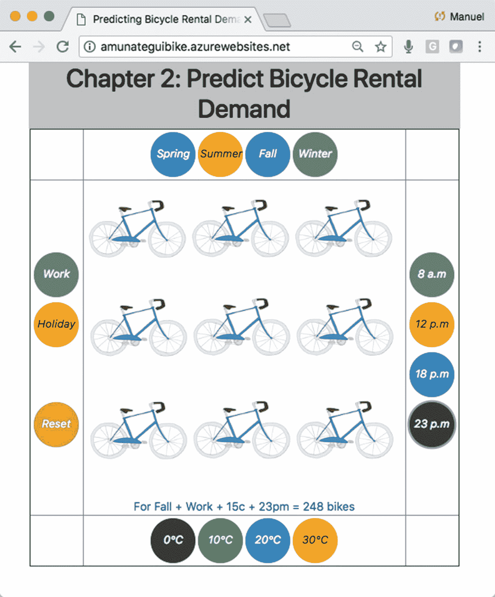

图 2-1

本章的最后一个 web 应用程序

这些数据可以通过加州大学欧文分校的 UCI 机器学习知识库获得( [`https://archive.ics.uci.edu/ml/datasets/bike+sharing+dataset`](https://archive.ics.uci.edu/ml/datasets/bike+sharing+dataset) )。

### 注意

进入 [`www.apress.com/9781484238721`](http://www.apress.com/9781484238721) 并点击源代码按钮，下载第 [2 章](02.html)的文件。打开 Jupyter 笔记本" **chapter2.ipynb** "跟随本章内容。

## 用回归系数理解自行车租赁需求

我们将建立一种简单直观的方式来与不同的环境因素进行互动，并了解它们如何影响自行车租赁。对于用户来说，这是一个很好的方式来证实他们的直觉假设，即什么会让人们想骑自行车，什么不会，在某些情况下，也会让他们感到惊讶(就像冬天比夏天看到更多的骑车人`—`，但我会让你自己发现这一点)。

这个 web 应用背后的“**大脑**”是一个线性回归模型。它能够发现结果变量和历史数据之间的线性关系。我们将利用这一技能，让它学习不同环境因素下的自行车租赁需求，看看它是否能帮助我们预测未来的需求。

每当您将 Python 模型扩展到 Wweb 时，在添加将它构建到 web 应用程序所需的额外层之前，在本地消除所有问题和错误是至关重要的。在将任何东西迁移到云之前，解决所有简单的问题！遵循这条建议将使你免除许多头痛。

## 探索自行车共享数据集

自行车共享非常受欢迎，尽管仍然是新的和实验性的。使用手机，骑手可以在网上注册，下载一个手机应用程序，定位自行车，并租一辆。这种模式创造了一个完整的生态系统，在这个生态系统中，没有人需要亲自交谈或见面才能开始享受这项服务。根据人工智能和决策支持实验室的 Hadi Fanaee-T(来自 UCI 机器学习知识库的数据集信息的线性注释):

> 与公共汽车或地铁等其他交通服务不同，这些系统明确记录了旅行持续时间、出发和到达位置。这项功能将**自行车共享系统变成了一个虚拟的传感器网络，可用于感应城市中的移动性。因此，通过监测这些数据，预计城市中的大多数***重要事件都可以被检测到。* <sup>[1](#Fn1)</sup>**

 **该下载包含两个数据集:“ **hour.csv** ”和“ **day.csv** ”特性详情见表 [2.1](#Tab1) 。 <sup>[2](#Fn2)</sup>

表 2-1

自行车共享数据图例

<colgroup><col class="tcol1 align-left"> <col class="tcol2 align-left"></colgroup> 
| 

功能名称

 | 

描述

 |
| --- | --- |
| 即时 | 记录索引 |
| **dtday** | 日期 |
| **赛季** | 季节(1:春天，2:夏天，3:秋天，4:冬天) |
| **年** | 年份(0: 2011，1:2012) |
| mnt | 月份(1 到 12) |
| HR | 小时(0 到 23) |
| **假期** | 不管那天是不是假日 |
| **工作日** | 星期几 |
| **工作日** | 如果日既不是周末也不是假日，则为 1，否则为 0。 |
| **天气预报** | 1.晴朗，少云，部分多云2.薄雾+多云，薄雾+碎云，薄雾+几朵云，薄雾3.小雪，小雨+雷雨+散云，小雨+散云4.大雨+冰托盘+雷暴+薄雾，雪+雾 |
| **温度** | 以摄氏度为单位的标准化温度。这些值是通过(t-t_min)/(t_max-t_min)，t_min = -8，t_max = +39(仅小时刻度)得出的。 |
| 呼吸〔t1〕 | 以摄氏度为单位的标准化感觉温度。这些值是通过(t-t_min)/(t_max-t_min)，t_min = -16，t_max = +50(仅小时刻度)得出的。 |
| **嗡嗡声** | 标准化湿度。这些值除以 100(最大值)。 |
| **风速** | 归一化风速。这些值除以 67(最大值)。 |
| **休闲** | 临时用户数 |
| **已注册** | 注册用户数 |
| **cnt** | 出租自行车总数，包括休闲自行车和注册自行车 |

### 从 UCI 机器学习资料库下载数据

数据集可以使用 Python 直接从 UCI 的存储库中下载，或者在: [`https://archive.ics.uci.edu/ml/datasets/bike+sharing+dataset`](https://archive.ics.uci.edu/ml/datasets/bike+sharing+dataset) 手动下载。下载包含以下三个文件:

*   day.csv

*   小时. csv

*   自述文件.txt

自行车租赁日记录集包含 731 行，小时记录集包含 17，379 条记录。

### **使用 Jupyter 笔记本**

每一章都有相应的 Jupyter 笔记本。让我们复习一些基础知识，开始使用本章的笔记本。下载源文件，打开终端窗口，并导航到该文件夹。在里面，你应该会找到两个文件和一个文件夹(图 [2-2](#Fig2) )。

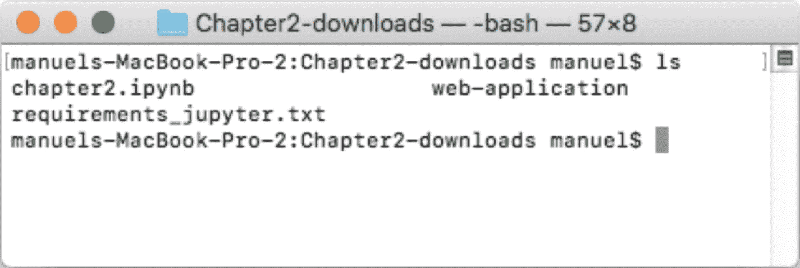

图 2-2

终端窗口

“ **requirements_jupyter.txt** ”文件包含运行本章的 jupyter 笔记本所需的 Python 库。您可以通过运行“ **pip3** ”命令快速安装它们(清单 [2-1](#PC1) )。

```py
$ pip3 install -r requirements_jupyter.txt

Listing 2-1Installing the Required Files to Run the Notebook

```

名为“ **chapter2.ipynb** ”的文件是本章的实际 Jupyter 笔记本。启动笔记本有不同的方式，但一种流行的方式是使用“ **jupyter 笔记本**”命令(列出 [2-2](#PC2) )。如果这对你不起作用，请参考 Jupyter 官方文档。

```py
$ jupyter notebook

Listing 2-2Starting the Jupyter notebook for This Chapter

```

这将打开一个浏览器窗口，其中有一个文件浏览器指示板，指向它启动时所在的文件夹。继续点击“ **chapter2.ipynb** ”链接(图 [2-3](#Fig3) )。

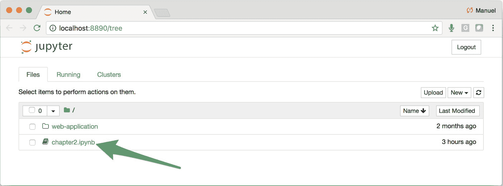

图 2-3

Jupyter 的文件浏览器与本章的笔记本链接

这将打开一个新的选项卡和相应的笔记本，其中包含所有需要遵循本章内容的探索性代码。本书所有代码假设 Python 3.x 如果你使用另一个版本，你可能需要修改一些代码。一旦你打开了笔记本，你就可以开始了。突出显示第一个框，点击 play 按钮运行该部分代码(图 [2-4](#Fig4) )。如果您看到错误，请在继续之前解决它们，因为每个代码片段都建立在前一个代码片段的基础上(错误可能与 Python 版本兼容性问题或缺少需要安装的库有关)。

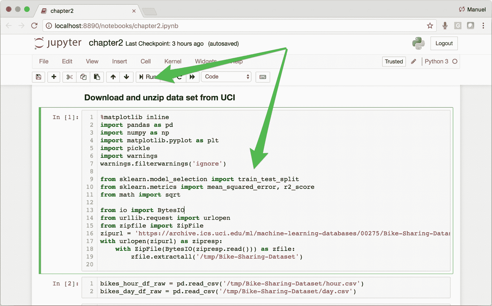

图 2-4

突出显示代码并准备运行的 jupiter 笔记本

本章对应的 Jupyter 笔记本展示了使用 Python 直接下载和解压缩数据的方法(如果您遇到防火墙问题，请手动下载)。

### **探索数据**

Python Pandas " **head()** "函数提供了清单 [2-3](#PC3) 和图 [2-5](#Fig5) 中所示的前几行数据。

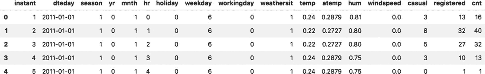

图 2-5

bike_df.head()输出

```py
bikes_hour_df_raw.head()

Listing 2-3First Rows of the Dataset

```

使用“ **head()** ”函数，我们了解到有日期、整数和浮点数。我们还看到一些多余的特征，比如日期(dteday)，已经通过“**季节**、“**年份**、“**月份**、“**小时**”等进行了分类。因此，“ **dteday** ”特性是一个很容易放弃的选项(尽管为了我们的探索需要，我们将保留它一段时间)。其他一些功能似乎是多余的，如“ **temp** ”和“ **atemp** ”，可能需要进一步检查。我们还放弃了“**随意的**”和“**注册的**”特性，因为这些特性不会帮助我们从单个用户的角度来建模需求，而这正是我们的 web 应用程序的要点。这可能成为基于季节、天气等预测注册的一个有趣的结果变量。由于这些不符合我们当前的需求，我们将放弃它们。

我们只保留我们真正需要的特性，因为这将消除混乱，并为我们提供额外的清晰度和理解，以达到我们的数据科学和 web 应用程序目标(清单 [2-4](#PC4) )。

```py
bikes_hour_df = bikes_hour_df_raw.drop(['casual', 'registered'], axis=1)

Listing 2-4Removing Useless Features for Our Ggoals

```

Pandas " **info()** "函数也是查看数据类型、数量和包含在数据中的空计数的好方法(清单 [2-5](#PC5) )。

```py
Input:

bikes_hour_df.info()

Output:

RangeIndex: 17379 entries, 0 to 17378
Data columns (total 15 columns):
instant       17379 non-null int64
dteday        17379 non-null object
season        17379 non-null int64
yr            17379 non-null int64
mnth          17379 non-null int64
hr            17379 non-null int64
holiday       17379 non-null int64
weekday       17379 non-null int64
workingday    17379 non-null int64
weathersit    17379 non-null int64
temp          17379 non-null float64
atemp         17379 non-null float64
hum           17379 non-null float64
windspeed     17379 non-null float64
cnt           17379 non-null int64

Listing 2-5Getting information about features

```

使用" **info()** "函数，我们看到当前保存在内存中的所有数据要么是浮点数，要么是整数，并且没有一个是空值。如果我们碰巧发现了空值、日期数据类型或文本数据类型，我们需要在继续建模之前解决它们。现有的大多数模型都需要数字数据，而这正是我们所拥有的，所以到目前为止我们看起来还不错。

## 仔细看看我们的结果变量

让我们来看看我们将用来训练模型的结果变量，" **cnt** "租赁自行车总数。Pandas " **describe()** "函数是理解定量数据的另一个常用工具。让我们将它应用于我们的结果变量(也称为模型的标签)，如清单 [2-6](#PC6) 所示。

```py
Input:

bikes_hour_df['cnt'].describe()

Output:

count    17379.000000
mean       189.463088
std        181.387599
min          1.000000
25%         40.000000
50%        142.000000
75%        281.000000
max        977.000000
Name: cnt, dtype: float64

Listing 2-6Number Summary of the Bike Rental Count “cnt” Feature

```

我们看到特性“ **cnt** ”的范围在最小 1 到最大 977 个计数之间。这意味着每个记录的小时内最少租借 1 辆自行车，最多租借 977 辆自行车。我们还看到平均租赁次数为 189.5 次。

我们确认我们正在处理一个连续的数值变量，其中线性回归(或类似线性回归的模型)是训练和预测自行车租赁计数的正确选择。让我们画出这个特征来更好地理解数据(列表 [2-7](#PC7) 和图 [2-6](#Fig6) )。

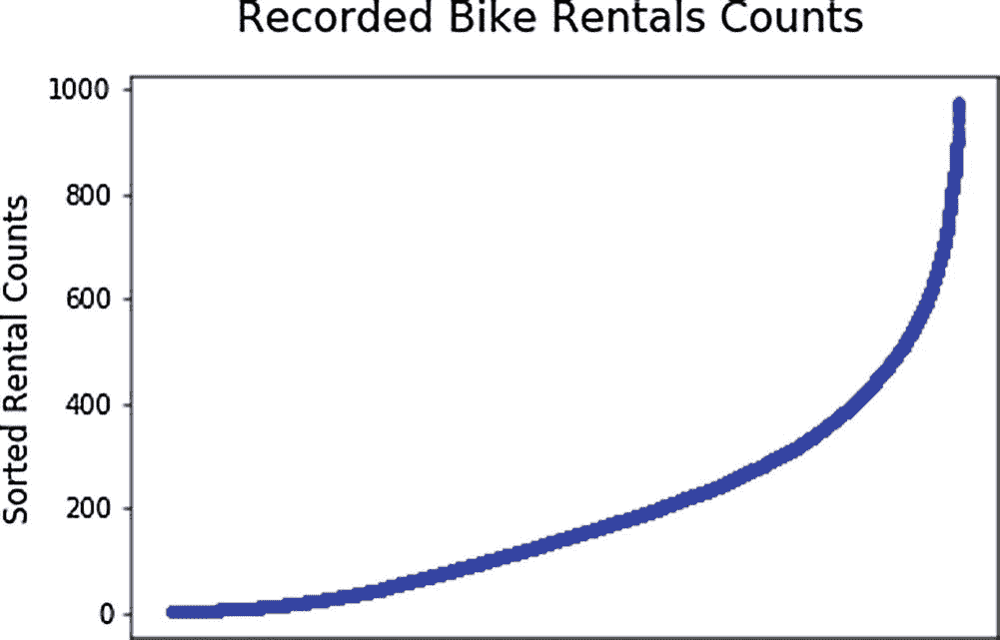

图 2-6

自行车租赁的分类计数显示，大多数租赁发生在 0 到 400 的范围内；高于这个值的要么是罕见的，要么是异常值

```py
fig,ax = plt.subplots(1)
ax.plot(sorted(bikes_hour_df['cnt']), color="blue")
ax.set_xlabel("Row Index", fontsize=12)
ax.set_ylabel("Sorted Rental Counts", fontsize=12)
ax.set_ylabel("Sorted Rental Counts", fontsize=12)
fig.suptitle('Outcome Variable - cnt - Rental Counts')
plt.show()

Listing 2-7Number Summary of the Bike Rental Count “cnt” Feature

```

## 数量特征与租赁数量

让我们创建所有浮点数据类型的散点图。我们将根据租赁数量绘制它们，以可视化潜在关系(图 [2-7](#Fig7) 和 [2-8](#Fig8) )。

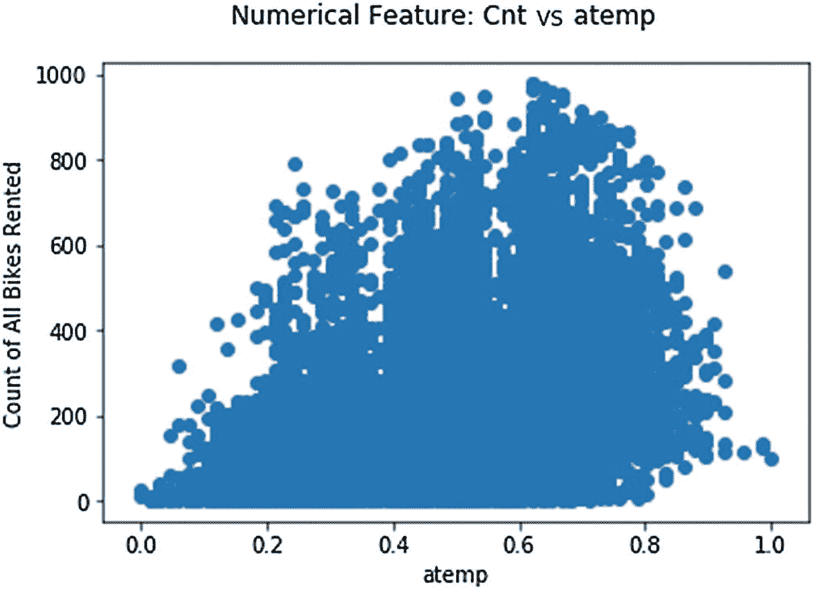

图 2-8

所有租赁自行车的计数与“ **atemp** ”功能

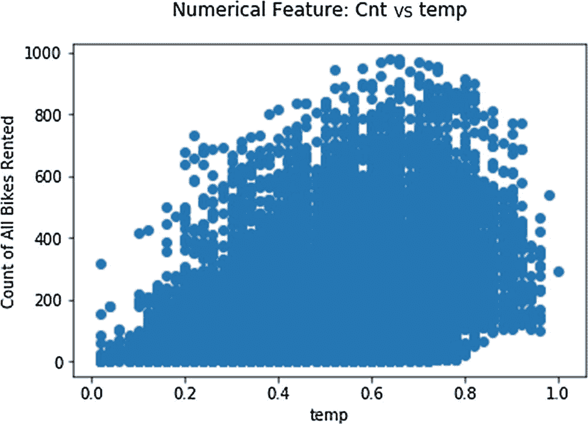

图 2-7

所有租赁自行车的计数与“ **temp** ”特征

我们可以看到，自行车租赁数量与温度之间存在某种线性关系；天气越暖和，出租的自行车就越多。我们还看到两个特征`—`“**温度**”和“**atemp**”`—`具有相似的分布，并且可能呈现冗余甚至多重共线性。为了保持整洁，我们将删除特征“ **atemp** ”(图 [2-9](#Fig9) 和 [2-10](#Fig10) )。

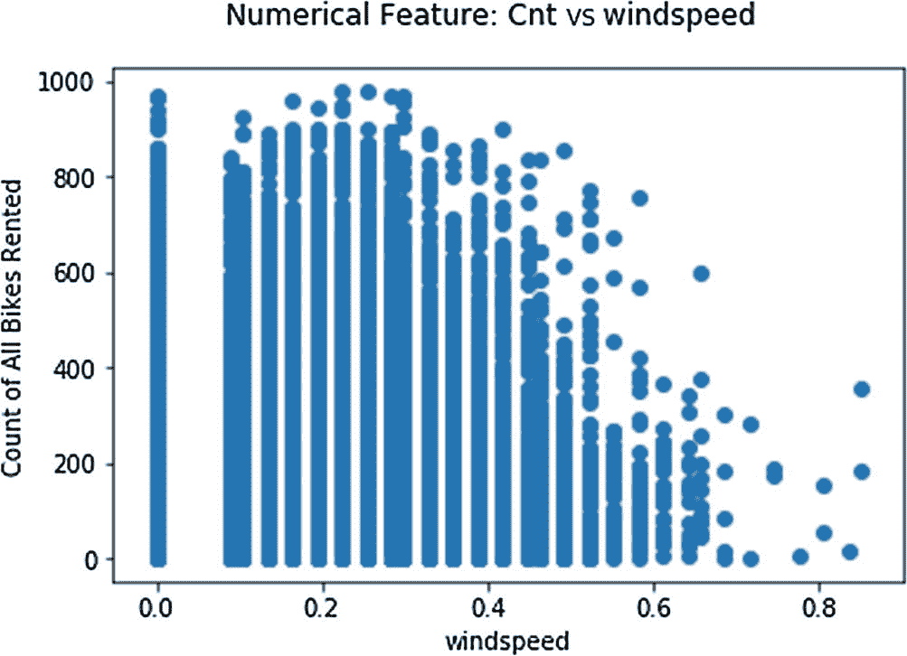

图 2-10

所有租赁自行车的计数与“**风速**”特征

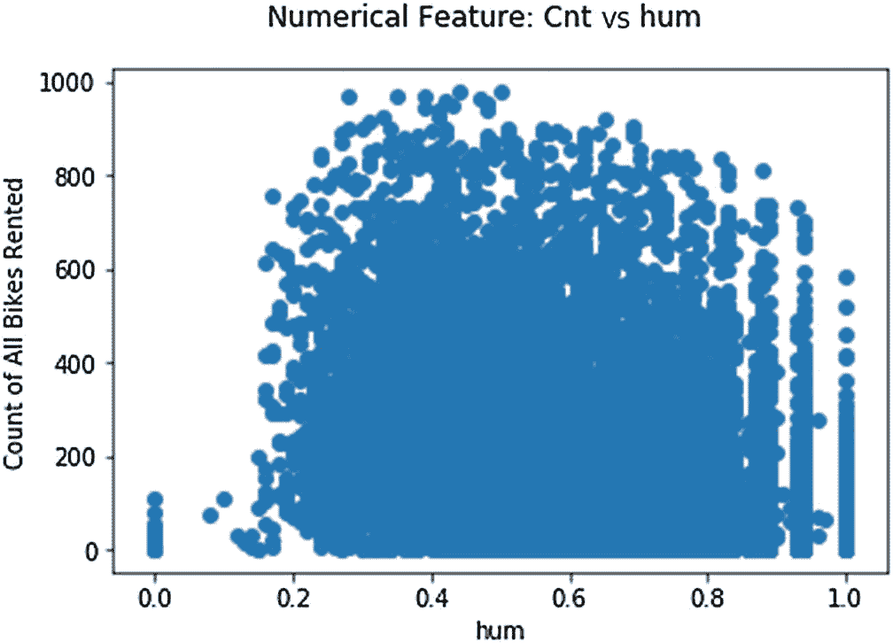

图 2-9

所有租赁自行车的计数与“ **hum** ”功能

特征“**嗡嗡声**”或湿度看起来像一个大斑点，尽管边缘确实显示出一些稀疏。特征“**”风速**确实显示出与租金成反比的线性关系；太多的风和自行车租赁似乎不能混合。

## 让我们看看分类特征

在该数据集中，除了自行车租赁计数" **cnt** "之外，整数数据都是分类特征。当通过直方图(分布图；图 [2-11](#Fig11) 。

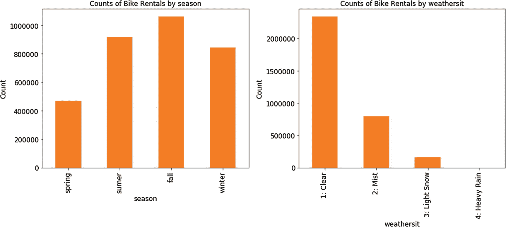

图 2-11

按“**季节**”和“**天气**”统计的自行车租赁数量

特征“ **weathersit** ”表明天气好的时候人们会租更多的自行车，“**季节**”表明秋天是租自行车的旺季。

最后，特征“ **hr** ”或租赁时间，清楚地显示了高峰办公通勤时间和下午骑行是非常受欢迎的骑行时间，而凌晨 4 点是最不受欢迎的骑行时间(图 [2-12](#Fig12) )。

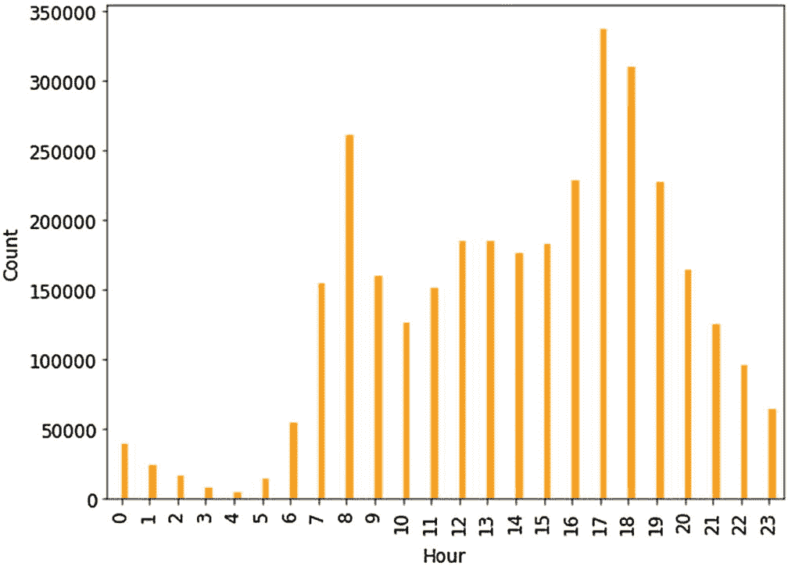

图 2-12

按小时计算的自行车租赁总量

尽管我们可以通过目测图表学到很多东西，但需要进行更彻底和系统的测试，才能对保留和删除的功能做出决定性的决定。

## 为建模准备数据

在大多数数据科学项目中，都有一个数据争论阶段，在这个阶段，数据被评估和清理，以便“**模型就绪**”在这种情况下，我们已经丢弃了一些无用的要素，我们没有要处理的空值，并且我们不会担心相关性或多重共线性，因为我们将在最终模型中只使用四个简单的要素。

### 回归建模

在统计分析中，回归模型试图预测变量之间的关系。它将分析自变量与因变量之间的关系。拟合模型可用于预测新的因变量。

### 简单线性回归

线性回归可能是最简单的建模算法。它试图解释一个因变量和一个或多个自变量之间的关系。见图 [2-13](#Fig13) 中的基本回归方程。

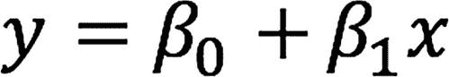

图 2-13

基本线性回归方程

方程中 y =估计的因变量得分，β0 =常数，β_1 =回归系数，x =自变量上的得分。

### 简单的模型

让我们从一个简单的多元线性回归模型开始，在这个模型中，我们输入所有变量，得到一个基本的均方根误差(RMSE)。RMSE 用与结果变量(也称为 y 标签)成比例的单位来表示误差，因此很容易看出该模型在学习/预测自行车租赁方面做得有多好，并且误差变成了一种置信区间。你想要尽可能低的 RMSE 分数，所以目标是不断调整数据和模型，直到它停止下降。我们将把本章中所有的建模工作建立在 Python scitkit-learn/sklearn 库的基础上。 <sup>[3](#Fn3)</sup> 这是一个现象级的库，应该可以满足大部分 Python 用户的建模需求。

尽管我们将只运行一个简单的线性回归，但我们将利用 sklearn 库中的三个函数:" **train_test_split** "从我们的原始数据中创建两个随机数据集，并将特征从结果中分离出来，" **linear_model** "运行我们的模型，以及" **mean_squared_error** "评估模型的学习效果(清单 [2-8](#PC8) )。

```py
# set outcome variable
outcome = 'cnt'

# create feature list
features = [feat for feat in list(bike_df_model_ready) if feat not in [outcome, 'instant']]

# split data into train and test portions
from sklearn.model_selection import train_test_split
X_train, X_test, y_train, y_test = train_test_split(bike_df_model_ready[features],
                                         bike_df_model_ready[['cnt']], test_size=0.3, random_state=42)

Listing 2-8Snippet of Code to Split the Dataset into Training and Testing Portions

```

“ **train_test_split()** ”函数将使用种子将数据分成两个随机数据集。每当您测试不同的方法并希望确保您总是使用相同的分割进行公平比较时，设置“ **random_state** ”种子参数是一个好主意。“ **test_size** ”参数设置测试分割的大小。在这里，我们将其设置为. 3 或 30%，因此它将随机化数据，并将 70%的数据分配给训练集，30%的数据分配给测试集(清单 [2-9](#PC9) )。

```py
from sklearn import linear_model
model_lr = linear_model.LinearRegression()

# train the model on training portion
model_lr.fit(X_train, y_train)

Listing 2-9Linear Regression Code

```

我们声明一个“ **LinearRegression()** ”模型，然后调用函数“**【fit()】**”使用训练数据和训练标签来训练该模型。模型“ **model_lr** ”现在已经训练好了，可以预测了(清单 [2-10](#PC10) )。

```py
Input:

predictions = model_lr.predict(X_test)
from sklearn.metrics import mean_squared_error
print("Root Mean squared error: %.2f" % sqrt(mean_squared_error(y_test, predictions)))

Output:

Root Mean squared error: 143.08

Listing 2-10Predict and Get the RMSE Score

```

最后，我们使用指定用于测试的 30%的数据调用函数“ **predict()** ”，并将预测的标签送入函数“ **mean_squared_error()** ”，以获得均方根误差分数。我们得到的 RMSE 是 **143.08** ，我们将用它作为我们的基准分数。这是我们通过当前的种子分割(我们在 train_test_split 函数上应用的种子，以确保我们每次都获得相同的分割)和我们到目前为止选择的所有特性获得的结果。一种解释这一分数的方法是，因为它与我们的结果变量在同一尺度上，我们的模型预测相差 143 辆自行车。考虑到每小时的平均自行车租赁需求大约为 190，我们的模型比简单地选择自行车租赁的总平均值做得更好。但是让我们看看我们是否能在这方面有所改进。

## 试验特征工程

让我们看看是否可以通过尝试一些不同的技术来获得更好的分数，包括多项式、非线性建模和利用时间序列。

### 多项式建模

对一系列值应用多项式变换可以在线性回归过程中实现更好的分离。这在 Python 的“ **sklearn** ”库中非常容易做到(清单 [2-11](#PC11) )。

```py
from sklearn.preprocessing import PolynomialFeatures
poly = PolynomialFeatures(2)
X_train = poly.fit_transform(X_train)
X_test = poly.fit_transform(X_test)

Listing 2-11Create Polynomial Features

```

让我们将所有的特性转换到第二级(清单 [2-12](#PC12) )。

```py
Input:

print("Root Mean squared error with PolynomialFeatures set to 2 degrees: %.2f" % sqrt(mean_squared_error(y_test, predictions)))

Output:

Root Mean squared error with PolynomialFeatures set to 2 degrees: 122.96

Listing 2-122nd-Degree Polynomials

```

现在将所有的特征进行三次变换(清单 [2-13](#PC13) )。

```py
Input:

print("Root Mean squared error with PolynomialFeatures set to 3 degrees: %.2f" % sqrt(mean_squared_error(y_test, predictions)))

Output:

Root Mean squared error with PolynomialFeatures set to 3 degrees: 111.65

Listing 2-133rd-Degree Polynomials

```

现在将所有的特征转换到第四度(清单 [2-14](#PC14) )。

```py
Input:

print("Root Mean squared error with PolynomialFeatures set to 4 degrees: %.2f" % sqrt(mean_squared_error(y_test, predictions)))

Output:

Root Mean squared error with PolynomialFeatures set to 4 degrees: 114.84

Listing 2-144th-Degree Polynomials

```

如您所见，使用 sklearn 的" **PolynomialFeatures()** "函数将多项式应用于数据集非常容易。使用第二度和第三度时分数确实会提高，但超过该点后会下降。

### 根据分类数据创建虚拟特征

另一个值得尝试的方法是对分类数据进行虚拟化。这意味着为每个类别创建单独的列。以 feature " **weathersit** "为例:这不是一个连续变量，而是一个任意的类别。如果你把它输入到一个模型中，它会认为它是线性的数字数据，这在这种情况下是没有意义的；**雾&云**加 1 不等于**雪**通过创建四个新列:"**晴**、" "**雾**、" "**雪**、"**雨**"并为每个列分配一个二进制真/假值，该模型将在"**天气**方面做得更好。

这很容易用 Pandas 函数" **get_dummies()** 来实现。我们将代码抽象成一个函数，使我们的 web 应用程序更容易创建(清单 [2-15](#PC15) )。

```py
def prepare_data_for_model(raw_dataframe,
                           target_columns,
                           drop_first = False,
                           make_na_col = True):

    # dummy all categorical fields
    dataframe_dummy = pd.get_dummies(raw_dataframe, columns=target_columns, drop_first=drop_first,
dummy_na=make_na_col)
    return (dataframe_dummy)

Listing 2-15Abstracting the Code to Create Dummy Data

```

这将把每个类别分解到它自己的列中。在下面的代码片段中，我们要求“ **dummify** ”以下三列:“**季节**、“**工作日**”和“**天气**”(列表 [2-16](#PC16) )。

```py
bike_df_model_ready = prepare_data_for_model(bike_df_model_ready,
           target_columns = ['season', 'weekday', 'weathersit'], drop_first = True)

Listing 2-16Dummify Categorical Columns

```

将函数应用到数据集后，每个天气类别现在都在一个单独的列中(减去第一列，如果它不是“ **weathershit_2** 、“ **weathershit_3** ”或“ **weathershit_4** ”，则我们推断它是“ **weathershit_1** ”，则第一列是多余的`—`；清单 [2-17](#PC17) 和图 [2-14](#Fig14) 。

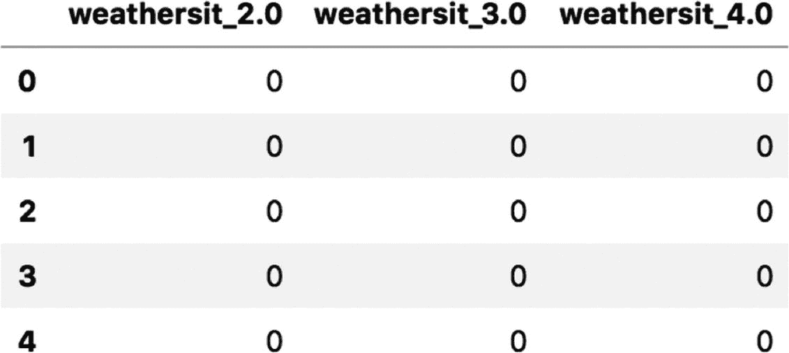

图 2-14

看看虚拟专栏的特写" **weathersit** "

```py
bike_df_model_ready[['weathersit_2.0', 'weathersit_3.0', 'weathersit_4.0']].head()

Listing 2-17A Look at the Dummified Weather Field

```

那么，从分类数据中创建虚拟模型对模型有帮助吗？(列表 [2-18](#PC18) )

```py
Input:

print("Root Mean squared error: %.2f" % sqrt(mean_squared_error(y_test, predictions)))

Output:

Root Mean squared error: 139.40

Listing 2-18RMSE after Dummying the Categorical Data

```

这并不令人印象深刻，当然也不足以证明所有的额外工作。让我们继续，尝试其他技术。

### 尝试非线性模型

作为最后的建模实验，让我们将我们的虚拟数据运行到来自 sklearn 的"**梯度推进回归器**"模型中。在 sklearn 包中从一个模型切换到另一个模型是很琐碎的，我们只需要在内存中加载合适的模型并更改两行(清单 [2-19](#PC19) )。

```py
Input:

from sklearn.ensemble import GradientBoostingRegressor
model_gbr = GradientBoostingRegressor()
model_gbr.fit(X_train, np.ravel(y_train))
predictions = model_gbr.predict(X_test)
print("Root Mean squared error: %.2f" % sqrt(mean_squared_error(y_test, predictions)))

Output:

Root Mean squared error: 68.13

Listing 2-19Using a GBM Model

```

哇，这是我们见过的最低的 RMSE 分数；我们已经将错误率降低了一半！

### 更复杂的特征工程——利用时间序列

这是最后一个特征工程实验；这个想法来自微软的数据科学家。 <sup>[4](#Fn4)</sup> 该数据是一段时间内自行车租赁的总账，因此是一个时间序列数据集。每当数据集记录一段时间内的事件时，您都希望将其作为一个附加要素考虑在内。例如，一个小时前发生的事件可能比一年前发生的事件更重要。时间还可以捕捉趋势、不断变化的需求和观念等。我们希望创建能够捕捉所有这些随时间变化的元素的功能！

对于每一行数据，我们将添加两个新特性:前一小时的自行车租赁总数，以及两小时前的自行车租赁总数。这里的直觉是，如果我们想了解当前的骑自行车情绪，我们可以从一个小时前发生的事情开始。如果一个小时前租金很高，现在可能也会很高。这个时间元素可以被看作是繁荣或灾难时期、好或坏天气等的代表。

为了创建每个日期和小时的自行车总数，我们使用 Pandas 极其强大的" **groupby()** "函数。我们提取三个字段，“ **dteday** 、“ **hr** ”和“ **cnt** ”，并按日期和小时对计数进行分组(列表 [2-20](#PC20) 和图 [2-15](#Fig15) )。


图 2-15

改变日期，创造新的回望功能

```py
bikes_hour_df_shift = bikes_hour_df[['dteday','hr','cnt']].groupby(['dteday','hr']).sum()
bikes_hour_df_shift.head()

Listing 2-20Looking at Rental Counts in the Previous Period

```

该函数按小时和日期计算计数。接下来，我们创建两个新的特征，一个向前移动 1 行，另一个向前移动 2 行，从而给出当前行在过去一小时和过去一小时的自行车租赁总量。最后，我们使用 Pandas " **merge()** "命令(清单 [2-21](#PC21) )将所有数据添加回我们的主数据框架。

```py
# prior hours
bikes_hour_df_shift = bikes_hour_df[['dteday','hr','cnt']].groupby(['dteday','hr']).sum().reset_index()
bikes_hour_df_shift.sort_values(['dteday','hr'])

# shift the count of the last two hours forward so the new count can take in consideration how the last two hours went
bikes_hour_df_shift['sum_hr_shift_1'] = bikes_hour_df_shift.cnt.shift(+1)
bikes_hour_df_shift['sum_hr_shift_2'] = bikes_hour_df_shift.cnt.shift(+2)

# merge the date and hour counts back to bike_df_model_ready
bike_df_model_ready =  pd.merge(bikes_hour_df, bikes_hour_df_shift[['dteday', 'hr', 'sum_hr_shift_1', 'sum_hr_shift_2']], how="inner", on = ['dteday', 'hr'])

Listing 2-21Playing with Time Shifts

```

在我们分割这些新数据并将其运行到梯度增强模型(GBM)中进行回归(sklearn 的 GradientBoostingRegressor)后，我们计算测试数据集的 RMSE 分数(清单 [2-22](#PC22) )。

```py
Input:

from sklearn.ensemble import GradientBoostingRegressor
model_gbr = GradientBoostingRegressor()
model_gbr.fit(X_train, np.ravel(y_train))
predictions = model_gbr.predict(X_test)

print("Root Mean squared error: %.2f" % sqrt(mean_squared_error(y_test, predictions)))

Output:

Root Mean squared error: 44.43

Listing 2-22RMSE from Time Shifts

```

哇，疯了，一个 44.43 的 RMSE；甚至更好！！！

## 节俭的模型

不幸的是，它并不总是关于最好的分数。这里，我们需要一个简单的模型，以便使用回归方程进行预测。这不是用复杂的模型或过度工程化的特征就能轻易做到的。GBM 不是一个线性模型，没有给我们一个方便的轻量级回归方程。此外，我们之前创建的时移要求我们拥有前两个小时预测的总计数，这是我们的 web 访问者无法受益的，因为我们无法访问实时数据。

当您的目标是创建 web 应用程序时，这是一个重要的教训:如果最准确的预测来自复杂的建模技术，它就不能很好地转化为生产流水线。

### 从简单的模型中提取回归系数——无需服务器端计算即可预测需求的简单方法

线性回归模型并不是最强大的模型，也不标榜自己是最强大的模型，但它可以将相当复杂的数据提取为极其简单和清晰的线性表示。正是这种简单的表示为我们的应用程序提供了动力。

回归建模的一个强大产品是学习模型的系数。在 web 应用程序的环境中，这甚至更加强大，在 web 应用程序中，我们可以仅依靠系数和简单的回归方程来估计未来的自行车租赁需求。这有可能使应用程序完全在客户端的前端做出复杂的决定，轻量级、快速且有用！

为了最终得到一小组系数和一个简单的回归方程，我们需要首先训练和测试一个回归模型。只有当我们对分数、使用的特征和预测的质量满意时，我们才提取系数。我们还将把模型中的特征削减为必要的和说明性的特征。这是构建 web 应用程序的经验之一:我们必须在最佳建模分数和生产现实之间取得平衡。如果你建立了一个非凡的模型，但没有人能操作它，或者它不能在生产中及时运行，这是一个失败。

为了我们的 web 应用程序简单起见，我们将只使用四个特性:“**季节**、“**人力资源**、“**假日**”和“**温度**”这些都是用户可以理解的、容易获得的特性，只有四个特性，我们的模型就会很快。让我们首先分别对这些特征进行建模，并检查它们的 R 平方得分。

### r 平方

r 平方是数据与拟合回归线接近程度的统计度量。它也被称为决定系数，或多元回归的多重决定系数。R 平方的定义相当简单；它是线性模型(列表 [2-23](#PC23) )预期的响应变量变化的百分比。

```py
R-squared = Expected variation / Total variation

Listing 2-23R-squared Formula

```

决定系数可以认为是一个百分比。它让您了解有多少数据点落在回归方程形成的直线的结果中。系数越高，落在线内的点越多。如果系数是 0.80，那么 80%的点应该落在回归线内。

我们希望看到 R 平方尽可能接近 1(或 100%)，没有负数。用 sklearn 的“ **r2_score** ”函数(列表 [2-24](#PC24) )计算很容易。

```py
Input:

from sklearn.metrics import r2_score
for feat in features:
    model_lr = linear_model.LinearRegression()
    model_lr.fit(X_train[[feat]], y_train)
    predictions = model_lr.predict(X_test[[feat]])
    print('R^2 for %s is %f' % (feat, r2_score(y_test, predictions)))

Output:

R^2 for hr is 0.160161
R^2 for season is 0.034888
R^2 for holiday is -0.001098
R^2 for temp is 0.154656

Listing 2-24R-squared Score Over Our Features

```

每个 R 平方都是正的，我们看到“ **hr** ”和“ **temp** ”比“**季节**”和“**假期**”解释了更多的差异请记住，我们是在分别研究每个特性；这里没有介绍的下一个好的步骤是计算所有这些要素的 R 平方得分(或者调整 R 平方以处理多个特征)。

如前所示，我们还将“**dummify**”**季**变量。如果我们对包括“**虚拟化的**”特征在内的所有特征重新运行 R 平方计算循环，我们会得到以下分数(列表 [2-25](#PC25) )。

```py
R^2 for hr is 0.156594
R^2 for holiday is 0.001258
R^2 for temp is 0.154471
R^2 for season_1 is 0.053717
R^2 for season_2 is 0.003657
R^2 for season_3 is 0.016976
R^2 for season_4 is 0.001111

Listing 2-25R-squared Score over Dummified Features

```

一切都是积极的，所以我们希望在最终的 web 应用程序中使用这些特性。

### 使用提取的系数对新数据进行预测

现在我们有了模型的系数，我们可以使用回归方程预测新的租赁数量。回归方程是回归模型中最佳拟合线的方程。公式很常见，在大部分涵盖统计学的书籍中都可以看到(图 [2-16](#Fig16) )。

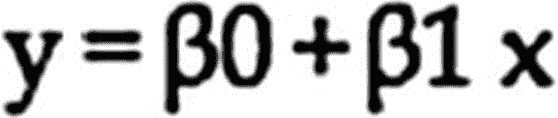

图 2-16

回归方程

" **y** "是因变量，或者我们试图预测的，在我们的例子中，自行车租赁的数量，a 是截距，" **β** "是直线的斜率，" **x** "是自变量。在多元线性回归的情况下，你只需添加更多的自变量。

需要注意的一点是，该公式及其系数代表了模型中所用数据的最小误差。所以，当我们注入新的数据时，我们不可能一下子改变所有的自变量。这是需要记住的重要一点，尽管我们将允许用户使用各种环境设置来影响自行车租赁的数量，但我们也将有一个" **reset** "按钮来将所有变量重置回其原始均值。

运行最终模型后，我们需要提取截距和系数。这对于 sklearn 的" **linear_model** "函数来说是微不足道的，只需要调用" **intercept_** "和" **coef_** "参数就可以得到它们(清单 [2-26](#PC26) 和 [2-27](#PC27) ，图 [2-17](#Fig17) )。

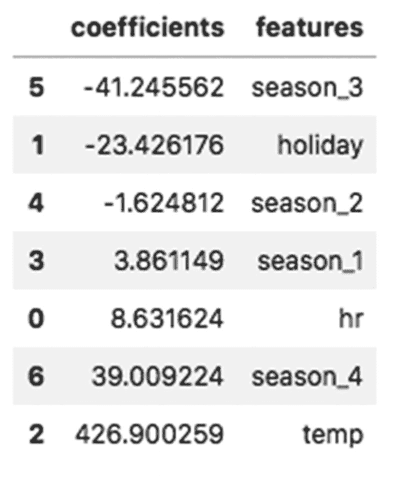

图 2-17

看看线性回归模型的系数

```py
feature_coefficients = pd.DataFrame({'coefficients':model_lr.coef_[0],
                                    'features':X_train.columns.values})

feature_coefficients.sort_values('coefficients')

Listing 2-27Getting the Coefficients

```

```py
Input:

from sklearn import linear_model
model_lr = linear_model.LinearRegression()
model_lr.fit(X_train, y_train)
print('Intercept: %f' % model_lr.intercept_)

Output:

Intercept: -121.029547

Listing 2-26Getting the Intercepts

```

然后，我们可以将这些常量分配给我们的 web 应用程序，这样它就可以对自行车租赁需求进行预测(清单 [2-28](#PC28) )。

```py
INTERCEPT = -121.029547
COEF_HOLIDAY = -23.426176   # if day is holiday or not
COEF_HOUR = 8.631624        # hour (0 to 23)
COEF_SEASON_1 = 3.861149    # 1: spring
COEF_SEASON_2 = -1.624812   # 2: summer
COEF_SEASON_3 = -41.245562  # 3: fall
COEF_SEASON_4 = 39.009224   # 4: winter
COEF_TEMP = 426.900259      # normalized temp in Celsius -8 to +39

Listing 2-28Creating Constants out of Extracted Coefficients

```

为了建立回归方程，我们还需要获得平均历史值。如果值是分类的，那么我们选择最高的平均值，并将其设置为 1，另一个设置为 0(就像我们对假日和季节所做的那样)(清单 [2-29](#PC29) )。

```py
MEAN_HOLIDAY = 0   # if day is holiday or not
MEAN_HOUR = 11.6   # hour (0 to 23)
MEAN_SEASON_1 = 0  # 1: spring
MEAN_SEASON_2 = 0  # 2: summer
MEAN_SEASON_3 = 1  # 3: fall
MEAN_SEASON_4 = 0  # 4: winter
MEAN_TEMP = 0.4967 # normalized temp in Celsius -8 to +39

Listing 2-29Setting our Feature Means

```

我们现在有了预测新租赁数量所需的所有信息。让我们看看在上午 9 点我们得到了多少租金，而所有其他值都保持在平均值附近不变(清单 [2-30](#PC30) )。

```py
Input:

rental_counts = INTERCEPT + (MEAN_HOLIDAY * COEF_HOLIDAY) \
        + (9 * COEF_HOUR) \
        + (MEAN_SEASON_1 * COEF_SEASON_1)  + (MEAN_SEASON_2 * COEF_SEASON_2) \
        + (MEAN_SEASON_3 * COEF_SEASON_3)  + (MEAN_SEASON_4 * COEF_SEASON_4) \
        + (MEAN_TEMP * COEF_TEMP)

print('Estimated bike rental count for selected parameters: %i' % int(rental_counts))

Output:

Estimated bike rental count for selected parameters: 171

Listing 2-30Let’s Make a Prediction Using Our Extracted Coefficients

```

结果是上午 9 点租了 171 辆自行车(您的结果可能略有不同)。我们将允许用户一次改变多个特征，但是请记住，对原始方程值的太多改变可能会降低模型的质量。

## 设计一个有趣的交互式网络应用程序来说明自行车租赁需求

现在有趣的部分，让我们设计我们的 web 应用程序。我们始终需要牢记最终目标`—`我们想与他人分享什么，他人想看到什么？

我们将设计一个交互式 web 应用程序，允许用户自定义环境变量(时间、假期、温度和季节),并获得关于自行车租赁数量的视觉反馈。

这个应用程序需要在视觉上引人注目，以吸引用户并保持他们的兴趣。这意味着需要在消息、UI、视觉和交互控件上投入与收集数据和建模同样多的思考。

## 抽象代码以提高可读性和可扩展性

和我的大多数 web 应用程序一样，我试图将代码抽象成逻辑模块。一个模块是收集用户数据的过程，另一个是大脑，它将建立回归方程，运行它，并返回自行车租赁预测。在构建和调试 web 应用程序时，将代码保存在逻辑单元中会大大简化您的工作。这将允许你对每一个模块进行单元测试，以确保每一个模块都能够正常工作，或者在不正常的时候进行排除。

在本章的 web 应用程序中，大多数的“T0”大脑“T1”将直接驻留在主 HTML 页面中。Flask 是一个 web 服务框架，主要用于检索、分析和反馈定制内容。在这一章中，我们所需要的是预测自行车租赁需求的回归方程，所以在用户和 web 服务器之间来回切换的情况并不多见(这是我们唯一这样做的一章；在所有其他情况下，大脑显然位于服务器上，而不是客户端的网页上)。

## 构建本地烧瓶应用程序

在将代码安装到云中之前，在本地运行很重要；这将节省你的头痛和时间。首先，让我们在本地机器上执行一个简单的烧瓶练习。如果您从未在本地运行过 Flask 应用程序，您将需要使用“ **pip3 install** ”或您的操作系统和 Python 版本支持的任何工具来安装以下 Python 库。

*   瓶

一旦你安装了 Flask，打开一个文本编辑器，输入下面的代码，保存为“ **hello.py** ”(列表 [2-31](#PC31) )。

```py
from flask import Flask
app = Flask(__name__)
@app.route('/')
def hello_world():
    return 'Hello, World!'

Listing 2-31Simple Flask Script

```

然后打开一个终端/命令窗口，在 Mac 或 Windows 上输入以下命令(清单 [2-32](#PC32) 和 [2-33](#PC33) )。

```py
$ export FLASK_APP= main.py
$ python -m flask run

Listing 2-33On Windows

```

```py
$ export FLASK_APP=main.py
$ flask run

Listing 2-32On the Mac

```

您应该会看到类似图 [2-18](#Fig18) 的内容。

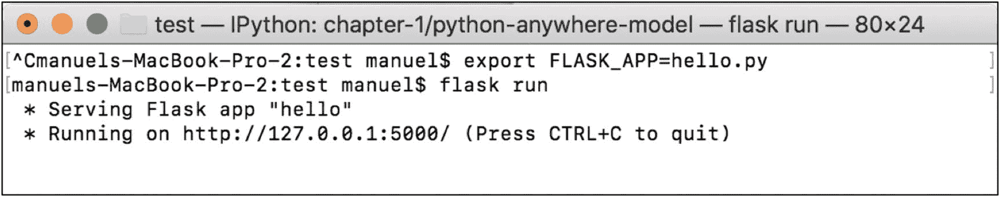

图 2-18

终端/命令窗口显示 Flask 应用程序的本地 URL

然后将 URL“`http://127.0.0.1:5000/`”(或终端窗口中显示的任何内容)复制到您的浏览器中，您应该会看到 web 应用程序出现。更多的例子和提示可以在官方快速入门指南中找到:“ [`http://flask.pocoo.org/docs/0.12/quickstart`](http://flask.pocoo.org/docs/0.12/quickstart) ”。

这里刚刚发生了什么？如果您是 web 服务框架的新手，这可能看起来有点令人畏惧(请记住，Flask 是最简单的框架之一)。让我们一步一步地分解这个方法。

在前面的“ **Hello world** ”示例中，一切都发生在假设的 web 服务器端(实际上只是您的本地机器)。它的工作是处理命令，并将可使用的 HTML 返回给发出请求的客户机的网页。

首先，我们在内存中加载 Flask 库(清单 [2-34](#PC34) )。

```py
from flask import Flask

Listing 2-34Import Flask

```

然后我们实例化 Flask 会话(清单 [2-35](#PC35) )。

```py
app = Flask(__name__)

Listing 2-35Instantiate Flask

```

最后，我们创建一个函数来做一些事情，并用一个路由参数来修饰它，这样它就知道它将处理来自 web 客户端的哪些命令。在这种情况下，/'仅仅意味着根页面或者根"**index.html**"页面会话(清单 [2-36](#PC36) )。

```py
@app.route('/')
def hello_world():
    return 'Hello, World!'

Listing 2-36Flask Function to Handle Traffic Coming from Root URL

```

显然，函数很少会这么简单；它很可能会调用数据库或表述性状态转移(REST) API 来收集定制信息，并通过 HTML 模板将其发送回客户端的 web 页面。整个过程允许创建智能的、定制的数据，然后包装成外观复杂的网页。对于所有的意图和目的，这将看起来像一个手工制作的页面，虽然它是由 Flask 动态创建的。我们将在整本书中使用 Flask，如果你阅读了每一章，你会对这个工具有很强的掌握。

代码的最后一部分仅用于本地模式(即，从本地机器运行)并运行 web 服务器代码，在这种情况下，打开调试标志(清单 [2-37](#PC37) )。

```py
if __name__=='__main__':
        app.run(debug=True)

Listing 2-37Automatically Running the Flask Application Locally

```

### 在本地下载和运行自行车共享 GitHub 代码

如果您尚未下载本章的文件，请下载并导航至“ **web 应用程序**”文件夹。你的文件夹应该看起来像清单 [2-38](#PC38) 。

```py
web-application
├── appengine_config.py
├── main.py
├── requirements.txt
├── app.yaml
├── static
└── images
                ├── bike_zero.png
                ├── bike_one.png
                ├── bike_four.png
                ├── bike_nine.png
                └── bike_sixteen.png
└── templates
        └── index.html

Listing 2-38Web Application Files

```

一旦你下载并解压了所有东西，打开一个命令行窗口，将驱动器切换到" **web-application** "文件夹，并通过运行" **pip install -r** "命令安装所有需要的 Python 库(清单 [2-39](#PC39) )。

```py
$ pip3 install -r requirements.txt

Listing 2-39Installing Requirements

```

然后运行您为" **Hello World** "实验运行的相同命令(运行" **python3 main.py** "也将完成同样的任务；图 [2-19](#Fig19) 。


图 2-19

在本章的 web 应用程序上启动本地 web 服务器

它应该类似于图 [2-20](#Fig20) 中的屏幕截图。

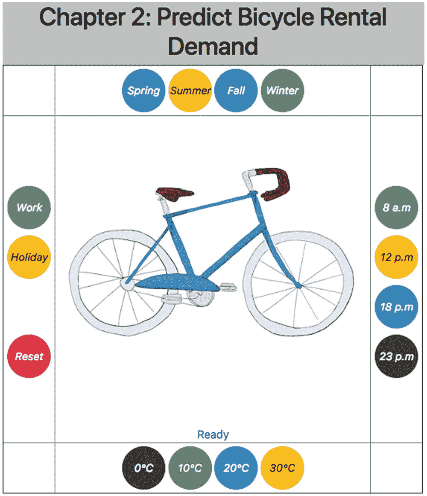

图 2-20

本地阅读本章的 flask web 应用程序

### 调试提示

如果您没有看到屏幕截图，那么您的系统有问题，或者它缺少一个文件或库。和这个领域的任何事情一样，调试是其中很大的一部分。你可以做两件简单的事情来帮忙。如果这是一个烧瓶问题，并且您的浏览器看起来如图 [2-21](#Fig21) 所示，请执行以下步骤。

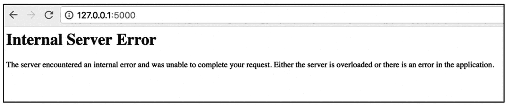

图 2-21

本地网站错误

在“ **main.py** ”脚本中将 Flask 调试标志设置为 True(这通常在文件的末尾)。这只适用于在本地运行你的应用程序(清单 [2-40](#PC40) )。

```py
if __name__=='__main__':
        app.run(debug=True)

Listing 2-40Web Application Files

```

如果问题与 Flask 有关，调试器将捕捉到它并在浏览器中显示，并将返回一条更有帮助的消息，如图 [2-22](#Fig22) 所示。

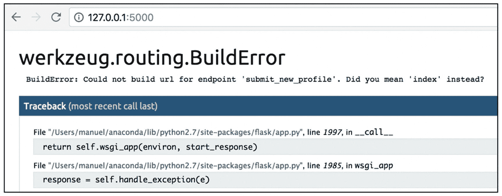

图 2-22

网络浏览器中的烧瓶错误日志

无论调试标志是什么，你都会在终端/命令窗口中看到 Flask 错误信息，如图 [2-23](#Fig23) 所示。

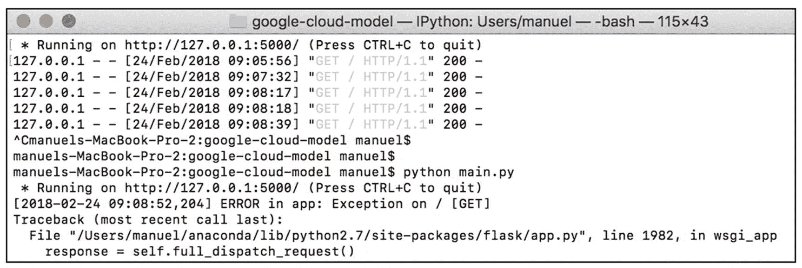

图 2-23

终端/命令窗口中的 Flask 错误日志

在你修复了所有的 Flask 问题之后，你可能仍然有一些前端的 bug 需要解决。大多数浏览器都会提供一些调试工具。图 [2-24](#Fig24) 展示了一个如何在 Chrome 中启动并运行 JavaScript 调试器的例子(你应该很容易在你使用的任何浏览器品牌中找到相同的例子)。


图 2-24

在谷歌浏览器中访问 JavaScript 控制台

这将在网页右侧打开一个漂亮的小调试中心，列出所有错误或警告。检查它总是一个好主意，以防出现警告消息。在不同的浏览器品牌和格式下测试你的网络应用程序也是如此，比如电脑、手机和平板电脑(图 [2-25](#Fig25) )。

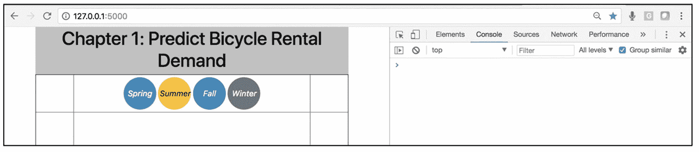

图 2-25

Google Chrome 中的 JavaScript 控制台正在运行

## Microsoft Azure—第一次安装 Web 应用程序

我们准备将我们的模型导出到 Azure。你需要一个微软 Azure 的账户，在我写这篇文章的时候，微软提供了 200 美元的信用和 30 天的所有服务试用以及 12 个月的访问。更多信息请参见 [`https://azure.microsoft.com/en-us/free/`](https://azure.microsoft.com/en-us/free/) 。

## Git—获取 Git 中的所有项目

对于这个项目，您需要在本地机器上安装 Git(您可以在 [`https://www.git-scm.com/downloads`](https://www.git-scm.com/downloads) 找到安装二进制文件)。如前所述，Git 是一个源代码版本管理工具，它是一个完全准备好的 Git 包，我们将把它推出给 Microsoft Azure(参见简介部分中关于 Git 的简要介绍)。

打开你的终端/命令行窗口，指向本章的“**网络应用**”文件夹(列表 [2-41](#PC41) )。

```py
$ git init

Listing 2-41Code Input

```

从头到尾运行几次“ **git status** ”来确保跟踪正确的文件是一个好主意(清单 [2-42](#PC42) )。

```py
Input:

$ git status

Output:

Untracked files:
  (use "git add <file>..." to include in what will be committed)

        main.py
        ptvs_virtualenv_proxy.py
        requirements.txt
        static/
        templates/
        web.3.4.config

Listing 2-42Running “git status”

```

添加“ **web 应用**文件中的所有 web 应用文件，并再次检查“ **git 状态**(列表 [2-43](#PC43) )。

```py
Input:

$ git add .
$ git status

Output:

 Changes to be committed:
  (use "git rm --cached <file>..." to unstage)

        new file:   main.py
        new file:   ptvs_virtualenv_proxy.py
        new file:   requirements.txt
        new file:   statimg/bike_four.png
        new file:   statimg/bike_nine.png
        new file:   statimg/bike_one.png
        new file:   statimg/bike_sixteen.png
        new file:   statimg/bike_zero.png
        new file:   templates/index.html
        new file:   web.3.4.config

Listing 2-43Adding Web Application Files to Git

```

执行一个本地 Git 提交，并添加一个有意义的注释，以防将来需要重新访问过去的操作(清单 [2-44](#PC44) 和图 [2-26](#Fig26) )。

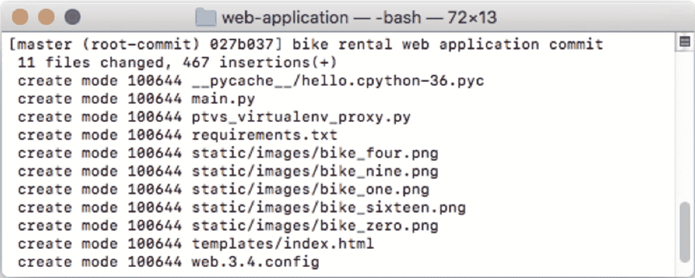

图 2-26

提交的数据已准备好供 Azure 上传

```py
$ git commit -am "bike rental web application commit"

Listing 2-44Git Commit

```

有关 Git 部署到 Azure 应用服务的更多信息，请参见 [`https://docs.microsoft.com/en-us/azure/app-service/app-service-deploy-local-git`](https://docs.microsoft.com/en-us/azure/app-service/app-service-deploy-local-git) 。

## azure-cli 命令行界面工具

我们将依靠“ **azure-cli** ”工具来启动和运行，因为这是一种启动和控制 web 实例的便捷方式(有关设置的更多信息，请参见位于 [`https://docs.microsoft.com/en-us/cli/azure/get-started-with-azure-cli`](https://docs.microsoft.com/en-us/cli/azure/get-started-with-azure-cli) 的官方文档)。

对于 Mac:

```py
$ brew update && brew install azure-cli

```

其他操作系统请参考官方文档: [`https://docs.microsoft.com/en-us/cli/azure/install-azure-cli`](https://docs.microsoft.com/en-us/cli/azure/install-azure-cli) 。

### 步骤 1:登录

在安装了“ **azure-cli** ”命令行工具之后(或者如果本地命令行工具给你带来麻烦，直接使用 azure 云 Shell)，创建一个“ **az** ”会话(清单 [2-45](#PC46) )。

```py
Input:

az login

Output:

To sign in, use a web browser to open the page https://microsoft.com/devicelogin and enter the code BTJMDCR34 to authenticate.

Listing 2-45Logging into Azure from azure-cli

```

按照指示，将浏览器指向给定的 URL 地址，并相应地输入代码(图 [2-27](#Fig27) )。


图 2-27

认证会话

如果一切顺利(即你有一个信誉良好的 Azure 账户)，它会自动将 azure-cli 终端连接到云服务器。此外，一旦获得授权，您就可以安全地关闭浏览器窗口。确保您的命令行工具指向本章的“ **web 应用程序**”文件夹。

### 步骤 2:为您的部署用户创建凭证

该用户将拥有使用 FTP 和本地 Git 的适当权限。在这里，我将用户名设置为“ **flaskuser11** ”，密码设置为“ **flask123** ”。您应该只需要这样做一次，然后您就可以重用同一个帐户。如果这给你带来麻烦，只需创建一个不同的用户名(或者在用户名的末尾添加一个数字，并像我一样不断递增(清单 [2-46](#PC47) )。

```py
$ az webapp deployment user set --user-name <<REPLACE-WITH-YOUR-USER-NAME>> --password flask123

Listing 2-46Creating a User

```

当你执行每一个" **azure-cli** "步骤时，你会得到 JSON 的回复，确认你的设置。在“ **az webapp 部署**的情况下，most 应该有一个空值并且没有错误消息。如果您有一个错误消息，那么您有一个权限问题需要解决(“**冲突**意味着该名称已经被占用，因此尝试另一个，而“**错误请求**意味着密码太弱)。

### 步骤 3:创建资源组

这将是你的逻辑容器。这里你需要输入离你最近的地区(见 [`https://azure.microsoft.com/en-us/regions/`](https://azure.microsoft.com/en-us/regions/) )。在这个例子中，使用“ **West US** ”并没有什么大不了的，即使你在世界的另一边，但是在你希望服务器尽可能靠近你的观众以获得最佳性能的生产环境中，这将会有所不同(清单 [2-47](#PC48) )。

```py
$ az group create --name myResourceGroup --location "West US"

Listing 2-47Creating a Resource Group and Response

```

### 步骤 4:创建你的 Azure 应用服务计划

这里我将名称设置为“ **myAppServicePlan** ”，并选择一个自由实例(sku 清单 [2-48](#PC49) 。

```py
$ az appservice plan create --name myAppServicePlan --resource-group myResourceGroup --sku FREE

Listing 2-48Creating a Service Plan and Successful Response

```

### 步骤 5:创建您的 Web 应用程序

您的“ **webapp** ”名称需要是唯一的，并确保您的“**资源组**”和“**计划**”名称与您在前面步骤中设置的名称相同。在这种情况下，我使用“ **amunateguibike** ”(清单 [2-49](#PC50) )。

```py
$ az webapp create --resource-group myResourceGroup --plan myAppServicePlan --name amunateguibike --runtime "python|3.4" --deployment-local-git

Listing 2-49Creating a Web App

```

有关支持的运行时的完整列表，请参见清单 [2-50](#PC51) 。

```py
$ az webapp list-runtimes

Listing 2-50List of Supported runtimes

```

“ **az webapp create** ”的输出将包含您在后续步骤中需要的重要信息。查找线“ **deploymentLocalGitUrl** ”(图 [2-28](#Fig28) )。

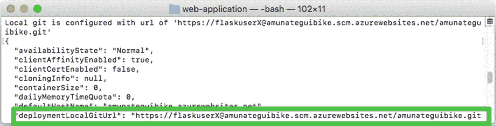

图 2-28

来自" **deploymentLocalGitUrl** 的 Git URL 的输出被截断

要提取 Azure 项目实例的本地 Git 配置 URL，请参见清单 [2-51](#PC52) 和 [2-52](#PC53) 。

```py
https://<<REPLACE-WITH-YOUR-USER-NAME>>@<<REPLACE-WITH-YOUR-APP-NAME>>.scm.azurewebsites.net/<<REPLACE-WITH-YOUR-APP-NAME>>.git

Listing 2-52Yours Will Look Like the Following

```

```py
https://flaskuser11@amunateguibike.scm.azurewebsites.net/amunateguibike.git

Listing 2-51The Extracted Git URL in My Case

```

### 第六步:将 git 代码推送到 Azure

将我们之前保存的带有您的 GIT 存储库位置的 URL 附加到“ **add azure** ”命令中(清单 [2-53](#PC54) )。

```py
# if git remote already exits, run 'git remote remove azure'
$ git remote add azure https://flaskuser11@amunateguibike.scm.azurewebsites.net/amunateguibike.git

Listing 2-53Final Code Push to Azure

```

它可能会提示您输入密码；确保使用您在“ **az webapp 部署用户**”步骤中创建的用户名(在我的例子中为“**flask 123**”)；清单 [2-54](#PC55) )。

```py
$ git push azure master

Listing 2-54Final Code Push to Azure

```

就是这样！您可以返回占位符浏览器页面并点击刷新，或者打开一个新的浏览器页面并输入 [`http://amunateguibike.azurewebsites.net`](http://amunateguibike.azurewebsites.net)

(或者你的情况`http://<<REPLACE-WITH-YOUR-APP-NAME>>.azurewebsites.net`)你应该看到“**预测自行车租赁需求**”(图 [2-29](#Fig29) )。

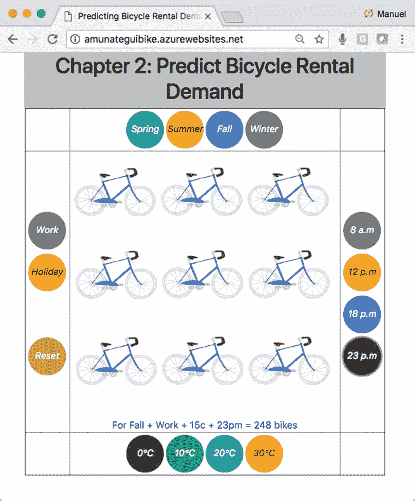

图 2-29

享受您辛勤工作的成果`—`“**预测自行车租赁需求**”web 应用程序！

另一方面，如果 azure-cli 返回错误消息，您必须解决它们(请参见故障排除部分)。任何时候你更新你的代码并且想要重新部署它，发送一个" **push** 命令(列表 [2-55](#PC56) )。

```py
$ git commit -am "updated output"
$ git push azure master

Listing 2-55To Update Code

```

你也可以直接在 Azure 的 web dashboard 上管理你的应用。登录 Azure，进入 App Services(图 [2-30](#Fig30) )。


图 2-30

Microsoft Azure 仪表板

### 重要清理！

这是关键的一步；你不应该让一个你不需要的应用程序运行在云中，因为它会产生费用(或者如果你在试用程序中，会用完你的免费积分)。如果你不再需要它，就把它取下来(列表 [2-56](#PC57) ，图 [2-31](#Fig31) )。

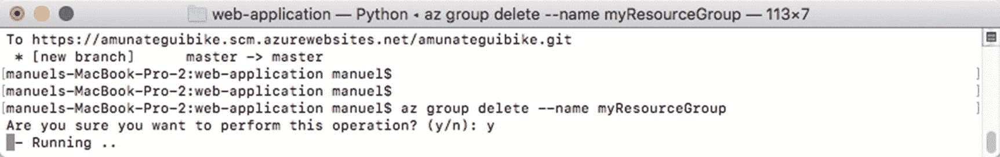

图 2-31

从 Azure 云中删除 web 应用程序

```py
$ az group delete --name myResourceGroup

Listing 2-56Don’t Forget to Delete Your Azure Instance When Done!

```

或者使用 Azure 的 web dashboard 在“ **App Services** ”下删除它。

### 解决纷争

调试 web 应用程序错误可能会很复杂。要做的一件事就是通过 Azure 的 dashboard 打开日志记录(图 [2-32](#Fig32) )。


图 2-32

打开 Azure 的诊断日志

然后打开日志流，开始捕捉活动(图 [2-33](#Fig33) )。


图 2-33

捕获日志信息

你也可以使用 Azure dashboard 内置的便捷控制台工具来检查你的文件结构(图 [2-34](#Fig34) )。


图 2-34

Azure 的内置命令行工具

你甚至可以通过使用 install 命令来检查你的“ **requirement.txt** ”文件是否工作(清单 [2-57](#PC58) )。

```py
> env\scripts\pip install -r requirements.txt

Listing 2-57Running Commands in the Azure Console

```

### 步骤概述

1.  将您的终端/命令窗口指向包含该章节的 web 应用程序文件的正确目录(并确认它在本地运行)。

    ```py
    $ cd chapter-2/web-application

    ```

1.  Git 提交所有文件。

    ```py
    $ git init

    $ git add .

    $ git commit -am "bike rental commit"

    ```

1.  登录 Azure 命令行界面并验证会话。

    ```py
    $ az login

    ```

1.  准备 Azure web 应用程序。

    ```py
    $ az webapp deployment user set --user-name flaskuser11 --password flask123

    $ az group create --name myResourceGroup --location "West US"

    $ az appservice plan create --name myAppServicePlan --resource-group myResourceGroup --sku FREE

    $ az webapp create --resource-group myResourceGroup --plan myAppServicePlan --name amunateguibike --runtime "python|3.4" --deployment-local-git

    ```

1.  将 web 应用程序推送到 Azure cloud。

    ```py
    $ git remote add azure https://flaskuser11@amunateguibike.scm.azurewebsites.net/amunateguibike.git

    $ git push azure master

    ```

1.  在浏览器窗口中打开网址，尽情享受吧！

    ```py
    http://<<WEBAPP NAME>>.azurewebsites.net

    ```

1.  终止实例！

    ```py
    $ az group delete --name myResourceGroup

    ```

## 这是怎么回事？看看我们的 Web 应用程序中使用的脚本和技术

让我们对我们的 web 应用程序代码做一个简短的飞越。有两个重要的文件:“ **main.py** ”，这是 web 服务控制脚本和模板文件“【index.html】T3”，这是我们的 web 应用程序的外观。由于大部分处理直接发生在 index.html 的**，我们将把大部分时间花在查看运行这个 web 应用程序的 HTML 和 JavaScript 上。**

### main.py

在正常情况下，这将是行动背后的大脑。它可以做独立 Python 脚本所能做的任何事情，还能为网页生成内容。在这一章中，除了将平均特征值和模型的截距和系数传递给模板之外，实际上没有什么要做的。在本书中，我们将同时使用“ **main.py** ”和“ **application.py** ”命名控制 Python web 服务文件`—`没有对错之分，唯一的例外是一些保留字。如果您选择自定义名称，您将需要更新 YAML 文件和/或 Web 服务器网关接口配置文件。此外，一些云提供商默认使用不同的应用程序名称；Google Cloud 默认为“ **main** ”，Azure 默认为“ **application** ”但无论哪种情况，都是可以定制和更改的。

“ **main.py** ”在这里做的一件有趣的事情是传输截距、系数和平均值的初始值。

装饰器**“@ app . route**”将路由任何调用根 URL 或文件名为“【index.html】T2”的流量然后，它简单地将所有默认值传递给“**index.html**”模板(清单 [2-58](#PC66) )。

```py
@app.route("/", methods=['POST', 'GET'])
def index():
        # on load set form with defaults
   return render_template('index.html',
                        mean_holiday = MEAN_HOLIDAY,
                        mean_hour = MEAN_HOUR,
                        mean_sesaon1 = MEAN_SEASON_1,
                        mean_sesaon2 = MEAN_SEASON_2,
                        mean_sesaon3 = MEAN_SEASON_3,
                        mean_sesaon4 = MEAN_SEASON_4,
                        mean_temp = MEAN_TEMP,
                        model_intercept = INTERCEPT,
                        model_holiday = COEF_HOLIDAY,
                        model_hour = COEF_HOUR,
                        model_season1 = COEF_SEASON_1,
                        model_season2 = COEF_SEASON_2,
                        model_season3 = COEF_SEASON_3,
                        model_season4 = COEF_SEASON_4,
                        model_temp = COEF_TEMP)

Listing 2-58Routing to the “index.html”

```

Flask 使用一种叫做" **Jinja2** "的技术将那些变量直接注入 HTML 模板表单。如果你看一下 return 语句，它调用 Flask 的“ **render_template** 函数，并将预期的变量传递给“【index.html】T5”

模板需要做的就是使用双花括号命令来接收这些变量。要了解这一切，请参考 web 应用程序“**index.htm**”的完整脚本(清单 [2-59](#PC67) )。

```py
<SCRIPT>
        var HOLIDAY = {{mean_holiday}}   // day is holiday or not
        var HOUR = {{mean_hour}}         // hour (0 to 23)
        var HOUR = {{mean_hour}}         // hour (0 to 23)
        var SEASON_1 = {{mean_sesaon1}}  // 1:spring
        var SEASON_2 ={{mean_sesaon2}}   // 2:summer
        var SEASON_3 = {{mean_sesaon3}}  // 3:fall
        var SEASON_4 = {{mean_sesaon4}}  // 4:winter
        var TEMP = {{mean_temp}}         // norm temp in Celsius -8 to +39
        var INTERCEPT = {{model_intercept}}
        var COEF_HOLIDAY = {{model_holiday}}  // day is holiday or not
        var COEF_HOUR = {{model_hour}}        // hour (0 to 23)
        var COEF_SEASON_1 = {{model_season1}} // 1:spring
        var COEF_SEASON_2 = {{model_season2}} // 2:summer
        var COEF_SEASON_3 = {{model_season3}} // 3:fall
        var COEF_SEASON_4 = {{model_season4}} // 4:winter
        var COEF_TEMP = {{model_temp}}      // norm temp in Celsius -8 to +39
...

Listing 2-59Using Jinja2 to Set Python Variables into JavaScript

```

### /静态/文件夹

静态文件夹，顾名思义，保存静态的、不变的文件。这是您为我们的 web 应用程序存储图像、文件和其他可共享数据的地方。

### /templates/index.html 文件夹和脚本

templates 文件夹保存了我们的 web 应用程序所需的所有模板。在随后的章节中，通常有两个 html 文件，一个“**index.html**”和一个响应 html 文件。最好将这些文件分开，而不是试图用复杂的“**if then**forks 将所有内容都塞进一个 html 文件中。

这一章的大部分动作都发生在“**index.html**”内部，所以让我们更深入地了解一下。在你的编辑器中打开完整的“**index.html**文件跟随前进。如前所述，本章的“**大脑**”不是 Flask，而是“**index.html**”前端页面`—`，大部分都在页面末尾的 JavaScript 代码片段内。JavaScript 为网页带来了更高水平的交互性。

在这个 web 应用程序中，它监听按钮点击事件，并通过使用所选的特性运行回归方程来重新计算自行车租赁需求。这还没有结束。一旦获得新的需求估计，它将权衡该数字，并决定显示哪一个自行车图片拼贴`—`,如果是小的估计，它将返回一辆自行车，如果是大的，则返回所有 16 辆自行车。

首先，用户单击一个特性按钮，使用该特性获得一个新的自行车租赁估价(清单 [2-60](#PC68) )。

```py
<button type="button" onclick="calculateBikeDemand(this)" id="season_spring" class="btn btn-info btn-circle btn-xl"><i class="fa fa-check">Spring</i></button>

Listing 2-60Calling for Predictions Using the HTML “<button>” event

.

```

“ **<按钮>** ”标签内的“ **onclick(** )”函数会将 Id“**season _ spring**”发送给主 JavaScript 函数“**calculatebikdemand()**”这是在告诉函数，用户想要用清单 [2-61](#PC69) 中所示的季节变量集重新计算回归方程。

```py
function calculateBikeDemand(elem) {

        // apply new value to stored variables
        ...

        // recalculate the regression equation
        rental_counts = INTERCEPT + (HOLIDAY * COEF_HOLIDAY)
                + (HOUR * COEF_HOUR)
                + (SEASON_1 * COEF_SEASON_1)  + (SEASON_2 * COEF_SEASON_2)
                + (SEASON_3 * COEF_SEASON_3)  + (SEASON_4 * COEF_SEASON_4)
                + (TEMP * COEF_TEMP)if (rental_counts < 0)

        // figure out which image to show
        if (rental_counts < 0) {
                bike_out = 'statimg/bike_sixteen.png'
                if (rental_counts < 0) {
                        bike_out = 'statimg/bike_zero.png'
                } else if (rental_counts < 100) {
                            bike_out = 'statimg/bike_one.png'
                } else if (rental_counts < 200) {
                            bike_out = 'statimg/bike_four.png'
                } else if (rental_counts < 300) {
                            bike_out = 'statimg/bike_nine.png'}

        // build a new string that is readable with variables select by user
        // and new bike rental estimate
        output = 'For ' + season + ' + ' + holiday + ' + ' + temp + ' + ' + hour + ', demand = ' + Math.round(rental_counts) + ' bikes';

        // inject new value

and image source directly into the HTML tag
        document.getElementById("query").innerHTML = output;
        document.getElementById('bike_out').src = bike_out
}

Listing 2-61The “calculateBikeDemand()” Modeling

JavaScript Function

```

## 结论

这就是我们的第一个项目！尽管这是一个简单的例子，在 web 客户端和 web 服务器之间很少来回切换，但它满足了真正的 web 应用程序的定义。在本章中，我们介绍了通过使用 Flask 和 web 控件将独立脚本扩展到交互式 web 应用程序的概念。我们还看到了 Python 和 Python 库如何轻松地与 Flask web 框架进行通信，从而几乎无缝地进入 web 计算领域。

这个过程是从规划我们的 web 应用程序应该是什么样的以及观众会对什么感兴趣开始的。这一步怎么强调都不为过:如果没有人对它感兴趣，那么就没有必要构建它。我们经常从建模开始，然后试图改进它，使它围绕一个 web 应用程序故事工作。

然后，我们研究了首都自行车共享系统的自行车共享数据集，试验了不同的建模方法来预测环境因素下的租赁需求，并选择了最终的特征和模型系数用于我们的 web 应用程序。

我们运行了 Flask 应用程序的本地版本，并最终将其部署到 Microsoft Azure cloud。如果你按照这个顺序执行这些步骤，你应该没问题。总是从设计 web 应用程序开始，尽可能多地在本地构建和运行，然后才部署到云。

## 额外资源

如果你想了解更多关于 Flask 的知识，谷歌一下；关于这个话题的材料太多了。

有关以下内容的更多信息:

*   **烧瓶**:前往出处，官方门户: [`http://flask.pocoo.org/`](http://flask.pocoo.org/)

*   **CSS** :参见 w3schools 网站上的教程(CSS 和其他所有与网络相关的东西): [`www.w3schools.com/css/`](http://www.w3schools.com/css/)

*   **自举**:参见门户: [`https://getbootstrap.com/`](https://getbootstrap.com/)

*   **JQuery** :查看他们的门户: [`https://jquery.com/`](https://jquery.com/)

*   **YAML** :查看他们精简的门户: [`http://yaml.org/`](http://yaml.org/)

*   **Jinja2** :见官方文档: [`http://jinja.pocoo.org/docs/`](http://jinja.pocoo.org/docs/)

<aside class="FootnoteSection" epub:type="footnotes">Footnotes [1](#Fn1_source)

Hadi Fanaee-T 和 Joao Gama，“结合系综检测器和背景知识的事件标记”，*人工智能进展* 2，第 2 期`–` 3 (2013):第 113-127 页。

  [2](#Fn2_source)

[T2`https://archive.ics.uci.edu/ml/datasets/bike+sharing+dataset`](https://archive.ics.uci.edu/ml/datasets/bike+sharing+dataset)

  [3](#Fn3_source)

[T2`http://scikit-learn.org/stable/`](http://scikit-learn.org/stable/)

  [4](#Fn4_source)

[T2`http://blog.revolutionanalytics.com/2016/05/bike-rental-demand.html`](http://blog.revolutionanalytics.com/2016/05/bike-rental-demand.html)

  [5](#Fn5_source)

[T2`https://www.capitalbikeshare.com/system-data`](https://www.capitalbikeshare.com/system-data)

 </aside>**