# 3.基于逻辑回归的 GCP 实时情报

让我们通过在谷歌云上建立一个交互式乘客档案生成器来了解谁在泰坦尼克号沉船事件中幸存下来。

在这一章中，我们重温了经典而生动的泰坦尼克号数据集，它受到了全世界建模教科书和教育博客的青睐。我们将分析乘客名单，并试图了解为什么有些人在这场悲剧中幸存，而有些人没有。我们将探索数据集，为建模做准备，并将其扩展到一个交互式 web 应用程序中，该应用程序将允许用户创建一个虚构的乘客，调整参数，并可视化他或她在旅程中的表现(图 [3-1](#Fig1) )。

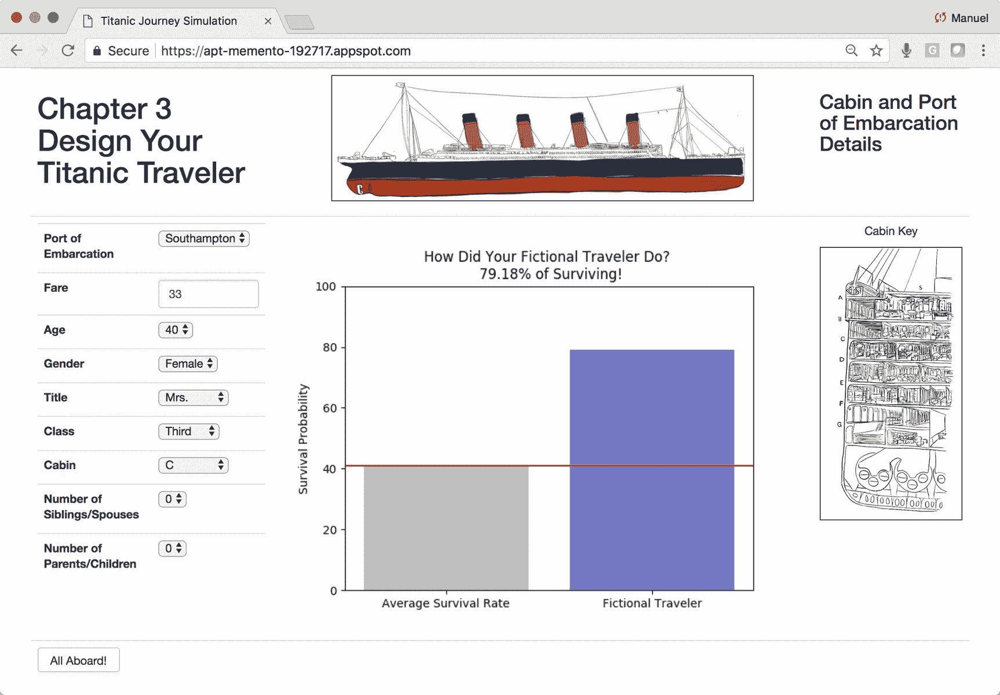

图 3-1

本章的最后一个 web 应用程序

范德比尔特大学生物统计系 <sup>[1](#Fn1)</sup> 正在慷慨地托管数据(以及许多其他有趣的数据集)，并且可以通过直接调用 Pandas Python 库方便地下载。

### 注意

前往 [`www.apress.com/9781484238721`](http://www.apress.com/9781484238721) 并点击源代码按钮，下载第 [3 章](03.html)的文件。打开 Jupyter 笔记本" **chapter3.ipynb** "跟随本章内容。

## 规划我们的 Web 应用程序

我们的第一步是让我们的泰坦尼克号概念得到充分的思考，并在我们的本地机器上作为一个 web 应用程序工作。

我们应用程序背后的大脑是一个简单的逻辑回归模型，来自" **sklearn Python 库**" <sup>[2](#Fn2)</sup> 在我们通过移除非预测性特征、为分类数据创建虚拟列并对文本字段应用基本的自然语言处理来准备数据之后，我们训练模型来识别那些在旅行中幸存的人和那些没有幸存的人周围的共同模式。

我们通过遵循将数据分成块的标准建模过程来验证我们的模型的准确性，一个用于训练模型，另一个用于验证模型。一旦我们对模型的能力感到满意，我们就让它预测一个虚构乘客的生存概率。这个概率，一个介于 0 和 1 之间的数字，代表了虚构的乘客从海难中生还的几率`—`,越接近 1，生还的几率就越大。

最后，我们将抽象和概括整个过程，在我们的 web 应用程序的构造函数中运行。这意味着接收、准备和建模数据的整个过程在模型部署期间(以及 web 服务器重启时)只发生一次。这确保了当用户想要与 web 应用程序交互时，它会根据训练好的模型快速生成预测，因为它已经加载到内存中。但是我们在这里操之过急了。让我们首先完成项目的本地版本。

## 数据争论

由于这是一个经典的数据科学练习和一个著名的记录事件，我们已经知道(或直觉)哪些特征有助于了解谁在航行中幸存下来(请参见范德比尔特生物统计以了解更多信息 <sup>[3](#Fn3)</sup> )。继续把这一章的文件下载到一个名为“**第三章**的文件夹中打开 Jupyter 笔记本，继续学习。我们来看看来自主机的数据图例(表 [3-1](#Tab1) )。

表 3-1

数据集图例

<colgroup><col class="tcol1 align-left"> <col class="tcol2 align-left"></colgroup> 
| 

特征

 | 

描述

 |
| --- | --- |
| pclass | 机票等级由 3 个级别组成 |
| 性 | 性别 |
| 年龄 | 年龄 |
| 兄弟姐妹数 | 船上的兄弟姐妹/配偶人数 |
| 烤 | 船上父母/孩子的数量 |
| 票价 | 乘客票价 |
| 国际农业与生物科学研究中心 | 客舱号 |
| 从事 | 装载点 |
| 名字 | 乘客姓名 |

第一次浏览数据可以使用 Pandas " **head()** "函数以编程方式完成，该函数将返回前五行(列表 [3-1](#PC1) 和图 [3-2](#Fig2) )。也可以使用“ **tail()** ”函数查看倒数五名。

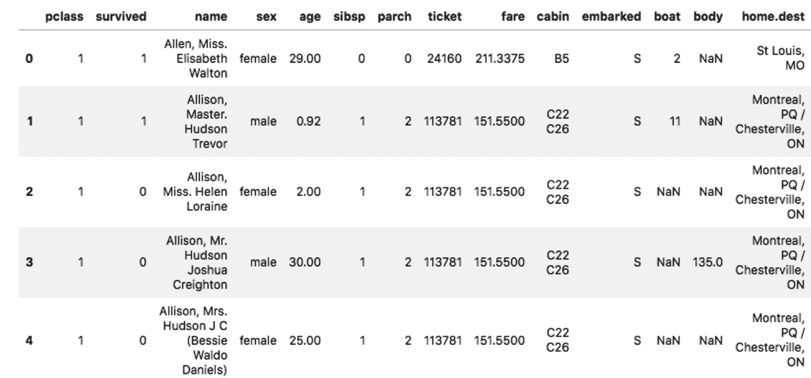

图 3-2

原始数据的前五行

```py
titanic_df.head()

Listing 3-1Quick Look at the Top Five Rows

```

数据确实符合范德比尔特生物统计公司的数据传说。您应该注意到的是"**正文**列中缺少的值，"**姓名**"和"**主页**"列中的大量文本数据，以及"**小屋**列中的一些混合内容。

函数“ **info()** 、“ **describe()** 、“ **isnull()** ”也是快速浏览数据的关键。强烈建议在面对新数据集或完成任何数据转换工作后运行这些工具。

Pandas " **info()** "函数告诉您数据集中包含的数据类型和非空计数(清单 [3-2](#PC2) )。

```py
Input:

titanic_df.info()

Output:

<class 'pandas.core.frame.DataFrame'>
RangeIndex: 1309 entries, 0 to 1308
Data columns (total 1 columns):
pclass       1309 non-null int64
survived     1309 non-null int64
name         1309 non-null object
sex          1309 non-null object
age          1046 non-null float64
sibsp        1309 non-null int64
parch        1309 non-null int64
ticket       1309 non-null object
fare         1308 non-null float64
cabin        295 non-null object
embarked     1307 non-null object
boat         486 non-null object
body         121 non-null float64
home.dest    745 non-null object
dtypes: float64(3), int64(4), object(7)
memory usage: 143.2+ KB

Listing 3-2Quick Look Feature Data Types

```

从“ **info()** ”函数输出中标记为“**非空对象**的数据可以认为是基于文本的，我们需要弄清楚它是什么类型的文本。这是一种主观艺术，因为有多种方法可以达到这个目的(稍后会有更多介绍)。

Pandas " **describe()** "函数为您提供所有定量字段的汇总摘要。马上，我们可以看到“**幸存**特征的平均值为 0.38。这意味着只有 38%的乘客幸存，并且由于我们将使用该特征作为训练模型的结果标签，数据集偏向非幸存者(即，大多数乘客没有在航行中幸存；列表 [3-3](#PC3) 和图 [3-3](#Fig3) 。

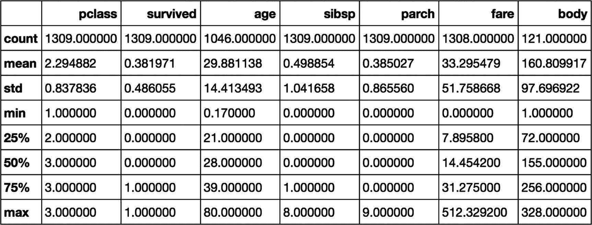

图 3-3

泰坦尼克号数据帧的描述输出

```py
titanic_df.describe()

Listing 3-3Summary of Quantitative Data

```

“ **isnull()** ”函数可以封装到一个计数器中，以找出我们正在处理的丢失值的数量。关于插补以及如何最好地处理建模场景中缺失数据的书籍已经出版。在这里，我们将删除一些特征并估算其他特征(列出 [3-4](#PC4) 和图 [3-4](#Fig4) )。

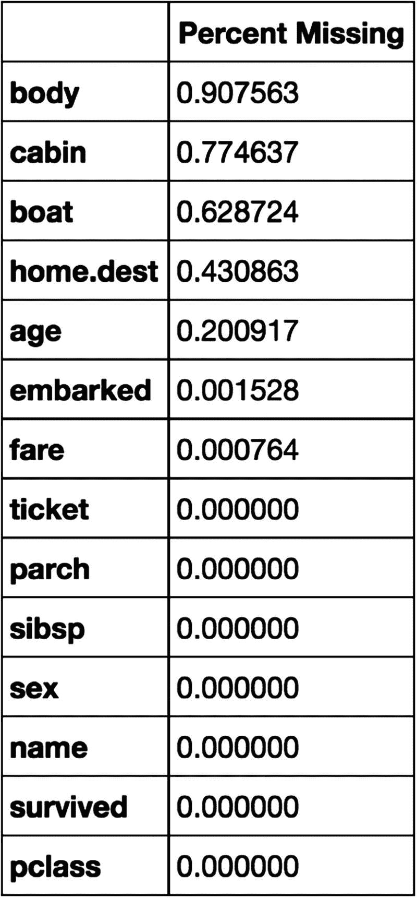

图 3-4

泰坦尼克号数据框中每个要素缺失数据的百分比

```py
titanic_missing_count = titanic_df.isnull().sum().sort_values(ascending=False)
pd.DataFrame({'Percent Missing':titanic_missing_count/len(titanic_df)})

Listing 3-4Analyzing Missing Data

```

在分析函数输出时，我们收集到的数据包括数字、分类和基于文本的特征。数据集总共包含 1，309 行。我们还看到特征“**主体**中 90%的条目丢失；这使得一个功能很容易被删除。还有一些我们会忽略的特征，因为它们要么很难使用，要么对生存建模没有什么帮助(比如乘客的姓氏)。

### 处理分类数据

处理分类数据是一个重要的话题，有些方面是主观的，而有些则不是。一个好的经验法则是找出特定的基于文本的列中有多少值是唯一的或重复的。检查频率是一个很好的起点。让我们把熊猫“ **groupby()** ”和“**count()**”functions call on feature“**cabin**”结合起来这将判断值是否在乘客之间共享，因此应被视为类别或自由形式的文本条目(列表 [3-5](#PC5) 和图 [3-5](#Fig5) )。

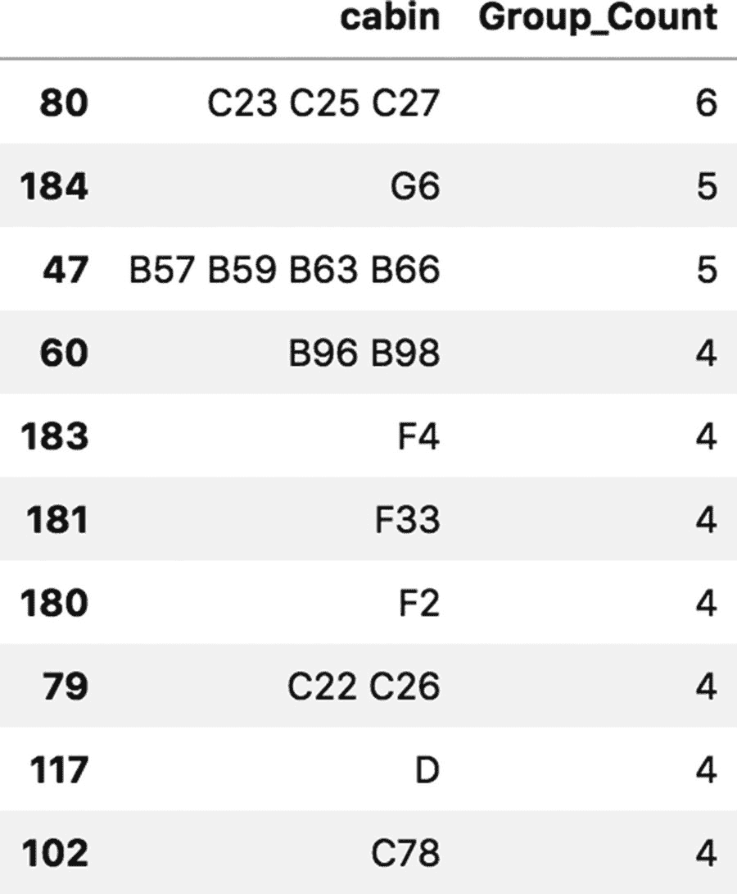

图 3-5

船舱连接在一起，可以从分离中受益

```py
titanic_feature_count = titanic_df.groupby('cabin')['cabin'].count().reset_index(name = "Group_Count")
titanic_feature_count.sort_values('Group_Count', ascending=False).head(20)

Listing 3-5Counting Repeats in the “cabin” Feature

```

结果输出确认这些值是类别，因为它们经常重复(这符合每个客舱可能有多个乘客的直觉)。让我们在另一个基于文本的列上运行相同的实验，即“ **name** 特性(我们已经知道我们将看到多少重复；清单 [3-6](#PC6) 和图 [3-6](#Fig6) 。

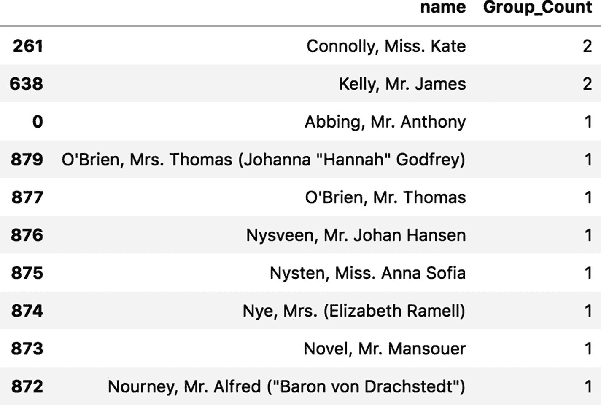

图 3-6

一个名字重复多少次？

```py
titanic_feature_count = titanic_df.groupby('name')['name'].count().reset_index(name = "Group_Count")
titanic_feature_count.sort_values('Group_Count', ascending=False).head(10)

Listing 3-6Counting Repeats in the “name” Feature

```

直觉告诉我们，大多数名字都是独一无二的。这不是一个被认为是分类的好列，也不是一个用于建模的好列(您需要重复的数据来寻找模式，并且唯一的文本条目在其原始状态下不能达到这个目的)。

在整数和文本数据类型中都可以找到类别；因此，单独考虑每个特征并确定如何最好地建模是很重要的。例如，特征“ **sex** ”是分类的和二进制的，所以数据的一部分对我们没有帮助。我们将把它改为一个名为“ **isFemale** ”的单列特征“**小屋**”确实像之前显示的那样重复，但是我们可以通过一点帮助让它重复更多(列表 [3-7](#PC7) )。

```py
Input:

titanic_df['cabin'].head()

Output:

0         B5
1    C22 C26
2    C22 C26
3    C22 C26
4    C22 C26
Name: cabin, dtype: object

Listing 3-7“Head()” of Cabin Features

```

通过提取该特征的样本，我们注意到数据的一个共性:每个数字前面都有一个代表船甲板高度的字母(图 [3-7](#Fig7) )。

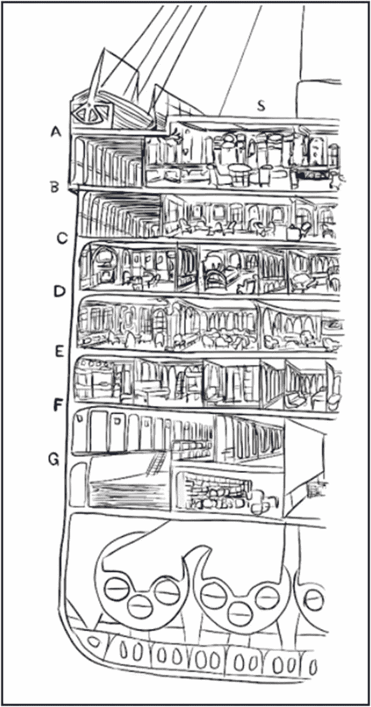

图 3-7

泰坦尼克号的剪影，带有代表船舱高度的标签(插图由 Lucas Amunategui 创作)

因此，利用这些数据的一种方法是取第一个字母，去掉数字。这给了我们一个有趣的特征:乘客在几楼，离楼层的距离和顶层甲板上的救生艇之间是否有关系？也许有，您可以通过使用我们即将构建的应用程序来找到答案(清单 [3-8](#PC8) )。

```py
Input:

titanic_df['cabin'] = titanic_df['cabin'].replace(np.NaN, 'U')
titanic_df['cabin'] = [ln[0] for ln in titanic_df['cabin'].values]
titanic_df['cabin'] = titanic_df['cabin'].replace('U', 'Unknown')
titanic_df['cabin'].head()

Output:

0    B
1    C
2    C
3    C
4    C
Name: cabin, dtype: object

Listing 3-8Using Only the First Character from Each Cabin Name

```

让我们做一个“ **groupby()** ”和“ **count()** ”，就像我们之前做的那样来计算频率(列表 [3-9](#PC9) 和图 [3-8](#Fig8) )。

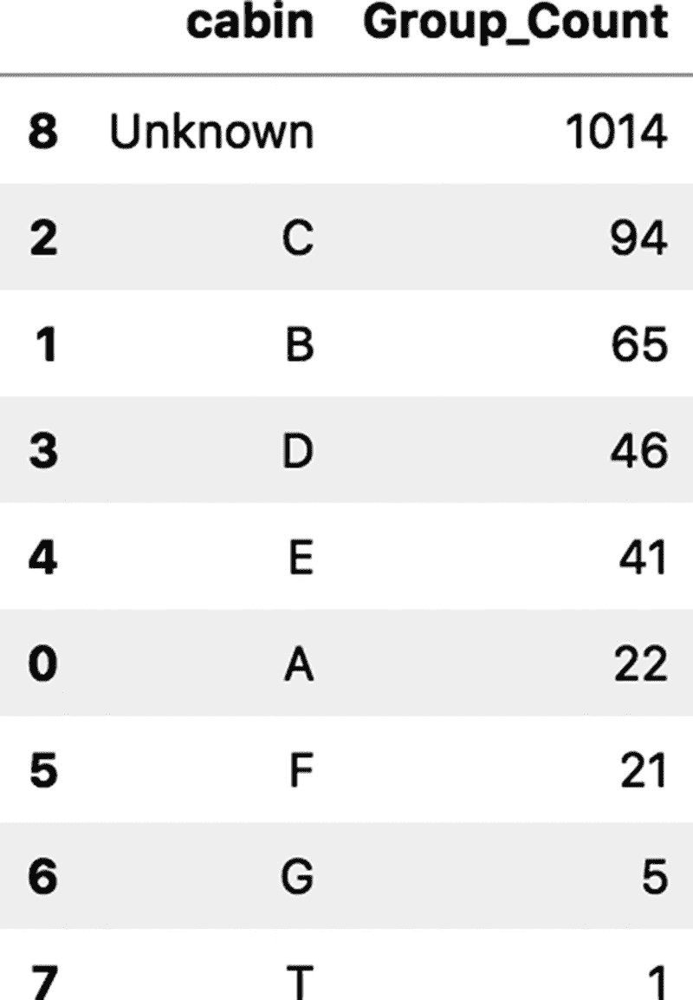

图 3-8

我们新的“**座舱**功能的总计数

```py
titanic_feature_count = titanic_df.groupby('cabin')['cabin'].count().reset_index(name = "Group_Count")
titanic_feature_count.sort_values('Group_Count', ascending=False).head(10)

Listing 3-9Counting Each Cabin First Letter Groups

```

哇，比之前观察到的重复次数多了很多。作为一个特性，这应该比以前的格式更有用。我们将对乘客的“**姓名**特征做同样的处理，只提取标题:“**夫人”或“**先生”等。并丢弃其他部分(详见 Jupyter 笔记本)。****

 ****这并不是说原始的、自由格式的文本(非重复的那种)对建模没有用处。相反，世界上大多数数据是非结构化的，并且非常有潜力`—`想想医生笔记，或者商店评论！这可以被建模，但是需要更高级的方法，例如自然语言处理、奇异向量分解、单词矢量化等。我们将在本书后面的章节中看到这些技术。

### 根据分类数据创建虚拟特征

一旦我们确定了我们的分类特征并转换了那些需要转换的特征，我们仍然需要将它们转换成数字形式，以便我们的模型可以使用它们。熊猫图书馆的一个很棒的功能是" **get_dummies()** "这将把每个类别分解到它自己的列中。

下面是一个使用“ **get_dummies()** 函数及其输出的例子(列表 [3-10](#PC10) 和图 [3-9](#Fig9) )。

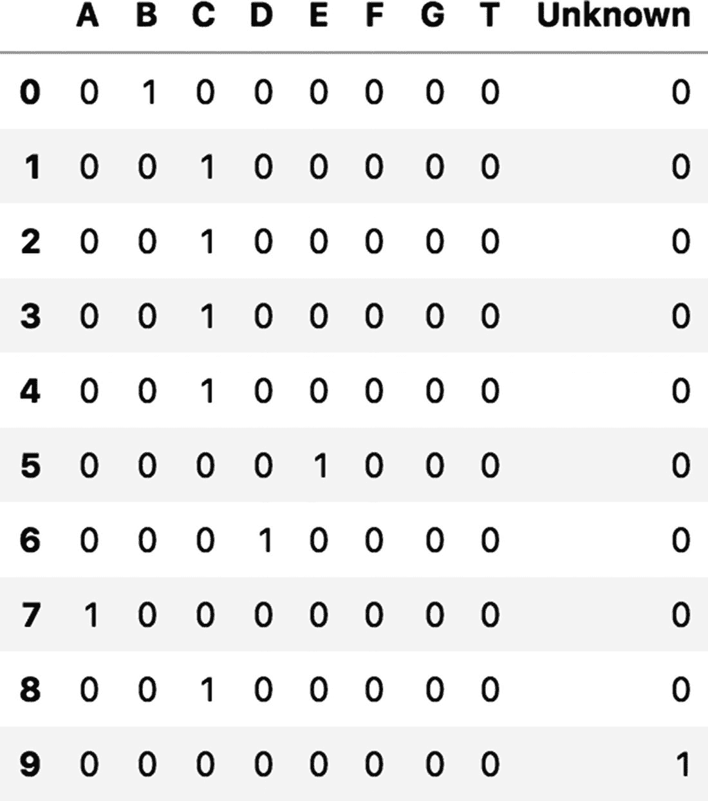

图 3-9

座舱特征转换成二进制数据(虚拟化)

```py
pd.get_dummies(titanic_df['cabin'], columns=['cabin'], drop_first=False).head(10)

Listing 3-10Creating Dummies out of the “cabin” Feature

```

它采用一个特性，将每个唯一值分解到一个单独的列中，并删除原始值。请记住，并不是所有不连续的数字都应该成为虚拟字段。想想美国的邮政编码；如果您对它们进行虚拟化，您将向您的数据集添加额外的 43，000 个极度稀疏数据的要素`—`这并不总是一个好主意。对于邮政编码，更好的方法可能是更大的分类分组，如在城镇或州级别建模。

## 建模

为我们的第二个项目保持简单将允许我们关注大局，并在构建 web 应用程序的每个部分上花费相同的时间。我们将使用来自“ **sklearn** ”库中的逻辑回归模型。如果你还记得上一章，我们使用了线性回归，它试图预测一个连续变量。另一方面，逻辑回归试图预测二元结果，如真或假、快乐或悲伤等。这两个都是非常常见的模型，但是您需要根据您试图建模和预测的结果变量的类型来使用正确的模型。

### 训练/测试分割

我们利用 sklearn 的“ **train_test_split()** ”函数，将数据拆分成两个带有种子的随机数据集。每当您测试不同的方法并希望确保您总是使用相同的分割进行公平比较时，设置“ **random_state** 参数是一个好主意。“ **test_size** ”参数设置测试分割的大小。在这里，我们将其设置为 0.5 或 50%，因此它将随机化数据，并在训练和测试之间将其分成两半。我们将使用训练部分来模拟数据，并使用测试部分来评估我们的模型执行得有多好。易于使用(列表 [3-11](#PC11) 和图 [3-10](#Fig10) )。

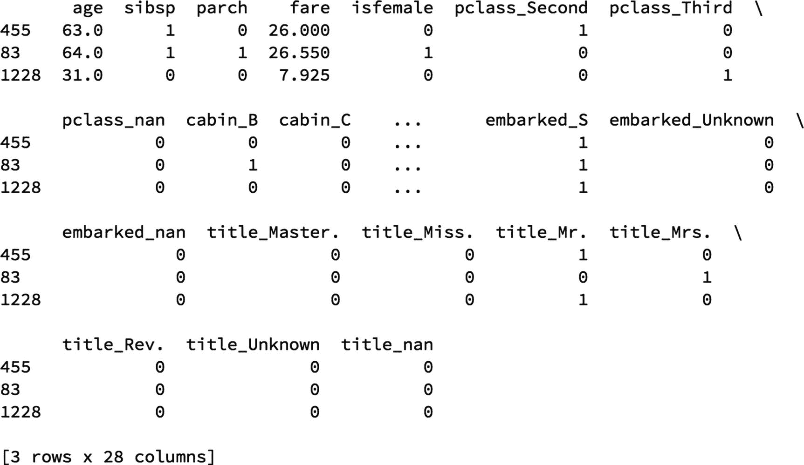

图 3-10

为建模做好准备的泰坦尼克号数据帧的训练分割

```py
from sklearn.model_selection import train_test_split
features = [feat forfeat in list(titanic_ready_df) if feat != 'survived']
X_train, X_test, y_train, y_test = train_test_split(titanic_ready_df[features],
titanic_ready_df[['survived']], test_size=0.5, random_state=42)
print(X_train.head(3))

Listing 3-11Splitting the Data into Train and Test portions

```

它将结果变量分解为“ **y_train** 和“**y _ test**”；该车型将只能访问“ **y_train** ”(列表 [3-12](#PC12) )。

```py
Input:

print(y_train.head(3))

Output:

      survived
455          0
83           1
1228         1

Listing 3-12Top Outcome Values from Training Dataset

```

### 逻辑回归

是时候决定使用什么模型并设置它了。由于我们预测的是二元结果，无论乘客是否在航行中幸存，逻辑回归都是一个很好的轻量级选择`—`非常适合 web 应用程序。牢记最后阶段总是好的(列表 [3-13](#PC13) )。

```py
from sklearn.linear_model import LogisticRegression
lr_model = LogisticRegression()
# ravel() simply creates a flattened array
lr_model.fit(X_train, y_train.values.ravel())

Listing 3-13Sklearn’s Logistic Regression Model

```

数据相当简单，生存模式是众所周知的，可以用大多数建模算法突出出来。Sklearn 逻辑回归模型使得窥视模型的结果系数变得非常容易，以帮助我们解释哪些特征被认为对泰坦尼克号之旅的幸存是重要的(列表 [3-14](#PC14) )。

```py
coefs = pd.DataFrame({'Feature':features, 'Coef':lr_model.coef_[0]})
coefs.sort_values('Coef', ascending=False)

Listing 3-14Extracting Our Model’s Coefficients

```

图 [3-11](#Fig11) 显示了预测存活率的正面和负面影响因素。显然，在这次特殊的旅行中，你作为女性和富人比男性和穷人过得更好(见笔记本上的系数列表)。

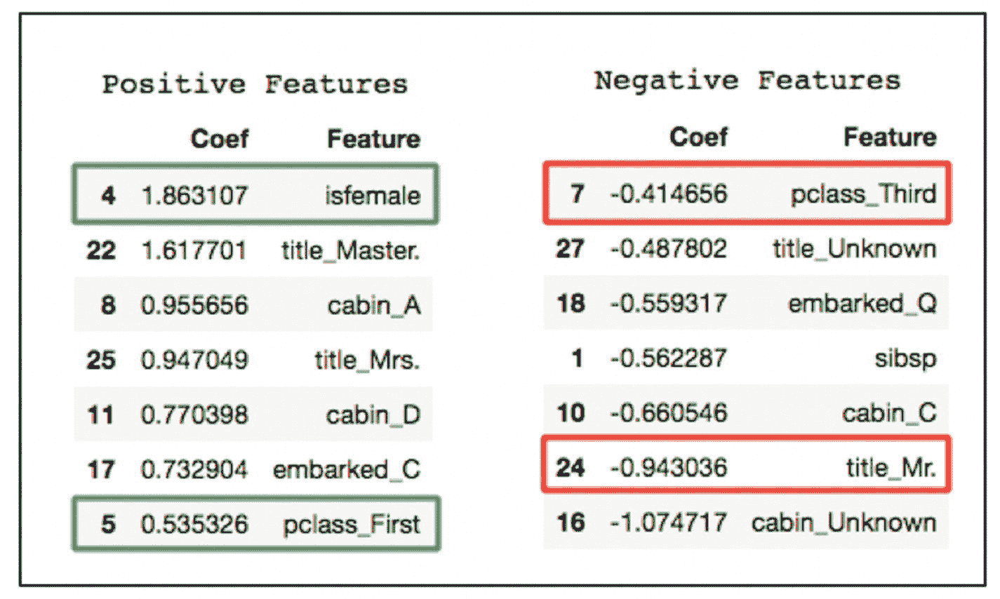

图 3-11

上正下负特征影响因素

### 预测存活率

一旦我们有了一个训练好的模型，我们就可以通过使用我们之前指定的数据的测试部分来验证它的准确性(使用前面提到的" **train_test_split()** "函数)。这些数据决不能用于培训阶段！因此，它保证了对模型的一个新的看法和获得性能分数的一个客观的方法(列表 [3-15](#PC15) )。

```py
Input:

y_pred = lr_model.predict(X_test)
print('Accuracy of logistic regression classifier on test set: {:.2f}%'
      .format(lr_modl.score(X_test, y_test)*100))

Output:

Accuracy of logistic regression

classifier on test set: 79.35%

Listing 3-15Predict Using the Testing Portion of the Dataset

```

具有验证数据集的模型在预测谁在旅行中幸存下来时获得了几乎 80%的准确率。考虑到我们使用的是一个简单的模型和一个小数据集，这个分数还不错。

我们几乎完成了 Python 脚本；我们只需要确保我们可以使用虚构的数据进行预测。这是重要的一步，因为我们希望我们的用户能够提出自己的数据，并通过训练好的模型来运行它。好，那么我们来试试一个 50 岁的男性在三等成绩(列表 [3-16](#PC16) )。

```py
x_predict_pclass = 'Third'
x_predict_is_female=0
x_predict_age=50
x_predict_sibsp=3
x_predict_parch = 0
x_predict_fare = 200
x_predict_cabin = 'A'
x_predict_embarked = 'Q'
x_predict_title = 'Mr.'

Listing 3-16Setting Up a Custom Prediction by Creating a Fictional Passenger

```

如果你熟悉这个数据集和历史事件，你就知道我们虚构的乘客不会过得很好。在我们运行模型之后，我们使用一个简单的比较图表来展示结果，该图表显示了虚拟乘客旁边的平均存活率。身为男性并且在三等舱是一个糟糕的组合(图 [3-12](#Fig12) )。

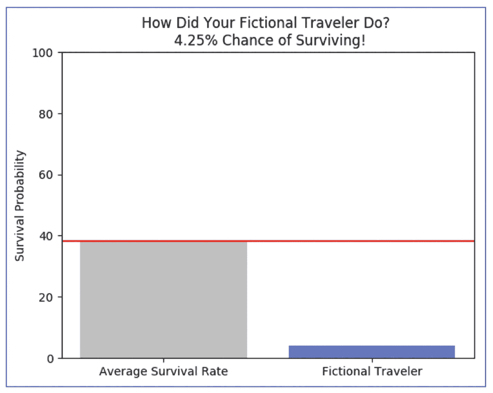

图 3-12

平均存活率与我们虚构的旅行者

## 抽象一切，为云计算做准备

既然我们已经确认了我们的模型是可行的，我们可以创建虚构的乘客并预测他们的生存概率，我们可以将代码打包成两个函数用于我们的 web 应用程序。保持整洁将减少从独立脚本项目转移到基于云的环境的过程中的复杂性和调试难题。

### 功能启动( )

我们创建一个" **startup()** "函数，它将负责将数据加载到内存中，执行所有的特性工程，创建虚拟列，并训练模型。这个函数只在 web 服务器联机和重启时调用一次。将尽可能多的工作预加载到内存中，将为与 web 应用程序交互的用户提供更快、更灵敏的体验。

### 函数提交 _ 新 _ 概要文件( )

第二个函数叫做“ **submit_new_profile()** ”该函数处理新的虚构乘客简档，将数据格式化为与真实训练数据相同的形状，创建所需的虚拟列，并要求模型预测和产生生存概率。

就是这样；我们需要的大部分大脑处理将由这两个功能来完成。所有剩下的代码用于 web 服务器和 HTML 页面之间的通信，显示结果，并使整个事情看起来更专业。但是我们超越了自己。现在让我们更加熟悉 Flask。

使用 Flask 的一个重要原因是，它允许我们将独立的 Python 脚本函数链接到服务器端 web 控件，而无需离开 Python 语言。这使得在模型和网络之间传递数据更加容易！

## 与 HTML 表单的交互性

除了 Flask，一个关键的前端 web 技术是“ **HTML 表单**” <sup>[4](#Fn4)</sup> 虽然这是基本的东西，但它是用户和我们的应用程序之间的关键环节。HTML 表单允许用户与网页上的信息进行交互，然后点击提交按钮将定制的数据发送回 Flask web 服务器(清单 [3-17](#PC17) )。

```py
<FORM id="submit_params" method="POST" action="{{ url_for('submit_new_profile') }}">
...
<SELECT class="selectpicker" name="selected_embarked">
                <option value="{{selected_embarked}}" selected>{{selected_embarked}}</option>
                <option>Cherbourg</option>
                <option>Queenstown</option>
</SELECT>
...
<BUTTON type="submit>Submit</BUTTON>
</FORM>

Listing 3-17Interacting with Users

```

## 创建动态图像

在这里，我们使用一种重要的技术将 Python 中动态创建的图像转换成字符串，这样它们就可以被 HTML 解释器动态地输入和理解。这是通过" **base64** " Python 模块提供的:

> 该模块提供 RFC 3548 中规定的数据编码和解码。该标准定义了 Base16、Base32 和 Base64 算法，用于将任意二进制字符串编码和解码为可以通过电子邮件安全发送、用作 URL 的一部分或作为 HTTP POST 请求的一部分的文本字符串。编码算法与 uuencode 程序不同。 <sup>[5](#Fn5)</sup>

在下面的简化代码片段中，我们使用“ **matplotlib.pyplot** ”库(清单 [3-18](#PC18) )在 Python 中创建了一个图像。

```py
import matplotlib.pyplot as plt
fig = plt.figure()
plt.bar(y_pos, performance, align="center", color = colors, alpha=0.5)
img = io.BytesIO()
plt.savefig(img, format="png")
img.seek(0)
plot_url = base64.b64encode(img.getvalue()).decode()

Listing 3-18Creating Dynamic Images

```

然后可以使用 Flask Jinja2 模板符号将变量“ **plot_url** ”注入到 HTML 代码中(清单 [3-19](#PC19) )。

```py
model_plot = Markup(''.format(plot_url))
...
<div>{{model_plot}}</div>

Listing 3-19Plotting the Dynamic Image from Flask to Jinja2

```

如果您查看 HTML 源输出，您将会看到 HTML 图像标记由长字符串组成(在所示的图像中被彻底截断)。解释者将知道如何将其转换成图像(图 [3-13](#Fig13) )。

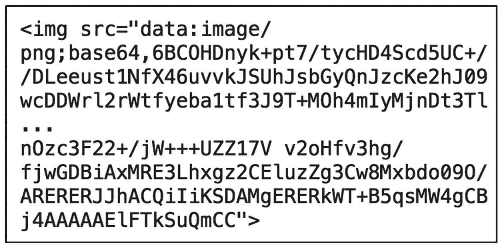

图 3-13

转换成字符串的图像

## 下载泰坦尼克号代码

让我们下载第 [3](03.html) 章的文件，如果你还没有这样做的话，把它们保存在你的本地机器上。下载完成后，打开命令行窗口，将驱动器切换到“**网络应用**文件夹。文件夹结构应该看起来像清单 [3-20](#PC20) 。

```py
web-application/
├── main.py
├── static/
                └── images/
                                ├── small_cabin_location.png
                                └── small_titanic.jpg
├── templates/
                └── index.html
├── titanic3.csv
├── requirements.txt
├── app.yaml
└── appengine_config.py

Listing 3-20Web Application Files

```

一旦你下载并解压了所有东西，打开一个命令行窗口，将 drive 切换到" **web-application** "文件夹，并通过运行" **pip install -r** "命令安装所有需要的 Python 库(清单 [3-21](#PC21) )。

```py
$ pip3 install -r requirements.txt

Listing 3-21Installing Requirements

```

与前面的本地 Flask 应用程序一样，运行“ **Python3 main.py** ”命令。它应该类似于图 [3-14](#Fig14) 中的屏幕截图。

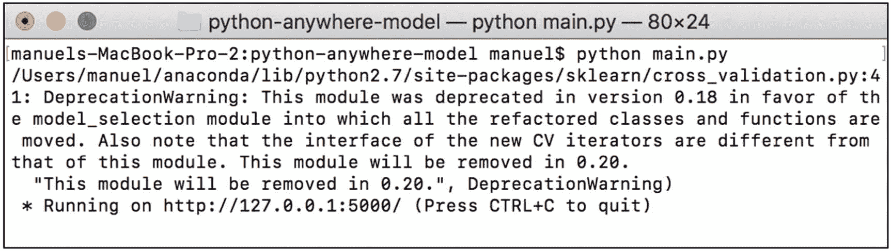

图 3-14

命令/终端窗口输出声明本地 Flask 网页的 URL 地址

然后将 URL“**http://127 . 0 . 0 . 1:5000/**”(或终端窗口中显示的任何内容)复制到您的浏览器中，您应该会看到 Titanic web 应用程序出现。如果没有，在你喜欢的代码编辑器中打开“**main . py**”(Mac 上的 sublime 或 Windows 上的 notepad++是我的最爱)，将最后一行的布尔标志切换为“ **True** ”重新运行它并解决记录器抱怨的任何问题。

参见图 [3-15](#Fig15) 中 web 应用程序的本地版本。

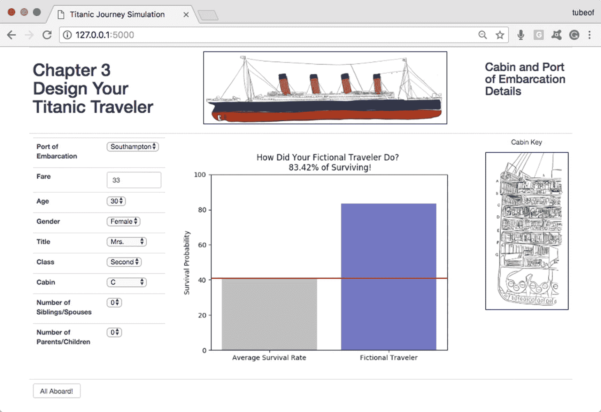

图 3-15

我们 web 应用程序的本地版本

## 谷歌云灵活应用引擎

现在，这是另一个有趣的部分，让我们的应用程序进入无服务器云，让世界看到！在介绍章节中，我们看了标准的应用引擎，这一次我们将不得不使用灵活的应用引擎来运行更复杂的 Python 库。

### 谷歌应用引擎

谷歌应用引擎是无服务器的，所以你不必考虑你的网络应用背后的任何硬件。你不必知道你的应用程序运行在什么操作系统下，它会相应地扩展，谷歌会负责安全补丁，你只需为你使用的东西付费。

有两种类型的应用引擎可供选择:一种非常简单，但可定制性较差，另一种则不然。我们在第 [1 章](01.html)中使用了标准环境；由于某些 Python 库的需要，这里我们需要使用灵活的环境(图 [3-16](#Fig16) )。

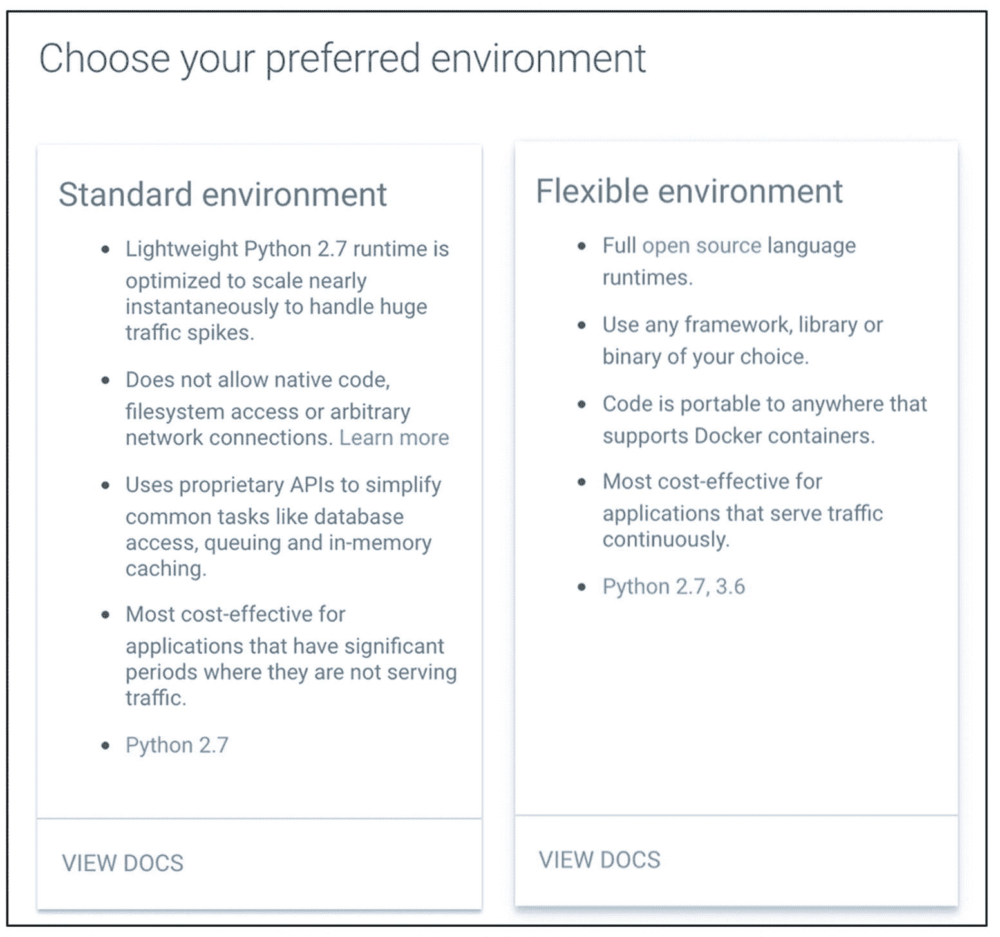

图 3-16

App Engine 的标准环境和灵活环境之间的差异(在您阅读本文时可能已经发生了变化)

## 在 Google 应用引擎上部署

在 Google App Engine 上部署 web 应用程序有多种方式。在本章中，我们将使用仪表板本身的内置 shell 终端。这是你用来快速工作的东西；对于更长的时间，您需要从本地计算机打开一个终端会话，并使用适当的身份验证启动到 Google Cloud 帐户的连接。其他方式包括将 GitHub(或 BitBucket)直接链接到你的谷歌云账户，直接在你的本地机器上使用终端会话，还有直接在仪表盘中的实验性代码编辑器(见 [`https://cloudplatform.googleblog.com/2016/10/introducing-Google-Cloud-Shels-new-code-editor.html`](https://cloudplatform.googleblog.com/2016/10/introducing-Google-Cloud-Shels-new-code-editor.html) )。

如果您还没有 Google Cloud 的帐户，您可以到 Google Cloud 入门( [`https://console.cloud.google.com/getting-started`](https://console.cloud.google.com/getting-started) )设置一个。在撰写本文时，谷歌正在提供 12 个月和 300 美元的信贷来帮助你起步(图 [3-17](#Fig17) )。


图 3-17

谷歌云平台特别产品

### 第一步:启动谷歌云外壳

登录您的 Google Cloud 实例，创建或选择您希望应用引擎驻留的项目。单击右上角的插入符号按钮，启动云外壳命令行工具。这将在 GCP 仪表板的下半部分打开一个熟悉的命令行窗口(图 [3-18](#Fig18) )。


图 3-18

访问谷歌云外壳

### 第二步:压缩并上传所有文件到云端

有许多方法可以继续:您可以一个接一个地上传文件，克隆一个 GitHub 库，或者您可以将它们压缩到一个归档文件中，然后上传压缩文件。我们将选择后者。因此，压缩“ **web-application** ”文件夹中的 11 个文件(图 [3-19](#Fig19) )。

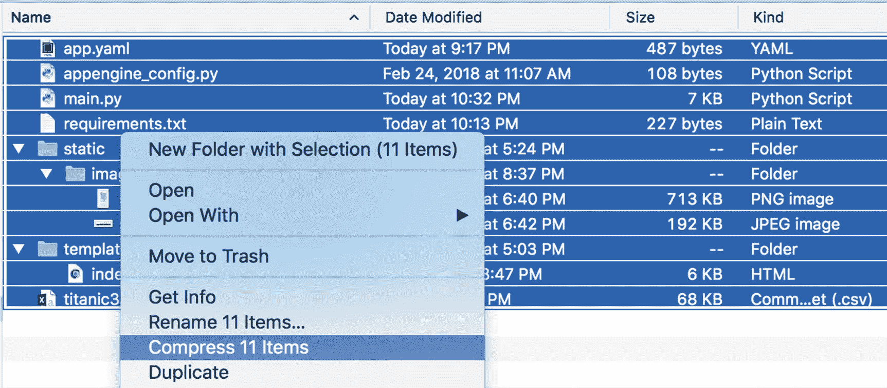

图 3-19

压缩 web 应用程序文件以上传到 Google Cloud

使用“**上传文件**选项上传文件(该选项位于外壳窗口右上方的三个垂直点下方；图 [3-20](#Fig20) 。

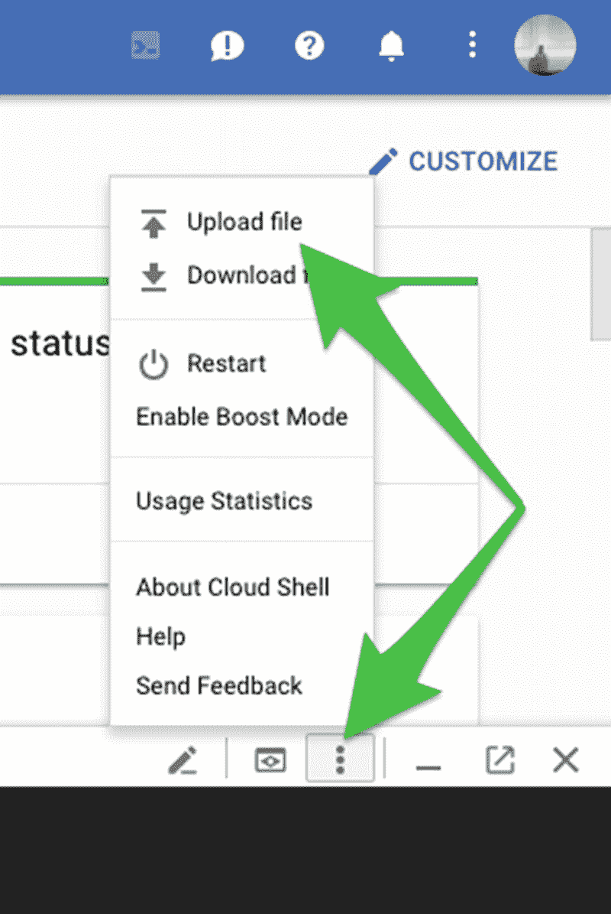

图 3-20

通过 Google Cloud shell 上传文件

### 第三步:在 Google Cloud 上创建工作目录并解压文件

文件上传成功后，创建一个新目录，比如“**第三章**”，然后将压缩文件移入其中并解压(清单 [3-22](#PC22) )。

```py
$ mkdir chapter-3
$ cd chapter-3/
$ mv ../Archive.zip Archive.zip
$ unzip Archive.zip

Listing 3-22Getting the GCP Directory Ready for Deployment

```

### 步骤 4:创建库文件夹

我们快到了。如果您查看 requirements.txt 文件，您会看到运行应用程序所需的一个或多个 Python 库。当您构建自己的应用程序时，这是您列出所有需要的库的地方；然后运行脚本，将它们安装到 lib 文件夹中。提醒一句，Google App Engine 的标准环境版本只支持最小的一组库；对于任何更复杂的事情，您将需要使用灵活的环境(这是因为它需要更接近 Python 解释器)。因此，运行以下命令将所有需要的附加库安装到 lib 文件夹中。当您部署 web 应用程序时，lib 文件夹将与所需的库一起移动(清单 [3-23](#PC23) )。

```py
$ pip install -t lib -r requirements.txt

Listing 3-23Loading All Required Python Libraries into the “lib” Folder

```

### 步骤 5:部署 Web 应用程序

最后，使用 deploy 命令将其部署到世界上。它将提示一个确认屏幕以便继续操作(列表 [3-24](#PC24) )。

```py
$ gcloud app deploy app.yaml

Listing 3-24Deploying the Web Application to the Cloud

```

就是这样！坐下来，让无服务器工具部署我们的网站。这是灵活的应用程序引擎，因此完全部署可能需要 20 分钟。一旦完成所有设置，它将提供一个可点击的链接，直接跳转到已部署的 web 应用程序，或者您可以使用“ **browse** ”命令到达那里(清单 [3-25](#PC25) )。

```py
$ gcloud app browse

Listing 3-25Getting the Location URL of Our Web Application

```

享受您的劳动成果，并确保通过设计不同的乘客来试验 web 应用程序(图 [3-21](#Fig21) )。


图 3-21

我们在谷歌云上的网络应用

## 解决纷争

在有些情况下，你会遇到问题，而谷歌云日志会是你最好的朋友。您可以直接在 Google Cloud dashboard 中或通过日志 URL(清单 [3-26](#PC26) )轻松找到它们。

```py
https://console.cloud.google.com/logs

Listing 3-26GCP Log Page

```

或者可以通过调用云 shell 中的“ **app logs tail** ”命令来流式传输日志的尾部(清单 [3-27](#PC27) )。

```py
$ gcloud app logs tail -s default

Listing 3-27Following Deployment Logs

```

## 停业商店

最后一件事:在我们完成 web 应用程序之前:不要忘记停止或删除您的应用引擎云实例。即使你使用的是免费信用，计价器仍然在运行，没有必要浪费金钱或信用。

与标准应用引擎相比，灵活应用引擎的情况略有不同，因为灵活应用引擎的成本更高。所以，如果你不使用它，停止它是很重要的。此外，这一切都可以通过谷歌云仪表板方便地完成。

导航至应用程序引擎，然后导航至版本。点击您的活动版本并停止(图 [3-22](#Fig22) )。如果有多个版本，可以删除旧的；您将无法删除默认的，但停止它应该足够了(如果您真的不想要它的任何痕迹，只需删除整个项目)。


图 3-22

停止和/或删除您的应用引擎版本

## 这是怎么回事？

让我们简单看一下代码中一些值得注意的部分。

### main.py

“ **main.py** ”文件与我们为这一章处理的 Jupyter 笔记本有些不同。运行 web 应用程序时，最好不要过于依赖处理。这就是为什么我们抛弃了任何熊猫代码，而是选择使用 NumPy 数组(清单 [3-28](#PC28) )。

```py
from numpy import genfromtxt
titanic_array = genfromtxt('titanic3.csv', delimiter=',')

Listing 3-28Creating a Matrix Array from a CSV File

```

例如，当用户设计一个新的乘客配置文件时，这些值被简单地添加到列表中(以正确的顺序)并直接输入到逻辑回归模型中。这些字段没有被虚拟化，而是从一开始就被创建在一个虚拟状态中(基本上，我们是手动虚拟化它们的；列表 [3-29](#PC29) )。

```py
if (selected_cabin=='B'):
    cabin_B = 1
if (selected_cabin=='C'):
    cabin_C = 1
if (selected_cabin=='D'):
    cabin_D = 1
if (selected_cabin=='E'):
    cabin_E = 1
if (selected_cabin=='F'):
    cabin_F = 1
if (selected_cabin=='G'):
    cabin_G = 1
if (selected_cabin=='T'):
    cabin_T = 1
if (selected_cabin=='Unknown'):
    cabin_Unknown = 1

user_designe_passenger = [[age, sibsp, parch, fare, isfemale, pclass_Second, pclass_Third, pclass_nan, cabin_B, cabin_C, cabin_D, cabin_E, cabin_F, cabin_G, cabin_T, cabin_Unknown, cabin_nan, embarked_Q, embarked_S, embarked_Unknown, embarked_nan, title_Master, title_Miss, title_Mr, title_Mrs, title_Rev, title_Unknown, title_nan]]

Listing 3-29Dummying Categories Manually

```

在这段代码中，“ **cabin** ”特性被直接存储为一个整数。这为我们节省了一些处理步骤，比如避免调用熊猫“ **get_dummies()** ”函数。

### 应用程式 yaml

YAML 是一种序列化语言，许多框架都依赖它来配置和存储程序设置。“ **app.yaml** ”文件保存配置设置，例如将 App Engine 环境设置为“ **flex** ”，将 Python starter 脚本的名称设置为“ **main** ”，以及所需硬件的信息(列表 [3-30](#PC30) )。

```py
runtime: python
env: flex
entrypoint: gunicorn -b :$PORT main:app

runtime_config:
  python_version: 3

# This sample incurs costs to run on the App Engine flexible environment.
# The settings below are to reduce costs during testing and are not appropriate
# for production use. For more information, see:
# https://cloud.google.com/appengine/docs/flexible/python/configuring-your-app-with-app-yaml
manual_scaling:
  instances: 1
resources:
  cpu: 1
  memory_gb: 0.5
  disk_size_gb: 10

Listing 3-30A Look Inside the App Engine Flexible “app.yaml” File

```

App Engine Flexible 要求磁盘大小至少有 10GB 的空间。

有关应用程序引擎的“ **yaml** ”文件的更多信息，请参见 [`https://cloud.google.com/appengine/docs/flexible/python/configuring-your-app-with-app-yaml`](https://cloud.google.com/appengine/docs/flexible/python/configuring-your-app-with-app-yaml) 。

### appengine_config.py & lib 文件夹

“ **appengine_config.py** ”文件和“ **lib** ”文件夹协同工作，处理让 web 应用程序运行所需的所有额外 Python 库(清单 [3-31](#PC31) )。

```py
from google.appengine.ext import vendor

# Add any libraries installed in the "lib" folder
vendor.add('lib')

Listing 3-31A Look Inside the “appengine_config.py” Script

```

通过调用“ **pip install** ”(清单 [3-32](#PC32) )，用所需的 Python 库填充“ **lib** ”文件夹。

```py
pip install -t lib -r requirements.txt

Listing 3-32Populating the “lib” Folder

```

如果您在运行该命令后查看“ **lib** ”文件夹，您将看到各种各样的 Python 库都已部署并准备好提供服务。该文件夹将与您的所有 web 应用程序文件一起部署，以使它们正常工作。“ **appengine_config.py** ”比这里展示的谷歌应用引擎做了更多的事情；更多详情请见官方文件。

### 注意

有关 appengine_config.py 的更多信息，请参见谷歌文档: [`https://cloud.google.com/appengine/docs/standard/python/tools/appengineconfig`](https://cloud.google.com/appengine/docs/standard/python/tools/appengineconfig) 。

### requirements.txt

下面是让 Titanic web 应用程序启动并运行所需的所有 Python 库(您的版本号会有所不同；列表 [3-33](#PC33) )。

```py
click==6.7
Flask==0.12.2
itsdangerous==0.24
Jinja2==2.10
MarkupSafe==1.0
numpy==1.14.2
scikit-learn
scipy
python-dateutil==2.7.2
pytz==2018.4
six==1.11.0
Werkzeug==0.14.1
Pillow>=1.0
matplotlib
gunicorn>=19.7.1

Listing 3-33Python Libraries Needed to Run Our Web Application

```

## 步骤概述

让我们来完成在 Google Cloud 上部署大型 web 应用程序所需的步骤。

1.  检查 web 应用程序是否在本地运行，压缩所有 web 应用程序文件，在 Google Cloud 上创建目标文件夹，并解压缩文件:

1.  创建“ **lib** 文件夹:

```py
$ mkdir chapter-3
$ cd chapter-3/
$ mv ../Archive.zip Archive.zip
$ unzip Archive.zip

```

1.  部署 web 应用程序:

```py
pip install -t lib -r requirements.txt

```

1.  获取 web 应用程序的 URL:

```py
gcloud app deploy app.yaml

```

```py
gcloud app browse

```

关闭商店，到你的 GCP 仪表板进入应用引擎，并终止任何运行版本。

## 结论

关于泰坦尼克号的数据集，我们了解到富有的女性生存几率最高，而贫穷的男性生存几率最低。

尽管这个项目相当简单，但本章介绍了许多概念和新技术。第一点是，无论何时开发本地 Python 思想和模型，都要提前考虑几个步骤，以预见扩展到云的方法。这包括保持事情简单，致力于直观的概念，以及保持代码的整洁和高效。

<aside class="FootnoteSection" epub:type="footnotes">Footnotes [1](#Fn1_source)

[T2`http://biostat.mc.vanderbilt.edu/wiki/Main/DataSets`](http://biostat.mc.vanderbilt.edu/wiki/Main/DataSets)

  [2](#Fn2_source)

[T2`http://scikit-learn.org/stable/modules/generated/sklearn.linear_model.LogisticRegression.html`](http://scikit-learn.org/stable/modules/generated/sklearn.linear_model.LogisticRegression.html)

  [3](#Fn3_source)

[T2`http://biostat.mc.vanderbilt.edu/wiki/pub/Main/DataSets/Ctitanic3.html`](http://biostat.mc.vanderbilt.edu/wiki/pub/Main/DataSets/Ctitanic3.html)

  [4](#Fn4_source)

[T2`https://www.w3schools.com/html/html_forms.asp`](https://www.w3schools.com/html/html_forms.asp)

  [5](#Fn5_source)

[T2`https://docs.python.org/2/library/base64.html`](https://docs.python.org/2/library/base64.html)

 </aside>****