# 6.在 Azure 上用谷歌地图显示预测

旧金山接下来哪里会发生犯罪？让我们使用谷歌地图和微软 Azure 构建一个交互式预测地图仪表板。

我们通过使用强大的 Google Maps API 显示信息，再次提升了我们的游戏。我们将建立一个网络仪表板来预测、绘制和可视化旧金山的犯罪(图 [6-1](#Fig1) )。我们将使用来自“ **DataSF |三藩市公开数据**”的数据集，该数据集来自真实且定期更新的 SFPD 犯罪事件报告系统。通过最少的工作，我们可以从世界上最流行的制图框架中获益。


图 6-1

本章的最后一个 web 应用程序

### 注意

进入 [`www.apress.com/9781484238721`](http://www.apress.com/9781484238721) 并点击源代码按钮，下载第 [6 章](06.html)的文件。打开 Jupyter 笔记本" **chapter6.ipynb** "跟随本章内容。

## 规划我们的 Web 应用程序

这是一个雄心勃勃的项目，因为我们将建立一个应用程序，它将预测和可视化犯罪在未来会发生在哪里。它不仅需要一个围绕犯罪数据和时间的建模层，还需要一个直观、有吸引力的可视化层。

## 探索关于犯罪热图的数据集

如果您想获得某个大城市的最新犯罪数据，只需 DataSF 即可。 <sup>[1](#Fn1)</sup> 它实际上提供的不仅仅是犯罪数据；据我最后一次检查，它有超过 462 个关于旧金山市各种主题的已发布数据集。

我们将使用科幻犯罪热图；它有相当新的数据，通常在每个月底更新。DataSF 也有一个仪表板，你可以在地图上可视化数据`—`酷的东西(见 [`https://data.sfgov.org/Public-Safety/SF-Crime-Heat-Map/q6gg-sa2p/data`](https://data.sfgov.org/Public-Safety/SF-Crime-Heat-Map/q6gg-sa2p/data) )。继续把这一章的文件下载到一个名为“**第六章**的文件夹中，然后打开 Jupyter 笔记本跟着做。

这是一个相当大的数据集(超过 250 MB)；因此，让我们只下载一次数据，并在后续运行中运行本地副本。在 Jupyter 笔记本中，运行数据下载代码，并在代码成功下载并保存到本地后，将标志“ **already_have_the_data** ”变为“ **True** ”。这将确保笔记本的任何后续运行都将从您的本地计算机中提取数据。

当您下载数据集时，数据集可能会有所不同，因为他们会不断向其中添加数据。我们用熊猫“ **read_csv()** ”下载下来保存在本地。粗略地看一下数据，我们看到它包含 14 列和超过 170 万行(清单 [6-1](#PC1) )。

```py
Input:

crime_df.shape

Output:

(2192062, 12)

Listing 6-1Get Dataset Shape

```

我们看到我们有 2003 年到 2018 年的数据(列表 [6-2](#PC2) )。

```py
Input:

years = [int(dte.split("/")[2]) for dte in crime_df['Date']]
print('Max year %i, min year %i' % (max(years), min(years)))

Output:

Max year 2018, min year 2003

Listing 6-2Years Covered by Data

```

我们还注意到它包含了有趣和不太有趣的字段(清单 [6-3](#PC3) )。

```py
Input:

list(crime_df)

Output:

['IncidntNum',
 'Category',
 'Descript',
 'DayOfWeek',
 'Date',
 'Time',
 'PdDistrict',
 'Resolution',
 'Address',
 'X',
 'Y',
 'Location']

Listing 6-3Feature Names (before any cleanup)

```

## 数据清理

为了使数据更容易处理和更直观，我们将只保留“**类别**、“**星期几**、“**日期**、“**时间**、“ **X** 、“ **Y** ”，并将“ **X** ”和“ **Y** ”重命名为“**经度**和“**纬度**

 **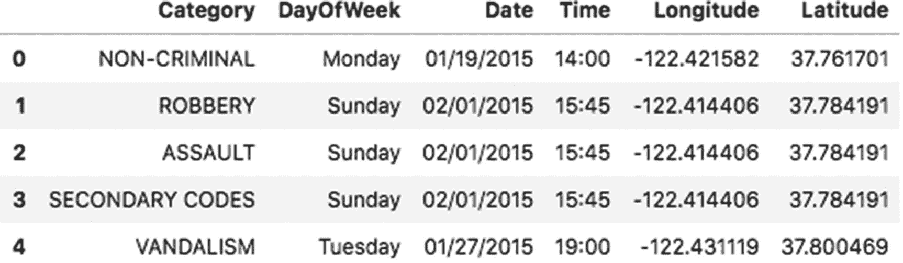

图 6-2

仅保留具有更好的列标题名称的有用功能

```py
crime_df = crime_df[['Category', 'DayOfWeek', 'Date', 'Time', 'X', 'Y']]
crime_df.columns = ['Category', 'DayOfWeek', 'Date', 'Time', 'Latitude', 'Longitude']
crime_df.head()

Listing 6-4Drop Unwanted Features and Rename Columns

```

## 重新平衡数据集

让我们走一个探索性的弯路，进一步了解这些数据。我们将从查看类别和每个类别包含多少报告开始(清单 [6-5](#PC5) )。

```py
Input:

crime_df['Category'].value_counts()

Output:

LARCENY/THEFT                  473842
OTHER OFFENSES                 306575
NON-CRIMINAL                   235669
ASSAULT                        192459
VEHICLE THEFT                  125983
DRUG/NARCOTIC                  118911
VANDALISM                      114688
WARRANTS                       100512
BURGLARY                        90495
SUSPICIOUS OCC                  79618
MISSING PERSON                  64332
ROBBERY                         55332
FRAUD                           41104
SECONDARY CODES                 25495
FORGERY/COUNTERFEITING          22938
WEAPON LAWS                     21991
TRESPASS                        19195
PROSTITUTION                    16669
STOLEN PROPERTY                 11771
SEX OFFENSES, FORCIBLE          11554
DISORDERLY CONDUCT               9988
DRUNKENNESS                      9781
RECOVERED VEHICLE                8716
DRIVING UNDER THE INFLUENCE      5629
KIDNAPPING                       5307
RUNAWAY                          4403
LIQUOR LAWS                      4078
ARSON                            3887
EMBEZZLEMENT                     2961
LOITERING                        2420
SUICIDE                          1285
FAMILY OFFENSES                  1177
BAD CHECKS                        921
BRIBERY                           804
EXTORTION                         733
SEX OFFENSES, NON FORCIBLE        425
GAMBLING                          343
PORNOGRAPHY/OBSCENE MAT            57
TREA                               14

Listing 6-5Categories in Dataset

```

除了这些令人害怕的类别，你还会注意到排名靠前的类别占大多数。我们可能需要将事物重新分类，分成更小、更平衡的类别。这对于 Python 熊猫来说很容易做到。让我们创建以下逻辑组(至少它们对我有意义；列表 [6-6](#PC6) 。

```py
THEFT = ["LARCENY/THEFT", "VEHICLE THEFT", "BURGLARY", "ROBBERY", "STOLEN PROPERTY"]

IMPAIRED = ["DRUNKENNESS", "DRIVING UNDER THE INFLUENCE", "LIQUOR LAWS", "DISORDERLY CONDUCT", "DRUG/NARCOTIC", "LOITERING"]

VIOLENCE = ["ASSAULT", "VANDALISM", "SUSPICIOUS OCC", "TRESPASS", "SEX OFFENSES,
FORCIBLE" , "SEX OFFENSES, NON FORCIBLE"]

OTHER = ["OTHER OFFENSES", "NON-CRIMINAL"]

Listing 6-6Higher Level Groupings

```

使用 NumPy 方便的" **select()** "函数，我们可以创建新的超级类别(清单 [6-7](#PC7) )。

```py
selections = [
    (crime_df['Category'].isin(THEFT)),
    (crime_df['Category'].isin(IMPAIRED)),
    (crime_df['Category'].isin(VIOLENCE)),
    (crime_df['Category'].isin(OTHER))]

new_categories = ['THEFT', 'IMPAIRED', 'VIOLENCE', 'OTHER']
crime_df['CAT'] = np.select(selections, new_categories, default="OTHER")

Listing 6-7Using NumPy’s “select()” Feature to Create New Categories

```

如果我们通过计数来查看我们的类别，我们会发现我们有一个更好的平衡，更重要的是，要处理的集合要短得多(清单 [6-8](#PC8) )。

```py
Input:

crime_df_tmp['CAT'].value_counts()

Output:

OTHER       865893
THEFT       757423
VIOLENCE    417939
IMPAIRED    150807

Listing 6-8Counts of New Categories

```

## 按星期几浏览

让我们按一周中的某一天来划分这些类别。盗窃事件在周五最为普遍，其次是周六(列表 [6-9](#PC9) 和图 [6-3](#Fig3) )。

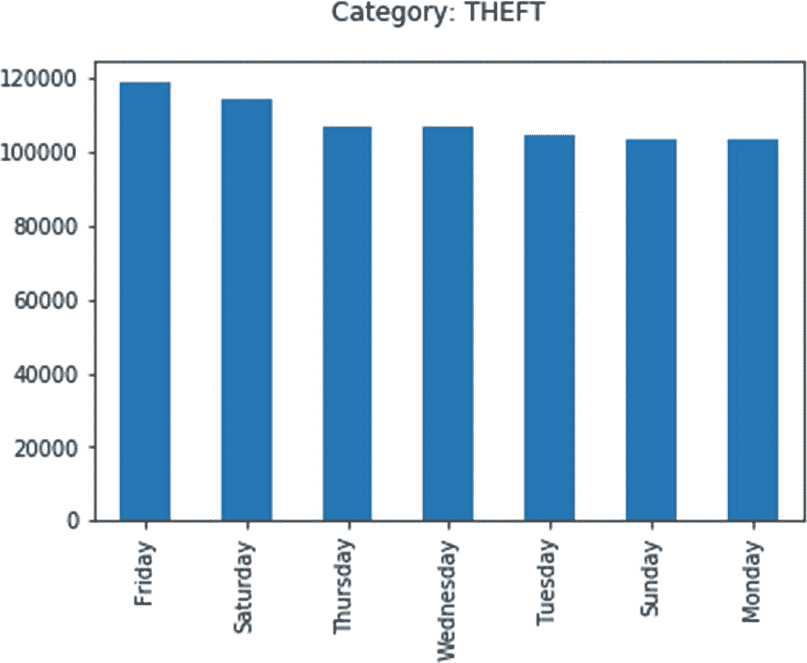

图 6-3

按星期计算的盗窃

```py
crime_df_tmp = crime_df[crime_df['CAT'] == 'THEFT']
crime_df_tmp['DayOfWeek'].value_counts().plot(kind='bar')
plt.suptitle('Category: THEFT')

Listing 6-9Theft by Day-of-the-Week

```

让我们按一周中的某一天来划分这些类别。令人惊讶的是，“**受损**在工作日发生得最多(图 [6-4](#Fig4) )。


图 6-4

因星期几而受损

## 特征工程

让我们将一些数据转换成更简单的组，这将有助于我们以更一般化的方式对此建模。

### 创建一年中的一个月的特征

我们将从一个简单的开始，创建一个一年中的一个月的特征。我们对年份不感兴趣，只对月份感兴趣；我们假设这些年来的大多数一月都是相似的。这仅仅需要从日期字段中取出前两位数字。如果不是这种简洁的格式，我们将不得不把它转换成一个日期字段并使用一些特殊的函数(清单 [6-10](#PC10) 和图 [6-5](#Fig5) )。

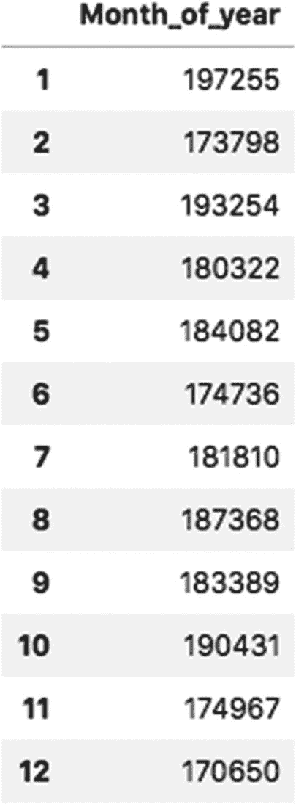

图 6-5

每月报告的犯罪总数表

```py
crime_df["Month_of_year"] = [int(dte.split("/")[0]) for dte in crime_df['Date']]
crime_df["Month_of_year"].value_counts()

Listing 6-10Aggregating by Months

```

不出所料，我们有 12 个小组。让我们把它们标出来，看看哪个月的犯罪率最高(列表 [6-11](#PC11) 和图 [6-6](#Fig6) )。

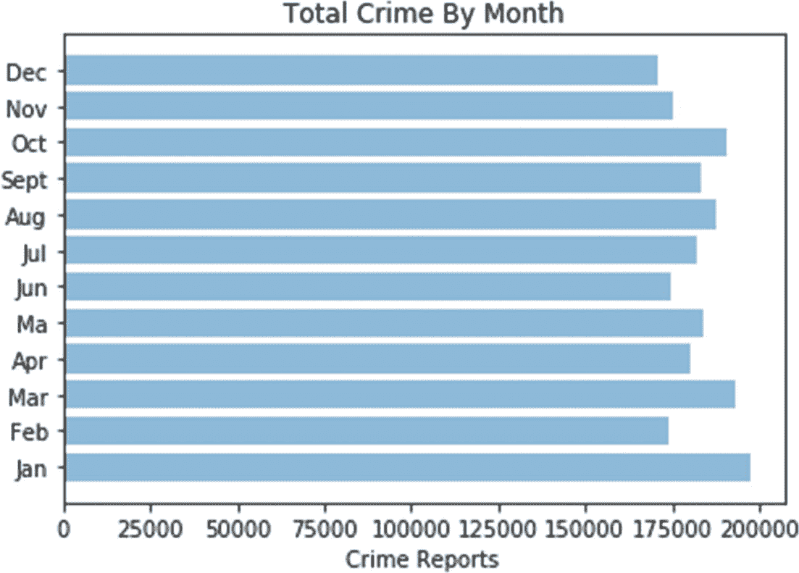

图 6-6

每月报告的犯罪总数

```py
plt.barh(crime_by_month.index, crime_by_month['Month_of_year'], align="center", alpha=0.5)
objects = ['Jan','Feb','Mar','Apr','Ma','Jun','Jul','Aug','Sept','Oct','Nov','Dec']
plt.yticks(crime_by_month.index, objects)
plt.xlabel('Crime Reports')
plt.title('Total Crime By Month')
plt.show()

Listing 6-11Reported Crime Counts by Month

```

我们可以通过按犯罪类别细分数据来进行更深入的挖掘(图 [6-7](#Fig7) )。

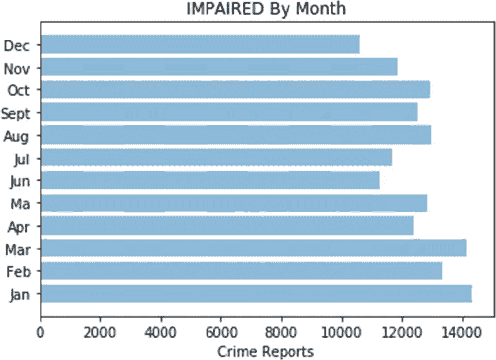

图 6-7

类别“**受损**”的年度月报告犯罪计数

### 创建时间段

为了简化我们的时间数据，我们将把它分成三类:

*   早晨

*   下午

*   夜晚

我们将重用我们的“ **np.select()** ”函数，但是有很多其他方法可以达到相同的结果，比如使用“ **np.where()** ”或 comprehensions。我们首先创建一个名为“**小时**的新特性，它从完整的时间戳中提取报告犯罪的时间。然后，我们简单地在 24 小时时间线上创建三个时区，并过滤出哪个小时适合哪个时间段。我们最终得到了三个相当平衡的类别，稍微偏向非 am 报告的犯罪(清单 [6-12](#PC12) )。

```py
Input:

# create AM, AFT, NT
crime_df["Hour"] = [int(hr.split(":")[0]) for hr in crime_df['Time']]
crime_df["Hour"]

# create new groups
selections = [
    (crime_df['Hour'] > 5) & (crime_df['Hour'] <=13),
    (crime_df['Hour']  > 13) & (crime_df['Hour'] <= 19),
    (crime_df['Hour']  > 18) & (crime_df['Hour'] <= 5)]

new_categories = [0, 1, 2] # ['AM', 'AFT', 'NIT']
crime_df['Day_Segment'] = np.select(selections, choices, default=2)
crime_df['Day_Segment'].value_counts()

Output:

2    683804
1    674292
0    620236

Listing 6-12Transform Time Using Categories “AM,” “AFT,” and “NT”

```

### 按时间段探索

举报的“**受损**犯罪似乎在下午更为普遍，而举报的“**暴力**犯罪似乎在夜间更为普遍(图 [6-8](#Fig8) 和 [6-9](#Fig9) )。

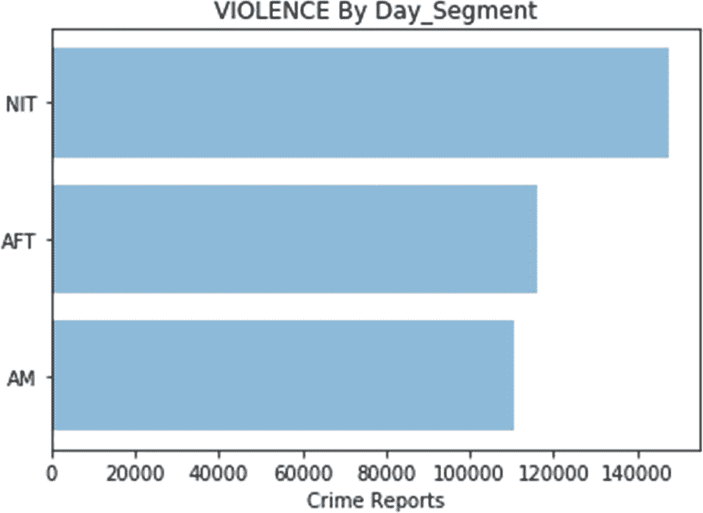

图 6-9

按时间段分列的“**暴力事件**”报告犯罪

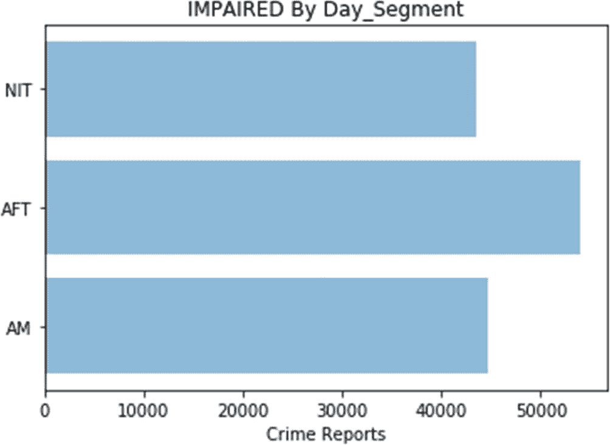

图 6-8

按时间段对“**受损的**”报告的犯罪进行细分

### 注意

有关更多图表，请参考本章的 Jupyter 笔记本。

## 可视化地理数据

该数据集的一个很大的特点是，它包括犯罪报告地点的纬度和经度。这对于创建基于位置的模型非常有用，对于可视化也非常有用。事实上，您可以简单地在 Matplotlib 中将纬度和经度绘制为 x 和 y，并获得数据的直观表示。我们来试试吧(列表 [6-13](#PC13) 图 [6-10](#Fig10) )。

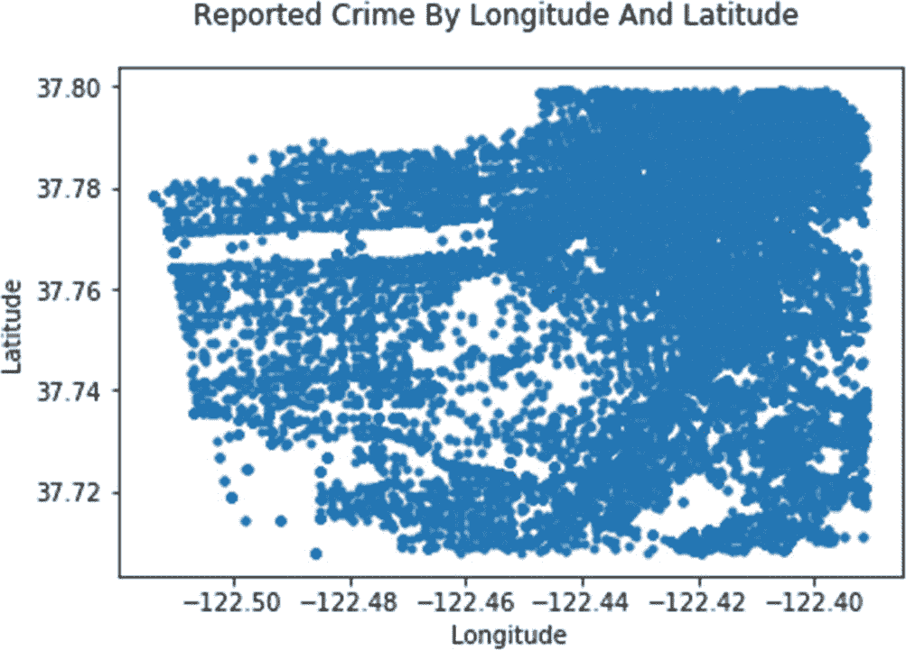

图 6-10

报案地点的经度和纬度的原始绘图

```py
plt.plot(crime_df['Longitude'].head(50000),
         crime_df['Latitude'].head(50000),
         linestyle='none', marker='.')
plt.show()

Listing 6-13Plotting Crime by Longitude and Latitude

```

从图中可以看出，通过查看空间区域，我们可以很容易地分辨出金门公园、普雷斯迪奥公园和默塞德湖公园(图 [6-11](#Fig11) )。

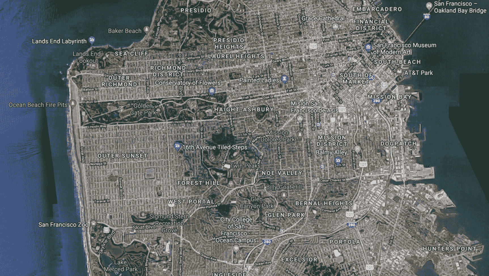

图 6-11

谷歌地图上同一地区的对比卫星图(来源谷歌地图)

### 舍入地理坐标以创建区域存储桶

使用地理坐标的一个技巧是，你可以很容易地将它们圆化，它们会创建一个综合的网格`—`,对于更紧密的网格，圆得更少，对于更松散的网格，圆得更多。我们创建一个简单的“ **rounding_factor** ”变量来帮助我们更好地找到所需的正确视角。我们来看看(列表 [6-14](#PC14) 和[6-15](#PC15)；图 [6-12](#Fig12) 和 [6-13](#Fig13) 。

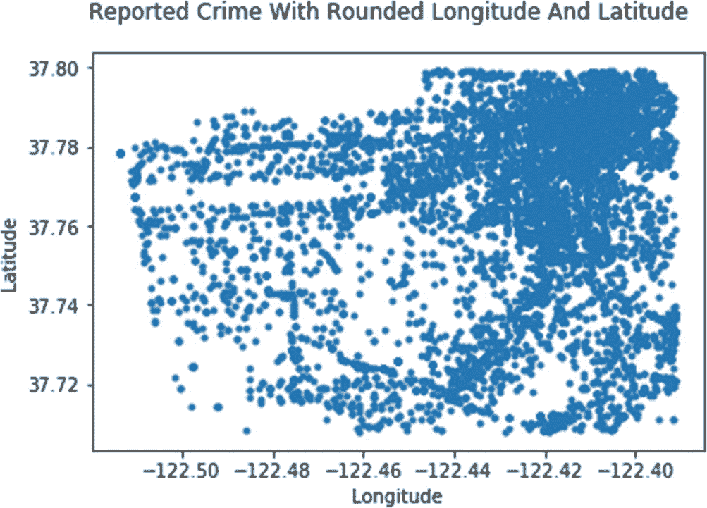

图 6-12

将经度和纬度四舍五入到小数点后四位数

```py
rounding_factor = 4
plt.plot(np.round(crime_df['Longitude'].head(10000),rounding_factor),
         np.round(crime_df['Latitude'].head(10000),rounding_factor),
         linestyle='none', marker='.')

Listing 6-14Rounding Geocoordinates

```

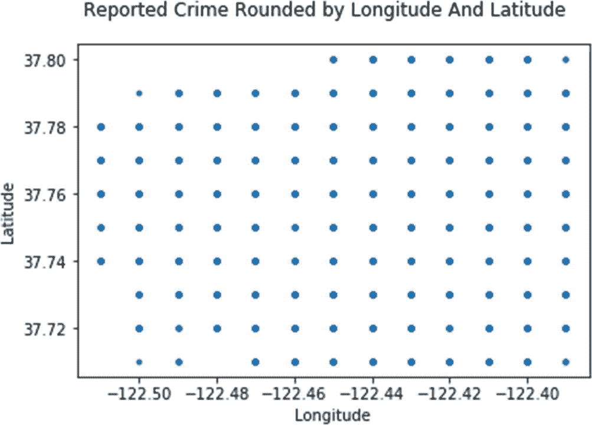

图 6-13

将经度和纬度四舍五入到小数点后两位数

```py
rounding_factor = 2
plt.plot(np.round(crime_df['Longitude'].head(10000),rounding_factor),
         np.round(crime_df['Latitude'].head(10000),rounding_factor),
         linestyle='none', marker='.')

Listing 6-15Rounding Geocoordinates

```

我们将采用最后一种情况，将数字四舍五入到小数点后两位数。正如您在相应的图中所看到的，它形成了一个干净的、均匀间隔的网格，非常适合对已报告的犯罪活动进行概括透视。作为最后一个 Matplotlib 实验，我们可以创建一个犯罪热图(列表 [6-16](#PC16) 和图 [6-14](#Fig14) )。

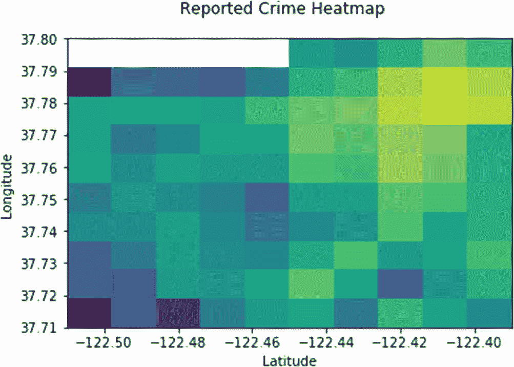

图 6-14

举报犯罪热图；显然，最明亮的区域在旧金山的东北部

```py
from matplotlib.colors import LogNorm
x = np.round(crime_df['Longitude'].head(10000),rounding_factor)
y = np.round(crime_df['Latitude'].head(10000),rounding_factor)
fig = plt.figure()
plt.suptitle('Reported Crime Heatmap')
plt.xlabel('Latitude')
plt.ylabel('Longitude')
H, xedges, yedges, img = plt.hist2d(x, y, norm=LogNorm())
extent = [yedges[0], yedges[-1], xedges[0], xedges[-1]]

Listing 6-16Experimenting with Heatmaps

```

## 用过去预测未来

我们将把到目前为止我们已经创建的基本特性聚合到一个通用的、基于时间的表示中。我们来看看(列表 [6-17](#PC17) ，图 [6-15](#Fig15) )。

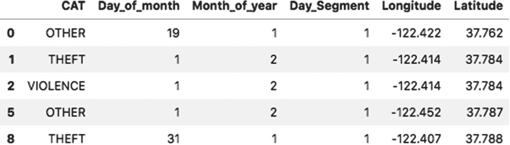

图 6-15

看看我们将输入到 web 应用程序中的数据

```py
crime_df = crime_df[['CAT', 'Day_of_month','Month_of_year', 'Day_Segment', 'Longitude', 'Latitude']]
crime_df.head()

Listing 6-17Capping the Data Down to Only Essential Features

```

该数据包含带有经度和纬度的广义位置部分，以及带有月份、日期和时间段的广义时间部分。我们需要将这些信息汇总到时间和位置级别。这将允许我们汇总报告，并根据一段时间内的报告数量构建强度图。

我们首先添加一个“ **Count** ”特性，并应用便利的熊猫“ **groupby()** ”函数(列表 [6-18](#PC18) 和图 [6-16](#Fig16) )。

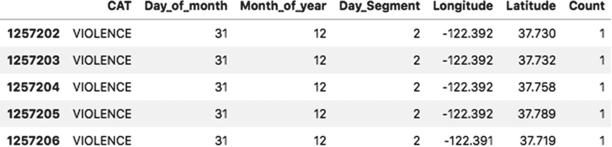

图 6-16

信息聚合到时间和位置级别

```py
crime_df['Count'] = 0
crime_df_agg = crime_df.groupby(['CAT', 'Day_of_month', 'Month_of_year',  'Day_Segment', 'Longitude',  'Latitude',]).count().reset_index()
crime_df_agg.tail()

Listing 6-18Aggregating Information by Time and Location

```

现在，我们可以要求一个特定的日期签名，并获得每个位置所有报告的犯罪(列表 [6-19](#PC19) 和图 [6-17](#Fig17) )。

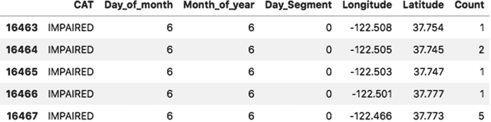

图 6-17

按日期签名汇总的信息

```py
Day_of_month = 1
Month_of_year = 1
Day_Segment = 1
crime_df_agg_tmp = crime_df_agg[(crime_df_agg['Day_of_month'] == Day_of_month) &
                               (crime_df_agg['Month_of_year'] == Month_of_year) &
                                 (crime_df_agg['Day_Segment'] == Day_Segment)]
crime_df_agg_tmp.head()

Listing 6-19Information Aggregated by Date Signature

```

我们也可以绘制这些信息(图 [6-18](#Fig18) )。

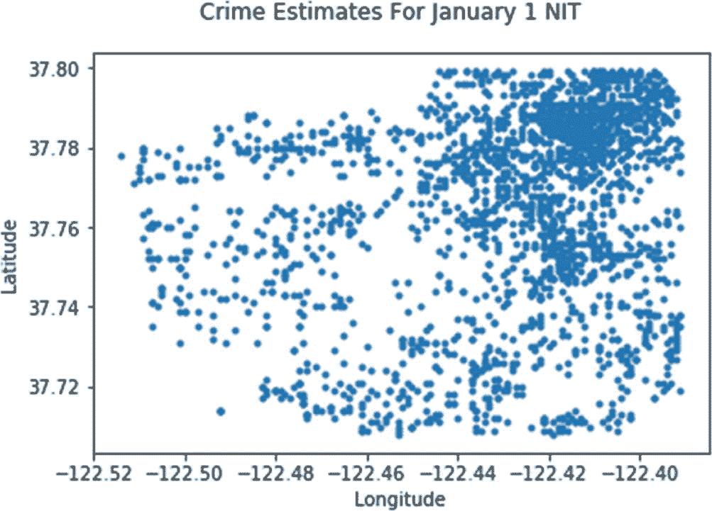

图 6-18

按经度和纬度对 1 月 1 日夜间的犯罪估计

这个图表不区分计数强度；让我们解决这个问题。我们将从 Matplotlib 的“ **plot()** ”切换到“ **scatter()** ”，并使用“ **s** ”或大小参数(列表 [6-20](#PC20) 和图 [6-19](#Fig19) )。

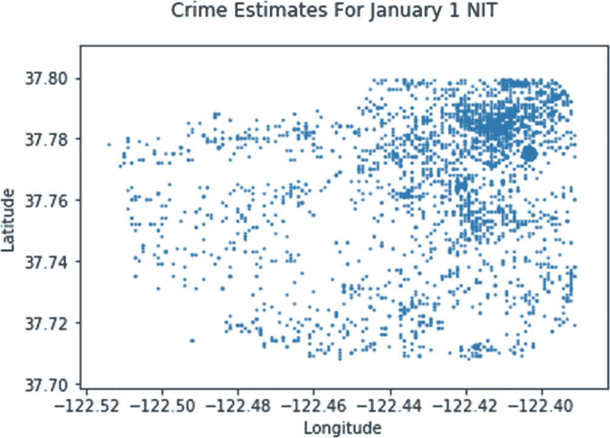

图 6-19

使用 Matplotlib 的散点函数绘图，并通过“**计数**功能调整 1 月 1s <sup>t</sup> 晚上的点大小

```py
plt.scatter(crime_df_agg_tmp['Longitude'],
         crime_df_agg_tmp['Latitude'], s=crime_df_agg_tmp['Count'])
plt.suptitle(title)
plt.xlabel('Longitude')
plt.ylabel('Latitude')
plt.show()

Listing 6-20Scatter Plot of Crime Data Using Dot Sizing

```

为了更好的测量，让我们拨出一个完全不同的时间(图 [6-20](#Fig20) )。

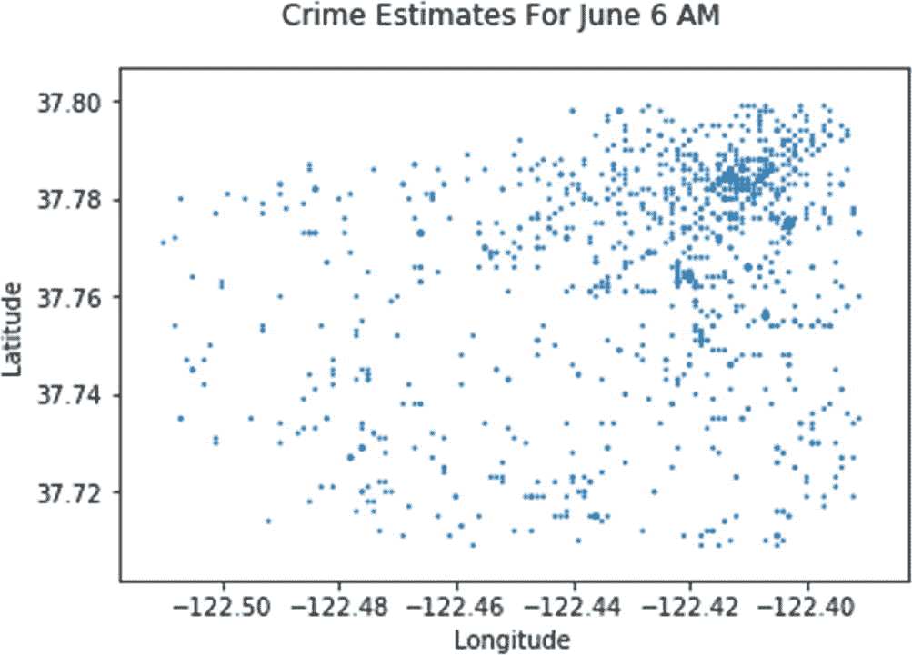

图 6-20

查看 6 月 6 日早上报告的犯罪总数

总结一下我们的快速估计，1 月 1 日晚上报告的犯罪比 6 月 6 日早上多。

## 谷歌地图简介

如果有一个伟大的和容易定制的可视化工具，它必须是谷歌地图！让我们换个方式，用谷歌地图代替普通的 Matplotlib 来尝试我们的数据。对于这一部分，为了让 web 应用程序工作，您需要在 [`https://developers.google.com/maps/documentation/javascript/get-api-key`](https://developers.google.com/maps/documentation/javascript/get-api-key) 创建一个免费的 Google Maps API 密匙。

过去，你可以不用谷歌地图就能使用它，但现在你需要它了，而且对于适度的使用，你可以使用免费层。

因此，获取这个键，尝试这个简单的例子，输入一个地址和 API 键，以获得关于该位置的各种推论信息。在您的浏览器中输入以下地址和 URL 链接:“**加州山景城 1600 号露天剧场公园路**”(列表 [6-21](#PC21) )。

```py
Input:

https://maps.googleapis.com/maps/api/geocode/xml?address=1600+Amphitheatre+Parkway,+Mountain+View,+CA&key=<<ADD YOUR GOOGLE MAP API KEY>>

Output:

<GeocodeResponse>
<status>OK</status>
<result>
<type>premise</type>
<formatted_address>
Google Building 41, 1600 Amphitheatre Pkwy, Mountain View, CA 94043, USA
</formatted_address>
...
<geometry>
<location>
<lat>37.4224082</lat>
<lng>-122.0856086</lng>
</location>
...

Listing 6-21If Your API Key Is Valid and the URL Is Well Formed, You Should See a Long XML Response with Similar Data

```

### 热图图层

热图是一种通过强度可视化信息的方式。这是一个非常有用的叠加在地图上的工具，因为它可以传达哪里发生了很多事情，而不是只发生了一点点`—`非常适合报告犯罪！

关于在谷歌地图上创建热图的一个很好的例子(图 [6-21](#Fig21) ，查看来自谷歌文档的谷歌地图 API 示例: [`https://developers.google.com/maps/documentation/javascript/examples/layer-heatmap`](https://developers.google.com/maps/documentation/javascript/examples/layer-heatmap) 。

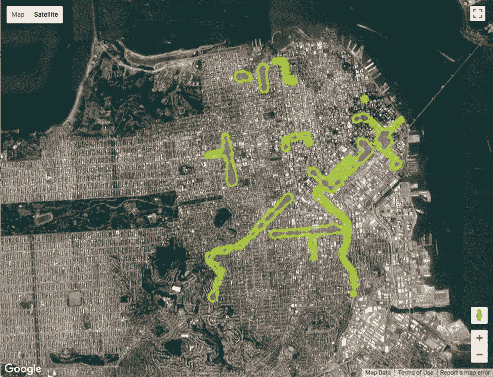

图 6-21

来自 Google Maps API 的示例脚本；为此，您将需要一个 API 密钥

## 带有犯罪数据的谷歌地图

让我们把犯罪数据输入谷歌地图。首先，我们需要理解 HTML 页面上 JavaScript 中的 Google Maps " **LatLng** "函数所期望的格式(清单 [6-22](#PC22) )。

```py
 <script>
        function getPoints() {
        return [
          new google.maps.LatLng(37.782551, -122.445368),
          new google.maps.LatLng(37.782745, -122.444586),
              ...
  ];}
</script>

Listing 6-22The “getPoints()” JavaScript Function

```

因此，我们需要从我们的“ **crime_df_agg_tmp** 中提取我们的纬度和经度，并将其格式化为 Google Maps 所期望的正确格式。然后我们将每个连接成一个长字符串，我们可以使用 Flask 将它传递到 HTML 脚本中(清单 [6-23](#PC23) )。

```py
LatLngString = "
for index, row in crime_df_agg_tmp.iterrows():
    LatLngString += "new google.maps.LatLng(" + str(row['Latitude']) + "," + str(row['Longitude']) + "),"

Listing 6-23Creating New Google Maps “LatLng()” Objects in a Loop

```

作为一个例子，我手动将“ **LatLngString** ”输出粘贴到一个示例 HTML 页面中，这就是结果(图 [6-22](#Fig22) )。

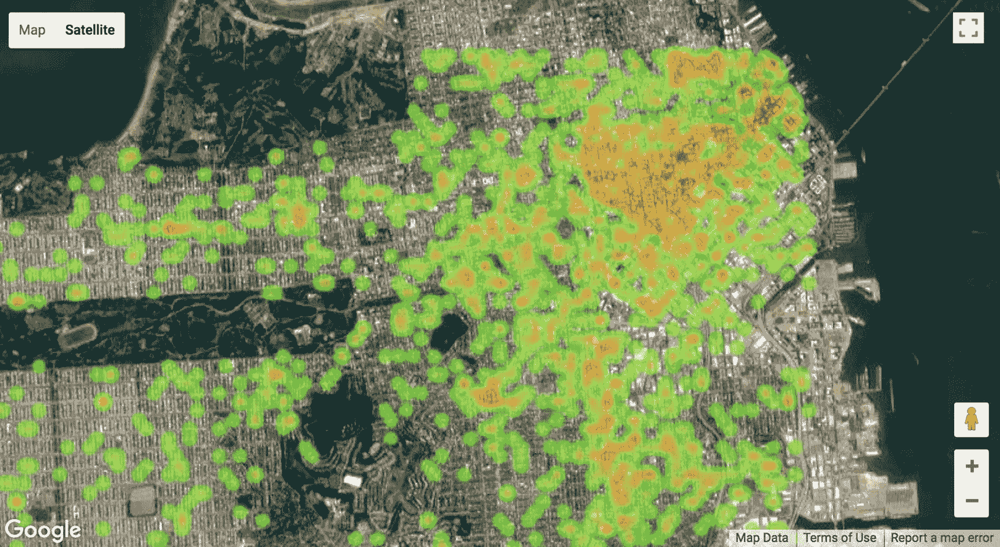

图 6-22

一些旧金山的犯罪数据被标绘在谷歌地图上

## 抽象出我们的犯罪评估者

像往常一样，我们需要以一种干净简单的方式组织我们的 web 应用程序的引擎，这样我们就可以把它放到我们的主 Flask 脚本中。我们将创建" **GetCrimeEstimates()** "函数，该函数将接受一个日期和"**时间段**"(无论是在早上、下午还是晚上；清单 [6-24](#PC24) )。

```py
def GetCrimeEstimates(horizon_date, horizon_time_segment):
    Day_of_month = int(horizon_date.split('/')[1])
    Month_of_year = int(horizon_date.split('/')[0])
    Day_Segment = int(horizon_time_segment) # 0,1,2

        crime_horizon_df_tmp = crime_horizon_df[
                     (crime_horizon_df['Day_of_month'] == Day_of_month) &
        (crime_horizon_df['Month_of_year'] == Month_of_year) &
        (crime_horizon_df['Day_Segment'] == Day_Segment)]

    # build latlng string for google maps
    LatLngString = "
    for index, row in crime_horizon_df_tmp.iterrows():
        LatLngString += "new google.maps.LatLng(" + str(row['Latitude']) + "," + str(row['Longitude']) + "),"

    return (LatLngString)

Listing 6-24The “GetCrimeEstimates()” Function

```

“`GetCrimeEstimates()`”是应用程序的大脑。它接受用户通过 web 应用程序上的滑块选择的日期和时间段，并返回该日期的所有汇总犯罪。

例如，当调用“ **GetCrimeEstimates()** ”时，“我们得到一串串联的“ **google.maps.LatLng** ”坐标，准备馈入 Google Maps(清单 [6-25](#PC25) )。

```py
Input:

GetCrime('10/10/2018', 0)

Output:

new google.maps.LatLng(37.764,-122.508),
new google.maps.LatLng(37.781,-122.49),
new google.maps.LatLng(37.711,-122.469),
new google.maps.LatLng(37.764,-122.46700000000001),
new google.maps.LatLng(37.763000000000005,-122.464),
...

Listing 6-25Calling “GetCrimeEstimates()”

```

## 设计一个 Web 应用程序，使查看者能够输入未来的日期并可视化犯罪热点

继续下载本章的 web 应用程序代码。打开命令行窗口，将驱动器更改为“ **web 应用程序**文件夹。它应该包含以下文件(列表 [6-26](#PC26) )。

```py
web-application
       ├── main.py
       ├── ptvs_virtualenv_proxy.py
       ├── requirements.txt
       ├── web.3.4.config
       ├── static
                     ├── sf-crime-horizon.csv
                     └── images
                            ├── cop.jpg
                            ├── thief.jpg
                            ├── morning.jpg
                            ├── afternoon.jpg
                            └── night.jpg

       └── templates
              └── index.html

Listing 6-26Web Application Files

```

像往常一样，我们将启动一个虚拟环境来隔离我们的 Python 库安装(清单 [6-27](#PC27) )。

```py
$ python3 -m venv predictingcrimeinsanfrancisco
$ source predictingcrimeinsanfrancisco/bin/activate

Listing 6-27Starting a Virtual Environment

```

然后通过运行“ **pip3 install -r** ”命令安装所有需要的 Python 库(清单 [6-28](#PC28) )。

```py
$ pip3 install -r requirements.txt

Listing 6-28Code Input

```

### 添加您的 Google API 密钥

在一个编辑器中，打开文件“**index.html**”，并在显示“ **ADD_YOUR_API_KEY_HERE** ”的地方添加自己的 API 密钥。你需要更新代码才能看到谷歌地图，否则你会得到一个错误信息。

### 带它去兜一圈

像往常一样，在本地 Flask 实例上运行该站点(清单 [6-29](#PC29) )。

```py
$ python3 main.py

Listing 6-29Code Input

```

如果一切顺利的话，您应该会看到带有可用 Google Map 的 web 应用程序。去兜一圈，看看未来的犯罪预测(图 [6-23](#Fig23) )。


图 6-23

运行我们 web 应用程序的本地版本

## Azure 的 Git

初始化一个 Git 会话(清单 [6-30](#PC30) )。

```py
$ git init

Listing 6-30Initialize Git

```

从头到尾运行几次“ **git status** 是个好主意，这样可以确保您跟踪的是正确的文件(清单 [6-31](#PC31) )。

```py
Input:

$ git status

Output:

Untracked files:
  (use "git add <file>..." to include in what will be committed)

       main.py
       predictingcrimeinsanfrancisco/
       ptvs_virtualenv_proxy.py
       requirements.txt
       sf-crime-horizon.csv
       static/
       templates/
       web.3.4.config

Listing 6-31Running “git status”

```

使用“ **git add 从“ **web 应用程序**”文件添加所有 web 应用程序文件。**“命令并检查” **git 状态**(列表 [6-32](#PC32) )。

```py
Input:

$ git add .
$ git status

Output:

Changes to be committed:
  (use "git rm --cached <file>..." to unstage)

       new file:   main.py
       new file:   predictingcrimeinsanfrancisco/bin/activate
       new file:   predictingcrimeinsanfrancisco/bin/activate.csh
       new file:   predictingcrimeinsanfrancisco/bin/activate.fish
       new file:   predictingcrimeinsanfrancisco/bin/easy_install
       new file:   predictingcrimeinsanfrancisco/bin/easy_install-3.6
...

Listing 6-32Adding to Git

```

你可能已经注意到了，我们已经添加了很多文件到我们的" **git add。**”命令。根据来自“ **git status** 的指令，它告诉我们如何删除我们不想用“ **rm** 命令提交给 git 的文件。让我们从虚拟环境中删除项目不需要的所有文件和文件夹(清单 [6-33](#PC33) )。

```py
Input:

$ git rm -r --cached predictingcrimeinsanfrancisco
$ git status

Output:

Changes to be committed:
  (use "git rm --cached <file>..." to unstage)

       new file:   main.py
       new file:   ptvs_virtualenv_proxy.py
       new file:   requirements.txt
       new file:   sf-crime-horizon.csv
       new file:   statimg/afternoon.jpg
       new file:   statimg/cop.jpg
       new file:   statimg/morning.jpg
       new file:   statimg/night.jpg
       new file:   statimg/thief.jpg
       new file:   templates/index.html
       new file:   web.3.4.config

Listing 6-33Removing “predictingcrimeinsanfrancisco” from Git

```

我们现在只有我们需要的文件。因此，做一个本地的" **git commit** "并添加一个有意义的注释，以防将来需要重新访问过去的操作(清单 [6-34](#PC34) )。

```py
Input:

$ git commit -am 'where crime happens'

Output:

[master (root-commit) 1b87606] where will crime happen next
 11 files changed, 120065 insertions(+)
 create mode 100644 main.py
 create mode 100644 ptvs_virtualenv_proxy.py
 create mode 100644 requirements.txt
 create mode 100644 sf-crime-horizon.csv
 create mode 100644 statimg/afternoon.jpg
 create mode 100644 statimg/cop.jpg
 create mode 100644 statimg/morning.jpg
 create mode 100644 statimg/night.jpg
 create mode 100644 statimg/thief.jpg
 create mode 100644 templates/index.html
 create mode 100644 web.3.4.config

Listing 6-34Git Commit

```

有关 Git 部署到 Azure 应用服务的更多信息，请参见 [`https://docs.microsoft.com/en-us/azure/app-service/app-service-deploy-local-git`](https://docs.microsoft.com/en-us/azure/app-service/app-service-deploy-local-git) 。

## azure-cli 命令行界面工具

我们将使用“ **azure-cli** ”工具在 Microsoft Azure 上部署我们的 web 应用程序(如果您还没有安装它，请参考第 [2](02.html) 章)。

### 步骤 1:登录

创建一个“ **az** ”会话(列表 [6-35](#PC35) 和图 [6-24](#Fig24) )。

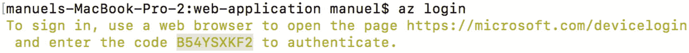

图 6-24

从 azure-cli 登录到 Azure

```py
$ az login

Listing 6-35Code Input

```

按照指示，将浏览器指向给定的 URL 地址，并相应地输入代码(图 [6-25](#Fig25) )。


图 6-25

认证会话

如果一切顺利(即你有一个信誉良好的 Azure 账户)，它会将 azure-cli 终端连接到云服务器。此外，一旦获得授权，您就可以安全地关闭浏览器窗口。

确保您的命令行工具指向本章的“ **web 应用程序**”文件夹。

### 步骤 2:为您的部署用户创建凭证

该用户将拥有使用 FTP 和本地 Git 的适当权限。在这里，我将用户名设置为“ **flaskuser10** ”，密码设置为“ **flask123** ”您应该只需要这样做一次，然后您就可以重用同一个帐户。万一给你带来麻烦，只需创建一个不同的用户名(或者在用户名的末尾添加一个数字，并像我通常做的那样不断递增；清单 [6-36](#PC36) )。

```py
$ az webapp deployment user set --user-name flaskuser10 --password flask123

Listing 6-36Code Input

```

当您执行每个" **azure-cli** "步骤时，您将得到 JSON 回复，确认您的设置。在“ **az webapp 部署**的情况下，most 应该有一个空值并且没有错误消息。如果您有一个错误消息，那么您有一个权限问题需要解决(“**冲突**意味着该名称已经被占用，因此尝试另一个，而“**错误请求**意味着密码太弱)。

### 步骤 3:创建资源组

这将是你的逻辑容器。这里你需要输入离你最近的地区(见 [`https://azure.microsoft.com/en-us/regions/`](https://azure.microsoft.com/en-us/regions/) )。在这个例子中，使用“ **West US** ”并没有什么大不了的，即使你在世界的另一边，但是在你希望服务器尽可能靠近你的观众以获得最佳性能的生产环境中，这将会产生影响。

这里我将名称设置为“ **myResourceGroup** ”(列表 [6-37](#PC37) )。

```py
$ az group create --name myResourceGroup --location "West US"

Listing 6-37Code Input

```

### 步骤 4:创建你的 Azure 应用服务计划

这里我将名称设置为“ **myAppServicePlan** ”，并选择一个自由实例(sku)(清单 [6-38](#PC38) )。

```py
$ az appservice plan create --name myAppServicePlan --resource-group myResourceGroup --sku FREE

Listing 6-38Code Input

```

### 步骤 5:创建您的 Web 应用程序

您的“ **webapp** ”名称需要唯一，并确保您的“**资源组**”和“**计划**”名称与您在前面步骤中设置的名称相同。在这种情况下，我将使用“ **amunateguicrime** ”要获得支持的运行时的完整列表，请运行“ **list-runtimes** ”命令(清单 [6-39](#PC39) )。

```py
$ az webapp list-runtimes

Listing 6-39Code Input

```

要创建 web 应用程序，使用“ **create** ”命令(清单 [6-40](#PC40) )。

```py
$ az webapp create --resource-group myResourceGroup --plan myAppServicePlan --name amunateguicrime --runtime "python|3.4" --deployment-local-git

Listing 6-40Code Input

```

“ **az webapp create** ”的输出将包含您在后续步骤中需要的重要信息。查找线“ **deploymentLocalGitUrl** ”(图 [6-26](#Fig26) )。

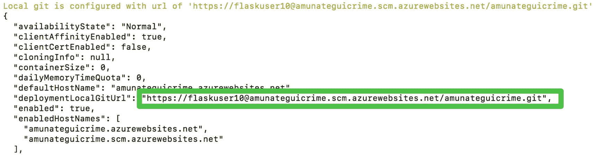

图 6-26

" **webapp create** 命令和结果" **deploymentLocalGitUrl** 值

### 第六步:将 Git 代码推送到 Azure

现在您有了一个占位符网站，您需要将您的 Git 代码推送到 Azure(清单 [6-41](#PC41) )。

```py
# if git remote is say already exits, run 'git remote remove azure'
$ git remote add azure https://flaskuser10@amunateguicrime.scm.azurewebsites.net/amunateguicrime.git

Listing 6-41Code Input

```

最后推出来给 Azure(清单 [6-42](#PC42) )。

```py
$ git push azure master

Listing 6-42Code Input

```

它会提示您输入之前设置的“ **webapp 部署用户**密码。如果一切顺利，你应该可以享受你的劳动成果。打开网络浏览器，输入您的新网址，网址由您的“ **webapp** 名称后跟“**组成。**[](http://azurewebsites.net)**(图 [6-27](#Fig27) )。**

 **

图 6-27

享受你努力工作的成果吧！

另一方面，如果 Azure-cli 返回错误消息，您必须解决它们(请参见故障排除部分)。

任何时候你更新你的代码并想要重新部署它，请参见清单 [6-43](#PC43) 。

```py
$ git commit -am "updated output"
$ git push azure master

Listing 6-43For Code Updates

```

你也可以直接在 Azure 的 web dashboard 上管理你的应用。登录 Azure，进入 App Services(图 [6-28](#Fig28) )。

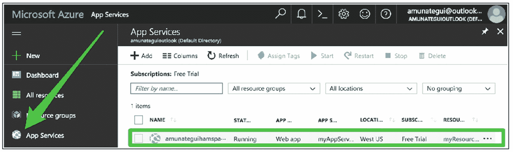

图 6-28

Microsoft Azure 仪表板

## 解决纷争

调试 web 应用程序错误可能会很复杂。要做的一件事就是通过 Azure 的 dashboard 打开日志记录(图 [6-29](#Fig29) )。

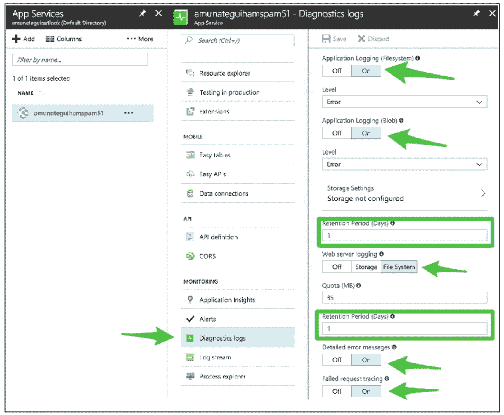

图 6-29

打开 Azure 的诊断日志

然后打开日志流，开始捕捉活动(图 [6-30](#Fig30) )。

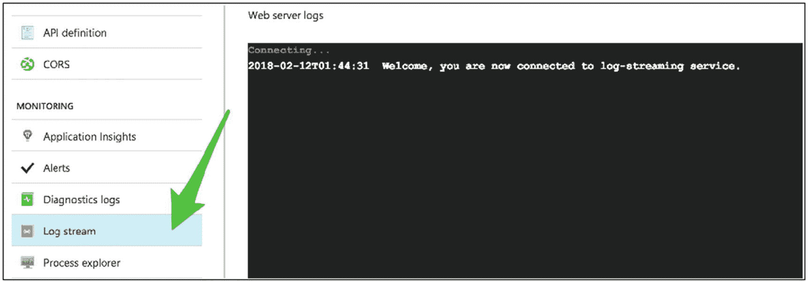

图 6-30

捕获日志信息

你也可以使用 Azure dashboard 内置的便捷控制台工具来检查你的文件结构(图 [6-31](#Fig31) )。

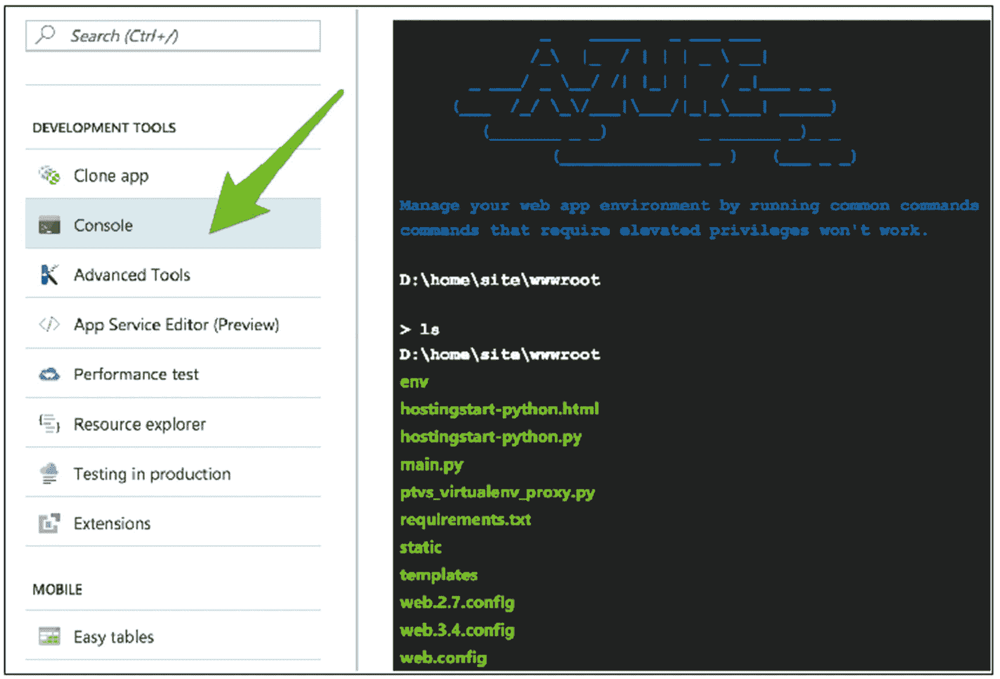

图 6-31

Azure 的内置命令行工具

您也可以在您的命令窗口中访问日志的尾部(清单 [6-44](#PC44) )。

```py
$ az webapp log tail --resource-group myResourceGroup --name amunateguicrime

Listing 6-44Code Input

```

你甚至可以通过调用“ **env\scripts\pip** ”函数来检查你的“ **requirement.txt** ”文件是否工作(清单 [6-45](#PC45) )。

```py
$ env\scripts\pip install -r requirements.txt

Listing 6-45Code Input

```

## 别忘了关掉它！

像往常一样，停下来删除任何你不再需要的东西。在 Azure dashboard 中进入**所有资源**，勾选任何你不需要的，删除掉(图 [6-32](#Fig32) )。

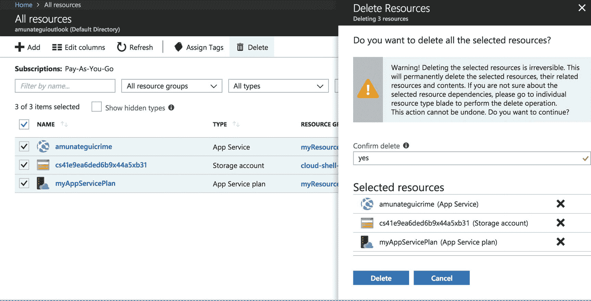

图 6-32

完成后关闭一切

最后，停用您的虚拟环境(清单 [6-46](#PC46) )。

```py
$ deactivate predictingcrimeinsanfrancisco

Listing 6-46Code Input

```

## 结论

这一章介绍了一项显而易见的伟大技术，谷歌地图。这个前端仪表板可以做很多事情。你可以获得用户的位置(在他们同意的情况下)，你可以用许多不同的方式可视化地理数据，从卫星到街道视图，这个列表还在继续。最好的部分是在编程方面要求很少。Google Maps API 已经很成熟了，它为你抽象了很多繁重的工作。如果你最终使用谷歌地图建立了一个高流量的网站，你很可能需要一个付费账户。

眼尖的人可能已经注意到，Jupyter 代码使用数据帧来分析犯罪数据，而 Flask 应用程序使用 NumPy 数组。这不是我们唯一一次使用这种技巧。Panda 库是一个如此大而复杂的库，以至于有时很难让它与不喜欢将触角深入操作系统和文件系统的库的无服务器实例很好地配合。根据经验，您需要在 Flask 应用程序顶部声明的导入量越少越好。

<aside class="FootnoteSection" epub:type="footnotes">Footnotes [1](#Fn1_source)

[T2`https://datasf.org/about/`](https://datasf.org/about/)

 </aside>****