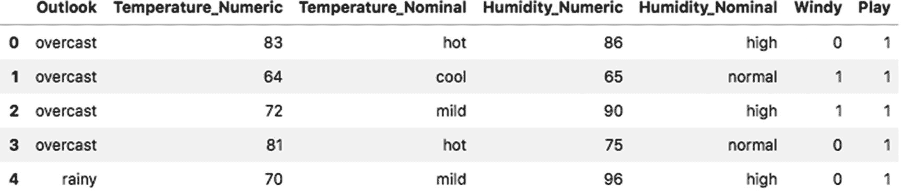
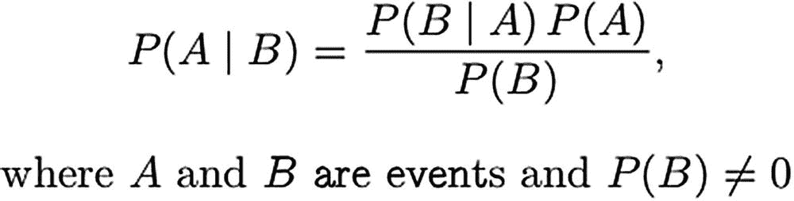
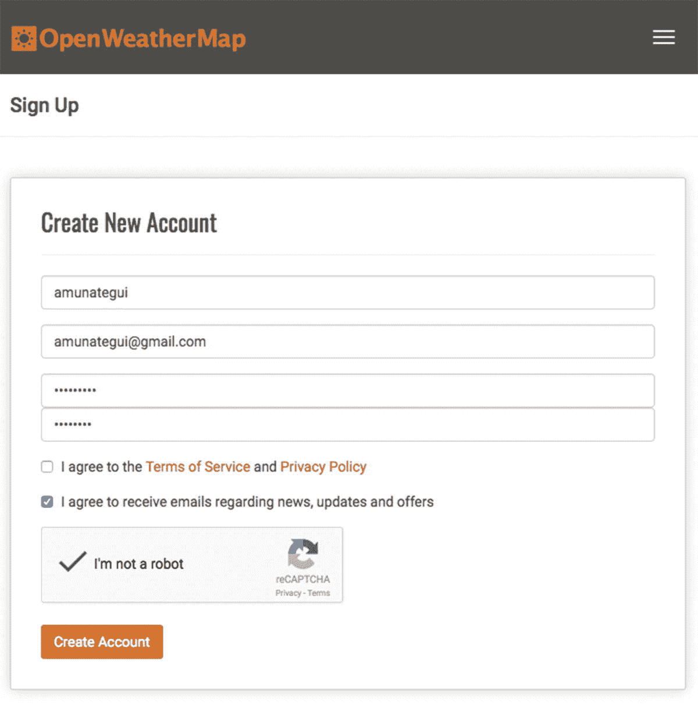
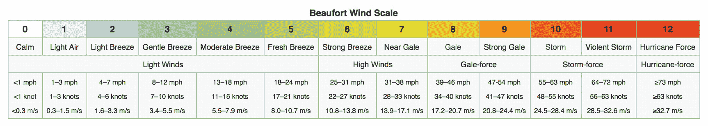
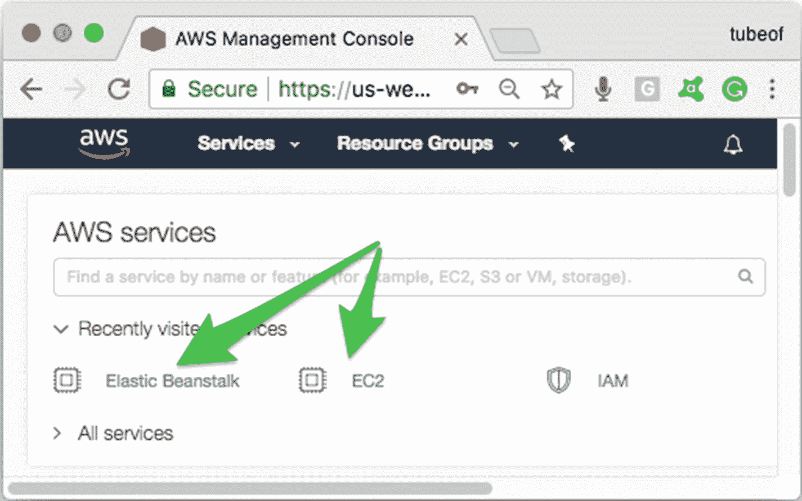
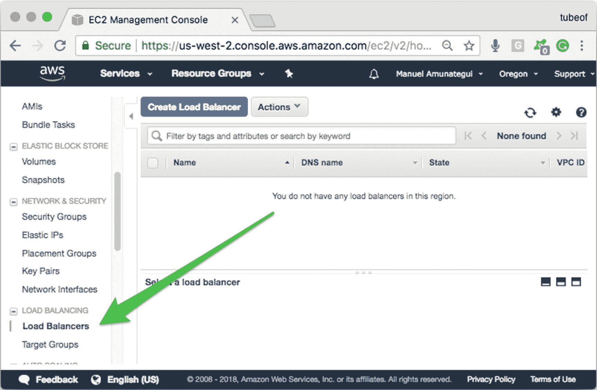
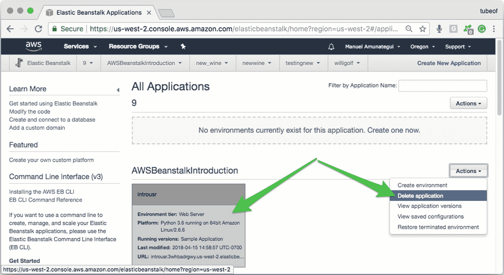

# 7.基于朴素贝叶斯和开放天气的自动气象站天气预报

我明天会打高尔夫球吗？使用朴素贝叶斯和亚马逊网络服务上的实时天气预报找出答案。

在这一章中，我们将看看 Gerardnico 博客中著名的“**高尔夫|天气数据集**”。 <sup>[1](#Fn1)</sup> 我说**著名的**是因为似乎每当有人做贝叶斯的介绍性文章时，他们都会使用这个数据集。这是有意义的，因为这是一个非常简单和直观的环境读数的集合，以及一个球员是否最终打高尔夫球。在没有计算机甚至计算器的情况下，用 Bayes 定理建模是中肯的，非常友好的。但是不要害怕，我们将像往常一样使用 sklearn 库。我们将对打高尔夫球需要什么进行建模，结合 OpenWeatherMap<sup>[2](#Fn2)</sup>来基于用户选择的位置拉动实际预测(图 [7-1](#Fig1) )。


图 7-1

本章的最后一个 web 应用程序

### 注意

前往 [`www.apress.com/9781484238721`](http://www.apress.com/9781484238721) 并点击源代码按钮，下载第 [7 章](07.html)的文件。打开 Jupyter 笔记本" **chapter7.ipynb** "跟随本章内容。

## 探索数据集

继续将本章的文件下载到名为“ **chapter-7** ”的文件夹中打开 Jupyter 笔记本，继续学习。

由于它是一个非常小的数据集，没有什么可下载的，我们将用 Python 手动重新创建它。它只包含 14 行(列表 [7-1](#PC1) 和图 [7-2](#Fig2) )。



图 7-2

“ ***高尔夫|天气*** ”数据集的前几行

```py
golf_data_header = ['Outlook', 'Temperature_Numeric', 'Temperature_Nominal', 'Humidity_Numeric', 'Humidity_Nominal', 'Windy', 'Play']

golf_data_set = [['overcast',83,'hot',86,'high',False,True],
['overcast',64,'cool',65,'normal',True,True],
['overcast',72,'mild',90,'high',True,True],
['overcast',81,'hot',75,'normal',False,True],
['rainy',70,'mild',96,'high',False,True],
['rainy',68,'cool',80,'normal',False,True],
['rainy',65,'cool',70,'normal',True,False],
['rainy',75,'mild',80,'normal',False,True],
['rainy',71,'mild',91,'high',True,False],
['sunny',85,'hot',85,'high',False,False],
['sunny',80,'hot',90,'high',True,False],
['sunny',72,'mild',95,'high',False,False],
['sunny',69,'cool',70,'normal',False,True],
['sunny',75,'mild',70,'normal',True,True]]

golf_df = pd.DataFrame(golf_data_set, columns=golf_data_header)
golf_df[['Windy','Play']] = golf_df[['Windy','Play']].astype(int)

golf_df.head()

Listing 7-1Let’s Load Our Dataset into a Pandas Data Frame, Create Column Names and Cast the Boolean Fields into Integers

```

“**展望**”字段是对天气的总体看法，就像一个超级类别。它由三个值组成:**阴天**、**雨天**、**晴天**温度读数有两种形式:" **Temperature_Numeric，**"这是华氏温度的数值，以及" **Temperature_Nominal** "这是一种分类表示，分为三个值:"**热**、**温和**、**冷**"湿度也有两种形式:"**湿度 _ 数字**"，它是湿度读数的百分比，以及"**湿度 _ 标称值**"，它是具有两个值的分类变量:"**高**和"**正常**"“**有风**”是一个布尔变量，表示是否有风。最后，“**玩**”是结果变量，以及根据所述条件，玩家是否玩高尔夫的结果真相。

## 朴素贝叶斯

朴素贝叶斯是基于贝叶斯定理和条件概率的一组算法(图 [7-3](#Fig3) )。它独立考虑预测因素来确定结果的概率。它被称为“**天真**，因为它假设预测器之间是独立的，但除非每个预测器发生在不同的星球上，否则很难确定。也就是说，这样的假设极大地简化了模型；它使模型变得简单、快速和透明。它非常适合在分布式环境中处理大型数据集。



图 7-3

贝叶斯概率公式

简而言之，朴素贝叶斯分类创建了一个频率表，对一些历史数据集中的每个可能的值组合进行编目，包括积极和消极的结果。通过考虑简单的分类特征来形象化更简单，但是它可以处理任何数据类型。贝叶斯定理然后可以使用收集的频率来产生新的概率。

其中指出:

*   P(A|B) 是给定某些相等值时，结果发生的概率

*   P(B|A) 是那些结果值的概率的乘积

*   P(A) 是该结果的概率，与除以的值无关

*   不管结果如何，P(B) 是这些值的概率

*   如果这还不清楚，可以看看 RapidMiner 网站 [`https://www.youtube.com/watch?v=IlVINQDk4o8`](https://www.youtube.com/watch?v=IlVINQDk4o8) 的好朋友们制作的一个简短而有趣的视频。

## 巩恩的高斯 b

正如本章介绍中提到的，我们将使用“**sk learn . naive _ Bayes**”“**GaussianNB**”库。这是一个简单的模型，提供了一些可调参数:更多信息请参见 [`http://scikit-learn.org/stable/modules/generated/sklearn.naive_bayes.GaussianNB.html`](http://scikit-learn.org/stable/modules/generated/sklearn.naive_bayes.GaussianNB.html) 。

它使用起来很简单，下面是一个调用朴素贝叶斯模型进行分类以及如何提取概率和预测的示例。“ **predict()** ”函数根据其训练的内容返回真/假预测。一个“ **1** 表示模型预测高尔夫将会发生(列出 [7-2](#PC2) )。

```py
Input:

from sklearn.naive_bayes import GaussianNB
naive_bayes = GaussianNB()
naive_bayes.fit(X_train[features],  y_train))
print(naive_bayes.predict(X_test))

Output:

[0 0 1 0 0 0 1]

Listing 7-2Calling predict() on the GaussianNB Model

```

" **predict_proba()** "函数返回一对值。第一个值代表为假的概率，而第二个值是为真的概率(列表 [7-3](#PC3) )。

```py
Input:

print(naive_bayes.predict_proba(X_test))

Output:

array([[  9.99994910e-01,   5.09005696e-06],
       [  9.99968916e-01,   3.10842486e-05],
       [  0.00000000e+00,   1.00000000e+00],
       [  8.84570501e-01,   1.15429499e-01],
       [  8.00907988e-01,   1.99092012e-01],
       [  9.99932094e-01,   6.79055800e-05],
       [  0.00000000e+00,   1.00000000e+00]])

Listing 7-3Getting Probabilities out of the GaussianNB Model

```

显然，您可以使用任一值；只要记住这意味着什么。在我们的例子中，我们将使用第二个值，因为我们对不打高尔夫球的概率与打高尔夫球的概率并不感兴趣。两个数字加起来都是 1。

## 实时打开天气图

我们将在我们的“**我明天会打高尔夫吗**”web 应用程序中使用真实的天气预报。继续从`openweathermap.org`注册一个 API 免费的(图 [7-4](#Fig4) )！非常感谢 Open Weather `—`的工作人员喜欢这项服务！



图 7-4

OpenWeatherMap.org 注册屏幕

他们会给你发一封确认邮件，里面包含你的 API 密匙，还有一个例子。它声明授权新密钥可能需要 10 分钟。对我来说，大概花了 30 分钟。然后使用您的新密钥运行示例，再次检查您的帐户是否正常工作(清单 [7-4](#PC4) )。

```py
http://api.openweathermap.org/data/2.5/weather?q=London,uk&APPID=<<YOUR_API_KEY>>

Listing 7-4URL for Weather—Add Your API Key

```

在他们的系统上传播确实需要一点时间，但是它确实工作了，并且示例返回了下面的 JSON 字符串(当然您的会有不同的天气数据；列表 [7-5](#PC5) 。

```py
{"coord":{"lon":-0.13,"lat":51.51},"weather":[{"id":803,"main":"Clouds","description":"broken clouds","icon":"04n"}],"base":"stations","main":{"temp":284.37,"pressure":1014,"humidity":76,"temp_min":283.15,"temp_max":285.15},"visibility":10000,"wind":{"speed":6.7,"deg":240},"clouds":{"all":75},"dt":1524531000,"sys":{"type":1,"id":5091,"message":0.0065,"country":"GB","sunrise":1524545173,"sunset":1524597131},"id":2643743,"name":"London","cod":200}

Listing 7-5Raw JSON String

```

但是访问 REST API JSON 数据的更好方法是全部用 Python 完成。这允许您调用 API 并以完全编程的方式处理返回数据。我们来看看(列表 [7-6](#PC6) )。

```py
from urllib.request import urlopen
weather_json = json.load(urlopen("http://api.openweathermap.org/data/2.5/weather?q=Barcelona&appid=<<YOUR_API_KEY>>"))

Listing 7-6Bringing in Real Weather Data Using “api.openweathermap.org”

```

作为回报，我们得到一个 JSON 对象，可以通过键对调用轻松访问它(清单 [7-7](#PC7) )。

```py
Input:

print(weather_json)

Output:

{'base': 'stations',
 'clouds': {'all': 0},
 'cod': 200,
 'coord': {'lat': 41.38, 'lon': 2.18},
 'dt': 1524538800,
 'id': 3128760,
 'main': {'humidity': 72,
  'pressure': 1018,
  'temp': 287.15,
  'temp_max': 288.15,
  'temp_min': 286.15},
 'name': 'Barcelona',
 'sys': {'country': 'ES',
  'id': 5470,
  'message': 0.0034,
  'sunrise': 1524545894,
  'sunset': 1524595276,
  'type': 1},
 'visibility': 10000,
 'weather': [{'description': 'clear sky',
   'icon': '01n',
   'id': 800,
   'main': 'Clear'}],
 'wind': {'deg': 330, 'speed': 2.6}}

Listing 7-7JSON Content

```

通过添加键名可以很容易地访问单个元素，就像处理熊猫对象一样(清单 [7-8](#PC8) )。

```py
Input:

weather_json['main']

Output:

{'humidity': 72,
 'pressure': 1018,
 'temp': 287.15,
 'temp_max': 288.15,
 'temp_min': 286.15}

Listing 7-8JSON “main” Content

```

### 预报与当前天气数据

我们希望使用第二天的预报，而“ **OpenWeatherMap** ”确实提供了五天预报 API 服务。它以三小时为增量返回数据。让我们看看这是如何工作的(列出 [7-9](#PC9) )。

```py
Input:

http://api.openweathermap.org/data/2.5/forecast?q=Barcelona&APPID=<<YOUR API KEY>>

Output:

{“dt":1524679200,"main":{"temp":293.08,"temp_min":291.228,"temp_max":293.08,"pressure":1021.76,"sea_level":1030.11,"grnd_level":1021.76,"humidity":83,"temp_kf":1.85},"weather":[{"id":802,"main":"Clouds","description":"scattered clouds","icon":"03d"}],"clouds":{"all":48},"wind":{"speed":0.98,"deg":31.502},"sys":{"pod":"d"},"dt_txt":"2018-04-25 18:00:00"}

Listing 7-9URL for Forecast—Add Your API Key. This Will Return a Large Amount of Text with Five-Days’ Worth of Three-Hour Increment Weather Forecasts

```

密钥对“ **dt_txt** ”是包含的天气预报的开始时间。因此，在这个例子中，巴塞罗那 4 月 24 日下午 6 点到 9 点之间，将有分散的云。能够访问三小时预测为我们的高尔夫预测提供了一个很好的粒度级别。查看相应的 Jupyter 笔记本，了解提取具体日期的方法。

### 将 OpenWeatherMap 翻译为“高尔夫|天气数据”

要将" **OpenWeatherMap** "数据转换成正确的"**高尔夫|天气数据集**"格式，需要进行一些数据转换。让我们继续，改变一些规模，并固定一些分类数据。

**展望**

高尔夫集合中的“**前景**”分类特征具有三个可能的值:“**阴天**、“**雨天**”和“**晴天**”" **OpenWeatherMap** "中的一个近似等效变量是" **weather.main** "变量，它提供了九个可能的值: <sup>[3](#Fn3)</sup>

*   晴空

*   几朵云

*   散云

*   破碎的云

*   阵雨

*   雨

*   大雷雨

*   雪

*   下雾

尽管这是一个主观的努力，我们需要决定什么去哪里。让我们将这些分组并构建一个函数来处理等价性(如果您不喜欢我的，请更改它们)。

**阳光明媚**

*   晴空

*   几朵云

**阴天**

*   散云

*   破碎的云

*   下雾

**多雨**

*   阵雨

*   雨

*   大雷雨

*   雪

我们将分组打包到一个干净的函数中，该函数可以处理“ **OpenWeatherMap** ”和“**高尔夫|天气数据**”(清单 [7-10](#PC10) )之间的等价关系。我们还利用“ **OpenWeatherMap** ”提供的一个简洁产品来提供天气的图形图标，我们将在我们的 web 应用程序上显示这些图标(参见 [`https://openweathermap.org/weather-conditions`](https://openweathermap.org/weather-conditions) 中的完整图标列表)。

```py
def GetWeatherOutlookAndWeatherIcon(main_weather_icon):
       # truncate third char - day or night not needed
       main_weather_icon = main_weather_icon[0:2]

       # return "Golf|Weather Data" variable and daytime icon
       if (main_weather_icon in ["01", "02"]):
              return("sunny", main_weather_icon + "d.png")
       elif (main_weather_icon in ["03", "04", 50]):
              return("overcast", main_weather_icon + "d.png")
       else:
              return("rain", main_weather_icon + "d.png")

Listing 7-10Function “GetWeatherOutlookAndWeatherIcon”

```

**数字温度**

你可能已经注意到温度的单位不是华氏或摄氏，而是开尔文。因此，我们需要通过下面的公式对华氏温度进行过滤(虽然您可以让 API 为您完成这项工作，但我们将自己完成):

```py
Fahrenheit = T × 1.8 - 459.67

```

对于摄氏度:

```py
Celsius = K - 273.15

```

**标称温度**

名义温度是一个分类变量，由三个值组成"**冷**、**温和**、**热**"由于这些是主观分组，我们将推断范围，以便我们可以根据来自" **OpenWeatherMap** (清单 [7-11](#PC13) )的实时预报创建新的范围。

```py
Input:

golf_df[['Temperature_Numeric', 'Temperature_Nominal']].groupby('Temperature_Nominal').agg({'Temperature_Numeric' : [np.min, np.max]})

Output:

                    Temperature_Numeric
                                   amin amax
Temperature_Nominal
cool                                 64   69
hot                                  80   85
mild                                 70   75

Listing 7-11Nominal Temperatures

```

凉爽的温度范围是华氏 64 到 69 度，而温和的温度范围是华氏 70 到 75 度。这很容易，因为两个值之间没有差距。”**热**，另一方面，开始于 80。所以，我们有 75 和 80 之间的差距要考虑。为了简单起见，我们将把“**轻度**”范围扩展到 80。我们以下面的函数结束(清单 [7-12](#PC14) )。

```py
def GetNominalTemparature(temp_fahrenheit):
       if (temp_fahrenheit < 70):
              return "cool"
       elif (temp_fahrenheit < 80):
              return "mild"
       else:
              return "hot"

Listing 7-12Nominal Temperatures

```

**湿度数值**

湿度在" **OpenWeatherMap** 上以百分比给出，所以我们将使用它的精确数字形式。 <sup>[4](#Fn4)</sup>

**标称湿度**

就像我们对绝对标称温度所做的那样，我们必须对标称湿度应用相同的逻辑。分割这个数据肯定有不同的方法，但必须做出选择，将百分比转换为当前“**高尔夫|天气数据**”数据集中存在的类别(列表 [7-13](#PC15) )。

```py
Input:

golf_df[['Humidity_Numeric', 'Humidity_Nominal']].groupby('Humidity_Nominal').agg({'Humidity_Numeric' : [np.min, np.max]})

Output:

                 Humidity_Numeric
                             amin amax
Humidity_Nominal
high                           85   96
normal                         65   80

Listing 7-13Humidity

```

根据我们的历史数据，我们只有两种选择:“**正常**或者“**高**”我们将采取简单的方法，将 81%及以上视为高，其他一切视为正常(列表 [7-14](#PC16) )。

```py
def GetNominalHumidity(humidity_percent):
       if (humidity_percent > 80):
              return "high"
       else:
              return "normal"

Listing 7-14Function “GetNominalHumidity”

```

**刮风**

" **OpenWeatherMap** "声明风速以米每秒为单位。 <sup>[5](#Fn5)</sup> 我们将使用蒲福风级，一种将风速与不同的陆地和海洋条件联系起来的风级，以及它对“**强风**”类别的定义来确定什么是有风的，什么不是有风的(图 [7-5](#Fig5) )并抽象出一个函数(清单 [7-15](#PC17) )。等级的中点是风速超过每秒 10.8 米，被认为是“**强风**”



图 7-5

蒲福风级(来源维基百科)

```py
def GetWindyBoolean(wind_meter_second):
       if (wind_meter_second > 10.8):
              return(True)
       else:
              return(False)

Listing 7-15Function “GetWindyBoolean”

```

## 设计一个 Web 应用程序“明天我会打高尔夫球吗？”用真实的天气预报数据

像往常一样，我们希望我们的应用程序是直观的、可视化的和有趣的。这将是全世界所有高尔夫球手的首选应用程序(没错！).这也是一个强大的应用程序，将使用来自世界任何地方的真实天气预报，同时保持非常简单的构建。这就是贝叶斯模型的美妙之处:它简单而快速，并且为 web 应用程序提供了一个很好的实时和可伸缩的建模选项。

我们的网页只需要两个输入框，所以用户可以输入他或她的位置和明天的时间，他们希望打高尔夫球。该应用程序将尝试查找位置和时间的天气预报，将" **OpenWeatherMap** " JSON 数据转换为所需的"**高尔夫|天气数据集**"格式，并对问题"**我明天会打高尔夫球吗**"返回"**是**或"**否**"很简单，对吧？

### 下载 Web 应用程序

继续下载本章的代码，打开命令行窗口，将驱动器切换到“ **web 应用程序**文件夹。它应该包含与清单 [7-16](#PC18) 中相同的文件。这里我们展示的是隐藏的文件夹“**”。AWS EB 所需的 EB 扩展**。您可以按原样使用它，也可以在“**修复 WSGIApplicationGroup** ”部分创建自己的版本(在运行站点的本地版本时不必担心这一点，因为它不受此修复的影响)。

```py
web-application
       ├── application.py
       ├── requirements.txt
       ├── static
                     └── images
                            ├── go-golf.jpg
                            └── no-golf.jpg

       └── templates
              └── index.html
       └── .ebextensions ← hidden folder
              └── wsgi_fix.config

Listing 7-16Web Application Files

```

您应该在 Python 3.x 中运行这个应用程序，更好的是，在虚拟环境中运行，这样您就可以将运行 web 应用程序所需的内容与您机器上已经安装的内容完全隔离开来。

确保您的命令窗口指向本章的“ **web 应用程序**”文件夹，并启动一个虚拟环境。启动一个虚拟环境，命名为“**willigolfwirght**”，以确保我们在 Python 3 中，并安装所有需要的库(清单 [7-17](#PC19) )。

```py
$ python3 -m venv willigolftomorrow
$ source willigolftomorrow/bin/activate

Listing 7-17Starting a Virtual Environment

```

然后通过运行“ **pip install -r** ”命令安装所有需要的 Python 库(清单 [7-18](#PC20) )。

```py
$ pip3 install -r requirements.txt

Listing 7-18Install Requirements

```

接下来你必须打开“ **application.py** ”并添加你的“**OpenWeatherMap**”API 密匙。在 **PlayGolf()** 函数中查找**"<<YOUR _ API _ KEY>>"**(清单 [7-19](#PC21) )。

```py
openweathermap_url = "http://api.openweathermap.org/data/2.5/forecast?q=" + selected_location + "&mode=json&APPID=<<YOUR_API_KEY>>"

Listing 7-19Adding Your “OpenWeatherMap” API Key

```

一旦您添加了 API 密钥，您应该准备好像往常一样运行您的本地 web 应用程序(清单 [7-20](#PC22) )。

```py
$ python3 application.py

Listing 7-20Take It for a Spin

```

你应该会看到图 [7-6](#Fig6) 中的一些东西(糟糕，明天在北极不能打高尔夫)。


图 7-6

本地运行 Flask 应用程序

在您确认 web 应用程序在您的本地机器上正确运行后，退出该应用程序，但留在虚拟环境会话中。

## 在 AWS 弹性豆茎上跑步

还是在“**williglftomorrow**”虚拟环境会话中，安装最新的“ **awsebcli** ”(列表 [7-21](#PC23) )。我们跳过了几个步骤，因为现在你应该已经设置好了所有的安全层(如果没有，请回头参考第 [1](01.html) 和 [4](04.html) 章)。

```py
$ pip3 install awscli --upgrade
$ pip3 install awsebcli --upgrade

Listing 7-21Pip3 Command (you may not need the upgrade command because you are in a virtual environment, but it won’t hurt anything)

```

初始化 EB 服务，并按照之前的 AWS 项目使用您的常规设置(清单 [7-22](#PC24) )。

```py
$ eb init -i

Listing 7-22EB Initialize Command

```

创建一个名为“**willigelfortomorrow**”的项目，对“ **SSH** ”说 yes，并使用缺省值或我们在前面章节中运行 AWS EB 时喜欢的任何值(清单 [7-23](#PC25) )。

```py
$ eb create willigolftomorrow

Listing 7-23EB Create Command

```

### 修复 WSGIApplicationGroup

就像我们在顶级葡萄酒中所做的那样，你需要在“**网络应用**”文件夹下创建一个新文件夹(列表 [7-24](#PC26) )或者你可以使用提供的那个(这是一个隐藏的文件夹，你可能看不到`—`，如果你不确定，试着按照说明创建这个文件夹，如果它报错，就意味着你已经有了它)。

```py
$ mkdir .ebextensions
$ vi .ebextensions/wsgi_fix.config

Listing 7-24Create wsgi_fix File

```

这将创建一个名为“**的新文件夹。并打开一个 VI 窗口(在 Unix 中称为 visual instrument)，这是一个简单的文本编辑器。点击“ **i** 键，从只读模式切换到“**插入**模式，并将下面一行粘贴到文档末尾(该修复的文本文件也包含在本章文档所在的文件夹中)。读取该文件的过程非常挑剔；如果添加了空格或制表符，它将失败。密切关注部署过程中与文件相关的任何错误，并相应地进行处理(清单 [7-25](#PC27) )。**

```py
#add the following to wsgi_fix.config
files:
  "/etc/httpd/conf.d/wsgi_custom.conf":
    mode: "000644"
    owner: root
    group: root
    content: |
      WSGIApplicationGroup %{GLOBAL}

Listing 7-25Add Fix

```

现在点击“**转义**退出“**插入**模式，进入只读模式，输入“ **:wq** ”写入并退出“ **vi** ”(列表 [7-26](#PC28) )。

```py
:wq

Listing 7-26Quit “vi”

```

### 带它去兜一圈

用“**打开**命令打开网站(清单 [7-27](#PC29) )。

```py
$ eb open willigolftomorrow

Listing 7-27Taking the Cloud Version of the Web Application for a Spin

```

第一次运行应用程序可能需要一点时间，甚至可能会超时。如果是这种情况，再尝试一次“ **eb 打开**”(参见图 [7-7](#Fig7) )。


图 7-7

***我明天会打高尔夫吗？*** “运行在弹性豆茎上的 web 应用

### 别忘了关掉它！

最后，我们需要终止 Beanstalk 实例，以免产生额外的费用。这是一个重要的提醒，大多数云服务都不是免费的(如果它声明名称不匹配，请再试一次)。它将要求您确认您的决定(列表 [7-28](#PC30) )。

```py
$ eb terminate willigolftomorrow

Listing 7-28Terminate EB

```

如果您需要对代码进行任何编辑，您只需在您的本地目录中执行它们，并调用“ **eb deploy** ”函数(清单 [7-29](#PC31) )。

```py
$ eb deploy willigolftomorrow

Listing 7-29To Deploy Fixes or Updates

```

最后，一旦确认实例被终止，就可以通过调用命令(清单 [7-30](#PC32) )退出虚拟环境。

```py
$ deactivate

Listing 7-30Kill the Virtual Environment

```

在云中登录你的账户，并确保一切都被关闭，这总是一个好主意(实际上是一个重要的主意)(警告:如果你不这样做，你可能会在计费周期结束时得到一个丑陋的惊喜)。登录你的 AWS 账户，确保你的 EC2 和 Elastic Beanstalk 账户没有任何你不打算拥有的活动服务(图 [7-8](#Fig8) 和 [7-9](#Fig9) )。



图 7-8

在 AWS 仪表板上检查任何活动的和不需要的实例

如果您每次"**删除应用程序**、"在 EC2 下检查"**负载平衡器**"并首先终止那些负载平衡器，然后返回并再次终止流氓实例(图 [7-10](#Fig10) )之后，您都看到一个实例似乎不断复活。



图 7-10

"**负载平衡器**"可以防止应用程序终止；如果您不小心启动了多个同名的实例，这种情况就会发生



图 7-9

找到您想要终止或删除的实例，并使用“ **Actions** ”下拉按钮进行选择

## 结论

从表面上看，除了数据集和模型之外，这似乎与我们过去构建的内容略有不同，但事实并非如此。让我们来看看其中的一些亮点。

### 访问 OpenWeatherMap 数据

与我们在 Jupyter 中使用 urllib.request 的" **urlopen** 调用 REST API 服务不同，在 Flask 中我们使用" **requests** "库(清单 [7-31](#PC33) 和 [7-32](#PC34) )。

```py
import requests
weather_json = requests.get(openweathermap_url).json()

Listing 7-32We call it This Way

```

```py
from urllib.request import urlopen
import json
weather_json = json.load(urlopen(openweathermap_url))

Listing 7-31Instead of

```

这是一种稍微流行一点的调用 REST APIs 的方式，它的优点是内置了 JSON，因此我们只需要调用一个函数，而不是两个。

### 尝试/抓住

我们还使用 try/catch(或者在本例中使用 try/error)来捕获丢失的位置。应用程序不能对用户崩溃是非常重要的，同样重要的是一个问题，不管是不是错误，都要得到正确的处理。如果您将未知位置传递给“ **OpenWeatherMap** ”，它将返回一个错误。这很容易捕捉、利用并向用户返回一条信息性消息，让用户尝试其他东西(清单 [7-33](#PC35) )。

```py
try:
    weather_json = requests.get(openweathermap_url).json()
except:
    # couldn't find location
    e = sys.exc_info()[0]
    message = "Cannot find that location, please try again"

Listing 7-33Try/Catch to Handle Missing Locations

```

尽管我们通过异常变量" **e** 捕获了错误消息，但是我们在这里没有对它做任何事情。我将它留在这里，以便您知道如何访问它，这样您就可以通过日志记录或智能显示将它扩展到您自己的应用程序中。

### 处理用户输入的数据

这是一个重要的话题，但在本书中并没有涉及。根据您正在构建的应用程序的类型，您需要确保用户输入的数据不会损害您的应用程序、数据或硬件。像“**”<sup>[6](#Fn6)</sup>这样的事情，用户可以通过一个文本框传递系统命令来删除所有文件。**

 **相反，我们在这里确保用户输入的文本将与" **OpenWeatherMap** "一起工作如果您获取原始 http 字符串并在其中添加空格，它将无法工作(清单 [7-34](#PC36) )。

```py
http://api.openweathermap.org/data/2.5/weather?q=New York City&appid...

Listing 7-34Handling Spaces in URLs

```

处理这些问题的一个简单方法是使用 urllib.parse 库中的" **quote_plus()** "函数。它将接受任何文本输入，并将其呈现为 HTML 友好的，这样它就可以添加到 URL 中，而不会干扰 HTML 命令。让我们来看一个例子(清单 [7-35](#PC37) )。

```py
import urllib.parse
urllib.parse.quote_plus('New York City!')

'New+York+City%21'

Listing 7-35Handling Spaces in URLs

```

这很容易扩展到我们的 Flask 脚本，只需在“ **request.form** ”调用之后添加，并在进一步处理之前通过它过滤用户数据(清单 [7-36](#PC38) )。

```py
selected_location = request.form['selected_location']
selected_location = urllib.parse.quote_plus(selected_location)

Listing 7-36Handling Spaces in URLs

```

<aside class="FootnoteSection" epub:type="footnotes">Footnotes [1](#Fn1_source)

[T2`https://gerardnico.com/data_mining/weather`](https://gerardnico.com/data_mining/weather)

  [2](#Fn2_source)

[T2`https://openweathermap.org/`](https://openweathermap.org/)

  [3](#Fn3_source)

[T2`https://openweathermap.org/weather-conditions`](https://openweathermap.org/weather-conditions)

  [4](#Fn4_source)

[T2`https://openweathermap.org/current`](https://openweathermap.org/current)

  [5](#Fn5_source)

[T2`https://openweathermap.org/current`](https://openweathermap.org/current)

  [6](#Fn6_source)

[T2`https://en.wikipedia.org/wiki/SQL_injection`](https://en.wikipedia.org/wiki/SQL_injection)

 </aside>**