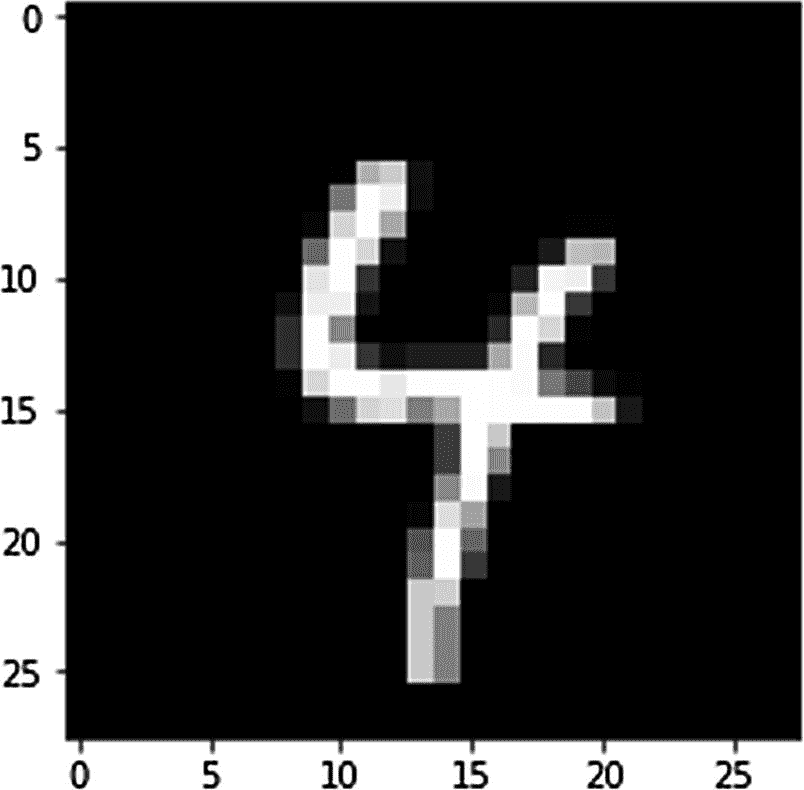
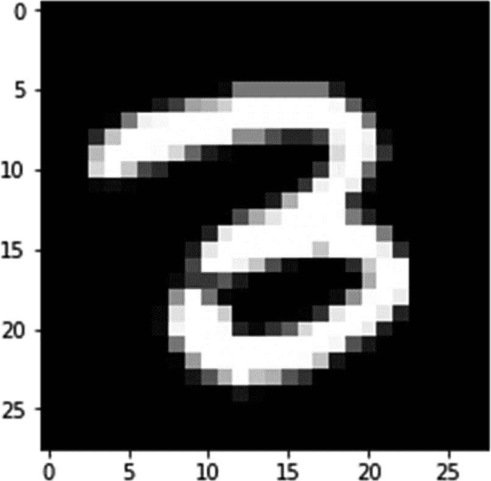
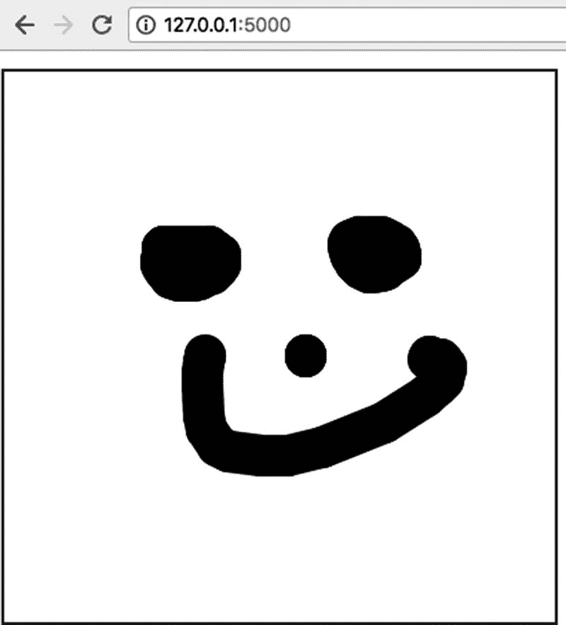
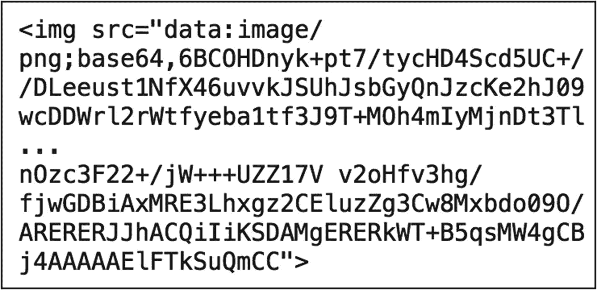
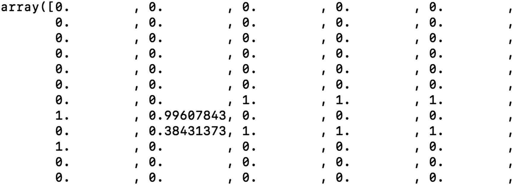
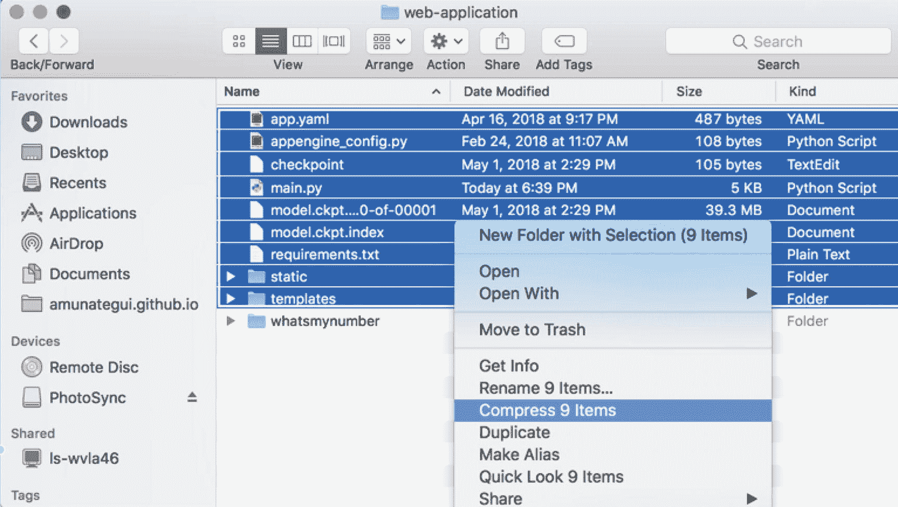
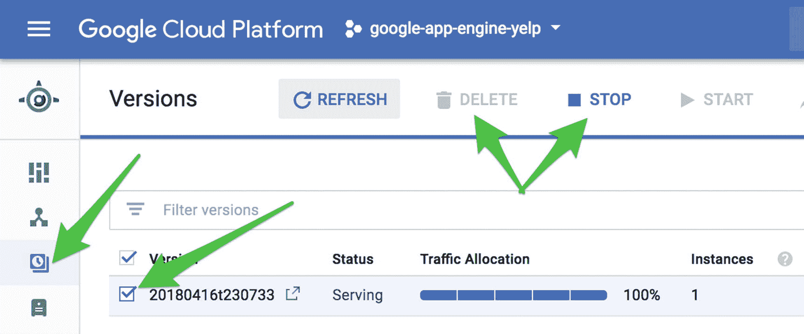
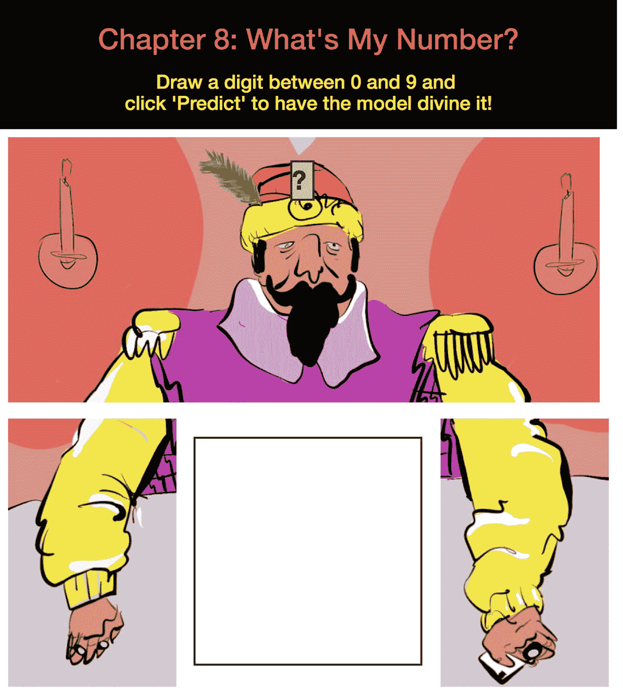

# 八、在 GCP 上将 TensorFlow 用于交互式绘图画布和数字预测

让我们构建一个交互式绘图画布，使访问者能够在 Google Cloud 上使用 TensorFlow 图像分类来绘制和预测数字。

预先警告，这是如此有趣和互动的一章，以至于我最终浪费了太多时间来玩最终产品(图 [8-1](#Fig1) )。这是使用机器学习创建 web 应用程序的固有风险之一！


图 8-1

本章的最后一个 web 应用程序

在这里，我们将利用 TensorFlow <sup>[1](#Fn1)</sup> 的强大功能来为著名的 MNIST 数据库建模。除非你一直生活在岩石下，否则你很可能听说过这两种情况(如果你没有听说过，不要担心，在本章结束时你会听说的)。最终的 web 应用程序将有一个画布，允许访问者用鼠标或手指绘制 0 到 9 之间的数字，并让我们训练有素的 TensorFlow 模型预测它。

### 注意

进入 [`www.apress.com/9781484238721`](http://www.apress.com/9781484238721) 并点击源代码按钮，下载第 [8 章](08.html)的文件。打开 Jupyter 笔记本" **chapter8.ipynb** "跟随本章内容。

## MNIST 数据集

MNIST 数据库包含 60，000 幅训练图像和 10，000 幅测试图像。是图像识别分类的“ **Hello World** ”。它是由高中生和美国人口普查局员工写的“ **0** 和“ **9** 之间的个位数组成的*。理解数据的最佳方式是看几个例子。将本章的文件下载到一个名为“ **chapter-8** ”的目录中，然后打开 Jupyter 笔记本继续学习。当您安装 Tensorflow 时，您将能够直接从“**tensor flow . examples . tutorials . mnist**”库中的“ **input_data()** ”函数下载 MNIST。这将使训练我们的模型更加容易，因为他们已经将数据分成了训练集和测试集。让我们将 MNIST 加载到内存中，并取出几个样本(清单 [8-1](#PC1) )。*

```py
Input
:

mnist = input_data.read_data_sets("MNIST_data/", one_hot=True)

Output:

Extracting MNIST_data/train-images-idx3-ubyte.gz
Extracting MNIST_data/train-labels-idx1-ubyte.gz
Extracting MNIST_data/t10k-images-idx3-ubyte.gz
Extracting MNIST_data/t10k-labels-idx1-ubyte.gz

Listing 8-1Loading MNIST

```

这将自动下载并解压缩四个文件:两组图像和两组相应的标签。让我们打开几个数字和标签。我们将从查看训练数据集中的第一幅图像开始，并提取相应的标签(列表 [8-2](#PC2) 和图 [8-2](#Fig2) )。



图 8-2

MNIST 数字之一的 Matplotlib 可视化呈现

```py
import matplotlib.pyplot as plt
first_digit = mnist.train.images[0]
first_digit = np.array(first_image, dtype="float")
first_digit = first_digit.reshape((28, 28))
plt.imshow(sample_digit)
plt.show()

Listing 8-2Viewing Digit

```

我们也可以看到相应的标签；格式是一个 1ten0 数字的数组，每个数字代表一个从 0 到 9 的值(清单 [8-3](#PC3) )。

```py
Input:

mnist.train.labels[0]

Output:

array([ 0.,  0.,  0.,  0.,  1.,  0.,  0.,  0.,  0.,  0.])

Listing 8-3Viewing Digit

```

通过使用一个" **argmax()** "函数，我们可以得到最大值的索引，并且，当它们被方便地按升序排序时，我们自动得到所讨论的数字(清单 [8-4](#PC4) )。

```py
Input:

np.argmax(mnist.train.labels[0])

Output:

4

Listing 8-4Listing Digit

```

为了好玩，我们将使用另一种筛选数据的方法，即使用内置的" **next_batch()** "函数，稍后我们将依赖该函数将数据输入到我们的 TensorFlow 模型中进行训练(清单 [8-5](#PC5) 和图 [8-3](#Fig3) )。



图 8-3

MNIST 数字之一的 Matplotlib 可视化呈现

```py
batch = mnist.train.next_batch(1)
sample_digit = batch[0]
sample_digit = sample_digit.reshape(28, 28)
plt.imshow(sample_digit)
plt.show()

Listing 8-5Viewing Digit

```

数字是灰度级的，并且都是 28×28 像素；关于数据真的没有什么可说的，因为它是不言自明的。

## TensorFlow

TensorFlow 是一个开源库，由 Google 的好心人提供，是为高性能数值计算而设计的。它使用数据流图来表示数学运算，然后可以在本地或分布式设备上轻松计算。它有大量的功能用于计算、数字处理和正常的深度建模。它于 2015 年 11 月在 Apache 2.0 开源许可下发布*。*

关于这个主题的资料太多了，所以我不会重复这个主题，而是直接进入我们手头的任务:手写数字建模！所以，如果你还没有这样做的话，继续把这一章的文件下载到一个名为“ **chapter-8** 的文件夹中。打开 Jupyter 笔记本，继续学习。

## 用TensorFlow和卷积网络建模

MNIST 数据集可能已经用地球上的每一个模型进行了建模， <sup>[2](#Fn2)</sup> 但是一个强大且相对容易使用的模型是卷积网络，称为“**CNN**s 或“ **Covnets** 这是一个非常强大的方法，可以像你希望的那样简单或复杂。它们最初是为图像建模而设计的，但已经证明在许多其他领域非常有用，如自然语言处理和时间序列建模。我们将利用 TensorFlow 系列教程中的代码，标题为:“**专家深度 MNIST**” <sup>[3](#Fn3)</sup> 这不是他们提供的最简单的模型，但仍被认为是入门级别的方法。

该模型在分类手写数字时获得了令人难以置信的 99%的准确率。当我们用这个数据集对比 Yann LeCun 的旅程时，这就更加有趣了。他是视觉建模和卷积神经网络的创始人之一，也是脸书人工智能研究中心的主任。几十年来，他对这些数据进行了基准测试，并密切合作，将建模识别准确率从 12%一直提高到百分之几。更不可思议的是，今天我们可以打开这个话题的教程，用不到 50 行代码就得到这个不可思议的分数。

让我们简单地看一下我们将用于这个 web 应用程序的模型。以下是本教程的一些亮点(更多细节见完整教程，见 [`https://www.tensorflow.org/versions/r1.1/get_started/mnist/pros`](https://www.tensorflow.org/versions/r1.1/get_started/mnist/pros) )。

### 占位符(tf.placeholder)

这些是我们的图像和标签数据流的管道。这是 TensorFlow 中的一个重要概念，在这里，在向图中输入任何实际数据之前，先构建一个功能图(清单 [8-6](#PC6) )。

```py
x = tf.placeholder(tf.float32, shape=[None, 784])
y_ = tf.placeholder(tf.float32, shape=[None, 10])

Listing 8-6Code Input

```

**变量(tf。可变)**

变量用来保存值，你可以用实际值初始化它们(清单 [8-7](#PC7) )。

```py
def weight_variable(shape):
  initial = tf.truncated_normal(shape, stddev=0.1)
  return tf.Variable(initial)

Listing 8-7Function “weight_variable()”

```

### 构建建模层

我们可以将我们的专用网络层定义为函数，并且能够根据神经网络的复杂性，任意多次地重用它们(清单 [8-8](#PC8) )。

```py
def conv2d(x, W):
  return tf.nn.conv2d(x, W, strides=[1, 1, 1, 1], padding="SAME")

def max_pool_2x2(x):
  return tf.nn.max_pool(x, ksize=[1, 2, 2, 1],
                        strides=[1, 2, 2, 1], padding="SAME")

Listing 8-8Abstracting Functions “conv2d()” and “max_pool_2x2()”.

```

然后，我们可以通过调用 conv2d()和 max_pool_2x2()(清单 [8-9](#PC9) )来创建所需数量的层。

```py
h_conv1 = tf.nn.relu(conv2d(x_image, W_conv1) + b_conv1)
h_pool1 = max_pool_2x2(h_conv1)

Listing 8-9Creating Layers

```

### 损失函数

原来的教程模型用的是“**TF . nn . soft max _ cross _ entroy _ with _ logits()**”函数，是个满嘴的。Softmax 返回在 *n* 类上总和为 1 的概率，交叉熵处理来自不同分布的数据(清单 [8-10](#PC10) )。

```py
cross_entropy = tf.reduce_mean(tf.nn.softmax_cross_entropy_with_logits(labels=y_, logits=y))

Listing 8-10Getting the Cross Entropy

```

文档声明它将在以后的版本中被弃用(并习惯于在 TensorFlow 和 Python 中的大多数库中发生的`—`)，所以我们将使用一种更通用的类似方法(详见 Jupyter 笔记本)。

### 实例化会话

一旦我们准备好运行我们的模型，我们就用" **sess.run** "命令实例化会话。这将打开我们之前设置的所有图表(列表 [8-11](#PC11) )。

```py
 sess.run(tf.global_variables_initializer())

Listing 8-11Firing-Up the Session

```

### 培养

我们设置任意数量的循环，在本例中为 1000 个，并将数据批量输入到我们的模型中(清单 [8-12](#PC12) )。

```py
for _ in range(1000):
      batch = mnist.train.next_batch(100)
      train_step.run(feed_dict={x: batch[0], y_: batch[1]})

Listing 8-12Setting Model Iterations

```

### 准确

为了不盲目飞行，我们添加了一个准确性度量来监控我们的模型训练得如何，它将打印出每 100 步的进度(清单 [8-13](#PC13) )。

```py
print(step, sess.run(accuracy, feed_dict={x: mnist.test.images, y_: mnist.test.labels, keep_prob: 1.0}))

Listing 8-13Accessing the Accuracy During Training

```

在这个脚本中还有很多内容，所以请转到实际的 TensorFlow 教程，因为如果你对深度学习( [`https://www.tensorflow.org/versions/r1.2/get_started/mnist/pros`](https://www.tensorflow.org/versions/r1.2/get_started/mnist/pros) )感兴趣，这是非常值得的。

### 运行脚本

运行 2000 次给了我们一个不错的分数，但还有很大的改进空间(清单 [8-14](#PC14) )。

```py
0 0.0997
100 0.8445
200 0.905
300 0.9264
400 0.9399
500 0.9492
600 0.9509
700 0.9587
800 0.9596
900 0.9623
1000 0.9668
1100 0.9688
1200 0.9706
1300 0.9719
1400 0.9683
1500 0.9708
1600 0.9754
1700 0.9751
1800 0.9753
1900 0.9738
2000 0.9776

Listing 8-14Accuracy Output During 2,000 Iterations

```

如果你像教程建议的那样持续建模超过 20，000 步，你可以达到那个难以捉摸的 99.2%！但这可能需要 30 分钟，取决于你的机器(如果你有一个 GPU，你会快速通过它；清单 [8-15](#PC15) )。

```py
        ...
19300 0.9935
19400 0.9928
19500 0.9926
19600 0.9923
19700 0.9932
19800 0.993
19900 0.9926
20000 0.9927

Listing 8-15Accuracy Output During 20,000 Iterations

```

一旦模型完成了训练，我们将它保存到文件中，这样我们可以在以后运行预测(更重要的是在我们的 web 应用程序中；清单 [8-16](#PC16) )。

```py
saver = tf.train.Saver()
save_path = saver.save(sess, save_file)
print ("Model saved in file: ", save_path)

Listing 8-16Saving the Trained Weights

```

## 运行保存的TensorFlow模型

这种实例化训练模型的能力是应用建模和构建商业管道的一个重要方面。我们在这里开发的模型不需要那么长的训练时间(2 到 30 分钟，取决于您使用的步骤数量)，但是如果您必须在每个请求上训练它，没有用户会愿意在网页上等待那么长时间。好消息是很容易保存和重新加载一个训练好的模型。关键是在退出 TensorFlow 会话(清单 [8-17](#PC17) )之前，调用“ **tf.train.Saver** ”的“ **save()** ”函数。

```py
Input:

saver = tf.train.Saver()
save_path = saver.save(sess, save_file)
print ("Model saved in file: ", save_path)

Output:

Model saved in file:  /Users/manuel/apress-book-repository/chapter-8/model.ckpt

Listing 8-17Saving Model

```

下次你想运行训练好的模型，你要做的就是设置好所有的图形变量，并在 TensorFlow 会话中调用“ **tf.train.Saver** ”的“ **restore()** ”函数(清单 [8-18](#PC18) )。

```py
Input:

saver = tf.train.Saver()
with tf.Session() as sess:
        sess.run(tf.global_variables_initializer())
        saver.restore(sess, save_file)
        print("Model restored.")

Output:

INFO:tensorflow:Restoring parameters from /Users/manuel/apress-book-repository/chapter-8/model.ckpt
Model restored.

Listing 8-18Restoring a Saved Model

```

## 救救那个模特！

您将在本章的下载中找到一个已经训练好的模型。如果你想用你自己的，看看 Jupyter 笔记本，保存训练好的体重文件(我就是这么做的)。您将得到三个文件，它们代表了保存的模式，并且是加载模型所需要的。TensorFlow 足够智能，可以从您提供的文件中加载最新版本(例如，您可以存储多个检查点文件，它将使用最新版本；清单 [8-19](#PC19) )。

```py
checkpoint
model.ckpt.data-00000-of-00001
model.ckpt.index

Listing 8-19Pretrained Model Files in Downloads for This Chapter if You Don’t Want to Train It Yourself

```

## 绘图画布

画布是应用程序的一个关键部分，因为它可以让任何人在理解 MNSIT、字符识别和卷积建模时有所体验，而且很有趣。这些通常是与高级课程和工业建模工具相关的困难概念，但是它们也很有趣！画布是 HTML5 的一部分(关于这个酷功能的更多信息，请参见 [`https://www.w3schools.com/html/html5_canvas.asp`](https://www.w3schools.com/html/html5_canvas.asp) )，它允许创建一个空间，用户可以在这个空间中进行交互并在网页上创建绘图(图 [8-4](#Fig4) )。



图 8-4

用 HTML5 和

<canvas>标签进行手指画</canvas>

使用这种方法，我们可以将用户在画布上绘制的内容转化为我们的 TensorFlow 模型可以摄取并尝试预测的图像。

### 从画布到TensorFlow

这一部分并不复杂，但需要一些转换，所以坚持住。当访问者点击“**预测**按钮时，它调用画布 HTML5 控件的“**toda aull()**”函数。这将把 canvas 标签中包含的任何数据转换成 PNG 格式的图像的文本表示。

这是一个我们以前见过的概念，并将在本书中再次见到。还记得第 [3 章](03.html)吗？我们依靠文本表示的图像数据来轻松地将它从服务器传递到客户端。在这种情况下，我们以相反的方式从`—`客户端到服务器(图 [8-5](#Fig5) )。



图 8-5

表示为文本的图像数据

### 注意

代码部分基于在 [`https://stackoverflow.com/questions/2368784/draw-on-html5-canvas-using-a-mouse`](https://stackoverflow.com/questions/2368784/draw-on-html5-canvas-using-a-mouse) 发现的一段精彩片段。无论何时你有关于编码的疑问或者问题，并且需要一个解决方案，StackOverflow.com 应该是你的第一站！

## 对新手写数字的测试

这是我们管道(和 web 应用程序)的关键部分。我们需要能够将新的手写数字传递给模型进行预测。

**处理真实图像**

使用 MNIST 数据集和真实图像进行测试的不同之处在于，MNIST 数据已经为我们进行了处理。因此，我们需要对新图像应用相同的处理，这样它就可以与我们训练好的模型兼容。想象你用一个数字创建一个图像文件；这就是你将它传递给模型的方式。我们利用 PIL 和 NumPy Python 库来执行大多数图像处理(清单 [8-20](#PC20) )。

```py
from PIL import Image
img = Image.open('my-own-4.png')

Listing 8-20Importing an Image

```

我们把它调整到官方要求的 28 乘 28 像素大小。由于我们将使用透明图像(只有数字会显示，而不是背景)，我们需要添加一个白色背景，以符合训练好的 MNIST 数据(清单 [8-21](#PC21) )。

```py
img = img.resize([28,28])
# add white background
corrected_img = Image.new("RGBA", (28, 28), "white")
# paste both images together
corrected_img.paste(img, (0,0), img)

Listing 8-21Processing New Image

```

接下来，我们将图像转换成数组，删除我们在处理黑白图像时不需要的额外颜色维度，最后将整个图像反转，使空像素为零(清单 [8-22](#PC22) )。

```py
# remove color dimensions
corrected_img = np.asarray(corrected_img)
# remove color layers
corrected_img = corrected_img[:, :, 0]
# invert colors
corrected_img = np.invert(corrected_img)

Listing 8-22Processing New Image

```

最后，我们将图像从 28 乘 28 的矩阵展平为大小为 784 的平面向量，并将数据居中放置在 0 和 1 之间，而不是 0 和 255 之间。就是这样；现在它已经准备好输入到我们的 TensorFlow 模型中进行预测(列表 [8-23](#PC23) 和图 [8-6](#Fig6) )。



图 8-6

准备建模的变换图像数据的部分最终输出

```py
corrected_img = corrected_img.reshape([784])
# center around 0-1
img = np.asarray(corrected_img, dtype=np.float32) / 255.

Listing 8-23Flattening the Data

```

## 设计 Web 应用程序

我们现在正处于这一章有趣的部分；我们开始设计我们的网络应用程序！我们会让事情变得非常简单。这意味着有趣和直观，通过保持按钮和选项最少，将允许我们的访问者立即理解和互动的工具。我们将在中间添加一个中心画布，以便访问者可以在“ **0** ”和“ **9** ”之间绘制一个数字，以及两个按钮:一个用于预测数字，另一个用于清除画布。最后，我们还会添加一个下拉菜单来控制油漆刷的粗细`—`就是这样！

在图形方面，我们使用一个大图片，我们把它分成不同的部分:一个包含算命先生头部的顶部和两个包含手臂的侧部。它被切割以适应 web 应用程序中心的绘图画布。

## 下载 Web 应用程序

如果您还没有下载本章的代码，请继续下载，打开命令行窗口，将驱动器更改为“ **web 应用程序**文件夹。它应该包含通常的文件以及我们保存的检查点文件(清单 [8-24](#PC24) )。

```py
web-application
        ├── app.yaml
        ├── appengine_config.py
        ├── main.py
        ├── requirements.txt
        ├── checkpoint
        ├── model.ckpt.data-00000-of-00001
        ├── model.ckpt.index
        ├── static
                                └── images
                                       ├── left.png
                                       ├── right.png
                                       └── top.png

        └── templates
                                └── index.html

Listing 8-24Web Application Files

```

首先，您需要在 Python 3.x 实例上安装 TensorFlow(或者在下一步中安装需求文件)。像往常一样，我们将启动一个虚拟环境来隔离我们的 Python 库安装(清单 [8-25](#PC25) )。

```py
$ python3 -m venv whatsmynumber
$ source whatsmynumber/bin/activate
$ pip3 install tensorflow

Listing 8-25Starting Virtual Environment and Install TensorFlow

```

然后通过运行“ **pip install -r** ”命令安装所有需要的 Python 库(清单 [8-26](#PC26) )。

```py
$ pip3 install -r requirements.txt
$ python3

Listing 8-26Installing Requirements and Running Local Version

```

以通常的方式运行 web 应用程序，您应该会看到算命先生出现。这可能需要一段时间才能开始，取决于你的计算能力。去试试吧，确保他的预测是值得的！(图 [8-7](#Fig7)


图 8-7

“**我的号码是多少**”web 应用程序的空白画布

## 谷歌云灵活应用引擎

我们将使用灵活的应用程序引擎来运行要求更高的 Python 库，如 TensorFlow 和 PIL。我们将需要使用一个稍微更强大的实例来处理 TensorFlow 和我们保存的模型。如果你看一下本章“**网络应用**”文件夹下的“ **app.yaml** ”文件，你会看到我们增加了内存和磁盘大小(清单 [8-27](#PC27) 和 [8-28](#PC28) )。

```py
resources:
  cpu: 1
  memory_gb: 3
  disk_size_gb: 20

Listing 8-27Now We’re Using the Larger Setup

```

```py
resources:
  cpu: 1
  memory_gb: 0.5
  disk_size_gb: 10

Listing 8-28Previously We Ran with Fewer Resource Settings

```

给聪明人一个忠告:你提供的机器越大，费用就越高。因此，请确保在完成后终止实例！

## 在 Google 应用引擎上部署

到目前为止，您应该对 Google Flexible App Engine 有了一些经验，所以这将是启动和运行这个 web 应用程序的快速指南。

### 第一步:启动谷歌云外壳

登录您的 Google Cloud 实例，创建或选择您希望应用引擎驻留的项目(如果您没有项目，系统会提示您创建一个项目`—`参见创建和管理项目 <sup>[4](#Fn4)</sup> )。通过点击右上角的插入符号按钮启动云外壳命令行工具。这将在 GCP 仪表板的下半部分打开一个熟悉的命令行窗口(图 [8-8](#Fig8) )。


图 8-8

访问谷歌云外壳

### 第二步:压缩并上传所有文件到云端

压缩“ **web-application** ”文件夹中的文件，但不压缩虚拟环境文件夹“ **whatsmynumber** ”，因为不需要(图 [8-9](#Fig9) )。



图 8-9

压缩 web 应用程序文件以上传到 Google Cloud

使用“**上传文件**选项上传文件(该选项位于外壳窗口右上方的三个垂直点下方；图 [8-10](#Fig10) 。


图 8-10

通过 Google Cloud shell 上传文件

### 第三步:在 Google Cloud 上创建工作目录并解压文件

一旦文件成功上传，创建一个名为“**第 8 章**”(列表 [8-29](#PC29) )的新目录。

```py
$ mkdir chapter-8
$ cd chapter-8

Listing 8-29Creating the Cloud Directory

```

将所有的 zip 存档文件转移到新文件夹中并解压缩(清单 [8-30](#PC30) )。

```py
$ mv ../Archive.zip Archive.zip
$ unzip Archive.zip

Listing 8-30Moving and Unzipping Web Application Files

```

你在 Google Cloud 上的文件夹应该类似于清单 [8-31](#PC31) 。

```py
Input:

amunategui@cloudshell:~/chapter-8 (apt-memento-192717)$ ls

Output:

appengine_config.py  main.py                         static
app.yaml             model.ckpt.data-00000-of-00001  templates
Archive.zip          model.ckpt.index
checkpoint           requirements.txt

Listing 8-31Confirming That All Files Are Correctly Uploaded by Running the ‘ls’ Command

```

### 第 4 步:创建库文件夹

因此，运行以下命令将所有需要的附加库安装到 lib 文件夹中。当您部署 web 应用程序时，lib 文件夹将与所需的库一起移动(清单 [8-32](#PC32) )。

```py
$ sudo pip3 install -t lib -r requirements.txt

Listing 8-32Installing All Needed Python Libraries into the “lib” Folder

```

### 步骤 5:部署 Web 应用程序

最后用“ **gcloud app deploy** ”命令将其部署到全球(列表 [8-33](#PC33) )。

```py
$ gcloud app deploy app.yaml

Listing 8-33Deploying Web Application

```

就是这样！坐下来，让工具部署网站。这是灵活的应用程序引擎，因此完全部署可能需要 30 分钟。一旦完成所有设置，它将提供一个可点击的链接，直接跳转到已部署的 web 应用程序(清单 [8-34](#PC34) )。

```py
$ gcloud app browse

Listing 8-34You Can Also Get There with the Following Command

```

享受您的劳动成果，并确保通过绘制可识别和不可识别的数字进行试验(图 [8-11](#Fig11) )。


图 8-11

谷歌云上的网络应用

## 解决纷争

在有些情况下，你会遇到问题，而谷歌云日志会是你最好的朋友。您可以直接在 Google Cloud dashboard 中或者通过调用日志 URL(清单 [8-35](#PC35) )轻松找到它们。

```py
https://console.cloud.google.com/logs

Listing 8-35Logs URL

```

或者您可以通过在云 shell 中输入清单 [8-36](#PC36) 中的以下命令来传输日志的尾部。

```py
$ gcloud app logs tail -s default

Listing 8-36Viewing Logs in Terminal Window

```

## 关闭商店

在我们结束本章之前，还有最后一件事:不要忘记停止或删除你的应用引擎云实例。即使你使用的是免费信用，计价器仍然在运行，没有必要浪费金钱或信用。

与标准应用引擎相比，灵活应用引擎的情况略有不同，因为灵活应用引擎的成本更高。所以，如果你不使用它，停止它是很重要的。此外，这一切都可以通过谷歌云仪表板方便地完成。

导航至应用程序引擎，然后导航至版本。点击您的活动版本并停止(图 [8-12](#Fig12) )。如果有多个版本，可以删除旧的；您将无法删除默认的，但停止它应该足够了(如果您真的不想要它的任何痕迹，只需删除整个项目)。



图 8-12

停止和/或删除您的应用引擎版本

就是这样！如果一切都完成了，不要忘记停用虚拟环境(清单 [8-37](#PC37) )。

```py
$ deactivate

Listing 8-37Deactivating the vVirtual Environment

```

## 结论

在这一章中，我们尝试了一些新的和旧的技术。

### HTML5

<canvas>标签</canvas>

HTML5 中新的“ **canvas** ”标签非常有趣，它开启了各种向设备和 Flask 输入数据的新方式。

### TensorFlow

使用 TensorFlow 并能够将预训练的模型加载到烧瓶中是很重要的。训练这些模型需要大量的处理和时间，因此能够利用已经训练好的模型可以在瞬间将深度模型实现到 web 应用程序中。这里需要注意的一点是，您需要一台机器来满足您的TensorFlow需求，我们在前面章节中使用的基本简单设置不会达到目的(有关所需设置，请参见 app.yaml 文件)。

### 设计

将背景图像分割成四个部分是一种有趣且简单的方法，可以将大图像与输入控件交错，例如我们的画布(图 [8-13](#Fig13) )。



图 8-13

在前端设计中添加额外的“ **cellpadding** ”，以查看容纳绘图画布所需的拆分

<aside class="FootnoteSection" epub:type="footnotes">Footnotes [1](#Fn1_source)

[T2`https://www.tensorflow.org/`](https://www.tensorflow.org/)

  [2](#Fn2_source)

[T2`http://yann.lecun.com/exdb/mnist/`](http://yann.lecun.com/exdb/mnist/)

  [3](#Fn3_source)

[T2`https://tensorflow.org/versions/r1.1/get_started/mnist/pros`](http://tensorflow.org/versions/r1.1/get_started/mnist/pros)

  [4](#Fn4_source)

[T2`https://cloud.google.com/resource-manager/docs/creating-managing-projects`](https://cloud.google.com/resource-manager/docs/creating-managing-projects)

 </aside>