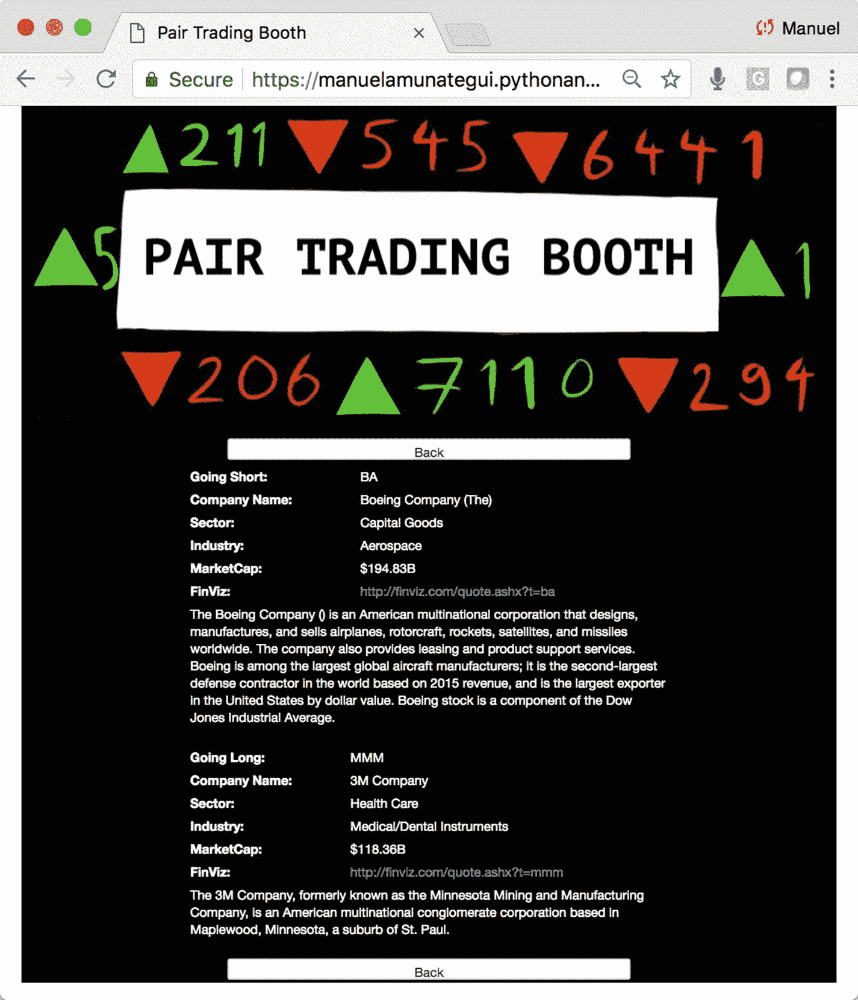
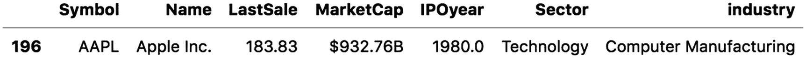
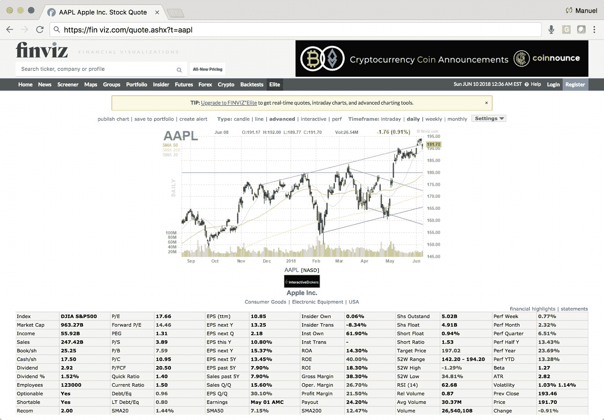
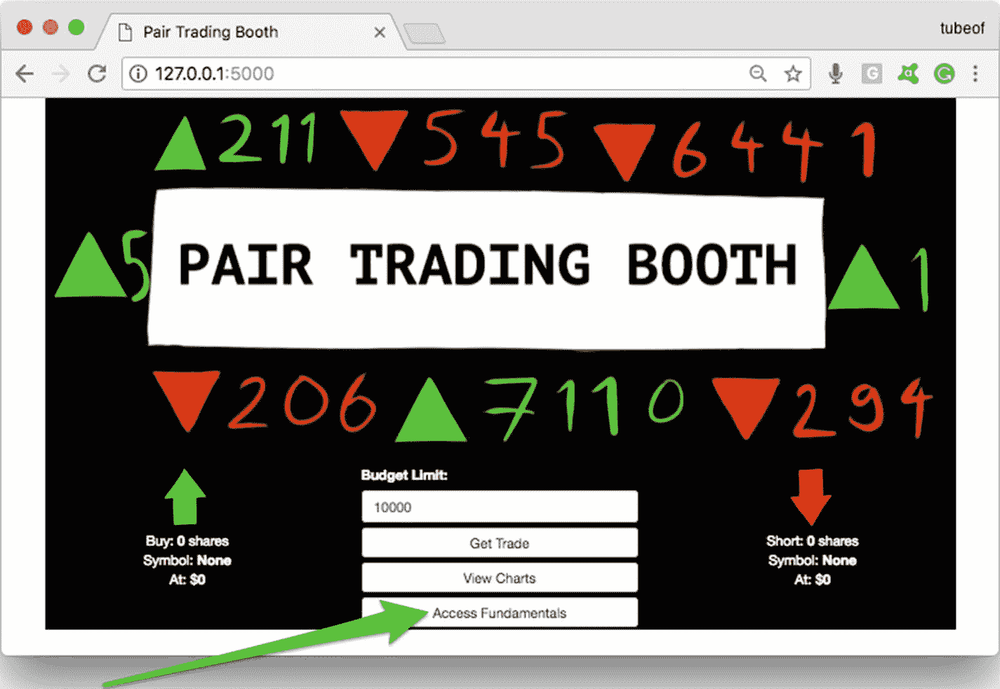
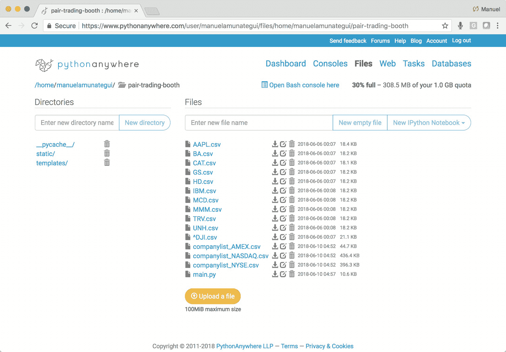
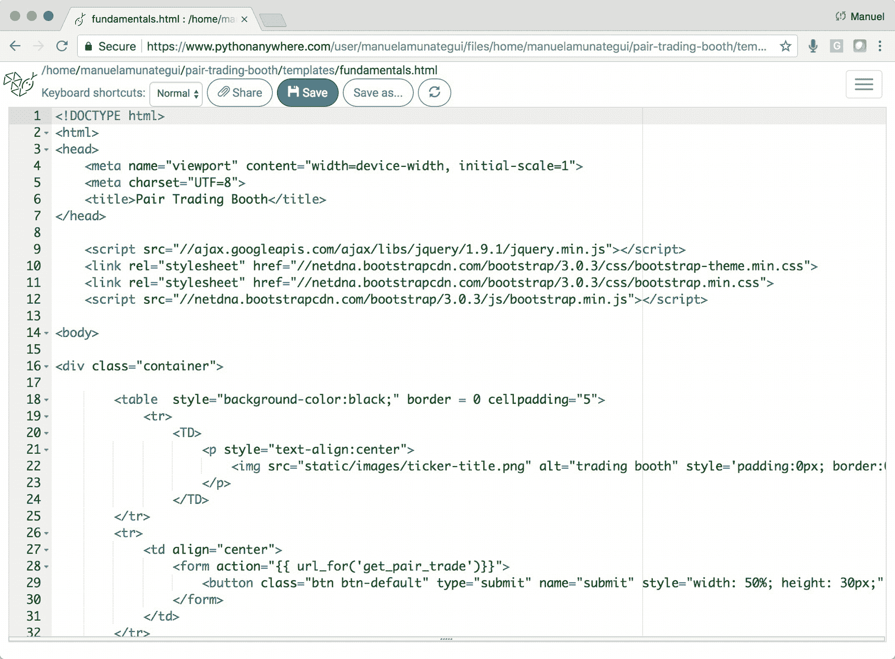
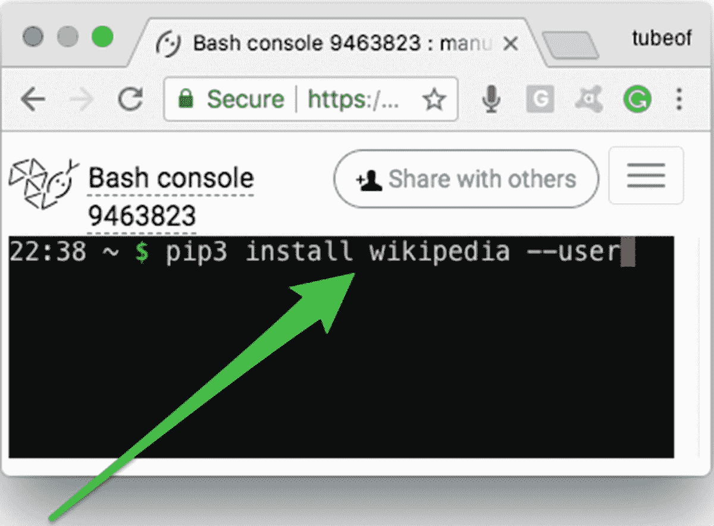
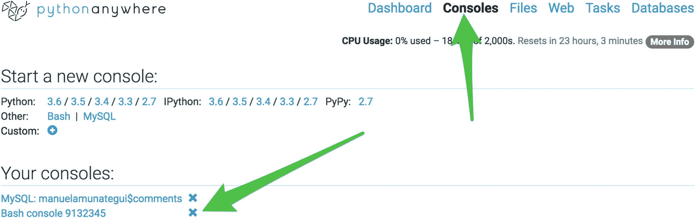
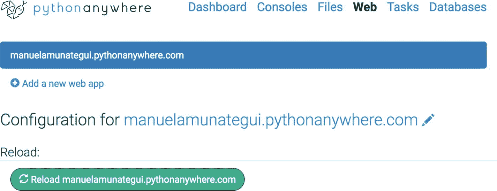
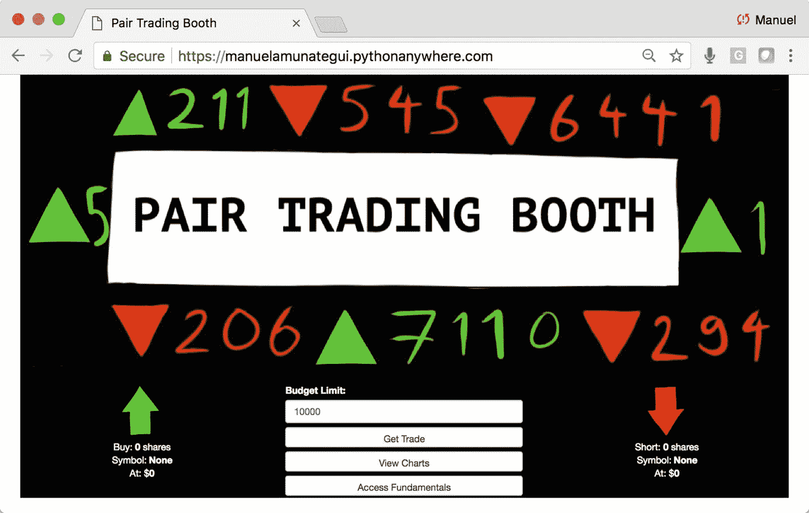

# 12.案例研究第 3 部分:用基本财务信息丰富内容

用 PythonAnywhere 上的基本金融数据聚合预测股票市场。

我们将继续为我们的“**Pair Trading Booth**”web 应用程序添加功能(图 [12-1](#Fig1) )。



图 12-1

本章的最后一个 web 应用程序

到目前为止，我们告诉了我们的访问者最好的配对交易，向他们展示了相关的财务图表，现在我们将向他们提供所提到的股票背后的公司的关键基本细节。

*   公司的全称

*   Wikipedia.com 公司简介

*   市值

*   市场部门

*   市场行业

*   金融网站的动态链接:Finviz.com

### 注意

进入 [`www.apress.com/9781484238721`](http://www.apress.com/9781484238721) 并点击源代码按钮，下载第 [12 章](12.html)的文件。打开 Jupyter 笔记本" **chapter12.ipynb** "跟随本章内容。

## 访问上市股票公司列表

股票代码简短而模糊，如果你把它放入网络浏览器进行互联网搜索，它可以有不同的含义。我们需要将它与公司全称联系起来，以保证它的唯一性。纳斯达克网站 <sup>[1](#Fn1)</sup> 提供了大量的 CSV 文件供我们使用，这些文件将符号与包括完整公司名称在内的附加信息相匹配。将您的浏览器指向

[`https://www.nasdaq.com/screening/company-list.aspx`](https://www.nasdaq.com/screening/company-list.aspx) 。

将所有三个文件下载到您的本地机器上。请确保按照以下格式重命名它们，否则它们都将被命名为“ **companylist.csv** ”:

*   companylist_NASDAQ.csv

*   companylist_AMEX.csv

*   companylist_NYSE.csv

让我们在十个股票代码和它们在下载文件中的位置之间找到匹配。这可以通过使用我们感兴趣的十个符号的列表并遍历公司列表中的每个符号来轻松完成(列表 [12-1](#PC1) )。因为这些股票非常出名，你会发现它们每一个都很匹配(对于小市值公司来说可能不是这样)。

```py
Input:

stock_symbols = ['BA','GS','UNH','MMM','HD','AAPL','MCD','IBM','CAT','TRV']

print('Symbols found in the Nasdaq list:')
list(set(stock_symbols) & set(list(stock_company_info_nasdaq['Symbol'])))

Output:

Symbols found in the Nasdaq list:
['AAPL']

Listing 12-1Checking Stock Symbols in “companylist”

```

我们发现“ **companylist_NASDAQ.csv** ”列表包含一个符号，“ **AAPL** ”。我们现在可以将该行从公司列表“ **CSV** ”文件中取出并保存。我们以同样的方式处理其他两个公司列表中的其他符号(列表 [12-2](#PC2) 和图 [12-2](#Fig2) )。



图 12-2

我们从纳斯达克公司名单中提取的额外情报

```py
stock_company_info_nasdaq[stock_company_info_nasdaq['Symbol'] == 'AAPL']

Listing 12-2Querying “companylist”

```

我们现在知道“ **AAPL** ”等同于“**苹果公司**”，我们还可以获得该股票代码的市值、IPO 年份、部门和行业。所有这些信息对我们的用户都很有用。此外，我们现在有了公司名称的准确拼写，我们可以使用它从 [`www.wikipedia.org`](http://www.wikipedia.org) 中提取关于该公司的附加信息。如前所述，其中一些符号名称过于简单，不一定会从网络搜索中返回正确的信息，但如果我们将符号名称与实际的公司名称结合起来，我们就有更好的机会找到我们想要的信息。(请记住，您可能仍然会发现一些不相关的情况。)

## 用维基百科 API 提取公司信息

Wikipedia 有一个很棒且易于使用的 Python API，我们将利用它来增加我们应用程序的深度。我们将为我们推荐的每家公司提取介绍性段落(介绍性段落只是返回的第一个段落；清单 [12-3](#PC3) )。

```py
Input:

import wikipedia
description = wikipedia.page("Apple Inc.").content
description = description.split('\n')[0]
description

Output:

"Apple Inc. is an American multinational technology company headquartered in Cupertino, California, that designs, develops, and sells consumer electronics, computer software, and online services. The company's hardware products include the iPhone smartphone, the iPad tablet computer, the Mac personal computer, the iPod portable media player, the Apple Watch smartwatch, the Apple TV digital media player, and the HomePod smart speaker. Apple's software includes the macOS and iOS operating systems, the iTunes media player, the Safari web browser, and the iLife and iWork creativity and productivity suites, as well as professional applications like Final Cut Pro, Logic Pro, and Xcode. Its online services include the iTunes Store, the iOS App Store and Mac App Store, Apple Music, and iCloud."

Listing 12-3Wikipedia Query

```

### 构建动态 FinViz 链接

`FinViz.com`是金融基本面数据的宝库。我们不会从他们身上刮去；相反，我们将建立动态链接，以便我们的用户可以选择去那里获得额外的信息。这可以确保我们不会窃取他人的信息。我建议总是在新页面中打开一个链接；这确保了用户仍然有一个简单的方法回到你的房产(列表 [12-4](#PC4) 和图 [12-3](#Fig3) )。



图 12-3

苹果公司的 Finviz 输出链接

```py
Input:

predictions_df = pd.DataFrame(all_user_predicted_ratings, columns = movies_df.index)
symbol = 'AAPL'
url = r'http://finviz.com/quote.ashx?t={}'.format(symbol.lower())
url

Output:

http://finviz.com/quote.ashx?t=aapl

Listing 12-4Finviz Link Making

```

## 探索基础

继续将本章的文件下载到名为“ **chapter-12** ”的文件夹中打开 Jupyter 笔记本，继续学习。

让我们将我们的三个基本产品抽象成三个简洁易用的功能，它们可以很容易地集成到我们的 web 应用程序中。我们将从“**getcorollarrycompanyinfo()**”函数开始。该功能将提取我们交易中的公司名称、部门、行业以及多空股票符号的市值(列表 [12-5](#PC5) )。

```py
def GetCorollaryCompanyInfo(symbol):
    CompanyName = "No company name"
    Sector = "No sector"
    Industry = "No industry"
    MarketCap = "No market cap"

    if (symbol in list(stock_company_info_nasdaq['Symbol'])):
        data_row = stock_company_info_nasdaq[stock_company_info_nasdaq['Symbol'] == symbol]
        CompanyName = data_row['Name'].values[0]
        Sector = data_row['Sector'].values[0]
        Industry = data_row['industry'].values[0]
        MarketCap = data_row['MarketCap'].values[0]

    elif (symbol in list(stock_company_info_amex['Symbol'])):
        data_row = stock_company_info_amex[stock_company_info_amex['Symbol'] == symbol]
        CompanyName = data_row['Name'].values[0]
        Sector = data_row['Sector'].values[0]
        Industry = data_row['industry'].values[0]
        MarketCap = data_row['MarketCap'].values[0]

    elif (symbol in list(stock_company_info_nyse['Symbol'])):
        data_row = stock_company_info_nyse[stock_company_info_amex['Symbol'] == symbol]
        CompanyName = data_row['Name'].values[0]
        Sector = data_row['Sector'].values[0]
        Industry = data_row['industry'].values[0]
        MarketCap = data_row['MarketCap'].values[0]

    return (CompanyName, Sector, Industry, MarketCap)

Listing 12-5Abstracting by Creating the “GetCorollaryCompanyInfor()” Function

```

我们还将构建一个函数，使用我们从"**GetCorollaryCompanyInfo()**"函数中获得的公司来处理 Wikipedia 信息的提取。该函数将返回找到的条目的第一段(列表 [12-6](#PC6) )。

```py
def GetWikipediaIntro(symbol):
    description = wikipedia.page("Apple Inc.").content
    return(description.split('\n')[0])

Listing 12-6Abstracting by Creating the “GetWikipediaIntro()” Function

```

最后，我们将构建一个函数来创建一个到 [`Finviz.com`](http://finviz.com) 金融网站的链接。这个函数没有做太多事情，只是在链接的末尾添加了股票符号(清单 [12-7](#PC7) )。

```py
def GetFinVizLink(symbol):
    return(r'http://finviz.com/quote.ashx?t={}'.format(symbol.lower()))

Listing 12-7Abstracting by Creating the “GetFinVizLink()” function

```

## 设计 Web 应用程序

如果您还没有下载本章的代码，请继续下载；打开命令行窗口，将驱动器更改为“ **web 应用程序**文件夹。您的“**网络应用**”文件夹应该包含以下文件，如清单 [12-8](#PC8) 所示。

```py
web-application
    ├── main.py
    ├── requirements.txt
    ├── companylist_AMEX.csv
    ├── companylist_NASDAQ.csv
    ├── companylist_NYSE.csv
    ├── static
            └── images
                    ├── ticker-title.png
                    ├── up-arrow.png
                    └── down-arrow.png

    ├── templates
                ├── charts.html
                ├── fundamentals.html
                └── index.html
    ├── ^DJI.csv
    ├── AAPL.csv
    ├── BA.csv
    ├── CAT.csv
    ├── GS.csv
    ├── HD.csv
    ├── IBM.csv
    ├── MCD.csv
    ├── MMM.csv
    ├── TRV.csv
    ├── UNH.csv
    ├── requirements.txt
    └── main.py

Listing 12-8Web Application Files

```

像往常一样，我们将启动一个虚拟环境来隔离我们的 Python 库安装，并在需要时创建“ **requirements.txt** ”文件(清单 [12-9](#PC9) )。

```py
$ python3 -m venv pairtrading
$ source pairtrading/bin/activate

Listing 12-9Starting the Virtual Environment

```

然后通过运行“ **pip install -r** ”命令安装所有需要的 Python 库(清单 [12-10](#PC10) )。

```py
$ pip3 install -r requirements.txt
$ python3 main.py

Listing 12-10Installing Requirements and Taking the Web Application for a Local Spin

```

像往常一样运行 web 应用程序，并确保它正常工作。此外，尝试页面上的各种选项，以确保一切工作正常，尤其是“**访问基本功能**按钮(图 [12-4](#Fig4) )。



图 12-4

配对交易应用程序的本地版本

完成后从您的虚拟环境中停用(清单 [12-11](#PC11) )。

```py
deactivate pairtrading

Listing 12-11Deactivating Virtual Environment

```

## 将 Web 应用程序上传到 PythonAnywhere

让我们将更新后的代码上传到 PythonAnywhere。登录您的 PythonAnywhere 帐户，找到我们之前创建的文件夹“ **pair-trading-booth** ”。点击顶部菜单栏中的“**文件**链接，进入“**对盘**”目录(图 [12-5](#Fig5) )。



图 12-5

我们在 PythonAnywhere 上的配对交易应用程序

所有需要的股票财务 CSV 文件应该已经存在(如果没有，再次运行第 [5](05.html) 章)。你需要将纳斯达克、美国证券交易所和纽约证券交易所的文件上传到“**配对交易室**”主目录下，同时上传已经存在的十只股票的 CSV 文件。

*   companylist_AMEX.csv

*   companylist_NASDAQ.csv

*   companylist_NYSE.csv

您还需要更新“ **main.py** ”和“【index.html】T2”文件，并上传新的“**fundamentals.html**”文件，以显示我们的股票和衍生图表(或者在 PythonAnywhere 上将其创建为一个新文件，并将代码复制/粘贴到其中)。最好的方法是在本地编辑器中打开这些文件，将内容复制并粘贴到 PythonAnywhere 中。

例如，让我们更新“ **main.py** ”，在您的本地编辑器中打开文件，并在 PythonAnywhere 中打开文件，然后将新版本复制并粘贴到您在 PythonAnywhere 上的“ **main.py** ”文件中。在移动到其他文件之前，不要忘记点击绿色的“**保存**按钮(图 [12-6](#Fig6) )。


图 12-6

更新 PythonAnywhere 上的“ **main.py** ”代码库，处理动态图表的创建

以同样的方式在模板文件夹中为文件“**index.html**”创建一个名为“**fundamentals.html**”的新 HTML 文件(图 [12-7](#Fig7) )。



图 12-7

在 PythonAnywhere 上创建一个名为“**fundamentals.html**”的新文件来处理动态图表的创建

接下来你需要" **pip3** "安装维基百科，因为它不包括在 PythonAnywhere 上的 Python 3 基础构建中(图 [12-8](#Fig8) )。


图 12-8

打开 bash 控制台以 pip 安装未包含在原始 Python 版本中的库

一旦 bash 控制台打开，您就可以 pip 安装任何需要的库了。继续使用以下命令安装维基百科库(您需要添加两个破折号和 user 来覆盖权限被拒绝的消息；清单 [12-12](#PC12) 和图 [12-9](#Fig9) 。



图 12-9

在 pythonanywhere 上安装维基百科库

```py
$ pip3 install wikipedia --user

Listing 12-12Installing Requirements

```

使用“ **exit** ”命令关闭 bash 控制台。如果你不再需要这个控制台，你也可以返回到 PythonAnywhere 仪表盘中的控制台页面，点击你打开的 bash 控制台下的“ **x** ”(图 [12-10](#Fig10) )。



图 12-10

如果不再需要 bash 控件，请将其关闭

现在您已经准备好刷新您的 web 服务并启动 web 应用程序了。点击“ **Web** ”菜单标签，点击绿色大按钮，重新加载应用程序。这很容易做到；点击**控制台**按钮，打开一个 bash 控制台(图 [12-11](#Fig11) )。



图 12-11

点击“**重新加载**按钮来更新你的网络服务器

如果你在浏览器中输入 PythonAnywhere 网站的 URL，你应该会看到新的“ **Pair Trading Booth** ”网站的辉煌。继续并通过它的步伐(图 [12-12](#Fig12) )。



图 12-12

新的" **Pair 交易摊位**"网站增加了图表

## 结论

在这一章中，我们对“**Pair Trading Booth**”web 应用程序进行了第三次测试，并使用附属基本面信息对其进行了增强。我们将当前数据与来自纳斯达克的额外外部数据相结合。我们插入维基百科 API 来提取每家公司的高级描述。如果用户愿意，我们还为更多信息创建了动态链接。

<aside class="FootnoteSection" epub:type="footnotes">Footnotes [1](#Fn1_source)

[T2`https://www.nasdaq.com/`](https://www.nasdaq.com/)

 </aside>