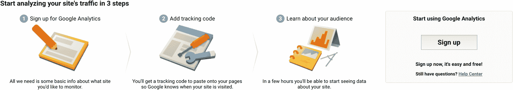
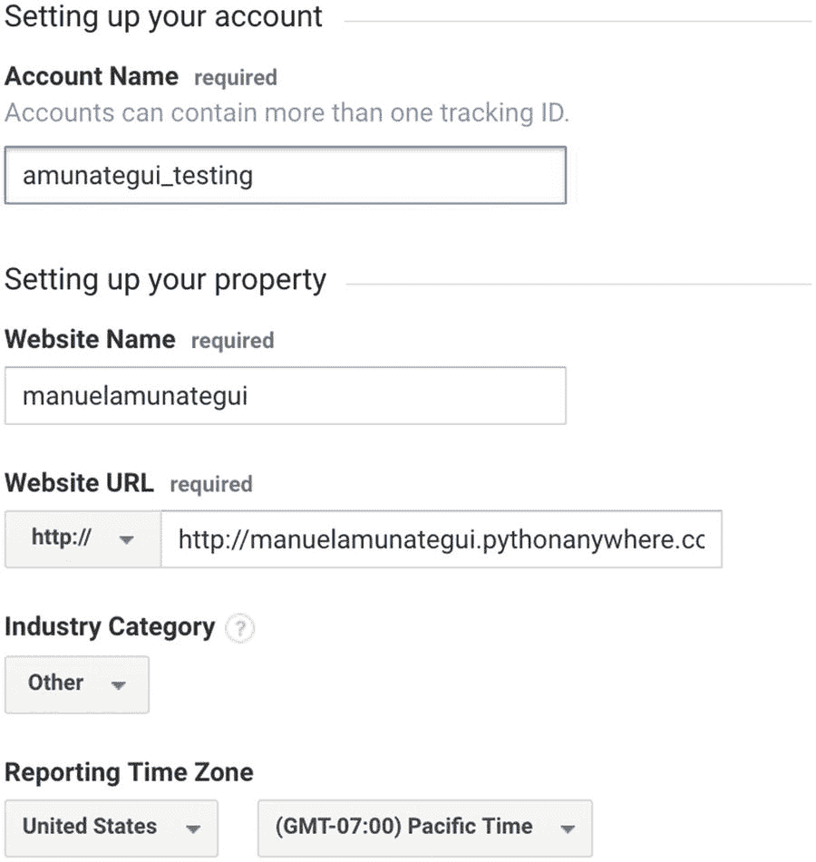
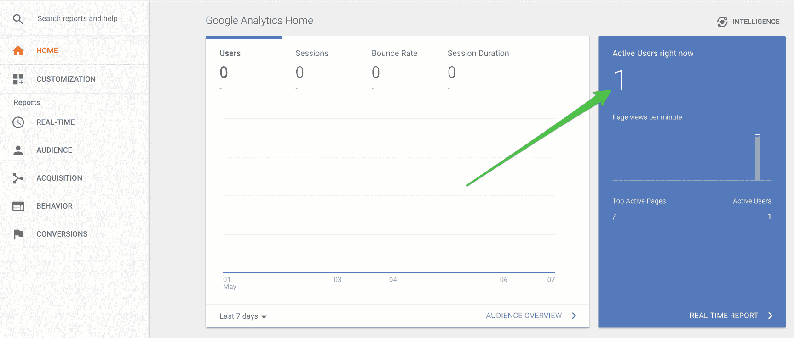
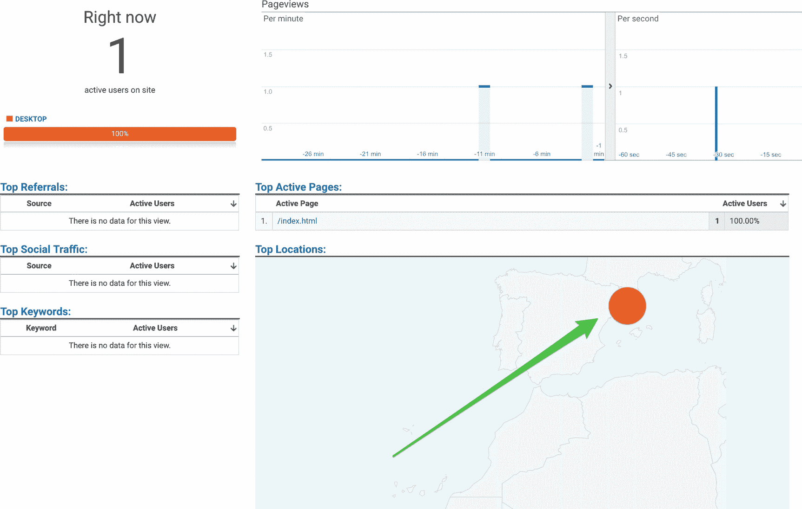
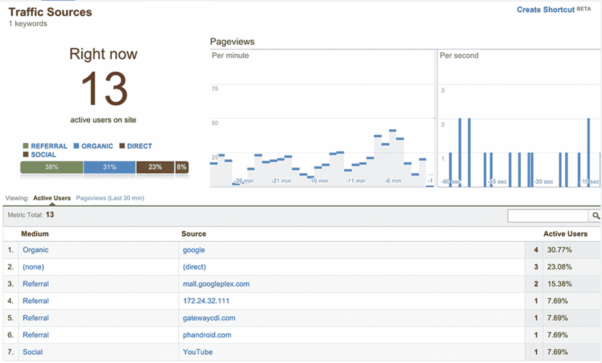
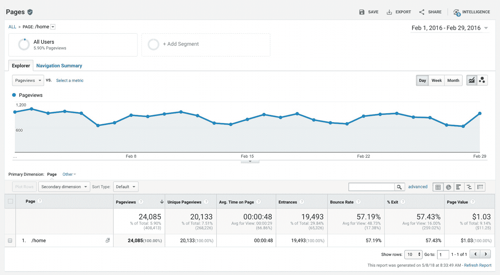

# 13.谷歌分析

免费的高级智能。

让我们看一个简单的工具来更好地理解我们的用户如何与我们的 web 应用程序交互。这对 web 应用程序开发人员来说是一个巨大的福音。构建我们自己的分析跟踪器需要在每个页面上添加大量定制的 Flask 代码来跟踪用户，还需要一个数据库来保存这些交互，以及一个分析引擎来理解这些交互。那是很大的工作量！相反，使用 Google Analytics，我们所要做的就是在每个页面的顶部添加一段 JavaScript 代码。就是这样；在每个页面上添加一些普通的行，不需要编辑，Google Analytics 会处理所有其他的事情。

Google Analytics 将告诉我们用户来自哪里，他们在网站和每个页面上花了多少时间，他们选择的路径等等。这不仅是更好地理解用户的必备工具，也是重构和创建新内容的必备工具。有一个免费版本和一个昂贵的高级版本`—`我们将在这里重点介绍免费版本。免费版本给你很多关于小型网络应用的见解，就像我们在这里构建的一样。

### 注意

这一章没有下载。

## 创建一个谷歌分析账户

导航至 Google Analytics，在 [`https://analytics.google.com/analytics/web/provision`](https://analytics.google.com/analytics/web/provision) 创建一个免费账户。

这将显示一个跟踪网页和“**注册**按钮过程的简单图形(图 [13-1](#Fig1) )。



图 13-1

谷歌分析流程和注册

当它询问网站名称时，输入你 [PythonAnywhere。com](http://pythonanywere.com) 账户(该对交易一；别担心，您可以跟踪多达 100 个帐户)。它会问你一些基本的问题，你可以使用默认设置(图 [13-2](#Fig2) )。



图 13-2

我在谷歌分析上的回答

最后，点击页面底部的蓝色按钮“**获取跟踪 ID** ”并接受服务条款。

## JavaScript 跟踪器

登录 Google Analytics 仪表板后，您将看到的第一个页面是“ **Admin** ”选项卡，其中包含跟踪网页所需的关键 JavaScript 代码片段(清单 [13-1](#PC1) )。这是追踪系统的核心。你只需要在显示“**<<ADD-YOUR-GOOGLE-ANALYTICS-TRACKING-ID>>**”的地方添加你的 API 键，然后把它放到你所有的页面上。

```py
<!-- Google Analytics -->
<script>
(function(i,s,o,g,r,a,m){i['GoogleAnalyticsObject']=r;i[r]=i[r]||function(){
(i[r].q=i[r].q||[]).push(arguments)},i[r].l=1*new Date();a=s.createElement(o),
m=s.getElementsByTagName(o)[0];a.async=1;a.src=g;m.parentNode.insertBefore(a,m)
})(window,document,'script','https://www.google-analytics.com/analytics.js','ga');

ga('create', '<<ADD-YOUR-GOOGLE-ANALYTICS-TRACKING-ID>>', 'auto');
ga('send', 'pageview');
</script>
<!-- End Google Analytics -->

Listing 13-1The JavaScript Tracking Snippet

```

把它复制下来，放到你想要追踪的任何网站的“ **<标题>** ”部分。Pair Trading Booth 的每个 HTML 模板的标题应该看起来像清单 [13-2](#PC2) (确保你输入你的，因为这个将为我的帐户收集流量分析)。

```py
<head>
  <meta name="viewport" content="width=device-width, initial-scale=1">
  <meta charset="UTF=8">
  <title>Pair Trading Booth</title>

    <!-- Google Analytics -->
    <script>
    (function(i,s,o,g,r,a,m){i['GoogleAnalyticsObject']=r;i[r]=i[r]||function(){
    (i[r].q=i[r].q||[]).push(arguments)},i[r].l=1*new Date();a=s.createElement(o),
    m=s.getElementsByTagName(o)[0];a.async=1;a.src=g;m.parentNode.insertBefore(a,m)
    })(window,document,'script','https://www.google-analytics.com/analytics.js','ga');

    ga('create', 'UA-118908159-1', 'auto');
    ga('send', 'pageview');
    </script>
    <!-- End Google Analytics -->
    </script>
</head>

Listing 13-2This is Mine

```

## 阅读您的分析报告

将你的谷歌分析跟踪代码添加到你的网站后，保存并传播“**对交易摊位**将浏览器指向您的网站，查看源代码以确保新代码在那里，然后刷新您的谷歌分析仪表板。你应该看到一个活跃的用户在网站上`—`，那就是你(图 [13-3](#Fig3) )。



图 13-3

谷歌分析主页显示 1 个活跃用户

如果你点击左侧窗格中的“**实时**标签，你甚至可以看到那个活跃用户的位置。我在西班牙拍的截图很酷，对吧？(图 [13-4](#Fig4) )



图 13-4

我的实时活跃用户`—`我在西班牙！

显然，你将不得不运行你的 web 应用程序很多天，并且有实际的流量来开始寻找有趣的模式。您还需要在所有 HTML 模板页面上添加“ **Pair Trading Booth** ”的跟踪代码，以开始查看谁去了哪里以及去了多长时间。

## 流量来源

一旦你收集了流量模式，你就可以发现你的用户来自哪里。有一个来自 Google Analytics 培训团队的很棒的培训课程: [`https://analytics.google.com/analytics/academy/`](https://analytics.google.com/analytics/academy/) (截屏来自 Google Analytics 培训团队提供的演示账号；图 [13-5](#Fig5) 。



图 13-5

Google Analytics 课程的屏幕截图，显示了多个活跃用户及其来源

## 页

一旦你收集了流量模式，你就可以找出用户何时访问了某个特定的页面，总点击数，以及他们花了多少时间(从谷歌分析培训中提供的演示帐户；图 [13-6](#Fig6) 。



图 13-6

页面视图信息

## 结论和额外资源

简单回顾一下，您需要 Google Analytics JavaScript tracker 来跟踪您想要跟踪的所有 HTML 页面。Google Analytics 会收集流量来源、语言、浏览器类型等广泛的行为。它将一个会话视为 30 分钟无活动后的任何活动。您可以定制各种方面，并且您访问的信息总是匿名的。这是一个非常值得推荐的工具，它可以帮助任何人了解某个页面相对于其他页面的价值，了解你的用户喜欢什么和不喜欢什么，判断用户的兴趣和追加销售的潜力。

关于定制你的谷歌分析数据的更多信息，我强烈推荐谷歌在 [`https://analytics.google.com/analytics/academy/`](https://analytics.google.com/analytics/academy/) 的谷歌分析学院免费课程。