# 15.从访问者到订户

看看一些简单的认证方案。

在这一章中，我们将简要地看一下处理订户的不同方法。我们将看看一个简单的登录机制，但很快转移到插件。这本书的主旨是让你的想法快速启动并运行，所以必须建立自己的订阅机制违背了这本书的核心理念。如果你有时间、知识和/或员工来做这件事，那么你可能会节省一些钱，但这不是一件容易的事。每当你处理他人的个人和财务数据时，就需要一个全新的责任层。我更喜欢并推荐把它推给那些做得好的人，并以插件的形式出租。它们易于使用，让你专注于重要的事情`—`你的商业理念！

我们将使用一个非常简单的网站模型来看看从访问者那里获得付款的不同方式。

*   基于文本的身份验证(不建议将数据库用于家庭滚动解决方案`—`的概念)

*   Memberful `—`简单订阅或产品购买；解锁对 vimeo 等网站视频的访问

*   Paypal 捐款

*   条纹支付

在下一章中，我们将看一个更健壮的付费墙的例子，它是为使用我们的配对交易 web 应用程序和 Memberful.com 的订户设计的。

### 注意

进入 [`www.apress.com/9781484238721`](http://www.apress.com/9781484238721) 并点击源代码按钮，下载第 [15 章](15.html)的文件。本章没有 Jupyter 笔记本，但是有一系列的 HTML 和 Flask 文件可供实验。

## 基于文本的认证

一种在线赚钱的方式是将访问者转化为订户。如果你的内容是独一无二的和/或经常更新的，那么访问者可能会愿意定期付费来获得更深层次的内容。这可以通过不同的方式和不同的层次来实现。在高层次上，您需要通过采用认证过程来限制对特定区域的访问，从而将您的免费内容与您的付费内容分开。

最简单的方法是将通用帐户/密码直接硬编码到 Flask 中，或者使用文本文件来处理多个帐户。

### 警告

这种方法只适用于安全不是问题的演示和/或短期项目。你永远不应该用这种方法来存储任何私人的、有价值的东西，当然也不应该存储任何与金钱有丝毫关系的东西——把这些想法留到下一章。

### flask-http auth—硬编码帐户

我们将从文档(列表 [15-1](#PC1) )中的基础烧瓶-HTTPAuth 示例开始。

```py
from flask import Flask
from flask_httpauth import HTTPBasicAuth

app = Flask(__name__)
auth = HTTPBasicAuth()

users = {
    "john": "hello",
    "susan": "bye"
}

@auth.get_password
def get_pw(username):
    if username in users:
        return users.get(username)
    return None

@app.route('/')
@auth.login_required
def index():
    return "Hello, %s!" % auth.username()

if __name__ == '__main__':
    app.run()

Listing 15-1Simple Authentication

```

没有比这更简单的了。将代码保存到 Python 脚本中(或者下载本章的文件并运行 Flask 脚本" **authentication-simple.py** ")。如果您缺少 Python 库，pip3 通过关联的“**authentic ation _ requirements . txt**”文件安装，就像我们在前面章节中所做的那样。

输入账户"**约翰**、密码"**你好**"或"**苏珊**、密码**拜拜**(列表 [15-2](#PC2) 和图 [15-1](#Fig1) )。

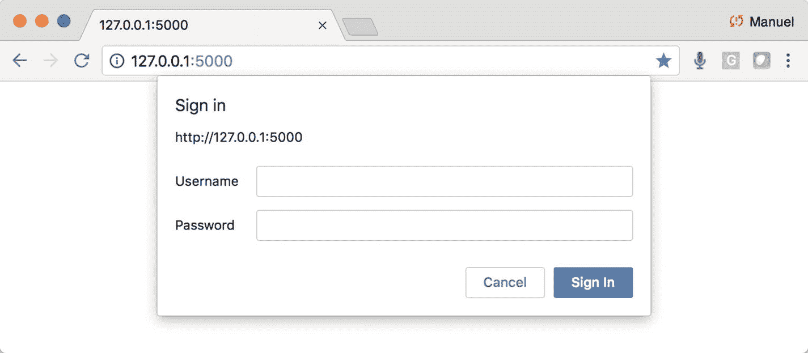

图 15-1

需要用户名和密码才能继续

```py
$ python3 authentication-simple.py

Listing 15-2Running Local Flask Script “authentication-simple.py”

```

### 摘要式身份验证示例

为了对会话进行身份验证(即，让用户能够在您的域内的页面之间移动，而不必在每个页面上登录)，您需要使用某种形式的身份验证 cookie。一旦一个会话的用户被认证，你只需在任何 Flask 函数之前传递“ **@auth.login_required** ”，只有当访问者被认证时，它才会让会话继续进行；否则会弹出登录框。代码可以在脚本“ **authentication-digest.py** ”(清单 [15-3](#PC3) )下找到。

```py
from flask import Flask
from flask_httpauth import HTTPDigestAuth

app = Flask(__name__)
app.config['SECRET_KEY'] = 'secret key here'
auth = HTTPDigestAuth()

users = {
    "john": "hello",
    "susan": "bye"
}

@auth.get_password
def get_pw(username):
    if username in users:
        return users.get(username)
    return None

@app.route('/')
@auth.login_required
def index():
    return "Hello, %s!" % auth.username()

@app.route('/paywall')
@auth.login_required
def paywall():
    return "%s, you are on page 2!" % auth.username()

if __name__ == '__main__':
    app.run()

Listing 15-3Digest Authentication

```

试一试，运行 Flask 脚本" **authentication-digest.py** "并输入账号" **john** "带密码" **hello** "或" **susan** "带密码" **bye** "(清单 [15-4](#PC4) )。

```py
$ python3 authentication-digest.py

Listing 15-4Digest Authentication

```

一旦你通过认证，在 URL 的末尾加上“**/付费墙**”这将显示您现在使用的是认证会话，用户只需登录一次(图 [15-2](#Fig2) )。

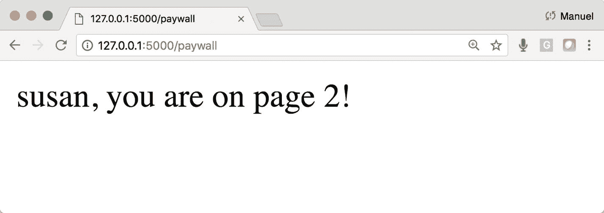

图 15-2

通过验证后在站点中导航

### 使用外部文本文件的摘要式身份验证示例

这与之前的概念非常相似，但是现在我们从外部文本文件而不是 Flask 脚本中的字典读取数据。这将允许管理员(或您)添加和删除名称和密码，而不必影响源或重新启动 web 服务器，因为文件在每次验证时都已准备好。请记住，用户名/密码写在文本文件中，没有引号或逗号，每行一个。代码可以在脚本“**authentic ation-digest-external . py**”(清单 [15-5](#PC5) )下找到。

```py
from flask import Flask
from flask_httpauth import HTTPDigestAuth

app = Flask(__name__)
app.config['SECRET_KEY'] = 'secret key here'
auth = HTTPDigestAuth()

@auth.get_password
def get_pw(username):
        for user in open("users-file.txt","r").readlines():
              if username in user:
                    user={user.split(':')[0]:user.split(':')[1].rstrip()}
                    return user.get(username)
        return None

@app.route('/')
@auth.login_required
def index():
    return "Hello, %s!" % auth.username()

@app.route('/paywall')
@auth.login_required
def paywall():
    return "%s, you are on page 2!" % auth.username()

if __name__ == '__main__':
    app.run()

Listing 15-5Digest Authentication with External File

```

试一试，运行 Flask 脚本"**authentic ation-digest-external . py**"并输入账户" **john** "和密码" **hello** "或" **susan** "和密码" **bye** "(列表 [15-6](#PC6) )。

```py
$ python3 authentication-digest-external.py

Listing 15-6Digest Authentication with External File

```

一旦你通过认证，在 URL 的末尾加上“**/付费墙**”这将显示您现在使用的是一个认证会话，用户只需登录一次(图 [15-3](#Fig3)

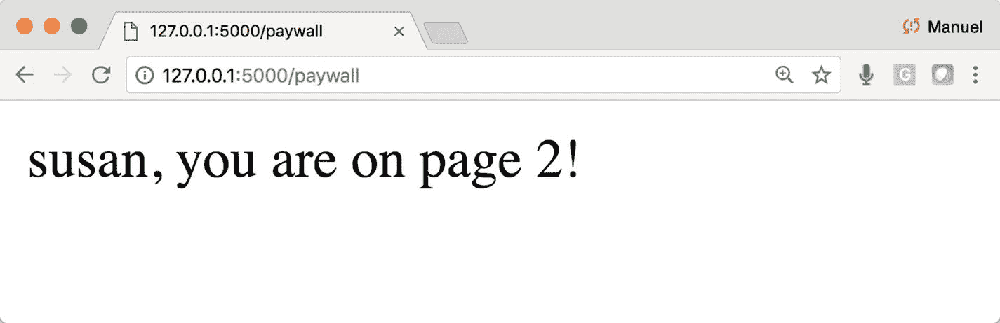

图 15-3

通过文本文件进行身份验证时在站点中导航

### 注意

到目前为止，本章中看到的代码应该小心使用，因为它没有使用安全特性来充分存储用户凭证。这应该仅用于原型、一次性或安全内部网的内部演示。下一节将展示一个更加健壮的推荐方法。

## 简单的订阅插件系统

当构建商业级的付费墙或只订阅页面时，我推荐使用专业的外部管理插件。让专业人士来处理加密、安全、存储敏感信息、信用卡支付等问题。，这样您就可以专注于构建出色的内容和服务！这就是我们"**周末勇士**要走的路

## 成员完整

Memberful 是我们将要使用和实现的插件。我个人喜欢 Memberful <sup>[2](#Fn2)</sup> ，并且认为它对于那些寻找简单方法来管理网站付费墙部分的人来说是一个很好的选择。它通过 Stripe 提供信用卡支付， <sup>[3](#Fn3)</sup> 提供用户管理功能，并且是谨慎的。Memberful 有一系列的教育视频来帮助你更好地理解事情是如何进行的，因为这可能成为你实现网络盈利目标的重要工具。

让我们看一个从 Memberful 购买东西的简单例子。这里我们只看购买物品；我们将在下一章讨论订阅和付费墙。要设置购买产品，您只需进入您的 Memberful 仪表板，在那里设置一个销售项目，他们会给你一个简单的 URL 放在您的页面上。当访问者在购买过程中，他们会看到一个弹出框出现在你的网站中。这就是 Memberful 的魅力所在:你的访问者永远不会觉得他们是在离开网站去购物。大 A+。

所以，去 Memberful 注册一个免费账户吧。在本章中，您不需要使用信用卡(图 [15-4](#Fig4) )。

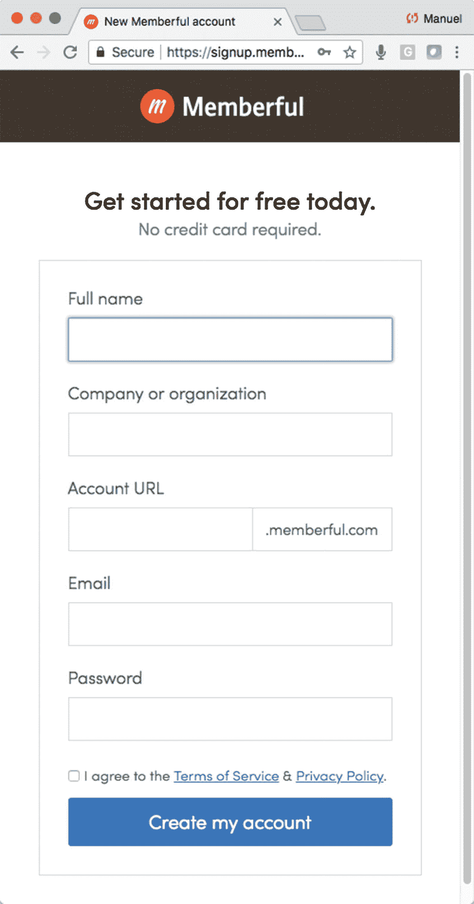

图 15-4

注册免费会员帐户`—`本章不需要信用卡

当你创建一个免费账户时，他们会为你设置一个测试网址，模拟申请会员的过程，而不必使用真正的信用卡。这将向您展示该工具是如何工作的，让您站在订户的角度。注册一个账户，当它询问你是否在使用 WordPress 时，选择“**我在用别的东西**”(图 [15-5](#Fig5) )。

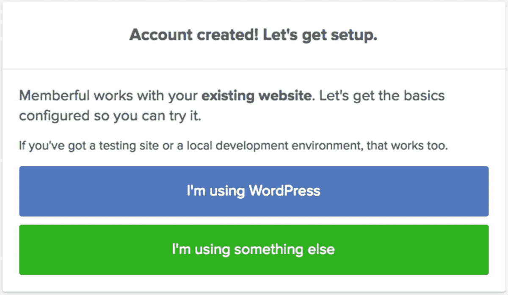

图 15-5

注册一个账户，当被问及你是否在使用 WordPress 时，选择“**我在用别的东西**

接下来，您将看到一个包含一些代码和视频的页面。我强烈推荐观看视频，因为它很好地解释了事情。输入您的 PythonAnywhere 网站地址，并复制 HTML JavaScript 代码。JavaScript 创建弹出窗口，因此用户永远不会离开你的站点(图 [15-6](#Fig6) )。

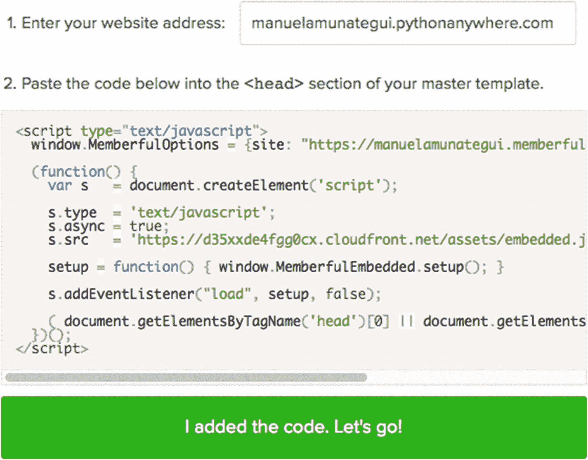

图 15-6

输入您的 PythonAnywhere URL 并复制 HTML 代码

作为回报，你会得到一个“**购买链接 HTML 代码**”(列表 [15-7](#PC7) )。

```py
<a href="https://<<ADD-YOUR-ACCOUNT>>.memberful.com/checkout?plan=30287">Buy Sample Plan for $25/month.</a>

Listing 15-7Fake Product Purchase Link

```

让我们创建一个非常简单的测试网页(不需要烧瓶)来存放我们的购买链接。完成后，点击它，进行虚假购买。您可以使用帮助文档中列出的任何伪造的测试信用卡号码，或者只需使用“ **4242 4242 4242 4242** ”

### 创建一个真实的网页来销售假冒产品

构建清单 [15-8](#PC8) 中所示的简单 HTML，并确保将购买链接替换为您的链接(即，一个有效的帐户)。你可以在目录中找到本章的基础脚本，名为“【memberful-purchase.html】T2”编辑并运行它，你应该会看到如图 [15-7](#Fig7) 所示的页面。

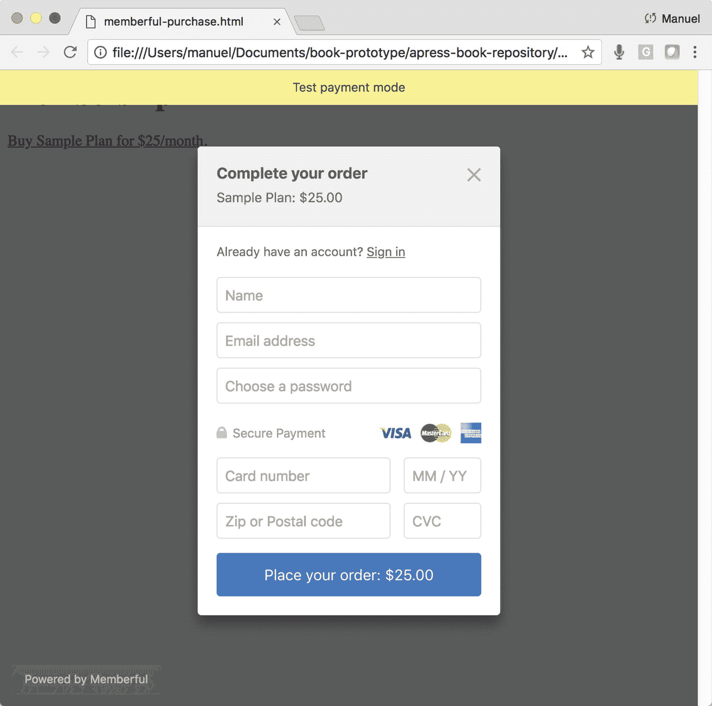

图 15-7

您网站上的 Memberful 弹出窗口；继续用假信用卡号下单吧

```py
<html>
<script type="text/javascript">
  window.MemberfulOptions = {site: "https://manuelamunategui.memberful.com"};

  (function() {
    var s   = document.createElement('script');

    s.type  = 'text/javascript';
    s.async = true;
    s.src   = 'https://d35xxde4fgg0cx.cloudfront.net/assets/embedded.js';

    setup = function() { window.MemberfulEmbedded.setup(); }

    s.addEventListener("load", setup, false);

    ( document.getElementsByTagName('head')[0] || document.getElementsByTagName('body')[0] ).appendChild( s );
  })();
</script>

<body>
<h1>Membership</h1>
<p><a href="https://<<ADD-YOUR-ACCOUNT>>.memberful.com/checkout?plan=30287">Buy Sample Plan for $25/month.</a></p>
</body>
</html>

Listing 15-8Purchase a product script

```

### 检查您的供应商仪表板

虚假购买后，登录您的会员帐户，点击顶部导航栏上的“**仪表板**”按钮。这是我们的订单！耶！我们将把 Memberful 留到下一章。显然，如果你在销售真实的产品，你会用你自己的产品描述和图片来创建许多这样的购买链接。它也位于仪表板中，您可以在其中管理用户、产品、退款等。(图 [15-8](#Fig8) 和 [15-9](#Fig9) )。

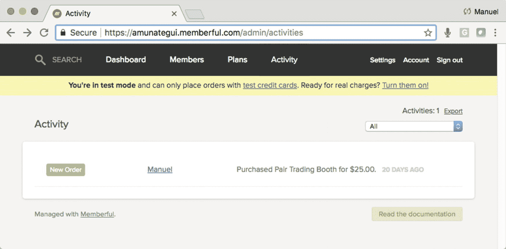

图 15-9

管理订单

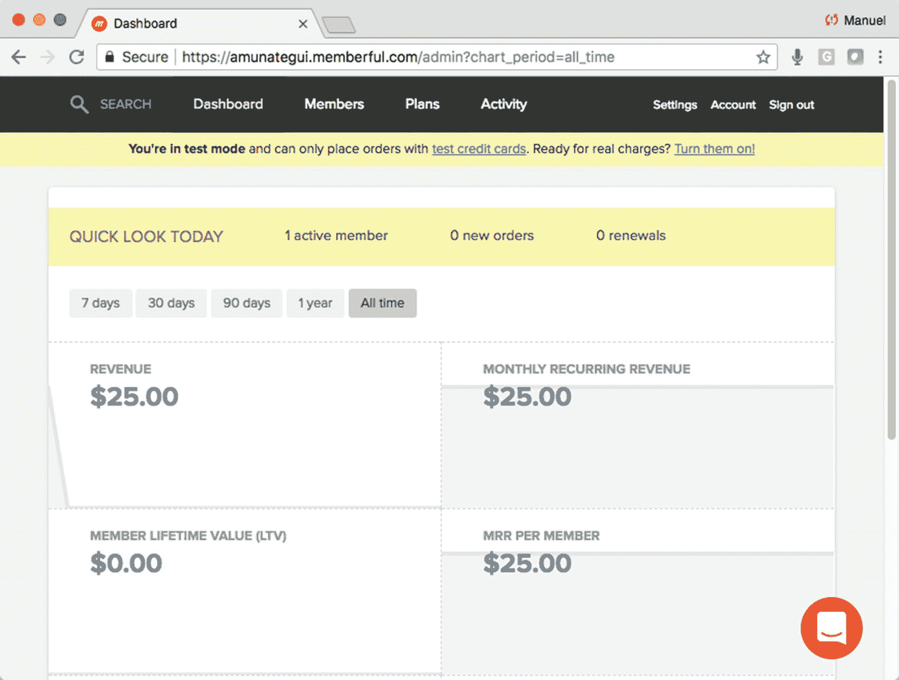

图 15-8

查看订单活动

## 用 PayPal 接受捐款

从 PayPal 设置一个捐款按钮是为个人和非营利组织筹集资金的最简单的方法之一(阅读免责声明或找到另一种 PayPal 选项 [`www.paypal.com/buttons`](http://www.paypal.com/buttons) )。显然，你需要一个信誉良好的帐户，你所需要做的就是将 HTML 表单代码放到你的网页中，它会处理好其他的事情`—`它甚至会为你显示按钮。这是一个没有痛苦的选择，你甚至不需要 Flask，因为这个支付选项只需要 HTML `—`而不需要其他东西(清单 [15-9](#PC9) )。

```py
<form action="https://www.paypal.com/cgi-bin/webscr" method="post">
      <input type="hidden" name="business" value="amunategui@gmail.com">
      <input type="hidden" name="cmd" value="_donations">
      <input type="hidden" name="item_name" value="Donate to support these great blog posts!">
      <input type="hidden" name="item_number" value="Support">
      <input type="hidden" name="currency_code" value="USD">
      <input type="image" name="submit"
      src="https://www.paypalobjects.com/en_US/i/btn/btn_donate_LG.gif"
      alt="Donate">
      
 </form>

Listing 15-9Paypal Donation Code

```

一旦你的网页中有了代码，你会看到黄色的“**捐赠**按钮。当您使用有效的 PayPal 帐户点击它时，它会将您带到 PayPal，并向捐赠者询问一系列问题以完成财务捐赠(图 [15-10](#Fig10) 和 [15-11](#Fig11) )。

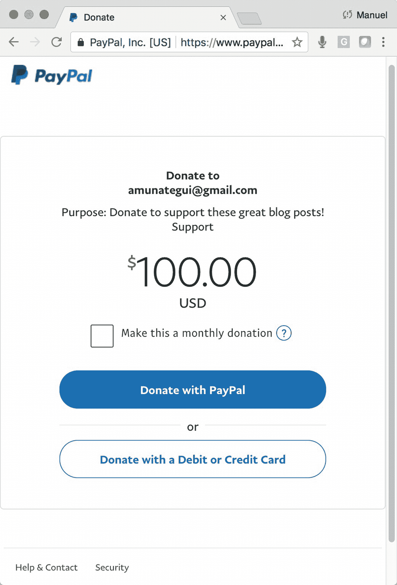

图 15-11

PayPal 捐赠仪表板，包含您的网站和电子邮件信息

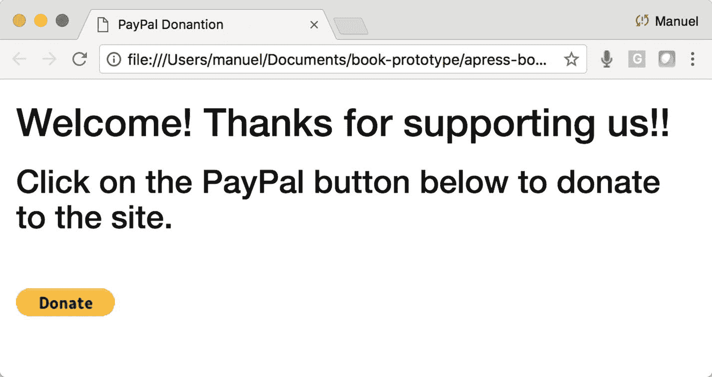

图 15-10

您网站上的 PayPal 捐赠按钮

您可以在本章的下载中以“**paypal.html**”的名称查看该代码的示例，如果您想使用这种方法来满足自己的筹款需求，您需要有一个帐户并获得自己的代码。

## 用 Stripe 购物

Stripe 是一个简单、强大、广泛使用的支付平台，有很多 Flask 支持。它还被广泛信任，如果你想让游客给你钱，这一点很重要。我们将遵循一个来自官方文档( [`https://stripe.com/docs/checkout/flask`](https://stripe.com/docs/checkout/flask) )的简单示例。

首先注册一个免费账户，如果你只是想用开发者工具测试一下，它不需要任何支付信息。

注册一个免费的 Stripe 账户，导航到“**开发者**”部分，点击“ **API 键**”(图 [15-12](#Fig12) )。

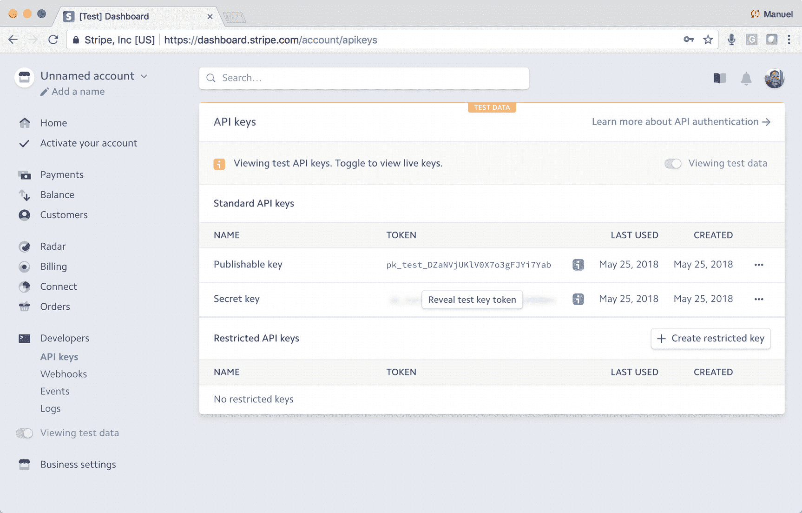

图 15-12

显示可发布密钥和秘密密钥的开发者部分

获得测试购买的代码非常简单，我们将跟随他们的例子( [`https://stripe.com/docs/checkout/flask`](https://stripe.com/docs/checkout/flask) )。他们推荐使用“**可发布密钥**和“**秘密密钥**”并从中创建操作系统变量，这样你就不用硬编码它们了(一个很好的实践)。在 MAC 的终端、Windows 的控制面板中使用“ **export** ”命令，或者直接将变量添加到 Flask 中(清单 [15-10](#PC10) )。

```py
$ export SECRET_KEY="<<YOUR-SECRET-KEY>>"
$ export PUBLISHABLE_KEY="<<YOUR-PUBLISHABLE-KEY>>”

Listing 15-10Exporting Your API Keys

```

你还需要 pip3 安装 Stripe 和 Flask(清单 [15-11](#PC11) )。

```py
$ sudo pip3 install --upgrade stripe
$ sudo pip3 install flask

Listing 15-11Installing Needed Libraries

```

我们的烧瓶控制器“ **main.py** ”导入了 Stripe，设置了秘密和可发布的密钥，并提供了两个页面`—`“【index.html】页面”用于放置待售商品，以及“**charge.html**”用于处理使用“ **stripe 购买商品。Charge.create()** "函数`—`并提供一个确认页面。这相当简单，这就是它的有效性所在(清单 [15-12](#PC12) )。

```py
import os
from flask import Flask, render_template, request
import stripe

stripe_keys = {
  'secret_key':  os.environ['SECRET_KEY'],
  'publishable_key': os.environ['PUBLISHABLE_KEY']
}

stripe.api_key = stripe_keys['secret_key']

app = Flask(__name__)

@app.route('/')
def index():
    return render_template('index.html', key=stripe_keys['publishable_key'])

@app.route('/charge', methods=['POST'])
def charge():
    # Amount in cents
    amount = 500

    customer = stripe.Customer.create(
        email='customer@example.com',
        source=request.form['stripeToken']
    )

    charge = stripe.Charge.create(
        customer=customer.id,
        amount=amount,
        currency='usd',
        description='Flask Charge'
    )

    return render_template('charge.html', amount=amount)

if __name__ == '__main__':
    app.run(debug=True)

Listing 15-12A Look at “Main.py”

```

这些模板还使用了一个巧妙的技巧，即使用一个布局文件(“**layout.html**”)。这允许您创建一个框架 HTML 页面，您可以在整个站点中重用它。例如，您只需要创建一次品牌和下拉链接，并让每个页面都继承它。

然后利用 HTML 中的 Jinja2 标签“**{ % block content % } { % end block % }**”来摄取新代码(清单 [15-13](#PC13) )。

```py
<!DOCTYPE html>
<html>
<head>
  <title>Stripe</title>
  <style type="text/css" media="screen">
    form article label {
      display: block;
      margin: 5px;
    }

    form .submit {
      margin: 15px 0;
    }
  </style>
</head>
<body>
  
</body>
</html>

Listing 15-13Using a Template HTML Page—“layout.html”

```

并且任何想要放入布局文件的代码都使用 Jinja2 标签" **** (清单 [15-14](#PC14) )。

```py


  <form action="/charge" method="post">
    <article>
      <label>
        <span>Amount is $5.00</span>
      </label>
    </article>

    <script src="https://checkout.stripe.com/checkout.js" class="stripe-button"
            data-key="{{ key }}"
            data-description="A Flask Charge"
            data-amount="500"
            data-locale="auto"></script>
  </form>


Listing 15-14Jinja2 Tag for “layout.html” and Variable “key”

```

在 [`Stripe.com`](http://stripe.com) 上创建一个免费账户，并如前所示导出 API 密钥。然后运行示例代码(您可以在本章下载部分的原名称为“T3”stripe-payments)中找到该代码。继续在本地运行代码(清单 [15-15](#PC15) 和图 [15-13](#Fig13) )。

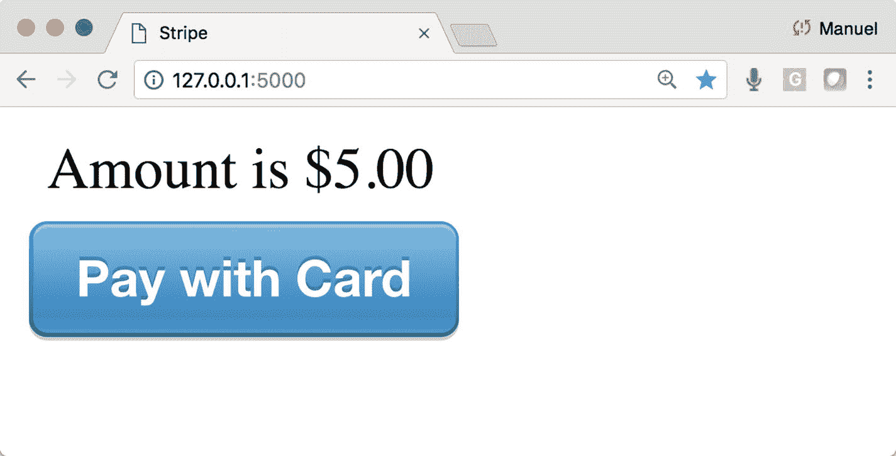

图 15-13

你自己的[条纹。com](http://stripe.com) 购买按钮

```py
$ python3 main.py

Listing 15-15Running the Stripe Flask Sample

```

如果您浏览购买样本(您应该可以输入任何假信用卡号)，然后登录您的 Stripe.com 仪表板，您应该会看到订单(图 [15-14](#Fig14) )。

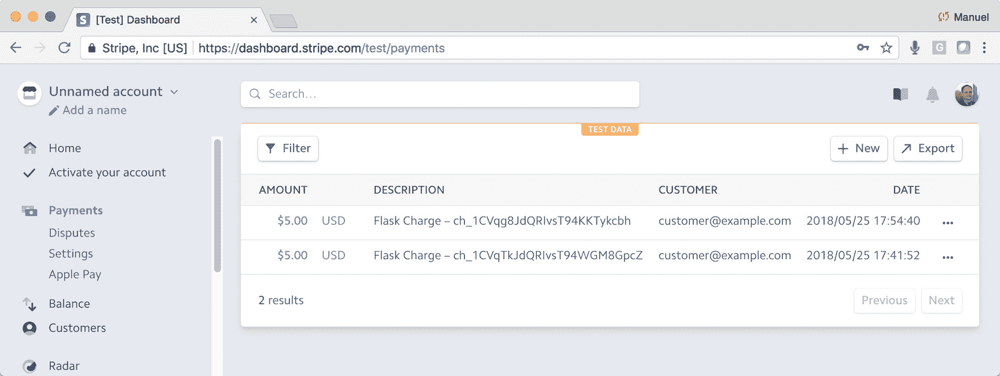

图 15-14

您自己的 Stripe.com 购买按钮

## 结论

本章简要介绍了一些可用于 web 应用程序的认证、捐赠和购买插件。我要重申，这里介绍的任何"**roll-on**"解决方案都不是用于任何严肃的用途，当然也不是用于任何遥远的商业用途。在第 [16](16.html) 和 [17](17.html) 章中，我们将会看到一个真正的解决方案，你可以根据自己的付费墙和订阅需求量身定制。

<aside class="FootnoteSection" epub:type="footnotes">Footnotes [1](#Fn1_source)

[T2`https://flask-httpauth.readthedocs.io/en/latest/`](https://flask-httpauth.readthedocs.io/en/latest/)

  [2](#Fn2_source)

[T2`https://memberful.com/`](https://memberful.com/)

  [3](#Fn3_source)

[T2`http://stripe.com/`](http://stripe.com/)

 </aside>