# 十六、案例研究第四部分：用 Memberful 构建订阅付费墙

让我们在 PythonAnywhere 上使用 Memberful 和信用卡支付，通过基于订阅的付费墙来完成我们的案例研究。

在这一章中，我们将把所有交易内容隐藏在只付费订阅的付费墙后面(图 [16-1](#Fig1) )。这是我们最后一个项目，让我们把它做成一个特别的项目吧！让我们用一个真正的使用 Memberful.com 的付费墙订阅系统来扩展我们的配对交易网站。这比我们在前一章看到的更复杂。前面我们看到了如何销售产品或收取订阅费。这些都是一步到位的过程。相反，我们想要一种方式，允许付费用户浏览整个网站，包括付费墙后面的内容，并且在每次会话期间只需登录一次。

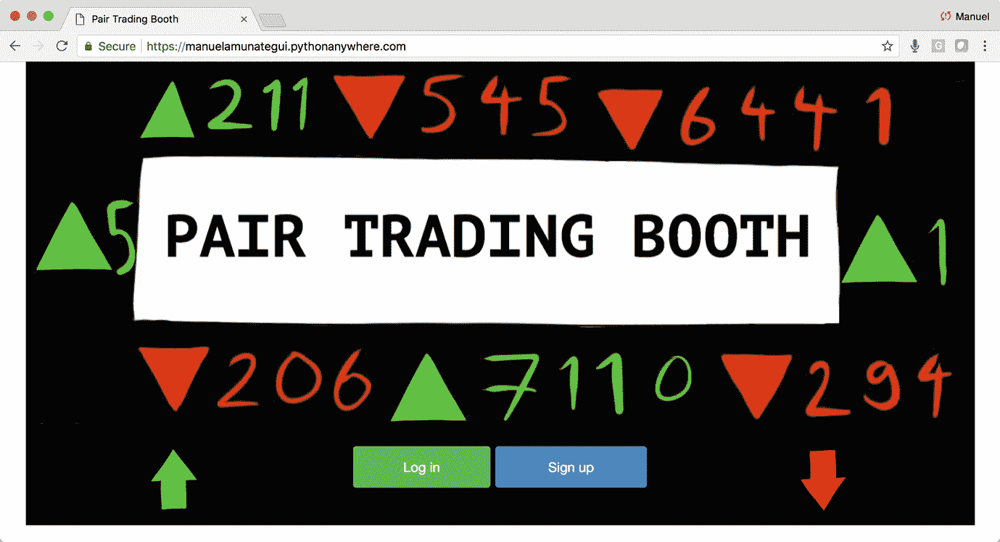

图 16-1

本章的最后一个 web 应用程序

我们在这里假设，假装交易的建议足够有价值，可以让人们为之付费。这些是实现这一目标所需的工具。此外，因为这一章是一个付费墙，它需要捆绑一个特定的地址，我们将无法在本地运行。我们要使用的配对交易摊位代码与前面的部分相同；我们要做的就是添加一个额外的登录页面和会员付费墙功能。简单地说，本章没有使用 Jupyter 或本地 Flask 代码。

### 注意

进入 [`www.apress.com/9781484238721`](http://www.apress.com/9781484238721) 并点击源代码按钮，下载第 [16 章](16.html)的文件。

## 升级您的 Memberful 和 PythonAnywhere 付费帐户

为了建立这个付费墙，你需要使用付费账户。你需要将你的 Memberful.com 账户升级到“ **Pro plan** ”，这需要一个有效的信用卡号码，每月费用 25 美元。这是必需的，以便您可以访问 API 和 webhooks，它们在免费帐户上是禁用的。您还需要将您的 PythonAnywhere 帐户升级到最低付费级别`—`，在撰写本文时，它被称为“**黑客$ 5/月**”这是必需的，因为身份验证需要使用自定义端口，并且只允许在付费帐户上使用。我建议打开它几天试试，如果你认为它没有用，在产生第二个月的费用之前降级回免费帐户。

简而言之，我们希望为会员提供使用 Memberful 购买订阅的能力(这样我们就不必处理任何用户或支付数据)，让他们在一次会话中只登录一次自己的帐户，然后允许他们自由浏览网站，直到他们注销。

### 升级成员 full

让我们升级我们的帐户，以便处理 OAuth 状态和自定义端口。这将允许我们的应用程序允许访问者登录并访问付费墙后面的页面。进入 Memberful 网站，然后进入“**账户**”和“**计划和账单**”(图 [16-2](#Fig2) )。

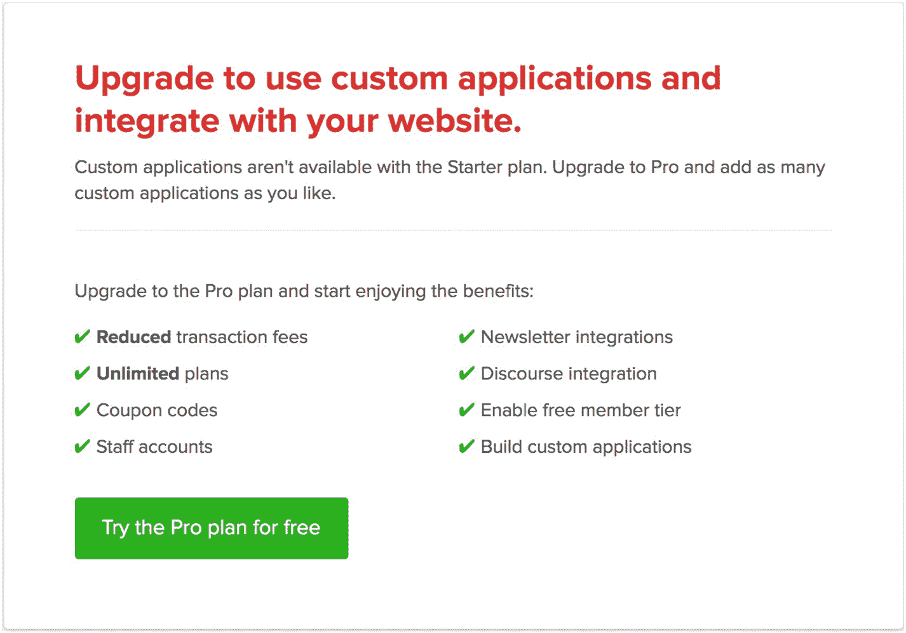

图 16-2

访问“ **Pro 计划**

继续升级到" **Pro 计划**"在“**应用程序详细信息**”窗格中，选中所有复选框并添加登录会员页面。这一点很关键，因为一旦访问者注册或登录，Memberful 将在这里重定向访问者(清单 [16-1](#PC1) 和 [16-2](#PC2) ，以及图 [16-3](#Fig3) )。

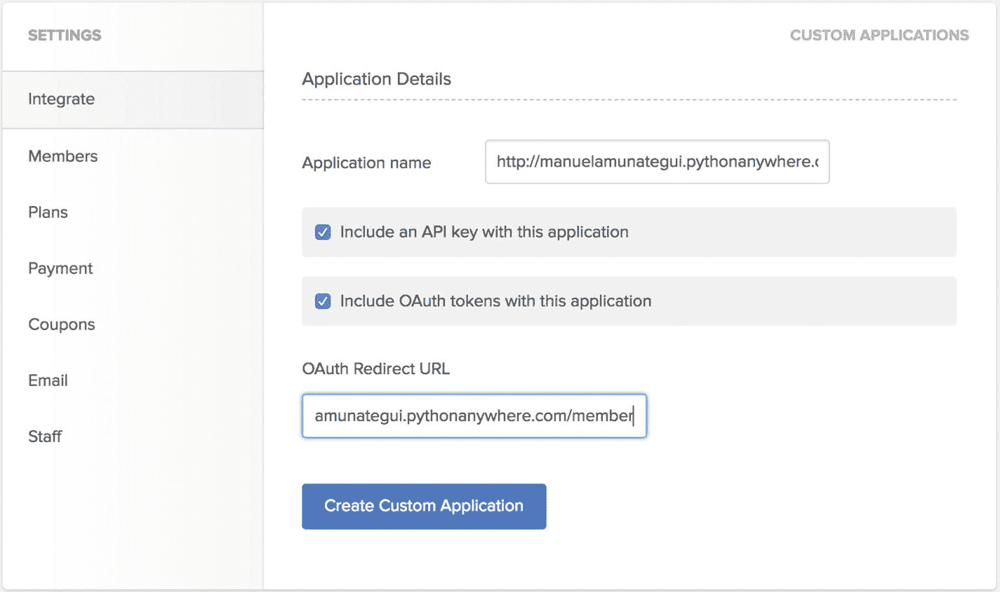

图 16-3

我们 web 应用程序的付费墙设置

```py
https://<<YOUR PYTHON ANYWHERE SITE>>.pythonanywhere.com/member

Listing 16-2Your “OAuth Redirect URL” Should Look Like

```

```py
http://<<YOUR PYTHON ANYWHERE SITE>>.pythonanywhere.com/

Listing 16-1You Application Name in Memberful is Your PyhonAnywhere.com account. It Should Look Like

```

接下来复制你的 OAuth " **标识符**和"**秘密**密钥。这些是我们将在 web 应用程序的 Flask 部分使用的键(图 [16-4](#Fig4) )。

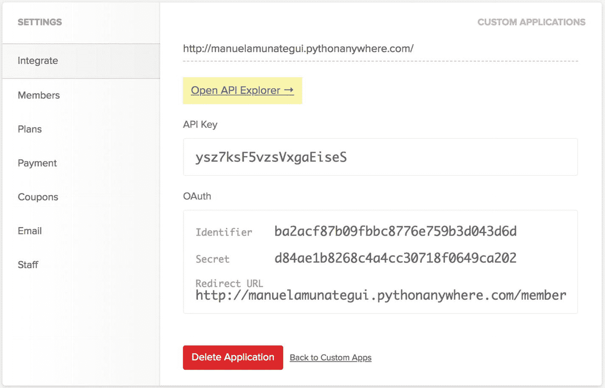

图 16-4

创建自定义应用程序后页面的外观

在“**自定义应用**选项卡下，将您的“**登录应用**设置为下拉列表中的站点(它应该已经包含您之前在“**自定义应用**自动登录应用”中添加的 PythonAnywhere 帐户；图 [16-5](#Fig5) 。

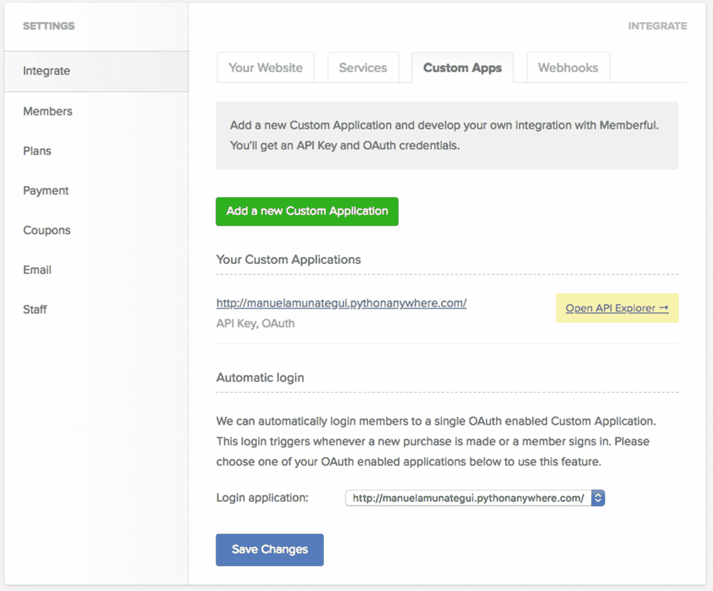

图 16-5

选择您的“**登录应用程序**以反映您的 PythonAnywhere 帐户

### 升级 PythonAnywhere

在 PythonAnywhere 的您的帐户选项卡下，选择第一个付费计划(即最便宜的)，“**黑客**计划(图 [16-6](#Fig6) )。

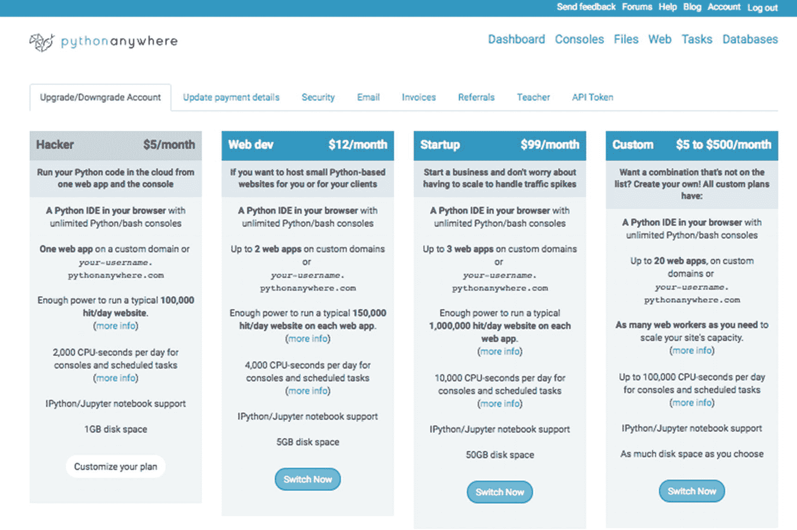

图 16-6

付费 PythonAnywhere 账户的选择；最便宜的付费账户将允许你跟随本章的项目

### Pip 安装烧瓶-密封

我们需要安装“ **Flask-SSLify** ”，因为它不是 Python 3 在 PythonAnywhere 上构建的一部分。Flask-SSLify 将强制所有页面使用“ **HTTPS** ”，给你增强的安全性。你已经在维基百科的 API 中使用了“ **pip3 install** ”。点击 PythonAnywhere 帐户顶部的“**控制台**”链接，访问一个 bash 控制台(图 [16-7](#Fig7) )。

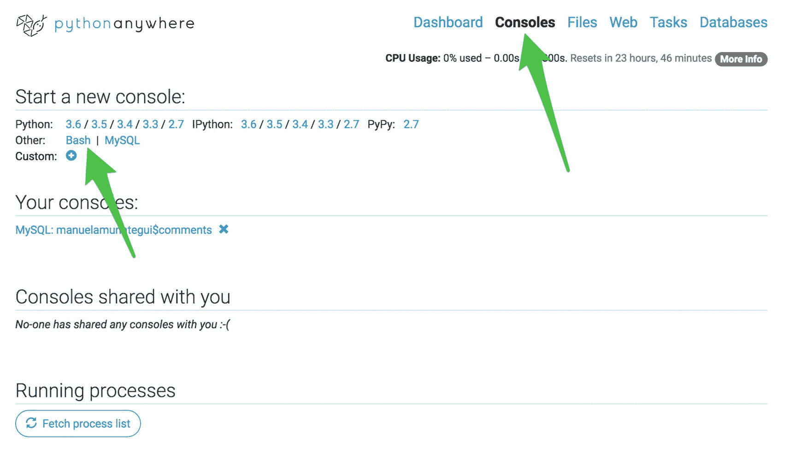

图 16-7

打开 bash 控制台以 pip 安装未包含在原始 Python 版本中的库

一旦 bash 控制台打开，您就可以 pip 安装所需的库了。继续使用以下命令安装 Flask-SSLify 库(您需要添加两个破折号和“ **user** ”来覆盖权限被拒绝的消息；清单 [16-3](#PC3) 。

```py
$ pip3 install Flask-SSLify --user

Listing 16-3Installing Additional Libraries

```

## 成员完全身份验证

Memberful 支持 OAuth 2.0 协议进行身份验证，但因为它要求您将您的应用程序直接绑定到您的 Memberful 帐户，所以创建一个付费墙比创建自己的帐户要容易得多。更多信息请参考 [`https://memberful.com/help/integrate/advanced/memberful-api/`](https://memberful.com/help/integrate/advanced/memberful-api/) 的官方会员文件。

### 两步过程和烧瓶会话机制

Flask 会话是一个数据保存对象，可以使用 cookies 维护页面之间的状态。想想看，有时候你想记住用户在做什么，他们的购物车里有什么，或者他们是谁，即使他们从一个页面跳到另一个页面。您可以使用表单变量来回传递数据，但是这样会很快变得混乱和令人困惑(并且不太安全)。Flask 会话通过使用 cookies 将数据存储在客户端的计算机上来解决这个问题。为此，必须启用 cookies。

由于 Memberful 强大的成员功能和集成的 UI，我们将创建的用户认证系统很容易实现。当访问者进入付费墙后面的页面时，我们的 Flask 应用程序将检查用户是否确实是付费用户。我们只需要在会话期间检查一次，然后依靠会话变量记住她/他有权查看付费墙后面的页面。

### 认证步骤 1

第一步是从 Memberful 站点获取认证"**代码**。此代码是一个临时密钥，允许您询问用户信息。每当用户点击 web 应用程序的 member full authentic ation "**sign _ in**"链接(清单 [16-4](#PC4) )时，就会自动返回代码。

```py
<a href="https://<<YOUR-ACCOUNT>>.memberful.com/auth/sign_in">Log in</a>

Listing 16-4Authentication Sign-in Link

```

一旦 Memberful 将查询 URL 识别为有效的 Memberful 客户端站点，它将返回一个附加到重定向 URL 的代码(清单 [16-5](#PC5) )。

```py
https://manuelamunategui.pythonanywhere.com/member/?code=483294e65b5dd2e65862e3c1ba454dee&redirect_to=http%3A%2F%2Fmanuelamunategui.pythonanywhere.com%2Fmember%2F

Listing 16-5Authentication Code

```

我们的应用程序将代码"**code = 483294 e 65 b5 DD 2e 65862 E3 C1 ba 454 dee**"读取为一个" **GET** 变量，并保留它以构建第二个身份验证步骤。

### 认证步骤 2

我们的自定义函数"**issuerbeloggedin()**"完成了大部分的认证工作。它首先构建" **access_token_req** "字典，该字典保存上一步中的临时"**代码**"、应用程序的 memberful id 和密钥以及重定向 URL(所有这些都可以在您的 member full 帐户中的"**设置** " ➤ " **集成** " ➤ " **自定义应用程序**"下找到)。

然后，它将访问令牌字典作为“ **POST** 传递给“**oauth/token**”URL(清单 [16-6](#PC6) )。

```py
https://<<YOUR-ACCOUNT>>.memberful.com/oauth/token

Listing 16-6The auth/token URL

```

如果全部正确，它将返回“**access _ token**”；这是解开访问者个人数据的真正钥匙，比如他们是否是我们 web 应用程序的真正成员，以及他们的订阅当前是否有效(清单 [16-7](#PC7) )。

```py
https://<<YOUR-ACCOUNT>>.memberful.com/api/graphql/member?access_token=999999999

Listing 16-7This Data Can Be Queried Using the Following URL

```

身份验证过程第 2 步中的所有工作都是通过表单" **POST** 完成的，这样就不会将敏感信息显示为可读的 URL。这类工作很容易在我们的函数"**issuerbeloggedin()**"中抽象出来，这将使我们的 web 应用程序能够很容易地检查每个访问者的成员状态(清单 [16-8](#PC8) )。

```py
def IsSubscriberLoggedIn(code):

        # build the access token dictionary
    access_token_req = {
        "code": code,
        "client_id": MEMBERFUL_KEY,
        "client_secret": MEMBERFUL_SECRET,
        "redirect_uri": redirect_uri,
        "grant_type": "authorization_code" }

    # build the oauth/token to access visitor's data
    content_length=len(urlencode(access_token_req))
    access_token_req['content-length'] = str(content_length)
    r = requests.post(MEMBERFUL_SITE + '/oauth/token', data=access_token_req)
    data = json.loads(r.text)

    # build the graphql query to query specific values needed
    r = requests.get(MEMBERFUL_SITE + '/api/graphql/member?access_token=' +             data['access_token'] +                                           '&query={%20currentMember%20{%20fullName%20subscriptions%20{%20active%20expiresAt%20}%20}%20}')

Listing 16-8The Function “IsSubscriberLoggedIn()”

```

值得一提的一个领域是 graphQL(有关更多详细信息，请参见 Memberful API 文档的“**查询和变异**”部分，网址为 [`https://memberful.com/help/integrate/advanced/memberful-api/#queries-and-mutations`](https://memberful.com/help/integrate/advanced/memberful-api/#queries-and-mutations) )。该工具在成功认证后，允许查询特定的订阅者信息(清单 [16-9](#PC9) )。

```py
Input:

query {
  member(id: 1) {
    id
    fullName
    email
    subscriptions {
      id
      plan {
        id
        name
      }
    }
  }
}

Output:

{
  "data": {
    "member": {
      "id": "1",
      "fullName": "John Doe",
      "email": "john.doe@example.com",
      "subscriptions": [
        {
          "id": "1",
          "plan": {
            "id": "1",
            "name": "Monthly"
          }
        }
      ]
    }
  }
}

Listing 16-9From the Official Help Docs

```

在我们的例子中，我们只对两条信息感兴趣:用户的名字是什么，他们的订阅是否是活动的(清单 [16-10](#PC10) )。

```py
query={%20currentMember%20{%20fullName%20subscriptions%20{%20active%20expiresAt%20}%20}%20}

Listing 16-10We Append the Following Variables to Our “GET” URL

```

这意味着:给我们这个成员的全名，以及他们的订阅是否有效，何时到期。这里我们只使用订阅是否有效，但是您可以通过检查到期日期并提醒成员尽快续订来轻松延长这个时间(清单 [16-11](#PC11) )。

```py
{"data":{"currentMember":{"fullName":"Manuel", "subscriptions":[{"active":true,
"expiresAt":1529879538}]}}}

Listing 16-11If We Run It and Peek At Our graphQL Response, We Get

```

### 调用成员函数

这就是 Memberful 的魅力所在，使用起来很简单，他们通过存储用户数据和管理支付、退款、续订等为我们做了所有的艰苦工作。Memberful 提供了四个可以嵌入你网站的 URL。

**登录:**

```py
https://<<YOUR-ACCOUNT>>.memberful.com/auth/sign_in

```

**购买套餐(计划号码会有所不同):**

```py
https://<<YOUR-ACCOUNT>>.memberful.com/checkout?plan=29504

```

**注销:**

```py
https://<<YOUR-ACCOUNT>>.memberful.com/auth/sign_out

```

**管理您的帐户:**

```py
https://<<YOUR-ACCOUNT>>.memberful.com/account

```

通过在每个页面的开头添加一个简单的 JavaScript 片段以及登录/注册/购买链接，您将自动继承客户弹出管理系统。这是非常强大的，因为访问者感觉这一切都是在我们的 web 应用程序中构建的(清单 [16-12](#PC16) )。

```py
<script type="text/javascript">
  window.MemberfulOptions = {site: "https://amunategui.memberful.com"};

  (function() {
    var s   = document.createElement('script');

    s.type  = 'text/javascript';
    s.async = true;
    s.src   = 'https://d35xxde4fgg0cx.cloudfront.net/assets/embedded.js';

    setup = function() { window.MemberfulEmbedded.setup(); }

    s.addEventListener("load", setup, false);

    ( document.getElementsByTagName('head')[0] || document.getElementsByTagName('body')[0] ).appendChild( s );
  })();
</script>

Listing 16-12Memberful JavaScript Code to Manage the In-site Pop-ups

```

你可以通过点击右上角的设置按钮，然后点击“**你的网站**”选项卡(图 [16-8](#Fig8) )找到 Memberful 网站上的 JavaScript 片段。

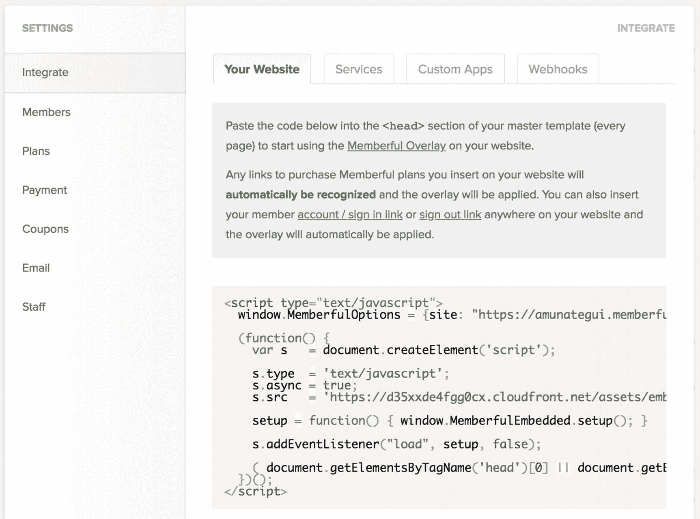

图 16-8

访问“**MemberfulOptions**”JavaScript 代码片段

当用户访问 web 应用程序并点击“**登录**”时，他们会看到一个专业的集成弹出框，这是我们在严肃的网站上所期望的(我们没有管理或存储任何用户数据或财务数据的事实是我们自己的小秘密；图 [16-9](#Fig9) 。

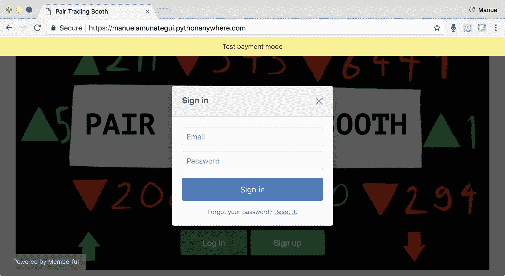

图 16-9

像专业人士一样签到！

## 设计 Memberful.com 的订阅计划

为了创建会员资格，访问者必须来到网站，点击“**注册**”当他们这样做时，他们会看到一个订阅窗口。这可以通过多种方式定制，包括不同的价格、层级和订阅期限。我们将使用模拟账户提供的默认值(图 [16-10](#Fig10) )。

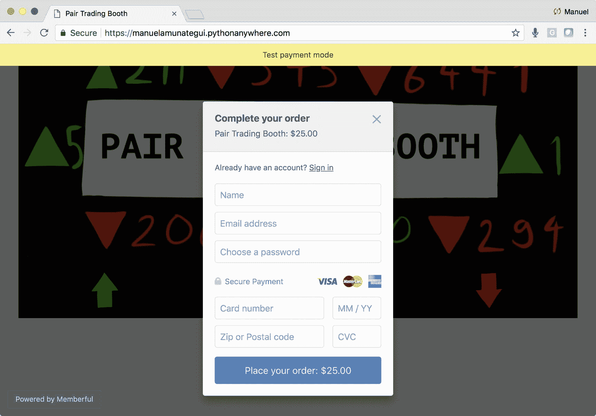

图 16-10

一个新的访问者创建了一个 Pair Trading Booth 站点的会员；是啊！！！

可以在 Memberful 仪表板上轻松创建会员计划。登录你的账号，导航到**计划** ➤ **样本计划** ➤ **计划**设置，复制生成的 URL 计划购买链接，粘贴到你的报名按钮中(图 [16-11](#Fig11) )。

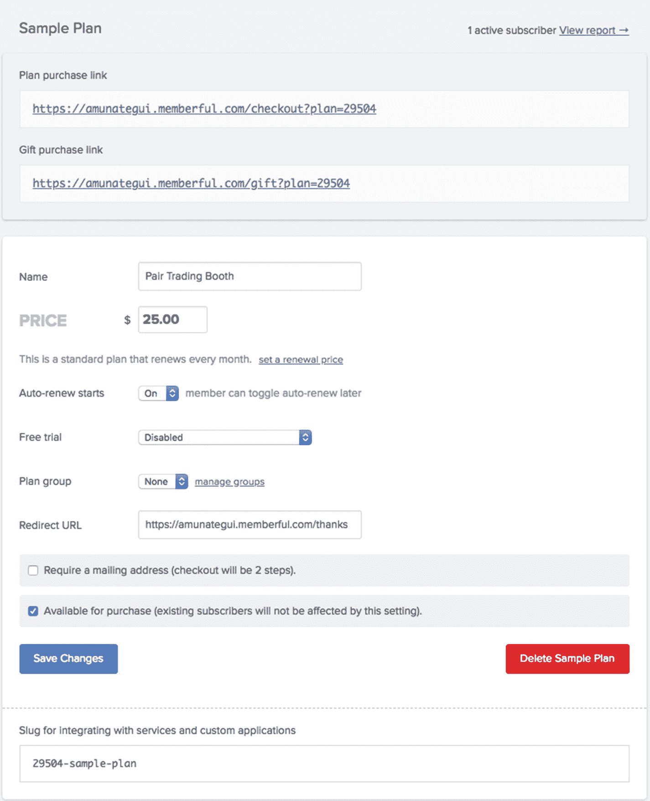

图 16-11

创建样本计划；这里我们使用默认值

如果您将“**计划购买链接**”放入浏览器，您将看到它提供的内容(当然，我们通常不会以这种方式访问它，因为我们希望它在我们自己的 web 应用程序中以弹出窗口的形式出现)。它是实时的，你可以使用提供的假信用卡号码创建一个测试账户(图 [16-12](#Fig12) )。

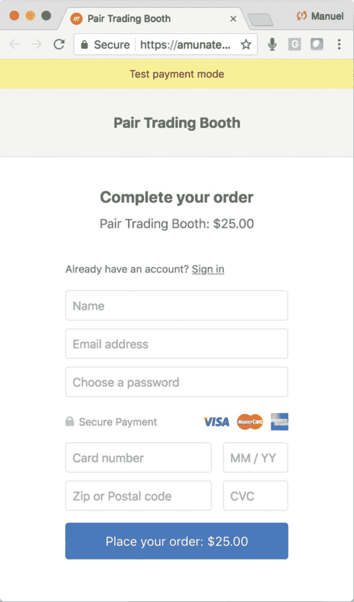

图 16-12

不要忘记使用测试信用卡号码！

使用下列任何一个假信用卡号码(来自 [`https://memberful.com/help/general/using-test-credit-cards/`](https://memberful.com/help/general/using-test-credit-cards/) 的官方文件)。

*   **视图** : 4242 4242 4242

*   **万事达卡【5555 5555 4444**

*   美国运通 : 3782 822463 10005

## 将 Web 应用程序上传到 PythonAnywhere

因为在本章中没有本地 Flask 版本可以运行，所以让我们直接把它安装到 PythonAnywhere 上。如果您一直在跟踪之前的“**对交易摊位**案例研究，您只需更新以下文件:

*   **main.py**

*   **index.html**

*   **charts.html**

*   **fundamentals.html**

您还需要添加新的登录页面，隐藏所有非会员和未登录者的所有交易信息:

*   **welcome.html**

登录到您的 PythonAnywhere 帐户，用本章下载中的新版本替换这五个文件。

### 用您自己的凭证替换 Memberful 和 MySQL

在运行 web 应用程序之前，您需要替换" **main.py** "中的一些内容。有三个 Memberful 常量和一个 PythonAnywhere 常量需要设置(清单 [16-13](#PC17) )。

```py
MEMBERFUL_KEY='<<ENTER-YOUR-MEMBERFUL-KEY-HERE>>'
MEMBERFUL_SECRET='<<ENTER-YOUR-MEMBERFUL-SECRET-HERE>>'
MEMBERFUL_SITE='<<ENTER-YOUR-MEMBERFUL-SITE-HERE>>'
PYTHONANYWHERE_SITE = '<<ENTER-YOUR-PYTHON-ANYWHERE-SITE-HERE>>'

Listing 16-13Change the Following Constants in “main.py” on PythonAnywhere with Your Credentials

```

一旦一切就绪，点击绿色的大按钮来刷新 web 应用程序，并开始运行。你需要用假的信用卡号码注册一次；然后，您将能够使用这些凭证登录(图 [16-13](#Fig13) )。

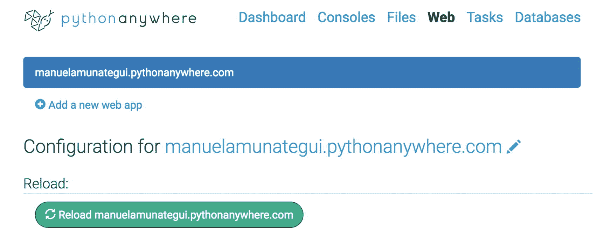

图 16-13

将我们的付费墙投入使用前的最后一步

## 这是怎么回事？

让我们从更高的层面来看看付费墙中一些有趣的元素。

### main.py

这是我们 web 应用程序背后的大脑；因此，它将承担成员的主要责任。我们需要添加一个处理程序来处理登录页面“**welcome.html**”,用户在登录之前会进入这个页面。登录后，他们将被定向到“**/成员/** ”路径，在这里，他们可以通过以下三个身份验证路径被定向:

该成员是否请求注销？

检查"**request . args . get(' action ')**"变量，并查找" **logout** 值。如果是这种情况，请通过清除该成员的会话变量来注销它们。

**会员是否已经登录？**

检查会话变量，查看其中是否有用户名；如果是，就不需要再认证了。让他们继续在付费墙后面浏览。

这位访客是刚刚到达并正在尝试登录吗？

获取" **request.args.get('code')** "并将其传递给"**issuerbeloggedin()**"函数，以确保他们有一个有效的订阅。如果他们这样做了，将他们的用户名添加到会话对象中，他们就可以在付费墙后面浏览了。

“ **main.py** 中的其余代码与前面的案例研究相同。它有代码来寻找我们的 10 只道琼斯 30 指数股票列表中最极端的股票，有代码来创建动态价格图表，并有能力提取相关公司的信息。

### welcome.html

“**welcome.html**页面是新的登陆页面(图 [16-14](#Fig14) )。

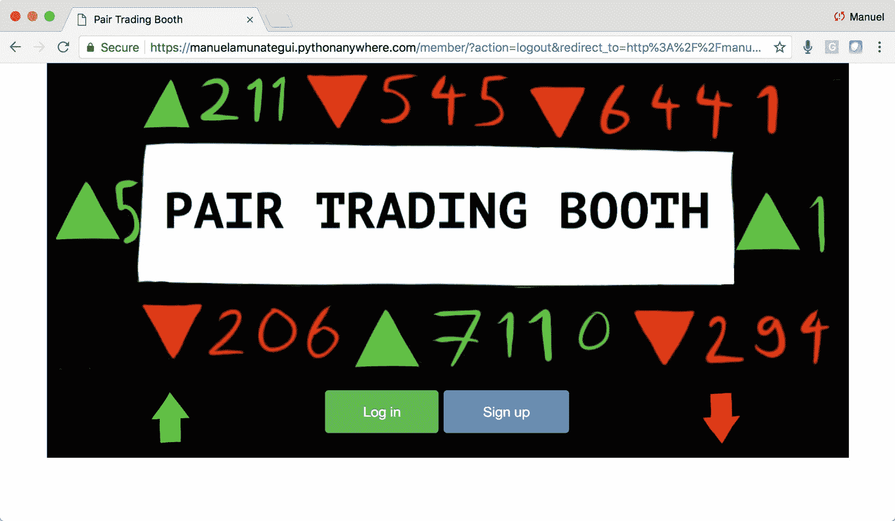

图 16-14

新的登录页面

这是一个简单的 HTML 页面，遵循“ **Pair Trading Booth** ”网站的外观。它提供了两个按钮:一个用于登录，另一个用于注册。

### index.html

“**index.htm**l”页面获得了两个新按钮:一个用于注销，另一个用于管理用户账户(图 [16-15](#Fig15) )。

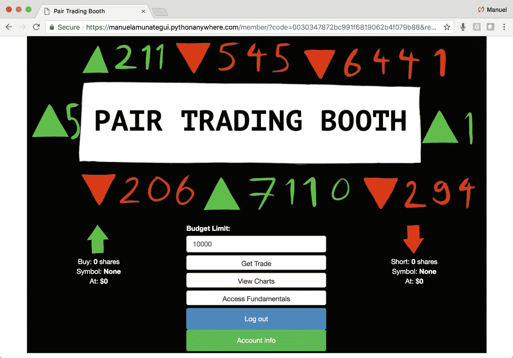

图 16-15

两个新按钮:一个用于注销，一个用于访问账户信息

## 结论

这就是你需要的所有工具，来创建你自己的付费墙，将你的机器学习想法货币化。能够以这样一种集成的方式推出对用户和信用卡支付的管理简直令人惊叹。这是几年前很难实现的事情。现在，您可以完全专注于您的机器学习想法，让会员专家来完成剩下的工作。