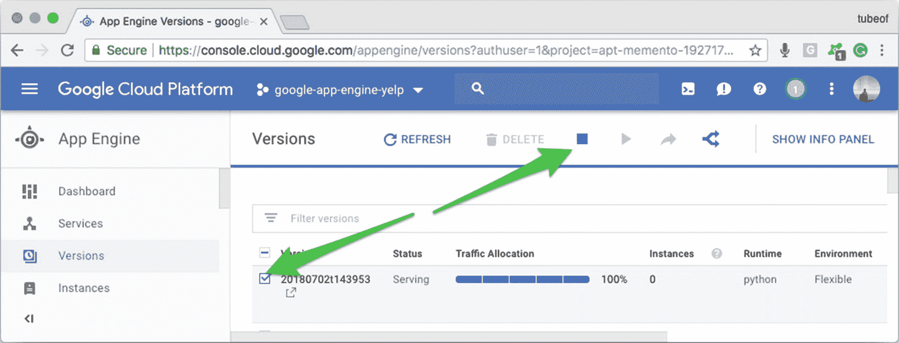
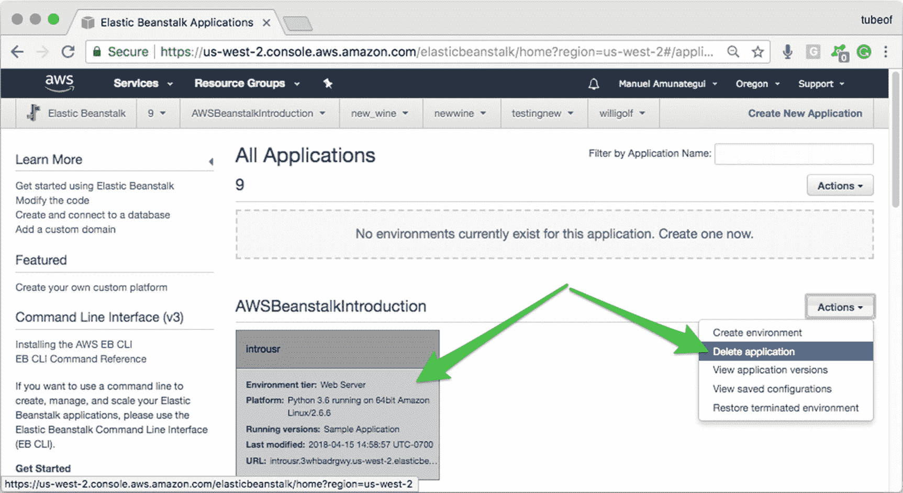
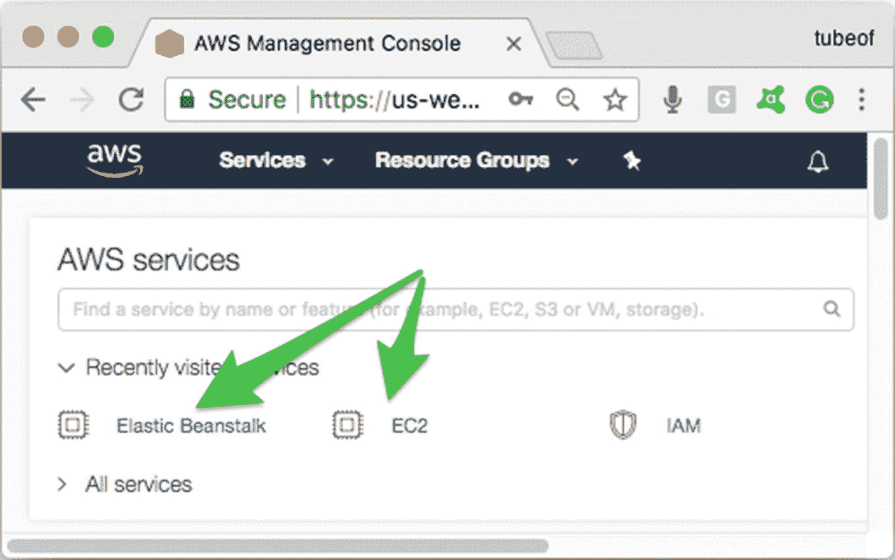
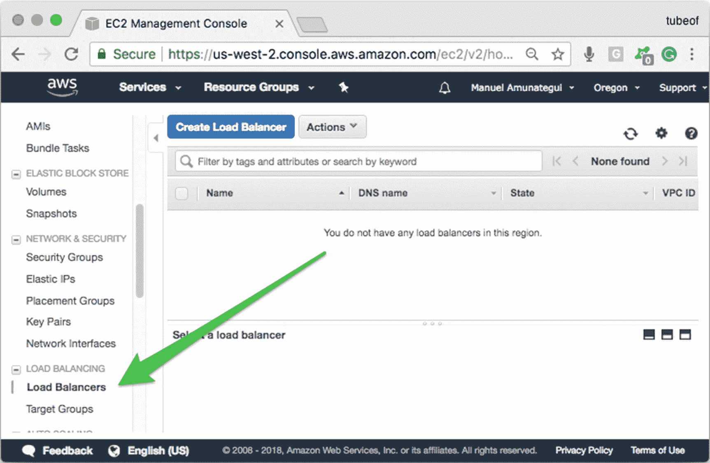
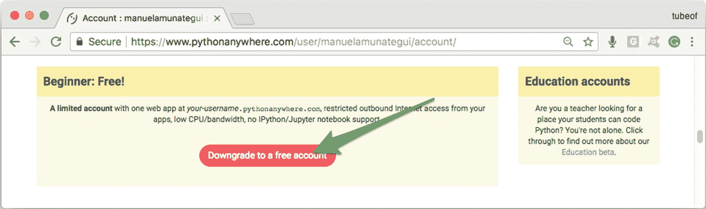
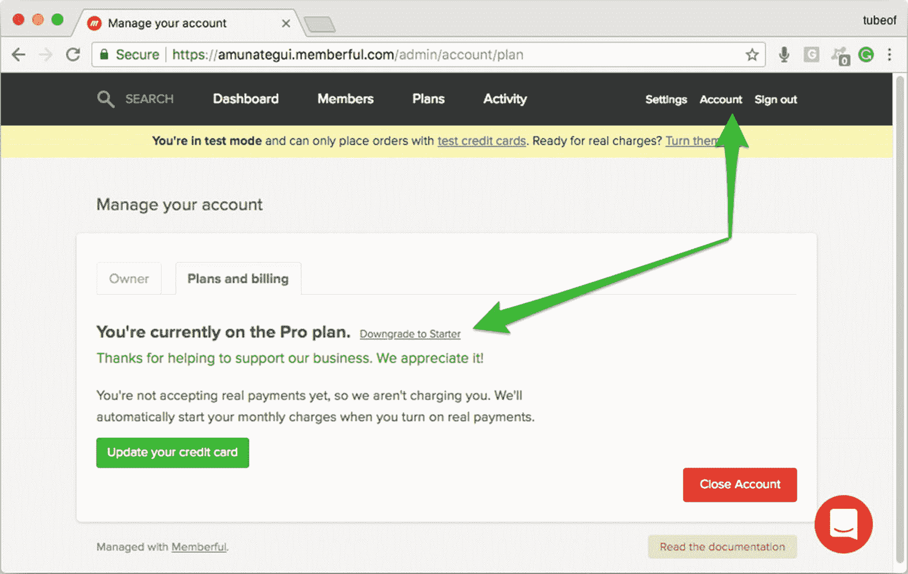

# 17.结论

这本书的覆盖面很广，不得不做出牺牲，一些章节不得不被省略。它在技术介绍方面可能缺乏的东西有望通过让您快速启动和运行，并提供在哪里寻找额外信息的指示来弥补。我们只简要介绍了数据库，没有介绍自定义域名；谢天谢地，已经有很多人写了这方面的文章。

我希望你觉得这些章节很有启发性，并且当你想到你可以用 Memberful paywall 实现做的所有事情时，你脑袋里的齿轮在旋转。

还记得那个“**竞争协议**”吗？是的，与我在书的导言中提到的竞业禁止协议相反。所以，是时候从书中拿出你需要的任何东西，并把它带在身边了！我们迫不及待地想看看你想出了什么！

## 关掉它！

让我们快速回顾一下如何关闭云实例以及 Memberful 和 PythonAnywhere 帐户。回想一下，在许多情况下，您可以使用命令行命令关闭实例，但是在云中登录您的帐户并确保一切都已关闭，这始终是一个好主意(实际上是一个重要的主意)。(注意:如果你不这样做，你可能会在结算周期结束时得到一个丑陋的惊喜。)

### 谷歌云(应用引擎)

导航至您的 GCP 账户，导航至“**应用引擎**”仪表盘，然后导航至“**版本**”点击您的活动版本并停止它(图 [17-1](#Fig1) )。如果有多个版本，可以删除旧的；您将无法删除默认的，但停止它应该足够了(如果您真的不想要它的任何痕迹，只需删除整个项目)。

图 17-1

停止和/或删除您的应用引擎版本

### 亚马逊网络服务(Beanstalk)

登录你的 AWS 账户，确保你的 EC2 和 Elastic Beanstalk 账户没有任何你不打算拥有的活动服务(图 [17-2](#Fig2) 和 [17-3](#Fig3) )。

图 17-3

找到您想要终止或删除的实例，并使用“ **Actions** ”下拉按钮进行选择

图 17-2

在 AWS 仪表板上检查任何活动的和不需要的实例

如果您每次"**删除应用程序**、"在 EC2 下检查"**负载平衡器**"并首先终止那些负载平衡器，然后返回并再次终止流氓实例(图 [17-4](#Fig4) )之后，您都看到一个实例似乎不断复活。

图 17-4

"**负载平衡器**"可以防止应用程序终止；如果您不小心启动了多个同名的实例，这种情况就会发生。

### 微软 Azure (AWS)

登录 Azure Dashboard，在搜索栏输入“**所有资源**，删除你创建的一切(图 [17-5](#Fig5) )。

图 17-5

删除“**所有资源**视图下不需要的资源

### PythonAnywhere.com

如果您选择了付费帐户，并希望降级回免费帐户，只需登录您的 PythonAnywhere 仪表盘，然后单击右上角的“**帐户**”选项卡。在这里，您可以根据需要升级或降级您的帐户。点击“**降级到免费账户**，你的 e 又回到免费等级(图 [17-6](#Fig6) )。

图 17-6

在 PythonAnywhere 上降级到免费帐户

### Memberful.com

如果您已经完成了第 [16](16.html) 章并设置了付费墙，但不想产生额外费用，您可以轻松降级回免费等级。登录您的会员账户，点击右上角的“**账户**按钮，然后选择“**计划和账单**选项卡。在此页面上，您会发现“**降级到 Starter**”链接的选项；点击它并按照指示操作(图 [17-7](#Fig7) )。

图 17-7

在 Memberful 上降级为初始帐户

就是这样！非常感谢你阅读这本书！