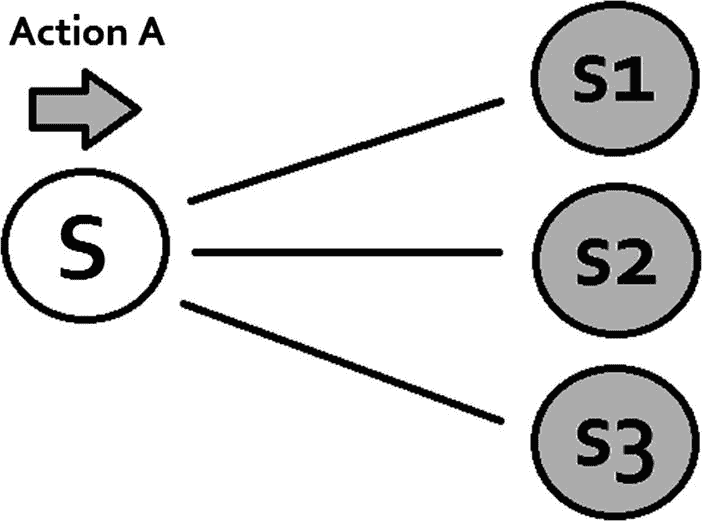
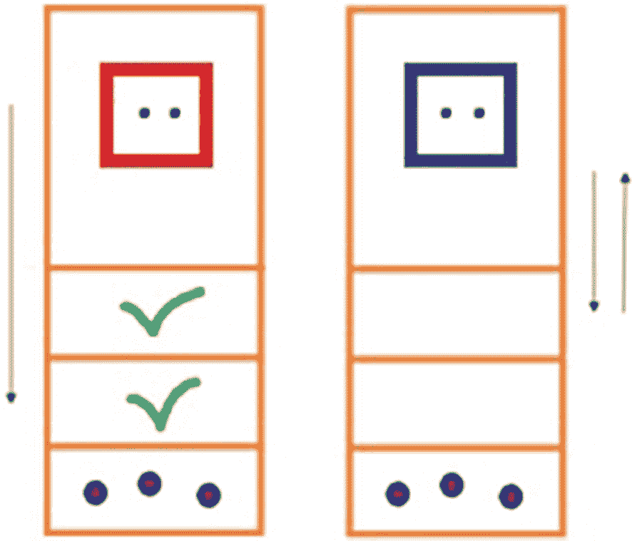
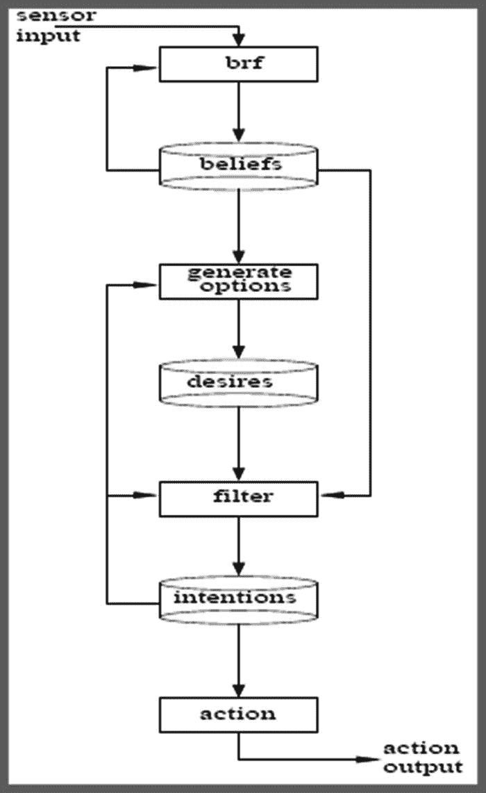
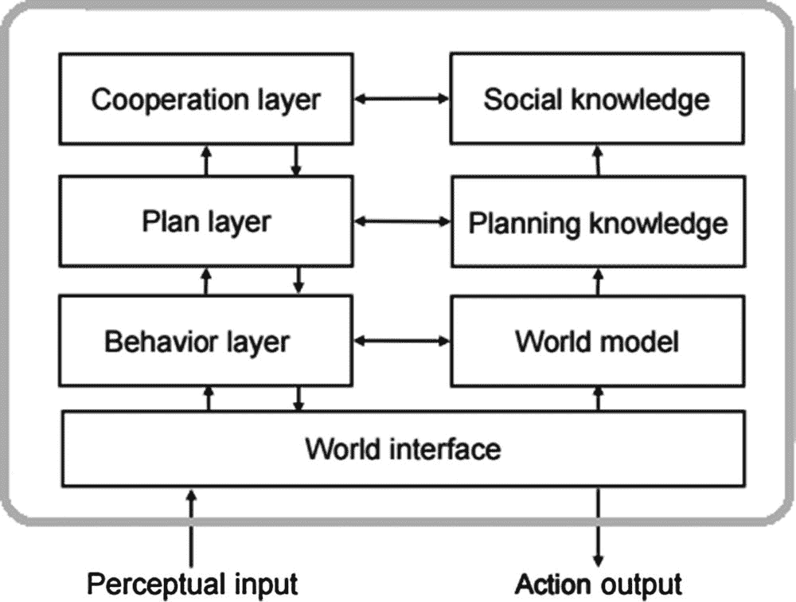

# 三、智能体

在这一章中，我们将开始描述人工智能世界中一个非常重要的研究领域:智能体。如今，智能体代表了计算机科学和人工智能的许多子领域的强烈兴趣。它们被用于大量的应用中，从相对较小的系统如电子邮件过滤器到复杂庞大的系统如空中交通管制。

在接下来的几页中，我们将把智能体视为基本的人工智能实体；我们将从熟悉一个可能的智能体定义开始(因为没有关于这个概念的全球协议)。我们将研究不同智能体的属性和架构，并分析一个实际问题，这将有助于我们理解如何用 C#开发智能体。在这一章和下一章中检验的实际问题将把贯穿这一章的概念建立在坚实的基础上，其中许多将与人工智能的经典问题相联系。

我们将对今天我们通常从视频游戏玩家、人工智能爱好者或与人工智能相关的程序员那里听到的许多词语给出含义和定义——如反应性、主动性、感知、行动、意图或深思熟虑。我们可能知道的智能体的典型例子有机器人(像上一章的清洁机器人)、基于网络的购物程序、交通控制系统、软件守护进程等等。

Note

智能体通常被称为机器人，它来源于单词 robot。它们可以使用类似于我们在科幻电影中看到的金属机身，或者只是由安装在我们手机上的计算机软件组成，如 Siri。他们可能拥有人类的能力，如说话和语音识别，并能够独立行动。

## 什么是智能体？

如前所述，智能体这个术语还没有一个统一的概念。让我们记住，同样的事情也发生在逻辑的概念上(回想我们在第 [2](02.html) 章中分析过)。

为了提供术语智能体的定义，我们将考虑来自不同作者的不同定义，并从所有这些定义中选取最通用的特征，附加一些自身逻辑。

由于智能体是一个来自人工智能的术语，我们必须记住，正如人工智能领域发生的一切一样，它涉及到创建一个人工实体，如果可能的话，模拟和增强以某种方式和环境完成一系列人类任务。

因此，智能体是一种实体(人、计算机程序)，它使用一组传感器(类似于人类那样，可以感测热量、压力等)，能够获得一组感知或输入(温暖、高压等)，并具有通过致动器对该环境采取行动(打开空调、移动到不同位置)的能力。

人类的致动器可以是他们的腿、手臂或嘴，而机器人的致动器可以是他们的机械臂、轮子或类似的东西。

感知或输入是智能体通过其传感器接收的每一条数据。

在人类的例子中，传感器可以是眼睛、鼻子、耳朵，或者我们实际上拥有的用于从我们的日常环境中获取信息的任何东西。在机器人的情况下，传感器可以是它们的摄像机、麦克风或任何它们可以用来从环境中获取输入的东西。在这两种情况下，接收到的输入都被转换成感知，感知表示附加了某种逻辑的信息片段。例如，用我们的耳朵，我们可以注意到，当进入一个房间，里面的音乐太大声了。注意和接受这种感知的过程是如何进行的？我们的耳朵感受到房间里的巨大声音，这些信息被传递到我们的大脑，大脑处理这些信息并产生一种被称为“巨大音乐”的感觉，然后我们就知道了。可选地，我们可以根据感觉行动，用我们的手臂和手(执行器)来降低音乐的音量。同样的事情也发生在非人类的智能体身上，但是是在软件层面，并且可能使用一些机器人部件(手臂、轮子等等)。

从数学的角度来看，agent 的定义可以看作是以一组感知器中的一组元组或关系作为定义域，具有一组动作的函数(图[3-1](#Fig1))；也就是说，假设 F 是智能体的功能，P 是感知的集合，A 是动作的集合，F: P <sup>*</sup> → A .既然我们已经提供了智能体这个非常重要的术语的定义，现在是时候定义什么是智能智能体了。


图 3-1

An agent in its environment. The agent uses its sensory components to receive inputs from the environment. It processes these inputs and eventually outputs an action that affects the environment. This will be a continuous interaction as long as the agent remains active.

智能智能体是一个自主智能体，能够在执行其动作的同时考虑几个智能体属性，如反应性、主动性和社交能力。智能体和智能智能体之间的主要区别是智能和自治这两个词，后者与其行为中预期的独立性相关，而前者与刚才提到的属性相关。这些属性和其他属性将是下面几节的主题。

Note

智能体不一定需要是智能智能体，因为该特征涉及一组更人性化或更高级的属性(反应性、主动性、社交能力等)，而诸如运动检测器之类的简单智能体可能不需要这些属性。因此，为了尽可能概括，我们从更一般的智能体定义开始，然后讨论智能智能体定义。

## 智能体属性

既然我们已经熟悉了智能体和智能智能体的概念，那么是时候描述那些提到的使智能体变得智能的属性了。

自主性是指智能体在没有人类或其他智能体的直接干预的情况下行动，并对自己的行动和内部状态拥有控制权的能力。

反应性是指智能体感知其环境并及时(反应必须是有用的)对环境中接收到的感知做出反应的能力，以满足智能体的指定目标。

主动性是指智能体表现出目标导向行为的能力，并通过创建计划或类似的策略来采取主动，以使他们满足其指定的目标。

社会能力是指在多智能体系统中，一个智能体与其他智能体(可能是人类)进行交互以实现其指定目标的能力。由于这个属性与多智能体的环境有关，我们将在下一章进一步讨论它。

另一个非常重要的属性是理性。我们说，如果一个主体为了实现其目标而行动，并且绝不会以阻止其目标实现的方式行动，那么这个主体就是理性的。

纯粹的反应式智能体决定做什么，而不看他们的感知历史。他们的决策过程完全基于当前的感知，而不考虑他们的过去；因此，他们没有记忆或不考虑它。从数学上来说，一个纯反应性主体的主体函数是 F: P → A。正如我们所看到的，一个只表现出反应性的主体只需要当前的感知就可以提供一个动作。

Note

通用智能体的智能体函数是 F:P<sup>*</sup>→a . P 上面的星号表示零个或多个感知的关系；即一组长度为 n 的元组，其中 n>= 0；这是取代星号的数字。在纯反应剂的情况下，n = 1。

反应式智能体中的决策过程被实现为从状态到动作的直接映射。具有这种特性的智能体会对环境做出反应，而不会进行推理。上一章描述的清洁机器人是反应剂的一个例子；请记住，我们有类似清单 [3-1](#Par24) 中所示的规则。

```py
if (IsDirty())
Clean();
      else
Move(SelectMove());
Listing 3-1Simple Rule of the Cleaning Robot from Last Chapter, a Reactive Agent

```

这些只是让我们的机器人对环境做出反应的简单规则，没有任何推理。`SelectMove()`方法返回一个由智能体执行的随机移动，所以没有启发式(见第 [14 章](14.html))或任何其他类型的目标导向分析或行为被合并到这个智能体中。就像清洁机器人一样，每一种反应剂基本上都有一套固定的`if` … `then`规则。

开发反应剂对我们有什么好处？

1.  对它们进行编码真的很容易，并且它们允许我们获得优雅、易读的代码。
2.  他们很容易跟踪和理解。
3.  它们提供了对故障的鲁棒性。

纯反应剂的缺点或局限性是什么？

1.  因为他们基于本地信息——换句话说，关于智能体当前状态的信息——做出决策，所以很难理解这样的决策是如何考虑非本地信息的；因此，他们有一种“短视”的观点。
2.  很难让他们从经验中学习，并随着时间的推移提高他们的表现。
3.  很难编写必须包含大量行为(太多情况->动作规则)的反应式智能体。
4.  他们没有任何主动的行为；因此，他们不制定计划，也不关心未来，只关心当下或马上要执行的行动。

对环境做出反应是很容易的，但是我们经常需要我们的智能体做更多的事情；我们需要他们代表我们行事，为我们做事。为了完成这些任务，他们必须有目标导向的行为——他们必须积极主动。

积极主动的智能体会寻求创造和实现次要目标，最终引导他们实现主要目标。作为他们工作的一部分，这些智能体应该能够预测需求、机会和问题，并主动采取行动解决这些问题。他们还应该能够即时识别机会；例如，可用资源、模式异常、合作机会等等。

主动智能体的一个常见例子是个人助理智能体，就像那些可能安装在我们的设备上的智能体。这个智能体可以在我们的手机上持续运行，跟踪我们的位置和偏好，并根据这些偏好主动建议要去的地方(该地区的文化活动，提供我们这种食物的餐馆，等等)。

总的来说，我们希望我们的智能体是被动的；也就是说，及时对环境的变化做出反应，或者等效地对短期目标做出反应。我们还希望他们积极主动，系统地努力实现长期目标。具有平衡这两种特性的试剂是一个公开的研究问题。

在本章中，我们将分析一个实际问题，在这个问题中，我们将为第 [1](01.html) 章中介绍的清洁机器人添加主动功能。

表 [3-1](#Tab1) 中显示了药剂的其他属性，尽管这些属性不被视为之前提到的基本属性，但仍然相关。

表 3-1

Other Agent Properties

<colgroup><col align="left"> <col align="left"></colgroup> 
| 财产 | 描述 |
| :-- | :-- |
| 协调 | 这意味着智能体能够在与其他智能体共享的环境中执行某些活动。它回答了这样一个问题，如何在一组智能体之间分配任务？通过计划、工作流程或任何其他管理工具进行协调。 |
| 合作 | 这意味着智能体能够与其他智能体合作，以实现他们的共同目标(共享资源、结果、分布式问题解决)。作为一个团队，他们要么成功，要么失败。 |
| 适应性 | 也称为学习，这意味着智能体是反应性的、主动的，并且能够从自己的经验、环境以及与他人的交互中学习。 |
| 机动性 | 这意味着智能体能够将自己从一个 shell 传输到另一个 shell，并使用不同的平台。 |
| 时间连续性 | 这意味着智能体正在持续运行。 |
| 个性 | 这意味着智能体有明确的个性和情感状态的感觉。 |
| 复用性 | 这意味着连续的智能体实例可能需要保留智能体类的实例，以供信息重用或检查和分析以前生成的信息。 |
| 资源限制 | 这意味着智能体只能在其拥有资源的情况下采取行动。这些资源通过它的动作和委托来修改。 |
| 诚实 | 这意味着智能体不会故意传达虚假信息。 |
| 仁慈 | 这意味着智能体将在没有冲突目标的假设下运行，并且它将总是尝试做要求它做的事情。 |
| 知识层面的交流 | 这意味着智能体将有能力使用类似人类的语言(英语、西班牙语等)与人类智能体或者其他非人类智能体进行交流。). |

既然我们已经详细介绍了一些重要的智能体属性，那么让我们来研究一些不同类型的环境，我们的智能体可以在这些环境中进行交互；最后，我们还将介绍可以为我们的智能体实现的各种智能体架构。

## 环境的类型

根据环境的类型，智能体可能需要也可能不需要一组属性。因此，智能体的决策过程受到其运行环境所暴露的特征的影响。这些功能构成了本节将要描述的环境类型。

在确定性环境中，智能体采取的每个动作都将有一个可能的结果；也就是说，在执行一个动作后，结果状态或感知没有不确定性(图 [3-2](#Fig2) )。


图 3-2

Deterministic environment; an agent is in state S and can only move to state or percept S1 after executing an action A. Every state is linked to just one state; i.e., there’s a single possible outcome for every action executed by the agent.

另一方面，非确定性环境是这样一种环境，其中由智能体执行的动作不具有明确确定的状态，并且不仅仅是单个状态，它可以是一组状态；例如，执行动作 A 可能导致状态 S1、S2 或 S3。这是不确定的，如图 [3-3](#Fig3) 所示。非确定性环境是智能体设计中最复杂的环境。使用骰子的棋盘游戏通常是不确定的，因为骰子的滚动可以将智能体带到任何状态，这取决于骰子上显示的值。

在静态环境中，只有智能体执行的动作才会影响环境并导致环境改变。在动态环境中，有多个进程在运行，其中许多进程与智能体没有任何关系，但它们仍然影响并改变着环境。物理世界是一个高度动态的环境。



图 3-3

Non-deterministic environment; an agent is in state S and after executing action A it could move to states S1, S2, or S3\. Every state is linked to a set of states; i.e., there are multiple possible outcomes for every action executed by the agent.

离散环境是指有固定的、有限数量的行为和感知的环境。或者，一个连续的环境是一个行动和知觉都不是由一个有限的数字决定的环境。棋盘游戏如国际象棋、滑动拼图、奥赛罗或西洋双陆棋代表了离散的环境。然而，一个由实际城市组成的环境代表了一个连续的环境，因为没有办法将智能体在这样的环境中可能感知的感知限制在一个固定的、有限的数量。

在可访问的环境中，智能体可以获得关于环境状态的准确、完整和最新的信息。不可访问的环境则相反，在这种环境中，智能体无法获得准确、完整、最新的信息。环境越容易访问，就越容易为其设计智能体。

最后，在情节环境中，智能体的表现取决于离散的情节数量，并且在不同情节中智能体的表现之间没有关系。在这种类型的环境中，智能体可以仅基于当前情节来决定执行什么动作。

Note

最复杂的一类环境是由那些不可接近的、不确定的、非偶发性的、动态的和连续的环境组成的。

## 国家智能体

到目前为止，我们已经考虑了将一个感知或一系列感知映射到一个动作的智能体。因为智能体(非反应性智能体)能够从一系列感知中进行映射，所以他们知道自己的历史。在这一节中，我们将进一步研究同样维护状态的智能体。

智能体的状态将通过内部数据结构来维护，该内部数据结构将用于在智能体被执行时存储关于环境的信息。因此，决策过程可以基于存储在该数据结构中的信息。

然后，智能体函数稍作修改，以包含这一新特性。

```py
F: I x P* → A

```

其中 I 是智能体存储的内部环境状态集，P 是感知集，A 是动作集。

因此，对于无状态智能体，我们只有 F:P<sup>*</sup>→A；现在，在这种情况下，我们添加了对内部数据结构的必要考虑，使智能体函数接收内部状态和感知或感知序列作为参数；即，

```py
F(I, P1, P2 ... PN) = A.

```

值得注意的是，像本节中定义的基于状态的智能体实际上比没有状态的智能体强大得多。

在下一个实际问题中，我们将通过添加状态来增强第 [1](01.html) 章中描述的清洁机器人。

## 实际问题:将清洁机器人建模为智能体，并为其添加状态

在这个实际问题中，我们将修改上一章描述的`CleaningRobot`类，使其适应智能体范例(感知、动作等等)，特别是智能体的功能。我们还将以`List<Tuple<int, int>>`的形式向这个智能体添加状态，它将存储已经访问和清理过的单元。我们将看到拥有这种状态的好处，并将它与无状态的`CleaningRobot`类进行比较。

我们将这个类命名为`CleaningAgent`，它的构造函数将非常类似于`CleaningRobot`的构造函数，如清单 [3-2](#Par61) 所示。对于这个新类，我们将添加布尔型的`TaskFinished`字段，它将指示智能体的任务何时完成，以及`List<Tuple<int, int>> __cellsVisited`，它将确定已经访问过的单元集。

```py
public class CleaningAgent
    {
        private readonly int[,] _terrain;
        private static Stopwatch _stopwatch;
        public int X { get; set; }
        public int Y { get; set; }
        public bool TaskFinished { get; set; }
        // Internal data structure for keeping state
        private readonly List<Tuple<int, int>> __cellsVisited;
        private static Random _random;

        public CleaningAgent(int [,] terrain, int x, int y)
        {
            X = x;
            Y = y;
            _terrain = new int[terrain.GetLength(0), terrain.GetLength(1)];
            Array.Copy(terrain, _terrain, terrain.GetLength(0) * terrain.GetLength(1));
            _stopwatch = new Stopwatch();
            _cellsVisited= new List<Tuple<int, int>>();
            _random = new Random();
        }
}

Listing 3-2Constructor and Fields of the Cleaning Agent

```

智能体的工作循环现在与智能体函数相关；即，它基于从环境中获得的一组感知来执行动作。当任务完成或达到最大执行时间(毫秒)时，循环结束，如清单 [3-3](#Par63) 所示。

```py
    public void Start(int miliseconds)
    {
        _stopwatch.Start();

        do
        {
            AgentAction(Perceived());
        }
        while (!TaskFinished && !(_stopwatch.ElapsedMilliseconds > miliseconds));
    }

Listing 3-3Loop of the Agent Matching the Agent’s Function Definition

```

方法`Clean()`、`IsDirty()`、`MoveAvailable(int x, int y),`和`Print()`将保持它们在`CleaningRobot`类中的样子；这些在清单 [3-4](#Par65) 中进行了说明。

```py
        public void Clean()
        {
            _terrain[X, Y] -= 1;
        }

        public bool IsDirty()
        {
            return _terrain[X, Y] > 0;
}

public bool MoveAvailable(int x, int y)
        {
            return x >= 0 && y >= 0 && x < _terrain.GetLength(0) && y < _terrain.GetLength(1);
        }

        public void Print()
        {
            var col = _terrain.GetLength(1);
            var i = 0;
            var line = "";
            Console.WriteLine("--------------");
            foreach (var c in _terrain)
            {
                line += string.Format("  {0}  ", c);
                i++;
                if (col == i)
                {
                    Console.WriteLine(line);
line = "";
                    i = 0;
                }
            }
        }

Listing 3-4Methods Clean(), IsDirty(), MoveAvailable(int x, int y), and Print() as They Were in the CleaningRobot Class

```

感知集将通过清单 [3-5](#Par67) 中所示的方法获得，该方法返回一个感知列表，该列表将由一个枚举(在`CleaningAgent`类之外声明)表示，该枚举定义了`CleaningAgent`环境中的每个可能的感知；这个枚举也可以在清单 [3-5](#Par67) 中看到。

```py
public enum Percepts
    {
        Dirty, Clean, Finished, MoveUp, MoveDown, MoveLeft, MoveRight  
}

private List<Percepts> Perceived()
    {
            var result = new List<Percepts>();

            if (IsDirty())
                result.Add(Percepts.Dirty);
            else
                result.Add(Percepts.Clean);

            if (_cellsVisited.Count == _terrain.GetLength(0) * _terrain.GetLength(1))
                result.Add(Percepts.Finished);

            if (MoveAvailable(X - 1, Y))
                result.Add(Percepts.MoveUp);

            if (MoveAvailable(X + 1, Y))
                result.Add(Percepts.MoveDown);

            if (MoveAvailable(X, Y - 1))
                result.Add(Percepts.MoveLeft);

            if (MoveAvailable(X, Y + 1))
                result.Add(Percepts.MoveRight);

            return result;
        }

Listing 3-5Percepts enum and the Perceived() Method That Returns a List<Percepts> Containing Every Perception the Agent Has Obtained from the Environment

```

如前所述，该智能体将保持与被访问单元的历史相对应的状态。为此，我们实现了清单 [3-6](#Par69) 中的`UpdateState()`方法。

```py
private void UpdateState()
        {
            if (!_cellsVisited.Contains(new Tuple<int, int>(X, Y)))
                _cellsVisited.Add(new Tuple<int, int>(X, Y));
        }
Listing 3-6Method for Updating the State of the Agent; i.e., Cells Visited

```

将所有这些放在一起的方法是清单 [3-7](#Par72) 中显示的`AgentAction(List<Percepts> percepts)`。在这种方法中，我们仔细检查从环境中获得的每一个感知，并相应地采取行动。例如，如果当前单元是干净的，我们通过将该单元添加到`_cellsVisited`列表来更新智能体的状态(内部数据结构);如果我们感觉到当前的单元是脏的，我们就清洁它，对于每一种情况或感觉以及它的结果或动作都是如此。此外，清单 [3-7](#Par72) 还说明了方法`RandomAction(List<Percepts> percepts)`和`Move(Percepts p)`。第一个选择一个随机移动感知(`MoveUp`、`MoveDown`等)。)来执行，后者执行作为参数提供的运动感知。

注意，该智能体在移动之前将总是检查其状态和感知(回想一下，I x P 是具有状态的智能体的域),并且它将总是试图移动到先前没有访问过的相邻小区。

```py
        public void AgentAction(List<Percepts> percepts)
        {
            if (percepts.Contains(Percepts.Clean))
                UpdateState();
            if (percepts.Contains(Percepts.Dirty))
                Clean();
            else if (percepts.Contains(Percepts.Finished))
                TaskFinished = true;
            else if (percepts.Contains(Percepts.MoveUp) && !_cellsVisited.Contains(new Tuple<int, int>(X - 1, Y)))
                Move(Percepts.MoveUp);
            else if (percepts.Contains(Percepts.MoveDown) && !_cellsVisited.Contains(new Tuple<int, int>(X + 1, Y)))
                Move(Percepts.MoveDown);
            else if (percepts.Contains(Percepts.MoveLeft) && !_cellsVisited.Contains(new Tuple<int, int>(X, Y - 1)))
                Move(Percepts.MoveLeft);
            else if (percepts.Contains(Percepts.MoveRight) && !_cellsVisited.Contains(new Tuple<int, int>(X, Y + 1)))
                Move(Percepts.MoveRight);
            else
                RandomAction(percepts);
        }

        private void RandomAction(List<Percepts> percepts)
        {
            var p = percepts[_random.Next(1, percepts.Count)];
Move(p);
}

        private void Move(Percepts p)
        {
            switch (p)
            {
                case Percepts.MoveUp:
                    X -= 1;
                    break;
                case Percepts.MoveDown:
                    X += 1;
                    break;
                case Percepts.MoveLeft:
                    Y -= 1;
                    break;
                case Percepts.MoveRight:
                    Y += 1;
                    break;
            }
        }

Listing 3-7Method for Updating the State of the Agent; i.e., Cells Visited

```

与无状态清洁机器人相比，清洁剂为我们提供了哪些优势？为了回答这个问题，让我们首先注意到我们对清洁剂使用的策略(通过保存访问过的细胞坐标来记录其环境历史)是非常直观的。想象一下，你需要在一个有超过 100 家商店的大城市找到某种产品 X；你将如何完成这样的任务？凭直觉，你会去一次商店，然后在脑海中记录下你已经去过那家商店，而产品却不在那里，这样就节省了再次光顾的时间。然后你会从一家商店转到下一家，直到你找到产品，永远记住，已经去过的商店是浪费时间。这基本上就是我们的清洁智能体尝试做的事情，只是有时可能需要重新访问已经访问过的单元，因为智能体只能移动到相邻的单元，并且它们可能都在某个时间点被访问过。在图 [3-4](#Fig4) 中，我们可以看到清洁剂和清洁机器人之间的基本对比。



图 3-4

The cleaning agent (in blue) searches the environment, saving coordinates of visited cells, while the cleaning robot (in red) does not save the state of the environment or its history; therefore, it simply makes random moves that could take it up or down and even going in circles, thus consuming more time to clean the dirt on the last cell.

在清单 [3-8](#Par75) 中，我们有一个 1000 x 1 个单元的环境，即 1000 行和一列，污垢位于最后一行。

```py
var terrain = new int[1000, 1];

  for (int i = 0; i < terrain.GetLength(0); i++)
 {
           for (int j = 0; j < terrain.GetLength(1); j++)
{
                     if (i == terrain.GetLength(0) - 1)
                        terrain[i, j] = 1;
}   
   }

var cleaningEntity = new CleaningRobot(terrain, 0, 0);
cleaningEntity.Print();
cleaningEntity.Start(200);
   cleaningEntity.Print();

var cleaningEntity = new CleaningAgent(terrain, 0, 0);
cleaningEntity.Print();
cleaningEntity.Start(200);
   cleaningEntity.Print();

Listing 3-8Method for Updating the State of the Agent; i.e., Cells Visited

```

清洁剂标记每个被访问的单元，从而更快地移动到最后一个单元并到达其任务完成的点。另一方面，清洁机器人不保存环境的状态，所以它没有任何内部结构来帮助它决定什么移动应该是正确的，并且基本上可以随机上下移动几次，甚至转圈。清洁智能体具有数据结构，该数据结构具有关于环境的信息，以帮助它应用一些逻辑并做出合理的决定，而清洁机器人没有。由于清单 [3-8](#Par75) 中显示的代码，随机机器人无法清洁最后一个单元上的污垢，而智能体能够在给定的时间内完成(图 [3-5](#Fig5) )。


图 3-5

On the left, the result obtained after executing CleaningRobot; on the right, the result after executing CleaningAgent. The first leaves dirt on the last row, while the latter is able to clean it.

到目前为止，在本章中，我们已经检查了智能体的属性和环境，并描述了一个实际问题，在这个问题中，我们可以看到一个智能体的状态超过了上一章中介绍的清洁机器人。在未来的章节中，我们将研究一些最流行的智能体架构。

## 智能体体系结构

智能体体系结构代表了考虑不同智能体属性的预定义设计，就像前面研究的那样，为构建智能体提供一个方案或蓝图。

人们可以用智能体是建筑物的类比来思考目前提出的不同概念；它们的属性类似于建筑属性(颜色、高度、使用的材料等)。);他们的架构是在建筑中的样子，即支持它并定义其功能的基础设施；智能体类型(很快会详细说明)将是我们拥有的建筑类型(商业、政府、军事等。).

智能体体系结构作为智能体功能的基础，指明了智能体将如何工作。到目前为止，我们已经看到智能体的功能是抽象的；架构作为一个定义功能的组件将会给我们一个实现这种功能的模型。

### 反应式架构:包容架构

同样，我们可以拥有一个发光的属性和发光的架构，换句话说，我们可以专注于提供最大的亮度，我们也可以拥有一个反应智能体和基于反应的架构，一个专注于反应的架构。智能体反应式架构就是这种情况。

在反应式体系结构中，当它发生在反应式智能体中时，每个行为都是从感知或环境状态到动作的映射。在图 [3-6](#Fig6) 中，我们可以看到一个展示反应式架构的图表。


图 3-6

Reactive architecture diagram

前几节中开发的清洗剂是反应式结构的一个明显例子。我们已经从智能体的属性部分了解到，纯粹的反应性包含一些挫折:在这种类型的架构中没有学习；它通常是手工制作的，这使得创建大型系统非常困难；只能用于原来的用途，等等。

最流行的——也可以说是最著名的——反应式架构之一是包容架构，由罗德尼·布鲁克斯在 20 世纪 80 年代中期开发。他的架构据说是基于行为的架构；它拒绝了基于逻辑的智能体的想法——即完全依赖逻辑来表示世界、其交互和关系的智能体——试图建立一种不同于他那个时代传统人工智能的新方法。

Note

基于行为的智能体使用生物系统作为构建模块，并依赖于适应性。它们往往比它们的人工智能对手表现出更多的生物特征，可以重复动作，犯错误，表现出坚韧等等，有点像蚂蚁。

布鲁克斯架构背后的主要思想如下:

1.  智能行为可以在没有像符号人工智能提出的那些显式表示的情况下产生。
2.  智能行为可以在没有符号人工智能提出的那种明确的抽象推理的情况下产生。
3.  智能是某些复杂系统的自然属性。

包容架构拥有两个基本特征:

1.  智能体的决策过程是通过一组完成任务的行为来执行的，其中每个行为模块都可以看作是一个独立的智能体功能。因为这是一个反应式架构，所以每个智能体功能都是从感知或状态到动作的映射。
2.  行为模块旨在实现特定的任务，每个行为都与其他行为“竞争”来控制智能体。
3.  许多行为可以同时触发，并且这些行为提出的多个动作根据包含层次结构来执行，行为被安排成层。
4.  层级中的较低层能够禁止较高层:层越低，其优先级越高。

包容层次的原则是更高层将指示更抽象的行为。例如，考虑到我们的清洁剂，人们会优先考虑“清洁”行为；因此，它将被编码在较低的层中，在那里它具有较高的优先级。

Note

符号人工智能有时被称为老式人工智能或好的老式人工智能。它流行于 20 世纪 50 年代和 60 年代，基于通过符号(逻辑公式、图形、规则等)表示知识的思想。).因此，符号人工智能的方法是在逻辑、形式语言理论、离散数学的各个领域等等的基础上发展起来的。

再看一下清洁剂，我们可以看到它遵循包容架构(清单 [3-9](#Par98) )。

```py
public void AgentAction(List<Percepts> percepts)
{
            if (percepts.Contains(Percepts.Clean))
                UpdateState();
            if (percepts.Contains(Percepts.Dirty))
                Clean();
            else if (percepts.Contains(Percepts.Finished))
                TaskFinished = true;
            else if (percepts.Contains(Percepts.MoveUp) && !_cellsVisited.Contains(new Tuple<int, int>(X - 1, Y)))
                Move(Percepts.MoveUp);
            else if (percepts.Contains(Percepts.MoveDown) && !_cellsVisited.Contains(new Tuple<int, int>(X + 1, Y)))
                Move(Percepts.MoveDown);
            else if (percepts.Contains(Percepts.MoveLeft) && !_cellsVisited.Contains(new Tuple<int, int>(X, Y - 1)))
                Move(Percepts.MoveLeft);
            else if (percepts.Contains(Percepts.MoveRight) && !_cellsVisited.Contains(new Tuple<int, int>(X, Y + 1)))
                Move(Percepts.MoveRight);
            else
                RandomAction(percepts);
        }
Listing 3-9Cleaning Agent Action Function Follows the Subsumption Architecture

```

清洁剂为所展示的行为建立了秩序；该顺序对应于图 [3-7](#Fig7) 所示的包容层级。


图 3-7

Subsumption hierarchy for cleaning agent

清洁剂中包含层次结构建立的优先级顺序是 1、2、3、4、5、6 和 7，7 是具有最高优先级的行为。

这种架构继承了反应式架构的问题(没有学习，硬连线规则，等等)。除此之外，对复杂系统建模需要在层次结构中包含许多行为，这使得它过于广泛和不可行。至此，我们已经描述了智能体属性和反应式架构，提供了其中一个例子(可能是最著名的例子)，包容架构。在接下来的章节中，我们将会看到其他的智能体架构，比如 BDI(信念愿望意图)和混合架构。

### 深思熟虑的建筑:BDI 建筑

在纯粹的谨慎架构中，智能体遵循基于目标的行为，他们能够推理和提前计划。深思熟虑的体系结构通常通过逻辑、图形、谨慎的数学等结合了某种对世界的符号表示，并且决策(例如，关于执行什么动作)通常是通过使用模式匹配和符号操作的逻辑推理来做出的。熟悉逻辑或函数式编程语言(如 Prolog、Haskell 或 FSharp)的读者可能更容易理解符号的含义。深思熟虑的架构通常面临两个需要解决的问题:

1.  将现实世界翻译成一个适当的、准确的符号版本，对智能体来说是有效的和有用的。这个问题通常很耗时，尤其是当环境过于动态且经常变化时。
2.  象征性地表示关于现实世界的实体、关系、过程等等的信息，以及如何利用这些信息进行推理和决策。

第一个问题指导了人脸识别、语音识别、学习等方面的工作，第二个问题启发了知识表示、自动调度、自动推理、自动规划等方面的工作。不管这些问题产生了大量的科学资料，大多数研究人员都接受了一个事实，即这些问题还远未解决。即使是看似微不足道的问题，比如本质推理，结果也异常困难。潜在的问题似乎是即使在非常简单的逻辑中定理证明的困难，以及一般符号操作的复杂性；回想一下，一阶逻辑(FOL)甚至是不可判定的，并且附属于它的模态扩展(包括信念、欲望、时间等的表示)往往是高度不可判定的。

Note

术语“可判定”或“可判定性”与决策问题有关；即，可以被定义为对关于输入值的问题输出是(1)或否(0)的问题。可满足性问题是决策问题的一个特例。因此，我们说一个理论(公式集)是可判定的，如果有一个方法或算法来决定一个随机选择的公式是否属于那个理论。

图 [3-8](#Fig8) 显示了通用的审议架构。


图 3-8

Deliberative architecture

像 BDI(很快将详述)这样的多种审议架构在理解实践推理的哲学传统中找到了它们的根源，实践推理是在寻求实现我们的目标时时刻刻决定执行哪种行动的过程。人类的实践推理包括两种活动:

1.  决定我们想要达到的状态(深思熟虑)。
2.  决定如何实现这些事态(手段-目的推理或计划)。

从前面的活动我们可以得出结论，审议输出意图，手段-目的推理输出计划。

Note

实践推理和理论推理是有区别的。前者指向行动，后者指向信念。

手段-目的推理是决定如何使用可用的手段达到目的的过程；在人工智能领域，这被称为规划。对于智能体来说，生成一个计划通常需要一个表示或要实现的目标意图，一个表示它可以执行的动作，以及一个表示它的环境(图 [3-9](#Fig9) )。


图 3-9

Inputs and output flow of the planning component of an agent

深思熟虑是如何发生的？在深思熟虑的过程中，第一步称为备选方案生成，其中智能体生成一组备选方案(目标、愿望)供考虑。在称为过滤的第二步中，智能体在可用选项之间进行选择，并提交其中的一些选项。这些选择的选项或替代方案是它的意图。

审议架构中的关键问题是“智能体如何审议其(可能冲突的)目标，以决定它将追求哪些目标？”这个问题的答案是由每个审议架构特有的目标审议策略提供的；其中最受欢迎的是迈克尔·e·布拉特曼在他的书《意图、计划和实践理性》(1987)中创造的 BDI 建筑。

Note

考虑到它们与时间的相互作用，反应式架构存在于现在(持续时间短)，而深思熟虑的架构对过去和项目(计划等)进行推理。)走向未来。

信念、愿望和意图(BDI)体系结构包含对智能体的信念、愿望和意图的明确表示。信念(它所想的)通常被认为是智能体拥有的关于其环境的信息；我们可以说知识而不是信念，但我们更愿意使用更一般的术语信念，因为智能体所相信的有时可能是错误的。欲望(它想要的)是智能体希望看到实现的东西，我们不期望智能体按照它所有的欲望行事。意图(它正在做的事情)是智能体致力于做的那些事情，它们基本上是过滤欲望的结果；BDI 架构如图 [3-10](#Fig10) 所示。



图 3-10

BDI architecture

信念通常由输出真值或假值的谓词来描述(例如，`IsDirty(x,y)`)，并表示智能体对世界的内部知识。

当愿望存在于信念库中时(或者被智能体手动移除)，愿望就被满足了。像信念库一样，愿望库在智能体执行期间更新。当一个欲望被创建为一个中间目标时，欲望可以通过层次链接(子/超级欲望)联系起来(例如，清洁一个地形上的灰尘可以有两个子目标:移动到每个脏的单元并清洁它)。期望具有可以动态改变的优先级值，并且用于在必要时从一组期望中选择新的意图。

一旦智能体考虑了它所有的选项，它必须承诺其中的一些，在这种情况下，作为一个例子，它将只承诺一个，它唯一可用的选项，这后来成为它的意图。意图最终导致行动，智能体应该通过努力实现其意图来采取行动。智能体应该作出合理的尝试来实现其意图，它可以遵循一系列的行动(计划)为此目的。

智能体选择的意图将从那时起限制其实际推理；一旦对一个意图的承诺存在，行动者就不会考虑与已经启动的意图相冲突的其他意图。意图可以被搁置(例如，当他们需要实现一个子计划时)。为此，有一叠意向；最后一个是目前的意向，也是唯一一个没有搁置的。

意图要持之以恒；换句话说，我们必须投入一切可用的资源来实现它们，如果短期内没有实现，就不要立即放弃它们，因为那样我们将一直一事无成。另一方面，意图不能持续太久，因为可能有一个合乎逻辑的理由放弃它们。例如，可能会有一段时间，清洁智能体没有其他事情可做(清洁)，可能是因为它处于多智能体环境中，而其他智能体已经完成了清洁任务。

意图构成了一系列与实践推理相关的重要角色:

*   意图激励计划:一旦一个主体决定实现一个意图，它必须计划一系列的行动来实现这个意图。
*   意图约束未来的考虑:一旦智能体承诺一个意图，它将不会考虑与所选择的意图相冲突的其他意图。
*   意图持续存在:智能体不会在没有任何合理原因的情况下放弃其意图；它通常会持续到智能体认为它已经成功地实现了它们，或者它认为它不能实现它们，或者因为意图的目的不再存在。
*   意图影响对未来的信念:一旦行动者采纳了某些意图，在假设那些被选择的意图将被实现的情况下对未来的一些计划是必要的和合乎逻辑的。

智能体不时停下来重新考虑其意图是很重要的，因为有些意图可能变得不合理或不可能。这个重新考虑阶段意味着在空间和时间线上的成本，它也给我们提出了一个问题:

*   一个没有停下来重新考虑其意图的大胆智能体可能试图实现一个不再可能的意图。
*   一个过于频繁地停下来重新考虑其意图的谨慎的智能体可能会在重新考虑阶段花费太多的资源，而没有足够的资源来实现其意图。

智能体的事件驱动和目标导向行为之间的平衡或权衡是这一困境的解决方案。

Note

实验证明，在变化不太频繁的环境中，大胆的智能体比谨慎的智能体做得更好。在另一种情况下(环境经常变化)，谨慎的智能体胜过大胆的智能体。

BDI 智能体中的实际推理过程依赖于以下组件。在接下来的要点中，B 被假设为信念集，D 被假设为欲望集，I 被假设为意图集:

*   一组当前信念，代表智能体拥有的关于其环境的信息
*   信念修正函数(brf ),接收感知和智能体的信念作为输入，并确定一组新的信念:brf: P x B -> B
*   一个选项生成函数(options ),它接收关于其环境和意图(如果有的话)的信念作为输入，并确定智能体的选项(期望): options: B x I -> D
*   一组当前选项，代表智能体可能遵循的操作过程
*   一个过滤函数(filter ),表示智能体的审议过程，并使用信念、愿望和意图作为输入来确定智能体的意图:filter: B x D x I -> I
*   代表智能体承诺的一组当前意图
*   一种动作选择功能，使用当前意图作为输入来确定要执行的动作

毫不奇怪，BDI 智能体的状态在任何时候都是三元组(B，D，I)。当我们不深入细节时，BDI 智能体的动作功能看起来相当简单；它显示在下面的伪代码中:

```py
function AgentAction(P):
         B = brf(P, B)
         D = options(D, I)
         I = filter(B, D, I)
end

```

在下一章中，我们将提出一个实际问题，我们将为 BDI 架构的火星探测车开发一个人工智能；这个问题将帮助我们为本节介绍的许多概念打下坚实的基础。

### 混合架构

许多研究者认为，当我们设计一个智能体时，一个纯粹的谨慎智能体和一个纯粹的反应智能体都不是一个好的策略。在混合体系结构中，智能体拥有基于目标的组件和反应式组件，前者能够推理和提前计划，后者允许智能体立即对环境情况做出反应，这种混合体系结构通常优于纯谨慎或纯反应式智能体。

通常，混合体系结构智能体由以下子系统或组件组成:

*   深思熟虑的组成部分:包含对世界的一种表述，这种表述在某种程度上是象征性的；它像在审议架构中一样制定计划和做出决策
*   反应组件:能够对某些情况做出反应，而无需复杂的推理(情况->后果规则)

因此，混合智能体具有反应性和主动性的属性，反应性组件通常比谨慎组件优先。

反应性和审议性组件共存的划分和某种程度的层次结构导致了分层架构的自然想法，这代表了混合智能体的设计。在这种类型的体系结构中，智能体的控制组件被安排到一个层次结构中，较高层在较高的抽象级别处理信息。

通常，我们在分层架构中至少有两层:一层处理反应行为，另一层处理主动行为。实际上，没有理由不能有更多的层。一般来说，我们可以将分层架构分为两种类型:

*   水平分层:在水平分层的架构中，智能体的每一层都直接连接到感觉输入和动作输出。结果，每一层都像一个智能体，产生关于执行什么动作的建议。
*   垂直分层:在垂直分层的架构中，感觉输入和动作输出都在一个或可能不同的方向上通过每一层进行处理。

水平和垂直分层如图 [3-11](#Fig11) 所示。


图 3-11

Horizontally layered architecture (on the left) and vertically layered architecture (on the right). Note that in vertically layered architectures there could be more than just one pass through every layer.

水平分层架构在概念设计上非常简单；表现出 n 种行为的智能体需要 n 层，每种行为一层。尽管有这个积极的一点，事实上每一层实际上都在与其他层竞争建议一个动作，这可能会导致智能体表现出不连贯的行为。为了提供一致性，通常需要一个中介函数充当“中间人”，并决定哪一层在任何给定时刻控制智能体。

中介函数涉及到高度的复杂性，因为必须考虑所有层之间所有可能的交互，以最终输出一个动作。从设计者的角度来看，创建这样的控制机制是极其困难的。

在垂直分层的体系结构中，这些问题减少了，因为层之间有一个顺序，最后一层是输出要执行的动作的层。垂直分层架构通常分为两种类型:单通架构和双通架构。在前一种类型中，智能体的决策过程依次流经每一层，直到最后一层生成一个动作。在两遍体系结构中，信息沿着体系结构向上流动(第一遍)，然后向下返回。两遍垂直分层体系结构的原则与组织和企业的工作方式之间存在一些显著的相似之处，即信息向上流向最高级别，然后订单向下流动。在单程和双程垂直分层架构中，层间交互的复杂性都有所降低。由于在 n 层之间有 n - 1 条边，如果每层能够建议 m 个动作，那么在层之间最多有 m 个<sup>2</sup>(n-1)个相互作用需要考虑。显然，这是一个比水平分层架构强迫我们拥有的更简单的交互层次。这种简单是有代价的，那就是灵活性。为了让垂直分层的体系结构做出决策，控制必须在每个不同的层之间传递。垂直分层的体系结构并非完美无缺，任何一层的故障都会对智能体的性能产生严重的后果。在下一节中，我们将研究水平分层架构的一个特例:旅游机器。

### 旅游机器

旅游机器代表由三层(建模层、规划层和反应层)组成的水平分层架构。图 [3-12](#Fig12) 示出了一种旅游机械。


图 3-12

Touring machine

反应层提供对环境中检测到的变化的即时响应，作为一组类似于包容架构的情境动作规则。在下一个伪代码中，我们说明了自主车辆智能体的反应规则。该示例显示了车辆的避障规则:

```py
rule-1: obstacle-avoidance
if (in_front(vehicle, observer)
andspeed(observer) > 0
andseparation(vehicle, observer) <vehicleThreshHold)
then
change_orientation(vehicleAvoidanceAngle)

```

规划层负责智能体的主动行为；换句话说，它对智能体长期的行为负责。为了进行计划，该层维护一个计划库；这些计划本质上是分级结构的计划，旅游机器在运行时详细阐述这些计划以决定做什么。因此，为了实现一个目标，计划层试图在库中找到一个与智能体所寻求的目标相匹配的计划。

Note

旅游机器的第一个基准场景之一是自动驾驶汽车。

建模层，顾名思义，表示世界及其各种实体(包括智能体)的模型。它预测智能体之间的冲突，并生成新的目标以解决这些冲突。然后，新生成的目标被提交到计划层，计划层利用其计划库来确定满足这些目标的一个或一组计划。

所有三层都与控制子系统相关，控制子系统决定哪一层对智能体具有控制权。该子系统由一组控制规则组成，这些控制规则既可以限制各层之间的信息，也可以对各层的输出进行操作，如下面的伪代码所示，该伪代码说明了一个控制规则:

```py
censorRule_1:
if (entity(bigObstacle) in perceptions)
then
removeSensoryRecord(layerReact, entity(bigObstacle))

```

该控制规则防止反应层知道已经检测到大的障碍物。在大多数情况下，反应层是处理避障的最合适的层，但是在不同的情况下，将这种感知传递给其他层可能更好。在这种情况下，由于传感器检测到一个可能在很远的地方就能看到的大障碍物，规划层可能需要找到一个考虑到大障碍物的计划，并改变智能体的路线。

### InteRRaP

InteRRaP(Rational Reactive behavior and Planning 的集成)是一个垂直分层的两遍架构，由三层(合作层、规划层和行为层)组成，类似于 touring machines 中的那些。图 [3-13](#Fig13) 显示了一个 InteRRaP。



图 3-13

InteRRaP architecture

行为层(最低层)处理反应行为；规划层(中间层)处理常规规划以实现智能体的目标；合作层(最上层)处理多主体环境中的社会互动。知识库与每一层相关联；每个知识库都以方便其对应层的方式表示世界。

最高知识库表示环境中其他智能体的计划和动作的集合；中间知识库代表智能体本身的计划和动作；最底层的知识库代表关于环境的原始信息。

Note

知识库区分 InteRRaP 和 touring machines。

InteRRap 和 touring 机器的主要区别在于它们与环境互动的方式。在旅游机器中，每一层都与感知输入和动作输出相连，这就需要一个控制子系统来处理各层之间的冲突。在 InteRRap 中，各层在寻求实现一个共同目标时相互作用。

InteRRap 中存在两种主要的层间交互类型:自底向上激活和自顶向下执行。第一种情况发生在较低层由于不能处理当前情况而被迫将控制传递给较高层的时候。后者发生在较高层使用较低层提供的设施来实现其目标时。当反应层接收感知输入时，典型的流动将从底部开始；如果该层能够处理接收到的感知输入，它将会这样做；否则，它会将控制权传递给规划层。如果计划层有能力处理这种情况，它可能会利用自顶向下的执行；否则，它将继续将控制权向上移动到下一层。以这种方式，控制从最低层流向较高层(如果需要的话),然后再返回。

## 摘要

在本章中，我们介绍了智能体的概念，查看了它们的一些最相关的属性，并检查了一个实际问题，在这个问题中，我们将第 [2](02.html) 章中的清洁机器人转换为一个清洁智能体，它遵循智能体的动作功能模型，接收一组感知并输出一个动作。我们还为这个智能体添加了状态，并将其与执行随机动作的无状态智能体进行了比较。最后，我们介绍了各种各样的智能体架构:反应式、谨慎式和混合型。

在下一章中，我们将关注一个非常有趣的问题(火星漫游者),它将向我们展示如何在现实生活中实现智能体架构。