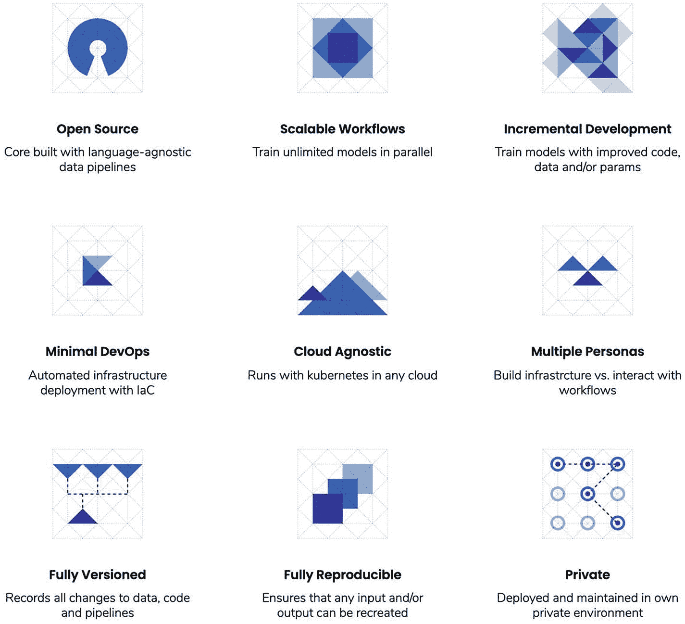
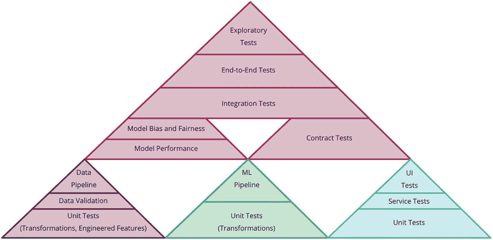
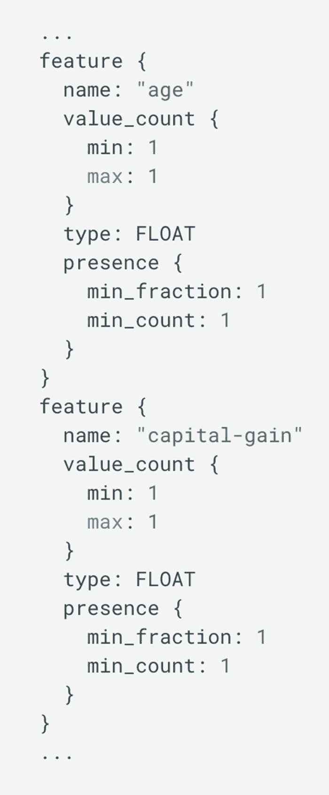
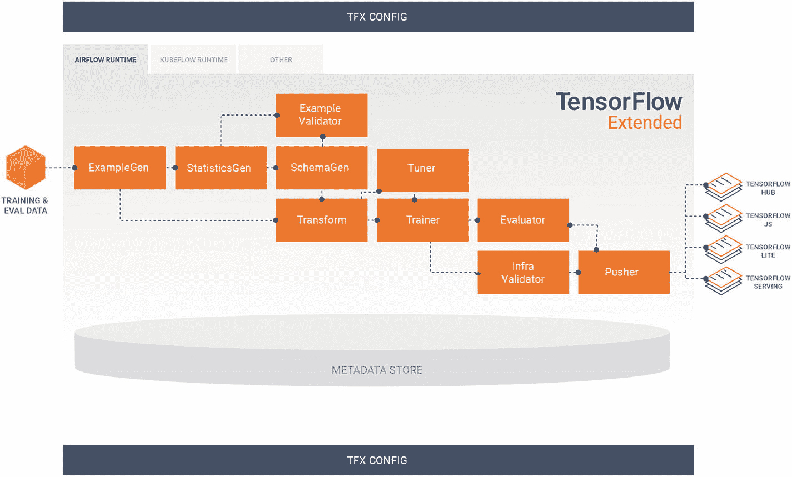
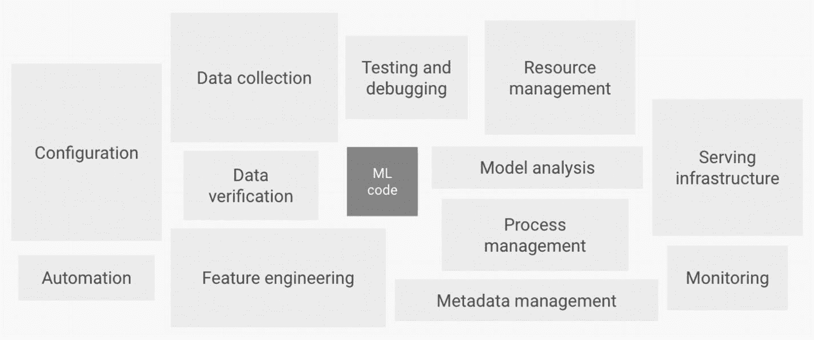
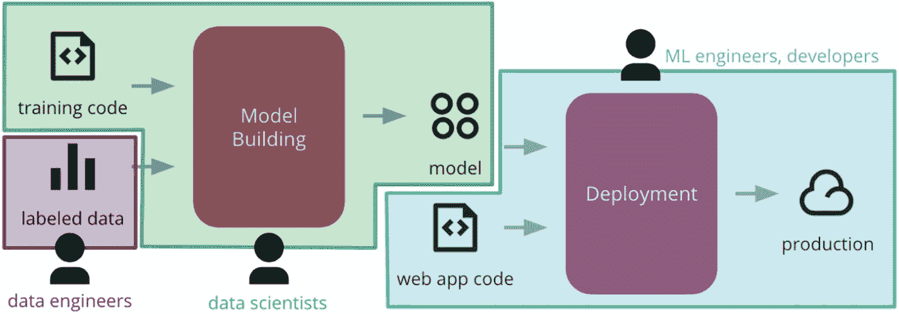
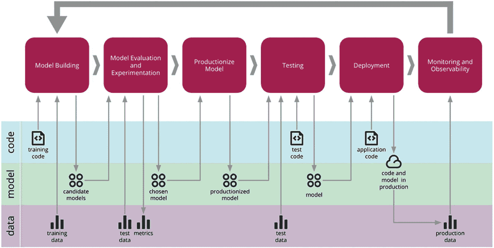

# 6.生产中的机器学习

现在，您有望更舒适地尝试机器学习，并使用不同的模型和输入构建应用程序，让我们谈谈将机器学习模型和系统投入生产的不同方面。

图 6-8

混沌的特征。来源:[https://ki-labs . com/kaos/# features](https://ki-labs.com/kaos/%2523features)

图 6-7

测试金字塔示例。来源: [`https://martinfowler.com/articles/cd4ml.html`](https://martinfowler.com/articles/cd4ml.html)

图 6-6

机器学习系统的组件。来源: [https:// cloud。谷歌。com/solutions/machine-learning/mlops-机器学习中的连续交付和自动化管道](https://cloud.google.com/solutions/machine-learning/mlops-continuous-delivery-and-automation-pipelines-in-machine-learning)

图 6-5

示例模式。来源:[www . tensor flow . org/tfx/guide/schema gen](https://www.tensorflow.org/tfx/guide/schemagen)

图 6-4

标准 TFX 管道公司

图 6-3

机器学习系统的组件。来源: [https:// cloud。谷歌。com/solutions/machine-learning/mlops-机器学习中的连续交付和自动化管道](https://cloud.google.com/solutions/machine-learning/mlops-continuous-delivery-and-automation-pipelines-in-machine-learning)

图 6-2

每个阶段的工程师类型。

图 6-1

机器学习的连续交付阶段。来源: [`https://martinfowler.com/articles/cd4ml.html`](https://martinfowler.com/articles/cd4ml.html)

在我们开始之前，重要的是要知道，本章不会深入探讨如何使用 Kubernetes 集群、配置负载平衡器等来自己建立机器学习管道，因为这通常是开发人员或基础架构团队承担的任务。然而，了解生产机器学习模型带来的挑战是很重要的，因此我们将解释其中的一些挑战，并介绍一些不同的工具，如果您没有机会与专门的团队合作，这些工具应该可以帮助您在生产应用程序中添加机器学习。

## 6.1 挑战

将机器学习投入生产会带来一系列不同于我们迄今可能遇到的挑战。

在本书中我们构建的个人项目中，我们是唯一的用户，我们在本地运行所有的东西。我们更多的是在概念验证阶段。在生产中，不仅一个应用程序会被成百上千甚至上百万的用户使用，它也会被多个团队构建。因此，您的系统必须能够适应和处理更多的挑战。

### 可扩展性

将机器学习模型投入生产的目的是使其成为您的用户每天与之交互的应用程序的一部分。因此，它应该能够处理潜在的大量请求。

无论是对于初创公司还是大型公司，运行机器学习模型都需要大量的 CPU、GPU 和 RAM，这意味着你必须确保你的系统能够支持所有用户运行模型。

### 6.1.2 高可用性

您已经开发的和将要开发的大多数 web 应用程序都应该是全天候可用的，以满足用户的需求。

如果您决定将机器学习模型添加到这些系统中，它们还需要具有高可用性。

无论您是决定更新模型、将其扩展到更广泛的受众，还是测试新工具，确保模型在您进行实验时仍能正常运行都是非常重要的。

### 可观察性

我们工作的系统非常不稳定。事情可能在很多方面变化很快。当您发布新功能时，您的用户界面会发生变化，不同地理位置可能会出现用户高峰，第三方提供商可能会失败，等等。

这种波动性意味着应该密切关注模型及其预测。这不仅是为了验证模型没有产生预测失败，也是为了定期检查输入和输出是否正确。

### 可重用性

根据您已经构建并在应用程序中运行的模型，考虑它们的可重用性有时很重要。

例如，booking.com 公司在生产中运行多个模型，其中一个用于确定酒店是否适合家庭入住。

基于不同的标准，模型可以在酒店的详细信息页面中突出显示家庭友好型酒店，或者作为结果页面中的过滤器。类似于不同的 UI 组件可以在前端应用程序中重用，构建您的模型以便它们可以在不同的页面上重用可以确保您充分利用它们。

创建和测试机器学习模型是一项耗时的任务，模型重用使这种投资更有成效。

此外，可重用性确保模型可以在面临类似问题的不同团队之间共享，并且可以避免浪费时间从头开始重新创建模型。

现在，我们已经简要介绍了生产机器学习模型所带来的一些挑战，让我们来看看 ML 项目的生命周期。

## 6.2 机器学习生命周期

下图是 Martin Fowler 推广的机器学习连续交付(CD4ML)概念的可视化指南。

在该图中，我们可以看到六个不同阶段的轮廓:

**模型构建**是关于理解问题、准备数据、提取特征、编写初始代码来创建模型。

**模型评估和实验**是关于选择特性、超参数调整、算法比较以及不同解决方案的整体实验。

**生产模型**是从实验或研究到准备部署的步骤。

**测试**关注于确保我们将要部署到产品中的模型和代码按照我们的预期运行，并且结果与在评估和实验的第二阶段观察到的结果相匹配。

**部署**将模型投入生产。

最后，m **监控和可观察性**是关于确保模型在生产环境中的行为符合预期。

标准软件项目生命周期和机器学习项目之间的主要区别之一是这些阶段应该重复的方式。

正如箭头所示，从最后一个阶段(监控和可观察性)回到第一个阶段(模型构建)，我们应该在看到模型在生产中的表现后，根据收集的信息对模型做出决策。

应根据此信息更新或放弃模型。

根据您的应用，您的模型需要定期用新数据重新训练，以避免过时。

例如，AutoScout24 这样一个帮助用户在线出售汽车的平台使用机器学习来预测人们应该出售汽车的价格范围，其基础是一些参数，包括品牌、生产年份和型号。

如果他们不定期用真实的用户数据重新训练他们的模型，他们的预测将很快过时，不能代表用户车辆在市场上的真实价值。因此，人们可能会低价出售或努力出售他们的汽车，因为价格没有根据当前的市场进行调整。

这个用新数据重新训练模型的循环可以手动或自动完成。

此外，并非所有这些阶段都必须由相同的工程师来执行。

模型构建和实验的前两个阶段可以和/或应该由数据科学家或机器学习工程师来完成。如下图所示，以下阶段应由具有将应用程序部署到生产环境的经验的 DevOps 工程师或软件工程师来完成。

看到这个生命周期的不同部分是如何被不同类型的工程师分开的，让我们开始讨论机器学习系统

## 6.3 机器学习系统

在这本书里，我们讲了很多关于如何使用预先训练好的模型，生成预测；然而，机器学习系统由更多的组件组成。

例如，如果您无法为您的应用程序找到预先训练的模型，并决定创建自己的模型，您还需要考虑数据收集、验证、特征提取和监控，如下图所示。

在生产中使用机器学习模型，需要你建立一定的流水线。

不仅您的模型需要服务，您还需要考虑如何收集新数据并重新训练您的模型，以便它不会过时，如何监控以及监控什么，等等。

幸运的是，您不需要自己构建所有这些组件。像 TensorFlow Extended (TFX)这样的平台提供了部署生产 ML 管道的端到端解决方案。

TFX 包括不同的组件，可以帮助您建立机器学习管道，如帮助您理解数据的 TensorFlow 数据验证，帮助您预处理数据并根据需要在格式之间转换的 TensorFlow 转换，以及用于支持模型版本控制并确保并发模型高性能的 TensorFlow。

使用此类平台的好处是，您的大部分 ML 管道可以在一个平台上建立，降低了设置和维护的复杂性，并能够利用 Google 专门团队的工作，让您对系统的性能和可靠性更有信心。

下面是一个典型的 TFX 管道的例子。

为了更好地了解 TFX 的功能，让我们来看一下每个组件:

*   首先， **ExampleGen** 是最初的输入组件，它使用外部文件并将数据接收到管道中。

*   **StatisticsGen** 负责计算将用于生成模式的数据集的统计数据。

*   **SchemaGen** 生成包含输入数据信息的模式，例如，每个要素的数据类型或该要素是否必须每次都存在。下图显示了一个模式的示例。

*   **示例验证器**用于识别训练数据中的异常。

*   **Transform** 将实际使用 SchemaGen 组件生成的模式，并对 ExampleGen 发出的数据执行特性工程，以生成一个 SavedModel 实例，该实例将由下面的组件使用。

*   **训练器**使用 Python TensorFlow API 训练模型。

*   **Tuner** 进行超参数调谐，这意味着它选择一组最佳参数用于模型。

*   **评估员**对您的模型结果进行分析，以确保它适合推向生产。

*   InfraValidator 负责验证模型服务基础设施中的模型。它启动一个带有模型的沙盒模型服务器，并检查它是否可以被加载和查询。

*   **Pusher** 是将经过验证的模型推送到部署目标的组件。

如果这看起来有点复杂，那是完全正常的。正如我在本章开始时提到的，我不期望任何阅读这本书的人能马上理解机器学习管道中需要的所有组件。

因为您不太可能必须自己设置一个，所以提供这些信息主要是为了让您在部署定制模型时了解设置系统所涉及的组件。

现在，我们简要地回顾了标准 TFX 管道的样子，让我们回过头来更广泛地讨论管道。建管道的必需品有哪些？

如果我们回头看看本节开始时的图像，创建模型的机器学习代码实际上代表了系统的一小部分。

剩下的由数据收集、自动化、测试、分析等元素组成，这里你需要将 DevOps 原理应用到 ML 系统中。

这种系统的工作方式类似于软件系统，因为您需要它可靠且开发周期短，但在以下方面有所不同:

**技能的多样性**:如果你在一个使用机器学习模型的生产应用上工作，你的团队可能会涉及需要与系统交互的数据科学家，但他们可能没有软件实践的经验或知识。你的系统必须考虑到这一点，拥有 ML 研究人员可以使用的组件。

**模型服务**:在生产中，似乎有三种不同的方式为模型服务。它既可以通过**嵌入式模型**来实现，在这种情况下，您可以将其视为与应用程序打包在一起的依赖关系；也可以通过**模型即服务(MAAS)** 来实现，在这种情况下，模型被包装在一个单独的服务中，可以独立地部署和更新；还可以通过**模型即数据**来实现，在这种情况下，模型也是独立的，但在运行时作为数据被接收。

**实验跟踪**:机器学习模型在推向生产之前要经过大量的实验，导致大量的代码被扔掉，永远无法部署。因此，记录正在进行的不同实验以避免重复是很重要的。

**监控**:即使监控和日志系统通常也用在标准软件项目中，但监控机器学习模型有点不同。我们不仅需要监控模型在给定输入数据的情况下生成预测，我们还需要使用以下度量来捕获关于我们的模型如何表现的数据—**模型输入**(跟踪什么数据被输入到模型中)**输出的可解释性**(了解模型如何进行预测)、模型输出本身，以及**模型公平性**(偏差分析输出)。

**测试**:机器学习工作流程中可以引入不同类型的测试。我们可以通过查看错误率和准确性来测试模型质量，通过将数据与生成的模式进行比较来测试数据的有效性，甚至尝试测试模型的偏差和公平性。以下是机器学习系统的测试金字塔示例。

尽管这种系统可能是基础设施团队的责任，但是作为开发人员，您仍然应该参与设置应用程序与模型交互的方式。

因此，您将不得不问自己如下问题:

*   如何编写一个从模型中生成预测的 API？

*   如何最好地将该 API 部署到生产中？

*   需要收集什么样的数据？

*   API 应该返回什么信息？

现在，我们已经简要介绍了机器学习系统的不同组件，让我们来看看目前可用的一些工具，以便在生产中更容易地使用机器学习。

## 6.4 工具

在这最后一节中，我们将快速介绍一些工具，如果您想在生产应用程序中添加机器学习而不必设置复杂的系统，可以使用这些工具。

### 预先训练的模型

希望在浏览完本书中的项目后，您能够熟悉如何在 TensorFlow.js 中使用预先训练的模型。

到目前为止，我们使用了 MobileNet 图像分类模型、PoseNet、毒性分类器、语音命令、Facemesh、Handpose 和问答模型；然而，还有几个。

事实上，如果你决定进一步探索，你会发现还存在一个面部标志检测模型，一个对象检测模型，一个身体分割模型，等等。

但是，预先训练的模型不一定要由 TensorFlow.js 团队开发才能与 TensorFlow.js 一起使用。

通常使用 Python 创建的 Keras 模型可以保存为不同的格式，并转换为 TensorFlow.js 图层格式，以便通过框架加载。

因此，如果您找到一个感兴趣的开源模型，请随时检查它是否可以转换为 TensorFlow.js 的格式，以便可以在 JavaScript 应用程序中加载它。

### 6.4.2 原料药

为了让开发人员更容易在生产应用程序中实现机器学习，亚马逊、谷歌和微软等技术公司一直致力于开发作为 API 提供的 ML 服务。

例如，亚马逊目前有多个服务 API，包括图像和视频分析、个性化推荐、实时翻译、高级文本分析、聊天机器人和防欺诈。

例如，亚马逊目前拥有的 API 包括

*   理解高级文本分析

*   自动化代码审查的代码专家

*   聊天机器人的 Lex

*   用于文档分析的摘录

*   防欺诈检测器

*   图像和视频分析的识别

*   用于文本到语音转换的 Polly

谷歌云提供的 API 包括

*   **视觉人工智能**:获取图像洞察力，检测物体、人脸和文本

*   **视频智能 API** :识别存储和流式视频中的对象、地点和动作

*   **语音转文本 API** :将语音准确转换成文本

微软有一套称为认知服务的工具，其 API 包括内容主持人服务、QnA Maker、可以根据音频识别和验证说话人的说话人识别服务，以及围绕图像和文本识别的类似 API。

### 6.4.3 服务平台

最后，如果您对构建和服务定制模型更感兴趣，这里有一些旨在简化定制模型的工具。

谷歌云人工智能平台以及亚马逊网络服务和微软为您提供更完整的解决方案，以服务于您的定制机器学习项目；然而，也可以找到其他模型服务平台，例如开源的 BentoML、Seldon 或 KI labs 的 kaos。

尽管团队可能倾向于依赖 Google、Microsoft 或 Amazon 的工具，但这些平台通常不会给你选择工具的自由。他们针对自己产品的使用进行优化，有时会使与其他第三方工具的集成变得复杂。

此外，根据您的应用程序的大小，使用这些平台可能是过度工程化的。

总的来说，在生产机器学习模型时，有多种选择。然而，由于这仍然是大多数公司没有做的事情，标准还没有设定，可能会发展。因此，如果这是一个你有兴趣了解更多的领域，你一定要做一些额外的研究和实验。