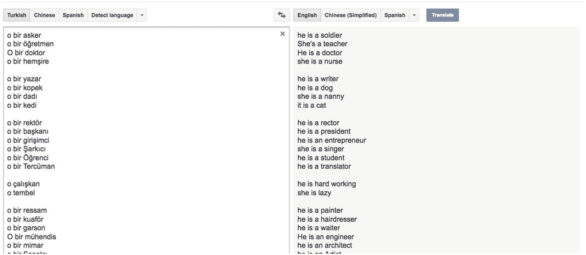
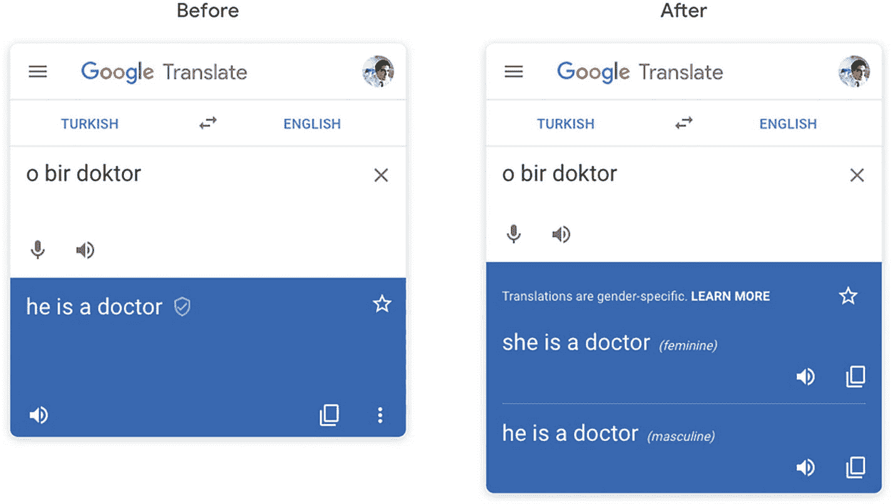
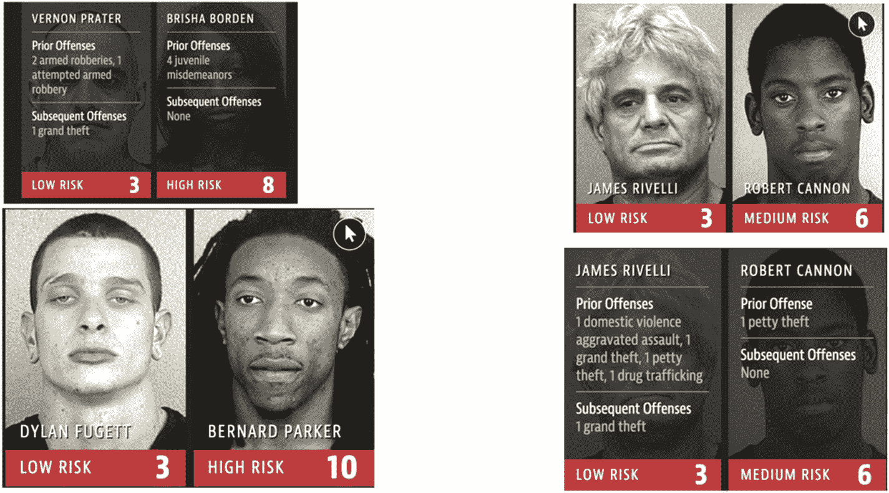

# 七、机器学习中的偏差

在我看来，如果不提到机器学习中的偏见这个话题，这本书就不完整。

当我们赋予计算机生成预测的能力，并在人们将与之交互的生产应用中依赖它们时，花一些时间思考使用这项技术的后果和影响是至关重要的。

在最后一章中，我们将讨论不同类型的偏差，为什么这是一个问题，以及在我们的机器学习系统中可以做些什么来最小化它。

## 7.1 什么是偏见？

如果我们参考《牛津词典》的定义，偏见是

> *一种支持或反对一群人或争论中一方的强烈情绪，通常不是基于公正的判断。*
> 
> —引用来源: [`www.oxfordlearnersdictionaries.com/definition/english/bias_1?q=bias`](http://www.oxfordlearnersdictionaries.com/definition/english/bias_1%253Fq%253Dbias)

谈到数据科学，可能会有不同类型的偏见，包括

*   **确认** **偏差**:当执行数据分析的人想要证明一个预先确定的假设，并有意从分析中排除特定的变量，直到得出想要的结论时，就会发生这种情况。

*   **选择偏倚或样本偏倚**:当使用的数据样本不能很好地反映总体时，就会出现这种情况。

*   **偏见**:受文化或其他刻板印象影响的训练数据的结果。例如，如果我们训练一个算法来根据网上找到的图像识别工作中的人，例如，他们中的许多人显示男人在编码，女人在厨房。因此，该模型将预测男性更可能是程序员，女性更可能是厨师，这是不正确的，并且复制了网上发现的偏见。

如果你不熟悉机器学习中的偏见这个话题，你可能会想为什么这是一个问题。

人类在许多方面都有偏见；我们可以对可能导致歧视的人或情况做出毫无根据的假设。然而，当这种偏见成为我们日常生活中使用的产品或系统，并发展为为我们和关于我们做出决定时，这可能会产生不可忽视的可怕的广泛后果。

让我们看一些例子。

## 7.2 机器学习中的偏差示例

在接下来的几页中，我们将看两个有偏见的机器学习模型在实际应用中使用的例子。

### 7.2.1 性别偏见

几年前，谷歌翻译因揭示算法的性别偏见而成为新闻。当将一些单词从土耳其语翻译成英语时，涵盖土耳其语中每一种单数第三人称的代词“o”被翻译成英语中的性别代词，导致以下有偏见的结果。

图 7-1

谷歌翻译显示有偏见的结果

正如您在前面的图像中所看到的，即使土耳其语没有为每个术语指定特定的性别，Google Translate 也会猜测特定的性别，从而导致一些刻板印象，例如将单词“doctor”与代词“he”匹配，将单词“nurse”与“she”匹配。

谷歌现在更新了他们的算法，试图通过显示一个单词的阴性和阳性翻译来防止这种偏见的发生。

图 7-2

谷歌翻译显示多个代词的结果

尽管这是一种改进，但错误不一定出在算法本身，而很可能是因为用于训练它的数据可能包含有偏见的信息。

此外，显示“她”和“他”代词没有考虑到使用代词“他们”的人，为了实现更好的公平性，应该包括他们。

### 7.2.2 种族偏见

在过去几年中，有偏见的机器学习算法最有影响力的例子之一是由人工智能驱动的软件 COMPAS。

法官在法庭上使用该软件进行风险评估，并根据对 137 个调查问题的回答预测哪些罪犯最有可能再次犯罪。

使用这种算法的问题是，人们发现，当它的预测出错时，结果对黑人和白人罪犯的显示是不同的。

黑人罪犯被标记为高风险，尽管他们再次犯罪的可能性较低，而白人罪犯被标记为低风险，尽管他们再次犯罪的可能性较高。

图 7-3

COMPAS 软件结果

事实上，这种错误的预测被用于司法系统已经是一个严重的问题，但它的使用规模使这更加令人担忧。

考虑到美国每年监禁大量的人，人们只能想象错误定罪的数量。

此外，由于 COMPAS 背后的公司 Northpointe 拒绝透露他们算法的细节，这使得研究人员无法评估其不公平的程度。

这只是机器学习算法中可能引入偏差的两个例子。不幸的是，还有很多，我建议更深入地探讨这个话题。

## 7.3 潜在解决方案

尽管机器学习中的偏见无法完全根除，但有一些选项可以将其最小化。

### 7.3.1 描述问题

在建立模型和生成预测之前，数据科学家需要决定他们要解决什么问题。在这个阶段已经可以发现一些偏差。如果你正在为一家希望自动评估人们“信用度”的信贷公司建立一个模型，那么已经有一些围绕这个概念做出的决定，这个概念定义了一个值得获得信贷的人，这可能会嵌入一些不公平和歧视。

例如，一家公司可以决定它希望最大化其利润率，这意味着信誉将取决于客户的富裕程度，因为他们可能会签订更大的贷款合同。否则，它也可以决定，无论客户能否负担得起，它宁愿专注于最大限度地提高合同贷款的金额。

总的来说，问题在于这样一个事实，即这些决策是在考虑商业目标而不是公平的情况下做出的，尽管它们最终会在许多方面影响现实中的人们。

如果一种算法预测给予次级贷款是一种利润最大化的有效方式，那么该公司最终会从事掠夺性行为，即使这不是其直接意图。

### 收集数据

这可能是偏见如何进入机器学习模型的一个更常见的例子，并可能以两种方式出现。

#### 对现实的不正确描述

你可能听说过收集不代表现实的数据导致机器学习模型产生不正确预测的情况。

例如，在人脸识别中，如果一个算法使用更多的代表浅肤色人脸的图像来训练，而不是深肤色人脸，则创建的模型必然会更好地识别浅肤色人脸。

为了防止这种歧视，在将你正在使用的数据输入算法之前对其进行分析，会让你了解它的质量，以及它在生成更公平的预测方面的潜力。

一般来说，如果你决定使用一个预先训练好的模型，应该有一个链接供你查看所使用的数据集。如果你找不到，我会向分享模型的公司或个人索取。

如果你无法验证数据的质量，我建议你去找一个不同的模型。

如果您找到了原始数据集，并注意到它缺乏多样性，不能很好地代表现实，您可以决定不使用使用此数据训练的模型，或者您可以决定利用它，收集一些额外的、更多样化的数据，并应用迁移学习来生成一个新的、偏差较小的模型，以便在您的应用程序中使用。

如果你选择收集自己的数据，而不依赖于一些现有的模型，我建议从分析多样性在你的特定情况下意味着什么开始，你的模型将解决什么问题，它将用于谁，你计划使用什么来源来收集数据，这些来源是否代表现实，等等。

分析工作对于尽早提出潜在的问题或担忧，以及建立一个能够最大限度地减少偏见持续存在的模型至关重要。

#### 对现存偏见的反思

收集数据的第二个问题是使用包含现有偏见的数据。

一些公司使用他们的一些内部历史数据来训练机器学习模型，以自动化任务。

例如，几年前的 2018 年，亚马逊意识到他们的内部人工智能招聘工具对女性有偏见。

他们利用过去 10 年收集的工作申请数据，对新求职者进行 0 到 5 星的评分。然而，由于在亚马逊工作的大多数人是男性，该模型推断男性候选人更受欢迎。

查看历史招聘数据并分析数千份简历，该模型的逻辑是，亚马逊不喜欢包含“女性”一词的简历。

结果，任何包含这个词的简历，例如，“女队队长”或“在女子大学学习过”，都比没有提到这个词的简历得分低。

尽管这在 2018 年成为新闻，但亚马逊已经意识到，自 2015 年以来，其新系统并没有以性别中立的方式对候选人进行评级。

防止这种歧视的一种方法与前面的章节有关，即分析您正在使用的数据。数据是内部的这一事实并不意味着它是无偏见的。然而，考虑到这些数据是在过去 10 年中收集的，我们同意这可能是太多的数据而无法手动分析。我仍然建议收集一组随机样本，让人们评估它们的公平性和多样性。

此外，当在像招聘这样重要的任务中使用一个模型时，我希望在使用它之前对模型进行一些测试。招聘中的偏见是一个众所周知的问题，可以有多种形式。因此，如果你决定建立或使用一个依赖于机器学习的招聘软件，我会建议针对不同的偏见进行测试，从性别到教育背景，到种族，等等。

### 数据准备

另一个可能引入偏差的地方是准备数据时。即使您已经分析了您的数据，并确保它是多样化的，并代表了它将被用于的环境的现实，准备阶段也需要一些关注。

这个阶段包括选择您希望算法在学习和生成预测时考虑的属性，可以将其描述为一门艺术而非科学。

通常，需要对属性和参数进行一些实验来微调模型。

然而，您还需要确保达到高精度不会带来偏差。虽然试验属性对准确性的影响是可测量的，但它对偏差的影响是不可测量的。

在亚马逊的招聘工具中，属性可以是候选人的性别、教育水平、经验年限、编程语言、地理位置等等。

例如，为了雇用某人作为工程师，一个人的性别根本不重要，因此应该省略作为训练模型的属性。

一个人的地理位置只有在公司不能赞助重新安置的签证时才重要。

因此，为了最大限度地实现公平，经过训练对候选人进行排名的模型应该考虑影响他们技能水平的属性，包括多年的经验和编程语言。

它也可以使用教育水平，但这可能会对那些有幸接受高等教育的人产生一些偏见。

在科技行业，许多非常优秀的开发人员并没有获得计算机科学学位，因此将此作为一种属性可能会导致人们的排名下降，即使在实践中，他们拥有正确的技能，会成为优秀的员工。

希望这个例子展示了数据准备阶段的重要性，不管你是否已经花了一些时间来确保你使用的数据集是多样化的。

### 团队的多样性

最后，最小化机器学习中的偏差也在于开发模型的团队的组成。

我们都有偏见，减轻多样性不足的一个有效方法是提高团队的多样性。

你可以想象，如果研究面部识别模型的团队包括更多非白人，那么在面部识别模型中发现的问题就可以避免。

这不仅有助于测试模型的预测，以确保它们在不同的人脸集上的准确性，还可以改善整个过程。

前几个阶段提出问题、收集和准备数据将受益于不同背景、生活经历等的人。潜在的问题可以在早期提出，并影响更公平的模型的开发，同时仍然朝着高准确性努力。

这不仅是一个道德挑战，也是一个技术挑战。如果面部识别模型在用于浅色皮肤的人时基本准确，那么它到底有多好？如果机器学习的目标是开发具有最高精确度的模型，那么真正的技术挑战是在多样化的样本集上的高精确度。

## 7.4 挑战

不幸的是，尽管前一节陈述了一些减少机器学习中偏差的潜在解决方案，但这个问题很难解决，而且可能还会存在一段时间。

在本节中，我们将经历一些减少偏见的挑战。

**未知数**

不清楚偏差是从哪里引入系统的。即使使用不同的数据集，也要确保使用不会改变预测公平性的属性；有时很难理解一个模型是如何产生某种结果的。

在亚马逊及其性别偏见招聘工具的案例中，一旦他们意识到模型选择了“女性”这样的词来降低候选人的排名，他们就会更新模型，忽略明显带有性别的词；然而，这还不够。他们后来发现，更新后的系统仍然能够识别男性简历中更常见的隐含性别的单词，如“执行”和“捕获”，并以此来做决定。

**公平是相对的**

机器学习偏见的另一个挑战是，并非每个人都同意什么是公平或不公平的。不幸的是，在人工智能的技术方面比伦理方面做了更多的工作，所以在设计伦理人工智能应用程序时，目前还没有真正的标准，法规和政策。

当涉及到开发其他公司也可以决定采用的人工智能解决方案时，一些公司如谷歌正在分享他们的原则；然而，这些不应被视为法规。例如，到目前为止，谷歌的人工智能原则包括人工智能应用的以下目标:

*   对社会有益

*   避免制造或强化不公平的偏见

*   为了安全而制造和测试

*   对人们负责

*   融入隐私设计原则

*   坚持科学卓越的高标准

*   可用于符合这些原则的用途

即使这些是一个良好的开端，我们也应该希望政府能够很快围绕机器学习模型的开发和使用以及如何评估其公平性提供真正的监管，这样我们就可以希望避免有偏见的系统的广泛实施。

在这一章中，我们简要介绍了一些使用有偏见的机器学习模型的情况和后果，以及一些可能的解决方案。

如果你有兴趣更多地了解这个话题，我强烈推荐你阅读凯茜·奥尼尔的《数学毁灭的武器》和萨菲亚·诺布尔的《压迫的算法》这两本书，这两本书的作者更深入地探讨了这个有趣的话题。