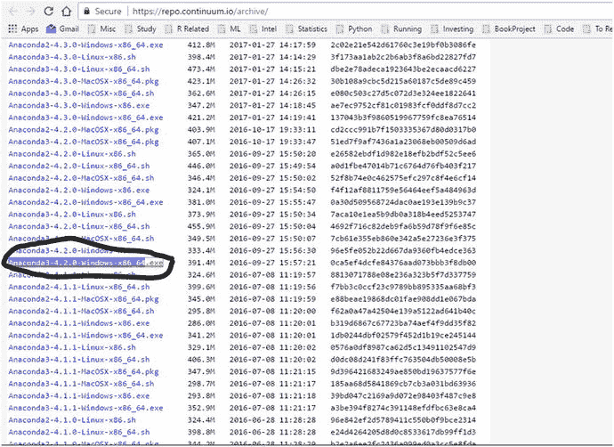
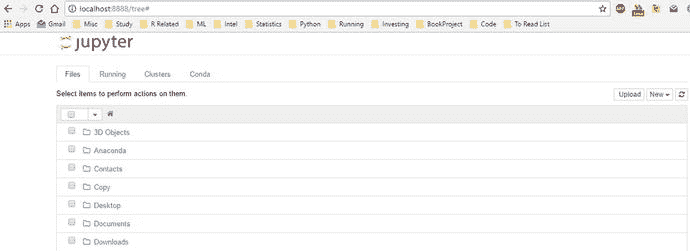
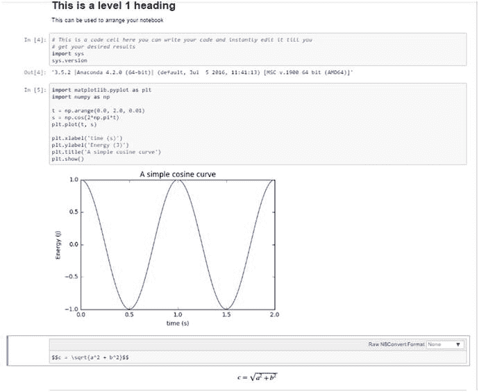
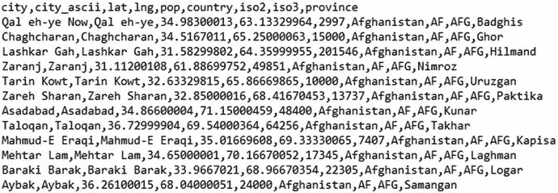
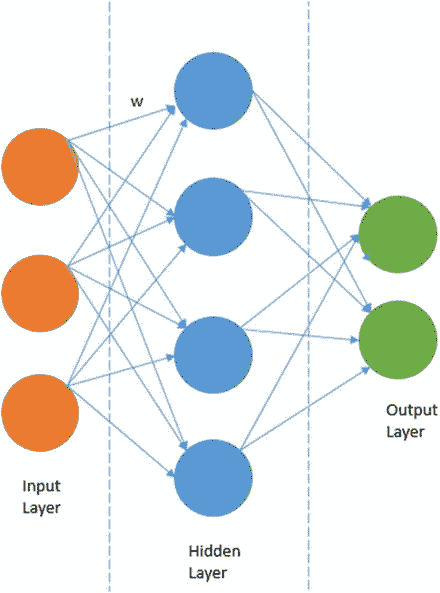
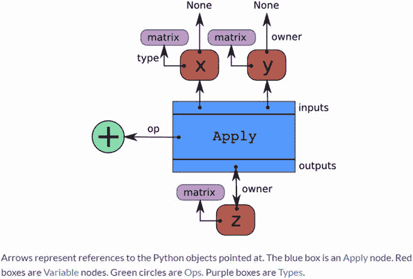
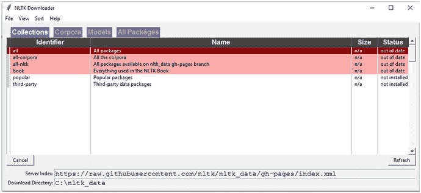

# 2.Python 机器学习生态系统

在第一章中，我们探索了机器学习的绝对基础，并研究了一些我们可以使用的算法。机器学习是当今技术世界中非常流行和相关的话题。因此，在编程语言和框架方面，我们对机器学习有非常多样的支持。几乎所有流行语言都有机器学习库，包括 C++、R、Julia、Scala、Python 等。在这一章中，我们试图证明为什么 Python 是机器学习的合适语言。一旦我们从逻辑上论证了我们的选择，我们将向您简要介绍 Python 机器学习(ML)生态系统。这个 Python ML 生态系统是一个库的集合，使开发人员能够提取和转换数据，执行数据争论操作，应用现有的健壮的机器学习算法，还可以轻松地开发定制算法。这些库包括`numpy`、`scipy`、`pandas`、`scikit-learn`、`statsmodels, tensorflow, keras`等等。我们简要地介绍了其中的几个库，以便用户对每个库的基础知识有所了解。这些将在本书后面的章节中广泛使用。这里要记住的一件重要事情是，本章的目的是让你熟悉 Python ML 生态系统中的各种框架和库，从而了解什么可以用来解决机器学习问题。我们通过有用的链接丰富了内容，您可以参考大量的文档和教程。我们假设您对 Python 和编程有一些基本的了解。本章中使用的所有代码片段和示例都可以在本书的 GitHub 资源库中获得，该资源库位于第 [2](02.html) 章的目录/文件夹下的 [`https://github.com/dipanjanS/practical-machine-learning-with-python`](https://github.com/dipanjanS/practical-machine-learning-with-python) 。您可以参考名为`python_ml_ecosystem.py`的 Python 文件来获得本章中使用的所有示例，并在阅读本章时尝试这些示例，或者您甚至可以参考名为`The Python Machine Learning Ecosystem.ipynb`的 jupyter 笔记本来获得更具交互性的体验。

## Python:简介

Python 是由吉多·范·罗苏姆在荷兰的 sticht ing Mathematisch Centrum(CWI，见 [`https://www.cwi.nl/`](https://www.cwi.nl/) )创建的。Python 的第一个版本发布于 1991 年。Guido 写 Python 作为 ABC 语言的继承者。在接下来的几年里，Python 已经发展成为一种广泛使用的高级语言和通用编程语言。Python 是一种解释语言，这意味着 Python 程序的源代码被转换成字节码，然后由 Python 虚拟机执行。Python 不同于 C 和 C++等主流编译语言，因为 Python 代码不需要像这些语言的代码那样构建和链接。这种区分有两个要点:

*   Python 代码开发速度很快:因为不需要编译和构建代码，所以 Python 代码可以很容易地修改和执行。这有助于加快开发周期。
*   Python 代码执行速度不快:由于代码不是直接编译和执行的，而且 Python 虚拟机的附加层负责执行，因此与 C、C++等传统语言相比，Python 代码运行速度稍慢。

### 强项

根据一些调查和研究，Python 在广泛使用的编程语言中稳步上升；它是世界上第五重要的语言。最近几项调查显示 Python 是机器学习和数据科学最流行的语言！我们将汇编一个 Python 提供的优势的简要列表，这可能解释了它的流行。

1.  易学:Python 是一种相对易学的语言。它的语法对于初学者来说很容易学习和理解。与 C 或 Java 等语言相比，执行 Python 程序所需的样板代码最少。
2.  支持多种编程范式:Python 是一种多范式、多用途的编程语言。它支持面向对象编程、结构化编程、函数式编程，甚至面向方面编程。这种多功能性允许它被众多的程序员使用。
3.  可扩展:Python 的可扩展性是其最重要的特性之一。Python 有大量容易获得的模块，可以很容易地安装和使用。这些模块涵盖了编程的各个方面，从数据访问到流行算法的实现。这个易于扩展的特性确保 Python 开发人员更有效率，因为大量的问题可以通过可用的库来解决。
4.  活跃的开源社区:Python 是开源的，并得到了大型开发者社区的支持。这使得它具有鲁棒性和适应性。遇到的 bug 很容易被 Python 社区修复。作为开源软件，如果开发人员的需求需要，他们可以修改 Python 源代码。

### 陷阱

尽管 Python 是一种非常流行的编程语言，但它也有自己的缺陷。它遭受的最重要的限制之一是在执行速度方面。作为一种解释型语言，它比编译型语言要慢。在需要极高性能代码的情况下，这种限制可能有点限制性。这是 Python 未来实现的一个主要改进领域，每个后续的 Python 版本都会解决这个问题。虽然我们不得不承认它永远不可能像编译语言一样快，但我们确信它通过在其他部门的超级高效和有效来弥补这一不足。

### 设置 Python 环境

我们进入数据科学世界的第一步是设置我们的 Python 环境。我们通常有两种设置环境的选择:

*   分别安装 Python 和必要的库
*   使用预打包的 Python 发行版，附带必要的库，例如 Anaconda

Anaconda 是 Python 和一整套各种库的打包汇编，包括广泛用于数据科学的核心库。它由 Anaconda 开发，以前称为 Continuum Analytics，通常是数据科学家的首选设置。特拉维斯·奥列芬特是`numpy`和`scipy`图书馆的主要贡献者，也是 Anaconda 的总裁和联合创始人之一。Anaconda 发行版是 BSD 许可的，因此它允许我们将它用于商业和再发行目的。这个发行版的一个主要优点是我们不需要复杂的设置，它可以在各种操作系统和平台上很好地工作，尤其是 Windows，这通常会导致安装特定 Python 包的问题。因此，只需一次下载和安装，我们就可以开始我们的数据科学之旅。Anaconda 发行版在行业数据科学环境中得到了广泛的应用，它还附带了一个出色的 IDE Spyder(科学 Python 开发环境)，以及其他有用的工具，如 jupyter 笔记本、IPython 控制台和优秀的包管理工具`conda`。最近他们还广泛讨论了 Jupyterlab，Jupyter 项目的下一代 UI。我们推荐使用 Anaconda 发行版，也可以查看 [`https://www.anaconda.com/what-is-anaconda/`](https://www.anaconda.com/what-is-anaconda/) 来了解更多关于 Anaconda 的信息。

#### 设置 Anaconda Python 环境

用所需的 Anaconda 发行版设置您的环境的第一步是从 Anaconda 发行版的提供商 [`https://www.anaconda.com/download/`](https://www.anaconda.com/download/) 下载所需的安装包。这里需要注意的重要一点是，我们将使用 Python 3.5 和相应的 Anaconda 发行版。Python 3.5.2 发布于 2016 年 6 月，而 3.6 发布于 2016 年 12 月。我们选择了 3.5，因为我们想确保我们在本书中使用的库没有任何兼容性问题。因此，由于 Python 3.5 已经存在了很长时间，我们通过选择它来避免任何这样的兼容性问题。然而，你可以自由使用 Python 3.6，本书中使用的代码应该不会有大的问题。我们选择忽略 Python 2.7，因为对 Python 2 的支持将在 2020 年结束，从 Python 社区的角度来看，Python 3 显然是未来的趋势，我们建议您使用它。

从 [`https://repo.continuum.io/archive/`](https://repo.continuum.io/archive/) 下载`Anaconda3-4.2.0-Windows-x86_64`包(Python 3.5 的那个)。目标页面截图如图 [2-1](#Fig1) 所示。我们特别选择了 Windows 操作系统，因为有时很少 Python 包或库会导致安装或运行问题，因此我们希望确保涵盖这些细节。如果您正在使用任何其他操作系统，如 Linux 或 MacOSX，请下载并安装适合您的操作系统的正确版本。



图 2-1。

Downloading the Anaconda package

安装下载的文件就像双击文件一样简单，让安装程序负责整个过程。要检查安装是否成功，只需打开命令提示符或终端并启动 Python。您应该会看到如图 [2-2](#Fig2) 所示的消息，该消息标识了 Python 和 Anaconda 版本。我们还建议您使用 iPython shell(命令是`ipython`)而不是常规的 Python shell，因为您可以获得许多特性，包括内联绘图、自动完成等等。


图 2-2。

Verifying installation with the Python shell

这应该完成了为数据科学和机器学习设置 Python 环境的过程。

#### 安装库

我们将不涉及 Python 的基础知识，因为我们假设您已经熟悉了基本的 Python 语法。请随意查阅任何关于 Python 编程的标准课程或书籍，以掌握基础知识。我们将讨论安装附加库的一个非常基本但非常重要的方面。在 Python 中，安装额外库的首选方式是使用`pip`安装程序。使用`pip`从 Python 包索引(PyPI)安装包的基本语法如下。

```py
pip install required_package

```

如果 PyPI 中有`required_package`，这将安装它。我们也可以使用 PyPI 之外的其他资源来安装包，但这通常不是必需的。Anaconda 发行版已经补充了大量的附加库，因此我们不太可能需要来自其他来源的附加包。

另一种安装包的方法(仅限于 Anaconda)是使用`conda install`命令。这将从 Anaconda 包通道安装包，通常我们推荐使用这种方式，尤其是在 Windows 上。

### 为什么数据科学要用 Python？

根据 stack overflow([`https://insights.stackoverflow.com/survey/2017`](https://insights.stackoverflow.com/survey/2017))2017 年的一项调查，Python 是世界上第五大使用语言。它是数据科学家使用的三大语言之一，也是 StackOverflow 用户最“想要”的语言之一。事实上，在 2017 年 KDnuggets 最近的一次民意调查中，Python 获得了最多的票数，因为它是基于用户选择的分析、数据科学和机器学习的领先平台( [`http://www.kdnuggets.com/2017/08/python-overtakes-r-leader-analytics-data-science.html`](http://www.kdnuggets.com/2017/08/python-overtakes-r-leader-analytics-data-science.html) )。Python 有很多优势，这使得它成为数据科学实践的首选语言。我们现在将尝试说明这些优势，并讨论我们的案例“为什么 Python 是数据科学家的首选语言？”

#### 强大的软件包集

Python 以其广泛而强大的软件包集而闻名。事实上，Python 共享的理念之一是包含电池，这意味着 Python 有一套丰富而强大的包，可以在各种领域和用例中使用。这种哲学被扩展到数据科学和机器学习所需的包中。像`numpy`、`scipy`、`pandas`、`scikit-learn`等包。，它们是为解决各种现实世界的数据科学问题而定制的，功能非常强大。这使得 Python 成为解决数据科学相关问题的首选语言。

#### 简单快速的原型制作

当我们要讨论 Python 对于数据科学的适用性时，python 的简单性是另一个重要方面。Python 语法既容易理解又地道，这使得理解现有代码成为一项相对简单的任务。这使得开发人员可以轻松地修改现有的实现并开发自己的实现。这个特性对于开发新算法特别有用，这些新算法可能是实验性的，或者还没有得到任何外部库的支持。基于我们之前讨论的，Python 开发独立于耗时的构建和链接过程。使用 REPL 外壳、ide 和笔记本，您可以快速构建和迭代多个研发周期，并且所有的更改都可以很容易地进行和测试。

#### 易于协作

数据科学解决方案很少是一个人的工作。通常，数据科学团队需要大量协作来开发一个出色的分析解决方案。幸运的是，Python 提供的工具使得多元化团队的协作变得极其容易。jupyter 笔记本是最受欢迎的功能之一，它为这一合作提供了动力。笔记本是一个新概念，它允许数据科学家在一个地方共享代码、数据和有见地的结果。这是一个易于复制的研究工具。我们认为这是一个非常重要的特性，并将用整整一节来介绍使用笔记本电脑的好处。

#### 一站式解决方案

在第一章中，我们探讨了数据科学作为一个领域是如何与各个领域相互联系的。一个典型的项目将有一个迭代的生命周期，包括数据提取、数据操作、数据分析、特征工程、建模、评估、解决方案开发、部署和解决方案的持续更新。Python 作为一种多用途编程语言是极其多样化的，它允许开发人员在一个公共平台上处理所有这些不同的操作。使用 Python 库，您可以使用来自多个来源的数据，对这些数据应用不同的数据处理操作，对处理后的数据应用机器学习算法，以及部署开发的解决方案。这使得 Python 非常有用，因为不需要接口，也就是说，您不需要将整个管道的任何部分移植到一些不同的编程语言。此外，企业级数据科学项目通常需要与不同的编程语言进行交互，这也可以通过使用 Python 来实现。例如，假设一些企业使用定制 Java 库进行一些深奥的数据操作，那么您可以使用 Python 的 Jython 实现来使用该 Java 库，而无需为接口层编写定制代码。

#### 大而活跃的社区支持

Python 开发者社区非常活跃，数量庞大。这个庞大的社区确保了核心 Python 语言和包保持高效和无 bug。开发人员可以使用各种平台来寻求关于 Python 问题的支持，比如 Python 邮件列表、堆栈溢出、博客和 usenet 群组。这个庞大的支持生态系统也是 Python 成为数据科学青睐语言的原因之一。

## 介绍 Python 机器学习生态系统

在本节中，我们将讨论 Python 机器学习生态系统的重要组成部分，并对每个部分进行简单介绍。这些组件是 Python 成为数据科学重要语言的部分原因。本节旨在向您简要介绍并让您熟悉这些核心数据科学库。深入讨论它们是不切实际的，也超出了当前的范围，因为我们将在后面的章节中详细讨论它们。拥有一个庞大的 Python 开发人员社区的另一个好处是，通过简单的搜索就可以找到关于每个库的丰富内容。我们涵盖的组件列表绝非详尽无遗，但我们已根据它们在整个生态系统中的重要性将其列入候选名单。

### jupyter 笔记型电脑

Jupyter 笔记本，以前称为 ipython 笔记本，是一个交互式计算环境，可用于开发基于 python 的数据科学分析，强调可重复的研究。交互式环境对于开发来说是非常棒的，它使我们能够很容易地共享笔记本，从而在能够自己复制我们的研究和分析的同行之间共享代码。这些 jupyter 笔记本可以包含代码、文本、图像、输出等。，并且可以以逐步的方式排列，以给出整个分析过程的完整的逐步说明。这种功能使笔记本成为可重复分析和研究的宝贵工具，尤其是当您想要与同事分享您的工作时。在发展你的分析时，你可以记录你的思考过程，并将结果作为笔记本的一部分。文档、代码和结果的无缝结合使 jupyter 笔记本成为每个数据科学家的宝贵工具。

我们将使用 jupyter 笔记本，这是我们的 Anaconda 发行版默认安装的。这类似于 ipython shell，不同之处在于它可以用于不同的编程后端，即不仅仅是 python。但是这两者的功能是相似的，在 jupyter 笔记本上显示交互式可视化和更多的优点。

#### 安装和执行

我们不需要额外安装 Jupyter 笔记本，因为它已经被 Anaconda 发行版安装了。我们可以通过在命令提示符或终端执行以下命令来调用 jupyter 笔记本。

```py
C:\>jupyter notebook

```

这将在您机器的地址`localhost:8888`启动一个笔记本服务器。这里需要注意的重要一点是，您使用浏览器访问笔记本，因此您甚至可以在远程服务器上启动它，并使用 ssh 隧道等技术在本地使用它。如果您有一个只能远程访问但缺少 GUI 的强大计算资源，这个特性就非常有用。Jupyter notebook 允许您在一个可视化的交互式外壳中访问这些资源。一旦您调用该命令，您可以在浏览器中导航到地址`localhost:8888`，找到图 [2-3](#Fig3) 所示的登录页面，该页面可用于访问现有笔记本或创建新笔记本。



图 2-3。

Jupyter notebook landing page

在登录页面上，我们可以通过单击右上角的“新建”按钮来创建一个新笔记本。默认情况下，它将使用默认内核(即 Python 3.5 内核)，但我们也可以将笔记本与不同的内核相关联(例如 Python 2.7 内核，如果安装在您的系统中)。笔记本只是细胞的集合。笔记本中有三种主要类型的单元格:

1.  代码单元:顾名思义，这些是可以用来编写代码和相关注释的单元。这些单元的内容被发送到与笔记本相关联的内核，并且计算出的输出被显示为单元的输出。
2.  Markdown 单元格:Markdown 可以用来智能地表示计算过程。这些可以包含简单的文本注释、HTML 标签、图像，甚至 Latex 方程。当我们处理一个新的和非标准的算法，并且我们还想捕获与算法相关的逐步数学和逻辑时，这些将非常方便。
3.  原始单元格:这些是最简单的单元格，它们按原样显示写在其中的文本。这些可用于添加您不想被笔记本的转换机制转换的文本。

在图 [2-4](#Fig4) 中，我们看到了一个 jupyter 笔记本样本，它触及了我们刚刚在本节中讨论的想法。



图 2-4。

Sample jupyter notebook

### NumPy

Numpy 是 Python 中机器学习的主干。它是 Python 中最重要的数值计算库之一。它为核心 Python 添加了对多维数组(和矩阵)以及对这些数组的快速矢量化操作的支持。现在的 NumPy 库是早期库 Numeric 的继承者，它是由 Jim Hugunin 和其他一些开发者创建的。Anaconda 的总裁和联合创始人 Travis Oliphant 在数字图书馆的基础上做了很多修改，于 2005 年推出了现在的数字图书馆。这是一个主要的开源项目，也是最流行的 Python 库之一。它被用于几乎所有的机器学习和科学计算库中。NumPy 受欢迎的程度可以从以下事实中得到验证:主要的操作系统发行版，如 Linux 和 MacOS，都将 NumPy 作为一个缺省包捆绑在一起，而不是将其视为一个附加包。

#### numpy ndarray

`numpy`的所有数字功能都由`numpy`包的两个重要组成部分`ndarray`和`Ufuncs`(通用函数)协调。Numpy `ndarray`是一个多维数组对象，是所有`numpy`操作的核心数据容器。通用功能是以逐个元素的方式对`ndarrays`进行操作的功能。这些是`numpy`包中鲜为人知的成员，我们将在本节的后半部分对它们进行简单介绍。在接下来的章节中，我们将主要学习`ndarrays`。(为了简单起见，我们从现在开始将它们称为数组。)

数组(或矩阵)是数据的基本表示形式之一。大多数情况下，数组是单一数据类型的(同构)，有时可能是多维的。`numpy ndarray`是相同的概括。让我们从创建一个数组开始介绍。

```py
In [4]: import numpy as np
   ...: arr = np.array([1,3,4,5,6])
   ...: arr

Out[4]: array([1, 3, 4, 5, 6])

In [5]: arr.shape

Out[5]: (5,)

In [6]: arr.dtype

Out[6]: dtype('int32')

```

在前面的例子中，我们从一个包含整数的普通列表中创建了一个一维数组。数组对象的 shape 属性将告诉我们数组的维数。数据类型是从元素中选取的，因为它们都是整数。数据类型是`int32`。需要记住的一件重要事情是，数组中的所有元素必须具有相同的数据类型。如果你试图初始化一个混合了元素的数组，也就是说，你混合了一些字符串和数字，那么所有的元素都会被转换成一个字符串类型，我们将无法在这个数组上执行大多数的`numpy`操作。所以一个简单的经验法则是只处理数字数据。我们鼓励您在一个`ipython` shell 中键入以下代码，看看在这种情况下出现的错误消息！

```py
In [16]: arr = np.array([1,'st','er',3])
    ...: arr.dtype
Out[16]: dtype('<U11')

In [17]: np.sum(arr)

```

#### 创建数组

在`numpy`中可以用多种方式创建数组。前面演示了创建一维数组的方法之一。类似地，我们可以堆叠多个列表来创建一个多维数组。

```py
In [19]: arr = np.array([[1,2,3],[2,4,6],[8,8,8]])
    ...: arr.shape

Out[19]: (3, 3)

 In [20]: arr

Out[20]:
array([[1, 2, 3],
       [2, 4, 6],
       [8, 8, 8]])

```

除此之外，我们可以使用`numpy`提供的一系列特殊函数来创建数组。

`np.zeros:`创建一个只包含零的指定维数的矩阵:

```py
In [21]: arr = np.zeros((2,4))
    ...: arr
Out[21]:array([[ 0.,  0.,  0.,  0.],
               [ 0.,  0.,  0.,  0.]])

```

`np.ones:`创建一个指定维度的矩阵，只包含一个:

```py
In [22]: arr = np.ones((2,4))
    ...: arr
Out[22]:
array([[ 1.,  1.,  1.,  1.],
       [ 1.,  1.,  1.,  1.]])

```

`np.identity:`创建指定维数的单位矩阵:

```py
In [23]: arr = np.identity(3)
    ...: arr
Out[23]:
array([[ 1.,  0.,  0.],
       [ 0.,  1.,  0.],
       [ 0.,  0.,  1.]])

```

通常，一个重要的需求是用随机值初始化指定维数的数组。这可以通过使用`numpy.random`包中的`randn`函数轻松完成:

```py
In [25]: arr = np.random.randn(3,4)
    ...: arr

Out[25]:
array([[ 0.0102692 , -0.13489664,  1.03821719, -0.28564286],
       [-1.12651838,  1.41684764,  1.11657566, -0.1909584 ],
       [ 2.20532043,  0.14813109,  0.73521382,  1.1270668 ]])

```

实际上，大多数数组都是在读入数据的过程中创建的。我们将非常简要地介绍一下`numpy`的文本数据检索操作，因为我们通常会尝试使用`pandas`进行数据摄取过程。(在这一章的后面部分会有更多的介绍。)

我们可以用来从文本文件读取数据到一个`numpy`数组的函数之一是`genfromtext`。这个函数可以打开一个文本文件并读入由任意字符分隔的数据。(逗号分隔文件的分隔符是“，”)。由于这不是我们检索数据的首选方式，我们将在这里给出一个简单的函数示例。

```py
In [39]: b = BytesIO(b"2,23,33\n32,42,63.4\n35,77,12")
    ...: arr = np.genfromtxt(b, delimiter=",")
    ...: arr

Out[39]:
array([[  2\. ,  23\. ,  33\. ],
       [ 32\. ,  42\. ,  63.4],
       [ 35\. ,  77\. ,  12\. ]])

```

#### 访问数组元素

一旦我们通过读入数据创建了一个数组，下一个重要的部分就是使用各种各样的机制来访问这些数据。Numpy 提供了许多访问数组元素的方法。我们将尝试给出最受欢迎的有用的方法来促进这一点。

##### 基本索引和切片

Ndarray 可以利用基本的索引操作，然后是`list`类，即`list`对象`[obj]`。如果 obj 不是一个`ndarray`对象，那么这个索引就是基本索引。

Note

需要记住的重要一点是，基本索引总是返回原始数组的视图。这意味着它将只引用原始数组，值的任何变化也将反映在原始数组中。

例如，在前面的例子中，如果我们想要访问数组的第二行，我们可以简单地使用`arr[1]`来引用它。

```py
In [44]: arr[1]
Out[44]: array([32.,  42.,  63.4])

```

在阵列具有两个以上维度的情况下，这种访问变得有趣。考虑下面的代码片段。

```py
In [48]: arr = np.arange(12).reshape(2,2,3)
In [49]: arr

Out[49]:
array([[[ 0,  1,  2],
        [ 3,  4,  5]],
       [[ 6,  7,  8],
        [ 9, 10, 11]]])

In [50]: arr[0]
Out[50]:
array([[0, 1, 2],
       [3, 4, 5]])

```

这里我们看到，使用与上面类似的索引方案，我们得到了一个比原始数组少一个维度的数组。

访问数组的下一个重要概念是切片数组的概念。假设我们想要一个元素的集合，而不是所有的元素。然后我们可以使用切片来访问元素。我们将用一维数组来演示这个概念。

```py
In [57]: arr = np.arange(10)
    ...: arr[5:]
Out[57]: array([5, 6, 7, 8, 9])

In [58]: arr[5:8]
Out[58]: array([5, 6, 7])

In [60]: arr[:-5]
Out[60]: array([0, 1, 2, 3, 4])

```

如果提供的对象中的维数小于被访问的数组的维数，那么所有维数都假定为冒号(`:`)。考虑下面的例子

```py
In [13]: arr = np.arange(12).reshape(2,2,3)
    ...: arr
Out[13]:
array([[[ 0,  1,  2],
        [ 3,  4,  5]],

       [[ 6,  7,  8],
        [ 9, 10, 11]]])

In [14]: arr[1:2]
Out[14]:
array([[[ 6,  7,  8],
        [ 9, 10, 11]]])

```

另一种访问数组的方法是使用基于点(`…`)的索引。假设在一个三维数组中，我们只想访问一列的值。我们可以用两种方法来做这件事。

```py
In [8]: arr = np.arange(27).reshape(3,3,3)
   ...: arr
Out[8]:
array([[[ 0,  1,  2],
        [ 3,  4,  5],
        [ 6,  7,  8]],

       [[ 9, 10, 11],
        [12, 13, 14],
        [15, 16, 17]],

       [[18, 19, 20],
        [21, 22, 23],
        [24, 25, 26]]])

```

现在，如果我们想访问第三列，我们可以使用两种不同的符号来访问该列:

```py
In [10]: arr[:,:,2]
Out[10]:
array([[ 2,  5,  8],
       [11, 14, 17],
       [20, 23, 26]])

```

我们也可以按照下面的方式使用点符号。这两种方法得到相同的值，但是点符号更简洁。点符号代表完成索引操作所需的所有冒号。

```py
In [11]: arr[...,2]
Out[11]:
array([[ 2,  5,  8],
       [11, 14, 17],
       [20, 23, 26]])

```

##### 高级索引

高级索引和基本索引的区别在于用于引用数组的对象的类型。如果对象是一个`ndarray`对象(数据类型`int`或`bool`)或一个非元组序列对象或一个包含 ndarray(数据类型 integer 或 bool)的`tuple`对象，那么在数组上进行的索引称为高级索引。

Note

高级索引将始终返回原始阵列数据的副本。

整数数组索引:当引用对象也是一个数组时，就会出现这种高级索引。最简单的索引类型是当我们提供一个与被访问的数组维数相等的数组时。例如:

```py
In [19]: arr = np.arange(9).reshape(3,3)
    ...: arr
Out[19]:
array([[0, 1, 2],
       [3, 4, 5],
       [6, 7, 8]])

In [20]: arr[[0,1,2],[1,0,0]]
Out[20]: array([1, 3, 6])

```

在这个例子中，我们提供了一个数组，其中第一部分标识我们想要访问的行，第二部分标识我们想要寻址的列。这非常类似于提供一个集体的基于元素的地址。

布尔索引:当引用对象是一个布尔值数组时，就会出现这种高级索引。当我们希望根据某些条件访问数据时，就会用到这种方法，在这种情况下，可以使用布尔索引。我们将用一个例子来说明它。假设在一个数组中，我们有一些城市的名称，而在另一个数组中，我们有一些与这些城市相关的数据。

```py
In [3]: cities = np.array(["delhi","bangalore","mumbai","chennai","bhopal"])
   ...: city_data = np.random.randn(5,3)
   ...: city_data
Out[3]:array([[ 1.78780089, -0.25099029, -0.26002244],
              [ 1.41016167, -0.43878679,  0.4912639 ],
              [-0.32176723, -0.01912549, -1.22891881],
              [-0.93371835, -0.03604015, -0.37319556],
              [ 1.48625779,  0.62758167,  0.77321756]])

In [4]: city_data[cities =="delhi"]
Out[4]: array([[ 1.78780089, -0.25099029, -0.26002244]])

```

我们还可以使用布尔索引来选择满足特定条件的数组元素。例如，在前面的数组中，假设我们只想选择非零元素。我们可以使用下面的代码轻松做到这一点。

```py
In [6]: city_data[city_data >0]
Out[6]:
array([ 1.78780089,  1.41016167,  0.4912639 ,  1.48625779,  0.62758167,
        0.77321756])

```

我们观察到数组的形状没有保持，所以我们不能总是直接使用这种索引方法。但是这种方法在进行条件数据替换时非常有用。假设在前面的例子中，我们想用 0 替换所有的非零值。我们可以通过下面的代码实现该操作。

```py
In [7]: city_data[city_data >0] = 0
   ...: city_data
Out[7]:
array([[ 0\.        , -0.25099029, -0.26002244],
       [ 0\.        , -0.43878679,  0\.        ],
       [-0.32176723, -0.01912549, -1.22891881],
       [-0.93371835, -0.03604015, -0.37319556],
       [ 0\.        ,  0\.        ,  0\.        ]])

```

#### 数组上的操作

在这一节的开始，我们提到了通用函数的概念(`Ufuncs`)。在这一小节中，我们将学习这些函数提供的一些功能。对`numpy`数组的大多数操作都是通过使用这些函数来实现的。Numpy 提供了一组丰富的函数，我们可以利用这些函数对数组进行各种操作。我们简要介绍了其中的一些功能，但是我们建议您总是参考项目的官方文档来了解更多信息，并在您自己的项目中利用它们。

通用函数是以逐个元素的方式对数组进行操作的函数。`Ufunc`的实现是矢量化的，这意味着`Ufuncs`在数组上的执行相当快。为了速度和效率，在`numpy`包中实现的`Ufuncs`是用编译后的 C 代码实现的。但是可以通过扩展`numpy`包的`numpy.ufunc`类来编写自定义函数。

一旦您能够将它们在特定阵列上产生的输出联系起来，就很容易理解了。

```py
In [23]: arr = np.arange(15).reshape(3,5)
    ...: arr
    ...:
Out[23]:
array([[ 0,  1,  2,  3,  4],
       [ 5,  6,  7,  8,  9],
       [10, 11, 12, 13, 14]])

In [24]: arr + 5
Out[24]:
array([[ 5,  6,  7,  8,  9],
       [10, 11, 12, 13, 14],
       [15, 16, 17, 18, 19]])

In [25]: arr * 2
Out[25]:
array([[ 0,  2,  4,  6,  8],
       [10, 12, 14, 16, 18],
       [20, 22, 24, 26, 28]])

```

我们看到，标准操作符在与数组结合使用时是按元素方式工作的。一些 Ufuncs 将两个数组作为输入并输出一个数组，而极少数 Ufuncs 也会输出两个数组。

```py
In [29]: arr1 = np.arange(15).reshape(5,3)
    ...: arr2 = np.arange(5).reshape(5,1)
    ...: arr2 + arr1

Out[29]:
array([[ 0,  1,  2],
       [ 4,  5,  6],
       [ 8,  9, 10],
       [12, 13, 14],
       [16, 17, 18]])

In [30]: arr1
Out[30]:

array([[ 0,  1,  2],
       [ 3,  4,  5],
       [ 6,  7,  8],
       [ 9, 10, 11],
       [12, 13, 14]])

In [31]: arr2
Out[31]:

array([[0],
       [1],
       [2],
       [3],
       [4]])

```

这里我们看到，即使两个数组大小不同，我们也能够将它们相加。这是通过广播的概念实现的。我们将通过演示一个返回两个数组的函数来结束对数组操作的简短讨论。

```py
In [32]: arr1 = np.random.randn(5,3)
    ...: arr1
Out[32]:
array([[-0.57863219, -0.36613451, -0.92311378],
       [ 0.81557068,  0.20486617, -0.16740779],
       [ 0.73806067,  1.30173294,  0.6144705 ],
       [ 0.26294157, -0.09300711,  1.1794524 ],
       [ 0.25011242, -0.65374314, -0.57663904]])

In [35]: np.modf(arr1)
Out[35]:
(array([[-0.57863219, -0.36613451, -0.92311378],
        [ 0.81557068,  0.20486617, -0.16740779],
        [ 0.73806067,  0.30173294,  0.6144705 ],
        [ 0.26294157, -0.09300711,  0.1794524 ],
        [ 0.25011242, -0.65374314, -0.57663904]]),
 array([[-0., -0., -0.],
        [ 0.,  0., -0.],
        [ 0.,  1.,  0.],
        [ 0., -0.,  1.],
        [ 0., -0., -0.]]))

```

函数`modf`将返回提供给它的输入的小数和整数部分。因此，它将返回两个相同大小的数组。我们试图给你一个由`numpy`包提供的数组操作的基本概念。但是这个列表并不详尽；关于完整的列表，您可以参考位于 [`https://docs.scipy.org/doc/numpy/reference/ufuncs.html`](https://docs.scipy.org/doc/numpy/reference/ufuncs.html) 的 Ufuncs 参考页面。

#### 使用 numpy 的线性代数

线性代数是机器学习领域不可分割的一部分。我们将要讨论的大多数算法都可以用线性代数的运算简明地表达出来。Numpy 最初是为了提供类似于 MATLAB 的函数而构建的，因此数组上的线性代数函数一直是它的重要组成部分。在本节中，我们将学习一些关于使用`numpy`包中实现的函数在`ndarrays`上执行线性代数的知识。

线性代数中最广泛使用的运算之一是点积。这可以通过使用点函数在两个兼容的上执行(如果你需要知道哪些数组对于点积是兼容的，请温习你的矩阵和数组技能)`ndarrays`。

```py
In [39]: A = np.array([[1,2,3],[4,5,6],[7,8,9]])
    ...: B = np.array([[9,8,7],[6,5,4],[1,2,3]])

In [40]: A.dot(B)
Out[40]:
array([[ 24,  24,  24],
       [ 72,  69,  66],
       [120, 114, 108]])

```

类似地，还实现了一些函数来寻找不同的矩阵乘积，如内部矩阵、外部矩阵等等。另一种流行的矩阵运算是矩阵的转置。这可以通过使用`T`功能轻松实现。

```py
In [41]: A = np.arange(15).reshape(3,5)
In [46]: A.T
Out[46]:
array([[ 0,  5, 10],
       [ 1,  6, 11],
       [ 2,  7, 12],
       [ 3,  8, 13],
       [ 4,  9, 14]])

```

通常，我们需要找出一个矩阵分解成它的组成因素。这叫做矩阵分解。这可以通过适当的函数来实现。一种流行的矩阵分解方法是 SVD 分解(在第 [1 章【T2 概念】中简要介绍)，它将一个矩阵分解成三个不同的矩阵。这可以使用`linalg.svd`功能来完成。](01.html)

```py
In [48]: np.linalg.svd(A)

Out[48]:
(array([[-0.15425367,  0.89974393,  0.40824829],
        [-0.50248417,  0.28432901, -0.81649658],
        [-0.85071468, -0.3310859 ,  0.40824829]]),
 array([  3.17420265e+01,   2.72832424e+00,   4.58204637e-16]),
 array([[-0.34716018, -0.39465093, -0.44214167, -0.48963242, -0.53712316],
        [-0.69244481, -0.37980343, -0.06716206,  0.24547932,  0.55812069],
        [ 0.33717486, -0.77044776,  0.28661392,  0.38941603, -0.24275704],
        [-0.36583339,  0.32092943, -0.08854543,  0.67763613, -0.54418674],
        [-0.39048565,  0.05843412,  0.8426222 , -0.29860414, -0.21196653]]))

```

线性代数也常用于解方程组。利用方程组的矩阵符号和提供的函数`numpy`，我们可以很容易地求解这样一个方程组。考虑这个方程组:

```py
                          7x + 5y -3z = 16
                          3x - 5y + 2z = -8
                          5x + 3y - 7z = 0

```

这可以表示为两个矩阵:系数矩阵(示例中的`a`)和常数向量(示例中的`b`)。

```py
In [51]: a = np.array([[7,5,-3], [3,-5,2],[5,3,-7]])
    ...: b = np.array([16,-8,0])
    ...: x = np.linalg.solve(a, b)
    ...: x

Out[51]: array([ 1.,  3.,  2.])

```

我们还可以使用`np.allclose`功能检查解决方案是否正确。

```py
In [52]: np.allclose(np.dot(a, x), b)
Out[52]: True

```

类似地，函数也可以用来求矩阵的逆、矩阵的特征向量和特征值、矩阵的范数、矩阵的行列式等等，其中一些我们在第 [1 章](01.html)中有详细介绍。看看在 [`https://docs.scipy.org/doc/numpy/reference/routines.linalg.html`](https://docs.scipy.org/doc/numpy/reference/routines.linalg.html) 实现的功能详情。

### 熊猫

Pandas 是一个重要的 Python 库，用于数据操作、争论和分析。它是一套直观易用的工具，可以对任何类型的数据执行操作。Wes McKinney 在 2008 年完成了`pandas`的最初工作，当时他是 AQR 资本管理公司的一名开发人员。从那以后，`pandas`项目的范围扩大了很多，它已经成为全世界数据科学家的热门选择库。Pandas 允许您处理横截面数据和基于时间序列的数据。所以让我们开始探索`pandas`！

#### 熊猫的数据结构

pandas 中的所有数据表示都是使用两种主要的数据结构来完成的:

*   系列
*   数据帧

#### 系列

`pandas`中的系列是带有轴标签的一维`ndarray`。这意味着在功能上，它几乎类似于一个简单的数组。序列中的值将有一个需要哈希的索引。当我们对包含在一个系列数据结构中的数据执行操作和汇总时，需要这个需求。Series 对象也可以用来表示时间序列数据。在这种情况下，索引是一个`datetime`对象。

#### 数据帧

Dataframe 是最重要和最有用的数据结构，在 pandas 中用于几乎所有类型的数据表示和操作。与`numpy`数组不同(一般而言),数据帧可以包含异构数据。通常，表格数据使用 dataframes 表示，这类似于 Excel 表或 SQL 表。在机器学习和数据科学中，这对于表示原始数据集以及经过处理的特征集非常有用。在一个数据帧中，所有的操作都可以沿着轴、行和列进行。在我们后面章节的大多数用例中，这将是我们将利用的主要数据结构。

#### 资料检索

Pandas 提供了许多检索和读取数据的方法。我们可以将数据从 CSV 文件、数据库、平面文件等转换成数据帧。我们还可以将字典列表(Python `dict`)转换成数据帧。`pandas`允许我们处理的数据来源几乎涵盖了所有主要的数据来源。在我们的介绍中，我们将涵盖三个最重要的数据源:

*   词典列表
*   CSV 文件
*   数据库

##### 数据框架的字典列表

这是创建数据帧的最简单的方法之一。在对原始数据执行一些计算和操作之后，它在我们得到我们想要分析的数据的场景中是有用的。这允许我们将基于`pandas`的分析集成到由其他 Python 处理管道生成的数据中。

```py
In[27]: import pandas as pd
In[28]: d =  [{'city':'Delhi',"data":1000},
   ...:        {'city':'Bangalore',"data":2000},
   ...:        {'city':'Mumbai',"data":1000}]
In[29]: pd.DataFrame(d)
Out[29]:
        city  data
0      Delhi  1000
1  Bangalore  2000
2     Mumbai  1000

In[30]: df = pd.DataFrame(d)
In[31]: df
Out[31]:

        city  data
0      Delhi  1000
1  Bangalore  2000
2     Mumbai  1000

```

这里，我们向`pandas`库的`DataFrame`类提供了一个 Python 字典列表，字典被转换成了一个数据帧。这里要注意两件重要的事情:首先，dictionary 的键是作为 dataframe 中的列名选取的(我们也可以提供一些其他名称作为不同列名的参数)，其次，我们没有提供索引，因此它选取了普通数组的默认索引。

##### CSV 文件到数据帧

CSV(逗号分隔文件)文件可能是创建数据帧最广泛使用的方法之一。我们可以使用`pandas`轻松读入 CSV 或任何带分隔符的文件(如 TSV ),并转换成 dataframe。对于我们的示例，我们将读取以下文件，并使用 Python 将其转换为数据帧。图 [2-5](#Fig5) 中的数据是包含 [`http://simplemaps.com/data/world-cities`](http://simplemaps.com/data/world-cities) 世界城市数据的 CSV 文件的样本切片。我们将在本章的后面部分使用相同的数据。



图 2-5。

A sample CSV file

我们可以借助下面的代码利用`pandas`将这个文件转换成数据帧。

```py
In [1]: import pandas as pd

In [2]: city_data = pd.read_csv(filepath_or_buffer='simplemaps-worldcities-basic.csv')
In [3]: city_data.head(n=10)
Out[3]:
city city_ascii lat lng pop country \
0 Qal eh-ye Now Qal eh-ye 34.983000 63.133300 2997 Afghanistan
1 Chaghcharan Chaghcharan 34.516701 65.250001 15000 Afghanistan
2 Lashkar Gah Lashkar Gah 31.582998 64.360000 201546 Afghanistan
3 Zaranj Zaranj 31.112001 61.886998 49851 Afghanistan
4 Tarin Kowt Tarin Kowt 32.633298 65.866699 10000 Afghanistan
5 Zareh Sharan Zareh Sharan 32.850000 68.416705 13737 Afghanistan
6 Asadabad Asadabad 34.866000 71.150005 48400 Afghanistan
7 Taloqan Taloqan 36.729999 69.540004 64256 Afghanistan
8 Mahmud-E Eraqi Mahmud-E Eraqi 35.016696 69.333301 7407 Afghanistan
9 Mehtar Lam Mehtar Lam 34.650000 70.166701 17345 Afghanistan

iso2 iso3 province
0 AF AFG Badghis
1 AF AFG Ghor
2 AF AFG Hilmand
3 AF AFG Nimroz
4 AF AFG Uruzgan
5 AF AFG Paktika
6 AF AFG Kunar
7 AF AFG Takhar
8 AF AFG Kapisa
9 AF AFG Laghman

```

因为我们提供的文件包含一个标题，所以这些值被用作结果数据帧中的列名。这是函数`pandas.read_csv.`的一个非常基本但核心的用法。该函数带有大量参数，可用于根据需要修改其行为。我们不会涵盖所有可用的参数，鼓励您阅读该函数的文档，因为这是大多数基于 Python 的数据分析的起点之一。

##### 数据库到数据框架

对于数据科学家来说，最重要的数据源是他们的组织所使用的现有数据源。关系数据库(DBs)和数据仓库是几乎所有组织中事实上的数据存储标准。Pandas 提供了直接连接到这些数据库的能力，对它们执行查询以提取数据，然后将查询结果转换成结构化的数据帧。结合 Python 强大的数据库库的`pandas.from_sql`函数意味着从 DBs 获取数据的任务简单而容易。由于这种能力，不需要数据提取的中间步骤。我们现在以从 Microsoft SQL Server 数据库读取数据为例。下面的代码将完成这项任务。

```py
server = 'xxxxxxxx' # Address of the database server
user = 'xxxxxx'     # the username for the database server
password = 'xxxxx'  # Password for the above user
database = 'xxxxx'  # Database in which the table is present
conn = pymssql.connect(server=server, user=user, password=password, database=database)
query = "select * from some_table"
df = pd.read_sql(query, conn)

```

这里需要注意的重要一点是连接对象(代码中的`conn`)。这个对象将向 pandas 标识数据库服务器信息和数据库类型。基于端点数据库服务器，我们将更改连接对象。例如，我们在这里使用`pymssql`库来访问 Microsoft SQL server。如果我们的数据源被更改为 Postgres 数据库，连接对象将会更改，但是过程的其余部分将是类似的。当我们需要对不同来源的数据进行类似的分析时，这个工具非常方便。再一次，`pandas`的`read_sql`功能提供了许多参数，允许我们控制它的行为。我们还建议您查看一下`sqlalchemy`库，它使创建连接对象变得更加容易，与数据库供应商的类型无关，并且还提供了许多其他实用程序。

#### 数据存取

读入数据后最重要的部分是使用数据结构的访问机制访问数据。访问`pandas` dataframe 和 series 对象中的数据非常类似于 Python `lists`或`numpy`数组的访问机制。但是它们也提供了一些特定于 dataframe/series 的额外的数据访问方法。

##### 头和尾

在上一节中，我们见证了方法`head`。它给出了数据的前几行(默认为 5 行)。一个相应的函数是`tail`，它给出了数据帧的最后几行。这些是使用最广泛的`pandas`函数之一，因为当我们对数据应用不同的操作/选择时，我们经常需要查看数据。我们已经看到了`head`的输出，所以我们将在同一个数据帧上使用`tail`函数，并查看它的输出。

```py
In [11]: city_data.tail()
Out[11]:
city city_ascii lat lng pop country \
7317 Mutare Mutare -18.970019 32.650038 216785.0 Zimbabwe
7318 Kadoma Kadoma -18.330006 29.909947 56400.0 Zimbabwe
7319 Chitungwiza Chitungwiza -18.000001 31.100003 331071.0 Zimbabwe
7320 Harare Harare -17.817790 31.044709 1557406.5 Zimbabwe
7321 Bulawayo Bulawayo -20.169998 28.580002 697096.0 Zimbabwe

iso2 iso3 province
7317 ZW ZWE Manicaland
7318 ZW ZWE Mashonaland West
7319 ZW ZWE Harare
7320 ZW ZWE Harare
7321 ZW ZWE Bulawayo

```

##### 切片和切块

我们在 Python 列表中使用的切片和切块数据的常规规则也适用于`Series`对象。

```py
In [12]: series_es = city_data.lat
In [13]: type(series_es)
Out[13]: pandas.core.series.Series

In [14]: series_es[1:10:2]
Out[14]:
1 34.516701
3 31.112001
5 32.850000
7 36.729999
9 34.650000
Name: lat, dtype: float64

In [15]: series_es[:7]
Out[15]:
0    34.983000
1    34.516701
2    31.582998
3    31.112001
4    32.633298
5    32.850000
6    34.866000
Name: lat, dtype: float64

In [23]: series_es[:-7315]
Out[23]:
0    34.983000
1    34.516701
2    31.582998
3    31.112001
4    32.633298
5    32.850000
6    34.866000
Name: lat, dtype: float64

```

这里给出的例子不言自明，你可以参考`numpy`部分了解更多细节。

类似的切片规则也适用于数据帧，但唯一的区别是，现在简单切片指的是对行和所有其他列进行切片。考虑下面的例子

```py
In [24]: city_data[:7]
Out[24]:
city city_ascii lat lng pop country \
0 Qal eh-ye Now Qal eh-ye 34.983000 63.133300 2997 Afghanistan
1 Chaghcharan Chaghcharan 34.516701 65.250001 15000 Afghanistan
2 Lashkar Gah Lashkar Gah 31.582998 64.360000 201546 Afghanistan
3 Zaranj Zaranj 31.112001 61.886998 49851 Afghanistan
4 Tarin Kowt Tarin Kowt 32.633298 65.866699 10000 Afghanistan
5 Zareh Sharan Zareh Sharan 32.850000 68.416705 13737 Afghanistan
6 Asadabad Asadabad 34.866000 71.150005 48400 Afghanistan

iso2 iso3 province
0 AF AFG Badghis
1 AF AFG Ghor
2 AF AFG Hilmand
3 AF AFG Nimroz
4 AF AFG Uruzgan
5 AF AFG Paktika
6 AF AFG Kunar

```

为了提供对特定行和特定列的访问，`pandas`提供了像`iloc`和`loc`这样有用的函数，可以用来引用数据帧中的特定行和列。还有`ix`功能，但我们建议使用`loc`或`iloc`。下面的例子利用了由`pandas`提供的`iloc`函数。这允许我们使用类似于数组切片的结构来选择行和列。在本例中，我们将只选取前五行和前四列。

```py
In [28]: city_data.iloc[:5,:4]

Out[28]:
city city_ascii lat lng
0 Qal eh-ye Now Qal eh-ye 34.983000 63.133300
1 Chaghcharan Chaghcharan 34.516701 65.250001
2 Lashkar Gah Lashkar Gah 31.582998 64.360000
3 Zaranj Zaranj 31.112001 61.886998
4 Tarin Kowt Tarin Kowt 32.633298 65.866699

```

另一种访问机制是对数据帧行或列的基于布尔的访问。这对于数据帧尤其重要，因为它允许我们处理一组特定的行和列。让我们考虑下面的例子，其中我们希望选择人口超过 1000 万的城市，并选择以字母`l`开头的列:

```py
In [56]: city_data[city_data['pop'] >  
                  10000000][city_data.columns[pd.Series(city_data.columns).str.startswith('l')]]

Out[53]:
lat lng
360 -34.602502 -58.397531
1171 -23.558680 -46.625020
2068 31.216452 121.436505
3098 28.669993 77.230004
3110 19.016990 72.856989
3492 35.685017 139.751407
4074 19.442442 -99.130988
4513 24.869992 66.990009
5394 55.752164 37.615523
6124 41.104996 29.010002
7071 40.749979 -73.980017

```

当我们根据某种条件选择数据时，我们总是得到满足所提供条件的那部分数据帧。有时，我们希望针对数据帧测试条件，但希望保留数据帧的形状。在这些情况下，我们可以使用`where`函数(也可以使用`numpy's where`函数来进行类比！).我们将用一个例子来说明这个函数，在这个例子中，我们将尝试选择所有人口超过 1500 万的城市。

```py
In [6]: city_greater_10mil = city_data[city_data['pop'] > 10000000]
In [23]: city_greater_10mil.where(city_greater_10mil.population > 15000000)
Out[23]:
city city_ascii lat lng population country iso2 iso3 \
360 NaN NaN NaN NaN NaN NaN NaN NaN
1171 NaN NaN NaN NaN NaN NaN NaN NaN
2068 NaN NaN NaN NaN NaN NaN NaN NaN
3098 NaN NaN NaN NaN NaN NaN NaN NaN
3110 Mumbai Mumbai 19.016990 72.856989 15834918.0 India IN IND
3492 Tokyo Tokyo 35.685017 139.751407 22006299.5 Japan JP JPN
4074 NaN NaN NaN NaN NaN NaN NaN NaN
4513 NaN NaN NaN NaN NaN NaN NaN NaN
5394 NaN NaN NaN NaN NaN NaN NaN NaN
6124 NaN NaN NaN NaN NaN NaN NaN NaN
7071 NaN NaN NaN NaN NaN NaN NaN NaN

province
360 NaN
1171 NaN
2068 NaN
3098 NaN
3110 Maharashtra
3492 Tokyo
4074 NaN
4513 NaN
5394 NaN
6124 NaN
7071 NaN

```

这里我们看到我们得到了相同大小的输出数据帧，但是不符合条件的行被替换为`NaN`。

在本节中，我们学习了一些`pandas`数据帧的核心数据访问机制。`pandas`的数据访问机制和`numpy`一样简单和易于使用，这确保了我们有多种方法来访问我们的数据。

#### 数据操作

在本书的后续章节中，`pandas` dataframe 将成为大多数数据处理和争论操作的数据结构选择。因此，我们想花更多的时间来探索一些重要的操作，这些操作可以使用提供的特定函数在数据帧上执行。

##### 值属性

每个`pandas`数据帧都有特定的属性。其中一个重要的属性就是`values`。这很重要，因为它允许我们访问存储在数据帧中的原始值，如果它们都是同类的，那么我们可以对它们使用`numpy`操作。当我们的数据是数字和其他数据类型的混合时，这就变得很重要，经过一些选择和计算，我们得到了所需的数字数据子集。使用输出数据帧的 values 属性，我们可以像对待一个`numpy`数组一样对待它。这在机器学习中处理特征集时非常有用。传统上，`numpy`向量化操作比数据帧上基于函数的操作要快得多。

```py
In [55]:  df = pd.DataFrame(np.random.randn(8, 3),
    ...:   columns=['A', 'B', 'C'])
In [56]: df
Out[56]:
          A         B         C
0 -0.271131  0.084627 -1.707637
1  1.895796  0.590270 -0.505681
2 -0.628760 -1.623905  1.143701
3  0.005082  1.316706 -0.792742
4  0.135748 -0.274006  1.989651
5  1.068555  0.669145  0.128079
6 -0.783522  0.167165 -0.426007
7  0.498378 -0.950698  2.342104

In [58]: nparray = df.values
In [59]: type(nparray)
Out[59]: numpy.ndarray

```

##### 缺失数据和 fillna 函数

在现实世界的数据集中，数据很少是干净和完美的。我们通常会遇到很多数据质量问题(缺失值、错误值等等)。最常见的数据质量问题之一是丢失数据。Pandas 为我们提供了一个方便的函数，允许我们处理数据帧中缺失的值。

为了演示`fillna`函数的用法，我们将使用我们在上一个例子中创建的数据帧，并在其中引入缺失值。

```py
In [65]: df.iloc[4,2] = NA
In [66]: df
Out[66]:
          A         B         C
0 -0.271131  0.084627 -1.707637
1  1.895796  0.590270 -0.505681
2 -0.628760 -1.623905  1.143701
3  0.005082  1.316706 -0.792742
4  0.135748 -0.274006       NaN
5  1.068555  0.669145  0.128079
6 -0.783522  0.167165 -0.426007
7  0.498378 -0.950698  2.342104

In [70]: df.fillna (0)
Out[70]:
          A         B         C
0 -0.271131  0.084627 -1.707637
1  1.895796  0.590270 -0.505681
2 -0.628760 -1.623905  1.143701
3  0.005082  1.316706 -0.792742
4  0.135748 -0.274006  0.000000
5  1.068555  0.669145  0.128079
6 -0.783522  0.167165 -0.426007
7  0.498378 -0.950698  2.342104

```

这里我们用默认值替换了缺失的值。我们可以使用各种方法来得出替代值(平均值、中间值等等)。我们将在后续章节中看到更多的缺失值处理方法(如插补)。

##### 描述性统计函数

处理数据集的一般做法是尽可能多地了解它们。数据帧的描述性统计使数据科学家能够全面了解数据集中任何属性和要素的重要信息。`Pandas`打包了一堆函数，便于轻松访问这些统计数据。

考虑我们在上一节中提到的城市数据框架(`city_data`)。我们将使用`pandas`函数来收集一些关于该数据帧属性的描述性统计信息。因为我们在那个特定的数据帧中只有三个数字列，所以我们将处理只包含这三个值的数据帧的子集。

```py
In [76]: columns_numeric = ['lat','lng','pop']
In [78]: city_data[columns_numeric].mean()
Out[78]:
lat        20.662876
lng        10.711914
pop    265463.071633
dtype: float64

In [79]: city_data[columns_numeric].sum()
Out[79]:
lat    1.512936e+05
lng    7.843263e+04
pop    1.943721e+09
dtype: float64

In [80]: city_data[columns_numeric].count()

Out[80]:
lat    7322
lng    7322
pop    7322
dtype: int64

In [81]: city_data[columns_numeric].median()
Out[81]:
lat       26.792730
lng       18.617509
pop    61322.750000
dtype: float64

In [83]: city_data[columns_numeric].quantile(0.8)
Out[83]:
lat        46.852480
lng        89.900018
pop    269210.000000
dtype: float64

```

所有这些操作都应用于每一列，这是默认行为。我们还可以通过使用不同的轴来获得每行的所有这些统计数据。这将为我们提供数据帧中每一行的统计数据。

```py
In [85]: city_data[columns_numeric].sum(axis = 1)
Out[85]:
0       3.095116e+03
1       1.509977e+04
2       2.016419e+05
3       4.994400e+04
4       1.009850e+04

```

熊猫还为我们提供了另一个非常方便的功能，叫做`describe`。这个函数将一次性计算出数值数据的最重要的统计数据，这样我们就不必使用单独的函数了。

```py
In [86]: city_data[columns_numeric].describe()
Out[86]:
               lat          lng           pop
count  7322.000000  7322.000000  7.322000e+03
mean     20.662876    10.711914  2.654631e+05
std      29.134818    79.044615  8.287622e+05
min     -89.982894  -179.589979 -9.900000e+01
25%      -0.324710   -64.788472  1.734425e+04
50%      26.792730    18.617509  6.132275e+04
75%      43.575448    73.103628  2.001726e+05
max      82.483323   179.383304  2.200630e+07

```

##### 连接数据帧

大多数数据科学项目将拥有来自多个数据源的数据。这些数据源大多包含以某种方式相互关联的数据，数据分析中的后续步骤将需要将它们连接或联接起来。`Pandas`提供了一组丰富的函数，允许我们合并不同的数据源。我们涵盖了这些方法的一小部分。在本节中，我们将探索和了解两种可用于执行各种数据帧合并的方法。

###### 使用 concat 方法连接

在`pandas`中连接不同数据帧的第一种方法是使用`concat`方法。通过调整`concat`方法的参数，可以对数据帧进行大部分连接操作。让我们看几个例子来理解`concat`方法是如何工作的。

最简单的串联场景是当我们有同一个数据帧的多个片段时(如果您从流或块中读取它，可能会发生这种情况)。在这种情况下，我们可以向`concat`函数提供组成数据帧，如下所示。

```py
In [25]: city_data1 = city_data.sample(3)
In [26]: city_data2 = city_data.sample(3)
In [29]: city_data_combine = pd.concat([city_data1,city_data2])
In [30]: city_data_combine
Out[30]:
city city_ascii lat lng pop \
4255 Groningen Groningen 53.220407 6.580001 198941.0
5171 Tambov Tambov 52.730023 41.430019 296207.5
4204 Karibib Karibib -21.939003 15.852996 6898.0
4800 Focsani Focsani 45.696551 27.186547 92636.5
1183 Pleven Pleven 43.423769 24.613371 110445.5
7005 Indianapolis Indianapolis 39.749988 -86.170048 1104641.5

country iso2 iso3 province
4255 Netherlands NL NLD Groningen
5171 Russia RU RUS Tambov
4204 Namibia NaN NAM Erongo
4800 Romania RO ROU Vrancea
1183 Bulgaria BG BGR Pleven
7005 United States of America US USA Indiana

```

串联的另一个常见场景是，我们有关于跨不同数据帧分割的相同数据帧的列的信息。然后我们可以再次使用`concat`方法来组合所有的数据帧。考虑下面的例子。

```py
In [32]: df1 = pd.DataFrame({'col1': ['col10', 'col11', 'col12', 'col13'],
    ...:                     'col2': ['col20', 'col21', 'col22', 'col23'],
    ...:                     'col3': ['col30', 'col31', 'col32', 'col33'],
    ...:                     'col4': ['col40', 'col41', 'col42', 'col43']},
    ...:                    index=[0, 1, 2, 3])
In [33]: df1
Out[33]:
   col1  col2  col3  col4
0 col10 col20 col30 col40
1 col11 col21 col31 col41
2 col12 col22 col32 col42
3 col13 col23 col33 col43

In [34]: df4 = pd.DataFrame({'col2': ['col22', 'col23', 'col26', 'col27'],
    ...:                     'Col4': ['Col42', 'Col43', 'Col46', 'Col47'],
    ...:                     'col6': ['col62', 'col63', 'col66', 'col67']},
    ...:                    index=[2, 3, 6, 7])
In [37]: pd.concat([df1,df4], axis=1)
Out[37]:
   col1  col2  col3  col4  Col4  col2  col6
0 col10 col20 col30 col40   NaN   NaN   NaN
1 col11 col21 col31 col41   NaN   NaN   NaN
2 col12 col22 col32 col42 Col42 col22 col62
3 col13 col23 col33 col43 Col43 col23 col63
6   NaN   NaN   NaN   NaN Col46 col26 col66
7   NaN   NaN   NaN   NaN Col47 col27 col67

```

###### 使用 merge 命令的数据库样式连接

连接数据最常见的方式(对于熟悉关系数据库的人来说)是使用数据库提供的`join`操作。`Pandas`为数据帧提供一组数据库友好的`join`操作。这些操作针对高性能进行了优化，通常是连接不同数据帧的首选方法。

通过列连接:这是连接两个数据框架最自然的方式。在这种方法中，我们有两个数据帧共享一个公共列，我们可以使用该列连接这两个数据帧。`pandas`库有完整范围的连接操作(内、外、左、右等。)并且我们将在这一小节中演示内部连接的使用。通过查看`pandas`文档，你可以很容易地知道如何完成剩余的`join`操作。

对于这个例子，我们将原始的城市数据分成两个不同的数据帧，一个包含`city`信息，另一个包含`country`信息。然后，我们可以使用一个共享的公共列来连接它们。

```py
In [51]: country_data = city_data[['iso3','country']].drop_duplicates()
In [52]: country_data.shape
Out[52]: (223, 2)

In [53]: country_data.head()
Out[53]:
iso3 country
0 AFG Afghanistan
33 ALD Aland
34 ALB Albania
60 DZA Algeria
111 ASM American Samoa

In [56]: del(city_data['country'])
In [59]: city_data.merge(country_data, 'inner').head()
Out[59]:
city city_ascii lat lng pop iso2 iso3 \
0 Qal eh-ye Now Qal eh-ye 34.983000 63.133300 2997 AF AFG
1 Chaghcharan Chaghcharan 34.516701 65.250001 15000 AF AFG
2 Lashkar Gah Lashkar Gah 31.582998 64.360000 201546 AF AFG
3 Zaranj Zaranj 31.112001 61.886998 49851 AF AFG
4 Tarin Kowt Tarin Kowt 32.633298 65.866699 10000 AF AFG

province country
0 Badghis Afghanistan
1 Ghor Afghanistan
2 Hilmand Afghanistan
3 Nimroz Afghanistan
4 Uruzgan Afghanistan

```

在这里，我们在两个数据帧中都有一个公共列`iso3`，merge 函数能够自动选取该列。如果没有这样的通用名称，我们可以通过使用`merge`函数的参数`on`来提供要连接的列名。`merge`函数提供了一组丰富的参数，可用于在需要时改变其行为。我们将让您通过尝试几个例子来发现更多关于`merge`函数的内容。

### Scikit-learn

`Scikit-learn`是 Python 中数据科学和机器学习最重要、最不可或缺的 Python 框架之一。它实现了广泛的机器学习算法，涵盖了机器学习的主要领域，如分类、聚类、回归等。所有主流的机器学习算法，如支持向量机、逻辑回归、随机森林、K-means 聚类、层次聚类等等，都可以在这个库中高效地实现。也许这个库形成了应用和实际机器学习的基础。除此之外，它易于使用的 API 和代码设计模式也被其他框架广泛采用！

这个项目是由 David Cournapeau 发起的谷歌代码之夏项目。该库的首次公开发布是在 2010 年末。它是最活跃的 Python 项目之一，并且仍在积极开发中，不断添加新功能和现有增强功能。`Scikit-learn`大部分是用 Python 写的，但是为了提供更好的性能，一些核心代码是用 Cython 写的。它还使用包装器来包装学习算法的流行实现，如逻辑回归(使用`LIBLINEAR`)和支持向量机(使用`LIBSVM`)。

在我们对`scikit-learn`的介绍中，我们将首先浏览库的基本设计原则，然后在此基础上构建软件包的理论知识。我们将在样本数据上实现一些算法，让您熟悉基本语法。我们在后续章节中广泛利用了`scikit-learn`,所以这里的目的是让你熟悉这个库是如何构建的，以及它的核心组件。

#### 核心 API

`Scikit-learn`是一个不断发展和活跃的项目，这从它的 GitHub 知识库统计数据中可以看出。这个框架建立在一个很小很简单的核心 API 思想和设计模式列表上。在这一节中，我们将简要介绍`scikit-learn`的中央操作所基于的核心 API。

*   数据集表示:大多数机器学习任务的数据表示彼此非常相似。通常，我们会有一个由数据点矢量堆叠表示的数据点集合。基本上考虑一个数据集，数据集中的每一行代表一个特定数据点观察的向量。一个数据点向量包含多个自变量(或特征)和一个或多个因变量(响应变量)。例如，如果我们有一个线性回归问题，可以表示为[(X <sub>1</sub> ，X <sub>2</sub> ，X <sub>3</sub> ，X <sub>4</sub> ，…，X <sub>n</sub> ，(Y)]，其中自变量(特征)由 Xs 表示，因变量(响应变量)由 Y 表示。想法是通过拟合特征的模型来预测 Y，这种数据表示类似于矩阵(考虑多个数据点向量这种数据表示的选择非常简单而强大，因为我们能够访问矢量化`numpy`数组操作的强大功能和高效特性。事实上，`scikit-learn`最近的更新甚至接受`pandas`数据帧作为输入，而不是明确要求你将它们转换成特性数组！
*   估计器:估计器接口是`scikit-learn`库最重要的组件之一。包中所有的机器学习算法都实现了 estimator 接口。学习过程分两步进行。第一步是估计器对象的初始化；这包括为算法选择合适的类对象，并为其提供参数或超参数。第二步是将`fit`函数应用于所提供的数据(特征集和响应变量)。`fit`函数将学习机器学习算法的输出参数，并将其公开为对象的公共属性，以便于检查最终模型。拟合函数的数据通常以输入-输出矩阵对的形式提供。除了机器学习算法之外，还使用估计器 API 实现了几种数据转换机制(例如，特征缩放、PCA 等。).这允许简单的数据转换和以一致的方式公开转换机制的简单机制。
*   预测器:预测器接口用于生成预测、预报等。对未知数据使用学习估计器。例如，在监督学习问题的情况下，预测器接口将为提供给它的未知测试阵列提供预测的类。预测器接口还支持提供输出的量化值。预测器实现的要求是提供得分函数；该函数将为提供给它的测试输入提供一个标量值，该值将量化所用模型的有效性。这些值将在未来用于调整我们的机器学习模型。
*   Transformers:在学习模型之前转换输入数据是机器学习中非常常见的任务。一些数据转换很简单，例如用常数替换一些丢失的数据，进行对数转换，而一些数据转换类似于学习算法本身(例如 PCA)。为了简化这种转换的任务，一些估计器对象将实现 transformer 接口。这个接口允许我们对输入数据执行非平凡的转换，并将输出提供给我们实际的学习算法。由于 transformer 对象将保留用于转换的估计器，使用`transform`函数将相同的转换应用于未知的测试数据变得非常容易。

#### 高级 API

在前面的部分中，我们看到了`scikit-learn`包的一些最基本的原则。在这一节中，我们将简要介绍建立在这些基础之上的高级结构。这些高级的 API 集通常会帮助数据科学家使用简单的流水线语法来表达一组复杂的基本操作。

*   元估计器:元估计器接口(使用 multiclass 接口实现)是一个估计器集合，它可以由简单的二进制分类器累积而成。它允许我们扩展二元分类器来实现多类、多标签、多元回归和多类多标签分类。这个接口很重要，因为这些场景在现代机器学习中很常见，实现这种开箱即用的能力降低了数据科学家的编程要求。我们还应该记住,`scikit-learn`库中的大多数二进制估值器都内置了多类功能，除非我们需要自定义行为，否则我们不会使用元估值器。
*   流水线和特征联合:机器学习的步骤本质上大多是连续的。我们将读入数据，应用一些简单或复杂的转换，拟合一个合适的模型，并使用该模型对看不见的数据进行预测。机器学习过程的另一个标志是，由于其迭代性质，这些步骤会迭代多次，以达到最佳可能模型，然后部署该模型。将这些操作链接在一起并作为一个单元重复它们，而不是逐段地应用操作，这很方便。这个概念也被称为机器学习管道。`Scikit-learn`提供一个管道 API 来达到类似的目的。来自`pipeline`模块的一个`Pipeline()`对象可以将多个估算器链接在一起(转换、建模等)。)并且得到的对象本身可以用作估计器。除了在顺序方法中应用这些估算器的管道 API 之外，我们还可以访问一个`FeatureUnion` API，它将并行执行一组指定的操作，并显示所有并行操作的输出。管道的使用是一个相当高级的话题，当我们在后面的章节中具体看到一个例子时，它会变得更加清晰。
*   模型调整和选择:每个学习算法都有一堆与之相关的参数或超参数。机器学习的迭代过程旨在找到给我们提供具有最佳性能的模型的最佳参数集。例如，调整随机森林算法的各种超参数的过程，以找到给出最佳预测准确度(或任何其他性能度量)的集合。这个过程有时涉及遍历参数空间，搜索最佳参数集。请注意，尽管我们在这里提到了参数这个术语，但是我们通常指的是模型的超参数。`Scikit-learn`提供有用的 API，帮助我们轻松地浏览这个参数空间，找到可能的最佳参数组合。我们可以使用两个元估计量——`GridSearchCV`和`RandomizedSearchCV`——来促进最佳参数的搜索。`GridSearchCV`，顾名思义，包括提供一个可能参数的网格，并尝试它们之间的每个可能组合，以达到最佳组合。优化的方法通常是在可能的参数集中使用随机搜索；这个方法是由`RandomizedSearchCV` API 提供的。它对参数进行采样，并避免在参数数量较多的情况下可能导致的组合爆炸。除了参数搜索，这些模型选择方法还允许我们使用不同的交叉验证方案和评分函数来衡量性能。

#### Scikit-learn 示例:回归模型

在第一章中，我们讨论了一个涉及分类任务的例子。在这一部分，我们将解决另一个有趣的机器学习问题，即回归问题。请记住，这里的重点是向您介绍使用一些`scikit-learn`库 API 的基本步骤。我们不会试图过度设计我们的解决方案来达到最佳模式。未来的章节将关注真实世界数据集的这些方面。

对于我们的回归示例，我们将使用与`scikit-learn`库捆绑在一起的数据集之一，即`diabetes`数据集。

##### 数据集

`diabetes`数据集是与`scikit-learn`库捆绑的数据集之一。这个小数据集允许该库的新用户使用众所周知的数据集来学习和实验各种机器学习概念。它包含对 10 个基线变量的观察，年龄、性别、体重指数、平均血压。和 442 名糖尿病患者的六项血清测量。与软件包捆绑在一起的数据集已经标准化(缩放)，即它们具有零均值和单位 L2 范数。反应(或目标变量)是基线后一年疾病进展的定量测量。该数据集可用于回答两个问题:

*   未来患者疾病进展的基线预测是什么？
*   哪些自变量(特征)是预测疾病进展的重要因素？

我们将尝试通过建立一个简单的线性回归模型来回答第一个问题。让我们从加载数据开始。

```py
In [60]: from sklearn import datasets

In [61]: diabetes = datasets.load_diabetes()
In [63]: y = diabetes.target
In [66]: X = diabetes.data
In [67]: X.shape
Out[67]: (442L, 10L)

In [68]: X[:5]
Out[68]:
array([[ 0.03807591, 0.05068012, 0.06169621, 0.02187235, -0.0442235 ,
        -0.03482076, -0.04340085, -0.00259226, 0.01990842, -0.01764613],
       [-0.00188202, -0.04464164, -0.05147406, -0.02632783, -0.00844872,
        -0.01916334, 0.07441156, -0.03949338, -0.06832974, -0.09220405],
       [ 0.08529891, 0.05068012, 0.04445121, -0.00567061, -0.04559945,
        -0.03419447, -0.03235593, -0.00259226, 0.00286377, -0.02593034],
       [-0.08906294, -0.04464164, -0.01159501, -0.03665645, 0.01219057,
         0.02499059, -0.03603757, 0.03430886, 0.02269202, -0.00936191],
       [ 0.00538306, -0.04464164, -0.03638469, 0.02187235, 0.00393485,
         0.01559614, 0.00814208, -0.00259226, -0.03199144, -0.04664087])
In [69]: y[:10]
Out[69]: array([ 151., 75., 141., 206., 135., 97., 138., 63., 110., 310.])

```

因为我们使用的是`numpy`数组形式的数据，所以我们没有得到数据本身的特性名称。但是我们将保留对变量名的引用，因为在我们的过程中稍后可能需要它们，或者只是为了将来的引用。

```py
In [78]: feature_names=['age', 'sex', 'bmi', 'bp',
    ...:                's1', 's2', 's3', 's4', 's5', 's6']

```

为了预测这里的响应变量，我们将学习一个套索模型。套索模型是正常线性回归模型的扩展，它允许我们将 L1 正则化应用于该模型。简而言之，套索回归会尽量减少最终模型中独立变量的数量。这将为我们提供仅具有最重要变量的模型(特征选择)。

```py
In [2]: from sklearn import datasets
   ...: from sklearn.linear_model import Lasso
   ...: import numpy as np
   ...: from sklearn import linear_model, datasets
   ...: from sklearn.model_selection import GridSearchCV

```

我们将把我们的数据分成单独的`test`和`train`数据集(`train`用于训练模型，`test`用于模型性能测试和评估)。

```py
In [3]: diabetes = datasets.load_diabetes()
   ...: X_train = diabetes.data[:310]
   ...: y_train = diabetes.target[:310]
   ...:
   ...: X_test = diabetes.data[310:]
   ...: y_test = diabetes.data[310:]

```

然后，我们将定义我们想要使用的模型和模型的超参数之一的参数空间。这里我们将搜索`Lasso`模型的参数`alpha`。这个参数基本上控制了我们正则化的严格性。

```py
In [4]: lasso = Lasso(random_state=0)
   ...: alphas = np.logspace(-4, -0.5, 30)

```

然后，我们将初始化一个估计器，它将识别要使用的模型。这里我们注意到学习单个模型和模型网格搜索的过程是相同的，即它们都是`estimator`类的对象。

```py
In [9]: estimator = GridSearchCV(lasso, dict(alpha=alphas))

In [10]: estimator.fit(X_train, y_train)
Out[10]:
GridSearchCV(cv=None, error_score='raise',
             estimator=Lasso(alpha=1.0, copy_X=True, fit_intercept=True, max_iter=1000,
                            normalize=False, positive=False, precompute=False, random_state=0,
                            selection='cyclic', tol=0.0001, warm_start=False),
             fit_params={}, iid=True, n_jobs=1,         
             param_grid={'alpha': array([ 1.00000e-04, 1.32035e-04, 1.74333e-04, 2.30181e-04,
                                          3.03920e-04, ..., 2.39503e-01, 3.16228e-01])},
             pre_dispatch='2*n_jobs', refit=True, return_train_score=True, scoring=None,   
             verbose=0)

```

这将利用我们的训练集，通过改变`alpha`超参数的值来学习一组套索模型。`GridSearchCV`对象还将对我们正在学习的模型进行评分，我们可以使用`best_estimator_`属性来识别模型和给我们最佳评分的超参数的最佳值。我们也可以直接使用同一个对象，用最佳模型对未知数据进行预测。

```py
In [12]: estimator.best_score_
Out[12]: 0.46540637590235312

In [13]: estimator.best_estimator_
Out[13]:
Lasso(alpha=0.025929437974046669, copy_X=True, fit_intercept=True, max_iter=1000,    
      normalize=False, positive=False, precompute=False, random_state=0, selection='cyclic',     
      tol=0.0001, warm_start=False)

In [18]: estimator.predict(X_test)
Out[18]:
array([ 203.42104984, 177.6595529 , 122.62188598, 212.81136958, 173.61633075, 114.76145025,   
        202.36033584, 171.70767813, 164.28694562, 191.29091477, 191.41279009, 288.2772433,
        296.47009002, 234.53378413, 210.61427168, 228.62812055,...])

```

接下来的步骤包括重复整个过程，改变数据转换、机器学习算法、调整算法的超参数等。，但基本步骤将保持不变。我们将在本书的后续章节中详细介绍这些过程。在这里，我们将结束对`scikit-learn`框架的介绍，并鼓励您在 [`http://scikit-learn.org/stable`](http://scikit-learn.org/stable) 查看他们的大量文档，这些文档指向了`scikit-learn`最新稳定版本的主页。

### 神经网络和深度学习

近年来，深度学习已经成为机器学习最知名的代表之一。深度学习应用在各个领域，尤其是图像和音频相关领域，已经取得了显著的准确性和普及性。当学习深度网络和复杂的数据表示时，Python 是首选语言。在本节中，我们简要讨论 ann(人工神经网络)和深度学习网络。然后我们将转向流行的 Python 深度学习框架。由于人工神经网络背后涉及的数学是相当先进的，我们将保持我们的介绍最少，并侧重于学习神经网络的实际方面。如果你对深度学习的内部实现更感兴趣，我们建议你查阅一些关于深度学习和神经网络理论方面的标准文献，如 Goodfellow 和 Bengio 的深度学习。下一节根据我们在第 [1](01.html) 章中详细介绍的内容，简要回顾了神经网络和深度学习。

#### 人工神经网络

深度学习可以被认为是人工神经网络(ann)的扩展。神经网络是由 Frank Rosenblatt 在 1958 年首次作为一种学习方法引入的，尽管称为感知器的学习模型不同于现代的神经网络，但我们仍然可以将感知器视为第一个人工神经网络。

人工神经网络松散地基于学习数据的分布式分布的原理工作。潜在的假设是，生成的数据是一组潜在因素的非线性组合的结果，如果我们能够学习这种分布式表示，那么我们就可以对一组新的未知数据做出准确的预测。最简单的神经网络有一个输入层、一个隐藏层(对输入数据应用非线性变换的结果)和一个输出层。ANN 模型的参数是网络中存在的每个连接的权重，有时是偏差参数。这个简单的神经网络如图 [2-6](#Fig6) 所示。



图 2-6。

A simple neural network

该网络具有大小为 3 的输入向量、大小为 4 的隐藏层和二进制输出层。学习人工神经网络的过程包括以下步骤。

1.  定义我们要使用的网络的结构或架构。如果我们选择一个包含大量神经元/单元的非常广泛的网络(图 [2-6](#Fig6) 中的每个圆圈可以被标记为神经元或单元),那么我们可能会过度拟合我们的训练数据，我们的模型将不会很好地泛化，这一点非常关键。
2.  选择要应用于每个连接的非线性转换。这种转换控制着网络中每个神经元的活性。
3.  决定我们将用于输出层的损失函数。这适用于我们有监督学习问题的情况，即我们有一个与每个输入数据点相关联的输出标签。
4.  学习神经网络的参数，即确定每个连接权重的值。图 [2-6](#Fig6) 中的每个箭头都带有一个连接重量。我们将通过使用一些优化算法和称为反向传播的方法优化我们的损失函数来学习这些权重。

我们将不在这里深入讨论反向传播的细节，因为它超出了本章的范围。当我们实际使用神经网络时，我们将扩展这些主题。

#### 深度神经网络

深度神经网络是普通人工神经网络的扩展。与普通神经网络相比，深度神经网络有两个主要区别。

##### 层数

正常的神经网络是浅层的，这意味着它们最多有一两个隐藏层。而深度神经网络的主要区别在于它们有更多的隐藏层。而且这个数字通常非常大。例如，谷歌大脑项目使用了一个拥有数百万神经元的神经网络。

##### 多样化的架构

基于我们在第 [1](01.html) 章中讨论的内容，我们有各种各样的深度神经网络架构，包括 DNNs、CNN、RNNs 和 LSTMs。最近的研究甚至给了我们基于注意力的网络来特别强调深层神经网络的特定部分。因此，通过深度学习，我们肯定已经超越了传统的人工神经网络架构。

##### 计算能力

网络越大，层次越多，网络就变得越复杂，训练网络需要大量的时间和资源。深度神经网络在基于 GPU 的架构上工作得最好，比在传统 CPU 上花费的时间少得多，尽管最近的改进大大减少了训练时间。

#### 深度学习的 Python 库

Python 是学术界和企业开发和使用普通/深度神经网络的首选语言。我们将学习两个软件包——the ano 和 tensor flow——它们将允许我们在数据集上构建基于神经网络的模型。除此之外，我们还将学习使用 Keras，这是一个高级接口，可以轻松构建神经网络，并且具有简洁的 API，能够在 TensorFlow 和 Theano 之上运行。除了这些，还有一些更优秀的深度学习框架。我们也推荐你去看看 PyTorch，MXNet，Caffe(最近发布了 Caffe2)和 Lasagne。

##### 提亚诺

第一个广泛用于学习神经网络的库是 Theano。虽然就其本身而言，Theano 不是传统的机器学习或神经网络学习框架，但它提供了一套强大的构造，可用于训练正常的机器学习模型和神经网络。Theano 允许我们象征性地定义数学函数，并自动导出它们的梯度表达式。这是学习任何机器学习模型时经常使用的步骤之一。使用 Theano，我们可以用普通的符号表达式来表达我们的学习过程，然后 Theano 可以生成执行这些步骤的优化函数。

机器学习模型的训练是一个计算密集型过程。特别是神经网络，由于涉及的学习步骤的数量和其中的非线性，具有很高的计算要求。当我们决定学习深度神经网络时，这个问题增加了许多倍。ano 对神经网络学习很重要的一个重要原因是它能够生成在 CPU 和 GPU 上无缝执行的代码。因此，如果我们使用 Theano 指定我们的机器学习模型，我们也能够获得现代 GPU 提供的速度优势。

在本节的其余部分，我们将看到如何安装 Theano，并使用 Theano 提供的表达式学习一个非常简单的神经网络。

###### 装置

使用 Python 包管理器`pip`或`conda`可以很容易地安装 Theano。

```py
pip install theano

```

Windows 上的`pip`安装程序经常失败，因此我们建议在 Windows 平台上使用`conda install theano`。我们可以通过在 Python shell 中导入新安装的包来验证安装。

```py
In [1]: import theano

```

如果您没有得到任何错误，那么这表明您已经成功地在您的系统中安装了`theano`库。

###### Theano 基础(准系统版本)

在这一节中，我们将讨论由`theano`提供的符号能力的一些基础知识，以及如何利用它们来构建一些简单的学习模型。本节我们不会直接使用`theano`来构建神经网络，但是你会知道如何在`theano`中进行符号运算。除此之外，您将在接下来的部分中看到，当我们使用诸如`keras`这样的高级库时，构建神经网络要容易得多。

Theano 用一种叫做张量的东西来表达象征性的表达。张量最简单的定义是多维数组。所以零阶张量数组是标量，一阶张量是向量，二阶张量是矩阵。

现在我们看看如何通过使用`theano`提供的构造来处理零阶张量或标量。

```py
In [3]: import numpy
   ...: import theano.tensor as T
   ...: from theano import function
   ...: x = T.dscalar('x')
   ...: y = T.dscalar('y')
   ...: z = x + y
   ...: f = function([x, y], z)
   ...: f(8, 2)

Out[3]: array(10.0)

```

这里，我们定义了一个符号操作(用符号`z`表示)，然后将输入和操作绑定在一个函数中。这是通过使用由`theano`提供的`function`结构实现的。与普通的编程范例相比，我们需要自己定义整个函数。这是使用像`theano`这样的符号数学包的最强大的方面之一。使用类似的结构，我们可以定义一组复杂的操作。

图形结构:Theano 用图形表示符号数学运算。因此，当我们定义一个像`z`这样的操作时，正如前面的例子所描述的，没有计算发生，我们得到的是表达式的图形表示。这些图形由应用、操作和变量节点组成。Apply 节点表示在一组变量节点上应用一些操作。因此，如果我们想把我们在上一步中定义的操作形象化为一个图形，它看起来会如图 [2-7](#Fig7) 所示。(来源: [`http://deeplearning.net/software/theano/extending/graphstructures.html`](http://deeplearning.net/software/theano/extending/graphstructures.html) )。)



图 2-7。

Graph structure of Theano operation

Theano 有各种低级张量 API，用于使用张量运算和 Ops 构建神经网络架构。这在`theano.tensor.nnet`模块中提供，您可以在 [`http://deeplearning.net/software/theano/library/tensor/nnet/index.html`](http://deeplearning.net/software/theano/library/tensor/nnet/index.html) 查看相关函数，包括卷积神经网络的`conv`和常规神经网络操作的`nnet`。我们对`theano`的基本介绍到此结束。我们之所以保持简单，是因为我们很少直接使用`theano`，而是依靠像`keras`这样的高级库，用最少的代码构建强大的深度神经网络，并更加专注于高效和有效地解决问题。

##### 张量流

Tensorflow 是 Google 在 2015 年 11 月发布的一款机器学习开源软件库。Tensorflow 基于谷歌用于支持其研究和生产系统的内部系统。Tensorflow 与 Theano 非常相似，可以被认为是谷歌试图通过提供易于使用的深度学习、神经网络和机器学习接口来升级 Theano，重点关注快速原型和模型部署结构。像 Theano 一样，它也提供了符号数学的结构，然后被转化为计算图形。这些图形然后被编译成低级代码并被有效地执行。和`theano`一样，`tensorflow`也无缝支持 CPU 和 GPU。事实上，`tensorflow`在 TPU 上工作得最好，被称为张量处理单元，它是由谷歌发明的。除了拥有一个 Python API，`tensorflow`还被 API 暴露给 C++、Haskell、Java 和 Go 语言。与`theano`相比，`tensorflow`的主要区别之一是支持更高级别的操作，这简化了机器学习的过程，并将其重点放在模型开发以及通过多种机制( [`https://www.tensorflow.org/serving/serving_basic`](https://www.tensorflow.org/serving/serving_basic) )部署到生产和模型服务上。此外，`theano`的文档和用法使用起来并不直观，这是`tensorflow`的另一个目标，通过其易于理解的实现和广泛的文档。

tensorflow 提供的构造与 Theano 的非常相似，因此我们不会重复这些内容。您可以随时参考在 [`https://www.tensorflow.org/`](https://www.tensorflow.org/) 为`tensorflow`提供的文档了解更多详情。

###### 装置

Tensorflow 在 Linux 和 Mac 系统上运行良好，但由于对 Bazel 的内部依赖，不能直接在 Windows 上使用。好消息是，它最近也在 Windows 平台上成功推出。它的执行至少需要 Python 3.5。可以使用`pip`或使用`conda install`功能安装该库。请注意，为了成功安装 Tensorflow，我们还需要在系统上更新`dask`和`pandas`库。

```py
conda install tensorflow

```

一旦我们安装了库，我们可以通过在`ipython`控制台中使用以下命令来验证安装是否成功。

```py
In [21]: import tensorflow as tf
    ...: hello = tf.constant('Hello, TensorFlow!')
    ...: sess = tf.Session()
    ...: print(sess.run(hello))

<A bunch of warning messages>

b'Hello, TensorFlow!'

```

该消息确认我们成功安装了`tensorflow`库。你也可能会看到一堆警告信息，但是你可以安全地忽略它们。出现这些消息的原因是，默认的`tensorflow`构建并不支持某些指令集，这可能会稍微减慢学习的过程。

##### 硬

Keras 是一个用于 Python 的高级深度学习框架，能够运行在 Theano 和 Tensorflow 之上。由 Francois Chollet 开发，使用 Keras 最重要的优势是节省时间，因为它易于使用但功能强大的高级 API 可以实现快速原型设计。Keras 允许我们以更加直观和易于使用的方式使用 Tensorflow 和 Theano 提供的构造，而无需编写多余的样板代码来构建基于神经网络的模型。这种灵活性和简单性是`keras`流行的主要原因。除了提供对这两个有点深奥的库的简单访问，`keras`还确保我们仍然能够利用这些库提供的优势。在本节中，您将学习如何安装 Keras，学习使用 Keras 进行模型开发的基础知识，然后学习如何使用`keras`和`tensorflow`开发一个示例神经网络模型。

###### 装置

使用熟悉的`pip`或`conda`命令很容易安装 Keras。我们将假设我们已经安装了`tensorflow`和`theano`，因为它们将被要求用作`keras`模型开发的后端。

```py
conda install keras

```

我们可以通过在`IPython`中导入`keras`来检查它在我们的环境中是否成功安装。成功导入后，它会显示当前的后端，默认情况下通常是`theano`。所以你需要进入`keras.json`文件，可以在你的用户账户目录下的`.keras`目录下找到。我们的配置文件内容如下。

```py
{"epsilon": 1e-07, "floatx": "float32",
"backend": "tensorflow", "image_data_format": "channels_last"}

```

你可以参考 [`https://keras.io/backend/`](https://keras.io/backend/) ，它告诉你如何轻松地将`keras`中的后端从`theano`切换到`tensorflow`。一旦在配置文件中指定了后端，在导入`keras`时，您应该在您的`ipython` shell 中看到以下消息。

```py
In [22]: import keras
Using TensorFlow backend

```

###### 硬基础知识

神经网络的主要抽象是`keras`中的模型。模型是定义神经网络结构的神经元的集合。有两种不同类型的模型:

*   顺序模型:顺序模型只是层的堆叠。这些层可以一起定义一个神经网络。如果你回头参考图 [2-6](#Fig6) 当我们介绍神经网络时，该网络可以通过在顺序`keras`模型中指定三层来定义。在本节的后面，我们将看到一个顺序模型的例子。
*   功能 API 模型:顺序模型非常有用，但是有时我们的需求会超过使用顺序模型可能得到的构造。这就是函数模型 API 发挥作用的地方。该 API 允许我们指定复杂的网络，即可以具有多个输出的网络、具有共享层的网络等。当我们需要使用像卷积神经网络或递归神经网络这样的高级神经网络时，需要这些类型的模型。

###### 模型结构

使用`keras`建立模型的过程分为三步。第一步是指定模型的结构。这是通过配置我们想要使用的基本模型来完成的，它可以是顺序模型，也可以是功能模型。一旦我们为我们的问题确定了一个基本模型，我们将通过向模型添加层来进一步丰富该模型。我们将从输入层开始，我们将输入数据特征向量输入到该层。要添加到模型中的后续层基于模型的需求。`keras`提供了一堆可以添加到模型中的层(隐藏层、全连接、CNN、LSTM、RNN 等)，我们将在运行我们的神经网络示例时描述其中一些层。我们可以以复杂的方式将这些层堆叠在一起，并添加最终的输出层，以达到我们的整体模型架构。

模型学习过程的下一步是编译我们在第一步中定义的模型架构。根据我们在前面关于 Theano 和 Tensorflow 的章节中所学到的，大多数模型构建步骤都是象征性的，实际的学习推迟到以后。在编译步骤中，我们配置学习过程。除了模型的结构之外，学习过程还需要指定以下三个额外的重要参数:

*   优化器:我们在第一章中了解到，学习过程最简单的解释就是损失函数的优化。一旦我们有了模型和损失函数，我们就可以指定优化器，该优化器将识别我们将使用的实际优化算法或程序，以训练模型并最小化损失或误差。这可能是已经实现的优化器的一个字符串标识符，一个函数，或者是我们可以实现的优化器类的一个对象。
*   损失函数:损失函数，也称为目标函数，将指定最小化损失/误差的目标，我们的模型将利用它在多个时期\迭代中获得最佳性能。它也可以是一些预先实现的损失函数的字符串标识符，如交叉熵损失(分类)或均方误差(回归)，或者它可以是我们可以开发的自定义损失函数。
*   绩效指标:指标是对学习过程的可量化的度量。在编译一个模型时，我们可以指定一个我们想要跟踪的性能度量(例如，分类模型的准确性)，这将告诉我们学习过程的有效性。这有助于评估模型性能。

模型构建过程的最后一步是执行编译后的方法来开始训练过程。这将执行较低级别的编译代码，以在训练过程中找出我们的模型的必要参数和权重。在`keras`中，和`scikit-learn`一样，是通过调用我们模型上的`fit`函数来实现的。我们可以通过提供适当的参数来控制函数的行为。你可以在 [`https://keras.io/models/sequential/`](https://keras.io/models/sequential/) 了解这些论点。

###### 学习示例神经网络

我们将通过在与`scikit-learn`包捆绑在一起的一个数据集上构建一个简单的工作神经网络模型来结束这一节。在我们的示例中，我们将使用`tensorflow`后端，但是您可以尝试使用`theano`后端，并在两个后端上验证模型的执行。

对于我们的例子，我们将使用威斯康星乳腺癌数据集，它与`scikit-learn`库捆绑在一起。数据集包含从乳腺肿块细针抽吸的数字化图像中提取的属性。它们描述了图像中出现的细胞核的特征。基于这些属性，可以将肿块标记为恶性或良性。我们分类系统的目标是预测该级别。因此，让我们从加载数据集开始。

```py
In [33]: from sklearn.datasets import load_breast_cancer
    ...: cancer = load_breast_cancer()
    ...:
    ...: X_train = cancer.data[:340]
    ...: y_train = cancer.target[:340]
    ...:
    ...: X_test = cancer.data[340:]
    ...: y_test = cancer.target[340:]

```

流程的下一步是使用`keras`模型类定义模型架构。我们看到，我们的输入向量有 30 个属性，因此我们将有一个浅网络，它有一个由一半单元(神经元)组成的隐藏层，也就是说，我们在隐藏层中将有 15 个单元。我们添加一个单位输出图层，根据输入数据点是良性还是恶性来预测 1 或 0。这是一个简单的神经网络，不涉及深度学习。

```py
In [39]: import numpy as np
    ...: from keras.models import Sequential
    ...: from keras.layers import Dense, Dropout
    ...:

In [40]: model = Sequential()
    ...: model.add(Dense(15, input_dim=30, activation='relu'))
    ...: model.add(Dense(1, activation='sigmoid'))

```

这里我们定义了一个序列`keras`模型，它有一个 15 个单元的密集隐藏层。密集层意味着完全连接的层，因此这意味着这 15 个单元(神经元)中的每一个都完全连接到 30 个输入要素。我们示例的输出层是具有 sigmoid 激活的致密层。sigmoid 激活用于将实值输入转换为二进制输出(1 或 0)。一旦我们定义了模型，我们将通过提供必要的优化器、损失函数和我们想要用来评估模型性能的度量来编译模型。

```py
In [41]: model.compile(loss='binary_crossentropy', optimizer='rmsprop', metrics=['accuracy'])

```

这里我们用了一个损失函数`binary_crossentropy`，这是二分类问题的标准损失函数。对于优化器，我们使用了`rmsprop`，它是普通梯度下降算法的升级。下一步是使用`fit`函数来拟合模型。

```py
In [41]: model.fit(X_train, y_train, epochs=20, batch_size=50)

Epoch 1/20
340/340 [==============================] - 0s - loss: 7.3616 - acc: 0.5382     
Epoch 2/20
340/340 [==============================] - 0s - loss: 7.3616 - acc: 0.5382  
 ...   
Epoch 19/20
340/340 [==============================] - 0s - loss: 7.3616 - acc: 0.5382     
Epoch 20/20
340/340 [==============================] - 0s - loss: 7.3616 - acc: 0.5382     

```

这里，`epochs`参数表示所有训练示例的一次完整的向前和向后传递。`batch_size`参数表示一次通过 NN 模型传播的样本总数，用于训练模型和更新梯度的一次向后和向前传递。因此，如果您有 100 个观测值，并且您的批量大小为 10，则每个历元将由 10 次迭代组成，其中 10 个观测值(数据点)将一次通过网络，并且隐藏层单元上的权重将被更新。然而，我们可以看到，整体损失和训练精度保持不变。这意味着模型并没有真正从它的外表中学到什么！

`keras`的 API 同样遵循`scikit-learn`模型的约定，因此我们可以使用 predict 函数来预测测试集中的数据点。事实上，我们使用`predict_classes`来获得为每个测试数据实例预测的实际类标签。

```py
In [43]: predictions = model.predict_classes(X_test)

128/229 [===============>..............] - ETA: 0s

```

让我们通过查看测试数据准确性和其他性能指标(如精确度、召回率和 F1 分数)来评估模型性能。如果你不理解其中的一些术语，不要绝望，因为我们将在第 [5](05.html) 章中详细介绍它们。现在，您应该知道分数越接近 1 表示结果越好，也就是说，精确度 1 表示 100%的模型精确度，这是完美的。幸运的是，`scikit-learn`为我们提供了必要的性能度量测量 API。

```py
In [44]: from sklearn import metrics
    ...: print('Accuracy:', metrics.accuracy_score(y_true=y_test, y_pred=predictions))
    ...: print(metrics.classification_report(y_true=y_test, y_pred=predictions))score
Accuracy: 0.759825327511
             precision    recall  f1-score   support

          0       0.00      0.00      0.00        55
          1       0.76      1.00      0.86       174

avg / total       0.58      0.76      0.66       229

```

从前面的性能指标中，我们可以看到，尽管模型精度为 76%，但对于具有癌症(恶性)即标签为 0 的数据点，它将它们错误分类为 1 (55 个实例)，而剩余的 174 个实例中类别标签为 1(良性)，它将它们完全分类。因此，该模型没有学到太多东西，并且预测每个响应都是良性的(标签 1)。我们能做得比这更好吗？

###### 深度学习的力量

深度学习的思想是使用多个隐藏层来学习潜在的和复杂的数据模式、关系和表示，以建立一个在底层数据上学习和概括良好的模型。让我们以前面的例子为例，通过引入两个以上的隐藏层，将其转换为完全连接的深度神经网络(DNN)。以下代码片段构建并训练了一个 DNN，其配置与我们之前的实验相同，只是添加了两个新的隐藏层。

```py
In [45]: model = Sequential()
    ...: model.add(Dense(15, input_dim=30, activation='relu'))
    ...: model.add(Dense(15, activation='relu'))
    ...: model.add(Dense(15, activation='relu'))
    ...: model.add(Dense(1, activation='sigmoid'))
    ...:
    ...: model.compile(loss='binary_crossentropy',
    ...:               optimizer='rmsprop',
    ...:               metrics=['accuracy'])
    ...:
    ...: model.fit(X_train, y_train,
    ...:           epochs=20,
    ...:           batch_size=50)
    ...:
Epoch 1/20
340/340 [==============================] - 0s - loss: 3.3799 - acc: 0.3941     
Epoch 2/20
340/340 [==============================] - 0s - loss: 1.3740 - acc: 0.6059     
Epoch 3/20
340/340 [==============================] - 0s - loss: 0.4258 - acc: 0.8471     
 ...
Epoch 19/20
340/340 [==============================] - 0s - loss: 0.2361 - acc: 0.9235     
Epoch 20/20
340/340 [==============================] - 0s - loss: 0.3154 - acc: 0.9000

```

我们看到，基于之前的训练输出，训练精度显著提高，丢失率下降。这的确很优秀，看起来很有前途！现在让我们根据测试数据来检验我们的模型性能。

```py
In [46]: predictions = model.predict_classes(X_test)
    ...: print('Accuracy:', metrics.accuracy_score(y_true=y_test, y_pred=predictions))
    ...: print(metrics.classification_report(y_true=y_test, y_pred=predictions))score
Accuracy: 0.912663755459
             precision    recall  f1-score   support

          0       0.78      0.89      0.83        55
          1       0.96      0.92      0.94       174

avg / total       0.92      0.91      0.91       229

```

我们实现了 91%的总体准确性和 F1 值，我们可以看到，对于类别标签为 0(恶性)的模型，我们的 F1 值也达到了 83%，而之前的模型为 0%。因此，你可以清楚地感受到深度学习的力量，这是显而易见的，只需在我们的网络中引入更多的隐藏层，这使我们的模型能够学习更好的数据表示。尝试使用其他架构，甚至引入正则化方面，如 dropout。

因此，在本节中，您了解了一些与神经网络和深度学习相关的重要框架。当我们进行真实世界的案例研究时，我们将在后面的章节中重新审视这些框架的更高级的方面。

### 文本分析和自然语言处理

在前面的章节中，我们主要讨论了结构化数据格式和数据集，即观察值以行的形式出现，每个观察值的特征或属性以列的形式出现的数据。这种格式对于机器学习算法来说是最方便的，但问题是原始数据并不总是以这种易于解释的格式提供。音频、视频、文本数据集等非结构化数据格式就是这种情况。在这一节中，如果我们正在处理的数据是非结构化文本数据，我们将简要概述一下可以用来解决这个问题的框架。我们不会深入讨论使用这些框架的详细示例，如果您感兴趣，我们建议查看本书的第 [7](07.html) 章，该章介绍了一个关于分析文本数据的真实案例研究。

#### 自然语言工具包

也许处理文本数据的最重要的 Python 库是 NLTK 或自然语言工具包。本节介绍 NLTK 及其重要模块。我们回顾了这个库的安装过程以及它的重要模块的简要描述。

##### 安装和介绍

`nltk`包可以像本书中使用的大多数其他包一样安装，即使用`pip`或`conda`命令。

```py
conda install nltk

```

我们可以通过在一个`IPython` /Python shell 中导入包来验证安装。

```py
In [1]: import nltk

```

与其他标准库相比，`nltk`库有一个重要的区别。在其他库的情况下，一般来说，我们不需要下载任何辅助数据。但是为了让`nltk`库充分发挥潜力，我们需要一些辅助数据，主要是各种语料库。库中的多个函数和模块利用这些数据。我们可以通过在 Python shell 中执行以下命令来下载这些数据。

```py
In [5]: nltk.download()

```

该命令将给出如图 [2-8](#Fig8) 所示的屏幕，在此我们可以选择想要安装的附加数据并选择安装位置。我们将选择安装所有可用的附加数据和软件包。



图 2-8。

nltk download option

您还可以选择从 ipython 或 Python shell 中使用以下命令下载所有必要的数据集，而不使用 GUI。

```py
nltk.download('all', halt_on_error=False)

```

一旦下载完成，我们将能够使用所有必要的功能和`nltk`包的捆绑数据。我们现在将看看`nltk`库的主要模块，并介绍它们各自提供的功能。

##### 全集

任何文本分析过程的起点都是在单个数据集中收集感兴趣的文档的过程。该数据集是后续处理和分析步骤的核心。这个文档集合通常被称为语料库。多个语料库数据集称为语料库。`nltk`模块`nltk.corpus`提供了必要的功能，可以用来读取各种格式的语料库文件。它支持从捆绑在`nltk`包中的数据集以及外部语料库中读取语料库。

##### 标记化

标记化是文本预处理和规范化的核心步骤之一。每个文本文档都有几个组成部分，如段落、句子和单词，它们共同构成了文档。标记化的过程用于将文档分解成这些更小的组件。这种标记化可以是句子、单词、从句等等。对任何文档进行标记化最流行的方法是使用句子标记化和/或单词标记化。`nltk`库的`nltk.tokenize`模块提供了有效标记任何文本数据的功能。

##### 磨尖

文本文档是基于各种语法规则和结构构建的。语法取决于文本文档的语言。每种语言的语法将包含不同的实体和词类，如名词、代词、形容词、副词等。标记的过程将包括获取文本语料库、标记文本以及为语料库中的每个单词分配标签等元数据信息。`nltk.tag`模块包含可用于此类标记和其他相关活动的不同算法的实现。

##### 词干化和词汇化

一个词可以有几种不同的形式，这取决于它所代表的词类。考虑“飞”这个词；在同一篇文章中，它可以以各种形式出现，如飞翔、苍蝇、传单等。词干化过程用于将一个单词的所有不同形式转换成基本形式，这就是所谓的词根步骤。词汇化类似于词干化，但基本形式被称为词根，它总是语义和词典正确的词。这种转换是至关重要的，因为很多时候核心词包含更多关于文档的信息，这些信息可能会被这些不同的形式冲淡。`nltk`模块`nltk.stem`包含不同的技术，可用于对语料库进行词干化和词条化。

##### 组块

组块是一个类似于解析或标记化的过程，但主要区别在于，我们不是试图解析每个单词，而是将文档中存在的短语作为目标。想想“棕色的狐狸看见了黄色的狗”这句话。在这个句子中，我们有两个有趣的短语。第一个是短语“棕狐”，这是一个名词短语，第二个是短语“黄狗”，这也是一个名词短语。通过使用组块过程，我们能够用附加的词性信息来标记短语，这对于理解文档的结构是重要的。`nltk`模块`nltk.chunk`由必要的技术组成，这些技术可用于将组块过程应用于我们的语料库。

##### 感情

情绪或情感分析是文本数据上最容易识别的应用之一。情感分析是获取文本文档并试图确定该文档所代表的观点和极性的过程。文本文档引用中的极性可以表示情绪，例如，由数据表示的积极、消极或中性。对文本数据的情感分析可以使用不同的算法并在不同的文本分割级别上完成。`nltk.sentiment`包是可以用来对文本文档进行不同情感分析的模块。查看第 7 章中关于情感分析的真实案例研究！

##### 分类/聚类

正如我们在第一章中所解释的，文本文档的分类是一个监督学习问题。文本文档的分类可能涉及学习若干文本文档(语料库)的情感、主题、主题、类别等，然后使用训练好的模型来标记未来的未知文档。与普通结构化数据的主要区别在于我们将使用的非结构化文本的特征表示形式。聚类包括基于一些相似性度量将相似的文档分组在一起，比如余弦相似性、bm25 距离或者甚至语义相似性。一旦我们进行必要的特征工程和提取，通常使用`nltk.classify`和`nltk.cluster`模块来执行这些操作。

#### 其他文本分析框架

通常，`nltk`是我们处理文本数据的首选库，但是 Python 生态系统还包含了其他一些在处理文本数据时有用的库。我们将简要介绍其中的一些库，这样您就可以很好地掌握在处理非结构化文本数据时可以使用的工具包。

*   `pattern`:`pattern`框架是 Python 编程语言的 web 挖掘模块。它拥有用于 web 挖掘(从 Google、Twitter、网络爬虫或 HTML DOM 解析器提取数据)、信息检索、NLP、机器学习、情感分析和网络分析以及可视化的工具。不幸的是，`pattern`目前在 Python 2.7 上工作得最好，并且没有 Python 3.x 的官方端口
*   `gensim`:`gensim`framework，代表 generate similar，是一个 Python 库，其核心目的是大规模主题建模！这可以用来从文档中提取语义主题。`gensim`的重点是提供高效的主题建模和相似性分析。它还包含 Google 流行的`word2vec`模型的 Python 实现。
*   这是另一个承诺简化文本处理的 Python 库。它提供了一个简单的 API 来完成常见的文本处理任务，包括词性标注、标记化、短语提取、情感分析、分类、翻译等等！
*   这是 Python 文本处理领域的一个新成员，但仍然是一个优秀且健壮的框架。`spacy`的重点是工业实力自然语言处理，因此它的目标是对大规模语料库进行有效的文本分析。它通过在 Cython 中利用精心管理的内存操作来实现这一效率。我们推荐使用`spacy`进行自然语言处理，你也会在第 [7](07.html) 章中看到它被广泛用于我们的文本规范化过程。

### 统计模型

Statsmodels 是一个 Python 语言的统计和计量经济学分析库。像 R 这样的语言的优势在于它是一种统计集中的语言，有很多功能。它由易于使用但功能强大的模型组成，可用于统计分析和建模。然而，从部署、集成和性能方面来看，数据科学家和工程师通常更喜欢 Python，但它没有像 r 这样易于使用的统计函数和库。`statsmodels`库旨在为 Python 用户弥合这一差距。它提供了统计、金融和计量经济操作的能力，目的是将 Python 的优势与 R 等语言的统计能力结合起来。因此，熟悉 R、SAS、Stata、SPSS 等并希望在 Python 中使用类似功能的用户可以使用`statsmodels`。最初的`statsmodel`软件包是由斯坦福大学的统计学家 Jonathan Taylor 开发的，作为 SciPy 的一部分，名为`models`。改进这个代码库被接受为 2009 年和 2010 年谷歌代码之夏的一个 SciPy 项目。目前的套件可作为 SciKit 或 SciPy 的附加套件使用。我们推荐你去看看西博尔德、斯基普和约瑟夫·佩克托尔德的论文，“Statsmodels:用 Python 进行计量经济学和统计建模”，2010 年第 9 届 Python 科学大会会议录。

#### 装置

可以使用`pip`或`conda install`和以下命令安装软件包。

```py
pip install statsmodels
conda install -c conda-forge statsmodels

```

#### 模块

在这一节中，我们将简要介绍组成`statsmodel`包的重要模块以及这些模块提供的功能。这应该让您对利用什么来构建统计模型以及执行统计分析和推断有了足够的了解。

##### 分布

统计学的中心思想之一是统计数据集的分布。分布是一个列表或函数，它为数据的所有可能值分配一个概率值。`statsmodels`包的`distributions`模块实现了一些与统计分布相关的重要功能，包括从分布中取样、分布的变换、生成重要分布的累积分布函数等等。

##### 线性回归

线性回归是统计建模的最简单形式，用于对响应因变量和一个或多个自变量之间的关系进行建模，使得响应变量通常遵循正态分布。`statsmodels.regression`模块允许我们学习具有 IID 的数据的线性模型，即独立且同分布的误差。该模块允许我们使用不同的方法，如普通最小二乘法(OLS)、加权最小二乘法(WLS)、广义最小二乘法(GLS)等，来估计线性模型参数。

##### 广义线性模型

如果因变量遵循不同于正态分布的分布，则正态线性回归可以推广。`statsmodels.genmod`模块允许我们将正常的线性模型扩展到不同的响应变量。当因变量遵循非正态分布时，这允许我们预测自变量和因变量之间的线性关系。

##### 方差分析

方差分析是一个统计过程，用于分析组均值和相关程序之间的差异。方差分析是检验几组均值相等或不相等的重要方法。这在假设检验和统计推断中是一个非常强大的工具，在`statsmodel`包的`anova_lm`模块中实现。

##### 时间序列分析

时间序列分析是数据分析的重要组成部分。许多数据来源，如股票价格、降雨量、人口统计等。本质上是周期性的。时间序列分析用于发现这些数据流中的结构、趋势和模式。这些趋势可用于通过数学模型理解潜在现象，甚至对未来事件做出预测和预报。基本的时间序列模型包括单变量自回归模型(AR)，向量自回归模型(VAR)，单变量自回归移动平均模型(ARMA)，以及非常流行的自回归综合移动平均(ARIMA)模型。`statsmodels`包的`tsa`模块提供了时间序列模型的实现，也提供了时间序列数据操作的工具。

##### 统计推断

传统统计推断的一个重要部分是假设检验过程。统计假设是关于总体参数的假设。假设检验是一个正式的过程，它接受或拒绝基于从人群中抽取样本收集的观察数据所作的假设。`statsmodels`包的`stats.stattools`模块实现了最重要的假设检验。其中一些测试独立于任何模型，而一些测试只与特定的模型相关联。

##### 非参数方法

非参数统计是指不基于任何参数化概率分布族的统计。当我们对一个随机变量的分布作出假设时，我们指定了确定其行为所需的参数数量。例如，如果我们说一些感兴趣的指标遵循正态分布，这意味着如果我们能够确定该指标的均值和方差，我们就可以理解它的行为。这是非参数方法的关键区别，也就是说，我们没有描述未知随机变量所需的固定数量的参数。相反，参数的数量取决于训练数据的数量。`statsmodels`库中的模块`nonparametric`将帮助我们对数据进行非参数分析。它包括单变量和多变量数据的核密度估计、核回归和局部加权散点图平滑。

## 摘要

本章介绍了一组精选的软件包，我们将经常使用它们来处理、分析和建模我们的数据。您可以将这些库和框架视为数据科学家工具箱中的核心工具。我们讨论的包列表并不详尽，但它们肯定是最重要的包。我们强烈建议您通过阅读它们的文档和相关教程来更加熟悉这些包。我们将在以后的章节中继续介绍和解释这些框架的其他重要特性和方面。本章中的例子，以及第一章中提供的概念知识，应该让你很好地理解机器学习，并以简单简洁的方式解决问题。在接下来的章节中，我们将会看到，在我们的数据上学习模型的过程通常是这些简单步骤和概念的重复。在下一章中，您将学习如何运用这套工具来解决数据处理、争论和可视化领域中更大更复杂的问题。