# 4.特征工程和选择

构建机器学习系统和管道需要付出巨大的努力，这一点从您在前面章节中获得的知识中可以明显看出。在第一章中，我们介绍了一些用于构建机器学习流水线的高级架构。从数据到见解和信息的道路并不简单直接。从本质上来说，这是一个艰难且反复的过程，需要数据科学家和分析师通过几个步骤多次重复，以获得完美的模型并得出正确的见解。机器学习算法的局限性在于，它们只能理解数值作为输入。这是因为，在任何算法的核心，我们通常有多个数学方程、约束、优化和计算。因此，我们几乎不可能将原始数据输入任何算法并期望得到结果。这就是特征和属性在我们的数据之上构建模型时非常有用的地方。

构建机器智能是一个包含多个方面的多层过程。在本书中，到目前为止，我们已经探索了如何检索、处理、争论和可视化数据。探索性数据分析和可视化是更好地理解数据的第一步。理解您的数据涉及理解包含您的数据的完整范围，包括域、约束、警告、质量和可用属性。从第 3 章开始，你可能记得数据是由多个字段、属性或变量组成的。每个属性本身都是数据的固有特征。然后，您可以从这些固有的特性中派生出更多的特性，这本身就构成了特性工程的一个主要部分。特征选择是与特征工程密切相关的另一项重要任务，数据科学家的任务是选择可能有助于构建正确模型的最佳特征和属性子集。

这里要记住的重要一点是，特征工程和选择不是一次性的过程，它应该以特别的方式进行。构建机器学习系统的本质是迭代的(遵循 CRISP-DM 原则)，因此从数据集中提取和设计特征不是一次性的任务。每次构建模型时，您可能需要提取新要素并尝试多种选择，以获得针对您的问题的最佳模型。数据处理和特征工程通常被数据科学家描述为构建任何机器学习系统中最困难的任务或步骤。由于需要领域知识和数学变换，特征工程经常被认为是一门艺术也是一门科学。显而易见的复杂性包括处理不同类型的数据和变量。除此之外，每个机器学习问题或任务都需要特定的特征，在特征工程的情况下，没有一个解决方案适合所有情况。这使得特征工程更加困难和复杂。

因此，我们在本章中遵循适当的结构化方法，涵盖特征工程工作流程中的以下三个主要领域。它们被提及如下。

*   特征提取和工程
*   特征缩放
*   特征选择

本章涵盖了上述三个主要领域的基本概念。将详细介绍不同数据类型的特征工程技术，包括数字、分类、时态、文本和图像数据。我们要感谢我们的好朋友和数据科学家同事 Gabriel Moreira，他帮助我们对这些不同的数据类型进行了一些出色的特征工程技术汇编。我们还介绍了不同的特征缩放方法，这些方法通常作为特征工程过程的一部分，用于归一化值，防止更高值的特征变得不必要的突出。还将介绍一些特性选择技术，如过滤器、包装器和嵌入方法。技术和概念将辅以足够的实践例子和代码片段。记得查看位于 [`https://github.com/dipanjanS/practical-machine-learning-with-python`](https://github.com/dipanjanS/practical-machine-learning-with-python) 的 GitHub 资源库中第 [4 章](04.html)下的相关代码，其中包含必要的代码、笔记本和数据。这将使事情更容易理解，帮助您获得足够的知识，知道哪种技术应该用于哪种场景，从而帮助您开始自己的旅程，走向构建机器学习模型的特征工程！

## 特性:更好地理解您的数据

任何机器学习模型的本质都由两个部分组成，即数据和算法。你可能还记得我们在第 [1](01.html) 章介绍的机器学习范例。任何机器学习算法本质上都是数学函数、方程和优化的组合，通常会根据需要增加商业逻辑。这些算法不够智能，通常无法处理原始数据并从中发现潜在模式，这些模式将用于训练系统。因此，我们需要更好的数据表示来构建机器学习模型，也称为数据特征或属性。在本节中，我们来看一些与数据和特征相关的重要概念。

### 数据和数据集

数据对于分析和机器学习至关重要。没有数据，我们实际上无法实现任何智能系统。数据的正式定义是包含基于观察值的定性和/或定量变量的集合或集合。通常，数据通常是从各种观察中测量和收集的。然后将其存储为原始形式，可以根据需要进行进一步处理和分析。通常，在任何分析或机器学习系统中，您可能需要多个数据源，来自一个组件的已处理数据可以作为原始数据提供给另一个组件进行进一步处理。数据可以是结构化的，具有指示观察和属性的明确的行和列，也可以是非结构化的，如自由文本数据。

数据集可以定义为数据的集合。通常，这表示数据以平面文件的形式存在，如 CSV 文件或 MS Excel 文件、关系数据库表或视图，甚至原始数据二维矩阵。在机器学习中非常流行的样本数据集可以在`scikit-learn`包中快速入门。`sklearn.datasets`模块具有这些现成的样本数据集和其他与加载和处理数据集相关的实用程序。您可以在此链接 [`http://scikit-learn.org/stable/datasets/index.html#datasets`](http://scikit-learn.org/stable/datasets/index.html#datasets) 中找到更多详细信息，以了解更多关于玩具数据集以及处理和加载数据的最佳实践。基于机器学习的数据集的另一个流行资源是 UC Irvine 机器学习库，可以在这里找到 [`http://archive.ics.uci.edu/ml/index.php`](http://archive.ics.uci.edu/ml/index.php) ，它包含来自现实世界问题、场景和设备的各种数据集。事实上，流行的机器学习和预测分析竞争平台 Kaggle 也有一些来自 UCI 的数据集和其他与各种比赛有关的数据集。请随意查阅这些资源，事实上我们将在本章以及后续章节中使用这些资源中的一些数据集。

### 特征

原始数据很难用来建立任何机器学习模型，主要是因为算法无法处理未经适当处理和以理想格式争论的数据。特征是从原始数据中获得的属性或特性。每个要素都是原始数据之上的特定表示。通常，每个特征是一个单独的可测量属性，通常由二维数据集中的列来描述。每个观察值由一行表示，每个特征都有一个特定的观察值。因此，每一行通常表示一个特征向量，所有观测值的整个特征集形成一个二维特征矩阵，也称为特征集。特征对于构建机器学习模型极其重要，每个特征代表模型所使用的数据中的一个特定的表示和信息块。特征的质量和数量都会影响模型的性能。

基于数据集，要素可以分为两种主要类型。固有的原始特征直接从数据集中获得，无需额外的数据处理或工程。衍生特征通常是我们从特征工程中获得的，在特征工程中，我们从现有的数据属性中提取特征。一个简单的例子是通过从当前日期中减去雇员的出生日期，从包含出生日期的雇员数据集中创建一个新的要素年龄。下一个主要部分将详细介绍如何基于不同的数据类型处理、提取和设计特征。

### 模型

特征是作为任何机器学习模型的输入的基础原始数据的更好表示。通常，模型由数据特征、可选的类别标签或用于监督学习的数字响应以及机器学习算法组成。算法的选择是基于我们在将其转换为特定的机器学习任务后想要解决的问题类型。在根据数据特征反复训练系统之后，建立模型，直到我们获得期望的性能。因此，模型基本上是用来表示数据的各种特征之间的关系。

通常，建模过程包括多个主要步骤。模型构建侧重于根据数据特征训练模型。模型调整和优化包括调整特定的模型参数，称为超参数，并优化模型以获得最佳模型。模型评估包括使用标准的性能评估指标，如准确性，来评估模型性能。模型部署通常是最后一步，在这一步中，一旦我们选择了最合适的模型，我们就在生产中部署它，这通常涉及到基于 CRISP-DM 方法围绕该模型构建整个系统。第 [5](05.html) 章将更详细地关注这些方面。

## 重新审视机器学习管道

我们在第 [1](01.html) 章详细介绍了标准的机器学习管道，它是基于 CRISP-DM 标准的。让我们回顾一下图 [4-1](#Fig1) ，它描绘了我们的标准通用机器学习流水线，主要组件由各种构建模块标识。

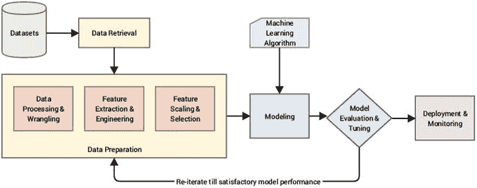

图 4-1。

Revisiting our standard Machine Learning pipeline

该图清楚地描述了管道中的主要组件，您现在应该已经很熟悉了。为了便于理解，再次提到这些组件。

*   资料检索
*   数据准备
*   建模
*   模型评估和调整
*   模型部署和监控

本章中我们关注的领域属于“数据准备”部分。我们已经在第 [3](03.html) 章中详细介绍了数据处理和争论。这里，我们将重点关注处理数据特征的三个主要步骤。这些被提及如下。

1.  特征提取和工程
2.  特征缩放
3.  特征选择

这些模块在图 [4-1](#Fig1) 中突出显示，对于将处理过的数据转换为特征的过程至关重要。所谓处理过的，我们指的是经过必要的预处理和争论操作后的原始数据。图 [4-2](#Fig2) 中更详细地描述了将处理后的数据转换为特征的流水线中通常遵循的步骤顺序。

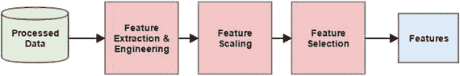

图 4-2。

A standard pipeline for feature engineering, scaling, and selection

很明显，基于图中所示的步骤序列，首先制作特征，然后进行工程设计，执行必要的标准化和缩放，最后选择最相关的特征，以给出最终的特征集。我们将按照图中所示的顺序在后续章节中详细介绍这三个组件。

## 特征提取和工程

特征提取和工程的过程可能是整个机器学习管道中最重要的一个。描述数据的最合适表示的良好特征有助于建立有效的机器学习模型。事实上，决定模型有效性的往往不是算法，而是特征。简而言之，好的特性产生好的模型。数据科学家大约将 70%到 80%的时间花在数据处理、争论和构建任何机器学习模型的特征工程上。因此，如果你想精通机器学习，理解与特征工程相关的所有方面是至关重要的。

通常，特征提取和特征工程是同义词，表示使用领域知识、手工技术和数学变换的组合将数据转换为特征的过程。此后，我们将使用术语特征工程来指代与从数据中提取或创建新特征的任务相关的所有方面。虽然机器学习算法的选择在构建模型时非常重要，但通常情况下，特征的选择和数量往往对模型性能有更大的影响。在这一节中，我们将回答一些问题，如为什么、做什么和如何做特征工程，以更深入地了解特征工程。

### 什么是特征工程？

我们已经非正式地解释了特征工程背后的核心概念，其中我们使用来自领域知识的特定组件和特定技术来将数据转换成特征。这种情况下的数据是经过必要的预处理和角力后的原始数据，我们前面已经提到过。这包括处理坏数据、输入缺失值、转换特定值等等。特征是特征工程过程的最终结果，它描述了底层数据的各种表示。

现在让我们来看几个定义和引用，这些定义和引用来自数据科学领域的几位知名人士，与特性工程相关。著名的计算机和数据科学家吴恩达谈论机器学习和特征工程。

> "It is difficult, time-consuming and requires professional knowledge to come up with new functions. Applied machine learning is basically feature engineering. " —Professor Andrew Ng

这基本上强化了我们之前提到的数据科学家花费近 80%的时间在工程特性上，这是一个困难且耗时的过程，需要领域知识和数学计算。除此之外，实用或应用机器学习主要是特征工程，因为建立和评估模型所花的时间比特征工程所花的总时间要少得多。然而，这并不意味着建模和评估比特性工程不重要。

我们现在来看看 Jason Brownlee 博士对特征工程的定义，他是数据科学家和 ML 从业者，在 [`http://machinelearningmastery.com`](http://machinelearningmastery.com) 提供了大量关于机器学习和数据科学的优秀资源。布朗利博士对特征工程的定义如下。

> "Feature engineering is the process of transforming the original data into features that can better present potential problems to the prediction model, thus improving the accuracy of the model for unknown data." —— Dr. jason brown Leigh

让我们在特征工程的定义上多花一些时间。它告诉我们，特征工程的过程包括将数据转换成特征，并考虑与问题、模型、性能和数据相关的几个方面。这些方面在该定义中被强调，并在下面被进一步详细解释。

*   原始数据:这是从数据源检索数据后的原始形式的数据。通常，在特征工程的实际过程之前，会进行一些数据处理和争论。
*   特征:这些是经过特征工程处理后从原始数据中获得的特定表示。
*   底层问题:这是指我们希望在机器学习的帮助下解决的特定业务问题或用例。商业问题通常被转换成机器学习任务。
*   预测模型:通常特征工程用于提取特征以建立机器学习模型，该模型从这些特征中学习数据和要解决的问题。监督预测模型广泛用于解决各种问题。
*   模型准确性:这是指用于评估模型的模型性能度量。
*   看不见的数据:这基本上是以前没有用于构建或训练模型的新数据。基于高质量的特征，该模型被期望对看不见的数据进行良好的学习和概括。

因此，特征工程是将数据转换为特征以充当机器学习模型的输入的过程，使得高质量的特征有助于提高整体模型性能。特性也非常依赖于潜在的问题。因此，即使机器学习任务在不同的场景中可能是相同的，例如将电子邮件分类为垃圾邮件和非垃圾邮件，或者将手写数字分类，但是在每个场景中提取的特征将会彼此非常不同。

到现在为止，您一定已经很好地理解了特征工程的思想和重要性。永远记住，对于解决任何机器学习问题，特征工程是关键！事实上，华盛顿大学的 Pedro Domingos 教授在他的题为“关于机器学习需要知道的一些有用的事情”的论文中加强了这一点，该论文可在 [`http://homes.cs.washington.edu/~pedrod/papers/cacm12.pdf`](http://homes.cs.washington.edu/%7Epedrod/papers/cacm12.pdf) 获得，它告诉我们以下内容。

> "At the end of the day, some machine learning projects are successful and some fail. What's the difference? The most important factor is undoubtedly the function used. " Professor Pedro Domingos

特征工程实际上是一门艺术，也是一门科学，它将数据转换成特征，然后输入到模型中。有时，您需要结合领域知识、经验、直觉和数学变换来提供您需要的特性。随着时间的推移，通过解决更多的问题，您将获得所需的经验，从而知道什么功能最适合某个问题。因此，不要不知所措，随着时间的推移，实践会让你掌握特征工程。下表描述了一些工程特征的示例。

*   从出生日期和当前日期推导出一个人的年龄
*   获取特定歌曲和音乐视频的平均和中间观看次数
*   从文本文档中提取单词和短语出现次数
*   从原始图像中提取像素信息
*   将学生获得的各种等级的出现次数列表

激起你对特征工程兴趣的最后一句话来自著名的卡格勒，Xavier Conort。你们大多数人都已经知道，棘手的机器学习问题经常定期发布在 Kaggle 上，通常对所有人开放。下面提到 Xavier 关于特征工程的思想。“我们使用的算法对 Kagglers 来说是非常标准的。...我们把大部分精力花在了特征工程上。...我们还非常小心地放弃了可能让我们面临过度拟合模型风险的功能。”—泽维尔·康纳特

这应该给你一个什么是特征工程的好主意，围绕它的各个方面和为什么我们真的需要特征工程的一个非常基本的介绍。在接下来的部分中，我们将进一步阐述为什么我们需要特性工程，它的好处和优势。

### 为什么选择特征工程？

我们在前面的章节中已经定义了特征工程，并且也触及了与特征工程的重要性相关的基础知识。现在让我们看看为什么我们需要特征工程，以及当我们建立机器学习模型和处理数据时，它如何成为我们的优势。

*   更好的数据表示:特性基本上是底层原始数据的各种表示。机器学习算法可以更好地理解这些表示。除此之外，我们也可以很容易地将这些表象形象化。一个简单的例子是想象一篇报纸文章中频繁出现的单词，而不是完全不知如何处理原始文本！
*   表现更好的模型:无论算法有多复杂，正确的特征往往会给出优于其他模型的模型。总的来说，如果你有正确的特性集，即使一个简单的模型也能很好地执行并给出期望的结果。简而言之，更好的特性造就更好的模型。
*   对于模型构建和评估至关重要:到目前为止，我们已经多次提到这一点，原始数据不能用于构建机器学习模型。获取数据，提取特征，并开始构建模型！此外，在评估模型性能和调整模型时，您可以重复您的特性集，以选择正确的特性集来获得最佳模型。
*   数据类型更灵活:虽然在很少或没有数据转换的情况下将数字数据类型直接用于机器学习算法肯定更容易，但真正的挑战是在更复杂的数据类型上建立模型，如文本、图像甚至视频。特征工程通过应用必要的转换来帮助我们在不同的数据类型上建立模型，并使我们能够处理复杂的非结构化数据。
*   强调业务和领域:数据科学家和分析师通常忙于处理、清理数据和构建模型，这是他们日常工作的一部分。这通常会在业务利益相关者和技术/分析团队之间造成隔阂。特征工程涉及并使数据科学家能够后退一步，通过从业务和主题专家那里获取有价值的输入，尝试更好地理解领域和业务。这对于创建和选择可能有助于构建正确模型来解决问题的要素是必要的。纯粹的统计和数学知识很少足以解决复杂的现实世界的问题。因此，特征工程强调在构建特征时要关注业务和问题的领域。

这个列表虽然不是详尽的，但让我们很好地了解了特征工程的重要性，以及它是如何成为构建机器学习模型的一个重要方面的。要解决的问题和领域的重要性在特征工程中也很重要。

### 你如何设计特征？

工程特征没有固定的规则。它包括使用领域知识、业务约束、手工转换和数学转换的组合，将原始数据转换为所需的特征。不同的数据类型有不同的特征提取技术。因此，在这一章中，我们将关注以下主要数据类型的各种特征工程技术和策略。

*   数字数据
*   分类数据
*   文本数据
*   时态数据
*   图像数据

本章的后续章节将重点介绍如何处理这些不同的数据类型以及可应用于工程特征的特定技术。将来，您可以将它们用作自己数据集中工程要素的参考和指南。

特征工程的另一个方面最近得到了重视。这里，您不使用手工制作的特征，而是让机器本身尝试检测模式，并从原始数据中提取有用的数据表示，这些数据表示可以用作特征。这个过程也称为自动特征生成。深度学习已被证明在该领域非常有效，并且像卷积神经网络(CNN)、递归神经网络(RNNs)和长短期记忆网络(LSTMs)这样的神经网络架构被广泛用于自动特征工程和提取。现在，让我们通过一些真实世界的数据集和示例深入特征工程的世界。

## 数字数据的特征工程

数字数据、字段、变量或要素通常以标量信息的形式表示数据，这些信息表示观察、记录或测量结果。当然，数字数据也可以表示为标量向量，其中向量中的每个特定实体本身就是一个数字数据点。整数和浮点数是最常见和最广泛使用的数字数据类型。除此之外，数字数据可能是最容易处理的，并且经常被机器学习模型直接使用。如果您还记得，我们之前在第 [3](03.html) 章的“数据描述”部分讨论过数字数据。

尽管数字数据可以直接输入到机器学习模型中，但在构建模型之前，您仍然需要设计与场景、问题和领域相关的功能。因此，仍然需要特征工程。数字要素的重要方面包括要素比例和分布，您将在本节的示例中观察到其中的一些方面。在某些情况下，我们需要应用特定的转换来更改数值的比例，而在其他情况下，我们需要更改数值的总体分布，例如将偏态分布转换为正态分布。

本章的代码文件中提供了本节使用的代码。您可以直接加载`feature_engineering_numeric.py`并开始运行示例，或者使用 jupyter 笔记本`Feature Engineering on Numeric Data.ipynb`，以获得更具交互性的体验。在开始之前，让我们加载以下依赖项和配置设置。

```py
In [1]: import pandas as pd
   ...: import matplotlib.pyplot as plt
   ...: import matplotlib as mpl
   ...: import numpy as np
   ...: import scipy.stats as spstats
   ...:
   ...: %matplotlib inline
   ...: mpl.style.reload_library()
   ...: mpl.style.use('classic')
   ...: mpl.rcParams['figure.facecolor'] = (1, 1, 1, 0)
   ...: mpl.rcParams['figure.figsize'] = [6.0, 4.0]
   ...: mpl.rcParams['figure.dpi'] = 100

```

现在我们已经加载了初始依赖项，让我们在下面几节中看看从数字数据设计特征的一些方法。

### 原始度量

正如我们前面提到的，数字特征通常可以直接输入到机器学习模型中，因为它们的格式易于理解、解释和操作。原始测量通常直接使用数字变量作为特征，无需任何形式的转换或工程。通常，这些特征可以指示值或计数。

#### 价值观念

通常，原始形式的标量值表示属于特定变量或字段的特定测量、度量或观察值。这个字段的语义通常从字段名本身或数据字典(如果有的话)中获得。现在让我们加载一个关于神奇宝贝的数据集！Kaggle 上也有这个数据集。如果你不知道，神奇宝贝是一个巨大的媒体专营权，围绕着虚构的人物称为神奇宝贝，代表口袋妖怪。简而言之，你可以把它们想象成拥有超能力的虚构动物！下面的片段让我们了解了这个数据集。

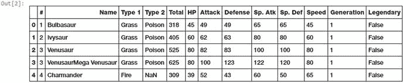

图 4-3。

Raw data from the Pokémon dataset

```py
In [2]: poke_df = pd.read_csv('datasets/Pokemon.csv', encoding='utf-8')
   ...: poke_df.head()

```

如果你观察图 [4-3](#Fig3) 中描述的数据集，有几个属性代表可以直接使用的数字原始值。下面的代码片段重点描述了其中的一些特性。

```py
In [3]: poke_df[['HP', 'Attack', 'Defense']].head()
Out[3]:
   HP  Attack  Defense
0  45      49       49
1  60      62       63
2  80      82       83
3  80     100      123
4  39      52       43

```

您可以直接使用这些属性作为前面数据帧中描述的特征。这些包括每个神奇宝贝的生命值，攻击和防御统计。事实上，我们还可以使用下面的代码计算这些字段的一些基本统计度量。

```py
In [4]: poke_df[['HP', 'Attack', 'Defense']].describe()
Out[4]:
               HP      Attack     Defense
count  800.000000  800.000000  800.000000
mean    69.258750   79.001250   73.842500
std     25.534669   32.457366   31.183501
min      1.000000    5.000000    5.000000
25%     50.000000   55.000000   50.000000
50%     65.000000   75.000000   70.000000
75%     80.000000  100.000000   90.000000
max    255.000000  190.000000  230.000000

```

在此输出中，我们可以看到每个数字特征的多个统计测量值，如计数、平均值、标准差和四分位数。如果可能的话，尝试绘制它们的分布图！

#### 计数

原始数字测量还可以指示特定属性的计数、频率和出现次数。让我们来看一个来自百万首歌曲数据集的数据样本，它描述了不同用户听过的歌曲的数量或频率。

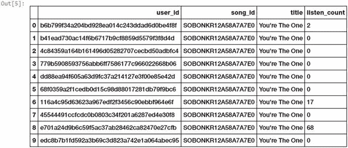

图 4-4。

Song listen counts as a numeric feature

```py
In [5]: popsong_df = pd.read_csv('datasets/song_views.csv', encoding='utf-8')
   ...: popsong_df.head(10)

```

我们可以看到，图 [4-4](#Fig4) 所示数据中的`listen_` `count`字段可以直接用作基于计数/频率的数值特征。

### 二值化

通常，原始的数字频率或计数在构建模型中是不必要的，特别是对于在构建推荐引擎中应用的方法。例如，如果我想知道一个人是否对一首特定的歌曲感兴趣或者是否听过这首歌曲，我不需要知道他/她听过同一首歌曲的总次数。我更关心他/她听过的各种歌。在这种情况下，与基于计数的特征相反，二进制特征是优选的。我们可以用下面的方法将前面数据集中的`listen_count`字段二进制化。

```py
In [6]: watched = np.array(popsong_df['listen_count'])
   ...: watched[watched >= 1] = 1
   ...: popsong_df['watched'] = watched

```

您还可以使用预处理模块中的`scikit-learn`的`Binarizer`类来执行相同的任务，而不是使用`numpy`数组，如下面的代码所示。

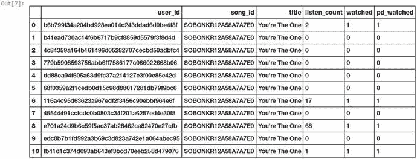

图 4-5。

Binarizing song counts

```py
In [7]: from sklearn.preprocessing import Binarizer
   ...:
   ...: bn = Binarizer(threshold=0.9)
   ...: pd_watched = bn.transform([popsong_df['listen_count']])[0]
   ...: popsong_df['pd_watched'] = pd_watched
   ...: popsong_df.head(11)

```

从图 [4-5](#Fig5) 中可以清楚地看到，两种方法都产生了特征`watched`和`pd_watched`中描述的相同结果。因此，我们将歌曲收听计数作为一个二进制化的特征来指示该歌曲是否被每个用户收听过。

### 舍入

通常，当处理像比例或百分比这样的数字属性时，我们可能不需要高精度的值。因此，将这些高精度百分比四舍五入成数字整数是有意义的。然后，这些整数可以直接用作原始数值，甚至用作分类(基于离散类)特征。让我们尝试将这个概念应用到一个虚拟数据集中，描述商店商品及其受欢迎程度。

```py
In [8]: items_popularity = pd.read_csv('datasets/item_popularity.csv', encoding='utf-8')
   ...: # rounding off percentages
   ...: items_popularity['popularity_scale_10'] =
                    np.array(np.round((items_popularity['pop_percent'] * 10)), dtype='int')
   ...: items_popularity['popularity_scale_100'] =
                    np.array(np.round((items_popularity['pop_percent'] * 100)), dtype='int')
   ...: items_popularity
Out[8]:
    item_id  pop_percent  popularity_scale_10  popularity_scale_100
0  it_01345      0.98324                   10                    98
1  it_03431      0.56123                    6                    56
2  it_04572      0.12098                    1                    12
3  it_98021      0.35476                    4                    35
4  it_01298      0.92101                    9                    92
5  it_90120      0.81212                    8                    81
6  it_10123      0.56502                    6                    57

```

因此，在我们的舍入操作之后，您可以在前面的数据帧中看到新的数据特征。基本上，我们尝试了两种形式的舍入。这些特征在`1-10`和`1-100`两个尺度上描述了物品的流行程度。根据场景和问题，您可以将这些值用作数字特征或分类特征。

### 相互作用

模型通常以这样的方式构建，即我们试图将输出响应(离散类或连续值)建模为输入特征变量的函数。例如，一个简单的线性回归方程可以描述为 y = c<sub>1</sub>x<sub>1</sub>+c<sub>2</sub>x<sub>2</sub>...+ c <sub>n</sub> x <sub>n</sub> 其中输入特征由变量{x <sub>1</sub> ，x <sub>2</sub> 描述，...x <sub>n</sub> }具有{c <sub>1</sub> ，c <sub>2</sub> 的权重或系数，...c <sub>n</sub> }并且目标是预测响应 y。在这种情况下，这个简单的线性模型描述了输出和输入之间的关系，完全基于单独的输入特征。

但是，通常在一些真实世界的数据集和场景中，尝试捕获这些要素变量之间的交互作为输入要素集的一部分是有意义的。具有交互特征的上述线性回归公式的扩展的简单描述是 y = c<sub>1</sub>x<sub>1</sub>+c<sub>2</sub>x<sub>2</sub>...+c<sub>n</sub>x<sub>n</sub>+c<sub>11</sub>x<sub>1</sub>T16】2+c<sub>22</sub>x<sub>2</sub>T22】2+c<sub>12</sub>x<sub>1</sub>x<sub>2</sub>...其中{x <sub>1</sub> x <sub>2</sub> ，x<sub>1</sub>T36】2 等特征，...}表示交互特征。现在让我们尝试在我们的神奇宝贝数据集上设计一些交互功能。

```py
In [9]: atk_def = poke_df[['Attack', 'Defense']]
   ...: atk_def.head()
Out[9]:
   Attack  Defense
0      49       49
1      62       63
2      82       83
3     100      123
4      52       43

```

我们可以在这个输出中看到，两个数字特征描述了神奇宝贝的攻击和防御。下面的代码帮助我们从这两个特性中构建交互特性。我们将使用来自`scikit-learn's` API 的`PolynomialFeatures`类构建第二级特性。

```py
In [10]: from sklearn.preprocessing import PolynomialFeatures
    ...:
    ...: pf = PolynomialFeatures(degree=2, interaction_only=False, include_bias=False)
    ...: res = pf.fit_transform(atk_def)
    ...: res
Out[10]:
array([[    49.,     49.,   2401.,   2401.,   2401.],
       [    62.,     63.,   3844.,   3906.,   3969.],
       [    82.,     83.,   6724.,   6806.,   6889.],
       ...,
       [   110.,     60.,  12100.,   6600.,   3600.],
       [   160.,     60.,  25600.,   9600.,   3600.],
       [   110.,    120.,  12100.,  13200.,  14400.]])

```

从这个输出中我们可以清楚地看到，我们总共有五个特性，包括新的交互特性。使用下面的代码片段，我们可以看到矩阵中每个特性的程度。

```py
In [11]: pd.DataFrame(pf.powers_, columns=['Attack_degree', 'Defense_degree'])
Out[11]:
   Attack_degree  Defense_degree
0              1               0
1              0               1
2              2               0
3              1               1
4              0               2

```

现在我们已经知道了每个特性实际上代表的程度，我们可以为每个特性指定一个名称，如下所示，以获得更新的特性集。

```py
In [12]: intr_features = pd.DataFrame(res,
    ...:                              columns=['Attack', 'Defense',
    ...:                                       'Attack^2', 'Attack x Defense', 'Defense^2'])
    ...: intr_features.head(5)
Out[12]:
   Attack  Defense  Attack^2  Attack x Defense  Defense^2
0    49.0     49.0    2401.0            2401.0     2401.0
1    62.0     63.0    3844.0            3906.0     3969.0
2    82.0     83.0    6724.0            6806.0     6889.0
3   100.0    123.0   10000.0           12300.0    15129.0
4    52.0     43.0    2704.0            2236.0     1849.0

```

因此，我们可以在图 [4-10](#Fig10) 中看到我们的原始和交互特征。来自`scikit-learn`的`fit_transform(...)` API 函数有助于在训练数据上构建特征工程表示对象，通过调用`transform(...)`函数，可以在模型预测期间在新数据上重用该对象。让我们对神奇宝贝的攻击和防御特性进行一些新的观察，并尝试使用相同的机制来转换它们。

```py
In [13]: new_df = pd.DataFrame([[95, 75],[121, 120], [77, 60]],
    ...:                       columns=['Attack', 'Defense'])
    ...: new_df
Out[13]:
   Attack  Defense
0      95       75
1     121      120
2      77       60

```

我们现在可以使用我们之前创建的`pf`对象，并转换这些输入特征，以给出如下的交互特征。

```py
In [14]: new_res = pf.transform(new_df)
    ...: new_intr_features = pd.DataFrame(new_res,
    ...:                                  columns=['Attack', 'Defense',
    ...:                                           'Attack^2', 'Attack x Defense', 'Defense^2'])
    ...: new_intr_features
Out[14]:
   Attack  Defense  Attack^2  Attack x Defense  Defense^2
0    95.0     75.0    9025.0            7125.0     5625.0
1   121.0    120.0   14641.0           14520.0    14400.0
2    77.0     60.0    5929.0            4620.0     3600.0

```

因此，您可以看到，我们已经成功地为新数据集获得了必要的交互特性。现在就尝试在三个或更多的功能上构建交互功能吧！

### 扔掉

通常，在处理数字数据时，您可能会遇到描述原始测量值(如值或频率)的要素或属性。在许多情况下，这些属性的分布通常是偏斜的，因为一些值集合会经常出现，而一些值集合会非常罕见。除此之外，还有这些值的变化范围的附加问题。假设我们在谈论歌曲或视频的观看次数。在某些情况下，视图计数会异常大，而在某些情况下会非常小。在建模中直接使用这些功能可能会导致问题。如果我们使用值跨越多个数量级的原始数字特征，则相似性度量、聚类距离、回归系数等指标可能会受到不利影响。有各种方法可以从这些原始值设计特征，因此我们可以解决这些问题。这些方法包括变换、缩放和宁滨/量化。

在这一节，我们将讨论宁滨，也称为量子化。宁滨运算用于将连续数值转换为离散数值。这些离散的数字可以被认为是原始值或数字被装入或分组到的箱。每个条柱代表一个特定的强度等级，并且具有必须落入该条柱的特定范围的值。宁滨数据有多种方式，包括固定宽度和自适应宁滨。每个宁滨过程都可以采用特定的技术。我们将使用从 2016 年 FreeCodeCamp 开发人员/编码人员调查中提取的数据集，该调查讨论了与编码人员和软件开发人员相关的各种属性。更多详情可以在 [`https://github.com/freeCodeCamp/2016-new-coder-survey`](https://github.com/freeCodeCamp/2016-new-coder-survey) 自行查看。让我们加载数据集，看看一些有趣的属性。

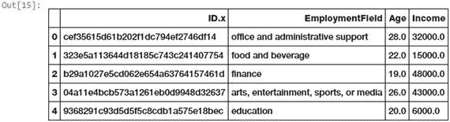

图 4-6。

Important attributes from the FCC coder survey dataset

```py
In [15]: fcc_survey_df = pd.read_csv('datasets/fcc_2016_coder_survey_subset.csv',
                                     encoding='utf-8')
    ...: fcc_survey_df[['ID.x', 'EmploymentField', 'Age', 'Income']].head()

```

图 [4-6](#Fig6) 中描绘的数据框架向我们展示了编码器调查数据集的一些有趣属性，其中一些我们将在本节进行分析。`ID.x`变量基本上是每个参加调查的编码人员/开发人员的唯一标识符，其他字段是不言自明的。

#### 固定宽度宁滨

顾名思义，在固定宽度宁滨中，我们为每个条柱提供特定的固定宽度，通常由分析数据的用户预先定义。每个绑定都有一个预先固定的值范围，应该根据一些业务或自定义逻辑、规则或必要的转换将这些值分配给该绑定。

基于舍入的宁滨是其中一种方法，您可以使用我们之前讨论过的舍入运算来对原始值进行装箱。让我们考虑编码器调查数据集中的`Age`特性。下面的代码显示了参加调查的开发人员的年龄分布。

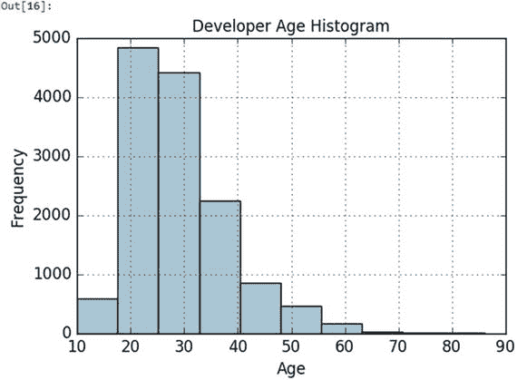

图 4-7。

Histogram depicting developer age distribution

```py
In [16]: fig, ax = plt.subplots()
    ...: fcc_survey_df['Age'].hist(color='#A9C5D3')
    ...: ax.set_title('Developer Age Histogram', fontsize=12)
    ...: ax.set_xlabel('Age', fontsize=12)
    ...: ax.set_ylabel('Frequency', fontsize=12)

```

图 [4-7](#Fig7) 中的直方图描绘了显影剂年龄的分布，如预期的那样略微向右倾斜。让我们尝试基于以下逻辑将这些原始年龄值分配到特定的容器中。

```py
Age Range: Bin
---------------
 0 -  9  : 0
10 - 19  : 1
20 - 29  : 2
30 - 39  : 3
40 - 49  : 4
50 - 59  : 5
60 - 69  : 6
  ... and so on

```

我们可以很容易地做到这一点，使用我们在前面的“舍入”一节中学到的知识，我们通过将底值除以 10 来舍入这些原始年龄值。下面的代码描述了同样的情况。

```py
In [17]: fcc_survey_df['Age_bin_round'] = np.array(np.floor(np.array(fcc_survey_df['Age']) /
                                                                                      10.))
    ...: fcc_survey_df[['ID.x', 'Age', 'Age_bin_round']].iloc[1071:1076]
Out[17]:
                                  ID.x   Age  Age_bin_round
1071  6a02aa4618c99fdb3e24de522a099431  17.0            1.0
1072  f0e5e47278c5f248fe861c5f7214c07a  38.0            3.0
1073  6e14f6d0779b7e424fa3fdd9e4bd3bf9  21.0            2.0
1074  c2654c07dc929cdf3dad4d1aec4ffbb3  53.0            5.0
1075  f07449fc9339b2e57703ec7886232523  35.0            3.0

```

我们采用数据集的特定切片(行 1071-1076)来描述不同年龄的用户。您可以看到，每个年龄的对应箱都是基于舍入进行分配的。但是如果我们需要更多的灵活性呢？如果我想自己决定和调整箱子宽度，该怎么办？

基于自定义范围的宁滨回答了我们所有关于固定宽度宁滨的问题，其中一些我刚刚提到过。让我们使用下面的方案为宁滨开发者年龄定义一些定制的年龄范围。

```py
Age Range : Bin
---------------
 0 -  15  : 1
16 -  30  : 2
31 -  45  : 3
46 -  60  : 4
61 -  75  : 5
75 - 100  : 6

```

基于这个自定义的宁滨方案，我们现在将借助以下代码为每个开发人员年龄值标记容器。我们将存储容器范围和相应的标签。

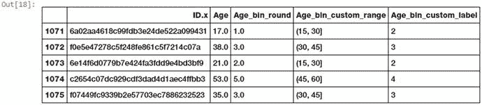

图 4-8。

Custom age binning for developer ages

```py
In [18]: bin_ranges = [0, 15, 30, 45, 60, 75, 100]
    ...: bin_names = [1, 2, 3, 4, 5, 6]
    ...: fcc_survey_df['Age_bin_custom_range'] = pd.cut(np.array(fcc_survey_df['Age']),
    ...:                                                bins=bin_ranges)
    ...: fcc_survey_df['Age_bin_custom_label'] = pd.cut(np.array(fcc_survey_df['Age']),
    ...:                                                bins=bin_ranges, labels=bin_names)
    ...: fcc_survey_df[['ID.x', 'Age', 'Age_bin_round',
    ...:                'Age_bin_custom_range', 'Age_bin_custom_label']].iloc[1071:1076]

```

我们可以从图 [4-8](#Fig8) 中的数据帧输出中看到，基于我们的方案的定制箱已经被分配给每个开发人员的年龄。尝试一些你自己的宁滨计划！

#### 自适应宁滨

到目前为止，我们已经确定了固定宽度宁滨中的箱宽度和范围。然而，这种技术会导致不规则的面元，这些面元根据落在每个面元中的数据点或值的数量而不一致。有些箱子可能人口稠密，有些可能人口稀少，甚至是空的！自适应宁滨是一种更安全和更好的方法，其中我们使用数据分布本身来决定什么应该是适当的箱。

基于分位数的宁滨是用于自适应宁滨的一个好策略。分位数是特定的值或分界点，有助于将特定数值字段的连续值分布划分为离散的连续箱或区间。因此，q 分位数有助于将数值属性划分为 q 个相等的分区。分位数的常见示例包括 2 分位数(称为中值),它将数据分布划分为两个相等的区间；4 分位数(称为四分位数),它将数据划分为四个相等的区间；10 分位数(也称为十分位数),它创建 10 个相等宽度的区间。现在，让我们来看一下编码器调查数据集中与开发人员收入值相关的一部分数据。

```py
In [19]: fcc_survey_df[['ID.x', 'Age', 'Income']].iloc[4:9]
Out[19]:
                               ID.x   Age   Income
4  9368291c93d5d5f5c8cdb1a575e18bec  20.0   6000.0
5  dd0e77eab9270e4b67c19b0d6bbf621b  34.0  40000.0
6  7599c0aa0419b59fd11ffede98a3665d  23.0  32000.0
7  6dff182db452487f07a47596f314bddc  35.0  40000.0
8  9dc233f8ed1c6eb2432672ab4bb39249  33.0  80000.0

```

数据框描绘的数据切片向我们展示了数据集中每个开发人员的收入值。现在让我们使用下面的代码来看看这个`Income`变量的整个数据分布。

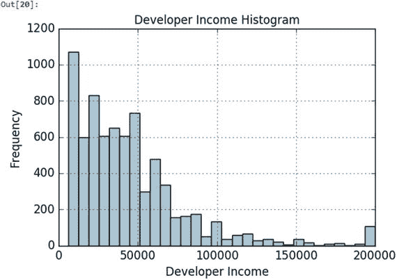

图 4-9。

Histogram depicting developer income distribution

```py
In [20]: fig, ax = plt.subplots()
    ...: fcc_survey_df['Income'].hist(bins=30, color='#A9C5D3')
    ...: ax.set_title('Developer Income Histogram', fontsize=12)
    ...: ax.set_xlabel('Developer Income', fontsize=12)
    ...: ax.set_ylabel('Frequency', fontsize=12)

```

我们可以从图 [4-9](#Fig9) 中描绘的分布中看到，正如预期的那样，有一个右偏，较少的开发者赚更多的钱，反之亦然。让我们采用基于 4 分位数或四分位数的自适应宁滨方案。下面的片段帮助我们获得分布中四个四分位数的收入值。

```py
In [21]: quantile_list = [0, .25, .5, .75, 1.]
    ...: quantiles = fcc_survey_df['Income'].quantile(quantile_list)
    ...: quantiles
Out[21]:
0.00      6000.0
0.25     20000.0
0.50     37000.0
0.75     60000.0
1.00    200000.0

```

为了更好地可视化在这个输出中获得的四分位数，我们可以使用下面的代码片段在我们的数据分布中绘制它们。

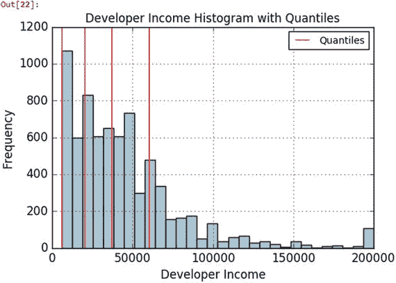

图 4-10。

Histogram depicting developer income distribution with quartile values

```py
In [22]: fig, ax = plt.subplots()
    ...: fcc_survey_df['Income'].hist(bins=30, color='#A9C5D3')
    ...:
    ...: for quantile in quantiles:
    ...:     qvl = plt.axvline(quantile, color='r')
    ...: ax.legend([qvl], ['Quantiles'], fontsize=10)
    ...:
    ...: ax.set_title('Developer Income Histogram with Quantiles', fontsize=12)
    ...: ax.set_xlabel('Developer Income', fontsize=12)
    ...: ax.set_ylabel('Frequency', fontsize=12)

```

在图 [4-10](#Fig10) 中，收入属性的 4 分位数值由红色垂直线表示。现在，让我们使用分位数宁滨，通过以下代码将每个开发人员收入值归入特定的箱中。

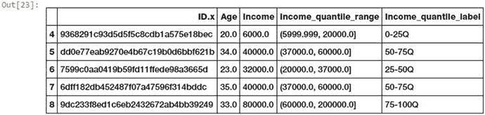

图 4-11。

Quantile based bin ranges and labels for developer incomes

```py
In [23]: quantile_labels = ['0-25Q', '25-50Q', '50-75Q', '75-100Q']
    ...: fcc_survey_df['Income_quantile_range'] = pd.qcut(fcc_survey_df['Income'],
    ...:                                                  q=quantile_list)
    ...: fcc_survey_df['Income_quantile_label'] = pd.qcut(fcc_survey_df['Income'],
    ...:                                                  q=quantile_list,
    ...:                                                  labels=quantile_labels)
    ...: fcc_survey_df[['ID.x', 'Age', 'Income',
                        'Income_quantile_range', 'Income_quantile_label']].iloc[4:9]

```

图 [4-11](#Fig11) 中描绘的结果数据框清楚地显示了基于分位数的 bin 范围以及分别在`Income_quantile_range`和`Income_quantile_labels`特征中为每个开发者收入值分配的相应标签。

### 统计变换

让我们看看通过使用统计或数学变换对数字数据进行特征工程的不同策略。在本节中，我们将研究对数变换以及 Box-Cox 变换。这两种变换函数都属于幂变换函数族。这些函数通常用于创建单调的数据转换，但它们的主要意义在于有助于稳定方差，紧密遵循正态分布，并使数据独立于基于其分布的平均值。几个变换也被用作特征缩放的一部分，我们将在下一节中介绍。

#### 对数变换

对数变换属于幂变换函数族。此函数可定义为 y = log <sub>b</sub> (x)，读作 x 的对数以 b 为底等于 y。这可转换为 b <sup>y</sup> = x，表示以 b 为底的幂必须达到多少才能得到 x。自然对数使用以 b = e 为底，其中 e = 2.71828，通常称为欧拉数。你也可以使用十进制中普遍使用的基数 b = 10。对数变换在应用于偏斜分布时非常有用，因为它们倾向于扩展较低幅度范围内的值，并倾向于压缩或减少较高幅度范围内的值。这往往会使偏态分布尽可能接近正态分布。让我们对来自我们的编码器调查数据集的开发者收入特性使用对数变换。

```py
In [24]: fcc_survey_df['Income_log'] = np.log((1+ fcc_survey_df['Income']))
    ...: fcc_survey_df[['ID.x', 'Age', 'Income', 'Income_log']].iloc[4:9]
Out[24]:
                               ID.x   Age   Income  Income_log
4  9368291c93d5d5f5c8cdb1a575e18bec  20.0   6000.0    8.699681
5  dd0e77eab9270e4b67c19b0d6bbf621b  34.0  40000.0   10.596660
6  7599c0aa0419b59fd11ffede98a3665d  23.0  32000.0   10.373522
7  6dff182db452487f07a47596f314bddc  35.0  40000.0   10.596660
8  9dc233f8ed1c6eb2432672ab4bb39249  33.0  80000.0   11.289794

```

此输出中获得的数据帧描述了`Income_log`字段中的对数转换收入特征。现在，让我们使用以下代码绘制这个转换后的要素的数据分布。

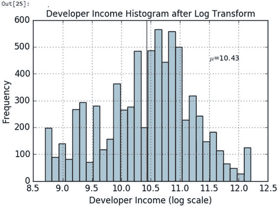

图 4-12。

Histogram depicting developer income distribution after log transform

```py
In [25]: income_log_mean = np.round(np.mean(fcc_survey_df['Income_log']), 2)
    ...:
    ...: fig, ax = plt.subplots()
    ...: fcc_survey_df['Income_log'].hist(bins=30, color='#A9C5D3')
    ...: plt.axvline(income_log_mean, color='r')
    ...: ax.set_title('Developer Income Histogram after Log Transform', fontsize=12)
    ...: ax.set_xlabel('Developer Income (log scale)', fontsize=12)
    ...: ax.set_ylabel('Frequency', fontsize=12)
    ...: ax.text(11.5, 450, r'$\mu$='+str(income_log_mean), fontsize=10)

```

因此，我们可以清楚地看到，在应用对数变换后，图 [4-10](#Fig10) 中向右倾斜的原始开发者收入分布更像图 [4-12](#Fig12) 中的高斯分布或正态分布。

#### 博克斯-考克斯变换

现在让我们看看 Box-Cox 变换，这是属于幂变换函数族的另一个流行函数。该函数有一个先决条件，即要转换的数值必须是正的(类似于 log transform 所期望的)。如果它们是负的，使用常量值进行移位会有所帮助。数学上，Box-Cox 变换函数可以定义为，

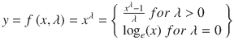

使得所得到的变换输出 y 是输入 x 和变换参数λ的函数，使得当λ = 0 时，所得到的变换是自然对数变换，这是我们前面讨论过的。λ的最佳值通常使用最大似然或对数似然估计来确定。让我们对开发者收入特性应用 Box-Cox 变换。为此，首先我们通过使用下面的代码删除非空值，从数据分布中获得最佳的 lambda 值。

```py
In [26]: # get optimal lambda value from non null income values
    ...: income = np.array(fcc_survey_df['Income'])
    ...: income_clean = income[∼np.isnan(income)]
    ...: l, opt_lambda = spstats.boxcox(income_clean)
    ...: print('Optimal lambda value:', opt_lambda)
Optimal lambda value: 0.117991239456

```

现在我们已经获得了最佳λ值，让我们对λ的两个值使用 Box-Cox 变换，使得λ = 0 & λ = λ <sub>最佳</sub>，并变换与开发者收入相关的原始数值。

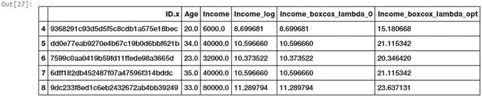

图 4-13。

Dataframe depicting developer income distribution after box-cox transform

```py
In [27]: fcc_survey_df['Income_boxcox_lambda_0'] = spstats.boxcox((1+fcc_survey_df['Income']),
    ...:                                                          lmbda=0)
    ...: fcc_survey_df['Income_boxcox_lambda_opt'] = spstats.boxcox(fcc_survey_df['Income'],
    ...:                                                            lmbda=opt_lambda)
    ...: fcc_survey_df[['ID.x', 'Age', 'Income', 'Income_log',
    ...:                'Income_boxcox_lambda_0', 'Income_boxcox_lambda_opt']].iloc[4:9]

```

在图 [4-13](#Fig13) 所示的输出中获得的数据帧描述了在分别对`Income_boxcox_lambda_0`和`Income_boxcox_lambda_opt`字段中的λ = 0 和λ = λ <sub>最优</sub>应用 Box-Cox 变换后的收入特征。同样如预期的那样，`Income_log`字段具有与λ = 0 的 Box-Cox 变换相同的值。现在，让我们绘制具有最佳λ的 Box-Cox 变换的开发者值的数据分布。见图 [4-14](#Fig14) 。

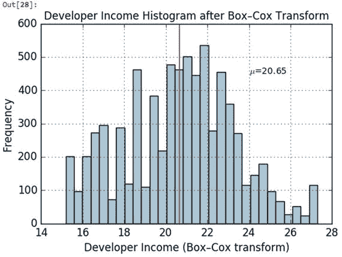

图 4-14。

Histogram depicting developer income distribution after box-cox transform (λ = λ<sub>optimal</sub>)

```py
In [30]: income_boxcox_mean = np.round(np.mean(fcc_survey_df['Income_boxcox_lambda_opt']), 2)
    ...:
    ...: fig, ax = plt.subplots()
    ...: fcc_survey_df['Income_boxcox_lambda_opt'].hist(bins=30, color='#A9C5D3')
    ...: plt.axvline(income_boxcox_mean, color='r')
    ...: ax.set_title('Developer Income Histogram after Box–Cox Transform', fontsize=12)
    ...: ax.set_xlabel('Developer Income (Box–Cox transform)', fontsize=12)
    ...: ax.set_ylabel('Frequency', fontsize=12)
    ...: ax.text(24, 450, r'$\mu$='+str(income_boxcox_mean), fontsize=10)

```

在 Box-Cox 分布之后，开发人员收入的转换后数值的分布看起来也类似于我们在对数转换之后获得的分布，因此它更像正态分布，并且原始数据中出现的极右偏斜在这里已经被最小化。

## 分类数据的特征工程

到目前为止，我们一直在处理连续的数字数据，您也已经看到了用于相同工程特征的各种技术。我们现在来看看另一种结构化数据类型，即分类数据。本质上是分类的任何属性或特征表示属于特定有限类别集的离散值。类别或分类标签本质上可以是文本或数字。通常有两种类型的分类变量——名义变量和序数变量。

名义分类特征是这样的，在值之间没有排序的概念，也就是说，对它们进行排序是没有意义的。电影或视频游戏类型、天气季节和国家名称都是名义属性的例子。有序分类变量可以根据其值进行排序和分类，因此这些值具有特定的意义，因此它们的顺序是有意义的。序数属性的例子包括服装尺寸、教育水平等等。

在这一节中，我们将研究转换和编码分类特征和属性的各种策略和技术。本章的代码文件中提供了本节使用的代码。您可以直接加载`feature_engineering_categorical.py`并开始运行示例，或者使用 jupyter 笔记本`Feature Engineering on Categorical Data.ipynb`，以获得更具交互性的体验。在我们开始之前，让我们加载以下依赖项。

```py
In [1]: import pandas as pd
   ...: import numpy as np

```

一旦加载了这些依赖项，让我们开始从分类数据设计一些特性。

### 转换名义特征

名义特征或属性是分类变量，通常具有有限的一组不同的离散值。这些值通常是字符串或文本格式，机器学习算法无法直接理解它们。因此，通常您可能需要将这些特征转换成更具代表性的数字格式。让我们来看一个关于视频游戏销售的新数据集。这个数据集在 Kaggle ( [`https://www.kaggle.com/gregorut/videogamesales`](https://www.kaggle.com/gregorut/videogamesales) )上也有。为了您的方便，我们下载了一份副本。下面的代码帮助我们加载这个数据集，并查看我们感兴趣的一些属性。

```py
In [2]: vg_df = pd.read_csv('datasets/vgsales.csv', encoding='utf-8')
   ...: vg_df[['Name', 'Platform', 'Year', 'Genre', 'Publisher']].iloc[1:7]
Out[2]:
                       Name Platform    Year         Genre Publisher
1         Super Mario Bros.      NES  1985.0      Platform  Nintendo
2            Mario Kart Wii      Wii  2008.0        Racing  Nintendo
3         Wii Sports Resort      Wii  2009.0        Sports  Nintendo
4  Pokemon Red/Pokemon Blue       GB  1996.0  Role-Playing  Nintendo
5                    Tetris       GB  1989.0        Puzzle  Nintendo
6     New Super Mario Bros.       DS  2006.0      Platform  Nintendo

```

此数据框中描述的数据集向我们展示了与视频游戏相关的各种属性。像`Platform`、`Genre`和`Publisher`这样的特征是名义分类变量。现在让我们尝试将视频游戏`Genre`的特性转换成数字表示。请注意，这并不表示变换后的要素将是数字要素。它仍然是一个离散值的分类特征，每种类型都有数字而不是文本。以下代码描述了视频游戏的完全不同的流派标签。

```py
In [3]: genres = np.unique(vg_df['Genre'])
   ...: genres
Out[3]:
array(['Action', 'Adventure', 'Fighting', 'Misc', 'Platform', 'Puzzle',
       'Racing', 'Role-Playing', 'Shooter', 'Simulation', 'Sports',
       'Strategy'], dtype=object)

```

这个输出告诉我们，我们的数据集中有 12 种不同的视频游戏类型。现在让我们在下面的代码中使用一个映射方案来转换这个特性。

```py
In [4]: from sklearn.preprocessing import LabelEncoder
   ...:
   ...: gle = LabelEncoder()
   ...: genre_labels = gle.fit_transform(vg_df['Genre'])
   ...: genre_mappings = {index: label for index, label in enumerate(gle.classes_)}
   ...: genre_mappings
Out[4]:
{0: 'Action', 1: 'Adventure', 2: 'Fighting', 3: 'Misc',
 4: 'Platform', 5: 'Puzzle', 6: 'Racing', 7: 'Role-Playing',
 8: 'Shooter', 9: 'Simulation', 10: 'Sports', 11: 'Strategy'}

```

从输出中，我们可以看到已经生成了一个映射方案，在该方案中，借助于`LabelEncoder`对象`gle`，每个流派值都被映射到一个数字。转换后的标签存储在`genre_labels`值中。让我们将它写回原始数据帧并查看结果。

```py
In [5]: vg_df['GenreLabel'] = genre_labels
   ...: vg_df[['Name', 'Platform', 'Year', 'Genre', 'GenreLabel']].iloc[1:7]
Out[5]:
                       Name Platform    Year         Genre  GenreLabel
1         Super Mario Bros.      NES  1985.0      Platform           4
2            Mario Kart Wii      Wii  2008.0        Racing           6
3         Wii Sports Resort      Wii  2009.0        Sports          10
4  Pokemon Red/Pokemon Blue       GB  1996.0  Role-Playing           7
5                    Tetris       GB  1989.0        Puzzle           5
6     New Super Mario Bros.       DS  2006.0      Platform           4

```

`GenreLabel`字段描述了每个`Genre`标签的映射数字标签，我们可以清楚地看到这符合我们之前生成的映射。

### 转换序数特征

序数特征类似于名词性特征，只是次序很重要，是我们可以用来解释这些特征的值的固有属性。与名义要素一样，甚至序数要素也可能以文本形式出现，您需要映射它们并将其转换为数值表示。现在让我们加载我们之前使用的神奇宝贝数据集，并查看每个神奇宝贝的`Generation`属性的各种值。

```py
In [6]: poke_df = pd.read_csv('datasets/Pokemon.csv', encoding='utf-8')
   ...: poke_df = poke_df.sample(random_state=1, frac=1).reset_index(drop=True)
   ...:
   ...: np.unique(poke_df['Generation'])
Out[6]: array(['Gen 1', 'Gen 2', 'Gen 3', 'Gen 4', 'Gen 5', 'Gen 6'], dtype=object)

```

我们在这段代码中对数据集进行了重新采样，这样我们就可以在以后得到一个很好的数据切片，它代表了我们正在寻找的所有不同的值。从这个输出我们可以看到，神奇宝贝一共有六代。这个属性肯定是有序的，因为属于第一代的神奇宝贝在视频游戏和电视节目中比第二代更早出现，等等。因此他们有一种秩序感。不幸的是，由于每个顺序变量都有特定的逻辑或规则集，因此没有通用的模块或函数将这些特征映射和转换为数字表示。因此，我们需要使用我们自己的逻辑手工制作，如下面的代码片段所示。

```py
In [7]: gen_ord_map = {'Gen 1': 1, 'Gen 2': 2, 'Gen 3': 3,
   ...:                'Gen 4': 4, 'Gen 5': 5, 'Gen 6': 6}
   ...:
   ...: poke_df['GenerationLabel'] = poke_df['Generation'].map(gen_ord_map)
   ...: poke_df[['Name', 'Generation', 'GenerationLabel']].iloc[4:10]
Out[7]:
                  Name Generation  GenerationLabel
4            Octillery      Gen 2                2
5           Helioptile      Gen 6                6
6               Dialga      Gen 4                4
7  DeoxysDefense Forme      Gen 3                3
8             Rapidash      Gen 1                1
9               Swanna      Gen 5                5

```

因此，您可以看到，在 Python 字典的帮助下，构建自己的转换映射方案并使用来自`pandas`的`map(...)`函数来转换序数特性是非常容易的。

### 编码分类特征

我们在过去多次提到，机器学习算法通常对数值工作得很好。您现在可能会想，在前面的部分中，我们已经将分类变量转换并映射为数字表示，那么为什么我们还需要更多级别的编码呢？这个问题的答案很简单。如果我们直接将分类特征的这些转换后的数字表示输入到任何算法中，该模型将基本上试图将这些转换后的数字表示解释为原始的数字特征，因此幅度的概念将被错误地引入到系统中。

一个简单的例子是我们之前的输出数据帧，符合`GenerationLabel`的模型会认为值`6 > 5 > 4`等等。虽然顺序在神奇宝贝世代中很重要(顺序变量)，但这里没有大小的概念。`Generation 6`不大于`Generation 5`,`Generation 1`不小于`Generation 6`。因此，直接使用这些特征构建的模型将是次优的和不正确的模型。有几种方案和策略，其中从任何特征的所有不同类别中为每个唯一值或标签创建虚拟特征。在随后的章节中，我们将讨论其中的一些方案，包括一个热编码、虚拟编码、效果编码和特征散列方案。

#### 一种热编码方案

考虑到我们有 m 个标签的任何分类特征的数字表示，一个热编码方案将该特征编码或转换成 m 个二进制特征，其只能包含值 1 或 0。因此，分类特征中的每个观察值都被转换成大小为 m 的向量，其中只有一个值为 1(表示它是活动的)。让我们以神奇宝贝数据集为例，对它的一些分类特征执行一些 hot 编码转换。

```py
In [8]: poke_df[['Name', 'Generation', 'Legendary']].iloc[4:10]
Out[8]:
                  Name Generation  Legendary
4            Octillery      Gen 2      False
5           Helioptile      Gen 6      False
6               Dialga      Gen 4       True
7  DeoxysDefense Forme      Gen 3       True
8             Rapidash      Gen 1      False
9               Swanna      Gen 5      False

```

考虑到输出中描述的数据框架，我们有两个分类特征，`Generation`和`Legendary`，描述了神奇宝贝一代和他们的传奇地位。首先，我们需要将这些文本标签转换成数字表示。下面的代码帮助我们实现了这一点。

```py
In [9]: from sklearn.preprocessing import OneHotEncoder, LabelEncoder
   ...:
   ...: # transform and map pokemon generations
   ...: gen_le = LabelEncoder()
   ...: gen_labels = gen_le.fit_transform(poke_df['Generation'])
   ...: poke_df['Gen_Label'] = gen_labels
   ...:
   ...: # transform and map pokemon legendary status
   ...: leg_le = LabelEncoder()
   ...: leg_labels = leg_le.fit_transform(poke_df['Legendary'])
   ...: poke_df['Lgnd_Label'] = leg_labels
   ...:
   ...: poke_df_sub = poke_df[['Name', 'Generation', 'Gen_Label', 'Legendary', 'Lgnd_Label']]
   ...: poke_df_sub.iloc[4:10]
Out[9]:
                  Name Generation  Gen_Label  Legendary  Lgnd_Label
4            Octillery      Gen 2          1      False           0
5           Helioptile      Gen 6          5      False           0
6               Dialga      Gen 4          3       True           1
7  DeoxysDefense Forme      Gen 3          2       True           1
8             Rapidash      Gen 1          0      False           0
9               Swanna      Gen 5          4      False           0

```

特征`Gen_Label`和`Lgnd_Label`现在描述了我们的分类特征的数字表示。现在让我们使用下面的代码对这些特性应用 one hot 编码方案。

```py
In [10]: # encode generation labels using one-hot encoding scheme
    ...: gen_ohe = OneHotEncoder()
    ...: gen_feature_arr = gen_ohe.fit_transform(poke_df[['Gen_Label']]).toarray()
    ...: gen_feature_labels = list(gen_le.classes_)
    ...: gen_features = pd.DataFrame(gen_feature_arr, columns=gen_feature_labels)
    ...:
    ...: # encode legendary status labels using one-hot encoding scheme
    ...: leg_ohe = OneHotEncoder()
    ...: leg_feature_arr = leg_ohe.fit_transform(poke_df[['Lgnd_Label']]).toarray()
    ...: leg_feature_labels = ['Legendary_'+str(cls_label) for cls_label in leg_le.classes_]
    ...: leg_features = pd.DataFrame(leg_feature_arr, columns=leg_feature_labels)

```

现在，您应该记住，您总是可以使用`fit_transform(...)`函数通过向它传递两个特征的二维数组来将这两个特征编码在一起。但是我们为每个特性分别描述了这种编码，以使事情更容易理解。除此之外，我们还可以创建单独的数据帧并相应地标记它们。现在让我们连接这些特征框架，看看最终的结果。

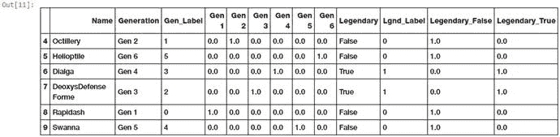

图 4-15。

Feature set depicting one hot encoded features for Pokémon generation and legendary status

```py
In [11]: poke_df_ohe = pd.concat([poke_df_sub, gen_features, leg_features], axis=1)
    ...: columns = sum([['Name', 'Generation', 'Gen_Label'],gen_feature_labels,
    ...:               ['Legendary', 'Lgnd_Label'],leg_feature_labels], [])
    ...: poke_df_ohe[columns].iloc[4:10]

```

从图 [4-15](#Fig15) 所示的结果特征集中，我们可以清楚地看到`Gen_Label`和`Lgnd_Label`的新的热编码特征。这些热编码特征中的每一个本质上都是二进制的，如果它们包含值 1，则意味着该特征对于相应的观察是活动的。例如，第 6 行指示神奇宝贝帝牙卢卡是具有`Gen_Label 3`(映射从`0`开始)的`Gen 4`神奇宝贝，并且对应的一个热编码特征`Gen 4`具有值`1`，而剩余的一个热编码特征是`0`。类似地，其`Legendary`状态为`True`，对应的`Lgnd_Label`为`1`，一个热编码特征`Legendary_True`也为`1`，表示其处于活动状态。

假设我们在训练和构建模型时使用了这些数据，但现在我们有了一些新的神奇宝贝数据，在我们想要通过我们训练的模型运行它之前，我们需要为这些数据设计相同的功能。我们可以对我们的`LabelEncoder`和`OneHotEncoder`对象使用`transform(...)`函数，这是我们之前从训练数据中构建的特征。以下代码向我们展示了与新神奇宝贝相关的两个虚拟数据点。

```py
In [12]: new_poke_df = pd.DataFrame([['PikaZoom', 'Gen 3', True],
    ...:                            ['CharMyToast', 'Gen 4', False]],
    ...:                            columns=['Name', 'Generation', 'Legendary'])
    ...: new_poke_df
Out[12]:
          Name Generation  Legendary
0     PikaZoom      Gen 3       True
1  CharMyToast      Gen 4      False

```

我们将遵循与之前相同的过程，首先使用我们之前构建的`LabelEncoder`对象将文本类别转换成数字表示，如下面的代码所示。

```py
In [13]: new_gen_labels = gen_le.transform(new_poke_df['Generation'])
    ...: new_poke_df['Gen_Label'] = new_gen_labels
    ...:
    ...: new_leg_labels = leg_le.transform(new_poke_df['Legendary'])
    ...: new_poke_df['Lgnd_Label'] = new_leg_labels
    ...:
    ...: new_poke_df[['Name', 'Generation', 'Gen_Label', 'Legendary', 'Lgnd_Label']]
Out[13]:
          Name Generation  Gen_Label  Legendary  Lgnd_Label
0     PikaZoom      Gen 3          2       True           1
1  CharMyToast      Gen 4          3      False           0

```

我们现在可以使用我们之前构建的`LabelEncoder`对象，并使用下面的代码对这些新的数据观察执行一次热编码。参见图 [4-16](#Fig16) 。

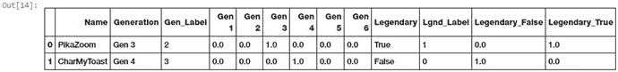

图 4-16。

Feature set depicting one hot encoded features for new pokemon data points

```py
In [14]: new_gen_feature_arr = gen_ohe.transform(new_poke_df[['Gen_Label']]).toarray()
    ...: new_gen_features = pd.DataFrame(new_gen_feature_arr, columns=gen_feature_labels)
    ...:
    ...: new_leg_feature_arr = leg_ohe.transform(new_poke_df[['Lgnd_Label']]).toarray()
    ...: new_leg_features = pd.DataFrame(new_leg_feature_arr, columns=leg_feature_labels)
    ...:
    ...: new_poke_ohe = pd.concat([new_poke_df, new_gen_features, new_leg_features], axis=1)
    ...: columns = sum([['Name', 'Generation', 'Gen_Label'], gen_feature_labels,
    ...:                ['Legendary', 'Lgnd_Label'], leg_feature_labels], [])
    ...: new_poke_ohe[columns]

```

因此，您可以看到我们如何使用`fit_transform(...)`函数来设计数据集上的功能，然后我们能够使用编码器对象来设计新数据上的功能，使用`transform(...)`函数基于它之前观察到的数据，特别是不同的类别及其相应的标签和一个热编码。将来在构建模型时处理训练和测试数据集时，对于任何类型的要素工程，都应始终遵循此工作流。`Pandas`还提供了一个奇妙的功能`to_dummies(...)`，帮助我们轻松地执行一次热编码。下面的代码描述了如何实现这一点。

```py
In [15]: gen_onehot_features = pd.get_dummies(poke_df['Generation'])
    ...: pd.concat([poke_df[['Name', 'Generation']], gen_onehot_features], axis=1).iloc[4:10]
Out[15]:
                  Name Generation  Gen 1  Gen 2  Gen 3  Gen 4  Gen 5  Gen 6
4            Octillery      Gen 2      0      1      0      0      0      0
5           Helioptile      Gen 6      0      0      0      0      0      1
6               Dialga      Gen 4      0      0      0      1      0      0
7  DeoxysDefense Forme      Gen 3      0      0      1      0      0      0
8             Rapidash      Gen 1      1      0      0      0      0      0
9               Swanna      Gen 5      0      0      0      0      1      0

```

输出描述了一个神奇宝贝世代值的热编码方案，类似于我们在之前的分析中描述的。

#### 虚拟编码方案

伪编码方案类似于一个热编码方案，除了在伪编码方案的情况下，当应用于具有 m 个不同标签的分类特征时，我们得到 m-1 个二进制特征。因此，分类变量的每个值都被转换成大小为 m-1 的向量。额外的特征被完全忽略，因此如果类别值的范围从{0，1，...第 0 或第 m-1 个特征通常由全零(0)的向量表示。

以下代码通过删除第一级二进制编码特征(`Gen 1`)来描述神奇宝贝`Generation`上的虚拟编码方案。

```py
In [16]: gen_dummy_features = pd.get_dummies(poke_df['Generation'], drop_first=True)
    ...: pd.concat([poke_df[['Name', 'Generation']], gen_dummy_features], axis=1).iloc[4:10]
Out[16]:
                  Name Generation  Gen 2  Gen 3  Gen 4  Gen 5  Gen 6
4            Octillery      Gen 2      1      0      0      0      0
5           Helioptile      Gen 6      0      0      0      0      1
6               Dialga      Gen 4      0      0      1      0      0
7  DeoxysDefense Forme      Gen 3      0      1      0      0      0
8             Rapidash      Gen 1      0      0      0      0      0
9               Swanna      Gen 5      0      0      0      1      0

```

如果您愿意，您也可以选择通过使用下面的代码来删除最后一级二进制编码的特性(`Gen 6`)。

```py
In [17]: gen_onehot_features = pd.get_dummies(poke_df['Generation'])
    ...: gen_dummy_features = gen_onehot_features.iloc[:,:-1]
    ...: pd.concat([poke_df[['Name', 'Generation']], gen_dummy_features], axis=1).iloc[4:10]
Out[17]:
                  Name Generation  Gen 1  Gen 2  Gen 3  Gen 4  Gen 5
4            Octillery      Gen 2      0      1      0      0      0
5           Helioptile      Gen 6      0      0      0      0      0
6               Dialga      Gen 4      0      0      0      1      0
7  DeoxysDefense Forme      Gen 3      0      0      1      0      0
8             Rapidash      Gen 1      1      0      0      0      0
9               Swanna      Gen 5      0      0      0      0      1

```

因此，从这些输出中，您可以看到，基于我们丢弃的编码级别二进制特征，该特定类别值由一个矢量/编码特征表示，它们都表示`0`。例如，在之前的结果特征集中，神奇宝贝 Heloptile 属于`Gen 6`，并由编码虚拟特征中的所有`0`表示。

#### 效果编码方案

效果编码方案在大多数方面非常类似于虚拟编码方案。然而，对于在虚拟编码方案中表示所有`0`的类别值，编码特征或特征向量在效果编码方案中由`-1`代替。以下代码描述了神奇宝贝`Generation`功能的效果编码方案。

```py
In [18]: gen_onehot_features = pd.get_dummies(poke_df['Generation'])
    ...: gen_effect_features = gen_onehot_features.iloc[:,:-1]
    ...: gen_effect_features.loc[np.all(gen_effect_features == 0, axis=1)] = -1.
    ...: pd.concat([poke_df[['Name', 'Generation']], gen_effect_features], axis=1).iloc[4:10]
Out[18]:
                  Name Generation  Gen 1  Gen 2  Gen 3  Gen 4  Gen 5
4            Octillery      Gen 2    0.0    1.0    0.0    0.0    0.0
5           Helioptile      Gen 6   -1.0   -1.0   -1.0   -1.0   -1.0
6               Dialga      Gen 4    0.0    0.0    0.0    1.0    0.0
7  DeoxysDefense Forme      Gen 3    0.0    0.0    1.0    0.0    0.0
8             Rapidash      Gen 1    1.0    0.0    0.0    0.0    0.0
9               Swanna      Gen 5    0.0    0.0    0.0    0.0    1.0

```

我们可以从输出特征集中清楚地看到，在虚拟编码方案中先前都是`0`的值的情况下，所有的`0`都已经被`-1`替换。

#### 面元计数方案

到目前为止发现的编码方案在分类数据上通常工作得很好，但是当任何特征中不同类别的数量变得非常大时，它们就开始引起问题。对于 m 个不同标签的任何分类特征是必要的，你得到 m 个单独的特征。这很容易增加特征集的大小，从而导致诸如存储问题、关于时间、空间和内存的模型训练问题之类的问题。除此之外，我们还必须处理众所周知的“维数灾难”,在这种情况下，基本上有大量的特征而没有足够的代表性样本，模型性能开始受到影响。因此，对于具有大量可能类别(如 IP 地址)的特征，我们需要寻找其他分类数据特征工程方案。

箱计数方案对于处理具有许多类别的分类变量是有用的。在该方案中，我们使用基于概率的关于值和实际目标或响应值的统计信息，而不是使用实际标签值进行编码，我们的目标是在建模工作中预测这些信息。一个简单的例子是基于 IP 地址和 DDOS 攻击中使用的 IP 地址的历史数据；我们可以为由任何 IP 地址引起的 DDOS 攻击建立概率值。使用该信息，我们可以对输入特征进行编码，该输入特征描述了如果相同的 IP 地址在将来出现，导致 DDOS 攻击的概率值是多少。这个方案需要历史数据作为先决条件，是一个精心制作的方案。用一个完整的例子来描述这一点超出了本章的范围，但是有几个在线资源可以参考。

#### 特征散列方案

特征散列方案是另一种用于处理大规模分类特征的有用的特征工程方案。在该方案中，散列函数通常与预设的编码特征数量(作为预定义长度的向量)一起使用，使得特征的散列值被用作该预定义向量中的索引，并且值被相应地更新。由于哈希函数将大量值映射到一个有限的小值集，多个不同的值可能会创建相同的哈希，这称为冲突。通常，使用带符号的散列函数，使得从散列中获得的值的符号被用作存储在最终特征向量中适当索引处的值的符号。这将确保更少的冲突和由于冲突导致的更少的误差累积。

哈希方案适用于字符串、数字和其他结构，如向量。您可以将哈希输出视为一组有限的 h 容器，这样，当哈希函数应用于相同的值时，它们会根据哈希值被分配到 h 容器中的同一容器。我们可以指定 h 的值，该值成为我们使用特征散列方案编码的每个分类特征的编码特征向量的最终大小。因此，即使我们在一个特征中有超过 1000 个不同的类别，并且我们设置 h = 10，与我们使用一个热编码方案的 1000 个特征相比，输出特征集仍然只有 10 个特征。

让我们看看下面的代码片段，它向我们展示了视频游戏数据集中不同类型的数量。

```py
In [19]: unique_genres = np.unique(vg_df[['Genre']])
    ...: print("Total game genres:", len(unique_genres))
    ...: print(unique_genres)
Total game genres: 12
['Action' 'Adventure' 'Fighting' 'Misc' 'Platform' 'Puzzle' 'Racing'
 'Role-Playing' 'Shooter' 'Simulation' 'Sports' 'Strategy']

```

我们可以从输出中清楚地看到，有 12 种不同的类型，如果我们在`Genre`特性上使用一个 hot 编码方案，我们最终会有 12 个二进制特性。相反，我们现在将通过利用`scikit-learn's FeatureHasher`类来使用一个特性散列方案，它使用了一个带符号的 32 位版本的`Murmurhash3`散列函数。下面的代码向我们展示了如何使用特征散列方案，其中我们将预先设置特征向量大小为 6 (6 个特征而不是 12 个)。

```py
In [21]: from sklearn.feature_extraction import FeatureHasher
    ...:
    ...: fh = FeatureHasher(n_features=6, input_type='string')
    ...: hashed_features = fh.fit_transform(vg_df['Genre'])
    ...: hashed_features = hashed_features.toarray()
    ...: pd.concat([vg_df[['Name', 'Genre']], pd.DataFrame(hashed_features)], axis=1).iloc[1:7]
Out[21]:
                       Name         Genre    0    1    2    3    4    5
1         Super Mario Bros.      Platform  0.0  2.0  2.0 -1.0  1.0  0.0
2            Mario Kart Wii        Racing -1.0  0.0  0.0  0.0  0.0 -1.0
3         Wii Sports Resort        Sports -2.0  2.0  0.0 -2.0  0.0  0.0
4  Pokemon Red/Pokemon Blue  Role-Playing -1.0  1.0  2.0  0.0  1.0 -1.0
5                    Tetris        Puzzle  0.0  1.0  1.0 -2.0  1.0 -1.0
6     New Super Mario Bros.      Platform  0.0  2.0  2.0 -1.0  1.0  0.0

```

因此，我们可以从结果特征集中清楚地看到,`Genre`分类特征已经使用散列方案编码成 6 个特征，而不是 12 个。我们还可以看到，第 1 行和第 6 行表示相同类型的游戏，`Platform`,它们已经按照预期被正确地编码到相同的特征向量中。

## 文本数据的特征工程

处理数字或分类变量等结构化数据属性通常不像文本和图像等非结构化属性那样具有挑战性。对于像文本文档这样的非结构化数据，第一个挑战是处理文档的语法、格式和内容的不可预测性，这使得提取用于构建模型的有用信息成为一个挑战。第二个挑战是将这些文本表示转换成机器学习算法可以理解的数字表示。数据科学家每天使用各种特征工程技术从非结构化文本中提取数字特征向量。在本节中，我们将讨论其中的几种技术。在我们开始之前，您应该记住对文本数据执行特征工程有两个方面。

*   预处理和规范化文本
*   特征提取和工程

如果没有文本预处理和规范化，特征工程技术将无法发挥其核心效率，因此对文本文档进行预处理至关重要。您可以直接加载`feature_engineering_text.py`并开始运行示例，或者使用 jupyter 笔记本`Feature Engineering on Text Data.ipynb`，以获得更具交互性的体验。在开始之前，让我们加载以下必需的依赖项。

```py
In [1]: import pandas as pd
   ...: import numpy as np
   ...: import re
   ...: import nltk

```

现在让我们加载一些示例文本文档，进行一些基本的预处理，并了解处理文本数据的各种特征工程策略。下面的代码创建了我们的示例文本语料库(文本文档的集合)，我们将在本节中使用它。

```py
In [2]: corpus = ['The sky is blue and beautiful.',
   ...:           'Love this blue and beautiful sky!',
   ...:           'The quick brown fox jumps over the lazy dog.',
   ...:           'The brown fox is quick and the blue dog is lazy!',
   ...:           'The sky is very blue and the sky is very beautiful today',
   ...:           'The dog is lazy but the brown fox is quick!'    
   ...: ]
   ...: labels = ['weather', 'weather', 'animals', 'animals', 'weather', 'animals']
   ...: corpus = np.array(corpus)
   ...: corpus_df = pd.DataFrame({'Document': corpus,
   ...:                           'Category': labels})
   ...: corpus_df = corpus_df[['Document', 'Category']]
   ...: corpus_df
Out[2]:
                                            Document Category
0                     The sky is blue and beautiful.  weather
1                  Love this blue and beautiful sky!  weather
2       The quick brown fox jumps over the lazy dog.  animals
3   The brown fox is quick and the blue dog is lazy!  animals
4  The sky is very blue and the sky is very beaut...  weather
5    The dog is lazy but the brown fox is quick!      animals

```

我们可以看到，我们总共有六个文档，其中三个与天气有关，另外三个与动物有关，如`Category`类标签所示。

### 文本预处理

在特征工程之前，我们需要像前面提到的那样对文本进行预处理、清理和规范化。有多种预处理技术，其中一些相当复杂。我们不会在这一节详细讨论，但是我们会在下一章讨论文本分类和情感分析的时候详细讨论。以下是一些流行的预处理技术。

*   文本标记化和小写
*   删除特殊字符
*   收缩膨胀
*   删除停用词
*   纠正拼写
*   堵塞物
*   词汇化

关于这些主题的更多细节，你可以跳到本书的第 [7](07.html) 章，或者参考《用 Python 进行文本分析》第 115 页第 [3](03.html) 章的“文本规范化”一节(ApressDipanjan Sarkar，2016)。详细介绍了这些技术。我们将通过小写、删除特殊字符、标记和删除停用词来规范我们的文本。下面的代码帮助我们实现了这一点。

```py
In [3]: wpt = nltk.WordPunctTokenizer()
   ...: stop_words = nltk.corpus.stopwords.words('english')
   ...:
   ...: def normalize_document(doc):
   ...:     # lower case and remove special characters\whitespaces
   ...:     doc = re.sub(r'[^a-zA-Z0-9\s]', '', doc, re.I)
   ...:     doc = doc.lower()
   ...:     doc = doc.strip()
   ...:     # tokenize document
   ...:     tokens = wpt.tokenize(doc)
   ...:     # filter stopwords out of document
   ...:     filtered_tokens = [token for token in tokens if token not in stop_words]
   ...:     # re-create document from filtered tokens
   ...:     doc = ' '.join(filtered_tokens)
   ...:     return doc
   ...:
   ...: normalize_corpus = np.vectorize(normalize_document)

```

`np.vectorize(...)`函数帮助我们在`numpy`数组的所有元素上运行相同的函数，而不是编写一个循环。我们现在将使用这个函数来预处理我们的文本语料库。

```py
In [4]: norm_corpus = normalize_corpus(corpus)
   ...: norm_corpus
Out[4]:
array(['sky blue beautiful', 'love blue beautiful sky',
       'quick brown fox jumps lazy dog', 'brown fox quick blue dog lazy',
       'sky blue sky beautiful today', 'dog lazy brown fox quick'],
      dtype='<U32')

```

您可以在我们的初始数据框架中将每个文本文档与其原始形式进行比较。你会看到每个文档都是小写的，特殊符号和停用词(像冠词、代词等没有什么意义的词)都被删除了。)已被删除。我们现在可以从这个预处理的语料库中设计特征。

### 词汇袋模型

这可能是从非结构化文本中矢量化特征的最简单而有效的方案之一。该模型的核心原理是将文本文档转换成数字向量。每个向量的维度或大小是 N，其中 N 表示文档语料库中所有可能的不同单词。每个转换后的文档是一个大小为 N 的数字向量，其中向量中的值或权重表示每个单词在该特定文档中的出现频率。下面的代码帮助我们将文本语料库矢量化为数字特征向量。

```py
In [5]: from sklearn.feature_extraction.text import CountVectorizer
   ...:
   ...: cv = CountVectorizer(min_df=0., max_df=1.)
   ...: cv_matrix = cv.fit_transform(norm_corpus)
   ...: cv_matrix = cv_matrix.toarray()
   ...: cv_matrix
Out[5]:
array([[1, 1, 0, 0, 0, 0, 0, 0, 0, 1, 0],
       [1, 1, 0, 0, 0, 0, 0, 1, 0, 1, 0],
       [0, 0, 1, 1, 1, 1, 1, 0, 1, 0, 0],
       [0, 1, 1, 1, 1, 0, 1, 0, 1, 0, 0],
       [1, 1, 0, 0, 0, 0, 0, 0, 0, 2, 1],
       [0, 0, 1, 1, 1, 0, 1, 0, 1, 0, 0]], dtype=int64)

```

像我们之前提到的那样，输出代表每个文档的基于数字术语频率的特征向量。为了更好地理解它，我们可以使用特性名称来表示它，并将其视为一个数据帧。

```py
In [6]: vocab = cv.get_feature_names()
   ...: pd.DataFrame(cv_matrix, columns=vocab)
Out[6]:
   beautiful  blue  brown  dog  fox  jumps  lazy  love  quick  sky  today
0          1     1      0    0    0      0     0     0      0    1      0
1          1     1      0    0    0      0     0     1      0    1      0
2          0     0      1    1    1      1     1     0      1    0      0
3          0     1      1    1    1      0     1     0      1    0      0
4          1     1      0    0    0      0     0     0      0    2      1
5          0     0      1    1    1      0     1     0      1    0      0

```

我们现在可以清楚地看到，数据帧的每一行描述了每个文本文档的术语频率向量。因此得名单词包，因为该模型将非结构化文本表示为单词包，而不考虑单词的位置、语法或语义。

### N 克模型袋

我们在上面提到的单词袋模型中使用了单个单词术语作为特征。但是如果我们也想考虑出现在序列中的短语或单词集合呢？N-grams 帮助我们实现了这一点。n 元语法基本上是来自文本文档的单词标记的集合，使得这些标记是连续的并且按顺序出现。二元语法表示 2 阶的 n 元语法(两个单词)，三元语法表示 3 阶的 n 元语法(三个单词)，依此类推。我们可以很容易地扩展单词袋模型，以使用 n-gram 袋模型来给我们提供基于 n-gram 的特征向量。下面的代码在我们的语料库上计算基于二元语法的特征。

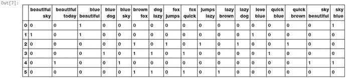

图 4-17。

Bi-gram feature vectors for our corpus based on bag of n-grams model

```py
In [7]: bv = CountVectorizer(ngram_range=(2,2))
   ...: bv_matrix = bv.fit_transform(norm_corpus)
   ...: bv_matrix = bv_matrix.toarray()
   ...: vocab = bv.get_feature_names()
   ...: pd.DataFrame(bv_matrix, columns=vocab)

```

图 [4-17](#Fig17) 清楚地显示了我们的二元模型特征向量，其中每个特征都是两个相邻单词的二元模型，这些值描述了该二元模型在每个文档中的出现频率。您可以使用`ngram_range`参数来扩展 n-gram 范围，以获得更高阶的 n-gram。通常，三阶前的 n 元文法对于机器学习和自然语言处理中的大多数任务都是足够的。

### TF-IDF 模型

词袋模型在用于大型语料库时可能会出现一些潜在的问题。因为特征向量是基于绝对术语频率的，所以可能有一些术语在所有文档中频繁出现，这些术语往往会盖过特征集中的其他术语。TF-IDF 模型试图通过在其计算中使用一个缩放或归一化因子来解决这个问题。TF-IDF 代表术语频率-逆文档频率，它在计算中使用两个度量的组合，即:术语频率(TF)和逆文档频率(IDF)。这项技术是为搜索引擎中的查询结果排序而开发的，现在它是信息检索和文本分析领域中不可或缺的模型。

数学上，我们可以将 TF-IDF 定义为 tfidf = tf x idf，可以进一步展开表示如下。

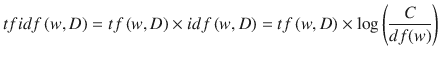T2】

这里，tfidf (w，D)是文档 D 中单词 w 的 TF-IDF 得分。术语 tf (w，D)表示单词 w 在文档 D 中的术语频率，它可以从单词袋模型中获得。项 idf (w，D)是项 w 的逆文档频率，其可以被计算为语料库 C 中的文档总数除以单词 w 的文档频率的对数变换，单词 w 的文档频率基本上是单词 w 出现在语料库中的文档频率。下面的代码描述了我们语料库中基于 TF-IDF 的特征工程。

```py
In [8]: from sklearn.feature_extraction.text import TfidfVectorizer
   ...:
   ...: tv = TfidfVectorizer(min_df=0., max_df=1., use_idf=True)
   ...: tv_matrix = tv.fit_transform(norm_corpus)
   ...: tv_matrix = tv_matrix.toarray()
   ...:
   ...: vocab = tv.get_feature_names()
   ...: pd.DataFrame(np.round(tv_matrix, 2), columns=vocab)

Out[8]:
   beautiful  blue  brown   dog   fox  jumps  lazy  love  quick   sky  today
0       0.60  0.52   0.00  0.00  0.00   0.00  0.00  0.00   0.00  0.60   0.00
1       0.46  0.39   0.00  0.00  0.00   0.00  0.00  0.66   0.00  0.46   0.00
2       0.00  0.00   0.38  0.38  0.38   0.54  0.38  0.00   0.38  0.00   0.00
3       0.00  0.36   0.42  0.42  0.42   0.00  0.42  0.00   0.42  0.00   0.00
4       0.36  0.31   0.00  0.00  0.00   0.00  0.00  0.00   0.00  0.72   0.52
5       0.00  0.00   0.45  0.45  0.45   0.00  0.45  0.00   0.45  0.00   0.00

```

因此，前面的输出描述了每个文本文档的基于 TF-IDF 的特征向量。请注意，与原始的单词包模型相比，这是一个缩放和规范化的版本。感兴趣的读者可能想深入了解这个模型的内部工作原理，可以参考 Python 文本分析的第 181 页(ApressDipanjan Sarkar，2016)。

### 文档相似度

您甚至可以在我们在上一节中设计的基于 tf-idf 的特性的基础上进行构建，并使用它们来生成可用于多种应用的新特性。这方面的一个例子是计算文档相似度。这在搜索引擎、文档聚类和信息检索等领域非常有用。文档相似性是使用基于距离或相似性的度量的过程，该度量可用于基于从文档中提取的特征(如单词袋或 tf-idf)来识别一个文本文档与另一个文档有多相似。语料库中的成对文档相似性涉及计算语料库中每对文档的文档相似性。因此，如果在一个语料库中有 C 个文档，那么最终会得到一个 C×C 矩阵，这样每一行和每一列都代表一对文档的相似性得分，它们分别代表行和列的索引。

有几种用于计算文档相似性的相似性和距离度量。这些包括余弦距离/相似性、BM25 距离、Hellinger-Bhattacharya 距离、jaccard 距离等等。在我们的分析中，我们将使用可能是最流行和最广泛使用的相似性度量，余弦相似性。余弦相似性基本上给出了一种度量，表示两个文本文档的特征向量表示之间的角度的余弦。图 [4-18](#Fig18) 显示了文本文档的一些典型特征向量对齐。

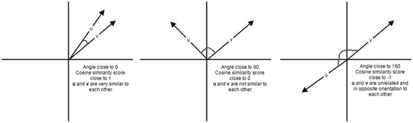

图 4-18。

Cosine similarity depictions for text document feature vectors (Source: Text Analytics with Python, Apress)

从图 [4-18](#Fig18) 中，我们可以清楚地看到，具有相似方向的特征向量将彼此非常接近，它们之间的角度将更接近于 0，因此余弦相似度将为 cos 0 = 1。当余弦相似度接近于 cos 90 = 0 时，文档之间的角度更接近于 90，表明它们相距很远，因此不是非常相似。相似性分数接近-1 表示文档具有完全相反的方向，因为它们之间的角度接近 180 度。下面的代码帮助我们计算样本语料库中所有文档的成对余弦相似度。

```py
In [9]: from sklearn.metrics.pairwise import cosine_similarity
   ...:
   ...: similarity_matrix = cosine_similarity(tv_matrix)
   ...: similarity_df = pd.DataFrame(similarity_matrix)
   ...: similarity_df
Out[9]:
          0         1         2         3         4         5
0  1.000000  0.753128  0.000000  0.185447  0.807539  0.000000
1  0.753128  1.000000  0.000000  0.139665  0.608181  0.000000
2  0.000000  0.000000  1.000000  0.784362  0.000000  0.839987
3  0.185447  0.139665  0.784362  1.000000  0.109653  0.933779
4  0.807539  0.608181  0.000000  0.109653  1.000000  0.000000
5  0.000000  0.000000  0.839987  0.933779  0.000000  1.000000

```

从前面输出中获得的成对相似性矩阵中，我们可以清楚地看到，文档 0、1 和 4 彼此之间具有非常强的相似性。此外，文档 2、3 和 5 在它们之间具有很强的相似性。这一定表明它们都有一些相似的特征。这是一个可以通过无监督学习解决的分组或聚类的完美例子。

让我们使用 K-means 聚类来尝试使用这些特征，看看我们是否可以基于它们的特征表示来实际聚类或分组这些文档。在 K-means 聚类中，我们有一个输入参数 K，它指定了使用文档特征输出的聚类数。这种聚类方法是一种基于质心的聚类方法，它试图将这些文档聚类成等方差的聚类。它试图通过最小化类内平方和度量(也称为惯性)来创建这些类。下面的代码片段构建了一个聚类模型，使用我们的相似性特征对我们的文本文档进行聚类。

```py
In [10]: from sklearn.cluster import KMeans
    ...:
    ...: km = KMeans(n_clusters=2)
    ...: km.fit_transform(similarity_df)
    ...: cluster_labels = km.labels_
    ...: cluster_labels = pd.DataFrame(cluster_labels, columns=['ClusterLabel'])
    ...: pd.concat([corpus_df, cluster_labels], axis=1)
Out[10]:
                                            Document Category  ClusterLabel
0                     The sky is blue and beautiful.  weather             0
1                  Love this blue and beautiful sky!  weather             0
2       The quick brown fox jumps over the lazy dog.  animals             1
3   The brown fox is quick and the blue dog is lazy!  animals             1
4  The sky is very blue and the sky is very beaut...  weather             0
5        The dog is lazy but the brown fox is quick!  animals             1

```

获得的输出清楚地向我们显示，我们的 K-means 聚类模型已经将我们的文档标记为带有标签 0 和 1 的两个聚类。我们还可以看到，这些标签是正确的，其中值为 0 的标签表示与天气相关的文档，值为 1 的标签表示与动物相关的文档。因此，您可以看到这些特性在文档聚类和分类中是多么有用！

### 主题模型

除了文档术语、短语和相似性，我们还可以使用一些摘要技术从文本文档中提取基于主题或概念的特征。主题模型的思想围绕着从表示为主题的文档语料库中提取关键主题或概念的过程。每个主题可以被表示为来自文档语料库的单词/术语的包或集合。总的来说，这些术语表示特定的主题、主题或概念，并且每个主题可以通过这些术语所传达的语义来容易地与其他主题区分开来。这些概念可以从简单的事实和陈述到观点和展望。主题模型在总结大量文本文档以提取和描述关键概念时非常有用。它们还可用于从文本数据中提取特征，以捕捉数据中的潜在模式。

主题建模有多种技术，其中大多数都涉及某种形式的矩阵分解。像潜在语义索引(LSI)这样的一些技术使用矩阵分解操作，更具体地说是奇异值分解(参考第 [1](01.html) 章中的重要数学概念)，将术语-文档矩阵(我们的 TF-IDF 文档-术语特征矩阵的转置)分成三个矩阵，U，S & V <sup>T</sup> 。您可以使用矩阵 U 中左边的奇异向量，并将其乘以奇异向量 S，以获得每个主题的术语及其权重(表示重要性)。您可以使用`scikit-learn`或`gensim`来使用基于 LSI 的主题建模。

另一种技术是潜在狄利克雷分配(LDA ),它使用生成概率模型，其中每个文档由几个主题的组合组成，每个术语或单词可以被分配给特定的主题。这类似于基于 pLSI 的模型(概率 LSI)。在 LDA 的情况下，每个潜在主题包含一个 Dirichlet 先验。这背后的数学是相当复杂的，在当前的范围内不可能深入细节。感兴趣的读者可以参考《用 Python 进行文本分析》(ApressDipanjan Sarkar，2016 年)。出于特征工程的目的，您需要记住，当 LDA 应用于文档术语矩阵(TF-IDF 特征矩阵)时，它被分解为两个主要部分。一个文档-主题矩阵，这将是我们正在寻找的特征矩阵和一个主题-术语矩阵，这有助于我们在语料库中寻找潜在的主题。下面的代码构建了一个 LDA 模型，从我们的样本语料库中提取特征和主题。

```py
In [11]: from sklearn.decomposition import LatentDirichletAllocation
    ...:
    ...: lda = LatentDirichletAllocation(n_topics=2, max_iter=100, random_state=42)
    ...: dt_matrix = lda.fit_transform(tv_matrix)
    ...: features = pd.DataFrame(dt_matrix, columns=['T1', 'T2'])
    ...: features
Out[11]:
         T1        T2
0  0.190615  0.809385
1  0.176860  0.823140
2  0.846148  0.153852
3  0.815229  0.184771
4  0.180563  0.819437
5  0.839140  0.160860

```

因此，`dt_matrix`指的是文档-主题矩阵，它给了我们两个特征，因为我们选择主题的数量为 2。您还可以使用从分解中获得的另一个矩阵，即主题术语矩阵，来查看使用 LDA 模型从我们的语料库中提取的主题。

```py
In [12]: tt_matrix = lda.components_
    ...: for topic_weights in tt_matrix:
    ...:     topic = [(token, weight) for token, weight in zip(vocab, topic_weights)]
    ...:     topic = sorted(topic, key=lambda x: -x[1])
    ...:     topic = [item for item in topic if item[1] > 0.6]
    ...:     print(topic)
    ...:     print()
[('fox', 1.7265536238698524), ('quick', 1.7264910761871224), ('dog', 1.7264019823624879), ('brown', 1.7263774760262807), ('lazy', 1.7263567668213813), ('jumps', 1.0326450363521607), ('blue', 0.7770158513472083)]

[('sky', 2.263185143458752), ('beautiful', 1.9057084998062579), ('blue', 1.7954559705805626), ('love', 1.1476805311187976), ('today', 1.0064979209198706)]

```

前面的输出将两个主题中的每一个都表示为术语的集合，它们的重要性由相应的权重来描述。看到这两个主题在术语上有很大的不同，这绝对是一件有趣的事情。第一个主题显示与动物相关的术语，第二个主题显示与天气相关的术语。通过使用下面的代码片段在我们的文档主题特征矩阵(`dt_matrix`)上应用我们的无监督 K-means 聚类算法，这得到了加强。

```py
In [13]: km = KMeans(n_clusters=2)
    ...: km.fit_transform(features)
    ...: cluster_labels = km.labels_
    ...: cluster_labels = pd.DataFrame(cluster_labels, columns=['ClusterLabel'])
    ...: pd.concat([corpus_df, cluster_labels], axis=1)
Out[13]:
                                            Document Category  ClusterLabel
0                     The sky is blue and beautiful.  weather             0
1                  Love this blue and beautiful sky!  weather             0
2       The quick brown fox jumps over the lazy dog.  animals             1
3   The brown fox is quick and the blue dog is lazy!  animals             1
4  The sky is very blue and the sky is very beaut...  weather             0
5        The dog is lazy but the brown fox is quick!  animals             1

```

这显然是有意义的，我们可以看到，通过使用两个基于主题模型的特性，我们仍然能够有效地对我们的文档进行聚类！

### 单词嵌入

有几个高级的单词矢量化模型最近获得了很多关注。几乎所有的书都涉及单词嵌入的概念。基本上，单词嵌入可以用于特征提取和语言建模。这种表示试图将每个单词或短语映射到完整的数字向量中，使得语义相似的单词或术语倾向于彼此更接近地出现，并且可以使用这些嵌入来量化它们。`word2vec`模型可能是最流行的基于神经网络的概率语言模型之一，可用于学习单词的分布式表示向量。由`word2vec`产生的单词嵌入涉及获取文本文档的语料库，在大的高维向量空间中表示单词，使得每个单词在该空间中具有相应的向量，并且相似的单词(甚至在语义上)彼此靠近，类似于我们之前在文档相似性中观察到的。

`word2vec`模型由谷歌于 2013 年发布，使用基于神经网络的实现，具有连续单词包和 Skip-gram 等架构，以学习语料库中单词的分布式向量表示。我们将使用`gensim`框架在我们的语料库上实现相同的模型来提取特征。模型中的一些重要参数简要解释如下。

*   `size`:表示语料库中每个词变换后的特征向量大小。
*   `window`:设置上下文窗口大小，指定在训练时被认为属于单个相似上下文的单词窗口的长度。
*   `min_count`:指定在训练模型期间，将单词视为最终词汇的一部分所需的整个语料库的最小词频值。
*   `sample`:用于缩减频繁出现的单词的效果。

下面的代码片段在我们的样本语料库的文档上构建了一个`word2vec`嵌入模型。记住在将每个文档传递给模型之前对其进行标记。

```py
In [14]: from gensim.models import word2vec
    ...:
    ...: wpt = nltk.WordPunctTokenizer()
    ...: tokenized_corpus = [wpt.tokenize(document) for document in norm_corpus]
    ...:
    ...: # Set values for various parameters
    ...: feature_size = 10    # Word vector dimensionality  
    ...: window_context = 10          # Context window size
    ...: min_word_count = 1   # Minimum word count
    ...: sample = 1e-3   # Downsample setting for frequent words
    ...:
    ...: w2v_model = word2vec.Word2Vec(tokenized_corpus, size=feature_size,
    ...:                           window=window_context, min_count = min_word_count,
    ...:                           sample=sample)
Using TensorFlow backend.

```

语料库中的每个单词本质上都是一个大小为 10 的向量。我们可以使用下面的代码验证这一点。

```py
In [15]: w2v_model.wv['sky']
Out[15]:
array([ 0.02626196, -0.02171229, -0.04910386,  0.0194816 ,  0.01649994,
        0.01200452,  0.04641563,  0.01844106,  0.02693636, -0.02992732], dtype=float32)

```

到目前为止，我们对每个完整的文档都有特征向量，但现在我们对每个单词都有向量，这可能会让你产生疑问。现在我们究竟如何表示整个文档呢？我们可以通过各种聚合和组合来做到这一点。一种简单的方案是使用平均的单词向量表示，其中我们简单地将文档中出现的所有单词向量相加，然后除以单词向量的计数来表示文档的平均单词向量。下面的代码使我们能够做到这一点。

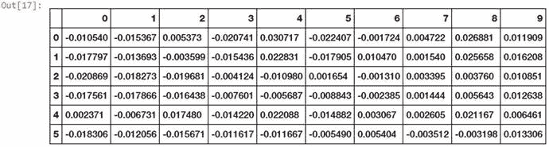

图 4-19。

Averaged word vector feature set for our corpus documents

```py
In [16]: def average_word_vectors(words, model, vocabulary, num_features):
    ...:
    ...:     feature_vector = np.zeros((num_features,),dtype="float64")
    ...:     nwords = 0.
    ...:
    ...:     for word in words:
    ...:         if word in vocabulary:
    ...:             nwords = nwords + 1.
    ...:             feature_vector = np.add(feature_vector, model[word])
    ...:
    ...:     if nwords:
    ...:         feature_vector = np.divide(feature_vector, nwords)
    ...:
    ...:     return feature_vector
    ...:
    ...:
    ...: def averaged_word_vectorizer(corpus, model, num_features):
    ...:     vocabulary = set(model.wv.index2word)
    ...:     features = [average_word_vectors(tokenized_sentence, model, vocabulary,
                                             num_features)
    ...:                     for tokenized_sentence in corpus]
    ...:     return np.array(features)

In [17]: w2v_feature_array = averaged_word_vectorizer(corpus=tokenized_corpus, model=w2v_model,
    ...:                                              num_features=feature_size)
    ...: pd.DataFrame(w2v_feature_array)

```

因此，我们为所有语料库文档建立了基于平均词向量的特征集，如图 [4-19](#Fig19) 中的数据帧所示。让我们使用一种不同的聚类算法，这一次称为相似性传播，尝试根据这些新特性对我们的文档进行聚类。相似性传播基于消息传递的概念，您不需要像在 K-means 聚类中那样预先指定聚类的数量。

```py
In [18]: from sklearn.cluster import AffinityPropagation
    ...:
    ...: ap = AffinityPropagation()
    ...: ap.fit(w2v_feature_array)
    ...: cluster_labels = ap.labels_
    ...: cluster_labels = pd.DataFrame(cluster_labels, columns=['ClusterLabel'])
    ...: pd.concat([corpus_df, cluster_labels], axis=1)
Out[18]:
                                            Document Category  ClusterLabel
0                     The sky is blue and beautiful.  weather             0
1                  Love this blue and beautiful sky!  weather             0
2       The quick brown fox jumps over the lazy dog.  animals             1
3   The brown fox is quick and the blue dog is lazy!  animals             1
4  The sky is very blue and the sky is very beaut...  weather             0
5        The dog is lazy but the brown fox is quick!  animals             1

```

前面的输出使用基于单词嵌入的平均单词向量来对我们语料库中的文档进行聚类，我们可以清楚地看到它获得了正确的聚类！还有其他几种聚合单词向量的方案，例如使用 TF-IDF 权重和单词向量表示。除此之外，深度学习领域最近也取得了一些进展，像 RNNs 和 LSTMs 这样的架构也用于文本数据的工程特征。

## 时态数据的特征工程

时态数据包含在一段时间内发生变化的数据集，基于时间的属性在这些数据集中至关重要。通常，时态属性包括某种形式的数据、时间和时间戳值，并且通常可选地包括其他元数据，如时区、夏令时信息等。时态数据，尤其是基于时间序列的数据，广泛应用于股票、商品和天气预报等多个领域。您可以直接加载`feature_engineering_temporal.py`并开始运行示例，或者使用 jupyter 笔记本`Feature Engineering on Temporal Data.ipynb`，以获得更具交互性的体验。在我们继续获取一些时态数据之前，让我们加载以下依赖项。

```py
In [1]: import datetime
   ...: import numpy as np
   ...: import pandas as pd
   ...: from dateutil.parser import parse
   ...: import pytz

```

现在，我们将通过在 dataframe 中加载以下值，使用一些基于时间的示例数据作为时态数据源。

```py
In [2]: time_stamps = ['2015-03-08 10:30:00.360000+00:00', '2017-07-13 15:45:05.755000-07:00',
   ...:                '2012-01-20 22:30:00.254000+05:30', '2016-12-25 00:30:00.000000+10:00']
   ...: df = pd.DataFrame(time_stamps, columns=['Time'])
   ...: df
Out[2]:
                               Time
0  2015-03-08 10:30:00.360000+00:00
1  2017-07-13 15:45:05.755000-07:00
2  2012-01-20 22:30:00.254000+05:30
3  2016-12-25 00:30:00.000000+10:00

```

当然，默认情况下，它们以字符串或文本的形式存储在 dataframe 中，因此我们可以使用下面的代码片段将时间转换成`Timestamp`对象。

```py
In [3]: ts_objs = np.array([pd.Timestamp(item) for item in np.array(df.Time)])
   ...: df['TS_obj'] = ts_objs
   ...: ts_objs
Out[3]:
array([Timestamp('2015-03-08 10:30:00.360000+0000', tz='UTC'),
       Timestamp('2017-07-13 15:45:05.755000-0700', tz='pytz.FixedOffset(-420)'),
       Timestamp('2012-01-20 22:30:00.254000+0530', tz='pytz.FixedOffset(330)'),
       Timestamp('2016-12-25 00:30:00+1000', tz='pytz.FixedOffset(600)')], dtype=object)

```

您可以从时态值中清楚地看到，我们为每个`Timestamp`对象提供了多个组件，包括日期、时间，甚至基于时间的偏移量，这也可以用来标识时区。当然，我们无法在任何机器学习模型中直接吸收或使用这些功能。因此，我们需要特定的策略来从这些数据中提取有意义的特征。在接下来的章节中，我们将介绍一些您将来可以在自己的时态数据上使用的策略。

### 基于日期的功能

每个时态值都有一个日期部分，可用于提取与日期相关的有用信息和特征。这些特性和组件包括年、月、日、季度、星期几、日名、一年中的日和周等等。下面的代码描述了我们如何从时态数据中获取这些特征。

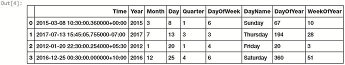

图 4-20。

Date based features in temporal data

```py
In [4]: df['Year'] = df['TS_obj'].apply(lambda d: d.year)
   ...: df['Month'] = df['TS_obj'].apply(lambda d: d.month)
   ...: df['Day'] = df['TS_obj'].apply(lambda d: d.day)
   ...: df['DayOfWeek'] = df['TS_obj'].apply(lambda d: d.dayofweek)
   ...: df['DayName'] = df['TS_obj'].apply(lambda d: d.weekday_name)
   ...: df['DayOfYear'] = df['TS_obj'].apply(lambda d: d.dayofyear)
   ...: df['WeekOfYear'] = df['TS_obj'].apply(lambda d: d.weekofyear)
   ...: df['Quarter'] = df['TS_obj'].apply(lambda d: d.quarter)
   ...:
   ...: df[['Time', 'Year', 'Month', 'Day', 'Quarter',
   ...:     'DayOfWeek', 'DayName', 'DayOfYear', 'WeekOfYear']]

```

图 [4-20](#Fig20) 中描述的特征显示了我们之前讨论过的一些属性，这些属性完全是从每个时态值的日期段中派生出来的。这些特征中的每一个都可以用作分类特征，并且可以进行进一步的特征工程，例如热编码、聚合、宁滨等等。

### 基于时间的特征

每个时间值也有一个时间部分，可用于提取与时间相关的有用信息和特征。这些属性包括小时、分钟、秒、微秒、UTC 偏移量等等。下面的代码片段从我们的时态数据中提取了一些前面提到的基于时间的特征。

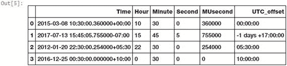

图 4-21。

Time based features in temporal data

```py
In [5]: df['Hour'] = df['TS_obj'].apply(lambda d: d.hour)
   ...: df['Minute'] = df['TS_obj'].apply(lambda d: d.minute)
   ...: df['Second'] = df['TS_obj'].apply(lambda d: d.second)
   ...: df['MUsecond'] = df['TS_obj'].apply(lambda d: d.microsecond)
   ...: df['UTC_offset'] = df['TS_obj'].apply(lambda d: d.utcoffset())
   ...:
   ...: df[['Time', 'Hour', 'Minute', 'Second', 'MUsecond', 'UTC_offset']]

```

图 [4-21](#Fig21) 中描述的特征显示了我们之前讨论过的一些属性，这些属性完全是从每个时态值的时间段中得出的。我们可以基于分类特征工程技术进一步设计这些特征，甚至派生出其他特征，如提取时区。让我们通过利用刚刚获得的`Hour`特性，尝试使用宁滨将每个时态值绑定到一天中的特定时间。

```py
In [6]: hour_bins = [-1, 5, 11, 16, 21, 23]
   ...: bin_names = ['Late Night', 'Morning', 'Afternoon', 'Evening', 'Night']
   ...: df['TimeOfDayBin'] = pd.cut(df['Hour'],
   ...:                             bins=hour_bins, labels=bin_names)
   ...: df[['Time', 'Hour', 'TimeOfDayBin']]
Out[6]:
                               Time  Hour TimeOfDayBin
0  2015-03-08 10:30:00.360000+00:00    10      Morning
1  2017-07-13 15:45:05.755000-07:00    15    Afternoon
2  2012-01-20 22:30:00.254000+05:30    22        Night
3  2016-12-25 00:30:00.000000+10:00     0   Late Night

```

因此，您可以从前面的输出中看到，基于小时范围(0-5、5-11、11-16、16-21、21-23 ),我们为每个时态值分配了一天中的特定时间。时态数据的 UTC 偏移部分对于了解该时间值相对于 UTC(协调世界时)的超前或滞后程度非常有用，UTC 是调整时钟和时间的主要时间标准。此信息还可用于设计新的要素，如可能从中获取每个时态值的潜在时区。下面的代码帮助我们实现了同样的目标。

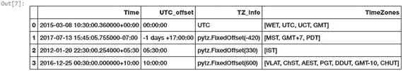

图 4-22。

Time zone relevant features in temporal data

```py
In [7]: df['TZ_info'] = df['TS_obj'].apply(lambda d: d.tzinfo)
   ...: df['TimeZones'] = df['TS_obj'].apply(lambda d: list({d.astimezone(tz).tzname()
   ...:                                for tz in map(pytz.timezone,
   ...:                                              pytz.all_timezones_set)
   ...:                                  if d.astimezone(tz).utcoffset() == d.utcoffset()}))
   ...:
   ...: df[['Time', 'UTC_offset', 'TZ_info', 'TimeZones']]

```

因此，正如我们之前提到的，图 [4-22](#Fig22) 中描述的特征显示了与每个时间值的时区相关信息相关的一些属性。我们还可以获得其他格式的时间组件，如 Epoch，它基本上是自 1970 年 1 月 1 日(午夜 UTC)以来经过的秒数，以及 Gregorian 序数，其中第 1 年的 1 月 1 日表示为 1，以此类推。下面的代码帮助我们提取这些表示。见图 [4-23](#Fig23) 。

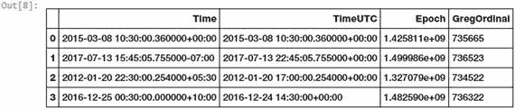

图 4-23。

Time components depicted in various representations

```py
In [8]: df['TimeUTC'] = df['TS_obj'].apply(lambda d: d.tz_convert(pytz.utc))
   ...: df['Epoch'] = df['TimeUTC'].apply(lambda d: d.timestamp())
   ...: df['GregOrdinal'] = df['TimeUTC'].apply(lambda d: d.toordinal())
   ...:
   ...: df[['Time', 'TimeUTC', 'Epoch', 'GregOrdinal']]

```

请注意，在导出其他特征之前，我们将每个时态值转换为 UTC。这些时间的交替表示可以进一步用于简单的日期运算。纪元给我们以秒为单位的时间，格列高利序数给我们以天为单位的时间。我们可以使用它来获得更多的特性，比如从当前时间开始的时间，或者从基于我们试图解决的问题的重要事件开始的时间。让我们计算自当前时间以来每个时态值所经过的时间。参见图 [4-24](#Fig24) 。

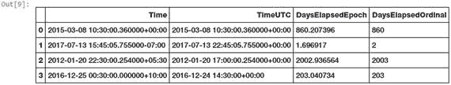

图 4-24。

Deriving elapsed time difference from current time

```py
In [9]: curr_ts = datetime.datetime.now(pytz.utc)
   ...: # compute days elapsed since today
   ...: df['DaysElapsedEpoch'] = (curr_ts.timestamp() - df['Epoch']) / (3600*24)
   ...: df['DaysElapsedOrdinal'] = (curr_ts.toordinal() - df['GregOrdinal'])
   ...:
   ...: df[['Time', 'TimeUTC', 'DaysElapsedEpoch', 'DaysElapsedOrdinal']]

```

根据我们的计算，每一个新的派生特征应该给出当前时间和`Time`列中的时间值之间的时间差(实际上是`TimeUTC`，因为需要转换为 UTC)。这两个值几乎相等，这是意料之中的。因此，您可以使用时间和日期算法来提取和设计更多有助于构建更好模型的特征。替代时间表示使您能够直接进行日期时间运算，而不是处理来自 Python 的`Timestamp`和`datetime`对象的特定 API 方法。然而，你可以使用任何方法来得到你想要的结果。一切都是为了易用性和效率！

## 图像数据的特征工程

另一种非常流行的非结构化数据格式是图像。图像、视频和音频形式的声音和视觉数据是非常流行的数据源，在处理、存储、特征提取和建模方面给数据科学家带来了很多挑战。然而，它们作为数据源的好处是相当可观的，尤其是在人工智能和计算机视觉领域。由于数据的非结构化性质，不可能直接使用图像来训练模型。如果给你一张原始图像，你可能很难想出表示它的方法，以便任何机器学习算法都可以利用它进行模型训练。在这种情况下，可以使用各种策略和技术从图像中设计正确的特征。处理图像时要记住的一个核心原则是，任何图像都可以表示为数字像素值的矩阵。有了这个想法，让我们开始吧！您可以直接加载`feature_engineering_image.py`并开始运行示例，或者使用 jupyter 笔记本`Feature Engineering on Image Data.ipynb`，以获得更具交互性的体验。让我们从加载必要的依赖项和配置设置开始。

```py
In [1]: import skimage
   ...: import numpy as np
   ...: import pandas as pd
   ...: import matplotlib.pyplot as plt
   ...: from skimage import io
   ...:
   ...: %matplotlib inline

```

`scikit-image` ( `skimage`)库是一个优秀的框架，由几个有用的接口和算法组成，用于图像处理和特征提取。除此之外，我们还将利用`mahotas`框架，这在计算机视觉和图像处理中很有用。Open CV 是另一个有用的框架，如果你对与计算机视觉相关的方面感兴趣，可以去看看。现在让我们看看如何将图像表示为有用的特征向量表示。

### 图像元数据功能

即使不处理图像，也可以从图像元数据本身获得大量有用的特性。这些信息中的大部分可以从 EXIF 数据中找到，该数据通常是在拍摄照片时由设备为每幅图像记录的。以下是可从影像 EXIF 数据中获得的一些常见特征。

*   图像创建日期和时间
*   图像尺寸
*   图像压缩格式
*   设备品牌和型号
*   图像分辨率和纵横比
*   图像艺术家
*   闪光灯、光圈、焦距和曝光

有关哪些其他数据点可以用作影像 EXIF 元数据的特征的更多详细信息，您可以参考 [`https://sno.phy.queensu.ca/~phil/exiftool/TagNames/EXIF.html`](https://sno.phy.queensu.ca/%7Ephil/exiftool/TagNames/EXIF.html) ，其中列出了可能的 EXIF 标签。

### 原始图像和通道像素

图像可以由每个像素的值表示为二维数组。为此，我们可以利用 numpy 数组。然而，彩色图像通常有三个组成部分，也称为通道。`R`、`G`和`B`通道分别代表红色、绿色和蓝色通道。这可以表示为三维数组`(m, n, c)`，其中`m`表示图像中的行数，`n`表示列数。这些由图像尺寸决定。`c`表示代表哪个通道(`R`、`G`或`B`)。现在让我们加载一些样本彩色图像，并尝试理解它们的表示。


图 4-25。

Our two sample color images

```py
In [2]: cat = io.imread('datasets/cat.png')
   ...: dog = io.imread('datasets/dog.png')
   ...: df = pd.DataFrame(['Cat', 'Dog'], columns=['Image'])
   ...:
   ...: print(cat.shape, dog.shape)
(168, 300, 3) (168, 300, 3)

In [3]: fig = plt.figure(figsize = (8,4))
   ...: ax1 = fig.add_subplot(1,2, 1)
   ...: ax1.imshow(cat)
   ...: ax2 = fig.add_subplot(1,2, 2)
   ...: ax2.imshow(dog)

```

我们可以从图 [4-25](#Fig25) 中清楚地看到，我们有两张尺寸为`168x300`像素的猫和狗的图像，其中每一行和每一列表示图像的一个特定像素。第三维表示这些是具有三个颜色通道的彩色图像。现在让我们尝试使用`numpy`索引来分别为狗图像分割和提取三个颜色通道。

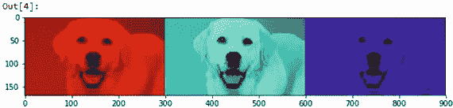

图 4-26。

Extracting red, green, and blue channels from our color RGB image

```py
In [4]: dog_r = dog.copy() # Red Channel
   ...: dog_r[:,:,1] = dog_r[:,:,2] = 0 # set G,B pixels = 0
   ...: dog_g = dog.copy() # Green Channel
   ...: dog_g[:,:,0] = dog_r[:,:,2] = 0 # set R,B pixels = 0
   ...: dog_b = dog.copy() # Blue Channel
   ...: dog_b[:,:,0] = dog_b[:,:,1] = 0 # set R,G pixels = 0
   ...:
   ...: plot_image = np.concatenate((dog_r, dog_g, dog_b), axis=1)
   ...: plt.figure(figsize = (10,4))
   ...: plt.imshow(plot_image)

```

从图 [4-26](#Fig26) 中我们可以清楚地看到，我们是如何轻松地使用`numpy`索引并从样本图像中提取出三个颜色通道的。现在，您可以参考这些通道的任何原始图像像素矩阵，如果需要，甚至可以将其展平以形成特征向量。

```py
In [5]: dog_r[:,:,0]
Out[5]:
array([[160, 160, 160, ..., 113, 113, 112],
       [160, 160, 160, ..., 113, 113, 112],
       ...,
       [165, 165, 165, ..., 212, 211, 210],
       [165, 165, 165, ..., 210, 210, 209],
       [164, 164, 164, ..., 209, 209, 209]], dtype=uint8)

```

这个图像像素矩阵是一个二维矩阵，因此您可以从中进一步提取特征，甚至将其展平为一维向量，以用作任何机器学习算法的输入。

### 灰度图像像素

如果您正在处理彩色图像，使用多通道和三维阵列可能会变得困难。因此，将图像转换为灰度是保持必要的像素亮度值的一种好方法，但可以轻松处理二维图像。灰度图像通常捕捉每个像素的亮度或强度，使得每个像素值可以使用以下等式来计算

Y = 0.2125 x R + 0.7154 x G + 0.0721 x B

其中 R、G 和 B 是三个通道的像素值，Y 捕获最终的像素强度信息，其范围通常从`0`(完全强度缺失-黑色)到`1`(完全强度存在-白色)。下面的代码片段向我们展示了如何将`RGB`彩色图像转换为灰度，并提取原始像素值，这些值可以用作特征。

```py
In [6]: from skimage.color import rgb2gray
   ...:
   ...: cgs = rgb2gray(cat)
   ...: dgs = rgb2gray(dog)
   ...:
   ...: print('Image shape:', cgs.shape, '\n')
   ...:
   ...: # 2D pixel map
   ...: print('2D image pixel map')
   ...: print(np.round(cgs, 2), '\n')
   ...:
   ...: # flattened pixel feature vector
   ...: print('Flattened pixel map:', (np.round(cgs.flatten(), 2)))
Image shape: (168, 300)

2D image pixel map
[[ 0.42  0.41  0.41 ...,  0.5   0.52  0.53]
 [ 0.41  0.41  0.4  ...,  0.51  0.52  0.54]
 ...,
 [ 0.11  0.11  0.1  ...,  0.51  0.51  0.51]
 [ 0.11  0.11  0.1  ...,  0.51  0.51  0.51]]

Flattened pixel map: [ 0.42  0.41  0.41 ...,  0.51  0.51  0.51]

```

### 宁滨图像强度分布

我们已经在前一部分中获得了灰度图像的原始图像强度值。一种方法是使用这些原始像素值本身作为特征。另一种方法是使用直方图并使用面元作为特征，基于强度值对图像强度分布进行宁滨。下面的代码片段向我们展示了两个样本图像的图像强度分布。

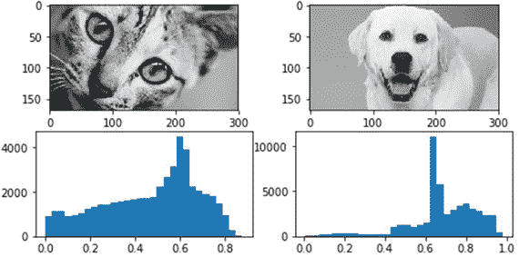

图 4-27。

Binning image intensity distributions with histograms

```py
In [7]: fig = plt.figure(figsize = (8,4))
   ...: ax1 = fig.add_subplot(2,2, 1)
   ...: ax1.imshow(cgs, cmap="gray")
   ...: ax2 = fig.add_subplot(2,2, 2)
   ...: ax2.imshow(dgs, cmap='gray')
   ...: ax3 = fig.add_subplot(2,2, 3)
   ...: c_freq, c_bins, c_patches = ax3.hist(cgs.flatten(), bins=30)
   ...: ax4 = fig.add_subplot(2,2, 4)
   ...: d_freq, d_bins, d_patches = ax4.hist(dgs.flatten(), bins=30)

```

正如我们所提到的，图像强度的范围从`0`到`1`，并且在图 [4-27](#Fig27) 中描绘的 x 轴上很明显。y 轴描绘了各个仓的频率。我们可以清楚地看到，狗图像在`0.6 - 0.8`周围具有更多的箱频率集中，这表明强度更高，其原因是拉布拉多犬是白色的，白色具有高强度值，就像我们在上一节中提到的那样。变量`c_freq`、`c_bins`和`d_freq`、`d_bins`可用于获取与箱相关的数值，并用作特征。

### 图像聚合统计

我们已经在前一部分中获得了灰度图像的原始图像强度值。一种方法是直接使用它们作为特征，或者使用可以从像素和强度获得的某种级别的聚集和统计测量。我们已经看到了使用直方图的宁滨强度值的方法。在本节中，我们使用描述性统计测量和聚合来计算图像像素值的特定特征。

我们可以通过从每个通道的像素值的最小值中减去最大值来计算每个图像的 RGB 范围。下面的代码帮助我们实现了这一点。

```py
In [8]: from scipy.stats import describe
   ...:
   ...: cat_rgb = cat.reshape((168*300), 3).T
   ...: dog_rgb = dog.reshape((168*300), 3).T
   ...:
   ...: cs = describe(cat_rgb, axis=1)
   ...: ds = describe(dog_rgb, axis=1)
   ...:
   ...: cat_rgb_range = cs.minmax[1] - cs.minmax[0]
   ...: dog_rgb_range = ds.minmax[1] - ds.minmax[0]
   ...: rgb_range_df = pd.DataFrame([cat_rgb_range, dog_rgb_range],
   ...:                             columns=['R_range', 'G_range', 'B_range'])
   ...: pd.concat([df, rgb_range_df], axis=1)
Out[8]:
  Image  R_range  G_range  B_range
0   Cat      240      223      235
1   Dog      246      250      246

```

然后，我们可以使用这些范围特征作为每个图像的特定特征属性。除此之外，我们还可以为每个图像通道计算其他指标，如平均值、中值、方差、偏斜度和峰度，如下所示。

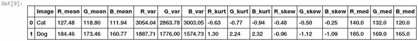

图 4-28。

Image channel aggregation statistical features

```py
In [9]: cat_stats= np.array([np.round(cs.mean, 2),np.round(cs.variance, 2),
   ...:                      np.round(cs.kurtosis, 2),np.round(cs.skewness, 2),
   ...:                      np.round(np.median(cat_rgb, axis=1), 2)]).flatten()
   ...: dog_stats= np.array([np.round(ds.mean, 2),np.round(ds.variance, 2),
   ...:                         np.round(ds.kurtosis, 2),np.round(ds.skewness, 2),
   ...:                         np.round(np.median(dog_rgb, axis=1), 2)]).flatten()
   ...:
   ...: stats_df = pd.DataFrame([cat_stats, dog_stats],
   ...:                         columns=['R_mean', 'G_mean', 'B_mean', 'R_var', 'G_var',                                                       
   ...:                                  'B_var', 'R_kurt', 'G_kurt', 'B_kurt', 'R_skew',
   ...:                                  'G_skew', 'B_skew', 'R_med', 'G_med', 'B_med'])
   ...: pd.concat([df, stats_df], axis=1)

```

我们可以从图 [4-28](#Fig28) 中获得的特征观察到，狗图像的各个通道的均值、中值和峰度值大多大于猫图像中的相应值。然而，猫图像的方差和偏斜度更大。

### 边缘检测

更有趣和复杂的技术之一涉及检测图像中的边缘。边缘检测算法可用于检测图像中明显的强度和亮度变化，并找到感兴趣的区域。由 John canny 开发的 Canny 边缘检测算法是当今使用最广泛的边缘检测算法之一。这种算法通常涉及使用具有特定标准偏差σ (sigma)的高斯分布来平滑和去噪图像。然后我们应用 Sobel 滤波器来提取图像强度梯度。该梯度的标准值用于确定边缘强度。潜在的边缘被细化为宽度为`1`像素的曲线，基于滞后的阈值处理被用于将高于特定高阈值的所有点标记为边缘，然后递归地使用低阈值将高于低阈值的点标记为连接到任何先前标记的点的边缘。以下代码将 canny 边缘检测器应用于我们的样本图像。

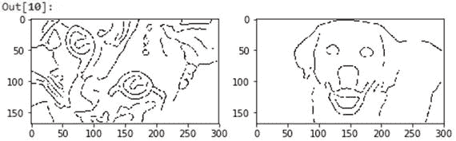

图 4-29。

Canny edge detection to extract edge based features

```py
In [10]: from skimage.feature import canny
    ...:
    ...: cat_edges = canny(cgs, sigma=3)
    ...: dog_edges = canny(dgs, sigma=3)
    ...:
    ...: fig = plt.figure(figsize = (8,4))
    ...: ax1 = fig.add_subplot(1,2, 1)
    ...: ax1.imshow(cat_edges, cmap='binary')
    ...: ax2 = fig.add_subplot(1,2, 2)
    ...: ax2.imshow(dog_edges, cmap='binary')

```

基于图 [4-29](#Fig29) 中描绘的边缘特征阵列的图像图清楚地显示了我们的猫和狗的突出边缘。您可以通过展平这些边缘特征数组(`cat_edges`和`dog_edges`)来使用它们，提取与边缘相关的像素值和位置(非零值)，或者甚至通过聚合它们来找出构成边缘的像素总数、平均值等。

### 目标检测

计算机视觉领域的另一项有趣的技术是对象检测，其中检测并提取对突出显示图像中的特定对象有用的特征。梯度方向直方图，也称为 HOG，是广泛用于对象检测的技术之一。在当前的范围内，深入研究这种技术的细节是不可能的，但是对于特征工程的过程，你需要记住 HOG 算法是通过遵循类似于边缘检测的一系列步骤来工作的。对图像进行归一化和去噪处理，以消除过多的光照影响。计算一阶图像梯度以捕捉像轮廓、纹理等图像属性。梯度直方图基于称为单元的特定窗口建立在这些梯度之上。最后将这些细胞归一化，得到一个扁平的特征描述符，它可以作为我们模型的特征向量。下面的代码显示了我们的样本图像上的 HOG 对象检测技术。

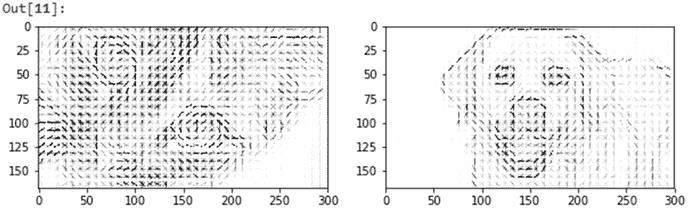

图 4-30。

HOG object detector to extract features based on object detection

```py
In [11]: from skimage.feature import hog
    ...: from skimage import exposure
    ...:
    ...: fd_cat, cat_hog = hog(cgs, orientations=8, pixels_per_cell=(8, 8),
    ...:                     cells_per_block=(3, 3), visualise=True)
    ...: fd_dog, dog_hog = hog(dgs, orientations=8, pixels_per_cell=(8, 8),
    ...:                     cells_per_block=(3, 3), visualise=True)
    ...:
    ...: # rescaling intensity to get better plots
    ...: cat_hogs = exposure.rescale_intensity(cat_hog, in_range=(0, 0.04))
    ...: dog_hogs = exposure.rescale_intensity(dog_hog, in_range=(0, 0.04))
    ...:
    ...: fig = plt.figure(figsize = (10,4))
    ...: ax1 = fig.add_subplot(1,2, 1)
    ...: ax1.imshow(cat_hogs, cmap='binary')
    ...: ax2 = fig.add_subplot(1,2, 2)
    ...: ax2.imshow(dog_hogs, cmap='binary')

```

图 [4-30](#Fig30) 中的图像图向我们展示了 HOG 检测器如何识别样本图像中的物体。您还可以按如下方式获得展平的特征描述符。

```py
In [12]: print(fd_cat, fd_cat.shape)
[ 0.00288784  0.00301086  0.0255757  ...,  0\.          0\.          0\.        ] (47880,)

```

### 局部特征提取

我们已经讨论了从二维图像或特征矩阵中聚合像素值，并将它们展平成特征向量。基于局部特征提取的技术是稍微好一点的方法，其试图在我们的输入图像的各种小的局部区域上检测和提取局部特征描述符。因此，这被恰当地命名为局部特征提取。我们将使用由 T2 等人发明的流行的专利 SURF 算法。SURF 代表加速的健壮特性。主要思想是从图像中获得尺度不变的局部特征描述符，这些描述符可以在以后用作图像特征。这种算法类似于流行的 SIFT 算法。该算法主要有两个主要阶段。第一阶段是使用方形滤波器和 hessian 矩阵检测兴趣点。第二阶段是通过提取这些兴趣点周围的局部特征来构建特征描述符。通常通过获取感兴趣点周围的局部正方形图像区域，然后在基于采样点的特定间隔处聚集 Haar 小波响应来进行计算。我们使用`mahotas` Python 框架从样本图像中提取 SURF 特征描述符。

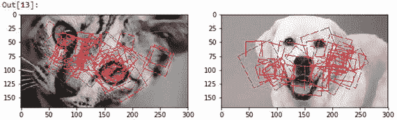

图 4-31。

Localized feature extraction with SURF

```py
In [13]: from mahotas.features import surf
    ...: import mahotas as mh
    ...:
    ...: cat_mh = mh.colors.rgb2gray(cat)
    ...: dog_mh = mh.colors.rgb2gray(dog)
    ...:
    ...: cat_surf = surf.surf(cat_mh, nr_octaves=8, nr_scales=16, initial_step_size=1,
                              threshold=0.1, max_points=50)
    ...: dog_surf = surf.surf(dog_mh, nr_octaves=8, nr_scales=16, initial_step_size=1,
                              threshold=0.1, max_points=54)
    ...:
    ...: fig = plt.figure(figsize = (10,4))
    ...: ax1 = fig.add_subplot(1,2, 1)
    ...: ax1.imshow(surf.show_surf(cat_mh, cat_surf))
    ...: ax2 = fig.add_subplot(1,2, 2)
    ...: ax2.imshow(surf.show_surf(dog_mh, dog_surf))

```

图 [4-31](#Fig31) 中图像图中的方框描绘了兴趣点周围的方形图像区域，用于局部特征提取。您还可以使用`surf.dense(...)`函数在以像素为单位的规则间隔的密集点处提取统一的维度特征描述符。下面的代码描述了如何实现这一点。

```py
In [14]: cat_surf_fds = surf.dense(cat_mh, spacing=10)
    ...: dog_surf_fds = surf.dense(dog_mh, spacing=10)
    ...: cat_surf_fds.shape
Out[14]: (140, 64)

```

我们从前面的输出中看到，我们已经获得了大小为`64`(元素)的`140`个特征描述符。您可以在此基础上进一步应用其他方案，如聚合、扁平化等，以获得更多功能。您可以使用另一种复杂的技术来提取这些 SURF 特征描述符上的特征，这就是使用视觉单词包模型，我们将在下一节中讨论该模型。

### 视觉单词袋模型

我们已经看到了流行的单词袋模型在从非结构化文本文档中提取有意义的特征方面的有效性。单词包指的是文档被分解成它的成分、单词和计算出现频率或其他度量，如 tf-idf。类似地，在图像原始像素矩阵或从其他算法导出的特征描述符的情况下，我们可以应用单词袋原理。然而，在这种情况下，这些成分将不是单词，而是从彼此相似的图像中提取的特征/像素的子集。

想象一下，你有多张章鱼的照片，并且你能够提取出`140`个密集的 surf 特征，每个特征在每个特征向量中都有`64`个值。现在，您可以使用无监督学习算法(如聚类)来提取相似特征描述符的聚类。每个聚类可以被标记为视觉单词或视觉特征。随后，每个特征描述符可以被归入这些聚类或视觉单词之一。因此，你最终得到一个一维的视觉单词包向量，它包含分配给`140x64`特征描述符矩阵中每个视觉单词的特征描述符的数量。每个特征或视觉单词都倾向于捕捉图像中彼此相似的部分，如章鱼的眼睛、触须、吸盘等，如图 [4-32](#Fig32) 所示。

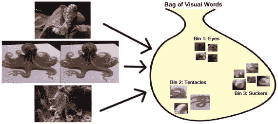

图 4-32。

Visual bag of words (Courtesy of Ian London, Image Classification in Python with Visual Bag of Words)

因此，基本思想是通过使用任何算法(如 SURF)获得特征描述符矩阵，应用无监督算法(如 K-means 聚类),并提取出 K 个箱或视觉特征/词及其计数(基于分配给每个箱的特征描述符的数量)。然后，对于每个后续图像，一旦提取了特征描述符，就可以使用 K-means 模型将每个特征描述符分配给一个视觉特征聚类，并获得计数的一维向量。这在图 [4-33](#Fig33) 中描绘了一个样本章鱼图像，假设我们的 VBOW(视觉单词袋)模型有三个箱子，分别是眼睛、触须和吸盘。

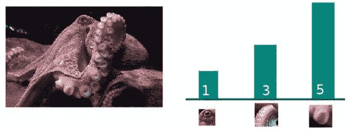

图 4-33。

Transforming an image into a VBOW vector (Courtesy of Ian London, Image Classification in Pythonwith Visual Bag of Words)

因此，从图 [4-33](#Fig33) 中可以看出，二维图像及其对应的特征描述符是如何被轻松转换成一维 VBOW 向量`[1, 3, 5]`的。在目前的范围内，不可能深入了解 VBOW 模型的详细信息，但是我要感谢我的朋友兼数据科学家同事 Ian London，他帮助我提供了 VBOW 模型的两个数据。我还想推荐你看看他的精彩博客文章 [`https://ianlondon.github.io/blog/visual-bag-of-words/`](https://ianlondon.github.io/blog/visual-bag-of-words/) ，其中谈到了使用 VBOW 模型进行图像分类。

我们现在将使用我们的`140x64` SURF 特征描述符用于我们的两个样本图像，并对它们使用 K-means 聚类，并通过将每个特征描述符分配给其中一个箱来计算每个图像的 VBOW 向量。在这种情况下，我们将采用`k=20`。见图 [4-34](#Fig34) 。

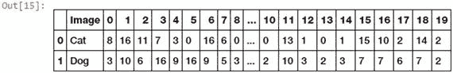

图 4-34。

Transforming SURF descriptors into VBOW vectors for sample images

```py
In [15]: from sklearn.cluster import KMeans
    ...:
    ...: k = 20
    ...: km = KMeans(k, n_init=100, max_iter=100)
    ...:
    ...: surf_fd_features = np.array([cat_surf_fds, dog_surf_fds])
    ...: km.fit(np.concatenate(surf_fd_features))
    ...:
    ...: vbow_features = []
    ...: for feature_desc in surf_fd_features:
    ...:     labels = km.predict(feature_desc)
    ...:     vbow = np.bincount(labels, minlength=k)
    ...:     vbow_features.append(vbow)
    ...:
    ...: vbow_df = pd.DataFrame(vbow_features)
    ...: pd.concat([df, vbow_df], axis=1)

```

您可以看到将复杂的二维 SURF 特征描述符矩阵转换为易于解释的 VBOW 向量是多么容易。现在，让我们看一张新的图像，并考虑如何应用 VBOW 管道。首先，我们需要使用以下代码片段从图像中提取 SURF 特征描述符(这只是为了描述 SURF 中使用的局部图像子集，我们实际上将像以前一样使用密集特征。)参见图 [4-35](#Fig35) 。

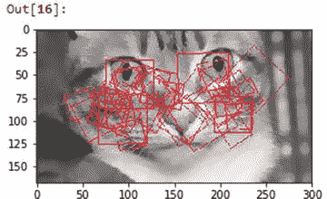

图 4-35。

Localized feature extraction with SURF for new image

```py
In [16]: new_cat = io.imread('datasets/new_cat.png')
    ...: newcat_mh = mh.colors.rgb2gray(new_cat)
    ...: newcat_surf = surf.surf(newcat_mh, nr_octaves=8, nr_scales=16, initial_step_size=1,
                                 threshold=0.1, max_points=50)
    ...:
    ...: fig = plt.figure(figsize = (10,4))
    ...: ax1 = fig.add_subplot(1,2, 1)
    ...: ax1.imshow(surf.show_surf(newcat_mh, newcat_surf))

```

现在，让我们提取密集 SURF 特征，并使用之前训练的 VBOW 模型将它们转换为 VBOW 向量。下面的代码帮助我们实现了这一点。见图 [4-36](#Fig36) 。

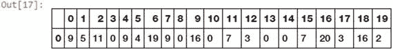

图 4-36。

Transforming new image SURF descriptors into a VBOW vector

```py
In [17]: new_surf_fds = surf.dense(newcat_mh, spacing=10)
    ...:
    ...: labels = km.predict(new_surf_fds)
    ...: new_vbow = np.bincount(labels, minlength=k)
    ...: pd.DataFrame([new_vbow])

```

因此，您可以看到基于 SURF 特征描述符的新图像的最终 VBOW 特征向量。这也是使用无监督机器学习模型进行特征工程的一个例子。现在，您可以使用一些相似性度量来比较这个新图像与其他两个样本图像的相似性。

```py
In [18]: from sklearn.metrics.pairwise import euclidean_distances, cosine_similarity
    ...:
    ...: eucdis = euclidean_distances(new_vbow.reshape(1,-1) , vbow_features)
    ...: cossim = cosine_similarity(new_vbow.reshape(1,-1) , vbow_features)
    ...:
    ...: result_df = pd.DataFrame({'EuclideanDistance': eucdis[0],
    ...:               'CosineSimilarity': cossim[0]})
    ...: pd.concat([df, result_df], axis=1)
Out[18]:
  Image  CosineSimilarity  EuclideanDistance
0   Cat          0.871609          21.260292
1   Dog          0.722096          30.000000

```

基于距离和相似性度量，我们可以看到我们的新图像(猫的)肯定比狗的图像更接近猫的图像。尝试使用更大的数据集来获得更好的结果！

### 具有深度学习的自动化特征工程

到目前为止，我们已经在本节中使用了许多简单和复杂的特征工程技术。构建复杂的特征工程系统和管道是耗时的，而构建同样的算法则更费时。深度学习是一种新颖的新方法，通过学习底层原始数据的多层复杂表示，使机器自动提取特征，从而实现特征工程这一复杂任务的自动化。

卷积神经网络或 CNN 广泛用于图像中的自动特征提取。我们已经在第 [1](01.html) 章讲述了 CNN 的基本原理。继续刷新你的记忆，你会看到第 [1](01.html) 章“深度学习”部分下的“重要概念”小节。就像我们之前提到的，除了常规的激活功能层，CNN 的思想还基于卷积和池的原理。

卷积层通常在输入图像像素的整个宽度和高度上滑动或卷积可学习滤波器(也称为核或卷积矩阵)。滑动过滤器时，在每个位置计算输入像素和过滤器之间的点积。过滤器的二维激活图被创建，因此网络能够在检测到特定特征(如边缘、拐角等)时学习这些过滤器。如果我们使用 n 个过滤器，我们将获得 n 个独立的二维激活图，然后可以沿着深度维度堆叠这些激活图以获得输出体积。

汇集是一种聚合或下采样层，其中通常在卷积层之间插入非线性下采样操作。这里也应用了过滤器。它们沿着卷积输出矩阵滑动，并且对于每个滑动操作(也称为步长),由汇集滤波器覆盖的矩阵切片中的元素被求和(总和汇集)或平均(平均汇集),或者选择最大值(最大汇集)。max pooling 在几个现实世界的场景中经常工作得非常好。池化有助于减少特征维数并控制模型过度拟合。现在让我们尝试使用深度学习，使用 CNN 对我们的样本图像进行自动特征提取。加载构建深层网络所需的下列依赖项。

```py
In [19]: from keras.models import Sequential
    ...: from keras.layers.convolutional import Conv2D
    ...: from keras.layers.convolutional import MaxPooling2D
    ...: from keras import backend as K
Using TensorFlow backend.

```

你可以使用 Theano 或 Tensorflow 作为你的后端深度学习框架，供`keras`使用。我在这个场景中使用了`tensorflow`。现在让我们构建一个基本的两层 CNN，在它们之间有一个最大池层。

```py
In [20]: model = Sequential()
    ...: model.add(Conv2D(4, (4, 4), input_shape=(168, 300, 3), activation='relu',
    ...:                  kernel_initializer='glorot_uniform'))
    ...: model.add(MaxPooling2D(pool_size=(2, 2)))
    ...: model.add(Conv2D(4, (4, 4), activation='relu',
    ...:                 kernel_initializer='glorot_uniform'))

```

实际上，我们可以使用以下代码片段来更好地理解网络中使用的各层，从而直观地展示这种网络架构。

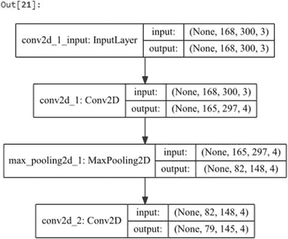

图 4-37。

Visualizing our two-layer convolutional neural network architecture

```py
In [21]: from IPython.display import SVG
    ...: from keras.utils.vis_utils import model_to_dot
    ...:
    ...: SVG(model_to_dot(model, show_shapes=True,
    ...:                  show_layer_names=True, rankdir='TB').create(prog='dot', format='svg'))

```

你现在可以从图 [4-37](#Fig37) 的描述中理解，我们正在使用包含四个`(4x4)`滤波器的两个二维卷积层。我们在它们之间还有一个大小为`(2x2)`的最大池层，用于一些缩减采样。现在让我们构建一些函数来从这些中间网络层提取特征。

```py
In [22]: first_conv_layer = K.function([model.layers[0].input, K.learning_phase()],
    ...:                               [model.layers[0].output])
    ...: second_conv_layer = K.function([model.layers[0].input, K.learning_phase()],
    ...:                                [model.layers[2].output])

```

现在，让我们使用这些函数来提取卷积层中学习到的特征表示，并可视化这些特征，以了解网络试图从图像中学习什么。

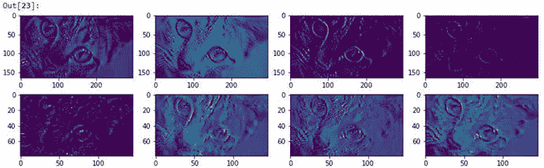

图 4-38。

Intermediate feature maps obtained after passing though convolutional Layers

```py
In [23]: catr = cat.reshape(1, 168, 300,3)
    ...:
    ...: # extract features
    ...: first_conv_features = first_conv_layer([catr])[0][0]
    ...: second_conv_features = second_conv_layer([catr])[0][0]
    ...:
    ...: # view feature representations
    ...: fig = plt.figure(figsize = (14,4))
    ...: ax1 = fig.add_subplot(2,4, 1)
    ...: ax1.imshow(first_conv_features[:,:,0])
    ...: ax2 = fig.add_subplot(2,4, 2)
    ...: ax2.imshow(first_conv_features[:,:,1])
    ...: ax3 = fig.add_subplot(2,4, 3)
    ...: ax3.imshow(first_conv_features[:,:,2])
    ...: ax4 = fig.add_subplot(2,4, 4)
    ...: ax4.imshow(first_conv_features[:,:,3])
    ...:
    ...: ax5 = fig.add_subplot(2,4, 5)
    ...: ax5.imshow(second_conv_features[:,:,0])
    ...: ax6 = fig.add_subplot(2,4, 6)
    ...: ax6.imshow(second_conv_features[:,:,1])
    ...: ax7 = fig.add_subplot(2,4, 7)
    ...: ax7.imshow(second_conv_features[:,:,2])
    ...: ax8 = fig.add_subplot(2,4, 8)
    ...: ax8.imshow(second_conv_features[:,:,3])

```

图 [4-38](#Fig38) 中描绘的特征地图可视化肯定很有趣。你可以清楚地看到，卷积神经网络产生的每个特征矩阵都试图了解图像的一些信息，如纹理、拐角、边缘、光照、色调、亮度等。这应该让您了解如何将这些激活特征映射用作图像的特征。事实上，您可以堆叠 CNN 的输出，如果需要的话，将其展平，并将其作为输入层传递给多层完全连接的感知器神经网络，并使用它来解决图像分类问题。这应该会让你在深度学习的自动化特征提取方面有一个良好的开端！

如果您不理解本节中提到的一些术语，请不要担心；我们将在后续章节中更深入地讨论深度学习和 CNN。如果迫不及待地开始深度学习，您可以启动本章提供的名为`Bonus - Classifying handwritten digits using Deep CNNs.ipynb`的奖励笔记本，以获得应用 CNN 和深度学习对手写数字进行分类的完整真实示例！

## 特征缩放

在处理数字特征时，我们有一些特定的属性，这些属性可能在本质上是完全不受限制的，比如视频的浏览量或网页的点击数。使用原始值作为输入要素可能会使模型偏向于具有非常高的量值的要素。这些模型通常对线性或逻辑回归等特征的大小或规模很敏感。像基于树的方法这样的其他模型在没有特征缩放的情况下仍然可以工作。但是，仍然建议使用要素缩放来归一化和缩小要素，尤其是如果您想要在输入要素上尝试多种机器学习算法。在本章前面，我们已经看到了一些使用对数变换和 box-cox 变换来缩放和变换特征的例子。在这一节中，我们来看看一些流行的特征缩放技术。您可以直接加载`feature_scaling.py`并开始运行示例，或者使用 jupyter 笔记本，`Feature Scaling.ipynb`获得更具交互性的体验。让我们从加载下列依赖项和配置开始。

```py
In [1]: from sklearn.preprocessing import StandardScaler, MinMaxScaler, RobustScaler
   ...: import numpy as np
   ...: import pandas as pd
   ...: np.set_printoptions(suppress=True)

```

现在让我们加载一些与在线视频相关的用户视图样本数据。下面的代码片段创建了这个样本数据集。

```py
In [2]: views = pd.DataFrame([1295., 25., 19000., 5., 1., 300.], columns=['views'])
   ...: views
Out[2]:
     views
0   1295.0
1     25.0
2  19000.0
3      5.0
4      1.0
5    300.0

```

从前面的数据帧中，我们可以看到有五个视频被用户查看过，每个视频的总查看次数由特征视图描述。很明显，一些视频的浏览量远远超过其他视频，从而产生了高规模和高幅度的价值。让我们看看如何使用几种简便的技术来扩展这个特性。

### 标准化缩放

标准缩放器试图通过移除平均值并将值的方差缩放为 1 来标准化特征列中的每个值。这也被称为定中心和缩放，并且可以在数学上表示为

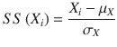

，其中特征 X 中的每个值被平均值μ <sub>X</sub> 减去，并且结果被除以标准偏差σ <sub>X</sub> 。这也就是通常所说的 Z 分数缩放。如果需要，也可以将结果除以方差而不是标准差。下面的片段有助于我们实现这一点。

```py
In [3]: ss = StandardScaler()
   ...: views['zscore'] = ss.fit_transform(views[['views']])
   ...: views
Out[3]:
     views    zscore
0   1295.0 -0.307214
1     25.0 -0.489306
2  19000.0  2.231317
3      5.0 -0.492173
4      1.0 -0.492747
5    300.0 -0.449877

```

我们可以在前面的数据帧中的`zscore`列中看到标准化和比例值。事实上，您可以手动使用我们之前使用的公式来计算相同的结果。以下示例以数学方式计算 z 得分。

```py
In [4]: vw = np.array(views['views'])
   ...: (vw[0] - np.mean(vw)) / np.std(vw)
Out[4]: -0.30721413311687235

```

### 最小-最大缩放

通过最小-最大缩放，我们可以变换和缩放我们的特征值，使得每个值都在[0，1]的范围内。然而，`scikit-learn`中的`MinMaxScaler`类也允许你使用`feature_range`变量在缩放值范围内指定自己的上限和下限。数学上，我们可以将该缩放器表示为

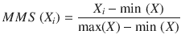

，其中，我们通过从特征 min (X)中的最小值减去特征 X 中的每个值，并将结果除以特征 max(X) - min (X)中的最大值和最小值之间的差，来缩放特征 X 中的每个值。下面的代码片段可以帮助我们进行计算。

```py
In [5]: mms = MinMaxScaler()
   ...: views['minmax'] = mms.fit_transform(views[['views']])
   ...: views
Out[5]:
     views    zscore    minmax
0   1295.0 -0.307214  0.068109
1     25.0 -0.489306  0.001263
2  19000.0  2.231317  1.000000
3      5.0 -0.492173  0.000211
4      1.0 -0.492747  0.000000
5    300.0 -0.449877  0.015738

```

前面的输出显示了`minmax`列中的最小-最大缩放值，正如所料，行索引 2 中的最大观看视频值为 1，行索引 4 中的最小观看视频值为 0。您也可以使用下面的代码进行数学计算(第一行的示例计算)。

```py
In [6]: (vw[0] - np.min(vw)) / (np.max(vw) - np.min(vw))
Out[6]: 0.068108847834096528

```

### 稳健缩放

最小-最大缩放的缺点是异常值的存在通常会影响任何要素的缩放值。稳健缩放尝试使用特定的统计测量来缩放要素，而不受异常值的影响。数学上，该缩放器可以表示为

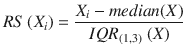

，其中我们通过减去 X 的中值并将结果除以 IQR 来缩放特征 X 的每个值，该也称为 X 的四分位数间范围，即第一个四分位数(25%四分位数)和第三个四分位数(75%四分位数)之间的范围(差)。以下代码对我们的示例特征执行健壮的缩放。

```py
In [7]: rs = RobustScaler()
   ...: views['robust'] = rs.fit_transform(views[['views']])
   ...: views
Out[7]:
     views    zscore    minmax     robust
0   1295.0 -0.307214  0.068109   1.092883
1     25.0 -0.489306  0.001263  -0.132690
2  19000.0  2.231317  1.000000  18.178528
3      5.0 -0.492173  0.000211  -0.151990
4      1.0 -0.492747  0.000000  -0.155850
5    300.0 -0.449877  0.015738   0.132690

```

比例值显示在`robust`栏中，您可以将它们与其他栏中的比例特征进行比较。您还可以使用我们为健壮缩放器制定的数学公式来计算相同的值，如以下代码片段所示(针对第一行索引值)。

```py
In [8]: quartiles = np.percentile(vw, (25., 75.))
   ...: iqr = quartiles[1] - quartiles[0]
   ...: (vw[0] - np.median(vw)) / iqr
Out[8]: 1.0928829915560916

```

还有其他几种用于特征缩放和规范化的技术，但这些应该足以让您入门，并广泛用于构建机器学习系统。在处理数字要素时，请务必检查是否需要缩放和标准化要素。

## 特征选择

虽然尝试设计试图捕捉底层数据中的一些潜在表示和模式的特征是好的，但处理可能具有数千个甚至更多特征的特征集并不总是一件好事。处理大量的特征使我们想到了维数灾难的概念，我们之前在“分类数据的特征工程”的“面元计数”一节中提到过。更多的特征往往会使模型更加复杂和难以解释。此外，这通常会导致模型过度拟合训练数据。这基本上导致了一个非常专业化的模型，只针对它用于训练的数据进行调整，因此，即使您获得了很高的模型性能，它最终也会在新的、以前未见过的数据上表现很差。最终目标是选择最佳数量的特征来训练和构建模型，这些模型能够很好地概括数据并防止过度拟合。

基于策略的类型和所采用的技术，特征选择策略可以分为三个主要方面。它们简述如下。

*   过滤方法:这些技术纯粹基于相关性、互信息等指标来选择特征。这些方法不依赖于从任何模型获得的结果，并且通常检查每个特征与要预测的响应变量的关系。流行的方法包括基于阈值的方法和统计测试。
*   包装器方法:这些技术试图通过使用递归方法来捕获多个特性之间的交互，以使用特性子集构建多个模型，并选择最佳的特性子集，从而为我们提供最佳性能的模型。像向后选择和向前消除这样的方法是流行的基于包装器的方法。
*   嵌入式方法:这些技术试图结合其他两种方法的优势，通过利用机器学习模型本身来根据其重要性对特征变量进行排名和评分。基于树的方法如决策树和集成方法如随机森林是嵌入式方法的流行例子。

要素选择的好处包括更好的模型性能、更少的过度拟合、更通用的模型、更少的计算和模型训练时间，以及更好地了解数据中各种要素的重要性。在这一节中，我们来看一些在特征选择中最广泛使用的技术。您可以直接加载`feature_selection.py`并开始运行示例，或者使用 jupyter 笔记本，`Feature Selection.ipynb`获得更具交互性的体验。让我们从加载下列依赖项和配置开始。

```py
In [1]: import numpy as np
   ...: import pandas as pd
   ...: np.set_printoptions(suppress=True)
   ...: pt = np.get_printoptions()['threshold']

```

我们现在将通过使用一些样本数据集来查看选择特征的各种方法，包括基于统计和模型的技术。

### 基于阈值的方法

这是一种基于过滤器的特征选择策略，其中您可以使用某种形式的截止或阈值来限制特征选择期间的特征总数。阈值可以有多种形式。其中一些可以在特征工程过程中使用，在此过程中可以指定阈值参数。一个简单的例子是在单词袋模型中限制特征术语，我们之前在基于文本的特征工程中使用了这个模型。`scikit-learn`框架提供了类似于`min_df`和`max_df`的参数，这些参数可用于指定阈值，以忽略文档频率高于和低于用户指定阈值的术语。下面的代码片段描述了实现这一点的方法。

```py
In [2]: from sklearn.feature_extraction.text import CountVectorizer
   ...:
   ...: cv = CountVectorizer(min_df=0.1, max_df=0.85, max_features=2000)
   ...: cv
Out[2]:
CountVectorizer(analyzer='word', binary=False, decode_error='strict',
        dtype=<class 'numpy.int64'>, encoding='utf-8', input='content',
        lowercase=True, max_df=0.85, max_features=2000, min_df=0.1,
        ngram_range=(1, 1), preprocessor=None, stop_words=None,
        strip_accents=None, token_pattern='(?u)\\b\\w\\w+\\b',
        tokenizer=None, vocabulary=None)

```

这基本上建立了一个计数矢量器，它忽略了出现在不到 10%的全部语料库中的特征项，也忽略了出现在超过 85%的全部语料库中的项。除此之外，我们还在特性集中设置了 2000 个最大特性的硬性限制。

使用阈值的另一种方式是使用基于方差的阈值处理，其中具有低方差(低于用户指定的阈值)的特征被移除。这意味着我们想要移除在数据集中所有观测值中值大致恒定的要素。我们可以将它应用到我们的神奇宝贝数据集，我们在本章前面已经使用过了。首先，我们将`Generation`特征转换为分类特征，如下所示。

```py
In [3]: df = pd.read_csv('datasets/Pokemon.csv')
   ...: poke_gen = pd.get_dummies(df['Generation'])
   ...: poke_gen.head()
Out[3]:
   Gen 1  Gen 2  Gen 3  Gen 4  Gen 5  Gen 6
0      1      0      0      0      0      0
1      1      0      0      0      0      0
2      1      0      0      0      0      0
3      1      0      0      0      0      0
4      1      0      0      0      0      0

```

接下来，我们想要从方差小于`0.15`的一个热编码特征中移除特征。我们可以使用下面的代码片段做到这一点。

```py
In [4]: from sklearn.feature_selection import VarianceThreshold
   ...:
   ...: vt = VarianceThreshold(threshold=.15)
   ...: vt.fit(poke_gen)
Out[4]: VarianceThreshold(threshold=0.15)

```

为了查看方差以及该算法最终选择了哪些特性，我们可以分别使用`variances_`属性和`get_support(...)`函数。下面的代码片段在一个格式化的数据帧中清楚地描述了这一点。

```py
In [5]: pd.DataFrame({'variance': vt.variances_,
   ...:               'select_feature': vt.get_support()},
   ...:              index=poke_gen.columns).T
Out[5]:
                   Gen 1     Gen 2 Gen 3     Gen 4     Gen 5      Gen 6
select_feature      True     False  True     False      True      False
variance        0.164444  0.114944  0.16  0.128373  0.163711  0.0919937

```

我们可以清楚地看到哪些特征是基于它们的`True`值以及它们在`0.15`以上的方差而被选择的。要获得所选功能的最终子集，可以使用以下代码。

```py
In [6]: poke_gen_subset = poke_gen.iloc[:,vt.get_support()].head()
   ...: poke_gen_subset
Out[6]:
   Gen 1  Gen 3  Gen 5
0      1      0      0
1      1      0      0
2      1      0      0
3      1      0      0
4      1      0      0

```

前面的特征子集描述了特征`Gen 1`、`Gen 3`和`Gen 5`已经从最初的六个特征中最终被选择出来。

### 统计方法

另一种广泛使用的基于过滤器的特征选择方法稍微复杂一些，是基于单变量统计测试来选择特征。您可以对基于回归和分类的模型使用几种统计测试，包括互信息、ANOVA(方差分析)和卡方测试。基于从这些统计测试中获得的分数，您可以根据它们的分数选择最佳特性。现在让我们加载一个包含 30 个要素的样本数据集。这个数据集被称为威斯康星州诊断乳腺癌数据集，它也可以在 [`https://archive.ics.uci.edu/ml/datasets/Breast+Cancer+Wisconsin+(Diagnostic`](https://archive.ics.uci.edu/ml/datasets/Breast+Cancer+Wisconsin+(Diagnostic) `)`以其原始或原始格式获得，这是 UCI 机器学习知识库。我们将使用`scikit-learn`来加载数据特性和响应类变量。

```py
In [7]: from sklearn.datasets import load_breast_cancer
   ...:
   ...: bc_data = load_breast_cancer()
   ...: bc_features = pd.DataFrame(bc_data.data, columns=bc_data.feature_names)
   ...: bc_classes = pd.DataFrame(bc_data.target, columns=['IsMalignant'])
   ...:
   ...: # build featureset and response class labels
   ...: bc_X = np.array(bc_features)
   ...: bc_y = np.array(bc_classes).T[0]
   ...: print('Feature set shape:', bc_X.shape)
   ...: print('Response class shape:', bc_y.shape)
Feature set shape: (569, 30)
Response class shape: (569,)

```

我们可以清楚地看到，正如我们之前提到的，该数据集中共有 30 个要素，共有 569 行观测值。要获得特性名称的更多细节并查看数据点，可以使用下面的代码。

```py
In [8]: np.set_printoptions(threshold=30)
   ...: print('Feature set data [shape: '+str(bc_X.shape)+']')
   ...: print(np.round(bc_X, 2), '\n')
   ...: print('Feature names:')
   ...: print(np.array(bc_features.columns), '\n')
   ...: print('Response Class label data [shape: '+str(bc_y.shape)+']')
   ...: print(bc_y, '\n')
   ...: print('Response variable name:', np.array(bc_classes.columns))
   ...: np.set_printoptions(threshold=pt)
Feature set data [shape: (569, 30)]
[[  17.99   10.38  122.8  ...,    0.27    0.46    0.12]
 [  20.57   17.77  132.9  ...,    0.19    0.28    0.09]
 [  19.69   21.25  130\.   ...,    0.24    0.36    0.09]
 ...,
 [  16.6    28.08  108.3  ...,    0.14    0.22    0.08]
 [  20.6    29.33  140.1  ...,    0.26    0.41    0.12]
 [   7.76   24.54   47.92 ...,    0\.      0.29    0.07]]

Feature names:
['mean radius' 'mean texture' 'mean perimeter' 'mean area'
 'mean smoothness' 'mean compactness' 'mean concavity'
 'mean concave points' 'mean symmetry' 'mean fractal dimension'
 'radius error' 'texture error' 'perimeter error' 'area error'
 'smoothness error' 'compactness error' 'concavity error'
 'concave points error' 'symmetry error' 'fractal dimension error'
 'worst radius' 'worst texture' 'worst perimeter' 'worst area'
 'worst smoothness' 'worst compactness' 'worst concavity'
 'worst concave points' 'worst symmetry' 'worst fractal dimension']

Response Class label data [shape: (569,)]
[0 0 0 ..., 0 0 1]

Response variable name: ['IsMalignant']

```

这让我们对正在处理的数据有了更好的认识。响应类变量是一个二元类，其中 1 表示检测到的肿瘤是良性的，0 表示它是恶性的。我们还可以看到 30 个特征，它们是描述乳腺肿块数字化图像中细胞核特征的实数值。现在，让我们对这个特性集进行卡方测试，并从 30 个特性中选择前 15 个最佳特性。下面的片段有助于我们实现这一点。

```py
In [9]: from sklearn.feature_selection import chi2, SelectKBest
   ...:
   ...: skb = SelectKBest(score_func=chi2, k=15)
   ...: skb.fit(bc_X, bc_y)
Out[9]: SelectKBest(k=15, score_func=<function chi2 at 0x0000018C2BEB7840>)

```

您可以看到，在计算必要的指标时，我们已经将输入特征(`bc_X`)和相应的响应类输出(`bc_y`)传递给了`fit(...)`函数。卡方检验将计算每个要素和类别变量之间的统计数据(单变量检验)。选择前 K 个特征很可能会移除得分较低的特征，因此它们很可能与类别变量无关，因此在构建模型时没有用。我们使用下面的代码对分数进行排序，以查看最相关的特性。

```py
In [10]: feature_scores = [(item, score) for item, score in zip(bc_data.feature_names,  
                                                                skb.scores_)]
    ...: sorted(feature_scores, key=lambda x: -x[1])[:10]
Out[10]:
[('worst area', 112598.43156405364),
 ('mean area', 53991.655923750892),
 ('area error', 8758.5047053344697),
 ('worst perimeter', 3665.0354163405909),
 ('mean perimeter', 2011.1028637679051),
 ('worst radius', 491.68915743332195),
 ('mean radius', 266.10491719517802),
 ('perimeter error', 250.57189635982184),
 ('worst texture', 174.44939960571074),
 ('mean texture', 93.897508098633352)]

```

现在，我们可以使用下面的代码，在卡方检验的帮助下，创建从 30 个特性的原始特性集中获得的 15 个选定特性的子集。

```py
In [11]: select_features_kbest = skb.get_support()
    ...: feature_names_kbest = bc_data.feature_names[select_features_kbest]
    ...: feature_subset_df = bc_features[feature_names_kbest]
    ...: bc_SX = np.array(feature_subset_df)
    ...: print(bc_SX.shape)
    ...: print(feature_names_kbest)
(569, 15)
['mean radius' 'mean texture' 'mean perimeter' 'mean area' 'mean concavity'
 'radius error' 'perimeter error' 'area error' 'worst radius'
 'worst texture' 'worst perimeter' 'worst area' 'worst compactness'
 'worst concavity' 'worst concave points']

```

因此，从前面的输出中，您可以看到我们的新特征子集`bc_SX`有 15 个特征的 569 个观察值，而不是 30 个，为了便于理解，我们还打印了所选特征的名称。要查看新的特性集，可以使用下面的代码片段。

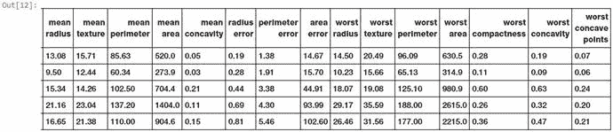

图 4-39。

Selected feature subset of the Wisconsin Diagnostic Breast Cancer dataset using chi-square tests

```py
In [12]: np.round(feature_subset_df.iloc[20:25], 2)

```

图 [4-39](#Fig39) 中描述了具有最高得分特征的数据框。现在，让我们对 30 个特征的原始特征集使用逻辑回归建立一个简单的分类模型，并将该模型的准确性性能与使用我们选择的 15 个特征建立的另一个模型进行比较。对于模型评估，我们将使用准确性指标(正确预测的百分比)并使用五重交叉验证方案。我们将在第 5 章[中详细介绍模型评估和调优策略，所以如果你现在不能理解一些术语，不要绝望。这里的主要思想是比较在不同特征集上训练的模型之间的模型预测性能。](05.html)

```py
In [13]: from sklearn.linear_model import LogisticRegression
    ...: from sklearn.model_selection import cross_val_score
    ...:
    ...: # build logistic regression model
    ...: lr = LogisticRegression()
    ...:
    ...: # evaluating accuracy for model built on full featureset
    ...: full_feat_acc = np.average(cross_val_score(lr, bc_X, bc_y, scoring='accuracy', cv=5))
    ...: # evaluating accuracy for model built on selected featureset
    ...: sel_feat_acc = np.average(cross_val_score(lr, bc_SX, bc_y, scoring='accuracy', cv=5))
    ...:
    ...: print('Model accuracy statistics with 5-fold cross validation')
    ...: print('Model accuracy with complete feature set', bc_X.shape, ':', full_feat_acc)
    ...: print('Model accuracy with selected feature set', bc_SX.shape, ':', sel_feat_acc)
Model accuracy statistics with 5-fold cross validation
Model accuracy with complete feature set (569, 30) : 0.950904193921
Model accuracy with selected feature set (569, 15) : 0.952643324356

```

准确性度量清楚地向我们显示，与使用原始 30 个特征构建的具有 95.09%准确性的模型相比，当在所选的 15 个特征子集上训练时，我们实际上构建了具有 95.26%准确性的更好的模型。在您自己的数据集上尝试一下吧！你看到任何改进了吗？

### 递归特征消除

您还可以在基于机器学习的模型估计器的帮助下对特征进行排名和评分，以便您递归地不断消除评分较低的特征，直到您达到特定的特征子集计数。递归特征消除，也称为 RFE，是一种流行的基于包装器的特征选择技术，它允许您使用这种策略。基本思想是从特定的机器学习估计器开始，比如我们用于分类需求的逻辑回归算法。接下来，我们采用 30 个特性的整个特性集和相应的响应类变量。RFE 的目标是根据模型拟合度给这些特征分配权重。修剪掉具有最小权重的特征，然后在剩余的特征上再次拟合模型，以获得新的权重或分数。这个过程被递归地执行多次，并且每次具有最低分数/权重的特征被消除，直到被修剪的特征子集包含用户想要选择的期望数量的特征(这在开始时被作为输入参数)。这种策略通常也被称为逆向淘汰。现在让我们使用 RFE 来选择乳腺癌数据集中的前 15 个特征。

```py
In [14]: from sklearn.feature_selection import RFE
    ...:
    ...: lr = LogisticRegression()
    ...: rfe = RFE(estimator=lr, n_features_to_select=15, step=1)
    ...: rfe.fit(bc_X, bc_y)
Out[14]:
RFE(estimator=LogisticRegression(C=1.0, class_weight=None, dual=False, fit_intercept=True,
          intercept_scaling=1, max_iter=100, multi_class='ovr', n_jobs=1,
          penalty='l2', random_state=None, solver='liblinear', tol=0.0001,
          verbose=0, warm_start=False),
  n_features_to_select=15, step=1, verbose=0)

```

我们现在可以使用`get_support(...)`函数来获得最终选择的 15 个特征。下面的代码片段描述了这一点。

```py
In [15]: select_features_rfe = rfe.get_support()
    ...: feature_names_rfe = bc_data.feature_names[select_features_rfe]
    ...: print(feature_names_rfe)
['mean radius' 'mean texture' 'mean perimeter' 'mean smoothness'
 'mean concavity' 'mean concave points' 'mean symmetry' 'texture error'
 'worst radius' 'worst texture' 'worst smoothness' 'worst concavity'
 'worst concave points' 'worst symmetry' 'worst fractal dimension']

```

我们能否将这个特征子集与我们在上一节中使用统计测试获得的特征子集进行比较，看看这两个子集之间有哪些共同的特征？我们当然可以！让我们使用集合操作来获得这两种技术选择的特性列表。

```py
In [16]: set(feature_names_kbest) & set(feature_names_rfe)
Out[16]:
{'mean concavity', 'mean perimeter', 'mean radius', 'mean texture',
 'worst concave points', 'worst concavity', 'worst radius', 'worst texture'}

```

因此，我们可以看到 15 个特征中有 8 个是共同的，并且被两种特征选择技术所选择，这绝对是有趣的！

### 基于模型的选择

基于树的模型如决策树和集成模型如随机森林(树的集成)不仅可用于单独建模，还可用于特征选择。当构建模型时，这些模型可用于计算特征重要性，该模型又可用于选择最佳特征并丢弃得分较低的不相关特征。随机森林是一个集合模型。这可以用作嵌入式特征选择方法，其中通过从整个数据集中获取数据的训练样本来构建集成中的每个决策树模型。此样本为引导样本(替换样本)。通过从特征的随机子集中选择最佳分割，而不是考虑所有特征，来进行任意节点处的分割。这种随机性倾向于以略微增加偏差为代价来减少模型的方差。总的来说，这产生了一个更好、更通用的模型。我们将在第 [5](05.html) 章更详细地讨论偏差-方差权衡。现在，让我们使用随机森林模型根据要素的重要性对其进行评分和排名。

```py
In [17]: from sklearn.ensemble import RandomForestClassifier
    ...:
    ...: rfc = RandomForestClassifier()
    ...: rfc.fit(bc_X, bc_y)
Out[17]:
RandomForestClassifier(bootstrap=True, class_weight=None, criterion='gini',
            max_depth=None, max_features='auto', max_leaf_nodes=None,
            min_impurity_split=1e-07, min_samples_leaf=1,
            min_samples_split=2, min_weight_fraction_leaf=0.0,
            n_estimators=10, n_jobs=1, oob_score=False, random_state=None,
            verbose=0, warm_start=False)

```

下面的代码使用这个随机森林估计器根据特性的重要性对它们进行评分，我们根据这个分数显示前 10 个最重要的特性。

```py
In [18]: importance_scores = rfc.feature_importances_
    ...: feature_importances = [(feature, score) for feature, score in zip(bc_data.feature_names, importance_scores)]
    ...: sorted(feature_importances, key=lambda x: -x[1])[:10]
Out[18]:
[('worst area', 0.25116985146898885),
 ('worst radius', 0.16995187376059454),
 ('worst concavity', 0.1164662504282163),
 ('worst concave points', 0.11253251729478526),
 ('mean concave points', 0.10839170432994949),
 ('mean concavity', 0.063554137255925847),
 ('mean area', 0.023771318604377804),
 ('worst perimeter', 0.020636790800076958),
 ('worst texture', 0.019171556030722112),
 ('mean radius', 0.014908508522792335)]

```

您现在可以根据需要使用基于阈值的参数来过滤掉前 n 个特性，或者您甚至可以使用由`scikit-learn`提供的`SelectFromModel`元转换器，将其作为该模型顶部的包装器。您能找出随机森林模型中有多少排名较高的特征与前面两个特征选择器相同吗？

## 降维

处理大量的特性会导致诸如模型过度拟合、复杂模型等问题，所有这些都会导致我们所说的维数灾难。请参考第 [1](01.html) 章中的“降维”一节来刷新您的记忆。降维是使用特征选择或特征提取等策略减少特征集中特征总数的过程。在前一节中，我们已经广泛地讨论了特性选择。我们现在介绍特征提取，其基本目标是从现有的特征集中提取新的特征，以便将具有许多特征的高维数据集缩减为这些新创建的特征的低维数据集。从高维到低维的线性数据转换的一种非常流行的技术是主成分分析，也称为 PCA。在接下来的几节中，让我们试着了解更多关于 PCA 的知识，以及如何使用它进行特征提取。

### 基于主成分分析的特征提取

主成分分析(通常称为 PCA)是一种统计方法，它使用线性正交变换过程将可能相关的高维特征集转换为线性不相关的低维特征集。这些转换和新创建的特征也称为主要组件或 PCs。在任何 PCA 变换中，PC 的总数总是小于或等于特征的初始数量。第一主成分试图捕捉原始特征集的最大方差。每个随后的分量试图捕捉更多的方差，使得它们与前面的分量正交。需要记住的重要一点是，PCA 对特征缩放很敏感。

我们的主要任务是获取一组维数为 D 的初始特征，并将其简化为较低维数 LD 的提取主成分的子集。奇异值分解的矩阵分解过程在帮助我们获得主成分方面极其有用。你可以参考第 [1](01.html) 章“数学”部分“重要概念”下的“奇异值分解”小节，快速刷新你对 SVD 的记忆，查阅必要的数学公式和概念。考虑到我们有一个数据矩阵 F<sub>(n×D)</sub>，其中我们有 n 个观测值和 D 个维度(特征)，我们可以将特征矩阵的奇异值分解描述为(F<sub>(n×D)</sub>)= USV<sup>T</sup>，这样所有的主分量都包含在分量 V <sup>T</sup> 中，可以描述如下:

![$$ {V^T}_{\left(D\times D\right)}=\left[\begin{array}{c}P{C_1}_{\left(1\times D\right)}\\ {}P{C_2}_{\left(1\times D\right)}\\ {}\dots \\ {}P{C_D}_{\left(1\times D\right)}\end{array}\right] $$](A448827_1_En_4_Chapter_Equf.gif)

主要部件由{PC <sub>1</sub> ，PC <sub>2</sub> ，...PC <sub>D</sub> }，都是维数(1 x D)的一维向量。为了提取前 d 个主分量，我们可以首先转置这个矩阵以获得下面的表示。

![$$ P{C}_{\left(D\times D\right)}={\left({V}^T\right)}^T=\left[P{C_1}_{\left(D\kern0.24em \mathrm{x}\;1\right)}\;\left|P{C_2}_{\left(D\kern0.24em \mathrm{x}\;1\right)}\;\left|\dots \left|P{C_D}_{\left(D\kern0.24em \mathrm{x}\;1\right)}\right.\right.\right.\right] $$](A448827_1_En_4_Chapter_Equg.gif)

现在我们可以提取出前 D 个主成分，使得 d ≤ D，并且简化的主成分集可以描述如下。

![$$ P{C}_{\left(D\times D\right)}={\left({V}^T\right)}^T=\left[P{C_1}_{\left(D\kern0.24em \mathrm{x}\;1\right)}\;\left|P{C_2}_{\left(D\kern0.24em \mathrm{x}\;1\right)}\;\left|\dots \left|P{C_D}_{\left(D\kern0.24em \mathrm{x}\;1\right)}\right.\right.\right.\right] $$](A448827_1_En_4_Chapter_Equh.gif)T2】

最后，为了执行维数约简，我们可以使用下面的数学变换 f<sub>(n×d)</sub>= f<sub>(n×d)</sub>⋅pc<sub>(d×d)</sub>来获得约简的特征集，其中原始特征矩阵和主成分的约简子集之间的点积给出了 d 个特征的约简的特征集。这里需要记住的非常重要的一点是，您可能需要通过移除平均值来使初始特征矩阵居中，因为默认情况下，PCA 假设您的数据以原点为中心。

现在让我们尝试使用 SVD 从我们的 30 个乳腺癌特征集中提取前三个主成分。我们首先使我们的特征矩阵居中，然后使用 SVD 和子集来提取前三个 PC，使用下面的代码。

```py
In [19]: # center the feature set
    ...: bc_XC = bc_X - bc_X.mean(axis=0)
    ...:
    ...: # decompose using SVD
    ...: U, S, VT = np.linalg.svd(bc_XC)
    ...:
    ...: # get principal components
    ...: PC = VT.T
    ...:
    ...: # get first 3 principal components
    ...: PC3 = PC[:, 0:3]
    ...: PC3.shape
Out[19]: (30, 3)

```

现在，我们可以通过使用前面讨论的点积运算来获得包含三个特性的简化特性集。下面的代码片段为我们提供了可用于建模的最终精简功能集。

```py
# reduce feature set dimensionality
np.round(bc_XC.dot(PC3), 2)
Out[20]:
array([[-1160.14,  -293.92,   -48.58],
       [-1269.12,    15.63,    35.39],
       [ -995.79,    39.16,     1.71],
       ...,
       [ -314.5 ,    47.55,    10.44],
       [-1124.86,    34.13,    19.74],
       [  771.53,   -88.64,   -23.89]])

```

因此，你可以看到奇异值分解和主成分分析通过提取必要的特征来帮助我们降低维数是多么的强大。当然，在机器学习系统和流水线中，你可以使用`scikit-learn`中的工具，而不是编写不必要的代码和公式。下面的代码使我们能够利用`scikit-learn's`API 对我们的乳腺癌特性集执行 PCA。

```py
In [21]: from sklearn.decomposition import PCA
    ...: pca = PCA(n_components=3)
    ...: pca.fit(bc_X)
Out[21]:
PCA(copy=True, iterated_power='auto', n_components=3, random_state=None,
  svd_solver='auto', tol=0.0, whiten=False)

```

为了理解这些主要成分中的每一个解释了多少差异，您可以使用下面的代码。

```py
In [22]: pca.explained_variance_ratio_
Out[22]: array([ 0.98204467,  0.01617649,  0.00155751])

```

正如预期的那样，从前面的输出中，我们可以看到第一个主成分解释了最大方差。为了获得简化的特性集，我们可以使用下面的代码片段。

```py
In [23]: bc_pca = pca.transform(bc_X)
    ...: np.round(bc_pca, 2)
Out[23]:
array([[ 1160.14,  -293.92,    48.58],
       [ 1269.12,    15.63,   -35.39],
       [  995.79,    39.16,    -1.71],
       ...,
       [  314.5 ,    47.55,   -10.44],
       [ 1124.86,    34.13,   -19.74],
       [ -771.53,   -88.64,    23.89]])

```

如果您将此简化特征集的值与我们基于数学实现的代码中获得的值进行比较，您会发现它们完全相同，除了某些情况下的符号反转。

主成分中的一些值的符号反转的原因是因为这些主成分的方向不稳定。这个标志指示方向。因此，即使主成分指向相反的方向，它们仍然应该在同一平面上，因此在用该数据建模时不应该有影响。

现在，让我们像以前一样快速构建一个逻辑回归模型，并使用模型准确性和五重交叉验证来评估使用这三个特征的模型质量。

```py
In [24]: np.average(cross_val_score(lr, bc_pca, bc_y, scoring='accuracy', cv=5))
Out[24]: 0.92808003078106949

```

我们可以从前面的输出中看到，即使我们只使用了从主成分中导出的三个特征，而不是最初的 30 个特征，我们仍然获得了接近 93%的模型准确性，这是相当不错的！

## 摘要

这是一个内容丰富的章节，有许多基于真实世界数据集的实践例子。本章的主要目的是让你熟悉用于特征提取、工程、缩放和选择的基本概念、工具、技术和策略。数据科学家日复一日面临的最艰巨的任务之一是数据处理和特征工程。因此，理解从原始数据中获取要素所涉及的各个方面至关重要。本章旨在作为一个起点和参考指南，帮助您理解在您自己的数据集上设计要素时应该应用的技术和策略。我们涵盖了特征工程、缩放和选择的基本概念，以及这些过程背后的重要性。特征工程技术广泛涵盖了不同的数据类型，包括数字，分类，文本，时间和图像。还介绍了多种特征缩放技术，这些技术有助于在建模之前降低特征的比例和大小。最后，我们将详细介绍特征选择技术，重点是三种不同的特征选择策略，即过滤器、包装器和嵌入方法。还包括了关于使用深度学习的维数减少和自动特征提取的特殊部分，因为它们在研究和行业中都获得了很多关注。我想引用著名计算机科学家、谷歌董事彼得·诺维格的一段话来结束这一章，这段话强调了特征工程的重要性。更多的数据胜过聪明的算法，但是更好的数据胜过更多的数据—彼得·诺维格