# 5.构建、调整和部署模型

在机器学习社区有一句非常流行的话是“70%的机器学习是数据处理”，从这本书的结构来看，这句话似乎很贴切。在前面的章节中，您看到了如何提取、处理和转换数据，以将其转换为适合使用机器学习算法进行学习的形式。这一章讲述了使用处理过的数据的最重要的部分，学习一个模型，然后你可以用它来解决现实世界的问题。您还了解了用于开发数据解决方案和项目的 CRISP-DM 方法——构建和调整这些模型的步骤是机器学习迭代周期的最后一步。

如果您遵循了前面章节中规定的所有步骤，那么现在您必须拥有一个经过清理和处理的数据\特征集。这些数据大多是数组或数据帧形式的数字(特性集)。大多数机器学习算法要求数据为数字格式。作为任何机器学习算法的核心，我们有一些数学方程和一个优化问题，以最小化错误\损失或最大化利润。因此，机器学习算法总是对数字数据起作用。查看第 [4](04.html) 章，了解将结构化和非结构化数据转换为随时可用的数字格式的特征工程技术。我们从学习你可以使用的不同类型的算法开始本章。然后，您将学习如何为您拥有的数据选择相关的算法，然后，您将了解超参数的概念，并学习如何调整任何算法的超参数。本章还介绍了一种使用开源框架解释模型的新方法。除此之外，您还将学习如何持久化和部署开发的模型，这样您就可以根据自己的需要和利益开始使用它们。

基于上述主题，本章包括以下五个主要部分:

*   建筑模型
*   模型评估技术
*   模型调整
*   模型解释
*   实际部署模型

你应该完全熟悉前几章的内容，因为这将有助于你更好地理解本章的各个方面。本章中使用的所有代码片段和示例都可以在本书的 GitHub 资源库中获得，该资源库位于第 [5](05.html) 章的`directory/folder`下的 [`https://github.com/dipanjanS/practical-machine-learning-with-python`](https://github.com/dipanjanS/practical-machine-learning-with-python) 。你可以参考名为`model_build_tune_deploy.py`的 Python 文件来获得本章中使用的所有示例，并在阅读本章时尝试这些示例，或者你甚至可以参考名为`Building, Tuning and Deploying Models.ipynb`的 jupyter 笔记本来获得更具交互性的体验。

## 建筑模型

在我们开始构建模型的过程之前，我们应该试着理解一个模型代表了什么。用最简单的术语来说，模型可以描述为输出或响应变量与其在数据集中对应的输入或独立变量之间的关系。有时，这种关系可能只是输入变量之间的关系(在数据集没有定义输出或因变量的情况下)。变量之间的这种关系可以用数学方程、函数和规则来表示，它们将模型的输出与输入联系起来。

考虑线性回归分析的情况，这种情况下的输出是一组参数，也称为权重或系数(我们将在本章后面探讨)，这些参数定义了输入和输出变量之间的关系。其思想是使用学习过程来构建模型，这样您就可以学习模型中的必要参数(系数),这些参数有助于将输入变量(独立变量)转换为相应的输出变量(相关变量),使数据集的误差最小(利用均方差等验证指标)。我们的想法不是为每个输入数据点预测正确的输出值(导致模型过度拟合)，而是对大量数据点进行概化，以使误差最小，并且在新数据点上使用该模型时保持不变。这是通过在模型建立过程中学习系数\参数的正确值来实现的。因此，当我们说我们正在学习一个线性回归模型时，这些是该陈述中隐含的一系列重要考虑因素。见图 [5-1](#Fig1) 。

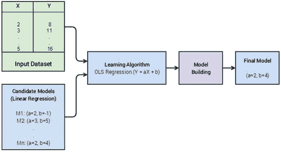

图 5-1。

A high-level representation of model building

当我们指定线性回归作为候选模型时，我们定义了因变量和自变量之间关系的性质。然后，候选模型成为我们的模型的所有可能的参数组合(稍后将详细介绍)。学习算法是确定这些参数的最佳值的方法，该方法使用一些优化过程，并用一些度量标准(例如降低总误差的均方误差)来验证性能。最终模型不过是由我们的学习算法选择的参数的最优值。因此，在简单线性回归的情况下，它只不过是一个包含两个参数 A 和 b 的值的元组。这里要记住的一点是，术语参数类似于模型中的系数或权重。还有一些其他类型的参数称为超参数，它们代表模型的更高级元参数，不依赖于底层数据。它们通常需要在我们开始构建或学习过程之前进行设置。通常，作为模型调整阶段的一部分(学习阶段本身的一部分)，这些超参数被调整以获得最佳值。另一个需要记住的要点是，输出模型通常取决于我们为数据选择的学习算法。

### 模型类型

模型可以用各种类别和术语来区分。这很大程度上是基于用于建立模型的学习算法或方法本身。示例可以是模型是线性的还是非线性的，模型的输出是什么，它是参数模型还是非参数模型，它是监督的、非监督的还是半监督的，它是集成模型还是甚至是基于深度学习的模型。请参考第 [1](01.html) 章中的“机器学习方法”一节，以刷新您对可能用于在数据集上建立模型的机器学习方法的记忆。在这一节中，我们将重点关注监督和非监督学习方法中一些最流行的模型。

#### 分类模型

分类是最容易识别的机器学习任务之一，在第 [1](01.html) 章中有详细介绍。它是被称为监督学习的更广泛的机器学习问题的子集。监督学习是一组机器学习问题\任务，其中我们有一个带有输入属性和相应输出标签或类(离散)的标记数据集。然后，这些输入和相应的输出用于学习一个通用系统，该系统可用于预测以前未见过的数据点的结果(输出类别标签)。分类是整个监督学习领域的一个主要部分。

分类模型的输出通常是输入数据点所属的标签或类别。解决分类(或者一般来说，任何监督的)问题的任务涉及一组训练数据，在这些数据中，我们将数据点标记为正确的类别/种类。然后，我们使用特定于分类问题的监督机器学习算法，为我们的问题概括出类似于分类函数的东西。此分类函数的输入与我们用来训练模型的数据完全相似。该输入通常是在特征工程步骤中产生的数据属性或特征。

典型的分类模型包括以下主要类型的方法:然而，这份清单并不详尽。

*   线性模型，如逻辑回归、朴素贝叶斯和支持向量机
*   非参数模型，如 K-最近邻
*   基于树的方法，如决策树
*   集成方法，如随机森林(bagging)和梯度增强机器(boosting)
*   神经网络

分类模型可以根据输出变量的类型和它们产生的输出变量的数量进一步细分。这个术语对于通过查看数据集属性和要解决的目标来理解您正在处理的分类问题的类型非常重要。

*   二元分类:当我们在数据的输出响应变量中总共有两个类别需要区分时，那么这个问题就被称为二元分类问题。因此，您需要一个适当的模型来执行二元分类(称为二元分类模型)。一个流行的二进制分类问题是“电子邮件分类问题”。在这个问题中，候选电子邮件需要被分类并标记为两个不同类别中的任何一个:“垃圾邮件”或“非垃圾邮件”(也称为“Ham”)。
*   多类分类:这是二分类问题的扩展。在这种情况下，我们的数据可以分为两个以上的类别。多类分类问题的一个例子是预测手写数字，其中响应变量可以具有范围从 0 到 9 的任何值。这就变成了 10 级分类问题。多类分类是一个难以解决的问题，解决多类问题的一般方案大多涉及对二分类问题的一些修改。
*   多标签分类:这些分类问题通常涉及输出变量不总是单个值而是具有多个值或标签的向量的数据。一个简单的例子是预测新闻文章的类别，每个新闻文章可以有多个标签，如科学、政治、宗教等等。

分类模型通常会输出实际的类别标签或每个可能类别标签的概率，从而给出预测中每个类别的置信度。以下是分类模型的主要输出格式。

*   类别分类输出:在一些分类模型中，任何未知数据点的输出是预测的类别或类标签。这些模型通常计算所有类别的概率，但是只报告一个具有最大概率或置信度的类别标签。
*   类别概率分类输出:在这些分类模型中，输出是每个可能的类别标签的概率值。当我们想要进一步使用我们的分类模型产生的输出来进行详细的分析或做出复杂的决策时，这些模型是很重要的。一个非常简单的例子可以是一个典型的营销候选人选择问题。在这个问题中，通过获得潜在转化的概率输出，我们可以缩小我们的营销费用。

#### 回归模型

在分类模型中，我们看到模型预测的输出变量是一个离散值；即使我们得到的输出是一个概率值，这些概率值也与可能类别的离散类标签值相关联。回归模型是监督学习模型家族的另一个子集。在这些模型中，输入数据通常标有实值输出变量(连续而非离散)。回归分析是统计学习的一个重要部分，在机器学习领域中，它具有非常相似的用途。

在统计学习中，回归分析用于寻找因变量和自变量(可以是一个或多个)之间的关系。在回归模型的情况下，当我们将新的数据点提供给我们学习过的\训练过的回归模型时，模型的输出是一个连续的值。基于变量的数量、输出变量的概率分布和关系形式(线性与非线性)，我们有不同类型的回归模型。以下是回归模型的一些主要类别。

*   简单线性回归:它是所有回归模型中最简单的一种，但它非常有效，并广泛用于实际目的。在这种情况下，我们只有一个自变量和一个因变量。因变量是一个实数值，并假设遵循正态分布。在线性回归中，在开发模型时，我们假设自变量和因变量之间存在线性关系。
*   多元线性回归:它是简单线性回归模型的扩展，包括一个以上的独立变量。其他假设保持不变，即因变量仍然是一个实值，并遵循正态分布。
*   非线性回归:因变量依赖于参数\系数的非线性变换的回归模型，称为非线性回归模型。它与我们使用独立变量的非线性变换的模型略有不同。让我们考虑一个例子来说明这一点。考虑模型，y =β<sub>0</sub>+β<sub>1</sub>x<sup>2</sup>+ψ。在之前的模型中，我们使用了独立变量的平方，但是模型的参数(贝塔系数)仍然是线性的。因此，该模型仍然是线性回归模型的一个例子，或者更具体地说，是多项式回归模型。系数不是线性的模型是可以被称为非线性回归模型的模型。考虑一个满足这个标准的例子，因此可以称为非线性回归模型。y =β<sub>0</sub>+(logβ<sub>1</sub>)x<sup>2</sup>+ψ。这些模型很难学习，因此在实践中没有广泛使用。在大多数情况下，对输入变量应用非线性变换的线性模型通常就足够了。

回归模型是统计学和机器学习的一个非常重要的部分，我们鼓励您通过查看第 [1](01.html) 章中的“回归”部分来刷新您的记忆，并阅读一些关于回归模型的标准文献，以根据需要深入了解更详细的概念。我们将在下一章的真实案例研究中讨论回归问题。

#### 聚类模型

我们在第 [1](01.html) 章中简要地讨论了集群，以防你可能想要刷新你的记忆。聚类是一种不同的机器学习方法，称为无监督学习。聚类的最简单定义是将没有任何预先标记的类或类别的相似数据点分组在一起的过程。典型聚类过程的输出是分离的数据点组，使得同一组中的数据点彼此相似，但与其他组的成员(数据点)不同。这两种方法的主要区别在于，与监督学习不同，我们没有预先标记的数据集来训练和构建我们的模型。无监督学习问题的输入集通常是整个数据集本身。无监督学习问题集的另一个重要标志是它们很难评估，这一点我们将在本章的后半部分看到。

基于聚类方法和原理，聚类模型可以是不同的类型。我们将简要介绍不同类型的聚类算法，如下所示。

*   基于分区的聚类:基于分区的聚类方法是想象聚类过程的最自然的方式。基于划分的聚类方法将定义相似性的概念。这可以是通过对这些属性(特征)应用数学函数而从数据点的属性中导出的任何度量。然后，在这个相似性度量的基础上，我们可以将彼此相似的数据点分组到单个组中，并将不同的数据点分开。基于分区的聚类模型通常使用递归技术来开发，即，我们从一些任意的数据分区开始，并且基于相似性度量，我们保持重新分配数据点，直到我们达到稳定的停止标准。例如 K-means、K-medoids、CLARANS 等技术。
*   层次聚类:层次聚类模型与基于分区的聚类模型的不同之处在于它们的开发方式和工作方式。在分层聚类范例中，我们要么从一个组中的所有数据点开始(分裂聚类)，要么从不同组中的所有数据点开始(聚集聚类)。基于起点，我们可以根据一些公认的相似性标准继续将大组划分成更小的组或群，或者我们可以根据相同的标准继续将不同的组或群合并成更大的组或群。当达到决定的停止条件时，该过程通常停止。相似性标准可以是与其他聚类数据点相比，聚类中数据点间的距离。例子包括基于 Ward 最小方差标准的凝聚层次聚类。
*   基于密度的聚类:前面提到的两种聚类模型都非常依赖于距离的概念。这导致这些算法主要找出数据的球形簇。当数据中有任意形状的聚类时，这可能会成为一个问题。这个限制可以通过抛弃基于距离度量的聚类的概念来解决。我们可以定义数据“密度”的概念，并使用它来开发我们的集群。然后，集群开发方法从在一些点附近寻找点转变为在我们有一些数据点的地方寻找点。这种方法不像距离度量方法那样容易解释，但是它导致不必是球形的聚类。这是非常理想的特征，因为不可能所有感兴趣的聚类都是球形的。例子包括 DBSCAN 和 OPTICS。

### 学习模型

从本章一开始，我们就一直在讨论构建模型、学习参数等等。在本节中，我们将从机器学习的角度解释术语“构建模型”的实际含义。在下面的部分中，我们以一个具体的模型为例，简要讨论学习模型的数学方面，以使事情更清楚。在这一部分，我们尽量简化数学，这样你就不会被过多的信息淹没。然而，建议感兴趣的读者查阅任何关于机器学习模型及其实现的理论和概念细节的标准书籍(我们推荐 Tibshirani 等人 [`http://www.springer.com/in/book/9781461471370`](http://www.springer.com/in/book/9781461471370) )的《统计学习导论》。

#### 机器学习的三个阶段

机器学习通常是一个复杂的领域。我们有不同类型的问题和任务以及不同的算法来解决它们。我们还有复杂的数学、统计和逻辑，它们构成了这个多样化领域的主干。如果你还记得的话，你在第一章学到了机器学习是统计学、数学、最优化、线性代数和一堆其他主题的结合。但不要绝望；你不需要马上开始学习所有的知识！这些不同的机器学习实践可以通过简单的三阶段范式来统一。这三个阶段是:

*   表示
*   估价
*   最佳化

现在让我们分别讨论这些步骤，以了解几乎所有的机器学习算法或方法是如何工作的。

##### 表示

任何机器学习问题的第一步都是用一种正式语言来表示问题。这是我们通常根据数据和要解决的业务目标或问题来定义要执行的机器学习任务的地方。通常问题的这个阶段被掩盖为另一个阶段，即选择 ML 算法(在这个阶段你可能有多个可能的模型表示)。当我们选择一个目标算法时，我们就隐含地决定了我们希望用于我们问题的表示。这个阶段类似于决定一组假设模型，其中任何一个都可能是我们问题的解决方案。例如，当我们决定要执行的机器学习任务是查看我们的数据集进行回归，然后选择线性回归作为我们的回归模型时。然后，我们决定了因变量和自变量之间的线性组合关系。在这个阶段进行的另一个隐含选择是决定我们需要学习的模型的参数/权重/系数。

##### 估价

一旦我们决定了问题的表示和可能的模型集，我们需要一些判断标准来帮助我们选择一个模型，或者从一组候选模型中选择最佳模型。这个想法是定义一个评估指标或一个评分函数\损失函数，这将有助于实现这个目标。该评估度量通常根据目标或评估函数(也可以称为损失函数)来提供。这些目标函数通常会提供一个性能数值，帮助我们决定任何候选模型的有效性。目标函数取决于我们正在解决的问题的类型、我们选择的表示以及其他因素。一个简单的例子是，损失率或错误率越低，模型的表现就越好。

##### 最佳化

学习过程的最后阶段是优化。在这种情况下，优化可以简单地描述为搜索所有假设模型空间表示，以找到将为我们的评估函数提供最佳值的一个。虽然这种对优化的描述隐藏了过程中涉及的绝大多数复杂性，但这是理解核心原则的好方法。我们通常使用的优化方法取决于表示的选择和一个或多个评估函数。幸运的是，一旦我们决定了表示和评估方面，我们已经有了一个庞大的健壮的优化器集可以使用。优化方法可以是像梯度下降这样的方法，甚至是像遗传算法这样的元启发式方法。

#### 逻辑回归的三个阶段

理解一个复杂过程的细微差别的最好方法是用一个例子来解释它。在本节中，我们使用逻辑回归模型来跟踪机器学习过程的三个阶段。逻辑回归是线性回归的扩展，用于解决分类问题。我们将看到一个简单的逻辑回归问题是如何使用基于梯度下降的优化来解决的，这是最流行的优化方法之一。

##### 表示

通过将 logit 函数应用于线性回归模型的表示，可以获得逻辑回归的表示。线性回归表示由该假设函数给出:

h(ζ)=ζ〔t0〕t x〔t1〕

这里，θ表示模型的参数，x 是输入向量。logit 函数由下式给出:

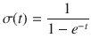

将 logit 函数应用于线性回归的表示给出了逻辑回归的表示。

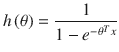

这是我们对于逻辑回归模型的表述。由于 logit 函数值的范围在 0 和 1 之间，我们可以通过提供输入向量 x 和一组参数θ并计算 h(θ)的值来决定这两个类别。如果 h(θ)小于 0.5，则标签通常为 0；否则，标签为 1(二进制分类问题利用了这一点)。

##### 估价

该过程的下一步是指定评估或成本函数。在我们的情况下，成本函数取决于数据点的实际类别。假设对于类别为 1 的数据点，logit 函数的输出为 0.75，则该情况下的误差或损失为 0.25。但是如果数据点属于类别 0，那么误差是 0.75。使用这个类比，我们可以如下定义一个数据点的成本函数。

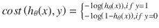

利用前面的逻辑，整个数据集的代价函数由:

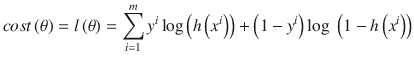

给出

##### 最佳化

我们之前描述的成本函数是θ的函数，因此我们需要最大化之前的函数，并找到给出最大值的θ集(通常我们将最小化成本函数，但这里我们取了一个对数，因此我们将最大化对数函数)。我们通过获得的值θ代表我们想要学习的模型(参数)。

最大化或最小化一个函数的基本思想是，对函数求导，找到梯度为零的点。这是函数取最小值或最大值的点。但我们必须记住，我们的函数在参数θ中是一个非线性函数。因此，我们无法直接求解θ的最优值。这就是我们引入梯度下降法概念的地方。

最简单的来说，梯度下降就是我们计算想要优化的函数在每个点的梯度，然后不断向负梯度值方向移动的过程。这里所说的移动，是指根据我们计算的梯度来更新θ的值。

我们可以计算成本函数相对于参数向量的每个分量的梯度如下:

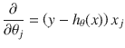

通过对参数向量的每个分量重复这种计算，我们可以计算函数相对于整个参数向量的梯度。一旦我们得到了梯度，下一步就是用这个方程更新新的参数向量值。

T2】

这里，α代表我们想在梯度方向上迈出的一小步。α是优化过程的超参数(你可以把它想成学习速率或学习步长)，它的值可以决定我们是达到全局最小值还是局部最小值。

如果我们不断重复这个过程，我们将达到这样一个点，即无论我们对θ值进行任何微小的更新，我们的成本函数都不会发生太大的变化。使用这种方法，我们可以获得一组最佳的参数值。

请记住，这是对梯度的简单描述，以便于理解和解释。通常在解决一个优化问题和一系列的挑战时会涉及到许多其他的考虑。本节的主要目的是让你意识到优化是任何机器学习问题的一个重要部分。

### 模型构建示例

本书的后续章节将致力于在真实世界数据集上构建和调整模型。因此，我们通常会做大量的模型构建、调整和评估工作。在这一节中，我们想要描述我们在上一节中讨论的每一类模型的一些例子。这将作为一个现成的计算器启动指南，为我们未来的模型构建提供帮助。

#### 分类

在所有分类(或监督学习)问题中，准备整个数据集后的第一步是将数据分成测试集、训练集和可选的验证集。这个想法是让模型通过在`train`数据集上训练来学习，在`validation`数据集上评估和调整它，或者使用交叉验证等技术，最后在`test`数据集上检查它的性能。您将在本章的模型评估部分了解到，评估模型是任何机器学习解决方案的关键部分。因此，作为一个经验法则，我们必须始终记住，机器学习算法的实际评估总是基于它以前没有见过的数据(即使是对训练数据集的交叉验证也会使用一部分`train`数据来建立模型，其余的用于评估)。

有时我们会使用整个数据集来训练模型，然后使用其中的某个子集作为测试集。这是我们很多人在机器学习中经常犯的一个常见错误。要准确地分析一个模型，它必须很好地进行归纳，并在它从未见过的数据上表现良好。对训练数据的好的评估度量，但对看不见的(验证或测试)数据的差的性能，意味着该算法未能产生问题的一般化解决方案(稍后将对此进行更多讨论)。

对于我们的分类示例，我们将使用我们之前谈到的一个流行的多类分类问题，手写数字识别。相同的数据可作为`scikit-learn`库的一部分获得。这里的问题是从一个数字的手写图像中预测实际的数字值。在其原始形式中，该问题属于基于图像的分类和计算机视觉领域。在数据集中，我们有一个`1x64`特征向量，它代表手写数字的灰度图像的图像表示。

在我们开始构建任何模型之前，让我们先看看我们想要分析的数据和图像是什么样子的。以下代码将加载索引为 10 的图像的数据并绘制它。

```py
In [2]: from sklearn import datasets
   ...: import matplotlib.pyplot as plt
   ...: %matplotlib inline

   ...: digits = datasets.load_digits()
   ...:
   ...: plt.figure(figsize=(3, 3))
   ...: plt.imshow(digits.images[10], cmap=plt.cm.gray_r)

```

代码生成的图像如图 [5-2](#Fig2) 所示。猜猜它代表哪个数字？

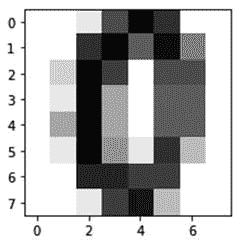

图 5-2。

Handwritten digit data representing the digit zero

我们可以确定原始像素数据看起来是什么样的扁平向量表示和数字(类标签)，它由使用以下代码的图像表示。

```py
# actual image pixel matrix
In [3]: digits.images[10]
Out[3]:
array([[  0.,   0.,   1.,   9.,  15.,  11.,   0.,   0.],
       [  0.,   0.,  11.,  16.,   8.,  14.,   6.,   0.],
       [  0.,   2.,  16.,  10.,   0.,   9.,   9.,   0.],
       [  0.,   1.,  16.,   4.,   0.,   8.,   8.,   0.],
       [  0.,   4.,  16.,   4.,   0.,   8.,   8.,   0.],
       [  0.,   1.,  16.,   5.,   1.,  11.,   3.,   0.],
       [  0.,   0.,  12.,  12.,  10.,  10.,   0.,   0.],
       [  0.,   0.,   1.,  10.,  13.,   3.,   0.,   0.]])

# flattened vector
In [4]: digits.data[10]
Out[4]:
array([  0.,   0.,   1.,   9.,  15.,  11.,   0.,   0.,   0.,   0.,  11., 16.,   8.,  14.,   
         6.,   0.,   0.,   2.,  16.,  10.,   0.,   9.,   9.,   0.,   0.,   1.,  16.,   4.,   
         0.,   8.,   8.,   0.,   0.,   4.,  16.,   4.,   0.,   8.,   8.,   0.,   0.,   1.,  
         16.,   5.,  1.,  11.,   3.,   0.,   0.,   0.,  12.,  12.,  10.,  10.,   0.,   0.,   
         0.,   0.,   1.,  10.,  13.,   3.,   0.,   0.])

# image class label
In [5]: digits.target[10]
Out[5]: 0

```

我们以后会看到，我们可以用各种方法来描述这个问题。但是在本教程中，我们将使用逻辑回归模型来进行分类。在我们继续建模之前，我们将把数据集分成单独的`test`和`train`集。`test`集的大小通常取决于可用数据的总量。在我们的例子中，我们将使用一个`test`集合，它占整个数据集的 30%。为了便于理解，打印出了每个数据集中的总数据点

```py
In [12]: X_digits = digits.data
    ...: y_digits = digits.target
    ...:
    ...: num_data_points = len(X_digits)
    ...:
    ...: X_train = X_digits[:int(.7 * num_data_points)]
    ...: y_train = y_digits[:int(.7 * num_data_points)]
    ...: X_test = X_digits[int(.7 * num_data_points):]
    ...: y_test = y_digits[int(.7 * num_data_points):]
    ...: print(X_train.shape, X_test.shape)
(1257, 64) (540, 64)

```

从前面的输出中，我们可以看到我们的`train`数据集有 1257 个数据点，而`test`数据集有 540 个数据点。该过程的下一步是指定我们将使用的模型和我们想要使用的超参数值。这些超参数的值不依赖于基础数据，并且通常在模型训练之前被设置，并且被微调以提取最佳模型。你将在本章的后面学习调谐。目前，当我们初始化模型估计器并在训练集上拟合我们的模型时，我们将使用所描述的默认值。

```py
In [14]: from sklearn import linear_model
    ...:
    ...: logistic = linear_model.LogisticRegression()
    ...: logistic.fit(X_train, y_train)
LogisticRegression(C=1.0, class_weight=None, dual=False, fit_intercept=True,
          intercept_scaling=1, max_iter=100, multi_class='ovr', n_jobs=1,
          penalty='l2', random_state=None, solver='liblinear', tol=0.0001,
          verbose=0, warm_start=False)

```

您可以看到前面输出中描述的模型的各种超参数和参数。现在让我们在`test`数据集上测试这个模型的准确性。

```py
In [15]: print('Logistic Regression mean accuracy: %f' % logistic.score(X_test, y_test))
Logistic Regression mean accuracy: 0.900000

```

这就是符合逻辑回归模型的全部内容。在第一步中，我们确定了我们想要使用的模型，在我们的例子中是一个线性模型，称为逻辑回归。然后我们用我们的训练数据及其输出标签调用该对象的`fit`方法。`fit`方法用学习到的模型参数更新模型对象。然后，我们使用对象的`score`方法来确定测试集上拟合模型的准确性。因此，我们开发的模型在预测手写数字时，没有任何密集调整，准确率达到 90%。

这结束了我们在数据集上拟合分类模型的非常基本的例子。请注意，我们的数据集是经过完全处理和清理的格式。在解决任何问题时，您需要确保您的数据处于相同的状态，然后才能在其上拟合任何模型。

#### 使聚集

在本节中，您将了解如何在另一个数据集上拟合聚类模型。在我们将要选取的示例中，我们将使用一个带标签的数据集来帮助我们查看聚类模型的结果，并将其与实际标签进行比较。这里要记住的一点是，通常标记的数据在现实世界中是不可用的，这就是为什么我们选择像聚类这样的无监督方法。我们将尝试介绍两种不同的算法，分别来自基于划分的聚类和层次聚类。

我们将用于聚类示例的数据将是非常受欢迎的威斯康星乳腺癌诊断数据集，我们在第 [4](04.html) 章“特征选择和维度缩减”一节中详细介绍了该数据集。请务必查看这些部分，以刷新您的记忆。该数据集有 30 个属性或特征，每个数据点(乳房肿块)有一个相应的标签，描述它是否有癌症(恶性:标签值 0)或没有癌症(良性:标签值 1)。让我们使用下面的代码加载数据。

```py
import numpy as np
from sklearn.datasets import load_breast_cancer

# load data
data = load_breast_cancer()
X = data.data
y = data.target
print(X.shape, data.feature_names)
(569, 30) ['mean radius' 'mean texture' 'mean perimeter' ... 'worst fractal dimension']

```

很明显，我们总共有 569 个观察值，每个观察值有 30 个属性或特征。

##### 基于划分的聚类

在我们的例子中，我们将选择最简单也是最流行的基于划分的聚类模型，即 K-means 算法。该算法是一种基于质心的聚类算法，该算法首先对数据中的所有聚类进行一些假设，并为每个聚类分配随机中心。然后，它使用欧几里德距离作为距离度量，将每个数据点重新分配到离它最近的中心。每次重新分配后，它都会重新计算该簇的中心。整个过程反复重复，当数据点的重新分配不改变聚类中心时停止。变体包括像 K-medoids 这样的算法。

由于我们已经从数据标签中知道我们有两种可能的类别类型 0 或 1，下面的代码试图通过利用 K-means 聚类从数据中确定这两个分类。在现实世界中，情况并不总是这样，因为我们不知道可能的集群数量。这是 K 均值聚类最重要的缺点之一。

```py
from sklearn.cluster import KMeans

km = KMeans(n_clusters=2)
km.fit(X)

labels = km.labels_
centers = km.cluster_centers_
print(labels[:10])
[0 0 0 1 0 1 0 1 1 1]

```

一旦`fit`过程完成，我们就可以通过使用前面的属性获得数据集中两个聚类的中心和标签。这里的中心指的是数据维度的一些数值(数据集中的 30 个属性),数据围绕这些数值进行聚类。

但是我们能把这些集群和实际的标签进行可视化和比较吗？请记住，我们正在处理 30 个特征，在 30 维特征空间上可视化集群是不可能解释甚至执行的。因此，我们将利用主成分分析将输入维度减少到两个主成分，并在主成分之上可视化聚类。参考第 [4](04.html) 章，了解更多关于主成分分析的信息。

```py
from sklearn.decomposition import PCA

pca = PCA(n_components=2)
bc_pca = pca.fit_transform(X)

```

以下代码有助于在缩减的 2D 特征空间上可视化实际标注的聚类以及聚类输出标注。

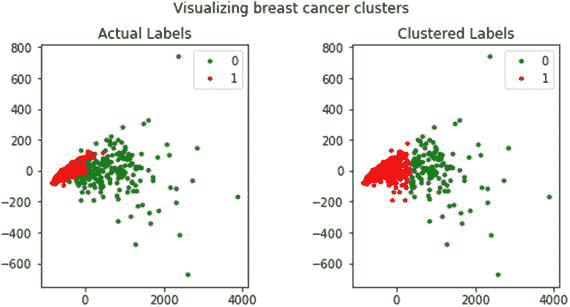

图 5-3。

Visualizing clusters in the breast cancer dataset

```py
fig, (ax1, ax2) = plt.subplots(1, 2, figsize=(8, 4))
fig.suptitle('Visualizing breast cancer clusters')
fig.subplots_adjust(top=0.85, wspace=0.5)
ax1.set_title('Actual Labels')
ax2.set_title('Clustered Labels')

for i in range(len(y)):
    if y[i] == 0:
        c1 = ax1.scatter(bc_pca[i,0], bc_pca[i,1],c='g', marker='.')
    if y[i] == 1:
        c2 = ax1.scatter(bc_pca[i,0], bc_pca[i,1],c='r', marker='.')

    if labels[i] == 0:
        c3 = ax2.scatter(bc_pca[i,0], bc_pca[i,1],c='g', marker='.')
    if labels[i] == 1:
        c4 = ax2.scatter(bc_pca[i,0], bc_pca[i,1],c='r', marker='.')

l1 = ax1.legend([c1, c2], ['0', '1'])
l2 = ax2.legend([c3, c4], ['0', '1'])

```

从图 [5-3](#Fig3) 中，您可以清楚地看到聚类工作非常好，它显示了标签为 0 和 1 的聚类之间的明显分离，并且与实际标签非常相似。然而，我们确实有一些重叠，我们错误地标记了一些实例，这在右边的图中很明显。请记住，在实际的真实场景中，您将没有实际的标签进行比较，主要思想是以这些聚类的形式在您的数据中找到结构或模式。需要记住的另一个非常重要的点是，聚类标签值没有意义。标签 0 和 1 只是用来区分聚类数据点的值。如果您再次运行此过程，您可以很容易地获得标签颠倒的相同图。因此，即使在处理带标签的数据和运行聚类时，也不要将聚类后的标签值与实际标签进行比较，并尝试测量准确性。另一个重要的注意事项是，如果我们要求两个以上的聚类，该算法将很容易提供更多的聚类，但它将很难解释这些，其中许多将没有意义。因此，使用 K-means 算法的一个注意事项是在我们对数据中可能存在的聚类总数有所了解的情况下使用它。

##### 分层聚类

我们可以使用相同的数据来执行层次聚类，并查看与 K-means 聚类和实际标签相比，结果是否有很大变化。在`scikit-learn`中，我们有许多类似于`AgglomerativeClustering`类的接口来执行层次聚类。根据我们在本章前面以及第 [1](01.html) 章中讨论的内容，凝聚聚类是使用自下而上方法的层次聚类，即每个观察值从其自己的聚类开始，然后聚类依次合并在一起。合并标准可以从一组候选连杆中使用；连接的选择决定了合并策略。连锁标准的一些例子是沃德、完全连锁、平均连锁等。然而，我们将利用来自`scipy`的低级功能，因为我们仍然需要提及我们想要避免的`AgglomerativeClustering`接口中的集群数量。由于我们已经在变量`X`中设置了乳腺癌特征，下面的代码帮助我们使用沃德最小方差标准计算连锁矩阵。

```py
from scipy.cluster.hierarchy import dendrogram, linkage
import numpy as np
np.set_printoptions(suppress=True)

Z = linkage(X, 'ward')
print(Z)

[[   287\.            336\.              3.81596727      2\.        ]
 [   106\.            420\.              4.11664267      2\.        ]
 [    55\.            251\.              4.93361024      2\.        ]
 ...,
 [  1130\.           1132\.           6196.07482529     86\.        ]
 [  1131\.           1133\.           8368.99225244    483\.        ]
 [  1134\.           1135\.          18371.10293626    569\.        ]]

```

看到前面的输出，您可能会想这个连接矩阵表示什么？您可以将关联矩阵视为一个完整的历史地图，记录每次迭代中哪些数据点被合并到了哪个聚类中。如果你有 n 个数据点，那么连接矩阵 Z 的形状将会是(n - 1) x 4，其中 Z[i]将会告诉我们在第 I 次<sup>次</sup>迭代中合并了哪些聚类。每行有四个元素，前两个元素是数据点标识符或聚类标签(在多个数据点合并后矩阵的后面部分)，第三个元素是前两个元素(数据点或聚类)之间的聚类距离，最后一个元素是合并完成后聚类中元素\数据点的总数。我们推荐你参考 [`https://docs.scipy.org/doc/scipy/reference/generated/scipy.cluster.hierarchy.linkage.html`](https://docs.scipy.org/doc/scipy/reference/generated/scipy.cluster.hierarchy.linkage.html) ，里面详细解释了这一点。可视化这些基于距离的合并的最佳方式是使用树状图，如图 [5-4](#Fig4) 所示。

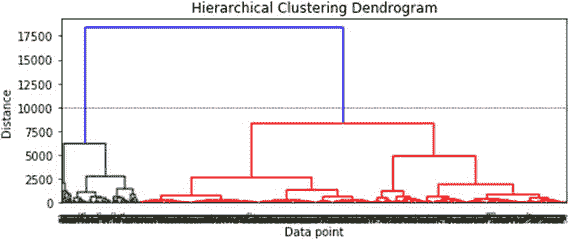

图 5-4。

Visualizing the hierarchical clustering dendrogram

```py
plt.figure(figsize=(8, 3))
plt.title('Hierarchical Clustering Dendrogram')
plt.xlabel('Data point')
plt.ylabel('Distance')
dendrogram(Z)
plt.axhline(y=10000, c='k', ls='--', lw=0.5)
plt.show()

```

在图 [5-4](#Fig4) 中描绘的树状图中，我们可以看到每个数据点是如何从一个单独的聚类开始，然后慢慢地开始与其他数据点融合形成聚类的。从颜色和树状图的高度来看，如果考虑大约`10000`或更高的距离度量，您可以看到模型已经正确地识别了两个主要的集群。利用这个距离，我们可以使用下面的代码获得集群标签。

```py
from scipy.cluster.hierarchy import fcluster

max_dist = 10000
hc_labels = fcluster(Z, max_dist, criterion='distance')

```

让我们比较一下与原始标签分布相比，基于 PCA 降维的集群输出是什么样子的(详细代码在笔记本中)。见图 [5-5](#Fig5) 。

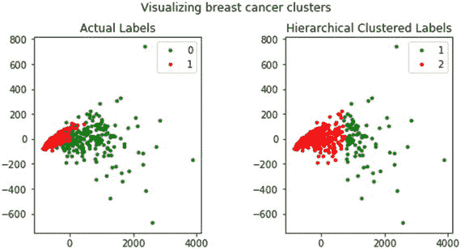

图 5-5。

Visualizing hierarchical clusters in the breast cancer dataset

我们确实看到两个不同的聚类，但是与 K-means 方法相比，两个聚类之间有更多的重叠，并且我们有更多的错误标记的实例。但是，一定要记下标签号；这里我们用 1 和 2 作为标签值。这只是为了强调一个事实，即标签值只是为了区分集群，并不代表任何东西。这种方法的优点是，您不需要事先输入分类数，模型会尝试从基础数据中找到它。

## 模型评估

我们已经看到了基于各种需求的数据检索、处理、争论和建模的过程。随之而来的一个逻辑问题是，我们如何判断一个模型是好是坏？仅仅因为我们用一个著名的算法开发了一些奇特的东西，并不保证它的性能会很好。模型评估是这些问题的答案，是整个机器学习管道中必不可少的一部分。我们在过去已经多次提到过，模型开发是一个迭代的过程。模型评估是迭代过程的定义部分，这使得它本质上是迭代的。根据模型评估和随后的比较，我们可以决定是继续还是停止模型增强工作，以及应该选择哪个模型作为要使用\部署的最终模型。模型评估还有助于我们调整模型的超参数，并决定我们刚刚开发的智能功能是否为我们的模型增加了任何价值。综合所有这些论点，就有了一个令人信服的理由来定义模型评估的过程，以及可以使用什么度量来度量和评估模型。

那么如何才能评价一个模型呢？如何才能做出 A 型更好还是 B 型表现更好的决定？理想的方法是对模型的有效性进行一些数字测量或度量，并使用该测量来排列和选择模型。这将是我们评估模型的主要方法之一，但我们也应该记住，很多时候这些评估指标可能无法捕获我们试图解决的问题所需的成功标准。在这些情况下，我们将被要求变得富有想象力，使这些度量适应我们的问题，并使用诸如业务约束和目标之类的东西。

模型评估指标高度依赖于我们拥有的模型类型，因此回归模型的指标将不同于分类模型或聚类模型。考虑到这种依赖性，我们将把这一部分分成三小节。我们涵盖了三类模型的主要模型评估指标。

### 评估分类模型

分类模型是机器学习实践者中最受欢迎的模型之一。由于它们的流行，了解如何构建高质量的通用模型是非常重要的。他们有各种各样的度量标准，可以用来评估分类模型。在这一节中，我们将目标放在那些重要指标的一小部分上。我们使用在上一节中开发的模型来详细说明它们。为此，让我们首先准备`train`和`test`数据集来构建我们的分类模型。我们将利用之前的`X`和`y`变量，它们保存了乳腺癌数据集观察的数据和标签。

```py
from sklearn.model_selection import train_test_split

X_train, X_test, y_train, y_test = train_test_split(X, y, test_size=0.3, random_state=42)
print(X_train.shape, X_test.shape)
(398, 30) (171, 30)

```

从前面的输出可以清楚地看出，我们的`train`数据集中有 398 个观察值，而`test`数据集中有 171 个观察值。我们将利用我们为模型评估创建的漂亮模块。它被命名为`model_evaluation_utils`，你可以在本章的代码文件和笔记本中找到它。我们建议您查看代码，它利用`scikit-learn metrics`模块来计算大多数评估指标和图表。

#### 混淆矩阵

混淆矩阵是评估分类模型最流行的方法之一。虽然矩阵本身不是一个度量，但是矩阵表示可以用来定义各种度量，所有这些在一些特定的情况或场景中都变得很重要。可以为二元分类以及多类分类模型创建混淆矩阵。

通过将数据点的预测类别标签与其实际类别标签进行比较来创建混淆矩阵。对整个数据集重复这种比较，并且以矩阵或表格的形式汇编这种比较的结果。这个合成矩阵就是我们的混淆矩阵。在我们继续之前，让我们在我们的乳腺癌数据集上建立一个逻辑回归模型，并在`test`数据集上查看模型预测的混淆矩阵。

```py
from sklearn import linear_model
# train and build the model
logistic = linear_model.LogisticRegression()
logistic.fit(X_train,y_train)

# predict on test data and view confusion matrix
import model_evaluation_utils as meu

y_pred = logistic.predict(X_test)
meu.display_confusion_matrix(true_labels=y_test, predicted_labels=y_pred, classes=[0, 1])

          Predicted:     
                   0    1
Actual: 0         59    4
        1          2  106

```

前面的输出描述了带有必要注释的混淆矩阵。我们可以看到，在标签为 0(恶性)的 63 个观察值中，我们的模型已经正确预测了 59 个观察值。类似地，在标签为 1(良性)的 108 个观察值中，我们的模型正确预测了 106 个观察值。更详细的分析马上就来！

##### 理解混淆矩阵

虽然这个名字本身听起来相当令人不知所措，但是一旦你掌握了基本知识，理解混淆矩阵就不会那么令人困惑了！重申一下您在上一节中学到的内容，混淆矩阵是一个表格结构，用于记录正确的分类和错误的分类。这对于评估分类模型的性能非常有用，因为我们知道该模型的真实数据标签，并且可以与预测的数据标签进行比较。混淆矩阵中的每一列表示基于模型预测的分类实例计数，矩阵的每一行表示基于实际\真实类别标签的实例计数。这种结构也可以反过来，即预测用行表示，真实标签用列表示。在一个典型的二分类问题中，我们通常有一个类标签，它被定义为正类，也就是我们感兴趣的类。例如，在我们的乳腺癌数据集中，假设我们对检测或预测患者何时没有乳腺癌(良性)感兴趣。那么标签 1 就是我们的正类。然而，假设我们感兴趣的类别是检测癌症(恶性),那么我们可以选择标签 0 作为我们的阳性类别。图 [5-6](#Fig6) 显示了二元分类问题的典型混淆矩阵，其中 p 表示正类，n 表示负类。

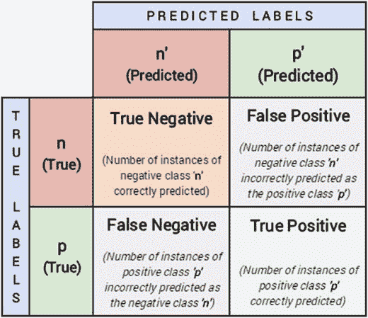

图 5-6。

Typical structure of a confusion matrix

关于混淆矩阵的结构，图 [5-6](#Fig6) 应该使事情更清楚。一般来说，我们通常有一个积极的类，正如我们之前讨论的，另一个类是消极的类。基于这个结构，我们可以清楚地看到四个条款的重要性。

*   True Positive (TP):这是真实类标签等于预测类标签的正类的实例总数，即我们使用模型正确预测正类标签的实例总数。
*   假阳性(FP):这是来自阴性类别的实例总数，其中我们的模型将它们错误地分类为阳性。因此得名，假阳性。
*   True Negative (FN):这是否定类中真实类标签等于预测类标签的实例总数，即我们使用模型正确预测否定类标签的实例总数。
*   假阴性(FN):这是来自阳性类的实例总数，其中我们的模型通过预测它们为阴性而将其错误分类。因此得名，假阴性。

因此，根据这些信息，您能否根据乳腺癌测试数据的模型预测，计算出前面提到的混淆矩阵的指标？

```py
positive_class = 1
TP = 106
FP = 4
TN = 59
FN = 2

```

##### 性能指标

混淆矩阵本身不是分类模型的性能度量。但是它可以用来计算几个度量，这些度量对于不同的场景是有用的。我们将描述如何从混淆矩阵中计算主要指标，使用必要的公式手动计算它们，然后将结果与`scikit-learn`提供的关于我们预测结果的函数进行比较，并给出可以使用这些指标的场景的直觉。

准确度:这是分类器性能最流行的度量之一。它被定义为模型的总体准确性或正确预测的比例。从混淆矩阵计算准确度的公式是:

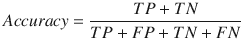

当我们的类几乎平衡，并且对这些类的正确预测同样重要时，通常使用准确性度量。以下代码计算我们的模型预测的准确性。

```py
fw_acc = round(meu.metrics.accuracy_score(y_true=y_test, y_pred=y_pred), 5)
mc_acc = round((TP + TN) / (TP + TN + FP + FN), 5)
print('Framework Accuracy:', fw_acc)
print('Manually Computed Accuracy:', mc_acc)

Framework Accuracy: 0.96491
Manually Computed Accuracy: 0.96491

```

精确度:精确度，也称为阳性预测值，是另一个可以从混淆矩阵中得到的度量。它被定义为基于正类的所有预测中实际正确或相关的预测数量。精度的公式如下:

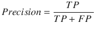

与具有较低精度的模型相比，具有高精度的模型将识别更高比例的正类。在我们更关心寻找正类的最大数量，即使总精度降低的情况下，精度变得很重要。下面的代码计算模型预测的精度。

```py
fw_prec = round(meu.metrics.precision_score(y_true=y_test, y_pred=y_pred), 5)
mc_prec = round((TP) / (TP + FP), 5)
print('Framework Precision:', fw_prec)
print('Manually Computed Precision:', mc_prec)

Framework Precision: 0.96364
Manually Computed Precision: 0.96364

```

召回率:召回率也称为敏感度，是模型识别相关数据点的百分比的度量。它被定义为被正确预测的正类的实例数。这也称为命中率、覆盖率或敏感度。召回的公式为:

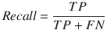

在我们希望捕获特定类的最大数量的实例的情况下，即使这增加了我们的误报，召回也成为分类器性能的重要度量。例如，考虑银行欺诈的情况，具有高召回率的模型将给我们提供更高数量的潜在欺诈案例。但这也有助于我们对大多数可疑案件发出警报。下面的代码计算模型预测的召回率。

```py
fw_rec = round(meu.metrics.recall_score(y_true=y_test, y_pred=y_pred), 5)
mc_rec = round((TP) / (TP + FN), 5)
print('Framework Recall:', fw_rec)
print('Manually Computed Recall:', mc_rec)

Framework Recall: 0.98148
Manually Computed Recall: 0.98148

```

F1 分数:在某些情况下，我们希望在精确度和召回率之间达到平衡优化。F1 分数是精确度和召回率的调和平均值，帮助我们优化分类器以平衡精确度和召回率性能。

F1 得分的公式为:

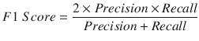

让我们使用下面的代码来计算我们的模型做出的预测的 F1 分数。

```py
fw_f1 = round(meu.metrics.f1_score(y_true=y_test, y_pred=y_pred), 5)
mc_f1 = round((2*mc_prec*mc_rec) / (mc_prec+mc_rec), 5)
print('Framework F1-Score:', fw_f1)
print('Manually Computed F1-Score:', mc_f1)

Framework F1-Score: 0.97248
Manually Computed F1-Score: 0.97248

```

因此，您可以看到我们手动计算的指标如何与从`scikit-learn`函数获得的结果相匹配。这应该给你一个好主意，如何用这些度量来评估分类模型。

#### 接受者操作特征曲线

ROC 代表接收机工作特性，是早期雷达的概念。这个概念可以扩展到二元分类器以及多类分类器的评估(注意，为了调整多类分类器的 ROC 曲线，我们必须使用一对一方案和平均技术，如宏平均和微平均。)它可以被解释为模型能够区分实际信号和数据中的噪声的有效性。

ROC 曲线可以通过绘制真阳性比例对假阳性比例来创建，即它是真阳性率(TPR)对假阳性率(FPR)的图。它主要适用于对分类器评分。评分分类器是将为每个类别标签返回概率值或分数的分类器类型，从中可以推导出类别标签(基于最大概率值)。可以使用分类器的真阳性率(TPR)和假阳性率(FPR)来绘制该曲线。TPR 被称为敏感度或召回率，它是在数据集的所有阳性样本中预测的正确阳性结果的总数。FPR 被称为假警报或(1 -特异性)，确定数据集中所有阴性样本中不正确阳性预测的总数。尽管我们很少手动绘制 ROC 曲线，但了解如何绘制它们总是一个好主意。给定每个数据点的类别标签概率及其正确或真实标签，可遵循以下步骤绘制 ROC 曲线。

1.  根据分类器的得分(或成为正类的概率)对分类器的输出进行排序。
2.  从(0，0)坐标开始。
3.  对于排序顺序中的每个示例 x:
    *   如果 x 为正，向上移动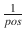
    *   如果 x 为负，向右移动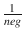 

这里 pos 和 neg 分别是正例和反例的分数。其思想是，通常在任何 ROC 曲线中，ROC 空间在点(0，0)和(1，1)之间。来自混淆矩阵的每个预测结果占据这个 ROC 空间中的一个点。理想情况下，最佳预测模型将在左上角(0，1)给出一个点，表示完美分类(100%灵敏度和特异性)。斜线表示进行随机猜测的分类器。理想情况下，如果你的 ROC 曲线出现在图表的上半部分，你就有了一个比平均值更好的分类器。您总是可以利用由`scikit-learn`提供的`roc_curve`函数来为 ROC 曲线生成必要的数据。详见 [`http://scikit-learn.org/stable/auto_examples/model_selection/plot_roc.html`](http://scikit-learn.org/stable/auto_examples/model_selection/plot_roc.html) 。图 [5-7](#Fig7) 显示了我们刚刚提到的链接的示例 ROC 曲线。

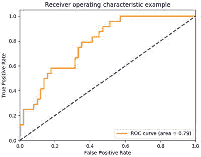

图 5-7。

Sample ROC Curve (Source`:` [`http://scikit-learn.org/stable/modules/model_evaluation.html#roc-metrics`](http://scikit-learn.org/stable/modules/model_evaluation.html#roc-metrics) )

图 [5-7](#Fig7) 描绘了样本 ROC 曲线。一般来说，ROC 曲线是直观解释分类模型的重要工具。但它并没有直接给我们提供一个可以用来比较模型的数值。完成这项任务的指标是曲线下面积，通常称为 AUC。在图 [5-7](#Fig7) 的 ROC 图中，橙色线下的面积就是分类器 ROC 曲线下的面积。理想的分类器在曲线下有单位面积。基于该值，我们可以比较两个模型，通常具有 AUC 分数的模型更好。我们在`model_evaluation_utils`模块中构建了一个通用函数，用于绘制二元以及多类分类问题的 ROC 曲线和 AUC 分数。做查看功能，`plot_model_roc_curve(...)`了解更多信息。以下代码利用相同的函数绘制了我们的乳腺癌逻辑回归模型的 ROC 曲线。

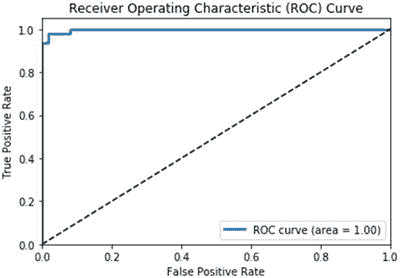

图 5-8。

ROC curve for our logistic regression model

```py
meu.plot_model_roc_curve(clf=logistic, features=X_test, true_labels=y_test)

```

考虑到我们的模型具有大约 97%的准确性和 F1 分数，图 [5-8](#Fig8) 在我们看到近乎完美的 ROC 曲线时是有意义的！查看第 [9](09.html) 章，查看运行中的多类分类器 ROC 曲线！

### 评估聚类模型

在上一节中，我们讨论了一些评估分类模型的流行方法。仅混淆矩阵就为我们提供了一堆度量标准，我们可以用它们来比较分类模型。当涉及到评估聚类(或一般的无监督模型)时，表格会发生剧烈的变化。在无监督模型的情况下，这种困难源于缺乏有效的基础事实，即在数据中缺乏真实的标签。在本节中，您将了解一些我们可以用来评估集群模型性能的方法/指标。

为了用真实世界的例子说明评估指标，我们将利用变量`X`中可用的乳腺癌数据集作为数据，利用变量`y`作为观察标签。我们还将使用 K-means 算法对此数据拟合两个模型——一个有两个聚类，另一个有五个聚类——然后评估它们的性能。

```py
km2 = KMeans(n_clusters=2, random_state=42).fit(X)
km2_labels = km2.labels_

km5 = KMeans(n_clusters=5, random_state=42).fit(X)
km5_labels = km5.labels_

```

#### 外部验证

外部验证意味着当我们有一些基础事实作为标记数据时，验证聚类模型。外部标签的存在降低了模型评估的大部分复杂性，因为聚类(无监督)模型可以以类似于分类模型的方式进行验证。回想一下我们在本章第一节中采用的乳腺癌数据集示例，我们通过聚类算法运行了标记的数据。在这种情况下，我们有两个类，并且从我们的算法中得到两个聚类。然而，评估性能不像分类算法那样简单。

如果您还记得我们之前关于聚类标签的讨论，它们只是用于根据数据点所属的聚类或组来区分数据点的指示器。因此，我们不能将标签为 0 的聚类与真正的类标签 0 直接进行比较。在聚类过程中，可能所有真实类别标签为 0 的数据点实际上都用标签 1 进行了聚类。基于此，当我们有了真实的标签时，我们可以利用几个指标来验证聚类性能。在这种情况下，可以使用三种流行的指标:

*   同质性:如果一个分类模型的所有分类都只包含属于单个类的数据点(基于真实的类标签)，则该分类模型预测结果满足同质性。
*   完整性:如果特定基础事实类标签的所有数据点也是同一聚类的元素，则聚类模型预测结果满足完整性。
*   V-measure:同质性和完整性得分的调和平均值给出了 V-measure 值。

值通常介于 0 和 1 之间，通常值越高越好。让我们在两个 K 均值聚类模型上计算这些度量。

```py
km2_hcv = np.round(metrics.homogeneity_completeness_v_measure(y, km2_labels), 3)
km5_hcv = np.round(metrics.homogeneity_completeness_v_measure(y, km5_labels), 3)

print('Homogeneity, Completeness, V-measure metrics for num clusters=2: ', km2_hcv)
print('Homogeneity, Completeness, V-measure metrics for num clusters=5: ', km5_hcv)

Homogeneity, Completeness, V-measure metrics for num clusters=2:  [ 0.422  0.517  0.465]
Homogeneity, Completeness, V-measure metrics for num clusters=5:  [ 0.602  0.298  0.398]

```

我们可以看到，具有两个聚类的第一个模型的 V-measure 比具有五个聚类的模型的 V-measure 好，原因是因为更高的完整性分数。您可以尝试的另一个指标包括 Fowlkes-Mallows 评分。

#### 内部验证

内部验证是指通过定义度量标准来验证群集模型，这些度量标准可以捕获好的群集模型的预期行为。一个好的聚类模型可以通过两个非常理想的特征来识别:

*   紧凑组，即一个聚类中的数据点彼此靠近出现。
*   分离良好的组，即两个组\簇之间的距离尽可能大。

我们可以定义以数学方式计算这两个主要特征的优劣的度量，并使用它们来评估聚类模型。大多数这样的度量将使用数据点之间的距离的一些概念。数据点之间的距离可以使用从欧几里德距离、曼哈顿距离或满足距离度量标准的任何候选距离度量来定义。

##### 轮廓系数

剪影系数是一种试图结合好的聚类模型的两个要求的度量。轮廓系数是为每个样本定义的，并且是其与自己的聚类中的数据点的相似性和其与不在其聚类中的数据点的不相似性的组合。

具有 n 个数据点的聚类模型的轮廓系数的数学公式由:

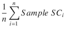

给出

这里，样本 SC 是每个样本的轮廓系数。样本轮廓系数的公式为，

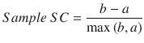

这里，

a =样本和同类中所有其他点之间的平均距离

b =样本和下一个最近聚类中所有其他点之间的平均距离

剪影系数通常介于-1(不正确的聚类)和+1(高质量的密集聚类)之间。较高的轮廓系数值通常意味着聚类模型导致密集的、良好分离的且彼此可区分的聚类。较低的分数表示重叠的聚类。在`scikit-learn`中，我们可以使用`silhouette_score`函数计算轮廓系数。该功能还允许距离度量的不同选项。

```py
from sklearn import metrics

km2_silc = metrics.silhouette_score(X, km2_labels, metric='euclidean')
km5_silc = metrics.silhouette_score(X, km5_labels, metric='euclidean')

print('Silhouette Coefficient for num clusters=2: ', km2_silc)
print('Silhouette Coefficient for num clusters=5: ', km5_silc)

Silhouette Coefficient for num clusters=2:  0.697264615606
Silhouette Coefficient for num clusters=5:  0.510229299791

```

根据前面的输出，我们可以从度量结果中观察到，与五个集群相比，两个集群似乎具有更好的集群质量。

##### 卡利斯基-哈拉巴斯指数

Calinski-Harabaz 指数是另一个度量标准，我们可以用它来评估地面真相未知时的聚类模型。Calinski-Harabaz 评分是以群间离差平均值与群内离差的比值给出的。k 个集群的分数的数学公式由以下给出，

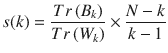

这里，

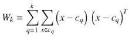

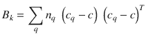

其中 Tr 是矩阵算子的迹，N 是我们数据中的数据点数，C <sub>q</sub> 是聚类 q 中的点集，c <sub>q</sub> 是聚类 q 的中心，C 是 E 的中心，n <sub>q</sub> 是聚类 q 中的点数

令人欣慰的是，我们可以通过利用`scikit-learn.`来计算这个指数，而不必计算这个复杂的公式。较高的分数通常表明聚类密集且分离良好，这与聚类模型的一般原则有关。

```py
km2_chi = metrics.calinski_harabaz_score(X, km2_labels)
km5_chi = metrics.calinski_harabaz_score(X, km5_labels)

print('Calinski-Harabaz Index for num clusters=2: ', km2_chi)
print('Calinski-Harabaz Index for num clusters=5: ', km5_chi)

Calinski-Harabaz Index for num clusters=2:  1300.20822689
Calinski-Harabaz Index for num clusters=5:  1621.01105301

```

我们可以看到两个分数都很高，五个集群的结果甚至更高。这表明，仅仅依靠指标数量是不够的，您必须尝试多种评估方法，并结合来自数据科学家和领域专家的反馈。

### 评估回归模型

回归模型是监督学习方法的一个例子，并且由于正确测量值(实数值响应变量)的可用性，它们的评估比非监督模型相对容易。通常在监督模型的情况下，我们被选择的度量标准宠坏了，重要的决定是为我们的用例选择正确的度量标准。回归模型和分类模型一样，有各种各样的度量标准可以用来评估它们。在本节中，我们将介绍这些重要指标的一小部分。

#### 决定系数 R <sup>2</sup>

决定系数衡量因变量中由自变量解释的方差的比例。判定分数为 1 的系数表示完美的回归模型，表明所有的方差都可以用独立变量来解释。它还提供了模型对未来样本的预测程度的度量。

计算 r <sup>2</sup> 的数学公式如下，其中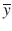为因变量的均值，y <sub>i</sub> 表示实际真实响应值，表示模型预测输出。

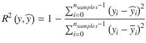

在`scikit-learn`包中，这可以通过使用`r2_score`函数进行计算，向其提供真实值和预测值(输出\响应变量)。

#### 均方误差

均方差计算回归模型预测的实际值和预测值之间的误差或偏差的平方的平均值。均方误差或 MSE 可用于评估回归模型，较低的值意味着回归模型更好，误差更小。取均方误差的平方根得到均方根误差或 RMSE，它也可以用作回归模型的评估指标。

计算 MSE 和 RMSE 的数学公式相当简单，给出如下:

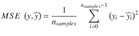

在`scikit-learn`包中，可以通过从`metrics`模块调用`mean_squared_error`函数来计算 MSE。

回归模型有更多的度量标准可用于评估它们，包括中值绝对误差、平均绝对误差、解释方差得分等等。使用`scikit-learn`库提供的函数很容易计算它们。他们的数学公式很容易解释，并有一个直观的理解与他们相关联。我们只介绍了其中的两种，但是鼓励您探索可以用于回归模型的其他度量集。我们将在下一章更详细地研究回归模型。

## 模型调整

在本章的前两节中，您学习了如何根据我们处理过的数据拟合模型，以及如何评估这些模型。我们将在目前介绍的概念的基础上进一步发展。在本节中，您将了解所有机器学习算法的一个重要特征(到目前为止，我们一直在掩饰这一点)，它们的重要性，以及如何找到这些实体的最佳值。模型调整是机器学习的最重要的概念之一，它需要一些关于算法的基础数学和逻辑的知识。虽然我们不能深入到我们讨论的算法的广泛的理论方面，但我们将尝试给出一些关于它们的直觉，以便你能够更好地调整它们，并学习同样需要的基本概念。

我们到目前为止开发的模型大部分是由`scikit-learn`包提供给我们的默认模型。默认情况下，我们指的是具有默认配置和设置的模型，如果您还记得看到一些模型估计器对象参数的话。由于我们正在分析的数据集本质上并不是难以分析的数据集，即使是默认配置的模型也能找到不错的解决方案。当涉及到具有大量要素、噪声和缺失数据的真实世界数据集时，情况就不那么乐观了。在接下来的章节中，你会看到实际的数据集是如何难以处理、争论，甚至更难建模。因此，我们不太可能总是使用开箱即用的默认配置模型。相反，我们将更深入地研究我们的目标模型，看看可以调整和设置的旋钮，以提取任何给定模型的最佳性能。数据集、模型参数和特征的迭代实验过程是模型调整过程的核心。我们首先介绍这些与 ML 算法相关的所谓参数，然后我们试图证明为什么很难有一个完美的模型，最后一节我们讨论一些可以用来调整模型的策略。

### 超参数简介

什么是超参数？最简单的定义是，超参数是与任何机器学习算法相关联的元参数，通常在模型训练和构建过程之前设置。我们这样做是因为模型超参数不依赖于从训练模型的基础数据集导出。超参数对于调整学习算法的性能极其重要。超参数经常与模型参数混淆，但我们必须记住，超参数不同于模型参数，因为它们不依赖于数据。简而言之，模型超参数代表一些高级概念或旋钮，数据科学家可以在模型训练和构建过程中调整这些概念或旋钮，以提高其性能。让我们举一个例子来说明这一点，以防你在解释它们时仍然有困难。

#### 决策树

决策树是最简单和容易解释的分类算法之一(有时也用在回归中；查看购物车型号)。首先，您将了解如何创建决策树，因为超参数通常与算法的实际复杂性紧密相关。决策树算法基于对初始数据集(要素)的贪婪递归划分。它利用基于决策树的结构来决定如何执行分区。学习决策树的步骤如下:

1.  从整个数据集开始，找到最能区分类的属性(要素)。这种最佳属性是使用信息增益或基尼系数等指标来确定的。
2.  找到最佳属性后，根据属性值将数据集分成两部分(或更多部分)。
3.  如果数据集的任何一部分只包含一个类的标签，我们可以停止该部分的过程，并将其标记为该类的叶节点。
4.  我们重复整个过程，直到我们总共有叶节点，其中我们只有一个类的数据点。

决策树算法返回的最终模型可以表示为流程图(核心决策树结构)。考虑图 [5-9](#Fig9) 中描述的巨大生存预测问题的样本决策树。

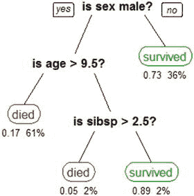

图 5-9。

A sample decision tree model

通过沿着未知数据点的值的路径，决策树很容易解释。最终的叶节点是数据点的预测类。在这种情况下，模型参数是我们分割的属性(这里是`sex`、`age`和`sibsp`)以及这些属性的值。例如，如果一个人是女性，根据这个模型，她很可能幸存下来。然而，年龄小于 9 岁零 6 个月的男婴可能已经死亡。

在该算法中，我们是继续在一个节点进一步分割数据集还是停止分割过程的决定是由名为`min_samples_leaf`的算法的一个超参数控制的。这是一个与决策树算法相关的超参数。这个参数的缺省值是 1，这意味着我们可以继续分割数据，直到我们有一个具有单个数据点(具有唯一的类标签)的叶节点。这导致了大量的过度拟合，因为潜在的每个数据点都可能在它自己的叶节点中结束，并且模型将不会学到任何有用的东西。假设我们想要停止分裂过程，如果我们在一个叶节点中有整个数据集的 3-4%,并且用该节点的多数类来标记该节点。这可以通过为指定的超参数设置不同的值来实现。这允许我们控制过度拟合，并帮助我们开发一个通用模型。这只是与算法相关的超参数之一；还有许多类似的分裂标准(`criterion`)、树的最大深度(`max_depth`)、特征数量(`max_features`)等等，它们可以对整个模型的质量产生不同的影响。

每个学习算法都有相似的超参数。示例包括逻辑回归中的学习率、支持向量机中的核以及神经网络中的辍学率。超参数通常与学习算法密切相关。因此，我们需要对算法有一些了解，以便对设置特定超参数的值有直觉。在本章和本书的后面部分，我们将处理需要某种程度的超参数调整的数据集和模型。

### 偏差-方差权衡

到目前为止，我们已经了解了关于调整模型的必要概念。但是，在将所有这些放在一起并实际调整我们的模型之前，我们必须了解一个潜在的权衡，它对我们可以开发的最佳模型施加了一些限制。这种权衡被称为偏差与方差的权衡。一个显而易见的问题是，在机器学习模型的背景下，偏差和方差是什么？

*   偏差:这是由于模型(学习算法)对基础数据中的参数做出错误假设而产生的错误。偏差误差是模型估计量的期望值或预测值与我们试图预测的真实值或实际值之间的差异。如果你记得，模型建立是一个迭代的过程。如果您设想每次获得一些新的观察值时都要在数据集上多次构建模型，由于数据中潜在的噪声和随机性，预测不会总是如预期的那样，bias 会尝试测量实际值和预测值之间的差异\误差。它也可以被指定为模型在所有可能的训练数据集上的平均近似误差。这里的最后一部分，所有可能的训练数据集，需要一些解释。我们观察和开发模型的数据集是现有数据的可能组合之一。我们数据中的每个属性\特征的所有可能组合将产生不同的数据集。例如，假设我们有一个包含 50 个二进制(分类)特征的数据集，那么整个数据集的大小将是 2 <sup>50</sup> 个数据点。我们建模的数据集显然是这个庞大数据的子集。偏差是整个数据集子集的平均近似误差。偏差主要受我们对基础数据和模式的假设(或模型的假设)的影响。例如，考虑一个简单的线性回归模型；它假设因变量线性依赖于自变量。然而，考虑决策树模型的情况，它对数据的结构没有这样的假设，并且纯粹从数据中学习模式。因此，在相对意义上，线性模型可能比决策树模型倾向于具有更高的偏差。高偏差会使模型错过数据中特征和输出变量之间的相关关系。
*   方差:此错误的产生是由于模型对数据集中的波动非常敏感，而数据集中的波动可能是由新数据点、特征、随机性、噪声等引起的。它是我们的近似函数在所有可能的数据集上的方差。它表示模型预测结果对一组特定数据点的敏感度。假设您已经在所有可能数据集的不同子集上学习了模型，那么方差将量化模型的结果如何随着数据集的变化而变化。如果结果保持相当稳定，那么该模型将被称为具有低方差，但是如果结果每次都变化很大，那么该模型将被称为具有高方差。考虑将线性模型与决策树模型进行对比的同一个例子，假设从属和独立数据变量之间存在明确的线性关系。那么对于一个足够大的数据集，我们的线性模型将总是捕捉到这种关系。尽管决策树模型的能力依赖于数据集，但是如果我们得到一个包含大量离群值的数据集，我们很可能得到一个糟糕的决策树模型。因此，我们可以说，决策树模型将比基于数据和潜在噪声\随机性的线性回归模型具有更高的方差。高方差使模型对异常值或随机噪声过于敏感，而不是很好地概括。

对这个有些混乱的概念有一个更清晰的想法的有效方法是通过偏差和方差的可视化表示，如图 [5-10](#Fig10) 所示。

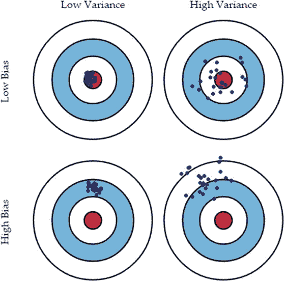

图 5-10。

The Bias-variance tradeoff

在图 [5-10](#Fig10) 中，内部的红色圆圈代表考虑到我们可以获得的所有数据组合的完美模型。每个蓝点(⋅)标记了一个模型，这个模型是我们在数据集和我们获得的特征的组合的基础上学习的。

*   由左上角图像表示的具有低偏差、低方差的模型将学习到良好的基本数据模式和关系的一般结构，这些数据模式和关系将接近假设模型，并且预测将是一致的并且击中靶心！
*   具有低偏差、高方差的模型(由右上方的图像表示)是在一定程度上进行概括(学习正确的关系\模式)的模型，并且由于低偏差而平均表现良好，但是对其训练的数据敏感，导致高方差，因此预测保持波动。
*   具有高偏差、低方差的模型将倾向于做出一致的预测，而不考虑模型所基于的数据集，从而导致低方差，但是由于高偏差，它将不会学习正确预测所需的数据中的必要模式\关系，因此由于平均高偏差误差而错过标记，如左下方的图像所示。
*   高偏差、高方差的模型可能是最差的模型，因为它们不会学习与输出响应相关的必要数据属性关系。此外，它们对数据、异常值和噪声极其敏感，导致预测高度波动，从而导致高方差，如右下图所示。

#### 偏差-方差的极端情况

在现实世界的建模中，我们总是在同时减少偏差和方差之间进行权衡。为了理解为什么我们有这种权衡，我们必须首先考虑偏差和方差这两种可能的极端情况。

##### 欠拟合

考虑一个线性模型，它很懒，总是预测一个常数值。该模型将具有极低的方差(事实上，它将是一个零方差模型)，因为该模型完全不依赖于它所获得的数据子集。它总是预测一个常数，因此具有稳定的性能。但另一方面，它会有极高的偏差，因为它没有从数据中学到任何东西，并对数据做出了非常僵化和错误的假设。这就是模型拟合不足的情况，在这种情况下，我们无法了解关于数据、其底层模式和关系的任何信息。

##### 过度拟合

考虑相反的情况，我们的模型试图拟合它遇到的每一个数据点(最接近的例子是为一个 n 次观察数据集拟合一条 n <sup>次</sup>多项式曲线，使得曲线通过每一个点)。在这种情况下，我们将得到一个偏差较低的模型，因为没有对数据结构进行假设(即使有一些结构)，但方差将非常高，因为我们已经将模型紧密地拟合到数据的一个可能子集(过于关注训练数据)。任何不同于训练集的子集都会导致大量的错误。这就是过度拟合的情况，我们已经为手头的数据建立了如此具体的模型，以至于它无法对其他数据子集进行任何概括。

#### 权衡

任何模型的总概化误差都是其偏差误差、方差误差和不可约误差的总和，如下式所示。

泛化误差=偏倚误差+方差误差+不可约误差

使得不可约误差是由于训练数据本身中的噪声而引入的误差，这在真实世界的数据集中是常见的，并且对此无能为力。我们的想法是关注另外两个错误。每个模型都需要在两个选择之间做出权衡:对数据结构做出假设，或者使自己过于接近手头的数据。任何一种选择都会导致极端的情况。其想法是通过在偏差和方差之间进行最佳权衡来平衡模型的复杂性，如图 [5-11](#Fig11) 所示。

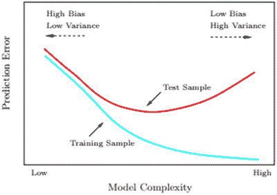

图 5-11。

Test and train errors as a function of model complexity (Source: The Elements of Statistical Learning, Tibshirani et al. Springer)

图 [5-11](#Fig11) 应该能让你更清楚地了解为防止模型误差增加而需要做的权衡。我们需要对数据中的潜在结构做出一些假设，但这些假设必须合理。与此同时，模型必须确保它从手头的数据中学习并很好地概括，而不是过度适应每个数据点。通过确保我们的模型不是一个非常复杂的模型，并通过确保对看不见的验证数据的合理性能，可以控制这种权衡。我们将在下一节中讨论更多关于交叉验证的内容。我们建议你去看看《统计学习的要素》一书中关于模型选择和偏差-方差权衡的章节。

### 交互效度分析

在本章的开始部分，当我们学习适应不同的模型时，我们遵循了将数据划分为训练集和测试集的实践。我们在训练集上构建模型，并在测试集上报告其性能。尽管这种建立模型的方式是可行的，但是在集中调整模型时，我们需要考虑一些围绕`validation`数据集的其他策略。在本节中，我们将讨论如何使用相同的数据来构建不同的模型，并使用简单的数据分区策略来调整它们的超参数。这种策略是数据科学领域最流行的实践之一，与模型的类型无关，它被称为交叉验证或简称 CV。当您还拥有较少的数据观察值，并且无法将特定的数据分区隔离为一个验证集时，这是非常有用的(稍后将详细介绍！).然后，您可以利用交叉验证策略来利用部分训练数据本身进行验证，这样就不会过度拟合模型。

任何模型构建活动的主要目的都是在可用数据的基础上开发一个通用模型，该模型将在未知数据上表现良好。但是为了评估一个模型在看不见的数据上的表现，我们需要用我们现有的数据来模拟那些看不见的数据。这是通过将我们可用的数据分成训练集和测试集来实现的。通过遵循这个简单的原则，我们确保我们不会根据模型已经看到和训练过的数据来评估模型。如果我们对我们开发的模型完全满意，这个故事就结束了。但是最初的模型很少能满足部署的需要。

理论上，我们可以扩展同样的原理来调整我们的算法。我们可以在测试集上评估模型超参数的特定值的性能。用具有不同超参数值的训练集和测试集的不同分区来重新训练该模型。如果新参数比旧参数表现得更好，我们就采用它们，并不断重复相同的过程，直到我们得到超参数的最佳值。这个计划很简单，但是有一个严重的缺陷。它会导致模型开发过程中的偏差。尽管测试集在每一次迭代中都会改变，但是模型会看到数据，从而对模型开发过程做出一些选择(当我们调整和构建模型时)。因此，我们开发的模型最终是有偏差的，不能很好地概括，它们的性能可能反映也可能不反映它们在看不见的数据上的性能。

数据分割过程中的一个简单变化可以帮助我们避免这种看不见的数据泄漏。假设我们最初制作了三个不同的数据子集，而不是最初的两个。一个是通常的训练集，第二个是测试集，最后一个称为验证集。因此，我们可以在`train`数据上训练我们的模型，评估它们在验证数据上的性能，以调整模型参数(甚至在不同的模型中进行选择)。一旦我们完成了调优过程，我们就可以在真正看不见的测试集上评估最终模型，并将测试集上的性能报告为模型在真实世界看不见的数据上的近似性能。事实上，这是交叉验证过程背后的基本原则，如图 [5-12](#Fig12) 所示。

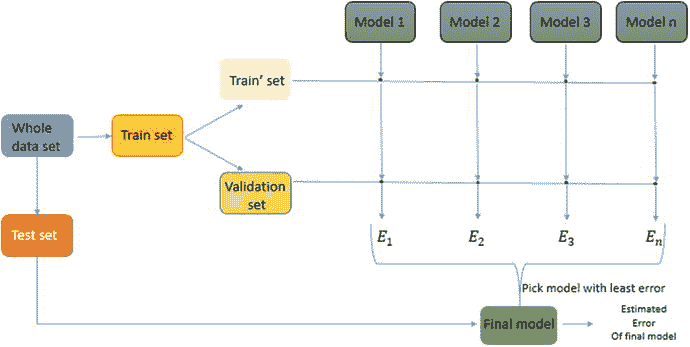

图 5-12。

Building toward the cross-validation process for model building and tuning

图 [5-12](#Fig12) 让我们了解整个过程是如何运作的。我们将原始数据集分为训练集和测试集。测试集完全从学习过程中分离出来。如此获得的`train`集合再次被分成实际的`train`集合和`validation`集合。然后我们在`train`片场学习不同的模式。这里值得注意的一点是，模型是通用的，即它们都可以是单一类型的，例如逻辑回归，但具有不同的超参数。它们也可以是使用其他算法的模型，如基于树的方法、支持向量机等。无论我们是评估完全不同的模型，还是尝试相同类型模型的不同超参数值，模型选择的过程都是相似的。一旦我们开发了模型，我们就在验证集上评估它们的性能，并选择具有最佳性能的模型作为最终模型。我们基于模型的类型(准确性、f1 分数、rmse、轮廓系数等)利用模型评估指标。

前面描述的过程看起来不错。我们已经描述了该过程的验证部分，但是还没有触及它的交叉部分。那么交叉验证在哪里呢？为了理解简历过程复杂性，我们必须首先讨论为什么我们需要它。之所以需要它，是因为通过将数据划分为测试和验证集，我们丢失了大量的数据，而这些数据本可以用来进一步完善我们的建模过程。另外重要的一点是，如果我们将单次迭代的模型误差视为整体误差，我们就犯了一个严重的错误。相反，我们希望通过构建同一个模型的多次迭代来测量误差的平均值。但是，如果我们继续在同一个数据集上重建模型，我们不会在模型性能上有太大的差异。我们通过引入交叉验证的概念来解决这两个问题。

`cross`验证的想法是使用某种策略(我们将在后面详述)获得训练和验证集的不同分割(每次每个集中的不同观察)，然后在这些不同分割上构建每个模型的多次迭代。然后，将这些分割的平均误差报告为所述模型的误差，并根据该平均误差度量做出最终决定。这种策略对每个模型的估计误差有显著的影响，因为它确保平均误差非常接近模型在真正看不见的数据(这里是我们的测试集)上的误差，并且我们还可以利用完整的训练数据集来构建模型。图 [5-13](#Fig13) 对该过程进行了图示说明。

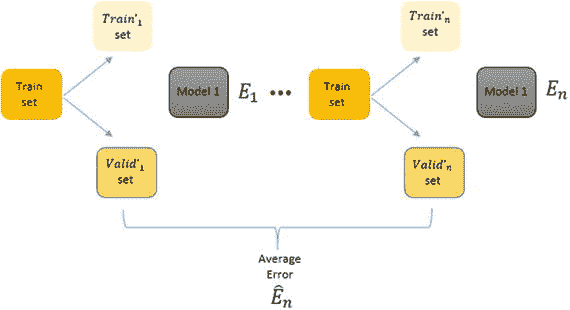

图 5-13。

The final cross-validation process for model building and tuning

可以生成这些不同的`train`和`validation`组的各种策略产生了不同种类的交叉验证策略。这些策略的共同思想是相同的。唯一的区别是，对于模型构建的每次迭代，最初的`train`集合被分割成`train`和`validation`集合。

#### 交叉验证策略

我们在上一节解释了交叉验证的基本原理。在本节中，我们将看到将训练数据拆分为训练数据和验证数据的不同策略。如前所述，除了这种拆分方式之外，每种策略的流程都是相同的。交叉验证策略的主要类型描述如下。

##### 漏掉一份简历

在这种交叉验证策略中，我们从初始训练数据集中选择一个随机的单个数据点，并将其作为我们的验证集。因此，我们的验证集中只有一个点，其余的 n-1 个观察值成为我们的训练集。这意味着，如果在一个训练集中有 1000 个数据点，那么我们将开发每个模型的 1000 次迭代，每次使用不同的训练集和验证集，使得验证集有一个观察值，其余的(999)进入训练集。如果数据集很大，这可能变得不可行。但是在实践中，可以通过执行少量迭代来估计误差。由于这种方法的计算复杂性，它主要适用于小数据集，在实践中很少使用。

##### k 倍 CV

交叉验证的另一个策略是将训练数据集分成 k 个相等的子集。在这 k 个子集之外，我们在 k-1 个子集上训练模型，并保留一个子集作为验证集。这个过程重复 k 次，并且在通过开发模型的不同迭代获得的 k 个模型上平均误差。我们在每次迭代中不断改变验证集，以确保在每次迭代中，模型在不同的数据子集上进行训练。这种交叉验证的实践在实践中对于模型选择和超参数优化都是相当有效的。

这种策略的一个自然问题是选择适当的折叠数，因为它们将控制我们的误差近似值和 CV 过程的计算运行时间。有数学方法来选择最合适的 k，但在实践中，k 的较好选择范围是 5-10。因此，在大多数情况下，我们可以进行 5 倍或 10 倍的验证，并对我们获得的结果充满信心。

### 超参数调整策略

根据我们到目前为止的讨论，我们已经具备了调整模型的所有先决条件。我们知道什么是超参数，如何评估模型的性能，以及如何使用交叉验证在参数空间中搜索算法超参数的最佳值。在本节中，我们将讨论两个主要策略，这两个策略将所有这些结合在一起，以确定最佳超参数。幸运的是，`scikit-learn`库有一个优秀的内置支持，可以执行交叉验证的超参数搜索。

有两种主要的方法，我们可以搜索我们的参数空间的最佳模式。这两种方法的不同之处在于我们搜索它们的方式:系统的还是随机的。在这一节中，我们将讨论这两种方法以及实际操作的例子。本节的要点是理解这些过程，以便您可以开始利用自己的数据集。还要注意，即使我们没有明确提到，我们也会一直使用交叉验证来执行这些搜索。

#### 网格搜索

这是最简单的超参数优化方法。在这种方法中，我们将指定(超参数的)网格值，我们希望试验和优化这些网格值以获得最佳参数组合。然后，我们将对这些值(多个参数值的组合)中的每一个建立模型，当然使用交叉验证，并报告整个网格中的最佳参数组合。输出将是使用网格中最佳组合的模型。虽然它非常简单，但它有一个严重的缺点，即用户必须手动提供实际参数，这些参数可能包含也可能不包含最佳参数。

在`scikit-learn`中，网格搜索可以使用`GridSearchCV`类来完成。我们通过在早期乳腺癌数据集上的支持向量机(SVM)模型上执行网格搜索来完成一个例子。SVM 模型是可用于分类的监督机器学习算法的另一个例子。它是最大间隔分类器的一个例子，其中它试图学习所有数据点的表示，使得单独的类别\标签被尽可能大的清晰间隙分割或分开。由于我们的目的是运行网格搜索，所以我们不会在这里深入讨论更多的细节，但是如果您感兴趣的话，我们建议您查阅一些关于 SVM 的标准文献。

让我们首先将我们的乳腺癌数据集变量`X`和`y`分成`train`和`test`数据集，并用默认参数建立一个 SVM 模型。然后，我们将利用我们的`model_evaluation_utils`模块在`test`数据集上评估它的性能。

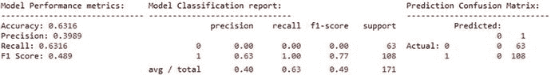

图 5-14。

Model performance metrics for default SVM model on the breast cancer dataset

```py
from sklearn.model_selection import train_test_split
from sklearn.svm import SVC

# prepare datasets
X_train, X_test, y_train, y_test = train_test_split(X, y, test_size=0.3, random_state=42)

# build default SVM model
def_svc = SVC(random_state=42)
def_svc.fit(X_train, y_train)

# predict and evaluate performance
def_y_pred = def_svc.predict(X_test)
print('Default Model Stats:')
meu.display_model_performance_metrics(true_labels=y_test, predicted_labels=def_y_pred,
                                     classes=[0,1])

```

你看，我们的模型给出的 F1 总分只有 49%，模型准确率为 63%，如图 [5-14](#Fig14) 所示。此外，通过查看混淆矩阵，您可以清楚地看到它预测每个数据点都是良性的(标签 1)。基本上我们的模型什么都没学到！让我们试着调整这个模型，看看我们是否能得到更好的东西。由于我们选择了 SVM 模型，我们指定了一些特定于它的超参数，包括参数 C(处理 SVM 中的余量参数)、核函数(用于将数据转换到更高维的特征空间)和伽马(确定单个训练数据点具有的影响)。还有很多其他的超参数需要优化，你可以在 [`http://scikit-learn.org/stable/modules/generated/sklearn.svm.SVC.html`](http://scikit-learn.org/stable/modules/generated/sklearn.svm.SVC.html) 查看更多细节。我们通过提供一些预置值来构建网格。下一个选择是选择我们想要最大化的分数或指标，这里我们选择了最大化模型的准确性。一旦完成，我们将使用五重交叉验证在这个网格上构建多个模型，并评估它们以获得最佳模型。详细的代码和输出如下所示。

```py
from sklearn.model_selection import GridSearchCV

# setting the parameter grid
grid_parameters = {'kernel': ['linear', 'rbf'],
                   'gamma': [1e-3, 1e-4],
                   'C': [1, 10, 50, 100]}

# perform hyperparameter tuning
print("# Tuning hyper-parameters for accuracy\n")
clf = GridSearchCV(SVC(random_state=42), grid_parameters, cv=5, scoring='accuracy')
clf.fit(X_train, y_train)
# view accuracy scores for all the models
print("Grid scores for all the models based on CV:\n")
means = clf.cv_results_['mean_test_score']
stds = clf.cv_results_['std_test_score']
for mean, std, params in zip(means, stds, clf.cv_results_['params']):
    print("%0.5f (+/-%0.05f) for %r" % (mean, std * 2, params))
# check out best model performance
print("\nBest parameters set found on development set:", clf.best_params_)
print("Best model validation accuracy:", clf.best_score_)

# Tuning hyper-parameters for accuracy

Grid scores for all the models based on CV:

0.95226 (+/-0.06310) for {'C': 1, 'gamma': 0.001, 'kernel': 'linear'}
0.91206 (+/-0.04540) for {'C': 1, 'gamma': 0.001, 'kernel': 'rbf'}
0.95226 (+/-0.06310) for {'C': 1, 'gamma': 0.0001, 'kernel': 'linear'}
0.92462 (+/-0.02338) for {'C': 1, 'gamma': 0.0001, 'kernel': 'rbf'}
0.96231 (+/-0.04297) for {'C': 10, 'gamma': 0.001, 'kernel': 'linear'}
0.90201 (+/-0.04734) for {'C': 10, 'gamma': 0.001, 'kernel': 'rbf'}
0.96231 (+/-0.04297) for {'C': 10, 'gamma': 0.0001, 'kernel': 'linear'}
0.92965 (+/-0.03425) for {'C': 10, 'gamma': 0.0001, 'kernel': 'rbf'}
0.95729 (+/-0.05989) for {'C': 50, 'gamma': 0.001, 'kernel': 'linear'}
0.90201 (+/-0.04734) for {'C': 50, 'gamma': 0.001, 'kernel': 'rbf'}
0.95729 (+/-0.05989) for {'C': 50, 'gamma': 0.0001, 'kernel': 'linear'}
0.93467 (+/-0.02975) for {'C': 50, 'gamma': 0.0001, 'kernel': 'rbf'}
0.95477 (+/-0.05772) for {'C': 100, 'gamma': 0.001, 'kernel': 'linear'}
0.90201 (+/-0.04734) for {'C': 100, 'gamma': 0.001, 'kernel': 'rbf'}
0.95477 (+/-0.05772) for {'C': 100, 'gamma': 0.0001, 'kernel': 'linear'}
0.93216 (+/-0.04674) for {'C': 100, 'gamma': 0.0001, 'kernel': 'rbf'}

Best parameters set found on development set: {'C': 10, 'gamma': 0.001, 'kernel': 'linear'}
Best model validation accuracy: 0.962311557789

```

因此，从前面的输出和代码中，您可以看到最佳的模型参数是如何基于交叉验证准确性获得的，我们获得了相当惊人的 96%的验证准确性。让我们将这个经过优化和调整的模型放在我们的测试数据上进行测试！

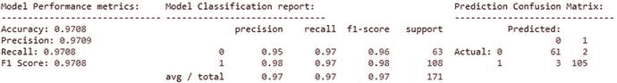

图 5-15。

Model performance metrics for tuned SVM model on the breast cancer dataset

```py
gs_best = clf.best_estimator_
tuned_y_pred = gs_best.predict(X_test)

print('\n\nTuned Model Stats:')
meu.display_model_performance_metrics(true_labels=y_test, predicted_labels=tuned_y_pred,
                                     classes=[0,1])

```

现在一切看起来都很好！我们的模型在`test`数据集上给出了总体 F1 分数和 97%的模型准确度，如图 [5-14](#Fig14) 所示。这应该让您清楚地了解超参数调优的威力！这种方案可以扩展到不同的模型和它们各自的超参数。我们还可以尝试我们想要优化的评估方法。`scikit-learn`框架为我们提供了可以优化的不同价值。其中有`adjusted_rand_score`、`average_precision`、`f1`、`average_recall`等等。

#### 随机搜索

在实践中，网格搜索是一种非常流行的优化超参数的方法。这是由于它的简单性和令人尴尬的并行性。当我们处理的数据集很大时，这就变得很重要。但是它有一些主要的缺点，最重要的一个是手工指定网格的局限性。这将人的因素带入了一个可以从纯自动机制中获益的过程。

随机参数搜索是对传统网格搜索的改进。它像在普通网格搜索中一样接受网格元素的输入，但也可以接受分布作为输入。例如，考虑参数 gamma，我们在上一节中明确提供了它的值，我们可以提供一个分布，从中对 gamma 进行采样。随机参数搜索的功效基于已证明的(经验上和数学上)结果，即超参数优化函数通常具有低维度，并且某些参数的影响大于其他参数。我们通过指定想要运行的迭代次数来控制想要进行随机参数采样的次数(`n_iter`)。通常，迭代次数越多，意味着参数搜索越精细，但计算时间越长。

为了说明随机参数搜索的使用，我们将使用之前使用的示例，但用分布替换 gamma 和 C 值。我们示例中的结果可能与网格搜索没有太大的不同，但是我们建立了可以遵循的过程，以供将来参考。

```py
import scipy
from sklearn.model_selection import RandomizedSearchCV

param_grid = {'C': scipy.stats.expon(scale=10),
              'gamma': scipy.stats.expon(scale=.1),
              'kernel': ['rbf', 'linear']}
random_search = RandomizedSearchCV(SVC(random_state=42), param_distributions=param_grid,
                                   n_iter=50, cv=5)
random_search.fit(X_train, y_train)
print("Best parameters set found on development set:")
random_search.best_params_

Best parameters set found on development set:
Out[183]:
{'C': 12.020578954763398, 'gamma': 0.036384519279056469, 'kernel': 'linear'}

# get best model, predict and evaluate performance
rs_best = random_search.best_estimator_
rs_y_pred = rs_best.predict(X_test)
meu.get_metrics(true_labels=y_test, predicted_labels=rs_y_pred)

Accuracy: 0.9649
Precision: 0.9649
Recall: 0.9649
F1 Score: 0.9649

```

在本例中，我们从指数分布中获取参数 C 和 gamma 的值，并通过参数`n_iter`控制模型搜索的迭代次数。虽然整体模型性能类似于网格搜索，但目的是了解模型调整中的不同策略。

## 模型解释

数据科学或机器学习的目标是解决现实世界的问题，自动化复杂的任务，让我们的生活变得更轻松、更美好。当数据科学家花费大量时间构建、调整和部署模型时，人们必须问这样的问题，“这将用于什么？”以及“这到底是如何工作的？”最重要的问题是，“我为什么要相信你的模型？”。企业或组织将更关注业务目标，通过利用分析和机器学习来产生利润和最小化损失。因此，在试图解释模型如何真正工作时，分析团队和关键利益相关者、顾客、客户或管理层之间往往存在脱节。大多数时候，对非专家来说，解释复杂的理论和数学概念可能真的很难，他们可能没有想法，或者更糟的是，可能没有兴趣知道所有血淋淋的细节。这将我们带回主要目标，“我们能否以一种容易理解的方式解释和诠释机器学习模型”，这样任何人即使没有机器学习的全面知识也可以理解它们。这样做的好处是双重的——机器学习模型将不仅仅停留在研究项目或概念验证上，它还将为企业更多地采用基于机器学习的解决方案铺平道路。

一些机器学习模型使用可解释的算法，例如决策树会给你所有变量的重要性作为输出。此外，任何新数据点的预测路径都可以使用决策树进行分析，因此我们可以了解哪些变量在预测中起着至关重要的作用。不幸的是，对于许多模型来说，情况并非如此，尤其是对于那些没有可变重要性概念的模型。

默认情况下，一些机器学习模型在本质上是可解释的，例如贝叶斯规则列表、Letham 等生成模型。阿尔([https://arxiv.org/abs/1511.01644](https://arxiv.org/abs/1511.01644))，而其他简单的黑盒模型，如简单的决策树，可以通过使用特征重要性作为输出而变得可解释。此外，从树根到树叶的单棵树的预测路径可以被可视化，捕捉特征对估计器决策策略的贡献。但是，对于复杂的非线性模型——随机森林、深度神经网络——卷积神经网络(CNN)、递归神经网络(RNNS)，这种直观性可能是不可能的。缺乏对机器学习决策策略的复杂本质的理解，使得预测模型仍然被视为黑盒。模型解释可以以多种方式帮助数据科学家和最终用户。这将有助于弥合技术团队和业务之间经常存在的差距。例如，它可以帮助确定做出特定预测的原因，并且可以通过利用易于理解的解释，使用最终用户的领域知识来验证它。它还可以帮助数据科学家了解功能之间的交互，从而实现更好的功能工程和增强的性能。它还可以帮助进行模型比较，并向业务涉众更好地解释结果。

而拥有可解释模型的最简单方法是使用算法，这些算法会产生可解释的模型，如决策树、逻辑回归等。但是我们不能保证一个可解释的模型会给我们提供最好的性能。因此，我们不能总是诉诸这种模式。最近，一个更好的方法是以一种易于解释的方式来解释模型预测，方法是围绕预测局部学习一个可解释的模型。事实上，这个话题在 2016 年最近获得了广泛关注。参考 M.T. Ribeiro，S. Singh & C. Guestrin 的原始研究论文《我为什么要相信你？:解释来自 [`https://arxiv.org/pdf/1602.04938.pdf`](https://arxiv.org/pdf/1602.04938.pdf) 的任何分类器的预测，以了解有关模型解释和 LIME 框架的更多信息，该框架旨在解决这一问题。LIME 框架试图在本地成功地解释任何黑盒模型(在某处我们需要定义解释的范围——全球和本地)，你可以在 [`https://github.com/marcotcr/lime`](https://github.com/marcotcr/lime) 查看 GitHub 库。

我们将利用另一个名为`Skater`的库，这是一个开源的 Python 库，旨在揭开预测模型的内部工作原理。溜冰者定义解释模型 1 的范围。全局(基于完整的数据集)和 2。局部地(基于单独的预测)。对于全局解释，Skater 使用模型不可知变量重要性和部分相关图来判断模型的偏差并理解其一般行为。另一方面，为了验证单个预测的模型决策策略，该库目前采用了一种称为局部可解释模型不可知解释的新技术(LIME，Ribeiro 等人，2016 年)，该技术使用局部代理模型来评估性能。该库由 Aaron Kramer、Pramit Choudhary 和 DataScience.com 团队创作，`Skater`现在是一个主流项目，也是一个优秀的模型解释框架。我们要感谢 DataScience.com 的人们——Ian Swanson、Pramit Choudhary 和 Aaron Kramer——开发了这个令人惊叹的框架，特别是 Pramit 抽出时间向我们详细解释了`Skater`项目的功能和愿景。利用`Skater`的一些优势如下所述，其中一些优势仍在积极改进中。

*   使用函数式编程的生产就绪代码(声明式编程范例)
*   首先支持基于分类和回归的模型对监督学习问题的解释，然后逐渐扩展到支持对非监督学习问题的解释。这包括计算有效的部分相关图和模型独立特征重要性图。
*   工作流抽象:为内存(模型正在开发中)和部署的模型(模型已经部署到生产中)执行本地解释的通用接口
*   扩展了对解释基于回归的模型的支持，更好的采样分布用于围绕局部预测生成样本，研究了包括非线性模型用于局部评估的能力
*   支持基于规则的可解释模型，如 Letham et。艾尔( [`https://arxiv.org/abs/1511.01644`](https://arxiv.org/abs/1511.01644) )
*   更好地支持基于 NLP 的模型的模型评估，例如 Bach et。al 分层相关传播( [`http://journals.plos.org/plosone/article?id=10.1371/journal.pone.0130140`](http://journals.plos.org/plosone/article?id=10.1371/journal.pone.0130140) )
*   对图像可解释性的更好支持。艾尔。梯度加权类激活图( [`https://arxiv.org/abs/1610.02391`](https://arxiv.org/abs/1610.02391) )

除此之外，自从这个项目开始以来，他们已经承诺了一些改进，即支持回归到原始的 LIME 存储库，他们仍然在他们的路线图中有其他方面的解释，并在未来进一步改进 LIME。您可以通过从提示符或终端运行`pip install -U Skater`命令来轻松安装`skater`。如需了解更多信息，您可以在 [`https://github.com/datascienceinc/Skater`](https://github.com/datascienceinc/Skater) 查看 GitHub 资源库，或者在此加入聊天群: [`https://gitter.im/datascienceinc-skater/Lobby`](https://gitter.im/datascienceinc-skater/Lobby) 。

### 理解溜冰者

`Skater`是一个开源 Python 框架，旨在提供预测模型的模型不可知解释。这是 GitHub 上一个活跃的项目，位于 [`https://github.com/datascienceinc/Skater`](https://github.com/datascienceinc/Skater) ，上面提到的许多功能都在积极开发中。`skater`的想法是通过查询黑盒机器学习模型并解释它们学习到的决策策略来理解它们。`skater`的理念是所有模型都应作为黑盒进行评估，模型的决策标准根据输入扰动和观察相应的输出预测进行推断和解释。如图 [5-16](#Fig16) 所示，利用 skater 的模型解释范围使我们能够进行全局和局部解释。

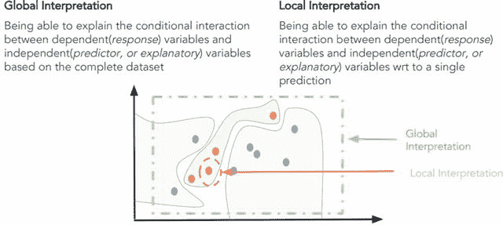

图 5-16。

Scope of Model Interpretation (source: [DataScience.​com](http://www.DataScience.com))

使用`skater`库，我们可以探索特征的重要性、对特征的部分依赖图，以及模型所做预测的全局和局部保真度。模型的保真度可以描述为模型计算和预测特定类别所基于的原因。例如，假设我们有一个模型可以预测特定的用户交易是否可以被标记为欺诈交易。如果我们能够识别、解释和描述模型将预测标记为欺诈的原因是因为金额大于用户在过去六个月中的最大交易量，并且交易位置距离用户的正常交易区域 1000 公里，则模型的输出将更加可信。相比之下，我们只得到一个预测标签，没有任何合理的解释。

在`skater`包中的一般工作流程是创建一个解释对象，创建一个模型对象，并运行解释算法。另外，`Interpretation`对象接受一个数据集和一些元数据作为输入，比如特性名和行标识符。在内部，`Interpretation`对象将生成一个`DataManager`来处理数据请求和采样。虽然我们可以通过利用模型估计器对象来解释任何模型，但是为了确保所有`skater's`接口的一致性和适当的功能，模型对象需要包装在`skater's Model`对象中，该对象可以是实际模型上的`InMemoryModel`对象，甚至可以是 API 或 web 服务后面的`DeployedModel`对象。图 [5-17](#Fig17) 描绘了一个标准的机器学习工作流程，以及如何利用 skater 来解释我们刚刚提到的两种不同类型的模型。让我们使用之前的逻辑回归模型对我们的乳腺癌数据集进行一些模型解释！

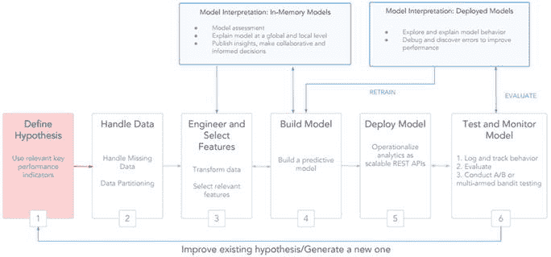

图 5-17。

Model Interpretation in a standard Machine Learning Workflow (source: [DataScience.​com](http://www.DataScience.com))

### 行动中的模型解释

为了保持一致性，我们将使用来自乳腺癌数据集的`our`训练和`test`数据集。我们将利用之前创建的`X_train`和`X_test`变量以及`logistic`模型对象(逻辑回归模型)。我们将尝试在这个模型对象上运行一些模型解释。模型解释的标准工作流程是创建一个`skater`解释和模型对象。

```py
from skater.core.explanations import Interpretation
from skater.model import InMemoryModel

interpreter = Interpretation(X_test, feature_names=data.feature_names)
model = InMemoryModel(logistic.predict_proba, examples=X_train, target_names=logistic.classes_)

```

一旦完成，我们就可以运行模型解释算法了。我们将从尝试生成特性重要性开始。这将让我们了解我们的预测模型对特定特征的依赖程度。`skater`框架的特征重要性实现基于信息论标准，在给定特定特征扰动的情况下，它测量预测变化的熵。其思想是，模型的决策标准越依赖于某个特征，预测就越会随着对该特征的扰动而发生变化。

```py
plots = interpreter.feature_importance.plot_feature_importance(model, ascending=False)

```

从图 [5-18](#Fig18) 中我们可以清楚的观察到，我们模型中最重要的特征是`worst area`，其次是`mean perimeter`和`area error`。现在让我们考虑最重要的特性`worst area`，并思考它在预测过程中影响模型决策过程的方式。部分依赖图是一个很好的工具，可以用来可视化这一点。一般来说，部分相关图通过保持模型中的其他特征不变，有助于描述特定特征对模型预测的边际影响。偏相关的导数，描述了一个特征的影响。下面的代码有助于在我们的模型中构建`worst area`特性的部分依赖图。

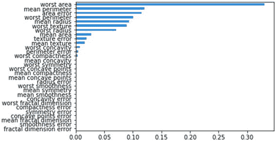

图 5-18。

Feature importances obtained from our logistic regression model

```py
p = interpreter.partial_dependence.plot_partial_dependence(['worst area'], model,  
                                                          grid_resolution=50,
                                                          with_variance=True, figsize = (6, 4))

```

从图 [5-19](#Fig19) 中可以看出`worst area`特性对模型决策过程有很大的影响。基于该图，如果最差面积值从 800 下降，则该模型更倾向于将数据点分类为良性的(标签 1 ),这表明没有癌症。这绝对有意思！现在让我们试着解读一些实际的预测。我们将预测两个数据点，一个没有癌症(标签 1)，一个有癌症(标签 0)，并尝试解释预测的做出过程。

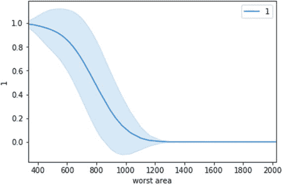

图 5-19。

One-way partial dependence plot for our logistic regression model predictor based on worst area

```py
from skater.core.local_interpretation.lime.lime_tabular import LimeTabularExplainer
exp = LimeTabularExplainer(X_train, feature_names=data.feature_names,
                           discretize_continuous=True, class_names=['0', '1'])

# explain prediction for data point having no cancer, i.e. label 1
exp.explain_instance(X_test[0], logistic.predict_proba).show_in_notebook()

```

图 [5-20](#Fig20) 中描绘的结果显示了主要负责模型预测数据点为标签 1 的特征，即没有癌症。我们还可以看到，对这个决定影响最大的功能是`worst area`！让我们对恶性肿瘤的数据点进行类似的解释。

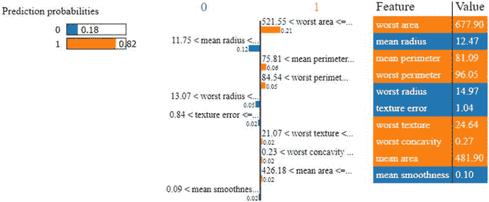

图 5-20。

Model interpretation for our logistic regression model’s prediction for a data point having no cancer (benign)

```py
# explain prediction for data point having malignant cancer, i.e. label 0
exp.explain_instance(X_test[1], logistic.predict_proba).show_in_notebook()

```

图 [5-21](#Fig21) 中描绘的结果再次向我们展示了主要负责模型预测数据点为标签 0(即患有恶性癌症)的特征。特征`worst area`再次成为最有影响力的特征，您可以注意到与之前的数据点相比，其值有着明显的差异。希望这能让你对模型解释的工作原理有所了解。这里要记住的一点是，我们刚刚开始基于 2016 年以来的最新兴趣进行模型解释，但这将是一个很好的、值得的旅程，旨在使模型易于任何人理解！

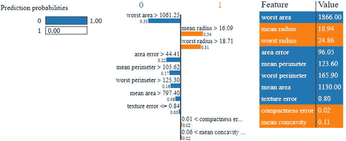

图 5-21。

Model interpretation for our logistic regression model’s prediction for a data point having cancer (malignant)

## 模型部署

整个建模过程中最困难的部分主要是特征工程、模型构建、调整和评估的迭代过程。一旦我们完成了这个模型开发的迭代过程，我们就可以松一口气了——但是不会太久！机器学习建模难题的最后一块是在生产中部署模型，以便我们实际上开始使用它。在本节中，您将了解到可以部署模型的各种方法，以及在这个过程中必须注意的必要的依赖关系。

### 模型持久性

模型持久性是部署模型的最简单的方式。在这个方案中，我们将把最终模型保存在永久介质上，比如我们的硬盘，并使用这个保存的版本来预测未来。这个简单的方案是以最小的努力部署模型的好方法。模型开发通常是在静态数据源上完成的，但是一旦部署，通常模型会实时\接近实时或批量地用于恒定的数据流。例如，考虑一个银行欺诈检测模型；在模型开发的时候，我们将收集一些历史时间跨度的数据。我们将在模型开发过程中使用这些数据，并得出一个具有良好性能的模型，即一个非常擅长标记潜在欺诈交易的模型。然后，需要在银行(或任何其他金融实体)进行的所有未来交易中部署该模型。这意味着对于所有的事务，我们需要提取模型所需的数据，并将这些数据提供给模型。该模型预测被附加到交易上，并且在此基础上，该交易被标记为欺诈交易或干净交易。

在最简单的情况下，我们可以编写一个独立的 Python 脚本，当新数据到达时，就给它提供新数据。它对原始数据执行必要的数据转换，然后从永久数据存储中读取我们的模型。一旦我们有了数据和模型，我们就可以进行预测，这种预测交流可以与所需的操作集成在一起。这些必需的操作通常与模型的业务需求联系在一起。在我们标记欺诈交易的案例中，可能涉及通知欺诈部门或直接拒绝交易。此过程中涉及的大多数步骤，如数据获取\检索、提取、特征工程和预测时要采取的行动，都与软件或数据工程过程有关，需要定制软件开发和修补数据工程过程，如 ETL(提取-转换-加载)。

为了将我们的模型持久化到磁盘上，我们可以利用像`pickle`或`joblib`这样的库，这些库在`scikit-learn`中也是可用的。这使得我们可以在将来部署和使用该模型，而不必在每次想要使用它的时候重新训练它。

```py
from sklearn.externals import joblib
joblib.dump(logistic, 'lr_model.pkl')

```

这段代码将我们的模型作为一个名为`lr_model.pkl`的文件保存在磁盘上。因此，每当我们将这个对象再次加载到内存中时，我们将获得逻辑回归模型对象。

```py
lr = joblib.load('lr_model.pkl')
lr

LogisticRegression(C=1.0, class_weight=None, dual=False, fit_intercept=True,
          intercept_scaling=1, max_iter=100, multi_class='ovr', n_jobs=1,
          penalty='l2', random_state=None, solver='liblinear', tol=0.0001,
          verbose=0, warm_start=False)

```

我们现在可以使用这个`lr`对象，它是我们从磁盘加载的模型，并进行预测。示例描述如下。

```py
print(lr.predict(X_test[10:11]), y_test[10:11])

[1] [1]

```

请记住，一旦您有了持久模型，您就可以轻松地将其与基于 Python 的脚本或应用程序集成，这些脚本或应用程序可以被安排来实时或批量预测新数据。但是，需要对解决方案进行适当的工程设计，以确保正确的数据到达模型，并且预测输出也应该广播到正确的频道。

### 定制开发

部署模型的另一个选择是单独开发模型预测方法的实现。大多数机器学习算法的输出只是被学习的参数值。一旦我们提取了这些参数值，预测过程就非常简单了。例如，逻辑回归的预测可以通过将系数向量乘以输入数据向量来完成。这个简单的计算将为我们提供数据向量的分数，我们可以将该分数提供给 sigmoid\logistic 函数，并提取对输入数据的预测。

这种方法在软件开发过程中有更多的根源，因为开发的模型被简化为一组配置和参数，并且主要关注于使用某种编程语言设计数据和必要的数学计算。这种配置可用于开发自定义实现管道，其中预测过程只是一个简单的数学运算。

### 内部模型部署

许多企业和组织不希望公开他们的私有和机密数据，而这些数据是需要构建和部署模型的。因此，他们将利用自己的软件和数据科学专业知识，在自己的基础架构上构建和部署定制解决方案。这可能涉及利用现成的商业工具来部署模型，或者使用定制的开源工具和框架。基于 Python 的模型可以很容易地与 Flask 或 Django 等框架集成，以在预测模型上创建 REST APIs 或微服务，然后这些 API 端点可以暴露出来，并与任何其他可能需要它的解决方案或应用程序集成。

### 模型部署即服务

计算世界正在见证云以及 XAAS(一切即服务)模式在所有领域的激增。对于模型开发和部署也是如此。像 Google、Microsoft 和 Amazon Web Services (AWS)这样的主要提供商提供了使用他们的云服务开发机器学习模型的工具，以及将这些模型作为服务部署在云上的工具。由于这些服务提供商提供的可靠性和易扩展性，这对最终用户非常有利。定制开发或内部部署模型的一个主要缺点是需要额外的工作和维护。该解决方案的可扩展性也是欺诈预测等某种模型可能存在的另一个问题，因为需要大量的预测量。

模型部署即服务解决了这些问题，因为在大多数情况下，可以通过向基于云的 API 端点发出请求来访问模型预测(当然是通过提供必要的数据)。这种能力为使用我们模型输出的应用程序开发人员免除了维护额外系统的负担。在大多数情况下，如果开发人员能够将所需的数据传递给模型部署 API，他们就不必处理预测系统的计算需求和维护。

云部署的另一个优势来自于更新模型的容易程度。模型开发是一个迭代的过程，部署的模型需要不时地更新以保持它们的相关性。通过在云中的单个端点维护模型，我们简化了模型更新的过程，因为只需要一次替换，这实际上只需按一下按钮就可以发生，并且还可以与所有下游应用程序同步。

## 摘要

这一章总结了本书的第二部分，主要集中在机器学习管道上。我们学习了模型构建过程中最重要的方面，包括模型训练、调整、评估、解释和部署。在“模型构建”一节中讨论了各种模型的详细信息，包括分类、回归和聚类模型。我们还通过一个逻辑回归模型的例子讲述了任何机器学习过程的三个重要阶段，以及梯度下降是一个重要的优化过程。在真实数据集上描述了分类和聚类模型构建过程的实践示例。评估分类、回归和聚类模型的各种策略也涵盖了每个策略的详细度量，并通过真实的示例进行了描述。这本书的一部分完全致力于模型的调整，包括超参数调整和交叉验证的策略，详细描述了在真实模型上的调整。机器学习的一个新兴领域是模型解释，我们试图理解和解释模型预测是如何真正工作的。还涵盖了模型解释的各个方面的详细内容，包括特征重要性、部分依赖图和预测解释。最后，我们还查看了与模型部署相关的一些方面，以及部署模型的各种选项。这应该会让您对如何开始构建和调优模型有一个很好的想法。我们将在本书的第三部分加强这些概念和方法，在这部分我们将进行真实世界的案例研究。