# 6.分析自行车共享趋势

“只工作不玩耍”是一句众所周知的谚语，我们当然不想变得无聊。到目前为止，我们已经介绍了解决数据科学问题所需的理论概念、框架、工作流和工具。用例驱动的主题从这一章开始。在本书的这一部分，我们通过现实生活中的案例研究，涵盖了广泛的机器学习/数据科学概念。通过这一章和随后的章节，我们将讨论和应用到目前为止学到的概念来解决一些令人兴奋的现实世界的问题。

本章讨论基于回归的模型来分析数据和预测结果。特别是，我们将利用 UCI 机器学习知识库中的首都自行车共享数据集来理解回归模型，以预测自行车使用需求。在本章中，我们将讨论以下主题:

*   自行车共享数据集，以了解可从 UCI 机器学习资源库获得的数据集
*   正式定义要解决的问题的问题陈述
*   探索性数据分析，以探索和理解手头的数据集
*   回归分析理解回归建模概念并应用它们解决问题

## 自行车共享数据集

最初几章中介绍的 CRISP-DM 模型讨论了与数据科学问题/项目相关的典型工作流。工作流程图的中心有数据是有原因的。在我们开始使用不同的技术来理解和处理数据之前，让我们先了解一下它的起源。

自行车共享数据集可从 UCI 机器学习资源库获得。它是世界上最大的，也可能是历史最长的在线数据库之一，用于世界各地的各种研究。我们将利用的数据集是网站上数百个可用数据集中的一个。

该数据集由葡萄牙波尔图大学于 2013 年捐赠。更多信息请访问 [`https://archive.ics.uci.edu/ml/datasets/Bike+Sharing+Dataset`](https://archive.ics.uci.edu/ml/datasets/Bike+Sharing+Dataset) 。

Note

我们鼓励你去看看 UCI 机器学习库，特别是自行车共享数据集页面。我们感谢 Fanaee 等人的工作，并通过 UCI 机器学习知识库共享数据集。

Fanaee-T，Hadi 和 Gama，Joao，结合集合检测器和背景知识的事件标记，人工智能进展(2013):第 1-15 页，施普林格柏林海德堡。

## 问题陈述

随着环境问题和健康成为热门话题，近年来自行车作为一种交通方式的使用越来越多。为了鼓励自行车的使用，世界各地的城市都成功推出了自行车共享计划。在这样的计划下，骑车人可以在规定的时间内使用遍布城市的手动/自动信息亭租赁自行车。在大多数情况下，骑车人可以从一个地方取走自行车，然后把它们归还到任何其他指定的地方。

世界各地的自行车共享平台是各种数据的热点，包括旅行时间、起止地点、骑车人的人口统计数据等。这些数据以及天气、交通、地形等其他信息来源使其成为不同研究领域的一个有吸引力的命题。

首都自行车共享数据集包含与 DC 华盛顿州正在进行的一个自行车共享项目相关的信息。给定这个增加的(自行车共享细节和天气信息)数据集，我们能预测这个项目的自行车租赁需求吗？

## 探索性数据分析

既然我们已经有了业务案例的概述和正式的问题陈述，下一步就是探索和理解数据。这也称为探索性数据分析(EDA)步骤。在这一节中，我们将把数据加载到我们的分析环境中，并探索它的属性。再次值得一提的是，EDA 是整个工作流中最重要的阶段之一，不仅有助于理解数据集，还可以展示某些在接下来的步骤中有用的细节。

Note

自行车共享数据集包含日级别和小时级别的数据。我们将只关注`hour.csv`中可用的每小时数据。

### 预处理

EDA 流程从将数据加载到环境中开始，快速查看数据以及记录数和属性数。我们将大量使用`pandas`和`numpy`来执行数据操作和相关任务。出于可视化的目的，我们将尽可能使用`matplotlib`和`seaborn`以及`pandas'`的可视化功能。

我们从加载`hour.csv`开始，检查加载的数据帧的形状。下面的代码片段做了同样的事情。

```py
In [2]: hour_df = pd.read_csv('hour.csv')
   ...: print("Shape of dataset::{}".format(hour_df.shape))

Shape of dataset::(17379, 17)

```

该数据集包含 17 个属性的 17k 多条记录。让我们检查最上面的几行，看看数据是什么样子的。我们使用`pandas`中的`head()`实用程序来获得图 [6-1](#Fig1) 中的输出。

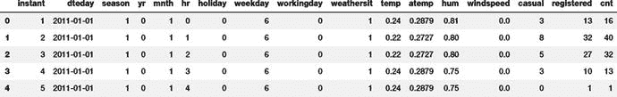

图 6-1。

Sample rows from Bike Sharing dataset

数据似乎已经正确加载。接下来，我们需要检查`pandas`推断出了什么数据类型，以及是否有任何属性需要类型转换。下面的代码片段帮助我们检查所有属性的数据类型。

```py
In [3]: hour_df.dtypes
Out[3]:
instant         int64
dteday          object
season          int64
yr              int64
mnth            int64
hr              int64
holiday         int64
weekday         int64
workingday      int64
weathersit      int64
temp            float64
atemp           float64
hum             float64
windspeed       float64
casual          int64
registered      int64
cnt             int64
dtype: object

```

正如数据集的文档中提到的，有自行车共享和天气属性可用。属性`dteday`需要从`object`(或`string`类型)到`timestamp`的类型转换。像季节、假日、工作日等属性被`pandas`推断为整数，为了正确理解，它们需要转换为类别。

在进入类型转换属性之前，下面的代码片段清理了属性名，使它们更容易理解和理解。

```py
In [4]: hour_df.rename(columns={'instant':'rec_id',
   ...:                         'dteday':'datetime',
   ...:                         'holiday':'is_holiday',
   ...:                         'workingday':'is_workingday',
   ...:                         'weathersit':'weather_condition',
   ...:                         'hum':'humidity',
   ...:                         'mnth':'month',
   ...:                         'cnt':'total_count',
   ...:                         'hr':'hour',
   ...:                         'yr':'year'},inplace=True)

```

既然我们已经清理了属性名，我们就使用像`pd.to_datetime()`和`astype()`这样的实用程序来执行属性的类型转换。下面的代码片段将属性转换成适当的数据类型。

```py
In [5]: # date time conversion
   ...: hour_df['datetime'] = pd.to_datetime(hour_df.datetime)
   ...:
   ...: # categorical variables
   ...: hour_df['season'] = hour_df.season.astype('category')
   ...: hour_df['is_holiday'] = hour_df.is_holiday.astype('category')
   ...: hour_df['weekday'] = hour_df.weekday.astype('category')
   ...: hour_df['weather_condition'] = hour_df.weather_condition.astype('category')
   ...: hour_df['is_workingday'] = hour_df.is_workingday.astype('category')
   ...: hour_df['month'] = hour_df.month.astype('category')
   ...: hour_df['year'] = hour_df.year.astype('category')
   ...: hour_df['hour'] = hour_df.hour.astype('category')

```

### 分布和趋势

预处理(我们在上一步中执行)后的数据集可以进行一些视觉检查了。我们从可视化各个季节每小时的客流量开始。下面的代码片段使用`seaborn`的`pointplot`将其可视化。

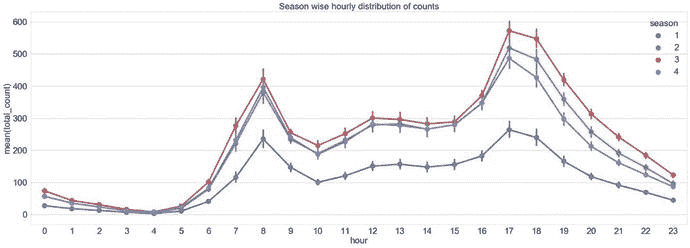

图 6-2。

Season wise hourly data distribution

```py
In [6]: fig,ax = plt.subplots()
   ...: sn.pointplot(data=hour_df[['hour',
   ...:                            'total_count',
   ...:                            'season']],
   ...:              x='hour',y='total_count',
   ...:              hue='season',ax=ax)
   ...: ax.set(title="Season wise hourly distribution of counts")

```

图 [6-2](#Fig2) 中的曲线显示了所有季节的相似趋势，计数高峰出现在早上 7-9 点和晚上 4-6 点，可能是由于办公时间开始和结束时的高移动。春季的人数最少，而秋季则是全天 24 小时中人数最多的时候。

同样，一周中各天的乘客量分布也呈现出周末下午时段使用率较高的有趣趋势，而工作日的早晚时段使用率较高。同样的代码可以在 jupyter 笔记本`bike_sharing_eda.ipynb`中找到。如图 [6-3](#Fig3) 所示。

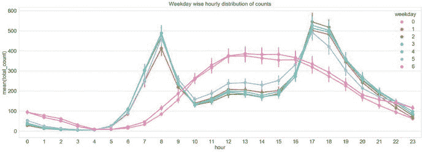

图 6-3。

Day-wise hourly data distribution

观察了不同类别的每小时数据分布后，让我们看看是否有任何聚合趋势。下面的片段帮助我们使用`seaborn`的`barplot()`来可视化每月的乘客趋势。

```py
In [7]: fig,ax = plt.subplots()
   ...: sn.barplot(data=hour_df[['month',
   ...:                          'total_count']],
   ...:            x="month",y="total_count")
   ...: ax.set(title="Monthly distribution of counts")

```

生成的柱状图展示了基于一年中月份的乘客量的明确趋势。六月至九月是乘客最多的月份。看起来秋天是华盛顿特区自行车共享项目的好季节。情节如图 [6-4](#Fig4) 所示。

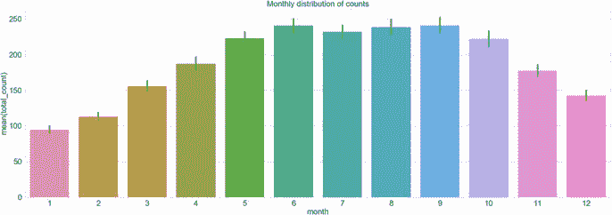

图 6-4。

Month-wise ridership distribution

我们鼓励你尝试绘制四季不同的`subplots`图，作为运用绘图概念的练习，并分别观察每个季节的趋势。

向上移动聚合级别，让我们看看年度级别的分布。我们的数据集包含表示 2011 年的 0 年值和表示 2012 年的 1 年值。我们使用小提琴图以清晰的格式来理解这个分布的多个方面。

Note

小提琴图类似于箱线图。与箱线图一样，violin 图也显示了四分位间距和其他汇总统计数据，如平均值/中值。然而，这些图比标准箱线图更强大，因为它们能够可视化数据的概率密度。如果数据是多模态的，这尤其有用。

下面的片段描绘了 violin 地块上的年度分布。

```py
In [8]: sn.violinplot(data=hour_df[['year',
   ...:                             'total_count']],
   ...:               x="year",y="total_count")

```

图 [6-5](#Fig5) 清楚地帮助我们理解 2011 年和 2012 年乘客数量的多式分布，2011 年的峰值低于 2012 年。尽管 2012 年和 2012 年的最大密度都在 100-200 次之间，但 2012 年的计数分布也要大得多。

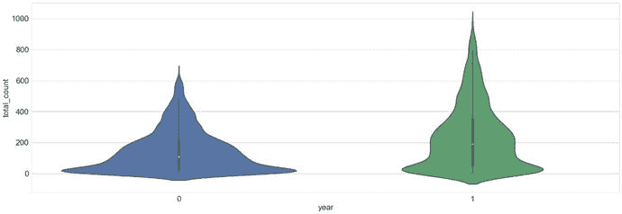

图 6-5。

Violin plot showcasing year-wise ridership distribution

### 极端值

在探索和学习任何数据集时，我们必须检查极端和不太可能的值。尽管我们在预处理数据集时处理了缺失和不正确的信息，但异常值通常在 EDA 过程中被捕获。离群值会对下游步骤(如建模和结果)产生严重的负面影响。

我们通常利用箱线图来检查数据中的异常值。在下面的代码片段中，我们分析了数值属性的异常值，如`total_count, temperature`和`wind_speed`。

```py
In [9]: fig,(ax1,ax2)= plt.subplots(ncols=2)
   ...: sn.boxplot(data=hour_df[['total_count',
   ...:                          'casual','registered']],ax=ax1)
   ...: sn.boxplot(data=hour_df[['temp','windspeed']],ax=ax2)

```

生成的图如图 [6-6](#Fig6) 所示。我们可以很容易地看出，对于这三个与计数相关的属性，它们似乎都有相当数量的异常值。不过，休闲骑手分布的总体数字较低。对于温度和风速的天气属性，我们只在风速的情况下发现异常值。

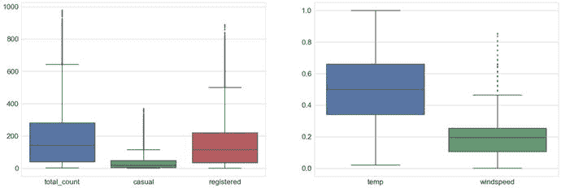

图 6-6。

Outliers in the dataset

我们同样可以尝试在不同的粒度级别检查异常值，比如每小时、每月等等。图 [6-7](#Fig7) 中的可视化展示了每小时的箱线图(代码可在`bike_sharing_eda.ipynb` jupyter 笔记本中获得)。

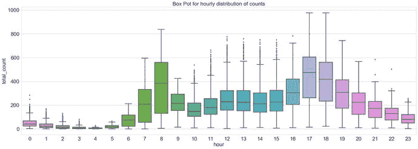

图 6-7。

Outliers in hourly distribution of ridership

### 相关

相关性帮助我们理解数据的不同属性之间的关系。由于本章的重点是预测，相关性可以帮助我们理解和利用关系来建立更好的模型。

Note

重要的是要理解相关性并不意味着因果关系。我们强烈建议您探索更多相同的内容。

下面的代码片段首先使用`pandas`实用函数`corr()`准备一个相关矩阵。然后，它使用热图来绘制相关矩阵。

```py
In [10]: corrMatt = hour_df[["temp","atemp",
    ...:                         "humidity","windspeed",
    ...:                        "casual","registered",
    ...:                         "total_count"]].corr()
    ...: mask = np.array(corrMatt)
    ...: mask[np.tril_indices_from(mask)] = False
    ...: sn.heatmap(corrMatt, mask=mask,
    ...: vmax=.8, square=True,annot=True)

```

图 [6-8](#Fig8) 显示了输出相关性矩阵(热图),该矩阵以蓝色到红色渐变(负相关到正相关)的下三角形式显示数值。

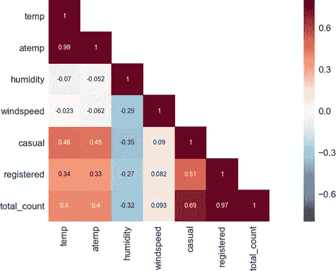

图 6-8。

Correlational matrix

两个计数变量`registered`和`casual`与`total_count`表现出明显的强相关性。类似地，temp 和 atemp 显示出高度相关性。`wind_speed`与`humidity`呈轻微负相关。总的来说，没有一个属性显示高度相关的统计数据。

## 回归分析

回归分析是统计学家和数据科学家使用的一种统计建模技术。它是调查因变量和自变量之间关系的过程。回归本身包括各种建模和分析变量之间关系的技术。它广泛用于预测分析、预测和时间序列分析。

因变量或目标变量被估计为独立变量或预测变量的函数。估计函数称为回归函数。

Note

在非常抽象的意义上，回归指的是对连续响应/目标变量的估计，而不是对离散目标的估计。

身高体重关系是开始回归分析的经典例子。这个例子说明一个人的体重取决于他/她的身高。因此，如果我们有足够的训练样本，我们可以建立一个回归函数来估计一个人给定身高(自变量)的体重(因变量)。我们将在下一节对此进行更多讨论。

回归分析模拟了因变量和自变量之间的关系。应该记住，因变量和自变量之间的相关性并不意味着因果关系！

### 回归的类型

多年来，有多种技术不断发展，帮助我们进行回归分析。一般来说，所有回归建模技术都包括以下内容:

*   独立变量 X
*   因变量或目标变量 Y
*   未知参数，表示为`β`

因此，回归函数将这些实体关联为:

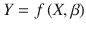

函数`f()`需要从可用的数据集中指定或学习。根据手头的数据和用例，以下是常用的回归技术:

*   线性回归:顾名思义，它映射了因变量和自变量之间的线性关系。在这种技术中，回归线是一条直线。这里的目标是最小化误差(例如误差平方和)。
*   逻辑回归:在因变量是二元的情况下(0/1 或者是/否)，使用这种技术。它帮助我们确定二元目标变量的概率。它的名字来源于这项技术使用的 logit 函数。这里的目的是最大化观察值的可能性。与回归相比，这种技术与分类技术有更多的共同点。
*   非线性回归:在因变量与自变量多项式相关的情况下，即回归函数的自变量幂大于 1。它也被称为多项式回归。

回归技术也可以归类为非参数。

### 假设

回归分析有一些通用的假设，而特定的分析技术也会增加(或减少)假设。以下是回归分析的重要一般假设:

*   训练数据集需要代表被建模的群体。
*   独立变量是线性独立的，即一个独立变量不能解释为其他变量的线性组合。换句话说，不应该有多重共线性。
*   误差的同方差，即误差的方差，在整个样本中是一致的。

### 评定标准

模型性能评估是数据科学用例的一个重要方面。我们不仅应该能够理解结果，还应该能够评估模型之间的比较，或者性能是否可以接受。

一般来说，评估指标和性能指南是非常特定的用例和领域，回归分析通常使用一些标准指标。

#### 残差分析

回归是使用解释变量的回归函数对目标变量的估计。由于输出是近似值，目标的预测值和观察值之间会有一些差异。

残差是观察值和预测值(回归函数的输出)之间的差值。数学上，第 I 个数据点的观测值和预测值之间的残差或差值被给出为:

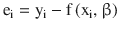

很好地拟合数据的回归模型将使其残差显示随机性(即，缺少任何模式)。这来自于回归建模的同方差假设。通常，残差和预测值之间的散点图用于确认假设。任何模式都会导致违反此属性，并指向不适合的模型。

#### 正态性检验(Q-Q 图)

这是一个视觉/图形测试，用于检查数据的正态性。这个测试帮助我们识别异常值、偏斜度等等。测试是通过绘制数据与理论四分位数进行的。同样的数据也绘制在直方图上，以确认正态性。以下是展示证实正态性检验的数据的样本图(见图 [6-9](#Fig9) )。

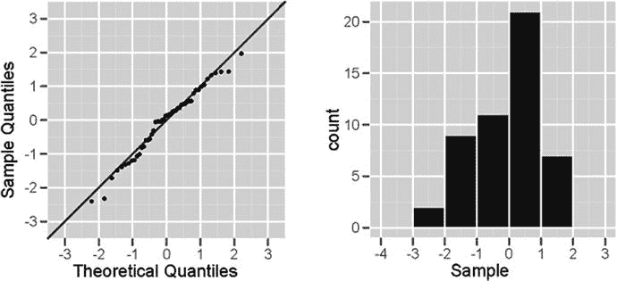

图 6-9。

Normal plot (Q-Q plot) on the left and histogram to confirm normality on the right

任何偏离正态图中的直线或直方图中的偏斜/多模态都表明数据没有通过正态性检验。

#### r 平方:拟合优度

r 平方或决定系数是用于检查回归分析拟合优度的另一种方法。这是一种用于确定回归线是否能够表明自变量解释的因变量方差的方法。

r 平方是一个介于 0 和 1 之间的数值，1 表示自变量能够解释因变量的方差。值越接近 0 表示模型拟合度越差。

#### 交互效度分析

正如第 [5](05.html) 章所讨论的，模型泛化也是处理数据科学问题的一个重要方面。过度适应其训练集的模型可能在看不见的数据上表现不佳，并导致各种问题和业务影响。因此，我们也在回归模型上使用 k-fold 交叉验证，以确保没有过度拟合的情况发生。

## 建模

现在已经准备好开始为我们的自行车共享数据集建模，并解决预测给定日期时间的自行车需求的业务问题。我们将利用上一节中讨论的回归分析的概念来建模和评估我们的模型的性能。

本章前面分析了数据集，并执行了某些转换，如重命名属性和类型转换。由于数据集包含多个分类变量，在建模过程中使用它们之前，我们必须对名义变量进行编码。

下面的片段展示了一个热编码分类变量的函数，基于我们在第 [4](04.html) 章详细讨论的方法:特征工程和选择。

```py
def fit_transform_ohe(df,col_name):
    """This function performs one hot encoding for the specified
        column.

    Args:
        df(pandas.DataFrame): the data frame containing the mentioned column name
        col_name: the column to be one hot encoded

    Returns:
        tuple: label_encoder, one_hot_encoder, transformed column as pandas Series

    """
    # label encode the column
    le = preprocessing.LabelEncoder()
    le_labels = le.fit_transform(df[col_name])
    df[col_name+'_label'] = le_labels
    # one hot encoding
    ohe = preprocessing.OneHotEncoder()
    feature_arr = ohe.fit_transform(df[[col_name+'_label']]).toarray()
    feature_labels = [col_name+'_'+str(cls_label) for cls_label in le.classes_]
    features_df = pd.DataFrame(feature_arr, columns=feature_labels)
    return le,ohe,features_df

```

我们使用`fit_transform_ohe()`函数和`transform_ohe()`来编码类别。标签和一个热编码器可作为`scikit-learn`的`preprocessing`模块的一部分。

Note

在接下来的章节中，我们将交替使用`scikit`和`sklearn`。

如前几章所述，我们通常将手头的数据集分为训练集和测试集，以评估模型的性能。在这种情况下，我们也使用通过`model_selection`模块可用的`scikit-learn`的`train_test_split()`函数。我们将数据集分为 67%和 33%，分别为`train`和`test`。下面的片段展示了同样的情况。

```py
In [11]: X, X_test, y, y_test = train_test_split(hour_df.iloc[:,0:-3],
    ...:                                         hour_df.iloc[:,-1],
    ...:                                         test_size=0.33,
    ...:                                         random_state=42)
    ...:
    ...: X.reset_index(inplace=True)
    ...: y = y.reset_index()
    ...:
    ...: X_test.reset_index(inplace=True)
    ...: y_test = y_test.reset_index()

```

下面的代码片段遍历分类变量列表，以转换和准备编码属性列表。

```py
In [12]: cat_attr_list = ['season','is_holiday',
    ...:                 'weather_condition','is_workingday',
    ...:                 'hour','weekday','month','year']
    ...:
    ...: encoded_attr_list = []
    ...: for col in cat_attr_list:
    ...:         return_obj = fit_transform_ohe(X,col)
    ...:         encoded_attr_list.append({'label_enc':return_obj[0],
    ...:                                   'ohe_enc':return_obj[1],
    ...:                                   'feature_df':return_obj[2],
    ...:                                   'col_name':col})

```

Note

尽管我们已经将所有的 categoricals 转换成了它们的 one-hot 编码，但是请注意，像 hour、weekday 等顺序属性不需要这样的编码。

接下来，我们将 numeric 和 one hot encoded categoricals 合并到一个数据帧中，我们将使用该数据帧进行建模。下面的代码片段帮助我们准备所需的数据集。

```py
In [13]: feature_df_list = [X[numeric_feature_cols]]
    ...: feature_df_list.extend([enc['feature_df'] \
    ...:                                 for enc in encoded_attr_list \
    ...:                                         if enc['col_name'] in subset_cat_features])
    ...:
    ...: train_df_new = pd.concat(feature_df_list, axis=1)
    ...: print("Shape::{}".format(train_df_new.shape))

```

我们准备了一个新的数据框架，它使用了原始训练数据框架中的数字和一个热编码分类属性。原始数据帧有 10 个这样的属性(包括数字和类别)。在这个转换之后，由于类别的一个热编码，新的数据帧具有 19 个属性。

### 线性回归

最简单的回归分析技术之一是线性回归。正如本章前面所讨论的，线性回归是对因变量和自变量之间关系的分析。线性回归假设两个变量之间存在线性关系。在一般回归分析符号上扩展，线性回归采取以下形式:

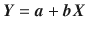

在这个方程中，`Y`是因变量，`X`是自变量。符号`a`表示回归线的截距，`b`是回归线的斜率。

基于截距(即`a`)和斜率(即`b`)的不同组合，可以将多条线拟合到给定的数据集。目的是找到最佳拟合线来模拟我们的数据。

如果我们想一想，最佳拟合线会是什么样的？这样的线将总是具有最小的误差/残差，即对于这样的线，预测和观察之间的差异将是最小的。

普通的最小二乘准则是一种识别最佳拟合线的技术。该算法试图最小化关于斜率和截距的误差。它采用平方误差的形式，如下所示:

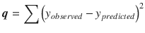

其中，`q`是总平方误差。我们最小化总误差以获得最佳拟合线的斜率和截距。

#### 培养

现在我们有了线性回归和 OLS 的背景，我们将开始建立模型。线性回归模型通过`scikit-learn`的`linear_model`模块公开。像《T2》中的所有机器学习算法一样，这也适用于熟悉的《T3》和《T4》主题。下面的代码片段为我们准备了线性回归对象。

```py
In [14]: X = train_df_new
    ...: y= y.total_count.values.reshape(-1,1)
    ...:
    ...: lin_reg = linear_model.LinearRegression()

```

一种简单的方法是调用`fit()`函数来构建我们的线性回归模型，然后在测试数据集上调用`predict()`函数来获得评估的预测。我们还想记住过度拟合的方面，减少其影响，并获得一个可推广的模型。正如前一节和前几章所讨论的，交叉验证是一种防止过度拟合的方法。

因此，我们使用 k 重交叉验证(特别是 10 重)，如下面的代码片段所示。

```py
In [15]: predicted = cross_val_predict(lin_reg, X, y, cv=10)

```

功能`cross_val_predict()`通过`sklearn`的`model_selection`模块暴露。该函数将模型对象、预测器和目标作为输入。我们使用`cv`参数指定 k-fold 中的 k。在我们的例子中，我们使用 10 重交叉验证。此函数返回模型对象拟合的交叉验证预测值。

我们使用散点图来分析我们的预测。下面的代码片段使用`matplotlib`生成残差和观察值之间的散点图。

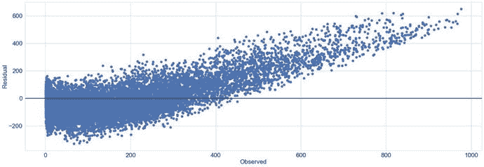

图 6-10。

Residual plot

```py
In [16]: fig, ax = plt.subplots()
    ...: ax.scatter(y, y-predicted)
    ...: ax.axhline(lw=2,color='black')
    ...: ax.set_xlabel('Observed')
    ...: ax.set_ylabel('Residual')
    ...: plt.show()

```

图 [6-10](#Fig10) 中的曲线明显违反了同方差假设，即残差是随机的，不遵循任何模式。为了进一步量化我们与模型相关的发现，我们绘制了交叉验证分数。我们使用`cross_val_score()`功能作为`model_selection`模块的一部分，如图 [6-11](#Fig11) 所示。

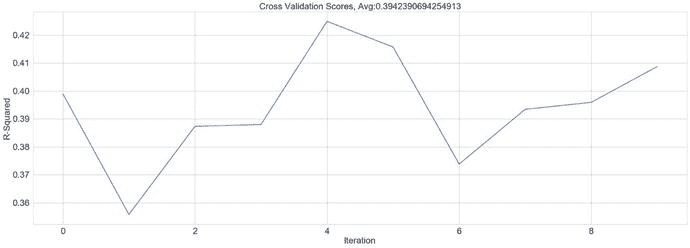

图 6-11。

Cross validation scores

10 倍交叉验证的 r 平方或决定系数平均为 0.39。这表明预测器只能解释目标变量中 39%的方差。

鼓励你绘制并确认数据的正态性。了解数据是否可以用线性模型建模非常重要。这是留给你去探索的一个练习。

#### 测试

需要在完全不可见的数据集(测试数据集)上检查在训练阶段准备和评估的线性回归模型的性能。在本节的开始，我们使用了`train_test_split()`函数来保存一个专门用于测试目的的数据集。

但是在我们可以在学习的回归线上使用测试数据集之前，我们需要确保属性在训练集和测试集中经过了相同的预处理。由于我们将分类变量转换为训练数据集中的一个热编码，因此在下面的代码片段中，我们也对测试数据集执行相同的操作。

```py
In [17]: test_encoded_attr_list = []
    ...: for enc in encoded_attr_list:
    ...: col_name = enc['col_name']
    ...: le = enc['label_enc']
    ...: ohe = enc['ohe_enc']
    ...: test_encoded_attr_list.append({'feature_df':transform_ohe(X_test,
    ...:                                                                 le,ohe,
    ...:                                                                 col_name),
    ...:                                 'col_name':col_name})
    ...:
    ...:
    ...: test_feature_df_list = [X_test[numeric_feature_cols]]
    ...: test_feature_df_list.extend([enc['feature_df'] \
    ...:                                 for enc in test_encoded_attr_list \
    ...:                                         if enc['col_name'] in subset_cat_features])
    ...:
    ...: test_df_new = pd.concat(test_feature_df_list, axis=1)
    ...: print("Shape::{}".format(test_df_new.shape))

```

转换后的测试数据集如图 [6-12](#Fig12) 所示。

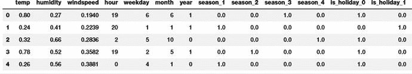

图 6-12。

Test dataset after transformations

拼图的最后一块是使用`LinearRegression`对象的`predict()`函数，并比较我们的结果/预测。以下代码片段执行上述操作。

```py
In [18]: X_test = test_df_new
    ...: y_test = y_test.total_count.values.reshape(-1,1)
    ...:
    ...: y_pred = lin_reg.predict(X_test)
    ...:
    ...: residuals = y_test-y_pred

```

我们还计算残差，并使用它们来准备残差图，类似于我们在训练步骤中创建的图。以下代码片段绘制了测试数据集的残差图。

```py
In [19]: fig, ax = plt.subplots()
    ...: ax.scatter(y_test, residuals)
    ...: ax.axhline(lw=2,color='black')
    ...: ax.set_xlabel('Observed')
    ...: ax.set_ylabel('Residuals')
    ...: ax.title.set_text("Residual Plot with R-Squared={}".format(np.average(r2_score)))
    ...: plt.show()

```

生成的图显示了与训练表现相当的 R 平方。该图如图 [6-13](#Fig13) 所示。

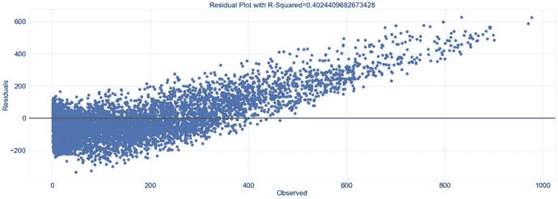

图 6-13。

Residual plot for test dataset

从我们的评估中可以清楚地看出，线性回归模型无法对数据进行建模以产生令人满意的结果。尽管应该注意的是，该模型在训练和测试数据集上表现相同。这似乎是一种情况，我们需要使用可以建模非线性关系的方法来建模这些数据。

Exercise

在本节中，我们使用了具有 19 个属性(包括数字和一个热编码类别)的训练和测试数据集。由于非线性和其他因素，性能令人沮丧。

尝试不同的属性组合(仅使用一个子集或仅使用数字属性或它们的任意组合)，并准备不同的线性回归模型。遵循本节中概述的相同步骤。对照本节中准备的模型检查性能，并分析是否可能有性能更好的模型。

### 基于决策树的回归

决策树是用于回归和分类问题的监督学习算法。它们在建模非线性关系时简单而强大。作为一个非参数模型，该算法的目的是学习一个模型，该模型可以基于基于特征的简单决策规则(例如，`if-else`条件)来预测结果。决策树的可解释性使它们更加有利可图，因为我们可以可视化它从数据中推断出的规则。

我们用一个例子来解释与决策树相关的概念和术语。假设我们有一个来自不同制造商的汽车模型的假设数据集。假设每个数据点都具有类似于`fuel_capacity, engine_capacity, price, year_of_purchase, miles_driven`和`mileage`的特征。给定这些数据，我们需要一个模型，它可以在给定其他属性的情况下预测里程。

由于决策树是监督学习算法，我们有一定数量的实际里程值的数据点可用。决策树从根开始，将数据集分成两个或更多不重叠的子集，每个子集表示为根的子节点。它根据特定的属性将根划分为子集。它继续在每个节点上执行分割，直到达到目标值可用的叶节点。关于这一切是如何发生的，可能会有很多问题，我们稍后会一一解答。为了更好地理解，假设图 [6-14](#Fig14) 是从手边的数据集推断出的决策树的结构。

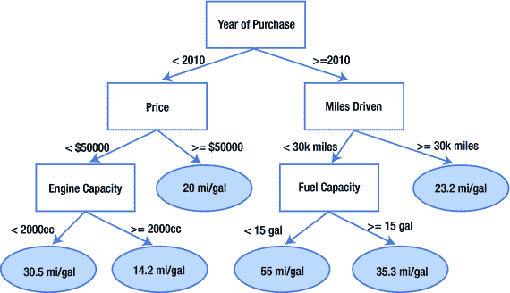

图 6-14。

Sample decision tree

图 [6-14](#Fig14) 中描述的可视化展示了一个样本决策树，其叶节点指向目标值。该树首先根据购买年份在根节点拆分数据集，左边的子节点代表 2010 年之前的购买，右边的子节点代表 2010 年之后的购买，其他节点也是如此。当呈现新的/看不见的数据点时，我们简单地遍历树并到达确定目标值的叶节点。尽管前面的例子很简单，但它清楚地展示了模型的可解释性以及学习简单规则的能力。

#### 节点分裂

决策树以自上而下的方式工作，节点分裂对于任何决策树算法都是一个重要的概念。大多数算法遵循贪婪的方法将输入空间划分为子集。

简单来说，基本过程是尝试使用不同的属性/特征分割数据点，并根据成本函数进行测试。每一步都选择成本最低的分割。分类和回归问题使用不同的成本函数集。一些最常见的如下:

*   均方差(MSE):主要用于回归树，计算为观察值和预测值之间的差的平方。
*   平均绝对误差:用于回归树，它类似于 MSE，虽然我们只使用观察值和预测值之间的差异。
*   方差减少:这是 CART 算法首次引入的，它使用方差的标准公式，我们选择产生最小方差的分割。
*   吉尼杂质/指数:主要由分类树使用，它是对随机选择的数据点的一种度量，假设它被随机标记，则它具有不正确的标记。
*   信息增益:再次主要用于分类问题，它也被称为熵。我们根据获得的信息量来选择拆分。信息增益越高越好。

Note

这些是一些最常用的成本函数。在特定场景下使用的还有很多。

#### 停止标准

如前所述，决策树遵循节点的贪婪递归分裂，但它们如何或何时停止？有许多策略可用于定义停止标准。最常见的是数据点的最小计数。如果进一步拆分会违反此约束，则停止节点拆分。使用的另一个约束是树的深度。

停止标准和其他参数一起帮助我们获得能够很好地概括的树。非常深或有太多非叶节点的树通常会导致过度拟合。

#### 超参数

超参数是我们设置的旋钮和控件，目的是优化模型在未知数据上的性能。这些超参数不同于我们的学习算法在训练过程中学习到的参数。超参数帮助我们实现避免过度拟合等目标。决策树为我们提供了相当多的超参数，其中一些我们在第 [5](05.html) 章中讨论过。

最大深度、叶节点的最小样本、分裂内部节点的最小样本、最大叶节点等是一些积极用于提高决策树性能的超参数。在接下来的章节中，我们将使用网格搜索等技术(从第 [5](05.html) 章开始回忆)来确定这些超参数的最佳值。

#### 决策树算法

决策树已经存在很长时间了。这些年来，它们随着基于不同技术的算法的改进而发展。下面列出了一些最常用的算法:

*   购物车或分类和回归树
*   ID3 或迭代二分法 3
*   C4.5

现在我们对决策树有了一个不错的理解，让我们看看是否可以通过使用它们来改进预测自行车共享需求的回归问题。

#### 培养

类似于线性回归的过程，我们将使用相同的预处理数据帧`train_df_new`,将类别与其他数字属性一起转换为一个热编码形式。我们还使用来自`scikit-learn`的`train_test_split()`实用程序将数据集分割成`train`和`test`。

与线性回归相比，决策树的训练过程有点复杂和不同。即使我们在训练线性回归模型时进行了交叉验证，我们也没有任何超参数要调整。在决策树的例子中，我们有相当多的决策树(其中一些我们甚至在上一节讨论过)。在我们进入获取最佳超参数的细节之前，我们将查看来自`sklearn`的`tree`模块的`DecisionTreeRegressor`。我们通过用如下设置的一些超参数实例化一个 regressor 对象来实现这一点。

```py
In [1]: dtr = DecisionTreeRegressor(max_depth=4,
   ...:                                 min_samples_split=5,
   ...:                                 max_leaf_nodes=10)

```

这个代码片段准备了一个`DecisionTreeRegressor`对象，它被设置为最大深度为 4，最大叶节点为 10，分割一个节点所需的最小样本数为 5。虽然还可以有更多，但这个例子概述了超参数在算法中的应用。

Note

我们鼓励您尝试在训练数据上使用默认的决策树回归器，并观察它在测试数据集上的性能。

如前所述，决策树还有一个额外的优点，就是可解释。我们可以使用`Graphviz`和`pydot`库来可视化模型对象，如下面的代码片段所示。

```py
In [2]: dot_data = tree.export_graphviz(dtr, out_file=None)
   ...: graph = pydotplus.graph_from_dot_data(dot_data)
   ...: graph.write_pdf("bikeshare.pdf")

```

输出是一个`pdf`文件，展示了带有上一步中设置的超参数的决策树。下图如图 [6-15](#Fig15) 所示，显示了根节点在属性 3 上被分割，然后继续下去，直到深度达到 4。也有一些深度小于 4 的叶子。每个节点都清楚地标出了与其相关的属性。

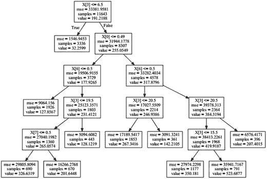

图 6-15。

Decision tree with defined hyperparameters on Bike Sharing dataset

现在我们开始实际的训练过程。从我们到目前为止的工作流程中可以明显看出，我们将使用 k-fold 交叉验证来训练我们的回归器。由于在决策树的情况下我们也有超参数要担心，所以我们也需要一种方法来微调它们。

有许多微调超参数的方法，最常用的是网格搜索和随机搜索，其中网格搜索是更常用的方法。顾名思义，随机搜索随机搜索超参数的组合以找到最佳组合，另一方面，网格搜索是一种更系统的方法，在确定最佳组合之前尝试所有组合。为了让我们的生活变得更容易，`sklearn`提供了一个实用程序来网格搜索超参数，同时使用来自`model_selection`模块的`GridSearchCV()`方法来交叉验证模型。

`GridSearchCV()`方法将回归/分类器对象作为输入参数，同时还有一个超参数字典、所需的交叉验证数以及其他一些参数。我们使用下面的字典来定义我们的超参数网格。

```py
In [3]: param_grid = {"criterion": ["mse", "mae"],
   ...:               "min_samples_split": [10, 20, 40],
   ...:               "max_depth": [2, 6, 8],
   ...:               "min_samples_leaf": [20, 40, 100],
   ...:               "max_leaf_nodes": [5, 20, 100, 500, 800],
   ...: }

```

该字典基本上为我们想要微调的每个超参数提供了一个可行值列表。超参数是键，而值作为这些超参数的可能值的列表呈现。例如，我们的字典为`max_depth`提供了 2、6 和 8 级的可能值。`GridSearchCV()`函数将依次在定义的可能值列表中搜索，以得出最佳值。下面的代码片段准备了一个`GridSearchCV`对象，并使我们的训练数据集适合它。

```py
In [4]: grid_cv_dtr = GridSearchCV(dtr, param_grid, cv=5)

```

使用 k 重交叉验证的超参数网格搜索是一个由`GridSearchCV()`函数包装、优化和标准化的迭代过程。由于同样的原因，训练过程需要时间，并且会产生相当多的有用属性来分析。`best_score_`属性帮助我们获得决策树回归器可以达到的最佳交叉验证分数。我们可以使用`best_params_`查看生成最佳分数的模型的超参数。我们可以使用`cv_results_`属性查看`GridSearchCV()`每次迭代的详细信息。下面的代码片段展示了其中的一些属性。

```py
In [5]: print("R-Squared::{}".format(grid_cv_dtr.best_score_))
   ...: print("Best Hyperparameters::\n{}".format(grid_cv_dtr.best_params_))

R-Squared::0.85891903233008
Best Hyperparameters::
{'min_samples_split': 10, 'max_depth': 8, 'max_leaf_nodes': 500, 'min_samples_leaf': 20, 'criterion': 'mse'}

```

结果是体面的，并显示了我们的线性回归模型的显著改善。让我们首先尝试理解跨该模型拟合的不同设置的学习/模型拟合结果。为了在网格搜索过程中获得不同的模型，我们使用了`GridSearchCV`对象的`cv_results_`属性。`cv_results_`属性是一个`numpy`数组，我们可以很容易地将其转换成`pandas`数据帧。数据帧如图 [6-16](#Fig16) 所示。


图 6-16。

Dataframe showcasing tuning results with a few attributes of Grid Search with CV

重要的是要理解，交叉验证网格搜索优化了寻找最佳超参数集，有助于准备一个可推广的决策树回归。有可能存在进一步的优化。我们使用`seaborn`来绘制树的深度对总得分的影响以及叶节点的数量。下面的代码片段使用了我们之前讨论的使用`GridSearchCV`对象的`cv_results_`属性准备的相同数据帧。

```py
In [6]: fig,ax = plt.subplots()
   ...: sn.pointplot(data=df[['mean_test_score',
   ...:                         'param_max_leaf_nodes',
   ...:                         'param_max_depth']],
   ...:                 y='mean_test_score',x='param_max_depth',
   ...:                 hue='param_max_leaf_nodes',ax=ax)
   ...: ax.set(title="Affect of Depth and Leaf Nodes on Model Performance")

```

输出显示，随着深度从 2 增加到 6，分数突然提高，而随着深度从 6 增加到 8，分数逐渐提高。叶节点数量的影响相当有趣。100 个叶节点和 800 个叶节点之间的分数差异惊人地小。这清楚地表明，进一步微调是可能的。图 [6-17](#Fig17) 描述了展示这些结果的可视化。


图 6-17。

Mean test score and impact of tree depth and count of leaf nodes

如上所述，仍有微调的余地，以进一步改善结果。因此，这是一个依赖于用例和成本的决定。成本可以用努力、时间和实现的相应改进来衡量。现在，我们将继续我们的`GridSearchCV`对象已经帮助我们识别的最佳模型。

#### 测试

一旦我们有了一个经过优化的超参数训练的模型，我们就可以开始我们通常的工作流程，在一个看不见的数据集上测试性能。在为线性回归准备测试集时，我们将使用相同的预处理(您可以参考线性回归的“测试”部分和/或 jupyter 笔记本`decision_tree_regression.ipynb`)。下面的代码片段使用在训练阶段获得的最佳估计量来预测测试数据集的输出值。

```py
In [7]: y_pred = best_dtr_model.predict(X_test)
   ...: residuals = y_test.flatten() - y_pred

```

最后一步是查看该数据集的 R 平方得分。一个合适的模型在这个集合上也应该有相当的性能，从下面的代码片段可以明显看出这一点。

```py
In [1]: print("R-squared::{}".format(r2_score))
R-squared::0.8722

```

从 R 平方值可以明显看出，该性能与我们的训练性能相当。我们可以得出结论，与线性回归相比，决策树回归器在预测自行车需求方面更好。

## 后续步骤

决策树帮助我们实现了比基于线性回归的模型更好的性能，但仍有改进的可能。以下是需要思考和牢记的几个后续步骤:

*   模型微调:我们通过使用决策树实现了巨大的改进，但是这可以通过分析训练、交叉验证等的结果来进一步改进。可接受的模型性能是依赖于用例的，并且通常在形式化问题陈述时被讨论。在我们的案例中，0.8 的 R 平方可能非常好或者没有达到目标，因此需要与所有相关利益方讨论结果。
*   其他模型和集成:如果我们当前的模型没有达到性能标准，我们需要评估其他算法甚至集成。还有许多其他回归模型可供探索。合奏也非常有用，并被广泛使用。
*   机器学习管道:本章分享的工作流程非常冗长，有助于理解和探索概念和技术。一旦一系列预处理和建模步骤稳定下来，就可以使用标准化的管道来维护整个过程的一致性和有效性。我们鼓励您探索`sklearn`的`pipeline`模块以了解更多详情。

## 摘要

本章介绍了来自 UCI 机器学习知识库的自行车共享数据集。我们遵循了本书前面部分详细讨论的机器学习工作流程。我们首先简要讨论了数据集，然后正式定义了问题陈述。一旦我们有了预测自行车需求的任务，下一步就是开始探索性的数据分析，以了解和揭示数据中的属性和模式。我们利用`pandas, numpy`和`seaborn/matplotlib`来操作、转换和可视化手头的数据集。线图、条形图、箱线图、小提琴图等。所有这些都有助于我们理解数据集的各个方面。

然后，我们绕道探索回归分析。讨论了回归分析技术的重要概念、假设和类型。简而言之，我们提到了通常用于回归问题的各种性能/评估标准，如残差图、正态图和决定系数。对数据集和回归本身有了更好的理解后，我们从一个叫做线性回归的简单算法开始。它不仅是一个简单的算法，也是回归用例中研究得最多和使用最广泛的算法之一。我们利用`sklearn`的`linear_model`来为手头的问题构建和测试我们的数据集。我们还利用了`model_selection`模块来分割我们的数据集并交叉验证我们的模型。下一步，我们升级到基于决策树的回归模型，以提高线性回归的性能。在使用决策树对我们的数据集建模之前，我们触及了与决策树相关的概念和重要方面。线性回归和决策树使用相同的预处理步骤。最后，我们简要讨论了改进和增强的后续步骤，从而结束了本章。本章为后面的章节设置了流程和上下文，这些章节将从现在开始建立在概念和工作流的基础上。