# 8.客户细分和有效的交叉销售

金钱让世界运转，在当前数据密集型商业实践的生态系统中，可以肯定地说，数据也让世界运转。数据科学家的一项非常重要的技能是将分析的技术方面与其商业价值(即货币价值)相匹配。这可以通过多种方式实现，并且在很大程度上取决于业务类型和可用数据。在前面的章节中，我们讨论了可以被框定为业务问题(利用 CRISP-DM 模型)并与创收相关联的问题。在本章中，我们将直接关注两个非常重要的问题，这两个问题会对企业和机构的收入流产生积极影响，尤其是在零售领域。这一章的独特之处还在于，我们提出了一种完全不同的机器学习算法范式，更侧重于与模式识别和无监督学习相关的任务。

在这一章中，我们首先偏离我们通常的技术焦点，试图收集一些业务和领域知识。这一知识非常重要，因为这通常是许多数据科学家的绊脚石，在这些场景中，由于缺乏对基于业务需求的解决方案所获得的实际价值的关注，完美开发的机器学习解决方案没有实现生产。牢牢把握潜在的业务(和货币)动机有助于数据科学家定义其解决方案的价值方面，从而确保部署这些解决方案并为其雇主创造可实现的价值。

为了实现这一目标，我们将从来自 UCI 机器学习知识库( [`http://archive.ics.uci.edu/ml/datasets/online+retail`](http://archive.ics.uci.edu/ml/datasets/online+retail) )的基于零售交易的数据集开始，我们将使用该数据集来解决两个相当简单但重要的问题。本章中使用的详细代码、笔记本和数据集可以在 GitHub 资源库 [`https://github.com/dipanjanS/practical-machine-learning-with-python`](https://github.com/dipanjanS/practical-machine-learning-with-python) 中第 [8](08.html) 章的相应目录中找到。

*   客户细分:客户细分是根据客户与企业的互动，发现企业客户群信息的问题。在大多数情况下，这种互动是根据他们的购买行为和模式。我们探索了一些可以使用它的方法。
*   市场购物篮分析:市场购物篮分析是一种深入了解客户细微行为的方法。这有助于设计策略，更深入地了解客户的购买决策。这很有趣，因为很多时候，即使是顾客也不会意识到他们购买行为中的这种偏见或趋势。

## 在线零售交易数据集

在线零售交易数据集可从 UCI 机器学习库中获得。在前面的章节中，我们已经使用了这个库中的一些数据集，这应该强调了这个库对用户的重要性。我们将用于分析的数据集非常简单。根据其在 UCI 网站上的描述，它包含了一家总部位于英国的注册无店铺在线零售商在`01/12/2010`和`09/12/2011`之间发生的所有交易。从网站上，我们还了解到该公司销售独特的全场合礼品，该组织的许多客户是批发商。

最后一条信息尤为重要，因为它让我们有机会探究大规模客户的购买行为，而不仅仅是普通零售客户的购买行为。该数据集没有任何有助于我们区分批发购买和零售购买的信息。在我们开始之前，请确保您加载了以下依赖项。

```py
import pandas as pd
import datetime
import math
import numpy as np
import matplotlib.pyplot as plt
import matplotlib.mlab as mlab

%matplotlib inline

```

Note

我们鼓励您在 [`http://archive.ics.uci.edu/ml/datasets/online+retail`](http://archive.ics.uci.edu/ml/datasets/online+retail) 查看 UCI 机器学习知识库和这个特定数据集的页面。在网站上，你可以找到一些使用相同数据集的研究论文。我们相信这些论文和本章的分析会让我们所有的读者阅读起来很有趣。

## 探索性数据分析

我们一直坚持认为，不管实际的用例或算法如何，我们打算实现标准的分析工作流，它应该总是从探索性数据分析(EDA)开始。因此，按照传统，我们将从数据集上的 EDA 开始。

关于数据集，您应该注意的第一件事是它的格式。与我们在本书中处理的大多数数据集不同，数据集不是 CSV 格式，而是 Excel 文件。在其他一些语言(甚至框架)中，这可能是问题的原因，但是使用 python，特别是`pandas`我们不会面临任何这样的问题，我们可以使用`pandas`库提供的函数`read_excel`读取数据集。我们还看一下数据集中的一些线。

```py
In [3]: cs_df = pd.read_excel(io=r'Online Retail.xlsx')

```

数据集中的几行给了我们关于数据集属性的信息，如图 [8-1](#Fig1) 所示。

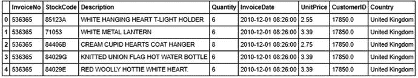

图 8-1。

Sample transactions from the Retail Transactions dataset

数据集的属性很容易从它们的名称中识别出来。我们马上就知道这些字段可能意味着什么。为了完整起见，我们在这里包括了对每一列的描述:

*   InvoiceNo:发票的唯一标识。跨行共享的发票编号意味着这些交易是在一张发票中执行的(多次采购)。
*   库存代码:发票中包含的项目的标识符。
*   描述:每个库存项目的文本描述。
*   数量:采购项目的数量。
*   发票日期:购买日期。
*   单价:每个项目的价值。
*   CustomerID:进行购买的客户的标识符。
*   国家:客户所在的国家。

让我们分析这些数据，首先确定零售商向哪些国家运送商品，以及这些国家的销售量如何。

```py
In [5]: cs_df.Country.value_counts().reset_index().head(n=10)
Out[5]:
            index  Country
0  United Kingdom   495478
1         Germany     9495
2          France     8557
3            EIRE     8196
4           Spain     2533
5     Netherlands     2371
6         Belgium     2069
7     Switzerland     2002
8        Portugal     1519
9       Australia     1259

```

这向我们表明，大部分订单只发生在本国，这并不奇怪。我们还注意到奇怪的国名`EIRE`，这有点令人担忧。但是一个快速的网络搜索表明这只是爱尔兰的一个旧名字，所以没什么坏处！有趣的是，澳大利亚也在国家销售的前十名中。

接下来，我们可能会对该零售商有多少独立客户以及他们的订单数量有多少感兴趣。我们还想知道零售商的前 10 名客户的订单占多大比例。这个信息很有趣，因为它会告诉我们公司的用户群是否分布相对均匀。

```py
In [7]: cs_df.CustomerID.unique().shape
Out[7]: (4373,)

In [8]: (cs_df.CustomerID.value_counts()/sum(cs_df.CustomerID.value_counts())*100).head(n=13).cumsum()
Out[8]:
17841.0    1.962249
14911.0    3.413228
14096.0    4.673708
12748.0    5.814728
14606.0    6.498553
15311.0    7.110850
14646.0    7.623350
13089.0    8.079807
13263.0    8.492020
14298.0    8.895138
15039.0    9.265809
14156.0    9.614850
18118.0    9.930462
Name: CustomerID, dtype: float64

```

这告诉我们，我们有 4，373 个不同的客户，但总销售额的近 10%仅由 13 个客户贡献(基于前面输出中的累积百分比聚合)。考虑到我们既有批发客户又有零售客户，这是意料之中的。下一件事，我们要确定有多少独特的项目，该公司正在出售，并检查我们是否有相同数量的描述。

```py
In [9]: cs_df.StockCode.unique().shape
Out[9]: (4070,)

In [10]: cs_df.Description.unique().shape
Out[10]: (4224,)

```

我们在`StockCode`和`Description`的数量上有一个不匹配，因为我们可以看到项目描述多于股票代码值，这意味着我们对一些股票代码有多个描述。虽然这不会干扰我们的分析，但我们希望对此进行更深入的挖掘，以找出可能导致此问题的原因，或者数据中存在哪种重复的描述。

```py
cat_des_df = cs_df.groupby(["StockCode","Description"]).count().reset_index()
cat_des_df.StockCode.value_counts()[cat_des_df.StockCode.value_counts()>1].reset_index().head()

   index  StockCode
0  20713          8
1  23084          7
2  85175          6
3  21830          6
4  21181          5

In [13]: cs_df[cs_df['StockCode']
    ...:       ==cat_des_df.StockCode.value_counts()[cat_des_df.StockCode.value_counts()>1].
    ...:       reset_index()['index'][6]]['Description'].unique()
Out[13]:
array(['MISTLETOE HEART WREATH CREAM', 'MISTLETOE HEART WREATH WHITE',
       'MISTLETOE HEART WREATH CREAM', '?', 'had been put aside', nan], dtype=object)

```

这为其中一个项目提供了多种描述，我们见证了数据质量在任何数据集中被破坏的简单方式。一个简单的拼写错误可能导致数据质量下降和错误分析。在企业级场景中，专门的人员致力于随着时间的推移手动恢复数据质量。由于本节的目的是关注客户细分，我们现在将跳过这一繁琐的活动。现在让我们验证`Quantity`和`UnitPrice`属性的神圣性，因为这些是我们将在分析中使用的属性。

```py
In [14]: cs_df.Quantity.describe()
Out[14]:
count    541909.000000
mean          9.552250
std         218.081158
min      -80995.000000
25%           1.000000
50%           3.000000
75%          10.000000
max       80995.000000
Name: Quantity, dtype: float64

In [15]: cs_df.UnitPrice.describe()
Out[15]:
count    541909.000000
mean          4.611114
std          96.759853
min      -11062.060000
25%           1.250000
50%           2.080000
75%           4.130000
max       38970.000000
Name: UnitPrice, dtype: float64

```

我们可以从前面的输出中观察到，这两个属性都有负值，这可能意味着我们的数据中也可能有一些退货交易。这种情况对任何零售商来说都很常见，但我们需要在继续分析之前处理这些问题。这些是我们在数据集中发现的一些数据质量问题。在现实世界中，数据集通常是杂乱的，并且有相当大的数据质量问题，因此在执行任何类型的分析之前，明确地验证手头的信息总是一个好的做法。我们鼓励您尝试在将来可能要分析的任何数据集上找到类似的问题。

## 客户细分

分段是将任何聚集的实体分离成单独的部分或组(段)的过程。这些部分之间可能有共同之处，也可能没有。类似地，客户细分是基于各种客户属性将组织的客户群划分为不同部分或细分的过程。它是由这样一种信念驱动的，即顾客天生不同，这种不同通过他们的行为来体现。对一个组织的客户群及其行为的深刻理解通常是任何客户细分项目的重点。客户细分的过程是以发现客户行为和模式的差异为前提的。这些差异可能基于他们的购买行为、他们的人口统计信息、他们的地理信息、他们的心理属性等等。

### 目标

客户细分可以在许多方面帮助一个组织。在我们描述实现客户细分的各种方法之前，我们想列举一下客户细分背后的主要目标和好处。

#### 客户理解

客户细分过程的主要目标之一是更深入地了解公司的客户及其属性和行为。这些对客户群的洞察可以以不同的方式使用，我们将很快讨论。但是信息本身是有用的。最广为接受的商业范例之一是“了解你的客户”,客户群的细分允许对这一范例进行完美的剖析。这种理解和利用构成了客户细分的其他好处的基础。

#### 目标营销

客户细分最明显的原因是有效和高效地集中营销努力的能力。如果一个公司了解其客户群的不同部分，它就能设计更好的营销活动，为该部分量身定做。以任何一家旅游公司为例，如果它知道其客户的主要部分是经济型旅客和豪华旅客，它可以为每个群体开展两次单独的营销活动。一个人可以专注于该公司与预算交易相关的产品的更高价值方面，而另一个活动则涉及豪华产品。虽然这个例子看起来很琐碎，但是同样的逻辑可以以多种方式进行扩展，以达到更好的营销实践。一个好的细分模型可以更好地理解客户需求，从而增加组织开展的任何营销活动的成功机会。

#### 最佳产品放置

一个好的客户细分策略也可以帮助公司开发或提供新产品。这一优势在很大程度上取决于利用细分过程的方式。考虑一个非常简单的例子，一家在线零售商发现其大部分客户都在一起购买化妆品。这可能会促使他将这些产品捆绑在一起作为组合产品，这可能会增加零售商的销售利润，并使客户的购买过程更加简化。

#### 寻找潜在客户群

客户细分过程有助于组织了解其客户群。任何这种做法的一个明显的副作用是发现它可能会错过哪一部分客户。这有助于通过专注于营销活动或新产品开发来识别未开发的客户群。

#### 更高的收入

这是任何客户细分项目最明显的需求。原因在于，由于本节中确定的所有优势的综合效应，客户细分可以带来更高的收入。

### 战略

“如何进行客户细分？”这个问题的简单答案会是“以你认为合适的任何方式”，这将是一个完全可以接受的答案。这是正确答案的原因，是因为客户细分的原始定义。这只是区分顾客的一种方式。它可以简单到使用手动流程根据年龄组或其他属性对客户进行分组，也可以复杂到使用复杂的算法以自动方式找出这些细分市场。由于我们的书都是关于机器学习的，我们描述了如何将客户细分转化为核心的机器学习任务。本节的详细代码可在标题为`Customer Segmentation.ipynb`的笔记本中找到。

#### 使聚集

我们正在处理一个无标签、无监督的交易数据集，我们希望从中找出客户群。因此，执行客户细分最明显的方法是使用无监督的机器学习方法，如聚类。因此，这将是我们在本章中用于客户细分的方法。该方法非常简单，以特征或属性的形式收集尽可能多的客户数据，然后找出可以从这些数据中获得的不同聚类。最后，我们可以通过分析聚类的特征来发现客户群的特征。

#### 探索性数据分析

使用探索性数据分析是找出客户群的另一种方法。这通常由对产品和客户相关领域有丰富知识的分析师来完成。可以灵活地将最高决策点包含在分析中。例如，找出客户的消费范围将会产生基于消费的客户细分。我们可以对客户的重要属性进行类似的处理，直到我们得到具有有趣特征的客户群。

#### 聚类与客户细分

在我们的用例中，我们将使用基于聚类的模型来找出感兴趣的客户群。在我们继续修改模型数据之前，有一个有趣的问题需要澄清。很多人认为聚类相当于客户细分。虽然聚类的确是最适合分段的技术之一，但它不是唯一的技术。除此之外，它只是一种“应用”于提取片段的方法。

客户细分就是对客户进行细分的任务。它可以用几种方法解决，并且不一定总是一个复杂的模型。聚类提供了一个数学框架，可以用来找出数据中的这种段边界。当我们有很多关于客户的属性时，聚类特别有用，我们可以根据这些属性进行不同的细分。此外，经常观察到基于聚类的分割将优于任意分割过程，并且它将经常包含可以使用这种任意过程设计的片段。

### 聚类策略

现在，我们已经了解了什么是客户细分、各种策略以及它如何有用，我们可以开始在我们的在线零售数据集中找出客户细分的过程。我们拥有的数据集只包含客户的销售交易，没有关于他们的其他信息，即没有其他附加属性。通常，在较大的组织中，我们通常会有更多关于客户的信息属性，这有助于聚类。然而，使用这个有限的属性数据集将会很有趣，而且绝对是一个挑战！因此，我们将使用一个基于 RFM-新近性、频率和货币价值的客户价值模型来寻找我们的客户群。

#### 顾客价值的 RFM 模型

RFM 模型是市场营销和客户细分中用于确定客户价值的流行模型。RFM 模型将获取客户的交易，并计算每个客户的三个重要信息属性:

*   新近性:顾客最近在该机构购买的价值
*   频率:客户在机构中的交易频率
*   货币价值:顾客在该机构进行的所有交易的美元(或英镑)价值

这三个值的组合可用于为客户分配一个值。我们可以直接想到一些我们希望在这种模型上出现的理想细分市场。例如，高价值客户是一个经常购买的人，最近刚买了一些东西，无论何时购买或购物都花费很高！

#### 数据清理

我们在“探索性数据分析”一节中暗示了我们数据集中的退货交易。在继续我们的分析工作流之前，我们将找出所有这样的事务并删除它们。另一种可能性是也从数据集中删除匹配的购买交易。但是我们将假设那些交易仍然重要，因此我们将保持它们完好无损。另一个数据清理操作是只分离特定地理区域的交易，因为我们不希望来自德国客户的数据影响对另一个国家客户的分析。以下代码片段实现了这两项任务。我们专注于英国客户，这是最大的细分市场(基于国家！).

```py
In [16]: # Separate data for one geography
    ...: cs_df = cs_df[cs_df.Country == 'United Kingdom']
    ...:
    ...: # Separate attribute for total amount
    ...: cs_df['amount'] = cs_df.Quantity*cs_df.UnitPrice
    ...:
    ...: # Remove negative or return transactions
    ...: cs_df = cs_df[∼(cs_df.amount<0)]
    ...: cs_df.head()
    ...:
Out[16]:
  InvoiceNo StockCode                          Description  Quantity  \
0    536365    85123A   WHITE HANGING HEART T-LIGHT HOLDER         6
1    536365     71053                  WHITE METAL LANTERN         6
2    536365    84406B       CREAM CUPID HEARTS COAT HANGER         8
3    536365    84029G  KNITTED UNION FLAG HOT WATER BOTTLE         6
4    536365    84029E       RED WOOLLY HOTTIE WHITE HEART.         6

          InvoiceDate  UnitPrice  CustomerID         Country  amount
0 2010-12-01 08:26:00       2.55     17850.0  United Kingdom   15.30
1 2010-12-01 08:26:00       3.39     17850.0  United Kingdom   20.34
2 2010-12-01 08:26:00       2.75     17850.0  United Kingdom   22.00
3 2010-12-01 08:26:00       3.39     17850.0  United Kingdom   20.34
4 2010-12-01 08:26:00       3.39     17850.0  United Kingdom   20.34

```

该数据现在只有来自英国的购买交易。我们现在将删除所有缺少`CustomerID`字段值的交易，因为我们所有的后续交易都将基于客户实体。

```py
In [17]: cs_df = cs_df[∼(cs_df.CustomerID.isnull())]
In [18]: cs_df.shape
Out[18]: (354345, 9)

```

下一步是为我们数据集中的每个客户创建新近性、频率和货币价值特征。

##### 崭新

为了创建最近特征变量，我们需要为我们的分析确定参考日期。对于我们的用例，我们将把参考日期定义为数据集中最后一次交易之后的一天。

```py
In [19]: refrence_date = cs_df.InvoiceDate.max()
    ...: refrence_date = refrence_date + datetime.timedelta(days = 1)
    ...: refrence_date
Out[20]: Timestamp('2011-12-10 12:49:00')

```

我们将把最近变量构造为客户最后一次购买的参考日期之前的天数。下面的代码片段将为我们创建这个变量。

```py
In [21]: cs_df['days_since_last_purchase'] = refrence_date - cs_df.InvoiceDate
    ...: cs_df['days_since_last_purchase_num'] = cs_df['days_since_last_purchase'].astype('timedelta64[D]')

In [22]: customer_history_df = cs_df.groupby("CustomerID").min().reset_index()[['CustomerID', 'days_since_last_purchase_num']]
    ...: customer_history_df.rename(columns={'days_since_last_purchase_num':'recency'}, inplace=True)

```

在我们继续之前，让我们检查一下客户最近的分布如何寻找我们的数据(见图 [8-2](#Fig2) )。

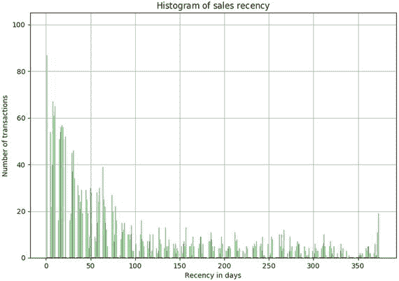

图 8-2。

Distribution of sales recency

```py
x = customer_history_df.recency
mu = np.mean(customer_history_df.recency)
sigma = math.sqrt(np.var(customer_history_df.recency))
n, bins, patches = plt.hist(x, 1000, facecolor='green', alpha=0.75)

# add a 'best fit' line
y = mlab.normpdf( bins, mu, sigma)
l = plt.plot(bins, y, 'r--', linewidth=2)

plt.xlabel('Recency in days')
plt.ylabel('Number of transactions')
plt.title(r'$\mathrm{Histogram\ of\ sales\ recency}\ $')
plt.grid(True)

```

图 [8-2](#Fig2) 中的直方图告诉我们，我们的销售近期分布是倾斜的，频繁交易的数量要高得多，而近期交易的数量相当一致。

##### 频率和货币价值

使用类似的方法，我们可以为数据集创建一个频率和货币值变量。我们将分别创建这些变量，然后合并所有数据帧以获得客户价值数据集。我们将在该数据框架上执行基于聚类的客户细分。下面的代码片段将创建这些变量和最终的合并数据帧。

```py
In [29]: customer_monetary_val = cs_df[['CustomerID',  
                                        'amount']].groupby("CustomerID").sum().reset_index()
    ...: customer_history_df = customer_history_df.merge(customer_monetary_val, how='outer')
    ...: customer_history_df.amount = customer_history_df.amount+0.001
    ...:
    ...: customer_freq = cs_df[['CustomerID',                  
                                'amount']].groupby("CustomerID").count().reset_index()
    ...: customer_freq.rename(columns={'amount':'frequency'},inplace=True)
    ...: customer_history_df = customer_history_df.merge(customer_freq, how='outer')

```

聚类的输入数据帧将如图 [8-3](#Fig3) 所示。请注意，我们已经向客户货币值添加了一个小数字`0.001`，因为我们将把我们的值转换为对数标度，数据中出现零可能会导致错误。

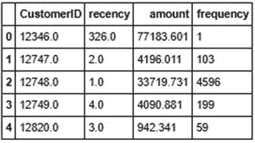

图 8-3。

Customer value dataframe

##### 数据预处理

一旦我们创建了客户价值数据框架，我们将对数据进行一些预处理。对于我们的聚类，我们将使用 K-means 聚类算法，我们在前面的章节中讨论过。算法正常运行的要求之一是变量值的平均居中。变量值的均值居中意味着我们将变量的实际值替换为标准化值，这样变量的均值为 1，方差为 0。这确保了所有变量都在相同的范围内，并且值范围的差异不会导致算法性能不佳。这类似于特征缩放。

你可以研究的另一个问题是每个变量取值的巨大范围。这个问题对于货币量变量来说尤其明显。为了解决这个问题，我们将转换对数标度上的所有变量。这种转换以及标准化将确保我们算法的输入是一组同质的缩放和转换值。

关于数据预处理步骤的重要一点是，有时我们需要它是可逆的。在我们的例子中，我们将得到经过对数变换和缩放的变量的聚类结果。但是为了根据原始数据进行推断，我们需要对所有变量进行反向转换，这样我们就能得到实际的 RFM 数据。这可以通过使用 Python 的预处理功能来完成。

```py
In [30]: from sklearn import preprocessing
    ...: import math
    ...: customer_history_df['recency_log'] = customer_history_df['recency'].apply(math.log)
    ...: customer_history_df['frequency_log'] = customer_history_df['frequency'].apply(math.log)
    ...: customer_history_df['amount_log'] = customer_history_df['amount'].apply(math.log)
    ...: feature_vector = ['amount_log', 'recency_log','frequency_log']
    ...: X = customer_history_df[feature_vector].as_matrix()
    ...: scaler = preprocessing.StandardScaler().fit(X)
    ...: X_scaled = scaler.transform(X)

```

前面的代码片段将创建我们数据集的对数值和均值中心版本。我们可以通过检查具有最大范围值的变量来可视化预处理的结果。下面的代码片段将帮助我们对此进行可视化。

```py
In [31]: x = customer_history_df.amount_log
    ...: n, bins, patches = plt.hist(x, 1000, facecolor='green', alpha=0.75)
    ...: plt.xlabel('Log of Sales Amount')
    ...: plt.ylabel('Probability')
    ...: plt.title(r'$\mathrm{Histogram\ of\ Log\ transformed\ Customer\ Monetary\ value}\ $')
    ...: plt.grid(True)
    ...: plt.show()

```

结果图是一个类似正态分布的分布，平均值为 0，方差为 1，如图 [8-4](#Fig4) 所示。

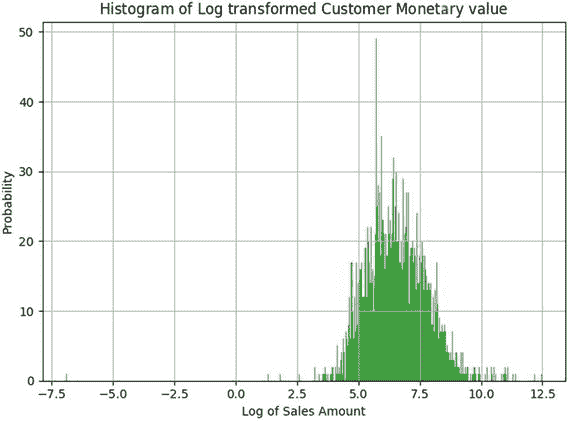

图 8-4。

Scaled and log transformed sales amount

让我们尝试将我们的三个主要特征(R、F 和 M)可视化在一个三维图上，看看我们是否能够理解数据分布显示的任何有趣的模式。

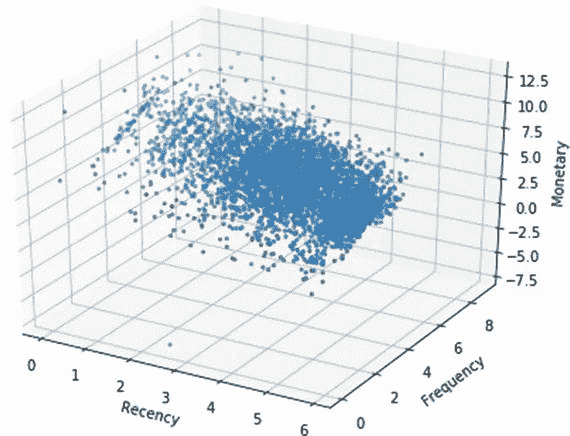

图 8-5。

Customer value dataframe

```py
from mpl_toolkits.mplot3d import Axes3D

fig = plt.figure(figsize=(8, 6))
ax = fig.add_subplot(111, projection='3d')

xs =customer_history_df.recency_log
ys = customer_history_df.frequency_log
zs = customer_history_df.amount_log
ax.scatter(xs, ys, zs, s=5)

ax.set_xlabel('Recency')
ax.set_ylabel('Frequency')
ax.set_zlabel('Monetary')

```

从图 [8-5](#Fig5) 中我们可以看到的明显模式是，根据货币价值的增加趋势，以更高频率和更近时间购买的人倾向于花费更多，频率和近时间分别有相应的增加和减少趋势。你注意到其他有趣的模式了吗？

##### 细分市场聚类

我们将使用 K-means 聚类算法来找出聚类(或数据中的片段)。这是我们可以采用的最简单的聚类算法之一，因此在实践中被广泛使用。在我们继续使用该算法在我们的数据中查找片段之前，我们将向您简要介绍该算法。

###### k 均值聚类

K-means 聚类属于基于分区\基于质心的聚类算法家族。用于划分数据的 K-means 算法中发生的步骤如下所示:

1.  该算法从所需数量的中心的随机点初始化开始。K-means 中的“K”代表簇的数目。
2.  在下一步中，每个数据点被分配到离它最近的中心。K-means 聚类中使用的距离度量是正常欧几里德距离。
3.  一旦分配了数据点，就通过平均属于该聚类的点的维度来重新计算中心。
4.  对新的中心重复这个过程，直到我们到达一个分配变得稳定的点。在这种情况下，算法终止。

我们将在 [`http://scikit-learn.org/stable/auto_examples/cluster/plot_kmeans_silhouette_analysis.html`](http://scikit-learn.org/stable/auto_examples/cluster/plot_kmeans_silhouette_analysis.html) 修改`scikit-learn`文档中给出的代码，并在我们的聚类过程中使用剪影分数找出最佳的聚类数。我们把它作为一个练习，让你修改代码并创建图 [8-6](#Fig6) 中的可视化。我们鼓励您修改文档中的代码，以便不仅构建可视化，而且在字典中捕获每个聚类的中心和轮廓得分，因为我们需要参考这些来执行我们对所获得的客户群的分析。当然，如果你觉得难以理解，你可以参考`Customer Segmentation.ipynb`笔记本中的详细代码片段。

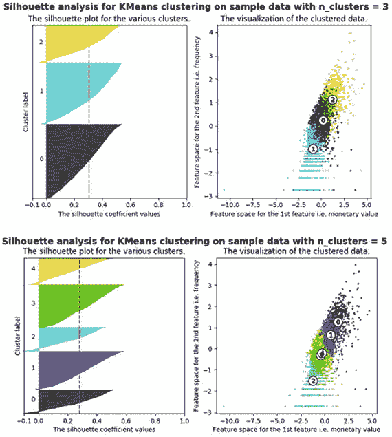

图 8-6。

Silhouette analysis with three and five clusters

在图 [8-6](#Fig6) 中描绘的可视化中，我们绘制了每个聚类的轮廓分数以及发现的每个聚类的中心。我们将在下一节的聚类分析中使用这些信息。虽然我们必须记住，在一些情况和场景下，有时我们可能不得不放弃算法给出的数学解释，并查看所获得结果的业务相关性。

##### 聚类分析

在我们继续分析这样获得的聚类之前，让我们看看在将它们从对数和缩放版本重新转换为正常值之后的聚类中心值。以下代码帮助我们将中心值转换为反向转换值。

```py
In [38]: for i in range(3,6,2):
    ...:     print("for {} number of clusters".format(i))
    ...:     cent_transformed = scaler.inverse_transform(cluster_centers[i]['cluster_center'])
    ...:     print(pd.DataFrame(np.exp(cent_transformed),columns=feature_vector))
    ...:     print("Silhouette score for cluster {} is {}". format(i,
                                                    cluster_centers[i]['silhouette_score']))
    ...:     print()

for 3 number of clusters
    amount_log  recency_log  frequency_log
0   843.937271    44.083222      53.920633
1   221.236034   121.766072      10.668661
2  3159.294272     7.196647     177.789098
Silhouette score for cluster 3 is 0.30437444714898737

for 5 number of clusters
    amount_log  recency_log  frequency_log
0  3905.544371     5.627973     214.465989
1  1502.519606    46.880212      92.306262
2   142.867249   126.546751       5.147370
3   408.235418   139.056216      25.530424
4   464.371885    13.386419      29.581298
Silhouette score for cluster 5 is 0.27958641427323727

```

当我们查看聚类过程的结果时，我们可以推断出一些有趣的见解。考虑三集群配置，并尝试理解以下观点。

*   我们得到三个客户货币价值差异明显的集群。
*   集群 2 是经常购物的高价值客户的集群，当然是每个企业的重要部分。
*   以类似的方式，我们获得了在标签分别为 1 和 0 的集群中具有低和中等花费的客户群。
*   根据我们在图 [8-3](#Fig3) 中谈到的趋势(高货币-低最近-高频率)，频率和最近与货币价值完美相关。

五集群配置结果更让人惊喜！当我们寻找更多细分市场时，我们发现我们的高价值客户群由两个子群体组成:

*   经常购物且金额较高的人群(以聚类 0 为代表)。
*   那些有可观支出但不经常消费的人(由集群 1 表示)。

这与我们从轮廓得分矩阵获得的结果直接冲突，该结果表明五个聚类段不如三个聚类段最优。当然，记住你不能总是严格地追求数学指标，也要考虑业务方面。除此之外，当您基于这些细分可视化数据时，可能会发现更多的见解，这可能会证明实际上三聚类细分要好得多。例如，如果您查看图 [8-6](#Fig6) 中的右侧图，您可以看到与具有三个集群的段相比，具有五个集群的段之间有太多的重叠。

###### 集群描述

在观察聚类中心的基础上，我们可以计算出我们在根据新近性、数量和频率定义的细分市场中的客户价值有很大差异。为了进一步深入这一点并找出这些差异的质量，我们可以用相应的集群标签来标记我们的数据，然后可视化这些差异。我们将为可能是最重要的客户价值指标之一——总销售额——进行可视化。

为了实现这种基于区别的汇总计算，我们将首先用聚类算法返回的相应标签来标记客户汇总数据帧中的每个数据行。注意，如果您想尝试不同的配置，比如两个或四个集群，您必须修改您正在使用的代码。我们必须进行更改，以便为每个不同的集群配置捕获标签。我们鼓励您尝试其他集群配置，看看是否能获得更好的分段！下面的代码将提取聚类标签，并将其附加到我们的客户摘要数据帧中。

```py
labels = cluster_centers[5]['labels']
customer_history_df['num_cluster5_labels'] = labels
labels = cluster_centers[3]['labels']
customer_history_df['num_cluster3_labels'] = labels

```

一旦我们将标签分配给每个客户，我们的任务就简单了。现在，我们想知道每个组中的客户汇总是如何变化的。如果我们能够将这些信息可视化，我们就能够找出客户群中的差异，并根据这些差异修改我们的策略。到目前为止，我们已经使用了大量的`matplotlib`和`seaborn`；我们将在本节中使用`plotly`来创造一些互动的情节，你可以在你的 jupyter 笔记本中随意摆弄！

Note

虽然`plotly`在 jupyter 笔记本中提供了出色的交互式可视化，但您可能会遇到一些笔记本渲染问题，当您打开笔记本时，这些问题会弹出来。要解决这个问题，运行`conda update nbformat`命令升级你的`nbformat`库，然后重新打开笔记本。问题应该会消失。

下面的代码利用了`plotly`,并将采用我们为五个集群的配置获得的集群标签，并创建箱线图来显示五个组中的中值、最小值、最大值、最高值和最小值是如何变化的。请注意，我们希望避免每个组极高的异常值，因为它们会干扰对每个聚类中心趋势的良好观察(由于噪声)。因此，我们将对数据进行限制，只使用少于 0.8 个百分点的数据点。这将为我们提供关于该集群部分中大多数用户的良好信息。下面的代码将帮助我们创建总销售额的图表。

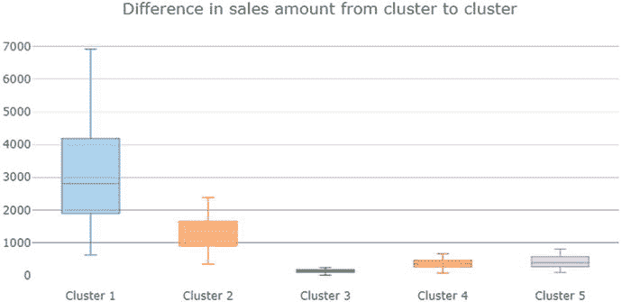

图 8-7。

Difference in sales amount values across the five segments

```py
import plotly as py
import plotly.graph_objs as go
py.offline.init_notebook_mode()

x_data = ['Cluster 1','Cluster 2','Cluster 3','Cluster 4', 'Cluster 5']
cutoff_quantile = 80
field_to_plot = 'amount'

y0=customer_history_df[customer_history_df['num_cluster5_labels']==0][field_to_plot].values
y0 = y0[y0<np.percentile(y0, cutoff_quantile)]
y1=customer_history_df[customer_history_df['num_cluster5_labels']==1][field_to_plot].values
y1 = y1[y1<np.percentile(y1, cutoff_quantile)]
y2=customer_history_df[customer_history_df['num_cluster5_labels']==2][field_to_plot].values
y2 = y2[y2<np.percentile(y2, cutoff_quantile)]
y3=customer_history_df[customer_history_df['num_cluster5_labels']==3][field_to_plot].values
y3 = y3[y3<np.percentile(y3, cutoff_quantile)]
y4=customer_history_df[customer_history_df['num_cluster5_labels']==4][field_to_plot].values
y4 = y4[y4<np.percentile(y4, cutoff_quantile)]
y_data = [y0,y1,y2,y3,y4]

colors = ['rgba(93, 164, 214, 0.5)', 'rgba(255, 144, 14, 0.5)', 'rgba(44, 160, 101, 0.5)', 'rgba(255, 65, 54, 0.5)', 'rgba(207, 114, 255, 0.5)', 'rgba(127, 96, 0, 0.5)']
traces = []

for xd, yd, cls in zip(x_data, y_data, colors):
        traces.append(go.Box(
            y=yd,      name=xd,     boxpoints=False,
            jitter=0.5,      whiskerwidth=0.2,
            fillcolor=cls,       marker=dict(size=2,),
            line=dict(width=1), ))

layout = go.Layout(

    title='Difference in sales {} from cluster to cluster'.format(field_to_plot),
    yaxis=dict(
        autorange=True,        showgrid=True,
        zeroline=True,        dtick=1000,
        gridcolor='black',        gridwidth=0.1,
        zerolinecolor='rgb(255, 255, 255)',
        zerolinewidth=2,    ),
    margin=dict(l=40,r=30, b=80, t=100,    ),
    paper_bgcolor='white',    plot_bgcolor='white',  showlegend=False
)

fig = go.Figure(data=traces, layout=layout)
py.offline.iplot(fig)

```

让我们来看看这个代码片段所生成的图。在图 [8-7](#Fig7) 中，我们可以看到集群 1 和集群 2 的平均销售额较高，因此是最高的消费者。虽然我们看不到分类 4 和分类 5 的销售额有多大差异，但我们确实看到分类 3 的销售额明显较小。这给了我们一个提示，我们可以将簇 4 和簇 5 的候选合并在一起，至少在销售额的基础上。您可以绘制相似的新近性和频率图，也可以根据这些值计算出聚类中的差异。笔记本中提供了基于三个和五个集群的细分市场的详细代码和可视化效果。Plotly 使我们能够与图形交互，以查看笔记本中每个箱线图的中心趋势值。我们展示了基于三集群配置的三个细分市场的销售额差异，以便您可以与图 [8-7](#Fig7) 进行比较。

图 [8-8](#Fig8) 显示了详细的可视化效果，其中讨论了三个细分市场的销售\收入差异。很明显，与图 [8-7](#Fig7) 中集群 4 和集群 5 非常相似的情况相比，这更容易区分，重叠也更少。这并不意味着以前的方法是错误的；这只是某些部分彼此相似的维度之一。

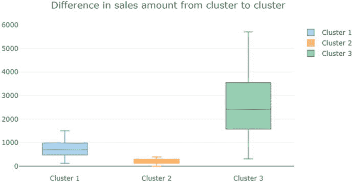

图 8-8。

Difference in sales amount values across the three segments

我们可以通过向已创建的数据集添加相关要素来进一步提高聚类的质量。通常，企业会从外部数据供应商那里购买有关其客户的数据，并使用这些数据来增强细分过程。我们的限制是只有大约一年的交易数据，但即使是中等规模的组织也可能有多年的交易数据，这可以改善结果。要探索的另一个方面是尝试不同的算法来执行分段，例如层次聚类，这是我们在前面的一些章节中探索过的。一个好的细分过程将包含所有这些途径，以达到提供有价值的洞察力的最佳细分。我们鼓励你在这个过程中发挥创造力，建立你自己的例子。

该分析的重要警告是，当涉及到将结果的实际值与数学度量相关联时，我们不能总是依赖于度量。我们需要在我们的建模过程中包含业务度量和领域洞察力的习惯，因为这常常成为实现高价值项目和被遗忘的以数据为中心的解决方案之间的差异。一旦我们获得这些结果，我们就可以与组织的营销团队进一步讨论它们，为每个确定的细分市场提出适当的做法。

## 交叉销售

什么是交叉销售？简而言之，交叉销售是通过分析客户的购物趋势以及与客户购物模式相同的一般购物趋势和模式，向客户销售更多产品的能力。这个简单的定义抓住了交叉销售的基本思想，但它并不像我们希望的那样具有描述性。

我们将用一个例子来说明这个想法。假设我们担心自己的健康(每个人都应该如此)，并决定在我们最喜欢的电子商务网站上购买一种蛋白质补充剂。在大多数情况下，当你进入你的产品页面时，你会有一个部分告诉你除了你选择的产品之外你还可以购买的其他产品。参见图 [8-9](#Fig9) 。

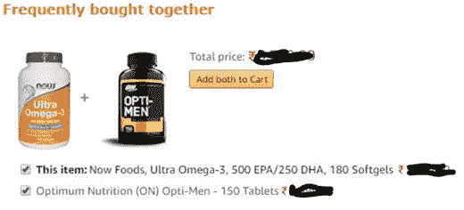

图 8-9。

Cross selling example

通常情况下，这些推荐的产品会非常有吸引力。例如，如果我在市场上购买蛋白质补充剂，那么对我来说购买维生素补充剂肯定是个好主意。零售商通常会向你提供一些有吸引力的捆绑产品，很有可能我们最终会购买捆绑产品，而不仅仅是原始商品。这是交叉销售的简单而强大的概念。我们研究客户交易，找出客户原始需求的潜在补充，并作为建议提供给客户，希望他们购买这些产品，从而使客户和零售机构都受益。

交叉销售在网上和网下零售领域都无处不在。这个想法的简单性和有效性使它成为所有类型零售商的一个重要而强大的营销工具。交叉销售的理念可以扩展到任何组织，不管它是在线还是离线零售商，也不管它是向整体销售商的最终用户销售产品。

在本节中，我们将探索关联规则挖掘，这是一种可用于交叉销售的强大技术，然后我们将说明玩具数据集的购物篮分析概念，最后我们将同样的概念应用于零售交易数据集。

### 基于关联规则挖掘的购物篮分析

在我们继续理解如何从我们的事务数据中生成关联规则之前，让我们试着理解我们将如何使用这些规则。数据分析界的一个著名故事是“啤酒和尿布”的故事。故事的基本关键是这样一个概念:一家大型零售商在分析他们的客户交易行为时发现啤酒和尿布的销售之间有很强的关联。该零售商能够利用这种联系，将啤酒区移近尿布区，从而提高销量(故事的起源可能有一定的事实依据，但整个概念仍有争议。我们鼓励您通过 [`http://www.dssresources.com/newsletters/66.php`](http://www.dssresources.com/newsletters/66.php) 的讨论来了解更多关于这个故事的信息。

虽然啤酒和尿布的故事可能是也可能不是一个神话，但在顾客行为中找到销售关联的概念是一个重要的和鼓舞人心的概念。假设我们可以用数学方法捕捉到这些关联的重要性，那么尝试利用那些可能是正确的规则将是一个好主意。关联规则挖掘的整个概念是基于这样一个概念，即客户购买行为具有一种模式，可以利用这种模式在将来向客户销售更多的商品。关联规则通常具有如下等式所示的结构:

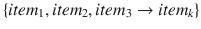

这个规则可以以一种显而易见的方式来理解，即当顾客购买了规则的(左手边)LHS 上的商品时，他可能会购买商品 <sub>k</sub> 。在后面的章节中，我们将定义数学指标来捕捉这些规则的强度。

我们可以以多种方式使用这些规则。使用这些规则最显而易见的方法是开发产品捆绑包，方便顾客一起购买这些产品。使用这些规则的另一种方法是将产品与捆绑包中其他相关产品的折扣捆绑在一起，从而确保客户更有可能购买更多的商品。使用关联规则的一些不太可能的方法是用于设计更好的网站导航结构、入侵检测、生物信息学等等。

### 关联规则挖掘基础

在继续研究数据集中的关联规则之前，我们将了解一些关联规则挖掘的基本概念。这些术语和概念将帮助您进行后面的分析，并帮助您理解算法将生成的规则。考虑带有一些玩具交易数据的表 [8-1](#Tab1) 。

表 8-1。

Example of a Transaction Set

<colgroup><col> <col></colgroup> 
| Trans.ID | 项目 |
| --- | --- |
| one | `{milk, bread}` |
| Two | `{butter}` |
| three | `{beer, diaper}` |
| four | `{milk, bread, butter}` |
| five | `{bread}` |

表中的每一行都由一个事务组成。例如，客户在第一笔交易中购买了牛奶和面包。以下是一些与关联规则挖掘相关的重要概念。

*   项目集:项目集只是一个事务中一起出现的一个或多个项目的集合。例如，这里的`{milk, bread}`是一个项目集的例子。
*   Support: Support is defined as number of times an itemset appears in the dataset. Mathematically it is defined as:

    

    In the previous example, `support (beer, diaper) = 1/5 = 0.2`.
*   Confidence: Confidence is a measure of the times the number of times a rule is found to exist in the dataset. For a rule which states  the confidence is mathematically definedas:

    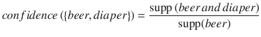

*   Lift: Lift of the rule is defined as the ratio of observed support to the support expected in the case the elements of the rule were independent. For the previous set of transactions if the rule is defined as 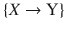, then the lift of the rule is defined as:

    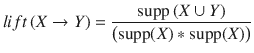

*   频繁项集:频繁项集是支持度大于用户定义的支持度阈值的项集。

#### FP 增长

关联规则挖掘最著名的算法是 Apriori 算法，您可以在网上和标准数据挖掘文献中找到大量的代码和资源。然而，这里我们将使用一个不同的和更有效的算法，FP 增长算法来寻找我们的关联规则。任何关联规则挖掘算法的主要瓶颈是频繁项集的生成。如果事务数据集有 k 个唯一的产品，那么我们可能有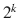个可能的项目集。Apriori 算法将首先生成这些项集，然后继续寻找频繁项集。

这个限制是一个巨大的性能瓶颈，因为即使对于大约 100 个不同的产品，项目集的可能数量也是巨大的。这种限制使得 Apriori 算法在计算上极其昂贵。FP 增长算法优于 Apriori 算法，因为它不需要生成所有的候选项集。该算法使用特殊的数据结构来帮助它保留项集关联信息。数据结构的示例如图 [8-10](#Fig10) 所示。

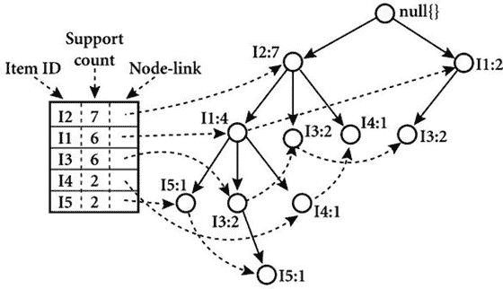

图 8-10。

An example of an FP-tree

在这里，我们不会对该算法进行详细的数学描述，因为我们的目的不是让这一部分的数学变得沉重，而是专注于如何利用它来发现这些数据中的模式。然而，我们将简要地解释它，以便你能理解这种方法的核心概念。FP 增长算法使用分治策略，并利用一种称为 FP-tree 的特殊数据结构，如图 [8-10](#Fig10) 所示，在不生成所有项目集的情况下找到频繁项目集。该算法的核心步骤如下:

1.  接受事务数据库并创建一个 FP-tree 结构来表示频繁项集。
2.  将该压缩表示划分成多个条件数据集，使得每个数据集与一个频繁模式相关联。
3.  在每个这样的数据集中挖掘模式，以便较短的模式可以递归地连接到较长的模式，从而提高效率。

如果你有兴趣了解一下，可以参考 [`https://en.wikibooks.org/wiki/Data_Mining_Algorithms_In_R/Frequent_Pattern_Mining/The_FP-Growth_Algorithm`](https://en.wikibooks.org/wiki/Data_Mining_Algorithms_In_R/Frequent_Pattern_Mining/The_FP-Growth_Algorithm) 的 Wikibooks 链接，里面详细谈到了 FP 的增长和 FP 树的结构。

### 关联规则挖掘在实践中

我们将使用著名的杂货店数据集来说明关联规则挖掘。默认情况下，数据集在 R 语言的基础包中可用。要在 Python 中使用，你可以从 [`https://github.com/stedy/Machine-Learning-with-R-datasets/blob/master/groceries.csv`](https://github.com/stedy/Machine-Learning-with-R-datasets/blob/master/groceries.csv) 或者甚至从本章开始提到的我们的官方 GitHub 库中获得它。该数据集由来自一家杂货零售商的交易集合组成。我们将使用这些数据作为我们分析的基础，并使用这些数据构建我们的规则挖掘工作流。

一旦我们掌握了对食品杂货数据集进行关联规则挖掘的基础知识，我们将把它作为一个练习，让您将我们在客户细分部分中使用的相同概念应用到我们的交易数据集。记得在开始之前加载以下依赖项。

```py
import csv
import pandas as pd
import matplotlib.pyplot as plt
import Orange
from Orange.data import Domain, DiscreteVariable, ContinuousVariable
from orangecontrib.associate.fpgrowth import *

%matplotlib inline

```

查看“挖掘规则”部分，了解如何安装`Orange`框架依赖项的详细信息。该部分的代码可在`Cross Selling.ipynb`笔记本中找到。

#### 探索性数据分析

我们前面提到的杂货店数据集是这样安排的，数据集中出现的每一行都是一个事务。每行中给出的项目以逗号分隔，并且是该特定事务中的项目。看看图 [8-11](#Fig11) 中描述的数据集的前几行。

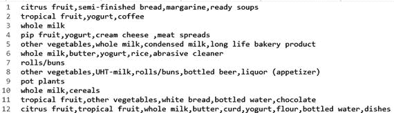

图 8-11。

Grocery dataset transactions

我们从该数据集得出的第一个观察结果是，它不是以一种完全结构化、易于分析的格式提供的。这个限制意味着我们要做的第一件事是编写自定义代码，将原始文件转换成我们可以使用的数据结构。由于到目前为止我们已经使用`pandas`数据框架完成了大部分分析，我们将把该数据转换成类似的数据结构。下面的代码片段将为我们执行转换。

```py
grocery_items = set()
with open("grocery_dataset.txt") as f:
    reader = csv.reader(f, delimiter=",")
    for i, line in enumerate(reader):
        grocery_items.update(line)
output_list = list()
with open("grocery_dataset.txt") as f:
    reader = csv.reader(f, delimiter=",")
    for i, line in enumerate(reader):
        row_val = {item:0 for item in grocery_items}
        row_val.update({item:1 for item in line})
        output_list.append(row_val)

grocery_df = pd.DataFrame(output_list)

In [3]: grocery_df.shape
Out[3]: (9835, 169)

```

这种转换为我们提供了一个维度为(`num_transaction`，`total_items`)的数据框架，其中每个交易行都有对应于其组成项目的列，即 1。例如，对于图 [8-11](#Fig11) 中的第 3 行，我们将把`whole milk`列设为 1，其余列都为 0。尽管这种数据结构是稀疏的，这意味着它有许多零，但是我们提取关联规则的框架将处理这种稀疏性。

在我们继续在数据集上构建关联规则之前，我们将探索数据集的一些显著特征。我们已经知道，数据集中总共有 9，835 个事务和 169 个条目。但是数据集中出现的前 10 项是什么，它们占总销售额的多少。我们可以绘制一个简单的直方图来帮助我们提取这些信息。

```py
In [4]: total_item_count = sum(grocery_df.sum())
   ...: print(total_item_count)
   ...: item_summary_df = grocery_df.sum().sort_values(ascending = False).reset
   ...: _index().head(n=20)
   ...: item_summary_df.rename(columns={item_summary_df.columns[0]:'item_name',
   ...: item_summary_df.columns[1]:'item_count'}, inplace=True)
   ...: item_summary_df.head()
43367
Out[4]:
          item_name  item_count
0        whole milk        2513
1  other vegetables        1903
2        rolls/buns        1809
3              soda        1715
4            yogurt        1372

```

为了创建直方图，我们将使用前面的代码创建一个汇总数据帧。这告诉我们，在所有这些交易中，我们总共有 43，000 多件商品，我们还看到了销量最高的五件商品。让我们用这个数据框来画出最畅销的 20 种商品。下面的代码片段将帮助我们创建所需的条形图。

```py
objects = (list(item_summary_df['item_name'].head(n=20)))
y_pos = np.arange(len(objects))
performance = list(item_summary_df['item_count'].head(n=20))
plt.bar(y_pos, performance, align='center', alpha=0.5)
plt.xticks(y_pos, objects, rotation='vertical')
plt.ylabel('Item count')
plt.title('Item sales distribution')

```

描述商品销售的条形图如图 [8-12](#Fig12) 所示。这表明，仅这 20 件物品就在所有物品中占了惊人的大部分。

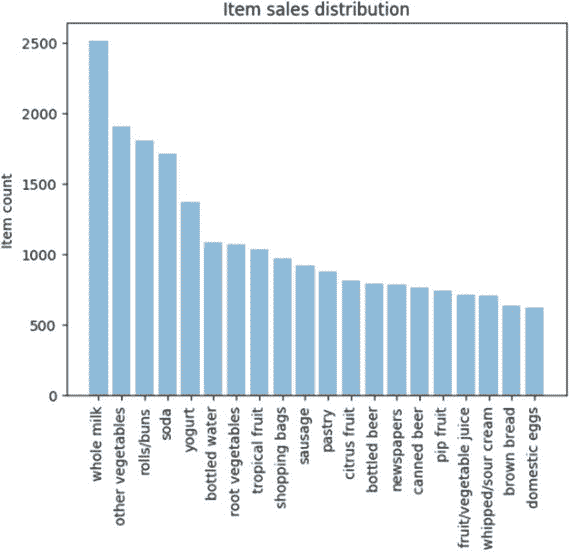

图 8-12。

Grocery dataset top 20 items based on sales

我们也来看看这 20 个项目单独解释了总销售额的多少百分比。我们将使用`pandas` ( `cumsum`)提供的累积和函数来找出答案。我们将在数据框架中创建两列。一个将告诉多少百分比的总销售额可以归因于一个特定的项目，另一个将保持这个销售百分比的累计和。

```py
item_summary_df['item_perc'] = item_summary_df['item_count']/total_item_count
item_summary_df['total_perc'] = item_summary_df.item_perc.cumsum()
item_summary_df.head(10)

          item_name  item_count  item_perc  total_perc
0        whole milk        2513   0.057947    0.057947
1  other vegetables        1903   0.043881    0.101829
2        rolls/buns        1809   0.041714    0.143542
3              soda        1715   0.039546    0.183089
4            yogurt        1372   0.031637    0.214725

In [12]: item_summary_df[item_summary_df.total_perc <= 0.5].shape
Out[12]: (19, 4)

```

这向我们展示了前五种商品占整个销售额的 21.4%，只有前 20 种商品占销售额的 50%以上！这对我们来说很重要，因为我们不想为很少购买的商品找到关联规则。有了这些信息，我们可以限制创建关联规则时要探索的项目。这也有助于我们将可能的项目集数量保持在一个可管理的数字。

#### 挖掘规则

我们将使用`Orange`和`Orange3-Associate`框架，它们可以使用命令`conda install orange3`和`pip install orange3-associate.`来安装。`orange3-associate`包包含由开发`Orange`数据挖掘包的小组提供的 FP 增长的实现，该小组是斯洛文尼亚卢布尔雅那大学生物信息学实验室( [`https://fri.uni-lj.si/en/laboratory/biolab`](https://fri.uni-lj.si/en/laboratory/biolab) )。

Note

我们鼓励您试用`Orange`套餐，该套餐在 [`https://orange.biolab.si/`](https://orange.biolab.si/) 有售。这是一个用 Python 编写的 GUI 驱动的数据挖掘框架，非常有助于以交互方式学习数据分析。

在我们继续使用这个包寻找关联规则之前，我们将讨论数据在`Orange`库中的表示方式。数据表示有点复杂，但我们将帮助您将现有数据修改成`Orange`要求的格式。首先，我们将关注如何将我们的`pandas`数据帧转换成`Orange Table`数据结构。

##### 橙色表数据结构

`Table`数据结构是在`Orange`中表示任何表格数据的主要方式。尽管它在某种程度上类似于`numpy`数组或`pandas`数据帧，但它存储关于实际数据的元数据的方式与它们不同。在我们的例子中，通过提供关于列的元数据，我们可以很容易地将我们的`pandas`数据帧转换成`Table`数据结构。我们需要为每个变量定义定义域。域意味着我们的每个变量可以使用的可能的值集。这些信息将被存储为元数据，并将在以后的数据转换中使用。由于我们的列只有二进制值—即 0 或 1—我们可以通过使用这些信息轻松地创建域。下面的代码片段帮助我们将 dataframe 转换成一个`Orange`表。

```py
from Orange.data import Domain, DiscreteVariable, ContinuousVariable
from orangecontrib.associate.fpgrowth import *

input_assoc_rules = grocery_df
domain_grocery = Domain([DiscreteVariable.make(name=item, values=['0', '1']) for item in
                                                                    input_assoc_rules.columns])
data_gro_1 = Orange.data.Table.from_numpy(domain=domain_grocery,  
                                         X=input_assoc_rules.as_matrix(),Y= None)

```

这里，我们通过将每个变量指定为值为`(0, 1`的`DiscreteVariable`来定义数据的域。然后使用这个域，我们为数据创建了我们的`Table`结构。

##### 使用 FP 增长算法

现在我们有了执行规则挖掘所需的所有部分。但是在继续之前，我们想关注分析的一个更重要的方面。在前面的部分中，我们看到了只有少数几件商品对我们的大部分销售负责，因此我们希望删减数据集以反映这一信息。为此，我们创建了一个函数`prune_dataset`(查看笔记本)，它将根据我们的需求帮助我们减少数据集的大小。该函数可用于执行两种类型的修剪:

*   基于总销售额百分比的修剪:参数`total_sales_perc`将帮助我们选择解释所需销售额百分比的项目数量。默认值为 50%或 0.5。
*   基于项目等级的修剪:执行修剪的另一种方式是指定我们想要修剪数据集的项目的开始和结束等级。

默认情况下，我们将只寻找至少有两个项目的事务，因为只有一个项目的事务与关联规则挖掘的整个概念相违背。下面的代码片段将帮助我们通过使用剪枝函数，只选择解释总销售额 40%的数据子集。

```py
output_df, item_counts = prune_dataset(input_df=grocery_df, length_trans=2,total_sales_perc=0.4)
print(output_df.shape)
print(list(output_df.columns))

(4585, 13)
['whole milk', 'other vegetables', 'rolls/buns', 'soda', 'yogurt', 'bottled water', 'root vegetables', 'tropical fruit', 'shopping bags', 'sausage', 'pastry', 'citrus fruit', 'bottled beer']

```

因此，我们发现只有 13 个项目负责 40%的销售额，4585 笔交易中有这些项目和其他项目，我们还可以看到这些项目是什么。下一步是将选择的数据转换成所需的`Table`数据结构。

```py
input_assoc_rules = output_df
domain_grocery = Domain([DiscreteVariable.make(name=item,values=['0', '1']) for item in  
                                                                     input_assoc_rules.columns])
data_gro_1 = Orange.data.Table.from_numpy(domain=domain_grocery,     
                                         X=input_assoc_rules.as_matrix(), Y= None)
data_gro_1_en, mapping = OneHot.encode(data_gro_1, include_class=False)

```

前面代码的新增加部分是最后一行。这是对我们的输入进行编码所需要的，这样整个域就可以用二进制变量来表示。这将完成我们的规则挖掘所需的所有解析和数据操作。唷！

最后一步是创建我们的规则。我们需要指定两条信息来生成我们的规则:支持和信心。我们已经在前面从概念上定义了它们，所以我们不会再定义它们。一条重要的信息是从较高的支持度开始，因为较低的支持度意味着较高数量的频繁项集，因此执行时间较长。我们将指定 0.01 的最小支持度—至少 45 个事务—并在指定置信度和生成规则之前查看我们得到的频繁项集的数量。

```py
min_support = 0.01
print("num of required transactions = ", int(input_assoc_rules.shape[0]*min_support))
num_trans = input_assoc_rules.shape[0]*min_support
itemsets = dict(frequent_itemsets(data_gro_1_en, min_support=min_support))
num of required transactions =  45

In [25]: len(itemsets)
Out[25]: 166886

```

所以我们得到了 166，886 个项目集，而支持度只有 1%！如果我们降低支持度或者增加数据集中的项目数量，这将呈指数增长。下一步是指定一个置信度值并生成我们的规则。我们已经编写了一个代码片段，它将接受一个置信度值，并生成满足我们指定的支持和置信度标准的规则。然后使用映射和变量名对生成的规则进行解码。`Orange3-` `Associate`还提供了一个帮助函数，可以帮助我们提取每条规则的指标。下面的代码片段将执行规则生成和规则解码，然后将其全部编译成一个简洁的数据帧，我们可以使用它来进行进一步的分析。

```py
confidence = 0.3
rules_df = pd.DataFrame()

if len(itemsets) < 1000000:
    rules = [(P, Q, supp, conf)
    for P, Q, supp, conf in association_rules(itemsets, confidence)
       if len(Q) == 1 ]

    names = {item: '{}={}'.format(var.name, val)
        for item, var, val in OneHot.decode(mapping, data_gro_1, mapping)}
    eligible_ante = [v for k,v in names.items() if v.endswith("1")]
    N = input_assoc_rules.shape[0] * 0.5
    rule_stats = list(rules_stats(rules, itemsets, N))
    rule_list_df = []
    for ex_rule_frm_rule_stat in rule_stats:
        ante = ex_rule_frm_rule_stat[0]            
        cons = ex_rule_frm_rule_stat[1]
        named_cons = names[next(iter(cons))]
        if named_cons in eligible_ante:
            rule_lhs = [names[i][:-2] for i in ante if names[i] in eligible_ante]
            ante_rule = ', '.join(rule_lhs)
            if ante_rule and len(rule_lhs)>1 :
                rule_dict = {'support' : ex_rule_frm_rule_stat[2],
                             'confidence' : ex_rule_frm_rule_stat[3],
                             'coverage' : ex_rule_frm_rule_stat[4],
                             'strength' : ex_rule_frm_rule_stat[5],
                             'lift' : ex_rule_frm_rule_stat[6],
                             'leverage' : ex_rule_frm_rule_stat[7],
                             'antecedent': ante_rule,
                             'consequent':named_cons[:-2] }
                rule_list_df.append(rule_dict)
    rules_df = pd.DataFrame(rule_list_df)
    print("Raw rules data frame of {} rules generated".format(rules_df.shape[0]))
    if not rules_df.empty:
        pruned_rules_df = rules_df.groupby(['antecedent','consequent']).max().reset_index()
    else:
        print("Unable to generate any rule")

Raw rules data frame of 16628 rules generated

```

这个代码片段的输出由我们可以用于分析的关联规则数据帧组成。您可以使用项目编号、结果、前提、支持和置信度值来生成不同的规则。让我们来看一些使用交易生成的示例规则，这些规则解释了总销售额的 40%，1%的最小支持度(所需的交易数> =45)，以及大于 30%的置信度。这里，我们通过使用下面的代码，收集了对于可能是结果(出现在右侧)的每个项目具有最大提升的规则。

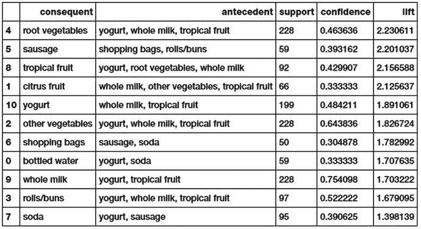

图 8-13。

Association rules on the grocery dataset

```py
(pruned_rules_df[['antecedent','consequent',
                  'support','confidence','lift']].groupby('consequent')
                                                 .max()
                                                 .reset_index()
                                                 .sort_values(['lift', 'support','confidence'],
                                                              ascending=False))

```

让我们解释一下第一条规则，它规定:

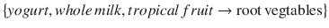

该规则在等式中陈述的模式很容易理解——购买酸奶、全脂牛奶和热带水果的人也倾向于购买块根类蔬菜。让我们试着理解这些指标。支持的规则是 228，这意味着所有的项目一起出现在数据集中的 228 个事务中。该规则的置信度为 46%，这意味着在 46%的情况下，先前的项目发生时，我们在交易中也有结果(即 46%的情况下，购买左侧项目的客户也购买了块根蔬菜)。图 [8-13](#Fig13) 中的另一个重要指标是升力。Lift 表示在包含酸奶、全脂牛奶和热带水果的事务中找到块根类蔬菜的概率大于在之前的事务中找到块根类蔬菜的正常概率(2.23)。通常，提升值为 1 表示前因和后果一起出现的概率彼此独立。因此，我们的想法是寻找升力远大于 1 的规则。在我们的例子中，前面提到的所有规则都是高质量的规则。

这是一条重要的信息，因为这可以促使零售商将这些特定产品捆绑在一起，或者运行一个营销计划，为购买块根蔬菜和其他三种产品提供折扣。

我们鼓励您在未来使用自己的数据集以及我们在市场细分案例研究中使用的在线零售交易数据集尝试类似的分析。考虑到来自市场细分的数据集`Online Retail`，该特定分析的工作流程将非常相似。这两个数据集之间的唯一区别是它们的表示方式。您可以利用下面的代码片段来分析该数据集中来自英国的模式。

```py
cs_mba = pd.read_excel(io=r'Online Retail.xlsx')
cs_mba_uk = cs_mba[cs_mba.Country == 'United Kingdom']
# remove returned items
cs_mba_uk = cs_mba_uk[∼(cs_mba_uk.InvoiceNo.str.contains("C") == True)]
cs_mba_uk = cs_mba_uk[∼cs_mba_uk.Quantity<0]

# create transactional database
items = list(cs_mba_uk.Description.unique())
grouped = cs_mba_uk.groupby('InvoiceNo')
transaction_level_df_uk = grouped.aggregate(lambda x: tuple(x)).reset_index()[['InvoiceNo','Description']]
transaction_dict = {item:0 for item in items}
output_dict = dict()
temp = dict()
for rec in transaction_level_df_uk.to_dict('records'):
    invoice_num = rec['InvoiceNo']
    items_list = rec['Description']
    transaction_dict = {item:0 for item in items}
    transaction_dict.update({item:1 for item in items if item in items_list})
    temp.update({invoice_num:transaction_dict})

new = [v for k,v in temp.items()]
tranasction_df = pd.DataFrame(new)
del(tranasction_df[tranasction_df.columns[0]])

```

一旦构建了事务性数据集，您就可以选择自己的配置，并基于该配置来提取和挖掘规则。例如，以下代码挖掘最小支持度为 0.01(最小交易数为 49)且最小置信度为 0.3 的前 15 个最畅销产品的模式

```py
output_df_uk_n, item_counts_n = prune_dataset(input_df=tranasction_df, length_trans=2,
                                              start_item=0, end_item=15)
input_assoc_rules = output_df_uk_n
domain_transac = Domain([DiscreteVariable.make(name=item,values=['0', '1']) for item in
                                                                   input_assoc_rules.columns])
data_tran_uk = Orange.data.Table.from_numpy(domain=domain_transac,  X=input_assoc_rules.as_matrix(),Y= None)
data_tran_uk_en, mapping = OneHot.encode(data_tran_uk, include_class=True)
support = 0.01
num_trans = input_assoc_rules.shape[0]*support
itemsets = dict(frequent_itemsets(data_tran_uk_en, support))
confidence = 0.3
rules_df = pd.DataFrame()
 ...  # rest of the code similar to what we did earlier

```

其余的分析可以使用我们用于杂货数据集的相同工作流来执行。如果你遇到困难，请随时查看`Cross Selling.ipynb`笔记本。图 [8-14](#Fig14) 显示了之前对我们的`Online Retail`数据集进行分析的一些模式。

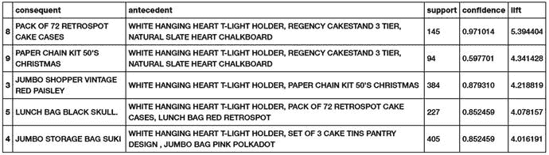

图 8-14。

Association rules on the online retail dataset for UK customers

从图 [8-14](#Fig14) 中的指标可以明显看出，这些都是优秀的质量规则。我们可以看到，与烘焙相关的物品是一起购买的，包包之类的物品也是一起购买的。尝试改变前面提到的参数，看看你是否能找到更多有趣的模式！

## 摘要

在这一章中，我们阅读了一些简单而有价值的案例研究。本章的关键是要认识到，任何基于分析或机器学习的解决方案最重要的部分是它可以为组织提供的价值。作为一名分析或数据科学专业人员，我们必须始终努力平衡我们工作的价值方面及其技术复杂性。我们学到了一些重要的方法，这些方法有可能直接促进组织和零售机构的创收。我们研究了与客户细分及其影响相关的想法，并探索了一种使用无监督学习找出客户细分并查看有趣模式和行为的新方法。交叉销售向我们介绍了模式挖掘和基于规则的框架，如关联规则挖掘和市场篮分析等原则。我们利用了一个完全不同于我们迄今为止一直使用的框架，并且理解了除常规建模和分析之外的数据解析和预处理的价值。在本书的后续章节中，我们增加了案例研究的技术复杂性，但是我们敦促您始终关注这些解决方案的价值和影响。敬请期待！