# 九、分析葡萄酒的种类和质量

在上一章中，我们看了利用无监督机器学习技术的具体案例研究，如聚类和规则挖掘框架。在这一章中，我们将重点关注更多与监督机器学习算法和预测分析相关的案例研究。我们已经在第 7 章[中研究了基于分类的问题，在那里我们基于文本评论建立了情感分类器来预测电影评论的情感。在这一章中，手头的问题是使用物理化学属性来分析、建模和预测葡萄酒的类型和质量。葡萄酒是一种美味的酒精饮料，受到全球数百万人的喜爱。事实上，我们中的许多人喜欢庆祝我们的成就，甚至在辛苦的一天结束时喝杯酒放松一下！弗朗西斯·培根的下面这段话应该会激起你对葡萄酒及其重要性的兴趣。](07.html)

> ["Age is best at four things: burning old wood, drinking old wine, trusting old friends and reading old writers." -Francis Bacon](07.html)

无论你是否喜欢和消费葡萄酒，分析葡萄酒的理化属性，了解它们与葡萄酒质量和类型的关系和意义，肯定会很有趣。由于我们将试图预测葡萄酒的类型和质量，这里涉及的监督机器学习任务是分类。在这一章中，我们来看看分析和可视化葡萄酒数据属性和特征的各种方法。我们关注单变量和多变量分析。为了预测葡萄酒的类型和质量，我们将基于最先进的监督机器学习技术建立分类器，包括逻辑回归、深度神经网络、决策树和集成模型，如随机森林和梯度提升等。特别强调对数据的分析、可视化和建模，这样你就可以在将来基于你自己的分类的现实世界问题上模仿类似的原则。我们要感谢加州大学欧文分校 ML 知识库提供的数据集。还要特别提到 DataCamp 和著名的数据科学记者 Karlijn Willems，她在分析葡萄酒质量数据集方面做了一些出色的工作，并在 [`https://www.datacamp.com/community/tutorials/deep-learning-python`](https://www.datacamp.com/community/tutorials/deep-learning-python) 就她的发现写了一篇文章，您可以查看更多详细信息。我们从这篇文章中选取了一些分析和解释作为我们这一章的灵感，Karlijn 在与我们分享同样的内容方面非常有帮助。

## 问题陈述

“给定一个数据集，或者在这种情况下，两个处理葡萄酒物理化学特性的数据集，您能猜出葡萄酒的类型和质量吗？”这是本章的主要目的。当然，这并不意味着整个重点将只是利用机器学习来建立预测模型。我们将基于标准的机器学习和数据挖掘工作流模型(如 CRISP-DM 模型)对数据集进行处理、分析、可视化和建模。

本章中使用的数据集可以在非常受欢迎的 UCI 机器学习库中以葡萄酒质量数据集的名义获得。您可以在 [`https://archive.ics.uci.edu/ml/datasets/wine+quality`](https://archive.ics.uci.edu/ml/datasets/wine+quality) 访问更多详细信息，这使您可以访问原始数据集以及数据集中各种要素的详细信息。有两个数据集，一个用于红葡萄酒，另一个用于白葡萄酒。更具体地说，葡萄酒数据集与来自葡萄牙北部的红葡萄酒和白葡萄酒相关。同一网页中的另一个文件讨论数据集的细节，包括属性信息。这些数据集归功于 P. Cortez、A. Cerdeira、F. Almeida、T. Matos 和 J. Reis，你可以在他们的论文“通过从物理化学性质进行数据挖掘来模拟葡萄酒偏好”中获得更多详细信息，载于 Decision Support Systems，Elsevier，47(4): 547-553，2009。

总结我们的主要目标，我们将尝试通过利用机器学习和对葡萄酒质量数据集的数据分析来解决以下主要问题。

*   预测每个葡萄酒样品是红葡萄酒还是白葡萄酒。
*   预测每个葡萄酒样品的质量，可以是低、中、高。

在继续访问和分析我们的数据之前，让我们从设置必要的依赖关系开始吧！

## 设置相关性

我们将使用几个专门针对机器学习和深度学习的 Python 库和框架。就像我们前面的章节一样，你需要确保你已经安装了`pandas`、`numpy`、`scipy`和`scikit-learn`，它们将用于数据处理和机器学习。我们还将广泛使用`matplotlib`和`seaborn`进行探索性数据分析和可视化。本章使用的深度学习框架包括带有`tensorflow`后端的`keras`，但是如果你选择这样做，你也可以使用`theano`作为后端。我们还将`xgboost`库用于梯度推进系综模型。`model_evaluation_utils.py`中提供了与监督模型拟合、预测和评估相关的实用程序，因此请确保您将这些模块与本章的其他 Python 文件和 jupyter 笔记本放在同一个目录中，您可以从 GitHub 上 [`https://github.com/dipanjanS/practical-machine-learning-with-python`](https://github.com/dipanjanS/practical-machine-learning-with-python) 的相关目录中获得这些文件和笔记本。

## 获取数据

数据集和本章的代码文件将在本书的 GitHub 资源库 [`https://github.com/dipanjanS/practical-machine-learning-with-python`](https://github.com/dipanjanS/practical-machine-learning-with-python) 中第 [9 章](09.html)各自的文件夹下提供。以下文件引用了感兴趣的数据集。

*   名为`winequality-red.csv`的文件包含了关于 1599 个红酒样本记录的数据集
*   名为`winequality-white.csv`的文件包含关于 4898 条白葡萄酒样本记录的数据集
*   名为`winequality.names`的文件包含详细信息和与数据集相关的数据字典

如果需要，您也可以从 [`https://archive.ics.uci.edu/ml/datasets/wine+quality`](https://archive.ics.uci.edu/ml/datasets/wine+quality) 下载相同的数据。一旦您有了 CSV 文件，您可以使用`pandas`的`read_csv(...)`实用函数轻松地将它加载到 Python 中。

## 探索性数据分析

标准的机器学习和分析工作流建议在对数据进行建模之前对数据进行处理、清理、分析和可视化。我们也将遵循我们在所有其他章节中使用的相同工作流程。您可以参考标题为`exploratory_data_analysis.py`的 Python 文件来获得本节中使用的所有代码，或者使用标题为`Exploratory Data Analysis.ipynb`的 jupyter 笔记本来获得更具交互性的体验。

### 处理和合并数据集

让我们加载以下必要的依赖项和配置设置。

```py
import pandas as pd
import matplotlib.pyplot as plt
import matplotlib as mpl
import numpy as np
import seaborn as sns

%matplotlib inline

```

我们现在将处理数据集(红葡萄酒和白葡萄酒)，并添加一些我们希望在未来部分预测的额外变量。我们将添加的第一个变量是`wine_type`，根据数据集和葡萄酒样本，它可以是红葡萄酒或白葡萄酒。我们将添加的第二个变量是`quality_label`，它是基于`quality`变量得分的葡萄酒样本质量的定性测量。用于将`quality`映射到`quality_label`的规则描述如下。

*   葡萄酒`quality`分数 3、4 和 5 被映射到`quality_label`属性下的低质量葡萄酒。
*   葡萄酒`quality`6 和 7 分被映射到`quality_label`属性下的中等质量葡萄酒。
*   葡萄酒`quality`8 和 9 的分数被映射到`quality_label`属性下的高品质葡萄酒。

添加这些属性后，我们还将红葡萄酒和白葡萄酒的两个数据集合并在一起，创建一个数据集，并使用`pandas`来合并和重排数据框的记录。下面的片段有助于我们实现这一点。

```py
In [3]: white_wine = pd.read_csv('winequality-white.csv', sep=';')
   ...: red_wine = pd.read_csv('winequality-red.csv', sep=';')
   ...:
   ...: # store wine type as an attribute
   ...: red_wine['wine_type'] = 'red'   
   ...: white_wine['wine_type'] = 'white'
   ...: # bucket wine quality scores into qualitative quality labels
   ...: red_wine['quality_label'] = red_wine['quality'].apply(lambda value: 'low'
   ...:                                                       if value <= 5 else 'medium'
   ...:                                                        if value <= 7 else 'high')
   ...: red_wine['quality_label'] = pd.Categorical(red_wine['quality_label'],
   ...:                                            categories=['low', 'medium', 'high'])
   ...: white_wine['quality_label'] = white_wine['quality'].apply(lambda value: 'low'
   ...:                                                            if value <= 5 else 'medium'
   ...:                                                             if value <= 7 else 'high')
   ...: white_wine['quality_label'] = pd.Categorical(white_wine['quality_label'],
   ...:                                              categories=['low', 'medium', 'high'])
   ...:
   ...: # merge red and white wine datasets
   ...: wines = pd.concat([red_wine, white_wine])
   ...: # re-shuffle records just to randomize data points
   ...: wines = wines.sample(frac=1, random_state=42).reset_index(drop=True)

```

我们在未来章节中的目标是根据`wines`数据集中的其他特征预测`wine_type`和`quality_label`。现在，让我们尝试了解更多关于数据集及其特性的信息。

### 了解数据集功能

我们在上一节中获得的`wines`数据帧是我们将用于分析和建模的最终数据集。我们还将在必要时使用`red_wine`和`white_wine`数据框架进行基本的探索性分析和可视化。让我们先来看看我们正在处理的数据样本总数，以及数据集中的不同特征。

```py
In [3]: print(white_wine.shape, red_wine.shape)
   ...: print(wines.info())
(4898, 14) (1599, 14)
<class 'pandas.core.frame.DataFrame'>
RangeIndex: 6497 entries, 0 to 6496
Data columns (total 14 columns):
fixed acidity           6497 non-null float64
volatile acidity        6497 non-null float64
citric acid             6497 non-null float64
residual sugar          6497 non-null float64
chlorides               6497 non-null float64
free sulfur dioxide     6497 non-null float64
total sulfur dioxide    6497 non-null float64
density                 6497 non-null float64
pH                      6497 non-null float64
sulphates               6497 non-null float64
alcohol                 6497 non-null float64
quality                 6497 non-null int64
wine_type               6497 non-null object
quality_label           6497 non-null category
dtypes: category(1), float64(11), int64(1), object(1)
memory usage: 666.4+ KB

```

这些信息告诉我们，我们有 4898 个白葡萄酒数据点和 1599 个红葡萄酒数据点。合并的数据集总共包含 6497 个数据点，我们还可以了解数字和分类属性。让我们看一下数据集，看看一些样本数据点。

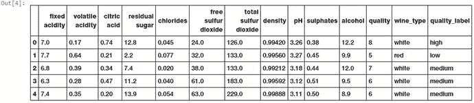

图 9-1。

Sample data points from the wine quality dataset

```py
In [4]: wines.head()

```

图 [9-1](#Fig1) 中描述的输出为我们展示了葡萄酒质量数据集的样本葡萄酒记录。通过查看这些值，我们可以了解数字和分类特征。现在，让我们尝试获得一些关于葡萄酒及其属性的领域知识。领域知识是必不可少的，并且总是被推荐，尤其是当您试图分析和建模来自不同领域的数据时。

葡萄酒是一种酒精饮料，由葡萄发酵过程制成，不添加糖、酸、酶、水或其他营养成分。红葡萄酒和白葡萄酒是两种变体。通常，红酒是由暗红色和黑色的葡萄制成的。颜色从各种深浅不同的红色、棕色和紫色不等。这是用整颗葡萄生产的，包括葡萄皮，这增加了红葡萄酒的颜色和味道，赋予它浓郁的风味。白葡萄酒是由不带皮和籽的白葡萄制成的。颜色通常是稻草黄色、黄绿色或金黄色。与浓郁的红葡萄酒相比，大多数白葡萄酒都有淡淡的果香。现在让我们深入了解数据集中每个要素的详细信息。一些属性的描述再次归功于 Karlijn。我们的数据集总共有 14 个属性，描述如下。

*   酸是葡萄酒的基本特性之一，对葡萄酒的味道有很大的影响。显著降低酸度可能会导致葡萄酒味道平淡。固定酸包括酒石酸、苹果酸、柠檬酸和琥珀酸，它们存在于葡萄中(琥珀酸除外)。这个变量通常在数据集中用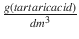表示。
*   在完成生产过程之前，这些酸将从酒中蒸馏出来。它主要由乙酸构成，但也可能存在其他酸，如乳酸、甲酸和丁酸。过量挥发性酸是不希望的，并导致令人不快的味道。在美国，红餐酒和白餐酒的挥发性酸度法定限值分别为 1.2 克/升和 1.1 克/升。挥发性酸度在数据集中用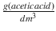表示。
*   这是赋予葡萄酒新鲜度的固定酸之一。通常大部分是在发酵过程中消耗掉的，有时会单独添加，以使葡萄酒更加新鲜。通常在数据集中用表示。
*   `residual` `sugar` `:`这通常是指葡萄在发酵过程停止后，或停止后剩余的天然糖分。通常在数据集中用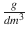表示。
*   这通常是造成葡萄酒咸味的主要原因。通常在数据集中用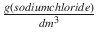表示。
*   这是二氧化硫的一部分，当加入到葡萄酒中时，在剩余部分结合后被认为是游离的。酿酒师总是试图获得最高比例的游离硫来结合。它们也被称为亚硫酸盐，过多会产生刺鼻的气味。这个变量在数据集中用表示。
*   `total sulfur dioxide:`这是结合态和游离态二氧化硫的总和(所以 <sup>2</sup> )。这里用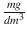表示。添加这个主要是为了杀死有害细菌，保质保鲜。葡萄酒中的硫含量通常是有法定限制的，过量的硫甚至会杀死好的酵母并产生不良气味。
*   这可以表示为特定体积的酒与同等体积的水的重量的比较。它通常被用来衡量糖向酒精的转化。这里用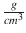表示。
*   也被称为氢的潜力，这是一个数字尺度来指定葡萄酒的酸度或碱度。固定酸度对葡萄酒的 pH 值影响最大。你可能知道，pH 值小于 7 的溶液是酸性的，而 pH 值大于 7 的溶液是碱性的。pH 值为 7 的纯水是中性的。大多数葡萄酒的 pH 值在 2.9 到 3.9 之间，因此是酸性的。
*   这些是含硫的矿物盐。硫酸盐对于葡萄酒就像面筋对于食物一样。它们是世界各地酿酒的常规部分，被认为是必不可少的。它们与发酵过程有关，影响葡萄酒的香气和风味。这里，它们在数据集中用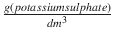表示。
*   葡萄酒是一种酒精饮料。酒精是在发酵过程中酵母转化糖的结果。不同葡萄酒的酒精含量不同。因此，这个属性成为这个数据集的一部分并不奇怪。通常用体积百分比或酒精体积比(ABV)来衡量。
*   `quality` `:`葡萄酒专家对葡萄酒质量的评分在 0(非常差)到 10(非常优秀)之间。最终的质量分数是由相同的葡萄酒专家做出的至少三个评价的中间值。
*   由于我们最初有两个红葡萄酒和白葡萄酒的数据集，我们在最终合并的数据集中引入了这个属性，它指示每个数据点的葡萄酒类型。葡萄酒可以是红葡萄酒或白葡萄酒。我们将在本章中建立的预测模型之一是，我们可以通过观察葡萄酒的其他属性来预测葡萄酒的类型。
*   `quality_label:`这是质量属性的派生属性。我们将葡萄酒质量分数分成三个等级，即低、中、高。质量分数为 3、4、5 的葡萄酒为低质量；6、7 分为中等质量；得分为 8 和 9 的是高质量的葡萄酒。我们还将在本章中建立另一个模型，根据葡萄酒的其他属性来预测这个葡萄酒质量标签。

现在，您已经对数据集及其要素有了一个坚实的基础，让我们来分析和可视化各种要素及其交互。

### 描述统计学

首先，我们将计算数据集中各种感兴趣要素的一些描述性统计数据。这包括计算聚合指标，如平均值、中值、标准差等。如果你还记得，我们的主要目标之一是建立一个模型，可以根据葡萄酒的属性正确预测它是红葡萄酒还是白葡萄酒。让我们建立一个描述性的总结表格，按照葡萄酒的种类对各种葡萄酒的属性进行分类。

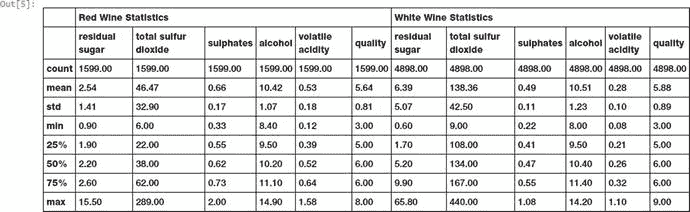

图 9-2。

Descriptive statistics for wine attributes separated by wine type

```py
In [5]: subset_attributes = ['residual sugar', 'total sulfur dioxide', 'sulphates',
                             'alcohol', 'volatile acidity', 'quality']
   ...: rs = round(red_wine[subset_attributes].describe(),2)
   ...: ws = round(white_wine[subset_attributes].describe(),2)
   ...: pd.concat([rs, ws], axis=1, keys=['Red Wine Statistics', 'White Wine Statistics'])

```

图 [9-2](#Fig2) 中的汇总表向我们展示了各种葡萄酒属性的描述性统计数据。你注意到什么有趣的特性了吗？首先，白葡萄酒中的平均残糖和总二氧化硫含量似乎比红葡萄酒高得多。此外，与白葡萄酒相比，红葡萄酒中硫酸盐和挥发性酸度的平均值似乎更高。尝试包含其他功能，看看你是否能找到更多有趣的比较！将葡萄酒质量水平视为数据子集，让我们用下面的代码片段构建一些描述性的汇总统计数据。

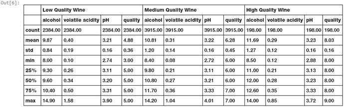

图 9-3。

Descriptive statistics for wine attributes separated by wine quality

```py
In [6]: subset_attributes = ['alcohol', 'volatile acidity', 'pH', 'quality']
   ...: ls = round(wines[wines['quality_label'] == 'low'][subset_attributes].describe(),2)
   ...: ms = round(wines[wines['quality_label'] == 'medium'][subset_attributes].describe(),2)
   ...: hs = round(wines[wines['quality_label'] == 'high'][subset_attributes].describe(),2)
   ...: pd.concat([ls, ms, hs], axis=1, keys=['Low Quality Wine', 'Medium Quality Wine',
                                              'High Quality Wine'])

```

图 [9-3](#Fig3) 中的汇总表显示了按葡萄酒质量等级划分的各种葡萄酒属性子集的描述性统计数据。有趣的是，平均酒精含量似乎随着葡萄酒质量等级的提高而增加。我们还发现不同质量的葡萄酒样品的 pH 值几乎是一致的。有什么方法可以从统计学上证明这一点吗？我们将在下一节看到这一点。

### 推断统计学

推断统计学的一般概念是使用数据样本得出总体的推断和命题。这个想法是使用统计方法和模型从给定的假设中得出统计推断。每个假设由一个无效假设和一个替代假设组成。基于统计测试结果，如果结果基于预设的显著性水平具有统计显著性(例如，如果获得的 p 值小于 5%的显著性水平)，我们拒绝零假设，支持替代假设。否则，如果结果在统计上不显著，我们就断定我们的零假设是正确的。回到上一节的问题，给定基于葡萄酒质量评级的多个数据组或葡萄酒样本子集，有什么方法可以证明平均酒精含量或 pH 值在数据组之间存在显著差异？

证明或否定数据子集之间均值差异的一个很好的统计模型是使用单向 ANOVA 检验。ANOVA 代表“方差分析”，这是一个很好的统计模型，可以用来分析不同组的平均值之间的统计显著差异。这基本上是通过使用统计测试来实现的，统计测试帮助我们确定几个组的平均值是否相等。通常零假设表示为

h<sub>0</sub>:μ<sub>1</sub>=μ<sub>2</sub>=μ<sub>3</sub>-我...。=μ〔t8〕n〔T9〕

其中 n 是数据组或子集的数量，它表示基于统计显著性水平，各个组的组均值彼此没有很大差异。备选假设 H <sub>A</sub> 告诉我们，至少存在两个在统计上彼此显著不同的组均值。通常使用 F 统计量和相关的 p 值来确定统计显著性。通常，小于 0.05 的 p 值被认为是有统计学意义的结果，我们拒绝零假设而支持原始假设。我们建议阅读关于推断统计学的标准书籍，以获得关于这些概念的更深入的知识。

在我们的场景中，基于葡萄酒质量评级创建了三个数据子集或数据组。第一次测试的平均值基于葡萄酒的酒精含量，第二次测试基于葡萄酒的 pH 值。我们还假设零假设是低、中和高质量葡萄酒的组均值相同，另一个假设是至少两个组均值之间存在差异(统计显著性)。下面的代码片段帮助我们执行单向 ANOVA 测试。

```py
In [7]: from scipy import stats
   ...:
   ...: F, p = stats.f_oneway(wines[wines['quality_label'] == 'low']['alcohol'],
   ...:                       wines[wines['quality_label'] == 'medium']['alcohol'],
   ...:                       wines[wines['quality_label'] == 'high']['alcohol'])
   ...: print('ANOVA test for mean alcohol levels across wine samples with different quality
               ratings')
   ...: print('F Statistic:', F, '\tp-value:', p)
   ...:
   ...: F, p = stats.f_oneway(wines[wines['quality_label'] == 'low']['pH'],
   ...:                       wines[wines['quality_label'] == 'medium']['pH'],
   ...:                       wines[wines['quality_label'] == 'high']['pH'])
   ...: print('\nANOVA test for mean pH levels across wine samples with different quality
               ratings')
   ...: print('F Statistic:', F, '\tp-value:', p)
ANOVA test for mean alcohol levels across wine samples with different quality ratings
F Statistic: 673.074534723      p-value: 2.27153374506e-266

ANOVA test for mean pH levels across wine samples with different quality ratings
F Statistic: 1.23638608035      p-value: 0.290500277977

```

从前面的结果中，我们可以清楚地看到，在第一次测试中，p 值远小于 0.05，在第二次测试中，p 值大于 0.05。这告诉我们，三个组中至少有两个组的酒精水平均值存在统计学上的显著差异(拒绝零假设，支持替代方案)。然而，在 pH 水平平均值的情况下，我们不拒绝零假设，因此我们得出结论，三组的 pH 水平平均值在统计上没有显著差异。我们甚至可以使用下面的代码片段来可视化这两个特性并观察其方法。

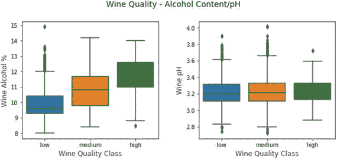

图 9-4。

Visualizing wine alcohol content and pH level distributions based on quality ratings

```py
f, (ax1, ax2) = plt.subplots(1, 2, figsize=(10, 4))
f.suptitle('Wine Quality - Alcohol Content/pH', fontsize=14)
f.subplots_adjust(top=0.85, wspace=0.3)

sns.boxplot(x="quality_label", y="alcohol",
            data=wines, ax=ax1)
ax1.set_xlabel("Wine Quality Class",size = 12,alpha=0.8)
ax1.set_ylabel("Wine Alcohol %",size = 12,alpha=0.8)

sns.boxplot(x="quality_label", y="pH", data=wines, ax=ax2)
ax2.set_xlabel("Wine Quality Class",size = 12,alpha=0.8)
ax2.set_ylabel("Wine pH",size = 12,alpha=0.8)

```

图 [9-4](#Fig4) 中描绘的箱线图向我们展示了基于葡萄酒质量的葡萄酒酒精含量分布与 pH 值的明显差异，看起来在 3.1 - 3.3 之间，事实上，如果你观察三个组的 pH 值的平均值和中值，与酒精百分比相比，三个组的酒精含量分布约为 3.2，差异显著。你能从这些数据中找到我们更有趣的模式和其他特征的假设吗？试试看！

### 单变量分析

这可能是探索性数据分析中最简单也是最核心的基础步骤之一。单变量分析包括分析数据，因此在任何分析实例中，我们只处理一个变量或特征。没有分析多个变量之间的关系或相关性。将数据中的所有变量可视化的最简单方法是构建一些直方图。以下代码片段有助于可视化所有要素的数据值分布。虽然直方图在许多情况下可能不是一种合适的可视化方式，但对于数字数据来说，它是一种很好的开始方式。

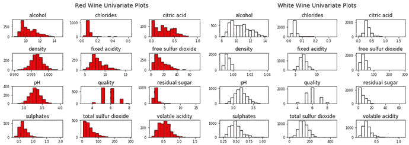

图 9-5。

Univariate plots depicting feature distributions for the wine quality dataset

```py
red_wine.hist(bins=15, color='red', edgecolor='black', linewidth=1.0,
              xlabelsize=8, ylabelsize=8, grid=False)    
plt.tight_layout(rect=(0, 0, 1.2, 1.2))   
rt = plt.suptitle('Red Wine Univariate Plots', x=0.65, y=1.25, fontsize=14)  

white_wine.hist(bins=15, color='white', edgecolor='black', linewidth=1.0,
              xlabelsize=8, ylabelsize=8, grid=False)    
plt.tight_layout(rect=(0, 0, 1.2, 1.2))   
wt = plt.suptitle('White Wine Univariate Plots', x=0.65, y=1.25, fontsize=14)

```

像`matplotlib`和`pandas`这样的软件包的力量使你能够使用最少的代码轻松地绘制变量分布，如图 [9-5](#Fig5) 所示。你注意到这两种葡萄酒有什么有趣的模式吗？让我们以名为`residual sugar`的特性为例，绘制红葡萄酒和白葡萄酒样本数据的分布图。

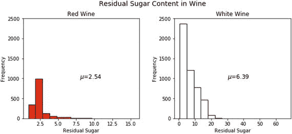

图 9-6。

Residual sugar distribution for red and white wine samples

```py
fig = plt.figure(figsize = (10,4))
title = fig.suptitle("Residual Sugar Content in Wine", fontsize=14)
fig.subplots_adjust(top=0.85, wspace=0.3)

ax1 = fig.add_subplot(1,2, 1)
ax1.set_title("Red Wine")
ax1.set_xlabel("Residual Sugar")
ax1.set_ylabel("Frequency")
ax1.set_ylim([0, 2500])
ax1.text(8, 1000, r'$\mu$='+str(round(red_wine['residual sugar'].mean(),2)),
         fontsize=12)
r_freq, r_bins, r_patches = ax1.hist(red_wine['residual sugar'], color='red', bins=15,
                                    edgecolor='black', linewidth=1)

ax2 = fig.add_subplot(1,2, 2)
ax2.set_title("White Wine")
ax2.set_xlabel("Residual Sugar")
ax2.set_ylabel("Frequency")
ax2.set_ylim([0, 2500])
ax2.text(30, 1000, r'$\mu$='+str(round(white_wine['residual sugar'].mean(),2)),
         fontsize=12)
w_freq, w_bins, w_patches = ax2.hist(white_wine['residual sugar'], color='white', bins=15,
                                    edgecolor='black', linewidth=1)

```

从图 [9-6](#Fig6) 中我们可以很容易地注意到，与红酒样品相比，白酒样品中的`residual sugar`含量似乎更多。您可以在前面的代码片段中重复使用绘图模板，并可视化更多功能。一些图描述如下(详细代码在 jupyter 笔记本中)。

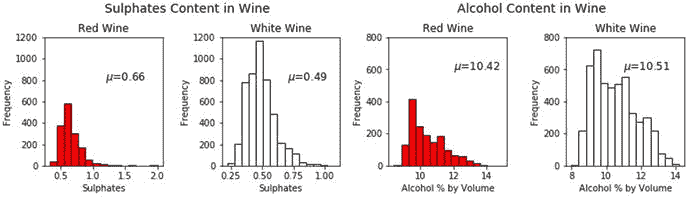

图 9-7。

Distributions for sulphate content and alcohol content for red and white wine samples

图 [9-7](#Fig7) 中描绘的曲线向我们展示了红酒样品中的`sulphate` `content`比白酒样品中的略多，平均而言，两种类型的酒精含量几乎相似。当然，在所有情况下，白葡萄酒的频率计数都更高，因为与红葡萄酒相比，我们有更多的白葡萄酒样本记录。接下来，我们绘制`quality`和`quality_label`分类特征的分布图，以了解我们稍后将预测的类别分布。

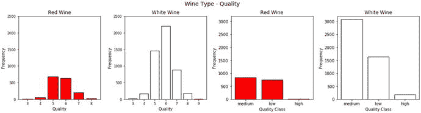

图 9-8。

Distributions for wine quality for red and white wine samples

图 [9-8](#Fig8) 中描绘的柱状图向我们展示了基于`type`和`quality`的葡萄酒样本分布。很明显，与中低质量的葡萄酒样品相比，高质量的葡萄酒样品要少得多。

### 多变量分析

分析多个特征变量及其关系是多元分析的全部内容。我们想看看我们的葡萄酒样品的物理化学属性之间是否有任何有趣的模式和关系，这可能有助于我们未来的建模过程。分析要素的最佳方法之一是构建成对相关图，描述数据集中每对要素之间的相关系数。下面的代码片段帮助我们构建一个关联矩阵，并以易于理解的热图形式绘制出来。

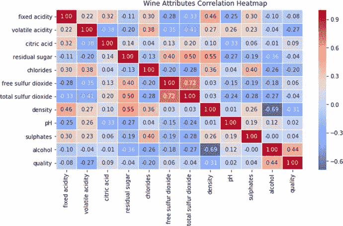

图 9-9。

Correlation heatmap for features in the wine quality dataset

```py
f, ax = plt.subplots(figsize=(10, 5))
corr = wines.corr()
hm = sns.heatmap(round(corr,2), annot=True, ax=ax, cmap="coolwarm",fmt='.2f',
            linewidths=.05)
f.subplots_adjust(top=0.93)
t= f.suptitle('Wine Attributes Correlation Heatmap', fontsize=12)

```

虽然大部分相关性很弱，如图 [9-9](#Fig9) 所示，但我们可以看到`density`和`alcohol`之间的强负相关性以及`total`和`free sulfur dioxide`之间的强正相关性，这是意料之中的。您还可以使用成对绘图来可视化多个变量之间的模式和关系，并为葡萄酒类型使用不同的色调，实际上是一次绘制三个变量。以下代码片段描述了数据集中一些要素的成对绘图示例。

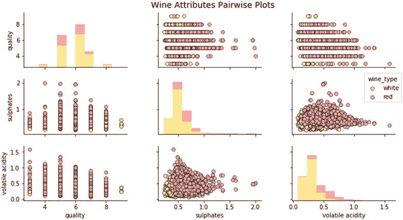

图 9-10。

Pairwise plots by wine type for features in the wine quality dataset

```py
cols = ['wine_type', 'quality', 'sulphates', 'volatile acidity']
pp = sns.pairplot(wines[cols], hue='wine_type', size=1.8, aspect=1.8,
                  palette={"red": "#FF9999", "white": "#FFE888"},
                  plot_kws=dict(edgecolor="black", linewidth=0.5))
fig = pp.fig
fig.subplots_adjust(top=0.93, wspace=0.3)
t = fig.suptitle('Wine Attributes Pairwise Plots', fontsize=14)

```

从图 [9-10](#Fig10) 中的曲线图，我们可以注意到几个有趣的模式，这与我们之前获得的一些见解一致。这些意见包括以下内容:

*   与白葡萄酒相比，红葡萄酒中硫酸盐含量更高
*   高质量等级的葡萄酒中硫酸盐含量较低
*   高质量等级的葡萄酒中挥发性酸含量较低
*   与白葡萄酒相比，红葡萄酒中挥发性酸含量更高

您可以在其他变量和特征上使用类似的图来发现更多的模式和关系。要从更微观的角度观察要素之间的关系，联合图是非常好的可视化工具，尤其适用于多变量可视化。以下片段描述了葡萄酒类型、硫酸盐和质量等级之间的关系。

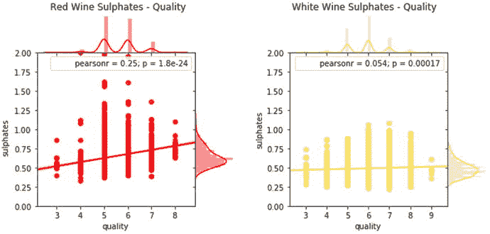

图 9-11。

Visualizing relationships between wine types’ sulphates and quality with joint plots

```py
rj = sns.jointplot(x='quality', y='sulphates', data=red_wine,
                   kind='reg', ylim=(0, 2),  
                   color='red', space=0, size=4.5, ratio=4)
rj.ax_joint.set_xticks(list(range(3,9)))
fig = rj.fig
fig.subplots_adjust(top=0.9)
t = fig.suptitle('Red Wine Sulphates - Quality', fontsize=12)

wj = sns.jointplot(x='quality', y='sulphates', data=white_wine,
                   kind='reg', ylim=(0, 2),
                   color='#FFE160', space=0, size=4.5, ratio=4)
wj.ax_joint.set_xticks(list(range(3,10)))
fig = wj.fig
fig.subplots_adjust(top=0.9)
t = fig.suptitle('White Wine Sulphates - Quality', fontsize=12)

```

虽然似乎有一些模式显示高质量等级葡萄酒样品的硫酸盐含量较低，但相关性相当弱(见图 [9-11](#Fig11) )。然而，我们确实清楚地看到，红葡萄酒中的硫酸盐含量比白葡萄酒中的要高得多。在这种情况下，我们借助于两个图可视化了三个特征(类型、质量和硫酸盐)。如果我们想要可视化更多的特征，并从中确定模式，会怎么样？`seaborn`框架提供了小平面网格，帮助我们在二维图中可视化更多的变量。让我们试着想象一下酒的`type`、`quality`等级、`volatile acidity`和`alcohol`音量之间的关系。

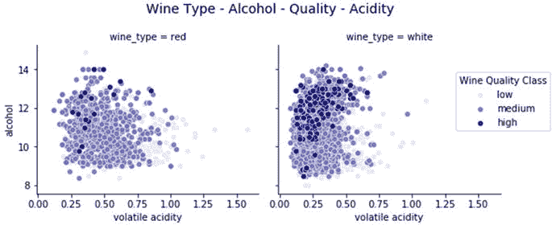

图 9-12。

Visualizing relationships between wine types: alcohol, quality, and acidity levels

```py
g = sns.FacetGrid(wines, col="wine_type", hue='quality_label',
                  col_order=['red', 'white'], hue_order=['low', 'medium', 'high'],
                  aspect=1.2, size=3.5, palette=sns.light_palette('navy', 3))
g.map(plt.scatter, "volatile acidity", "alcohol", alpha=0.9,
      edgecolor='white', linewidth=0.5)
fig = g.fig
fig.subplots_adjust(top=0.8, wspace=0.3)
fig.suptitle('Wine Type - Alcohol - Quality - Acidity', fontsize=14)
l = g.add_legend(title='Wine Quality Class')

```

图 [9-12](#Fig12) 中的曲线向我们展示了一些有趣的模式。我们不仅能够成功地将四个变量可视化，而且还能看到它们之间有意义的关系。与中低等级的葡萄酒样品相比，高质量的葡萄酒样品(用较深的阴影表示)具有较低的挥发性酸度和较高的酒精含量。除此之外，我们还可以看到，与红葡萄酒样品相比，白葡萄酒样品中的挥发性酸度水平略低。

现在让我们建立一个类似的可视化。然而，在这个场景中，我们想要分析葡萄酒`types`、`quality`、`sulfur dioxide`和`acidity`水平的模式。我们可以使用与上一个代码片段相同的框架来实现这一点。

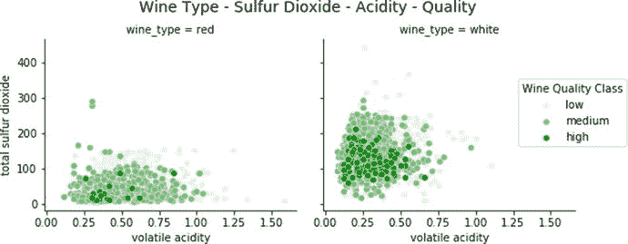

图 9-13。

Visualizing relationships between wine types: quality, sulfur dioxide, and acidity levels

```py
g = sns.FacetGrid(wines, col="wine_type", hue='quality_label',
                  col_order=['red', 'white'], hue_order=['low', 'medium', 'high'],
                  aspect=1.2, size=3.5, palette=sns.light_palette('green', 3))
g.map(plt.scatter, "volatile acidity", "total sulfur dioxide", alpha=0.9,
      edgecolor='white', linewidth=0.5)
fig = g.fig
fig.subplots_adjust(top=0.8, wspace=0.3)
fig.suptitle('Wine Type - Sulfur Dioxide - Acidity - Quality', fontsize=14)
l = g.add_legend(title='Wine Quality Class')

```

从图 [9-13](#Fig13) 中我们可以很容易地解读出，在高品质的葡萄酒样品中`volatile acidity`和`total sulfur dioxide`都要低得多。此外，`total sulfur dioxide`在白葡萄酒样品中比在红葡萄酒样品中多得多。然而，与我们在前面的图中观察到的红葡萄酒样品相比，白葡萄酒样品中的挥发性酸度水平略低。

可视化按组(分类变量)划分的数字特征的一个好方法是使用盒图。在我们的数据集中，我们已经在“推断统计”部分讨论了高酒精含量与葡萄酒样品高质量等级之间的关系。让我们试着想象一下按葡萄酒质量等级分组的葡萄酒酒精含量之间的关系。我们将绘制两张葡萄酒酒精含量与葡萄酒质量和`quality_label`的曲线图。

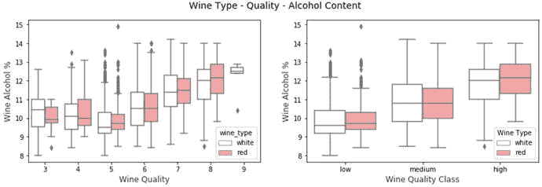

图 9-14。

Visualizing relationships between wine types: quality and alcohol content

```py
f, (ax1, ax2) = plt.subplots(1, 2, figsize=(14, 4))
f.suptitle('Wine Type - Quality - Alcohol Content', fontsize=14)

sns.boxplot(x="quality", y="alcohol", hue="wine_type",
               data=wines, palette={"red": "#FF9999", "white": "white"}, ax=ax1)
ax1.set_xlabel("Wine Quality",size = 12,alpha=0.8)
ax1.set_ylabel("Wine Alcohol %",size = 12,alpha=0.8)

sns.boxplot(x="quality_label", y="alcohol", hue="wine_type",
               data=wines, palette={"red": "#FF9999", "white": "white"}, ax=ax2)
ax2.set_xlabel("Wine Quality Class",size = 12,alpha=0.8)
ax2.set_ylabel("Wine Alcohol %",size = 12,alpha=0.8)
l = plt.legend(loc='best', title='Wine Type')

```

基于我们之前在“推断统计”部分对葡萄酒`quality`与`alcohol`体积的分析，这些结果看起来是一致的。图 [9-14](#Fig14) 中的每个方框图描绘了不同葡萄酒类型的特定葡萄酒质量等级的酒精含量分布。方框本身描绘了四分位数范围，而里面的线描绘了酒精的中间值。触须表示最小值和最大值，异常值通常由单个点表示。我们可以清楚地观察到，基于高质量等级的葡萄酒样品，葡萄酒的酒精度按体积分布有增加的趋势。类似地，我们也可以使用 violin 图来可视化数字特征在分类特征上的分布。让我们建立一个可视化，通过质量评级来分析葡萄酒样品的固定酸度。

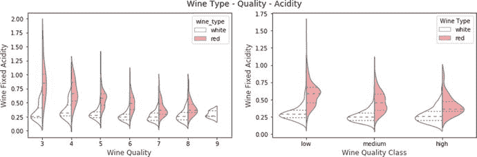

图 9-15。

Visualizing relationships between wine types: quality and acidity

```py
f, (ax1, ax2) = plt.subplots(1, 2, figsize=(14, 4))
f.suptitle('Wine Type - Quality - Acidity', fontsize=14)

sns.violinplot(x="quality", y="volatile acidity", hue="wine_type",
               data=wines, split=True, inner="quart", linewidth=1.3,
               palette={"red": "#FF9999", "white": "white"}, ax=ax1)
ax1.set_xlabel("Wine Quality",size = 12,alpha=0.8)
ax1.set_ylabel("Wine Fixed Acidity",size = 12,alpha=0.8)

sns.violinplot(x="quality_label", y="volatile acidity", hue="wine_type",
               data=wines, split=True, inner="quart", linewidth=1.3,
               palette={"red": "#FF9999", "white": "white"}, ax=ax2)
ax2.set_xlabel("Wine Quality Class",size = 12,alpha=0.8)
ax2.set_ylabel("Wine Fixed Acidity",size = 12,alpha=0.8)
l = plt.legend(loc='upper right', title='Wine Type')

```

在图 [9-15](#Fig15) 中，每个 violin 图都典型地描述了四分位间距，中间值在图中用虚线表示。您还可以使用密度图来显示数据的分布，其中宽度表示频率。因此，除了从箱线图中获得的信息之外，您还可以使用 violin 图来可视化数据的分布。事实上，我们已经建立了一个分裂小提琴情节，在这种情况下，描绘了两种类型的葡萄酒。很明显，与白葡萄酒相比，红葡萄酒的酸度更高。我们还可以看到，对于红葡萄酒样品来说，随着葡萄酒质量的提高，酸度总体下降，但对于白葡萄酒样品来说，酸度下降不明显。这些代码片段和示例应该为您提供一些好的框架和蓝图，以便将来对您的数据集执行有效的探索性数据分析。

## 预测建模

我们现在将关注我们的主要目标，即建立预测模型，根据其他特征预测葡萄酒类型和质量等级。在这种情况下，我们将遵循标准的分类机器学习管道。在这一部分，我们将构建两个主要的分类系统。

*   葡萄酒类型预测系统(红葡萄酒或白葡萄酒)
*   葡萄酒质量等级预测系统(低、中、高)

我们将使用前面章节中的`wines`数据框。这一部分的完整代码可以在标题为`predictive_analytics.py`的 Python 文件中获得，或者您可以使用标题为`Predictive Analytics.ipynb`的 jupyter 笔记本来获得更具交互性的体验。首先，让我们加载以下必要的依赖项和设置。

```py
import pandas as pd
import numpy as np
import matplotlib.pyplot as plt
import model_evaluation_utils as meu
from sklearn.model_selection import train_test_split
from collections import Counter
from sklearn.preprocessing import StandardScaler
from sklearn.preprocessing import LabelEncoder

%matplotlib inline

```

切记将`model_evaluation_utils.py`模块放在运行代码的同一个目录中，因为我们将使用它来评估我们的预测模型。让我们简单看一下我们的预测系统将遵循的工作流程。我们将关注两个主要阶段——模型训练和模型预测与评估。

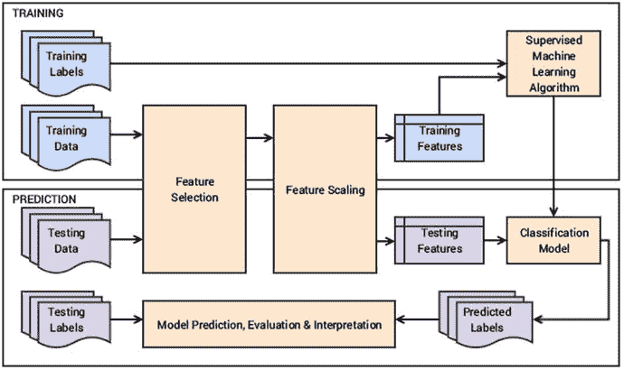

图 9-16。

Workflow blueprint for our wine type and quality classification system

从图 [9-16](#Fig16) 中，我们可以看到训练数据和测试数据引用了葡萄酒质量数据集特征。因为我们已经有了必要的葡萄酒属性，我们不会构建额外的手工制作的功能。标签可以是葡萄酒类型，也可以是基于分类系统的质量等级。在训练阶段，特征选择将主要涉及选择所有必要的葡萄酒理化属性，然后在必要的缩放后，我们将训练我们的预测模型，用于预测和评估预测阶段。

## 预测葡萄酒类型

在我们的葡萄酒质量数据集中，我们有两种不同类型的葡萄酒——红葡萄酒和白葡萄酒。我们的分类系统在这一部分的主要任务是根据其他特征来预测葡萄酒的类型。首先，我们将首先选择必要的特征，分离出预测类标签，并准备训练和测试数据集。我们在变量中使用前缀`wtp_`来根据需要轻松识别它们，其中`wtp`描述了葡萄酒类型预测。

```py
In [5]: wtp_features = wines.iloc[:,:-3]
   ...: wtp_feature_names = wtp_features.columns
   ...: wtp_class_labels = np.array(wines['wine_type'])
   ...:
   ...: wtp_train_X, wtp_test_X, wtp_train_y, wtp_test_y = train_test_split(wtp_features,
   ...:                                    wtp_class_labels, test_size=0.3, random_state=42)
   ...:
   ...: print(Counter(wtp_train_y), Counter(wtp_test_y))
   ...: print('Features:', list(wtp_feature_names))
Counter({'white': 3418, 'red': 1129}) Counter({'white': 1480, 'red': 470})
Features: ['fixed acidity', 'volatile acidity', 'citric acid', 'residual sugar', 'chlorides', 'free sulfur dioxide', 'total sulfur dioxide', 'density', 'pH', 'sulphates', 'alcohol']

```

这些数字显示了每个类的葡萄酒样本，我们还可以看到将在我们的特性集中使用的特性名称。让我们继续扩展我们的功能。在这种情况下，我们将使用标准缩放器。

```py
In [6]: # Define the scaler
   ...: wtp_ss = StandardScaler().fit(wtp_train_X)
   ...: # Scale the train set
   ...: wtp_train_SX = wtp_ss.transform(wtp_train_X)
   ...: # Scale the test set
   ...: wtp_test_SX = wtp_ss.transform(wtp_test_X)

```

由于我们正在处理一个二元分类问题，我们可以使用的传统机器学习算法之一是逻辑回归模型。如果你还记得的话，我们在第 [7](07.html) 章已经详细讨论过了。请随意浏览第 [7](07.html) 章中的“传统监督机器学习模型”部分，以刷新您对逻辑回归的记忆，或者您可以参考任何关于分类模型的标准教科书或材料。现在，让我们使用逻辑回归在训练数据集和标签上训练一个模型

```py
In [7]: from sklearn.linear_model import LogisticRegression
   ...:
   ...: wtp_lr = LogisticRegression()
   ...: wtp_lr.fit(wtp_train_SX, wtp_train_y)
Out[7]:
LogisticRegression(C=1.0, class_weight=None, dual=False, fit_intercept=True,
          intercept_scaling=1, max_iter=100, multi_class='ovr', n_jobs=1,
          penalty='l2', random_state=None, solver='liblinear', tol=0.0001,
          verbose=0, warm_start=False)

```

现在我们的模型已经准备好了，让我们为我们的测试数据样本预测葡萄酒类型并评估性能。

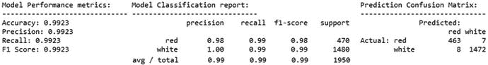

图 9-17。

Model performance metrics for logistic regression for wine type predictive model

```py
In [8]: wtp_lr_predictions = wtp_lr.predict(wtp_test_SX)
   ...: meu.display_model_performance_metrics(true_labels=wtp_test_y,
   ...:                  predicted_labels=wtp_lr_predictions, classes=['red', 'white'])

```

如图 [9-17](#Fig17) 所示，我们得到了总体 F1 分数和 99.2%的模型准确度，这真是令人惊讶！尽管红酒样品不多，但我们似乎做得相当不错。如果您的模型由于类别不平衡问题而在其他数据集上表现不佳，您可以考虑过采样或欠采样技术，包括样本选择和 SMOTE。回到我们的分类问题，我们有一个非常好的模型，但是我们能做得更好吗？虽然这似乎是一个遥不可及的梦想，但让我们尝试使用具有三个隐藏层的全连接深度神经网络(DNN)来建模数据。请参考第 [7](07.html) 章中的“更新的监督深度学习模型”部分，以刷新您对全连接 dnn 和 MLP 的记忆。像`tensorflow`之上的`keras`这样的深度学习框架更喜欢将你的输出响应标签编码成更容易处理的数字形式。下面的代码片段编码了我们的葡萄酒类型类标签。

```py
In [9]: le = LabelEncoder()
   ...: le.fit(wtp_train_y)
   ...: # encode wine type labels
   ...: wtp_train_ey = le.transform(wtp_train_y)
   ...: wtp_test_ey = le.transform(wtp_test_y)

```

让我们为我们的三隐藏层 DNN 构建架构，其中每个隐藏层有 16 个单元(输入层有 11 个单元用于 11 个特征)，输出层有 1 个单元用于预测 0 或 1，这映射回红葡萄酒或白葡萄酒。

```py
In [10]: from keras.models import Sequential
    ...: from keras.layers import Dense
    ...:
    ...: wtp_dnn_model = Sequential()
    ...: wtp_dnn_model.add(Dense(16, activation='relu', input_shape=(11,)))
    ...: wtp_dnn_model.add(Dense(16, activation='relu'))
    ...: wtp_dnn_model.add(Dense(16, activation='relu'))
    ...: wtp_dnn_model.add(Dense(1, activation='sigmoid'))
    ...:
    ...: wtp_dnn_model.compile(loss='binary_crossentropy', optimizer='adam', metrics=['accuracy'])
Using TensorFlow backend.

```

您可以看到我们在`tensorflow`之上使用了`keras`，对于我们的优化器，我们选择了具有二进制交叉熵损失的`adam`优化器。如果需要，还可以使用分类交叉熵，这在有两个以上的类时特别有用。下面的片段有助于训练我们的 DNN。

```py
In [11]: history = wtp_dnn_model.fit(wtp_train_SX, wtp_train_ey, epochs=10, batch_size=5,
    ...:                             shuffle=True, validation_split=0.1, verbose=1)
Train on 4092 samples, validate on 455 samples
Epoch 1/10  4092/4092 - 1s - loss: 0.1266 - acc: 0.9467 - val_loss: 0.0115 - val_acc: 0.9978
Epoch 2/10  4092/4092 - 1s - loss: 0.0315 - acc: 0.9934 - val_loss: 0.0046 - val_acc: 1.0000
 ...
Epoch 9/10  4092/4092 - 1s - loss: 0.0112 - acc: 0.9973 - val_loss: 0.0029 - val_acc: 1.0000
Epoch 10/10 4092/4092 - 1s - loss: 0.0098 - acc: 0.9978 - val_loss: 0.0013 - val_acc: 1.0000

```

我们使用 10%的训练数据作为验证集，同时训练模型以查看它在每个时期的表现。现在让我们在实际的测试数据集上预测和评估我们的模型。

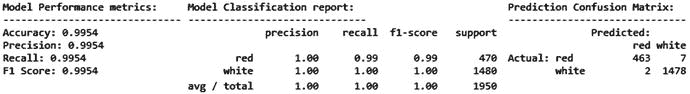

图 9-18。

Model performance metrics for deep neural network for wine type predictive model

```py
In [15]: wtp_dnn_ypred = wtp_dnn_model.predict_classes(wtp_test_SX)
    ...: wtp_dnn_predictions = le.inverse_transform(wtp_dnn_ypred)
    ...: meu.display_model_performance_metrics(true_labels=wtp_test_y,
    ...:                      predicted_labels=wtp_dnn_predictions, classes=['red', 'white'])

```

如图 [9-18](#Fig18) 所示，我们得到了总体 F1 分数和 99.5%的模型准确度，这甚至比我们之前的模型还要好！这证明了你并不总是需要大数据，而是需要高质量的数据和功能，即使是深度学习模型。图 [9-19](#Fig19) 描述了每个历元的损失和精度测量，详细代码在笔记本中。

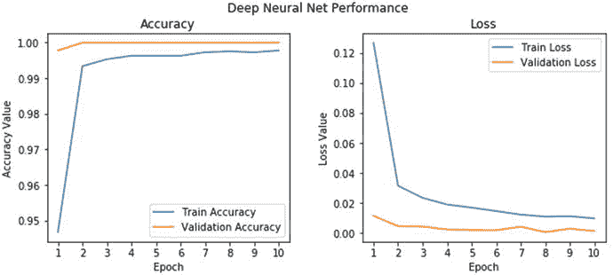

图 9-19。

Model performance metrics for DNN model per epoch

现在我们有了一个工作的葡萄酒类型分类系统，让我们试着解释其中一个预测模型。模型解释的一个关键方面是试图理解数据集中每个要素的重要性。我们将使用在前几章中使用的`skater`包来满足我们的模型解释需求。下面的代码有助于可视化我们的逻辑回归模型的特征重要性。

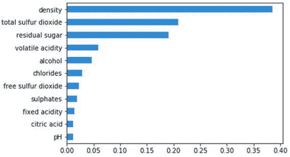

图 9-20。

Feature importances obtained from our logistic regression model

```py
In [16]: from skater.core.explanations import Interpretation
    ...: from skater.model import InMemoryModel
    ...:
    ...: wtp_interpreter = Interpretation(wtp_test_SX, feature_names=wtp_features.columns)
    ...: wtp_im_model = InMemoryModel(wtp_lr.predict_proba, examples=wtp_train_SX,
                                     target_names=wtp_lr.classes_)
    ...: plots = wtp_interpreter.feature_importance.plot_feature_importance(wtp_im_model,
                                                                       ascending=False)

```

我们可以在图 [9-20](#Fig20) 中看到`density, total sulfur dioxide`和`residual sugar`是有助于将葡萄酒样品分类为红色或白色的前三个特征。除了查看指标之外，了解模型表现如何的另一种方式是绘制接收器操作特征曲线，也称为 ROC 曲线。可以使用分类器的真阳性率(TPR)和假阳性率(FPR)来绘制该曲线。TPR 被称为敏感度或召回率，它是在数据集的所有阳性样本中预测的正确阳性结果的总数。FPR 被称为假警报或(1 -特异性)，确定数据集中所有阴性样本中不正确阳性预测的总数。ROC 曲线有时也称为灵敏度对(1 特异性)图。以下代码使用我们的模型评估实用程序模块在 ROC 空间中为我们的逻辑回归模型绘制 ROC 曲线。

```py
In [17]: meu.plot_model_roc_curve(wtp_lr, wtp_test_SX, wtp_test_y)

```

通常，在任何 ROC 曲线中，ROC 空间在点(0，0)和(1，1)之间。来自混淆矩阵的每个预测结果占据这个 ROC 空间中的一个点。理想情况下，最佳预测模型将在左上角(0，1)给出一个点，表示完美分类(100%灵敏度和特异性)。斜线表示进行随机猜测的分类器。理想情况下，如果你的 ROC 曲线出现在图的上半部分，你有一个不错的分类器，比平均水平要好。图 [9-21](#Fig21) 使这一点更加清楚。

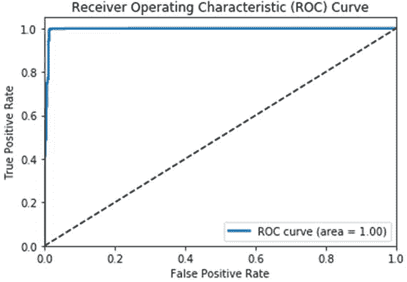

图 9-21。

ROC curve for our logistic regression model

如果你还记得这个模型，我们达到了几乎 100%的准确性，因此 ROC 曲线几乎是完美的，我们还看到曲线下面积(AUC)是 1，这是完美的。最后，根据我们之前获得的特征重要性等级，让我们看看是否可以可视化模型的决策表面或决策边界，这基本上为我们提供了模型能够学习属于每个类的数据点以及属于不同类的独立点的可视化描述。该表面基本上是超表面，其有助于基于数据样本的特征(特征空间)来分离数据样本的基础向量空间。如果这个曲面是线性的，分类问题就是线性的，超曲面也称为超平面。我们的模型评估工具模块通过一个易于使用的函数来帮助我们绘制这个图(请注意，目前这仅适用于`scikit`估计量，因为没有用于基于`keras`的估计量的`clone`函数，并且在撰写本书时它刚刚在上个月出版；一旦稳定下来，我们可能会在将来的某个时候推出一个变更)。

```py
In [18]: feature_indices = [i for i, feature in enumerate(wtp_feature_names)
    ...:                        if feature in ['density', 'total sulfur dioxide']]
    ...: meu.plot_model_decision_surface(clf=wtp_lr,
    ...:                                train_features=wtp_train_SX[:, feature_indices],
    ...:                                train_labels=wtp_train_y, plot_step=0.02,   
    ...:                                cmap=plt.cm.Wistia_r, markers=[',', 'o'],
    ...:                                alphas=[0.9, 0.6], colors=['r', 'y'])

```

由于我们希望在底层特征空间上绘制决策图，当您有两个以上的特征时，可视化变得极其困难。因此，为了简化和便于解释，我们将使用最重要的两个特征(`density`和`total sulfur dioxide`)来可视化模型决策面。这是通过在这两个特征上拟合原始模型估计器的克隆模型，然后基于它所学习的绘制决策表面来完成的。查看`plot_model_decision_surface(...)`函数，了解更多关于我们如何可视化决策面的底层细节。

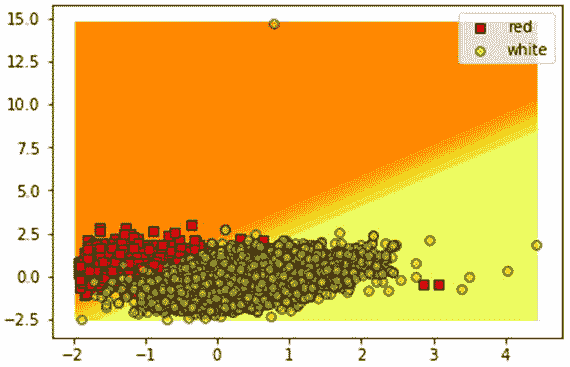

图 9-22。

Visualizing the model decision surface for our logistic regression model

图 [9-22](#Fig22) 中描绘的图强调了这样一个事实，即我们的模型已经很好地学习了基于两个最重要的特征的潜在模式，它已经用来从散点描绘的白葡萄酒样本中分离出大多数红葡萄酒样本。这里和那里有很少的错误分类，根据我们早先在混淆矩阵中获得的统计数据，这是很明显的。

## 预测葡萄酒质量

在我们的葡萄酒质量数据集中，我们有从 3 到 9 的几个质量等级。我们将重点关注的是`quality_label`变量，该变量根据我们在“探索性数据分析”部分创建的映射，根据潜在的`quality`变量将葡萄酒分为低、中、高等级。这样做是因为几个评级分数有很少的葡萄酒样本，因此类似的质量评级被组合在一起成为一个质量等级评级。我们使用前缀`wqp_`来表示所有与葡萄酒质量预测相关的变量和模型，以区别于其他分析。前缀`wqp`代表葡萄酒质量预测。在本节中，我们将评估和研究基于树的分类模型以及集成模型。下面的代码帮助我们准备用于建模的`train`和`test`数据集。

```py
In [19]: wqp_features = wines.iloc[:,:-3]
    ...: wqp_class_labels = np.array(wines['quality_label'])
    ...: wqp_label_names = ['low', 'medium', 'high']
    ...: wqp_feature_names = list(wqp_features.columns)
    ...: wqp_train_X, wqp_test_X, wqp_train_y, wqp_test_y = train_test_split(wqp_features,
    ...:                                      wqp_class_labels, test_size=0.3, random_state=42)
    ...:
    ...: print(Counter(wqp_train_y), Counter(wqp_test_y))
    ...: print('Features:', wqp_feature_names)
Counter({'medium': 2737, 'low': 1666, 'high': 144}) Counter({'medium': 1178, 'low': 718, 'high': 54})
Features: ['fixed acidity', 'volatile acidity', 'citric acid', 'residual sugar', 'chlorides', 'free sulfur dioxide', 'total sulfur dioxide', 'density', 'pH', 'sulphates', 'alcohol']

```

从前面的输出来看，很明显我们使用了相同的葡萄酒理化特性。还描述了每个质量等级中的样本数量。很明显，我们很少有高等级的葡萄酒样品，而有很多中等质量的葡萄酒样品。我们继续下一步的特征缩放。

```py
In [20]: # Define the scaler
    ...: wqp_ss = StandardScaler().fit(wqp_train_X)
    ...: # Scale the train set
    ...: wqp_train_SX = wqp_ss.transform(wqp_train_X)
    ...: # Scale the test set
    ...: wqp_test_SX = wqp_ss.transform(wqp_test_X)

```

让我们根据这些数据训练一个基于树的模型。决策树分类器是经典树模型的一个很好的例子。这是基于决策树的概念，它专注于使用树状图形或流程图来模拟决策及其可能的结果。树中的每个决策节点代表对特定数据属性的决策测试。每个节点的边或分支代表决策测试的可能结果。每个叶节点代表一个预测的类标签。为了获得所有端到端的分类规则，您需要考虑从根节点到叶节点的路径。机器学习环境中的决策树模型是非参数监督学习方法，其使用这些基于决策树的结构来执行分类和回归任务。核心目标是建立一个模型，以便我们可以通过利用基于决策树的结构从输入数据特征中学习决策规则来预测目标响应变量的值。基于决策树的模型的主要优点是模型的可解释性，因为它很容易理解和解释导致特定模型预测的决策规则。除此之外，其他优势包括该模型能够轻松处理分类和数值数据以及多类分类问题。甚至可以将树可视化，以便更好地理解和解释决策规则。下面的代码片段利用`DecisionTreeClassifier`估算器构建一个决策树模型，并预测我们的葡萄酒样本的葡萄酒质量评级。

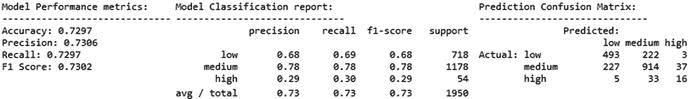

图 9-23。

Model performance metrics for decision tree for wine quality predictive model

```py
In [21]: from sklearn.tree import DecisionTreeClassifier
    ...: # train the model
    ...: wqp_dt = DecisionTreeClassifier()
    ...: wqp_dt.fit(wqp_train_SX, wqp_train_y)
    ...: # predict and evaluate performance
    ...: wqp_dt_predictions = wqp_dt.predict(wqp_test_SX)
    ...: meu.display_model_performance_metrics(true_labels=wqp_test_y,
    ...:                     predicted_labels=wqp_dt_predictions, classes=wqp_label_names)

```

如图 [9-23](#Fig23) 所示，我们得到了总体 F1 分数和大约 73%的模型准确度，这对于一个开始来说是不错的。查看基于类别的统计数据；我们可以看到高质量葡萄酒样品的召回是相当糟糕的，因为它们中的许多都被错误地归类为中低质量等级。这是意料之中的，因为我们没有很多高质量葡萄酒的训练样本，如果你记得我们之前的训练样本大小的话。考虑到低质量和高质量的葡萄酒样本，我们至少应该尝试看看我们是否可以防止我们的模型预测低质量的葡萄酒为高，同样也防止预测高质量的葡萄酒为低。解释这个模型，您可以使用下面的代码来查看基于我们的模型所学习的模式的特性重要性分数。

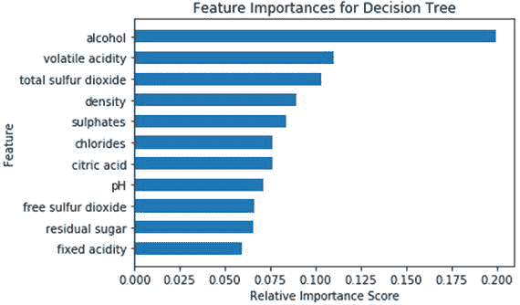

图 9-24。

Feature importances obtained from our decision tree model

```py
In [22]: wqp_dt_feature_importances = wqp_dt.feature_importances_
    ...: wqp_dt_feature_names, wqp_dt_feature_scores = zip(*sorted(zip(wqp_feature_names,
    ...:                                    wqp_dt_feature_importances), key=lambda x: x[1]))
    ...: y_position = list(range(len(wqp_dt_feature_names)))
    ...: plt.barh(y_position, wqp_dt_feature_scores, height=0.6, align='center')
    ...: plt.yticks(y_position , wqp_dt_feature_names)
    ...: plt.xlabel('Relative Importance Score')
    ...: plt.ylabel('Feature')
    ...: t = plt.title('Feature Importances for Decision Tree')

```

从图 [9-24](#Fig24) 中我们可以清楚地看到，与我们之前的模型相比，最重要的特征发生了变化。`Alcohol`和`volatile` `acidity`占据前两位，`total sulfur dioxide`似乎是对葡萄酒类型和质量进行分类的最重要的特征之一(如图 [9-20](#Fig20) )。如果您还记得，我们之前提到过，您还可以轻松地从决策树模型中可视化决策树结构，并检查它从新数据样本预测中使用的底层功能中学习到的决策规则。下面的代码帮助我们可视化决策树。

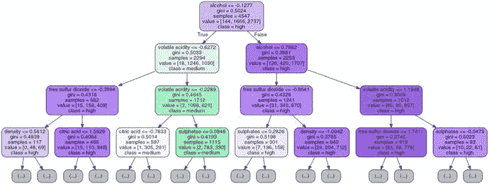

图 9-25。

Visualizing our decision tree model

```py
In [23]: from graphviz import Source
    ...: from sklearn import tree
    ...: from IPython.display import Image
    ...:
    ...: graph = Source(tree.export_graphviz(wqp_dt, out_file=None, class_names=wqp_label_names,
    ...:                                    filled=True, rounded=True, special_characters=False,
    ...:                                    feature_names=wqp_feature_names, max_depth=3))
    ...: png_data = graph.pipe(format='png')
    ...: with open('dtree_structure.png','wb') as f:
    ...:     f.write(png_data)
    ...: Image(png_data)

```

我们的决策树模型有大量的节点和分支，因此我们基于前面的代码片段可视化了最大深度为三的树。你可以从图 [9-25](#Fig25) 中的树开始观察决策规则，其中开始的分裂由`alcohol <= -0.1277`的规则决定，随着每个是\否决策分支的分裂，当我们在每个深度级别下降到树中时，我们有进一步的决策节点。类别变量是我们试图预测的，即葡萄酒质量是低、中还是高，而值决定了每个实例中当前决策节点中每个类别的样本总数。`gini`参数基本上是用于在每个决策节点确定和测量分割质量的标准。最佳分割可以通过基尼系数、基尼系数或信息增益等指标来确定。只是给你一些背景，基尼系数是一个有助于最小化错误分类概率的指标。数学上通常表示为:

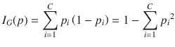

在我们有 C 个类别要预测的情况下，p <sub>i</sub> 是被标记为类别 I 的项目的分数或者具有被选择的类别标签 I 的实例的概率度量，并且(1 - p <sub>i</sub> 是对该项目进行分类的错误或者错误分类度量。基尼系数的计算方法是将 C 类中每个类别标签的分类实例分数的平方相加，然后从 1 中减去结果。感兴趣的读者可以查阅一些关于决策树的标准文献，如果他们有兴趣深入研究熵和基尼系数之间的差异，或者理解更复杂的数学细节。

继续推进我们改进葡萄酒质量预测模型的任务，让我们看看一些集成建模方法。集成模型是典型的机器学习模型，其组合或采用每个单独的基本模型估计器的预测的加权(平均\多数)投票，该基本模型估计器已经使用它们自己的监督方法建立。与每个单独的基础模型相比，集合被期望在基础数据上更好地概括，更稳健，并且做出更好的预测。集合模型可以分为三大类。

*   Bagging 方法:术语 bagging 代表 bootstrap aggregating，其中集成模型试图通过组合在随机生成的训练样本上训练的单个基础模型的预测来提高预测准确性。自举样本，即具有替换的独立样本，取自原始训练数据集，并且在这些采样数据集上建立几个基本模型。在任何情况下，对于集合模型，取来自单个估计器的所有预测的平均值来进行最终预测。随机抽样试图减少模型方差，减少过度拟合，并提高预测精度。例子包括非常流行的随机森林。
*   Boosting 方法:与根据组合或平均原理工作的 bagging 方法相反，在 boosting 方法中，我们通过依次训练每个基本模型估计器来逐步建立集合模型。训练每个模型包括特别强调学习以前被错误分类的实例。这个想法是把几个基础差的学习者组合起来，形成一个强大的合奏。弱学习者在训练数据的多次迭代中被顺序训练，在每个再训练阶段插入权重修改。在弱基础学习者的每次重新训练中，较高的权重被分配给那些先前被错误分类的训练实例。因此，这些方法试图集中于在先前训练序列中错误预测的训练实例。放大的模型容易过度拟合，所以应该非常小心。示例包括梯度提升、AdaBoost 和非常流行的 XGBoost。
*   堆叠方法:在基于堆叠的方法中，我们首先在训练数据上建立多个基础模型。然后，通过将来自这些模型的输出预测作为其用于训练的附加输入来建立最终集成模型，以进行最终预测。

现在让我们尝试使用随机森林建立一个模型，这是一种非常流行的打包方法。在随机森林模型中，每个基本学习者是在训练数据的引导样本上训练的决策树模型。除此之外，当我们想要分割树中的决策节点时，分割是从所有特征的随机子集选择的，而不是从所有特征中选择最佳分割。由于这种随机性的引入，偏差增加，并且当我们对森林中所有树木的结果进行平均时，总体方差减少，从而给我们一个概括良好的稳健的集合模型。我们将使用来自`scikit-learn`的`RandomForestClassifier`,它对来自森林中所有树的概率预测进行平均，用于最终预测，而不是获取实际的预测投票，然后对其进行平均。


图 9-26。

Model performance metrics for random forest for wine quality predictive model

```py
In [24]: from sklearn.ensemble import RandomForestClassifier
    ...: # train the model
    ...: wqp_rf = RandomForestClassifier()
    ...: wqp_rf.fit(wqp_train_SX, wqp_train_y)
    ...: # predict and evaluate performance
    ...: wqp_rf_predictions = wqp_rf.predict(wqp_test_SX)
    ...: meu.display_model_performance_metrics(true_labels=wqp_test_y,
    ...:                                      predicted_labels=wqp_rf_predictions,
    ...:                                      classes=wqp_label_names)

```

如图 [9-26](#Fig26) 所示，测试数据集上的模型预测结果描绘了总体 F1 分数和大约 77%的模型准确度。这无疑比我们仅用决策树获得的结果提高了 4%,证明了集成学习工作得更好。

进一步改善这一结果的另一种方法是模型调整。更具体地说，模型有可以调整的超参数，正如我们之前在第 [5](05.html) 章的“模型调整和超参数调整”部分中详细讨论的那样。超参数也称为元参数，通常在我们开始模型训练过程之前设置。这些超参数不依赖于从训练模型的基础数据中导出。通常，这些超参数代表一些高级概念或旋钮，可用于在训练期间调整和调节模型，以提高其性能。我们的随机森林模型有几个超参数，您可以按如下方式查看其默认值。

```py
In [25]: print(wqp_rf.get_params())
{'bootstrap': True, 'random_state': None, 'verbose': 0, 'min_samples_leaf': 1, 'min_weight_fraction_leaf': 0.0, 'max_depth': None, 'class_weight': None, 'max_leaf_nodes': None, 'oob_score': False, 'criterion': 'gini', 'n_estimators': 10, 'max_features': 'auto', 'min_impurity_split': 1e-07, 'n_jobs': 1, 'warm_start': False, 'min_samples_split': 2}

```

从前面的输出中，您可以看到许多超参数。我们建议在 [`http://scikit-learn.org/stable/modules/generated/sklearn.ensemble.RandomForestClassifier.html`](http://scikit-learn.org/stable/modules/generated/sklearn.ensemble.RandomForestClassifier.html) 查看官方文档，以了解每个参数的更多信息。对于超参数调整，我们将保持简单，并将我们的注意力集中在代表森林集合模型中基树模型总数的`n_estimators`和代表每次最佳分割期间要考虑的特征数量的`max_features`上。我们使用带有五重交叉验证的标准网格搜索方法来选择最佳超参数。

```py
In [26]: from sklearn.model_selection import GridSearchCV
    ...:
    ...: param_grid = {
    ...:                 'n_estimators': [100, 200, 300, 500],
    ...:                 'max_features': ['auto', None, 'log2']    
    ...:               }
    ...:
    ...: wqp_clf = GridSearchCV(RandomForestClassifier(random_state=42), param_grid, cv=5,
    ...:                        scoring='accuracy')
    ...: wqp_clf.fit(wqp_train_SX, wqp_train_y)
    ...: print(wqp_clf.best_params_)
{'max_features': 'auto', 'n_estimators': 200}

```

我们可以在前面的输出中看到网格搜索后获得的超参数的选择值。我们有 200 个估算器和`auto`最大特征，它代表在最佳分割操作中要考虑的特征总数的平方根。评分参数设置为准确性，以评估模型的最佳准确性。您可以将它设置为其他参数，以根据 F1 得分、精确度、召回率等其他指标来评估模型。详情请查看 [`http://scikit-learn.org/stable/modules/model_evaluation.html#scoring-parameter`](http://scikit-learn.org/stable/modules/model_evaluation.html#scoring-parameter) 。您可以查看所有超参数组合的网格搜索结果，如下所示。

```py
In [27]: results = wqp_clf.cv_results_
    ...: for param, score_mean, score_sd in zip(results['params'], results['mean_test_score'],
                                                                     results['std_test_score']):
    ...:     print(param, round(score_mean, 4), round(score_sd, 4))
{'max_features': 'auto', 'n_estimators': 100} 0.7928 0.0119
{'max_features': 'auto', 'n_estimators': 200} 0.7955 0.0101
{'max_features': 'auto', 'n_estimators': 300} 0.7941 0.0086
{'max_features': 'auto', 'n_estimators': 500} 0.795 0.0094
{'max_features': None, 'n_estimators': 100} 0.7847 0.0144
{'max_features': None, 'n_estimators': 200} 0.781 0.0149
{'max_features': None, 'n_estimators': 300} 0.784 0.0128
{'max_features': None, 'n_estimators': 500} 0.7858 0.0107
{'max_features': 'log2', 'n_estimators': 100} 0.7928 0.0119
{'max_features': 'log2', 'n_estimators': 200} 0.7955 0.0101
{'max_features': 'log2', 'n_estimators': 300} 0.7941 0.0086
{'max_features': 'log2', 'n_estimators': 500} 0.795 0.0094

```

前面的输出描述了所选的超参数组合及其对应的网格平均精度和标准偏差值。让我们用调整后的超参数训练一个新的随机森林模型，并在测试数据上评估它的性能。

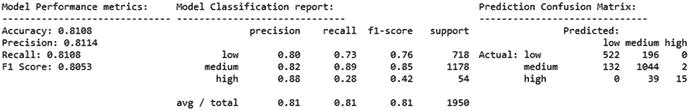

图 9-27。

Model performance metrics for tuned random forest for wine quality predictive model

```py
In [28]: wqp_rf = RandomForestClassifier(n_estimators=200, max_features='auto', random_state=42)
    ...: wqp_rf.fit(wqp_train_SX, wqp_train_y)
    ...:
    ...: wqp_rf_predictions = wqp_rf.predict(wqp_test_SX)
    ...: meu.display_model_performance_metrics(true_labels=wqp_test_y,
    ...:                        predicted_labels=wqp_rf_predictions, classes=wqp_label_names)

```

如图 [9-27](#Fig27) 所示，测试数据集上的模型预测结果描绘了总体 F1 分数和大约 81%的模型准确度。考虑到我们在调整之前从初始随机森林模型获得了 4%的改进，以及从基本决策树模型获得了 8%的总体改进，这是非常好的。我们还可以看到，没有低质量的葡萄酒样品被误归类为高。同样，也没有高质量的葡萄酒样品被错误地归类为低质量。中等和高\低质量的葡萄酒样本之间有相当大的重叠，但考虑到数据和类别分布的性质，这是意料之中的。

对基于集成的方法建模的另一种方式是 boosting。一种非常流行的方法是 XGBoost，它代表极端梯度提升。它是梯度推进机器(GBM)模型的变体。该模型在数据科学社区中非常受欢迎，因为它在一些数据科学挑战和比赛中表现出色，尤其是在 Kaggle 上。为了使用这个模型，您可以在 Python 中安装`xgboost`包。关于这个框架的详细信息，请随时查看位于 [`http://xgboost.readthedocs.io/en/latest`](http://xgboost.readthedocs.io/en/latest) 的官方网站，它提供了关于安装、模型调整等更多内容的详细文档。功劳归于分布式机器学习社区，通常被称为 DMLC，因为它创建了 XGBoost 框架和流行的 MXNet 深度学习框架。梯度提升使用我们之前讨论过的用于集成的提升方法的原理，并且它使用梯度下降来最小化添加新的弱基础学习器时的错误或损失。深入模型内部的细节超出了当前的范围，但是我们建议查看 [`http://xgboost.readthedocs.io/en/latest/model.html`](http://xgboost.readthedocs.io/en/latest/model.html) 来很好地了解 boosted 树和 XGBoost 的原理。我们首先在我们的数据上训练了一个基本的 XGBoost 模型，获得了大约 74%的总体准确性。在使用网格搜索对模型进行调优之后，我们使用以下参数值对模型进行了训练，并评估了它在测试数据上的性能(jupyter 笔记本中提供了详细的分步片段)。

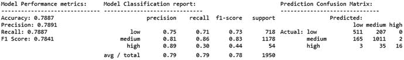

图 9-28。

Model performance metrics for tuned XGBoost model for wine quality predictive model

```py
In [29]: import os
    ...: mingw_path = r'C:\mingw-w64\mingw64\bin'
    ...: os.environ['PATH'] = mingw_path + ';' + os.environ['PATH']
    ...: import xgboost as xgb
    ...:
    ...: # train the model on tuned hyperparameters
    ...: wqp_xgb_model = xgb.XGBClassifier(seed=42, max_depth=10, learning_rate=0.3,
                                          n_estimators=100)
    ...: wqp_xgb_model.fit(wqp_train_SX, wqp_train_y)
    ...: # evaluate and predict performance
    ...: wqp_xgb_predictions = wqp_xgb_model.predict(wqp_test_SX)
    ...: meu.display_model_performance_metrics(true_labels=wqp_test_y,
    ...:                        predicted_labels=wqp_xgb_predictions, classes=wqp_label_names)

```

如图 [9-28](#Fig28) 所示，测试数据集上的模型预测结果描绘了总体 F1 分数和大约 79%的模型准确度。尽管随机森林的性能稍好，但它的性能肯定比决策树之类的基本模型要好。尝试添加更多的超参数来调整模型，看看是否可以获得更好的模型。如果您确实找到了一个，请随时向我们的存储库发送请求！

我们已经使用多种技术成功构建了一个不错的葡萄酒质量分类器，也看到了模型调整和验证的重要性。让我们用我们最好的模型，在它上面运行一些模型解释任务，试图更好地理解它。首先，我们可以查看数据集中各种要素的要素重要性等级。下面的代码片段显示了使用`skater`的比较特性重要性图，以及从`scikit-learn`模型本身获得的默认特性重要性。我们使用`skater`构建了一个`Interpretation`和`InMemoryModel`对象，这对我们将来的模型解释分析很有用。

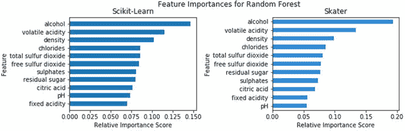

图 9-29。

Comparative feature importance analysis obtained from our tuned random forest model

```py
In [31]: from skater.core.explanations import Interpretation

    ...: from skater.model import InMemoryModel
    ...: # leveraging skater for feature importances
    ...: interpreter = Interpretation(wqp_test_SX, feature_names=wqp_feature_names)
    ...: wqp_im_model = InMemoryModel(wqp_rf.predict_proba, examples=wqp_train_SX,
                                     target_names=wqp_rf.classes_)
    ...: # retrieving feature importances from the scikit-learn estimator
    ...: wqp_rf_feature_importances = wqp_rf.feature_importances_
    ...: wqp_rf_feature_names, wqp_rf_feature_scores = zip(*sorted(zip(wqp_feature_names,
                                           wqp_rf_feature_importances), key=lambda x: x[1]))
    ...: # plot the feature importance plots
    ...: f, (ax1, ax2) = plt.subplots(1, 2, figsize=(10, 3))
    ...: t = f.suptitle('Feature Importances for Random Forest', fontsize=12)
    ...: f.subplots_adjust(top=0.85, wspace=0.6)
    ...: y_position = list(range(len(wqp_rf_feature_names)))
    ...: ax1.barh(y_position, wqp_rf_feature_scores, height=0.6, align='center',
                 tick_label=wqp_rf_feature_names)
    ...: ax1.set_title("Scikit-Learn")
    ...: ax1.set_xlabel('Relative Importance Score')
    ...: ax1.set_ylabel('Feature')
    ...: plots = interpreter.feature_importance.plot_feature_importance(wqp_im_model,
                                                                    ascending=False, ax=ax2)
    ...: ax2.set_title("Skater")
    ...: ax2.set_xlabel('Relative Importance Score')
    ...: ax2.set_ylabel('Feature')

```

我们可以从图 [9-29](#Fig29) 中清楚地观察到，两个图中最重要的特性是一致的，考虑到我们只是在同一型号上使用不同的接口，这是意料之中的。最重要的两个特性是`alcohol`的容量和`volatile acidity`的内容。我们将很快使用它们进行进一步的分析。但是现在，让我们看看模型的 ROC 曲线和曲线下面积(AUC)统计。绘制二元分类器的 ROC 曲线很容易，但是当您处理多类分类器(在我们的例子中是 3 类)时，您会怎么做呢？有几种方法可以做到这一点。您需要将输出二进制化。一旦执行了这个操作，您就可以为每个类标签绘制一条 ROC 曲线。除此之外，您还可以遵循两个聚合指标来计算平均 ROC 度量。微平均涉及通过将每个预测元素视为二元预测，在整个预测空间上绘制 ROC 曲线。因此，对每个预测分类决策给予相等的权重。宏平均涉及在平均时给予每个类标签相等的权重。我们的`model_evaluation_utils`模块有一个漂亮的可定制功能`plot_model_roc_curve(...)`，它可以帮助绘制具有微观和宏观平均能力的多类分类器 ROC 曲线。我们建议您检查一下代码，它是不言自明的。现在让我们为我们的随机森林分类器绘制 ROC 曲线。

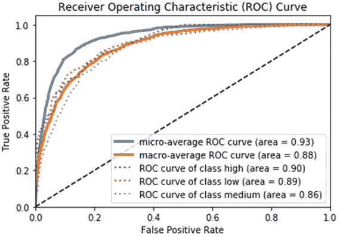

图 9-30。

ROC curve for our tuned random forest model

```py
In [32]: meu.plot_model_roc_curve(wqp_rf, wqp_test_SX, wqp_test_y)

```

您可以在图 [9-30](#Fig30) 中看到我们调整后的随机森林模型的各种 ROC 图(每类和平均)。根据我们所见，AUC 相当不错。虚线表示每类 ROC 曲线，粗体线是宏观和微观平均 ROC 曲线。现在让我们重温一下我们最重要的两个特征——酒精和挥发性酸度。让我们使用它们，并尝试绘制我们的随机森林模型的决策面\边界，类似于我们之前在图 [9-22](#Fig22) 中为基于逻辑回归的葡萄酒类型分类器所做的工作。

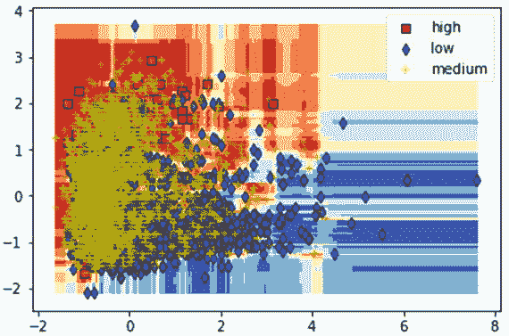

图 9-31。

Visualizing the model decision surface for our tuned random forest model

```py
 In [33]: feature_indices = [i for i, feature in enumerate(wqp_feature_names)
    ...:                        if feature in ['alcohol', 'volatile acidity']]
    ...: meu.plot_model_decision_surface(clf=wqp_rf,
    ...:                       train_features=wqp_train_SX[:, feature_indices],
    ...:                       train_labels=wqp_train_y, plot_step=0.02, cmap=plt.cm.RdYlBu,
    ...:                       markers=[',', 'd', '+'], alphas=[1.0, 0.8, 0.5],
    ...:                       colors=['r', 'b', 'y'])

```

图 [9-31](#Fig31) 中描绘的曲线向我们展示了这三个等级绝对不像我们的红葡萄酒和白葡萄酒的葡萄酒类型分类器那样容易区分。当然，与具有两个最重要特征的超曲面相比，可视化具有多个特征的超曲面变得更加困难，但是该图应该可以让您很好地了解模型能够很好地区分类别，尽管存在一定的重叠，特别是对于具有高质量评级和低质量评级葡萄酒样本的中等质量评级葡萄酒样本。

让我们看看一些类似于我们在第七章[中所做的模型预测解释，在那里我们分析了电影评论的观点。为此，我们将利用`skater`并查看模型预测。我们将尝试解释为什么该模型预测了一个类别标签，以及哪些特征对其决策有影响。首先，我们使用下面的代码片段构建一个`LimeTabularExplainer`对象，这将帮助我们解释和说明预测。](07.html)

```py
from skater.core.local_interpretation.lime.lime_tabular import LimeTabularExplainer

exp = LimeTabularExplainer(wqp_train_SX, feature_names=wqp_feature_names,
                           discretize_continuous=True,
                           class_names=wqp_rf.classes_)

```

现在让我们看看来自测试数据集的两个葡萄酒样本实例。第一个例子是低质量等级的葡萄酒。我们使用`top_labels`参数以最大概率\置信度显示预测类别的解释。您可以将其设置为 3，以查看所有三个类别标签的相同内容。

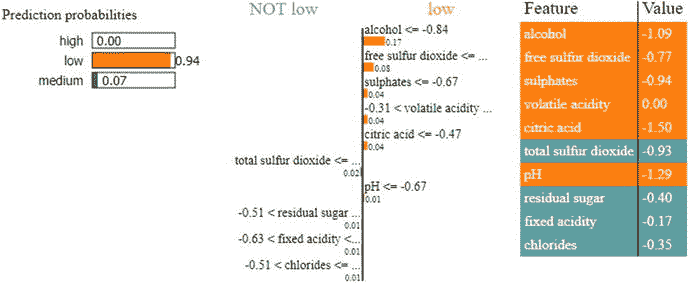

图 9-32。

Model interpretation for our wine quality model's prediction for a low quality wine

```py
exp.explain_instance(wqp_test_SX[10], wqp_rf.predict_proba, top_labels=1).show_in_notebook()

```

图 [9-32](#Fig32) 中描述的结果向我们展示了模型预测葡萄酒质量低的主要原因。我们可以看到最重要的特征是`alcohol`，考虑到我们目前为止从特征重要性和模型决策面解释中获得的信息，这是有意义的。此处描述的每个对应特征的值是在特征缩放后获得的缩放值。让我们来解读另一个预测，这一次是对高品质葡萄酒的预测。

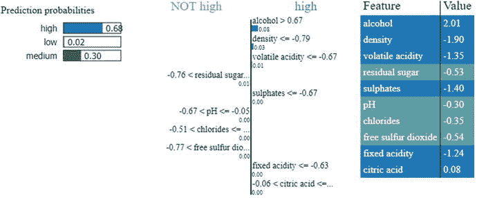

图 9-33。

Model interpretation for our wine quality model's prediction for a high quality wine

```py
exp.explain_instance(wqp_test_SX[747], wqp_rf.predict_proba, top_labels=1).show_in_notebook()

```

从图 [9-33](#Fig33) 的解释中，我们可以看到负责模型正确预测葡萄酒质量为高的特征，主要特征仍然是体积`alcohol`(除了其他特征如`density`、`volatile acidity`等)。您还可以注意到图 [9-32](#Fig32) 和图 [9-33](#Fig33) 中描述的两种情况下酒精比例值的明显差异。

为了总结我们对模型解释的讨论，我们将讨论部分依赖图以及它们在我们的场景中是如何有用的。一般来说，部分相关性通过保持其他特征不变来帮助描述特征对模型预测决策的边际影响。因为很难可视化高维特征空间，通常使用一个或两个有影响的重要特征来可视化部分依赖图。`scikit-learn`框架有类似`partial_dependence(...)`和`plot_partial_dependence(...)`的函数，但不幸的是，在撰写本书时，这些函数只对 GBM 这样的 boosting 模型有效。`skater`的美妙之处在于，我们可以在任何模型上构建部分依赖图，包括我们调优的随机森林模型。我们将利用`skater's Interpretation`对象`interpreter`，以及`InMemoryModel object`、`wqp_im_model`，基于我们之前在计算特性重要性时创建的随机森林模型。下面的代码描述了基于最重要的特征`alcohol`的模型预测函数的单向部分相关图。

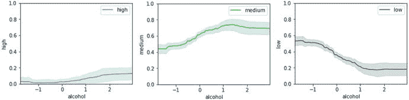

图 9-34。

One-way partial dependence plots for our random forest model predictor based on alcohol

```py
In [36]: axes_list = interpreter.partial_dependence.plot_partial_dependence(['alcohol'],
    ...:               wqp_im_model, grid_resolution=100, with_variance=True, figsize = (4, 3))
    ...: axs = axes_list[0][3:]
    ...: [ax.set_ylim(0, 1) for ax in axs];

```

从图 [9-34](#Fig34) 中的曲线图，我们可以看到，随着酒精含量的增加，模型预测器预测葡萄酒为中等或高质量的置信度\概率增加，同样，预测葡萄酒为低质量的概率减少。这表明类别预测与酒精含量之间肯定存在某种关系，同样，酒精对类别`high`预测的影响相当低，考虑到高质量葡萄酒的训练样本较少，这是可以预料的。现在，让我们绘制双向部分相关图，以解释我们的随机森林预测值对酒精和挥发性酸度的依赖关系，这是两个最有影响的特征。

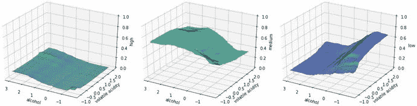

图 9-35。

Two-way partial dependence plots for our random forest model predictor based on alcohol and volatile acidity

```py
 In [42]: plots_list = interpreter.partial_dependence.plot_partial_dependence([('alcohol',
    ...:                                                               'volatile acidity')],
    ...:                    wqp_im_model, n_samples=1000, figsize=(10, 5), grid_resolution=100)
    ...: axs = plots_list[0][3:]
    ...: [ax.set_zlim(0, 1) for ax in axs];

```

图 [9-35](#Fig35) 中的曲线与图 [9-34](#Fig34) 中的曲线有些相似。对于预测高品质葡萄酒，由于缺乏训练数据，虽然随着酒精含量的增加和挥发性酸度的相应降低，高品质葡萄酒等级预测存在一些依赖性，但这种依赖性非常弱，正如我们在最左侧的图中所看到的。随着酒精含量的相应减少和挥发性酸度水平的增加，似乎也强烈依赖于低葡萄酒质量等级的预测。这在最右边的图中清晰可见。中间的情节讲的是中等酒质等级预测。我们可以观察到预测与酒精含量的相应增加和挥发性酸度水平的降低有很强的相关性。这应该给你一个很好的基础，利用部分依赖图来更深入地研究模型解释。

## 摘要

在以案例研究为导向的这一章中，我们处理、分析并模拟了一个与葡萄酒样本相关的数据集，重点是类型和质量评级。特别强调的是探索性数据分析，这常常被急于构建和部署模型的数据科学家所忽略。关于葡萄酒数据集中的各种特性，我们探讨了该领域的一些背景知识，并对此进行了详细解释。我们建议除了专注于数学、机器学习和分析之外，始终探索你正在解决问题的领域，并在需要时寻求主题专家的帮助。

我们研究了多种方法来分析和可视化我们的数据及其特征，包括描述性和推断性统计以及单变量和多变量分析。详细解释了用于可视化分类和多维数据的特殊技术。目的是让您在这些原则的基础上构建，并在将来重用类似的原则和代码来可视化您自己的数据集上的属性和关系。本章的两个主要目标是建立预测模型，根据葡萄酒的各种理化属性预测葡萄酒的种类和质量。我们涵盖了各种预测模型，包括像逻辑回归这样的线性模型和包括深度神经网络在内的复杂模型。除此之外，我们还介绍了基于树的模型，如决策树和集成模型，如随机森林和非常流行的极端梯度推进模型。详细讨论了模型训练、预测、评估、调整和解释的各个方面。我们建议您不仅要构建模型，还要使用验证指标对其进行全面评估，在必要时使用超参数调整，并利用集成建模来构建稳健、通用和卓越的模型。还特别关注解释模型的概念和技术，包括分析特征重要性，可视化模型 ROC 曲线和决策面，解释模型预测，以及可视化部分相关图。