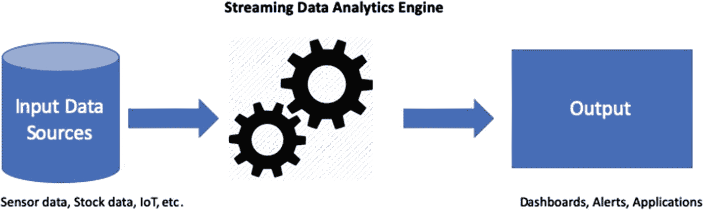
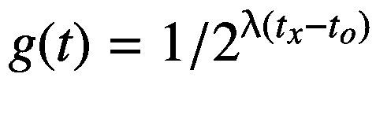
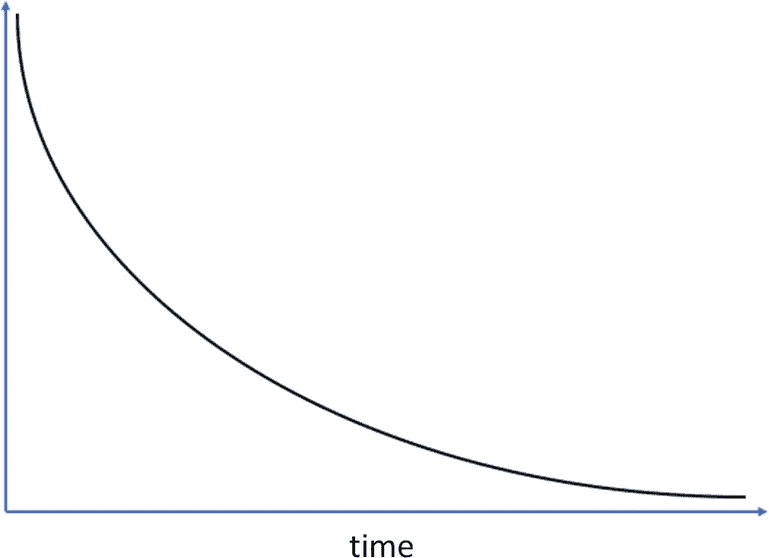
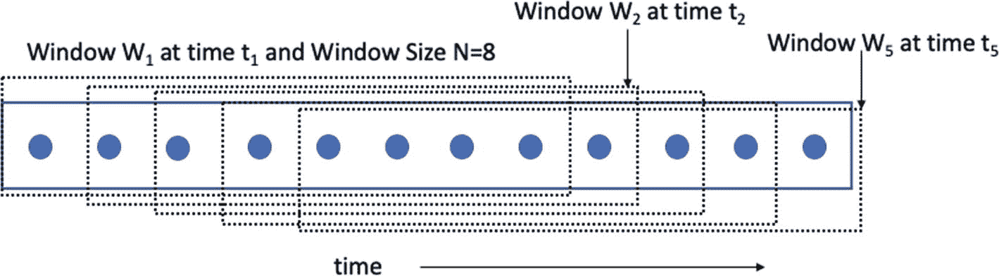
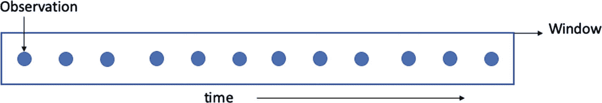
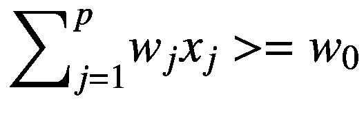
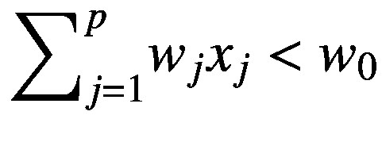
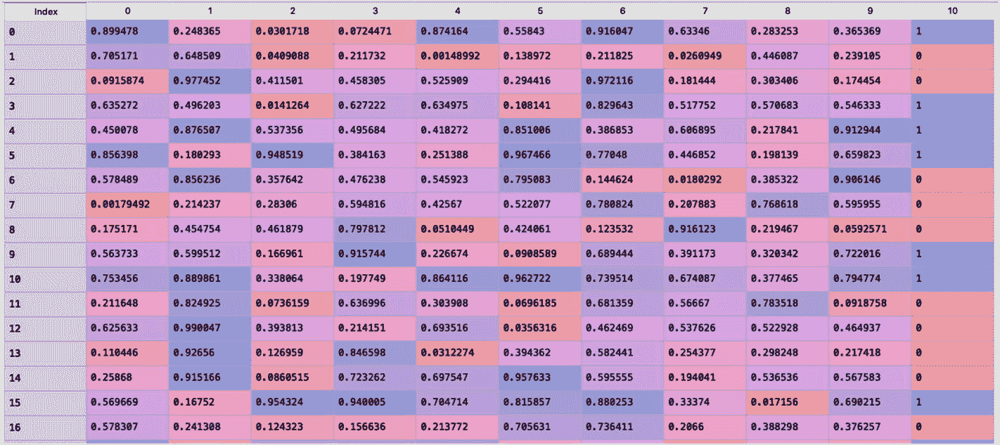
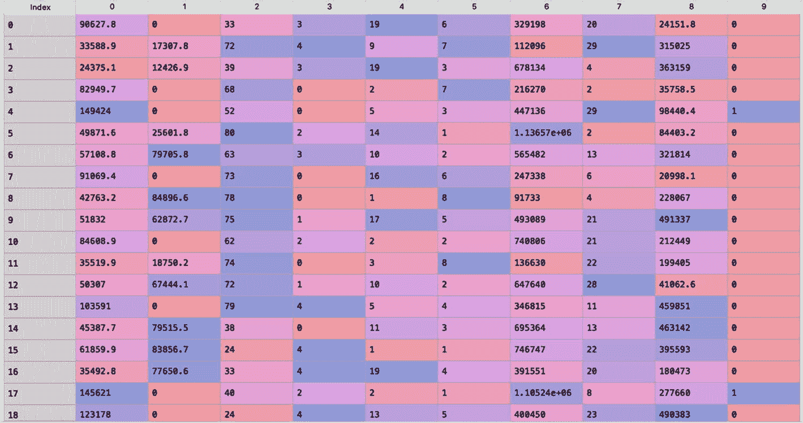
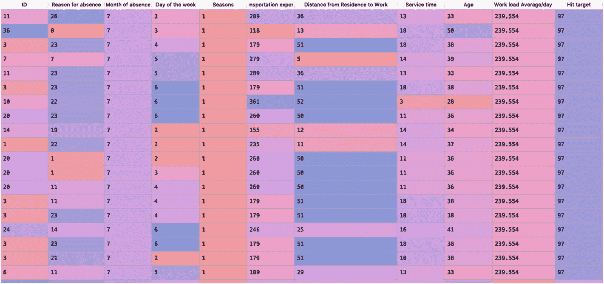

# 一、流式数据简介

本章将向您介绍流数据、它的各种挑战、它的一些现实业务应用、各种窗口技术以及增量和在线学习算法的概念。本章还介绍了 Python 中的 scikit-multiflow 框架和一些流数据生成器。

请注意，Python 中还有一些其他框架，可用于流数据的机器学习。本书中使用了 scikit-multiflow 框架，因为我坚信这个包(考虑到其广泛的实现技术和丰富的文档)是 Python 用户学习流数据的在线/增量机器学习技术的良好起点。

## 流式数据

近年来，世界见证了数据洪流。从各种来源生成的数据量有了巨大的增长。主要的数据源是互联网、日志数据、传感器数据、电子邮件、RFID、POS 交易数据等等。从这些来源收集的数据可以分为结构化、半结构化和非结构化数据。最近的技术进步是这种“数据爆炸”的主要原因，使数据存储更便宜，并使连续收集数据成为可能。零售、社交媒体和 IT 等行业的几乎所有公司都面临着数据爆炸。他们试图找出处理和分析他们生成的海量数据的方法，并获得可操作的见解。

Big Data

我们大多数人都听说过术语*大数据*。麦肯锡全球研究所将大数据定义为“其规模超出典型数据库软件工具捕获、存储、管理和分析能力的数据集” [1](#Par102) 。大数据的基本特征可以用以字母 V 开头的四个词来定义:数量、速度、多样性和准确性。大数据中的“大”不仅仅是指数据的大小或数量，还需要考虑其他的“大”。

技术的进步使得连续收集数据成为可能。我们被各种日常交易中的数据淹没(例如，沃尔玛、塔吉特等零售店的 POS 交易)。)、传感器数据、web 数据、社交媒体数据、股票价格、搜索查询、点击流数据等等。这都是高速数据的来源；即流式数据。持续数据流的其他来源包括运营监控、在线广告、移动数据和物联网(IoT)。

流数据或数据流是来自数据源的无限且连续的数据流，以非常高的速度到达。因此，流数据是大数据的子集，它解决了大数据的*速度*方面的问题。流数据和静态数据之间的一些区别特征是数据的松散结构、始终开启和始终流动[ [2](#Par103) ]。与静态数据不同，流数据中没有严格定义结构。它是“永远在线”也就是说，数据总是可用的，因为新数据不断生成。

作为如何在商业中利用流数据的例子，让我们看看在线广告。像脸书这样的社交媒体巨头实时收集用户行为数据。脸书每个月都有超过 20 亿的活跃用户，这可以让你了解收集数据的规模。

脸书的大部分收入来自向用户展示广告。许多广告商加入了这个平台。脸书使用用户行为数据来选择与其用户相关的广告(即，以点击或购买的形式具有最大互动机会的广告)。他们执行在线广告的其他重要步骤(例如在“拍卖”中“出价”)。所有这一切几乎都是实时发生的(例如，每当你在脸书加载你的新闻页面或与其他应用程序(如 Messenger 或 Instagram)互动时)。

### 处理和分析流数据的需求

流数据提供实时或接近实时的分析。因为它是不断产生和永无止境的，存储如此巨大的数据，然后对其进行分析(就像批处理中所做的那样)是不可行的。必须“即时”分析流数据，以获得实时或接近实时的洞察力。

图 [1-1](#Fig1) 显示了流数据分析流程。来自各种来源的高速数据(传感器数据、股票行情数据等。)被流数据分析引擎实时或接近实时地摄取、处理和分析。生成的输出通过仪表板、应用程序或任何其他方式显示。



图 1-1

流式数据分析流程

流数据分析和洞察使组织的决策者能够实时做出增值决策。这就是为什么学术界和工业界的许多研究人员正在研究实时分析的新方法。传统的机器学习算法不起作用，因为流数据提供了一系列新的挑战。

下一节讨论处理流数据的挑战。

## 流式数据的挑战

以下是处理流数据的一些主要挑战。

*   不再可能多次传递数据。数据需要一次性处理。

*   数据流可能会随时间演变，这是一种被称为*概念漂移*的行为。流数据的挖掘算法需要解决这个问题，这样模型就会很快过时。

*   传输数据流所需的高速。

*   更高的内存需求。

用于流数据的机器学习和数据挖掘算法需要新的方法。静态数据的批处理算法不起作用。我们来看一个简单的线性回归方法。在批处理中，整个训练数据集都是可用的。使用 OLS(普通最小二乘法)将线性回归应用于整个数据集，以获得贝塔系数，从而找到因变量和自变量之间的关系(即，贝塔系数表示自变量(*x*)单位变化的因变量( *y* )的平均值)。

然而，在流数据中，这是不可行的。你永远无法访问所有的数据，因为数据是不断流入的。这里你需要在线学习或增量学习算法，它在每个例子或数据元组出现时更新参数(在这种情况下是贝塔系数)。一种这样的实现是利用 SGD(随机梯度下降)的线性回归。在接下来的章节中，我们将深入探讨在线学习/增量学习技术。

重要的是，与典型的大数据分析不同，流数据不需要更多存储，因为旧数据会在一段时间后被丢弃。需要更智能、更快速的算法来处理和分析传入的快速流数据。算法应该能够在任何时候被查询时产生输出。

你现在应该明白为什么用流式数据的机器学习不同于批量数据的机器学习了。下一节将讨论流数据的一些实际应用。

## 流式数据的应用

在这个大数据时代，使用流数据的实时分析将会改变游戏规则。实时分析的口号是快速获得好的解决方案。以下是流数据实时分析的一些应用或用例。

*   **实时或接近实时的欺诈检测**。让我们以亚马逊为例。Amazon.com 上每天大约有 10 亿笔交易，但并不是所有的交易都是真实的。

*   **实时推荐**可以导致冲动性的顾客购买，这对电子商务公司来说是一个非常重要的命题。

*   **实时天气探测**对灾难和预警系统很有用。

*   **实时网络管理**包括监控和配置网络硬件和软件，以确保平稳运行。用例包括实时故障检测、实时监控链路带宽使用、提高网络资源利用率等。

*   **实时运营管理**包括供应链决策，如何时加油或再订购。

*   使用股票分笔成交点数据的算法交易。实时监控股票走势有助于交易相关决策。

*   **实时体育分析。**相关用例包括使用视频馈送和传感器数据等流数据源进行球员运动跟踪和表现分析。

*   **精准农业。**一个简单的使用案例是收集基于传感器的农业设备健康数据，通过预测设备故障发生的时间和地点并做出替代安排来最大限度地减少停机时间。

*   **安全事件监控**包括实时监控日志数据、主机系统和安全设备，以标记事件(例如发送警报)，如登录失败、恶意软件活动和其他可疑活动。

*   实时趋势是推特和谷歌趋势的一个特色。

*   **自动标注**。实时视频馈送中的对象的实时注释是一个相关的用例。这同样适用于图像或语音数据流。

在下一节中，您将了解用于分析流数据的各种窗口技术。

## 开窗技术

窗口可以定义为数据的快照—基于观察计数或基于时间[ [3](#Par104) ]。在流数据环境中，这是一种非常有用的技术，因为在任何时候都没有“完整的数据”可用。窗口可以有效地处理*概念漂移*，因为最近的数据点更加重要；较旧的数据点会被定期丢弃。通过使用*窗口技术* [ [5](#Par106) ，可以将批量学习方法转换为增量学习方法。开窗技术的类型包括滑动窗口模型、阻尼窗口模型和界标窗口模型[ [6](#Par107) ]。下面解释了每一种窗口技术。

*   *地标窗型号*。旧的数据点不会被丢弃。所有数据点都在窗口中累积。图 [1-2](#Fig2) 描绘了该模型。矩形代表窗口，蓝色圆圈代表数据。

*   *推拉窗模型*。这是丢弃旧数据点并只考虑最近数据点进行分析的一种流行方法。图 [1-3](#Fig3) 描绘了该模型。

*   *Damped window model* . The data points are weighted. Higher weight is given to recent data points. An *exponential fading strategy* is used to discard old data. An aging function *g*(*t*) is used.

    

λ是衰落因子， *t* <sub>*x*</sub> 是当前时间戳， *t* <sub>*o*</sub> 是原点时间戳(即创建窗口的时间)。您可以通过更改λ [ [7](#Par108) ]的值来影响旧数据点的丢弃。λ值越高，意味着旧数据点的权重越小。图 [1-4](#Fig4) 显示了阻尼窗口模型中数据点随时间的指数衰减。



图 1-4

阻尼窗口模型中数据点的指数衰减



图 1-3

滑动窗口模型



图 1-2

地标窗口模型

图 [1-2](#Fig2) 显示了一个标志窗口随时间累积数据点。随着更多数据点的到达，窗口大小会增加。这种窗口技术需要大量内存资源，尤其是在处理大型数据流时。

在滑动窗口模型中，如图 [1-3](#Fig3) 所示，“时间”是 x 轴，观测值(即蓝点)从左到右依次到达。最左边的观察值是最老的数据，最新的观察值在右边。

图 [1-3](#Fig3) 显示旧点不断被丢弃；窗口中只考虑最近的点。图 [1-3](#Fig3) 也显示了一个大小为 8 的窗口(即在一个瞬间包含 8 个数据点)。窗口在步骤= 1 中移动(即，窗口在步骤 1 滑动，其中最早的数据被丢弃)。

同样在图 [1-3](#Fig3) 中，在时间 t <sub>1</sub> 的窗口 W <sub>1</sub> 包含八个数据点。当新的数据点在时间 t <sub>2</sub> 到达时，W1 中最老的数据点被丢弃以形成具有八个数据点的窗口 W <sub>2</sub> ，包括最近的一个。滑动窗口模型只考虑最近的数据点；它会丢弃旧的。

Python 3 中实现了一个滑动窗口，如清单 [1-1](#PC1) 所示。它创建一个大小为 4 的窗口，并以 1 为步长移动。输入数组(`y`)由从 0 到 9 的十个整数组成。滑动窗口实现输出如清单 [1-2](#PC2) 所示。末端的滑动窗口有`None`，表示空值，因为没有新的数据点到达，但是窗口大小固定为 4。

```py
###############################################################
[0, 1, 2, 3]
[1, 2, 3, 4]
[2, 3, 4, 5]
[3, 4, 5, 6]
[4, 5, 6, 7]
[5, 6, 7, 8]
[6, 7, 8, 9]
[7, 8, 9, None]
[8, 9, None, None]
[9, None, None, None]
###############################################################

Listing 1-2Sliding Window Function Output

```

```py
###############################################################
# Import the relevant libraries
import itertools
from itertools import tee
from itertools import zip_longest as zip

def window(iterations, size):
    n = tee(iterations, size)
    for i in range(1, size):
        for each in n[i:]:
            next(each, None)
    return zip(*n)

y=range(10)

for each in window(y, 4):
    print(list(each))
###############################################################

Listing 1-1Sliding Window Implementation

```

与滑动窗口技术不同，阻尼窗口模型给予最近的数据点更高的权重。使用指数衰减策略丢弃旧的数据点，如图 [1-4](#Fig4) 所示。相对较老的数据点比较新的数据点被更快地丢弃。通过这种方式，该窗口存储了旧的和新的数据点。然而，滑动窗口技术在流数据环境中更受欢迎。这是本书中主要的窗口技术。

在下一节中，您将了解增量学习和在线学习算法。

## 增量学习和在线学习

大多数标准的机器学习技术(有监督的或无监督的)都是*批学习*方法。也就是说，它们通常在静态/批处理数据集(即非流式数据集)上工作，其中整个数据是可用的，并且任何算法的多次通过都是可能的。然而，当应用于流数据时，由于概念漂移，这些批量学习方法随着时间变得过时。在流数据环境中，需要一种不同类别的机器学习算法来解决其挑战。这类算法被称为*增量*或*在线学习算法*。

增量学习算法利用有限的资源工作，并且每当新的一批/小批数据到达时就频繁地更新模型参数。增量学习算法可以处理流数据中固有的概念漂移。在线学习算法与增量学习算法的不同之处在于，每当新的观察值到达时，模型参数就被更新。在在线学习算法中，你不需要等待少量数据的到来来更新模型参数。

可以通过使用具有滑动窗口[ [5](#Par106) ]的批量学习器来近似增量学习算法。在这种情况下，每当新的窗口(包括数据点)到达时，该模型被重新训练。您可以应用任何批处理学习器，如线性回归或逻辑回归算法，在数据流上使用滑动窗口来近似增量学习算法。

让我们来看看小批量梯度下降法和*随机梯度下降* (SGD)法。梯度下降法是一种非常流行的技术，用于寻找函数的最小值，在这种情况下是成本函数。下面解释如何做梯度下降算法。

1.  用随机值初始化参数。

2.  计算目标函数的梯度。

3.  使用梯度更新参数。

4.  每个特征的步长计算:步长=梯度*学习率。*学习率*是一个直接影响算法收敛的超参数。很小的学习率需要很长时间梯度下降算法才能收敛。学习率的非常高的值使得算法沿着斜坡向下迈出大的步伐，使得它可能错过全局最小值。

5.  计算新参数:新参数=旧参数–步长。

6.  重复步骤 2–5，直到梯度接近零。

梯度下降法是一种批量学习方法。在梯度方向上迈出一步之前，考虑整个训练数据。在大型数据集中，参数的单次更新需要很长时间。然而，小批量梯度下降算法是一种增量学习算法，其中每次处理小批量时，参数都会改变。但是 SGD 算法总是为每个训练观察更新模型参数。SGD 技术是在线学习算法的一个例子。

现在让我们来看看线性回归方法，这是一种线性模型，通过使用*普通最小二乘法* (OLS)方法计算每个预测变量的β系数来了解目标变量(Y)和预测变量(X)之间的关系。

您可以通过使用梯度下降优化技术来实现线性回归方法。线性回归是一种批量学习技术，其中梯度下降算法应用于整个训练以更新模型参数。但是，您可以通过使用小批量梯度下降算法将此方法转换为增量学习器。

清单 [1-3](#PC3) 用 Python [ [8](#Par109) ]中的小批量梯度下降算法实现了线性回归的函数。然后将这些函数应用于模拟数据集。

```py
###############################################################
# Import the libraries
import numpy as np
import matplotlib.pyplot as plt
import pandas as pd
from pandas import read_csv

np.random.seed(111)

# creating data
mean = np.array([6.0, 7.0])
covariance = np.array([[1.0, 0.94], [0.95, 1.2]])
df = np.random.multivariate_normal(mean, covariance, 500)

df.shape
# output- (10000, 2)

df
#Output-
#array([[6.97833668, 8.30414776],
#       [4.66509294, 5.31806407],
#       [6.88804517, 7.71734893],
#       ...,
#       [5.75153443, 6.73145512],
#       [4.93357924, 6.72570148],
#       [7.31794626, 8.4076224 ]])

X = df[:,:-1]
Y = df[:,-1]
# A column with all 1's is added
X_new = np.c_[np.ones((500, 1)), X]

# Random initialization of the estimate "reg_coef"
np.random.seed(333)
reg_coef = np.random.randn(2,1)

# here, size_batch_mini= minibatch size
# lr= learning rate
#  max_iters= number of batches used
lr=0.01
num = 100
max_iters = 100
size_batch_mini = 50

t0, t1 = 400, 1200
def lrs(step):
    return t0 / (step + t1)

reg_coef_all = []

step = 0
for j in range(max_iters):
    batches_index  = np.random.permutation(num)
    X_batches = X_new[batches_index]
    y_batches = Y[batches_index]
    for i in range(0, num, size_batch_mini):
        step += 1
        Yi = y_batches[i:i+size_batch_mini]
        Xi = X_batches[i:i+size_batch_mini]
        # compute the gradient
        gradient = 2/size_batch_mini * Xi.T.dot(Xi.dot(reg_coef) - Yi)
        lr = lrs(step)
        # update
        reg_coef = reg_coef - lr * gradient
        reg_coef_all.append(reg_coef)

# Output
reg_coef
reg_coef_all
###############################################################

Listing 1-3Implementation of Linear Regression with Mini-Batch Gradient Descent

```

类似地，通过使用 SGD 方法，可以将线性回归方法转换为在线学习方法。我强烈建议您使用到目前为止所讨论的思想，用 SGD 实现线性回归方法的函数。您可以参考清单 [1-3](#PC3) ，但是要确保每个观察值都有更新步骤。

scikit-learn 库有一个 SGDRegressor()函数来应用 SGD 的线性回归。清单 [1-4](#PC4) 是在模拟数据集上使用 SGD 应用线性回归的代码片段。

```py
###############################################################
# Import relevant libraries
import numpy as np
import pandas as pd
from sklearn.model_selection import train_test_split
from sklearn.linear_model import SGDRegressor
from sklearn.metrics import mean_squared_error, r2_score

np.random.seed(111)

# creating the dataset
mean = np.array([6.0, 7.0])
covariance = np.array([[1.0, 0.94], [0.95, 1.2]])
df = np.random.multivariate_normal(mean, covariance, 10000)

df.shape
# output- (10000, 2)
df
#Output-
#array([[6.97833668, 8.30414776],
#       [4.66509294, 5.31806407],
#       [6.88804517, 7.71734893],
#       ...,
#       [5.75153443, 6.73145512],
#       [4.93357924, 6.72570148],
#       [7.31794626, 8.4076224 ]])

X = df[:,:-1]
Y = df[:,-1]

## Split into train and test
train_X, test_X, train_y, test_y = train_test_split(X, Y, test_size=0.20, random_state=333)

### Use the SGD regressor
mod = SGDRegressor()

### Fit the model

mod.fit(train_X, train_y)
#SGDRegressor(alpha=0.0001, average=False, early_stopping=False, epsilon=0.1,
#             eta0=0.01, fit_intercept=True, l1_ratio=0.15,
#             learning_rate='invscaling', loss="squared_loss", max_iter=1000,
#             n_iter_no_change=5, penalty="l2", power_t=0.25, random_state=None,
#             shuffle=True, tol=0.001, validation_fraction=0.1, verbose=0,
#             warm_start=False)

### Print the coefficient and intercept values
print("Coefficients: \n", mod.coef_)
#Coefficients: [0.95096598]

print("Intercept", mod.intercept_)
#Intercept [1.17712595]

### Predict on the test data
pred = mod.predict(test_X)

# calculating the prediction error
error = np.sum(np.abs(test_y - pred) / test_y.shape[0])
print("Mean absolute error (MAE) = ", error)
# Mean absolute error (MAE) =  0.4493164833335055 ###############################################################

Listing 1-4Stochastic Gradient Descent Implementation Using scikit-learn

```

本节解释了增量学习和在线学习算法，并使用 Python 在线性回归环境中实现了其中的一些算法。在下一节中，将向您介绍 scikit-multiflow。

## Scikit-Multiflow 框架简介

scikit-multiflow 是一个用 Python [ [9](#Par110) ]分析流数据的框架。它是在 BSD 许可下发布的开源软件。需要一个用于流数据的 Python 开源机器学习库，类似于 scikit-learn 库[ [10](#Par111) ]多年来为静态/批量数据所做的事情。scikit-multiflow 框架建立在其他著名的开源框架之上，如 scikit-learn、MOA [ [11](#Par112) ]和 MEKA [ [12](#Par113) ]。

MOA 是最古老和最流行的数据流挖掘开源软件之一。它包含一组用于监督(分类、回归等)的流数据算法。)和无监督学习(聚类等。).MOA 是用 Java 开发的。

MEKA 是一个用于多标签学习和评估的开源软件。scikit-multiflow 补充了 scikit-learn(其主要重点是批量学习)，并有助于流数据研究中的机器学习。

scikit-multiflow 网站( [`https://scikit-multiflow.github.io/`](https://scikit-multiflow.github.io/) )提供官方文档和用户指南。

API 参考文件可在 [`https://scikit-multiflow.readthedocs.io/en/stable/api/api.html`](https://scikit-multiflow.readthedocs.io/en/stable/api/api.html) 获得。

scikit-multiflow 包源代码在 [`https://github.com/scikit-multiflow/scikit-multiflow`](https://github.com/scikit-multiflow/scikit-multiflow) 公开发布。

numpy 和 cython 是在安装 scikit-multiflow 之前需要安装的两个依赖项。

scikit-multiflow 仅适用于 Python 3.5 以上版本。

要从 Python 包索引(PyPI)安装 scikit-multiflow，请在命令提示符/终端中使用以下命令。

```py
$ pip install -U scikit-multiflow

```

scikit-multiflow 也可以使用以下命令从 conda-forge 安装。

```py
$ conda install -c conda-forge scikit-multiflow

```

本书使用 0.5.3 版本包，2020 年 6 月发布。

在下一节中，您将了解 scikit-multiflow 框架中可用的各种流数据生成器。

## 流式数据生成器

scikit-multiflow 框架包含许多流数据生成器，用于为实验和研究相关工作创建模拟数据流。超平面生成器是流行的流数据生成器之一。 *p* 维空间中的超平面是满足以下条件的点集( *x* )。


*x*<sub>T3【jT5】是 *x* 的第 *j* <sup>个</sup>坐标。 *w* 为重量 [13](#Par114) 。</sub>

对于目标变量，以下类型的观察值被标记为阳性。

T2】

以下类型的观察被标记为负面的。

T2】

超平面对于模拟作为方向的时变概念是有用的。超平面的位置可以通过调整权重的相对大小来改变。清单 [1-5](#PC7) 使用 scikit-multiflow 生成一个数据流，包括十个特征和一个目标变量。在将模拟数据存储在 CSV 文件中之前，它会生成 10，000 个观察值。图 [1-5](#Fig5) 是生成的数据集的快照。



图 1-5

使用超平面生成器生成的数据集快照

```py
#############################################################
# Import the relevant libraries
from skmultiflow.data import HyperplaneGenerator
import pandas as pd
import numpy as np

# Apply the HyperplaneGenerator() function
create = HyperplaneGenerator(random_state = 888, n_features= 10, noise_percentage = 0)
create.prepare_for_use()
X , Y = create.next_sample(10000)
data = pd.DataFrame(np.hstack((X, np.array([Y]).T)))

data.shape
# output- (10000, 11)

print(data.head())
# Output:
#         0         1         2         3   ...        7         8         9    10
#0  0.899478  0.248365  0.030172  0.072447  ...  0.633460  0.283253  0.365369  1.0
#1  0.705171  0.648509  0.040909  0.211732  ...  0.026095  0.446087  0.239105  0.0
#2  0.091587  0.977452  0.411501  0.458305  ...  0.181444  0.303406  0.174454  0.0
#3  0.635272  0.496203  0.014126  0.627222  ...  0.517752  0.570683  0.546333  1.0
#4  0.450078  0.876507  0.537356  0.495684  ...  0.606895  0.217841  0.912944  1.0
#
#[5 rows x 11 columns]

# Store the data in csv
data.to_csv('data_stream_hyperplane.csv', index=False)
###############################################################

Listing 1-5Streaming Data Generation Using the Hyperplane Generator

```

另一个流行的流数据生成器是 Agarwal 生成器。Agarwal 流生成器是训练决策树学习者最早的数据源之一[ [14](#Par115) ]。

清单 [1-6](#PC8) 使用 Agarwal 生成器生成数据流。该数据集的快照如图 [1-6](#Fig6) 所示。数据集有十列。最右边一列是二进制目标变量(0 或 1)。数据集中有九个要素。目标变量表示是否应该批准贷款。该数据集中的一些特征或预测变量是年龄、工资、教育水平、贷款额、房屋价值、邮政编码、佣金、汽车制造商和房屋拥有年限。



图 1-6

使用 Agarwal 生成器生成的数据集的快照

```py
###############################################################
# Import the relevant libraries
from skmultiflow.data import HyperplaneGenerator
import pandas as pd
import numpy as np

# Apply the HyperplaneGenerator() function
create = HyperplaneGenerator(random_state = 888, n_features= 10, noise_percentage = 0)
create.prepare_for_use()
X , Y = create.next_sample(10000)
data = pd.DataFrame(np.hstack((X, np.array([Y]).T)))

data.shape
# output- (10000, 11)

print(data.head())
# Output:
#         0         1         2         3   ...        7         8         9    10
#0  0.899478  0.248365  0.030172  0.072447  ...  0.633460  0.283253  0.365369  1.0
#1  0.705171  0.648509  0.040909  0.211732  ...  0.026095  0.446087  0.239105  0.0
#2  0.091587  0.977452  0.411501  0.458305  ...  0.181444  0.303406  0.174454  0.0
#3  0.635272  0.496203  0.014126  0.627222  ...  0.517752  0.570683  0.546333  1.0
#4  0.450078  0.876507  0.537356  0.495684  ...  0.606895  0.217841  0.912944  1.0
#
#[5 rows x 11 columns]

# Store the data in csv
data.to_csv('data_stream_hyperplane.csv', index=False)
###############################################################

Listing 1-6Agarwal Streaming Data Generation

```

以下是 scikit-multiflow 框架中可用的许多其他流数据生成器中的一些。

*   LED 流发生器和具有概念漂移的 LED 流发生器

*   正弦发生器和异常正弦发生器

*   混合数据流生成器

*   随机径向基函数流生成器和具有概念漂移的随机径向基函数流生成器

*   海流发电机

*   随机树流生成器

*   交错概念流生成器

*   波形流发生器

*   回归生成器

本节讨论了各种流数据生成器。在下一节中，您将学习如何从 CSV 文件创建数据流。

## 从 CSV 文件创建数据流

scikit-multiflow 数据模块中的 FileStream 方法从文件源创建数据流。截至 2020 年 9 月，仅支持 CSV 文件。您可以获取任何静态/批处理数据集，并将其转换为流数据。

作为演示，让我们看看在 UCI 机器学习库[ [16](#Par117) ]上公开的工作场所数据集[ [15](#Par116) ]上的一个缺勤。数据集是 CSV 格式的。它包含各种属性:员工 ID、缺勤原因、缺勤月份/日期/季节、员工年龄、每天的平均工作量、教育程度、身体质量指数、以小时为单位的缺勤时间等等。这个数据集有 21 个属性和 740 个观察值。

图 [1-7](#Fig7) 是包含 19 行 11 列的数据集的快照。清单 [1-7](#PC9) 使用 FileStream 方法加载旷工 CSV 文件，然后将其转换为数据流。函数的作用是:获取下一个样本。另外，内置函数 has_more_samples()和 n_remaining_samples()会分别告诉您是否有更多样本以及剩余样本的数量。



图 1-7

工作场所缺勤数据集的快照(未显示所有列)

```py
###############################################################
# Import the relevant library
from skmultiflow.data.file_stream import FileStream

# Setup the data stream
data_stream= FileStream('./Absenteeism_at_work.csv')

# Retrieving one sample
data_stream.next_sample()
# Output-
#(array([[ 11\.  ,  26\.  ,   7\.   ,   3\.  ,   1\.  , 289\.  ,  36\.  ,
#          13\.  ,  33\.  , 239.554,  97\.  ,   0\.  ,   1\.  ,   2\.  ,
#           1\.  ,   0\.  ,   1\.   ,  90\.  , 172\.  ,  30\.  ]]), array([4]))

 # Retrieving 5 samples
data_stream.next_sample(5)
# Output-
#(array([[ 36\.  ,   0\.  ,   7\.   ,   3\.  ,   1\.  , 118\.  ,  13\.  ,
#          18\.  ,  50\.  , 239.554,  97\.  ,   1\.  ,   1\.  ,   1\.  ,
#           1\.  ,   0\.  ,   0\.   ,  98\.  , 178\.  ,  31\.  ],
#        [  3\.  ,  23\.  ,   7\.   ,   4\.  ,   1\.  , 179\.  ,  51\.  ,
#          18\.  ,  38\.  , 239.554,  97\.  ,   0\.  ,   1\.  ,   0\.  ,
#           1\.  ,   0\.  ,   0\.   ,  89\.  , 170\.  ,  31\.  ],
#        [  7\.  ,   7\.  ,   7\.   ,   5\.  ,   1\.  , 279\.  ,   5\.  ,
#          14\.  ,  39\.  , 239.554,  97\.  ,   0\.  ,   1\.  ,   2\.  ,
#           1\.  ,   1\.  ,   0\.   ,  68\.  , 168\.  ,  24\.  ],
#        [ 11\.  ,  23\.  ,   7\.   ,   5\.  ,   1\.  , 289\.  ,  36\.  ,
#          13\.  ,  33\.  , 239.554,  97\.  ,   0\.  ,   1\.  ,   2\.  ,
#           1\.  ,   0\.  ,   1\.   ,  90\.  , 172\.  ,  30\.  ],
#        [  3\.  ,  23\.  ,   7\.   ,   6\.  ,   1\.  , 179\.  ,  51\.  ,
#          18\.  ,  38\.  , 239.554,  97\.  ,   0\.  ,   1\.  ,   0\.  ,
#           1\.  ,   0\.  ,   0\.   ,  89\.  , 170\.  ,  31\.  ]]),
# array([0, 2, 4, 2, 2]))

data_stream.has_more_samples()
# Output-
# True

data_stream.n_remaining_samples()
# Output-
# 734
###############################################################

Listing 1-7Creating data stream from a CSV file

```

## 摘要

在本章中，您学习了流式数据、与之相关的各种挑战、现实世界的业务应用程序、窗口技术以及增量和在线学习算法。还向您介绍了 Python 中的 scikit-multiflow 框架。

下一章讨论概念漂移检测和异常检测算法，以及它们在使用 scikit-multiflow 框架的各种数据集中的实现。

## 参考

1.  "大数据:创新、竞争和生产力的下一个前沿."麦肯锡全球研究所，2011 年。

2.  B.埃利斯。*实时分析:分析和可视化流数据的技术*。威利，2014。

3.  J.伽马。*从数据流中发现知识*。查普曼&霍尔/儿童权利委员会，2010 年。

4.  A.哈奇森。"脸书达到 23.8 亿用户，超过最新的收入预测."*今日社交媒体*，2019 年 4 月 24 日。

5.  斯特凡·布彻、查尔斯·克拉克和戈登·科马克。*信息检索:实现和评估搜索引擎*。麻省理工学院出版社，2010 年。

6.  斯特拉托斯·曼萨利斯、埃尔里尼·恩图西、尼科斯·佩莱基斯和扬尼斯·泽奥多里德斯。"数据流聚类算法的评估."*统计分析与数据挖掘*，2018 年 6 月 25 日。

7.  A.拉哈和 s .普塔通达。“利用出租车-gps 数据流进行实时位置预测”，*交通研究 C 部分:新兴技术*，2018 年 7 月。

8.  A.盖伦。*用 Scikit-Learn 和 TensorFlow 实践机器学习:构建智能系统的概念、工具和技术*。奥莱利媒体，2017。

9.  雅各布·蒙蒂尔、杰西·里德、艾伯特·比费特和塔勒·阿卜杜勒·萨拉姆。" Scikit-Multiflow:一个多输出流框架."*《机器学习研究杂志》*，2018。

10.  Fabian Pedregosa、gaël varoquaux、alexandre gramfort、Vincent Michel、bertrand thirion、Olivier Grisel、Mathieu Blondel、Peter Prettenhofer、Ron Weiss、vincent dubourg 等。“scikit-learn:python 机器学习”机器学习研究杂志。2011 年 10 月 12 日。

11.  艾伯特·比费特、理查德·加瓦尔达、杰夫·霍姆斯和伯恩哈德·普法林格。*MOA 中有实际例子的数据流的机器学习*。麻省理工学院出版社，2018。

12.  杰西·里德、彼得·罗伊特曼、伯恩哈德·普法林格和杰夫·霍姆斯。" MEKA:对 WEKA 的多标签/多目标扩展."*机器学习研究杂志*。2016 年 1 月。

13.  G.霍尔顿，斯潘塞和多明戈斯。*挖掘时变数据流*。美国计算机学会出版社，2001 年。

14.  拉克什·阿格拉瓦尔、托马斯·伊米林克西和阿伦·斯瓦米。“数据库挖掘:性能观点”，IEEE 知识与数据工程汇刊，1993 年 12 月。

15.  A.马丁亚诺、费雷拉、萨希和阿丰索。"神经模糊网络在预测旷工中的应用."2012 年 IEEE 信息系统与技术会议。

16.  D.杜瓦和 c .格拉夫。UCI 机器学习资源库( [`http://archive.ics.uci.edu/ml`](http://archive.ics.uci.edu/ml) )，2019。