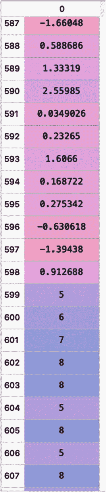
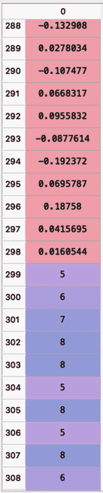

# 2.数据流中的概念漂移检测

在上一章中，向您介绍了流数据、其应用、窗口技术以及增量和在线学习算法。还向您介绍了 Python 中的 scikit-multiflow 框架和各种流数据生成器。本章讨论流数据环境中的概念漂移检测算法。它探讨了相关的技术以及如何使用 Python 中的 scikit-multiflow 框架来实现它们。

Note

本章应用了 scikit-multiflow 框架(版本 0.5.3)的一些漂移检测模块功能。另外，我参考了 scikit-multiflow 框架的 API 参考文档来获取本章提供的代码( [`https://scikit-multiflow.readthedocs.io/en/stable/api/api.html`](https://scikit-multiflow.readthedocs.io/en/stable/api/api.html) )。

## 概念漂移

第 [1](1.html) 章讨论了流数据的各种挑战。主要挑战之一是概念漂移，即数据流的分布可能会随着时间的推移而改变。过去数据中存在的特定模式可能变成当前数据中不同种类的模式。因此，由于概念漂移，任何基于过去数据训练的批量学习者模型都变得过时。

在机器学习中，*概念*是指机器学习模型试图预测的变量或量。*概念漂移*是指目标概念的统计特性随时间变化的现象[ [1](#Par28) ]。

数据流或概念漂移模式的变化可以是逐渐的，也可以是突然的[ [2](#Par29) ]。数据流中的突然变化，或突然的概念漂移，意味着数据特征的突然变化，例如均值的变化、方差的变化等等。检测这些变化非常重要，因为它们在质量控制、系统监控、故障检测等方面有许多实际应用。然而，数据流的逐渐变化或逐渐的概念漂移被称为数据分布的*变化，其持续时间比突然变化的时间长得多。渐变相对更难识别。*

其他类型的数据流或概念漂移变化是*增量概念漂移*和*重现概念漂移* [ [3](#Par30) 。在增量概念漂移中，随着时间的推移，数据流中的旧模式逐渐变为新模式；但是，所用的时间比逐渐的概念漂移要短得多。在反复出现的概念漂移中，您会看到旧数据流的特定特征在一段时间后再次出现。

有各种类型的概念漂移检测算法。本章重点介绍概念漂移检测算法，例如(A)用于概念漂移检测的*自适应窗口方法*(ADWIN)，(b)漂移检测方法(DDM)，(c)早期漂移检测方法(EDDM)，(d)基于 Hoeffding ' s bound with moving average-test 的漂移检测方法(HDDM_A)，(e)基于 Hoeffding ' s bound with moving weighted average-test 的漂移检测方法(HDDM_W)，以及(f)使用 Page-Hinkley 方法的漂移检测。

## 概念漂移检测的自适应窗口方法

在用于概念漂移检测的自适应窗口方法(ADWIN)中，使用动态大小的滑动窗口；也就是说，窗口的大小不是固定的，而是基于从窗口[ [4](#Par31) ]中的数据观察到的变化率在线计算的。我已经在第 [1](1.html) 章中讨论了滑动窗口的概念，其中一个窗口由数据流中最新的数据点维护，旧的数据点被不断丢弃。窗口中的数据点获取数据流的更新统计数据，检测概念漂移，并更新模型。

通常建议使用可变大小的窗口。想法是尽可能长时间地保存数据点或观察值，因为用户不知道变化时间尺度[ [4](#Par31) ]。如果 ADWIN 算法在数据流中没有发现任何变化，它会增大窗口大小，而当在数据流中检测到变化时，它会减小窗口大小。想法是跟踪窗口 w 中数据点的平均值。零假设是窗口 w 内的平均值没有变化。当有足够的证据表明新数据点的平均值不同于窗口其余部分的平均值时，窗口中的旧数据点将被删除[ [5](#Par32) ]。

为了进一步深入 ADWIN 算法的实现，执行统计测试以检查两个窗口(W <sub>1</sub> 和 W <sub>2</sub> )中的平均值是否相差超过阈值。W <sub>1</sub> 和 W <sub>2</sub> 是主窗口 W 的子窗口。如果子窗口的平均值显著不同，则窗口 W 的旧数据点被丢弃。然而，如果子窗口的平均值没有明显不同，则假定数据流的分布没有变化[ [4](#Par31) ]。

清单 [2-1](#PC1) 展示了使用 ADWIN 对模拟数据流进行概念漂移检测。drift_detection 模块用于 scikit-multiflow 框架。清单 [2-1](#PC1) 模拟一个标准正态分布的大小为 1000 的数据流，然后从索引 599 开始改变数据概念(即，用 5 到 8 之间的整数替换值)，如图 [2-1](#Fig1) 所示。然后，它调用 ADWIN()对象，并使用 detected_change()函数来识别数据流中的概念漂移。最终输出如清单 [2-2](#PC2) 所示。



图 2-1

从索引 599 开始具有改变的概念的数据流

```py
###############################################################
### Output:
Concept Drift detected in data: 8.0 - at index: 607
Concept Drift detected in data: 5.0 - at index: 639
Concept Drift detected in data: 6.0 - at index: 671
###############################################################

Listing 2-2Output for Concept Drift Detection Using ADWIN

```

```py
###############################################################

# Import the relevant libraries
import numpy as np
from skmultiflow.drift_detection.adwin import ADWIN

# set seed for reproducibility
np.random.seed(123)

# Simulate a data stream of size 1000 from a Standard normal distribution
stream = np.random.randn(1000)

stream[:10]
# Output:
#array([-1.0856306 ,  0.99734545,  0.2829785 , -1.50629471, -0.57860025,
#        1.65143654, -2.42667924, -0.42891263,  1.26593626, -0.8667404 ])

# Data concept are changed from index 599 to 999
for j in range(599, 1000):
    stream[j] = np.random.randint(5, high=9)

# Initialize the ADWIN object
A = ADWIN(delta=0.002)

# Stream elements are added to ADWIN and checking whether drift occured
for j in range(1000):
     A.add_element(stream[j])
     if A.detected_change():
         print('Concept Drift detected in data: ' + str(stream[j]) + ' - at index: ' + str(j))
###############################################################

Listing 2-1Illustration for Concept Drift Detection Using ADWIN in scikit-multiflow

```

## 漂移检测方法

漂移检测法(DDM)最早是由 Gama 等人 [6](#Par33) 提出的。DDM 方法可以应用于任何学习算法；也就是说，使用增量/在线学习算法或批量学习算法。这个想法是跟踪学习算法的错误率。在 *n* 个例子的样本中，学习算法的错误数量是伯努利试验的随机变量。您可以使用二项式分布来模拟 *n* 个示例中的错误数量。在 j 时刻，误差率由 p <sub>j</sub> 表示，标准差为σ<sub>j</sub>= sqrt(p<sub>j</sub>(1-p<sub>j</sub>)/j)。

DDM 方法在训练学习算法[ [6](#Par33) 时，记录 p <sub>min</sub> 和σ <sub>min</sub> 。如果 p<sub>j</sub>+σ<sub>j</sub>>= p<sub>min</sub>+2 *σ<sub>min</sub>，则声明警告，这意味着数据流有变化。但如果 p<sub>j</sub>+σ<sub>j</sub>>= p<sub>min</sub>+3 *σ<sub>min</sub>，则宣告数据流发生变化[ [5](#Par32) ]。

清单 [2-3](#PC3) 展示了使用 DDM 的概念漂移检测。它从标准正态分布模拟大小为 1000 的数据流，然后将数据概念从索引 299 更改为 599(即，用 5 到 9 之间的整数替换值)。然后，它调用 DDM()对象，并使用 detected_change()和 detected_warning_zone()函数来识别数据流中的概念漂移，并分别提供有关数据流变化的警告。最终输出如清单 [2-4](#PC4) 所示。

```py
###############################################################
### Output:
Concept drift detected in data: 1.0693159694243486 - at index: 55
Concept drift detected in data: 2.0871133595881854 - at index: 88
Concept drift detected in data: 0.8123413299768204 - at index: 126
Warning detected in data: 1.3772574828673068 - at index: 158
Warning detected in data: -0.1431759743261871 - at index: 159
Warning detected in data: 0.02031599823462459 - at index: 160
Warning detected in data: -0.19396387055266243 - at index: 161
Warning detected in data: 0.13402679274666512 - at index: 162
Warning detected in data: 0.7044740740436035 - at index: 163
Concept drift detected in data: 0.6656534379123312 - at index: 164
Concept drift detected in data: 8.0 - at index: 302
###############################################################

Listing 2-4Output for Concept Drift and Warning Zones Detected Using DDM 

```

```py
###############################################################
# Import the relevant libraries
import numpy as np
from skmultiflow.drift_detection import DDM

# set seed for reproducibility
np.random.seed(123)
# Simulate a data stream of size 1000 from a Standard normal distribution
stream = np.random.randn(1000)
stream[:10]
## Output-
#array([-1.0856306 ,  0.99734545,  0.2829785 , -1.50629471, -0.57860025,
#        1.65143654, -2.42667924, -0.42891263,  1.26593626, -0.8667404 ])
# Data concepts are changed from index 299 to 599
for j in range(299, 600):
    stream[j] = np.random.randint(5, high=9)
# Initialize the DDM object
d2m = DDM()
# Stream elements are added to DDM and checking whether drift occurred
for j in range(1000):
    d2m.add_element(stream[j])
    if d2m.detected_change():
        print('Concept drift detected in data: ' + str(stream[j]) + ' - at index: ' + str(j))
    if d2m.detected_warning_zone():
         print('Warning detected in data: ' + str(stream[j]) + ' - at index: ' + str(j))
###############################################################

Listing 2-3Illustration for Concept Drift Detection Using DDM in scikit-multiflow

```

## 早期漂移检测方法

早期漂移检测方法(EDDM)是对 DDM 方法的改进，尤其适用于检测数据流中缓慢、渐进的变化。在前面讨论的 DDM 方法中，其思想是跟踪学习算法中的错误数量，而在 e DDM 中，跟踪两个错误的平均距离[ [7](#Par34) ]。因此，EDDM 存储两个误差之间的平均距离(p′<sub>j</sub>及其标准偏差σ′<sub>j</sub>)以及最大值 p′<sub>max</sub>和σ′<sub>max。</sub>类似于 DDM，基于某些阈值，宣布概念漂移或警告区域。请参阅 Baena-Garcia 等人的文章[ [7](#Par34) ]，了解有关 EDDM 的详细综述。

使用 EDDM 的概念漂移检测可以以与清单 [2-3](#PC3) 中相同的方式实现。但是，您需要应用 e DDM()方法，而不是使用 DDM()方法。我们鼓励您更改数据流的分布并记录输出。

## 利用 HDDM_A 和 HDDM_W 进行漂移检测

使用移动平均测试(HDDM_A)的漂移检测基于 Hoeffding 界限[ [10](#Par37) ]。赫夫丁不等式没有假设概率函数；它假设独立且有界的随机变量[ [8](#Par35) ]。HDDM_A 执行一个 *A 测试*，其中给定一个随机变量序列，可以通过监控移动平均值之间的差异来检测总体平均值的变化 [8](#Par35) 。HDDM_A 方法在 scikit-multiflow 中实现。HDDM_A 的实现基于 MOA [ [9](#Par36) ]。

清单 [2-5](#PC5) 说明了 scikit-multiflow 中使用 HDDM_A 方法的概念漂移检测和警告区域检测。它从二项式分布模拟大小为 1000 的数据流，并将数据概念从索引 299 更改为 499。最终输出如清单 [2-6](#PC6) 所示。

```py
###############################################################
### Output:
Concept drift detected in data: 8 - at index: 13
Warning detected in data: 7 - at index: 26
Concept drift detected in data: 7 - at index: 27
Concept drift detected in data: 8 - at index: 65
Warning detected in data: 8 - at index: 70
Concept drift detected in data: 9 - at index: 74
Concept drift detected in data: 8 - at index: 78
Concept drift detected in data: 7 - at index: 92
Concept drift detected in data: 8 - at index: 96
Concept drift detected in data: 8 - at index: 103
Warning detected in data: 7 - at index: 111
Concept drift detected in data: 7 - at index: 112
Concept drift detected in data: 10 - at index: 118
Concept drift detected in data: 7 - at index: 121
Concept drift detected in data: 7 - at index: 126
Concept drift detected in data: 8 - at index: 131
Concept drift detected in data: 8 - at index: 147
Concept drift detected in data: 8 - at index: 150
Warning detected in data: 8 - at index: 163
Concept drift detected in data: 8 - at index: 171
Concept drift detected in data: 8 - at index: 175
Concept drift detected in data: 7 - at index: 190
Concept drift detected in data: 9 - at index: 194
Concept drift detected in data: 9 - at index: 196
Concept drift detected in data: 8 - at index: 199
Concept drift detected in data: 8 - at index: 206
Concept drift detected in data: 8 - at index: 209
Concept drift detected in data: 8 - at index: 225
Warning detected in data: 8 - at index: 231
Concept drift detected in data: 10 - at index: 240
Concept drift detected in data: 9 - at index: 258
Concept drift detected in data: 10 - at index: 272
Concept drift detected in data: 9 - at index: 279
Concept drift detected in data: 9 - at index: 281
Concept drift detected in data: 6 - at index: 290
Concept drift detected in data: 7 - at index: 292
Concept drift detected in data: 8 - at index: 294
Concept drift detected in data: 8 - at index: 298
Concept drift detected in data: 8 - at index: 365
Warning detected in data: 8 - at index: 380
Concept drift detected in data: 8 - at index: 381
Concept drift detected in data: 8 - at index: 411
Concept drift detected in data: 8 - at index: 417
Concept drift detected in data: 8 - at index: 423
Concept drift detected in data: 8 - at index: 445
Warning detected in data: 8 - at index: 451
Warning detected in data: 7 - at index: 452
Concept drift detected in data: 8 - at index: 468
Concept drift detected in data: 8 - at index: 497
Warning detected in data: 8 - at index: 503
Concept drift detected in data: 9 - at index: 547
Warning detected in data: 9 - at index: 561
Warning detected in data: 9 - at index: 566

Warning detected in data: 8 - at index: 567
Warning detected in data: 5 - at index: 568
Warning detected in data: 6 - at index: 569
Warning detected in data: 6 - at index: 570
Warning detected in data: 7 - at index: 571
Warning detected in data: 7 - at index: 572
Concept drift detected in data: 9 - at index: 586
Warning detected in data: 8 - at index: 593
Concept drift detected in data: 9 - at index: 598
Warning detected in data: 6 - at index: 604
Concept drift detected in data: 6 - at index: 605
Concept drift detected in data: 8 - at index: 619
Concept drift detected in data: 6 - at index: 622
Concept drift detected in data: 7 - at index: 628
Concept drift detected in data: 8 - at index: 640
Concept drift detected in data: 9 - at index: 644
Concept drift detected in data: 8 - at index: 655
Concept drift detected in data: 8 - at index: 660
Concept drift detected in data: 7 - at index: 662
Concept drift detected in data: 8 - at index: 670
Concept drift detected in data: 8 - at index: 688
Concept drift detected in data: 7 - at index: 697
Concept drift detected in data: 7 - at index: 701
Concept drift detected in data: 9 - at index: 703
Concept drift detected in data: 8 - at index: 705
Concept drift detected in data: 9 - at index: 716
Concept drift detected in data: 9 - at index: 719
Concept drift detected in data: 8 - at index: 723
Concept drift detected in data: 7 - at index: 750
Warning detected in data: 8 - at index: 756
Concept drift detected in data: 7 - at index: 772
Concept drift detected in data: 7 - at index: 775
Concept drift detected in data: 8 - at index: 782
Concept drift detected in data: 8 - at index: 788
Concept drift detected in data: 9 - at index: 802
Concept drift detected in data: 7 - at index: 806
Concept drift detected in data: 6 - at index: 808
Concept drift detected in data: 7 - at index: 824
Concept drift detected in data: 8 - at index: 826
Warning detected in data: 7 - at index: 830
Warning detected in data: 7 - at index: 836

Concept drift detected in data: 7 - at index: 837
Concept drift detected in data: 6 - at index: 839
Concept drift detected in data: 9 - at index: 847
Concept drift detected in data: 8 - at index: 853
Concept drift detected in data: 6 - at index: 855
Concept drift detected in data: 9 - at index: 864
Concept drift detected in data: 8 - at index: 867
Concept drift detected in data: 8 - at index: 870
Concept drift detected in data: 9 - at index: 874
Concept drift detected in data: 8 - at index: 882
Concept drift detected in data: 7 - at index: 894
Concept drift detected in data: 7 - at index: 910
Concept drift detected in data: 9 - at index: 921
Concept drift detected in data: 8 - at index: 925
Concept drift detected in data: 9 - at index: 927
Concept drift detected in data: 7 - at index: 929
Warning detected in data: 9 - at index: 933
Concept drift detected in data: 9 - at index: 934
Concept drift detected in data: 9 - at index: 938
Concept drift detected in data: 7 - at index: 944
Concept drift detected in data: 8 - at index: 950
Concept drift detected in data: 9 - at index: 960
Warning detected in data: 7 - at index: 983
Warning detected in data: 7 - at index: 987
Concept drift detected in data: 10 - at index: 998
###############################################################

Listing 2-6Output for Concept Drift and Warning Zones Detected Using HDDM_A

```

```py
###############################################################
# Import the relevant libraries
 import numpy as np
from skmultiflow.drift_detection.hddm_a import HDDM_A

# Initialize the HDDM_A object
HA = HDDM_A()

# set seed for reproducibility
np.random.seed(123)

# Simulate a data stream of size 1000 from a binomial distribution
# here, n= number of trials, p= probability of each trial
n, p = 10, 0.6
stream = np.random.binomial(n, p, 1000)
stream[:10]
# Output- array([5, 7, 7, 6, 5, 6, 3, 5, 6, 6])

# Data concept are changed from index 299 to 499
for j in range(299, 500):
    stream[j] = np.random.randint(5, high=9)

# Stream elements are added to DDM and checking whether drift occured
for j in range(1000):
    HA.add_element(stream[j])
    if HA.detected_change():
        print('Concept drift detected in data: ' + str(stream[j]) + ' - at index: ' + str(j))
    if HA.detected_warning_zone():
         print('Warning detected in data: ' + str(stream[j]) + ' - at index: ' + str(j))
###############################################################

Listing 2-5Illustration for Concept Drift Detection Using HDDM_A in scikit-multiflow

```

使用移动加权平均测试(HDDM_W)的漂移检测基于 McDiarmid 界限[ [11](#Par38) ]。麦克迪尔米德界是赫夫丁界的推广。HDDM_W 涉及 *W 测试*，它涉及加权移动平均线 [8](#Par35) 。

清单 [2-7](#PC7) 展示了 scikit-multiflow 中使用 HDDM_W 的概念漂移检测和警告区域检测。实验设置与清单 [2-5](#PC5) 相同。唯一的区别是您使用的是 HDDM_W()方法，而不是 HDDM_A()。最终输出如清单 [2-8](#PC8) 所示。

```py
###############################################################
### Output:
Concept drift detected in data: 8 - at index: 13
Warning detected in data: 8 - at index: 30
Warning detected in data: 6 - at index: 31
Concept drift detected in data: 8 - at index: 41
Warning detected in data: 8 - at index: 65
Concept drift detected in data: 9 - at index: 74
Concept drift detected in data: 8 - at index: 96
Concept drift detected in data: 10 - at index: 118
Warning detected in data: 7 - at index: 122
Warning detected in data: 6 - at index: 123
Warning detected in data: 4 - at index: 124
Warning detected in data: 3 - at index: 125
Concept drift detected in data: 7 - at index: 126
Warning detected in data: 8 - at index: 135
Warning detected in data: 8 - at index: 140

Warning detected in data: 7 - at index: 141
Concept drift detected in data: 8 - at index: 147
Concept drift detected in data: 8 - at index: 150
Concept drift detected in data: 8 - at index: 155
Concept drift detected in data: 8 - at index: 163
Warning detected in data: 8 - at index: 171
Concept drift detected in data: 8 - at index: 175
Concept drift detected in data: 9 - at index: 194
Concept drift detected in data: 9 - at index: 196
Concept drift detected in data: 8 - at index: 199
Warning detected in data: 8 - at index: 206
Warning detected in data: 8 - at index: 209
Concept drift detected in data: 8 - at index: 225
Concept drift detected in data: 9 - at index: 235
Concept drift detected in data: 10 - at index: 240
Concept drift detected in data: 9 - at index: 258
Concept drift detected in data: 10 - at index: 272
Warning detected in data: 9 - at index: 279
Warning detected in data: 9 - at index: 281
Warning detected in data: 8 - at index: 282
Warning detected in data: 9 - at index: 284
Warning detected in data: 8 - at index: 294
Concept drift detected in data: 8 - at index: 298
Warning detected in data: 8 - at index: 353
Warning detected in data: 8 - at index: 355
Warning detected in data: 8 - at index: 378
Warning detected in data: 7 - at index: 379
Warning detected in data: 8 - at index: 380
Concept drift detected in data: 8 - at index: 381
Warning detected in data: 8 - at index: 464
Warning detected in data: 6 - at index: 465
Warning detected in data: 8 - at index: 469
Warning detected in data: 7 - at index: 470
Concept drift detected in data: 8 - at index: 471
Warning detected in data: 8 - at index: 486
Warning detected in data: 8 - at index: 496

Warning detected in data: 8 - at index: 497
Warning detected in data: 6 - at index: 498
Warning detected in data: 7 - at index: 499
Warning detected in data: 7 - at index: 500
Warning detected in data: 6 - at index: 501
Concept drift detected in data: 8 - at index: 523
Warning detected in data: 9 - at index: 530
Concept drift detected in data: 9 - at index: 547
Warning detected in data: 8 - at index: 554
Concept drift detected in data: 9 - at index: 561
Concept drift detected in data: 9 - at index: 566
Concept drift detected in data: 9 - at index: 586
Concept drift detected in data: 9 - at index: 598
Concept drift detected in data: 9 - at index: 644
Warning detected in data: 8 - at index: 670
Concept drift detected in data: 10 - at index: 671
Concept drift detected in data: 6 - at index: 673
Concept drift detected in data: 9 - at index: 703
Concept drift detected in data: 8 - at index: 705
Concept drift detected in data: 9 - at index: 716
Concept drift detected in data: 8 - at index: 723
Warning detected in data: 6 - at index: 751
Warning detected in data: 7 - at index: 752
Warning detected in data: 5 - at index: 753
Warning detected in data: 7 - at index: 754
Warning detected in data: 5 - at index: 755
Concept drift detected in data: 8 - at index: 756
Warning detected in data: 7 - at index: 771
Warning detected in data: 7 - at index: 772
Warning detected in data: 7 - at index: 776
Warning detected in data: 8 - at index: 777
Concept drift detected in data: 8 - at index: 788
Concept drift detected in data: 9 - at index: 802
Concept drift detected in data: 8 - at index: 814
Warning detected in data: 8 - at index: 826

Concept drift detected in data: 9 - at index: 864
Concept drift detected in data: 8 - at index: 867
Warning detected in data: 7 - at index: 873
Warning detected in data: 9 - at index: 874
Warning detected in data: 7 - at index: 875
Concept drift detected in data: 6 - at index: 876
Warning detected in data: 8 - at index: 905
Concept drift detected in data: 9 - at index: 934
Concept drift detected in data: 9 - at index: 960
Concept drift detected in data: 9 - at index: 975
Concept drift detected in data: 9 - at index: 982
Concept drift detected in data: 10 - at index: 998
###############################################################

Listing 2-8Output for Concept Drift and Warning Zones Detected Using HDDM_W

```

```py
###############################################################
# Import the relevant libraries
 import numpy as np
from skmultiflow.drift_detection.hddm_w import HDDM_W

# Initialize the HDDM_W object
HW = HDDM_W()

# set seed for reproducibility
np.random.seed(123)

# Simulate a data stream of size 1000 from a binomial distribution
# here, n= number of trials, p= probability of each trial
n, p = 10, 0.6
stream = np.random.binomial(n, p, 1000)

stream[:10]
# Output- array([5, 7, 7, 6, 5, 6, 3, 5, 6, 6])

# Data concept are changed from index 299 to 500
for j in range(299, 500):
    stream[j] = np.random.randint(5, high=9)

# Stream elements are added to DDM and checking whether drift occurred
for j in range(1000):
    HW.add_element(stream[j])
    if HW.detected_change():
        print('Concept drift detected in data: ' + str(stream[j]) + ' - at index: ' + str(j))
    if HW.detected_warning_zone():
         print('Warning detected in data: ' + str(stream[j]) + ' - at index: ' + str(j))###############################################################

Listing 2-7Illustration for Concept Drift Detection Using HDDM_W in scikit-multiflow

```

A-test 更擅长检测突然或突发的概念漂移；然而，W-检验在逐渐的概念漂移中表现更好。

## 使用 Page-Hinkley 方法的漂移检测

基于 Page-Hinkley (PH)测试[ [12](#Par39) ]的漂移检测方法是一种顺序分析方法，其检测高斯信号[ [13](#Par40) 的平均值的突然变化。这种方法跟踪到当前时刻为止观察值和它们的平均值之间的累积差异[ [14](#Par41) ]。通常，当某个时刻观察到的平均值大于给定的阈值λ时，该方法会发出概念漂移警报。λ的值由容许的虚警率决定。如果增加λ的值，也许可以减少假警报，但会错过数据分布变化的一些实例。

清单 [2-9](#PC9) 说明了使用 Page-Hinkley 方法的概念漂移检测。它从正态分布模拟一个大小为 1000 的数据流，然后将数据概念从索引 299 更改为 799(即用 5 到 8 之间的整数替换值)，如图 [2-2](#Fig2) 所示。然而，与前面讨论的一些方法不同，Page-Hinkley 方法不输出警告区域。它只显示了概念漂移的实例，如清单 [2-10](#PC10) 所示。



图 2-2

概念从索引 299 变为 799 的数据流

```py
###############################################################
### Output:
Concept drift detected in data: 5.0 - at index: 306
###############################################################

Listing 2-10Output for Concept Drift Detected Using the Page-Hinkley Method

```

```py
###############################################################

# Import the relevant libraries
import numpy as np
from skmultiflow.drift_detection import PageHinkley

# Initialize the PageHinkley object
ph = PageHinkley()

# set seed for reproducibility
np.random.seed(123)
# Simulate a data stream of size 1000 from a normal distribution
# with mean=0 and standard deviation=0.1
stream = np.random.normal(0, 0.1, 1000)

# Data concept are changed from index 299 to 799
for j in range(299, 800):
    stream[j] = np.random.randint(5, high=9)

# Adding stream elements to the PageHinkley drift detector and verifying if drift occurred
for j in range(1000):
    ph.add_element(stream[j])
    if ph.detected_change():
        print('Concept drift detected in data: ' + str(stream[j]) + ' - at index: ' + str(j))
###############################################################

Listing 2-9Illustration for Concept Drift Detection Using the Page-Hinkley Method in scikit-multiflow

```

## 摘要

本章讨论了流数据环境中概念漂移检测的各种算法。本文还探讨了相关的技术，并使用 Python 中的 scikit-multiflow 框架实现了这些技术。

下一章讨论了用于流数据的各种监督学习技术，并使用 scikit-multiflow 框架实现了其中的一些技术。

## 参考

1.  王生辉、斯特凡·施洛巴赫和米歇尔·克莱恩。"什么是概念漂移，如何测量？"知识工程与大众管理。*计算机科学讲义*。斯普林格，2010 年。

2.  米歇尔·巴瑟维尔和伊戈尔·尼基福罗夫。*突变检测:理论与应用*。普伦蒂斯霍尔公司，1993 年。

3.  J.陆、刘、董、顾、伽马、张。"概念漂移下的学习:一个综述."IEEE 知识汇刊&数据工程。2019.

4.  艾伯特·比费特和理查德·加瓦尔达。“利用自适应窗口从时变数据中学习。”2007 年 SIAM 数据挖掘国际会议论文集。工业和应用数学学会。2007.第 443-448 页。

5.  艾伯特·比费特、理查德·加瓦尔德、杰夫·霍姆斯和伯恩哈德·普法林格。*数据流的机器学习:MOA 中的实际例子*。麻省理工学院出版社，2018。

6.  若昂·伽马、佩德罗·梅达斯、格拉迪斯·卡斯蒂洛和佩德罗·佩雷拉·罗德里格斯。“漂移检测学习”人工智能进展:SBIA 2004。第 17 届巴西人工智能研讨会。2004 年 9 月 29 日至 10 月 1 日。第 286-295 页。

7.  曼努埃尔·巴埃纳-加西亚、何塞·德尔坎波-阿维拉、劳尔·菲尔戈、艾伯特·比费特、里卡德·加瓦尔达、拉斐尔·莫拉莱斯-布埃诺。"早期漂移检测方法."第四届数据流知识发现国际研讨会。2006.

8.  伊斯瓦尼·弗里亚斯-布兰科、何塞·德尔坎波-Á·维拉、冈萨洛·拉莫斯-希门尼斯、拉斐尔·莫拉莱斯-布埃诺、奥古斯丁·奥尔蒂斯-迪亚斯和亚伊莱·卡瓦尔。“基于赫夫丁界限的在线和非参数漂移检测方法。”IEEE 知识与数据工程汇刊。2014.

9.  艾伯特·比费特、杰夫·霍姆斯、理查德·柯克比和伯恩哈德·普法林格。"农业部:大规模在线分析."*机器学习研究杂志*。2010.

10.  W.赫夫丁。《有界随机变量和的概率不等式》，美国统计协会杂志。1963.第 13-30 页。

11.  C.麦克迪尔米德。"关于有限差分法."继续进行。Surv。组合学。1989 年，第 148-188 页。

12.  E.美国页。“连续检查方案。” *Biometrika* 。1954.第 100-115 页。

13.  H.Mouss、D. Mouss、N. Mouss 和 L. Sefouhi.."佩奇-欣克利试验，一种在农业食品生产系统中进行故障检测的方法."亚洲控制会议录。2004.第 815-818 页。

14.  J.伽马。*从数据流中发现知识*。查普曼&霍尔/儿童权利委员会，2010 年。