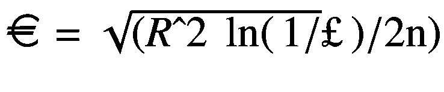
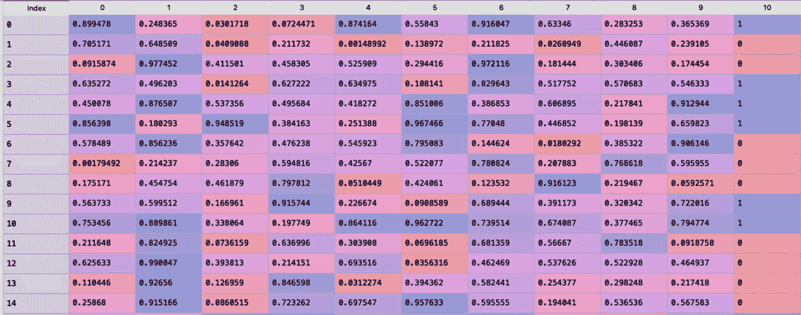

# 3.流式数据的监督学习

在上一章中，您学习了一些概念漂移检测算法。这一章集中在流数据环境中的监督学习算法(用于分类任务和回归任务)。在监督学习中，有一个目标或响应变量，还有预测变量。学习者/模型的目标是理解目标和预测变量之间的关系。然后，这可用于对目标变量进行预测，以用于预测变量[ [1](#Par71) ]的未来观察。(我假设你已经熟悉了在批量设置中使用的监督学习技术。)

第 [1](1.html) 章讲述了流式数据的挑战，以及流式数据算法与批量学习算法的不同之处。本章深入探讨了一些用于流数据的机器学习技术及其使用 scikit-multiflow 框架的实现。

在第 [1](1.html) 章中，您学习了数据流生成器以及如何从源文件(CSV 格式)创建数据流。这些想法在本章几乎所有的工作示例中都使用到了。

本章从流式数据环境中使用的评估方法开始。然后讨论监督学习方法——基于树的、懒惰学习、朴素贝叶斯等等。最后，解释了流数据环境中的集成学习技术。

本章仅限于二元分类方法和单目标回归(即多类分类和多目标回归技术超出了本书的范围)。本章中的所有实验都是在配置为 1.6 GHz 双核英特尔酷睿 i5 处理器、4 GB RAM 和 macOS 的系统上进行的。但是，代码应该在类似或更好的配置系统或操作系统上运行，而无需任何更改或修改。本书使用的是 2020 年 6 月发布的 scikit-multiflow 包版本 0.5.3。

## 评估方法

本节介绍模型评估方法，这些方法通常用于评估流式数据环境中监督学习方法的性能。这些方法被称为*保持评估方法*和*顺序评估方法*(也称为*交错测试后训练方法*)。

在维持评估方法中，性能评估发生在每一批一定数量的示例或观察之后。学习者或模型的表现在由看不见的例子形成的测试数据集上被评估。这些看不见的示例仅用于评估目的，不用于训练模型。相同的测试数据集可以在多个评估运行中使用。然而，也可以创建动态测试数据集。可以使用 scikit-multiflow 框架的评估模块中的 EvaluateHoldout()函数来应用维持评估方法。

顺序评估方法，或交叉测试后训练方法，是专门为评估流数据环境中的模型而设计的。每个示例都是根据其到达的顺序进行分析的。在这种评估方法中，数据流中引入的未知示例首先用于测试(即，模型/学习者进行预测)。这些看不见的例子也用于在下一轮测试之前训练模型。可以使用 scikit-multiflow 框架的评估模块中的 EvaluatePrequential()函数来应用 prequential 评估方法。

scikit-multiflow 框架中还有另一种评估方法可用(顺序评估延迟方法)；然而，这本书坚持墨守成规的评估方法和前评估方法，更侧重于后者。

本章使用这些评估方法来跟踪各种监督学习算法的性能，这些算法将在接下来的几节中讨论。使用 EvaluateHoldout()函数或 EvaluatePrequential()函数时，需要指定度量。

在这一章中，分类问题通常使用预测准确性和 f1 分数(精确度和召回率的调和平均值)等指标。对于回归问题，使用诸如均方误差和平均绝对误差的度量。

## 数据流的决策树

本节讨论了在流数据环境中用于分类和回归任务的一些基于树的技术。它涵盖了 Hoeffding 树、Hoeffding 自适应树分类器、速度极快的决策树分类器、Hoeffding 树回归器和 Hoeffding 自适应树回归器，它们使用 scikit-multiflow 应用于不同的数据集。

### 赫夫丁树分类器

流式数据的挑战之一是内存需求；不可能存储所有的数据。在批处理设置中，决策树重用实例或观察来计算最佳分割属性。因此，使用通常用于批量数据的决策树方法，如 CART 和 CHAID，在流数据环境中是无效的。为了解决这个问题，Domingos 和 Hulten [ [2](#Par72) ]提出了 Hoeffding 树，这是一种增量决策树学习器，它使用新的实例来构建树，使其更适合流数据上下文。赫夫丁树也被称为快速决策树(VFDT)算法。

赫夫丁树收敛到由具有足够大数据的批量学习器构建的树。因此，Hoeffding 树使用了这样的想法，即小样本通常足以选择最佳分割属性[ [3](#Par73) ]。这个想法得到了被称为*赫夫丁界限*的统计结果的支持。赫夫丁界限(概率为 1 –)规定，在对范围为 *R* 的实值随机变量 x 进行 n 次独立观测后，x 的真实均值至少为μ€，其中μ是随机变量 x 和 [ [4](#Par74) 的观测均值。

VFDT 方法是赫夫丁树的一种实现。VFDT 是一种决策树，它使用 Hoeffding 界限，并在将树叶转换为树节点时，在数据流中积累新的输入观测值的足够统计信息。然而，流数据可能非常嘈杂，这会影响 VFDT 的性能(就预测准确性而言)。此外，随着嘈杂的输入流数据，VFDT 面临着树大小的爆炸。有文档记录的技术可以解决这些 VFDT 问题。

清单 [3-1](#PC1) 使用第 [1](1.html) 章中讨论的超平面生成器创建一个合成数据集。图 [3-1](#Fig1) 是合成数据流的快照。



图 3-1

合成数据集的快照

使用 scikit-multiflow 框架将 Hoeffding 树方法应用于合成数据集，如清单 [3-2](#PC2) 所示。性能评估采用事前评估法(以预测精度为衡量标准)。清单 [3-3](#PC3) 显示了之前评估的输出。获得的准确度为 92.07%。

```py
###############################################################
# Import the relevant libraries
from skmultiflow.data import HyperplaneGenerator
import pandas as pd
import numpy as np

create = HyperplaneGenerator(random_state = 888, n_features= 10, noise_percentage = 0)
create.prepare_for_use()
X , Y = create.next_sample(10000)
data = pd.DataFrame(np.hstack((X, np.array([Y]).T)))

data.shape
# output- (10000, 11)
print(data.head())

# Store it in csv
data.to_csv('data_stream.csv', index=False)
###############################################################

Listing 3-1Creating a Synthetic Dataset Using the Hyperplane Generator

```

```py
###############################################################

Prequential Evaluation
Evaluating 1 target(s).
Pre-training on 400 sample(s).
Evaluating...
 ##------------------ [10%]
 #################### [100%] [3.95s]
Processed samples: 10000
Mean performance:
M0 - Accuracy     : 0.9207
###############################################################

Listing 3-3Prequential Evaluation Output of the Hoeffding Tree Classifier

```

```py
###############################################################
from skmultiflow.trees import HoeffdingTreeClassifier
from skmultiflow.evaluation import EvaluatePrequential
from skmultiflow.data.file_stream import FileStream
import pandas as pd
import numpy as np

# Load the synthetic data stream
dstream = FileStream('data_stream.csv')
dstream.prepare_for_use()

# Create the model instance
ht_class = HoeffdingTreeClassifier()

# perform prequential evaluation
evaluate1 = EvaluatePrequential(show_plot=False,
pretrain_size=400,
max_samples=10000,
metrics=['accuracy']
)
evaluate1.evaluate(stream=dstream, model=ht_class)
###############################################################

Listing 3-2Applying the Hoeffding Tree on the Synthetic Data Stream

```

### 赫夫丁自适应树分类器

第 [2](2.html) 章介绍了概念漂移检测的自适应窗口方法(ADWIN ),其中使用了动态大小的滑动窗口。窗口大小不固定；它是基于从窗口中的数据观察到的变化率在线计算的。如果 ADWIN 算法在数据流中没有发现任何变化，它会增大窗口大小，如果在数据流中检测到变化，它会减小窗口大小。

赫夫丁自适应树使用 ADWIN 方法，是赫夫丁树的修改版本。首先，你需要理解快速决策树(CVFDT)方法[ [6](#Par76) ]的概念。CVFDT 方法更适合具有固有概念漂移的数据流。它更新内部节点和叶子的统计数据。核心思想是，每当在一个子树中检测到一个变化时，它就生长一个候选子树，最终，要么当前子树要么候选子树被丢弃。

赫夫丁自适应树在分裂测试不再合适的节点处生成一个替代决策树[ [6](#Par76) ]。老树换成新树，更准确。在叶子上做出的决定基于最近的例子/观察窗口。需要为示例窗口分配内存；然而，CVFDT 没有严格的性能保证。

赫夫丁自适应树是对使用 ADWIN 的 CVFDT 的轻微修改。ADWIN 的目的是监视每个子树和备用树的错误。Hoeffding 自适应树方法使用 ADWIN 估计来对叶子和生长新树或替代树做出决定。该方法不需要为示例窗口分配内存；它几乎和 CVFDT 一样精确，有时甚至表现得更好。此外，严格的性能保证是可能的。

清单 [3-4](#PC4) 使用 Agrawal 生成器模拟带有概念漂移的合成数据流。Hoeffding 自适应树分类器应用于合成数据流，并使用预先评估和维持评估来评估模型的性能。

清单 [3-5](#PC5) 显示了顺序评估方法的输出。获得的精度是 99.72%，而在保持方法中，获得的精度是 99.09%(如清单 [3-6](#PC6) 所示)。

```py
###############################################################

Holdout Evaluation
Evaluating 1 target(s).
Evaluating...
 ######-------------- [30%] [6.87s]Separating 5000 holdout samples.
 ################---- [80%] [15.71s]Separating 5000 holdout samples.
Processed samples: 30000
Mean performance:
M0 - Accuracy     : 0.9909
###############################################################

Listing 3-6Holdout Evaluation Output of the Hoeffding Adaptive Tree Classifier

```

```py
###############################################################

Prequential Evaluation
Evaluating 1 target(s).
Pre-training on 400 sample(s).
Evaluating...
 #################### [100%] [342.55s]
Processed samples: 300000
Mean performance:
M0 - Accuracy     : 0.9972 ###############################################################

Listing 3-5Prequential Evaluation Output of the Hoeffding Adaptive Tree Classifier

```

```py
###############################################################
# Import the relevant libraries
from skmultiflow.trees import HoeffdingAdaptiveTreeClassifier
from skmultiflow.data import ConceptDriftStream
from skmultiflow.evaluation import EvaluatePrequential
from skmultiflow.evaluation import EvaluateHoldout

# Simulate a sample data stream
ds = ConceptDriftStream(random_state=777, position=30000)
ds
# Output:
#ConceptDriftStream(alpha=0.0,
#         drift_stream=AGRAWALGenerator(balance_classes=False,
#                                       classification_function=2,
#                                       perturbation=0.0,
#                                       random_state=112),
#         position=30000, random_state=777,
#         stream=AGRAWALGenerator(balance_classes=False,
#                                 classification_function=0,
#
#                     perturbation=0.0, random_state=112),
#         width=1000)

# Instantiate the model object
model_hat = HoeffdingAdaptiveTreeClassifier()

# Prequential evaluation
eval1 = EvaluatePrequential(pretrain_size=400, max_samples=300000,batch_size=1,n_wait=100, max_time=2000,show_plot=False, metrics=['accuracy'])

eval1.evaluate(stream=ds, model=model_hat)

# Holdout evaluation
eval2 = EvaluateHoldout(max_samples=30000,
                            max_time=2000,
                            show_plot=False,
                            metrics=['accuracy'],
                            dynamic_test_set=True)

eval2.evaluate(stream=ds, model=model_hat)
###############################################################

Listing 3-4Applying the Hoeffding Adaptive Tree Classifier on a Synthetic Data Stream

```

### 极快的决策树分类器

极快决策树(EFDT)(Hoeffding Anytime 树的一个实例)是一个增量决策树。赫夫丁随时树的操作几乎与赫夫丁树一样，但区别在于它们在节点处的分裂方式。赫夫丁树在一个节点处延迟分裂，直到它识别出最佳分裂，并且不再重新考虑决策。Hoeffding Anytime 树在一个节点上分裂，只要它看起来是一个有用的分裂，并在更好的分裂的可用性方面重新考虑决策。Hoeffding Anytime 树在计算上不如 Hoeffding 树高效，但在统计上更高效[ [7](#Par77) ]。

清单 [3-7](#PC7) 使用清单 [3-4](#PC4) 中使用的相同合成数据流。它将 EFDT 分类器应用于合成数据集，并使用预先评估和维持评估来评估模型的性能。清单 [3-8](#PC8) 显示了顺序评估方法的输出。获得的精度为 96.07%，而在维持方法中，获得的精度为 96.75%(参见清单 [3-9](#PC9) )。

```py
###############################################################

Holdout Evaluation
Evaluating 1 target(s).
Evaluating...
 ######-------------- [30%] [267.24s]Separating 5000 holdout samples.
 ################---- [80%] [505.29s]Separating 5000 holdout samples.
Processed samples: 30000
Mean performance:
M0 - Accuracy     : 0.9675 ###############################################################

Listing 3-9Holdout Evaluation Output of the Extremely Fast Decision Tree Classifier

```

```py
###############################################################

Prequential Evaluation
Evaluating 1 target(s).
Pre-training on 400 sample(s).
Evaluating...
 #####--------------- [25%] [1820.77s]
Time limit reached (2000.00s). Evaluation stopped.
Processed samples: 80949
Mean performance:
M0 - Accuracy     : 0.9607 ###############################################################

Listing 3-8Prequential Evaluation Output of the Extremely Fast Decision Tree Classifier

```

```py
###############################################################
# Import the relevant libraries
from skmultiflow.trees import ExtremelyFastDecisionTreeClassifier
from skmultiflow.data import ConceptDriftStream
from skmultiflow.evaluation import EvaluatePrequential
from skmultiflow.evaluation import EvaluateHoldout

# Simulate a sample data stream
ds = ConceptDriftStream(random_state=777, position=30000)
ds
# Output:
#ConceptDriftStream(alpha=0.0,
#       drift_stream=AGRAWALGenerator(balance_classes=False,
#                                     classification_function=2,
#                                     perturbation=0.0,
#                                     random_state=112),
#       position=30000, random_state=777,
#       stream=AGRAWALGenerator(balance_classes=False,
#                               classification_function=0,
#                               perturbation=0.0, random_state=112),
#       width=1000)

# Instantiate the model object
model_hat = ExtremelyFastDecisionTreeClassifier()

# Prequential evaluation
eval1 = EvaluatePrequential(pretrain_size=400, max_samples=300000,batch_size=1,
                n_wait=100, max_time=2000,
                        show_plot=False, metrics=['accuracy'])

eval1.evaluate(stream=ds, model=model_hat)

# Holdout evaluation
eval2 = EvaluateHoldout(max_samples=30000,
                            max_time=2000,
                            show_plot=False,
                            metrics=['accuracy'],
                            dynamic_test_set=True)

eval2.evaluate(stream=ds, model=model_hat) ###############################################################

Listing 3-7Applying the Extremely Fast Decision Tree Classifier on a Synthetic Data Stream

```

### 赫夫丁树回归器

赫夫丁树回归器类似于赫夫丁树分类器。它使用赫夫丁界限来进行分割决策。赫夫丁树回归器使用目标空间中方差的减少来决定分裂候选。它通过拟合线性感知器模型或计算样本平均值来进行预测。

清单 [3-10](#PC10) 使用 scikit-multiflow 框架中的 RegressionGenerator()函数为回归创建一个合成数据流。数据流(dstream)有 800 个观测值、9 个特征和一个目标变量。目标变量是连续的，因为这是一个回归上下文。您可以使用 next_sample()函数查看 dstream 对象中的特定样本。将 Hoeffding 树回归器应用于数据流，并且应用预先评估。

回归环境中使用的指标是*均方误差* (MSE)和*平均绝对误差* (MAE)。清单 [3-11](#PC11) 显示了之前评估的输出。均方差为 6665.2407，均方差为 62.974944。

```py
###############################################################

Prequential Evaluation
Evaluating 1 target(s).
Pre-training on 400 sample(s).
Evaluating...
 #################### [100%] [0.69s]
Processed samples: 799
Mean performance:
M0 - MSE          : 6665.2407
M0 - MAE          : 62.974944 ###############################################################

Listing 3-11Prequential Evaluation Output of the Hoeffding Tree Regressor

```

```py
###############################################################
# Import the relevant libraries
from skmultiflow.trees import HoeffdingTreeRegressor
from skmultiflow.data import RegressionGenerator
import pandas as pd
from skmultiflow.evaluation import EvaluatePrequential

# Setup a data stream
dstream = RegressionGenerator(n_features=9, n_samples=800,n_targets=1, random_state=456)

dstream

dstream.next_sample()
#(array([[ 0.72465838, -1.92979924, -0.02607907,  2.35603757, -0.37461529,
#         -0.38480019,  0.06603468, -2.1436878 ,  0.49182531]]),
# array([61.302191]))

# Instantiate the Hoeffding Tree Regressor object
htr = HoeffdingTreeRegressor()

# Prequential evaluation
eval1 = EvaluatePrequential(pretrain_size=400, max_samples=800, batch_size=1, n_wait=100, max_time=2000, show_plot=False, metrics=['mean_square_error', 'mean_absolute_error'])

eval1.evaluate(stream=dstream, model=htr)
###############################################################

Listing 3-10Applying the Hoeffding Tree Regressor on a Synthetic Data Stream

```

### 赫夫丁自适应树回归器

Hoeffding 自适应树可用于回归环境。赫夫丁自适应树回归器使用 ADWIN 方法，可视为赫夫丁树回归器的修改版本。

清单 [3-12](#PC12) 使用清单 [3-10](#PC10) 中使用的相同合成数据集。Hoeffding 自适应树回归器应用于该数据集，并进行前期评估。前评估的输出如清单 [3-13](#PC13) 所示。MSE 是 6222.9041，MAE 是 61.320054。

```py
###############################################################

Prequential Evaluation
Evaluating 1 target(s).
Pre-training on 400 sample(s).
Evaluating...
#################### [100%] [1.23s]
Processed samples: 799
Mean performance:
M0 - MSE          : 6222.9041
M0 - MAE          : 61.320054 ###############################################################

Listing 3-13Prequential Evaluation Output of the Hoeffding Adaptive Tree Regressor

```

```py
###############################################################
# Import the relevant libraries
from skmultiflow.trees import HoeffdingAdaptiveTreeRegressor
from skmultiflow.data import RegressionGenerator
import pandas as pd
from skmultiflow.evaluation import EvaluatePrequential

# Setup a data stream
dstream = RegressionGenerator(n_features=9, n_samples=800,n_targets=1, random_state=456)

dstream

dstream.next_sample()
#(array([[ 0.72465838, -1.92979924, -0.02607907,  2.35603757, -0.37461529,
#         -0.38480019,  0.06603468, -2.1436878 ,  0.49182531]]),
# array([61.302191]))

# Instantiate the Hoeffding Tree Regressor object
model_hatr = HoeffdingAdaptiveTreeRegressor()

# Prequential evaluation
eval1 = EvaluatePrequential(pretrain_size=400, max_samples=800, batch_size=1, n_wait=100, max_time=2000, show_plot=False, metrics=['mean_square_error', 'mean_absolute_error'])

eval1.evaluate(stream=dstream, model=model_hatr)
###############################################################

Listing 3-12Applying the Hoeffding Adaptive Tree Regressor to a Synthetic Data Stream

```

本节讨论了在流数据环境中用于分类和回归的一些著名的基于树的技术。下一节重点介绍一些懒惰学习的技巧。

## 流式数据的惰性学习方法

让我们谈一谈在批处理环境中用于分类和回归的 k-最近邻(KNN)方法。KNN 是一种非参数方法，它将所有观察值保存在内存中，并基于相似性度量/距离函数[ [9](#Par79) ]对新的输入观察值进行分类。欧几里德距离、马哈拉诺比斯距离和曼哈顿距离是三种常用的距离函数。

在新的观察中，KNN 算法基于距离函数选择数据集中最近的 k 个邻居，然后组合 k 个最近邻居的值进行预测(即，在回归上下文中，它取平均值，在分类上下文中，它执行多数表决)。

scikit-multiflow 实现了流数据环境中的 KNN 分类方法(KNNClassifier())。这种技术的操作方式与 KNN 的相同，并且在训练样本上有一个窗口。用户可以固定窗口的最大尺寸。KNNClassifier()方法将数据流中的所有要素都视为连续要素，不建议用于混合了分类要素和连续要素的数据集。

清单 [3-14](#PC14) 在合成数据集上应用 KNN 分类器(其中 K = 10 ),并应用顺序评估。使用清单 [3-1](#PC1) 中的 HyperplaneGenerator()生成的相同合成数据集被导出为 CSV 文件(data_stream.csv)。数据集的快照如图 [3-1](#Fig1) 所示。顺序评估的输出如清单 [3-15](#PC15) 所示。获得的准确度为 87.99%。

```py
###############################################################

Prequential Evaluation
Evaluating 1 target(s).
Pre-training on 1000 sample(s).
Evaluating...
 ##------------------ [10%]
 #################### [100%] [7.31s]
Processed samples: 10000
Mean performance:
M0 - Accuracy     : 0.8799
###############################################################

Listing 3-15Prequential Evaluation Output of the KNN Classifier

```

```py
###############################################################
# Import the relevant libraries
from skmultiflow.lazy import KNNClassifier
from skmultiflow.evaluation import EvaluatePrequential
from skmultiflow.data.file_stream import FileStream
import pandas as pd
import numpy as np

dstream = FileStream('data_stream.csv')
dstream.prepare_for_use()

# Instantiate the KNN Classifier method
knn_class = KNNClassifier(n_neighbors=10, max_window_size=1000)

# Prequential Evaluation
evaluate1 = EvaluatePrequential(show_plot=False,
pretrain_size=1000,
max_samples=10000,
metrics=['accuracy']
)
# Run the evaluation
evaluate1.evaluate(stream=dstream, model=knn_class)
###############################################################

Listing 3-14Applying the KNN Classifier

to a Synthetic Data Stream

```

对 KNN 分类器的改进是 KNN·阿德温分类器(即 KNN ADWIN classifier())，它比 KNN 分类器更有效地处理数据流中的概念漂移。该技术使用自适应窗口方法进行概念漂移检测(ADWIN)。

清单 [3-16](#PC16) 使用 scikit-multiflow 框架中可用的 SEA 生成器创建一个合成数据集。SEA 生成器创建具有概念漂移的数据流，并生成三个数字特征和一个二元目标变量。SEA 是*流集成算法* [ [10](#Par80) 的缩写。清单 [3-16](#PC16) 显示了模拟数据流的五个观察值的输出。将 KNN ADWIN 分类器(K = 10)应用于数据流，并进行后续评估。顺序评估的输出如清单 [3-17](#PC17) 所示。获得的准确度为 65.93%。

```py
###############################################################

Prequential Evaluation
Evaluating 1 target(s).
Pre-training on 1000 sample(s).
Evaluating...
 #################### [100%] [11.22s]
Processed samples: 10000
Mean performance:
M0 - Accuracy     : 0.6593 ###############################################################

Listing 3-17Prequential Evaluation Output of the KNN ADWIN Classifier

```

```py
###############################################################
# Import the relevant libraries
from skmultiflow.lazy import KNNADWINClassifier
from skmultiflow.evaluation import EvaluatePrequential
from skmultiflow.data.sea_generator import SEAGenerator

# Simulate the data stream
dstream = SEAGenerator(classification_function = 2, balance_classes = True, noise_percentage = 0.3, random_state = 333)

#Retrieve five samples
dstream.next_sample(5)
# Output:
#(array([[3.68721825, 0.48303666, 1.04530188],
#        [2.45403315, 8.73489354, 0.51611639],
#        [2.38740114, 2.03699194, 1.74533621],
#        [9.41738118, 4.66915281, 9.59978205],
#        [1.05404748, 0.42265956, 2.44130999]]), array([1, 0, 0, 1, 1]))

# Instantiate the KNN ADWIN classifier method
adwin_knn_class = KNNADWINClassifier(n_neighbors=10, max_window_size=1000)

# Prequential Evaluation
evaluate1 = EvaluatePrequential(show_plot=False,
pretrain_size=1000,
max_samples=10000,
metrics=['accuracy'])

# Run the evaluation
evaluate1.evaluate(stream=dstream, model=adwin_knn_class) ####################################################################

Listing 3-16Applying the KNN ADWIN Classifier

to a Synthetic Data Stream

```

现在，让我们看看另一种基于 KNN 的分类器:KNN 算法的自调整记忆(SAM)模型。这种方法在本章的其余部分被称为萨姆-KNN。萨姆-KNN 技术有效地处理了异构概念漂移，并且不需要优化元参数。这项技术的灵感来自人类记忆研究中的双存储模型，其中知识被分为短期记忆(STM)和长期记忆(LTM) [ [12](#Par82) ]。

在萨姆-KNN 中，内存被划分为 STM 和 LTM。STM 在动态滑动窗口中包含与最近概念相关的数据。LTM 保持对过去信息的了解。有一个清洗过程来控制 STM 的大小。此外，有一个从短期记忆到 LTM 过滤知识的转移。LTM 确保压缩存储的信息不会与 STM 的信息相矛盾。组合记忆是短时记忆和 LTM 的结合。

想法是组合/集成最新概念和所有过去概念的专用模型(距离加权 KNN ),以最大化预测精度。

清单 [3-18](#PC18) 应用了萨姆-KNN 分类器，并对清单 [3-16](#PC16) 中使用的同一数据流进行了顺序评估。在清单 [3-19](#PC19) 中，获得的准确率为 64.66%。

```py
###############################################################

Prequential Evaluation
Evaluating 1 target(s).
Pre-training on 1000 sample(s).
Evaluating...
 #################### [100%] [8.53s]
Processed samples: 10000
Mean performance:
M0 - Accuracy     : 0.6466
###############################################################

Listing 3-19Prequential Evaluation Output of the SAM-KNN Classifier

```

```py
###############################################################
# Import the relevant libraries
from skmultiflow.lazy import SAMKNNClassifier
from skmultiflow.evaluation import EvaluatePrequential
from skmultiflow.data.sea_generator import SEAGenerator

# Simulate the data stream
dstream = SEAGenerator(classification_function = 2, balance_classes = True, noise_percentage = 0.3, random_state = 333)

#Retrieve five samples
dstream.next_sample(5)

# Instantiate the SAM-KNN classifier method
sam_knn_class = SAMKNNClassifier(n_neighbors=10, weighting="distance", stm_size_option="maxACCApprox", max_window_size=1000,use_ltm=True)

# Prequential Evaluation
evaluate1 = EvaluatePrequential(show_plot=False,
pretrain_size=1000,
max_samples=10000,
metrics=['accuracy']
)
# Run the evaluation
evaluate1.evaluate(stream=dstream, model=sam_knn_class)
###############################################################

Listing 3-18Applying the SAM-KNN Classifier

to a Synthetic Data Stream

```

scikit-multiflow 在流数据上下文中实现了 KNN 回归方法(KNNRegressor())。就像 KNN 分类器一样，使用训练样本上的窗口。然而，与 KNN 分类器相比，它采用 k 个最近邻的平均值进行预测。

清单 [3-20](#PC20) 将 KNN 回归器应用于合成数据集。它使用清单 [3-10](#PC10) 中使用的相同合成数据集。应用一个顺序评估，输出如清单 [3-21](#PC21) 所示。MSE 是 4195.3502，MAE 是 50.132250。

```py
###############################################################

Prequential Evaluation
Evaluating 1 target(s).
Pre-training on 400 sample(s).
Evaluating...
 #################### [100%] [0.34s]
Processed samples: 799
Mean performance:
M0 - MSE          : 4195.3502
M0 - MAE          : 50.132250
###############################################################

Listing 3-21Prequential Evaluation Output of the KNN Regressor

```

```py
###############################################################
# Import the relevant libraries
from skmultiflow.lazy import KNNRegressor
from skmultiflow.data import RegressionGenerator
import pandas as pd
from skmultiflow.evaluation import EvaluatePrequential

# Setup a data stream
dstream = RegressionGenerator(n_features=9, n_samples=800,n_targets=1, random_state=456)

dstream

dstream.next_sample()
#(array([[ 0.72465838, -1.92979924, -0.02607907,  2.35603757, -0.37461529,
#         -0.38480019,  0.06603468, -2.1436878 ,  0.49182531]]),
# array([61.302191]))

# Instantiate the KNN Regressor object
knn_reg = KNNRegressor()

# Prequential evaluation
eval1 = EvaluatePrequential(pretrain_size=400, max_samples=800, batch_size=1, n_wait=100, max_time=2000, show_plot=False, metrics=['mean_square_error', 'mean_absolute_error'])

eval1.evaluate(stream=dstream, model=knn_reg)
###############################################################

Listing 3-20Applying the KNN Regressor

to a Synthetic Data Stream

```

下一节集中讨论流数据的集成学习。

## 面向流数据的集成学习

集成学习结合多个模型来提高样本外数据的预测精度。通常(尽管不保证)，集成学习器比独立的基本方法表现得更好。集成学习是用于回归和分类目的的机器学习中非常流行的技术。批量数据环境中一些众所周知的集成学习技术是随机森林、bagging 和 boosting。本节重点介绍在 scikit-multiflow 框架中实现的一些用于流数据的集成学习技术。

### 适应性随机森林

一个*随机森林*是一个非常流行和广泛使用的对批量(非流式)数据进行机器学习的技术。在随机森林中，多个决策树(使用重采样数据和随机要素子集构建)组合在一起，以提高模型在预测准确性方面的性能。然而，随机森林不能处理概念漂移，需要多次遍历数据集。它不适合在流数据环境中进行分析。

*自适应随机森林* (ARF)是在流数据环境中随机森林技术的一种适应[ [13](#Par83) ]。ARF 方法使用在线 bagging 来近似替换重采样。然而，ARF 没有在在线装袋中使用(λ = 1)泊松分布，而是使用(λ = 6)泊松分布。(本章稍后将概述在线装袋方法。)

ARF 中的基本模型(即随机森林树训练(RFTreeTrain))基于 Hoeffding 树算法，但它有一些不同之处。一个区别是 RFTreeTrain 不允许早期的树修剪。另一个区别是，每当创建一个新结点时，都会创建一个要素的随机子集，并且分割仅限于这些要素。ARF 在基础树中使用漂移检测器，一旦出现漂移，就会导致重置。ARF 允许训练背景树，如果检测到漂移，背景树代替活动树。

ARF 技术可用于分类任务和回归任务。清单 [3-22](#PC22) 展示了对合成数据流应用 ARF 分类器(与清单 [3-18](#PC18) 中使用的数据流相同)。ARF 分类器的超参数是估计器/树的数量是 100。最大特征数是数据流中特征总数的平方根。应用了预先评估。列表 [3-23](#PC23) 显示预测准确率为 70.18%。

```py
###############################################################

Prequential Evaluation
Evaluating 1 target(s).
Pre-training on 1000 sample(s).
Evaluating...
 #################### [100%] [1526.63s]
Processed samples: 10000
Mean performance:
M0 - Accuracy     : 0.7018
###############################################################

Listing 3-23Prequential Evaluation Output of the ARF Classifier

```

```py
###############################################################
# Import the relevant libraries
from skmultiflow.meta import AdaptiveRandomForestClassifier
from skmultiflow.evaluation import EvaluatePrequential
from skmultiflow.data.sea_generator import SEAGenerator

# Simulate the data stream
dstream = SEAGenerator(classification_function = 2, balance_classes = True, noise_percentage = 0.3, random_state = 333)

# Instatntiate the KNN ADWIN classifier method
ARF_class = AdaptiveRandomForestClassifier(n_estimators=100, max_features="sqrt", random_state=333)

# Prequential Evaluation
evaluate1 = EvaluatePrequential(show_plot=False,
pretrain_size=1000,
max_samples=10000,
metrics=['accuracy']
)
# Run the evaluation
evaluate1.evaluate(stream=dstream, model=ARF_class)
###############################################################

Listing 3-22Applying the ARF Classifier to a Synthetic Data Stream

```

清单 [3-24](#PC24) 将 ARF 应用于清单 [3-20](#PC20) 中生成的同一合成数据流的回归环境中。估计器的数量是 100，最大特征数是特征总数的平方根。应用一个顺序评估，输出如清单 [3-25](#PC25) 所示。MSE 是 3661.6862，MAE 是 46.579340。

```py
###############################################################

Prequential Evaluation
Evaluating 1 target(s).
Pre-training on 400 sample(s).
Evaluating...
 #################### [100%] [77.83s]
Processed samples: 800
Mean performance:
M0 - MSE          : 3661.6862
M0 - MAE          : 46.579340
###############################################################

Listing 3-25Prequential Evaluation Output of the ARF Regressor

```

```py
###############################################################
# Import the relevant libraries
from skmultiflow.meta import AdaptiveRandomForestRegressor
from skmultiflow.data import RegressionGenerator
from skmultiflow.evaluation import EvaluatePrequential

# Setup a data stream
dstream = RegressionGenerator(n_features=9, n_samples=800,n_targets=1, random_state=456)

# Instantiate the ARF Regressor object
ARF_reg = AdaptiveRandomForestRegressor(n_estimators=100, max_features="sqrt", random_state=333)

# Prequential evaluation
eval1 = EvaluatePrequential(pretrain_size=400, max_samples=800, batch_size=1, n_wait=100, max_time=2000, show_plot=False, metrics=['mean_square_error', 'mean_absolute_error'])

eval1.evaluate(stream=dstream, model=ARF_reg)
###############################################################

Listing 3-24Applying the ARF Regressor on a Synthetic Data Stream

```

### 在线装袋

Bagging 是批量(非流式)学习中广泛使用的集成学习技术。这里，在大小为 n 的引导样本集上训练 X 个基本模型。引导样本集是使用从原始训练数据集中替换的采样来创建的。

每个基本模型的训练集包含 K 次原始训练示例，其中 P(K = k)遵循二项式分布。而当 N 趋于无穷大时，K 的分布趋于泊松(1)分布(即 K ~ exp(–1)/K！)[ [15](#Par85) 。Oza 和 Russell [ [15](#Par85) ]利用这个想法提出了在线学习版本的 bagging 算法，它适用于流数据环境。

在在线装袋中，当新的训练样本到达时，算法为每个基础模型选择 K ~泊松(1)次的样本，并相应地更新基础模型。通过对 X 基本模型执行多数表决来对新实例进行分类。这一步对于分批和在线装袋方法是相同的。在线装袋被认为是批量装袋的良好近似[ [15](#Par85) ]。

在 scikit-multiflow 中，可使用 OzaBaggingClassifier()方法应用在线装袋分类技术。清单 [3-26](#PC26) 将 Oza bagging 分类器应用于清单 [3-16](#PC16) 中使用的合成数据集。KNN ADWIN 分类器模型是基础模型。清单 [3-26](#PC26) 建造了六个基础模型。KNN ADWIN 分类器的超参数与清单 [3-16](#PC16) 中使用的参数相同(即邻居数量为 10，最大窗口大小为 1000)。应用一个顺序评估，输出如清单 [3-27](#PC27) 所示。获得的准确率为 66.21%。

```py
###############################################################

Prequential Evaluation
Evaluating 1 target(s).
Pre-training on 1000 sample(s).
Evaluating...
 #################### [100%] [61.53s]
Processed samples: 10000
Mean performance:
M0 - Accuracy     : 0.6621
###############################################################

Listing 3-27Prequential Evaluation Output of the Oza Bagging Classifier

```

```py
###############################################################
# Import the relevant libraries
from skmultiflow.meta import OzaBaggingClassifier
from skmultiflow.lazy import KNNADWINClassifier
from skmultiflow.evaluation import EvaluatePrequential
from skmultiflow.data.sea_generator import SEAGenerator

# Simulate the data stream
dstream = SEAGenerator(classification_function = 2, balance_classes = True, noise_percentage = 0.3, random_state = 333)

# Instantiate the Oza Bagging classifier method with KNN ADWIN classifier as the base model
oza_class = OzaBaggingClassifier(base_estimator=KNNADWINClassifier(n_neighbors=10, max_window_size=1000), n_estimators=4, random_state = 333)

# Prequential Evaluation
evaluate1 = EvaluatePrequential(show_plot=False,
pretrain_size=1000,
max_samples=10000,
metrics=['accuracy']
)
# Run the evaluation
evaluate1.evaluate(stream=dstream, model=oza_class)
###############################################################

Listing 3-26Applying the Oza Bagging Classifier

to a Synthetic Data Stream

```

现在，让我们来谈谈在线装袋方法，即 Bifet 等人提出的*杠杆装袋法*[16](#Par86)。这里，通过增加重采样和使用输出检测代码来利用打包。在 Oza Bagging 技术中，替换抽样使用(λ = 1)泊松分布。但是在杠杆装袋法中，λ的值更大。例如，它不使用(λ = 1)泊松分布，而是使用(λ = 6)泊松分布。输出检测代码有助于纠正错误。每个类被分配一个长度为 L 的二进制串，然后建立一个 L 个二进制分类器的集成。这导致在多类分类任务中更好的性能。此外，利用 bagging 算法使用 ADWIN 窗口技术来处理数据流中固有的概念漂移。

在 scikit-multiflow 中，可以使用 LeveragingBaggingClassifier()方法应用杠杆装袋分类技术。清单 [3-28](#PC28) 复制了在清单 [3-26](#PC26) 中执行的相同实验(即六个基础模型(KNN·阿德温分类器)的相同数据流和超参数)。但是，OzaBaggingClassifier()方法被替换为 LeveragingBaggingClassifier()方法。进行一次前评估，输出如清单 [3-29](#PC29) 所示。获得的准确率为 58.68%。

```py
###############################################################

Prequential Evaluation
Evaluating 1 target(s).
Pre-training on 1000 sample(s).
Evaluating...
 #################### [100%] [310.46s]
Processed samples: 10000
Mean performance:
M0 - Accuracy     : 0.5868
###############################################################

Listing 3-29Prequential Evaluation Output of the Leveraging Bagging Classifier

```

```py
###############################################################
# Import the relevant libraries
from skmultiflow.meta import LeveragingBaggingClassifier
from skmultiflow.lazy import KNNADWINClassifier
from skmultiflow.evaluation import EvaluatePrequential
from skmultiflow.data.sea_generator import SEAGenerator

# Simulate the data stream
dstream = SEAGenerator(classification_function = 2, balance_classes = True, noise_percentage = 0.3, random_state = 333)

# Instantiate the Leveraging Bagging classifier method with KNN ADWIN classifier as the base model
leverage_class = LeveragingBaggingClassifier(base_estimator=KNNADWINClassifier(n_neighbors=10, max_window_size=1000), n_estimators=6, random_state = 333)

# Prequential Evaluation
evaluate1 = EvaluatePrequential(show_plot=False,
pretrain_size=1000,
max_samples=10000,
metrics=['accuracy']
)
# Run the evaluation
evaluate1.evaluate(stream=dstream, model=leverage_class)
###############################################################

Listing 3-28Applying the Leveraging Bagging Classifier

to a Synthetic Data Stream

```

### 在线助推

另一个众所周知的集成学习技术是 *boosting* 。其基本原理是将一组“弱学习者”依次组合起来，形成一个“强学习者”。AdaBoost 技术是首批批量数据提升技术之一[ [17](#Par87) ]。(AdaBoost 是*自适应增强*的简称。4)使用加权样本在训练数据上准备弱分类器(即决策树)，然后为训练的模型计算误分类错误率。在下一个分类器的训练数据集中，被当前分类器错误分类的例子被给予更大的权重。随后的学习者更加关注困难的例子，这种情况一直持续到算法的性能没有更大的改善。

王和 Pineau [ [18](#Par88) ]提出了*在线 boosting 分类器*，它是 AdaBoost 算法的在线版本。在在线学习环境中，每个到达的例子被训练 K 次，从二项式分布中抽取。如同在数据流中一样，示例的数量很大(趋向于无穷大)，因此二项式分布趋向于泊松(λ)分布，其中λ的值是通过跟踪错误分类和正确分类的示例的权重来计算的。在线增强算法使用 ADWIN 窗口技术来处理数据流中固有的概念漂移。

可以使用 scikit-multiflow 框架中实现的 OnlineBoostingClassifier()方法来应用在线 AdaBoost 算法。清单 [3-30](#PC30) 对清单 [3-28](#PC28) 中使用的同一数据流应用在线提升分类器。进行一次前评估，输出如清单 [3-31](#PC31) 所示。获得的准确度为 58%。

```py
###############################################################

Prequential Evaluation
Evaluating 1 target(s).
Pre-training on 1000 sample(s).
Evaluating...
 #################### [100%] [669.82s]
Processed samples: 10000
Mean performance:
M0 - Accuracy     : 0.5800
###############################################################

Listing 3-31Prequential Evaluation Output of the Online Boosting Classifier

```

```py
###############################################################
# Import the relevant libraries
from skmultiflow.meta import OnlineBoostingClassifier
from skmultiflow.evaluation import EvaluatePrequential
from skmultiflow.data.sea_generator import SEAGenerator

# Simulate the data stream
dstream = SEAGenerator(classification_function = 2, balance_classes = True, noise_percentage = 0.3, random_state = 333)

# Instantiate the Online Boosting Classifier method
boost_class = OnlineBoostingClassifier(random_state = 333)

# Prequential Evaluation
evaluate1 = EvaluatePrequential(show_plot=False,
pretrain_size=1000,
max_samples=10000,
metrics=['accuracy']
)
# Run the evaluation
evaluate1.evaluate(stream=dstream, model=boost_class) ###############################################################

Listing 3-30Applying the Online Boosting Classifier to a Synthetic Data Stream

```

大多数重要的流数据环境中的监督学习算法已经被涵盖。下一节将简要介绍一些数据流预处理方法。

## 数据流预处理

到目前为止，本章已经涵盖了数据流上回归和分类问题的算法。所有的实验都使用干净的数据集(也就是说，数据预处理是不必要的)。然而，你不能期望在真实世界中有干净的数据流，所以你需要做一些基本的数据流预处理。以下是 scikit-multiflow 框架中可用于数据流的一些数据预处理方法。

*   缺失值清除程序:Missing Value Cleaner()方法可以使用诸如用零、平均值、中值或众数替换缺失值之类的策略来替换数据流中的缺失值。

*   独热编码:OneHotToCategorical()方法对数据流中的分类变量执行独热编码。

*   WindowedMinmaxScaler(window _ size = 200)方法用于数据流的特征变换。每个特征被缩放到给定的范围(0 到 1 之间)。窗口大小是计算最小值和最大值的用户输入。

*   窗口标准缩放器:WindowedStandardScaler(window _ size = 200)方法将特征标准化。窗口大小是用户输入的，用于计算平均值和标准偏差值。

## 摘要

本章涵盖了 scikit-multiflow 框架中用于数据流挖掘的大多数重要在线监督学习技术。但是，您应该探索我在本章中没有讨论的两种方法:在 scikit-multiflow 的贝叶斯模块和 scikit-multiflow 框架的神经网络模块中可用的朴素贝叶斯分类器和感知器分类器。

下一章讨论了一些用于流数据的无监督学习的在线/增量学习算法。它还讨论了其他一些可用于流数据分析的工具。

## 参考

1.  加雷斯·詹姆斯、丹妮拉·威滕、特雷弗·哈斯蒂和罗伯特·蒂布拉尼。统计学习的介绍及其在 R 中的应用。统计中的 Springer 文本，2013 年。

2.  页（page 的缩写）多明戈斯和 g .胡尔顿。*挖掘高速数据流*。美国计算机学会出版社，2000 年。

3.  艾伯特·比费特和里卡德·加瓦尔达。*来自进化数据流的自适应学习*。斯普林格，2009 年。

4.  G.霍尔顿，斯潘塞和多明戈斯。*挖掘时变数据流*。美国计算机学会出版社，2001 年。

5.  H.杨和方。"优化的非常快速的决策树，具有平衡的分类精度和紧凑的树大小."第三届数据挖掘与智能信息技术应用国际会议。IEEE，2011 年。

6.  杰夫·胡尔顿、劳里·斯潘塞和佩德罗·多明戈斯。"挖掘时变数据流."第 7 届 ACM SIGKDD 知识发现和数据挖掘国际会议论文集。美国计算机学会出版社，2001 年。

7.  C.Manapragada、G. Webb 和 M. Salehi。“极快的决策树。”第 24 届 ACM SIGKDD 知识发现和数据挖掘国际会议论文集。[https://doi . org/10 . 1145/3219819 . 3220005](https://doi.org/10.1145/3219819.3220005)

8.  Elena Ikonomovska、joo Gama、Raquel Sebastiã和 Dejan Gjorgjevik。"带有漂移检测的数据流回归树."*发现科学*。斯普林格，2009 年。

9.  基利安 q .温伯格和劳伦斯 k .索尔。"用于大间隔最近邻分类的距离度量学习."*机器学习研究杂志*，2009 年。

10.  W.尼克街和金永成。"一种用于大规模分类的流集成算法(SEA). "第七届 ACM 知识发现和数据挖掘国际会议论文集。美国计算机学会，2001 年。

11.  维克多·沃辛，芭芭拉·汉默和海科·沃辛。"具有自调节记忆的 KNN 分类器，用于异构概念漂移."IEEE 第 16 届数据挖掘国际会议(ICDM)。IEEE，2016。

12.  R.c .阿特金森和 R. M .希夫林，《人类记忆:一个被提议的系统及其控制过程》。*学习和动机心理学*，1968 年。第 89-195 页。

13.  海托尔·穆里洛·戈麦斯、艾伯特·比费特、杰西·里德、让·保罗·巴德达尔、法布里西奥·埃内布雷克、伯恩哈德·普法林格、杰夫·霍姆斯和塔勒·阿卜杜勒·萨拉姆。"进化数据流分类的自适应随机森林."*机器学习*。斯普林格，2017。

14.  海托尔·穆里洛·戈麦斯、让·保罗·巴尔达尔、路易斯·爱德华多·博伊科·费雷拉和艾伯特·比费特。"数据流回归的自适应随机森林."ESANN，2018。

15.  尼昆吉. c .奥萨和斯图尔特.拉塞尔。"在线装袋和助推。"*人工智能与统计*。2001 年 1 月，第 105-112 页。

16.  A.Bifet，G. Holmes 和 B. Pfahringer，“利用 Bagging 发展数据流”2010 年欧洲机器学习和数据库知识发现联合会议。第 135-150 页。

17.  Yoav Freund 和 Robert E. Schapire。“在线学习的决策理论概括和 boosting 的应用。”*计算学习理论*。斯普林格，1995 年。

18.  B.Wang 和 J. Pineau，“不平衡数据流的在线打包和增强”IEEE 知识与数据工程汇刊。2016 年 12 月。第 3353-3366 页。