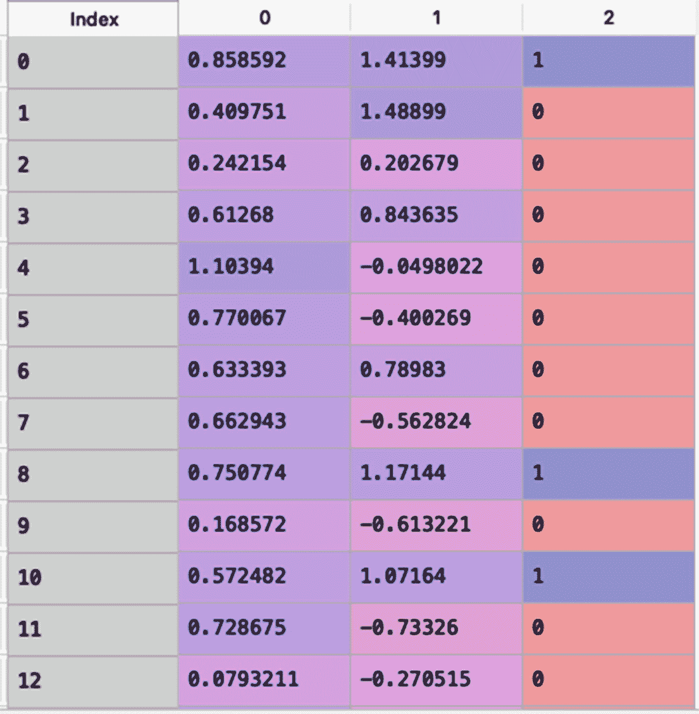
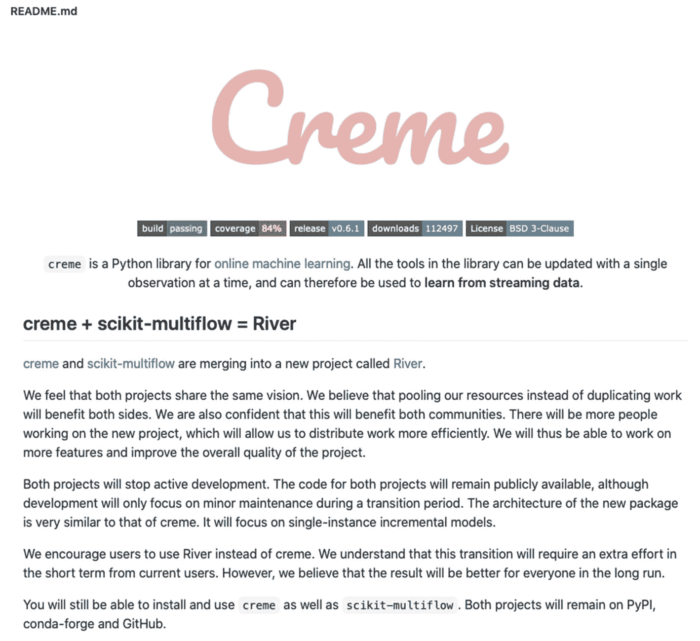
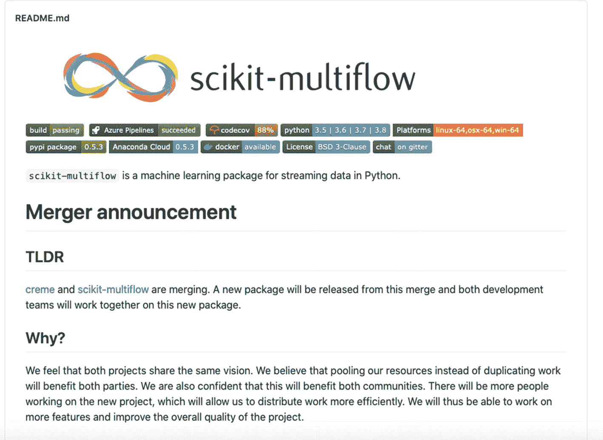

# 四、无监督学习和其他数据流挖掘工具

在第 [3](3.html) 章中，您学习了在流数据环境中用于回归和分类问题的监督机器学习技术。本章从流数据的无监督学习开始，然后概述了可用于数据流挖掘的一些其他软件环境。

## 流数据的无监督学习

在前面的章节中，您了解了针对流数据的概念漂移检测和监督机器学习的各种方法。现在让我们通过首先关注聚类，然后转移到异常检测来看无监督学习。

### 使聚集

k-means 聚类是一种流行的批量数据聚类算法。它将数据划分为不同且不重叠的 k 个簇。目标是具有非常低的*组内变化* [ [1](#Par46) 。该算法为观察值随机分配一个从 1 到 k 的数字。这将创建初始的集群集。为 k 个聚类中的每一个计算聚类质心。基于对聚类质心的接近度(即，距离度量，例如欧几里德距离)的观察被重新分配。重复这些步骤。当集群分配中没有进一步的变化时，迭代停止。(请注意，用户提供了 k 的值。)

*mini-batch k-means 聚类方法*是 k-means 聚类算法的增量学习版本，可以直接应用于数据流。它是 k-means 算法的一种变体，只处理一小批数据，而不是整个数据集。它适用于流数据，因为整个数据集在任何时间点都不可用。小批量是输入数据流的子集。它们是在每次训练迭代中随机采样的。

小批量 k 均值聚类算法选择包括随机采样的样本的小批量。然后执行一般的 k-means 算法，其中分配最近的质心。在下一步中，为小批量中的每个样品更新指定的质心。执行这些步骤，直到达到收敛或特定的迭代次数。

此外，k-means++算法[ [3](#Par48) ]可以用作随机播种技术来选择初始聚类中心的第一个值，而不是使用随机采样来选择初始聚类中心集，这实现了更快的收敛。

scikit-learn (sklearn)库中提供了小批量 k 均值聚类算法。前往 [`https://scikit-learn.org/stable/modules/generated/sklearn.cluster.MiniBatchKMeans.html`](https://scikit-learn.org/stable/modules/generated/sklearn.cluster.MiniBatchKMeans.html) 了解更多信息。

清单 [4-1](#PC1) 对 Iris 数据集应用小批量 k 均值聚类。Iris 数据集在 sklearn 库中公开提供。数据集包含关于萼片和花瓣长度(厘米)和宽度(厘米)的四个特征。清单 [4-1](#PC1) 应用 **MiniBatchKMeans()** ，指定集群数为 3，小批量为 50。清单 [4-1](#PC1) 在 Iris 数据集上训练了小批量 k 均值聚类模型，并在图 [4-1](#Fig1) 中显示了聚类中心。


图 4-1

小批量 k-均值聚类模型的聚类事件

```py
###############################################################
# Import the relevant libraries
from sklearn import datasets
from sklearn.preprocessing import StandardScaler
from sklearn.cluster import MiniBatchKMeans

# Load data
iris = datasets.load_iris()
X = iris.data
#Data snapshot

X[0:6,]
#Output
#array([[5.1, 3.5, 1.4, 0.2],
#       [4.9, 3\. , 1.4, 0.2],
#       [4.7, 3.2, 1.3, 0.2],
#       [4.6, 3.1, 1.5, 0.2],
#       [5\. , 3.6, 1.4, 0.2],
#       [5.4, 3.9, 1.7, 0.4]])

#feature names
iris.feature_names
#Output:
#['sepal length (cm)',
# 'sepal width (cm)',
# 'petal length (cm)',
# 'petal width (cm)']

# Create k-mean object
clust_kmeans = MiniBatchKMeans(n_clusters=3, batch_size=50, random_state=333)

# Train model
model = clust_kmeans.fit(X)

# Figure out the cluster centers

model.cluster_centers_
###############################################################

Listing 4-1Mini-Batch k-means Clustering on the Iris Dataset

```

scikit-learn 提供了小批量 k 均值聚类的替代方法。这种方法被称为*桦树集群* [ [7](#Par52) 。这是一个在线学习算法，它创建一个树形数据结构，从叶子上读取聚类质心。我建议你把这项技术作为练习来探索。有关 scikit-learn 中 Birch 集群的更多信息，请阅读官方文档 [`https://scikit-learn.org/stable/modules/generated/sklearn.cluster.Birch.html`](https://scikit-learn.org/stable/modules/generated/sklearn.cluster.Birch.html) 。

Apache Spark 的机器学习库 MLlib 中有一个*流式 k 均值聚类算法*。这种流式 k 均值聚类算法动态地估计聚类，并在新数据到达时更新聚类。这种算法包含一个称为*半衰期*的参数，它控制估计值的“衰减”。衰减因子决定了需要给过去的数据多少权重。流式 k 均值聚类算法使用小批量 k 均值更新规则的推广。

本书不涉及其他增量聚类算法。

一些最早的流数据在线聚类算法是在 MOA 软件中实现的。一种经过充分研究的数据流聚类方法是微聚类算法，它有两个阶段。第一阶段是在线的，在本地模型(微集群)中总结数据流。第二阶段从微集群生成全局集群模型。CluStream 和 DenStream 是 MOA 中两种基于微集群的在线聚类算法。

接下来将讨论 Apache Spark、MOA 和其他一些数据流挖掘工具。

### 异常检测

*异常检测*(或*异常检测*)是一门识别不同于标准的事件或例子的科学 [4](#Par49) (被称为*异常*)。机器学习文献中充满了异常检测技术，尤其是在批量学习环境中。与这些异常相关的一些独特特征是它们很少出现在数据集中，并且它们的特征不同于正常的例子。异常检测的一些实际应用包括入侵检测、欺诈检测、监控分析、医疗应用和数据泄漏预防。

这一章主要关注*流式半空间树* (SHST)技术，用于流式数据环境中的异常检测。SHST 算法是一种针对流数据的增量式单类异常检测器[ [5](#Par50) ]。这种算法最有用的特征之一是，它可以仅用真实或正常的实例来训练，并且即使在异常极其罕见的情况下也能很好地工作。该方法是半空间树的随机集合。深度为 d 的半空间树(HS-tree)被定义为具有 2^(d+1 1 个节点的完全二叉树，其中所有的叶子都在相同的深度(即 d)。

流式半空间树可以仅从数据空间维度创建树结构，并且不需要实际的训练示例。因此，该方法不需要执行任何模型重构来适应流数据。该模型可以在流数据到达之前部署。此外，SHST 算法具有恒定的内存需求和恒定的分摊时间复杂度。

清单 [4-2](#PC2) 使用 AnomalySineGenerator 生成一个带有异常的数据流，可在 scikit-multiflow 框架中获得。它生成一个包含 500 个观察值的数据流，其中 100 个是异常值。生成的数据流的快照如图 [4-2](#Fig2) 所示。最右边的列指示一个示例是否异常(即，如果其为 1，则它是异常；如果是 0，则正常)。然后，它使用 scikit-multiflow 框架中可用的 HalfSpaceTrees()方法对该数据流应用 SHST 算法。它训练模型并执行预测，如清单 [4-2](#PC2) 所示。



图 4-2

异常数据流的快照

```py
###############################################################
# Import the relevant libraries
import pandas as pd
from skmultiflow.anomaly_detection import HalfSpaceTrees
from skmultiflow.data import AnomalySineGenerator

# Generate a data stream with anomalies
dstream = AnomalySineGenerator(n_samples=500, n_anomalies=100, random_state=333)

# Instantiate the Half-Space Trees estimator
HS_trees = HalfSpaceTrees(random_state=333)

#prep the data stream
dstream.prepare_for_use()
X, Y = dstream.next_sample(500)
data = pd.DataFrame(np.hstack((X, np.array([Y]).T)))
data.head()

# Incrementally fit the model
HS_trees_model= HS_trees.partial_fit(X, Y)

# Predict the classes of the passed observations
pred = HS_trees_model.predict(X)

# Estimate the probability of a sample being anomalous or genuine
prob = HS_trees_model.predict_proba(X)
###############################################################

Listing 4-2Anomaly Detection Using Streaming Half-Space Trees

```

## 数据流挖掘的其他工具和技术

本节提供了八个用于数据流挖掘的开源软件工具的高级介绍:MOA、Apache Spark、Apache Flink、Apache Storm、Apache Kafka、Faust、Creme 和 River。还有其他工具(商业的和开源的)可以用于数据流挖掘，但是它们超出了本书的范围。

### 海量在线分析(MOA)

海量在线分析(MOA)是一个用 Java 开发的用于挖掘数据流的开源框架。MOA 是一个基于 GUI 的工具。它包含一组用于监督(分类、回归等)的流数据算法。)和无监督学习(聚类等。)以及模型评估工具[ [6](#Par51) ]。本书中讨论的大多数监督和非监督学习都可以在 MOA 中找到。

由于 MOA 是基于 GUI 的，并且主要是用 Java 开发的，它可能对 Python 开发人员/用户没有吸引力。我建议您探索这个工具。可以从 [`https://moa.cms.waikato.ac.nz`](https://moa.cms.waikato.ac.nz) 下载。

### 阿帕奇Spark

Apache Spark 是一个软件环境，用于对批处理和流数据进行高速处理和分析。它支持多种语言，如 Java、Python 和 r。这就是为什么 Spark(或 pyspark)是 Python 用户的一个很好的替代选择。Spark 可以访问不同的数据源。它可以运行在云中，也可以运行在 Mesos、Hadoop 和 Kubernetes 上。Spark 的堆栈库包括 Spark SQL、Spark Streaming、MLlib(用于机器学习)和 GraphX(用于图形分析)。要下载最新版本并获取文档，请访问 [`https://spark.apache.org`](https://spark.apache.org) 。

Spark 流是核心 Spark API 的扩展。它是大规模处理数据流的强大工具。它包含许多高级功能，如 map、reduce、join 和 window，用于处理高速数据流。Spark Streaming 支持 MLlib 操作(即流式 k 均值聚类、流式线性回归(为每批数据拟合随机梯度下降的线性回归模型)等)。官方星火流指南在 [`https://spark.apache.org/docs/latest/streaming-programming-guide.html`](https://spark.apache.org/docs/latest/streaming-programming-guide.html) 。

### Apache 很不错

Apache Flink 是一个统一的批处理和流数据分析引擎。它为连续流模式提供了高度灵活的流窗口。它可以大规模执行内存计算。Flink 集成了许多其他开源数据处理生态系统，如 YARN 和 Mesos。Flink 对于异常检测、基于规则的警报、欺诈检测和业务流程监控等事件驱动的应用非常有用。请访问 [`https://flink.apache.org`](https://flink.apache.org) 了解更多关于 Apache Flink 的信息。

### 阿帕奇风暴

Apache Storm 是一个开源的分布式流处理计算框架。它主要是在 Clojure 中开发的，但也支持多种语言，如 Java 和 Python。Apache Storm 是一个非常强大的工具，用于对流式数据进行实时处理。它是一个流处理引擎，不支持批处理。这是一个真正的实时处理框架，将一个流作为一个完整的事件，而不是一系列小的批处理。它是可扩展的，可以在一个机器集群上进行并行计算。

Storm 集群类似于 Hadoop 集群的批处理数据。为了在 Storm 中执行实时计算，您创建了一个*拓扑*，这是一个计算的有向非循环图。拓扑由*流*(即，元组的无界管道)和*喷口*(即，数据流的源)组成。Storm 集群由两个节点组成:主节点和工作节点。主节点向机器分配任务并监控它们的性能。工作者节点将任务分配给其他工作者节点。

要下载 Apache Storm 的最新版本并访问官方文档，请访问 [`https://storm.apache.org/index.html`](https://storm.apache.org/index.html) 。

### 阿帕奇卡夫卡

Apache Kafka 是一个开源的分布式事件流平台。什么是*事件流*？它是为各种来源(数据库、传感器等)捕获实时数据流的现象。)然后存储和处理它们以产生洞察力。事件流的一些真实使用案例包括处理证券交易所的金融交易、分析物联网设备数据、自动驾驶应用、web 分析、日志聚合和实时患者健康监控。官方文档可在 [`https://kafka.apache.org/documentation/`](https://kafka.apache.org/documentation/) 获得。

Apache Kafka 引入了一个强大但轻量级的数据流处理库，称为 Kafka Streams。开发人员可以使用 Kafka 流大规模构建 Java 和 Scala 应用程序。使用它构建的应用程序可以部署到虚拟机、容器或云中。关于卡夫卡作品的文档可以在 [`https://kafka.apache.org/documentation/streams/`](https://kafka.apache.org/documentation/streams/) 找到。

### 浮士德

Faust 是一个用 Python 构建流应用程序的库。它对事件流很有用，类似于 Kafka 流。但是 Faust 允许您使用 Python 语法和 Python 中其他流行的库(如 NumPy、TensorFlow 和 Django)来处理数据流。官方文档可在 [`https://faust.readthedocs.io/en/latest/`](https://faust.readthedocs.io/en/latest/) 获得。也可以在 [`https://github.com/robinhood/faust`](https://github.com/robinhood/faust) 访问其 GitHub 页面。

### 奶油

Creme 是 Python 中在线机器学习的开源库。这是一个用于从流数据中学习的强大工具。它与 scikit-multiflow 框架有许多相似之处。可以使用下面的命令从 PyPI 安装 Creme。

```py
>>> pip install creme

```

请访问的 Creme 的 GitHub 页面进一步探索这个工具- [`https://github.com/MaxHalford/creme`](https://github.com/MaxHalford/creme) 。

### 河

River [ [8](#Par520) ]是一个新的库，用于使用 Python 对流数据进行在线机器学习。它是 Creme 和 scikit-multiflow 合并的结果。在撰写本章时(2020 年 11 月)，两个软件包(Creme 和 scikit-multiflow)的开发者宣布合并，并证明了共同的愿景和目标。图 [4-3](#Fig3) 和 [4-4](#Fig4) 显示了 scikit-multiflow 和 Creme GitHub 页面上的合并公告。这两张截图/图片都拍摄于 2020 年 11 月 22 日。



图 4-4

Creme 的 GitHub 页面中的合并公告截图



图 4-3

scikit-multiflow 的 GitHub 页面上的合并公告截图

合并后的新包装被称为 River。Creme 和 scikit-multiflow 仍在 PyPI、GitHub 和 conda-forge。河流包在 [`https://github.com/online-ml/river`](https://github.com/online-ml/river) 的 GitHub 中有。API 参考文件可在 [`https://riverml.xyz/latest/api/overview/`](https://riverml.xyz/latest/api/overview/) 获得。

在写这一章的时候，River 包太新了，不能进一步讨论。许多功能仍然需要开发。我相信 River 有潜力成为 Python 中的一站式解决方案，用于流数据的在线机器学习。也许我可以在这本书的下一个版本中重点讨论这个包。

## 结论和前进的道路

这本书的目的是介绍使用 Python 的流数据的在线/增量机器学习。实时或接近实时的分析是*下一件大事*(尤其是随着物联网设备、可穿戴设备、传感器等的出现。).许多组织和研究机构都在关注这个问题。

第[章 1](1.html) 解释了用流式数据进行机器学习的不同之处。我们大多数人每天在批处理环境中使用的许多机器学习方法对于数据流挖掘并不有效。

这本书介绍了各种在线/增量学习算法，用于概念漂移检测、监督学习和流数据的非监督学习。鉴于对这些技能的需求，我强烈认为这些技术应该是任何数据科学家、研究人员、机器学习工程师、分析专家或数据科学爱好者的必备技能。

这本书主要关注用于数据流处理的基于 Python 的库(即 scikit-multiflow 框架)。鉴于 Python 是数据科学家使用最广泛的语言，这是有意义的。我在这一章中讨论了相当多的其他工具，并且有大量的书籍和其他资源可用(特别是关于 Spark、Kafka 和 MOA)。然而，很少有书籍涉及流数据的机器学习。这本书是朝着这个方向迈出的一步。

Scikit-multiflow 是一个非常强大的工具，用于在线/增量机器学习流式数据。在本书中，您使用它在流数据环境中实现了各种监督和非监督学习技术。

我建议您从 scikit-multiflow 开始，学习和探索本书中讨论的在线/增量机器学习技术。同样，这个包已经与 Creme 库合并，新的包被称为 River。我建议您一旦熟悉了 scikit-multiflow 框架的本质，就转而使用 River library。请注意，您在 scikit-multiflow 框架中学到的大多数技术应该集成到 River 包中。

同样，在写这一章的时候，River 包还太新，不能进行更详细的讨论。但是我可能会在本书的下一版中介绍这个包或任何其他适合替代 scikit-multiflow 的包。

前进的道路是使用 scikit-multiflow 框架对各种数据流学习各种在线/增量机器学习算法的细微差别，然后继续探索其他基于 Python 的数据流挖掘工具，如 River、Spark 和 Faust。

快乐学习！☺

## 参考

1.  伦纳德·考夫曼和彼得·罗瑟夫。*在数据中寻找群体:聚类分析简介*。威利，1990 年。

2.  D.斯卡利。"网络规模的 K-均值聚类."WWW '10:第 19 届国际万维网会议录。2010 年 4 月。

3.  Bahman Bahmani、Benjamin Moseley、Andrea Vattani、Ravi Kumar 和 Sergei Vassilvitskii。"可伸缩的 K-Means++ . "VLDB 基金会会议录。2012 年 3 月。

4.  马库斯·戈德斯坦和内田正一。"多元数据无监督异常检测算法的比较评估."韦恩州立大学。2016 年 4 月 19 日。 [`https://journals.plos.org/plosone/article?id=10.1371/journal.pone.0152173`](https://journals.plos.org/plosone/article%253Fid%253D10.1371/journal.pone.0152173) 。

5.  南谭超群，丁国明，刘廷芳，"快速异常侦测应用于串流资料之研究"。2011 年国际人工智能联合会议。

6.  A.Bifet，G. Holmes，R. Kirkby 和 B. Pfahringer，“MOA:大规模在线分析”*机器学习研究杂志*，2010 年。

7.  张甜，拉古·拉马克里什南和马龙·利夫尼。" BIRCH:一种用于大型数据库的高效数据聚类方法." [`www.cs.sfu.ca/CourseCentral/459/han/papers/zhang96.pdf`](http://www.cs.sfu.ca/CourseCentral/459/han/papers/zhang96.pdf) 。

8.  Jacob Montiel、max halford、saulo martiello mastelini、Geoffrey Bolmier、raphael sourty、Robin Vaysse、Adil Zouitine、Heitor Murilo Gomes、Jesse Read、Talel Abdessalem 和 albert bifet，“河流:Python 流数据的机器学习”，arXiv，2020 年。